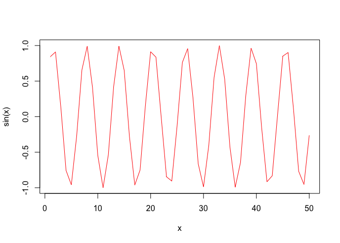
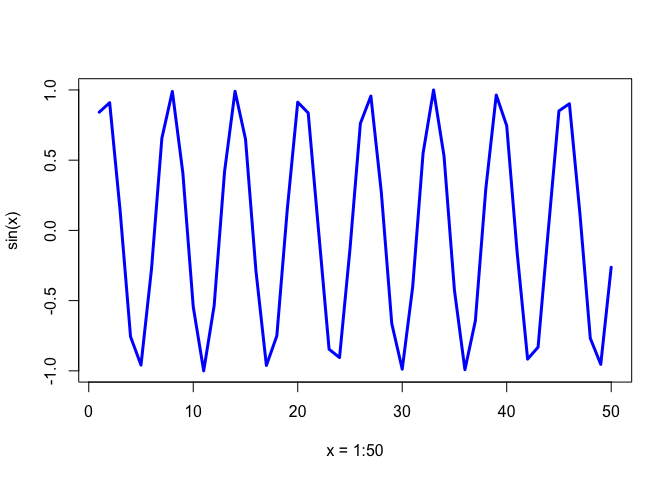

Class 4: R Language Basics
================

Background: R is powerful data programming language that you can use to explore and understand data in an open-ended, highly interactive, iterative way. Learning R will give you the freedom to experiment and problem solve during data analysis — exactly what we need as bioinformaticians.

Simple Calculations

``` r
5+3
```

    ## [1] 8

``` r
5-3
```

    ## [1] 2

``` r
5*3
```

    ## [1] 15

``` r
5/3
```

    ## [1] 1.666667

Object names cannot start with a digit and cannot contain certain other characters such as a comma or a space.

``` r
x <- 3*4
x
```

    ## [1] 12

``` r
seq(1,10)
```

    ##  [1]  1  2  3  4  5  6  7  8  9 10

``` r
seq(1,10, by=2)
```

    ## [1] 1 3 5 7 9

``` r
example(seq)
```

    ## 
    ## seq> seq(0, 1, length.out = 11)
    ##  [1] 0.0 0.1 0.2 0.3 0.4 0.5 0.6 0.7 0.8 0.9 1.0
    ## 
    ## seq> seq(stats::rnorm(20)) # effectively 'along'
    ##  [1]  1  2  3  4  5  6  7  8  9 10 11 12 13 14 15 16 17 18 19 20
    ## 
    ## seq> seq(1, 9, by = 2)     # matches 'end'
    ## [1] 1 3 5 7 9
    ## 
    ## seq> seq(1, 9, by = pi)    # stays below 'end'
    ## [1] 1.000000 4.141593 7.283185
    ## 
    ## seq> seq(1, 6, by = 3)
    ## [1] 1 4
    ## 
    ## seq> seq(1.575, 5.125, by = 0.05)
    ##  [1] 1.575 1.625 1.675 1.725 1.775 1.825 1.875 1.925 1.975 2.025 2.075
    ## [12] 2.125 2.175 2.225 2.275 2.325 2.375 2.425 2.475 2.525 2.575 2.625
    ## [23] 2.675 2.725 2.775 2.825 2.875 2.925 2.975 3.025 3.075 3.125 3.175
    ## [34] 3.225 3.275 3.325 3.375 3.425 3.475 3.525 3.575 3.625 3.675 3.725
    ## [45] 3.775 3.825 3.875 3.925 3.975 4.025 4.075 4.125 4.175 4.225 4.275
    ## [56] 4.325 4.375 4.425 4.475 4.525 4.575 4.625 4.675 4.725 4.775 4.825
    ## [67] 4.875 4.925 4.975 5.025 5.075 5.125
    ## 
    ## seq> seq(17) # same as 1:17, or even better seq_len(17)
    ##  [1]  1  2  3  4  5  6  7  8  9 10 11 12 13 14 15 16 17

Help function

``` r
help(log)
```

Vectors: a container of contiguous data. Values are not stored as scalar; rather, as a vector of length 1.

``` r
length(3.1)
```

    ## [1] 1

``` r
x <- c(56, 95.3, 0.4)
y <- c(3.2, 1.1, 0.2)

x
```

    ## [1] 56.0 95.3  0.4

``` r
y
```

    ## [1] 3.2 1.1 0.2

``` r
x+y
```

    ## [1] 59.2 96.4  0.6

``` r
x-y
```

    ## [1] 52.8 94.2  0.2

``` r
x/y
```

    ## [1] 17.50000 86.63636  2.00000

``` r
sqrt(x)
```

    ## [1] 7.4833148 9.7621719 0.6324555

``` r
round(sqrt(x),3)
```

    ## [1] 7.483 9.762 0.632

``` r
log(x)/2 + 1
```

    ## [1] 3.0126758 3.2785149 0.5418546

``` r
x[2]
```

    ## [1] 95.3

``` r
x[3] <- 0.5
x
```

    ## [1] 56.0 95.3  0.5

``` r
x <- 1:50
plot(x, sin(x), typ="l", col="red")
```



``` r
plot(x, sin(x), typ="l", col="blue", lwd=3, xlab="x = 1:50")
```


