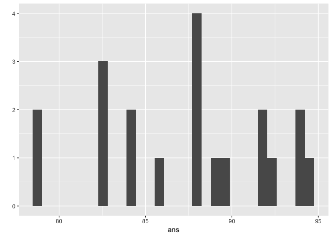

Class 7: R functions and packages
================
Frank Lee
4/24/2019

R Markdown
----------

This is an R Markdown document. Markdown is a simple formatting syntax for authoring HTML, PDF, and MS Word documents. For more details on using R Markdown see <http://rmarkdown.rstudio.com>.

When you click the **Knit** button a document will be generated that includes both content as well as the output of any embedded R code chunks within the document. You can embed an R code chunk like this:

More on function writing
------------------------

First we will revisit our function from last day

``` r
source("http://tinyurl.com/rescale-R")
```

Test the **rescale()** function

``` r
# This code is from the source that we installed
rescale <- function(x, na.rm=TRUE, plot=FALSE, ...) {
   rng <-range(x, na.rm=na.rm)
   answer <- (x - rng[1]) / (rng[2] - rng[1])
   if(plot) {
     plot(answer, ...)
}
   return(answer)
}

rescale(1:10)
```

    ##  [1] 0.0000000 0.1111111 0.2222222 0.3333333 0.4444444 0.5555556 0.6666667
    ##  [8] 0.7777778 0.8888889 1.0000000

``` r
rescale(c(1:10, "string"))
```

``` r
x <- c(1:10, "string")
is.numeric(x)
!is.numeric(x)
```

``` r
# This code is already in the source that we installed
# It uses a stop function
# A warning could have been used to.
# Difference between stop() and warning() is that warning will continue going while stop will terminate the code
rescale2 <- function(x, na.rm=TRUE, plot=FALSE, ...) {
   if( !is.numeric(x) ) {
      stop("Input x should be numeric", call.=FALSE)
   }
   rng <-range(x, na.rm=na.rm)
   answer <- (x - rng[1]) / (rng[2] - rng[1])
   if(plot) {
      plot(answer, ...)
}
   return(answer)
}
```

``` r
rescale2(x)
```

Function practice
-----------------

Write a function to identify NA elements in two vectors

Start with a simple example input where I know what the answer should be

``` r
x <- c(1,2,NA,3,NA)
y <- c(NA,3,NA,3,4)
```

``` r
is.na(x)
```

    ## [1] FALSE FALSE  TRUE FALSE  TRUE

``` r
is.na(y)
```

    ## [1]  TRUE FALSE  TRUE FALSE FALSE

I am looking for he positions where it is TRUE in both vectors

``` r
is.na(x)
```

    ## [1] FALSE FALSE  TRUE FALSE  TRUE

``` r
is.na(y)
```

    ## [1]  TRUE FALSE  TRUE FALSE FALSE

``` r
is.na(x) & is.na(y)
```

    ## [1] FALSE FALSE  TRUE FALSE FALSE

``` r
sum(is.na(x) & is.na(y))
```

    ## [1] 1

This is my working snippet of code that I can use as the body of my first function.

``` r
both_na <-function(x, y) {
  sum(is.na(x) & is.na(y))
}
```

``` r
both_na(x, y)
```

    ## [1] 1

``` r
both_na(c(NA, NA, NA), c(NA, NA, 1))
```

    ## [1] 2

``` r
both_na(c(NA, NA, NA), c(1, NA, NA))
```

    ## [1] 2

``` r
both_na(c(NA,NA,NA), c(1, NA, NA, NA))
```

    ## Warning in is.na(x) & is.na(y): longer object length is not a multiple of
    ## shorter object length

    ## [1] 3

``` r
both_na(c(1, NA, NA), c(1, NA, NA, NA, NA, NA))
```

    ## [1] 4

Check if the length of our inputs are equal

``` r
x <- c(NA, NA, NA)
y <- c(1, NA, NA, NA, NA, NA)
length(x) != length(y)
```

    ## [1] TRUE

``` r
3 != 2
```

    ## [1] TRUE

``` r
both_na2 <- function(x, y) {
  if(length(x) != length(y)) {
   stop("Input x and y should be the same length")
}
  sum( is.na(x) & is.na(y) )
}
```

Let's try to both\_na3() function with extra features

``` r
both_na3 <- function(x, y) {

  if(length(x) != length(y)) {
    stop("Input x and y should be vectors of the same length")
  }
  
  na.in.both <- ( is.na(x) & is.na(y) )
  na.number  <- sum(na.in.both)
  na.which   <- which(na.in.both)
  message("Found ", na.number, " NA's at position(s):",
          paste(na.which, collapse=", ") )
  
  return( list(number=na.number, which=na.which) )
}

x <- c(1, 2, NA, 3, NA)
y <-  c(NA, 3, NA, 3, NA)
both_na3(x, y)
```

    ## Found 2 NA's at position(s):3, 5

    ## $number
    ## [1] 2
    ## 
    ## $which
    ## [1] 3 5

``` r
which(c(F,F,F,T))
```

    ## [1] 4

PRACTICE (my brainstorm)

``` r
x <- c(100, 100, 100, 100, 100, 100, 90)
min(x)
```

    ## [1] 90

``` r
sum(x)
```

    ## [1] 690

``` r
sum(x) - min(x)
```

    ## [1] 600

``` r
(sum(x) - min(x))/(length(x)-1)
```

    ## [1] 100

This grade function takes the sum of the grades, subtracts the sum by the minimum value, and then divides it by the total number of entries minus 1 (since the lowest grade is dropped)

``` r
grade <- function(x) {
    (sum(x) - min(x))/(length(x)-1)
}
```

To create a function when you have the body, you could go to CODE --&gt; EXTRACT FUNCTION

``` r
grade1 <- function(x) {
  (sum(x) - min(x))/(length(x)-1)
}
```

Now we'll test out this grade function

``` r
x <- c(100, 100, 100, 100, 100, 100, 90)
grade(x)
```

    ## [1] 100

But what happens when there's an NA? The sum of the vector becomes NA. The length is okay though; only sum is the issue. To combat this, I should change the NA values to 0.

``` r
y <- c(100, NA, 90, 90, 90, 90, 97, 80)
is.na(min(y))
```

    ## [1] TRUE

``` r
sum(y)
```

    ## [1] NA

``` r
length(y)
```

    ## [1] 8

``` r
grade(y)
```

    ## [1] NA

``` r
min(y)
```

    ## [1] NA

``` r
is.na(min(y))
```

    ## [1] TRUE

``` r
#grade(y)
```

Okay, let's restart our brainstorm here. Let's go through each value in the vector and then replace each NA spot with 0 by assigning that spot as a new value.

``` r
a <-c(NA, NA, 100, 100, 100)

for (c in 1:length(a)) {
  spot <- a[c]
  if (is.na(spot)) {
    a[c] <-  0
  }
}
```

The code above worked! Let's put that into our new grade2 function. This new grade function replaces each NA spot with a 0. With the new vector, we will grade it just like we did in the first grade functino.

``` r
grade2 <- function(x) {
  
  for (c in 1:length(x)) {
    spot <- x[c]
    if (is.na(spot)) {
      x[c] <-  0
    }
  }

  (sum(x) - min(x))/(length(x)-1)
}
```

``` r
grade2(a)
```

    ## [1] 75

``` r
grade2(x)
```

    ## [1] 100

``` r
grade2(y)
```

    ## [1] 91

``` r
url <- "https://tinyurl.com/gradeinput"
```

First, we have to read the table from the csv data that we downloaded from the website.

``` r
studentdata <-read.table("student_homework (2).csv", header = TRUE, sep = ",")
```

Instead of using read.table with all those arguments, we could do read.csv. We could also do row.names = 1 so that the first column becomes the row names

``` r
students <- read.csv(url, row.names = 1) 
grade2(students[1,])
```

    ## [1] 91.75

``` r
ans <- apply(students, 1, grade2)
```

``` r
sort(ans, decreasing = TRUE)
```

    ## student-18  student-7  student-8 student-13  student-1 student-12 
    ##      94.50      94.00      93.75      92.25      91.75      91.75 
    ## student-16  student-6  student-5 student-17  student-9 student-14 
    ##      89.50      89.00      88.25      88.00      87.75      87.75 
    ## student-11  student-3  student-4 student-19 student-20  student-2 
    ##      86.00      84.25      84.25      82.75      82.75      82.50 
    ## student-10 student-15 
    ##      79.00      78.75

Let's move on to the last part of class wooooo
==============================================

One last function example
-------------------------

Find the intersectino of two sets

``` r
x <- df1$IDs
y <- df2$IDs

intersect(x,y)
```

    ## [1] "gene2" "gene3"

``` r
x
```

    ## [1] "gene1" "gene2" "gene3"

``` r
y
```

    ## [1] "gene2" "gene4" "gene3" "gene5"

``` r
x%in%y
```

    ## [1] FALSE  TRUE  TRUE

``` r
x[x%in%y]
```

    ## [1] "gene2" "gene3"

``` r
y%in%x
```

    ## [1]  TRUE FALSE  TRUE FALSE

``` r
y[y%in%x]
```

    ## [1] "gene2" "gene3"

cbind = column bind

``` r
gene_intersect <- function(x, y) {
  cbind(x[x%in%y], 
        y[y%in%x])
}
```

``` r
merge(df1, df2, by="IDs")
```

    ##     IDs exp.x exp.y
    ## 1 gene2     1    -2
    ## 2 gene3     1     1

Don't do this! Install the package in the console. \# `{r} # if (!requireNamespace("BiocManager")) #     install.packages("BiocManager") # BiocManager::install() #`

``` r
library(ggplot2)
qplot(ans)
```

    ## `stat_bin()` using `bins = 30`. Pick better value with `binwidth`.



``` r
ans
```

    ##  student-1  student-2  student-3  student-4  student-5  student-6 
    ##      91.75      82.50      84.25      84.25      88.25      89.00 
    ##  student-7  student-8  student-9 student-10 student-11 student-12 
    ##      94.00      93.75      87.75      79.00      86.00      91.75 
    ## student-13 student-14 student-15 student-16 student-17 student-18 
    ##      92.25      87.75      78.75      89.50      88.00      94.50 
    ## student-19 student-20 
    ##      82.75      82.75
