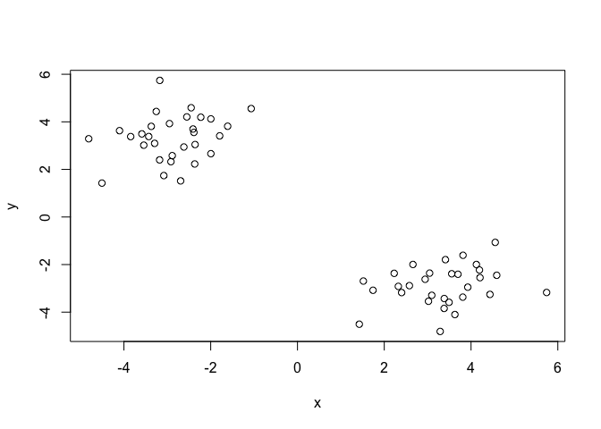
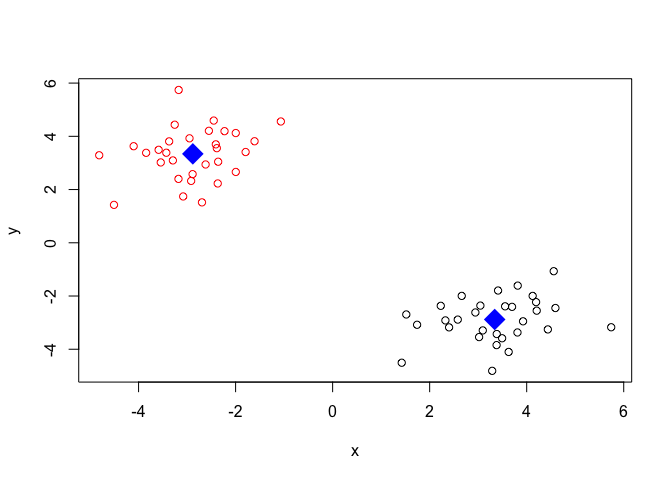
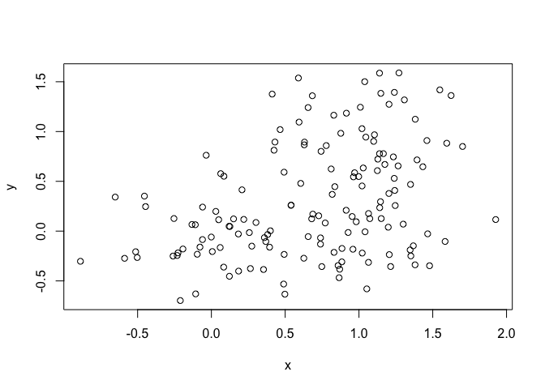
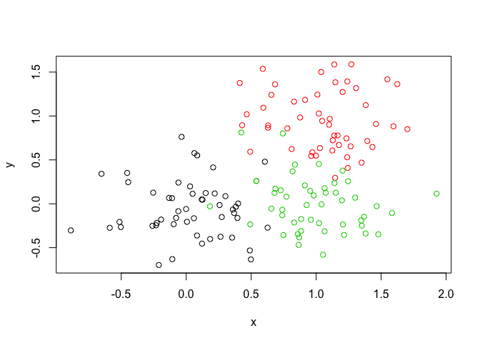
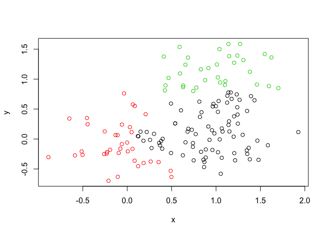

Class 08: Machine Learning
================
Frank Lee
4/26/2019

Kmeans clustering
-----------------

Let's try out the **kmeans()** function in R with some made-up data kmeans(x, center (aka the number of groups), nstart (number of iterations))

Generate some example data for clustering Remember that rnorm produces a random normal distribution of 30 samples with a mean of 3 or -3 (a third value would have been the standard deviation)

``` r
tmp <- c(rnorm(30,-3), rnorm(30,3))
x <- cbind(x=tmp, y=rev(tmp))
plot(x)
```



Use the kmeans() function setting k to 2 and nstart=20 Inspect/print the results Q. How many points are in each cluster? 30 and 30

``` r
km <- kmeans(x, centers = 2, 20)
km
```

    ## K-means clustering with 2 clusters of sizes 30, 30
    ## 
    ## Cluster means:
    ##           x         y
    ## 1  3.340508 -2.881680
    ## 2 -2.881680  3.340508
    ## 
    ## Clustering vector:
    ##  [1] 2 2 2 2 2 2 2 2 2 2 2 2 2 2 2 2 2 2 2 2 2 2 2 2 2 2 2 2 2 2 1 1 1 1 1
    ## [36] 1 1 1 1 1 1 1 1 1 1 1 1 1 1 1 1 1 1 1 1 1 1 1 1 1
    ## 
    ## Within cluster sum of squares by cluster:
    ## [1] 47.60796 47.60796
    ##  (between_SS / total_SS =  92.4 %)
    ## 
    ## Available components:
    ## 
    ## [1] "cluster"      "centers"      "totss"        "withinss"    
    ## [5] "tot.withinss" "betweenss"    "size"         "iter"        
    ## [9] "ifault"

``` r
km$size
```

    ## [1] 30 30

Q. What ‘component’ of your result object details - cluster size?
- cluster assignment/membership? - cluster center?

``` r
# Determines cluster size
km$size
```

    ## [1] 30 30

``` r
# Determines cluster assignment/membership
km$cluster
```

    ##  [1] 2 2 2 2 2 2 2 2 2 2 2 2 2 2 2 2 2 2 2 2 2 2 2 2 2 2 2 2 2 2 1 1 1 1 1
    ## [36] 1 1 1 1 1 1 1 1 1 1 1 1 1 1 1 1 1 1 1 1 1 1 1 1 1

``` r
# Table should tell us how many 1's and 2's exist
table(km$cluster)
```

    ## 
    ##  1  2 
    ## 30 30

``` r
# Determines cluster centers
km$centers
```

    ##           x         y
    ## 1  3.340508 -2.881680
    ## 2 -2.881680  3.340508

Plot x colored by the kmeans cluster assignment and add cluster centers as blue points

``` r
# We are setting the color based on cluster assignment/membership
plot(x, col=km$cluster)

# This code shows us the points of the centers
points(km$centers, col="blue", pch=18, cex=3)
```



Hierarchal Clustering
---------------------

Here we don't have to spell out k (the number of clusters) beforehand but we do have to give it a distance matrix as the input.

``` r
d <-dist(x) # distance matrix
hc <- hclust(d)
hc
```

    ## 
    ## Call:
    ## hclust(d = d)
    ## 
    ## Cluster method   : complete 
    ## Distance         : euclidean 
    ## Number of objects: 60

Let's plot the results

``` r
plot(hc)
abline(h=6, col="red")
```


``` r
cutree(hc, h=6)
```

    ##  [1] 1 1 1 1 1 1 1 1 1 1 1 1 1 1 1 1 1 1 1 1 1 1 1 1 1 1 1 1 1 1 2 2 2 2 2
    ## [36] 2 2 2 2 2 2 2 2 2 2 2 2 2 2 2 2 2 2 2 2 2 2 2 2 2

What if we made three clusters?

``` r
gp3 <- cutree(hc, k=3)
gp3
```

    ##  [1] 1 1 1 1 1 1 1 1 1 1 1 1 1 1 1 1 1 1 1 1 1 1 1 1 1 1 1 1 1 1 2 2 2 2 2
    ## [36] 2 3 3 3 3 3 3 3 3 3 2 2 3 3 2 3 2 2 3 3 3 3 3 3 3

``` r
table(gp3)
```

    ## gp3
    ##  1  2  3 
    ## 30 11 19

How about two clusters?

``` r
gp2 <- cutree(hc, k=2)
gp2
```

    ##  [1] 1 1 1 1 1 1 1 1 1 1 1 1 1 1 1 1 1 1 1 1 1 1 1 1 1 1 1 1 1 1 2 2 2 2 2
    ## [36] 2 2 2 2 2 2 2 2 2 2 2 2 2 2 2 2 2 2 2 2 2 2 2 2 2

``` r
table(gp2)
```

    ## gp2
    ##  1  2 
    ## 30 30

30 of the samples in group1 of gp2 are in group1 of gp3 28 of the samples in group2 of gp2 are in group2 of gp3 2 of the samples in group2 of gp2 are in group3 of gp3

``` r
table(gp2, gp3)
```

    ##    gp3
    ## gp2  1  2  3
    ##   1 30  0  0
    ##   2  0 11 19

Now let's try a more real-life like example to see how our clustering looks.

``` r
# Step 1. Generate some example data for clustering
x <- rbind(
  matrix(rnorm(100, mean=0, sd = 0.3), ncol = 2),   # c1
  matrix(rnorm(100, mean = 1, sd = 0.3), ncol = 2), # c2
  matrix(c(rnorm(50, mean = 1, sd = 0.3),           # c3
           rnorm(50, mean = 0, sd = 0.3)), ncol = 2))
colnames(x) <- c("x", "y")
# Step 2. Plot the data without clustering
plot(x)
```



``` r
# Step 3. Generate colors for known clusters
#         (just so we can compare to hclust results)
col <- as.factor( rep(c("c1","c2","c3"), each=50) )
plot(x, col=col)
```



Q. Use the dist(), hclust(), plot() and cutree() functions to return 2 and 3 clusters

``` r
# For 2 clusters
dist <- dist(x)
hclust <- hclust(dist)
plot2 <- plot(hclust)
abline(h = 1.8, col="red")
```


``` r
cutree2 <- cutree(hclust, k=2)
cutree2
```

    ##   [1] 1 1 2 2 2 2 2 2 2 2 2 1 2 1 1 2 2 2 2 2 2 2 2 2 2 2 2 1 1 2 2 2 1 2 1
    ##  [36] 1 2 2 1 1 2 1 2 1 2 2 2 2 2 2 1 1 1 1 1 1 1 1 1 1 1 1 1 1 1 1 1 1 1 1
    ##  [71] 1 1 1 1 1 1 1 1 1 1 1 1 1 1 1 1 1 1 1 1 1 1 1 1 1 1 1 1 1 1 1 1 1 1 1
    ## [106] 1 1 1 1 1 1 1 1 1 1 1 1 1 1 1 1 1 1 1 1 1 1 1 1 1 1 1 1 1 1 1 1 1 1 1
    ## [141] 1 1 1 1 1 1 1 1 1 1

``` r
table2 <- table(cutree2)
table2
```

    ## cutree2
    ##   1   2 
    ## 114  36

``` r
#For 3 clusters
cutree3 <- cutree(hclust, k=3)
cutree3
```

    ##   [1] 1 1 2 2 2 2 2 2 2 2 2 1 2 1 1 2 2 2 2 2 2 2 2 2 2 2 2 1 1 2 2 2 1 2 1
    ##  [36] 1 2 2 1 1 2 1 2 1 2 2 2 2 2 2 3 3 3 3 3 3 3 3 3 1 1 3 3 1 1 1 1 3 3 3
    ##  [71] 3 3 3 3 1 3 3 1 1 1 3 1 1 3 1 1 1 3 3 3 3 1 1 1 3 3 3 1 3 3 1 1 1 1 1
    ## [106] 1 1 1 1 1 1 1 1 1 1 1 1 1 1 1 1 1 1 1 1 1 1 1 1 1 1 1 1 3 1 1 1 3 1 1
    ## [141] 1 1 1 1 1 1 1 1 1 1

``` r
table3 <- table(cutree3)
table3
```

    ## cutree3
    ##  1  2  3 
    ## 81 36 33

``` r
table(cutree2, cutree3)
```

    ##        cutree3
    ## cutree2  1  2  3
    ##       1 81  0 33
    ##       2  0 36  0

Q. How does this compare to your known 'col' groups?

``` r
plot(x, col=cutree3)
```



Principal Component Analysis (PCA)
----------------------------------

Let's get some RNASeq data to play with

``` r
mydata <- read.csv("https://tinyurl.com/expression-CSV",
                  row.names=1)
head(mydata)
```

    ##        wt1 wt2  wt3  wt4 wt5 ko1 ko2 ko3 ko4 ko5
    ## gene1  439 458  408  429 420  90  88  86  90  93
    ## gene2  219 200  204  210 187 427 423 434 433 426
    ## gene3 1006 989 1030 1017 973 252 237 238 226 210
    ## gene4  783 792  829  856 760 849 856 835 885 894
    ## gene5  181 249  204  244 225 277 305 272 270 279
    ## gene6  460 502  491  491 493 612 594 577 618 638

``` r
# How many genes are in this dataset?
ngenes <- nrow(mydata)
```

There are 'r nrow(mydata)' genes in this dataset. We can include R code in our text by typing 'r (insert function here)'.

Let's do PCA NOTE: prcomp() expects the samples to be rows and genes to be columns so we need to first transpose the matrix with the t() function!

``` r
# t = transpose
# Now your genes (which were originally rows) are now columns
t(mydata)
```

    ##     gene1 gene2 gene3 gene4 gene5 gene6 gene7 gene8 gene9 gene10 gene11
    ## wt1   439   219  1006   783   181   460    27   175   658    121    337
    ## wt2   458   200   989   792   249   502    30   182   669    116    337
    ## wt3   408   204  1030   829   204   491    37   184   653    134    330
    ## wt4   429   210  1017   856   244   491    29   166   633    117    322
    ## wt5   420   187   973   760   225   493    34   180   657    133    313
    ## ko1    90   427   252   849   277   612   304   255   628    931    100
    ## ko2    88   423   237   856   305   594   304   291   627    941     95
    ## ko3    86   434   238   835   272   577   285   305   603    990     94
    ## ko4    90   433   226   885   270   618   311   271   635    982    101
    ## ko5    93   426   210   894   279   638   285   269   620    934     79
    ##     gene12 gene13 gene14 gene15 gene16 gene17 gene18 gene19 gene20 gene21
    ## wt1    214    789    458    551    390    900    951    436    244    119
    ## wt2    194    738    490    555    400    970    991    414    266     87
    ## wt3    213    807    493    527    403    905    991    388    228     87
    ## wt4    192    768    446    552    402    850    983    418    223     88
    ## wt5    207    820    496    503    401    834    984    410    240     93
    ## ko1     97    293    694    712    755    353    217    162    540    914
    ## ko2     91    308    682    742    765    380    195    169    536    906
    ## ko3     89    312    679    718    730    380    195    143    577    914
    ## ko4    124    303    702    808    713    385    196    151    538    913
    ## ko5     97    325    719    739    740    386    197    130    513    921
    ##     gene22 gene23 gene24 gene25 gene26 gene27 gene28 gene29 gene30 gene31
    ## wt1    156     89    570    788   1007    937    224    809    624    218
    ## wt2    170     97    567    796    972    876    232    869    598    259
    ## wt3    150     96    563    766    977    901    231    815    587    213
    ## wt4    167     97    587    778   1003    958    238    788    552    204
    ## wt5    155     82    563    825   1027    957    226    781    592    213
    ## ko1    346    788    424    456    945    414    850    482    956     69
    ## ko2    372    786    481    403    859    405    902    484    985     86
    ## ko3    393    750    489    446    933    383    907    518    940     59
    ## ko4    416    822    456    447    844    437    842    498    963     65
    ## ko5    384    785    465    442    925    394    817    491    982     46
    ##     gene32 gene33 gene34 gene35 gene36 gene37 gene38 gene39 gene40 gene41
    ## wt1    906    262    155    100    117    286    321    388    606    379
    ## wt2    798    291    172    104    147    262    353    372    576    377
    ## wt3    828    258    173     94    120    260    334    345    558    362
    ## wt4    874    271    173    114    147    270    340    373    581    346
    ## wt5    890    279    192     90    145    293    316    359    574    354
    ## ko1    541    534    643    212    353    360    642     50    415    991
    ## ko2    626    566    639    228    347    375    575     45    406   1010
    ## ko3    576    570    713    233    371    361    588     39    423   1020
    ## ko4    607    565    706    229    335    348    595     44    455    976
    ## ko5    586    563    676    258    357    374    665     35    412   1036
    ##     gene42 gene43 gene44 gene45 gene46 gene47 gene48 gene49 gene50 gene51
    ## wt1    471    592    755     35    758     24    100    809    955    453
    ## wt2    492    615    733     40    734     25    113    825    994    419
    ## wt3    473    602    775     28    704     12    136    833    994    443
    ## wt4    470    602    687     25    761     13    117    800    975    459
    ## wt5    471    655    776     32    672     22    103    776    973    469
    ## ko1    401    514    255    947    567    324    912    538    175    174
    ## ko2    401    554    245    988    575    293    940    524    158    134
    ## ko3    426    501    251    994    596    292    901    487    191    166
    ## ko4    425    511    249    989    607    303    950    527    218    148
    ## ko5    418    553    252    971    611    295    868    507    183    154
    ##     gene52 gene53 gene54 gene55 gene56 gene57 gene58 gene59 gene60 gene61
    ## wt1    327    657    678    304    659    673    785    501    232    928
    ## wt2    320    669    638    325    687    668    772    513    228    936
    ## wt3    324    631    676    312    659    694    817    462    193   1015
    ## wt4    321    701    683    327    667    699    766    484    247    971
    ## wt5    318    647    671    320    639    726    784    504    231    964
    ## ko1    489    246    259    819    109     18    467     37    997    428
    ## ko2    470    276    247    802    102     14    474     64    983    457
    ## ko3    495    255    238    773    105     19    460     71    997    447
    ## ko4    451    266    214    790    119     18    461     58    990    434
    ## ko5    457    287    235    820     96     14    481     50   1011    431
    ##     gene62 gene63 gene64 gene65 gene66 gene67 gene68 gene69 gene70 gene71
    ## wt1    159    336    968    339     35     27     80    744    766    672
    ## wt2    169    344    888    335     32     28     69    685    739    736
    ## wt3    163    372    907    373     45     25     87    733    751    672
    ## wt4    151    389    914    338     37     35     87    693    720    715
    ## wt5    166    357    883    328     38     27     81    746    738    693
    ## ko1    869    664    886    275    765    200    693    745    645    839
    ## ko2    975    575    855    290    746    194    693    680    603    872
    ## ko3    955    577    844    270    756    189    677    780    610    909
    ## ko4    929    625    848    303    758    181    683    791    598    811
    ## ko5    948    630    862    280    761    173    688    792    612    803
    ##     gene72 gene73 gene74 gene75 gene76 gene77 gene78 gene79 gene80 gene81
    ## wt1    526    627    468    986    348    719    883    837    666    804
    ## wt2    553    650    466    945    333    714    899    883    657    735
    ## wt3    534    664    477   1006    344    734    868    864    719    771
    ## wt4    511    622    469   1020    321    693    873    807    656    763
    ## wt5    529    606    494   1024    296    682    882    854    638    813
    ## ko1    922    805    703    359    770    620    803    210    549    613
    ## ko2    819    836    661    358    773    567    765    239    588    587
    ## ko3    878    836    669    346    750    582    767    234    586    591
    ## ko4    832    828    632    356    769    614    783    258    571    563
    ## ko5    853    800    640    345    774    546    749    220    583    613
    ##     gene82 gene83 gene84 gene85 gene86 gene87 gene88 gene89 gene90 gene91
    ## wt1    476    438    938     29    810    575    451    174    158    371
    ## wt2    494    430    934     29    830    579    471    170    122    367
    ## wt3    521    477    976     30    760    567    494    205    138    369
    ## wt4    494    457    965     19    796    565    447    175    159    339
    ## wt5    482    481    960     21    807    576    470    179    128    360
    ## ko1    183    466    904    618    486    352    540    298    863    103
    ## ko2    184    525   1011    589    542    321    583    290    896     85
    ## ko3    156    518    949    618    507    296    572    319    869     83
    ## ko4    173    474    947    563    471    332    551    313    841     94
    ## ko5    161    478    934    574    543    311    591    264    873     70
    ##     gene92 gene93 gene94 gene95 gene96 gene97 gene98 gene99 gene100
    ## wt1    853    208    555    527    589    396     33    321      25
    ## wt2    798    214    584    573    607    384     27    343      34
    ## wt3    866    200    574    548    579    382     39    349      34
    ## wt4    843    196    599    548    536    399     42    367      36
    ## wt5    823    206    581    552    583    401     33    343      32
    ## ko1    934    409    292    686    497    460    977    949     661
    ## ko2   1007    408    341    718    479    442   1031    947     685
    ## ko3    936    403    335    705    479    466   1033    982     678
    ## ko4    918    368    324    704    467    452   1003   1021     655
    ## ko5   1005    380    299    677    504    457    974   1010     693

``` r
pca <- prcomp(t(mydata), scale = TRUE)
head(pca)
```

    ## $sdev
    ##  [1] 9.623734e+00 1.519849e+00 1.057866e+00 1.052033e+00 8.806163e-01
    ##  [6] 8.254517e-01 8.011116e-01 6.206451e-01 6.034223e-01 3.348364e-15
    ## 
    ## $rotation
    ##                  PC1           PC2           PC3           PC4
    ## gene1   -0.103666005  0.0041998528  1.681018e-02 -0.0400873337
    ## gene2    0.103514749  0.0262608225  2.640622e-02  0.0305921681
    ## gene3   -0.103761385 -0.0144849026  2.668104e-03  0.0081850075
    ## gene4    0.075320862 -0.0463694299  4.433720e-01  0.3069775803
    ## gene5    0.087428334 -0.1741594374  1.205184e-01 -0.3448068218
    ## gene6    0.099670829  0.0465122986  1.223749e-01 -0.0174274757
    ## gene7    0.103609009  0.0061228220  3.239851e-02 -0.0073582305
    ## gene8    0.100759370 -0.0876764723 -8.409933e-02  0.0084857868
    ## gene9   -0.085460936  0.0758021460  2.225346e-01 -0.2009424414
    ## gene10   0.103783379  0.0082840559 -2.049816e-03  0.0164287021
    ## gene11  -0.103719665 -0.0012793155  2.720853e-02 -0.0154190000
    ## gene12  -0.102001924  0.0305389988  4.592960e-02  0.1053437560
    ## gene13  -0.103399591 -0.0222561053 -5.761585e-02  0.0541561557
    ## gene14   0.102478762  0.0302536287  1.164708e-02  0.0023477923
    ## gene15   0.099993193  0.0178998003  2.055467e-01  0.0504400514
    ## gene16   0.103598474 -0.0103141833 -3.496931e-03 -0.0348168938
    ## gene17  -0.103013773 -0.0072505473  5.945251e-02 -0.0264209692
    ## gene18  -0.103774699 -0.0121606479 -2.576304e-03 -0.0125996283
    ## gene19  -0.103390599 -0.0086488160 -1.091989e-03 -0.0474315888
    ## gene20   0.103121803  0.0180302741 -2.475444e-02 -0.0516494468
    ## gene21   0.103787935  0.0204607746  1.554369e-03  0.0077857617
    ## gene22   0.102725125  0.0019104392  5.553309e-02  0.0401373008
    ## gene23   0.103681565  0.0154856533  4.480013e-02  0.0043208738
    ## gene24  -0.098284250 -0.1414239302 -4.835175e-02  0.0620714404
    ## gene25  -0.103302326  0.0354055029 -5.148691e-02 -0.0251238158
    ## gene26  -0.085745836  0.1647495874 -4.003583e-01 -0.0286103319
    ## gene27  -0.103374849 -0.0069715410 -1.546843e-02  0.0228376680
    ## gene28   0.103638752 -0.0215349592 -1.547582e-02 -0.0193954592
    ## gene29  -0.102739689 -0.0001093090  3.730029e-02 -0.0435770803
    ## gene30   0.103044435  0.0162628338  1.392149e-02 -0.0006574407
    ## gene31  -0.101768804 -0.0344459201  6.076867e-02 -0.1517332137
    ## gene32  -0.100677376 -0.0621394552 -5.828390e-02  0.0910263462
    ## gene33   0.103592988 -0.0105471373  7.383923e-03 -0.0215752851
    ## gene34   0.103525731  0.0158309318 -1.113415e-02  0.0301088633
    ## gene35   0.102382706  0.0023712606  4.140746e-02  0.0552796570
    ## gene36   0.103412422  0.0060691377 -4.220432e-02 -0.0526948600
    ## gene37   0.100467583 -0.0096404975 -1.485354e-01 -0.0095463269
    ## gene38   0.102080752  0.0796448670  4.668636e-02 -0.0098089178
    ## gene39  -0.103744482  0.0045568817  2.615448e-03 -0.0222520335
    ## gene40  -0.102003831  0.0511647011  3.679754e-02  0.0422002347
    ## gene41   0.103716818  0.0117599146 -7.139583e-03  0.0015017014
    ## gene42  -0.098746675  0.0278268868  5.217223e-02  0.0050749991
    ## gene43  -0.092001819 -0.1270949250 -1.137152e-01 -0.1104566126
    ## gene44  -0.103504699 -0.0037099172 -4.445367e-02  0.0174618035
    ## gene45   0.103840183  0.0032677489  6.751089e-03  0.0029118961
    ## gene46  -0.096571619  0.0433705472  1.597474e-01  0.1043263268
    ## gene47   0.103502386  0.0429423245  1.009689e-02 -0.0315251351
    ## gene48   0.103682769 -0.0043841753  3.370447e-02 -0.0012646184
    ## gene49  -0.103188532 -0.0025700478  8.554684e-02 -0.0151383987
    ## gene50  -0.103743341 -0.0068613634  1.083808e-02  0.0079017082
    ## gene51  -0.103265591  0.0162003991 -7.237098e-02  0.0236954316
    ## gene52   0.102519795  0.0236440060 -7.650467e-02 -0.0378687503
    ## gene53  -0.103245619 -0.0248408452  2.634062e-02 -0.0069869895
    ## gene54  -0.103584153 -0.0150762696 -3.559554e-02  0.0116052801
    ## gene55   0.103695870  0.0177887386  2.060975e-02 -0.0198839436
    ## gene56  -0.103783479 -0.0066176872  2.450131e-02 -0.0151062037
    ## gene57  -0.103703675 -0.0178547138 -2.933228e-02  0.0061090134
    ## gene58  -0.103503980 -0.0220420088 -1.054998e-02  0.0404348016
    ## gene59  -0.103607438 -0.0163545075 -2.175728e-02 -0.0298192340
    ## gene60   0.103805515  0.0209435507  8.750169e-04 -0.0061934233
    ## gene61  -0.103308945 -0.0491951171 -1.019799e-02  0.0330856979
    ## gene62   0.103713893 -0.0203867411  1.667188e-04  0.0097197017
    ## gene63   0.101468649  0.0790783469  6.135882e-02  0.0181085271
    ## gene64  -0.078643996  0.1973838533  3.030327e-02  0.1494469104
    ## gene65  -0.094219475 -0.0912614907  2.347099e-01  0.2160610168
    ## gene66   0.103845454  0.0174126434  5.653162e-03  0.0061226005
    ## gene67   0.103453646  0.0045005847 -2.463217e-03 -0.0477081276
    ## gene68   0.103839510  0.0084779808  7.759101e-03  0.0053000299
    ## gene69   0.048197107  0.3382284557 -2.412572e-01  0.5338731531
    ## gene70  -0.101365212  0.0838144481 -5.846625e-02 -0.0139986566
    ## gene71   0.095664760 -0.0922410436 -9.694116e-02 -0.2173291686
    ## gene72   0.102347342  0.0817281672 -3.338927e-02 -0.0622732648
    ## gene73   0.102001050 -0.0447953803  7.475967e-02  0.0128421661
    ## gene74   0.101747637  0.0305850868 -1.012645e-01 -0.0823072451
    ## gene75  -0.103592371 -0.0224442979 -2.724612e-02  0.0240991482
    ## gene76   0.103514464  0.0178695785  4.630953e-02  0.0155168814
    ## gene77  -0.097473626  0.0846018210  1.266348e-01  0.0012635530
    ## gene78  -0.100499426  0.0789419015  3.615472e-02 -0.1674404462
    ## gene79  -0.103639415 -0.0199674783  9.666381e-03 -0.0111078974
    ## gene80  -0.093476477 -0.1356720549  7.098727e-02  0.2417740332
    ## gene81  -0.100659777  0.0331143580 -1.819483e-01  0.0500866134
    ## gene82  -0.103481127 -0.0311424266  3.190314e-02 -0.0029357060
    ## gene83   0.066065263 -0.4085578114 -3.821719e-01  0.1368945485
    ## gene84  -0.009263882 -0.6342794983  1.571527e-02  0.1661011072
    ## gene85   0.103698370  0.0176538324 -2.006515e-02 -0.0191353964
    ## gene86  -0.102122719 -0.0390750828 -3.554197e-02 -0.0708696251
    ## gene87  -0.103448562  0.0213539470  2.682192e-02 -0.0487617089
    ## gene88   0.098226585 -0.1088627079 -3.192910e-02  0.0753863801
    ## gene89   0.100038548 -0.0112867314 -1.286266e-02  0.0664434087
    ## gene90   0.103777744 -0.0012845111 -4.108083e-04  0.0061816698
    ## gene91  -0.103698408  0.0084542821  1.826177e-04 -0.0177477329
    ## gene92   0.092534408 -0.1313040655 -1.619390e-02  0.1816368351
    ## gene93   0.102950950  0.0007911228 -4.591574e-02 -0.0833644300
    ## gene94  -0.102692869 -0.0790761495 -5.754168e-05 -0.0194979942
    ## gene95   0.102142492 -0.0669992711  4.367738e-02 -0.1003173743
    ## gene96  -0.096658194  0.0866844285 -5.433340e-02 -0.1248824689
    ## gene97   0.100787961  0.0891876374 -1.444994e-01  0.0247329056
    ## gene98   0.103837190 -0.0065993437 -3.368433e-04  0.0025158616
    ## gene99   0.103649598  0.0159924285  2.999692e-02  0.0354191943
    ## gene100  0.103870820  0.0006596780 -1.506233e-04  0.0015538105
    ##                   PC5          PC6           PC7           PC8
    ## gene1   -0.0073284012  0.039039227  0.0031207157  0.0501452777
    ## gene2   -0.0279059794 -0.036752676  0.0494281585  0.0517973635
    ## gene3   -0.0224332286  0.004627918  0.0346274136 -0.0516827685
    ## gene4   -0.2629108337  0.302182614 -0.0833109067 -0.2549384374
    ## gene5   -0.0683092948  0.295802736 -0.1028045751 -0.0965872556
    ## gene6    0.0547464545  0.123596861 -0.2439601121 -0.1324475637
    ## gene7    0.0226519999 -0.057847869 -0.0022425225 -0.0157714887
    ## gene8    0.1147317801 -0.029858559  0.1114106654  0.1194999079
    ## gene9    0.3212622427 -0.323659901 -0.2761909018  0.1326772803
    ## gene10   0.0341037926 -0.016820435  0.0300202059  0.0223699123
    ## gene11   0.0068338246 -0.021846029  0.0560315396 -0.0009977065
    ## gene12   0.1120984338 -0.067727265 -0.0173420416  0.0142412671
    ## gene13   0.0150394185  0.007948824 -0.0395245939 -0.0297844414
    ## gene14   0.1208849891 -0.016410337 -0.1363041251 -0.0520604650
    ## gene15   0.0520504400  0.009180907  0.0447145437  0.2009347965
    ## gene16  -0.0398306730 -0.053277473 -0.0340216907 -0.0331165650
    ## gene17   0.0492004688  0.008899798  0.0162802934  0.0447045638
    ## gene18   0.0041706321  0.034636657 -0.0009726272 -0.0561900838
    ## gene19  -0.0547135016 -0.033216637  0.0359259045  0.0689829549
    ## gene20   0.0557451262 -0.029263328  0.0931064091  0.0603457828
    ## gene21  -0.0037265027 -0.034226971 -0.0050795723  0.0350242232
    ## gene22   0.0792163753  0.072972284  0.0434385971  0.1378985831
    ## gene23   0.0105658817 -0.030583774 -0.0155475433  0.0119611480
    ## gene24  -0.0508416262  0.163438377  0.1125783141  0.2219913913
    ## gene25   0.0421736157  0.063607037 -0.0119924939 -0.0120000812
    ## gene26  -0.2299668170  0.137169306 -0.0429793336 -0.2091821056
    ## gene27  -0.0300341794  0.029902105 -0.0042081109 -0.0017033943
    ## gene28  -0.0027304844 -0.037714640  0.0597114218  0.0212859551
    ## gene29   0.0698102801  0.042632469  0.0612120736  0.0334801646
    ## gene30   0.0165529093 -0.103806721 -0.0755620781  0.1050033255
    ## gene31   0.0614741927 -0.050674838  0.0291964242  0.0484657650
    ## gene32  -0.0590423432 -0.020604794 -0.0351474786  0.2221149534
    ## gene33   0.0439027768  0.030588726 -0.0041592678  0.0890673608
    ## gene34   0.0663083720  0.041295729  0.0312100881  0.0287001806
    ## gene35  -0.0550542103  0.114848624 -0.0642783664  0.1239720972
    ## gene36  -0.0117649953  0.075382723  0.0100913709 -0.0027434761
    ## gene37  -0.0854594211 -0.069085848 -0.1634262595  0.1786694594
    ## gene38  -0.0495619153  0.046968468 -0.1111686318 -0.0779024411
    ## gene39  -0.0376053432  0.009039161  0.0244320706  0.0494095206
    ## gene40   0.0265631269  0.024057368  0.0930933985  0.1870123296
    ## gene41  -0.0049310554 -0.025845651 -0.0216960990  0.0478727968
    ## gene42   0.2105654115  0.213176614  0.0948841733  0.1365182444
    ## gene43   0.0521054387  0.080202808 -0.4673813847  0.0318296274
    ## gene44   0.0608463513 -0.037266725 -0.0324508277 -0.0366347604
    ## gene45   0.0168590570 -0.021702030  0.0073669730  0.0419306558
    ## gene46  -0.1727016649  0.163381506  0.1279081271  0.2933410737
    ## gene47   0.0006010277 -0.052072914 -0.0063889674 -0.0071334291
    ## gene48   0.0200823402 -0.048921096  0.0241298608 -0.0044205873
    ## gene49  -0.0036527226 -0.053398438  0.0024181840 -0.0848835496
    ## gene50   0.0322449227  0.047616245  0.0148283527 -0.0311197652
    ## gene51  -0.0334784432  0.040564328  0.0154559421 -0.0632392025
    ## gene52  -0.0474355993 -0.071112578  0.1160706002 -0.0567518037
    ## gene53  -0.0608537061  0.097426648 -0.0156797374  0.0504556602
    ## gene54  -0.0603415929 -0.003011149  0.0046060565 -0.0574862511
    ## gene55  -0.0229807361 -0.013031782 -0.0524376573 -0.0183338429
    ## gene56   0.0030551493  0.032153538  0.0276503490 -0.0095227361
    ## gene57   0.0051980327  0.038789296 -0.0073691608 -0.0413665506
    ## gene58   0.0136683206 -0.025241413 -0.0434385684 -0.0678963285
    ## gene59   0.0192496621  0.041403993  0.0143121280  0.0732349809
    ## gene60  -0.0178649390  0.001650033 -0.0083055516  0.0375964974
    ## gene61   0.0085598807  0.021227820  0.0101281494 -0.1034364531
    ## gene62   0.0195415527 -0.015666122 -0.0116959403  0.0700024323
    ## gene63  -0.0584356404  0.025417425 -0.0614538660 -0.2108720143
    ## gene64  -0.4741386412 -0.421034483  0.0535654660  0.1916206051
    ## gene65   0.1301520767 -0.154685825  0.0021780116 -0.2026490005
    ## gene66   0.0030546655 -0.024713136 -0.0049152028 -0.0026893461
    ## gene67  -0.0427020607 -0.054437541  0.0500887290 -0.0319973954
    ## gene68  -0.0113354820 -0.033755567 -0.0115145324 -0.0020451378
    ## gene69   0.3816277979  0.165312055 -0.0741205218  0.0893273977
    ## gene70  -0.0410618491 -0.168888536 -0.0085671193 -0.0936718640
    ## gene71  -0.0150743546  0.097061576  0.2875863387  0.0564466753
    ## gene72   0.0047621461 -0.042148957  0.0318180468 -0.1131020329
    ## gene73   0.0796964012 -0.086068497  0.1140635063 -0.0152299326
    ## gene74  -0.0387861164 -0.100900781  0.0258906221 -0.1676251329
    ## gene75  -0.0195596944  0.026053396 -0.0032402409 -0.0539444602
    ## gene76  -0.0156349911 -0.068484087 -0.0086386548  0.0230101578
    ## gene77   0.0943481214 -0.192338015  0.2344624890 -0.2133027523
    ## gene78   0.0470646591 -0.061568496  0.0994025976 -0.0688032405
    ## gene79   0.0683469512  0.010952030  0.0024597652  0.0020331771
    ## gene80   0.0594547273 -0.103014331  0.0523952167 -0.1413126722
    ## gene81  -0.0831712872 -0.061233593 -0.1245524760 -0.0211462268
    ## gene82   0.0008135250 -0.010374137  0.0010997576 -0.1107872477
    ## gene83   0.0948503679 -0.057976798  0.0896661903 -0.1657223777
    ## gene84   0.0040425823 -0.150112474 -0.0171914526  0.1176372189
    ## gene85  -0.0104317472 -0.044444267  0.0317523738 -0.0173172875
    ## gene86  -0.0532041436  0.059770227 -0.0943527948  0.1499489614
    ## gene87  -0.0009325166 -0.033748571 -0.0235529473 -0.0577851905
    ## gene88   0.1213655026 -0.017960620 -0.1835525773 -0.0313320014
    ## gene89   0.1392744435 -0.095020117  0.2379345148 -0.1484065484
    ## gene90  -0.0393602058 -0.037470480 -0.0033780933  0.0289487113
    ## gene91   0.0363096934 -0.050741851  0.0235532979 -0.0327632214
    ## gene92  -0.2468986808 -0.155874756 -0.2812733893  0.0427590075
    ## gene93  -0.0315451799 -0.091771102  0.0279551782 -0.0037010419
    ## gene94   0.0139350350  0.087484786  0.0655476760  0.0074784349
    ## gene95   0.0974764416  0.004725604  0.0629106132  0.0195319238
    ## gene96   0.1253063153 -0.119737935 -0.2071057806  0.0438704639
    ## gene97  -0.0608263271  0.098229017  0.0609462263  0.0357499998
    ## gene98   0.0054352574 -0.028403172  0.0251269760  0.0271305359
    ## gene99   0.0269369511  0.040515143 -0.0102683116  0.0164790141
    ## gene100 -0.0080042670 -0.012504985 -0.0205176245  0.0182299794
    ##                  PC9          PC10
    ## gene1    0.036905029  0.0238379941
    ## gene2    0.012169567  0.0503829119
    ## gene3    0.015189351  0.0651004365
    ## gene4    0.002984558  0.2076358113
    ## gene5   -0.038832301  0.0925589172
    ## gene6   -0.019992235 -0.1740587627
    ## gene7   -0.067972833 -0.0577695165
    ## gene8    0.163085155 -0.0891530402
    ## gene9   -0.091347772  0.4877168730
    ## gene10  -0.016860518  0.0011508750
    ## gene11   0.022463374  0.0022686051
    ## gene12  -0.133048061 -0.1313842894
    ## gene13  -0.018731439  0.0475789801
    ## gene14   0.040533567 -0.0109040644
    ## gene15  -0.106540977 -0.1911459609
    ## gene16   0.011954523  0.0120500533
    ## gene17   0.161106084  0.0747396973
    ## gene18   0.008401576  0.0314544220
    ## gene19  -0.065646279 -0.0240751976
    ## gene20   0.045692752  0.0148681746
    ## gene21  -0.004922879 -0.0145139987
    ## gene22  -0.033075269  0.0417819731
    ## gene23  -0.041688486 -0.0279351737
    ## gene24   0.116514640  0.0120930212
    ## gene25  -0.047254607 -0.0393203702
    ## gene26   0.107444249 -0.0034013321
    ## gene27  -0.148141698 -0.0520148564
    ## gene28   0.006698702  0.0145024009
    ## gene29   0.172870950  0.0616168795
    ## gene30   0.028303539 -0.0402990270
    ## gene31   0.079424182  0.0617212486
    ## gene32  -0.213304965 -0.1734519597
    ## gene33   0.012370271  0.0202030765
    ## gene34  -0.019829383  0.0044328541
    ## gene35   0.104189303  0.0226715777
    ## gene36   0.031035390  0.0162073590
    ## gene37  -0.070259191  0.0435754730
    ## gene38   0.105057003  0.0567030384
    ## gene39  -0.016527459  0.0346647674
    ## gene40  -0.137054008 -0.0602897114
    ## gene41   0.067774824 -0.0494250679
    ## gene42   0.194252874 -0.0446688466
    ## gene43  -0.100879791 -0.0506404410
    ## gene44   0.022878451 -0.0194698712
    ## gene45  -0.001218816 -0.0094740369
    ## gene46   0.131962968  0.0974256325
    ## gene47  -0.035484331 -0.0358295643
    ## gene48  -0.044541861 -0.0329778155
    ## gene49   0.042018673 -0.0260421546
    ## gene50   0.008484579  0.0102218023
    ## gene51  -0.066026805  0.1045211060
    ## gene52   0.075373509  0.1097342753
    ## gene53  -0.004936199  0.0196042873
    ## gene54  -0.011618554  0.0607131045
    ## gene55  -0.011665650 -0.0847964207
    ## gene56   0.021389901  0.0464876604
    ## gene57  -0.036393650  0.0058740977
    ## gene58   0.056761771 -0.1022750701
    ## gene59   0.008476928  0.0486813260
    ## gene60  -0.017466935  0.0045495730
    ## gene61   0.013013858 -0.0142924433
    ## gene62   0.026888487 -0.0235596514
    ## gene63  -0.114476833  0.0700022908
    ## gene64   0.030109204  0.0591767509
    ## gene65  -0.001399966 -0.3436776280
    ## gene66  -0.007093339 -0.0232269929
    ## gene67  -0.045371731 -0.0003013748
    ## gene68  -0.018508144 -0.0371590050
    ## gene69  -0.071309674  0.1462348214
    ## gene70   0.103995348 -0.1538904359
    ## gene71   0.157672616 -0.0309782050
    ## gene72   0.075446343 -0.0232754781
    ## gene73   0.137820485  0.0545182264
    ## gene74  -0.043568731  0.1052684200
    ## gene75  -0.065786716  0.0156919368
    ## gene76   0.038975013  0.0332413659
    ## gene77  -0.042124548 -0.0026639119
    ## gene78  -0.119619883 -0.1627996987
    ## gene79   0.029881328 -0.0122572741
    ## gene80   0.400664906  0.2015011143
    ## gene81  -0.056720559  0.1180650940
    ## gene82   0.010741501  0.0491684076
    ## gene83  -0.052311676  0.0625571197
    ## gene84  -0.174126284  0.1088825955
    ## gene85   0.028524489  0.0030130695
    ## gene86   0.112364288 -0.0825403305
    ## gene87  -0.073152329  0.0771531312
    ## gene88   0.322822828 -0.1507531743
    ## gene89  -0.069259760  0.0869921438
    ## gene90   0.003756086 -0.0083126612
    ## gene91   0.003361823  0.0261704675
    ## gene92   0.203121146 -0.0111935329
    ## gene93   0.059761246  0.0420842599
    ## gene94  -0.027522401  0.0724810333
    ## gene95  -0.006155912  0.1698727958
    ## gene96   0.357620649 -0.0293725239
    ## gene97  -0.110509396  0.2989322771
    ## gene98  -0.008692987 -0.0538474549
    ## gene99  -0.021081692 -0.0735156379
    ## gene100  0.022933185 -0.0410250614
    ## 
    ## $center
    ##   gene1   gene2   gene3   gene4   gene5   gene6   gene7   gene8   gene9 
    ##   260.1   316.3   617.8   833.9   250.6   547.6   164.6   227.8   638.3 
    ##  gene10  gene11  gene12  gene13  gene14  gene15  gene16  gene17  gene18 
    ##   539.9   210.8   151.8   546.3   585.9   640.7   569.9   634.3   590.0 
    ##  gene19  gene20  gene21  gene22  gene23  gene24  gene25  gene26  gene27 
    ##   282.1   390.5   504.2   270.9   439.2   516.5   614.7   949.2   666.2 
    ##  gene28  gene29  gene30  gene31  gene32  gene33  gene34  gene35  gene36 
    ##   546.9   653.5   777.9   143.2   723.2   415.9   424.2   166.2   243.9 
    ##  gene37  gene38  gene39  gene40  gene41  gene42  gene43  gene44  gene45 
    ##   318.9   472.9   205.0   500.6   685.1   444.8   569.9   497.8   504.9 
    ##  gene46  gene47  gene48  gene49  gene50  gene51  gene52  gene53  gene54 
    ##   658.5   160.3   514.0   662.6   581.6   301.9   397.2   463.5   453.9 
    ##  gene55  gene56  gene57  gene58  gene59  gene60  gene61  gene62  gene63 
    ##   559.2   384.2   354.3   626.7   274.4   610.9   701.1   548.4   486.9 
    ##  gene64  gene65  gene66  gene67  gene68  gene69  gene70  gene71  gene72 
    ##   885.5   313.1   397.3   107.9   383.8   738.9   678.2   772.2   695.7 
    ##  gene73  gene74  gene75  gene76  gene77  gene78  gene79  gene80  gene81 
    ##   727.4   567.9   674.5   547.8   647.1   827.2   540.6   621.3   685.3 
    ##  gene82  gene83  gene84  gene85  gene86  gene87  gene88  gene89  gene90 
    ##   332.4   474.4   951.8   309.0   655.2   447.4   517.0   238.7   504.7 
    ##  gene91  gene92  gene93  gene94  gene95  gene96  gene97  gene98  gene99 
    ##   224.1   898.3   299.2   448.4   623.8   532.0   423.9   519.2   663.2 
    ## gene100 
    ##   353.3 
    ## 
    ## $scale
    ##     gene1     gene2     gene3     gene4     gene5     gene6     gene7 
    ## 180.38813 118.68169 406.44797  43.79358  38.02689  66.19366 140.65972 
    ##     gene8     gene9    gene10    gene11    gene12    gene13    gene14 
    ##  54.93997  20.41269 438.62575 123.66065  56.25102 252.03441 116.72518 
    ##    gene15    gene16    gene17    gene18    gene19    gene20    gene21 
    ## 112.60556 180.48481 273.91120 411.29497 139.04871 159.56207 431.65748 
    ##    gene22    gene23    gene24    gene25    gene26    gene27    gene28 
    ## 118.71670 366.19084  59.24760 186.51723  61.14609 275.04537 334.87824 
    ##    gene29    gene30    gene31    gene32    gene33    gene34    gene35 
    ## 169.35777 198.57462  84.24541 148.02237 152.04126 265.92096  70.51052 
    ##    gene36    gene37    gene38    gene39    gene40    gene41    gene42 
    ## 115.37037  48.69736 150.22239 171.56793  84.43827 339.39143  33.88149 
    ##    gene43    gene44    gene45    gene46    gene47    gene48    gene49 
    ##  51.32132 261.95665 498.66142  76.38972 149.05633 422.51522 155.18820 
    ##    gene50    gene51    gene52    gene53    gene54    gene55    gene56 
    ## 418.45594 155.50380  80.33790 209.20498 227.53190 255.09510 293.32038 
    ##    gene57    gene58    gene59    gene60    gene61    gene62    gene63 
    ## 356.30544 167.27492 230.77223 405.78688 276.92536 408.64252 137.29324 
    ##    gene64    gene65    gene66    gene67    gene68    gene69    gene70 
    ##  37.57141  34.35258 379.41125  84.13937 319.46059  41.96943  70.12021 
    ##    gene71    gene72    gene73    gene74    gene75    gene76    gene77 
    ##  85.97519 176.44014 100.51998 100.17590 339.81245 231.78141  69.30360 
    ##    gene78    gene79    gene80    gene81    gene82    gene83    gene84 
    ##  58.86104 325.87939  53.62431 100.11998 170.30900  30.17431  28.81281 
    ##    gene85    gene86    gene87    gene88    gene89    gene90    gene91 
    ## 299.21898 155.73967 132.57887  56.42301  63.61350 383.76673 145.01452 
    ##    gene92    gene93    gene94    gene95    gene96    gene97    gene98 
    ##  73.15744 100.37906 138.41981  79.71867  53.28331  34.25217 510.96527 
    ##    gene99   gene100 
    ## 336.77582 338.64962 
    ## 
    ## $x
    ##           PC1        PC2        PC3        PC4        PC5        PC6
    ## wt1 -9.697374  1.5233313 -0.2753567  0.7322391 -0.6749398 -1.1823860
    ## wt2 -9.138950  0.3748504  1.0867958 -1.9461655  0.7571209  0.4369228
    ## wt3 -9.054263 -0.9855163  0.4152966  1.4166028  0.5835918 -0.6937236
    ## wt4 -8.731483 -0.7468371  0.5875748  0.2268129 -1.5404775  1.2723618
    ## wt5 -9.006312 -0.2945307 -1.8498101 -0.4303812  0.8666124  0.2496025
    ## ko1  8.846999  2.2345475 -0.1462750 -1.1544333 -0.6947862 -0.7128021
    ## ko2  9.213885 -3.2607503  0.2287292 -0.7658122 -0.4922849 -0.9170241
    ## ko3  9.458412 -0.2636283 -1.5778183  0.2433549  0.3654124  0.5837724
    ## ko4  8.883412  0.6339701  1.5205064  0.7760158  1.2158376  0.1446094
    ## ko5  9.225673  0.7845635  0.0103574  0.9017667 -0.3860869  0.8186668
    ##             PC7         PC8         PC9         PC10
    ## wt1  0.24446614  1.03519396  0.07010231 3.691492e-15
    ## wt2  0.03275370  0.26622249  0.72780448 3.080869e-15
    ## wt3  0.03578383 -1.05851494  0.52979799 2.595146e-15
    ## wt4  0.52795595 -0.20995085 -0.50325679 3.122502e-15
    ## wt5 -0.83227047 -0.05891489 -0.81258430 3.302913e-15
    ## ko1  0.07864392 -0.94652648 -0.24613776 3.351486e-15
    ## ko2 -0.30945771  0.33231138 -0.08786782 2.629841e-15
    ## ko3  1.43723425  0.14495188  0.56617746 3.094747e-15
    ## ko4  0.35073859  0.30381920 -0.87353886 2.983724e-15
    ## ko5 -1.56584821  0.19140827  0.62950330 3.233525e-15

``` r
summary(pca)
```

    ## Importance of components:
    ##                           PC1    PC2     PC3     PC4     PC5     PC6
    ## Standard deviation     9.6237 1.5198 1.05787 1.05203 0.88062 0.82545
    ## Proportion of Variance 0.9262 0.0231 0.01119 0.01107 0.00775 0.00681
    ## Cumulative Proportion  0.9262 0.9493 0.96045 0.97152 0.97928 0.98609
    ##                            PC7     PC8     PC9      PC10
    ## Standard deviation     0.80111 0.62065 0.60342 3.348e-15
    ## Proportion of Variance 0.00642 0.00385 0.00364 0.000e+00
    ## Cumulative Proportion  0.99251 0.99636 1.00000 1.000e+00

``` r
attributes(pca)
```

    ## $names
    ## [1] "sdev"     "rotation" "center"   "scale"    "x"       
    ## 
    ## $class
    ## [1] "prcomp"

``` r
# x is the new plotted points from the PCA
```

Let's make our first PCA plot

``` r
plot(pca$x[,1], pca$x[,2])
```


``` r
## lets do PCA
pca <- prcomp(t(mydata), scale=TRUE)
## A basic PC1 vs PC2 2-D plot
plot(pca$x[,1], pca$x[,2])
```


``` r
## Percent variance is often more informative to look at
pca.var <- pca$sdev^2
pca.var.per <- round(pca.var/sum(pca.var)*100, 1)
pca.var.per
```

    ##  [1] 92.6  2.3  1.1  1.1  0.8  0.7  0.6  0.4  0.4  0.0

``` r
xlab <- paste("PC1(",pca.var.per[1],"%)", sep="")
ylab <- paste("PC2(",pca.var.per[2],"%)", sep="")

xlab
```

    ## [1] "PC1(92.6%)"

``` r
ylab
```

    ## [1] "PC2(2.3%)"

``` r
mycols <- c(rep("red", 5), rep("blue", 5))
```

``` r
plot(pca$x[,1], pca$x[,2], xlab=xlab, ylab=ylab, col = mycols)
text(pca$x[,1], pca$x[,2], colnames(mydata))
```


You can use idnetify(pca*x*\[,1\],*p**c**a*x\[,2\], colnames(mydata)) in the console to click on a point in the printed plot to label them individually.

Now let's do PCA on part 2 of the UK foods
------------------------------------------

``` r
x <- read.csv("UK_foods.csv")
x
```

    ##                      X England Wales Scotland N.Ireland
    ## 1               Cheese     105   103      103        66
    ## 2        Carcass_meat      245   227      242       267
    ## 3          Other_meat      685   803      750       586
    ## 4                 Fish     147   160      122        93
    ## 5       Fats_and_oils      193   235      184       209
    ## 6               Sugars     156   175      147       139
    ## 7      Fresh_potatoes      720   874      566      1033
    ## 8           Fresh_Veg      253   265      171       143
    ## 9           Other_Veg      488   570      418       355
    ## 10 Processed_potatoes      198   203      220       187
    ## 11      Processed_Veg      360   365      337       334
    ## 12        Fresh_fruit     1102  1137      957       674
    ## 13            Cereals     1472  1582     1462      1494
    ## 14           Beverages      57    73       53        47
    ## 15        Soft_drinks     1374  1256     1572      1506
    ## 16   Alcoholic_drinks      375   475      458       135
    ## 17      Confectionery       54    64       62        41

``` r
## Complete the following code to find out how many rows and columns are in x?
dim <- dim(x)
numcol <- ncol(x)
numrow <- nrow(x)
```

``` r
## Preview the first 6 rows
head(x)
```

    ##                X England Wales Scotland N.Ireland
    ## 1         Cheese     105   103      103        66
    ## 2  Carcass_meat      245   227      242       267
    ## 3    Other_meat      685   803      750       586
    ## 4           Fish     147   160      122        93
    ## 5 Fats_and_oils      193   235      184       209
    ## 6         Sugars     156   175      147       139

Hmm, it looks like the row-names here were not set properly as we were expecting 4 columns (one for each of the 4 countries of the UK - not 5 as reported from the dim() function).

Here it appears that the row-names are incorrectly set as the first column of our x data frame (rather than set as proper row-names). This is very common error. Lets try to fix this up with the following code, which sets the rownames() to the first column and then removes the troublesome first column (with the -1 column index):

``` r
# Note how the minus indexing works
rownames(x) <- x[,1]

# The minus means that you include everything except the first column
x <- x[,-1]
# or, you could do this
#x <- x[,-c(1,2)] To get rid of the first 2 columns
head(x)
```

    ##                England Wales Scotland N.Ireland
    ## Cheese             105   103      103        66
    ## Carcass_meat       245   227      242       267
    ## Other_meat         685   803      750       586
    ## Fish               147   160      122        93
    ## Fats_and_oils      193   235      184       209
    ## Sugars             156   175      147       139

This looks much better, now lets check the dimensions again:

``` r
dim(x)
```

    ## [1] 17  4

``` r
# or, we could have done:
x <- read.csv("UK_foods.csv", row.names=1)
head(x)
```

    ##                England Wales Scotland N.Ireland
    ## Cheese             105   103      103        66
    ## Carcass_meat       245   227      242       267
    ## Other_meat         685   803      750       586
    ## Fish               147   160      122        93
    ## Fats_and_oils      193   235      184       209
    ## Sugars             156   175      147       139

``` r
# Actually, this method is better!!!
```

Q2. Which approach to solving the ‘row-names problem’ mentioned above do you prefer and why? Is one approach more robust than another under certain circumstances?

A: I prefer the second method because it's simpler. And if you run the first method multiple times, the columns disappear one by one.

A cursory glance over the numbers in this table does not reveal much of anything. Indeed in general it is difficult to extract meaning in regard to major differences and trends from any given array of numbers. Generating regular bar-plots and various pairwise plots does not help too much either:

``` r
barplot(as.matrix(x), beside=T, col=rainbow(nrow(x)))
```


Q3: Changing what optional argument in the above barplot() function results in the following plot?

The beside argument! Make it false to prevent the data from being presented beside each other.

``` r
barplot(as.matrix(x), beside = F, col=rainbow(nrow(x)))
```


Q5: Generating all pairwise plots may help somewhat. Can you make sense of the following code and resulting figure? What does it mean if a given point lies on the diagonal for a given plot?

A: Look at a plot, then see the col/row of the two countries it relates to. The country in the vertical line is the y axis, the country in the horizontal line is the x axis. If the dot is off the diagonal, then one of the countries has more of the thing than the other.

``` r
pairs(x, col=rainbow(10), pch=16)
```


Even relatively small datasets can prove chalanging to interpertate Given that it is quite difficult to make sense of even this relatively small data set. Hopefully, we can clearly see that a powerful analytical method is absolutely necessary if we wish to observe trends and patterns in larger datasets.

Q6. What is the main differences between N. Ireland and the other countries of the UK in terms of this data-set?

A: North Ireland has a lower blue dot than the other countries.

We need to make sense of this data. PCA to the rescue!

``` r
# Use the prcomp() PCA function 
pca <- prcomp( t(x) )
summary(pca)
```

    ## Importance of components:
    ##                             PC1      PC2      PC3       PC4
    ## Standard deviation     324.1502 212.7478 73.87622 4.189e-14
    ## Proportion of Variance   0.6744   0.2905  0.03503 0.000e+00
    ## Cumulative Proportion    0.6744   0.9650  1.00000 1.000e+00

``` r
# Plot PC1 vs PC2
plot(pca$x[,1], pca$x[,2], xlab="PC1", ylab="PC2", xlim=c(-270,500))
text(pca$x[,1], pca$x[,2], colnames(x))
```


Q8. Customize your plot so that the colors of the country names match the colors in our UK and Ireland map and table at start of this document.

``` r
mycols <- c("orange", "red", "blue", "darkgreen")

plot(pca$x[,1], pca$x[,2], xlab="PC1", ylab="PC2", xlim=c(-270,500))
text(pca$x[,1], pca$x[,2], colnames(x), col=mycols)
abline(h=0, col="gray", lty=2)
abline(v=0, col="gray", lty=2)
```


Below we can use the square of pca$sdev , which stands for “standard deviation”, to calculate how much variation in the original data each PC accounts for.

``` r
v <- round( pca$sdev^2/sum(pca$sdev^2) * 100 )
v
```

    ## [1] 67 29  4  0

``` r
## or the second row here...
z <- summary(pca)
z$importance
```

    ##                              PC1       PC2      PC3          PC4
    ## Standard deviation     324.15019 212.74780 73.87622 4.188568e-14
    ## Proportion of Variance   0.67444   0.29052  0.03503 0.000000e+00
    ## Cumulative Proportion    0.67444   0.96497  1.00000 1.000000e+00

This information can be summarized in a plot of the variances (eigenvalues) with respect to the principal component number (eigenvector number), which is given below.

``` r
barplot(v, xlab="Principal Component", ylab="Percent Variation")
```


Digging deeper.... We can also consider the influence of each of the original variables upon the principal components (typically known as *loading scores*). This information can be obtained from the prcomp() returned $rotation component. It can also be summarized with a call to biplot(), see below:

``` r
## Lets focus on PC1 as it accounts for > 90% of variance 
par(mar=c(10, 3, 0.35, 0))
barplot( pca$rotation[,1], las=2 )
```

 Here we see observations (foods) with the largest positive loading scores that effectively “push” N. Ireland to *right positive side* of the plot (including Fresh\_potatoes and Soft\_drinks).

We can also see the observations/foods with high negative scores that push the other countries to the *left side* of the plot (including Fresh\_fruit and Alcoholic\_drinks).

Q9: Generate a similar ‘loadings plot’ for PC2. What two food groups feature prominantely and what does PC2 maninly tell us about?

A:

Another way to see this information together with the main PCA plot is in a so-called biplot:

``` r
## The inbuilt biplot() can be useful for small datasets 
biplot(pca)
```


PCA of RNA-Seq data
-------------------

``` r
rna.data <- read.csv("expression.csv", row.names=1)
head(rna.data)
```

    ##        wt1 wt2  wt3  wt4 wt5 ko1 ko2 ko3 ko4 ko5
    ## gene1  439 458  408  429 420  90  88  86  90  93
    ## gene2  219 200  204  210 187 427 423 434 433 426
    ## gene3 1006 989 1030 1017 973 252 237 238 226 210
    ## gene4  783 792  829  856 760 849 856 835 885 894
    ## gene5  181 249  204  244 225 277 305 272 270 279
    ## gene6  460 502  491  491 493 612 594 577 618 638

``` r
ngenes <- nrow(rna.data)
nsamples <- ncol(rna.data)
```
