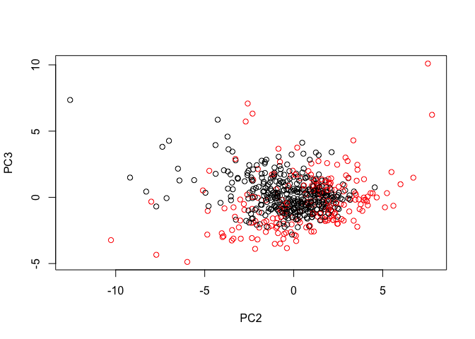
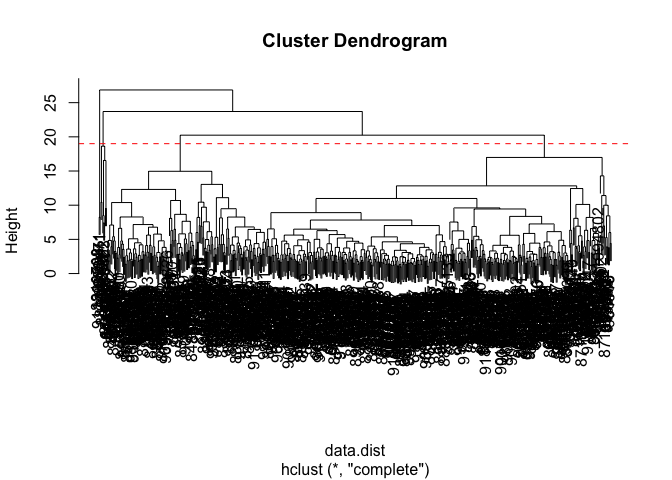
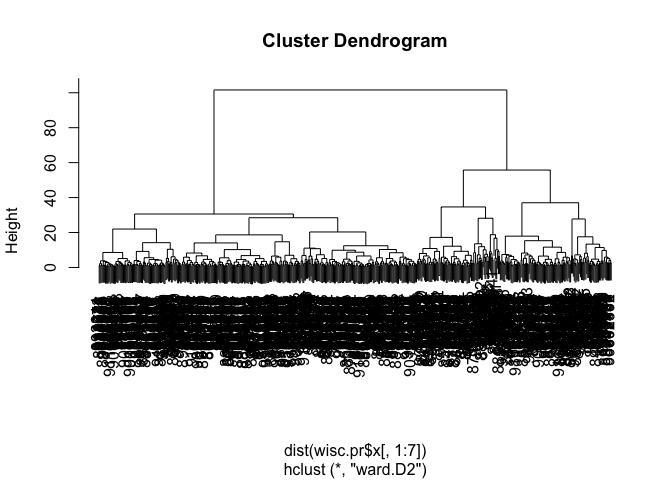
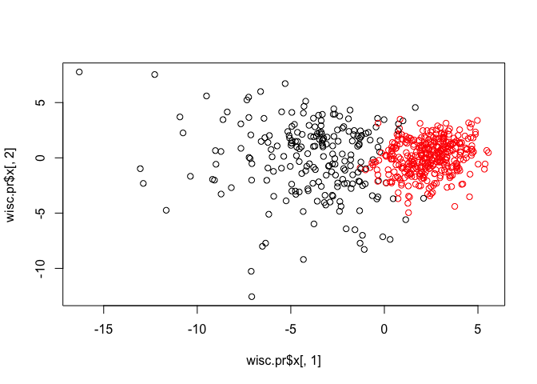
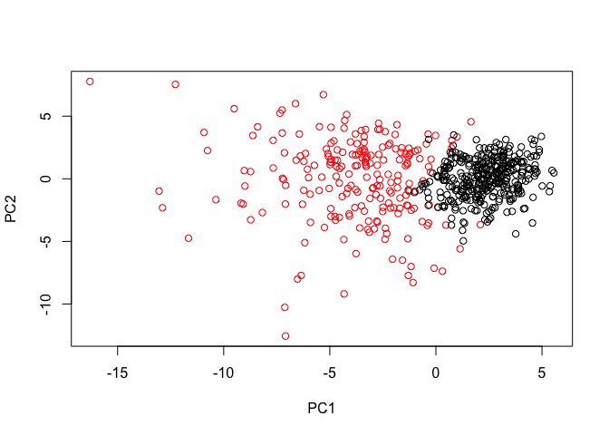

Class 09 Unsupervised Learning
================
Frank Lee
5/1/2019

Q1: What type of object is returned from the read.csv function? Check the right in the wisc.df data. It's a data frame.

``` r
fna.data <- "data/WisconsinCancer.csv"
wisc.df <- read.csv("WisconsinCancer.csv")
head(wisc.df)
```

    ##         id diagnosis radius_mean texture_mean perimeter_mean area_mean
    ## 1   842302         M       17.99        10.38         122.80    1001.0
    ## 2   842517         M       20.57        17.77         132.90    1326.0
    ## 3 84300903         M       19.69        21.25         130.00    1203.0
    ## 4 84348301         M       11.42        20.38          77.58     386.1
    ## 5 84358402         M       20.29        14.34         135.10    1297.0
    ## 6   843786         M       12.45        15.70          82.57     477.1
    ##   smoothness_mean compactness_mean concavity_mean concave.points_mean
    ## 1         0.11840          0.27760         0.3001             0.14710
    ## 2         0.08474          0.07864         0.0869             0.07017
    ## 3         0.10960          0.15990         0.1974             0.12790
    ## 4         0.14250          0.28390         0.2414             0.10520
    ## 5         0.10030          0.13280         0.1980             0.10430
    ## 6         0.12780          0.17000         0.1578             0.08089
    ##   symmetry_mean fractal_dimension_mean radius_se texture_se perimeter_se
    ## 1        0.2419                0.07871    1.0950     0.9053        8.589
    ## 2        0.1812                0.05667    0.5435     0.7339        3.398
    ## 3        0.2069                0.05999    0.7456     0.7869        4.585
    ## 4        0.2597                0.09744    0.4956     1.1560        3.445
    ## 5        0.1809                0.05883    0.7572     0.7813        5.438
    ## 6        0.2087                0.07613    0.3345     0.8902        2.217
    ##   area_se smoothness_se compactness_se concavity_se concave.points_se
    ## 1  153.40      0.006399        0.04904      0.05373           0.01587
    ## 2   74.08      0.005225        0.01308      0.01860           0.01340
    ## 3   94.03      0.006150        0.04006      0.03832           0.02058
    ## 4   27.23      0.009110        0.07458      0.05661           0.01867
    ## 5   94.44      0.011490        0.02461      0.05688           0.01885
    ## 6   27.19      0.007510        0.03345      0.03672           0.01137
    ##   symmetry_se fractal_dimension_se radius_worst texture_worst
    ## 1     0.03003             0.006193        25.38         17.33
    ## 2     0.01389             0.003532        24.99         23.41
    ## 3     0.02250             0.004571        23.57         25.53
    ## 4     0.05963             0.009208        14.91         26.50
    ## 5     0.01756             0.005115        22.54         16.67
    ## 6     0.02165             0.005082        15.47         23.75
    ##   perimeter_worst area_worst smoothness_worst compactness_worst
    ## 1          184.60     2019.0           0.1622            0.6656
    ## 2          158.80     1956.0           0.1238            0.1866
    ## 3          152.50     1709.0           0.1444            0.4245
    ## 4           98.87      567.7           0.2098            0.8663
    ## 5          152.20     1575.0           0.1374            0.2050
    ## 6          103.40      741.6           0.1791            0.5249
    ##   concavity_worst concave.points_worst symmetry_worst
    ## 1          0.7119               0.2654         0.4601
    ## 2          0.2416               0.1860         0.2750
    ## 3          0.4504               0.2430         0.3613
    ## 4          0.6869               0.2575         0.6638
    ## 5          0.4000               0.1625         0.2364
    ## 6          0.5355               0.1741         0.3985
    ##   fractal_dimension_worst  X
    ## 1                 0.11890 NA
    ## 2                 0.08902 NA
    ## 3                 0.08758 NA
    ## 4                 0.17300 NA
    ## 5                 0.07678 NA
    ## 6                 0.12440 NA

Q2: How many patients are there? Use nrow to count the number of rows. 569

``` r
numPatients <- nrow(wisc.df)
numCol <- ncol(wisc.df)
```

Q3: How many observations have a malignant diagnosis? 212

``` r
table(wisc.df$diagnosis)
```

    ## 
    ##   B   M 
    ## 357 212

Q4: How many variables/features in the data are suffixed with \_mean? 10

``` r
grep("_mean", colnames(wisc.df))
```

    ##  [1]  3  4  5  6  7  8  9 10 11 12

``` r
length(grep("_mean", colnames(wisc.df)))
```

    ## [1] 10

Q5: Why do you think we're using the indices 3:32 here? The first 2 columns and the last column are not numerical values, but string values.

``` r
head(wisc.df)
```

    ##         id diagnosis radius_mean texture_mean perimeter_mean area_mean
    ## 1   842302         M       17.99        10.38         122.80    1001.0
    ## 2   842517         M       20.57        17.77         132.90    1326.0
    ## 3 84300903         M       19.69        21.25         130.00    1203.0
    ## 4 84348301         M       11.42        20.38          77.58     386.1
    ## 5 84358402         M       20.29        14.34         135.10    1297.0
    ## 6   843786         M       12.45        15.70          82.57     477.1
    ##   smoothness_mean compactness_mean concavity_mean concave.points_mean
    ## 1         0.11840          0.27760         0.3001             0.14710
    ## 2         0.08474          0.07864         0.0869             0.07017
    ## 3         0.10960          0.15990         0.1974             0.12790
    ## 4         0.14250          0.28390         0.2414             0.10520
    ## 5         0.10030          0.13280         0.1980             0.10430
    ## 6         0.12780          0.17000         0.1578             0.08089
    ##   symmetry_mean fractal_dimension_mean radius_se texture_se perimeter_se
    ## 1        0.2419                0.07871    1.0950     0.9053        8.589
    ## 2        0.1812                0.05667    0.5435     0.7339        3.398
    ## 3        0.2069                0.05999    0.7456     0.7869        4.585
    ## 4        0.2597                0.09744    0.4956     1.1560        3.445
    ## 5        0.1809                0.05883    0.7572     0.7813        5.438
    ## 6        0.2087                0.07613    0.3345     0.8902        2.217
    ##   area_se smoothness_se compactness_se concavity_se concave.points_se
    ## 1  153.40      0.006399        0.04904      0.05373           0.01587
    ## 2   74.08      0.005225        0.01308      0.01860           0.01340
    ## 3   94.03      0.006150        0.04006      0.03832           0.02058
    ## 4   27.23      0.009110        0.07458      0.05661           0.01867
    ## 5   94.44      0.011490        0.02461      0.05688           0.01885
    ## 6   27.19      0.007510        0.03345      0.03672           0.01137
    ##   symmetry_se fractal_dimension_se radius_worst texture_worst
    ## 1     0.03003             0.006193        25.38         17.33
    ## 2     0.01389             0.003532        24.99         23.41
    ## 3     0.02250             0.004571        23.57         25.53
    ## 4     0.05963             0.009208        14.91         26.50
    ## 5     0.01756             0.005115        22.54         16.67
    ## 6     0.02165             0.005082        15.47         23.75
    ##   perimeter_worst area_worst smoothness_worst compactness_worst
    ## 1          184.60     2019.0           0.1622            0.6656
    ## 2          158.80     1956.0           0.1238            0.1866
    ## 3          152.50     1709.0           0.1444            0.4245
    ## 4           98.87      567.7           0.2098            0.8663
    ## 5          152.20     1575.0           0.1374            0.2050
    ## 6          103.40      741.6           0.1791            0.5249
    ##   concavity_worst concave.points_worst symmetry_worst
    ## 1          0.7119               0.2654         0.4601
    ## 2          0.2416               0.1860         0.2750
    ## 3          0.4504               0.2430         0.3613
    ## 4          0.6869               0.2575         0.6638
    ## 5          0.4000               0.1625         0.2364
    ## 6          0.5355               0.1741         0.3985
    ##   fractal_dimension_worst  X
    ## 1                 0.11890 NA
    ## 2                 0.08902 NA
    ## 3                 0.08758 NA
    ## 4                 0.17300 NA
    ## 5                 0.07678 NA
    ## 6                 0.12440 NA

``` r
View(wisc.df)
wisc.data <- as.matrix(wisc.df[,3:32])
head(wisc.data)
```

    ##      radius_mean texture_mean perimeter_mean area_mean smoothness_mean
    ## [1,]       17.99        10.38         122.80    1001.0         0.11840
    ## [2,]       20.57        17.77         132.90    1326.0         0.08474
    ## [3,]       19.69        21.25         130.00    1203.0         0.10960
    ## [4,]       11.42        20.38          77.58     386.1         0.14250
    ## [5,]       20.29        14.34         135.10    1297.0         0.10030
    ## [6,]       12.45        15.70          82.57     477.1         0.12780
    ##      compactness_mean concavity_mean concave.points_mean symmetry_mean
    ## [1,]          0.27760         0.3001             0.14710        0.2419
    ## [2,]          0.07864         0.0869             0.07017        0.1812
    ## [3,]          0.15990         0.1974             0.12790        0.2069
    ## [4,]          0.28390         0.2414             0.10520        0.2597
    ## [5,]          0.13280         0.1980             0.10430        0.1809
    ## [6,]          0.17000         0.1578             0.08089        0.2087
    ##      fractal_dimension_mean radius_se texture_se perimeter_se area_se
    ## [1,]                0.07871    1.0950     0.9053        8.589  153.40
    ## [2,]                0.05667    0.5435     0.7339        3.398   74.08
    ## [3,]                0.05999    0.7456     0.7869        4.585   94.03
    ## [4,]                0.09744    0.4956     1.1560        3.445   27.23
    ## [5,]                0.05883    0.7572     0.7813        5.438   94.44
    ## [6,]                0.07613    0.3345     0.8902        2.217   27.19
    ##      smoothness_se compactness_se concavity_se concave.points_se
    ## [1,]      0.006399        0.04904      0.05373           0.01587
    ## [2,]      0.005225        0.01308      0.01860           0.01340
    ## [3,]      0.006150        0.04006      0.03832           0.02058
    ## [4,]      0.009110        0.07458      0.05661           0.01867
    ## [5,]      0.011490        0.02461      0.05688           0.01885
    ## [6,]      0.007510        0.03345      0.03672           0.01137
    ##      symmetry_se fractal_dimension_se radius_worst texture_worst
    ## [1,]     0.03003             0.006193        25.38         17.33
    ## [2,]     0.01389             0.003532        24.99         23.41
    ## [3,]     0.02250             0.004571        23.57         25.53
    ## [4,]     0.05963             0.009208        14.91         26.50
    ## [5,]     0.01756             0.005115        22.54         16.67
    ## [6,]     0.02165             0.005082        15.47         23.75
    ##      perimeter_worst area_worst smoothness_worst compactness_worst
    ## [1,]          184.60     2019.0           0.1622            0.6656
    ## [2,]          158.80     1956.0           0.1238            0.1866
    ## [3,]          152.50     1709.0           0.1444            0.4245
    ## [4,]           98.87      567.7           0.2098            0.8663
    ## [5,]          152.20     1575.0           0.1374            0.2050
    ## [6,]          103.40      741.6           0.1791            0.5249
    ##      concavity_worst concave.points_worst symmetry_worst
    ## [1,]          0.7119               0.2654         0.4601
    ## [2,]          0.2416               0.1860         0.2750
    ## [3,]          0.4504               0.2430         0.3613
    ## [4,]          0.6869               0.2575         0.6638
    ## [5,]          0.4000               0.1625         0.2364
    ## [6,]          0.5355               0.1741         0.3985
    ##      fractal_dimension_worst
    ## [1,]                 0.11890
    ## [2,]                 0.08902
    ## [3,]                 0.08758
    ## [4,]                 0.17300
    ## [5,]                 0.07678
    ## [6,]                 0.12440

Q6. True or False? The data need to be scaled before PCA. TRUE

``` r
row.names(wisc.data) <- wisc.df$id

diagnosis <- wisc.df$diagnosis
diagnosis
```

    ##   [1] M M M M M M M M M M M M M M M M M M M B B B M M M M M M M M M M M M M
    ##  [36] M M B M M M M M M M M B M B B B B B M M B M M B B B B M B M M B B B B
    ##  [71] M B M M B M B M M B B B M M B M M M B B B M B B M M B B B M M B B B B
    ## [106] M B B M B B B B B B B B M M M B M M B B B M M B M B M M B M M B B M B
    ## [141] B M B B B B M B B B B B B B B B M B B B B M M B M B B M M B B M M B B
    ## [176] B B M B B M M M B M B M B B B M B B M M B M M M M B M M M B M B M B B
    ## [211] M B M M M M B B M M B B B M B B B B B M M B B M B B M M B M B B B B M
    ## [246] B B B B B M B M M M M M M M M M M M M M M B B B B B B M B M B B M B B
    ## [281] M B M M B B B B B B B B B B B B B M B B M B M B B B B B B B B B B B B
    ## [316] B B M B B B M B M B B B B M M M B B B B M B M B M B B B M B B B B B B
    ## [351] B M M M B B B B B B B B B B B M M B M M M B M M B B B B B M B B B B B
    ## [386] M B B B M B B M M B B B B B B M B B B B B B B M B B B B B M B B M B B
    ## [421] B B B B B B B B B B M B M M B M B B B B B M B B M B M B B M B M B B B
    ## [456] B B B B B M M B B B B B B M B B B B B B B B B B M B B B B B B B M B M
    ## [491] B B M B B B B B M M B M B M B B B B B M B B M B M B M M B B B M B B B
    ## [526] B B B B B B B B M B M M B B B B B B B B B B B B B B B B B B B B B B B
    ## [561] B B M M M M M M B
    ## Levels: B M

Now the next step is to perform principal component analysis (PCA) on wisc.data.

Do I need to scale the data before PCA? Check the col means and standard deviations.

``` r
# Find the means
# Use round to avoid scientific notation. The second input is the number of sig figs you want. 
round(colMeans(wisc.data), 1)
```

    ##             radius_mean            texture_mean          perimeter_mean 
    ##                    14.1                    19.3                    92.0 
    ##               area_mean         smoothness_mean        compactness_mean 
    ##                   654.9                     0.1                     0.1 
    ##          concavity_mean     concave.points_mean           symmetry_mean 
    ##                     0.1                     0.0                     0.2 
    ##  fractal_dimension_mean               radius_se              texture_se 
    ##                     0.1                     0.4                     1.2 
    ##            perimeter_se                 area_se           smoothness_se 
    ##                     2.9                    40.3                     0.0 
    ##          compactness_se            concavity_se       concave.points_se 
    ##                     0.0                     0.0                     0.0 
    ##             symmetry_se    fractal_dimension_se            radius_worst 
    ##                     0.0                     0.0                    16.3 
    ##           texture_worst         perimeter_worst              area_worst 
    ##                    25.7                   107.3                   880.6 
    ##        smoothness_worst       compactness_worst         concavity_worst 
    ##                     0.1                     0.3                     0.3 
    ##    concave.points_worst          symmetry_worst fractal_dimension_worst 
    ##                     0.1                     0.3                     0.1

``` r
# 1 means you apply the function across the rows
# 2 means you apply the function across the columns

# Now find the standard deviations
round(apply(wisc.data,2,sd), 1)
```

    ##             radius_mean            texture_mean          perimeter_mean 
    ##                     3.5                     4.3                    24.3 
    ##               area_mean         smoothness_mean        compactness_mean 
    ##                   351.9                     0.0                     0.1 
    ##          concavity_mean     concave.points_mean           symmetry_mean 
    ##                     0.1                     0.0                     0.0 
    ##  fractal_dimension_mean               radius_se              texture_se 
    ##                     0.0                     0.3                     0.6 
    ##            perimeter_se                 area_se           smoothness_se 
    ##                     2.0                    45.5                     0.0 
    ##          compactness_se            concavity_se       concave.points_se 
    ##                     0.0                     0.0                     0.0 
    ##             symmetry_se    fractal_dimension_se            radius_worst 
    ##                     0.0                     0.0                     4.8 
    ##           texture_worst         perimeter_worst              area_worst 
    ##                     6.1                    33.6                   569.4 
    ##        smoothness_worst       compactness_worst         concavity_worst 
    ##                     0.0                     0.2                     0.2 
    ##    concave.points_worst          symmetry_worst fractal_dimension_worst 
    ##                     0.1                     0.1                     0.0

``` r
# You could also find the means like this
round(apply(wisc.data,2, mean), 1)
```

    ##             radius_mean            texture_mean          perimeter_mean 
    ##                    14.1                    19.3                    92.0 
    ##               area_mean         smoothness_mean        compactness_mean 
    ##                   654.9                     0.1                     0.1 
    ##          concavity_mean     concave.points_mean           symmetry_mean 
    ##                     0.1                     0.0                     0.2 
    ##  fractal_dimension_mean               radius_se              texture_se 
    ##                     0.1                     0.4                     1.2 
    ##            perimeter_se                 area_se           smoothness_se 
    ##                     2.9                    40.3                     0.0 
    ##          compactness_se            concavity_se       concave.points_se 
    ##                     0.0                     0.0                     0.0 
    ##             symmetry_se    fractal_dimension_se            radius_worst 
    ##                     0.0                     0.0                    16.3 
    ##           texture_worst         perimeter_worst              area_worst 
    ##                    25.7                   107.3                   880.6 
    ##        smoothness_worst       compactness_worst         concavity_worst 
    ##                     0.1                     0.3                     0.3 
    ##    concave.points_worst          symmetry_worst fractal_dimension_worst 
    ##                     0.1                     0.3                     0.1

Based on these results, we need to scale the data because the means and sd's are quite different.

Generally (as in this case) variables are scaled to have a standard deviation of one and a mean of zero. Such scaling is particular recommended when variables are measured using different scales or when the original mean and/or standard deviation of variables is largely different.

Now, perform PCA on wisc.data by completing the following code.

``` r
wisc.pr <- prcomp(wisc.data, scale = TRUE)
summary(wisc.pr)
```

    ## Importance of components:
    ##                           PC1    PC2     PC3     PC4     PC5     PC6
    ## Standard deviation     3.6444 2.3857 1.67867 1.40735 1.28403 1.09880
    ## Proportion of Variance 0.4427 0.1897 0.09393 0.06602 0.05496 0.04025
    ## Cumulative Proportion  0.4427 0.6324 0.72636 0.79239 0.84734 0.88759
    ##                            PC7     PC8    PC9    PC10   PC11    PC12
    ## Standard deviation     0.82172 0.69037 0.6457 0.59219 0.5421 0.51104
    ## Proportion of Variance 0.02251 0.01589 0.0139 0.01169 0.0098 0.00871
    ## Cumulative Proportion  0.91010 0.92598 0.9399 0.95157 0.9614 0.97007
    ##                           PC13    PC14    PC15    PC16    PC17    PC18
    ## Standard deviation     0.49128 0.39624 0.30681 0.28260 0.24372 0.22939
    ## Proportion of Variance 0.00805 0.00523 0.00314 0.00266 0.00198 0.00175
    ## Cumulative Proportion  0.97812 0.98335 0.98649 0.98915 0.99113 0.99288
    ##                           PC19    PC20   PC21    PC22    PC23   PC24
    ## Standard deviation     0.22244 0.17652 0.1731 0.16565 0.15602 0.1344
    ## Proportion of Variance 0.00165 0.00104 0.0010 0.00091 0.00081 0.0006
    ## Cumulative Proportion  0.99453 0.99557 0.9966 0.99749 0.99830 0.9989
    ##                           PC25    PC26    PC27    PC28    PC29    PC30
    ## Standard deviation     0.12442 0.09043 0.08307 0.03987 0.02736 0.01153
    ## Proportion of Variance 0.00052 0.00027 0.00023 0.00005 0.00002 0.00000
    ## Cumulative Proportion  0.99942 0.99969 0.99992 0.99997 1.00000 1.00000

Q7. From your results, what proportion of the original variance is captured by the first principal components (PC1)? 0.4427

Q8. How many principal components (PCs) are required to describe at least 70% of the original variance in the data? 3

Q9. How many principal components (PCs) are required to describe at least 90% of the original variance in the data? 7

Now you will use some visualizations to better understand your PCA model. A common visualization for PCA results is the so-called biplot.

Q10. What stands out to you about this plot? Is it easy or difficult to understand? Why?

``` r
biplot(wisc.pr)
```

 It is quite crap really! This default plot is only helpful for relatively small datasets in my experience.

Q11. Generate a PC1 vs PC2 plot as described above colored by diagnosis. What do the points in this plot represent? What are the red points? Where did this coloring come from and why were these colors chosen by R?

``` r
plot(wisc.pr$x[,1], wisc.pr$x[,2], col = diagnosis, xlab = "PC1", ylab = "PC2")
```

 Grey = malignant, Red = benign. Each point in this plot is a patient.

Q12. Generate a similar plot for principal components 1 and 3. What do you notice about these plots?

``` r
plot(wisc.pr$x[,1], wisc.pr$x[,3], col = diagnosis, 
     xlab = "PC1", ylab = "PC3")
```

 Because principal component 2 explains more variance in the original data than principal component 3, you can see that the first plot has a cleaner cut separating the two subgroups.

``` r
plot(wisc.pr$x[,2], wisc.pr$x[,3], col = diagnosis, 
     xlab = "PC2", ylab = "PC3")
```



PC3 only captures 9% of the variance (based on the proportion of variance). PC1 vs. PC2 demonstrates the best plot.

Calculate the variance of each component.

``` r
pr.var <- wisc.pr$sdev^2
head(pr.var)
```

    ## [1] 13.281608  5.691355  2.817949  1.980640  1.648731  1.207357

Now look at the variance explained by each principal component divided by the total variance explained of all principal components.

``` r
pve <-  pr.var/sum(pr.var)

plot(pve, xlab = "Principal Component", 
     ylab = "Proportion of Variance Explained", 
     ylim = c(0, 1), type = "o")
```


Alternative scree plot of the same data, note data driven y-axis

``` r
barplot(pve, ylab = "Precent of Variance Explained",
     names.arg=paste0("PC",1:length(pve)), las=2, axes = FALSE)
axis(2, at=pve, labels=round(pve,2)*100 )
```


In this section we will check your understanding of the PCA results, in particular the loadings and variance explained. The loadings, represented as vectors, explain the mapping from the original features to the principal components. The principal components are naturally ordered from the most variance explained to the least variance explained.

Q13. For the first principal component, and using two significant figures , what is the component of the loading vector (i.e. wisc.pr$rotation\[,1\]) for the feature radius\_mean? -0.22

``` r
round(wisc.pr$rotation[,1], 2)
```

    ##             radius_mean            texture_mean          perimeter_mean 
    ##                   -0.22                   -0.10                   -0.23 
    ##               area_mean         smoothness_mean        compactness_mean 
    ##                   -0.22                   -0.14                   -0.24 
    ##          concavity_mean     concave.points_mean           symmetry_mean 
    ##                   -0.26                   -0.26                   -0.14 
    ##  fractal_dimension_mean               radius_se              texture_se 
    ##                   -0.06                   -0.21                   -0.02 
    ##            perimeter_se                 area_se           smoothness_se 
    ##                   -0.21                   -0.20                   -0.01 
    ##          compactness_se            concavity_se       concave.points_se 
    ##                   -0.17                   -0.15                   -0.18 
    ##             symmetry_se    fractal_dimension_se            radius_worst 
    ##                   -0.04                   -0.10                   -0.23 
    ##           texture_worst         perimeter_worst              area_worst 
    ##                   -0.10                   -0.24                   -0.22 
    ##        smoothness_worst       compactness_worst         concavity_worst 
    ##                   -0.13                   -0.21                   -0.23 
    ##    concave.points_worst          symmetry_worst fractal_dimension_worst 
    ##                   -0.25                   -0.12                   -0.13

``` r
# For the feature radius_mean:
# Access the contribution of one variable on PC1
round(wisc.pr$rotation["radius_mean",1], 2)
```

    ## [1] -0.22

Q14. For the first principal component, and using two significant figures, what is the component of the loading vector (i.e. wisc.pr$rotation\[,1\]) for the feature smoothness\_se? -0.01

``` r
# Access the contribution of one variable on PC1
round(wisc.pr$rotation["smoothness_se",1], 2)
```

    ## [1] -0.01

Q15. Which original variable contributes most to PC1? concave points\_mean

``` r
# Sort the loadings values by their absolute contribution to PC1
order <- sort(abs(wisc.pr$rotation[,1]), decreasing = TRUE)
order[1]
```

    ## concave.points_mean 
    ##           0.2608538

Hierarchal Clustering
---------------------

Scale the wisc.data and assign the result to data.scaled

``` r
data.scaled <- scale(wisc.data)
head(data.scaled)
```

    ##          radius_mean texture_mean perimeter_mean  area_mean
    ## 842302     1.0960995   -2.0715123      1.2688173  0.9835095
    ## 842517     1.8282120   -0.3533215      1.6844726  1.9070303
    ## 84300903   1.5784992    0.4557859      1.5651260  1.5575132
    ## 84348301  -0.7682333    0.2535091     -0.5921661 -0.7637917
    ## 84358402   1.7487579   -1.1508038      1.7750113  1.8246238
    ## 843786    -0.4759559   -0.8346009     -0.3868077 -0.5052059
    ##          smoothness_mean compactness_mean concavity_mean
    ## 842302         1.5670875        3.2806281     2.65054179
    ## 842517        -0.8262354       -0.4866435    -0.02382489
    ## 84300903       0.9413821        1.0519999     1.36227979
    ## 84348301       3.2806668        3.3999174     1.91421287
    ## 84358402       0.2801253        0.5388663     1.36980615
    ## 843786         2.2354545        1.2432416     0.86554001
    ##          concave.points_mean symmetry_mean fractal_dimension_mean
    ## 842302             2.5302489   2.215565542              2.2537638
    ## 842517             0.5476623   0.001391139             -0.8678888
    ## 84300903           2.0354398   0.938858720             -0.3976580
    ## 84348301           1.4504311   2.864862154              4.9066020
    ## 84358402           1.4272370  -0.009552062             -0.5619555
    ## 843786             0.8239307   1.004517928              1.8883435
    ##           radius_se texture_se perimeter_se    area_se smoothness_se
    ## 842302    2.4875451 -0.5647681    2.8305403  2.4853907    -0.2138135
    ## 842517    0.4988157 -0.8754733    0.2630955  0.7417493    -0.6048187
    ## 84300903  1.2275958 -0.7793976    0.8501802  1.1802975    -0.2967439
    ## 84348301  0.3260865 -0.1103120    0.2863415 -0.2881246     0.6890953
    ## 84358402  1.2694258 -0.7895490    1.2720701  1.1893103     1.4817634
    ## 843786   -0.2548461 -0.5921406   -0.3210217 -0.2890039     0.1562093
    ##          compactness_se concavity_se concave.points_se symmetry_se
    ## 842302       1.31570389    0.7233897        0.66023900   1.1477468
    ## 842517      -0.69231710   -0.4403926        0.25993335  -0.8047423
    ## 84300903     0.81425704    0.2128891        1.42357487   0.2368272
    ## 84348301     2.74186785    0.8187979        1.11402678   4.7285198
    ## 84358402    -0.04847723    0.8277425        1.14319885  -0.3607748
    ## 843786       0.44515196    0.1598845       -0.06906279   0.1340009
    ##          fractal_dimension_se radius_worst texture_worst perimeter_worst
    ## 842302             0.90628565    1.8850310   -1.35809849       2.3015755
    ## 842517            -0.09935632    1.8043398   -0.36887865       1.5337764
    ## 84300903           0.29330133    1.5105411   -0.02395331       1.3462906
    ## 84348301           2.04571087   -0.2812170    0.13386631      -0.2497196
    ## 84358402           0.49888916    1.2974336   -1.46548091       1.3373627
    ## 843786             0.48641784   -0.1653528   -0.31356043      -0.1149083
    ##          area_worst smoothness_worst compactness_worst concavity_worst
    ## 842302    1.9994782        1.3065367         2.6143647       2.1076718
    ## 842517    1.8888270       -0.3752817        -0.4300658      -0.1466200
    ## 84300903  1.4550043        0.5269438         1.0819801       0.8542223
    ## 84348301 -0.5495377        3.3912907         3.8899747       1.9878392
    ## 84358402  1.2196511        0.2203623        -0.3131190       0.6126397
    ## 843786   -0.2441054        2.0467119         1.7201029       1.2621327
    ##          concave.points_worst symmetry_worst fractal_dimension_worst
    ## 842302              2.2940576      2.7482041               1.9353117
    ## 842517              1.0861286     -0.2436753               0.2809428
    ## 84300903            1.9532817      1.1512420               0.2012142
    ## 84348301            2.1738732      6.0407261               4.9306719
    ## 84358402            0.7286181     -0.8675896              -0.3967505
    ## 843786              0.9050914      1.7525273               2.2398308

Calculate the (Euclidean) distances between all pairs of observations in the new scaled dataset and assign the result to data.dist.

``` r
data.dist <-dist(data.scaled)
head(data.dist)
```

    ## [1] 10.309426  6.771675 10.463467  8.663413  8.402233  9.843286

Create a hierarchical clustering model using complete linkage. Manually specify the method argument to hclust() and assign the results to wisc.hclust.

``` r
wisc.hclust <- hclust(data.dist, method = "complete")
head(wisc.hclust)
```

    ## $merge
    ##        [,1] [,2]
    ##   [1,]  -80 -363
    ##   [2,] -458 -459
    ##   [3,] -272 -391
    ##   [4,]   -7 -318
    ##   [5,]  -91 -546
    ##   [6,] -299 -478
    ##   [7,]  -75 -138
    ##   [8,] -108 -498
    ##   [9,] -426 -523
    ##  [10,] -159 -295
    ##  [11,] -212 -481
    ##  [12,] -335 -347
    ##  [13,] -134 -407
    ##  [14,] -372 -512
    ##  [15,] -368 -464
    ##  [16,]  -59 -286
    ##  [17,] -126 -365
    ##  [18,]  -99 -121
    ##  [19,]  -94    1
    ##  [20,]  -70 -326
    ##  [21,] -345 -489
    ##  [22,] -150 -482
    ##  [23,] -241 -435
    ##  [24,] -196 -455
    ##  [25,] -227 -547
    ##  [26,]  -85 -269
    ##  [27,]  -82 -216
    ##  [28,] -156 -400
    ##  [29,] -385 -476
    ##  [30,]  -50 -543
    ##  [31,] -361 -430
    ##  [32,] -375   24
    ##  [33,] -166 -279
    ##  [34,] -225 -465
    ##  [35,] -328 -429
    ##  [36,] -358 -439
    ##  [37,] -309 -310
    ##  [38,]  -17 -172
    ##  [39,] -325   17
    ##  [40,] -453 -555
    ##  [41,] -170 -484
    ##  [42,] -155 -293
    ##  [43,] -362 -495
    ##  [44,] -205 -524
    ##  [45,]  -53 -252
    ##  [46,] -421 -428
    ##  [47,] -514   13
    ##  [48,] -533   39
    ##  [49,] -207 -223
    ##  [50,] -271 -388
    ##  [51,] -262 -275
    ##  [52,] -250 -423
    ##  [53,] -396   36
    ##  [54,] -487   22
    ##  [55,] -115 -526
    ##  [56,] -144 -448
    ##  [57,] -449 -515
    ##  [58,]  -21 -222
    ##  [59,] -406 -531
    ##  [60,] -438   23
    ##  [61,] -313 -387
    ##  [62,]  -71 -366
    ##  [63,]  -20 -171
    ##  [64,] -242 -307
    ##  [65,] -188   20
    ##  [66,] -143 -339
    ##  [67,] -395 -516
    ##  [68,] -317 -351
    ##  [69,] -483   58
    ##  [70,] -189 -420
    ##  [71,]  -52 -440
    ##  [72,] -296   10
    ##  [73,] -256 -341
    ##  [74,] -132 -329
    ##  [75,] -364 -496
    ##  [76,] -105 -471
    ##  [77,]  -67  -81
    ##  [78,] -294 -311
    ##  [79,] -265    4
    ##  [80,] -228 -473
    ##  [81,] -343 -479
    ##  [82,]  -44 -224
    ##  [83,] -217 -357
    ##  [84,] -124 -454
    ##  [85,] -160 -334
    ##  [86,] -312   33
    ##  [87,] -409 -517
    ##  [88,]  -40 -436
    ##  [89,] -383 -451
    ##  [90,] -180 -327
    ##  [91,] -145 -190
    ##  [92,] -103    2
    ##  [93,] -416   67
    ##  [94,] -154 -277
    ##  [95,]    8   11
    ##  [96,]  -55   38
    ##  [97,] -520   21
    ##  [98,] -254 -445
    ##  [99,] -235 -349
    ## [100,] -544 -553
    ## [101,]  -47 -468
    ## [102,] -404    7
    ## [103,] -378 -463
    ## [104,] -100 -537
    ## [105,] -530    3
    ## [106,] -136 -491
    ## [107,]  -41 -264
    ## [108,]  -89 -201
    ## [109,]  -86 -493
    ## [110,]  -48 -513
    ## [111,] -285 -398
    ## [112,] -246 -417
    ## [113,] -142 -168
    ## [114,] -116 -545
    ## [115,] -443   90
    ## [116,]   31   68
    ## [117,] -437   28
    ## [118,] -292 -424
    ## [119,]  -11   51
    ## [120,] -412   66
    ## [121,]  -49   18
    ## [122,] -268   43
    ## [123,]  -45 -527
    ## [124,] -290 -410
    ## [125,] -280   41
    ## [126,]  -74 -497
    ## [127,]  -65  -66
    ## [128,] -528   29
    ## [129,] -141 -176
    ## [130,] -104 -535
    ## [131,] -255 -283
    ## [132,]   34   71
    ## [133,] -488 -500
    ## [134,] -122 -499
    ## [135,] -503   97
    ## [136,]  -68   12
    ## [137,]    5   30
    ## [138,] -549  136
    ## [139,] -149   73
    ## [140,] -137 -298
    ## [141,] -411  106
    ## [142,] -221 -419
    ## [143,] -348   47
    ## [144,] -477   57
    ## [145,] -316   37
    ## [146,] -342 -427
    ## [147,] -101 -386
    ## [148,]  -51   16
    ## [149,]  -58   82
    ## [150,] -321 -432
    ## [151,]  -18 -118
    ## [152,] -304 -525
    ## [153,]   45  117
    ## [154,]  -14  -92
    ## [155,] -382   32
    ## [156,]   52   63
    ## [157,]  -37 -542
    ## [158,]   26   78
    ## [159,]   44  108
    ## [160,]  -95 -178
    ## [161,] -288   50
    ## [162,] -267 -302
    ## [163,] -202   98
    ## [164,] -128 -322
    ## [165,]   64   85
    ## [166,] -305   91
    ## [167,] -300 -554
    ## [168,]   48   72
    ## [169,] -414  118
    ## [170,] -245 -434
    ## [171,]  -19 -450
    ## [172,]   40  100
    ## [173,] -125  111
    ## [174,] -247   53
    ## [175,]   74   87
    ## [176,] -131   42
    ## [177,]  -93   54
    ## [178,]  -42 -107
    ## [179,] -397  104
    ## [180,] -360  152
    ## [181,]  -96 -534
    ## [182,]  -57  131
    ## [183,] -541  150
    ## [184,]  -38 -320
    ## [185,]   15  102
    ## [186,] -244 -403
    ## [187,]   60   65
    ## [188,] -507 -532
    ## [189,]   35  165
    ## [190,] -402  121
    ## [191,]  132  177
    ## [192,] -306 -550
    ## [193,]   -8 -502
    ## [194,] -135   79
    ## [195,] -206 -379
    ## [196,] -186 -274
    ## [197,] -509   14
    ## [198,]  -90 -129
    ## [199,] -236   92
    ## [200,] -405 -494
    ## [201,] -370 -522
    ## [202,]   95  185
    ## [203,]   -3 -536
    ## [204,] -127 -185
    ## [205,] -148 -408
    ## [206,] -133 -183
    ## [207,] -446 -561
    ## [208,]   19  187
    ## [209,] -384 -475
    ## [210,] -551  148
    ## [211,]   49  120
    ## [212,]  -30  113
    ## [213,] -331  160
    ## [214,] -376   69
    ## [215,] -229 -467
    ## [216,] -548  130
    ## [217,] -238   62
    ## [218,]  -12  -35
    ## [219,] -218 -552
    ## [220,] -399  189
    ## [221,] -248 -466
    ## [222,] -233 -460
    ## [223,]  -56   70
    ## [224,] -511   61
    ## [225,]   81  105
    ## [226,] -208  164
    ## [227,] -442 -567
    ## [228,] -114  183
    ## [229,]  128  142
    ## [230,]   25   94
    ## [231,] -232  103
    ## [232,]   80  143
    ## [233,]   27  110
    ## [234,] -393  151
    ## [235,] -234 -261
    ## [236,]    6   86
    ## [237,]   46   76
    ## [238,]  153  155
    ## [239,]   88  126
    ## [240,] -374 -518
    ## [241,] -151 -350
    ## [242,] -161   83
    ## [243,] -287   89
    ## [244,]   -6   -9
    ## [245,] -210  197
    ## [246,]   93  158
    ## [247,] -164   77
    ## [248,]  -24  171
    ## [249,]  -31  -33
    ## [250,] -337  224
    ## [251,]   99  101
    ## [252,] -184 -356
    ## [253,]  -36 -371
    ## [254,]   59  140
    ## [255,] -239 -456
    ## [256,] -195 -480
    ## [257,] -381  135
    ## [258,]  190  229
    ## [259,] -112 -270
    ## [260,]  116  161
    ## [261,] -474 -558
    ## [262,]  -28 -336
    ## [263,] -209 -332
    ## [264,] -237 -340
    ## [265,]  114  159
    ## [266,] -470 -538
    ## [267,] -163 -394
    ## [268,] -249  141
    ## [269,]  122  137
    ## [270,] -111 -174
    ## [271,]  129  230
    ## [272,] -323   84
    ## [273,] -281  133
    ## [274,] -230  244
    ## [275,] -187  163
    ## [276,]  124  223
    ## [277,]  -60   55
    ## [278,] -219  181
    ## [279,]  199  269
    ## [280,] -199 -338
    ## [281,] -557  167
    ## [282,] -157  170
    ## [283,]  -34  -73
    ## [284,] -556 -560
    ## [285,]  125  168
    ## [286,]  123  204
    ## [287,]  -54  109
    ## [288,]   96  147
    ## [289,]   -2  240
    ## [290,]   56  238
    ## [291,] -355 -359
    ## [292,] -284  213
    ## [293,] -175 -308
    ## [294,]  145  260
    ## [295,]  -98  180
    ## [296,]  -62  112
    ## [297,] -197 -354
    ## [298,]  -22  -97
    ## [299,]  166  174
    ## [300,]   75  144
    ## [301,] -297  200
    ## [302,]  -16  -27
    ## [303,] -559  173
    ## [304,]  107  236
    ## [305,] -346  270
    ## [306,]  127  149
    ## [307,]  139  214
    ## [308,]  228  259
    ## [309,]  156  272
    ## [310,] -130  249
    ## [311,] -447  235
    ## [312,]    9  138
    ## [313,]  219  237
    ## [314,]  194  206
    ## [315,]  208  285
    ## [316,] -146 -508
    ## [317,]  188  265
    ## [318,] -110  216
    ## [319,]  196  251
    ## [320,] -211 -367
    ## [321,] -273 -301
    ## [322,] -119 -401
    ## [323,] -422  198
    ## [324,] -179  231
    ## [325,]  288  300
    ## [326,]  169  215
    ## [327,] -501 -519
    ## [328,]  146  209
    ## [329,]  -46 -433
    ## [330,] -282  291
    ## [331,]  157  263
    ## [332,]  210  312
    ## [333,] -303 -564
    ## [334,]  172  279
    ## [335,]  -61 -425
    ## [336,]  -29  302
    ## [337,]   -5  134
    ## [338,] -231  175
    ## [339,]  162  242
    ## [340,]  115  220
    ## [341,]  191  299
    ## [342,]  195  232
    ## [343,]  176  257
    ## [344,]  -87  154
    ## [345,]  246  276
    ## [346,] -278  275
    ## [347,]  -63 -431
    ## [348,]  262  282
    ## [349,]  -76  212
    ## [350,] -333  296
    ## [351,]  202  315
    ## [352,]  182  203
    ## [353,] -457  284
    ## [354,] -314  290
    ## [355,] -169 -257
    ## [356,] -158 -198
    ## [357,]  225  309
    ## [358,]  -32  274
    ## [359,]  211  298
    ## [360,] -182 -568
    ## [361,] -194  193
    ## [362,]  -88  280
    ## [363,]  179  207
    ## [364,]  233  306
    ## [365,] -472  192
    ## [366,] -200  286
    ## [367,] -485  307
    ## [368,]  201  264
    ## [369,]  247  295
    ## [370,]  -25 -461
    ## [371,] -263  278
    ## [372,] -102 -392
    ## [373,] -165  248
    ## [374,] -140 -276
    ## [375,]  119  325
    ## [376,] -251  333
    ## [377,]  317  318
    ## [378,]  217  289
    ## [379,]  326  363
    ## [380,]  184  301
    ## [381,] -319 -486
    ## [382,] -226  349
    ## [383,]  178  266
    ## [384,]  273  310
    ## [385,]  250  328
    ## [386,] -415  365
    ## [387,]  294  340
    ## [388,] -181 -353
    ## [389,]  258  357
    ## [390,]  292  338
    ## [391,] -106 -258
    ## [392,] -369 -504
    ## [393,]  218  253
    ## [394,]  241  335
    ## [395,] -152 -243
    ## [396,]  329  352
    ## [397,]  -15 -380
    ## [398,] -167  271
    ## [399,]  205  243
    ## [400,] -529  374
    ## [401,] -441  221
    ## [402,]  342  367
    ## [403,]  293  332
    ## [404,]  320  371
    ## [405,] -192  330
    ## [406,]  268  345
    ## [407,]  256  323
    ## [408,]  186  304
    ## [409,] -173  234
    ## [410,]  252  303
    ## [411,]  341  387
    ## [412,]  321  355
    ## [413,] -330  297
    ## [414,]  287  348
    ## [415,] -492  245
    ## [416,] -373  337
    ## [417,]  239  331
    ## [418,]  226  346
    ## [419,]  -78 -418
    ## [420,]  255  353
    ## [421,] -452 -566
    ## [422,]  -23 -352
    ## [423,] -240  311
    ## [424,] -569  222
    ## [425,] -510  361
    ## [426,] -220 -266
    ## [427,]  351  389
    ## [428,]  308  339
    ## [429,]  281  369
    ## [430,] -253  322
    ## [431,]  267  384
    ## [432,]  373  378
    ## [433,] -562  261
    ## [434,] -113 -377
    ## [435,]  227  344
    ## [436,]  334  386
    ## [437,]  343  359
    ## [438,] -344  404
    ## [439,]  366  417
    ## [440,]  -83 -203
    ## [441,]  362  370
    ## [442,] -413  313
    ## [443,]  380  403
    ## [444,]  354  427
    ## [445,]  319  398
    ## [446,]  391  409
    ## [447,]  377  437
    ## [448,]  254  429
    ## [449,] -204  425
    ## [450,] -260  336
    ## [451,]  -64 -444
    ## [452,]  314  390
    ## [453,]  -77  316
    ## [454,] -521  453
    ## [455,]  305  350
    ## [456,]  358  397
    ## [457,] -147 -215
    ## [458,] -539  372
    ## [459,] -120 -490
    ## [460,]  324  408
    ## [461,]   -1  -26
    ## [462,]  396  416
    ## [463,]  406  442
    ## [464,]  382  418
    ## [465,]  376  412
    ## [466,]  375  435
    ## [467,]  327  379
    ## [468,] -389  401
    ## [469,]  283  430
    ## [470,]  399  410
    ## [471,]  364  439
    ## [472,]  385  447
    ## [473,] -162 -565
    ## [474,]  -84 -390
    ## [475,]  -72 -177
    ## [476,] -540  395
    ## [477,]  368  388
    ## [478,] -505 -506
    ## [479,]  414  438
    ## [480,]  402  444
    ## [481,] -469  419
    ## [482,] -563  450
    ## [483,]  356  464
    ## [484,]  405  451
    ## [485,]  411  415
    ## [486,]  448  463
    ## [487,]  407  413
    ## [488,]  277  445
    ## [489,]  421  423
    ## [490,]  428  472
    ## [491,]  393  452
    ## [492,]  431  469
    ## [493,]  455  458
    ## [494,]  424  436
    ## [495,]  347  446
    ## [496,]  381  434
    ## [497,]  360  440
    ## [498,]  432  441
    ## [499,]  465  481
    ## [500,]  443  460
    ## [501,]  420  466
    ## [502,]  467  490
    ## [503,]  422  457
    ## [504,]  394  454
    ## [505,] -193  433
    ## [506,]  462  498
    ## [507,] -324  461
    ## [508,]  486  502
    ## [509,]  392  473
    ## [510,]  468  470
    ## [511,] -315  493
    ## [512,]  383  449
    ## [513,] -117 -289
    ## [514,]  487  491
    ## [515,]  479  506
    ## [516,]  459  483
    ## [517,]  400  484
    ## [518,]  -13  -43
    ## [519,] -291  475
    ## [520,]  480  488
    ## [521,] -109 -259
    ## [522,]  456  482
    ## [523,]  471  514
    ## [524,]  494  500
    ## [525,]  -10 -191
    ## [526,]  -39  501
    ## [527,]  474  499
    ## [528,]  492  495
    ## [529,]  508  520
    ## [530,] -139  503
    ## [531,]  513  517
    ## [532,]  426  489
    ## [533,]  504  511
    ## [534,]  497  521
    ## [535,] -213 -462
    ## [536,]  509  515
    ## [537,]  512  523
    ## [538,]  485  524
    ## [539,]  476  496
    ## [540,]   -4  525
    ## [541,]  507  528
    ## [542,]  510  529
    ## [543,]  516  538
    ## [544,]  532  536
    ## [545,]  -79 -123
    ## [546,]  526  543
    ## [547,]  518  527
    ## [548,]  519  539
    ## [549,]  531  533
    ## [550,]  522  537
    ## [551,]  534  547
    ## [552,]  -69 -153
    ## [553,]  530  541
    ## [554,]  542  546
    ## [555,]  477  544
    ## [556,]  478  548
    ## [557,]  550  553
    ## [558,]  505  549
    ## [559,]  554  558
    ## [560,]  551  555
    ## [561,] -214  556
    ## [562,]  557  560
    ## [563,]  540  545
    ## [564,]  559  561
    ## [565,]  552  563
    ## [566,]  562  564
    ## [567,]  565  566
    ## [568,]  535  567
    ## 
    ## $height
    ##   [1]  1.005230  1.026711  1.096132  1.100008  1.119867  1.146701  1.147702
    ##   [8]  1.209527  1.215177  1.216937  1.228931  1.268268  1.271313  1.298518
    ##  [15]  1.320791  1.324071  1.331997  1.341092  1.350120  1.356226  1.358986
    ##  [22]  1.367199  1.367246  1.367406  1.376013  1.382132  1.390225  1.392998
    ##  [29]  1.406426  1.419157  1.429975  1.436004  1.443621  1.450628  1.477401
    ##  [36]  1.485766  1.488450  1.530763  1.533372  1.534547  1.536138  1.547617
    ##  [43]  1.565400  1.569854  1.574260  1.592749  1.595827  1.598243  1.598859
    ##  [50]  1.599830  1.606257  1.609077  1.609248  1.629422  1.651875  1.652908
    ##  [57]  1.654239  1.659267  1.665912  1.666256  1.668353  1.670058  1.687105
    ##  [64]  1.695445  1.701228  1.702677  1.711957  1.723258  1.733826  1.737552
    ##  [71]  1.739122  1.742630  1.743912  1.747820  1.749839  1.751217  1.766804
    ##  [78]  1.767422  1.773438  1.773856  1.774662  1.779741  1.781768  1.787211
    ##  [85]  1.788921  1.796730  1.799357  1.807758  1.814891  1.816495  1.817372
    ##  [92]  1.821606  1.823033  1.823518  1.825508  1.826941  1.827691  1.844635
    ##  [99]  1.849461  1.853010  1.858688  1.864548  1.869756  1.871654  1.871735
    ## [106]  1.880079  1.887728  1.888468  1.890715  1.891311  1.891798  1.893887
    ## [113]  1.904939  1.909234  1.909783  1.911427  1.924116  1.926464  1.929332
    ## [120]  1.930438  1.934275  1.939516  1.944477  1.946280  1.974602  1.975521
    ## [127]  1.994537  1.999286  2.011384  2.016180  2.022058  2.029413  2.032216
    ## [134]  2.034585  2.034885  2.040434  2.044159  2.066417  2.067314  2.076174
    ## [141]  2.083890  2.084520  2.084771  2.084820  2.086478  2.089702  2.095683
    ## [148]  2.100539  2.109334  2.110946  2.113200  2.117617  2.118580  2.120169
    ## [155]  2.124586  2.125511  2.127216  2.131799  2.136624  2.142092  2.149496
    ## [162]  2.160120  2.161211  2.178885  2.179267  2.183077  2.197286  2.201076
    ## [169]  2.218892  2.219137  2.221416  2.239867  2.260189  2.269696  2.275244
    ## [176]  2.279286  2.291714  2.301881  2.301984  2.306024  2.317967  2.319906
    ## [183]  2.331793  2.344151  2.346238  2.352106  2.359622  2.361766  2.370875
    ## [190]  2.375271  2.375881  2.388371  2.391336  2.391725  2.415227  2.417728
    ## [197]  2.435423  2.437448  2.440903  2.445407  2.448525  2.448843  2.449386
    ## [204]  2.453962  2.461195  2.464110  2.464552  2.464566  2.466033  2.467459
    ## [211]  2.473961  2.473991  2.475809  2.482193  2.488075  2.491304  2.491913
    ## [218]  2.493406  2.498459  2.513145  2.515798  2.518534  2.522818  2.530981
    ## [225]  2.540393  2.545612  2.557633  2.558287  2.559306  2.573835  2.576955
    ## [232]  2.578323  2.604644  2.613944  2.625244  2.635215  2.650621  2.673002
    ## [239]  2.673349  2.673644  2.675693  2.686567  2.689533  2.692775  2.694214
    ## [246]  2.700272  2.700679  2.702083  2.705661  2.709335  2.715197  2.719637
    ## [253]  2.722153  2.728442  2.738493  2.743977  2.744633  2.749743  2.750247
    ## [260]  2.755635  2.756343  2.763187  2.765535  2.767643  2.778366  2.781427
    ## [267]  2.781566  2.787540  2.816533  2.819703  2.822625  2.837623  2.838141
    ## [274]  2.839211  2.844678  2.847168  2.847694  2.853021  2.854981  2.856284
    ## [281]  2.867143  2.877951  2.887432  2.890137  2.891428  2.893594  2.900583
    ## [288]  2.907303  2.910030  2.910749  2.933666  2.951909  2.953352  2.956051
    ## [295]  2.956285  2.958726  2.960002  2.964908  2.968782  2.976127  2.988419
    ## [302]  2.992190  2.997087  3.008613  3.020787  3.022405  3.033286  3.036721
    ## [309]  3.040079  3.052697  3.056811  3.057908  3.072395  3.078508  3.081995
    ## [316]  3.089342  3.090875  3.099869  3.106389  3.107299  3.109140  3.112594
    ## [323]  3.144882  3.157014  3.159963  3.161172  3.165804  3.168631  3.188078
    ## [330]  3.193575  3.197490  3.202124  3.213407  3.225338  3.242815  3.248166
    ## [337]  3.251482  3.285321  3.290650  3.291670  3.307359  3.313863  3.318986
    ## [344]  3.344213  3.352336  3.352402  3.354084  3.385203  3.387703  3.394852
    ## [351]  3.399973  3.441553  3.458219  3.460710  3.464911  3.466990  3.468893
    ## [358]  3.479058  3.488304  3.496882  3.562544  3.566301  3.566351  3.579221
    ## [365]  3.596959  3.613420  3.624016  3.628544  3.646693  3.664820  3.673423
    ## [372]  3.674342  3.686850  3.691358  3.708899  3.737276  3.744325  3.759048
    ## [379]  3.759811  3.777131  3.790839  3.797925  3.813528  3.822259  3.825173
    ## [386]  3.826515  3.829305  3.829965  3.830055  3.831017  3.865220  3.896544
    ## [393]  3.908290  3.913497  3.913563  3.926535  3.929015  3.930831  3.945084
    ## [400]  3.948747  3.996948  4.014483  4.044007  4.063300  4.067046  4.068461
    ## [407]  4.089437  4.100528  4.115785  4.129474  4.133223  4.145537  4.169407
    ## [414]  4.170211  4.189956  4.195116  4.197808  4.216784  4.236865  4.242305
    ## [421]  4.242779  4.262300  4.273223  4.306003  4.315373  4.329950  4.359855
    ## [428]  4.360679  4.361214  4.367910  4.376070  4.383003  4.401181  4.409695
    ## [435]  4.438712  4.448294  4.454908  4.464907  4.498061  4.593197  4.600040
    ## [442]  4.602226  4.629016  4.641532  4.670503  4.689338  4.717133  4.745250
    ## [449]  4.769450  4.776486  4.776545  4.787026  4.814873  4.826310  4.834212
    ## [456]  4.840763  4.841758  4.857763  4.869967  4.873945  4.906745  4.924646
    ## [463]  4.932525  4.940799  4.975046  4.999032  5.007626  5.009415  5.066402
    ## [470]  5.085591  5.086201  5.199286  5.218275  5.234202  5.252211  5.276128
    ## [477]  5.312915  5.356423  5.360096  5.364566  5.390627  5.392103  5.448860
    ## [484]  5.526307  5.598938  5.626338  5.626645  5.659072  5.676613  5.702048
    ## [491]  5.771244  5.805293  5.850696  5.869093  5.926479  5.991276  6.005960
    ## [498]  6.019395  6.127199  6.131595  6.242541  6.276511  6.277634  6.330833
    ## [505]  6.355761  6.454382  6.489883  6.494109  6.522278  6.529232  6.580286
    ## [512]  6.617581  6.703568  6.783072  6.817585  6.876998  6.925925  6.962872
    ## [519]  6.980563  7.023077  7.029478  7.097307  7.168460  7.258934  7.406942
    ## [526]  7.534671  7.566726  7.646292  7.827652  8.073957  8.077915  8.140482
    ## [533]  8.209893  8.213918  8.261273  8.265040  8.277593  8.360934  8.440802
    ## [540]  8.472046  8.661494  8.910477  9.446100  9.483452  9.512115  9.601947
    ## [547]  9.707425  9.995552 10.110130 10.386553 10.440182 10.466865 10.686962
    ## [554] 10.982812 11.100405 11.409358 12.306988 12.436039 12.828040 13.042946
    ## [561] 14.290358 14.959469 16.543516 16.986102 18.636581 20.243301 23.705661
    ## [568] 26.858388
    ## 
    ## $order
    ##   [1] 213 462  69 153   4  10 191  79 123  32 230   6   9  15 380 563 260
    ##  [18]  29  16  27  42 107 470 538 204 510 194   8 502  82 216  48 513  65
    ##  [35]  66  58  44 224 200  45 527 127 185  40 436  74 497  37 542 209 332
    ##  [52] 195 480 422  90 129 330 197 354  12  35  36 371 135 265   7 318 133
    ##  [69] 183 284 331  95 178 231 132 329 409 517 139  23 352 147 215 324   1
    ##  [86]  26 163 394 281 488 500 130  31  33  34  73 253 119 401  63 431 106
    ## [103] 258 173 393  18 118 182 568  83 203 109 259  13  43  84 390 251 303
    ## [120] 564 273 301 169 257 469  78 418 370 522 237 340 181 353 220 266 452
    ## [137] 566 240 447 234 261 369 504 162 565  54  86 493  28 336 157 245 434
    ## [154] 344 211 367 263 219  96 534  46 433  57 255 283   3 536 373   5 122
    ## [171] 499 165  24  19 450 238  71 366   2 374 518  88 199 338  25 461 389
    ## [188] 441 248 466 148 408 287 383 451 184 356 559 125 285 398 406 531 137
    ## [205] 298 557 300 554 164  67  81  98 360 304 525 249 411 136 491 416 395
    ## [222] 516  85 269 294 311 290 410  56 189 420 413 218 552 421 428 105 471
    ## [239] 501 519 414 292 424 229 467 397 100 537 446 561 114 541 321 432 112
    ## [256] 270 267 302 161 217 357 337 511 313 387 342 427 384 475 507 532 116
    ## [273] 545 205 524  89 201 110 548 104 535 131 155 293 381 503 520 345 489
    ## [290] 207 223 412 143 339  22  97 206 379 228 473 348 514 134 407 485 149
    ## [307] 256 341 376 483  21 222 314 144 448  53 252 437 156 400 382 375 196
    ## [324] 455 108 498 212 481 368 464 404  75 138  94  80 363 438 241 435 188
    ## [341]  70 326 280 170 484 533 325 126 365 296 159 295 402  49  99 121 528
    ## [358] 385 476 221 419 343 479 530 272 391 250 423  20 171 323 124 454  60
    ## [375] 115 526 186 274 235 349  47 468 167 141 176 227 547 154 277  39 239
    ## [392] 456 457 556 560  11 262 275  55  17 172 101 386 364 496 477 449 515
    ## [409] 442 567  87  14  92 120 490 158 198 226  76  30 142 168 208 128 322
    ## [426] 278 187 202 254 445 225 465  52 440  93 487 150 482 305 145 190 247
    ## [443] 396 358 439 316 309 310 361 430 317 351 288 271 388 443 180 327 399
    ## [460] 328 429 242 307 160 334 492 210 509 372 512 569 233 460 453 555 544
    ## [477] 553 236 103 458 459 268 362 495  91 546  50 543 415 472 306 550  38
    ## [494] 320 297 405 494 175 308 551  51  59 286 426 523 549  68 335 347 179
    ## [511] 232 378 463 244 403  41 264 299 478 312 166 279 193 562 474 558 117
    ## [528] 289 529 140 276 192 282 355 359  64 444 151 350  61 425 521  77 146
    ## [545] 508 315 346 111 174 333  62 246 417 539 102 392 214 505 506 291  72
    ## [562] 177 540 152 243 319 486 113 377
    ## 
    ## $labels
    ##   [1] "842302"    "842517"    "84300903"  "84348301"  "84358402" 
    ##   [6] "843786"    "844359"    "84458202"  "844981"    "84501001" 
    ##  [11] "845636"    "84610002"  "846226"    "846381"    "84667401" 
    ##  [16] "84799002"  "848406"    "84862001"  "849014"    "8510426"  
    ##  [21] "8510653"   "8510824"   "8511133"   "851509"    "852552"   
    ##  [26] "852631"    "852763"    "852781"    "852973"    "853201"   
    ##  [31] "853401"    "853612"    "85382601"  "854002"    "854039"   
    ##  [36] "854253"    "854268"    "854941"    "855133"    "855138"   
    ##  [41] "855167"    "855563"    "855625"    "856106"    "85638502" 
    ##  [46] "857010"    "85713702"  "85715"     "857155"    "857156"   
    ##  [51] "857343"    "857373"    "857374"    "857392"    "857438"   
    ##  [56] "85759902"  "857637"    "857793"    "857810"    "858477"   
    ##  [61] "858970"    "858981"    "858986"    "859196"    "85922302" 
    ##  [66] "859283"    "859464"    "859465"    "859471"    "859487"   
    ##  [71] "859575"    "859711"    "859717"    "859983"    "8610175"  
    ##  [76] "8610404"   "8610629"   "8610637"   "8610862"   "8610908"  
    ##  [81] "861103"    "8611161"   "8611555"   "8611792"   "8612080"  
    ##  [86] "8612399"   "86135501"  "86135502"  "861597"    "861598"   
    ##  [91] "861648"    "861799"    "861853"    "862009"    "862028"   
    ##  [96] "86208"     "86211"     "862261"    "862485"    "862548"   
    ## [101] "862717"    "862722"    "862965"    "862980"    "862989"   
    ## [106] "863030"    "863031"    "863270"    "86355"     "864018"   
    ## [111] "864033"    "86408"     "86409"     "864292"    "864496"   
    ## [116] "864685"    "864726"    "864729"    "864877"    "865128"   
    ## [121] "865137"    "86517"     "865423"    "865432"    "865468"   
    ## [126] "86561"     "866083"    "866203"    "866458"    "866674"   
    ## [131] "866714"    "8670"      "86730502"  "867387"    "867739"   
    ## [136] "868202"    "868223"    "868682"    "868826"    "868871"   
    ## [141] "868999"    "869104"    "869218"    "869224"    "869254"   
    ## [146] "869476"    "869691"    "86973701"  "86973702"  "869931"   
    ## [151] "871001501" "871001502" "8710441"   "87106"     "8711002"  
    ## [156] "8711003"   "8711202"   "8711216"   "871122"    "871149"   
    ## [161] "8711561"   "8711803"   "871201"    "8712064"   "8712289"  
    ## [166] "8712291"   "87127"     "8712729"   "8712766"   "8712853"  
    ## [171] "87139402"  "87163"     "87164"     "871641"    "871642"   
    ## [176] "872113"    "872608"    "87281702"  "873357"    "873586"   
    ## [181] "873592"    "873593"    "873701"    "873843"    "873885"   
    ## [186] "874158"    "874217"    "874373"    "874662"    "874839"   
    ## [191] "874858"    "875093"    "875099"    "875263"    "87556202" 
    ## [196] "875878"    "875938"    "877159"    "877486"    "877500"   
    ## [201] "877501"    "877989"    "878796"    "87880"     "87930"    
    ## [206] "879523"    "879804"    "879830"    "8810158"   "8810436"  
    ## [211] "881046502" "8810528"   "8810703"   "881094802" "8810955"  
    ## [216] "8810987"   "8811523"   "8811779"   "8811842"   "88119002" 
    ## [221] "8812816"   "8812818"   "8812844"   "8812877"   "8813129"  
    ## [226] "88143502"  "88147101"  "88147102"  "88147202"  "881861"   
    ## [231] "881972"    "88199202"  "88203002"  "88206102"  "882488"   
    ## [236] "88249602"  "88299702"  "883263"    "883270"    "88330202" 
    ## [241] "88350402"  "883539"    "883852"    "88411702"  "884180"   
    ## [246] "884437"    "884448"    "884626"    "88466802"  "884689"   
    ## [251] "884948"    "88518501"  "885429"    "8860702"   "886226"   
    ## [256] "886452"    "88649001"  "886776"    "887181"    "88725602" 
    ## [261] "887549"    "888264"    "888570"    "889403"    "889719"   
    ## [266] "88995002"  "8910251"   "8910499"   "8910506"   "8910720"  
    ## [271] "8910721"   "8910748"   "8910988"   "8910996"   "8911163"  
    ## [276] "8911164"   "8911230"   "8911670"   "8911800"   "8911834"  
    ## [281] "8912049"   "8912055"   "89122"     "8912280"   "8912284"  
    ## [286] "8912521"   "8912909"   "8913"      "8913049"   "89143601" 
    ## [291] "89143602"  "8915"      "891670"    "891703"    "891716"   
    ## [296] "891923"    "891936"    "892189"    "892214"    "892399"   
    ## [301] "892438"    "892604"    "89263202"  "892657"    "89296"    
    ## [306] "893061"    "89344"     "89346"     "893526"    "893548"   
    ## [311] "893783"    "89382601"  "89382602"  "893988"    "894047"   
    ## [316] "894089"    "894090"    "894326"    "894329"    "894335"   
    ## [321] "894604"    "894618"    "894855"    "895100"    "89511501" 
    ## [326] "89511502"  "89524"     "895299"    "8953902"   "895633"   
    ## [331] "896839"    "896864"    "897132"    "897137"    "897374"   
    ## [336] "89742801"  "897604"    "897630"    "897880"    "89812"    
    ## [341] "89813"     "898143"    "89827"     "898431"    "89864002" 
    ## [346] "898677"    "898678"    "89869"     "898690"    "899147"   
    ## [351] "899187"    "899667"    "899987"    "9010018"   "901011"   
    ## [356] "9010258"   "9010259"   "901028"    "9010333"   "901034301"
    ## [361] "901034302" "901041"    "9010598"   "9010872"   "9010877"  
    ## [366] "901088"    "9011494"   "9011495"   "9011971"   "9012000"  
    ## [371] "9012315"   "9012568"   "9012795"   "901288"    "9013005"  
    ## [376] "901303"    "901315"    "9013579"   "9013594"   "9013838"  
    ## [381] "901549"    "901836"    "90250"     "90251"     "902727"   
    ## [386] "90291"     "902975"    "902976"    "903011"    "90312"    
    ## [391] "90317302"  "903483"    "903507"    "903516"    "903554"   
    ## [396] "903811"    "90401601"  "90401602"  "904302"    "904357"   
    ## [401] "90439701"  "904647"    "904689"    "9047"      "904969"   
    ## [406] "904971"    "905189"    "905190"    "90524101"  "905501"   
    ## [411] "905502"    "905520"    "905539"    "905557"    "905680"   
    ## [416] "905686"    "905978"    "90602302"  "906024"    "906290"   
    ## [421] "906539"    "906564"    "906616"    "906878"    "907145"   
    ## [426] "907367"    "907409"    "90745"     "90769601"  "90769602" 
    ## [431] "907914"    "907915"    "908194"    "908445"    "908469"   
    ## [436] "908489"    "908916"    "909220"    "909231"    "909410"   
    ## [441] "909411"    "909445"    "90944601"  "909777"    "9110127"  
    ## [446] "9110720"   "9110732"   "9110944"   "911150"    "911157302"
    ## [451] "9111596"   "9111805"   "9111843"   "911201"    "911202"   
    ## [456] "9112085"   "9112366"   "9112367"   "9112594"   "9112712"  
    ## [461] "911296201" "911296202" "9113156"   "911320501" "911320502"
    ## [466] "9113239"   "9113455"   "9113514"   "9113538"   "911366"   
    ## [471] "9113778"   "9113816"   "911384"    "9113846"   "911391"   
    ## [476] "911408"    "911654"    "911673"    "911685"    "911916"   
    ## [481] "912193"    "91227"     "912519"    "912558"    "912600"   
    ## [486] "913063"    "913102"    "913505"    "913512"    "913535"   
    ## [491] "91376701"  "91376702"  "914062"    "914101"    "914102"   
    ## [496] "914333"    "914366"    "914580"    "914769"    "91485"    
    ## [501] "914862"    "91504"     "91505"     "915143"    "915186"   
    ## [506] "915276"    "91544001"  "91544002"  "915452"    "915460"   
    ## [511] "91550"     "915664"    "915691"    "915940"    "91594602" 
    ## [516] "916221"    "916799"    "916838"    "917062"    "917080"   
    ## [521] "917092"    "91762702"  "91789"     "917896"    "917897"   
    ## [526] "91805"     "91813701"  "91813702"  "918192"    "918465"   
    ## [531] "91858"     "91903901"  "91903902"  "91930402"  "919537"   
    ## [536] "919555"    "91979701"  "919812"    "921092"    "921362"   
    ## [541] "921385"    "921386"    "921644"    "922296"    "922297"   
    ## [546] "922576"    "922577"    "922840"    "923169"    "923465"   
    ## [551] "923748"    "923780"    "924084"    "924342"    "924632"   
    ## [556] "924934"    "924964"    "925236"    "925277"    "925291"   
    ## [561] "925292"    "925311"    "925622"    "926125"    "926424"   
    ## [566] "926682"    "926954"    "927241"    "92751"    
    ## 
    ## $method
    ## [1] "complete"
    ## 
    ## $call
    ## hclust(d = data.dist, method = "complete")

Q16. Using the plot() and abline() functions, what is the height at which the clustering model has 4 clusters? Height of 19

``` r
plot(wisc.hclust)
abline(h=19, col="red", lty=2)
```



``` r
wisc.hclust.clusters <- cutree(wisc.hclust, k=4)

# This does the same thing as the code above, since four clusters form at height 19
wisc.hclust.clusters <- cutree(wisc.hclust, h=19)
table(wisc.hclust.clusters)
```

    ## wisc.hclust.clusters
    ##   1   2   3   4 
    ## 177   7 383   2

``` r
table(wisc.hclust.clusters, diagnosis)
```

    ##                     diagnosis
    ## wisc.hclust.clusters   B   M
    ##                    1  12 165
    ##                    2   2   5
    ##                    3 343  40
    ##                    4   0   2

Q17. Can you find a better cluster vs diagnoses match by cutting into a different number of clusters between 2 and 10? How would you determine what better is in this context?

``` r
wisc.hclust.clusters <-  cutree(wisc.hclust, 7)
table(wisc.hclust.clusters, diagnosis)
```

    ##                     diagnosis
    ## wisc.hclust.clusters   B   M
    ##                    1  12 165
    ##                    2   0   3
    ##                    3 331  39
    ##                    4   2   0
    ##                    5  12   1
    ##                    6   0   2
    ##                    7   0   2

We can think in terms of TRUE positive, TRUE negative, FALSE positive and FALSE negative as we discussed back in an earlier class. Also recall that we discussed the concepts of sensitivity, specificity and ROC/AUC analysis.

Sensitivity refers to a test's ability to correctly detect ill patients who do have the condition. In our example here the sensitivity is the total number of samples in the cluster identified as predominantly malignant (cancerous) divided by the total number of known malignant samples.

Specificity relates to a test's ability to correctly reject healthy patients without a condition. In our example specificity is the proportion of benign (not cancerous) samples in the cluster identified as predominantly benign that are known to be benign.

Take-home. There is a judgment call here on your part: Which of your analysis procedures resulted in a clustering model with the best specificity? How about sensitivity? Which would you prefer to optimize for in this particular case?

Skipping to section 5: Combining methods (PCA + hclust)
-------------------------------------------------------

In this final section, you will put together several steps you used earlier and, in doing so, you will experience some of the creativity and open endedness that is typical in unsupervised learning.

Using the minimum number of principal components required to describe at least 90% of the variability in the data, create a hierarchical clustering model with the linkage method="ward.D2". We use Ward's criterion here because it is based on multidimensional variance like principal components analysis. Assign the results to wisc.pr.hclust.

I am going to start with the PCs that capture 90% of the original variance in the dataset (i.e. PC1 to PC7).

``` r
head(wisc.pr$x[,1:7])
```

    ##                PC1        PC2        PC3       PC4        PC5         PC6
    ## 842302   -9.184755  -1.946870 -1.1221788 3.6305364  1.1940595  1.41018364
    ## 842517   -2.385703   3.764859 -0.5288274 1.1172808 -0.6212284  0.02863116
    ## 84300903 -5.728855   1.074229 -0.5512625 0.9112808  0.1769302  0.54097615
    ## 84348301 -7.116691 -10.266556 -3.2299475 0.1524129  2.9582754  3.05073750
    ## 84358402 -3.931842   1.946359  1.3885450 2.9380542 -0.5462667 -1.22541641
    ## 843786   -2.378155  -3.946456 -2.9322967 0.9402096  1.0551135 -0.45064213
    ##                  PC7
    ## 842302    2.15747152
    ## 842517    0.01334635
    ## 84300903 -0.66757908
    ## 84348301  1.42865363
    ## 84358402 -0.93538950
    ## 843786    0.49001396

``` r
wisc.pr.hclust <- hclust(dist(wisc.pr$x[,1:7]), method = "ward.D2")
plot(wisc.pr.hclust)
```



``` r
grps <- cutree(wisc.pr.hclust, k=2)
table(grps)
```

    ## grps
    ##   1   2 
    ## 216 353

Q19. How well does the newly created model with four clusters separate out the two diagnoses?

``` r
table(grps, diagnosis)
```

    ##     diagnosis
    ## grps   B   M
    ##    1  28 188
    ##    2 329  24

Q20. How well do the k-means and hierarchical clustering models you created in previous sections (i.e. before PCA) do in terms of separating the diagnoses? Again, use the table() function to compare the output of each model (wisc.km$cluster and wisc.hclust.clusters) with the vector containing the actual diagnoses.

``` r
#table(wisc.km$cluster, diagnosis)
#table(wisc.hclust.clusters, diagnosis)
```

``` r
plot(wisc.pr$x[,1], wisc.pr$x[,2], col=grps)
```



``` r
# This does the same thing
# plot(wisc.pr$x[,1:2], col=grps)
```

``` r
plot(wisc.pr$x[,1:2], col=diagnosis)
```


Note the color swap here as the hclust cluster 1 is mostly "M" and cluster 2 is mostly "B" as we saw from the results of calling table(grps, diagnosis). To match things up we can turn our groups into a factor and reorder the levels so cluster 2 comes first

``` r
g <- as.factor(grps)
levels(g)
```

    ## [1] "1" "2"

``` r
g <- relevel(g,2)
levels(g)
```

    ## [1] "2" "1"

``` r
plot(wisc.pr$x[,1:2], col=g)
```



Attempt at Section 4
--------------------

``` r
library(rgl)
plot3d(wisc.pr$x[,1:3], xlab="PC 1", ylab="PC 2", zlab="PC 3", cex=1.5, size=1, type="s", col=grps)
```

``` r
wisc.km <- kmeans(wisc.pr$x, centers=2, nstart= 20)
table(wisc.km$cluster, diagnosis)
```

    ##    diagnosis
    ##       B   M
    ##   1  14 175
    ##   2 343  37

``` r
table(wisc.hclust.clusters, wisc.km$cluster)
```

    ##                     
    ## wisc.hclust.clusters   1   2
    ##                    1 160  17
    ##                    2   3   0
    ##                    3  12 358
    ##                    4   2   0
    ##                    5   8   5
    ##                    6   2   0
    ##                    7   2   0
