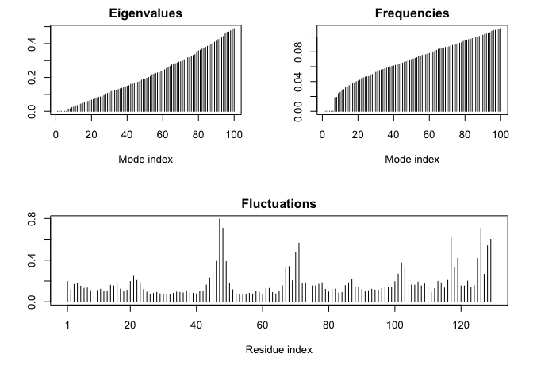

Class 12: Structural Bioinformatics (Part 2)
================
Frank Lee
5/10/2019

Obtain and prepare our structure for 'docking'
----------------------------------------------

Here we download the HIV-Pr structure from the PDB database and extract out the protein and ligand portions to separate new PDB format files.

In here, we have a few non-protein/nucleic resid values: 127 water and 1 MK1
============================================================================

We have 172 non-protein/nucleic atoms
=====================================

``` r
library(bio3d)

file <- get.pdb("1hsg")
```

    ## Warning in get.pdb("1hsg"): ./1hsg.pdb exists. Skipping download

``` r
pdb <-  read.pdb(file)
pdb
```

    ## 
    ##  Call:  read.pdb(file = file)
    ## 
    ##    Total Models#: 1
    ##      Total Atoms#: 1686,  XYZs#: 5058  Chains#: 2  (values: A B)
    ## 
    ##      Protein Atoms#: 1514  (residues/Calpha atoms#: 198)
    ##      Nucleic acid Atoms#: 0  (residues/phosphate atoms#: 0)
    ## 
    ##      Non-protein/nucleic Atoms#: 172  (residues: 128)
    ##      Non-protein/nucleic resid values: [ HOH (127), MK1 (1) ]
    ## 
    ##    Protein sequence:
    ##       PQITLWQRPLVTIKIGGQLKEALLDTGADDTVLEEMSLPGRWKPKMIGGIGGFIKVRQYD
    ##       QILIEICGHKAIGTVLVGPTPVNIIGRNLLTQIGCTLNFPQITLWQRPLVTIKIGGQLKE
    ##       ALLDTGADDTVLEEMSLPGRWKPKMIGGIGGFIKVRQYDQILIEICGHKAIGTVLVGPTP
    ##       VNIIGRNLLTQIGCTLNF
    ## 
    ## + attr: atom, xyz, seqres, helix, sheet,
    ##         calpha, remark, call

In this one, we don't have any non-protein/nucleic resid values
===============================================================

We also don't have any non-protein/nucleic atoms
================================================

``` r
# Select protein only
prot <-  atom.select(pdb, "protein", value = TRUE)
prot
```

    ## 
    ##  Call:  trim.pdb(pdb = pdb, sele)
    ## 
    ##    Total Models#: 1
    ##      Total Atoms#: 1514,  XYZs#: 4542  Chains#: 2  (values: A B)
    ## 
    ##      Protein Atoms#: 1514  (residues/Calpha atoms#: 198)
    ##      Nucleic acid Atoms#: 0  (residues/phosphate atoms#: 0)
    ## 
    ##      Non-protein/nucleic Atoms#: 0  (residues: 0)
    ##      Non-protein/nucleic resid values: [ none ]
    ## 
    ##    Protein sequence:
    ##       PQITLWQRPLVTIKIGGQLKEALLDTGADDTVLEEMSLPGRWKPKMIGGIGGFIKVRQYD
    ##       QILIEICGHKAIGTVLVGPTPVNIIGRNLLTQIGCTLNFPQITLWQRPLVTIKIGGQLKE
    ##       ALLDTGADDTVLEEMSLPGRWKPKMIGGIGGFIKVRQYDQILIEICGHKAIGTVLVGPTP
    ##       VNIIGRNLLTQIGCTLNF
    ## 
    ## + attr: atom, helix, sheet, seqres, xyz,
    ##         calpha, call

``` r
write.pdb(prot, file="1hsg_protein.pdb")
```

For ligand, we have 1 non-protein/nucleic resid value: MK1
==========================================================

We also have 45 non-protein/nucleic atoms
=========================================

``` r
# Select ligand only
lig <-  atom.select(pdb, "ligand", value = TRUE)
lig
```

    ## 
    ##  Call:  trim.pdb(pdb = pdb, sele)
    ## 
    ##    Total Models#: 1
    ##      Total Atoms#: 45,  XYZs#: 135  Chains#: 1  (values: B)
    ## 
    ##      Protein Atoms#: 0  (residues/Calpha atoms#: 0)
    ##      Nucleic acid Atoms#: 0  (residues/phosphate atoms#: 0)
    ## 
    ##      Non-protein/nucleic Atoms#: 45  (residues: 1)
    ##      Non-protein/nucleic resid values: [ MK1 (1) ]
    ## 
    ## + attr: atom, helix, sheet, seqres, xyz,
    ##         calpha, call

``` r
write.pdb(lig, file="1hsg_ligand.pdb")
```

Add Hydrogens and charges in ADT
--------------------------------

We opened our protein-only PDB file in AutoDocTools and added hydrogens and atom-types needed for docking calculations.

Run docking
-----------

We will use AutoDoc Vina here at the UNIX command line!

The command I used in Terminal was: &gt; ~/Downloads/autodock\_vina\_1\_1\_2\_mac/bin/vina --config config.txt --log log.txt

Process results back in R
-------------------------

``` r
# Set multi to true because there are multiple answers
res <- read.pdb("all.pdbqt", multi = TRUE)
res
```

    ## 
    ##  Call:  read.pdb(file = "all.pdbqt", multi = TRUE)
    ## 
    ##    Total Models#: 14
    ##      Total Atoms#: 50,  XYZs#: 2100  Chains#: 1  (values: B)
    ## 
    ##      Protein Atoms#: 0  (residues/Calpha atoms#: 0)
    ##      Nucleic acid Atoms#: 0  (residues/phosphate atoms#: 0)
    ## 
    ##      Non-protein/nucleic Atoms#: 50  (residues: 1)
    ##      Non-protein/nucleic resid values: [ MK1 (1) ]
    ## 
    ## + attr: atom, xyz, calpha, call

``` r
# Now let's write res as a new pdb as a file named 'results.pdb'
write.pdb(res, file="results.pdb")
```

This tells us that there are 14 models.

Compare our docking poses to the MERK drug structure.

``` r
ori <- read.pdb("ligand.pdbqt")
rmsd(ori, res)
```

    ##  [1]  0.590 11.163 10.531  4.364 11.040  3.682  5.741  3.864  5.442 10.920
    ## [11]  4.318  6.249 11.084  8.929

The smaller the value in rmsd (root mean square deviation), the smaller the distance.

Normal Mode Analysis example
----------------------------

Normal Mode Analysis (NMA) is a bioinformatics method that can predict the major motions of biomolecules.

``` r
pdb <- read.pdb("1hel")
```

    ##   Note: Accessing on-line PDB file

``` r
modes <- nma( pdb )
```

    ##  Building Hessian...     Done in 0.018 seconds.
    ##  Diagonalizing Hessian...    Done in 0.091 seconds.

``` r
m7 <- mktrj(modes, mode=7, file="mode_7.pdb")
```

``` r
plot(modes)
```



Then you can open the resulting mode\_7.pdb file in VMD - Use "TUBE" representation and hit the play button... Or use the bio3d.view view() function

``` r
library("bio3d.view")
view(m7, col=vec2color(rmsf(m7)))
```

    ## Potential all C-alpha atom structure(s) detected: Using calpha.connectivity()
