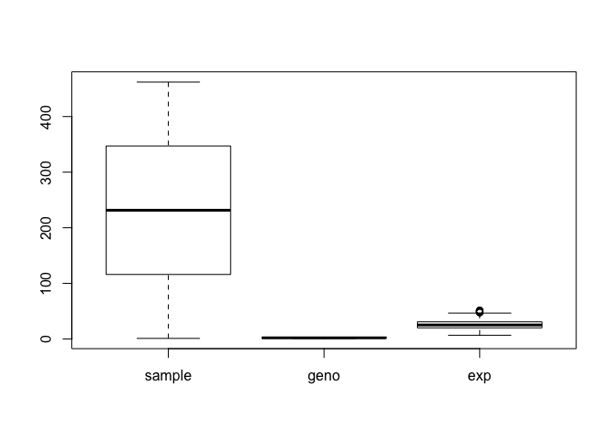
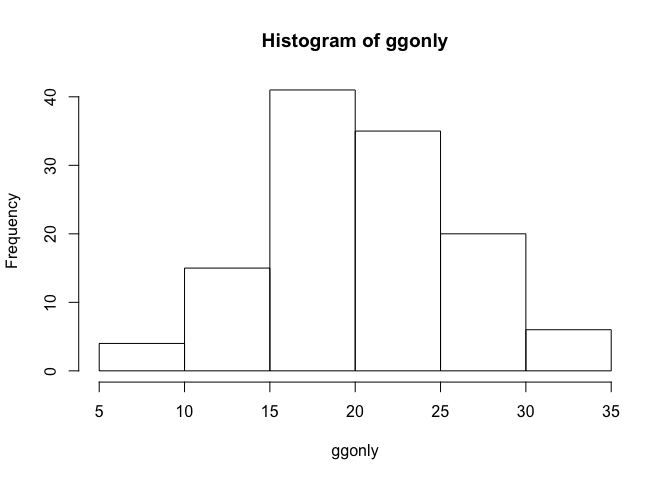
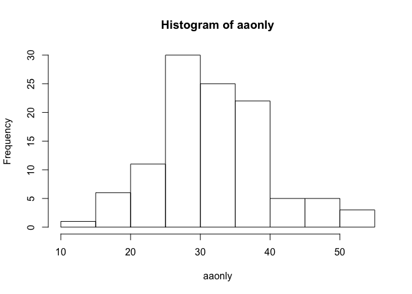
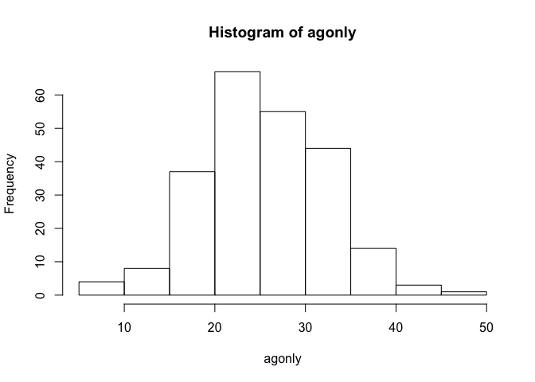
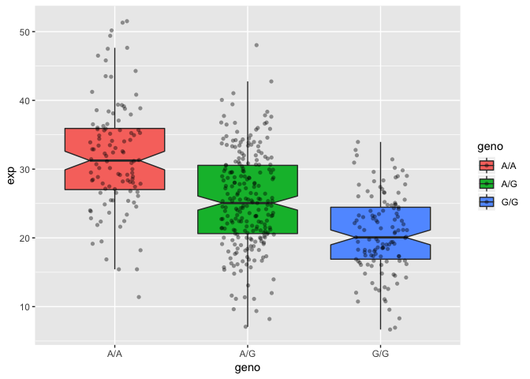

Class 13: Genome Informatics (Pt. 1)
================
Frank Lee
5/15/2019

Ensemle 1000 Genome
-------------------

What proportion of the Mexican Ancestry in the Los Angeles population (MXL) are homozygous for the asthma associated SNP (G|G)?

``` r
mxl <- read.csv("373531-SampleGenotypes-Homo_sapiens_Variation_Sample_rs8067378.csv")
head(mxl)
```

    ##   Sample..Male.Female.Unknown. Genotype..forward.strand. Population.s.
    ## 1                  NA19648 (F)                       A|A ALL, AMR, MXL
    ## 2                  NA19649 (M)                       G|G ALL, AMR, MXL
    ## 3                  NA19651 (F)                       A|A ALL, AMR, MXL
    ## 4                  NA19652 (M)                       G|G ALL, AMR, MXL
    ## 5                  NA19654 (F)                       G|G ALL, AMR, MXL
    ## 6                  NA19655 (M)                       A|G ALL, AMR, MXL
    ##   Father Mother
    ## 1      -      -
    ## 2      -      -
    ## 3      -      -
    ## 4      -      -
    ## 5      -      -
    ## 6      -      -

We can use the table function to see how many genotypes we have.

``` r
table(mxl$Genotype..forward.strand.)
```

    ## 
    ## A|A A|G G|A G|G 
    ##  22  21  12   9

``` r
# proportion
(table(mxl$Genotype..forward.strand.)/nrow(mxl)) * 100
```

    ## 
    ##     A|A     A|G     G|A     G|G 
    ## 34.3750 32.8125 18.7500 14.0625

``` r
round((table(mxl$Genotype..forward.strand.)/nrow(mxl)) * 100,2)
```

    ## 
    ##   A|A   A|G   G|A   G|G 
    ## 34.38 32.81 18.75 14.06

Quality Scores in FASTQ files
=============================

``` r
library(seqinr)
library(gtools)
s2c("DDDDCDEDCDDDDBBDDDCC@")
```

    ##  [1] "D" "D" "D" "D" "C" "D" "E" "D" "C" "D" "D" "D" "D" "B" "B" "D" "D"
    ## [18] "D" "C" "C" "@"

``` r
asc(s2c("DDDDCDEDCDDDDBBDDDCC@")) - 33 #33 is the offset
```

    ##  D  D  D  D  C  D  E  D  C  D  D  D  D  B  B  D  D  D  C  C  @ 
    ## 35 35 35 35 34 35 36 35 34 35 35 35 35 33 33 35 35 35 34 34 31

``` r
# phred <- asc(s2c("DDDDCDEDCDDDDBBDDDCC@")) - 33
# phred
```

Population Scale Analysis
-------------------------

``` r
expr <- read.table("https://bioboot.github.io/bggn213_W19/class-material/rs8067378_ENSG00000172057.6.txt", sep = " ")
head(expr)
```

    ##    sample geno      exp
    ## 1 HG00367  A/G 28.96038
    ## 2 NA20768  A/G 20.24449
    ## 3 HG00361  A/A 31.32628
    ## 4 HG00135  A/A 34.11169
    ## 5 NA18870  G/G 18.25141
    ## 6 NA11993  A/A 32.89721

``` r
table(expr$geno)
```

    ## 
    ## A/A A/G G/G 
    ## 108 233 121

``` r
boxplot <- boxplot(expr)
```



``` r
boxplot.stats
```

    ## function (x, coef = 1.5, do.conf = TRUE, do.out = TRUE) 
    ## {
    ##     if (coef < 0) 
    ##         stop("'coef' must not be negative")
    ##     nna <- !is.na(x)
    ##     n <- sum(nna)
    ##     stats <- stats::fivenum(x, na.rm = TRUE)
    ##     iqr <- diff(stats[c(2, 4)])
    ##     if (coef == 0) 
    ##         do.out <- FALSE
    ##     else {
    ##         out <- if (!is.na(iqr)) {
    ##             x < (stats[2L] - coef * iqr) | x > (stats[4L] + coef * 
    ##                 iqr)
    ##         }
    ##         else !is.finite(x)
    ##         if (any(out[nna], na.rm = TRUE)) 
    ##             stats[c(1, 5)] <- range(x[!out], na.rm = TRUE)
    ##     }
    ##     conf <- if (do.conf) 
    ##         stats[3L] + c(-1.58, 1.58) * iqr/sqrt(n)
    ##     list(stats = stats, n = n, conf = conf, out = if (do.out) x[out & 
    ##         nna] else numeric())
    ## }
    ## <bytecode: 0x7fedb7b3c148>
    ## <environment: namespace:grDevices>

``` r
summary(expr)
```

    ##      sample     geno          exp        
    ##  HG00096:  1   A/A:108   Min.   : 6.675  
    ##  HG00097:  1   A/G:233   1st Qu.:20.004  
    ##  HG00099:  1   G/G:121   Median :25.116  
    ##  HG00100:  1             Mean   :25.640  
    ##  HG00101:  1             3rd Qu.:30.779  
    ##  HG00102:  1             Max.   :51.518  
    ##  (Other):456

How do I access the G/G genotypes?

``` r
inds <- (expr$geno == "G/G")
ggonly <- expr[inds,]$exp
summary(ggonly)
```

    ##    Min. 1st Qu.  Median    Mean 3rd Qu.    Max. 
    ##   6.675  16.903  20.074  20.594  24.457  33.956

``` r
hist(ggonly)
```



``` r
inds <- (expr$geno == "A/A")
aaonly <- expr[inds,]$exp
summary(aaonly)
```

    ##    Min. 1st Qu.  Median    Mean 3rd Qu.    Max. 
    ##   11.40   27.02   31.25   31.82   35.92   51.52

``` r
hist(aaonly)
```



``` r
inds <- (expr$geno == "A/G")
agonly <- expr[inds,]$exp
summary(agonly)
```

    ##    Min. 1st Qu.  Median    Mean 3rd Qu.    Max. 
    ##   7.075  20.626  25.065  25.397  30.552  48.034

``` r
hist(agonly)
```



First try at a boxplot to show this data

``` r
# y ~ grp (y is the vector, grp is how you want to divide the groups (by genotype))
# notch shows that two medians strongly differ
boxplot(exp ~ geno, data = expr, notch = TRUE)
```


And some ggplot graphs because they look nicer ;-)

``` r
library(ggplot2)

ggplot(expr, aes(geno, exp)) + geom_boxplot()
```


``` r
## Histogram of the exp column with ggplot2
ggplot(expr, aes(exp, fill = geno)) + geom_density(alpha = 0.2)
```


``` r
# Boxplot with the data shown
ggplot(expr, aes(geno, exp, fill=geno)) + 
  geom_boxplot(notch=TRUE, outlier.shape = NA) + 
  geom_jitter(shape=16, position=position_jitter(0.2), alpha=0.4)
```


