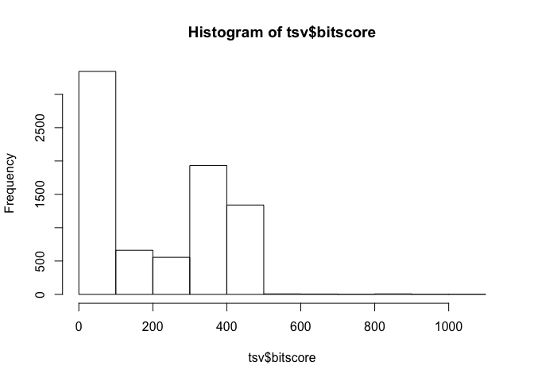
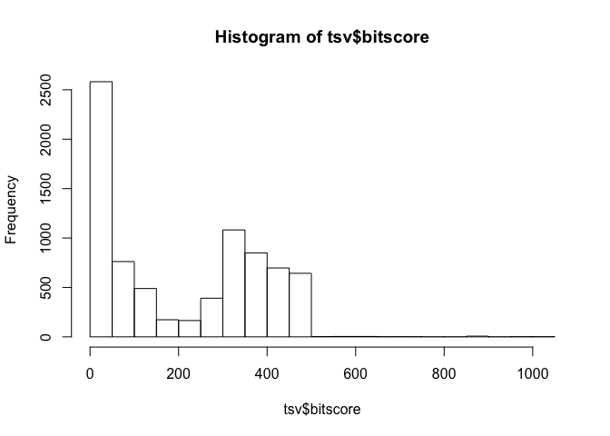
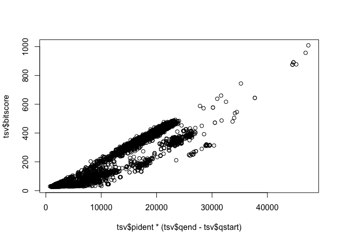
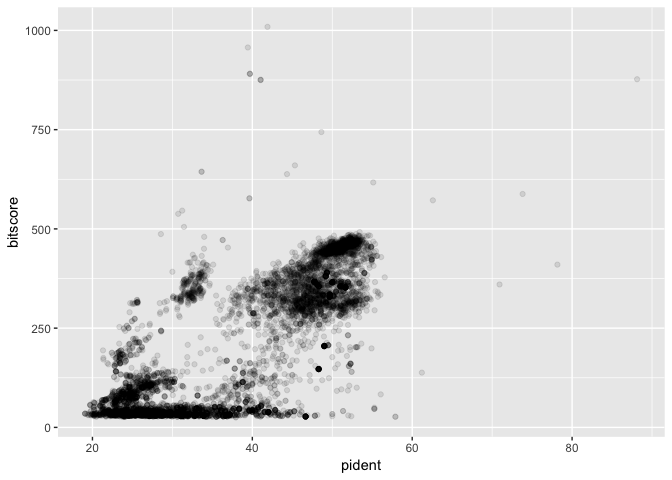
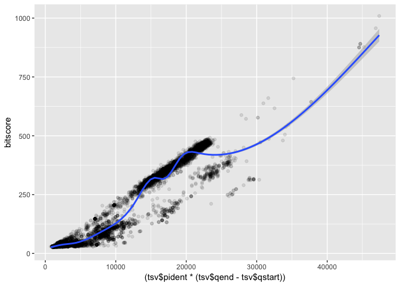
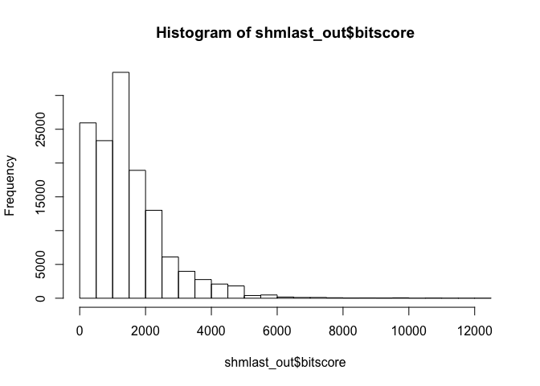
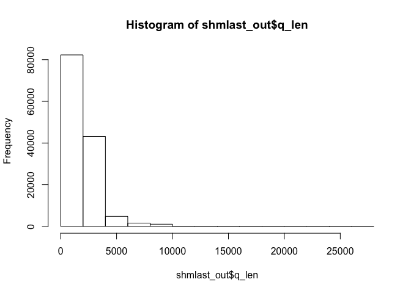
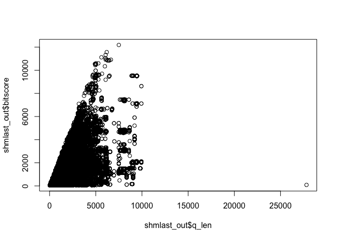

Class 16: Introduction to UNIX
================

``` r
library(bio3d)
```

``` r
tsv <- read.csv("mm-second.x.zebrafish.tsv", sep = "")
head(tsv)
```

    ##   YP_220550.1    NP_059331.1 X69.010 X313 X97 X0  X4 X316 X10 X322
    ## 1 YP_220551.1    NP_059332.1  44.509  346 188  3   1  344   1  344
    ## 2 YP_220551.1    NP_059341.1  24.540  163 112  3 112  263 231  393
    ## 3 YP_220551.1    NP_059340.1  26.804   97  65  2  98  188 200  296
    ## 4 YP_220552.1    NP_059333.1  88.132  514  61  0   1  514   1  514
    ## 5 YP_220552.1 XP_021326074.1  31.818   66  32  2 427  482  16   78
    ## 6 YP_220552.1 XP_005162943.1  31.818   66  32  2 427  482  48  110
    ##   X1.24e.150  X426
    ## 1   8.62e-92 279.0
    ## 2   5.14e-06  49.7
    ## 3   1.00e-01  35.8
    ## 4   0.00e+00 877.0
    ## 5   6.70e+00  29.3
    ## 6   7.50e+00  29.6

Make a histogram of the $bitscore values. You may want to set the optional breaks to be a larger number (e.g. breaks=30).

``` r
colnames(tsv)
```

    ##  [1] "YP_220550.1" "NP_059331.1" "X69.010"     "X313"        "X97"        
    ##  [6] "X0"          "X4"          "X316"        "X10"         "X322"       
    ## [11] "X1.24e.150"  "X426"

``` r
colnames(tsv) <- c("qseqid", "sseqid", "pident", "length", "mismatch", "gapopen", "qstart", "qend", "sstart", "send", "evalue", "bitscore")

hist(tsv$bitscore)
```



``` r
hist(tsv$bitscore, breaks = 30)
```

 The answer is that bitscores are only somewhat related to pident; they take into account not only the percent identity but the length of the alignment. You can get a napkin sketch estimate of this by doing the following:

``` r
## Asuming your blast results are stored in an object called 'b'
plot(tsv$pident  * (tsv$qend - tsv$qstart), tsv$bitscore)
```



Or using ggplot (note you will have to install the ggplot2 package first if you are working on JetStream)

``` r
library("ggplot2")
```

``` r
ggplot(tsv, aes(pident, bitscore)) + geom_point(alpha=0.1) 
```



``` r
ggplot(tsv, aes((tsv$pident * (tsv$qend - tsv$qstart)), bitscore)) + geom_point(alpha=0.1) + geom_smooth(aes((tsv$pident * (tsv$qend - tsv$qstart)), bitscore))
```

    ## `geom_smooth()` using method = 'gam' and formula 'y ~ s(x, bs = "cs")'



``` r
read.csv("mouse.1.rna.fna.gz.x.cow.faa.crbl.csv")
```

    ##                  E      EG2   E_scaled      ID   bitscore q_aln_len
    ## 1     6.600000e-24  9.8e-16  23.180456  641897  109.65804        89
    ## 2    5.400000e-194 4.4e-165 193.267606  719314  605.75894       313
    ## 3    2.800000e-188 5.0e-160 187.552842  423289  588.98685       307
    ## 4    6.600000e-183 5.6e-155 182.180456  725159  572.21476       307
    ## 5    5.400000e-194 4.4e-165 193.267606  719315  605.75894       313
    ## 6    2.800000e-188 5.0e-160 187.552842  423290  588.98685       307
    ## 7    6.600000e-183 5.6e-155 182.180456  725160  572.21476       307
    ## 8    4.800000e-183 5.6e-155 182.318759  373474  572.21476       266
    ## 9    3.200000e-153 3.1e-138 152.494850  643504  516.60202       246
    ## 10    1.900000e-78  4.2e-64  77.721246 1017059  270.31705       124
    ## 11    8.100000e-99  1.7e-81  98.091515 1017060  328.13664       151
    ## 12   5.800000e-184 1.2e-155 183.236572  805746  574.42161       307
    ## 13   3.200000e-181 1.6e-153 180.494850  838366  567.35968       307
    ## 14   1.000000e-145 5.1e-126 145.000000  198480  475.99590       253
    ## 15   5.800000e-184 1.2e-155 183.236572  805747  574.42161       307
    ## 16   3.200000e-181 1.6e-153 180.494850  838367  567.35968       307
    ## 17   1.000000e-145 5.1e-126 145.000000  198481  475.99590       253
    ## 18   1.200000e-200 2.9e-189 199.920819  652978  686.08845       337
    ## 19   5.500000e-176 4.7e-152 175.259637  652953  562.50460       274
    ## 20    2.700000e-23  3.3e-15  22.568636  652958  107.89256        58
    ## 21   3.700000e-216 1.0e-188 215.431798 1156973  684.32297       335
    ## 22   4.500000e-142 4.3e-123 141.346787  642643  466.28574       228
    ## 23    3.500000e-80  1.3e-72  79.455932 1155780  298.56479       151
    ## 24    4.400000e-70  1.7e-62  69.356547  652981  265.02060       125
    ## 25    3.200000e-72  1.9e-61  71.494850  652956  261.48964       125
    ## 26    1.400000e-68  4.7e-59  67.853872 1156976  253.54496       125
    ## 27    1.800000e-43  7.2e-35  42.744727  642646  173.21546        82
    ## 28    4.400000e-70  1.7e-62  69.356547  652982  265.02060       125
    ## 29    3.200000e-72  1.9e-61  71.494850  652957  261.48964       125
    ## 30    1.400000e-68  4.7e-59  67.853872 1156977  253.54496       125
    ## 31    1.800000e-43  7.2e-35  42.744727  642647  173.21546        82
    ## 32   4.300000e-203 7.4e-172 202.366532  790311  628.26886       312
    ## 33   3.500000e-198 3.9e-168 197.455932  808267  615.91048       312
    ## 34   8.100000e-197 4.5e-167 196.091515  760445  612.37951       312
    ## 35   6.900000e-188 3.1e-159 187.161151  787756  586.33862       312
    ## 36   7.400000e-183 4.1e-155 182.130768    8519  572.65613       307
    ## 37   8.100000e-187 1.1e-158 186.091515  719834  584.57314       311
    ## 38   1.800000e-184 3.5e-156 183.744727  790323  576.18709       309
    ## 39   7.100000e-183 5.6e-155 182.148742  808273  572.21476       309
    ## 40   6.300000e-182 3.5e-154 181.200659  760451  569.56653       308
    ## 41   1.800000e-184 3.5e-156 183.744727  790324  576.18709       309
    ## 42   7.100000e-183 5.6e-155 182.148742  808274  572.21476       309
    ## 43   6.300000e-182 3.5e-154 181.200659  760452  569.56653       308
    ## 44   9.200000e-180 2.5e-152 179.036212  790327  563.38734       300
    ## 45   1.700000e-178 2.9e-151 177.769551  808277  559.85637       300
    ## 46   2.400000e-196 1.5e-166 195.619789  768386  610.61402       312
    ## 47   9.200000e-180 2.5e-152 179.036212  790328  563.38734       300
    ## 48   1.700000e-178 2.9e-151 177.769551  808278  559.85637       300
    ## 49   2.400000e-196 1.5e-166 195.619789  768387  610.61402       312
    ## 50   4.300000e-203 7.4e-172 202.366532  790312  628.26886       312
    ## 51   3.500000e-198 3.9e-168 197.455932  808268  615.91048       312
    ## 52   8.100000e-197 4.5e-167 196.091515  760446  612.37951       312
    ## 53   6.900000e-188 3.1e-159 187.161151  787757  586.33862       312
    ## 54   7.400000e-183 4.1e-155 182.130768    8521  572.65613       307
    ## 55   8.100000e-187 1.1e-158 186.091515  719835  584.57314       311
    ## 56   1.800000e-201 4.7e-171 200.744727  790315  625.62064       312
    ## 57   2.900000e-201 1.2e-170 200.537602  808265  624.29652       312
    ## 58   1.400000e-197 2.5e-167 196.853872  760443  613.26225       312
    ## 59   6.900000e-194 2.8e-164 193.161151  787752  603.11072       312
    ## 60   5.700000e-184 4.8e-156 183.244125    8516  575.74572       307
    ## 61   4.200000e-184 3.5e-156 183.376751  719840  576.18709       311
    ## 62   1.800000e-201 4.7e-171 200.744727  790316  625.62064       312
    ## 63   2.900000e-201 1.2e-170 200.537602  808266  624.29652       312
    ## 64   1.400000e-197 2.5e-167 196.853872  760444  613.26225       312
    ## 65   6.900000e-194 2.8e-164 193.161151  787753  603.11072       312
    ## 66   5.700000e-184 4.8e-156 183.244125    8517  575.74572       307
    ## 67   4.200000e-184 3.5e-156 183.376751  719841  576.18709       311
    ## 68   1.100000e-200 7.3e-170 199.958607  790317  621.64830       312
    ## 69   7.400000e-197 4.5e-167 196.130768  808269  612.37951       312
    ## 70   1.200000e-194 8.2e-165 193.920819  760447  604.87620       312
    ## 71   3.200000e-187 7.8e-159 186.494850  787758  585.01451       312
    ## 72   7.400000e-183 4.1e-155 182.130768    8518  572.65613       307
    ## 73   1.000000e-185 1.2e-157 185.000000  719836  581.04217       311
    ## 74   1.100000e-200 7.3e-170 199.958607  790318  621.64830       312
    ## 75   7.400000e-197 4.5e-167 196.130768  808270  612.37951       312
    ## 76   1.200000e-194 8.2e-165 193.920819  760448  604.87620       312
    ## 77   3.200000e-187 7.8e-159 186.494850  787759  585.01451       312
    ## 78   7.400000e-183 4.1e-155 182.130768    8520  572.65613       307
    ## 79   1.000000e-185 1.2e-157 185.000000  719837  581.04217       311
    ## 80   1.800000e-184 1.9e-156 183.744727  790321  577.06984       312
    ## 81   6.100000e-183 7.6e-155 182.214670  808275  571.77338       312
    ## 82   6.800000e-208 7.7e-176 207.167491  734510  641.50999       312
    ## 83   1.800000e-184 1.9e-156 183.744727  790322  577.06984       312
    ## 84   6.100000e-183 7.6e-155 182.214670  808276  571.77338       312
    ## 85   6.800000e-208 7.7e-176 207.167491  734511  641.50999       312
    ## 86   2.800000e-202 1.9e-171 201.552842  790313  626.94475       311
    ## 87   7.700000e-203 4.0e-172 202.113509  808263  629.15160       311
    ## 88   7.700000e-182 6.4e-154 181.113509  734514  568.68379       307
    ## 89   4.600000e-198 9.8e-168 197.337242  760441  614.58636       310
    ## 90   1.200000e-188 6.8e-160 187.920819  787754  588.54548       306
    ## 91   8.300000e-187 2.7e-158 186.080922    8514  583.24903       302
    ## 92   9.100000e-186 1.7e-157 185.040959  719838  580.60080       313
    ## 93   2.800000e-202 1.9e-171 201.552842  790314  626.94475       311
    ## 94   7.700000e-203 4.0e-172 202.113509  808264  629.15160       311
    ## 95   7.700000e-182 6.4e-154 181.113509  734515  568.68379       307
    ## 96   4.600000e-198 9.8e-168 197.337242  760442  614.58636       310
    ## 97   1.200000e-188 6.8e-160 187.920819  787755  588.54548       306
    ## 98   8.300000e-187 2.7e-158 186.080922    8515  583.24903       302
    ## 99   9.100000e-186 1.7e-157 185.040959  719839  580.60080       313
    ## 100  6.600000e-192 1.5e-162 191.180456  790319  597.37290       311
    ## 101  6.500000e-188 2.3e-159 187.187087  808271  586.78000       311
    ## 102  1.900000e-184 2.6e-156 183.721246  760449  576.62846       310
    ## 103  6.600000e-192 1.5e-162 191.180456  790320  597.37290       311
    ## 104  6.500000e-188 2.3e-159 187.187087  808272  586.78000       311
    ## 105  1.900000e-184 2.6e-156 183.721246  760450  576.62846       310
    ## 106  5.200000e-197 2.5e-167 196.283997    5893  613.26225       305
    ## 107  1.300000e-196 1.5e-166 195.886057  720248  610.61402       305
    ## 108  1.800000e-180 5.5e-153 179.744727  786530  565.59419       308
    ## 109  7.000000e-181 4.0e-153 180.154902  798938  566.03556       308
    ## 110  5.200000e-197 2.5e-167 196.283997    5894  613.26225       305
    ## 111  1.300000e-196 1.5e-166 195.886057  720249  610.61402       305
    ## 112  1.800000e-180 5.5e-153 179.744727  786531  565.59419       308
    ## 113  7.000000e-181 4.0e-153 180.154902  798939  566.03556       308
    ## 114   1.300000e-68  2.2e-56  67.886057  720423  244.71754       307
    ## 115   1.500000e-35  1.9e-23  34.823909  720436  135.25756        64
    ## 116   1.500000e-35  1.9e-23  34.823909  720437  135.25756        64
    ## 117  5.900000e-163 4.2e-138 162.229148  792338  516.16065       314
    ## 118   1.100000e-03  1.3e+04   2.958607 1015173   46.10063        24
    ## 119  1.600000e-108  3.2e-87 107.795880 1158323  347.11559       148
    ## 120   7.300000e-93  1.6e-77  92.136677  777574  314.89552       298
    ## 121  7.100000e-168 4.3e-142 167.148742  830473  529.40178       306
    ## 122  4.200000e-190 5.7e-176 189.376751  862059  641.95136       571
    ## 123  1.500000e-182 2.6e-154 181.823909  715416  570.00790       304
    ## 124  1.500000e-182 2.6e-154 181.823909  715417  570.00790       304
    ## 125  4.000000e-128 9.0e-120 127.397940  999158  455.25147       472
    ## 126   0.000000e+00  0.0e+00 307.652656  584309 2524.39828      1337
    ## 127   0.000000e+00  0.0e+00 307.652656  584408 2482.46804      1325
    ## 128   0.000000e+00  0.0e+00 307.652656  584503 2387.13193      1298
    ## 129   0.000000e+00  0.0e+00 307.652656  584684 1245.30539       572
    ## 130   0.000000e+00  0.0e+00 307.652656  584637 1380.36489       816
    ## 131   0.000000e+00  0.0e+00 307.652656  584755 1245.30539       572
    ## 132   0.000000e+00  0.0e+00 307.652656  584820 1209.11297       559
    ## 133   0.000000e+00  0.0e+00 307.652656  584597 1385.21997       818
    ## 134   0.000000e+00  0.0e+00 307.652656  584319 1247.51224       580
    ## 135   0.000000e+00  0.0e+00 307.652656  584414 1205.58201       568
    ## 136   0.000000e+00  0.0e+00 307.652656  584509 1255.01555       581
    ## 137   0.000000e+00  0.0e+00 307.652656  584680 1252.80869       572
    ## 138   0.000000e+00  0.0e+00 307.652656  584749 1253.69144       576
    ## 139   0.000000e+00  0.0e+00 307.652656  584824 1204.25789       563
    ## 140   0.000000e+00  0.0e+00 307.652656  584320 1247.51224       580
    ## 141   0.000000e+00  0.0e+00 307.652656  584415 1205.58201       568
    ## 142   0.000000e+00  0.0e+00 307.652656  584510 1255.01555       581
    ## 143   0.000000e+00  0.0e+00 307.652656  584683 1252.80869       572
    ## 144   0.000000e+00  0.0e+00 307.652656  584750 1253.69144       576
    ## 145   0.000000e+00  0.0e+00 307.652656  584825 1204.25789       563
    ## 146   0.000000e+00  0.0e+00 307.652656  584321 1245.30539       571
    ## 147   0.000000e+00  0.0e+00 307.652656  584416 1203.37515       559
    ## 148   0.000000e+00  0.0e+00 307.652656  584511 1252.80869       572
    ## 149   0.000000e+00  0.0e+00 307.652656  584676 1262.51885       580
    ## 150   2.500000e-22  6.1e-15  21.602060  584648  107.00982        50
    ## 151   0.000000e+00  0.0e+00 307.652656  584747 1255.45692       573
    ## 152   0.000000e+00  0.0e+00 307.652656  584822 1206.02338       560
    ## 153   8.600000e-24  2.1e-16  23.065502  584608  111.86490        52
    ## 154   0.000000e+00  0.0e+00 307.652656  584322 1245.30539       571
    ## 155   0.000000e+00  0.0e+00 307.652656  584417 1203.37515       559
    ## 156   0.000000e+00  0.0e+00 307.652656  584512 1252.80869       572
    ## 157   0.000000e+00  0.0e+00 307.652656  584677 1262.51885       580
    ## 158   2.500000e-22  6.1e-15  21.602060  584649  107.00982        50
    ## 159   0.000000e+00  0.0e+00 307.652656  584748 1255.45692       573
    ## 160   0.000000e+00  0.0e+00 307.652656  584823 1206.02338       560
    ## 161   8.600000e-24  2.1e-16  23.065502  584609  111.86490        52
    ## 162   0.000000e+00  0.0e+00 307.652656  584313 2482.46804      1337
    ## 163   0.000000e+00  0.0e+00 307.652656  584404 2497.91602      1325
    ## 164   0.000000e+00  0.0e+00 307.652656  584507 2345.20169      1298
    ## 165   0.000000e+00  0.0e+00 307.652656  584688 1203.37515       572
    ## 166   0.000000e+00  0.0e+00 307.652656  584639 1380.36489       816
    ## 167   0.000000e+00  0.0e+00 307.652656  584759 1203.37515       572
    ## 168   0.000000e+00  0.0e+00 307.652656  584816 1224.56096       559
    ## 169   0.000000e+00  0.0e+00 307.652656  584599 1385.21997       818
    ## 170   0.000000e+00  0.0e+00 307.652656  584314 2482.46804      1337
    ## 171   0.000000e+00  0.0e+00 307.652656  584405 2497.91602      1325
    ## 172   0.000000e+00  0.0e+00 307.652656  584508 2345.20169      1298
    ## 173   0.000000e+00  0.0e+00 307.652656  584689 1203.37515       572
    ## 174   0.000000e+00  0.0e+00 307.652656  584643 1380.36489       816
    ## 175   0.000000e+00  0.0e+00 307.652656  584760 1203.37515       572
    ## 176   0.000000e+00  0.0e+00 307.652656  584817 1224.56096       559
    ## 177   0.000000e+00  0.0e+00 307.652656  584603 1385.21997       818
    ## 178   0.000000e+00  0.0e+00 307.652656  584315 2476.73022      1337
    ## 179   0.000000e+00  0.0e+00 307.652656  584406 2492.17820      1325
    ## 180   0.000000e+00  0.0e+00 307.652656  584505 2352.70500      1298
    ## 181   0.000000e+00  0.0e+00 307.652656  584686 1210.87846       572
    ## 182   0.000000e+00  0.0e+00 307.652656  584638 1380.36489       816
    ## 183   0.000000e+00  0.0e+00 307.652656  584757 1210.87846       572
    ## 184   0.000000e+00  0.0e+00 307.652656  584818 1218.82313       559
    ## 185   0.000000e+00  0.0e+00 307.652656  584598 1385.21997       818
    ## 186   0.000000e+00  0.0e+00 307.652656  584316 2476.73022      1337
    ## 187   0.000000e+00  0.0e+00 307.652656  584407 2492.17820      1325
    ## 188   0.000000e+00  0.0e+00 307.652656  584506 2352.70500      1298
    ## 189   0.000000e+00  0.0e+00 307.652656  584687 1210.87846       572
    ## 190   0.000000e+00  0.0e+00 307.652656  584642 1380.36489       816
    ## 191   0.000000e+00  0.0e+00 307.652656  584758 1210.87846       572
    ## 192   0.000000e+00  0.0e+00 307.652656  584819 1218.82313       559
    ## 193   0.000000e+00  0.0e+00 307.652656  584602 1385.21997       818
    ## 194   0.000000e+00  0.0e+00 307.652656  584311 2518.66046      1337
    ## 195   0.000000e+00  0.0e+00 307.652656  584410 2476.73022      1325
    ## 196   0.000000e+00  0.0e+00 307.652656  584501 2394.63523      1298
    ## 197   0.000000e+00  0.0e+00 307.652656  584678 1252.80869       572
    ## 198   0.000000e+00  0.0e+00 307.652656  584636 1380.36489       816
    ## 199   0.000000e+00  0.0e+00 307.652656  584751 1252.80869       572
    ## 200   0.000000e+00  0.0e+00 307.652656  584826 1203.37515       559
    ## 201   0.000000e+00  0.0e+00 307.652656  584596 1385.21997       818
    ## 202   0.000000e+00  0.0e+00 307.652656  584312 2518.66046      1337
    ## 203   0.000000e+00  0.0e+00 307.652656  584411 2476.73022      1325
    ## 204   0.000000e+00  0.0e+00 307.652656  584502 2394.63523      1298
    ## 205   0.000000e+00  0.0e+00 307.652656  584681 1252.80869       572
    ## 206   0.000000e+00  0.0e+00 307.652656  584640 1380.36489       816
    ## 207   0.000000e+00  0.0e+00 307.652656  584753 1252.80869       572
    ## 208   0.000000e+00  0.0e+00 307.652656  584828 1203.37515       559
    ## 209   0.000000e+00  0.0e+00 307.652656  584600 1385.21997       818
    ## 210   0.000000e+00  0.0e+00 307.652656  584310 2524.39828      1337
    ## 211   0.000000e+00  0.0e+00 307.652656  584409 2482.46804      1325
    ## 212   0.000000e+00  0.0e+00 307.652656  584504 2387.13193      1298
    ## 213   0.000000e+00  0.0e+00 307.652656  584685 1245.30539       572
    ## 214   0.000000e+00  0.0e+00 307.652656  584641 1380.36489       816
    ## 215   0.000000e+00  0.0e+00 307.652656  584756 1245.30539       572
    ## 216   0.000000e+00  0.0e+00 307.652656  584821 1209.11297       559
    ## 217   0.000000e+00  0.0e+00 307.652656  584601 1385.21997       818
    ## 218   0.000000e+00  0.0e+00 307.652656  584317 2380.95273      1337
    ## 219   0.000000e+00  0.0e+00 307.652656  584412 2339.02250      1325
    ## 220   0.000000e+00  0.0e+00 307.652656  584499 2447.59974      1298
    ## 221   0.000000e+00  0.0e+00 307.652656  584679 1252.80869       572
    ## 222   0.000000e+00  0.0e+00 307.652656  584644 1226.32644       816
    ## 223   0.000000e+00  0.0e+00 307.652656  584752 1252.80869       572
    ## 224   0.000000e+00  0.0e+00 307.652656  584827 1203.37515       559
    ## 225   0.000000e+00  0.0e+00 307.652656  584604 1231.18152       818
    ## 226   0.000000e+00  0.0e+00 307.652656  584318 2380.95273      1337
    ## 227   0.000000e+00  0.0e+00 307.652656  584413 2339.02250      1325
    ## 228   0.000000e+00  0.0e+00 307.652656  584500 2447.59974      1298
    ## 229   0.000000e+00  0.0e+00 307.652656  584682 1252.80869       572
    ## 230   0.000000e+00  0.0e+00 307.652656  584645 1226.32644       816
    ## 231   0.000000e+00  0.0e+00 307.652656  584754 1252.80869       572
    ## 232   0.000000e+00  0.0e+00 307.652656  584829 1203.37515       559
    ## 233   0.000000e+00  0.0e+00 307.652656  584605 1231.18152       818
    ## 234  2.800000e-185 2.1e-164 184.552842  721201  603.55209       319
    ## 235  1.800000e-190 3.2e-161 189.744727  728225  592.95919       311
    ## 236  3.800000e-184 6.5e-156 183.420216  835738  575.30435       310
    ## 237  1.400000e-182 1.4e-154 181.853872  835982  570.89064       304
    ## 238  1.400000e-184 9.5e-164 183.853872  721203  601.34524       310
    ## 239  7.300000e-187 2.0e-158 186.136677  835734  583.69040       310
    ## 240  3.500000e-188 2.3e-159 187.455932  835972  586.78000       302
    ## 241  1.400000e-184 9.5e-164 183.853872  721204  601.34524       310
    ## 242  7.300000e-187 2.0e-158 186.136677  835735  583.69040       310
    ## 243  3.500000e-188 2.3e-159 187.455932  835973  586.78000       302
    ## 244  5.900000e-179 7.8e-159 178.229148  721210  585.01451       302
    ## 245  3.400000e-195 3.3e-165 194.468521  728223  606.20032       309
    ## 246  1.500000e-182 1.0e-154 181.823909  835980  571.33201       308
    ## 247  5.900000e-179 7.8e-159 178.229148  721211  585.01451       302
    ## 248  3.400000e-195 3.3e-165 194.468521  728224  606.20032       309
    ## 249  1.500000e-182 1.0e-154 181.823909  835981  571.33201       308
    ## 250  7.500000e-182 2.3e-161 181.124939  721205  593.40056       306
    ## 251  1.300000e-182 7.6e-155 181.886057  728230  571.77338       305
    ## 252  1.200000e-189 7.9e-161 188.920819  835732  591.63508       307
    ## 253  7.100000e-186 2.3e-157 185.148742  835978  580.15943       306
    ## 254  7.500000e-182 2.3e-161 181.124939  721206  593.40056       306
    ## 255  1.300000e-182 7.6e-155 181.886057  728231  571.77338       305
    ## 256  1.200000e-189 7.9e-161 188.920819  835733  591.63508       307
    ## 257  7.100000e-186 2.3e-157 185.148742  835979  580.15943       306
    ## 258  1.500000e-180 2.7e-160 179.823909  721207  589.86959       308
    ## 259  9.000000e-186 2.3e-157 185.045757  835736  580.15943       307
    ## 260  1.600000e-186 3.6e-158 185.795880  835974  582.80766       312
    ## 261  1.500000e-180 2.7e-160 179.823909  721208  589.86959       308
    ## 262  9.000000e-186 2.3e-157 185.045757  835737  580.15943       307
    ## 263  1.600000e-186 3.6e-158 185.795880  835975  582.80766       312
    ## 264  2.800000e-185 2.1e-164 184.552842  721202  603.55209       319
    ## 265  1.800000e-190 3.2e-161 189.744727  728226  592.95919       311
    ## 266  3.800000e-184 6.5e-156 183.420216  835739  575.30435       310
    ## 267  1.400000e-182 1.4e-154 181.853872  835983  570.89064       304
    ## 268   1.400000e-51  5.6e-43  50.853872  721419  200.13908       121
    ## 269   0.000000e+00  0.0e+00 307.652656  590590 3071.25683      1730
    ## 270   0.000000e+00  0.0e+00 307.652656  591016 3063.75353      1729
    ## 271   0.000000e+00  0.0e+00 307.652656  592114 2815.70308      1617
    ## 272   0.000000e+00  0.0e+00 307.652656  590802 3071.25683      1730
    ## 273   0.000000e+00  0.0e+00 307.652656  590591 3071.25683      1730
    ## 274   0.000000e+00  0.0e+00 307.652656  591017 3063.75353      1729
    ## 275   0.000000e+00  0.0e+00 307.652656  592115 2815.70308      1617
    ## 276   0.000000e+00  0.0e+00 307.652656  590803 3071.25683      1730
    ## 277   0.000000e+00  0.0e+00 307.652656  590594 3041.68498      1730
    ## 278   0.000000e+00  0.0e+00 307.652656  591020 3034.18168      1729
    ## 279   0.000000e+00  0.0e+00 307.652656  590806 3041.68498      1730
    ## 280   0.000000e+00  0.0e+00 307.652656  590595 3041.68498      1730
    ## 281   0.000000e+00  0.0e+00 307.652656  591021 3034.18168      1729
    ## 282   0.000000e+00  0.0e+00 307.652656  590807 3041.68498      1730
    ## 283   0.000000e+00  0.0e+00 307.652656  590596 3041.68498      1730
    ## 284   0.000000e+00  0.0e+00 307.652656  591022 3034.18168      1729
    ## 285   0.000000e+00  0.0e+00 307.652656  590808 3041.68498      1730
    ## 286   0.000000e+00  0.0e+00 307.652656  590597 3041.68498      1730
    ## 287   0.000000e+00  0.0e+00 307.652656  591023 3034.18168      1729
    ## 288   0.000000e+00  0.0e+00 307.652656  590809 3041.68498      1730
    ## 289   0.000000e+00  0.0e+00 307.652656  590598 3034.18168      1730
    ## 290   0.000000e+00  0.0e+00 307.652656  591018 3039.91950      1729
    ## 291   0.000000e+00  0.0e+00 307.652656  592122 2778.62792      1617
    ## 292   0.000000e+00  0.0e+00 307.652656  590810 3034.18168      1730
    ## 293   0.000000e+00  0.0e+00 307.652656  590599 3034.18168      1730
    ## 294   0.000000e+00  0.0e+00 307.652656  591019 3039.91950      1729
    ## 295   0.000000e+00  0.0e+00 307.652656  592123 2778.62792      1617
    ## 296   0.000000e+00  0.0e+00 307.652656  590811 3034.18168      1730
    ## 297   7.600000e-59  2.8e-50  58.119186  721423  224.41448       401
    ## 298  5.200000e-190 7.2e-168 189.283997  721498  615.02773       308
    ## 299  1.100000e-188 4.3e-161 187.958607  659211  592.51782       308
    ## 300  3.900000e-183 6.9e-162 182.408935  721502  595.16604       306
    ## 301  9.800000e-199 1.8e-169 198.008774  659205  620.32418       306
    ## 302  3.900000e-183 6.9e-162 182.408935  721503  595.16604       306
    ## 303  9.800000e-199 1.8e-169 198.008774  659206  620.32418       306
    ## 304  1.300000e-181 1.5e-160 180.886057  721504  590.75233       306
    ## 305  1.600000e-195 1.1e-166 194.795880  659209  611.05540       306
    ## 306  1.300000e-181 1.5e-160 180.886057  721505  590.75233       306
    ## 307  1.600000e-195 1.1e-166 194.795880  659210  611.05540       306
    ## 308  5.200000e-190 7.2e-168 189.283997  721499  615.02773       308
    ## 309  1.100000e-188 4.3e-161 187.958607  659212  592.51782       308
    ## 310  3.500000e-183 5.1e-162 182.455932  721500  595.60741       308
    ## 311  1.400000e-196 9.8e-168 195.853872  659207  614.58636       308
    ## 312  3.500000e-183 5.1e-162 182.455932  721501  595.60741       308
    ## 313  1.400000e-196 9.8e-168 195.853872  659208  614.58636       308
    ## 314  1.700000e-197 1.8e-167 196.769551  721697  613.70362       306
    ## 315  1.700000e-197 1.8e-167 196.769551  721698  613.70362       306
    ## 316   2.300000e-76  1.9e-61  75.638272  131218  261.48964       160
    ## 317   1.500000e-26  6.3e-19  25.823909  272634  120.25095        56
    ## 318   2.300000e-76  1.9e-61  75.638272  131219  261.48964       160
    ## 319   1.500000e-26  6.3e-19  25.823909  272635  120.25095        56
    ## 320  3.600000e-203 2.6e-192 202.443697  204256  696.23998       340
    ## 321  2.300000e-209 1.1e-177 208.638272  721962  647.68918       312
    ## 322  2.300000e-209 1.1e-177 208.638272  721963  647.68918       312
    ## 323  3.500000e-198 3.9e-168 197.455932  722605  615.91048       312
    ## 324  8.400000e-196 3.8e-166 195.075721  722184  609.28991       312
    ## 325  4.100000e-194 1.1e-164 193.387216  722397  604.43483       312
    ## 326  3.500000e-198 3.9e-168 197.455932  722606  615.91048       312
    ## 327  8.400000e-196 3.8e-166 195.075721  722185  609.28991       312
    ## 328  4.100000e-194 1.1e-164 193.387216  722398  604.43483       312
    ## 329  2.400000e-195 1.8e-165 194.619789  722607  607.08306       312
    ## 330  2.100000e-189 2.0e-160 188.677781  722186  590.31096       312
    ## 331  8.600000e-191 1.7e-161 190.065502  722399  593.84193       312
    ## 332  2.400000e-195 1.8e-165 194.619789  722608  607.08306       312
    ## 333  2.100000e-189 2.0e-160 188.677781  722187  590.31096       312
    ## 334  8.600000e-191 1.7e-161 190.065502  722400  593.84193       312
    ## 335  1.700000e-183 2.2e-155 182.769551  722609  573.53887       311
    ## 336  2.300000e-188 1.7e-159 187.638272  722188  587.22137       311
    ## 337  5.400000e-183 4.1e-155 182.267606  722401  572.65613       311
    ## 338  1.700000e-183 2.2e-155 182.769551  722610  573.53887       311
    ## 339  2.300000e-188 1.7e-159 187.638272  722189  587.22137       311
    ## 340  5.400000e-183 4.1e-155 182.267606  722402  572.65613       311
    ## 341   8.200000e-53  2.3e-45  52.086186 1158398  208.08376       188
    ## 342   1.700000e-91  1.4e-80  90.769551 1158407  325.04705       385
    ## 343   1.500000e-94  2.0e-82  93.823909 1158437  331.22624       260
    ## 344   1.300000e-98  2.7e-84  97.886057 1158526  337.40543       154
    ## 345   2.400000e-96  2.7e-82  95.619789 1158527  330.78487       154
    ## 346  4.500000e-198 1.3e-167 197.346787  733696  614.14499       308
    ## 347  1.300000e-184 2.6e-156 183.886057  733859  576.62846       311
    ## 348  1.800000e-182 2.2e-155 181.744727  703285  573.53887       310
    ## 349  1.200000e-188 5.0e-160 187.920819    3175  588.98685       309
    ## 350  1.100000e-183 8.9e-156 182.958607   21749  574.86298       306
    ## 351  2.700000e-182 1.9e-154 181.568636  778674  570.44927       310
    ## 352  2.200000e-180 8.9e-156 179.657577  481045  574.86298       306
    ## 353  9.100000e-182 8.9e-156 181.040959  481225  574.86298       306
    ## 354  1.900000e-195 8.3e-167 194.721246  479173  611.49677       308
    ## 355  1.000000e-196 8.3e-167 196.000000  722832  611.49677       308
    ## 356  5.000000e-191 5.1e-162 190.301030  733698  595.60741       311
    ## 357  2.300000e-192 7.0e-164 191.638272  703283  601.78661       311
    ## 358  4.800000e-183 5.6e-155 182.318759   21751  572.21476       309
    ## 359  9.800000e-192 2.7e-162 191.008774  778672  596.49016       311
    ## 360  1.900000e-186 2.3e-159 185.721246  479175  586.78000       311
    ## 361  2.600000e-188 2.3e-159 187.585027  722834  586.78000       311
    ## 362  5.000000e-191 5.1e-162 190.301030  733699  595.60741       311
    ## 363  2.300000e-192 7.0e-164 191.638272  703284  601.78661       311
    ## 364  4.800000e-183 5.6e-155 182.318759   21752  572.21476       309
    ## 365  9.800000e-192 2.7e-162 191.008774  778673  596.49016       311
    ## 366  1.900000e-186 2.3e-159 185.721246  479176  586.78000       311
    ## 367  2.600000e-188 2.3e-159 187.585027  722835  586.78000       311
    ## 368  6.100000e-185 1.4e-156 184.214670  733700  577.51121       311
    ## 369  7.800000e-206 2.2e-174 205.107905    3173  636.65491       316
    ## 370  9.700000e-183 3.5e-156 182.013228  479177  576.18709       311
    ## 371  2.600000e-184 3.5e-156 183.585027  722836  576.18709       311
    ## 372  6.100000e-185 1.4e-156 184.214670  733701  577.51121       311
    ## 373  7.800000e-206 2.2e-174 205.107905    3174  636.65491       316
    ## 374  9.700000e-183 3.5e-156 182.013228  479178  576.18709       311
    ## 375  2.600000e-184 3.5e-156 183.585027  722837  576.18709       311
    ## 376  4.500000e-198 1.3e-167 197.346787  733697  614.14499       308
    ## 377  1.300000e-184 2.6e-156 183.886057  733860  576.62846       311
    ## 378  1.800000e-182 2.2e-155 181.744727  703286  573.53887       310
    ## 379  1.200000e-188 5.0e-160 187.920819    3176  588.98685       309
    ## 380  1.100000e-183 8.9e-156 182.958607   21750  574.86298       306
    ## 381  2.700000e-182 1.9e-154 181.568636  778675  570.44927       310
    ## 382  2.200000e-180 8.9e-156 179.657577  481046  574.86298       306
    ## 383  9.100000e-182 8.9e-156 181.040959  481226  574.86298       306
    ## 384  1.900000e-195 8.3e-167 194.721246  479174  611.49677       308
    ## 385  1.000000e-196 8.3e-167 196.000000  722833  611.49677       308
    ## 386  1.700000e-187 7.8e-159 186.769551  723271  585.01451       313
    ## 387  1.700000e-187 7.8e-159 186.769551  723272  585.01451       313
    ## 388  1.400000e-181 8.7e-154 180.853872  723560  568.24242       310
    ## 389  1.400000e-181 8.7e-154 180.853872  723561  568.24242       310
    ## 390  4.000000e-179 6.3e-152 178.397940   26337  562.06322       305
    ## 391  1.700000e-166 2.3e-142 165.769551  661172  530.28452       304
    ## 392   0.000000e+00  0.0e+00 307.652656  983724 1893.23788       838
    ## 393   3.300000e-12  5.6e-05  11.481486  152749   73.90700        33
    ## 394   1.300000e-09  1.9e-02   8.886057 1043429   65.52095        29
    ## 395   1.300000e-09  1.9e-02   8.886057 1043430   65.52095        29
    ## 396   1.300000e-09  1.9e-02   8.886057 1043431   65.52095        29
    ## 397   1.300000e-09  1.9e-02   8.886057 1043432   65.52095        29
    ## 398  8.700000e-117 3.8e-109 116.060481  985357  419.94179       179
    ## 399   0.000000e+00  0.0e+00 307.652656  985355 1480.11471       663
    ## 400   2.900000e-14  3.1e-07  13.537602  372690   81.41031        38
    ## 401   5.400000e-14  5.7e-07  13.267606  372692   80.52756        41
    ## 402   0.000000e+00  0.0e+00 307.652656  983957 1893.23788       838
    ## 403   0.000000e+00  0.0e+00 307.652656  984190 1893.23788       838
    ## 404   0.000000e+00  0.0e+00 307.652656  984423 1893.23788       838
    ## 405   0.000000e+00  0.0e+00 307.652656  984656 1893.23788       838
    ## 406   0.000000e+00  0.0e+00 307.652656  984889 1893.23788       838
    ## 407   0.000000e+00  0.0e+00 307.652656  985122 1858.81095       873
    ## 408   0.000000e+00  0.0e+00 307.652656  983725 1893.23788       838
    ## 409   3.300000e-12  5.6e-05  11.481486  152750   73.90700        33
    ## 410   1.300000e-09  1.9e-02   8.886057 1043433   65.52095        29
    ## 411   1.300000e-09  1.9e-02   8.886057 1043434   65.52095        29
    ## 412   1.300000e-09  1.9e-02   8.886057 1043435   65.52095        29
    ## 413   1.300000e-09  1.9e-02   8.886057 1043436   65.52095        29
    ## 414  8.700000e-117 3.8e-109 116.060481  985358  419.94179       179
    ## 415   0.000000e+00  0.0e+00 307.652656  985356 1480.11471       663
    ## 416   2.900000e-14  3.1e-07  13.537602  372691   81.41031        38
    ## 417   5.400000e-14  5.7e-07  13.267606  372693   80.52756        41
    ## 418   0.000000e+00  0.0e+00 307.652656  983958 1893.23788       838
    ## 419   0.000000e+00  0.0e+00 307.652656  984191 1893.23788       838
    ## 420   0.000000e+00  0.0e+00 307.652656  984424 1893.23788       838
    ## 421   0.000000e+00  0.0e+00 307.652656  984657 1893.23788       838
    ## 422   0.000000e+00  0.0e+00 307.652656  984890 1893.23788       838
    ## 423   0.000000e+00  0.0e+00 307.652656  985123 1858.81095       873
    ## 424   0.000000e+00  0.0e+00 307.652656 1158718 1195.43048      1202
    ## 425   0.000000e+00  0.0e+00 307.652656 1158787 1179.54112      1181
    ## 426   0.000000e+00  0.0e+00 307.652656 1158751 1080.67404      1139
    ## 427   0.000000e+00  0.0e+00 307.652656 1158722 1176.45153      1176
    ## 428   0.000000e+00  0.0e+00 307.652656 1158791 1176.45153      1176
    ## 429  9.000000e-313 2.5e-302 312.045757 1158755 1061.69509      1113
    ## 430   0.000000e+00  0.0e+00 307.652656 1158723 1176.45153      1176
    ## 431   0.000000e+00  0.0e+00 307.652656 1158792 1176.45153      1176
    ## 432  9.000000e-313 2.5e-302 312.045757 1158756 1061.69509      1113
    ## 433   0.000000e+00  0.0e+00 307.652656 1158719 1195.43048      1202
    ## 434   0.000000e+00  0.0e+00 307.652656 1158788 1179.54112      1181
    ## 435   0.000000e+00  0.0e+00 307.652656 1158752 1080.67404      1139
    ## 436   0.000000e+00  0.0e+00 307.652656 1158720 1194.54773      1202
    ## 437   0.000000e+00  0.0e+00 307.652656 1158789 1178.65838      1181
    ## 438   0.000000e+00  0.0e+00 307.652656 1158753 1079.79130      1139
    ## 439   0.000000e+00  0.0e+00 307.652656 1158721 1194.54773      1202
    ## 440   0.000000e+00  0.0e+00 307.652656 1158790 1178.65838      1181
    ## 441   0.000000e+00  0.0e+00 307.652656 1158754 1079.79130      1139
    ## 442  8.600000e-174 3.8e-147 173.065502  724944  546.17387       307
    ## 443  1.400000e-196 1.1e-166 195.853872  817834  611.05540       305
    ## 444  8.400000e-190 1.5e-160 189.075721   18947  590.75233       302
    ## 445  1.400000e-196 1.1e-166 195.853872  817835  611.05540       305
    ## 446  8.400000e-190 1.5e-160 189.075721   18948  590.75233       302
    ## 447  1.000000e-182 1.0e-154 182.000000  828853  571.33201       311
    ## 448  1.000000e-182 1.0e-154 182.000000  828854  571.33201       311
    ## 449  8.200000e-207 2.3e-199 206.086186  616385  719.63264       326
    ## 450   3.000000e-05  2.1e+03   4.522879  549420   48.74886        17
    ## 451   2.300000e-08  1.2e-01   7.638272  421697   62.87273        22
    ## 452  1.300000e-136 2.4e-129 135.886057  616425  487.03017       229
    ## 453   1.900000e-23  2.1e-16  22.721246  616427  111.86490        42
    ## 454  2.000000e-173 5.2e-166 172.698970  616408  608.84854       283
    ## 455  1.400000e-136 2.4e-129 135.853872  616387  487.03017       229
    ## 456   2.000000e-23  2.1e-16  22.698970  616392  111.86490        42
    ## 457   3.000000e-05  2.1e+03   4.522879  549421   48.74886        17
    ## 458   2.300000e-08  1.2e-01   7.638272  421698   62.87273        22
    ## 459  1.000000e-168 2.3e-161 168.000000  616424  593.40056       270
    ## 460  1.200000e-136 2.4e-129 135.920819  616410  487.03017       229
    ## 461  2.100000e-204 5.8e-197 203.677781  616386  711.68796       326
    ## 462   3.000000e-05  2.1e+03   4.522879  549422   48.74886        17
    ## 463   2.300000e-08  1.2e-01   7.638272  421699   62.87273        22
    ## 464  1.300000e-136 2.4e-129 135.886057  616426  487.03017       229
    ## 465   1.900000e-23  2.1e-16  22.721246  616428  111.86490        42
    ## 466  2.000000e-173 5.2e-166 172.698970  616409  608.84854       283
    ## 467   0.000000e+00  0.0e+00 307.652656  872549 1086.41186       532
    ## 468   0.000000e+00  0.0e+00 307.652656  872550 1086.41186       532
    ## 469   0.000000e+00  0.0e+00 307.652656  872551 1086.41186       532
    ## 470   0.000000e+00  0.0e+00 307.652656  872552 1086.41186       532
    ## 471  1.600000e-300 3.4e-266 299.795880  872553  941.64221       532
    ## 472  1.000000e-169 1.1e-143 169.000000  677906  534.69823       305
    ## 473   0.000000e+00  0.0e+00 307.652656  582927 4275.31667      2054
    ## 474   0.000000e+00  0.0e+00 307.652656  583250 1082.43952       488
    ## 475   0.000000e+00  0.0e+00 307.652656  583238 2850.57138      1390
    ## 476  8.300000e-246 2.7e-238 245.080922  583412  848.95431       381
    ## 477   0.000000e+00  0.0e+00 307.652656  583406 2854.10235      1439
    ## 478  5.900000e-202 1.9e-194 201.229148  583494  703.30192       310
    ## 479   0.000000e+00  0.0e+00 307.652656  583480 2850.57138      1390
    ## 480  5.300000e-141 5.5e-134 140.275724  583606  502.47815       216
    ## 481   0.000000e+00  0.0e+00 307.652656  583553 2353.14637      1179
    ## 482   0.000000e+00  0.0e+00 307.652656  583312 3833.94576      1848
    ## 483   0.000000e+00  0.0e+00 307.652656  583002 4275.31667      2054
    ## 484   0.000000e+00  0.0e+00 307.652656  583086 4275.31667      2054
    ## 485   0.000000e+00  0.0e+00 307.652656  583160 4271.78570      2053
    ## 486   4.800000e-10  2.6e-02   9.318759  129160   65.07958        28
    ## 487   3.000000e-11  1.2e-03  10.522879  373551   69.49329        30
    ## 488   3.000000e-11  1.2e-03  10.522879  373648   69.49329        30
    ## 489   0.000000e+00  0.0e+00 307.652656  582935 1082.43952       488
    ## 490   0.000000e+00  0.0e+00 307.652656  582933 2850.57138      1390
    ## 491   0.000000e+00  0.0e+00 307.652656  583236 3926.63365      1872
    ## 492  8.300000e-246 2.7e-238 245.080922  583414  848.95431       381
    ## 493   0.000000e+00  0.0e+00 307.652656  583408 2854.10235      1392
    ## 494  5.900000e-202 1.9e-194 201.229148  583496  703.30192       310
    ## 495   0.000000e+00  0.0e+00 307.652656  583482 2850.57138      1390
    ## 496  7.100000e-141 7.4e-134 140.148742  583610  502.03678       213
    ## 497   1.300000e-72  1.1e-65  71.886057  583623  275.61351       133
    ## 498   0.000000e+00  0.0e+00 307.652656  583555 2353.14637      1179
    ## 499  5.000000e-183 1.0e-175 182.301030  583326  641.06862       282
    ## 500   0.000000e+00  0.0e+00 307.652656  583318 2850.57138      1390
    ## 501   0.000000e+00  0.0e+00 307.652656  583010 1082.43952       488
    ## 502   0.000000e+00  0.0e+00 307.652656  583008 2850.57138      1390
    ## 503   0.000000e+00  0.0e+00 307.652656  583094 1082.43952       488
    ## 504   0.000000e+00  0.0e+00 307.652656  583092 2850.57138      1390
    ## 505   0.000000e+00  0.0e+00 307.652656  583168 1082.43952       488
    ## 506   0.000000e+00  0.0e+00 307.652656  583166 2847.04041      1389
    ## 507   4.800000e-10  2.6e-02   9.318759  129162   65.07958        28
    ## 508   3.000000e-11  1.2e-03  10.522879  373559   69.49329        30
    ## 509   3.000000e-11  1.2e-03  10.522879  373656   69.49329        30
    ## 510   0.000000e+00  0.0e+00 307.652656  582936 1082.43952       488
    ## 511   0.000000e+00  0.0e+00 307.652656  582934 2850.57138      1390
    ## 512   0.000000e+00  0.0e+00 307.652656  583237 3926.63365      1872
    ## 513  8.300000e-246 2.7e-238 245.080922  583417  848.95431       381
    ## 514   0.000000e+00  0.0e+00 307.652656  583411 2854.10235      1392
    ## 515  5.900000e-202 1.9e-194 201.229148  583500  703.30192       310
    ## 516   0.000000e+00  0.0e+00 307.652656  583486 2850.57138      1390
    ## 517  7.100000e-141 7.4e-134 140.148742  583612  502.03678       213
    ## 518   1.300000e-72  1.1e-65  71.886057  583624  275.61351       133
    ## 519   0.000000e+00  0.0e+00 307.652656  583559 2353.14637      1179
    ## 520  5.000000e-183 1.0e-175 182.301030  583327  641.06862       282
    ## 521   0.000000e+00  0.0e+00 307.652656  583319 2850.57138      1390
    ## 522   0.000000e+00  0.0e+00 307.652656  583011 1082.43952       488
    ## 523   0.000000e+00  0.0e+00 307.652656  583009 2850.57138      1390
    ## 524   0.000000e+00  0.0e+00 307.652656  583095 1082.43952       488
    ## 525   0.000000e+00  0.0e+00 307.652656  583093 2850.57138      1390
    ## 526   0.000000e+00  0.0e+00 307.652656  583169 1082.43952       488
    ## 527   0.000000e+00  0.0e+00 307.652656  583167 2847.04041      1389
    ## 528   4.800000e-10  2.6e-02   9.318759  129166   65.07958        28
    ## 529   3.000000e-11  1.2e-03  10.522879  373575   69.49329        30
    ## 530   3.000000e-11  1.2e-03  10.522879  373672   69.49329        30
    ## 531  1.600000e-245 3.7e-238 244.795880  582937  848.51294       373
    ## 532   0.000000e+00  0.0e+00 307.652656  582931 2855.42646      1440
    ## 533  9.000000e-246 3.7e-238 245.045757  583254  848.51294       373
    ## 534   0.000000e+00  0.0e+00 307.652656  583240 2850.57138      1390
    ## 535   0.000000e+00  0.0e+00 307.652656  583404 3695.79667      1763
    ## 536  5.900000e-202 1.9e-194 201.229148  583497  703.30192       310
    ## 537   0.000000e+00  0.0e+00 307.652656  583483 2850.57138      1390
    ## 538  7.100000e-141 7.4e-134 140.148742  583611  502.03678       213
    ## 539   0.000000e+00  0.0e+00 307.652656  583556 2353.14637      1179
    ## 540  1.900000e-112 2.7e-105 111.721246  583339  407.14204       167
    ## 541   0.000000e+00  0.0e+00 307.652656  583316 2855.42646      1440
    ## 542  9.900000e-246 3.7e-238 245.004365  583012  848.51294       373
    ## 543   0.000000e+00  0.0e+00 307.652656  583006 2855.42646      1440
    ## 544  1.300000e-245 3.7e-238 244.886057  583096  848.51294       373
    ## 545   0.000000e+00  0.0e+00 307.652656  583090 2855.42646      1440
    ## 546  1.600000e-245 3.7e-238 244.795880  583170  848.51294       373
    ## 547   0.000000e+00  0.0e+00 307.652656  583164 2851.89549      1439
    ## 548   4.800000e-10  2.6e-02   9.318759  129163   65.07958        28
    ## 549   8.900000e-10  4.7e-02   9.050610  129168   64.19684        29
    ## 550   3.000000e-11  1.2e-03  10.522879  373563   69.49329        30
    ## 551   4.700000e-10  1.9e-02   9.327902  373582   65.52095        29
    ## 552   3.000000e-11  1.2e-03  10.522879  373660   69.49329        30
    ## 553   4.700000e-10  1.9e-02   9.327902  373679   65.52095        29
    ## 554   9.300000e-09  5.5e-01   8.031517  373483   60.66587        26
    ## 555  1.600000e-245 3.7e-238 244.795880  582938  848.51294       373
    ## 556   0.000000e+00  0.0e+00 307.652656  582932 2855.42646      1440
    ## 557  9.000000e-246 3.7e-238 245.045757  583255  848.51294       373
    ## 558   0.000000e+00  0.0e+00 307.652656  583243 2850.57138      1390
    ## 559   0.000000e+00  0.0e+00 307.652656  583405 3695.79667      1763
    ## 560  5.900000e-202 1.9e-194 201.229148  583501  703.30192       310
    ## 561   0.000000e+00  0.0e+00 307.652656  583487 2850.57138      1390
    ## 562  7.100000e-141 7.4e-134 140.148742  583613  502.03678       213
    ## 563   0.000000e+00  0.0e+00 307.652656  583560 2353.14637      1179
    ## 564  1.900000e-112 2.7e-105 111.721246  583342  407.14204       167
    ## 565   0.000000e+00  0.0e+00 307.652656  583317 2855.42646      1440
    ## 566  9.900000e-246 3.7e-238 245.004365  583013  848.51294       373
    ## 567   0.000000e+00  0.0e+00 307.652656  583007 2855.42646      1440
    ## 568  1.300000e-245 3.7e-238 244.886057  583097  848.51294       373
    ## 569   0.000000e+00  0.0e+00 307.652656  583091 2855.42646      1440
    ## 570  1.600000e-245 3.7e-238 244.795880  583171  848.51294       373
    ## 571   0.000000e+00  0.0e+00 307.652656  583165 2851.89549      1439
    ## 572   4.800000e-10  2.6e-02   9.318759  129167   65.07958        28
    ## 573   8.900000e-10  4.7e-02   9.050610  129169   64.19684        29
    ## 574   3.000000e-11  1.2e-03  10.522879  373579   69.49329        30
    ## 575   4.700000e-10  1.9e-02   9.327902  373583   65.52095        29
    ## 576   3.000000e-11  1.2e-03  10.522879  373676   69.49329        30
    ## 577   4.700000e-10  1.9e-02   9.327902  373680   65.52095        29
    ## 578   9.300000e-09  5.5e-01   8.031517  373484   60.66587        26
    ## 579   0.000000e+00  0.0e+00 307.652656  582928 4275.31667      2054
    ## 580   0.000000e+00  0.0e+00 307.652656  583251 1082.43952       488
    ## 581   0.000000e+00  0.0e+00 307.652656  583239 2850.57138      1390
    ## 582  8.300000e-246 2.7e-238 245.080922  583413  848.95431       381
    ## 583   0.000000e+00  0.0e+00 307.652656  583407 2854.10235      1439
    ## 584  5.900000e-202 1.9e-194 201.229148  583495  703.30192       310
    ## 585   0.000000e+00  0.0e+00 307.652656  583481 2850.57138      1390
    ## 586  5.300000e-141 5.5e-134 140.275724  583607  502.47815       216
    ## 587   0.000000e+00  0.0e+00 307.652656  583554 2353.14637      1179
    ## 588   0.000000e+00  0.0e+00 307.652656  583313 3833.94576      1848
    ## 589   0.000000e+00  0.0e+00 307.652656  583003 4275.31667      2054
    ## 590   0.000000e+00  0.0e+00 307.652656  583087 4275.31667      2054
    ## 591   0.000000e+00  0.0e+00 307.652656  583161 4271.78570      2053
    ## 592   4.800000e-10  2.6e-02   9.318759  129161   65.07958        28
    ## 593   3.000000e-11  1.2e-03  10.522879  373555   69.49329        30
    ## 594   3.000000e-11  1.2e-03  10.522879  373652   69.49329        30
    ## 595   0.000000e+00  0.0e+00 307.652656  582929 4275.31667      2054
    ## 596   0.000000e+00  0.0e+00 307.652656  583252 1082.43952       488
    ## 597   0.000000e+00  0.0e+00 307.652656  583241 2850.57138      1390
    ## 598  8.300000e-246 2.7e-238 245.080922  583415  848.95431       381
    ## 599   0.000000e+00  0.0e+00 307.652656  583409 2854.10235      1439
    ## 600  5.900000e-202 1.9e-194 201.229148  583498  703.30192       310
    ## 601   0.000000e+00  0.0e+00 307.652656  583484 2850.57138      1390
    ## 602  5.300000e-141 5.5e-134 140.275724  583608  502.47815       216
    ## 603   0.000000e+00  0.0e+00 307.652656  583557 2353.14637      1179
    ## 604   0.000000e+00  0.0e+00 307.652656  583314 3833.94576      1848
    ## 605   0.000000e+00  0.0e+00 307.652656  583004 4275.31667      2054
    ## 606   0.000000e+00  0.0e+00 307.652656  583088 4275.31667      2054
    ## 607   0.000000e+00  0.0e+00 307.652656  583162 4271.78570      2053
    ## 608   4.800000e-10  2.6e-02   9.318759  129164   65.07958        28
    ## 609   3.000000e-11  1.2e-03  10.522879  373567   69.49329        30
    ## 610   3.000000e-11  1.2e-03  10.522879  373664   69.49329        30
    ## 611   0.000000e+00  0.0e+00 307.652656  582930 4275.31667      2054
    ## 612   0.000000e+00  0.0e+00 307.652656  583253 1082.43952       488
    ## 613   0.000000e+00  0.0e+00 307.652656  583242 2850.57138      1390
    ## 614  8.300000e-246 2.7e-238 245.080922  583416  848.95431       381
    ## 615   0.000000e+00  0.0e+00 307.652656  583410 2854.10235      1439
    ## 616  5.900000e-202 1.9e-194 201.229148  583499  703.30192       310
    ## 617   0.000000e+00  0.0e+00 307.652656  583485 2850.57138      1390
    ## 618  5.300000e-141 5.5e-134 140.275724  583609  502.47815       216
    ## 619   0.000000e+00  0.0e+00 307.652656  583558 2353.14637      1179
    ## 620   0.000000e+00  0.0e+00 307.652656  583315 3833.94576      1848
    ## 621   0.000000e+00  0.0e+00 307.652656  583005 4275.31667      2054
    ## 622   0.000000e+00  0.0e+00 307.652656  583089 4275.31667      2054
    ## 623   0.000000e+00  0.0e+00 307.652656  583163 4271.78570      2053
    ## 624   4.800000e-10  2.6e-02   9.318759  129165   65.07958        28
    ## 625   3.000000e-11  1.2e-03  10.522879  373571   69.49329        30
    ## 626   3.000000e-11  1.2e-03  10.522879  373668   69.49329        30
    ## 627  2.300000e-183 2.2e-155 182.638272  831969  573.53887       309
    ## 628  2.300000e-183 2.2e-155 182.638272  831970  573.53887       309
    ## 629   3.100000e-05  4.6e+02   4.508638 1159549   50.95571        22
    ## 630  3.100000e-186 1.2e-157 185.508638  800755  581.04217       312
    ## 631  1.400000e-185 2.3e-157 184.853872  833582  580.15943       311
    ## 632  2.400000e-183 1.6e-155 182.619789  419270  573.98024       311
    ## 633  1.800000e-184 1.9e-156 183.744727  727085  577.06984       311
    ## 634  3.100000e-186 1.2e-157 185.508638  800756  581.04217       312
    ## 635  1.400000e-185 2.3e-157 184.853872  833583  580.15943       311
    ## 636  2.400000e-183 1.6e-155 182.619789  419271  573.98024       311
    ## 637  1.800000e-184 1.9e-156 183.744727  727086  577.06984       311
    ## 638  5.400000e-183 4.1e-155 182.267606  800757  572.65613       312
    ## 639  5.400000e-183 4.1e-155 182.267606  800758  572.65613       312
    ## 640   0.000000e+00  0.0e+00 307.652656   73241 2008.43569      1276
    ## 641  3.100000e-256 6.0e-222 255.508638  842952  794.66569       341
    ## 642   3.300000e-12  2.6e-04  11.481486  842958   71.70015        32
    ## 643   3.500000e-34  3.1e-26  33.455932 1159591  144.52635        68
    ## 644   1.900000e-19  3.2e-11  18.721246 1159593   94.65143        58
    ## 645  3.800000e-191 5.1e-162 190.420216  727313  595.60741       314
    ## 646  3.800000e-191 5.1e-162 190.420216  727314  595.60741       314
    ## 647   4.600000e-42  6.9e-29  41.337242 1117455  153.35376        69
    ## 648   3.300000e-15  6.7e-08  14.481486 1159652   83.61716        35
    ## 649   2.100000e-15  6.7e-08  14.677781 1159655   83.61716        35
    ## 650   3.100000e-15  6.7e-08  14.508638 1159658   83.61716        35
    ## 651   3.100000e-15  6.7e-08  14.508638 1159661   83.61716        35
    ## 652   2.700000e-15  6.7e-08  14.568636 1159664   83.61716        35
    ## 653  7.000000e-187 2.0e-158 186.154902  685521  583.69040       314
    ## 654  9.600000e-184 6.7e-158 183.017729  659819  581.92492       313
    ## 655  1.700000e-182 1.4e-154 181.769551  685523  570.89064       312
    ## 656  1.700000e-182 1.4e-154 181.769551  685524  570.89064       312
    ## 657  7.000000e-187 2.0e-158 186.154902  685522  583.69040       314
    ## 658  9.600000e-184 6.7e-158 183.017729  659820  581.92492       313
    ## 659   0.000000e+00  0.0e+00 307.652656 1235120 1506.59697       692
    ## 660   0.000000e+00  0.0e+00 307.652656 1235148 1266.04982       600
    ## 661   0.000000e+00  0.0e+00 307.652656 1235150 1266.04982       600
    ## 662   0.000000e+00  0.0e+00 307.652656 1235121 1506.59697       692
    ## 663   0.000000e+00  0.0e+00 307.652656 1235149 1266.04982       600
    ## 664   0.000000e+00  0.0e+00 307.652656 1235151 1266.04982       600
    ## 665  3.700000e-157 8.6e-133 156.431798  767345  498.50581       307
    ## 666   4.800000e-88  5.6e-79  87.318759  438058  319.75060       502
    ## 667   1.300000e-80  1.3e-72  79.886057  642255  298.56479       216
    ## 668  3.400000e-183 3.0e-155 182.468521  728227  573.09750       309
    ## 669  8.900000e-186 1.2e-157 185.050610  835976  581.04217       305
    ## 670  3.400000e-183 3.0e-155 182.468521  728228  573.09750       309
    ## 671  8.900000e-186 1.2e-157 185.050610  835977  581.04217       305
    ## 672  2.800000e-183 4.1e-155 182.552842  728229  572.65613       309
    ## 673  1.300000e-181 8.7e-154 180.886057  835740  568.24242       310
    ## 674  6.100000e-182 4.7e-154 181.214670  835984  569.12516       308
    ## 675  3.500000e-217 2.8e-183 216.455932  728425  666.22676       313
    ## 676  3.500000e-217 2.8e-183 216.455932  728426  666.22676       313
    ## 677  8.600000e-225 2.9e-208 224.065502 1159770  749.20449       648
    ## 678  4.900000e-188 1.7e-159 187.309804  728705  587.22137       304
    ## 679  4.900000e-188 1.7e-159 187.309804  728706  587.22137       304
    ## 680   2.500000e-82  1.6e-73  81.602060  945534  301.65439       136
    ## 681   1.500000e-59  5.2e-52  58.823909 1159803  230.15230       108
    ## 682   2.500000e-82  1.6e-73  81.602060  945535  301.65439       136
    ## 683   1.500000e-59  5.2e-52  58.823909 1159804  230.15230       108
    ## 684   6.100000e-81  3.3e-72  80.214670  945536  297.24068       136
    ## 685   5.100000e-59  1.8e-51  58.292430 1159805  228.38682       108
    ## 686   6.100000e-81  3.3e-72  80.214670  945537  297.24068       136
    ## 687   5.100000e-59  1.8e-51  58.292430 1159806  228.38682       108
    ## 688   1.200000e-80  6.1e-72  79.920819  945538  296.35794       136
    ## 689   5.900000e-58  2.0e-50  57.229148 1159807  224.85585       108
    ## 690   1.200000e-80  6.1e-72  79.920819  945539  296.35794       136
    ## 691   5.900000e-58  2.0e-50  57.229148 1159808  224.85585       108
    ## 692   4.100000e-80  2.1e-71  79.387216  945540  294.59245       136
    ## 693   2.000000e-57  7.0e-50  56.698970 1159809  223.09037       108
    ## 694   2.400000e-77  9.5e-69  76.619789  945541  285.76504       136
    ## 695   9.500000e-55  3.2e-47  54.022276 1159814  214.26295       108
    ## 696   2.400000e-77  9.5e-69  76.619789  945542  285.76504       136
    ## 697   9.500000e-55  3.2e-47  54.022276 1159815  214.26295       108
    ## 698   1.000000e-74  3.2e-66  74.000000  945543  277.37899       136
    ## 699   6.000000e-56  2.0e-48  55.221849 1159812  218.23529       108
    ## 700   1.000000e-74  3.2e-66  74.000000  945544  277.37899       136
    ## 701   6.000000e-56  2.0e-48  55.221849 1159813  218.23529       108
    ## 702   6.700000e-74  2.0e-65  73.173925  945545  274.73076       136
    ## 703   2.800000e-57  9.5e-50  56.552842 1159810  222.64900       108
    ## 704   6.700000e-74  2.0e-65  73.173925  945546  274.73076       136
    ## 705   2.800000e-57  9.5e-50  56.552842 1159811  222.64900       108
    ## 706   4.900000e-62  7.2e-54  61.309804  945551  236.33150       119
    ## 707   6.100000e-48  1.9e-40  47.214670 1159820  191.75303        97
    ## 708   4.900000e-62  7.2e-54  61.309804  945552  236.33150       119
    ## 709   6.100000e-48  1.9e-40  47.214670 1159821  191.75303        97
    ## 710   1.200000e-63  1.8e-55  62.920819  945547  241.62795       116
    ## 711   9.600000e-49  3.0e-41  48.017729 1159818  194.40126        95
    ## 712   1.200000e-63  1.8e-55  62.920819  945548  241.62795       116
    ## 713   9.600000e-49  3.0e-41  48.017729 1159819  194.40126        95
    ## 714   7.500000e-63  1.1e-54  62.124939  945549  238.97972       113
    ## 715   7.100000e-49  2.2e-41  48.148742 1159816  194.84263        97
    ## 716   7.500000e-63  1.1e-54  62.124939  945550  238.97972       113
    ## 717   7.100000e-49  2.2e-41  48.148742 1159817  194.84263        97
    ## 718   0.000000e+00  0.0e+00 307.652656 1159823 1734.34435      1028
    ## 719  4.100000e-190 1.7e-161 189.387216  729151  593.84193       309
    ## 720  4.100000e-190 1.7e-161 189.387216  729152  593.84193       309
    ## 721  5.600000e-181 5.5e-153 180.251812  729343  565.59419       297
    ## 722  2.400000e-180 1.4e-152 179.619789  729345  564.27008       301
    ## 723  2.400000e-180 1.4e-152 179.619789  729346  564.27008       301
    ## 724  5.600000e-181 5.5e-153 180.251812  729344  565.59419       297
    ## 725   2.300000e-09  3.0e-01   8.638272 1159886   61.54862        29
    ## 726  2.300000e-207 1.7e-180 206.638272  454315  656.95797       296
    ## 727  1.100000e-200 2.2e-170 199.958607  729528  623.41378       314
    ## 728  1.100000e-200 2.2e-170 199.958607  729529  623.41378       314
    ## 729   0.000000e+00  0.0e+00 307.652656 1159891 2784.36574      1857
    ## 730   0.000000e+00  0.0e+00 307.652656 1159893 2542.05312      1861
    ## 731   0.000000e+00  0.0e+00 307.652656  402404 1214.40943      1734
    ## 732   0.000000e+00  0.0e+00 307.652656 1159895 1157.91395      2177
    ## 733   0.000000e+00  0.0e+00 307.652656   72444 1676.08339      2458
    ## 734   0.000000e+00  0.0e+00 307.652656  207512 2119.66116      2460
    ## 735   0.000000e+00  0.0e+00 307.652656 1236740 1660.19404      2452
    ## 736   0.000000e+00  0.0e+00 307.652656  528172 1184.83757      1722
    ## 737   0.000000e+00  0.0e+00 307.652656   57975 5270.16669      2523
    ## 738   0.000000e+00  0.0e+00 307.652656   57980 3113.62844      1536
    ## 739   0.000000e+00  0.0e+00 307.652656 1013619 2568.53537      2522
    ## 740   0.000000e+00  0.0e+00 307.652656 1021462 1683.14533      2480
    ## 741   0.000000e+00  0.0e+00 307.652656  654430 2606.49327      2534
    ## 742   0.000000e+00  0.0e+00 307.652656 1042528 1637.68413      2480
    ## 743   0.000000e+00  0.0e+00 307.652656 1130944 1710.06895      2473
    ## 744   0.000000e+00  0.0e+00 307.652656  207952 1523.81043      1766
    ## 745   0.000000e+00  0.0e+00 307.652656  191027 1270.46353      1883
    ## 746   0.000000e+00  0.0e+00 307.652656 1292542 5270.16669      2523
    ## 747   0.000000e+00  0.0e+00 307.652656 1292547 3113.62844      1536
    ## 748   0.000000e+00  0.0e+00 307.652656 1292604 5270.16669      2523
    ## 749   0.000000e+00  0.0e+00 307.652656 1292609 3113.62844      1536
    ## 750   0.000000e+00  0.0e+00 307.652656 1292671 3113.62844      1536
    ## 751   0.000000e+00  0.0e+00 307.652656 1292666 4735.66652      2245
    ## 752   1.100000e-45  7.4e-39  44.958607 1292730  186.45658        84
    ## 753   0.000000e+00  0.0e+00 307.652656 1292753 3113.62844      1536
    ## 754   0.000000e+00  0.0e+00 307.652656 1292751 3933.25421      1869
    ## 755   0.000000e+00  0.0e+00 307.652656  877524 2606.49327      2534
    ## 756   0.000000e+00  0.0e+00 307.652656  528230 1371.53747      2033
    ## 757   0.000000e+00  0.0e+00 307.652656  528303 1641.21509      2451
    ## 758   0.000000e+00  0.0e+00 307.652656  528344 1504.83148      2278
    ## 759  3.000000e-313 1.4e-304 312.522879  528395 1069.19840      1570
    ## 760   0.000000e+00  0.0e+00 307.652656  528447 1273.55313      1909
    ## 761   0.000000e+00  0.0e+00 307.652656  876826 2155.41220      2141
    ## 762   0.000000e+00  0.0e+00 307.652656  190976 1405.52303      2073
    ## 763   0.000000e+00  0.0e+00 307.652656 1236846 1206.90612      1837
    ## 764   0.000000e+00  0.0e+00 307.652656  208066 1468.63907      1705
    ## 765   0.000000e+00  0.0e+00 307.652656  877891 1098.32888      1197
    ## 766   0.000000e+00  0.0e+00 307.652656  190769 1676.08339      2458
    ## 767   0.000000e+00  0.0e+00 307.652656  190828 1676.08339      2458
    ## 768   0.000000e+00  0.0e+00 307.652656  191096 1676.08339      2458
    ## 769   0.000000e+00  0.0e+00 307.652656 1236793 1660.19404      2452
    ## 770   0.000000e+00  0.0e+00 307.652656  877664 1309.30417      1437
    ## 771   0.000000e+00  0.0e+00 307.652656  111803 1311.51103      1439
    ## 772   0.000000e+00  0.0e+00 307.652656  877728 1244.86402      1374
    ## 773   0.000000e+00  0.0e+00 307.652656 1042591 1637.68413      2480
    ## 774   0.000000e+00  0.0e+00 307.652656   91340 2602.52093      2534
    ## 775   0.000000e+00  0.0e+00 307.652656  111838 2602.52093      2534
    ## 776   0.000000e+00  0.0e+00 307.652656  207453 2119.66116      2460
    ## 777   0.000000e+00  0.0e+00 307.652656  207571 2119.66116      2460
    ## 778   0.000000e+00  0.0e+00 307.652656  207630 2119.66116      2460
    ## 779   0.000000e+00  0.0e+00 307.652656  207675 1826.14950      2115
    ## 780   0.000000e+00  0.0e+00 307.652656  207773 2119.66116      2460
    ## 781   0.000000e+00  0.0e+00 307.652656  207890 2119.66116      2460
    ## 782   0.000000e+00  0.0e+00 307.652656  208129 2119.66116      2460
    ## 783   0.000000e+00  0.0e+00 307.652656  208187 2119.66116      2460
    ## 784   0.000000e+00  0.0e+00 307.652656  208246 2119.66116      2460
    ## 785   0.000000e+00  0.0e+00 307.652656  414555 2619.29302      2534
    ## 786   0.000000e+00  0.0e+00 307.652656  438116 2619.29302      2534
    ## 787   0.000000e+00  0.0e+00 307.652656  438173 2539.40489      2474
    ## 788   0.000000e+00  0.0e+00 307.652656  876392 2606.49327      2534
    ## 789   0.000000e+00  0.0e+00 307.652656  876451 2606.49327      2534
    ## 790   0.000000e+00  0.0e+00 307.652656  876510 2606.49327      2534
    ## 791   0.000000e+00  0.0e+00 307.652656  876569 2606.49327      2534
    ## 792   0.000000e+00  0.0e+00 307.652656  876628 2534.54981      2501
    ## 793   0.000000e+00  0.0e+00 307.652656  876689 2606.49327      2534
    ## 794   0.000000e+00  0.0e+00 307.652656  876747 2606.49327      2534
    ## 795   0.000000e+00  0.0e+00 307.652656  876901 2226.03155      2098
    ## 796   0.000000e+00  0.0e+00 307.652656  876978 2606.49327      2534
    ## 797   0.000000e+00  0.0e+00 307.652656  877110 2606.49327      2534
    ## 798   0.000000e+00  0.0e+00 307.652656  877170 2606.49327      2534
    ## 799   0.000000e+00  0.0e+00 307.652656  877229 2606.49327      2534
    ## 800   0.000000e+00  0.0e+00 307.652656  877288 2606.49327      2534
    ## 801   0.000000e+00  0.0e+00 307.652656  877347 2606.49327      2534
    ## 802   0.000000e+00  0.0e+00 307.652656  877406 2606.49327      2534
    ## 803   0.000000e+00  0.0e+00 307.652656  877761 2606.49327      2534
    ## 804   0.000000e+00  0.0e+00 307.652656  877816 2606.49327      2534
    ## 805  2.400000e-313 9.9e-306 312.619789 1013474 1073.17074      1185
    ## 806   0.000000e+00  0.0e+00 307.652656  877466 2261.34122      2245
    ## 807   0.000000e+00  0.0e+00 307.652656  877594 1436.41899      1544
    ## 808   0.000000e+00  0.0e+00 307.652656  207832 1742.73040      1985
    ## 809   0.000000e+00  0.0e+00 307.652656 1042662 1637.68413      2480
    ## 810   0.000000e+00  0.0e+00 307.652656 1042721 1637.68413      2480
    ## 811   0.000000e+00  0.0e+00 307.652656  402386 2271.49275      2514
    ## 812   0.000000e+00  0.0e+00 307.652656 1159896 1157.91395      2177
    ## 813   0.000000e+00  0.0e+00 307.652656   72445 1676.08339      2458
    ## 814   0.000000e+00  0.0e+00 307.652656  207513 2119.66116      2460
    ## 815   0.000000e+00  0.0e+00 307.652656 1236741 1660.19404      2452
    ## 816   0.000000e+00  0.0e+00 307.652656  528173 1184.83757      1722
    ## 817   0.000000e+00  0.0e+00 307.652656   57976 5270.16669      2523
    ## 818   0.000000e+00  0.0e+00 307.652656   57981 3113.62844      1536
    ## 819   0.000000e+00  0.0e+00 307.652656 1013620 2568.53537      2522
    ## 820   0.000000e+00  0.0e+00 307.652656 1021463 1683.14533      2480
    ## 821   0.000000e+00  0.0e+00 307.652656  654431 2606.49327      2534
    ## 822   0.000000e+00  0.0e+00 307.652656 1042529 1637.68413      2480
    ## 823   0.000000e+00  0.0e+00 307.652656 1130945 1710.06895      2473
    ## 824   0.000000e+00  0.0e+00 307.652656  207953 1523.81043      1766
    ## 825   0.000000e+00  0.0e+00 307.652656  191028 1270.46353      1883
    ## 826   0.000000e+00  0.0e+00 307.652656 1292543 5270.16669      2523
    ## 827   0.000000e+00  0.0e+00 307.652656 1292548 3113.62844      1536
    ## 828   0.000000e+00  0.0e+00 307.652656 1292605 5270.16669      2523
    ## 829   0.000000e+00  0.0e+00 307.652656 1292610 3113.62844      1536
    ## 830   0.000000e+00  0.0e+00 307.652656 1292672 3113.62844      1536
    ## 831   0.000000e+00  0.0e+00 307.652656 1292667 4735.66652      2245
    ## 832   1.100000e-45  7.4e-39  44.958607 1292731  186.45658        84
    ## 833   0.000000e+00  0.0e+00 307.652656 1292754 3113.62844      1536
    ## 834   0.000000e+00  0.0e+00 307.652656 1292752 3933.25421      1869
    ## 835   0.000000e+00  0.0e+00 307.652656  877525 2606.49327      2534
    ## 836   0.000000e+00  0.0e+00 307.652656  528231 1371.53747      2033
    ## 837   0.000000e+00  0.0e+00 307.652656  528304 1641.21509      2451
    ## 838   0.000000e+00  0.0e+00 307.652656  528345 1504.83148      2278
    ## 839  3.000000e-313 1.4e-304 312.522879  528396 1069.19840      1570
    ## 840   0.000000e+00  0.0e+00 307.652656  528448 1273.55313      1909
    ## 841   0.000000e+00  0.0e+00 307.652656  876827 2155.41220      2141
    ## 842   0.000000e+00  0.0e+00 307.652656  190977 1405.52303      2073
    ## 843   0.000000e+00  0.0e+00 307.652656 1236847 1206.90612      1837
    ## 844   0.000000e+00  0.0e+00 307.652656  208067 1468.63907      1705
    ## 845   0.000000e+00  0.0e+00 307.652656  877892 1098.32888      1197
    ## 846   0.000000e+00  0.0e+00 307.652656  190770 1676.08339      2458
    ## 847   0.000000e+00  0.0e+00 307.652656  190829 1676.08339      2458
    ## 848   0.000000e+00  0.0e+00 307.652656  191097 1676.08339      2458
    ## 849   0.000000e+00  0.0e+00 307.652656 1236794 1660.19404      2452
    ## 850   0.000000e+00  0.0e+00 307.652656  877665 1309.30417      1437
    ## 851   0.000000e+00  0.0e+00 307.652656  111804 1311.51103      1439
    ## 852   0.000000e+00  0.0e+00 307.652656  877729 1244.86402      1374
    ## 853   0.000000e+00  0.0e+00 307.652656 1042592 1637.68413      2480
    ## 854   0.000000e+00  0.0e+00 307.652656   91341 2602.52093      2534
    ## 855   0.000000e+00  0.0e+00 307.652656  111839 2602.52093      2534
    ## 856   0.000000e+00  0.0e+00 307.652656  207454 2119.66116      2460
    ## 857   0.000000e+00  0.0e+00 307.652656  207572 2119.66116      2460
    ## 858   0.000000e+00  0.0e+00 307.652656  207631 2119.66116      2460
    ## 859   0.000000e+00  0.0e+00 307.652656  207676 1826.14950      2115
    ## 860   0.000000e+00  0.0e+00 307.652656  207774 2119.66116      2460
    ## 861   0.000000e+00  0.0e+00 307.652656  207891 2119.66116      2460
    ## 862   0.000000e+00  0.0e+00 307.652656  208130 2119.66116      2460
    ## 863   0.000000e+00  0.0e+00 307.652656  208188 2119.66116      2460
    ## 864   0.000000e+00  0.0e+00 307.652656  208247 2119.66116      2460
    ## 865   0.000000e+00  0.0e+00 307.652656  414556 2619.29302      2534
    ## 866   0.000000e+00  0.0e+00 307.652656  438117 2619.29302      2534
    ## 867   0.000000e+00  0.0e+00 307.652656  438174 2539.40489      2474
    ## 868   0.000000e+00  0.0e+00 307.652656  876393 2606.49327      2534
    ## 869   0.000000e+00  0.0e+00 307.652656  876452 2606.49327      2534
    ## 870   0.000000e+00  0.0e+00 307.652656  876511 2606.49327      2534
    ## 871   0.000000e+00  0.0e+00 307.652656  876570 2606.49327      2534
    ## 872   0.000000e+00  0.0e+00 307.652656  876629 2534.54981      2501
    ## 873   0.000000e+00  0.0e+00 307.652656  876690 2606.49327      2534
    ## 874   0.000000e+00  0.0e+00 307.652656  876748 2606.49327      2534
    ## 875   0.000000e+00  0.0e+00 307.652656  876902 2226.03155      2098
    ## 876   0.000000e+00  0.0e+00 307.652656  876979 2606.49327      2534
    ## 877   0.000000e+00  0.0e+00 307.652656  877111 2606.49327      2534
    ## 878   0.000000e+00  0.0e+00 307.652656  877171 2606.49327      2534
    ## 879   0.000000e+00  0.0e+00 307.652656  877230 2606.49327      2534
    ## 880   0.000000e+00  0.0e+00 307.652656  877289 2606.49327      2534
    ## 881   0.000000e+00  0.0e+00 307.652656  877348 2606.49327      2534
    ## 882   0.000000e+00  0.0e+00 307.652656  877407 2606.49327      2534
    ## 883   0.000000e+00  0.0e+00 307.652656  877762 2606.49327      2534
    ## 884   0.000000e+00  0.0e+00 307.652656  877817 2606.49327      2534
    ## 885  2.400000e-313 9.9e-306 312.619789 1013475 1073.17074      1185
    ## 886   0.000000e+00  0.0e+00 307.652656  877467 2261.34122      2245
    ## 887   0.000000e+00  0.0e+00 307.652656  877595 1436.41899      1544
    ## 888   0.000000e+00  0.0e+00 307.652656  207833 1742.73040      1985
    ## 889   0.000000e+00  0.0e+00 307.652656 1042663 1637.68413      2480
    ## 890   0.000000e+00  0.0e+00 307.652656 1042722 1637.68413      2480
    ## 891   0.000000e+00  0.0e+00 307.652656  402387 2271.49275      2514
    ## 892   0.000000e+00  0.0e+00 307.652656 1159894 2542.05312      1861
    ## 893   0.000000e+00  0.0e+00 307.652656 1159892 2784.36574      1857
    ## 894   0.000000e+00  0.0e+00 307.652656  402405 1214.40943      1734
    ## 895   0.000000e+00  0.0e+00 307.652656 1159897 1096.12202      2179
    ## 896   0.000000e+00  0.0e+00 307.652656   72431 2481.14393      4020
    ## 897   0.000000e+00  0.0e+00 307.652656  207491 8760.08646      4038
    ## 898   0.000000e+00  0.0e+00 307.652656 1236727 2485.55764      3981
    ## 899   0.000000e+00  0.0e+00 307.652656  528163 1822.61854      2405
    ## 900  3.100000e-198 2.2e-191 197.508638  208014  693.15038       306
    ## 901   2.100000e-82  1.2e-75  81.677781  207981  308.71632       139
    ## 902  2.300000e-144 1.4e-137 143.638272  207973  514.39517       223
    ## 903   1.100000e-22  5.3e-16  21.958607  208012  110.54079        51
    ## 904   0.000000e+00  0.0e+00 307.652656 1292758 2290.91307      2962
    ## 905   0.000000e+00  0.0e+00 307.652656  877522 2708.44995      3102
    ## 906   0.000000e+00  0.0e+00 307.652656  528226 1379.92352      2033
    ## 907   0.000000e+00  0.0e+00 307.652656  528291 2093.62027      2857
    ## 908   0.000000e+00  0.0e+00 307.652656  528340 1546.32035      2279
    ## 909   0.000000e+00  0.0e+00 307.652656  528379 1696.38646      2249
    ## 910   0.000000e+00  0.0e+00 307.652656  528443 1283.70466      1910
    ## 911   0.000000e+00  0.0e+00 307.652656  876822 2477.17159      2969
    ## 912   0.000000e+00  0.0e+00 307.652656  877049 2681.52632      3202
    ## 913   2.300000e-34  1.5e-27  33.638272  208101  148.94006        60
    ## 914   0.000000e+00  0.0e+00 307.652656  877871 1567.06478      2029
    ## 915   0.000000e+00  0.0e+00 307.652656  190618 2376.98040      3979
    ## 916   0.000000e+00  0.0e+00 307.652656  190689 1457.60480      2547
    ## 917   0.000000e+00  0.0e+00 307.652656  190755 2409.20047      3813
    ## 918   0.000000e+00  0.0e+00 307.652656  190815 2481.14393      4020
    ## 919   0.000000e+00  0.0e+00 307.652656  191132 1359.62045      2437
    ## 920   0.000000e+00  0.0e+00 307.652656 1236779 2481.58530      3943
    ## 921   0.000000e+00  0.0e+00 307.652656  877644 1725.07557      2271
    ## 922   0.000000e+00  0.0e+00 307.652656  111783 1728.16516      2269
    ## 923   0.000000e+00  0.0e+00 307.652656  877708 1674.31791      2201
    ## 924   0.000000e+00  0.0e+00 307.652656  877924 1203.81652      1554
    ## 925   0.000000e+00  0.0e+00 307.652656 1042573 1963.41586      2719
    ## 926   0.000000e+00  0.0e+00 307.652656  207432 8760.08646      4038
    ## 927   0.000000e+00  0.0e+00 307.652656  207550 8760.08646      4038
    ## 928   0.000000e+00  0.0e+00 307.652656  207609 8760.08646      4038
    ## 929   0.000000e+00  0.0e+00 307.652656  207669 4676.08145      2133
    ## 930   0.000000e+00  0.0e+00 307.652656  207672 3875.43463      1814
    ## 931   0.000000e+00  0.0e+00 307.652656  207752 8760.08646      4038
    ## 932   0.000000e+00  0.0e+00 307.652656  207868 8760.08646      4038
    ## 933   0.000000e+00  0.0e+00 307.652656  876749 2515.12949      2852
    ## 934   0.000000e+00  0.0e+00 307.652656  877763 2405.22813      2712
    ## 935   0.000000e+00  0.0e+00 307.652656  877818 2405.22813      2712
    ## 936   0.000000e+00  0.0e+00 307.652656 1013454 1581.18865      2302
    ## 937   0.000000e+00  0.0e+00 307.652656  877463 2587.51432      3077
    ## 938   0.000000e+00  0.0e+00 307.652656  877971 1203.81652      1554
    ## 939   0.000000e+00  0.0e+00 307.652656  877582 1842.03886      2376
    ## 940   0.000000e+00  0.0e+00 307.652656  878018 1203.81652      1554
    ## 941   0.000000e+00  0.0e+00 307.652656 1013570 1409.49537      2051
    ## 942   0.000000e+00  0.0e+00 307.652656 1159898 1096.12202      2179
    ## 943   0.000000e+00  0.0e+00 307.652656   72427 2579.56964      4427
    ## 944   0.000000e+00  0.0e+00 307.652656  207489 9614.13916      4508
    ## 945   0.000000e+00  0.0e+00 307.652656  528164 1822.61854      2405
    ## 946  3.100000e-198 2.2e-191 197.508638  208015  693.15038       306
    ## 947   2.100000e-82  1.2e-75  81.677781  207982  308.71632       139
    ## 948  2.300000e-144 1.4e-137 143.638272  207974  514.39517       223
    ## 949   1.100000e-22  5.3e-16  21.958607  208013  110.54079        51
    ## 950   0.000000e+00  0.0e+00 307.652656  207929 7976.65310      3855
    ## 951   0.000000e+00  0.0e+00 307.652656  191008 2192.48736      3850
    ## 952   0.000000e+00  0.0e+00 307.652656 1292759 2290.03033      2962
    ## 953   0.000000e+00  0.0e+00 307.652656  877523 2708.44995      3102
    ## 954   0.000000e+00  0.0e+00 307.652656  528227 1379.92352      2033
    ## 955   0.000000e+00  0.0e+00 307.652656  528292 2093.62027      2857
    ## 956   0.000000e+00  0.0e+00 307.652656  528341 1546.32035      2279
    ## 957   0.000000e+00  0.0e+00 307.652656  528380 1696.38646      2249
    ## 958   0.000000e+00  0.0e+00 307.652656  528444 1283.70466      1910
    ## 959   0.000000e+00  0.0e+00 307.652656  876823 2476.28885      2969
    ## 960   0.000000e+00  0.0e+00 307.652656  877050 2680.64358      3202
    ## 961   0.000000e+00  0.0e+00 307.652656  190957 2342.99484      4036
    ## 962   2.300000e-34  1.5e-27  33.638272  208102  148.94006        60
    ## 963   0.000000e+00  0.0e+00 307.652656  877872 1566.18204      2029
    ## 964   0.000000e+00  0.0e+00 307.652656  190613 2475.40611      4386
    ## 965   0.000000e+00  0.0e+00 307.652656  190686 1556.03051      2954
    ## 966   0.000000e+00  0.0e+00 307.652656  190756 2409.20047      3813
    ## 967   0.000000e+00  0.0e+00 307.652656  190876 1424.06061      2817
    ## 968   0.000000e+00  0.0e+00 307.652656  191129 1458.04617      2844
    ## 969   0.000000e+00  0.0e+00 307.652656  191176 1101.85984      2263
    ## 970   0.000000e+00  0.0e+00 307.652656 1236780 2480.70256      3943
    ## 971   0.000000e+00  0.0e+00 307.652656  877645 1724.19282      2271
    ## 972   0.000000e+00  0.0e+00 307.652656  111784 1727.28242      2269
    ## 973   0.000000e+00  0.0e+00 307.652656  877709 1673.43517      2201
    ## 974   0.000000e+00  0.0e+00 307.652656  877925 1202.93378      1554
    ## 975   0.000000e+00  0.0e+00 307.652656 1042574 1963.41586      2719
    ## 976   0.000000e+00  0.0e+00 307.652656  207430 9580.15360      4544
    ## 977   0.000000e+00  0.0e+00 307.652656  207666 4695.50177      2320
    ## 978   0.000000e+00  0.0e+00 307.652656  207670 4676.08145      2133
    ## 979   0.000000e+00  0.0e+00 307.652656  207867 8824.96798      4067
    ## 980   0.000000e+00  0.0e+00 307.652656  876750 2515.12949      2852
    ## 981   0.000000e+00  0.0e+00 307.652656  877764 2405.22813      2712
    ## 982   0.000000e+00  0.0e+00 307.652656  877819 2405.22813      2712
    ## 983   0.000000e+00  0.0e+00 307.652656 1013455 1581.18865      2302
    ## 984   0.000000e+00  0.0e+00 307.652656  877464 2586.63158      3077
    ## 985   0.000000e+00  0.0e+00 307.652656  877972 1202.93378      1554
    ## 986   0.000000e+00  0.0e+00 307.652656  877583 1841.15611      2376
    ## 987   0.000000e+00  0.0e+00 307.652656  207809 8516.44972      4068
    ## 988   0.000000e+00  0.0e+00 307.652656  878019 1202.93378      1554
    ## 989   0.000000e+00  0.0e+00 307.652656 1013571 1409.49537      2051
    ## 990  2.600000e-195 1.8e-165 194.585027  729845  607.08306       307
    ## 991  5.000000e-193 1.3e-163 192.301030  698050  600.90386       305
    ## 992  2.600000e-195 1.8e-165 194.585027  729846  607.08306       307
    ## 993  5.000000e-193 1.3e-163 192.301030  698051  600.90386       305
    ## 994  6.700000e-193 1.3e-163 192.173925  730147  600.90386       306
    ## 995  6.700000e-193 1.3e-163 192.173925  730148  600.90386       306
    ## 996  3.200000e-190 4.3e-161 189.494850  730149  592.51782       305
    ## 997  3.200000e-190 4.3e-161 189.494850  730150  592.51782       305
    ## 998  6.900000e-188 3.1e-159 187.161151  730151  586.33862       300
    ## 999  6.900000e-188 3.1e-159 187.161151  730152  586.33862       300
    ## 1000 9.800000e-187 2.7e-158 186.008774  730153  583.24903       300
    ## 1001 9.800000e-187 2.7e-158 186.008774  730154  583.24903       300
    ## 1002 8.900000e-203 1.4e-171 202.050610  731232  627.38612       306
    ## 1003 8.900000e-203 1.4e-171 202.050610  731233  627.38612       306
    ## 1004 1.400000e-193 7.0e-164 192.853872  731538  601.78661       310
    ## 1005 1.500000e-187 1.1e-158 186.823909  839388  584.57314       308
    ## 1006 1.200000e-189 7.9e-161 188.920819  839659  591.63508       310
    ## 1007 1.400000e-193 7.0e-164 192.853872  731539  601.78661       310
    ## 1008 1.500000e-187 1.1e-158 186.823909  839389  584.57314       308
    ## 1009 1.200000e-189 7.9e-161 188.920819  839660  591.63508       310
    ## 1010 9.800000e-185 2.6e-156 184.008774  731540  576.62846       310
    ## 1011 7.900000e-194 2.8e-164 193.102373  734684  603.11072       308
    ## 1012 3.000000e-181 2.2e-153 180.522879  839390  566.91830       310
    ## 1013 2.400000e-182 2.6e-154 181.619789  839661  570.00790       310
    ## 1014 9.800000e-185 2.6e-156 184.008774  731541  576.62846       310
    ## 1015 7.900000e-194 2.8e-164 193.102373  734685  603.11072       308
    ## 1016 3.000000e-181 2.2e-153 180.522879  839391  566.91830       310
    ## 1017 2.400000e-182 2.6e-154 181.619789  839662  570.00790       310
    ## 1018 5.000000e-183 7.6e-155 182.301030  731542  571.77338       310
    ## 1019 4.000000e-192 1.1e-162 191.397940    5075  597.81427       307
    ## 1020 5.000000e-183 7.6e-155 182.301030  731543  571.77338       310
    ## 1021 4.000000e-192 1.1e-162 191.397940    5076  597.81427       307
    ## 1022 6.500000e-182 3.5e-154 181.187087  731544  569.56653       310
    ## 1023 3.100000e-177 4.6e-150 176.508638  839392  555.88403       310
    ## 1024 1.500000e-177 2.5e-150 176.823909  839665  556.76677       310
    ## 1025 6.500000e-182 3.5e-154 181.187087  731545  569.56653       310
    ## 1026 3.100000e-177 4.6e-150 176.508638  839393  555.88403       310
    ## 1027 1.500000e-177 2.5e-150 176.823909  839666  556.76677       310
    ## 1028  0.000000e+00  0.0e+00 307.652656  867314 5480.25925      3274
    ## 1029  2.100000e-69  1.0e-61  68.677781 1160067  262.37238       123
    ## 1030 2.200000e-200 9.9e-170 199.657577  732128  621.20693       306
    ## 1031 2.200000e-200 9.9e-170 199.657577  732129  621.20693       306
    ## 1032 8.500000e-184 2.2e-155 183.070581  732416  573.53887       305
    ## 1033 3.300000e-182 4.7e-154 181.481486   17637  569.12516       305
    ## 1034 8.500000e-184 2.2e-155 183.070581  732421  573.53887       305
    ## 1035 3.300000e-182 4.7e-154 181.481486   17642  569.12516       305
    ## 1036 8.500000e-184 2.2e-155 183.070581  732417  573.53887       299
    ## 1037 3.300000e-182 4.7e-154 181.481486   17638  569.12516       299
    ## 1038 8.500000e-184 2.2e-155 183.070581  732418  573.53887       299
    ## 1039 3.300000e-182 4.7e-154 181.481486   17639  569.12516       299
    ## 1040 8.500000e-184 2.2e-155 183.070581  732419  573.53887       299
    ## 1041 3.300000e-182 4.7e-154 181.481486   17640  569.12516       299
    ## 1042 8.500000e-184 2.2e-155 183.070581  732420  573.53887       299
    ## 1043 3.300000e-182 4.7e-154 181.481486   17641  569.12516       299
    ## 1044 7.400000e-193 1.7e-163 192.130768  782119  600.46249       315
    ## 1045 3.500000e-193 1.3e-163 192.455932  732664  600.90386       314
    ## 1046 7.400000e-193 1.7e-163 192.130768  782120  600.46249       315
    ## 1047 3.500000e-193 1.3e-163 192.455932  732665  600.90386       314
    ## 1048 4.100000e-223 1.9e-192 222.387216  642478  696.68135       384
    ## 1049 1.100000e-213 2.0e-181 212.958607  732968  660.04757       316
    ## 1050 1.500000e-182 7.6e-155 181.823909   35006  571.77338       311
    ## 1051 1.100000e-213 2.0e-181 212.958607  732969  660.04757       316
    ## 1052 1.500000e-182 7.6e-155 181.823909   35007  571.77338       311
    ## 1053 4.000000e-211 3.7e-179 210.397940  732970  652.54426       316
    ## 1054 4.000000e-211 3.7e-179 210.397940  732971  652.54426       316
    ## 1055 7.200000e-131 5.2e-109 130.142668 1160073  419.50042       210
    ## 1056 1.100000e-118  1.6e-98 117.958607 1160074  384.63212       209
    ## 1057 1.100000e-118  1.6e-98 117.958607 1160075  384.63212       209
    ## 1058 4.300000e-103  4.3e-85 102.366532 1160076  340.05366       190
    ## 1059 4.300000e-103  4.3e-85 102.366532 1160077  340.05366       190
    ## 1060 4.300000e-103  4.3e-85 102.366532 1160078  340.05366       190
    ## 1061 4.300000e-103  4.3e-85 102.366532 1160079  340.05366       190
    ## 1062 4.300000e-103  4.3e-85 102.366532 1160080  340.05366       190
    ## 1063 4.300000e-103  4.3e-85 102.366532 1160081  340.05366       190
    ## 1064 1.300000e-174 8.3e-148 173.886057  749546  548.38073       299
    ## 1065 1.800000e-197 1.3e-167 196.744727  733855  614.14499       312
    ## 1066 9.700000e-184 1.2e-155 183.013228  733861  574.42161       310
    ## 1067 6.700000e-193 2.4e-163 192.173925   24569  600.02112       308
    ## 1068 4.800000e-184 8.9e-156 183.318759   36052  574.86298       308
    ## 1069 7.800000e-192 1.1e-162 191.107905    9503  597.81427       306
    ## 1070 4.200000e-185 1.1e-162 184.376751  478986  597.81427       306
    ## 1071 9.700000e-184 1.2e-155 183.013228  733862  574.42161       310
    ## 1072 6.700000e-193 2.4e-163 192.173925   24570  600.02112       308
    ## 1073 4.800000e-184 8.9e-156 183.318759   36053  574.86298       308
    ## 1074 7.800000e-192 1.1e-162 191.107905    9504  597.81427       306
    ## 1075 4.200000e-185 1.1e-162 184.376751  478987  597.81427       306
    ## 1076 1.800000e-197 1.3e-167 196.744727  733856  614.14499       312
    ## 1077 7.900000e-195 6.0e-165 194.102373  733857  605.31757       311
    ## 1078 7.900000e-195 6.0e-165 194.102373  733858  605.31757       311
    ## 1079  6.400000e-69  1.4e-61  68.193820 1002596  261.93101       223
    ## 1080 1.300000e-176 1.6e-149 175.886057  823889  554.11855       310
    ## 1081 1.300000e-196 8.3e-167 195.886057  734300  611.49677       317
    ## 1082 6.800000e-195 2.4e-165 194.167491  756419  606.64169       317
    ## 1083 1.300000e-196 8.3e-167 195.886057  734301  611.49677       317
    ## 1084 6.800000e-195 2.4e-165 194.167491  756420  606.64169       317
    ## 1085 3.600000e-194 6.0e-165 193.443697  734302  605.31757       317
    ## 1086 1.300000e-196 8.3e-167 195.886057  756417  611.49677       317
    ## 1087 3.600000e-194 6.0e-165 193.443697  734303  605.31757       317
    ## 1088 1.300000e-196 8.3e-167 195.886057  756418  611.49677       317
    ## 1089 1.100000e-192 2.4e-163 191.958607  734304  600.02112       317
    ## 1090 4.500000e-192 4.4e-163 191.346787  756421  599.13838       317
    ## 1091 1.100000e-192 2.4e-163 191.958607  734305  600.02112       317
    ## 1092 4.500000e-192 4.4e-163 191.346787  756422  599.13838       317
    ## 1093  1.600000e-24  8.4e-17  23.795880 1160107  113.18901       216
    ## 1094  4.400000e-52  1.6e-37  51.356547 1160109  182.04287        82
    ## 1095  1.400000e-47  1.1e-33  46.853872 1160110  169.24312        76
    ## 1096 9.800000e-199 2.9e-168 198.008774  734512  616.35185       312
    ## 1097 7.100000e-183 5.6e-155 182.148742  728929  572.21476       312
    ## 1098 9.800000e-199 2.9e-168 198.008774  734513  616.35185       312
    ## 1099 7.100000e-183 5.6e-155 182.148742  728930  572.21476       312
    ## 1100 1.800000e-184 1.9e-156 183.744727  734950  577.06984       306
    ## 1101 1.800000e-184 1.9e-156 183.744727  734951  577.06984       306
    ## 1102 1.600000e-196 6.1e-167 195.795880  735191  611.93814       309
    ## 1103 1.600000e-196 6.1e-167 195.795880  735192  611.93814       309
    ## 1104 1.500000e-160 4.1e-136 159.823909  735193  509.54009       258
    ## 1105 1.500000e-160 4.1e-136 159.823909  735194  509.54009       258
    ## 1106  5.200000e-41  1.8e-32  40.283997 1160196  165.27078        92
    ## 1107 5.700000e-216 5.1e-183 215.244125  735937  665.34402       310
    ## 1108 5.700000e-216 5.1e-183 215.244125  735938  665.34402       310
    ## 1109 5.600000e-183 4.1e-155 182.251812  736451  572.65613       307
    ## 1110 5.600000e-183 4.1e-155 182.251812  736452  572.65613       307
    ## 1111 2.200000e-208 2.7e-177 207.657577  736677  646.36507       322
    ## 1112 1.200000e-188 3.7e-160 187.920819  736680  589.42822       305
    ## 1113 1.200000e-188 3.7e-160 187.920819  736681  589.42822       305
    ## 1114 1.500000e-185 1.2e-157 184.823909  736682  581.04217       305
    ## 1115 1.500000e-185 1.2e-157 184.823909  736683  581.04217       305
    ## 1116 3.900000e-198 3.9e-168 197.408935  736679  615.91048       303
    ## 1117 2.200000e-208 2.7e-177 207.657577  736678  646.36507       322
    ## 1118 6.100000e-185 7.7e-157 184.214670  736898  578.39395       311
    ## 1119 6.100000e-185 7.7e-157 184.214670  736899  578.39395       311
    ## 1120 6.100000e-193 2.8e-164 192.214670  737224  603.11072       309
    ## 1121 7.900000e-183 7.6e-155 182.102373  405425  571.77338       313
    ## 1122 1.800000e-186 2.0e-158 185.744727  741101  583.69040       313
    ## 1123 1.000000e-191 1.1e-162 191.000000  741703  597.81427       313
    ## 1124 2.200000e-192 5.9e-163 191.657577  799604  598.69701       313
    ## 1125 6.100000e-193 2.8e-164 192.214670  737225  603.11072       309
    ## 1126 7.900000e-183 7.6e-155 182.102373  405426  571.77338       313
    ## 1127 1.800000e-186 2.0e-158 185.744727  741102  583.69040       313
    ## 1128 1.000000e-191 1.1e-162 191.000000  741704  597.81427       313
    ## 1129 2.200000e-192 5.9e-163 191.657577  799605  598.69701       313
    ## 1130 5.700000e-183 8.9e-156 182.244125  737228  574.86298       309
    ## 1131 7.900000e-183 7.6e-155 182.102373  741708  571.77338       313
    ## 1132 5.300000e-183 4.1e-155 182.275724  799606  572.65613       313
    ## 1133 5.700000e-183 8.9e-156 182.244125  737229  574.86298       309
    ## 1134 7.900000e-183 7.6e-155 182.102373  741710  571.77338       313
    ## 1135 5.300000e-183 4.1e-155 182.275724  799607  572.65613       313
    ## 1136 4.700000e-183 1.2e-155 182.327902  737230  574.42161       309
    ## 1137 7.900000e-183 7.6e-155 182.102373  741707  571.77338       313
    ## 1138 4.700000e-183 1.2e-155 182.327902  737231  574.42161       309
    ## 1139 7.900000e-183 7.6e-155 182.102373  741709  571.77338       313
    ## 1140 2.400000e-191 5.9e-163 190.619789  737226  598.69701       308
    ## 1141 5.700000e-189 2.7e-160 188.244125  741705  589.86959       313
    ## 1142 1.000000e-182 5.6e-155 182.000000  799608  572.21476       313
    ## 1143 2.400000e-191 5.9e-163 190.619789  737227  598.69701       308
    ## 1144 5.700000e-189 2.7e-160 188.244125  741706  589.86959       313
    ## 1145 1.000000e-182 5.6e-155 182.000000  799609  572.21476       313
    ## 1146 4.400000e-190 5.8e-161 189.356547  737518  592.07645       309
    ## 1147 6.600000e-189 5.0e-160 188.180456    7044  588.98685       309
    ## 1148 4.400000e-190 5.8e-161 189.356547  737519  592.07645       309
    ## 1149 6.600000e-189 5.0e-160 188.180456    7045  588.98685       309
    ## 1150 5.700000e-188 3.1e-159 187.244125  737520  586.33862       309
    ## 1151 1.400000e-186 3.6e-158 185.853872    7046  582.80766       309
    ## 1152 5.700000e-188 3.1e-159 187.244125  737521  586.33862       309
    ## 1153 1.400000e-186 3.6e-158 185.853872    7047  582.80766       309
    ## 1154 3.400000e-186 1.7e-157 185.468521  737522  580.60080       309
    ## 1155 7.600000e-185 1.9e-156 184.119186    7048  577.06984       309
    ## 1156 3.400000e-186 1.7e-157 185.468521  737523  580.60080       309
    ## 1157 7.600000e-185 1.9e-156 184.119186    7049  577.06984       309
    ## 1158 2.400000e-183 2.2e-155 182.619789  737524  573.53887       309
    ## 1159 4.800000e-183 5.6e-155 182.318759    7050  572.21476       309
    ## 1160 2.400000e-183 2.2e-155 182.619789  737525  573.53887       309
    ## 1161 4.800000e-183 5.6e-155 182.318759    7051  572.21476       309
    ## 1162 2.400000e-183 2.2e-155 182.619789  737526  573.53887       309
    ## 1163 4.800000e-183 5.6e-155 182.318759    7052  572.21476       309
    ## 1164 2.400000e-183 2.2e-155 182.619789  737527  573.53887       309
    ## 1165 4.800000e-183 5.6e-155 182.318759    7053  572.21476       309
    ## 1166 5.900000e-143 7.8e-121 142.229148  751397  458.78243       300
    ## 1167 2.800000e-202 1.9e-171 201.552842   33895  626.94475       311
    ## 1168 1.800000e-201 4.7e-171 200.744727  738135  625.62064       311
    ## 1169 2.800000e-202 1.9e-171 201.552842   33896  626.94475       311
    ## 1170 1.800000e-201 4.7e-171 200.744727  738136  625.62064       311
    ## 1171 1.500000e-195 2.1e-166 194.823909  738646  610.17265       317
    ## 1172 1.500000e-195 2.1e-166 194.823909  738647  610.17265       317
    ## 1173 2.700000e-203 1.2e-172 202.568636   24767  630.91709       310
    ## 1174 2.700000e-203 1.2e-172 202.568636   24768  630.91709       310
    ## 1175 6.800000e-165 7.8e-140 164.167491  739632  521.89847       312
    ## 1176 1.700000e-191 2.7e-162 190.769551  704881  596.49016       313
    ## 1177 8.600000e-185 1.4e-156 184.065502  762348  577.51121       313
    ## 1178 2.700000e-184 2.6e-156 183.568636  740051  576.62846       314
    ## 1179 4.900000e-186 1.2e-157 185.309804  704883  581.04217       310
    ## 1180 3.600000e-181 1.2e-153 180.443697  762350  567.80105       310
    ## 1181 4.900000e-186 1.2e-157 185.309804  704884  581.04217       310
    ## 1182 3.600000e-181 1.2e-153 180.443697  762351  567.80105       310
    ## 1183 1.400000e-181 6.4e-154 180.853872  704886  568.68379       310
    ## 1184 3.900000e-185 5.7e-157 184.408935  762346  578.83532       310
    ## 1185 1.400000e-181 6.4e-154 180.853872  704887  568.68379       310
    ## 1186 3.900000e-185 5.7e-157 184.408935  762347  578.83532       310
    ## 1187 1.700000e-191 2.7e-162 190.769551  704882  596.49016       313
    ## 1188 8.600000e-185 1.4e-156 184.065502  762349  577.51121       313
    ## 1189 2.700000e-184 2.6e-156 183.568636  740052  576.62846       314
    ## 1190 5.300000e-183 4.1e-155 182.275724  704885  572.65613       313
    ## 1191  0.000000e+00  0.0e+00 307.652656 1160990 1485.85253       782
    ## 1192  0.000000e+00  0.0e+00 307.652656 1160976 1483.64568       778
    ## 1193  0.000000e+00  0.0e+00 307.652656 1161006 1378.15803       732
    ## 1194  0.000000e+00  0.0e+00 307.652656 1160991 1485.85253       782
    ## 1195  0.000000e+00  0.0e+00 307.652656 1160974 1484.96979       783
    ## 1196  0.000000e+00  0.0e+00 307.652656 1161007 1378.15803       732
    ## 1197  0.000000e+00  0.0e+00 307.652656 1160992 1485.85253       782
    ## 1198  0.000000e+00  0.0e+00 307.652656 1160977 1483.64568       778
    ## 1199  0.000000e+00  0.0e+00 307.652656 1161009 1378.15803       732
    ## 1200  0.000000e+00  0.0e+00 307.652656 1160993 1485.85253       782
    ## 1201  0.000000e+00  0.0e+00 307.652656 1160975 1484.96979       783
    ## 1202  0.000000e+00  0.0e+00 307.652656 1161010 1378.15803       732
    ## 1203  0.000000e+00  0.0e+00 307.652656 1160994 1380.36489       732
    ## 1204  0.000000e+00  0.0e+00 307.652656 1160978 1380.36489       732
    ## 1205  0.000000e+00  0.0e+00 307.652656 1161008 1378.15803       735
    ## 1206  0.000000e+00  0.0e+00 307.652656 1160995 1380.36489       732
    ## 1207  0.000000e+00  0.0e+00 307.652656 1160979 1380.36489       732
    ## 1208  0.000000e+00  0.0e+00 307.652656 1161011 1378.15803       735
    ## 1209  0.000000e+00  0.0e+00 307.652656 1160996 1224.11959       649
    ## 1210  0.000000e+00  0.0e+00 307.652656 1160980 1221.91273       645
    ## 1211  0.000000e+00  0.0e+00 307.652656 1161012 1116.42508       599
    ## 1212  0.000000e+00  0.0e+00 307.652656 1160997 1224.11959       649
    ## 1213  0.000000e+00  0.0e+00 307.652656 1160981 1221.91273       645
    ## 1214  0.000000e+00  0.0e+00 307.652656 1161013 1116.42508       599
    ## 1215 1.200000e-114  3.5e-99 113.920819  163458  386.83897       171
    ## 1216  1.400000e-47  1.0e-38  46.853872  163453  186.01521        84
    ## 1217  6.800000e-77  1.1e-65  76.167491  163459  275.61351       122
    ## 1218  0.000000e+00  0.0e+00 307.652656 1161024 1693.73823       953
    ## 1219  0.000000e+00  0.0e+00 307.652656 1161031 1269.13942       728
    ## 1220  0.000000e+00  0.0e+00 307.652656 1161032 1268.69805       726
    ## 1221  0.000000e+00  0.0e+00 307.652656 1161030 1435.09488       827
    ## 1222  0.000000e+00  0.0e+00 307.652656 1161028 1454.51520       941
    ## 1223  0.000000e+00  0.0e+00 307.652656 1161026 1515.86576       860
    ## 1224  0.000000e+00  0.0e+00 307.652656 1161025 1693.73823       953
    ## 1225  0.000000e+00  0.0e+00 307.652656 1161029 1438.18448       834
    ## 1226  0.000000e+00  0.0e+00 307.652656 1161027 1469.08044       953
    ## 1227  1.500000e-54  1.7e-43  53.823909   57107  201.90456       128
    ## 1228 2.000000e-118 1.7e-104 117.698970 1161058  404.49381       228
    ## 1229  2.200000e-91  3.4e-74  90.657577  917384  303.86124       197
    ## 1230 1.100000e-120 7.7e-100 119.958607  917303  389.04583       212
    ## 1231  0.000000e+00  0.0e+00 307.652656 1161182 1185.72032       697
    ## 1232  0.000000e+00  0.0e+00 307.652656  426213 1164.97588       715
    ## 1233  0.000000e+00  0.0e+00 307.652656 1161184 1185.72032       697
    ## 1234  0.000000e+00  0.0e+00 307.652656 1161186 1185.72032       697
    ## 1235  0.000000e+00  0.0e+00 307.652656 1161188 1185.72032       697
    ## 1236  0.000000e+00  0.0e+00 307.652656 1161227 1157.03121       724
    ## 1237  0.000000e+00  0.0e+00 307.652656 1161229 1157.03121       724
    ## 1238  0.000000e+00 1.5e-297 307.652656 1161190 1045.80574       620
    ## 1239  0.000000e+00 1.5e-297 307.652656 1161205 1045.80574       620
    ## 1240  0.000000e+00 1.5e-297 307.652656 1161221 1045.80574       620
    ## 1241 1.900176e-320 2.7e-291 319.721206 1161233 1025.06131       638
    ## 1242 1.200001e-318 6.6e-289 317.920818 1161235 1017.11663       647
    ## 1243  0.000000e+00  0.0e+00 307.652656 1161183 1185.72032       697
    ## 1244  0.000000e+00  0.0e+00 307.652656  426214 1164.97588       715
    ## 1245  0.000000e+00  0.0e+00 307.652656 1161185 1185.72032       697
    ## 1246  0.000000e+00  0.0e+00 307.652656 1161187 1185.72032       697
    ## 1247  0.000000e+00  0.0e+00 307.652656 1161189 1185.72032       697
    ## 1248  0.000000e+00  0.0e+00 307.652656 1161228 1157.03121       724
    ## 1249  0.000000e+00  0.0e+00 307.652656 1161230 1157.03121       724
    ## 1250  0.000000e+00 1.5e-297 307.652656 1161191 1045.80574       620
    ## 1251  0.000000e+00 1.5e-297 307.652656 1161206 1045.80574       620
    ## 1252  0.000000e+00 1.5e-297 307.652656 1161222 1045.80574       620
    ## 1253 1.900176e-320 2.7e-291 319.721206 1161234 1025.06131       638
    ## 1254 1.200001e-318 6.6e-289 317.920818 1161236 1017.11663       647
    ## 1255 7.500000e-268 7.8e-235 267.124939  642485  837.47867       350
    ## 1256 5.300000e-200 4.2e-176 199.275724  642489  642.39273       351
    ## 1257 7.400000e-229 5.9e-201 228.130768  642488  724.92909       307
    ## 1258 1.100000e-265 5.7e-233 264.958607  642486  831.29948       351
    ## 1259 1.100000e-265 5.7e-233 264.958607  642487  831.29948       351
    ## 1260 7.200000e-186 1.7e-157 185.142668   12464  580.60080       313
    ## 1261 7.200000e-186 1.7e-157 185.142668   12465  580.60080       313
    ## 1262 5.300000e-183 4.1e-155 182.275724   12466  572.65613       314
    ## 1263 5.300000e-183 4.1e-155 182.275724   12467  572.65613       314
    ## 1264 1.200000e-305 7.7e-290 304.920819 1161241 1020.20623       706
    ## 1265  0.000000e+00 6.6e-289 307.652656   52606 1017.11663       703
    ## 1266 1.200000e-305 7.7e-290 304.920819 1161242 1020.20623       706
    ## 1267  0.000000e+00 6.6e-289 307.652656   52607 1017.11663       703
    ## 1268 2.000000e-106  4.4e-87 105.698970 1161287  346.67422       167
    ## 1269 2.300000e-205 4.1e-174 204.638272   14147  635.77217       311
    ## 1270 8.300000e-195 3.8e-166 194.080922  672104  609.28991       314
    ## 1271 5.400000e-196 3.8e-166 195.267606   14319  609.28991       311
    ## 1272 5.900000e-198 7.2e-168 197.229148  740603  615.02773       311
    ## 1273 3.500000e-193 1.3e-163 192.455932   14153  600.90386       312
    ## 1274 1.200000e-189 5.1e-162 188.920819  672108  595.60741       314
    ## 1275 4.300000e-185 4.2e-157 184.366532   14325  579.27669       312
    ## 1276 1.100000e-189 7.9e-161 188.958607  740609  591.63508       312
    ## 1277 3.500000e-193 1.3e-163 192.455932   14154  600.90386       312
    ## 1278 1.200000e-189 5.1e-162 188.920819  672109  595.60741       314
    ## 1279 4.300000e-185 4.2e-157 184.366532   14326  579.27669       312
    ## 1280 1.100000e-189 7.9e-161 188.958607  740610  591.63508       312
    ## 1281 1.400000e-183 1.6e-155 182.853872   14155  573.98024       312
    ## 1282 1.400000e-183 1.6e-155 182.853872   14156  573.98024       312
    ## 1283 2.300000e-205 4.1e-174 204.638272   14148  635.77217       311
    ## 1284 8.300000e-195 3.8e-166 194.080922  672105  609.28991       314
    ## 1285 5.400000e-196 3.8e-166 195.267606   14320  609.28991       311
    ## 1286 5.900000e-198 7.2e-168 197.229148  740604  615.02773       311
    ## 1287 5.900000e-198 7.2e-168 197.229148   14149  615.02773       315
    ## 1288 1.300000e-209 3.7e-179 208.886057  672102  652.54426       315
    ## 1289 2.200000e-191 2.0e-162 190.657577   14321  596.93153       315
    ## 1290 4.800000e-193 9.5e-164 192.318759  740605  601.34524       315
    ## 1291 5.900000e-198 7.2e-168 197.229148   14150  615.02773       315
    ## 1292 1.300000e-209 3.7e-179 208.886057  672103  652.54426       315
    ## 1293 2.200000e-191 2.0e-162 190.657577   14322  596.93153       315
    ## 1294 4.800000e-193 9.5e-164 192.318759  740606  601.34524       315
    ## 1295 1.600000e-193 2.8e-164 192.795880   14151  603.11072       315
    ## 1296 5.400000e-192 9.5e-164 191.267606  672106  601.34524       315
    ## 1297 4.700000e-189 3.7e-160 188.327902   14323  589.42822       315
    ## 1298 2.300000e-190 1.7e-161 189.638272  740607  593.84193       315
    ## 1299 1.600000e-193 2.8e-164 192.795880   14152  603.11072       315
    ## 1300 5.400000e-192 9.5e-164 191.267606  672107  601.34524       315
    ## 1301 4.700000e-189 3.7e-160 188.327902   14324  589.42822       315
    ## 1302 2.300000e-190 1.7e-161 189.638272  740608  593.84193       315
    ## 1303 3.000000e-272 2.1e-240 271.522879 1161347  856.01625       442
    ## 1304 3.200000e-270 4.3e-237 269.494850 1161302  844.98198       440
    ## 1305  0.000000e+00  0.0e+00 307.652656 1161393 1570.59575       729
    ## 1306  0.000000e+00  0.0e+00 307.652656 1161443 1570.59575       729
    ## 1307  0.000000e+00  0.0e+00 307.652656 1161489 1570.59575       729
    ## 1308  0.000000e+00  0.0e+00 307.652656 1161396 1126.13524       723
    ## 1309  0.000000e+00  0.0e+00 307.652656 1161446 1126.13524       723
    ## 1310  0.000000e+00  0.0e+00 307.652656 1161492 1126.13524       723
    ## 1311  0.000000e+00  0.0e+00 307.652656 1161394 1570.59575       729
    ## 1312  0.000000e+00  0.0e+00 307.652656 1161444 1570.59575       729
    ## 1313  0.000000e+00  0.0e+00 307.652656 1161490 1570.59575       729
    ## 1314  0.000000e+00  0.0e+00 307.652656 1161395 1570.59575       729
    ## 1315  0.000000e+00  0.0e+00 307.652656 1161445 1570.59575       729
    ## 1316  0.000000e+00  0.0e+00 307.652656 1161491 1570.59575       729
    ## 1317  0.000000e+00  0.0e+00 307.652656 1161565 2656.80955      1196
    ## 1318  0.000000e+00  0.0e+00 307.652656 1161546 2646.65802      1204
    ## 1319  0.000000e+00  0.0e+00 307.652656 1161558 2643.12705      1201
    ## 1320  5.100000e-18  8.0e-11  17.292430 1161730   93.32732        40
    ## 1321 2.400000e-241 1.2e-231 240.619789 1161713  826.88577       371
    ## 1322  0.000000e+00  0.0e+00 307.652656 1161737 1454.95657       669
    ## 1323 1.100000e-221 1.9e-211 220.958607 1161683  759.79739       337
    ## 1324  0.000000e+00  0.0e+00 307.652656 1161674 1841.59749       830
    ## 1325  3.300000e-62  8.5e-55  61.481486 1161587  239.42109       107
    ## 1326  0.000000e+00  0.0e+00 307.652656 1161575 2285.61662      1039
    ## 1327  3.500000e-62  8.5e-55  61.455932 1161597  239.42109       107
    ## 1328  0.000000e+00  0.0e+00 307.652656 1161605 2419.79337      1099
    ## 1329 1.300000e-183 1.9e-173 182.886057 1161663  633.56531       282
    ## 1330  0.000000e+00  0.0e+00 307.652656 1161654 1842.03886       835
    ## 1331  5.800000e-20  2.0e-12  19.236572 1161705   98.62377        47
    ## 1332  0.000000e+00  0.0e+00 307.652656 1161694 1650.48388       730
    ## 1333  1.300000e-30  2.6e-23  29.886057 1161617  134.81619        60
    ## 1334  0.000000e+00  0.0e+00 307.652656 1161624 2443.18603      1111
    ## 1335  1.300000e-30  2.6e-23  29.886057 1161636  134.81619        60
    ## 1336  0.000000e+00  0.0e+00 307.652656 1161646 2432.15176      1107
    ## 1337  0.000000e+00  0.0e+00 307.652656 1161535 2654.16133      1205
    ## 1338  0.000000e+00  0.0e+00 307.652656 1161568 2645.77528      1196
    ## 1339  0.000000e+00  0.0e+00 307.652656 1161550 2635.62375      1204
    ## 1340  0.000000e+00  0.0e+00 307.652656 1161555 2651.51310      1201
    ## 1341 2.400000e-241 1.2e-231 240.619789 1161716  826.88577       371
    ## 1342  2.400000e-19  3.8e-12  18.619789 1161727   97.74103        43
    ## 1343  0.000000e+00  0.0e+00 307.652656 1161740 1454.95657       669
    ## 1344 1.100000e-221 1.9e-211 220.958607 1161686  759.79739       337
    ## 1345  0.000000e+00  0.0e+00 307.652656 1161679 1830.56321       830
    ## 1346  3.300000e-62  8.5e-55  61.481486 1161593  239.42109       107
    ## 1347  0.000000e+00  0.0e+00 307.652656 1161579 2274.58235      1039
    ## 1348  3.500000e-62  8.5e-55  61.455932 1161603  239.42109       107
    ## 1349  0.000000e+00  0.0e+00 307.652656 1161609 2408.75910      1099
    ## 1350 1.300000e-183 1.9e-173 182.886057 1161666  633.56531       282
    ## 1351  0.000000e+00  0.0e+00 307.652656 1161659 1831.00458       835
    ## 1352  5.800000e-20  2.0e-12  19.236572 1161712   98.62377        47
    ## 1353  0.000000e+00  0.0e+00 307.652656 1161699 1639.44961       730
    ## 1354  1.300000e-30  2.6e-23  29.886057 1161623  134.81619        60
    ## 1355  0.000000e+00  0.0e+00 307.652656 1161627 2432.15176      1111
    ## 1356  1.300000e-30  2.6e-23  29.886057 1161642  134.81619        60
    ## 1357  0.000000e+00  0.0e+00 307.652656 1161643 2440.53781      1107
    ## 1358  0.000000e+00  0.0e+00 307.652656 1161538 2643.12705      1205
    ## 1359  0.000000e+00  0.0e+00 307.652656 1161567 2649.30625      1196
    ## 1360  0.000000e+00  0.0e+00 307.652656 1161545 2652.39584      1204
    ## 1361  0.000000e+00  0.0e+00 307.652656 1161561 2635.62375      1201
    ## 1362  5.100000e-18  8.0e-11  17.292430 1161731   93.32732        40
    ## 1363 2.400000e-241 1.2e-231 240.619789 1161714  826.88577       371
    ## 1364  0.000000e+00  0.0e+00 307.652656 1161742 1454.07383       643
    ## 1365 1.100000e-221 1.9e-211 220.958607 1161684  759.79739       337
    ## 1366  0.000000e+00  0.0e+00 307.652656 1161677 1834.09418       830
    ## 1367  3.300000e-62  8.5e-55  61.481486 1161588  239.42109       107
    ## 1368  0.000000e+00  0.0e+00 307.652656 1161577 2278.11331      1039
    ## 1369  3.500000e-62  8.5e-55  61.455932 1161598  239.42109       107
    ## 1370  0.000000e+00  0.0e+00 307.652656 1161607 2412.29007      1099
    ## 1371 1.300000e-183 1.9e-173 182.886057 1161664  633.56531       282
    ## 1372  0.000000e+00  0.0e+00 307.652656 1161657 1834.53555       835
    ## 1373  0.000000e+00  0.0e+00 307.652656 1161697 1642.98058       730
    ## 1374  5.800000e-20  2.0e-12  19.236572 1161706   98.62377        47
    ## 1375  1.300000e-30  2.6e-23  29.886057 1161618  134.81619        60
    ## 1376  0.000000e+00  0.0e+00 307.652656 1161626 2435.68273      1111
    ## 1377  1.300000e-30  2.6e-23  29.886057 1161637  134.81619        60
    ## 1378  0.000000e+00  0.0e+00 307.652656 1161649 2424.64845      1107
    ## 1379  0.000000e+00  0.0e+00 307.652656 1161537 2646.65802      1205
    ## 1380  0.000000e+00  0.0e+00 307.652656 1161570 2638.27197      1196
    ## 1381  0.000000e+00  0.0e+00 307.652656 1161552 2628.12044      1204
    ## 1382  0.000000e+00  0.0e+00 307.652656 1161556 2644.00979      1201
    ## 1383 5.700000e-239 2.2e-229 238.244125 1161719  819.38246       371
    ## 1384  2.400000e-19  3.8e-12  18.619789 1161724   97.74103        43
    ## 1385  0.000000e+00  0.0e+00 307.652656 1161738 1454.95657       669
    ## 1386 2.600000e-219 3.4e-209 218.585027 1161689  752.29409       337
    ## 1387  0.000000e+00  0.0e+00 307.652656 1161678 1830.56321       830
    ## 1388  3.300000e-62  8.5e-55  61.481486 1161589  239.42109       107
    ## 1389  0.000000e+00  0.0e+00 307.652656 1161581 2267.07904      1039
    ## 1390  3.500000e-62  8.5e-55  61.455932 1161599  239.42109       107
    ## 1391  0.000000e+00  0.0e+00 307.652656 1161611 2401.25580      1099
    ## 1392 3.300000e-181 3.4e-171 180.481486 1161669  626.06201       282
    ## 1393  0.000000e+00  0.0e+00 307.652656 1161658 1831.00458       835
    ## 1394  5.800000e-20  2.0e-12  19.236572 1161707   98.62377        47
    ## 1395  0.000000e+00  0.0e+00 307.652656 1161698 1639.44961       730
    ## 1396  1.300000e-30  2.6e-23  29.886057 1161619  134.81619        60
    ## 1397  0.000000e+00  0.0e+00 307.652656 1161629 2424.64845      1111
    ## 1398  1.300000e-30  2.6e-23  29.886057 1161638  134.81619        60
    ## 1399  0.000000e+00  0.0e+00 307.652656 1161644 2433.03450      1107
    ## 1400  0.000000e+00  0.0e+00 307.652656 1161540 2635.62375      1205
    ## 1401  0.000000e+00  0.0e+00 307.652656 1161571 2638.27197      1196
    ## 1402  0.000000e+00  0.0e+00 307.652656 1161548 2641.36157      1204
    ## 1403  0.000000e+00  0.0e+00 307.652656 1161557 2644.00979      1201
    ## 1404 2.400000e-241 1.2e-231 240.619789 1161715  826.88577       371
    ## 1405  2.400000e-19  3.8e-12  18.619789 1161726   97.74103        43
    ## 1406  0.000000e+00  0.0e+00 307.652656 1161744 1454.07383       643
    ## 1407 1.100000e-221 1.9e-211 220.958607 1161685  759.79739       337
    ## 1408  0.000000e+00  0.0e+00 307.652656 1161681 1823.05991       830
    ## 1409  3.300000e-62  8.5e-55  61.481486 1161591  239.42109       107
    ## 1410  0.000000e+00  0.0e+00 307.652656 1161582 2267.07904      1039
    ## 1411  3.500000e-62  8.5e-55  61.455932 1161601  239.42109       107
    ## 1412  0.000000e+00  0.0e+00 307.652656 1161612 2401.25580      1099
    ## 1413 1.300000e-183 1.9e-173 182.886057 1161665  633.56531       282
    ## 1414  0.000000e+00  0.0e+00 307.652656 1161661 1823.50128       835
    ## 1415  5.800000e-20  2.0e-12  19.236572 1161709   98.62377        47
    ## 1416  0.000000e+00  0.0e+00 307.652656 1161701 1631.94630       730
    ## 1417  1.300000e-30  2.6e-23  29.886057 1161621  134.81619        60
    ## 1418  0.000000e+00  0.0e+00 307.652656 1161630 2424.64845      1111
    ## 1419  1.300000e-30  2.6e-23  29.886057 1161640  134.81619        60
    ## 1420  0.000000e+00  0.0e+00 307.652656 1161645 2433.03450      1107
    ## 1421  0.000000e+00  0.0e+00 307.652656 1161541 2635.62375      1205
    ## 1422  0.000000e+00  0.0e+00 307.652656 1161572 2630.76867      1196
    ## 1423  0.000000e+00  0.0e+00 307.652656 1161551 2633.85826      1204
    ## 1424  0.000000e+00  0.0e+00 307.652656 1161559 2636.50649      1201
    ## 1425 5.700000e-239 2.2e-229 238.244125 1161720  819.38246       371
    ## 1426  2.400000e-19  3.8e-12  18.619789 1161725   97.74103        43
    ## 1427  0.000000e+00  0.0e+00 307.652656 1161743 1454.07383       643
    ## 1428  0.000000e+00  0.0e+00 307.652656 1161680 1823.05991       830
    ## 1429 2.600000e-219 3.4e-209 218.585027 1161690  752.29409       337
    ## 1430  3.300000e-62  8.5e-55  61.481486 1161590  239.42109       107
    ## 1431  0.000000e+00  0.0e+00 307.652656 1161583 2259.57573      1039
    ## 1432  3.500000e-62  8.5e-55  61.455932 1161600  239.42109       107
    ## 1433  0.000000e+00  0.0e+00 307.652656 1161613 2393.75249      1099
    ## 1434 3.300000e-181 3.4e-171 180.481486 1161670  626.06201       282
    ## 1435  0.000000e+00  0.0e+00 307.652656 1161660 1823.50128       835
    ## 1436  5.800000e-20  2.0e-12  19.236572 1161708   98.62377        47
    ## 1437  0.000000e+00  0.0e+00 307.652656 1161700 1631.94630       730
    ## 1438  1.300000e-30  2.6e-23  29.886057 1161620  134.81619        60
    ## 1439  0.000000e+00  0.0e+00 307.652656 1161631 2417.14515      1111
    ## 1440  1.300000e-30  2.6e-23  29.886057 1161639  134.81619        60
    ## 1441  0.000000e+00  0.0e+00 307.652656 1161647 2425.53120      1107
    ## 1442  0.000000e+00  0.0e+00 307.652656 1161542 2628.12044      1205
    ## 1443  0.000000e+00  0.0e+00 307.652656 1161574 2339.46387      1057
    ## 1444  0.000000e+00  0.0e+00 307.652656 1161554 2329.31234      1065
    ## 1445  0.000000e+00  0.0e+00 307.652656 1161564 2325.78137      1062
    ## 1446 5.700000e-239 2.2e-229 238.244125 1161721  819.38246       371
    ## 1447  5.100000e-18  8.0e-11  17.292430 1161733   93.32732        40
    ## 1448  0.000000e+00  0.0e+00 307.652656 1161745 1145.11419       530
    ## 1449 2.600000e-219 3.4e-209 218.585027 1161691  752.29409       337
    ## 1450  0.000000e+00  0.0e+00 307.652656 1161682 1531.75511       691
    ## 1451  3.300000e-62  8.5e-55  61.481486 1161592  239.42109       107
    ## 1452  0.000000e+00  0.0e+00 307.652656 1161584 1968.27094       900
    ## 1453  3.500000e-62  8.5e-55  61.455932 1161602  239.42109       107
    ## 1454  0.000000e+00  0.0e+00 307.652656 1161614 2102.44769       960
    ## 1455 3.300000e-181 3.4e-171 180.481486 1161672  626.06201       282
    ## 1456  0.000000e+00  0.0e+00 307.652656 1161662 1532.19648       696
    ## 1457  5.800000e-20  2.0e-12  19.236572 1161711   98.62377        47
    ## 1458  0.000000e+00  0.0e+00 307.652656 1161702 1340.64151       591
    ## 1459  0.000000e+00  0.0e+00 307.652656 1161632 2336.81564      1066
    ## 1460  0.000000e+00  0.0e+00 307.652656 1161651 2325.78137      1062
    ## 1461  0.000000e+00  0.0e+00 307.652656 1161544 2336.81564      1066
    ## 1462  0.000000e+00  0.0e+00 307.652656 1161569 2641.80294      1196
    ## 1463  0.000000e+00  0.0e+00 307.652656 1161547 2644.89254      1204
    ## 1464  0.000000e+00  0.0e+00 307.652656 1161562 2628.12044      1201
    ## 1465 5.700000e-239 2.2e-229 238.244125 1161718  819.38246       371
    ## 1466  5.100000e-18  8.0e-11  17.292430 1161729   93.32732        40
    ## 1467  0.000000e+00  0.0e+00 307.652656 1161741 1454.07383       643
    ## 1468 2.600000e-219 3.4e-209 218.585027 1161688  752.29409       337
    ## 1469  0.000000e+00  0.0e+00 307.652656 1161676 1834.09418       830
    ## 1470  3.300000e-62  8.5e-55  61.481486 1161586  239.42109       107
    ## 1471  0.000000e+00  0.0e+00 307.652656 1161580 2270.61001      1039
    ## 1472  3.500000e-62  8.5e-55  61.455932 1161596  239.42109       107
    ## 1473  0.000000e+00  0.0e+00 307.652656 1161610 2404.78676      1099
    ## 1474 3.300000e-181 3.4e-171 180.481486 1161668  626.06201       282
    ## 1475  0.000000e+00  0.0e+00 307.652656 1161656 1834.53555       835
    ## 1476  0.000000e+00  0.0e+00 307.652656 1161696 1642.98058       730
    ## 1477  5.800000e-20  2.0e-12  19.236572 1161704   98.62377        47
    ## 1478  1.300000e-30  2.6e-23  29.886057 1161616  134.81619        60
    ## 1479  0.000000e+00  0.0e+00 307.652656 1161628 2428.17942      1111
    ## 1480  1.300000e-30  2.6e-23  29.886057 1161635  134.81619        60
    ## 1481  0.000000e+00  0.0e+00 307.652656 1161650 2417.14515      1107
    ## 1482  0.000000e+00  0.0e+00 307.652656 1161539 2639.15471      1205
    ## 1483  0.000000e+00  0.0e+00 307.652656 1161566 2649.30625      1196
    ## 1484  0.000000e+00  0.0e+00 307.652656 1161549 2639.15471      1204
    ## 1485  0.000000e+00  0.0e+00 307.652656 1161560 2635.62375      1201
    ## 1486 5.700000e-239 2.2e-229 238.244125 1161717  819.38246       371
    ## 1487  5.100000e-18  8.0e-11  17.292430 1161728   93.32732        40
    ## 1488  0.000000e+00  0.0e+00 307.652656 1161736 1454.95657       669
    ## 1489 2.600000e-219 3.4e-209 218.585027 1161687  752.29409       337
    ## 1490  0.000000e+00  0.0e+00 307.652656 1161673 1841.59749       830
    ## 1491  3.300000e-62  8.5e-55  61.481486 1161585  239.42109       107
    ## 1492  0.000000e+00  0.0e+00 307.652656 1161576 2278.11331      1039
    ## 1493  3.500000e-62  8.5e-55  61.455932 1161595  239.42109       107
    ## 1494  0.000000e+00  0.0e+00 307.652656 1161606 2412.29007      1099
    ## 1495 3.300000e-181 3.4e-171 180.481486 1161667  626.06201       282
    ## 1496  0.000000e+00  0.0e+00 307.652656 1161653 1842.03886       835
    ## 1497  5.800000e-20  2.0e-12  19.236572 1161703   98.62377        47
    ## 1498  0.000000e+00  0.0e+00 307.652656 1161693 1650.48388       730
    ## 1499  1.300000e-30  2.6e-23  29.886057 1161615  134.81619        60
    ## 1500  0.000000e+00  0.0e+00 307.652656 1161625 2435.68273      1111
    ## 1501  1.300000e-30  2.6e-23  29.886057 1161634  134.81619        60
    ## 1502  0.000000e+00  0.0e+00 307.652656 1161648 2424.64845      1107
    ## 1503  0.000000e+00  0.0e+00 307.652656 1161536 2646.65802      1205
    ## 1504  0.000000e+00  0.0e+00 307.652656 1161573 2487.76449      1124
    ## 1505  0.000000e+00  0.0e+00 307.652656 1161553 2477.61296      1132
    ## 1506  0.000000e+00  0.0e+00 307.652656 1161563 2474.08200      1129
    ## 1507 7.900000e-189 9.3e-181 188.102373 1161722  657.84071       299
    ## 1508  5.100000e-18  8.0e-11  17.292430 1161732   93.32732        40
    ## 1509  0.000000e+00  0.0e+00 307.652656 1161739 1454.95657       669
    ## 1510 9.000000e-169 1.5e-160 168.045757 1161692  590.75233       265
    ## 1511  0.000000e+00  0.0e+00 307.652656 1161675 1841.59749       830
    ## 1512  2.000000e-13  3.6e-06  12.698970 1161594   77.87934        35
    ## 1513  0.000000e+00  0.0e+00 307.652656 1161578 2278.11331      1039
    ## 1514  2.100000e-13  3.6e-06  12.677781 1161604   77.87934        35
    ## 1515  0.000000e+00  0.0e+00 307.652656 1161608 2412.29007      1099
    ## 1516 3.300000e-181 3.4e-171 180.481486 1161671  626.06201       282
    ## 1517  0.000000e+00  0.0e+00 307.652656 1161655 1842.03886       835
    ## 1518  5.800000e-20  2.0e-12  19.236572 1161710   98.62377        47
    ## 1519  0.000000e+00  0.0e+00 307.652656 1161695 1650.48388       730
    ## 1520  1.300000e-30  2.6e-23  29.886057 1161622  134.81619        60
    ## 1521  0.000000e+00  0.0e+00 307.652656 1161633 2274.14097      1039
    ## 1522  1.300000e-30  2.6e-23  29.886057 1161641  134.81619        60
    ## 1523  0.000000e+00  0.0e+00 307.652656 1161652 2263.10670      1035
    ## 1524  0.000000e+00  0.0e+00 307.652656 1161543 2485.11627      1133
    ## 1525 9.600000e-204 1.6e-172 203.017729  740803  630.47572       315
    ## 1526 9.600000e-204 1.6e-172 203.017729  740804  630.47572       315
    ## 1527  3.300000e-75  7.9e-66  74.481486 1161763  276.05488       138
    ## 1528 9.900000e-296 7.3e-265 295.004365 1161765  937.22850       555
    ## 1529  0.000000e+00  0.0e+00 307.652656 1161766 1863.22466      1322
    ## 1530 4.900000e-312 6.7e-291 311.309804 1161823 1023.73719       730
    ## 1531 1.200000e-309 1.2e-288 308.920819 1161833 1016.23389       729
    ## 1532  0.000000e+00  0.0e+00 307.652656 1161787 1424.06061       954
    ## 1533  0.000000e+00  0.0e+00 307.652656 1161793 1270.46353       848
    ## 1534  0.000000e+00  0.0e+00 307.652656 1161809 1109.36315       753
    ## 1535  0.000000e+00  0.0e+00 307.652656 1161801 1196.75459       875
    ## 1536  0.000000e+00  0.0e+00 307.652656 1161783 1288.11837       926
    ## 1537  0.000000e+00  0.0e+00 307.652656 1161789 1288.11837       926
    ## 1538  0.000000e+00  0.0e+00 307.652656 1161813 1110.24589       742
    ## 1539  0.000000e+00  0.0e+00 307.652656 1161817 1110.24589       742
    ## 1540  0.000000e+00  0.0e+00 307.652656 1161821 1110.24589       742
    ## 1541  0.000000e+00  0.0e+00 307.652656 1161797 1273.55313       878
    ## 1542  0.000000e+00  0.0e+00 307.652656 1161805 1272.22901       849
    ## 1543  0.000000e+00  0.0e+00 307.652656 1161807 1272.22901       849
    ## 1544  0.000000e+00  0.0e+00 307.652656 1161769 1863.22466      1322
    ## 1545  0.000000e+00  0.0e+00 307.652656 1161771 1863.22466      1322
    ## 1546  0.000000e+00  0.0e+00 307.652656 1161773 1863.22466      1322
    ## 1547  0.000000e+00  0.0e+00 307.652656 1161775 1863.22466      1322
    ## 1548  0.000000e+00  0.0e+00 307.652656 1161777 1863.22466      1322
    ## 1549  0.000000e+00  0.0e+00 307.652656 1161779 1855.72135      1321
    ## 1550  0.000000e+00  0.0e+00 307.652656 1161781 1814.23249      1302
    ## 1551  0.000000e+00  0.0e+00 307.652656 1161767 1863.22466      1322
    ## 1552 4.900000e-312 6.7e-291 311.309804 1161824 1023.73719       730
    ## 1553 1.200000e-309 1.2e-288 308.920819 1161834 1016.23389       729
    ## 1554  0.000000e+00  0.0e+00 307.652656 1161788 1424.06061       954
    ## 1555  0.000000e+00  0.0e+00 307.652656 1161794 1270.46353       848
    ## 1556  0.000000e+00  0.0e+00 307.652656 1161810 1109.36315       753
    ## 1557  0.000000e+00  0.0e+00 307.652656 1161802 1196.75459       875
    ## 1558  0.000000e+00  0.0e+00 307.652656 1161784 1288.11837       926
    ## 1559  0.000000e+00  0.0e+00 307.652656 1161790 1288.11837       926
    ## 1560  0.000000e+00  0.0e+00 307.652656 1161814 1110.24589       742
    ## 1561  0.000000e+00  0.0e+00 307.652656 1161818 1110.24589       742
    ## 1562  0.000000e+00  0.0e+00 307.652656 1161822 1110.24589       742
    ## 1563  0.000000e+00  0.0e+00 307.652656 1161798 1273.55313       878
    ## 1564  0.000000e+00  0.0e+00 307.652656 1161806 1272.22901       849
    ## 1565  0.000000e+00  0.0e+00 307.652656 1161808 1272.22901       849
    ## 1566  0.000000e+00  0.0e+00 307.652656 1161770 1863.22466      1322
    ## 1567  0.000000e+00  0.0e+00 307.652656 1161772 1863.22466      1322
    ## 1568  0.000000e+00  0.0e+00 307.652656 1161774 1863.22466      1322
    ## 1569  0.000000e+00  0.0e+00 307.652656 1161776 1863.22466      1322
    ## 1570  0.000000e+00  0.0e+00 307.652656 1161778 1863.22466      1322
    ## 1571  0.000000e+00  0.0e+00 307.652656 1161780 1855.72135      1321
    ## 1572  0.000000e+00  0.0e+00 307.652656 1161782 1814.23249      1302
    ## 1573 4.400000e-210 4.2e-178 209.356547  741415  649.01329       309
    ## 1574 4.400000e-210 4.2e-178 209.356547  741416  649.01329       309
    ## 1575 1.000000e-287 2.8e-259 287.000000 1161881  918.69092       415
    ## 1576 8.800000e-231 1.0e-209 230.055517 1161952  754.05957       334
    ## 1577  5.500000e-41  2.8e-33  40.259637 1161985  167.91900        81
    ## 1578 6.100000e-280 3.6e-251 279.214670 1161853  891.76729       442
    ## 1579 6.900000e-221 1.3e-201 220.161151 1161914  727.13594       361
    ## 1580  5.800000e-41  2.8e-33  40.236572 1161947  167.91900        81
    ## 1581 7.500000e-209 3.4e-190 208.124939 1161886  689.17805       334
    ## 1582 5.400000e-203 3.3e-184 202.267606 1161858  669.31636       361
    ## 1583 7.500000e-209 3.4e-190 208.124939 1161887  689.17805       334
    ## 1584 8.100000e-202 3.3e-184 201.091515 1161958  669.31636       324
    ## 1585 5.400000e-203 3.3e-184 202.267606 1161859  669.31636       361
    ## 1586 3.100000e-194 3.1e-178 193.508638 1161919  649.45466       351
    ## 1587 9.900000e-209 4.7e-190 208.004365 1161888  688.73668       334
    ## 1588 1.200000e-201 4.4e-184 200.920819 1161959  668.87498       324
    ## 1589 7.100000e-203 4.4e-184 202.148742 1161860  668.87498       361
    ## 1590 4.300000e-194 4.2e-178 193.366532 1161920  649.01329       351
    ## 1591 1.600000e-240 5.9e-218 239.795880 1161882  781.42457       393
    ## 1592 5.500000e-202 2.4e-184 201.259637 1161956  669.75773       333
    ## 1593 3.000000e-313 3.9e-282 312.522879 1161990  994.60671       435
    ## 1594 3.200000e-174 1.1e-147 173.494850  742005  547.93936       311
    ## 1595 9.400000e-287 1.6e-265 286.026872   90674  939.43535       866
    ## 1596  0.000000e+00  0.0e+00 307.652656  302865 2395.07660      1082
    ## 1597 4.100000e-103  1.4e-95 102.387216  302984  374.92196       162
    ## 1598  0.000000e+00  0.0e+00 307.652656  302969 1946.20239       888
    ## 1599 4.200000e-103  1.4e-95 102.376751  303003  374.92196       162
    ## 1600  0.000000e+00  0.0e+00 307.652656  303022 1958.11940       880
    ## 1601 3.700000e-103  1.4e-95 102.431798  303037  374.92196       162
    ## 1602  0.000000e+00  0.0e+00 307.652656  303056 1459.81165       804
    ## 1603  0.000000e+00  0.0e+00 307.652656  302885 2364.62201      1070
    ## 1604  0.000000e+00  0.0e+00 307.652656  302909 2310.77476      1028
    ## 1605  0.000000e+00  0.0e+00 307.652656  302929 1925.89933      1018
    ## 1606  0.000000e+00  0.0e+00 307.652656  302949 1937.81634      1010
    ## 1607  0.000000e+00  0.0e+00 307.652656  302866 2310.77476      1028
    ## 1608 4.100000e-103  1.4e-95 102.387216  302985  374.92196       162
    ## 1609  0.000000e+00  0.0e+00 307.652656  302970 1861.90055       834
    ## 1610 4.200000e-103  1.4e-95 102.376751  303004  374.92196       162
    ## 1611  0.000000e+00  0.0e+00 307.652656  303023 1861.90055       834
    ## 1612 3.700000e-103  1.4e-95 102.431798  303038  374.92196       162
    ## 1613  0.000000e+00  0.0e+00 307.652656  303057 1392.72327       770
    ## 1614  0.000000e+00  0.0e+00 307.652656  302886 2310.77476      1028
    ## 1615  0.000000e+00  0.0e+00 307.652656  302910 2310.77476      1028
    ## 1616  0.000000e+00  0.0e+00 307.652656  302930 1841.59749       964
    ## 1617  0.000000e+00  0.0e+00 307.652656  302950 1841.59749       964
    ## 1618  0.000000e+00  0.0e+00 307.652656 1162059 1190.57540       562
    ## 1619  0.000000e+00  0.0e+00 307.652656 1162060 1184.83757       562
    ## 1620  0.000000e+00  0.0e+00 307.652656 1162077 1876.02442       892
    ## 1621  0.000000e+00  0.0e+00 307.652656 1162078 1876.02442       892
    ## 1622  0.000000e+00  0.0e+00 307.652656 1162079 1876.02442       892
    ## 1623  0.000000e+00  0.0e+00 307.652656 1162080 1876.02442       892
    ## 1624  0.000000e+00  0.0e+00 307.652656   91931 4081.11347      2187
    ## 1625  6.000000e-66  1.6e-58  65.221849 1162155  251.77948       123
    ## 1626  0.000000e+00  0.0e+00 307.652656 1162161 1988.13263      1145
    ## 1627  0.000000e+00  0.0e+00 307.652656 1162169 2232.65211      1142
    ## 1628  0.000000e+00  0.0e+00 307.652656 1162081 4081.11347      2187
    ## 1629  0.000000e+00  0.0e+00 307.652656 1162089 3980.03953      2158
    ## 1630  0.000000e+00  0.0e+00 307.652656 1162129 2084.79286      1193
    ## 1631  0.000000e+00  0.0e+00 307.652656 1162137 2587.07295      1278
    ## 1632  0.000000e+00  0.0e+00 307.652656 1162111 2821.44090      1399
    ## 1633  0.000000e+00  0.0e+00 307.652656 1162097 3829.09068      2010
    ## 1634  0.000000e+00  0.0e+00 307.652656   91932 4081.11347      2187
    ## 1635  6.000000e-66  1.6e-58  65.221849 1162156  251.77948       123
    ## 1636  0.000000e+00  0.0e+00 307.652656 1162162 1988.13263      1145
    ## 1637  0.000000e+00  0.0e+00 307.652656 1162170 2232.65211      1142
    ## 1638  0.000000e+00  0.0e+00 307.652656 1162082 4081.11347      2187
    ## 1639  0.000000e+00  0.0e+00 307.652656 1162090 3980.03953      2158
    ## 1640  0.000000e+00  0.0e+00 307.652656 1162130 2084.79286      1193
    ## 1641  0.000000e+00  0.0e+00 307.652656 1162138 2587.07295      1278
    ## 1642  0.000000e+00  0.0e+00 307.652656 1162112 2821.44090      1399
    ## 1643  0.000000e+00  0.0e+00 307.652656 1162098 3829.09068      2010
    ## 1644  0.000000e+00  0.0e+00 307.652656   91933 4081.11347      2187
    ## 1645  6.000000e-66  1.6e-58  65.221849 1162158  251.77948       123
    ## 1646  0.000000e+00  0.0e+00 307.652656 1162164 1988.13263      1145
    ## 1647  0.000000e+00  0.0e+00 307.652656 1162171 2232.65211      1142
    ## 1648  0.000000e+00  0.0e+00 307.652656 1162083 4081.11347      2187
    ## 1649  0.000000e+00  0.0e+00 307.652656 1162091 3980.03953      2158
    ## 1650  0.000000e+00  0.0e+00 307.652656 1162132 2084.79286      1193
    ## 1651  0.000000e+00  0.0e+00 307.652656 1162139 2587.07295      1278
    ## 1652  0.000000e+00  0.0e+00 307.652656 1162113 2821.44090      1399
    ## 1653  0.000000e+00  0.0e+00 307.652656 1162099 3829.09068      2010
    ## 1654  0.000000e+00  0.0e+00 307.652656   91934 4081.11347      2187
    ## 1655  6.000000e-66  1.6e-58  65.221849 1162159  251.77948       123
    ## 1656  0.000000e+00  0.0e+00 307.652656 1162165 1988.13263      1145
    ## 1657  0.000000e+00  0.0e+00 307.652656 1162172 2232.65211      1142
    ## 1658  0.000000e+00  0.0e+00 307.652656 1162084 4081.11347      2187
    ## 1659  0.000000e+00  0.0e+00 307.652656 1162092 3980.03953      2158
    ## 1660  0.000000e+00  0.0e+00 307.652656 1162133 2084.79286      1193
    ## 1661  0.000000e+00  0.0e+00 307.652656 1162140 2587.07295      1278
    ## 1662  0.000000e+00  0.0e+00 307.652656 1162114 2821.44090      1399
    ## 1663  0.000000e+00  0.0e+00 307.652656 1162100 3829.09068      2010
    ## 1664  0.000000e+00  0.0e+00 307.652656   91935 4048.89339      2187
    ## 1665  6.000000e-66  1.6e-58  65.221849 1162157  251.77948       123
    ## 1666  0.000000e+00  0.0e+00 307.652656 1162163 1988.13263      1145
    ## 1667  0.000000e+00  0.0e+00 307.652656 1162173 2200.43203      1142
    ## 1668  0.000000e+00  0.0e+00 307.652656 1162085 4048.89339      2187
    ## 1669  0.000000e+00  0.0e+00 307.652656 1162093 3947.81945      2158
    ## 1670  0.000000e+00  0.0e+00 307.652656 1162131 2084.79286      1193
    ## 1671  0.000000e+00  0.0e+00 307.652656 1162141 2554.85287      1278
    ## 1672  0.000000e+00  0.0e+00 307.652656 1162115 2789.22082      1399
    ## 1673  0.000000e+00  0.0e+00 307.652656 1162101 3796.87060      2010
    ## 1674  0.000000e+00  0.0e+00 307.652656   91936 4048.89339      2187
    ## 1675  6.000000e-66  1.6e-58  65.221849 1162160  251.77948       123
    ## 1676  0.000000e+00  0.0e+00 307.652656 1162166 1988.13263      1145
    ## 1677  0.000000e+00  0.0e+00 307.652656 1162174 2200.43203      1142
    ## 1678  0.000000e+00  0.0e+00 307.652656 1162086 4048.89339      2187
    ## 1679  0.000000e+00  0.0e+00 307.652656 1162094 3947.81945      2158
    ## 1680  0.000000e+00  0.0e+00 307.652656 1162134 2084.79286      1193
    ## 1681  0.000000e+00  0.0e+00 307.652656 1162142 2554.85287      1278
    ## 1682  0.000000e+00  0.0e+00 307.652656 1162116 2789.22082      1399
    ## 1683  0.000000e+00  0.0e+00 307.652656 1162102 3796.87060      2010
    ## 1684 5.800000e-215 1.3e-182 214.236572  742353  664.01990       312
    ## 1685 7.400000e-197 4.5e-167 196.130768  753590  612.37951       312
    ## 1686 5.800000e-215 1.3e-182 214.236572  742354  664.01990       312
    ## 1687 7.400000e-197 4.5e-167 196.130768  753591  612.37951       312
    ## 1688 1.400000e-212 3.2e-180 211.853872  742355  656.07523       312
    ## 1689 1.000000e-190 1.3e-161 190.000000  753592  594.28330       307
    ## 1690 1.400000e-212 3.2e-180 211.853872  742356  656.07523       312
    ## 1691 1.000000e-190 1.3e-161 190.000000  753593  594.28330       307
    ## 1692 6.500000e-185 1.0e-156 184.187087  742359  577.95258       313
    ## 1693 4.200000e-200 2.5e-169 199.376751  753588  619.88281       311
    ## 1694 6.500000e-185 1.0e-156 184.187087  742360  577.95258       313
    ## 1695 4.200000e-200 2.5e-169 199.376751  753589  619.88281       311
    ## 1696 3.500000e-193 5.1e-164 192.455932  742357  602.22798       308
    ## 1697 3.700000e-214 8.1e-182 213.431798  753586  661.37168       311
    ## 1698 3.500000e-193 5.1e-164 192.455932  742358  602.22798       308
    ## 1699 3.700000e-214 8.1e-182 213.431798  753587  661.37168       311
    ## 1700 8.800000e-167 6.7e-158 166.055517 1162175  581.92492       317
    ## 1701 9.400000e-206 1.6e-174 205.026872    8280  637.09628       309
    ## 1702 3.900000e-186 6.7e-158 185.408935  813475  581.92492       308
    ## 1703 9.400000e-206 1.6e-174 205.026872    8281  637.09628       309
    ## 1704 3.900000e-186 6.7e-158 185.408935  813476  581.92492       308
    ## 1705  0.000000e+00  0.0e+00 307.652656 1162214 2057.86923       934
    ## 1706  0.000000e+00  0.0e+00 307.652656  218219 1096.12202       899
    ## 1707  0.000000e+00  0.0e+00 307.652656 1162215 2043.74536       934
    ## 1708  0.000000e+00  0.0e+00 307.652656  218220 1086.41186       899
    ## 1709  0.000000e+00  0.0e+00 307.652656 1162221 1116.86646       934
    ## 1710  0.000000e+00  0.0e+00 307.652656  218211 2056.54512       899
    ## 1711  0.000000e+00  0.0e+00 307.652656  218237 1389.19231       612
    ## 1712 3.200000e-237 1.3e-224 236.494850  218257  803.49311       350
    ## 1713  0.000000e+00  0.0e+00 307.652656  218268 1247.51224       545
    ## 1714  0.000000e+00  0.0e+00 307.652656 1162222 1116.86646       934
    ## 1715  0.000000e+00  0.0e+00 307.652656  218212 2056.54512       899
    ## 1716  0.000000e+00  0.0e+00 307.652656  218238 1389.19231       612
    ## 1717 3.200000e-237 1.3e-224 236.494850  218259  803.49311       350
    ## 1718  0.000000e+00  0.0e+00 307.652656  218269 1247.51224       545
    ## 1719  0.000000e+00  0.0e+00 307.652656 1162220 1119.07331       930
    ## 1720  0.000000e+00  0.0e+00 307.652656 1162218 1360.94457       914
    ## 1721  0.000000e+00  0.0e+00 307.652656  218217 1169.38959       851
    ## 1722  0.000000e+00  0.0e+00 307.652656 1162219 1360.94457       914
    ## 1723  0.000000e+00  0.0e+00 307.652656  218218 1169.38959       851
    ## 1724  0.000000e+00  0.0e+00 307.652656 1162216 1383.89585       914
    ## 1725  0.000000e+00  0.0e+00 307.652656  218215 1190.13403       851
    ## 1726  0.000000e+00  0.0e+00 307.652656 1162217 1383.89585       914
    ## 1727  0.000000e+00  0.0e+00 307.652656  218216 1190.13403       851
    ## 1728 4.500000e-162 1.6e-153 161.346787   91637  567.35968       317
    ## 1729  2.200000e-73  2.7e-63  72.657577  484478  267.66883       141
    ## 1730 2.500000e-115  6.4e-97 114.602060 1162266  379.33567       193
    ## 1731 4.000000e-133 9.5e-126 132.397940 1162297  475.11316       221
    ## 1732 3.500000e-103  7.4e-96 102.455932 1162324  375.80470       167
    ## 1733  2.600000e-20  3.3e-13  19.585027 1162301  101.27200        52
    ## 1734  2.400000e-20  3.3e-13  19.619789 1162328  101.27200        52
    ## 1735  6.500000e-77  3.8e-69  76.187087 1162350  287.08915       139
    ## 1736  7.000000e-90  3.6e-82  89.154902 1162351  330.34350       217
    ## 1737  0.000000e+00  0.0e+00 307.652656 1162360 4974.00681      2530
    ## 1738  0.000000e+00  0.0e+00 307.652656 1162403 4844.24377      2505
    ## 1739  5.400000e-38  3.8e-31  37.267606 1162630  160.85707        73
    ## 1740  0.000000e+00  0.0e+00 307.652656 1162649 4816.87877      2458
    ## 1741 2.600000e-105  3.0e-98 104.585027 1162843  383.74938       171
    ## 1742  0.000000e+00  0.0e+00 307.652656 1162819 4436.85842      2279
    ## 1743  4.500000e-39  3.3e-32  38.346787 1162478  164.38804        80
    ## 1744  0.000000e+00  0.0e+00 307.652656 1162497 4818.64426      2470
    ## 1745  4.900000e-39  3.3e-32  38.309804 1162573  164.38804        80
    ## 1746  0.000000e+00  0.0e+00 307.652656 1162592 4816.87877      2458
    ## 1747  0.000000e+00  0.0e+00 307.652656 1162726 4438.18253      2281
    ## 1748  0.000000e+00  0.0e+00 307.652656 1162440 4849.54022      2492
    ## 1749  0.000000e+00  0.0e+00 307.652656 1162687 4816.87877      2458
    ## 1750  0.000000e+00  0.0e+00 307.652656 1162789 4873.37425      2475
    ## 1751  0.000000e+00  0.0e+00 307.652656 1162535 4818.64426      2470
    ## 1752  0.000000e+00  0.0e+00 307.652656 1162759 4875.13973      2476
    ## 1753  0.000000e+00  0.0e+00 307.652656 1162361 4973.56544      2530
    ## 1754  0.000000e+00  0.0e+00 307.652656 1162404 4843.80240      2505
    ## 1755  5.400000e-38  3.8e-31  37.267606 1162626  160.85707        73
    ## 1756  0.000000e+00  0.0e+00 307.652656 1162650 4816.43740      2458
    ## 1757 2.600000e-105  3.0e-98 104.585027 1162841  383.74938       171
    ## 1758  0.000000e+00  0.0e+00 307.652656 1162820 4436.41705      2279
    ## 1759  4.500000e-39  3.3e-32  38.346787 1162474  164.38804        80
    ## 1760  0.000000e+00  0.0e+00 307.652656 1162498 4818.20288      2470
    ## 1761  4.900000e-39  3.3e-32  38.309804 1162569  164.38804        80
    ## 1762  0.000000e+00  0.0e+00 307.652656 1162593 4816.43740      2458
    ## 1763  0.000000e+00  0.0e+00 307.652656 1162727 4437.74116      2281
    ## 1764  0.000000e+00  0.0e+00 307.652656 1162441 4849.09885      2492
    ## 1765  0.000000e+00  0.0e+00 307.652656 1162688 4816.43740      2458
    ## 1766  0.000000e+00  0.0e+00 307.652656 1162790 4872.93288      2475
    ## 1767  0.000000e+00  0.0e+00 307.652656 1162536 4818.20288      2470
    ## 1768  0.000000e+00  0.0e+00 307.652656 1162760 4874.69836      2476
    ## 1769  0.000000e+00  0.0e+00 307.652656 1162362 4816.43740      2458
    ## 1770  0.000000e+00  0.0e+00 307.652656 1162405 4686.67435      2433
    ## 1771  0.000000e+00  0.0e+00 307.652656 1162651 4816.43740      2458
    ## 1772 2.600000e-105  3.0e-98 104.585027 1162842  383.74938       171
    ## 1773  0.000000e+00  0.0e+00 307.652656 1162823 4279.28901      2207
    ## 1774  0.000000e+00  0.0e+00 307.652656 1162499 4817.76151      2460
    ## 1775  0.000000e+00  0.0e+00 307.652656 1162594 4816.43740      2458
    ## 1776  0.000000e+00  0.0e+00 307.652656 1162729 4280.61312      2209
    ## 1777  0.000000e+00  0.0e+00 307.652656 1162442 4691.97080      2420
    ## 1778  0.000000e+00  0.0e+00 307.652656 1162689 4816.43740      2458
    ## 1779  0.000000e+00  0.0e+00 307.652656 1162791 4715.80483      2403
    ## 1780  0.000000e+00  0.0e+00 307.652656 1162537 4817.76151      2460
    ## 1781  0.000000e+00  0.0e+00 307.652656 1162365 4254.13086      2183
    ## 1782  0.000000e+00  0.0e+00 307.652656 1162407 4254.13086      2183
    ## 1783  5.400000e-38  3.8e-31  37.267606 1162629  160.85707        73
    ## 1784  0.000000e+00  0.0e+00 307.652656 1162654 4097.00282      2111
    ## 1785  0.000000e+00  0.0e+00 307.652656 1162824 4254.13086      2183
    ## 1786  4.500000e-39  3.3e-32  38.346787 1162477  164.38804        80
    ## 1787  0.000000e+00  0.0e+00 307.652656 1162502 4098.76831      2123
    ## 1788  4.900000e-39  3.3e-32  38.309804 1162572  164.38804        80
    ## 1789  0.000000e+00  0.0e+00 307.652656 1162597 4097.00282      2111
    ## 1790  0.000000e+00  0.0e+00 307.652656 1162730 4254.13086      2183
    ## 1791  0.000000e+00  0.0e+00 307.652656 1162445 4254.13086      2183
    ## 1792  0.000000e+00  0.0e+00 307.652656 1162692 4097.00282      2111
    ## 1793  0.000000e+00  0.0e+00 307.652656 1162794 4254.13086      2183
    ## 1794  0.000000e+00  0.0e+00 307.652656 1162540 4098.76831      2123
    ## 1795  0.000000e+00  0.0e+00 307.652656 1162764 4254.13086      2183
    ## 1796  0.000000e+00  0.0e+00 307.652656 1162364 4424.05866      2530
    ## 1797  0.000000e+00  0.0e+00 307.652656 1162402 4846.89199      2505
    ## 1798  5.400000e-38  3.8e-31  37.267606 1162627  160.85707        73
    ## 1799  0.000000e+00  0.0e+00 307.652656 1162653 4266.93062      2458
    ## 1800 8.800000e-105  1.0e-97 104.055517 1162844  381.98389       170
    ## 1801  0.000000e+00  0.0e+00 307.652656 1162822 4392.72133      2257
    ## 1802  4.500000e-39  3.3e-32  38.346787 1162475  164.38804        80
    ## 1803  0.000000e+00  0.0e+00 307.652656 1162501 4268.69610      2470
    ## 1804  4.900000e-39  3.3e-32  38.309804 1162570  164.38804        80
    ## 1805  0.000000e+00  0.0e+00 307.652656 1162596 4266.93062      2458
    ## 1806  0.000000e+00  0.0e+00 307.652656 1162725 4751.11451      2462
    ## 1807  0.000000e+00  0.0e+00 307.652656 1162444 4588.69001      2492
    ## 1808  0.000000e+00  0.0e+00 307.652656 1162691 4266.93062      2458
    ## 1809  0.000000e+00  0.0e+00 307.652656 1162793 4392.72133      2257
    ## 1810  0.000000e+00  0.0e+00 307.652656 1162539 4268.69610      2470
    ## 1811  0.000000e+00  0.0e+00 307.652656 1162763 4392.72133      2257
    ## 1812 1.900000e-163 1.7e-138 162.721246  742753  517.48476       318
    ## 1813  0.000000e+00  0.0e+00 307.652656 1162872 1879.99675       832
    ## 1814  0.000000e+00  0.0e+00 307.652656 1162951 1447.89464       644
    ## 1815  0.000000e+00  0.0e+00 307.652656 1162875 1846.89394       832
    ## 1816  0.000000e+00  0.0e+00 307.652656 1162953 1445.24641       641
    ## 1817  0.000000e+00  0.0e+00 307.652656 1162873 1858.81095       832
    ## 1818  0.000000e+00  0.0e+00 307.652656 1162952 1447.01189       641
    ## 1819  0.000000e+00  0.0e+00 307.652656 1162874 1857.04547       832
    ## 1820  0.000000e+00  0.0e+00 307.652656 1162954 1445.24641       641
    ## 1821 8.700000e-164 1.2e-138 163.060481  742988  517.92613       298
    ## 1822  0.000000e+00  0.0e+00 307.652656 1163242 2489.52998      1174
    ## 1823  3.100000e-10  5.6e-03   9.508638 1163028   67.28644        29
    ## 1824  0.000000e+00  0.0e+00 307.652656 1163005 2395.51797      1160
    ## 1825  0.000000e+00  0.0e+00 307.652656 1163488 2448.48248      1162
    ## 1826  3.100000e-10  5.6e-03   9.508638 1163478   67.28644        29
    ## 1827  0.000000e+00  0.0e+00 307.652656 1163454 2418.02789      1142
    ## 1828  9.100000e-57  2.4e-49  56.040959 1163776  221.32488        95
    ## 1829  0.000000e+00  0.0e+00 307.652656 1163789 2249.42420      1098
    ## 1830  1.700000e-12  3.1e-05  11.769551 1163520   74.78974        32
    ## 1831  0.000000e+00  0.0e+00 307.652656 1163524 2395.51797      1160
    ## 1832  3.100000e-10  5.6e-03   9.508638 1163450   67.28644        29
    ## 1833  0.000000e+00  0.0e+00 307.652656 1163420 2395.51797      1160
    ## 1834  3.100000e-10  5.6e-03   9.508638 1163584   67.28644        29
    ## 1835  0.000000e+00  0.0e+00 307.652656 1163559 2320.48492      1135
    ## 1836  3.000000e-10  5.6e-03   9.522879 1163729   67.28644        29
    ## 1837  0.000000e+00  0.0e+00 307.652656 1163703 2342.99484      1117
    ## 1838  3.000000e-10  5.6e-03   9.522879 1163767   67.28644        29
    ## 1839  0.000000e+00  0.0e+00 307.652656 1163741 2280.32017      1098
    ## 1840  0.000000e+00  0.0e+00 307.652656 1163209 2456.86853      1175
    ## 1841  0.000000e+00  0.0e+00 307.652656 1163632 2381.83548      1150
    ## 1842  0.000000e+00  0.0e+00 307.652656   83349 2367.27024      1152
    ## 1843  0.000000e+00  0.0e+00 307.652656 1163594 2379.62862      1136
    ## 1844  0.000000e+00  0.0e+00 307.652656 1162969 2467.02006      1192
    ## 1845  0.000000e+00  0.0e+00 307.652656 1163141 2425.97257      1180
    ## 1846  0.000000e+00  0.0e+00 307.652656 1163173 2437.44821      1178
    ## 1847  0.000000e+00  0.0e+00 307.652656 1163275 2404.34539      1173
    ## 1848  0.000000e+00  0.0e+00 307.652656 1163309 2391.98701      1167
    ## 1849  0.000000e+00  0.0e+00 307.652656 1163345 2396.40072      1166
    ## 1850  0.000000e+00  0.0e+00 307.652656 1163665 2414.49692      1149
    ## 1851  0.000000e+00  0.0e+00 307.652656   83313 2342.99484      1117
    ## 1852  0.000000e+00  0.0e+00 307.652656 1163042 2395.51797      1160
    ## 1853  0.000000e+00  0.0e+00 307.652656 1163077 2395.51797      1160
    ## 1854  0.000000e+00  0.0e+00 307.652656 1163109 2432.15176      1226
    ## 1855  0.000000e+00  0.0e+00 307.652656 1163385 2395.51797      1160
    ## 1856  0.000000e+00  0.0e+00 307.652656 1163245 2395.51797      1142
    ## 1857  0.000000e+00  0.0e+00 307.652656 1163002 2491.29546      1180
    ## 1858  0.000000e+00  0.0e+00 307.652656 1163491 2354.47048      1130
    ## 1859  0.000000e+00  0.0e+00 307.652656 1163453 2437.00684      1162
    ## 1860  3.600000e-35  7.9e-28  34.443697 1163778  149.82280        63
    ## 1861  0.000000e+00  0.0e+00 307.652656 1163787 2303.71283      1098
    ## 1862  0.000000e+00  0.0e+00 307.652656 1163522 2449.80660      1160
    ## 1863  0.000000e+00  0.0e+00 307.652656 1163417 2454.22030      1164
    ## 1864  0.000000e+00  0.0e+00 307.652656 1163555 2416.26241      1155
    ## 1865  0.000000e+00  0.0e+00 307.652656 1163701 2361.97378      1137
    ## 1866  0.000000e+00  0.0e+00 307.652656 1163739 2299.29912      1118
    ## 1867  0.000000e+00  0.0e+00 307.652656 1163210 2439.65506      1143
    ## 1868  0.000000e+00  0.0e+00 307.652656 1163634 2364.62201      1118
    ## 1869  0.000000e+00  0.0e+00 307.652656   83350 2349.61540      1106
    ## 1870  0.000000e+00  0.0e+00 307.652656 1163596 2362.41516      1104
    ## 1871  0.000000e+00  0.0e+00 307.652656 1162970 2449.80660      1160
    ## 1872  0.000000e+00  0.0e+00 307.652656 1163143 2408.75910      1148
    ## 1873  0.000000e+00  0.0e+00 307.652656 1163174 2420.23474      1146
    ## 1874  0.000000e+00  0.0e+00 307.652656 1163276 2387.13193      1141
    ## 1875  0.000000e+00  0.0e+00 307.652656 1163311 2374.77354      1135
    ## 1876  0.000000e+00  0.0e+00 307.652656 1163347 2379.18725      1134
    ## 1877  0.000000e+00  0.0e+00 307.652656 1163668 2320.48492      1117
    ## 1878  0.000000e+00  0.0e+00 307.652656   83315 2324.89863      1121
    ## 1879  0.000000e+00  0.0e+00 307.652656 1163039 2491.29546      1180
    ## 1880  0.000000e+00  0.0e+00 307.652656 1163074 2491.29546      1180
    ## 1881  0.000000e+00  0.0e+00 307.652656 1163107 2491.29546      1180
    ## 1882  0.000000e+00  0.0e+00 307.652656 1163382 2454.22030      1164
    ## 1883  0.000000e+00  0.0e+00 307.652656 1163246 2354.47048      1142
    ## 1884  0.000000e+00  0.0e+00 307.652656 1163004 2413.17281      1164
    ## 1885  0.000000e+00  0.0e+00 307.652656 1163490 2369.91846      1130
    ## 1886  0.000000e+00  0.0e+00 307.652656 1163456 2358.88419      1146
    ## 1887  3.600000e-35  7.9e-28  34.443697 1163780  149.82280        63
    ## 1888  0.000000e+00  0.0e+00 307.652656 1163788 2262.66533      1098
    ## 1889  0.000000e+00  0.0e+00 307.652656 1163523 2408.75910      1160
    ## 1890  0.000000e+00  0.0e+00 307.652656 1163418 2416.26241      1164
    ## 1891  0.000000e+00  0.0e+00 307.652656 1163556 2389.78015      1139
    ## 1892  0.000000e+00  0.0e+00 307.652656 1163704 2335.49153      1121
    ## 1893  0.000000e+00  0.0e+00 307.652656 1163742 2272.81686      1102
    ## 1894  0.000000e+00  0.0e+00 307.652656 1163212 2398.60757      1143
    ## 1895  0.000000e+00  0.0e+00 307.652656 1163633 2375.21491      1118
    ## 1896  0.000000e+00  0.0e+00 307.652656   83351 2323.57452      1104
    ## 1897  0.000000e+00  0.0e+00 307.652656 1163595 2373.44943      1118
    ## 1898  0.000000e+00  0.0e+00 307.652656 1162972 2408.75910      1160
    ## 1899  0.000000e+00  0.0e+00 307.652656 1163142 2424.20708      1148
    ## 1900  0.000000e+00  0.0e+00 307.652656 1163176 2379.18725      1146
    ## 1901  0.000000e+00  0.0e+00 307.652656 1163278 2346.08443      1141
    ## 1902  0.000000e+00  0.0e+00 307.652656 1163310 2385.36644      1135
    ## 1903  0.000000e+00  0.0e+00 307.652656 1163346 2394.63523      1134
    ## 1904  0.000000e+00  0.0e+00 307.652656 1163667 2331.07782      1117
    ## 1905  0.000000e+00  0.0e+00 307.652656   83314 2338.58113      1121
    ## 1906  0.000000e+00  0.0e+00 307.652656 1163041 2413.17281      1164
    ## 1907  0.000000e+00  0.0e+00 307.652656 1163076 2413.17281      1164
    ## 1908  0.000000e+00  0.0e+00 307.652656 1163110 2413.17281      1164
    ## 1909  0.000000e+00  0.0e+00 307.652656 1163383 2416.26241      1164
    ## 1910  0.000000e+00  0.0e+00 307.652656 1163244 2418.02789      1142
    ## 1911  0.000000e+00  0.0e+00 307.652656 1163003 2437.00684      1180
    ## 1912  0.000000e+00  0.0e+00 307.652656 1163489 2376.98040      1130
    ## 1913  0.000000e+00  0.0e+00 307.652656 1163452 2459.51676      1162
    ## 1914  3.600000e-35  7.9e-28  34.443697 1163779  149.82280        63
    ## 1915  0.000000e+00  0.0e+00 307.652656 1163790 2249.42420      1098
    ## 1916  0.000000e+00  0.0e+00 307.652656 1163525 2395.51797      1160
    ## 1917  0.000000e+00  0.0e+00 307.652656 1163419 2399.93168      1164
    ## 1918  0.000000e+00  0.0e+00 307.652656 1163557 2361.97378      1155
    ## 1919  0.000000e+00  0.0e+00 307.652656 1163700 2384.48370      1137
    ## 1920  0.000000e+00  0.0e+00 307.652656 1163738 2321.80903      1118
    ## 1921  0.000000e+00  0.0e+00 307.652656 1163213 2385.36644      1143
    ## 1922  0.000000e+00  0.0e+00 307.652656 1163635 2310.33339      1118
    ## 1923  0.000000e+00  0.0e+00 307.652656   83348 2372.12532      1106
    ## 1924  0.000000e+00  0.0e+00 307.652656 1163597 2308.12653      1104
    ## 1925  0.000000e+00  0.0e+00 307.652656 1162973 2395.51797      1160
    ## 1926  0.000000e+00  0.0e+00 307.652656 1163144 2354.47048      1148
    ## 1927  0.000000e+00  0.0e+00 307.652656 1163177 2365.94612      1146
    ## 1928  0.000000e+00  0.0e+00 307.652656 1163279 2332.84330      1141
    ## 1929  0.000000e+00  0.0e+00 307.652656 1163312 2320.48492      1135
    ## 1930  0.000000e+00  0.0e+00 307.652656 1163348 2324.89863      1134
    ## 1931  0.000000e+00  0.0e+00 307.652656 1163666 2342.99484      1117
    ## 1932  0.000000e+00  0.0e+00 307.652656   83312 2347.40854      1121
    ## 1933  0.000000e+00  0.0e+00 307.652656 1163040 2437.00684      1180
    ## 1934  0.000000e+00  0.0e+00 307.652656 1163075 2437.00684      1180
    ## 1935  0.000000e+00  0.0e+00 307.652656 1163108 2437.00684      1180
    ## 1936  0.000000e+00  0.0e+00 307.652656 1163384 2399.93168      1164
    ## 1937  0.000000e+00  0.0e+00 307.652656 1163243 2448.48248      1174
    ## 1938  3.100000e-10  5.6e-03   9.508638 1163029   67.28644        29
    ## 1939  0.000000e+00  0.0e+00 307.652656 1163006 2354.47048      1160
    ## 1940  0.000000e+00  0.0e+00 307.652656 1163487 2463.93046      1162
    ## 1941  3.100000e-10  5.6e-03   9.508638 1163479   67.28644        29
    ## 1942  0.000000e+00  0.0e+00 307.652656 1163455 2376.98040      1142
    ## 1943  9.100000e-57  2.4e-49  56.040959 1163777  221.32488        95
    ## 1944  0.000000e+00  0.0e+00 307.652656 1163791 2208.37671      1098
    ## 1945  1.700000e-12  3.1e-05  11.769551 1163521   74.78974        32
    ## 1946  0.000000e+00  0.0e+00 307.652656 1163526 2354.47048      1160
    ## 1947  3.100000e-10  5.6e-03   9.508638 1163451   67.28644        29
    ## 1948  0.000000e+00  0.0e+00 307.652656 1163421 2354.47048      1160
    ## 1949  3.100000e-10  5.6e-03   9.508638 1163585   67.28644        29
    ## 1950  0.000000e+00  0.0e+00 307.652656 1163558 2331.07782      1135
    ## 1951  3.000000e-10  5.6e-03   9.522879 1163730   67.28644        29
    ## 1952  0.000000e+00  0.0e+00 307.652656 1163702 2353.58774      1117
    ## 1953  3.000000e-10  5.6e-03   9.522879 1163768   67.28644        29
    ## 1954  0.000000e+00  0.0e+00 307.652656 1163740 2290.91307      1098
    ## 1955  0.000000e+00  0.0e+00 307.652656 1163211 2415.82104      1175
    ## 1956  0.000000e+00  0.0e+00 307.652656 1163631 2392.42838      1150
    ## 1957  0.000000e+00  0.0e+00 307.652656   83347 2378.30451      1166
    ## 1958  0.000000e+00  0.0e+00 307.652656 1163593 2390.66289      1150
    ## 1959  0.000000e+00  0.0e+00 307.652656 1162971 2425.97257      1192
    ## 1960  0.000000e+00  0.0e+00 307.652656 1163140 2441.42055      1180
    ## 1961  0.000000e+00  0.0e+00 307.652656 1163175 2396.40072      1178
    ## 1962  0.000000e+00  0.0e+00 307.652656 1163277 2363.29790      1173
    ## 1963  0.000000e+00  0.0e+00 307.652656 1163308 2402.57991      1167
    ## 1964  0.000000e+00  0.0e+00 307.652656 1163344 2411.84870      1166
    ## 1965  0.000000e+00  0.0e+00 307.652656 1163664 2425.08982      1149
    ## 1966  0.000000e+00  0.0e+00 307.652656   83311 2353.58774      1117
    ## 1967  0.000000e+00  0.0e+00 307.652656 1163043 2354.47048      1160
    ## 1968  0.000000e+00  0.0e+00 307.652656 1163078 2354.47048      1160
    ## 1969  0.000000e+00  0.0e+00 307.652656 1163111 2391.10426      1226
    ## 1970  0.000000e+00  0.0e+00 307.652656 1163386 2354.47048      1160
    ## 1971  0.000000e+00  0.0e+00 307.652656 1163247 1273.55313      1061
    ## 1972  0.000000e+00  0.0e+00 307.652656 1163007 1266.04982      1080
    ## 1973  0.000000e+00  0.0e+00 307.652656 1163492 1284.58740      1122
    ## 1974  0.000000e+00  0.0e+00 307.652656 1163457 1275.31861      1062
    ## 1975  0.000000e+00  0.0e+00 307.652656 1163792 1176.01016      1017
    ## 1976  0.000000e+00  0.0e+00 307.652656 1163527 1264.28434      1079
    ## 1977  0.000000e+00  0.0e+00 307.652656 1163422 1266.04982      1080
    ## 1978  0.000000e+00  0.0e+00 307.652656 1163560 1275.75998      1128
    ## 1979  0.000000e+00  0.0e+00 307.652656 1163705 1285.02877      1110
    ## 1980  0.000000e+00  0.0e+00 307.652656 1163743 1248.83636      1091
    ## 1981  0.000000e+00  0.0e+00 307.652656 1163214 1264.28434      1079
    ## 1982  0.000000e+00  0.0e+00 307.652656 1163636 1266.04982      1114
    ## 1983  0.000000e+00  0.0e+00 307.652656   83352 1280.17369      1097
    ## 1984  0.000000e+00  0.0e+00 307.652656 1163598 1269.13942      1114
    ## 1985  0.000000e+00  0.0e+00 307.652656 1162974 1264.28434      1079
    ## 1986  0.000000e+00  0.0e+00 307.652656 1163145 1275.31861      1140
    ## 1987  0.000000e+00  0.0e+00 307.652656 1163178 1269.13942      1138
    ## 1988  0.000000e+00  0.0e+00 307.652656 1163280 1228.09192      1060
    ## 1989  0.000000e+00  0.0e+00 307.652656 1163313 1273.99450      1127
    ## 1990  0.000000e+00  0.0e+00 307.652656 1163349 1272.22901      1126
    ## 1991  0.000000e+00  0.0e+00 307.652656 1163669 1283.26329      1109
    ## 1992  0.000000e+00  0.0e+00 307.652656   83316 1285.02877      1110
    ## 1993  0.000000e+00  0.0e+00 307.652656 1163044 1266.04982      1080
    ## 1994  0.000000e+00  0.0e+00 307.652656 1163079 1266.04982      1080
    ## 1995  0.000000e+00  0.0e+00 307.652656 1163112 1266.04982      1080
    ## 1996  0.000000e+00  0.0e+00 307.652656 1163387 1266.04982      1080
    ## 1997 2.000000e-212 7.9e-180 211.698970   28737  654.75112       305
    ## 1998 2.000000e-212 7.9e-180 211.698970   28738  654.75112       305
    ## 1999 1.100000e-192 5.9e-163 191.958607   28739  598.69701       305
    ## 2000 1.100000e-192 5.9e-163 191.958607   28740  598.69701       305
    ## 2001 8.600000e-190 1.5e-160 189.065502   28741  590.75233       305
    ## 2002 8.600000e-190 1.5e-160 189.065502   28742  590.75233       305
    ## 2003 1.000000e-188 1.7e-159 188.000000   28743  587.22137       305
    ## 2004 6.900000e-187 2.7e-158 186.161151   28744  583.24903       303
    ## 2005 6.900000e-187 2.7e-158 186.161151   28745  583.24903       303
    ## 2006 7.000000e-186 4.2e-157 185.154902   28746  579.27669       300
    ## 2007 1.400000e-185 5.7e-157 184.853872   28747  578.83532       300
    ## 2008 1.200000e-184 2.6e-156 183.920819   28748  576.62846       300
    ## 2009 1.500000e-105  2.8e-88 104.823909   28879  350.64656       189
    ## 2010 2.800000e-118  2.6e-99 117.552842   30562  387.28035       195
    ## 2011 2.500000e-142 2.1e-128 141.602060 1163819  483.94057       268
    ## 2012 5.000000e-138 1.5e-124 137.301030 1163820  471.14082       254
    ## 2013  0.000000e+00  0.0e+00 307.652656 1163826 1740.08218      1003
    ## 2014  0.000000e+00  0.0e+00 307.652656 1163837 1646.95291       788
    ## 2015  0.000000e+00 4.9e-306 307.652656 1163827 1074.05348       507
    ## 2016  0.000000e+00  0.0e+00 307.652656 1163838 1582.95413       745
    ## 2017  0.000000e+00  0.0e+00 307.652656 1163928 1505.71422       716
    ## 2018  0.000000e+00  0.0e+00 307.652656 1163884 1492.03173       726
    ## 2019  0.000000e+00  0.0e+00 307.652656 1163986 1449.66012       703
    ## 2020  0.000000e+00  0.0e+00 307.652656 1164038 1463.34262       693
    ## 2021  0.000000e+00  0.0e+00 307.652656 1163934 1481.43882       716
    ## 2022  0.000000e+00  0.0e+00 307.652656 1163890 1467.75633       726
    ## 2023  0.000000e+00  0.0e+00 307.652656 1163990 1445.24641       702
    ## 2024  0.000000e+00  0.0e+00 307.652656 1164042 1458.92891       692
    ## 2025  0.000000e+00  0.0e+00 307.652656 1163935 1481.43882       716
    ## 2026  0.000000e+00  0.0e+00 307.652656 1163891 1467.75633       726
    ## 2027  0.000000e+00  0.0e+00 307.652656 1163991 1445.24641       702
    ## 2028  0.000000e+00  0.0e+00 307.652656 1164043 1458.92891       692
    ## 2029  0.000000e+00  0.0e+00 307.652656 1163932 1484.96979       701
    ## 2030  0.000000e+00  0.0e+00 307.652656 1163888 1471.28729       711
    ## 2031  0.000000e+00  0.0e+00 307.652656 1163987 1449.66012       703
    ## 2032  0.000000e+00  0.0e+00 307.652656 1164039 1463.34262       693
    ## 2033  0.000000e+00  0.0e+00 307.652656 1163933 1484.96979       701
    ## 2034  0.000000e+00  0.0e+00 307.652656 1163889 1471.28729       711
    ## 2035  0.000000e+00  0.0e+00 307.652656 1163989 1449.66012       703
    ## 2036  0.000000e+00  0.0e+00 307.652656 1164041 1463.34262       693
    ## 2037  0.000000e+00  0.0e+00 307.652656 1163936 1466.87358       701
    ## 2038  0.000000e+00  0.0e+00 307.652656 1163892 1453.19109       711
    ## 2039  0.000000e+00  0.0e+00 307.652656 1163981 1451.42560       702
    ## 2040  0.000000e+00  0.0e+00 307.652656 1164033 1465.10810       692
    ## 2041  0.000000e+00  0.0e+00 307.652656 1163937 1466.87358       701
    ## 2042  0.000000e+00  0.0e+00 307.652656 1163893 1453.19109       711
    ## 2043  0.000000e+00  0.0e+00 307.652656 1163982 1451.42560       702
    ## 2044  0.000000e+00  0.0e+00 307.652656 1164034 1465.10810       692
    ## 2045  0.000000e+00  0.0e+00 307.652656 1163938 1466.87358       701
    ## 2046  0.000000e+00  0.0e+00 307.652656 1163894 1453.19109       711
    ## 2047  0.000000e+00  0.0e+00 307.652656 1163984 1451.42560       702
    ## 2048  0.000000e+00  0.0e+00 307.652656 1164036 1465.10810       692
    ## 2049  0.000000e+00  0.0e+00 307.652656 1163939 1466.87358       701
    ## 2050  0.000000e+00  0.0e+00 307.652656 1163895 1453.19109       711
    ## 2051  0.000000e+00  0.0e+00 307.652656 1163985 1451.42560       702
    ## 2052  0.000000e+00  0.0e+00 307.652656 1164037 1465.10810       692
    ## 2053  0.000000e+00  0.0e+00 307.652656 1163929 1505.71422       716
    ## 2054  0.000000e+00  0.0e+00 307.652656 1163885 1492.03173       726
    ## 2055  0.000000e+00  0.0e+00 307.652656 1163988 1449.66012       703
    ## 2056  0.000000e+00  0.0e+00 307.652656 1164040 1463.34262       693
    ## 2057  0.000000e+00  0.0e+00 307.652656 1163940 1338.87602       643
    ## 2058  0.000000e+00  0.0e+00 307.652656 1163896 1325.19352       653
    ## 2059  0.000000e+00  0.0e+00 307.652656 1163992 1302.68361       629
    ## 2060  0.000000e+00  0.0e+00 307.652656 1164044 1316.36611       619
    ## 2061  0.000000e+00  0.0e+00 307.652656 1163941 1338.87602       643
    ## 2062  0.000000e+00  0.0e+00 307.652656 1163897 1325.19352       653
    ## 2063  0.000000e+00  0.0e+00 307.652656 1163993 1302.68361       629
    ## 2064  0.000000e+00  0.0e+00 307.652656 1164045 1316.36611       619
    ## 2065  0.000000e+00  0.0e+00 307.652656 1163930 1487.61802       716
    ## 2066  0.000000e+00  0.0e+00 307.652656 1163886 1473.93552       726
    ## 2067  0.000000e+00  0.0e+00 307.652656 1163980 1451.42560       702
    ## 2068  0.000000e+00  0.0e+00 307.652656 1164032 1465.10810       692
    ## 2069  0.000000e+00  0.0e+00 307.652656 1163931 1487.61802       716
    ## 2070  0.000000e+00  0.0e+00 307.652656 1163887 1473.93552       726
    ## 2071  0.000000e+00  0.0e+00 307.652656 1163983 1451.42560       702
    ## 2072  0.000000e+00  0.0e+00 307.652656 1164035 1465.10810       692
    ## 2073 4.100000e-153 2.4e-129 152.387216   44730  487.03017       293
    ## 2074  0.000000e+00  0.0e+00 307.652656 1164082 1831.88733       862
    ## 2075  0.000000e+00  0.0e+00 307.652656 1164083 1831.88733       862
    ## 2076  0.000000e+00  0.0e+00 307.652656 1164086 1378.15803       662
    ## 2077  0.000000e+00  0.0e+00 307.652656 1164087 1378.15803       662
    ## 2078  0.000000e+00  0.0e+00 307.652656 1164084 1688.44178       862
    ## 2079  0.000000e+00  0.0e+00 307.652656 1164085 1688.44178       862
    ## 2080 1.000000e-271 3.8e-259 271.000000 1164098  918.24955       391
    ## 2081 8.800000e-244 7.8e-235 243.055517 1164141  837.47867       337
    ## 2082 5.600000e-246 7.8e-235 245.251812 1164182  837.47867       337
    ## 2083 2.200000e-214 3.5e-192 213.657577 1340747  695.79861       318
    ## 2084 1.100000e-243 7.8e-235 242.958607 1164222  837.47867       337
    ## 2085 1.800000e-225 6.8e-217 224.744727 1164266  777.89360       318
    ## 2086 3.000000e-216 3.5e-192 215.522879 1340775  695.79861       318
    ## 2087 2.300000e-214 3.5e-192 213.638272 1340803  695.79861       318
    ## 2088 1.900000e-226 9.2e-217 225.721246 1164104  777.45223       318
    ## 2089 8.800000e-244 7.8e-235 243.055517 1164143  837.47867       354
    ## 2090 2.600000e-227 2.7e-217 226.585027 1164186  779.21771       319
    ## 2091 1.500000e-223 3.7e-200 222.823909 1340743  722.28086       327
    ## 2092 1.200000e-225 2.7e-217 224.920819 1164226  779.21771       334
    ## 2093 3.900000e-237 3.4e-228 236.408935 1164262  815.41013       342
    ## 2094 1.800000e-225 3.7e-200 224.744727 1340771  722.28086       327
    ## 2095 6.000000e-224 1.5e-200 223.221849 1340798  723.60498       330
    ## 2096  5.600000e-29  1.9e-21  28.251812 1164300  128.63699        53
    ## 2097 1.900000e-226 9.2e-217 225.721246 1164105  777.45223       318
    ## 2098 1.000000e-225 2.7e-217 225.000000 1164145  779.21771       319
    ## 2099 8.600000e-234 2.1e-223 233.065502 1164185  799.52077       329
    ## 2100 3.000000e-224 8.1e-201 223.522879 1340742  724.48772       330
    ## 2101 4.100000e-225 9.2e-217 224.387216 1164228  777.45223       318
    ## 2102 1.400000e-236 1.2e-227 235.853872 1164264  813.64464       326
    ## 2103 1.600000e-226 4.4e-201 225.795880 1340770  725.37046       333
    ## 2104 2.000000e-223 3.7e-200 222.698970 1340799  722.28086       327
    ## 2105  5.600000e-29  1.9e-21  28.251812 1164302  128.63699        53
    ## 2106 2.100000e-204 1.2e-195 203.677781 1164106  707.27425       318
    ## 2107 8.400000e-206 9.2e-198 205.075721 1164147  714.33619       350
    ## 2108 1.300000e-204 1.2e-195 203.886057 1164189  707.27425       318
    ## 2109 1.900000e-248 1.1e-221 247.721246 1340738  793.78295       337
    ## 2110 5.800000e-205 5.8e-197 204.236572 1164229  711.68796       333
    ## 2111 1.700000e-213 3.3e-205 212.769551 1164270  739.05296       341
    ## 2112 1.500000e-249 3.8e-221 248.823909 1340766  792.01747       333
    ## 2113 1.200000e-246 3.2e-220 245.920819 1340795  788.92787       331
    ## 2114  1.200000e-23  3.9e-16  22.920819 1164304  110.98216        53
    ## 2115 2.100000e-204 1.2e-195 203.677781 1164107  707.27425       318
    ## 2116 3.500000e-204 3.6e-196 203.455932 1164148  709.03974       319
    ## 2117 1.500000e-206 1.7e-197 205.823909 1164188  713.45345       322
    ## 2118 5.600000e-248 2.8e-221 247.251812 1340739  792.45884       335
    ## 2119 1.300000e-203 1.2e-195 202.886057 1164230  707.27425       318
    ## 2120 3.900000e-212 7.1e-204 211.408935 1164271  734.63925       326
    ## 2121 4.000000e-249 9.5e-221 248.397940 1340767  790.69335       332
    ## 2122 3.300000e-247 9.5e-221 246.481486 1340794  790.69335       332
    ## 2123  1.200000e-23  3.9e-16  22.920819 1164305  110.98216        53
    ## 2124 1.400000e-203 7.7e-195 202.853872 1164108  704.62603       317
    ## 2125 7.700000e-203 7.7e-195 202.113509 1164149  704.62603       317
    ## 2126 8.900000e-204 7.7e-195 203.050610 1164190  704.62603       317
    ## 2127 1.200000e-245 2.0e-219 244.920819 1340740  786.27965       330
    ## 2128 8.200000e-203 7.7e-195 202.086186 1164231  704.62603       317
    ## 2129 2.600000e-211 4.5e-203 210.585027 1164272  731.99102       325
    ## 2130 7.200000e-248 2.0e-219 247.142668 1340768  786.27965       330
    ## 2131 1.400000e-245 2.0e-219 244.853872 1340796  786.27965       330
    ## 2132  7.700000e-23  2.4e-15  22.113509 1164306  108.33393        52
    ## 2133 1.400000e-203 7.7e-195 202.853872 1164109  704.62603       317
    ## 2134 7.700000e-203 7.7e-195 202.113509 1164150  704.62603       317
    ## 2135 8.900000e-204 7.7e-195 203.050610 1164191  704.62603       317
    ## 2136 1.200000e-245 2.0e-219 244.920819 1340741  786.27965       330
    ## 2137 8.200000e-203 7.7e-195 202.086186 1164232  704.62603       317
    ## 2138 2.600000e-211 4.5e-203 210.585027 1164273  731.99102       325
    ## 2139 7.200000e-248 2.0e-219 247.142668 1340769  786.27965       330
    ## 2140 1.400000e-245 2.0e-219 244.853872 1340797  786.27965       330
    ## 2141  7.700000e-23  2.4e-15  22.113509 1164307  108.33393        52
    ## 2142 1.400000e-245 7.8e-235 244.853872 1164101  837.47867       337
    ## 2143 1.200000e-262 6.7e-253 261.920819 1164139  897.50511       373
    ## 2144 1.500000e-246 2.3e-235 245.823909 1164181  839.24415       338
    ## 2145 5.000000e-215 1.0e-192 214.301030 1340746  697.56409       319
    ## 2146 3.000000e-244 2.3e-235 243.522879 1164221  839.24415       353
    ## 2147 5.100000e-226 2.0e-217 225.292430 1164265  779.65908       334
    ## 2148 7.300000e-217 1.0e-192 216.136677 1340774  697.56409       319
    ## 2149 1.900000e-215 4.1e-193 214.721246 1340801  698.88821       322
    ## 2150  5.600000e-29  1.9e-21  28.251812 1164299  128.63699        53
    ## 2151 1.400000e-245 7.8e-235 244.853872 1164102  837.47867       337
    ## 2152 2.500000e-244 2.3e-235 243.602060 1164140  839.24415       338
    ## 2153 4.100000e-253 1.8e-241 252.387216 1164180  859.54722       348
    ## 2154 1.000000e-215 2.2e-193 215.000000 1340745  699.77095       322
    ## 2155 1.100000e-243 7.8e-235 242.958607 1164224  837.47867       337
    ## 2156 1.800000e-225 6.8e-217 224.744727 1164268  777.89360       318
    ## 2157 6.200000e-218 1.2e-193 217.207608 1340773  700.65369       325
    ## 2158 5.600000e-215 1.0e-192 214.251812 1340802  697.56409       319
    ## 2159  5.600000e-29  1.9e-21  28.251812 1164301  128.63699        53
    ## 2160 9.800000e-245 4.9e-234 244.008774 1164103  834.83045       336
    ## 2161 5.900000e-243 4.9e-234 242.229148 1164144  834.83045       336
    ## 2162 4.000000e-245 4.9e-234 244.397940 1164184  834.83045       336
    ## 2163 1.600000e-213 2.2e-191 212.795880 1340749  693.15038       317
    ## 2164 7.000000e-243 4.9e-234 242.154902 1164225  834.83045       336
    ## 2165 1.200000e-224 4.2e-216 223.920819 1164269  775.24537       317
    ## 2166 2.700000e-215 2.2e-191 214.568636 1340777  693.15038       317
    ## 2167 1.900000e-213 2.2e-191 212.721246 1340805  693.15038       317
    ## 2168  3.500000e-28  1.2e-20  27.455932 1164303  125.98877        52
    ## 2169 3.000000e-252 4.5e-241 251.522879 1164100  858.22310       372
    ## 2170 3.700000e-225 9.2e-217 224.431798 1164146  777.45223       318
    ## 2171 9.400000e-227 9.2e-217 226.026872 1164187  777.45223       318
    ## 2172 5.600000e-223 1.3e-199 222.251812 1340744  720.51538       326
    ## 2173 4.100000e-225 9.2e-217 224.387216 1164227  777.45223       318
    ## 2174 1.400000e-236 1.2e-227 235.853872 1164263  813.64464       326
    ## 2175 8.300000e-225 1.3e-199 224.080922 1340772  720.51538       326
    ## 2176 6.900000e-223 1.3e-199 222.161151 1340800  720.51538       326
    ## 2177 1.000000e-271 3.8e-259 271.000000 1164099  918.24955       391
    ## 2178 8.800000e-244 7.8e-235 243.055517 1164142  837.47867       337
    ## 2179 5.600000e-246 7.8e-235 245.251812 1164183  837.47867       337
    ## 2180 2.200000e-214 3.5e-192 213.657577 1340748  695.79861       318
    ## 2181 1.100000e-243 7.8e-235 242.958607 1164223  837.47867       337
    ## 2182 1.800000e-225 6.8e-217 224.744727 1164267  777.89360       318
    ## 2183 3.000000e-216 3.5e-192 215.522879 1340776  695.79861       318
    ## 2184 2.300000e-214 3.5e-192 213.638272 1340804  695.79861       318
    ## 2185  0.000000e+00  0.0e+00 307.652656 1164537 2177.92212      1004
    ## 2186  0.000000e+00  0.0e+00 307.652656 1164426 2172.18429      1005
    ## 2187  0.000000e+00  0.0e+00 307.652656 1164481 2172.18429      1005
    ## 2188  0.000000e+00  0.0e+00 307.652656 1164587 2177.92212      1004
    ## 2189  0.000000e+00  0.0e+00 307.652656 1164647 2072.43447       959
    ## 2190  0.000000e+00  0.0e+00 307.652656 1164308 2172.18429      1005
    ## 2191  0.000000e+00  0.0e+00 307.652656 1164337 2172.18429      1005
    ## 2192  0.000000e+00  0.0e+00 307.652656 1164366 2172.18429      1005
    ## 2193  0.000000e+00  0.0e+00 307.652656 1164395 2172.18429      1005
    ## 2194  1.900000e-07  3.4e+00   6.721246 1164562   58.01765        22
    ## 2195  4.800000e-10  3.0e-03   9.318759  148650   68.16918        22
    ## 2196  4.800000e-10  3.0e-03   9.318759  148790   68.16918        22
    ## 2197  4.400000e-10  3.0e-03   9.356547  148930   68.16918        22
    ## 2198  4.700000e-10  3.0e-03   9.327902  149485   68.16918        22
    ## 2199  4.700000e-10  3.0e-03   9.327902  149623   68.16918        22
    ## 2200  4.700000e-10  3.0e-03   9.327902  149764   68.16918        22
    ## 2201  9.500000e-12  1.0e-04  11.022276  165866   73.02426        25
    ## 2202  5.100000e-10  5.6e-03   9.292430  165876   67.28644        27
    ## 2203  0.000000e+00  0.0e+00 307.652656 1229507 1303.56635      1057
    ## 2204  0.000000e+00  0.0e+00 307.652656 1229796 1310.62828      1037
    ## 2205  6.500000e-07  1.6e+01   6.187087  241956   55.81079        20
    ## 2206  5.900000e-07  1.6e+01   6.229148  242201   55.81079        20
    ## 2207  4.200000e-10  2.2e-03   9.376751  421767   68.61055        25
    ## 2208  3.100000e-09  8.7e-02   8.508638  594955   63.31410        28
    ## 2209  9.000000e-12  2.6e-04  11.045757  594940   71.70015        27
    ## 2210  7.700000e-11  2.2e-03  10.113509  594947   68.61055        24
    ## 2211  0.000000e+00  0.0e+00 307.652656  300998 1199.84419       802
    ## 2212  2.500000e-09  1.9e-02   8.602060 1330095   65.52095        24
    ## 2213  5.900000e-11  6.5e-04  10.229148 1062643   70.37603        25
    ## 2214  4.400000e-11  4.8e-04  10.356547 1062637   70.81740        24
    ## 2215  2.300000e-09  2.6e-02   8.638272 1122457   65.07958        24
    ## 2216  3.500000e-13  2.3e-05  12.455932 1142483   75.23111        25
    ## 2217  5.700000e-12  3.5e-04  11.244125 1142493   71.25878        25
    ## 2218  7.700000e-12  4.8e-04  11.113509 1142499   70.81740        26
    ## 2219  2.600000e-11  1.6e-03  10.585027 1142507   69.05192        24
    ## 2220  4.900000e-11  3.0e-03  10.309804 1142514   68.16918        21
    ## 2221  8.400000e-09  6.4e-02   8.075721  451169   63.75547        20
    ## 2222  6.600000e-07  1.6e+01   6.180456  242631   55.81079        20
    ## 2223  0.000000e+00  0.0e+00 307.652656  301055 1199.40281       799
    ## 2224  3.500000e-07  1.6e+01   6.455932  242526   55.81079        20
    ## 2225  0.000000e+00 9.9e-306 307.652656 1229869 1073.17074       854
    ## 2226  0.000000e+00 9.9e-306 307.652656 1229950 1073.17074       854
    ## 2227  9.400000e-10  2.6e-02   9.026872  439126   65.07958        20
    ## 2228  6.900000e-07  1.6e+01   6.161151  242047   55.81079        20
    ## 2229  6.000000e-10  2.6e-02   9.221849  916206   65.07958        20
    ## 2230  1.700000e-10  7.5e-03   9.769551  916200   66.84507        21
    ## 2231  5.800000e-10  2.6e-02   9.236572  916258   65.07958        20
    ## 2232  1.700000e-10  7.5e-03   9.769551  916252   66.84507        21
    ## 2233  4.700000e-11  6.5e-04  10.327902 1062536   70.37603        25
    ## 2234  3.500000e-11  4.8e-04  10.455932 1062530   70.81740        24
    ## 2235  1.800000e-09  1.2e-01   8.744727 1301084   62.87273        22
    ## 2236  2.500000e-09  1.9e-02   8.602060 1330201   65.52095        24
    ## 2237  2.000000e-09  1.9e-02   8.698970 1330507   65.52095        24
    ## 2238  9.400000e-12  1.0e-04  11.026872  165972   73.02426        25
    ## 2239  5.000000e-10  5.6e-03   9.301030  165982   67.28644        27
    ## 2240  9.700000e-12  1.0e-04  11.013228  166087   73.02426        25
    ## 2241  5.200000e-10  5.6e-03   9.283997  166097   67.28644        27
    ## 2242  1.000000e-11  1.0e-04  11.000000  166208   73.02426        25
    ## 2243  5.400000e-10  5.6e-03   9.267606  166218   67.28644        27
    ## 2244  9.900000e-12  1.0e-04  11.004365  166329   73.02426        25
    ## 2245  5.300000e-10  5.6e-03   9.275724  166339   67.28644        27
    ## 2246  1.000000e-11  1.0e-04  11.000000  166471   73.02426        25
    ## 2247  5.400000e-10  5.6e-03   9.267606  166481   67.28644        27
    ## 2248  2.800000e-09  8.7e-02   8.552842  595069   63.31410        28
    ## 2249  8.100000e-12  2.6e-04  11.091515  595054   71.70015        27
    ## 2250  7.000000e-11  2.2e-03  10.154902  595061   68.61055        24
    ## 2251  2.000000e-09  8.7e-02   8.698970  595172   63.31410        28
    ## 2252  5.700000e-12  2.6e-04  11.244125  595157   71.70015        27
    ## 2253  4.900000e-11  2.2e-03  10.309804  595164   68.61055        24
    ## 2254  1.700000e-09  8.7e-02   8.769551  595275   63.31410        28
    ## 2255  5.000000e-12  2.6e-04  11.301030  595260   71.70015        27
    ## 2256  4.300000e-11  2.2e-03  10.366532  595267   68.61055        24
    ## 2257  4.700000e-10  3.0e-03   9.327902  149066   68.16918        22
    ## 2258  4.700000e-10  3.0e-03   9.327902  149207   68.16918        22
    ## 2259  4.700000e-10  3.0e-03   9.327902  149347   68.16918        22
    ## 2260  5.000000e-10  3.0e-03   9.301030  149904   68.16918        22
    ## 2261  4.600000e-10  3.0e-03   9.337242  150040   68.16918        22
    ## 2262  3.900000e-10  3.0e-03   9.408935  150186   68.16918        22
    ## 2263  4.600000e-10  3.0e-03   9.337242  150330   68.16918        22
    ## 2264  4.600000e-10  3.0e-03   9.337242  150473   68.16918        22
    ## 2265  4.500000e-10  3.0e-03   9.346787  150618   68.16918        22
    ## 2266  4.500000e-10  3.0e-03   9.346787  150763   68.16918        22
    ## 2267  4.500000e-10  3.0e-03   9.346787  150908   68.16918        22
    ## 2268  4.300000e-10  3.0e-03   9.366532  151057   68.16918        22
    ## 2269  4.800000e-10  3.0e-03   9.318759 1148893   68.16918        22
    ## 2270  1.900000e-07  3.4e+00   6.721246 1164445   58.01765        22
    ## 2271  1.900000e-07  3.4e+00   6.721246 1164506   58.01765        22
    ## 2272  1.900000e-07  3.4e+00   6.721246 1164612   58.01765        22
    ## 2273  2.000000e-07  3.4e+00   6.698970 1164672   58.01765        22
    ## 2274  0.000000e+00  0.0e+00 307.652656 1229579 1304.89046      1056
    ## 2275  0.000000e+00  0.0e+00 307.652656 1229362 1301.35949      1057
    ## 2276  0.000000e+00  0.0e+00 307.652656 1229434 1302.68361      1056
    ## 2277  0.000000e+00  0.0e+00 307.652656 1229652 1315.04199      1047
    ## 2278  0.000000e+00  0.0e+00 307.652656 1229724 1310.62828      1044
    ## 2279  1.900000e-07  3.4e+00   6.721246 1164563   58.01765        22
    ## 2280  4.800000e-10  3.0e-03   9.318759  148651   68.16918        22
    ## 2281  4.800000e-10  3.0e-03   9.318759  148791   68.16918        22
    ## 2282  4.400000e-10  3.0e-03   9.356547  148931   68.16918        22
    ## 2283  4.700000e-10  3.0e-03   9.327902  149486   68.16918        22
    ## 2284  4.700000e-10  3.0e-03   9.327902  149624   68.16918        22
    ## 2285  4.700000e-10  3.0e-03   9.327902  149765   68.16918        22
    ## 2286  9.500000e-12  1.0e-04  11.022276  165867   73.02426        25
    ## 2287  5.100000e-10  5.6e-03   9.292430  165877   67.28644        27
    ## 2288  0.000000e+00  0.0e+00 307.652656 1229504 1341.08288      1081
    ## 2289  0.000000e+00  0.0e+00 307.652656 1229793 1348.14481      1061
    ## 2290  6.500000e-07  1.6e+01   6.187087  241957   55.81079        20
    ## 2291  5.900000e-07  1.6e+01   6.229148  242202   55.81079        20
    ## 2292  4.200000e-10  2.2e-03   9.376751  421768   68.61055        25
    ## 2293  3.100000e-09  8.7e-02   8.508638  594956   63.31410        28
    ## 2294  9.000000e-12  2.6e-04  11.045757  594941   71.70015        27
    ## 2295  7.700000e-11  2.2e-03  10.113509  594948   68.61055        24
    ## 2296  0.000000e+00  0.0e+00 307.652656  300995 1241.33305       826
    ## 2297  2.500000e-09  1.9e-02   8.602060 1330097   65.52095        24
    ## 2298  5.900000e-11  6.5e-04  10.229148 1062644   70.37603        25
    ## 2299  4.400000e-11  4.8e-04  10.356547 1062638   70.81740        24
    ## 2300  2.300000e-09  2.6e-02   8.638272 1122458   65.07958        24
    ## 2301  3.500000e-13  2.3e-05  12.455932 1142484   75.23111        25
    ## 2302  5.700000e-12  3.5e-04  11.244125 1142494   71.25878        25
    ## 2303  7.700000e-12  4.8e-04  11.113509 1142500   70.81740        26
    ## 2304  2.600000e-11  1.6e-03  10.585027 1142508   69.05192        24
    ## 2305  4.900000e-11  3.0e-03  10.309804 1142515   68.16918        21
    ## 2306  8.400000e-09  6.4e-02   8.075721  451170   63.75547        20
    ## 2307  6.600000e-07  1.6e+01   6.180456  242632   55.81079        20
    ## 2308  0.000000e+00  0.0e+00 307.652656  301051 1240.89168       823
    ## 2309  3.500000e-07  1.6e+01   6.455932  242527   55.81079        20
    ## 2310  0.000000e+00  0.0e+00 307.652656 1229867 1078.90856       869
    ## 2311  0.000000e+00  0.0e+00 307.652656 1229948 1078.90856       869
    ## 2312  9.400000e-10  2.6e-02   9.026872  439127   65.07958        20
    ## 2313  6.900000e-07  1.6e+01   6.161151  242048   55.81079        20
    ## 2314  6.000000e-10  2.6e-02   9.221849  916207   65.07958        20
    ## 2315  1.700000e-10  7.5e-03   9.769551  916201   66.84507        21
    ## 2316  5.800000e-10  2.6e-02   9.236572  916259   65.07958        20
    ## 2317  1.700000e-10  7.5e-03   9.769551  916253   66.84507        21
    ## 2318  4.700000e-11  6.5e-04  10.327902 1062537   70.37603        25
    ## 2319  3.500000e-11  4.8e-04  10.455932 1062531   70.81740        24
    ## 2320  1.800000e-09  1.2e-01   8.744727 1301085   62.87273        22
    ## 2321  2.500000e-09  1.9e-02   8.602060 1330203   65.52095        24
    ## 2322  2.000000e-09  1.9e-02   8.698970 1330509   65.52095        24
    ## 2323  9.400000e-12  1.0e-04  11.026872  165973   73.02426        25
    ## 2324  5.000000e-10  5.6e-03   9.301030  165983   67.28644        27
    ## 2325  9.700000e-12  1.0e-04  11.013228  166088   73.02426        25
    ## 2326  5.200000e-10  5.6e-03   9.283997  166098   67.28644        27
    ## 2327  1.000000e-11  1.0e-04  11.000000  166209   73.02426        25
    ## 2328  5.400000e-10  5.6e-03   9.267606  166219   67.28644        27
    ## 2329  9.900000e-12  1.0e-04  11.004365  166330   73.02426        25
    ## 2330  5.300000e-10  5.6e-03   9.275724  166340   67.28644        27
    ## 2331  1.000000e-11  1.0e-04  11.000000  166472   73.02426        25
    ## 2332  5.400000e-10  5.6e-03   9.267606  166482   67.28644        27
    ## 2333  2.800000e-09  8.7e-02   8.552842  595070   63.31410        28
    ## 2334  8.100000e-12  2.6e-04  11.091515  595055   71.70015        27
    ## 2335  7.000000e-11  2.2e-03  10.154902  595062   68.61055        24
    ## 2336  2.000000e-09  8.7e-02   8.698970  595173   63.31410        28
    ## 2337  5.700000e-12  2.6e-04  11.244125  595158   71.70015        27
    ## 2338  4.900000e-11  2.2e-03  10.309804  595165   68.61055        24
    ## 2339  1.700000e-09  8.7e-02   8.769551  595276   63.31410        28
    ## 2340  5.000000e-12  2.6e-04  11.301030  595261   71.70015        27
    ## 2341  4.300000e-11  2.2e-03  10.366532  595268   68.61055        24
    ## 2342  4.700000e-10  3.0e-03   9.327902  149067   68.16918        22
    ## 2343  4.700000e-10  3.0e-03   9.327902  149208   68.16918        22
    ## 2344  4.700000e-10  3.0e-03   9.327902  149348   68.16918        22
    ## 2345  5.000000e-10  3.0e-03   9.301030  149905   68.16918        22
    ## 2346  4.600000e-10  3.0e-03   9.337242  150041   68.16918        22
    ## 2347  3.900000e-10  3.0e-03   9.408935  150187   68.16918        22
    ## 2348  4.600000e-10  3.0e-03   9.337242  150331   68.16918        22
    ## 2349  4.600000e-10  3.0e-03   9.337242  150474   68.16918        22
    ## 2350  4.500000e-10  3.0e-03   9.346787  150619   68.16918        22
    ## 2351  4.500000e-10  3.0e-03   9.346787  150764   68.16918        22
    ## 2352  4.500000e-10  3.0e-03   9.346787  150909   68.16918        22
    ## 2353  4.300000e-10  3.0e-03   9.366532  151058   68.16918        22
    ## 2354  4.800000e-10  3.0e-03   9.318759 1148894   68.16918        22
    ## 2355  1.900000e-07  3.4e+00   6.721246 1164446   58.01765        22
    ## 2356  1.900000e-07  3.4e+00   6.721246 1164507   58.01765        22
    ## 2357  1.900000e-07  3.4e+00   6.721246 1164613   58.01765        22
    ## 2358  2.000000e-07  3.4e+00   6.698970 1164673   58.01765        22
    ## 2359  0.000000e+00  0.0e+00 307.652656 1229576 1342.40699      1080
    ## 2360  0.000000e+00  0.0e+00 307.652656 1229360 1307.09732      1072
    ## 2361  0.000000e+00  0.0e+00 307.652656 1229432 1308.42143      1071
    ## 2362  0.000000e+00  0.0e+00 307.652656 1229650 1320.77981      1062
    ## 2363  0.000000e+00  0.0e+00 307.652656 1229722 1316.36611      1059
    ## 2364  1.900000e-07  3.4e+00   6.721246 1164564   58.01765        22
    ## 2365  4.800000e-10  3.0e-03   9.318759  148652   68.16918        22
    ## 2366  4.800000e-10  3.0e-03   9.318759  148792   68.16918        22
    ## 2367  4.400000e-10  3.0e-03   9.356547  148932   68.16918        22
    ## 2368  4.700000e-10  3.0e-03   9.327902  149487   68.16918        22
    ## 2369  4.700000e-10  3.0e-03   9.327902  149625   68.16918        22
    ## 2370  4.700000e-10  3.0e-03   9.327902  149766   68.16918        22
    ## 2371  9.500000e-12  1.0e-04  11.022276  165868   73.02426        25
    ## 2372  5.100000e-10  5.6e-03   9.292430  165878   67.28644        27
    ## 2373  0.000000e+00  0.0e+00 307.652656 1229505 1341.08288      1081
    ## 2374  0.000000e+00  0.0e+00 307.652656 1229794 1348.14481      1061
    ## 2375  6.500000e-07  1.6e+01   6.187087  241958   55.81079        20
    ## 2376  5.900000e-07  1.6e+01   6.229148  242203   55.81079        20
    ## 2377  4.200000e-10  2.2e-03   9.376751  421769   68.61055        25
    ## 2378  3.100000e-09  8.7e-02   8.508638  594957   63.31410        28
    ## 2379  9.000000e-12  2.6e-04  11.045757  594942   71.70015        27
    ## 2380  7.700000e-11  2.2e-03  10.113509  594949   68.61055        24
    ## 2381  0.000000e+00  0.0e+00 307.652656  300996 1241.33305       826
    ## 2382  2.500000e-09  1.9e-02   8.602060 1330099   65.52095        24
    ## 2383  5.900000e-11  6.5e-04  10.229148 1062645   70.37603        25
    ## 2384  4.400000e-11  4.8e-04  10.356547 1062639   70.81740        24
    ## 2385  2.300000e-09  2.6e-02   8.638272 1122459   65.07958        24
    ## 2386  3.500000e-13  2.3e-05  12.455932 1142485   75.23111        25
    ## 2387  5.700000e-12  3.5e-04  11.244125 1142495   71.25878        25
    ## 2388  7.700000e-12  4.8e-04  11.113509 1142501   70.81740        26
    ## 2389  2.600000e-11  1.6e-03  10.585027 1142509   69.05192        24
    ## 2390  4.900000e-11  3.0e-03  10.309804 1142516   68.16918        21
    ## 2391  8.400000e-09  6.4e-02   8.075721  451171   63.75547        20
    ## 2392  6.600000e-07  1.6e+01   6.180456  242633   55.81079        20
    ## 2393  0.000000e+00  0.0e+00 307.652656  301052 1240.89168       823
    ## 2394  3.500000e-07  1.6e+01   6.455932  242528   55.81079        20
    ## 2395  0.000000e+00  0.0e+00 307.652656 1229868 1078.90856       869
    ## 2396  0.000000e+00  0.0e+00 307.652656 1229949 1078.90856       869
    ## 2397  9.400000e-10  2.6e-02   9.026872  439128   65.07958        20
    ## 2398  6.900000e-07  1.6e+01   6.161151  242049   55.81079        20
    ## 2399  6.000000e-10  2.6e-02   9.221849  916208   65.07958        20
    ## 2400  1.700000e-10  7.5e-03   9.769551  916202   66.84507        21
    ## 2401  5.800000e-10  2.6e-02   9.236572  916260   65.07958        20
    ## 2402  1.700000e-10  7.5e-03   9.769551  916254   66.84507        21
    ## 2403  4.700000e-11  6.5e-04  10.327902 1062538   70.37603        25
    ## 2404  3.500000e-11  4.8e-04  10.455932 1062532   70.81740        24
    ## 2405  1.800000e-09  1.2e-01   8.744727 1301086   62.87273        22
    ## 2406  2.500000e-09  1.9e-02   8.602060 1330205   65.52095        24
    ## 2407  2.000000e-09  1.9e-02   8.698970 1330511   65.52095        24
    ## 2408  9.400000e-12  1.0e-04  11.026872  165974   73.02426        25
    ## 2409  5.000000e-10  5.6e-03   9.301030  165984   67.28644        27
    ## 2410  9.700000e-12  1.0e-04  11.013228  166089   73.02426        25
    ## 2411  5.200000e-10  5.6e-03   9.283997  166099   67.28644        27
    ## 2412  1.000000e-11  1.0e-04  11.000000  166210   73.02426        25
    ## 2413  5.400000e-10  5.6e-03   9.267606  166220   67.28644        27
    ## 2414  9.900000e-12  1.0e-04  11.004365  166331   73.02426        25
    ## 2415  5.300000e-10  5.6e-03   9.275724  166341   67.28644        27
    ## 2416  1.000000e-11  1.0e-04  11.000000  166473   73.02426        25
    ## 2417  5.400000e-10  5.6e-03   9.267606  166483   67.28644        27
    ## 2418  2.800000e-09  8.7e-02   8.552842  595071   63.31410        28
    ## 2419  8.100000e-12  2.6e-04  11.091515  595056   71.70015        27
    ## 2420  7.000000e-11  2.2e-03  10.154902  595063   68.61055        24
    ## 2421  2.000000e-09  8.7e-02   8.698970  595174   63.31410        28
    ## 2422  5.700000e-12  2.6e-04  11.244125  595159   71.70015        27
    ## 2423  4.900000e-11  2.2e-03  10.309804  595166   68.61055        24
    ## 2424  1.700000e-09  8.7e-02   8.769551  595277   63.31410        28
    ## 2425  5.000000e-12  2.6e-04  11.301030  595262   71.70015        27
    ## 2426  4.300000e-11  2.2e-03  10.366532  595269   68.61055        24
    ## 2427  4.700000e-10  3.0e-03   9.327902  149068   68.16918        22
    ## 2428  4.700000e-10  3.0e-03   9.327902  149209   68.16918        22
    ## 2429  4.700000e-10  3.0e-03   9.327902  149349   68.16918        22
    ## 2430  5.000000e-10  3.0e-03   9.301030  149906   68.16918        22
    ## 2431  4.600000e-10  3.0e-03   9.337242  150042   68.16918        22
    ## 2432  3.900000e-10  3.0e-03   9.408935  150188   68.16918        22
    ## 2433  4.600000e-10  3.0e-03   9.337242  150332   68.16918        22
    ## 2434  4.600000e-10  3.0e-03   9.337242  150475   68.16918        22
    ## 2435  4.500000e-10  3.0e-03   9.346787  150620   68.16918        22
    ## 2436  4.500000e-10  3.0e-03   9.346787  150765   68.16918        22
    ## 2437  4.500000e-10  3.0e-03   9.346787  150910   68.16918        22
    ## 2438  4.300000e-10  3.0e-03   9.366532  151059   68.16918        22
    ## 2439  4.800000e-10  3.0e-03   9.318759 1148895   68.16918        22
    ## 2440  1.900000e-07  3.4e+00   6.721246 1164447   58.01765        22
    ## 2441  1.900000e-07  3.4e+00   6.721246 1164508   58.01765        22
    ## 2442  1.900000e-07  3.4e+00   6.721246 1164614   58.01765        22
    ## 2443  2.000000e-07  3.4e+00   6.698970 1164674   58.01765        22
    ## 2444  0.000000e+00  0.0e+00 307.652656 1229577 1342.40699      1080
    ## 2445  0.000000e+00  0.0e+00 307.652656 1229361 1307.09732      1072
    ## 2446  0.000000e+00  0.0e+00 307.652656 1229433 1308.42143      1071
    ## 2447  0.000000e+00  0.0e+00 307.652656 1229651 1320.77981      1062
    ## 2448  0.000000e+00  0.0e+00 307.652656 1229723 1316.36611      1059
    ## 2449  1.900000e-07  3.4e+00   6.721246 1164565   58.01765        22
    ## 2450  4.800000e-10  3.0e-03   9.318759  148653   68.16918        22
    ## 2451  4.800000e-10  3.0e-03   9.318759  148793   68.16918        22
    ## 2452  4.400000e-10  3.0e-03   9.356547  148933   68.16918        22
    ## 2453  4.700000e-10  3.0e-03   9.327902  149488   68.16918        22
    ## 2454  4.700000e-10  3.0e-03   9.327902  149626   68.16918        22
    ## 2455  4.700000e-10  3.0e-03   9.327902  149767   68.16918        22
    ## 2456  9.500000e-12  1.0e-04  11.022276  165869   73.02426        25
    ## 2457  5.100000e-10  5.6e-03   9.292430  165879   67.28644        27
    ## 2458  0.000000e+00  0.0e+00 307.652656 1229508 1303.56635      1057
    ## 2459  0.000000e+00  0.0e+00 307.652656 1229797 1310.62828      1037
    ## 2460  6.500000e-07  1.6e+01   6.187087  241959   55.81079        20
    ## 2461  5.900000e-07  1.6e+01   6.229148  242204   55.81079        20
    ## 2462  4.200000e-10  2.2e-03   9.376751  421770   68.61055        25
    ## 2463  3.100000e-09  8.7e-02   8.508638  594958   63.31410        28
    ## 2464  9.000000e-12  2.6e-04  11.045757  594943   71.70015        27
    ## 2465  7.700000e-11  2.2e-03  10.113509  594950   68.61055        24
    ## 2466  0.000000e+00  0.0e+00 307.652656  300999 1199.84419       802
    ## 2467  2.500000e-09  1.9e-02   8.602060 1330101   65.52095        24
    ## 2468  5.900000e-11  6.5e-04  10.229148 1062646   70.37603        25
    ## 2469  4.400000e-11  4.8e-04  10.356547 1062640   70.81740        24
    ## 2470  2.300000e-09  2.6e-02   8.638272 1122460   65.07958        24
    ## 2471  3.500000e-13  2.3e-05  12.455932 1142486   75.23111        25
    ## 2472  5.700000e-12  3.5e-04  11.244125 1142496   71.25878        25
    ## 2473  7.700000e-12  4.8e-04  11.113509 1142502   70.81740        26
    ## 2474  2.600000e-11  1.6e-03  10.585027 1142510   69.05192        24
    ## 2475  4.900000e-11  3.0e-03  10.309804 1142517   68.16918        21
    ## 2476  8.400000e-09  6.4e-02   8.075721  451172   63.75547        20
    ## 2477  6.600000e-07  1.6e+01   6.180456  242634   55.81079        20
    ## 2478  0.000000e+00  0.0e+00 307.652656  301056 1199.40281       799
    ## 2479  3.500000e-07  1.6e+01   6.455932  242529   55.81079        20
    ## 2480  0.000000e+00 9.9e-306 307.652656 1229870 1073.17074       854
    ## 2481  0.000000e+00 9.9e-306 307.652656 1229951 1073.17074       854
    ## 2482  9.400000e-10  2.6e-02   9.026872  439129   65.07958        20
    ## 2483  6.900000e-07  1.6e+01   6.161151  242050   55.81079        20
    ## 2484  6.000000e-10  2.6e-02   9.221849  916209   65.07958        20
    ## 2485  1.700000e-10  7.5e-03   9.769551  916203   66.84507        21
    ## 2486  5.800000e-10  2.6e-02   9.236572  916261   65.07958        20
    ## 2487  1.700000e-10  7.5e-03   9.769551  916255   66.84507        21
    ## 2488  4.700000e-11  6.5e-04  10.327902 1062539   70.37603        25
    ## 2489  3.500000e-11  4.8e-04  10.455932 1062533   70.81740        24
    ## 2490  1.800000e-09  1.2e-01   8.744727 1301087   62.87273        22
    ## 2491  2.500000e-09  1.9e-02   8.602060 1330207   65.52095        24
    ## 2492  2.000000e-09  1.9e-02   8.698970 1330513   65.52095        24
    ## 2493  9.400000e-12  1.0e-04  11.026872  165975   73.02426        25
    ## 2494  5.000000e-10  5.6e-03   9.301030  165985   67.28644        27
    ## 2495  9.700000e-12  1.0e-04  11.013228  166090   73.02426        25
    ## 2496  5.200000e-10  5.6e-03   9.283997  166100   67.28644        27
    ## 2497  1.000000e-11  1.0e-04  11.000000  166211   73.02426        25
    ## 2498  5.400000e-10  5.6e-03   9.267606  166221   67.28644        27
    ## 2499  9.900000e-12  1.0e-04  11.004365  166332   73.02426        25
    ## 2500  5.300000e-10  5.6e-03   9.275724  166342   67.28644        27
    ## 2501  1.000000e-11  1.0e-04  11.000000  166474   73.02426        25
    ## 2502  5.400000e-10  5.6e-03   9.267606  166484   67.28644        27
    ## 2503  2.800000e-09  8.7e-02   8.552842  595072   63.31410        28
    ## 2504  8.100000e-12  2.6e-04  11.091515  595057   71.70015        27
    ## 2505  7.000000e-11  2.2e-03  10.154902  595064   68.61055        24
    ## 2506  2.000000e-09  8.7e-02   8.698970  595175   63.31410        28
    ## 2507  5.700000e-12  2.6e-04  11.244125  595160   71.70015        27
    ## 2508  4.900000e-11  2.2e-03  10.309804  595167   68.61055        24
    ## 2509  1.700000e-09  8.7e-02   8.769551  595278   63.31410        28
    ## 2510  5.000000e-12  2.6e-04  11.301030  595263   71.70015        27
    ## 2511  4.300000e-11  2.2e-03  10.366532  595270   68.61055        24
    ## 2512  4.700000e-10  3.0e-03   9.327902  149069   68.16918        22
    ## 2513  4.700000e-10  3.0e-03   9.327902  149210   68.16918        22
    ## 2514  4.700000e-10  3.0e-03   9.327902  149350   68.16918        22
    ## 2515  5.000000e-10  3.0e-03   9.301030  149907   68.16918        22
    ## 2516  4.600000e-10  3.0e-03   9.337242  150043   68.16918        22
    ## 2517  3.900000e-10  3.0e-03   9.408935  150189   68.16918        22
    ## 2518  4.600000e-10  3.0e-03   9.337242  150333   68.16918        22
    ## 2519  4.600000e-10  3.0e-03   9.337242  150476   68.16918        22
    ## 2520  4.500000e-10  3.0e-03   9.346787  150621   68.16918        22
    ## 2521  4.500000e-10  3.0e-03   9.346787  150766   68.16918        22
    ## 2522  4.500000e-10  3.0e-03   9.346787  150911   68.16918        22
    ## 2523  4.300000e-10  3.0e-03   9.366532  151060   68.16918        22
    ## 2524  4.800000e-10  3.0e-03   9.318759 1148896   68.16918        22
    ## 2525  1.900000e-07  3.4e+00   6.721246 1164448   58.01765        22
    ## 2526  1.900000e-07  3.4e+00   6.721246 1164509   58.01765        22
    ## 2527  1.900000e-07  3.4e+00   6.721246 1164615   58.01765        22
    ## 2528  2.000000e-07  3.4e+00   6.698970 1164675   58.01765        22
    ## 2529  0.000000e+00  0.0e+00 307.652656 1229580 1304.89046      1056
    ## 2530  0.000000e+00  0.0e+00 307.652656 1229363 1301.35949      1057
    ## 2531  0.000000e+00  0.0e+00 307.652656 1229435 1302.68361      1056
    ## 2532  0.000000e+00  0.0e+00 307.652656 1229653 1315.04199      1047
    ## 2533  0.000000e+00  0.0e+00 307.652656 1229725 1310.62828      1044
    ## 2534  1.900000e-07  3.4e+00   6.721246 1164566   58.01765        22
    ## 2535  4.800000e-10  3.0e-03   9.318759  148654   68.16918        22
    ## 2536  4.800000e-10  3.0e-03   9.318759  148794   68.16918        22
    ## 2537  4.400000e-10  3.0e-03   9.356547  148934   68.16918        22
    ## 2538  4.700000e-10  3.0e-03   9.327902  149489   68.16918        22
    ## 2539  4.700000e-10  3.0e-03   9.327902  149627   68.16918        22
    ## 2540  4.700000e-10  3.0e-03   9.327902  149768   68.16918        22
    ## 2541  9.500000e-12  1.0e-04  11.022276  165870   73.02426        25
    ## 2542  5.100000e-10  5.6e-03   9.292430  165880   67.28644        27
    ## 2543  0.000000e+00  0.0e+00 307.652656 1229512 1077.14307       867
    ## 2544  0.000000e+00  0.0e+00 307.652656 1229798 1231.18152      1050
    ## 2545  6.500000e-07  1.6e+01   6.187087  241960   55.81079        20
    ## 2546  5.900000e-07  1.6e+01   6.229148  242205   55.81079        20
    ## 2547  4.200000e-10  2.2e-03   9.376751  421771   68.61055        25
    ## 2548  3.100000e-09  8.7e-02   8.508638  594959   63.31410        28
    ## 2549  9.000000e-12  2.6e-04  11.045757  594944   71.70015        27
    ## 2550  7.700000e-11  2.2e-03  10.113509  594951   68.61055        24
    ## 2551  0.000000e+00  0.0e+00 307.652656  300994 1538.81704       941
    ## 2552  2.500000e-09  1.9e-02   8.602060 1330103   65.52095        24
    ## 2553  5.900000e-11  6.5e-04  10.229148 1062647   70.37603        25
    ## 2554  4.400000e-11  4.8e-04  10.356547 1062641   70.81740        24
    ## 2555  2.300000e-09  2.6e-02   8.638272 1122461   65.07958        24
    ## 2556  3.500000e-13  2.3e-05  12.455932 1142487   75.23111        25
    ## 2557  5.700000e-12  3.5e-04  11.244125 1142497   71.25878        25
    ## 2558  7.700000e-12  4.8e-04  11.113509 1142503   70.81740        26
    ## 2559  2.600000e-11  1.6e-03  10.585027 1142511   69.05192        24
    ## 2560  4.900000e-11  3.0e-03  10.309804 1142518   68.16918        21
    ## 2561  8.400000e-09  6.4e-02   8.075721  451173   63.75547        20
    ## 2562  6.600000e-07  1.6e+01   6.180456  242635   55.81079        20
    ## 2563  0.000000e+00  0.0e+00 307.652656  301053 1202.93378       812
    ## 2564  3.500000e-07  1.6e+01   6.455932  242530   55.81079        20
    ## 2565  0.000000e+00  0.0e+00 307.652656 1229863 1321.22119      1013
    ## 2566  0.000000e+00  0.0e+00 307.652656 1229944 1334.90368      1003
    ## 2567  9.400000e-10  2.6e-02   9.026872  439130   65.07958        20
    ## 2568  6.900000e-07  1.6e+01   6.161151  242051   55.81079        20
    ## 2569  6.000000e-10  2.6e-02   9.221849  916210   65.07958        20
    ## 2570  1.700000e-10  7.5e-03   9.769551  916204   66.84507        21
    ## 2571  5.800000e-10  2.6e-02   9.236572  916262   65.07958        20
    ## 2572  1.700000e-10  7.5e-03   9.769551  916256   66.84507        21
    ## 2573  4.700000e-11  6.5e-04  10.327902 1062540   70.37603        25
    ## 2574  3.500000e-11  4.8e-04  10.455932 1062534   70.81740        24
    ## 2575  1.800000e-09  1.2e-01   8.744727 1301088   62.87273        22
    ## 2576  2.500000e-09  1.9e-02   8.602060 1330209   65.52095        24
    ## 2577  2.000000e-09  1.9e-02   8.698970 1330515   65.52095        24
    ## 2578  9.400000e-12  1.0e-04  11.026872  165976   73.02426        25
    ## 2579  5.000000e-10  5.6e-03   9.301030  165986   67.28644        27
    ## 2580  9.700000e-12  1.0e-04  11.013228  166091   73.02426        25
    ## 2581  5.200000e-10  5.6e-03   9.283997  166101   67.28644        27
    ## 2582  1.000000e-11  1.0e-04  11.000000  166212   73.02426        25
    ## 2583  5.400000e-10  5.6e-03   9.267606  166222   67.28644        27
    ## 2584  9.900000e-12  1.0e-04  11.004365  166333   73.02426        25
    ## 2585  5.300000e-10  5.6e-03   9.275724  166343   67.28644        27
    ## 2586  1.000000e-11  1.0e-04  11.000000  166475   73.02426        25
    ## 2587  5.400000e-10  5.6e-03   9.267606  166485   67.28644        27
    ## 2588  2.800000e-09  8.7e-02   8.552842  595073   63.31410        28
    ## 2589  8.100000e-12  2.6e-04  11.091515  595058   71.70015        27
    ## 2590  7.000000e-11  2.2e-03  10.154902  595065   68.61055        24
    ## 2591  2.000000e-09  8.7e-02   8.698970  595176   63.31410        28
    ## 2592  5.700000e-12  2.6e-04  11.244125  595161   71.70015        27
    ## 2593  4.900000e-11  2.2e-03  10.309804  595168   68.61055        24
    ## 2594  1.700000e-09  8.7e-02   8.769551  595279   63.31410        28
    ## 2595  5.000000e-12  2.6e-04  11.301030  595264   71.70015        27
    ## 2596  4.300000e-11  2.2e-03  10.366532  595271   68.61055        24
    ## 2597  4.700000e-10  3.0e-03   9.327902  149070   68.16918        22
    ## 2598  4.700000e-10  3.0e-03   9.327902  149211   68.16918        22
    ## 2599  4.700000e-10  3.0e-03   9.327902  149351   68.16918        22
    ## 2600  5.000000e-10  3.0e-03   9.301030  149908   68.16918        22
    ## 2601  4.600000e-10  3.0e-03   9.337242  150044   68.16918        22
    ## 2602  3.900000e-10  3.0e-03   9.408935  150190   68.16918        22
    ## 2603  4.600000e-10  3.0e-03   9.337242  150334   68.16918        22
    ## 2604  4.600000e-10  3.0e-03   9.337242  150477   68.16918        22
    ## 2605  4.500000e-10  3.0e-03   9.346787  150622   68.16918        22
    ## 2606  4.500000e-10  3.0e-03   9.346787  150767   68.16918        22
    ## 2607  4.500000e-10  3.0e-03   9.346787  150912   68.16918        22
    ## 2608  4.300000e-10  3.0e-03   9.366532  151061   68.16918        22
    ## 2609  4.800000e-10  3.0e-03   9.318759 1148897   68.16918        22
    ## 2610  1.900000e-07  3.4e+00   6.721246 1164449   58.01765        22
    ## 2611  1.900000e-07  3.4e+00   6.721246 1164510   58.01765        22
    ## 2612  1.900000e-07  3.4e+00   6.721246 1164616   58.01765        22
    ## 2613  2.000000e-07  3.4e+00   6.698970 1164676   58.01765        22
    ## 2614  0.000000e+00  0.0e+00 307.652656 1229584 1078.46719       866
    ## 2615  0.000000e+00  0.0e+00 307.652656 1229367 1105.83218       871
    ## 2616  0.000000e+00  0.0e+00 307.652656 1229439 1107.15630       870
    ## 2617  0.000000e+00  0.0e+00 307.652656 1229657 1105.83218       871
    ## 2618  0.000000e+00  0.0e+00 307.652656 1229729 1105.83218       871
    ## 2619  1.900000e-07  3.4e+00   6.721246 1164567   58.01765        22
    ## 2620  4.800000e-10  3.0e-03   9.318759  148655   68.16918        22
    ## 2621  4.800000e-10  3.0e-03   9.318759  148795   68.16918        22
    ## 2622  4.400000e-10  3.0e-03   9.356547  148935   68.16918        22
    ## 2623  4.700000e-10  3.0e-03   9.327902  149490   68.16918        22
    ## 2624  4.700000e-10  3.0e-03   9.327902  149628   68.16918        22
    ## 2625  4.700000e-10  3.0e-03   9.327902  149769   68.16918        22
    ## 2626  9.500000e-12  1.0e-04  11.022276  165871   73.02426        25
    ## 2627  5.100000e-10  5.6e-03   9.292430  165881   67.28644        27
    ## 2628  0.000000e+00  0.0e+00 307.652656 1229506 1305.33183      1070
    ## 2629  0.000000e+00  0.0e+00 307.652656 1229795 1312.39377      1050
    ## 2630  6.500000e-07  1.6e+01   6.187087  241961   55.81079        20
    ## 2631  5.900000e-07  1.6e+01   6.229148  242206   55.81079        20
    ## 2632  4.200000e-10  2.2e-03   9.376751  421772   68.61055        25
    ## 2633  3.100000e-09  8.7e-02   8.508638  594961   63.31410        28
    ## 2634  9.000000e-12  2.6e-04  11.045757  594945   71.70015        27
    ## 2635  7.700000e-11  2.2e-03  10.113509  594953   68.61055        24
    ## 2636  0.000000e+00  0.0e+00 307.652656  300997 1203.37515       815
    ## 2637  2.500000e-09  1.9e-02   8.602060 1330105   65.52095        24
    ## 2638  5.900000e-11  6.5e-04  10.229148 1062649   70.37603        25
    ## 2639  4.400000e-11  4.8e-04  10.356547 1062642   70.81740        24
    ## 2640  2.300000e-09  2.6e-02   8.638272 1122462   65.07958        24
    ## 2641  3.500000e-13  2.3e-05  12.455932 1142488   75.23111        25
    ## 2642  5.700000e-12  3.5e-04  11.244125 1142498   71.25878        25
    ## 2643  7.700000e-12  4.8e-04  11.113509 1142505   70.81740        26
    ## 2644  2.600000e-11  1.6e-03  10.585027 1142512   69.05192        24
    ## 2645  4.900000e-11  3.0e-03  10.309804 1142521   68.16918        21
    ## 2646  8.400000e-09  6.4e-02   8.075721  451178   63.75547        20
    ## 2647  6.600000e-07  1.6e+01   6.180456  242636   55.81079        20
    ## 2648  0.000000e+00  0.0e+00 307.652656  301054 1202.93378       812
    ## 2649  3.500000e-07  1.6e+01   6.455932  242531   55.81079        20
    ## 2650  0.000000e+00  0.0e+00 307.652656 1229866 1105.83218       871
    ## 2651  0.000000e+00  0.0e+00 307.652656 1229947 1105.83218       871
    ## 2652  9.400000e-10  2.6e-02   9.026872  439133   65.07958        20
    ## 2653  6.900000e-07  1.6e+01   6.161151  242052   55.81079        20
    ## 2654  6.000000e-10  2.6e-02   9.221849  916213   65.07958        20
    ## 2655  1.700000e-10  7.5e-03   9.769551  916205   66.84507        21
    ## 2656  5.800000e-10  2.6e-02   9.236572  916265   65.07958        20
    ## 2657  1.700000e-10  7.5e-03   9.769551  916257   66.84507        21
    ## 2658  4.700000e-11  6.5e-04  10.327902 1062542   70.37603        25
    ## 2659  3.500000e-11  4.8e-04  10.455932 1062535   70.81740        24
    ## 2660  1.800000e-09  1.2e-01   8.744727 1301089   62.87273        22
    ## 2661  2.500000e-09  1.9e-02   8.602060 1330211   65.52095        24
    ## 2662  2.000000e-09  1.9e-02   8.698970 1330517   65.52095        24
    ## 2663  9.400000e-12  1.0e-04  11.026872  165977   73.02426        25
    ## 2664  5.000000e-10  5.6e-03   9.301030  165987   67.28644        27
    ## 2665  9.700000e-12  1.0e-04  11.013228  166092   73.02426        25
    ## 2666  5.200000e-10  5.6e-03   9.283997  166102   67.28644        27
    ## 2667  1.000000e-11  1.0e-04  11.000000  166213   73.02426        25
    ## 2668  5.400000e-10  5.6e-03   9.267606  166223   67.28644        27
    ## 2669  9.900000e-12  1.0e-04  11.004365  166334   73.02426        25
    ## 2670  5.300000e-10  5.6e-03   9.275724  166344   67.28644        27
    ## 2671  1.000000e-11  1.0e-04  11.000000  166476   73.02426        25
    ## 2672  5.400000e-10  5.6e-03   9.267606  166486   67.28644        27
    ## 2673  2.800000e-09  8.7e-02   8.552842  595075   63.31410        28
    ## 2674  8.100000e-12  2.6e-04  11.091515  595059   71.70015        27
    ## 2675  7.000000e-11  2.2e-03  10.154902  595067   68.61055        24
    ## 2676  2.000000e-09  8.7e-02   8.698970  595178   63.31410        28
    ## 2677  5.700000e-12  2.6e-04  11.244125  595162   71.70015        27
    ## 2678  4.900000e-11  2.2e-03  10.309804  595170   68.61055        24
    ## 2679  1.700000e-09  8.7e-02   8.769551  595281   63.31410        28
    ## 2680  5.000000e-12  2.6e-04  11.301030  595265   71.70015        27
    ## 2681  4.300000e-11  2.2e-03  10.366532  595273   68.61055        24
    ## 2682  4.700000e-10  3.0e-03   9.327902  149071   68.16918        22
    ## 2683  4.700000e-10  3.0e-03   9.327902  149212   68.16918        22
    ## 2684  4.700000e-10  3.0e-03   9.327902  149352   68.16918        22
    ## 2685  5.000000e-10  3.0e-03   9.301030  149909   68.16918        22
    ## 2686  4.600000e-10  3.0e-03   9.337242  150045   68.16918        22
    ## 2687  3.900000e-10  3.0e-03   9.408935  150191   68.16918        22
    ## 2688  4.600000e-10  3.0e-03   9.337242  150335   68.16918        22
    ## 2689  4.600000e-10  3.0e-03   9.337242  150478   68.16918        22
    ## 2690  4.500000e-10  3.0e-03   9.346787  150623   68.16918        22
    ## 2691  4.500000e-10  3.0e-03   9.346787  150768   68.16918        22
    ## 2692  4.500000e-10  3.0e-03   9.346787  150913   68.16918        22
    ## 2693  4.300000e-10  3.0e-03   9.366532  151062   68.16918        22
    ## 2694  4.800000e-10  3.0e-03   9.318759 1148898   68.16918        22
    ## 2695  1.900000e-07  3.4e+00   6.721246 1164450   58.01765        22
    ## 2696  1.900000e-07  3.4e+00   6.721246 1164511   58.01765        22
    ## 2697  1.900000e-07  3.4e+00   6.721246 1164617   58.01765        22
    ## 2698  2.000000e-07  3.4e+00   6.698970 1164677   58.01765        22
    ## 2699  0.000000e+00  0.0e+00 307.652656 1229578 1306.65595      1069
    ## 2700  0.000000e+00  0.0e+00 307.652656 1229359 1334.02094      1074
    ## 2701  0.000000e+00  0.0e+00 307.652656 1229431 1335.34505      1073
    ## 2702  0.000000e+00  0.0e+00 307.652656 1229649 1347.70344      1064
    ## 2703  0.000000e+00  0.0e+00 307.652656 1229721 1343.28973      1061
    ## 2704  0.000000e+00  0.0e+00 307.652656 1164538 2177.92212      1004
    ## 2705  0.000000e+00  0.0e+00 307.652656 1164427 2172.18429      1005
    ## 2706  0.000000e+00  0.0e+00 307.652656 1164482 2172.18429      1005
    ## 2707  0.000000e+00  0.0e+00 307.652656 1164588 2177.92212      1004
    ## 2708  0.000000e+00  0.0e+00 307.652656 1164648 2072.43447       959
    ## 2709  0.000000e+00  0.0e+00 307.652656 1164309 2172.18429      1005
    ## 2710  0.000000e+00  0.0e+00 307.652656 1164338 2172.18429      1005
    ## 2711  0.000000e+00  0.0e+00 307.652656 1164367 2172.18429      1005
    ## 2712  0.000000e+00  0.0e+00 307.652656 1164396 2172.18429      1005
    ## 2713  0.000000e+00  0.0e+00 307.652656 1164539 2177.92212      1004
    ## 2714  0.000000e+00  0.0e+00 307.652656 1164428 2172.18429      1005
    ## 2715  0.000000e+00  0.0e+00 307.652656 1164483 2172.18429      1005
    ## 2716  0.000000e+00  0.0e+00 307.652656 1164589 2177.92212      1004
    ## 2717  0.000000e+00  0.0e+00 307.652656 1164649 2072.43447       959
    ## 2718  0.000000e+00  0.0e+00 307.652656 1164310 2172.18429      1005
    ## 2719  0.000000e+00  0.0e+00 307.652656 1164339 2172.18429      1005
    ## 2720  0.000000e+00  0.0e+00 307.652656 1164368 2172.18429      1005
    ## 2721  0.000000e+00  0.0e+00 307.652656 1164397 2172.18429      1005
    ## 2722  0.000000e+00  0.0e+00 307.652656 1164540 2177.92212      1004
    ## 2723  0.000000e+00  0.0e+00 307.652656 1164429 2172.18429      1005
    ## 2724  0.000000e+00  0.0e+00 307.652656 1164484 2172.18429      1005
    ## 2725  0.000000e+00  0.0e+00 307.652656 1164590 2177.92212      1004
    ## 2726  0.000000e+00  0.0e+00 307.652656 1164650 2072.43447       959
    ## 2727  0.000000e+00  0.0e+00 307.652656 1164311 2172.18429      1005
    ## 2728  0.000000e+00  0.0e+00 307.652656 1164340 2172.18429      1005
    ## 2729  0.000000e+00  0.0e+00 307.652656 1164369 2172.18429      1005
    ## 2730  0.000000e+00  0.0e+00 307.652656 1164398 2172.18429      1005
    ## 2731 9.000000e-184 7.8e-159 183.045757  655688  585.01451       304
    ## 2732 1.300000e-184 4.2e-157 183.886057  664319  579.27669       304
    ## 2733 9.000000e-184 7.8e-159 183.045757  655689  585.01451       304
    ## 2734 1.300000e-184 4.2e-157 183.886057  664320  579.27669       304
    ## 2735 3.600000e-183 2.7e-158 182.443697  655690  583.24903       304
    ## 2736 5.200000e-185 1.7e-157 184.283997  664317  580.60080       304
    ## 2737 1.000000e-178 4.0e-151 178.000000   30221  559.41500       303
    ## 2738 3.600000e-183 2.7e-158 182.443697  655691  583.24903       304
    ## 2739 5.200000e-185 1.7e-157 184.283997  664318  580.60080       304
    ## 2740 1.000000e-178 4.0e-151 178.000000   30222  559.41500       303
    ## 2741 6.800000e-180 2.2e-155 179.167491  655692  573.53887       304
    ## 2742 8.000000e-188 3.7e-160 187.096910  664315  589.42822       303
    ## 2743 2.700000e-184 6.5e-156 183.568636   30219  575.30435       303
    ## 2744 6.800000e-180 2.2e-155 179.167491  655693  573.53887       304
    ## 2745 8.000000e-188 3.7e-160 187.096910  664316  589.42822       303
    ## 2746 2.700000e-184 6.5e-156 183.568636   30220  575.30435       303
    ## 2747 2.500000e-205 2.7e-196 204.602060 1164701  709.48111       361
    ## 2748  7.900000e-90  9.0e-82  89.102373 1164897  329.01939       159
    ## 2749  3.400000e-89  9.0e-82  88.468521 1164940  329.01939       159
    ## 2750  6.300000e-92  2.0e-84  91.200659 1164777  337.84680       174
    ## 2751  5.900000e-92  2.0e-84  91.229148 1164817  337.84680       174
    ## 2752  5.800000e-92  2.0e-84  91.236572 1164857  337.84680       174
    ## 2753 4.500000e-184 4.8e-156 183.346787  798637  575.74572       314
    ## 2754 4.500000e-184 4.8e-156 183.346787  798638  575.74572       314
    ## 2755 9.200000e-123 9.8e-111 122.036212 1165047  425.23824       446
    ## 2756 4.100000e-184 8.9e-156 183.387216  744579  574.86298       309
    ## 2757 6.400000e-182 4.7e-154 181.193820  744581  569.12516       305
    ## 2758 6.400000e-182 4.7e-154 181.193820  744582  569.12516       305
    ## 2759 4.100000e-184 8.9e-156 183.387216  744580  574.86298       309
    ## 2760 9.700000e-180 4.7e-152 179.013228  744583  562.50460       301
    ## 2761 9.700000e-180 4.7e-152 179.013228  744584  562.50460       301
    ## 2762 9.800000e-206 1.0e-188 205.008774 1165061  684.32297       400
    ## 2763  0.000000e+00  0.0e+00 307.652656 1165259 1686.23493       819
    ## 2764 9.000000e-291 3.2e-258 290.045757 1165285  915.15995       474
    ## 2765  1.700000e-16  7.9e-09  15.769551 1165309   86.70676        39
    ## 2766  0.000000e+00  0.0e+00 307.652656 1165129 1654.89759       849
    ## 2767  0.000000e+00  0.0e+00 307.652656 1165155 1654.89759       849
    ## 2768  0.000000e+00  0.0e+00 307.652656 1165181 1654.89759       849
    ## 2769  0.000000e+00  0.0e+00 307.652656 1165207 1654.89759       849
    ## 2770  0.000000e+00  0.0e+00 307.652656 1165233 1654.89759       849
    ## 2771  0.000000e+00  0.0e+00 307.652656 1165260 1686.23493       819
    ## 2772 9.000000e-291 3.2e-258 290.045757 1165286  915.15995       474
    ## 2773  1.700000e-16  7.9e-09  15.769551 1165310   86.70676        39
    ## 2774  0.000000e+00  0.0e+00 307.652656 1165130 1654.89759       849
    ## 2775  0.000000e+00  0.0e+00 307.652656 1165156 1654.89759       849
    ## 2776  0.000000e+00  0.0e+00 307.652656 1165182 1654.89759       849
    ## 2777  0.000000e+00  0.0e+00 307.652656 1165208 1654.89759       849
    ## 2778  0.000000e+00  0.0e+00 307.652656 1165234 1654.89759       849
    ## 2779  0.000000e+00  0.0e+00 307.652656 1165261 1161.44492       806
    ## 2780  0.000000e+00  0.0e+00 307.652656 1165131 1130.10758       836
    ## 2781  0.000000e+00  0.0e+00 307.652656 1165157 1130.10758       836
    ## 2782  0.000000e+00  0.0e+00 307.652656 1165183 1130.10758       836
    ## 2783  0.000000e+00  0.0e+00 307.652656 1165209 1130.10758       836
    ## 2784  0.000000e+00  0.0e+00 307.652656 1165235 1130.10758       836
    ## 2785 3.900000e-181 1.6e-153 180.408935  744847  567.35968       312
    ## 2786 3.900000e-181 1.6e-153 180.408935  744848  567.35968       312
    ## 2787  0.000000e+00  0.0e+00 307.652656 1165311 3152.91045      2065
    ## 2788  0.000000e+00  0.0e+00 307.652656 1165349 3032.85756      1965
    ## 2789  0.000000e+00  0.0e+00 307.652656 1165312 3152.91045      2065
    ## 2790  0.000000e+00  0.0e+00 307.652656 1165350 3032.85756      1965
    ## 2791  0.000000e+00  0.0e+00 307.652656 1165313 3032.85756      1965
    ## 2792  0.000000e+00  0.0e+00 307.652656 1165347 3035.06442      1966
    ## 2793  0.000000e+00  0.0e+00 307.652656 1165314 3032.85756      1965
    ## 2794  0.000000e+00  0.0e+00 307.652656 1165348 3035.06442      1966
    ## 2795  2.400000e-77  1.1e-65  76.619789 1165385  275.61351       172
    ## 2796  3.900000e-22  5.2e-14  21.408935 1165387  103.92022        50
    ## 2797  3.900000e-22  5.2e-14  21.408935 1165388  103.92022        50
    ## 2798  0.000000e+00  0.0e+00 307.652656 1165763 3634.00474      1889
    ## 2799  0.000000e+00  0.0e+00 307.652656 1165391 3628.26692      1890
    ## 2800  0.000000e+00  0.0e+00 307.652656 1165445 3627.82555      1889
    ## 2801  0.000000e+00  0.0e+00 307.652656 1165499 3628.26692      1890
    ## 2802  0.000000e+00  0.0e+00 307.652656 1165551 3628.26692      1890
    ## 2803  0.000000e+00  0.0e+00 307.652656 1165603 3628.26692      1890
    ## 2804  0.000000e+00  0.0e+00 307.652656 1165657 3628.26692      1890
    ## 2805  0.000000e+00  0.0e+00 307.652656 1165711 3628.26692      1890
    ## 2806  0.000000e+00  0.0e+00 307.652656 1165815 3634.00474      1889
    ## 2807  0.000000e+00  0.0e+00 307.652656 1165869 3634.00474      1889
    ## 2808  0.000000e+00  0.0e+00 307.652656 1165921 3620.32224      1889
    ## 2809  0.000000e+00  0.0e+00 307.652656 1166033 2143.93656      1148
    ## 2810  0.000000e+00  0.0e+00 307.652656 1165982 2575.59730      1338
    ## 2811  0.000000e+00  0.0e+00 307.652656 1165764 3633.12200      1887
    ## 2812  0.000000e+00  0.0e+00 307.652656 1165392 3627.38418      1888
    ## 2813  0.000000e+00  0.0e+00 307.652656 1165446 3627.38418      1888
    ## 2814  0.000000e+00  0.0e+00 307.652656 1165500 3627.38418      1888
    ## 2815  0.000000e+00  0.0e+00 307.652656 1165552 3627.38418      1888
    ## 2816  0.000000e+00  0.0e+00 307.652656 1165604 3627.38418      1888
    ## 2817  0.000000e+00  0.0e+00 307.652656 1165658 3627.38418      1888
    ## 2818  0.000000e+00  0.0e+00 307.652656 1165712 3627.38418      1888
    ## 2819  0.000000e+00  0.0e+00 307.652656 1165816 3633.12200      1887
    ## 2820  0.000000e+00  0.0e+00 307.652656 1165870 3633.12200      1887
    ## 2821  0.000000e+00  0.0e+00 307.652656 1165922 3619.43950      1887
    ## 2822  0.000000e+00  0.0e+00 307.652656 1166034 2143.05381      1146
    ## 2823  0.000000e+00  0.0e+00 307.652656 1165981 2575.59730      1338
    ## 2824  0.000000e+00  0.0e+00 307.652656 1165770 3050.95377      1641
    ## 2825  0.000000e+00  0.0e+00 307.652656 1165398 3045.21595      1642
    ## 2826  0.000000e+00  0.0e+00 307.652656 1165452 3045.21595      1642
    ## 2827  0.000000e+00  0.0e+00 307.652656 1165506 3045.21595      1642
    ## 2828  0.000000e+00  0.0e+00 307.652656 1165558 3045.21595      1642
    ## 2829  0.000000e+00  0.0e+00 307.652656 1165610 3045.21595      1642
    ## 2830  0.000000e+00  0.0e+00 307.652656 1165664 3045.21595      1642
    ## 2831  0.000000e+00  0.0e+00 307.652656 1165718 3045.21595      1642
    ## 2832  0.000000e+00  0.0e+00 307.652656 1165822 3050.95377      1641
    ## 2833  0.000000e+00  0.0e+00 307.652656 1165876 3050.95377      1641
    ## 2834  0.000000e+00  0.0e+00 307.652656 1165928 3037.27127      1641
    ## 2835  0.000000e+00  0.0e+00 307.652656 1166040 1560.88559       900
    ## 2836  0.000000e+00  0.0e+00 307.652656 1165987 2557.50110      1338
    ## 2837  0.000000e+00  0.0e+00 307.652656 1165765 3615.02579      1887
    ## 2838  0.000000e+00  0.0e+00 307.652656 1165393 3609.28797      1888
    ## 2839  0.000000e+00  0.0e+00 307.652656 1165447 3609.28797      1888
    ## 2840  0.000000e+00  0.0e+00 307.652656 1165501 3609.28797      1888
    ## 2841  0.000000e+00  0.0e+00 307.652656 1165553 3609.28797      1888
    ## 2842  0.000000e+00  0.0e+00 307.652656 1165605 3609.28797      1888
    ## 2843  0.000000e+00  0.0e+00 307.652656 1165659 3609.28797      1888
    ## 2844  0.000000e+00  0.0e+00 307.652656 1165713 3609.28797      1888
    ## 2845  0.000000e+00  0.0e+00 307.652656 1165817 3615.02579      1887
    ## 2846  0.000000e+00  0.0e+00 307.652656 1165871 3615.02579      1887
    ## 2847  0.000000e+00  0.0e+00 307.652656 1165924 3601.34329      1887
    ## 2848  0.000000e+00  0.0e+00 307.652656 1166035 2124.95761      1146
    ## 2849  0.000000e+00  0.0e+00 307.652656 1165983 2557.50110      1338
    ## 2850  0.000000e+00  0.0e+00 307.652656 1165766 3615.02579      1887
    ## 2851  0.000000e+00  0.0e+00 307.652656 1165394 3609.28797      1888
    ## 2852  0.000000e+00  0.0e+00 307.652656 1165448 3609.28797      1888
    ## 2853  0.000000e+00  0.0e+00 307.652656 1165502 3609.28797      1888
    ## 2854  0.000000e+00  0.0e+00 307.652656 1165554 3609.28797      1888
    ## 2855  0.000000e+00  0.0e+00 307.652656 1165606 3609.28797      1888
    ## 2856  0.000000e+00  0.0e+00 307.652656 1165660 3609.28797      1888
    ## 2857  0.000000e+00  0.0e+00 307.652656 1165714 3609.28797      1888
    ## 2858  0.000000e+00  0.0e+00 307.652656 1165818 3615.02579      1887
    ## 2859  0.000000e+00  0.0e+00 307.652656 1165872 3615.02579      1887
    ## 2860  0.000000e+00  0.0e+00 307.652656 1165925 3601.34329      1887
    ## 2861  0.000000e+00  0.0e+00 307.652656 1166036 2124.95761      1146
    ## 2862  0.000000e+00  0.0e+00 307.652656 1165984 2557.50110      1338
    ## 2863  0.000000e+00  0.0e+00 307.652656 1165767 3615.02579      1887
    ## 2864  0.000000e+00  0.0e+00 307.652656 1165395 3609.28797      1888
    ## 2865  0.000000e+00  0.0e+00 307.652656 1165449 3609.28797      1888
    ## 2866  0.000000e+00  0.0e+00 307.652656 1165503 3609.28797      1888
    ## 2867  0.000000e+00  0.0e+00 307.652656 1165555 3609.28797      1888
    ## 2868  0.000000e+00  0.0e+00 307.652656 1165607 3609.28797      1888
    ## 2869  0.000000e+00  0.0e+00 307.652656 1165661 3609.28797      1888
    ## 2870  0.000000e+00  0.0e+00 307.652656 1165715 3609.28797      1888
    ## 2871  0.000000e+00  0.0e+00 307.652656 1165819 3615.02579      1887
    ## 2872  0.000000e+00  0.0e+00 307.652656 1165873 3615.02579      1887
    ## 2873  0.000000e+00  0.0e+00 307.652656 1165926 3601.34329      1887
    ## 2874  0.000000e+00  0.0e+00 307.652656 1166037 2124.95761      1146
    ## 2875  0.000000e+00  0.0e+00 307.652656 1165985 2557.50110      1338
    ## 2876  0.000000e+00  0.0e+00 307.652656 1165768 3615.02579      1887
    ## 2877  0.000000e+00  0.0e+00 307.652656 1165396 3609.28797      1888
    ## 2878  0.000000e+00  0.0e+00 307.652656 1165450 3609.28797      1888
    ## 2879  0.000000e+00  0.0e+00 307.652656 1165504 3609.28797      1888
    ## 2880  0.000000e+00  0.0e+00 307.652656 1165556 3609.28797      1888
    ## 2881  0.000000e+00  0.0e+00 307.652656 1165608 3609.28797      1888
    ## 2882  0.000000e+00  0.0e+00 307.652656 1165662 3609.28797      1888
    ## 2883  0.000000e+00  0.0e+00 307.652656 1165716 3609.28797      1888
    ## 2884  0.000000e+00  0.0e+00 307.652656 1165820 3615.02579      1887
    ## 2885  0.000000e+00  0.0e+00 307.652656 1165874 3615.02579      1887
    ## 2886  0.000000e+00  0.0e+00 307.652656 1165927 3601.34329      1887
    ## 2887  0.000000e+00  0.0e+00 307.652656 1166038 2124.95761      1146
    ## 2888  0.000000e+00  0.0e+00 307.652656 1165986 2557.50110      1338
    ## 2889  0.000000e+00  0.0e+00 307.652656 1165769 3607.08111      1887
    ## 2890  0.000000e+00  0.0e+00 307.652656 1165397 3601.34329      1888
    ## 2891  0.000000e+00  0.0e+00 307.652656 1165451 3601.34329      1888
    ## 2892  0.000000e+00  0.0e+00 307.652656 1165505 3601.34329      1888
    ## 2893  0.000000e+00  0.0e+00 307.652656 1165557 3601.34329      1888
    ## 2894  0.000000e+00  0.0e+00 307.652656 1165609 3601.34329      1888
    ## 2895  0.000000e+00  0.0e+00 307.652656 1165663 3601.34329      1888
    ## 2896  0.000000e+00  0.0e+00 307.652656 1165717 3601.34329      1888
    ## 2897  0.000000e+00  0.0e+00 307.652656 1165821 3607.08111      1887
    ## 2898  0.000000e+00  0.0e+00 307.652656 1165875 3607.08111      1887
    ## 2899  0.000000e+00  0.0e+00 307.652656 1165923 3607.08111      1887
    ## 2900  0.000000e+00  0.0e+00 307.652656 1166039 2124.95761      1146
    ## 2901  0.000000e+00  0.0e+00 307.652656 1165988 2549.55642      1338
    ## 2902 8.400000e-188 3.1e-159 187.075721  745116  586.33862       317
    ## 2903 8.400000e-188 3.1e-159 187.075721  745117  586.33862       317
    ## 2904 3.200000e-256 1.6e-227 255.494850 1166054  813.20327       562
    ## 2905 1.300000e-299 9.8e-263 298.886057 1166207  930.16656       421
    ## 2906 4.500000e-264 7.3e-246 263.346787 1166177  874.11246       405
    ## 2907 5.300000e-243 2.2e-227 242.275724 1166121  812.76190       363
    ## 2908  7.200000e-27  1.9e-19  26.142668 1166146  122.01643        59
    ## 2909 3.600000e-245 2.2e-227 244.443697 1166154  812.76190       363
    ## 2910  6.400000e-27  1.9e-19  26.193820 1166151  122.01643        59
    ## 2911 5.600000e-224 1.6e-210 223.251812 1166055  756.70779       347
    ## 2912  7.400000e-27  1.9e-19  26.130768 1166080  122.01643        59
    ## 2913 1.300000e-225 1.6e-210 224.886057 1166098  756.70779       347
    ## 2914  6.600000e-27  1.9e-19  26.180456 1166090  122.01643        59
    ## 2915 1.000000e-201 3.4e-171 201.000000  745386  626.06201       318
    ## 2916 1.000000e-201 3.4e-171 201.000000  745387  626.06201       318
    ## 2917 1.000000e-182 7.6e-155 182.000000  808451  571.77338       308
    ## 2918 1.000000e-182 7.6e-155 182.000000  808452  571.77338       308
    ## 2919 1.200000e-180 7.4e-153 179.920819  808453  565.15282       308
    ## 2920 1.200000e-180 7.4e-153 179.920819  808454  565.15282       308
    ## 2921 7.500000e-209 3.6e-177 208.124939  745975  645.92370       314
    ## 2922 7.500000e-209 3.6e-177 208.124939  745976  645.92370       314
    ## 2923  0.000000e+00  0.0e+00 307.652656 1177955 6588.98296      3461
    ## 2924  1.100000e-71  6.7e-65  70.958607 1179623  272.96528       118
    ## 2925  0.000000e+00  0.0e+00 307.652656 1179541 2989.60322      1515
    ## 2926  0.000000e+00  0.0e+00 307.652656 1180705 3022.26466      1460
    ## 2927  1.500000e-71  6.7e-65  70.823909 1178439  272.96528       118
    ## 2928  0.000000e+00  0.0e+00 307.652656 1178350 5310.77282      2785
    ## 2929  0.000000e+00  0.0e+00 307.652656 1178747 5310.77282      2785
    ## 2930  0.000000e+00  0.0e+00 307.652656 1179142 5310.77282      2785
    ## 2931  0.000000e+00  0.0e+00 307.652656 1179930 2989.60322      1515
    ## 2932  0.000000e+00  0.0e+00 307.652656 1180317 2989.60322      1515
    ## 2933  3.300000e-72  2.7e-65  71.481486 1182665  274.28939       138
    ## 2934  1.200000e-83  5.5e-77  82.920819 1178015  313.13003       144
    ## 2935  8.800000e-84  5.5e-77  83.055517 1179600  313.13003       144
    ## 2936  8.200000e-84  5.5e-77  83.086186 1180764  313.13003       144
    ## 2937  1.200000e-83  5.5e-77  82.920819 1178416  313.13003       144
    ## 2938  1.100000e-83  5.5e-77  82.958607 1178812  313.13003       144
    ## 2939  9.000000e-84  5.5e-77  83.045757 1179207  313.13003       144
    ## 2940  8.400000e-84  5.5e-77  83.075721 1179990  313.13003       144
    ## 2941  8.400000e-84  5.5e-77  83.075721 1180377  313.13003       144
    ## 2942  1.500000e-71  1.2e-64  70.823909 1182669  272.08254       122
    ## 2943  1.300000e-83  5.5e-77  82.886057 1172808  313.13003       144
    ## 2944  2.900000e-71  1.2e-64  70.537602 1184312  272.08254       122
    ## 2945  3.000000e-71  1.2e-64  70.522879 1171120  272.08254       122
    ## 2946  3.000000e-71  1.2e-64  70.522879 1173685  272.08254       122
    ## 2947  2.900000e-71  1.2e-64  70.537602 1174993  272.08254       122
    ## 2948  2.900000e-71  1.2e-64  70.537602 1175429  272.08254       122
    ## 2949  2.900000e-71  1.2e-64  70.537602 1175865  272.08254       122
    ## 2950  2.900000e-71  1.2e-64  70.537602 1176737  272.08254       122
    ## 2951  1.600000e-71  1.2e-64  70.795880 1182293  272.08254       122
    ## 2952  1.400000e-71  1.2e-64  70.853872 1183417  272.08254       122
    ## 2953  1.400000e-71  1.2e-64  70.853872 1183790  272.08254       122
    ## 2954  1.300000e-83  5.5e-77  82.886057 1166341  313.13003       144
    ## 2955  1.300000e-83  5.5e-77  82.886057 1166777  313.13003       144
    ## 2956  1.300000e-83  5.5e-77  82.886057 1167213  313.13003       144
    ## 2957  1.300000e-83  5.5e-77  82.886057 1167649  313.13003       144
    ## 2958  1.300000e-83  5.5e-77  82.886057 1168085  313.13003       144
    ## 2959  1.300000e-83  5.5e-77  82.886057 1168957  313.13003       144
    ## 2960  1.300000e-83  5.5e-77  82.886057 1169393  313.13003       144
    ## 2961  1.300000e-83  5.5e-77  82.886057 1169829  313.13003       144
    ## 2962  1.200000e-83  5.5e-77  82.920819 1170224  313.13003       144
    ## 2963  1.300000e-83  5.5e-77  82.886057 1170666  313.13003       144
    ## 2964  1.300000e-83  5.5e-77  82.886057 1171538  313.13003       144
    ## 2965  1.300000e-83  5.5e-77  82.886057 1172375  313.13003       144
    ## 2966  1.300000e-83  5.5e-77  82.886057 1174103  313.13003       144
    ## 2967  1.300000e-83  5.5e-77  82.886057 1174539  313.13003       144
    ## 2968  1.300000e-83  5.5e-77  82.886057 1176283  313.13003       144
    ## 2969  1.200000e-83  5.5e-77  82.920819 1177146  313.13003       144
    ## 2970  1.200000e-83  5.5e-77  82.920819 1177580  313.13003       144
    ## 2971  6.700000e-84  5.5e-77  83.173925 1181519  313.13003       144
    ## 2972  1.300000e-83  5.5e-77  82.886057 1168522  313.13003       144
    ## 2973  1.200000e-83  5.5e-77  82.920819 1171934  313.13003       144
    ## 2974  1.300000e-83  5.5e-77  82.886057 1173232  313.13003       144
    ## 2975  6.700000e-84  5.5e-77  83.173925 1181145  313.13003       144
    ## 2976  6.600000e-84  5.5e-77  83.180456 1181895  313.13003       144
    ## 2977  6.200000e-84  5.5e-77  83.207608 1183026  313.13003       144
    ## 2978  1.200000e-83  5.5e-77  82.920819 1178016  313.13003       144
    ## 2979  8.800000e-84  5.5e-77  83.055517 1179601  313.13003       144
    ## 2980  8.200000e-84  5.5e-77  83.086186 1180765  313.13003       144
    ## 2981  1.200000e-83  5.5e-77  82.920819 1178417  313.13003       144
    ## 2982  1.100000e-83  5.5e-77  82.958607 1178813  313.13003       144
    ## 2983  9.000000e-84  5.5e-77  83.045757 1179208  313.13003       144
    ## 2984  8.400000e-84  5.5e-77  83.075721 1179991  313.13003       144
    ## 2985  8.400000e-84  5.5e-77  83.075721 1180378  313.13003       144
    ## 2986  1.500000e-71  1.2e-64  70.823909 1182670  272.08254       122
    ## 2987  1.300000e-83  5.5e-77  82.886057 1172809  313.13003       144
    ## 2988  2.900000e-71  1.2e-64  70.537602 1184313  272.08254       122
    ## 2989  3.000000e-71  1.2e-64  70.522879 1171121  272.08254       122
    ## 2990  3.000000e-71  1.2e-64  70.522879 1173686  272.08254       122
    ## 2991  2.900000e-71  1.2e-64  70.537602 1174994  272.08254       122
    ## 2992  2.900000e-71  1.2e-64  70.537602 1175430  272.08254       122
    ## 2993  2.900000e-71  1.2e-64  70.537602 1175866  272.08254       122
    ## 2994  2.900000e-71  1.2e-64  70.537602 1176738  272.08254       122
    ## 2995  1.600000e-71  1.2e-64  70.795880 1182294  272.08254       122
    ## 2996  1.400000e-71  1.2e-64  70.853872 1183418  272.08254       122
    ## 2997  1.400000e-71  1.2e-64  70.853872 1183791  272.08254       122
    ## 2998  1.300000e-83  5.5e-77  82.886057 1166342  313.13003       144
    ## 2999  1.300000e-83  5.5e-77  82.886057 1166778  313.13003       144
    ## 3000  1.300000e-83  5.5e-77  82.886057 1167214  313.13003       144
    ## 3001  1.300000e-83  5.5e-77  82.886057 1167650  313.13003       144
    ## 3002  1.300000e-83  5.5e-77  82.886057 1168086  313.13003       144
    ## 3003  1.300000e-83  5.5e-77  82.886057 1168958  313.13003       144
    ## 3004  1.300000e-83  5.5e-77  82.886057 1169394  313.13003       144
    ## 3005  1.300000e-83  5.5e-77  82.886057 1169830  313.13003       144
    ## 3006  1.200000e-83  5.5e-77  82.920819 1170225  313.13003       144
    ## 3007  1.300000e-83  5.5e-77  82.886057 1170667  313.13003       144
    ## 3008  1.300000e-83  5.5e-77  82.886057 1171539  313.13003       144
    ## 3009  1.300000e-83  5.5e-77  82.886057 1172376  313.13003       144
    ## 3010  1.300000e-83  5.5e-77  82.886057 1174104  313.13003       144
    ## 3011  1.300000e-83  5.5e-77  82.886057 1174540  313.13003       144
    ## 3012  1.300000e-83  5.5e-77  82.886057 1176284  313.13003       144
    ## 3013  1.200000e-83  5.5e-77  82.920819 1177147  313.13003       144
    ## 3014  1.200000e-83  5.5e-77  82.920819 1177581  313.13003       144
    ## 3015  6.700000e-84  5.5e-77  83.173925 1181520  313.13003       144
    ## 3016  1.300000e-83  5.5e-77  82.886057 1168523  313.13003       144
    ## 3017  1.200000e-83  5.5e-77  82.920819 1171935  313.13003       144
    ## 3018  1.300000e-83  5.5e-77  82.886057 1173233  313.13003       144
    ## 3019  6.700000e-84  5.5e-77  83.173925 1181146  313.13003       144
    ## 3020  6.600000e-84  5.5e-77  83.180456 1181896  313.13003       144
    ## 3021  6.200000e-84  5.5e-77  83.207608 1183027  313.13003       144
    ## 3022 2.200000e-294 1.4e-287 293.657577 1177972 1012.70292       461
    ## 3023 1.000000e-302 1.1e-295 302.000000 1179553 1039.62655       469
    ## 3024 8.700000e-303 1.1e-295 302.060481 1180715 1039.62655       469
    ## 3025 1.600000e-302 1.1e-295 301.795880 1178366 1039.62655       469
    ## 3026 1.500000e-302 1.1e-295 301.823909 1178763 1039.62655       469
    ## 3027 1.000000e-302 1.1e-295 302.000000 1179158 1039.62655       469
    ## 3028 9.100000e-303 1.1e-295 302.040959 1179942 1039.62655       469
    ## 3029 9.100000e-303 1.1e-295 302.040959 1180329 1039.62655       469
    ## 3030 7.300000e-295 1.4e-287 294.136677 1182599 1012.70292       461
    ## 3031 1.800000e-302 1.1e-295 301.744727 1172761 1039.62655       469
    ## 3032 1.800000e-302 1.1e-295 301.744727 1184245 1039.62655       469
    ## 3033 1.800000e-302 1.1e-295 301.744727 1171052 1039.62655       469
    ## 3034 1.800000e-302 1.1e-295 301.744727 1173617 1039.62655       469
    ## 3035 1.800000e-302 1.1e-295 301.744727 1174925 1039.62655       469
    ## 3036 1.800000e-302 1.1e-295 301.744727 1175361 1039.62655       469
    ## 3037 1.800000e-302 1.1e-295 301.744727 1175797 1039.62655       469
    ## 3038 1.800000e-302 1.1e-295 301.744727 1176668 1039.62655       469
    ## 3039 5.500000e-303 1.1e-295 302.259637 1182224 1039.62655       469
    ## 3040 4.600000e-303 1.1e-295 302.337242 1183347 1039.62655       469
    ## 3041 4.600000e-303 1.1e-295 302.337242 1183720 1039.62655       469
    ## 3042 1.800000e-302 1.1e-295 301.744727 1166291 1039.62655       469
    ## 3043 1.800000e-302 1.1e-295 301.744727 1166727 1039.62655       469
    ## 3044 1.800000e-302 1.1e-295 301.744727 1167163 1039.62655       469
    ## 3045 1.800000e-302 1.1e-295 301.744727 1167599 1039.62655       469
    ## 3046 1.800000e-302 1.1e-295 301.744727 1168035 1039.62655       469
    ## 3047 1.800000e-302 1.1e-295 301.744727 1168907 1039.62655       469
    ## 3048 1.800000e-302 1.1e-295 301.744727 1169343 1039.62655       469
    ## 3049 1.800000e-302 1.1e-295 301.744727 1169779 1039.62655       469
    ## 3050 9.300000e-303 6.0e-296 302.031517 1170174 1040.50929       476
    ## 3051 1.800000e-302 1.1e-295 301.744727 1170616 1039.62655       469
    ## 3052 1.800000e-302 1.1e-295 301.744727 1171488 1039.62655       469
    ## 3053 1.800000e-302 1.1e-295 301.744727 1172324 1039.62655       469
    ## 3054 1.800000e-302 1.1e-295 301.744727 1174052 1039.62655       469
    ## 3055 1.800000e-302 1.1e-295 301.744727 1174488 1039.62655       469
    ## 3056 1.800000e-302 1.1e-295 301.744727 1176232 1039.62655       469
    ## 3057 1.700000e-302 1.1e-295 301.769551 1177105 1039.62655       469
    ## 3058 1.700000e-302 1.1e-295 301.769551 1177539 1039.62655       469
    ## 3059 5.600000e-303 1.1e-295 302.251812 1181474 1039.62655       469
    ## 3060 2.300000e-294 1.4e-287 293.638272 1168471 1012.70292       461
    ## 3061 1.200000e-294 7.6e-288 293.920819 1171883 1013.58566       468
    ## 3062 2.300000e-294 1.4e-287 293.638272 1173181 1012.70292       461
    ## 3063 7.600000e-295 1.4e-287 294.119186 1181099 1012.70292       461
    ## 3064 7.500000e-295 1.4e-287 294.124939 1181849 1012.70292       461
    ## 3065 6.300000e-295 1.4e-287 294.200659 1182974 1012.70292       461
    ## 3066 2.200000e-294 1.4e-287 293.657577 1177973 1012.70292       461
    ## 3067 1.000000e-302 1.1e-295 302.000000 1179554 1039.62655       469
    ## 3068 8.700000e-303 1.1e-295 302.060481 1180716 1039.62655       469
    ## 3069 1.600000e-302 1.1e-295 301.795880 1178367 1039.62655       469
    ## 3070 1.500000e-302 1.1e-295 301.823909 1178764 1039.62655       469
    ## 3071 1.000000e-302 1.1e-295 302.000000 1179159 1039.62655       469
    ## 3072 9.100000e-303 1.1e-295 302.040959 1179943 1039.62655       469
    ## 3073 9.100000e-303 1.1e-295 302.040959 1180330 1039.62655       469
    ## 3074 7.300000e-295 1.4e-287 294.136677 1182600 1012.70292       461
    ## 3075 1.800000e-302 1.1e-295 301.744727 1172762 1039.62655       469
    ## 3076 1.800000e-302 1.1e-295 301.744727 1184246 1039.62655       469
    ## 3077 1.800000e-302 1.1e-295 301.744727 1171053 1039.62655       469
    ## 3078 1.800000e-302 1.1e-295 301.744727 1173618 1039.62655       469
    ## 3079 1.800000e-302 1.1e-295 301.744727 1174926 1039.62655       469
    ## 3080 1.800000e-302 1.1e-295 301.744727 1175362 1039.62655       469
    ## 3081 1.800000e-302 1.1e-295 301.744727 1175798 1039.62655       469
    ## 3082 1.800000e-302 1.1e-295 301.744727 1176669 1039.62655       469
    ## 3083 5.500000e-303 1.1e-295 302.259637 1182225 1039.62655       469
    ## 3084 4.600000e-303 1.1e-295 302.337242 1183348 1039.62655       469
    ## 3085 4.600000e-303 1.1e-295 302.337242 1183721 1039.62655       469
    ## 3086 1.800000e-302 1.1e-295 301.744727 1166292 1039.62655       469
    ## 3087 1.800000e-302 1.1e-295 301.744727 1166728 1039.62655       469
    ## 3088 1.800000e-302 1.1e-295 301.744727 1167164 1039.62655       469
    ## 3089 1.800000e-302 1.1e-295 301.744727 1167600 1039.62655       469
    ## 3090 1.800000e-302 1.1e-295 301.744727 1168036 1039.62655       469
    ## 3091 1.800000e-302 1.1e-295 301.744727 1168908 1039.62655       469
    ## 3092 1.800000e-302 1.1e-295 301.744727 1169344 1039.62655       469
    ## 3093 1.800000e-302 1.1e-295 301.744727 1169780 1039.62655       469
    ## 3094 9.300000e-303 6.0e-296 302.031517 1170175 1040.50929       476
    ## 3095 1.800000e-302 1.1e-295 301.744727 1170617 1039.62655       469
    ## 3096 1.800000e-302 1.1e-295 301.744727 1171489 1039.62655       469
    ## 3097 1.800000e-302 1.1e-295 301.744727 1172325 1039.62655       469
    ## 3098 1.800000e-302 1.1e-295 301.744727 1174053 1039.62655       469
    ## 3099 1.800000e-302 1.1e-295 301.744727 1174489 1039.62655       469
    ## 3100 1.800000e-302 1.1e-295 301.744727 1176233 1039.62655       469
    ## 3101 1.700000e-302 1.1e-295 301.769551 1177106 1039.62655       469
    ## 3102 1.700000e-302 1.1e-295 301.769551 1177540 1039.62655       469
    ## 3103 5.600000e-303 1.1e-295 302.251812 1181475 1039.62655       469
    ## 3104 2.300000e-294 1.4e-287 293.638272 1168472 1012.70292       461
    ## 3105 1.200000e-294 7.6e-288 293.920819 1171884 1013.58566       468
    ## 3106 2.300000e-294 1.4e-287 293.638272 1173182 1012.70292       461
    ## 3107 7.600000e-295 1.4e-287 294.119186 1181100 1012.70292       461
    ## 3108 7.500000e-295 1.4e-287 294.124939 1181850 1012.70292       461
    ## 3109 6.300000e-295 1.4e-287 294.200659 1182975 1012.70292       461
    ## 3110  0.000000e+00  0.0e+00 307.652656 1177969 1863.22466      1378
    ## 3111  0.000000e+00  0.0e+00 307.652656 1179549 1597.96074      1448
    ## 3112  0.000000e+00  0.0e+00 307.652656 1180712 1855.72135      1377
    ## 3113 2.500000e-308 1.3e-300 307.602060  413635 1055.95727       475
    ## 3114  0.000000e+00  0.0e+00 307.652656  413486 2467.90280      1379
    ## 3115  0.000000e+00  0.0e+00 307.652656 1178362 1597.96074      1448
    ## 3116  0.000000e+00  0.0e+00 307.652656 1178759 1597.96074      1448
    ## 3117  0.000000e+00  0.0e+00 307.652656 1179154 1597.96074      1448
    ## 3118  0.000000e+00  0.0e+00 307.652656 1179938 1597.96074      1448
    ## 3119  0.000000e+00  0.0e+00 307.652656 1180325 1597.96074      1448
    ## 3120  0.000000e+00  0.0e+00 307.652656 1182592 2020.79407      1544
    ## 3121  0.000000e+00  0.0e+00 307.652656 1172757 1553.38228      1415
    ## 3122  0.000000e+00  0.0e+00 307.652656 1184242 1781.57104      1332
    ## 3123  0.000000e+00  0.0e+00 307.652656 1171048 1807.61193      1427
    ## 3124  0.000000e+00  0.0e+00 307.652656 1173613 1821.29442      1409
    ## 3125  0.000000e+00  0.0e+00 307.652656 1174921 1822.17717      1404
    ## 3126  0.000000e+00  0.0e+00 307.652656 1175357 1835.85966      1398
    ## 3127  0.000000e+00  0.0e+00 307.652656 1175793 1836.74241      1397
    ## 3128  0.000000e+00  0.0e+00 307.652656 1176665 1855.27998      1376
    ## 3129  0.000000e+00  0.0e+00 307.652656 1182217 2015.05625      1565
    ## 3130  0.000000e+00  0.0e+00 307.652656 1183335 1977.98110      1466
    ## 3131  0.000000e+00  0.0e+00 307.652656 1183708 1981.51206      1458
    ## 3132  0.000000e+00  0.0e+00 307.652656 1166287 1597.96074      1448
    ## 3133  0.000000e+00  0.0e+00 307.652656 1166723 1593.98841      1447
    ## 3134  0.000000e+00  0.0e+00 307.652656 1167159 1597.96074      1448
    ## 3135  0.000000e+00  0.0e+00 307.652656 1167595 1597.96074      1448
    ## 3136  0.000000e+00  0.0e+00 307.652656 1168031 1593.98841      1443
    ## 3137  0.000000e+00  0.0e+00 307.652656 1168903 1602.37445      1439
    ## 3138  0.000000e+00  0.0e+00 307.652656 1169339 1612.52598      1437
    ## 3139  0.000000e+00  0.0e+00 307.652656 1169775 1597.51937      1429
    ## 3140  0.000000e+00  0.0e+00 307.652656 1170170 1597.96074      1448
    ## 3141  0.000000e+00  0.0e+00 307.652656 1170612 1802.75685      1430
    ## 3142  0.000000e+00  0.0e+00 307.652656 1171484 1600.60897      1439
    ## 3143  0.000000e+00  0.0e+00 307.652656 1172321 1638.56687      1415
    ## 3144  0.000000e+00  0.0e+00 307.652656 1174049 1642.98058      1406
    ## 3145  0.000000e+00  0.0e+00 307.652656 1174485 1653.13211      1404
    ## 3146  0.000000e+00  0.0e+00 307.652656 1176229 1851.30765      1386
    ## 3147  0.000000e+00  0.0e+00 307.652656 1177101 1597.96074      1448
    ## 3148  0.000000e+00  0.0e+00 307.652656 1177535 1597.96074      1448
    ## 3149  0.000000e+00  0.0e+00 307.652656 1181467 1996.51867      1586
    ## 3150  0.000000e+00  0.0e+00 307.652656  413435 1318.13159       770
    ## 3151  0.000000e+00  0.0e+00 307.652656  413110 2145.70204       989
    ## 3152  0.000000e+00  0.0e+00 307.652656 1168467 1609.87776      1440
    ## 3153  0.000000e+00  0.0e+00 307.652656 1171879 1609.87776      1440
    ## 3154  0.000000e+00  0.0e+00 307.652656 1173177 1829.23910      1411
    ## 3155  0.000000e+00  0.0e+00 307.652656 1181092 1993.87045      1589
    ## 3156  0.000000e+00  0.0e+00 307.652656 1181842 2008.43569      1578
    ## 3157  0.000000e+00  0.0e+00 307.652656 1182962 1974.89150      1471
    ## 3158  0.000000e+00  0.0e+00 307.652656 1177970 1863.22466      1378
    ## 3159  0.000000e+00  0.0e+00 307.652656 1179550 1597.96074      1448
    ## 3160  0.000000e+00  0.0e+00 307.652656 1180713 1855.72135      1377
    ## 3161 2.500000e-308 1.3e-300 307.602060  413636 1055.95727       475
    ## 3162  0.000000e+00  0.0e+00 307.652656  413488 2467.90280      1379
    ## 3163  0.000000e+00  0.0e+00 307.652656 1178363 1597.96074      1448
    ## 3164  0.000000e+00  0.0e+00 307.652656 1178760 1597.96074      1448
    ## 3165  0.000000e+00  0.0e+00 307.652656 1179155 1597.96074      1448
    ## 3166  0.000000e+00  0.0e+00 307.652656 1179939 1597.96074      1448
    ## 3167  0.000000e+00  0.0e+00 307.652656 1180326 1597.96074      1448
    ## 3168  0.000000e+00  0.0e+00 307.652656 1182593 2020.79407      1544
    ## 3169  0.000000e+00  0.0e+00 307.652656 1172758 1553.38228      1415
    ## 3170  0.000000e+00  0.0e+00 307.652656 1184243 1781.57104      1332
    ## 3171  0.000000e+00  0.0e+00 307.652656 1171049 1807.61193      1427
    ## 3172  0.000000e+00  0.0e+00 307.652656 1173614 1821.29442      1409
    ## 3173  0.000000e+00  0.0e+00 307.652656 1174922 1822.17717      1404
    ## 3174  0.000000e+00  0.0e+00 307.652656 1175358 1835.85966      1398
    ## 3175  0.000000e+00  0.0e+00 307.652656 1175794 1836.74241      1397
    ## 3176  0.000000e+00  0.0e+00 307.652656 1176666 1855.27998      1376
    ## 3177  0.000000e+00  0.0e+00 307.652656 1182218 2015.05625      1565
    ## 3178  0.000000e+00  0.0e+00 307.652656 1183336 1977.98110      1466
    ## 3179  0.000000e+00  0.0e+00 307.652656 1183709 1981.51206      1458
    ## 3180  0.000000e+00  0.0e+00 307.652656 1166288 1597.96074      1448
    ## 3181  0.000000e+00  0.0e+00 307.652656 1166724 1593.98841      1447
    ## 3182  0.000000e+00  0.0e+00 307.652656 1167160 1597.96074      1448
    ## 3183  0.000000e+00  0.0e+00 307.652656 1167596 1597.96074      1448
    ## 3184  0.000000e+00  0.0e+00 307.652656 1168032 1593.98841      1443
    ## 3185  0.000000e+00  0.0e+00 307.652656 1168904 1602.37445      1439
    ## 3186  0.000000e+00  0.0e+00 307.652656 1169340 1612.52598      1437
    ## 3187  0.000000e+00  0.0e+00 307.652656 1169776 1597.51937      1429
    ## 3188  0.000000e+00  0.0e+00 307.652656 1170171 1597.96074      1448
    ## 3189  0.000000e+00  0.0e+00 307.652656 1170613 1802.75685      1430
    ## 3190  0.000000e+00  0.0e+00 307.652656 1171485 1600.60897      1439
    ## 3191  0.000000e+00  0.0e+00 307.652656 1172322 1638.56687      1415
    ## 3192  0.000000e+00  0.0e+00 307.652656 1174050 1642.98058      1406
    ## 3193  0.000000e+00  0.0e+00 307.652656 1174486 1653.13211      1404
    ## 3194  0.000000e+00  0.0e+00 307.652656 1176230 1851.30765      1386
    ## 3195  0.000000e+00  0.0e+00 307.652656 1177102 1597.96074      1448
    ## 3196  0.000000e+00  0.0e+00 307.652656 1177536 1597.96074      1448
    ## 3197  0.000000e+00  0.0e+00 307.652656 1181468 1996.51867      1586
    ## 3198  0.000000e+00  0.0e+00 307.652656  413437 1318.13159       770
    ## 3199  0.000000e+00  0.0e+00 307.652656  413111 2145.70204       989
    ## 3200  0.000000e+00  0.0e+00 307.652656 1168468 1609.87776      1440
    ## 3201  0.000000e+00  0.0e+00 307.652656 1171880 1609.87776      1440
    ## 3202  0.000000e+00  0.0e+00 307.652656 1173178 1829.23910      1411
    ## 3203  0.000000e+00  0.0e+00 307.652656 1181093 1993.87045      1589
    ## 3204  0.000000e+00  0.0e+00 307.652656 1181843 2008.43569      1578
    ## 3205  0.000000e+00  0.0e+00 307.652656 1182963 1974.89150      1471
    ## 3206  0.000000e+00  0.0e+00 307.652656 1177963 3044.33321      1467
    ## 3207  0.000000e+00  0.0e+00 307.652656 1179536 3820.26326      1974
    ## 3208  0.000000e+00  0.0e+00 307.652656 1178356 2989.60322      1515
    ## 3209  2.300000e-72  1.1e-65  71.638272 1178827  275.61351       131
    ## 3210  0.000000e+00  0.0e+00 307.652656 1178753 2989.60322      1515
    ## 3211  1.800000e-72  1.1e-65  71.744727 1179222  275.61351       131
    ## 3212  0.000000e+00  0.0e+00 307.652656 1179148 2989.60322      1515
    ## 3213  0.000000e+00  0.0e+00 307.652656 1172751 2989.60322      1515
    ## 3214  0.000000e+00  0.0e+00 307.652656 1184236 3056.25022      1473
    ## 3215  0.000000e+00  0.0e+00 307.652656 1171042 2989.60322      1515
    ## 3216  0.000000e+00  0.0e+00 307.652656 1173607 2986.95499      1517
    ## 3217  0.000000e+00  0.0e+00 307.652656 1174915 2967.53467      1512
    ## 3218  0.000000e+00  0.0e+00 307.652656 1175351 3001.52023      1506
    ## 3219  0.000000e+00  0.0e+00 307.652656 1175787 2986.95499      1505
    ## 3220  0.000000e+00  0.0e+00 307.652656 1176659 3041.68498      1484
    ## 3221  0.000000e+00  0.0e+00 307.652656 1166281 2989.60322      1515
    ## 3222  0.000000e+00  0.0e+00 307.652656 1166717 2975.03798      1514
    ## 3223  0.000000e+00  0.0e+00 307.652656 1167153 2989.60322      1515
    ## 3224  0.000000e+00  0.0e+00 307.652656 1167589 2978.12757      1513
    ## 3225  0.000000e+00  0.0e+00 307.652656 1168025 2970.18290      1510
    ## 3226  0.000000e+00  0.0e+00 307.652656 1168897 2956.05903      1506
    ## 3227  0.000000e+00  0.0e+00 307.652656 1169333 3004.16845      1504
    ## 3228  0.000000e+00  0.0e+00 307.652656 1169769 2946.34887      1503
    ## 3229  0.000000e+00  0.0e+00 307.652656 1170164 2989.60322      1515
    ## 3230  0.000000e+00  0.0e+00 307.652656 1170606 2986.51362      1513
    ## 3231  0.000000e+00  0.0e+00 307.652656 1171478 2912.80468      1494
    ## 3232  0.000000e+00  0.0e+00 307.652656 1172315 3044.33321      1482
    ## 3233  0.000000e+00  0.0e+00 307.652656 1174043 3010.78902      1473
    ## 3234  0.000000e+00  0.0e+00 307.652656 1174479 3058.89845      1471
    ## 3235  0.000000e+00  0.0e+00 307.652656 1176223 3055.80885      1469
    ## 3236  0.000000e+00  0.0e+00 307.652656 1177095 2989.60322      1515
    ## 3237  0.000000e+00  0.0e+00 307.652656 1177529 2989.60322      1515
    ## 3238  0.000000e+00  0.0e+00 307.652656 1168461 2989.60322      1515
    ## 3239  0.000000e+00  0.0e+00 307.652656 1171873 2989.60322      1515
    ## 3240  0.000000e+00  0.0e+00 307.652656 1173171 3001.07886      1502
    ## 3241  0.000000e+00  0.0e+00 307.652656 1177964 3044.33321      1467
    ## 3242  0.000000e+00  0.0e+00 307.652656 1179537 3432.73961      1995
    ## 3243  0.000000e+00  0.0e+00 307.652656 1178357 2989.60322      1515
    ## 3244  2.300000e-72  1.1e-65  71.638272 1178828  275.61351       131
    ## 3245  0.000000e+00  0.0e+00 307.652656 1178754 2989.60322      1515
    ## 3246  1.800000e-72  1.1e-65  71.744727 1179223  275.61351       131
    ## 3247  0.000000e+00  0.0e+00 307.652656 1179149 2989.60322      1515
    ## 3248  0.000000e+00  0.0e+00 307.652656 1172752 2989.60322      1515
    ## 3249  0.000000e+00  0.0e+00 307.652656 1184237 3056.25022      1473
    ## 3250  0.000000e+00  0.0e+00 307.652656 1171043 2989.60322      1515
    ## 3251  0.000000e+00  0.0e+00 307.652656 1173608 2986.95499      1517
    ## 3252  0.000000e+00  0.0e+00 307.652656 1174916 2967.53467      1512
    ## 3253  0.000000e+00  0.0e+00 307.652656 1175352 3001.52023      1506
    ## 3254  0.000000e+00  0.0e+00 307.652656 1175788 2986.95499      1505
    ## 3255  0.000000e+00  0.0e+00 307.652656 1176660 3041.68498      1484
    ## 3256  0.000000e+00  0.0e+00 307.652656 1166282 2989.60322      1515
    ## 3257  0.000000e+00  0.0e+00 307.652656 1166718 2975.03798      1514
    ## 3258  0.000000e+00  0.0e+00 307.652656 1167154 2989.60322      1515
    ## 3259  0.000000e+00  0.0e+00 307.652656 1167590 2978.12757      1513
    ## 3260  0.000000e+00  0.0e+00 307.652656 1168026 2970.18290      1510
    ## 3261  0.000000e+00  0.0e+00 307.652656 1168898 2956.05903      1506
    ## 3262  0.000000e+00  0.0e+00 307.652656 1169334 3004.16845      1504
    ## 3263  0.000000e+00  0.0e+00 307.652656 1169770 2946.34887      1503
    ## 3264  0.000000e+00  0.0e+00 307.652656 1170165 2989.60322      1515
    ## 3265  0.000000e+00  0.0e+00 307.652656 1170607 2986.51362      1513
    ## 3266  0.000000e+00  0.0e+00 307.652656 1171479 2912.80468      1494
    ## 3267  0.000000e+00  0.0e+00 307.652656 1172316 3044.33321      1482
    ## 3268  0.000000e+00  0.0e+00 307.652656 1174044 3010.78902      1473
    ## 3269  0.000000e+00  0.0e+00 307.652656 1174480 3058.89845      1471
    ## 3270  0.000000e+00  0.0e+00 307.652656 1176224 3055.80885      1469
    ## 3271  0.000000e+00  0.0e+00 307.652656 1177096 2989.60322      1515
    ## 3272  0.000000e+00  0.0e+00 307.652656 1177530 2989.60322      1515
    ## 3273  0.000000e+00  0.0e+00 307.652656 1168462 2989.60322      1515
    ## 3274  0.000000e+00  0.0e+00 307.652656 1171874 2989.60322      1515
    ## 3275  0.000000e+00  0.0e+00 307.652656 1173172 3001.07886      1502
    ## 3276  0.000000e+00  0.0e+00 307.652656 1177965 3044.33321      1467
    ## 3277  0.000000e+00  0.0e+00 307.652656 1179535 3852.48334      1995
    ## 3278  0.000000e+00  0.0e+00 307.652656 1178358 2989.60322      1515
    ## 3279  2.300000e-72  1.1e-65  71.638272 1178829  275.61351       131
    ## 3280  0.000000e+00  0.0e+00 307.652656 1178755 2989.60322      1515
    ## 3281  1.800000e-72  1.1e-65  71.744727 1179224  275.61351       131
    ## 3282  0.000000e+00  0.0e+00 307.652656 1179150 2989.60322      1515
    ## 3283  0.000000e+00  0.0e+00 307.652656 1172753 2989.60322      1515
    ## 3284  0.000000e+00  0.0e+00 307.652656 1184238 3056.25022      1473
    ## 3285  0.000000e+00  0.0e+00 307.652656 1171044 2989.60322      1515
    ## 3286  0.000000e+00  0.0e+00 307.652656 1173609 2986.95499      1517
    ## 3287  0.000000e+00  0.0e+00 307.652656 1174917 2967.53467      1512
    ## 3288  0.000000e+00  0.0e+00 307.652656 1175353 3001.52023      1506
    ## 3289  0.000000e+00  0.0e+00 307.652656 1175789 2986.95499      1505
    ## 3290  0.000000e+00  0.0e+00 307.652656 1176661 3041.68498      1484
    ## 3291  0.000000e+00  0.0e+00 307.652656 1166283 2989.60322      1515
    ## 3292  0.000000e+00  0.0e+00 307.652656 1166719 2975.03798      1514
    ## 3293  0.000000e+00  0.0e+00 307.652656 1167155 2989.60322      1515
    ## 3294  0.000000e+00  0.0e+00 307.652656 1167591 2978.12757      1513
    ## 3295  0.000000e+00  0.0e+00 307.652656 1168027 2970.18290      1510
    ## 3296  0.000000e+00  0.0e+00 307.652656 1168899 2956.05903      1506
    ## 3297  0.000000e+00  0.0e+00 307.652656 1169335 3004.16845      1504
    ## 3298  0.000000e+00  0.0e+00 307.652656 1169771 2946.34887      1503
    ## 3299  0.000000e+00  0.0e+00 307.652656 1170166 2989.60322      1515
    ## 3300  0.000000e+00  0.0e+00 307.652656 1170608 2986.51362      1513
    ## 3301  0.000000e+00  0.0e+00 307.652656 1171480 2912.80468      1494
    ## 3302  0.000000e+00  0.0e+00 307.652656 1172317 3044.33321      1482
    ## 3303  0.000000e+00  0.0e+00 307.652656 1174045 3010.78902      1473
    ## 3304  0.000000e+00  0.0e+00 307.652656 1174481 3058.89845      1471
    ## 3305  0.000000e+00  0.0e+00 307.652656 1176225 3055.80885      1469
    ## 3306  0.000000e+00  0.0e+00 307.652656 1177097 2989.60322      1515
    ## 3307  0.000000e+00  0.0e+00 307.652656 1177531 2989.60322      1515
    ## 3308  0.000000e+00  0.0e+00 307.652656 1168463 2989.60322      1515
    ## 3309  0.000000e+00  0.0e+00 307.652656 1171875 2989.60322      1515
    ## 3310  0.000000e+00  0.0e+00 307.652656 1173173 3001.07886      1502
    ## 3311  0.000000e+00  0.0e+00 307.652656 1177966 3044.33321      1467
    ## 3312  0.000000e+00  0.0e+00 307.652656 1180698 3551.02701      1723
    ## 3313  1.500000e-71  6.7e-65  70.823909 1178441  272.96528       118
    ## 3314  0.000000e+00  0.0e+00 307.652656 1178359 2989.60322      1515
    ## 3315 4.400000e-151 2.4e-144 150.356547 1178773  536.90508       275
    ## 3316  0.000000e+00  0.0e+00 307.652656 1178756 2989.60322      1515
    ## 3317 3.400000e-151 2.4e-144 150.468521 1179168  536.90508       275
    ## 3318  0.000000e+00  0.0e+00 307.652656 1179151 2989.60322      1515
    ## 3319  0.000000e+00  0.0e+00 307.652656 1179924 3518.36556      1778
    ## 3320  0.000000e+00  0.0e+00 307.652656 1180311 3518.36556      1778
    ## 3321  5.200000e-71  4.2e-64  70.283997 1182671  270.31705       117
    ## 3322  0.000000e+00  0.0e+00 307.652656 1172754 2989.60322      1515
    ## 3323  0.000000e+00  0.0e+00 307.652656 1184239 3056.25022      1473
    ## 3324  0.000000e+00  0.0e+00 307.652656 1171045 2989.60322      1515
    ## 3325  0.000000e+00  0.0e+00 307.652656 1173610 2986.95499      1517
    ## 3326  0.000000e+00  0.0e+00 307.652656 1174918 2967.53467      1512
    ## 3327  0.000000e+00  0.0e+00 307.652656 1175354 3001.52023      1506
    ## 3328  0.000000e+00  0.0e+00 307.652656 1175790 2986.95499      1505
    ## 3329  0.000000e+00  0.0e+00 307.652656 1176662 3041.68498      1484
    ## 3330  0.000000e+00  0.0e+00 307.652656 1166284 2989.60322      1515
    ## 3331  0.000000e+00  0.0e+00 307.652656 1166720 2975.03798      1514
    ## 3332  0.000000e+00  0.0e+00 307.652656 1167156 2989.60322      1515
    ## 3333  0.000000e+00  0.0e+00 307.652656 1167592 2978.12757      1513
    ## 3334  0.000000e+00  0.0e+00 307.652656 1168028 2970.18290      1510
    ## 3335  0.000000e+00  0.0e+00 307.652656 1168900 2956.05903      1506
    ## 3336  0.000000e+00  0.0e+00 307.652656 1169336 3004.16845      1504
    ## 3337  0.000000e+00  0.0e+00 307.652656 1169772 2946.34887      1503
    ## 3338  0.000000e+00  0.0e+00 307.652656 1170167 2989.60322      1515
    ## 3339  0.000000e+00  0.0e+00 307.652656 1170609 2986.51362      1513
    ## 3340  0.000000e+00  0.0e+00 307.652656 1171481 2912.80468      1494
    ## 3341  0.000000e+00  0.0e+00 307.652656 1172318 3044.33321      1482
    ## 3342  0.000000e+00  0.0e+00 307.652656 1174046 3010.78902      1473
    ## 3343  0.000000e+00  0.0e+00 307.652656 1174482 3058.89845      1471
    ## 3344  0.000000e+00  0.0e+00 307.652656 1176226 3055.80885      1469
    ## 3345  0.000000e+00  0.0e+00 307.652656 1177098 2989.60322      1515
    ## 3346  0.000000e+00  0.0e+00 307.652656 1177532 2989.60322      1515
    ## 3347  0.000000e+00  0.0e+00 307.652656 1168464 2989.60322      1515
    ## 3348  0.000000e+00  0.0e+00 307.652656 1171876 2989.60322      1515
    ## 3349  0.000000e+00  0.0e+00 307.652656 1173174 3001.07886      1502
    ## 3350  0.000000e+00  0.0e+00 307.652656 1177971 1432.44665       890
    ## 3351  0.000000e+00  0.0e+00 307.652656 1179551 1532.19648       952
    ## 3352  0.000000e+00  0.0e+00 307.652656 1180714 1421.85375       887
    ## 3353  0.000000e+00  0.0e+00 307.652656 1178364 1532.19648       952
    ## 3354  0.000000e+00  0.0e+00 307.652656 1178761 1532.19648       952
    ## 3355  0.000000e+00  0.0e+00 307.652656 1179156 1532.19648       952
    ## 3356  0.000000e+00  0.0e+00 307.652656 1179940 1532.19648       952
    ## 3357  0.000000e+00  0.0e+00 307.652656 1180327 1532.19648       952
    ## 3358  0.000000e+00  0.0e+00 307.652656 1182596 1406.40577       865
    ## 3359  0.000000e+00  0.0e+00 307.652656 1172759 1478.79060       950
    ## 3360  0.000000e+00  0.0e+00 307.652656 1184244 1359.17908       867
    ## 3361  0.000000e+00  0.0e+00 307.652656 1171050 1540.14116       931
    ## 3362  0.000000e+00  0.0e+00 307.652656 1173615 1530.87237       913
    ## 3363  0.000000e+00  0.0e+00 307.652656 1174923 1528.66551       908
    ## 3364  0.000000e+00  0.0e+00 307.652656 1175359 1514.98301       902
    ## 3365  0.000000e+00  0.0e+00 307.652656 1175795 1519.39672       901
    ## 3366  0.000000e+00  0.0e+00 307.652656 1176667 1428.47432       880
    ## 3367  0.000000e+00  0.0e+00 307.652656 1182221 1401.99206       866
    ## 3368  0.000000e+00  0.0e+00 307.652656 1183344 1416.99867       868
    ## 3369  0.000000e+00  0.0e+00 307.652656 1183717 1401.99206       866
    ## 3370  0.000000e+00  0.0e+00 307.652656 1166289 1532.19648       952
    ## 3371  0.000000e+00  0.0e+00 307.652656 1166725 1536.61019       951
    ## 3372  0.000000e+00  0.0e+00 307.652656 1167161 1532.19648       952
    ## 3373  0.000000e+00  0.0e+00 307.652656 1167597 1532.19648       952
    ## 3374  0.000000e+00  0.0e+00 307.652656 1168033 1529.98962       947
    ## 3375  0.000000e+00  0.0e+00 307.652656 1168905 1521.60358       949
    ## 3376  0.000000e+00  0.0e+00 307.652656 1169341 1516.30713       941
    ## 3377  0.000000e+00  0.0e+00 307.652656 1169777 1532.19648       952
    ## 3378  0.000000e+00  0.0e+00 307.652656 1170172 1532.19648       952
    ## 3379  0.000000e+00  0.0e+00 307.652656 1170614 1550.73406       934
    ## 3380  0.000000e+00  0.0e+00 307.652656 1171486 1521.60358       949
    ## 3381  0.000000e+00  0.0e+00 307.652656 1172323 1429.79843       919
    ## 3382  0.000000e+00  0.0e+00 307.652656 1174051 1419.20553       916
    ## 3383  0.000000e+00  0.0e+00 307.652656 1174487 1413.90908       908
    ## 3384  0.000000e+00  0.0e+00 307.652656 1176231 1432.44665       890
    ## 3385  0.000000e+00  0.0e+00 307.652656 1177103 1532.19648       952
    ## 3386  0.000000e+00  0.0e+00 307.652656 1177537 1532.19648       952
    ## 3387  0.000000e+00  0.0e+00 307.652656 1181471 1421.85375       887
    ## 3388  0.000000e+00  0.0e+00 307.652656 1168469 1532.19648       952
    ## 3389  0.000000e+00  0.0e+00 307.652656 1171881 1532.19648       952
    ## 3390  0.000000e+00  0.0e+00 307.652656 1173179 1534.84470       923
    ## 3391  0.000000e+00  0.0e+00 307.652656 1181096 1437.74310       898
    ## 3392  0.000000e+00  0.0e+00 307.652656 1181846 1421.85375       887
    ## 3393  0.000000e+00  0.0e+00 307.652656 1182971 1421.85375       887
    ## 3394  0.000000e+00  0.0e+00 307.652656 1177967 1953.26432      1429
    ## 3395  0.000000e+00  0.0e+00 307.652656 1179547 1688.00041      1499
    ## 3396  0.000000e+00  0.0e+00 307.652656 1180710 1945.76102      1428
    ## 3397  0.000000e+00  0.0e+00 307.652656  413485 2467.90280      1379
    ## 3398  0.000000e+00  0.0e+00 307.652656  413633 1170.27234       525
    ## 3399  0.000000e+00  0.0e+00 307.652656 1178360 1688.00041      1499
    ## 3400  0.000000e+00  0.0e+00 307.652656 1178757 1688.00041      1499
    ## 3401  0.000000e+00  0.0e+00 307.652656 1179152 1688.00041      1499
    ## 3402  0.000000e+00  0.0e+00 307.652656 1179936 1688.00041      1499
    ## 3403  0.000000e+00  0.0e+00 307.652656 1180323 1688.00041      1499
    ## 3404  0.000000e+00  0.0e+00 307.652656 1172755 1643.42195      1466
    ## 3405  0.000000e+00  0.0e+00 307.652656 1184240 1871.61071      1383
    ## 3406  0.000000e+00  0.0e+00 307.652656 1171046 1897.65159      1478
    ## 3407  0.000000e+00  0.0e+00 307.652656 1173611 1911.33409      1460
    ## 3408  0.000000e+00  0.0e+00 307.652656 1174919 1912.21683      1455
    ## 3409  0.000000e+00  0.0e+00 307.652656 1175355 1925.89933      1449
    ## 3410  0.000000e+00  0.0e+00 307.652656 1175791 1926.78207      1448
    ## 3411  0.000000e+00  0.0e+00 307.652656 1176663 1945.31965      1427
    ## 3412  0.000000e+00  0.0e+00 307.652656 1183333 2068.02076      1517
    ## 3413  0.000000e+00  0.0e+00 307.652656 1183706 2071.55173      1509
    ## 3414  0.000000e+00  0.0e+00 307.652656 1166285 1688.00041      1499
    ## 3415  0.000000e+00  0.0e+00 307.652656 1166721 1684.02807      1498
    ## 3416  0.000000e+00  0.0e+00 307.652656 1167157 1688.00041      1499
    ## 3417  0.000000e+00  0.0e+00 307.652656 1167593 1688.00041      1499
    ## 3418  0.000000e+00  0.0e+00 307.652656 1168029 1684.02807      1494
    ## 3419  0.000000e+00  0.0e+00 307.652656 1168901 1692.41412      1490
    ## 3420  0.000000e+00  0.0e+00 307.652656 1169337 1702.56565      1488
    ## 3421  0.000000e+00  0.0e+00 307.652656 1169773 1687.55904      1480
    ## 3422  0.000000e+00  0.0e+00 307.652656 1170168 1688.00041      1499
    ## 3423  0.000000e+00  0.0e+00 307.652656 1170610 1892.79651      1481
    ## 3424  0.000000e+00  0.0e+00 307.652656 1171482 1690.64863      1490
    ## 3425  0.000000e+00  0.0e+00 307.652656 1172319 1728.60653      1466
    ## 3426  0.000000e+00  0.0e+00 307.652656 1174047 1733.02024      1457
    ## 3427  0.000000e+00  0.0e+00 307.652656 1174483 1743.17177      1455
    ## 3428  0.000000e+00  0.0e+00 307.652656 1176227 1941.34731      1437
    ## 3429  0.000000e+00  0.0e+00 307.652656 1177099 1688.00041      1499
    ## 3430  0.000000e+00  0.0e+00 307.652656 1177533 1688.00041      1499
    ## 3431  0.000000e+00  0.0e+00 307.652656  413434 1318.13159       770
    ## 3432  0.000000e+00  0.0e+00 307.652656  413108 2260.01711      1039
    ## 3433  0.000000e+00  0.0e+00 307.652656 1168465 1699.91742      1491
    ## 3434  0.000000e+00  0.0e+00 307.652656 1171877 1699.91742      1491
    ## 3435  0.000000e+00  0.0e+00 307.652656 1173175 1919.27876      1462
    ## 3436  0.000000e+00  0.0e+00 307.652656 1182960 2064.93116      1522
    ## 3437  0.000000e+00  0.0e+00 307.652656 1177968 1953.26432      1429
    ## 3438  0.000000e+00  0.0e+00 307.652656 1179548 1688.00041      1499
    ## 3439  0.000000e+00  0.0e+00 307.652656 1180711 1945.76102      1428
    ## 3440  0.000000e+00  0.0e+00 307.652656  413634 1170.27234       525
    ## 3441  0.000000e+00  0.0e+00 307.652656  413487 2467.90280      1379
    ## 3442  0.000000e+00  0.0e+00 307.652656 1178361 1688.00041      1499
    ## 3443  0.000000e+00  0.0e+00 307.652656 1178758 1688.00041      1499
    ## 3444  0.000000e+00  0.0e+00 307.652656 1179153 1688.00041      1499
    ## 3445  0.000000e+00  0.0e+00 307.652656 1179937 1688.00041      1499
    ## 3446  0.000000e+00  0.0e+00 307.652656 1180324 1688.00041      1499
    ## 3447  0.000000e+00  0.0e+00 307.652656 1172756 1643.42195      1466
    ## 3448  0.000000e+00  0.0e+00 307.652656 1184241 1871.61071      1383
    ## 3449  0.000000e+00  0.0e+00 307.652656 1171047 1897.65159      1478
    ## 3450  0.000000e+00  0.0e+00 307.652656 1173612 1911.33409      1460
    ## 3451  0.000000e+00  0.0e+00 307.652656 1174920 1912.21683      1455
    ## 3452  0.000000e+00  0.0e+00 307.652656 1175356 1925.89933      1449
    ## 3453  0.000000e+00  0.0e+00 307.652656 1175792 1926.78207      1448
    ## 3454  0.000000e+00  0.0e+00 307.652656 1176664 1945.31965      1427
    ## 3455  0.000000e+00  0.0e+00 307.652656 1183334 2068.02076      1517
    ## 3456  0.000000e+00  0.0e+00 307.652656 1183707 2071.55173      1509
    ## 3457  0.000000e+00  0.0e+00 307.652656 1166286 1688.00041      1499
    ## 3458  0.000000e+00  0.0e+00 307.652656 1166722 1684.02807      1498
    ## 3459  0.000000e+00  0.0e+00 307.652656 1167158 1688.00041      1499
    ## 3460  0.000000e+00  0.0e+00 307.652656 1167594 1688.00041      1499
    ## 3461  0.000000e+00  0.0e+00 307.652656 1168030 1684.02807      1494
    ## 3462  0.000000e+00  0.0e+00 307.652656 1168902 1692.41412      1490
    ## 3463  0.000000e+00  0.0e+00 307.652656 1169338 1702.56565      1488
    ## 3464  0.000000e+00  0.0e+00 307.652656 1169774 1687.55904      1480
    ## 3465  0.000000e+00  0.0e+00 307.652656 1170169 1688.00041      1499
    ## 3466  0.000000e+00  0.0e+00 307.652656 1170611 1892.79651      1481
    ## 3467  0.000000e+00  0.0e+00 307.652656 1171483 1690.64863      1490
    ## 3468  0.000000e+00  0.0e+00 307.652656 1172320 1728.60653      1466
    ## 3469  0.000000e+00  0.0e+00 307.652656 1174048 1733.02024      1457
    ## 3470  0.000000e+00  0.0e+00 307.652656 1174484 1743.17177      1455
    ## 3471  0.000000e+00  0.0e+00 307.652656 1176228 1941.34731      1437
    ## 3472  0.000000e+00  0.0e+00 307.652656 1177100 1688.00041      1499
    ## 3473  0.000000e+00  0.0e+00 307.652656 1177534 1688.00041      1499
    ## 3474  0.000000e+00  0.0e+00 307.652656  413436 1318.13159       770
    ## 3475  0.000000e+00  0.0e+00 307.652656  413109 2260.01711      1039
    ## 3476  0.000000e+00  0.0e+00 307.652656 1168466 1699.91742      1491
    ## 3477  0.000000e+00  0.0e+00 307.652656 1171878 1699.91742      1491
    ## 3478  0.000000e+00  0.0e+00 307.652656 1173176 1919.27876      1462
    ## 3479  0.000000e+00  0.0e+00 307.652656 1182961 2064.93116      1522
    ## 3480  1.100000e-71  6.7e-65  70.958607 1179617  272.96528       118
    ## 3481  0.000000e+00  0.0e+00 307.652656 1179539 2989.60322      1515
    ## 3482 3.000000e-151 2.4e-144 150.522879 1180720  536.90508       275
    ## 3483  0.000000e+00  0.0e+00 307.652656 1180703 3022.26466      1460
    ## 3484  1.500000e-71  6.7e-65  70.823909 1178433  272.96528       118
    ## 3485  0.000000e+00  0.0e+00 307.652656 1178348 5310.77282      2785
    ## 3486 4.400000e-151 2.4e-144 150.356547 1178767  536.90508       275
    ## 3487  0.000000e+00  0.0e+00 307.652656 1178745 5310.77282      2785
    ## 3488 3.400000e-151 2.4e-144 150.468521 1179161  536.90508       275
    ## 3489  0.000000e+00  0.0e+00 307.652656 1179140 5310.77282      2785
    ## 3490 3.100000e-151 2.4e-144 150.508638 1179946  536.90508       275
    ## 3491  0.000000e+00  0.0e+00 307.652656 1179928 2989.60322      1515
    ## 3492 3.100000e-151 2.4e-144 150.508638 1180332  536.90508       275
    ## 3493  0.000000e+00  0.0e+00 307.652656 1180315 2989.60322      1515
    ## 3494  3.300000e-72  2.7e-65  71.481486 1182659  274.28939       138
    ## 3495  1.100000e-71  6.7e-65  70.958607 1179618  272.96528       118
    ## 3496  0.000000e+00  0.0e+00 307.652656 1179543 2975.03798      1515
    ## 3497 3.000000e-151 2.4e-144 150.522879 1180721  536.90508       275
    ## 3498  0.000000e+00  0.0e+00 307.652656 1180707 3007.69942      1460
    ## 3499  0.000000e+00  0.0e+00 307.652656 1184086 1320.33844       602
    ## 3500  1.500000e-71  6.7e-65  70.823909 1178434  272.96528       118
    ## 3501  0.000000e+00  0.0e+00 307.652656 1178352 5296.20758      2785
    ## 3502 4.400000e-151 2.4e-144 150.356547 1178768  536.90508       275
    ## 3503  0.000000e+00  0.0e+00 307.652656 1178749 5296.20758      2785
    ## 3504 3.400000e-151 2.4e-144 150.468521 1179162  536.90508       275
    ## 3505  0.000000e+00  0.0e+00 307.652656 1179144 5296.20758      2785
    ## 3506 3.100000e-151 2.4e-144 150.508638 1179947  536.90508       275
    ## 3507  0.000000e+00  0.0e+00 307.652656 1179932 2975.03798      1515
    ## 3508 3.100000e-151 2.4e-144 150.508638 1180333  536.90508       275
    ## 3509  0.000000e+00  0.0e+00 307.652656 1180319 2975.03798      1515
    ## 3510  3.300000e-72  2.7e-65  71.481486 1182660  274.28939       138
    ## 3511  0.000000e+00  0.0e+00 307.652656 1182597 1304.00772       590
    ## 3512  0.000000e+00  0.0e+00 307.652656 1182222 1314.60062       602
    ## 3513  0.000000e+00  0.0e+00 307.652656 1183345 1361.38594       610
    ## 3514  0.000000e+00  0.0e+00 307.652656 1183718 1314.60062       602
    ## 3515  0.000000e+00  0.0e+00 307.652656 1181472 1314.15925       598
    ## 3516  0.000000e+00  0.0e+00 307.652656 1181097 1299.59401       609
    ## 3517  0.000000e+00  0.0e+00 307.652656 1181847 1314.15925       598
    ## 3518  0.000000e+00  0.0e+00 307.652656 1182972 1314.15925       598
    ## 3519  1.100000e-71  6.7e-65  70.958607 1179619  272.96528       118
    ## 3520  0.000000e+00  0.0e+00 307.652656 1179544 2970.18290      1515
    ## 3521 3.000000e-151 2.4e-144 150.522879 1180722  536.90508       275
    ## 3522  0.000000e+00  0.0e+00 307.652656 1180708 3002.84434      1460
    ## 3523  0.000000e+00  0.0e+00 307.652656 1184087 1315.48336       602
    ## 3524  1.500000e-71  6.7e-65  70.823909 1178435  272.96528       118
    ## 3525  0.000000e+00  0.0e+00 307.652656 1178353 5291.35250      2785
    ## 3526 4.400000e-151 2.4e-144 150.356547 1178769  536.90508       275
    ## 3527  0.000000e+00  0.0e+00 307.652656 1178750 5291.35250      2785
    ## 3528 3.400000e-151 2.4e-144 150.468521 1179163  536.90508       275
    ## 3529  0.000000e+00  0.0e+00 307.652656 1179145 5291.35250      2785
    ## 3530 3.100000e-151 2.4e-144 150.508638 1179948  536.90508       275
    ## 3531  0.000000e+00  0.0e+00 307.652656 1179933 2970.18290      1515
    ## 3532 3.100000e-151 2.4e-144 150.508638 1180334  536.90508       275
    ## 3533  0.000000e+00  0.0e+00 307.652656 1180320 2970.18290      1515
    ## 3534  3.300000e-72  2.7e-65  71.481486 1182661  274.28939       138
    ## 3535  0.000000e+00  0.0e+00 307.652656 1182598 1286.79425       590
    ## 3536  0.000000e+00  0.0e+00 307.652656 1182223 1309.74554       602
    ## 3537  0.000000e+00  0.0e+00 307.652656 1183346 1344.17247       610
    ## 3538  0.000000e+00  0.0e+00 307.652656 1183719 1309.74554       602
    ## 3539  0.000000e+00  0.0e+00 307.652656 1181473 1309.30417       598
    ## 3540  0.000000e+00  0.0e+00 307.652656 1181098 1294.73893       609
    ## 3541  0.000000e+00  0.0e+00 307.652656 1181848 1309.30417       598
    ## 3542  0.000000e+00  0.0e+00 307.652656 1182973 1309.30417       598
    ## 3543  1.100000e-71  6.7e-65  70.958607 1179620  272.96528       118
    ## 3544  0.000000e+00  0.0e+00 307.652656 1179545 2956.05903      1515
    ## 3545 3.000000e-151 2.4e-144 150.522879 1180723  536.90508       275
    ## 3546  0.000000e+00  0.0e+00 307.652656 1180702 3035.06442      1460
    ## 3547  1.500000e-71  6.7e-65  70.823909 1178436  272.96528       118
    ## 3548  0.000000e+00  0.0e+00 307.652656 1178354 5277.22863      2785
    ## 3549 4.400000e-151 2.4e-144 150.356547 1178770  536.90508       275
    ## 3550  0.000000e+00  0.0e+00 307.652656 1178751 5277.22863      2785
    ## 3551 3.400000e-151 2.4e-144 150.468521 1179164  536.90508       275
    ## 3552  0.000000e+00  0.0e+00 307.652656 1179146 5277.22863      2785
    ## 3553 3.100000e-151 2.4e-144 150.508638 1179949  536.90508       275
    ## 3554  0.000000e+00  0.0e+00 307.652656 1179934 2956.05903      1515
    ## 3555 3.100000e-151 2.4e-144 150.508638 1180335  536.90508       275
    ## 3556  0.000000e+00  0.0e+00 307.652656 1180321 2956.05903      1515
    ## 3557  3.300000e-72  2.7e-65  71.481486 1182662  274.28939       138
    ## 3558  1.100000e-71  6.7e-65  70.958607 1179621  272.96528       118
    ## 3559  0.000000e+00  0.0e+00 307.652656 1179542 2979.01031      1508
    ## 3560 3.000000e-151 2.4e-144 150.522879 1180724  536.90508       275
    ## 3561  0.000000e+00  0.0e+00 307.652656 1180706 3014.76136      1455
    ## 3562  1.500000e-71  6.7e-65  70.823909 1178437  272.96528       118
    ## 3563  0.000000e+00  0.0e+00 307.652656 1178351 5300.17991      2778
    ## 3564 4.400000e-151 2.4e-144 150.356547 1178771  536.90508       275
    ## 3565  0.000000e+00  0.0e+00 307.652656 1178748 5300.17991      2778
    ## 3566 3.400000e-151 2.4e-144 150.468521 1179165  536.90508       275
    ## 3567  0.000000e+00  0.0e+00 307.652656 1179143 5300.17991      2778
    ## 3568 3.100000e-151 2.4e-144 150.508638 1179950  536.90508       275
    ## 3569  0.000000e+00  0.0e+00 307.652656 1179931 2979.01031      1508
    ## 3570 3.100000e-151 2.4e-144 150.508638 1180336  536.90508       275
    ## 3571  0.000000e+00  0.0e+00 307.652656 1180318 2979.01031      1508
    ## 3572  3.300000e-72  2.7e-65  71.481486 1182663  274.28939       138
    ## 3573  1.100000e-71  6.7e-65  70.958607 1179622  272.96528       118
    ## 3574  0.000000e+00  0.0e+00 307.652656 1179540 2989.60322      1515
    ## 3575  0.000000e+00  0.0e+00 307.652656 1180704 3022.26466      1460
    ## 3576  1.500000e-71  6.7e-65  70.823909 1178438  272.96528       118
    ## 3577  0.000000e+00  0.0e+00 307.652656 1178349 5310.77282      2785
    ## 3578  0.000000e+00  0.0e+00 307.652656 1178746 5310.77282      2785
    ## 3579 3.400000e-151 2.4e-144 150.468521 1179166  536.90508       275
    ## 3580  0.000000e+00  0.0e+00 307.652656 1179141 5310.77282      2785
    ## 3581  0.000000e+00  0.0e+00 307.652656 1179929 2989.60322      1515
    ## 3582 3.100000e-151 2.4e-144 150.508638 1180337  536.90508       275
    ## 3583  0.000000e+00  0.0e+00 307.652656 1180316 2989.60322      1515
    ## 3584  3.300000e-72  2.7e-65  71.481486 1182664  274.28939       138
    ## 3585  1.100000e-71  6.7e-65  70.958607 1179624  272.96528       118
    ## 3586  0.000000e+00  0.0e+00 307.652656 1179546 2706.68446      1314
    ## 3587 3.000000e-151 2.4e-144 150.522879 1180725  536.90508       275
    ## 3588  0.000000e+00  0.0e+00 307.652656 1180709 2642.68568      1305
    ## 3589 4.800000e-276 1.9e-268 275.318759 1184088  949.14551       443
    ## 3590  1.500000e-71  6.7e-65  70.823909 1178440  272.96528       118
    ## 3591  0.000000e+00  0.0e+00 307.652656 1178355 5027.85407      2584
    ## 3592 4.400000e-151 2.4e-144 150.356547 1178772  536.90508       275
    ## 3593  0.000000e+00  0.0e+00 307.652656 1178752 5027.85407      2584
    ## 3594 3.400000e-151 2.4e-144 150.468521 1179167  536.90508       275
    ## 3595  0.000000e+00  0.0e+00 307.652656 1179147 5027.85407      2584
    ## 3596 3.100000e-151 2.4e-144 150.508638 1179951  536.90508       275
    ## 3597  0.000000e+00  0.0e+00 307.652656 1179935 2706.68446      1314
    ## 3598 3.100000e-151 2.4e-144 150.508638 1180338  536.90508       275
    ## 3599  0.000000e+00  0.0e+00 307.652656 1180322 2706.68446      1314
    ## 3600  3.300000e-72  2.7e-65  71.481486 1182666  274.28939       138
    ## 3601 1.700000e-268 2.8e-261 267.769551 1182601  925.31148       432
    ## 3602  0.000000e+00  0.0e+00 307.652656 1172750 5955.17434      3130
    ## 3603  0.000000e+00  0.0e+00 307.652656 1184235 5924.71975      3130
    ## 3604  0.000000e+00  0.0e+00 307.652656 1171041 5955.17434      3130
    ## 3605  0.000000e+00  0.0e+00 307.652656 1173606 5955.17434      3130
    ## 3606  0.000000e+00  0.0e+00 307.652656 1174914 5955.17434      3130
    ## 3607  0.000000e+00  0.0e+00 307.652656 1175350 5955.17434      3130
    ## 3608  0.000000e+00  0.0e+00 307.652656 1175786 5955.17434      3130
    ## 3609  0.000000e+00  0.0e+00 307.652656 1176658 5924.71975      3130
    ## 3610 1.100000e-275 1.9e-268 274.958607 1182226  949.14551       443
    ## 3611 7.200000e-286 1.5e-278 285.142668 1183349  982.68970       452
    ## 3612 9.600000e-276 1.9e-268 275.017729 1183722  949.14551       443
    ## 3613  0.000000e+00  0.0e+00 307.652656 1166280 5955.17434      3130
    ## 3614  0.000000e+00  0.0e+00 307.652656 1166716 5955.17434      3130
    ## 3615  0.000000e+00  0.0e+00 307.652656 1167152 5955.17434      3130
    ## 3616  0.000000e+00  0.0e+00 307.652656 1167588 5943.69870      3128
    ## 3617  0.000000e+00  0.0e+00 307.652656 1168024 5955.17434      3130
    ## 3618  0.000000e+00  0.0e+00 307.652656 1168896 5921.63015      3121
    ## 3619  0.000000e+00  0.0e+00 307.652656 1169332 5955.17434      3130
    ## 3620  0.000000e+00  0.0e+00 307.652656 1169768 5911.91999      3118
    ## 3621  0.000000e+00  0.0e+00 307.652656 1170163 5955.17434      3130
    ## 3622  0.000000e+00  0.0e+00 307.652656 1170605 5955.17434      3130
    ## 3623  0.000000e+00  0.0e+00 307.652656 1171477 5878.37580      3109
    ## 3624  0.000000e+00  0.0e+00 307.652656 1172314 5924.71975      3130
    ## 3625  0.000000e+00  0.0e+00 307.652656 1174042 5891.17556      3121
    ## 3626  0.000000e+00  0.0e+00 307.652656 1174478 5924.71975      3130
    ## 3627  0.000000e+00  0.0e+00 307.652656 1176222 5924.71975      3130
    ## 3628 1.100000e-275 1.9e-268 274.958607 1181476  949.14551       443
    ## 3629  0.000000e+00  0.0e+00 307.652656 1168460 5955.17434      3130
    ## 3630  0.000000e+00  0.0e+00 307.652656 1171872 5955.17434      3130
    ## 3631  0.000000e+00  0.0e+00 307.652656 1173170 5955.17434      3130
    ## 3632 1.100000e-275 1.9e-268 274.958607 1181102  949.14551       443
    ## 3633 1.100000e-275 1.9e-268 274.958607 1181851  949.14551       443
    ## 3634 9.700000e-276 1.9e-268 275.013228 1182976  949.14551       443
    ## 3635 1.900000e-105  1.2e-98 104.721246 1179581  385.07349       195
    ## 3636 1.700000e-105  1.2e-98 104.769551 1180745  385.07349       195
    ## 3637 2.500000e-105  1.2e-98 104.602060 1178397  385.07349       195
    ## 3638 2.400000e-105  1.2e-98 104.619789 1178793  385.07349       195
    ## 3639 1.900000e-105  1.2e-98 104.721246 1179188  385.07349       195
    ## 3640 1.800000e-105  1.2e-98 104.744727 1179971  385.07349       195
    ## 3641 1.800000e-105  1.2e-98 104.744727 1180358  385.07349       195
    ## 3642 2.700000e-105  1.2e-98 104.568636 1172788  385.07349       195
    ## 3643 2.700000e-105  1.2e-98 104.568636 1184273  385.07349       195
    ## 3644 2.700000e-105  1.2e-98 104.568636 1171083  385.07349       195
    ## 3645 2.700000e-105  1.2e-98 104.568636 1173648  385.07349       195
    ## 3646 2.700000e-105  1.2e-98 104.568636 1174956  385.07349       195
    ## 3647 2.700000e-105  1.2e-98 104.568636 1175392  385.07349       195
    ## 3648 2.700000e-105  1.2e-98 104.568636 1175828  385.07349       195
    ## 3649 2.700000e-105  1.2e-98 104.568636 1176700  385.07349       195
    ## 3650 1.400000e-105  1.2e-98 104.853872 1182250  385.07349       195
    ## 3651 1.300000e-105  1.2e-98 104.886057 1183379  385.07349       195
    ## 3652 1.300000e-105  1.2e-98 104.886057 1183752  385.07349       195
    ## 3653 2.700000e-105  1.2e-98 104.568636 1166322  385.07349       195
    ## 3654 2.700000e-105  1.2e-98 104.568636 1166758  385.07349       195
    ## 3655 2.700000e-105  1.2e-98 104.568636 1167194  385.07349       195
    ## 3656 2.700000e-105  1.2e-98 104.568636 1167630  385.07349       195
    ## 3657 2.700000e-105  1.2e-98 104.568636 1168066  385.07349       195
    ## 3658 2.700000e-105  1.2e-98 104.568636 1168938  385.07349       195
    ## 3659 2.700000e-105  1.2e-98 104.568636 1169374  385.07349       195
    ## 3660 2.700000e-105  1.2e-98 104.568636 1169810  385.07349       195
    ## 3661 2.600000e-105  1.2e-98 104.585027 1170205  385.07349       195
    ## 3662 2.700000e-105  1.2e-98 104.568636 1170647  385.07349       195
    ## 3663 2.700000e-105  1.2e-98 104.568636 1171519  385.07349       195
    ## 3664 2.700000e-105  1.2e-98 104.568636 1172356  385.07349       195
    ## 3665 2.700000e-105  1.2e-98 104.568636 1174084  385.07349       195
    ## 3666 2.700000e-105  1.2e-98 104.568636 1174520  385.07349       195
    ## 3667 2.700000e-105  1.2e-98 104.568636 1176264  385.07349       195
    ## 3668 2.600000e-105  1.2e-98 104.585027 1177127  385.07349       195
    ## 3669 2.600000e-105  1.2e-98 104.585027 1177561  385.07349       195
    ## 3670 1.400000e-105  1.2e-98 104.853872 1181500  385.07349       195
    ## 3671 1.900000e-105  1.2e-98 104.721246 1179582  385.07349       195
    ## 3672 1.700000e-105  1.2e-98 104.769551 1180746  385.07349       195
    ## 3673 2.500000e-105  1.2e-98 104.602060 1178398  385.07349       195
    ## 3674 2.400000e-105  1.2e-98 104.619789 1178794  385.07349       195
    ## 3675 1.900000e-105  1.2e-98 104.721246 1179189  385.07349       195
    ## 3676 1.800000e-105  1.2e-98 104.744727 1179972  385.07349       195
    ## 3677 1.800000e-105  1.2e-98 104.744727 1180359  385.07349       195
    ## 3678 2.700000e-105  1.2e-98 104.568636 1172789  385.07349       195
    ## 3679 2.700000e-105  1.2e-98 104.568636 1184274  385.07349       195
    ## 3680 2.700000e-105  1.2e-98 104.568636 1171084  385.07349       195
    ## 3681 2.700000e-105  1.2e-98 104.568636 1173649  385.07349       195
    ## 3682 2.700000e-105  1.2e-98 104.568636 1174957  385.07349       195
    ## 3683 2.700000e-105  1.2e-98 104.568636 1175393  385.07349       195
    ## 3684 2.700000e-105  1.2e-98 104.568636 1175829  385.07349       195
    ## 3685 2.700000e-105  1.2e-98 104.568636 1176701  385.07349       195
    ## 3686 1.400000e-105  1.2e-98 104.853872 1182251  385.07349       195
    ## 3687 1.300000e-105  1.2e-98 104.886057 1183380  385.07349       195
    ## 3688 1.300000e-105  1.2e-98 104.886057 1183753  385.07349       195
    ## 3689 2.700000e-105  1.2e-98 104.568636 1166323  385.07349       195
    ## 3690 2.700000e-105  1.2e-98 104.568636 1166759  385.07349       195
    ## 3691 2.700000e-105  1.2e-98 104.568636 1167195  385.07349       195
    ## 3692 2.700000e-105  1.2e-98 104.568636 1167631  385.07349       195
    ## 3693 2.700000e-105  1.2e-98 104.568636 1168067  385.07349       195
    ## 3694 2.700000e-105  1.2e-98 104.568636 1168939  385.07349       195
    ## 3695 2.700000e-105  1.2e-98 104.568636 1169375  385.07349       195
    ## 3696 2.700000e-105  1.2e-98 104.568636 1169811  385.07349       195
    ## 3697 2.600000e-105  1.2e-98 104.585027 1170206  385.07349       195
    ## 3698 2.700000e-105  1.2e-98 104.568636 1170648  385.07349       195
    ## 3699 2.700000e-105  1.2e-98 104.568636 1171520  385.07349       195
    ## 3700 2.700000e-105  1.2e-98 104.568636 1172357  385.07349       195
    ## 3701 2.700000e-105  1.2e-98 104.568636 1174085  385.07349       195
    ## 3702 2.700000e-105  1.2e-98 104.568636 1174521  385.07349       195
    ## 3703 2.700000e-105  1.2e-98 104.568636 1176265  385.07349       195
    ## 3704 2.600000e-105  1.2e-98 104.585027 1177128  385.07349       195
    ## 3705 2.600000e-105  1.2e-98 104.585027 1177562  385.07349       195
    ## 3706 1.400000e-105  1.2e-98 104.853872 1181501  385.07349       195
    ## 3707 5.600000e-311 6.4e-304 310.251812 1179552 1066.99154       675
    ## 3708 9.100000e-311 6.4e-304 310.040959 1178365 1066.99154       675
    ## 3709 8.600000e-311 6.4e-304 310.065502 1178762 1066.99154       675
    ## 3710 5.800000e-311 6.4e-304 310.236572 1179157 1066.99154       675
    ## 3711 5.100000e-311 6.4e-304 310.292430 1179941 1066.99154       675
    ## 3712 5.100000e-311 6.4e-304 310.292430 1180328 1066.99154       675
    ## 3713 1.000000e-310 6.4e-304 310.000000 1172760 1066.99154       675
    ## 3714 7.900000e-313 4.9e-306 312.102373 1171051 1074.93622       654
    ## 3715 6.300000e-312 4.0e-305 311.200659 1173616 1070.96388       631
    ## 3716 1.300000e-306 8.4e-300 305.886057 1174924 1053.30904       626
    ## 3717 4.000000e-307 2.5e-300 306.397940 1175360 1055.07453       620
    ## 3718 9.700000e-303 6.0e-296 302.013228 1175796 1040.50929       619
    ## 3719 1.000000e-310 6.4e-304 310.000000 1166290 1066.99154       675
    ## 3720 2.500000e-306 1.5e-299 305.602060 1166726 1052.42630       674
    ## 3721 1.000000e-310 6.4e-304 310.000000 1167162 1066.99154       675
    ## 3722 1.000000e-310 6.4e-304 310.000000 1167598 1066.99154       675
    ## 3723 2.100000e-305 1.3e-298 304.677781 1168034 1049.33671       670
    ## 3724 1.600000e-307 9.8e-301 306.795880 1168906 1056.39864       672
    ## 3725 6.300000e-306 3.9e-299 305.200659 1169342 1051.10219       664
    ## 3726 1.000000e-310 6.4e-304 310.000000 1169778 1066.99154       675
    ## 3727 9.800000e-311 6.4e-304 310.008774 1170173 1066.99154       675
    ## 3728  0.000000e+00  0.0e+00 307.652656 1170615 1085.52912       657
    ## 3729 1.600000e-307 9.8e-301 306.795880 1171487 1056.39864       672
    ## 3730 9.800000e-311 6.4e-304 310.008774 1177104 1066.99154       675
    ## 3731 9.800000e-311 6.4e-304 310.008774 1177538 1066.99154       675
    ## 3732 1.000000e-310 6.4e-304 310.000000 1168470 1066.99154       675
    ## 3733 9.800000e-311 6.4e-304 310.008774 1171882 1066.99154       675
    ## 3734 1.600000e-311 9.9e-305 310.795880 1173180 1069.63977       646
    ## 3735  1.000000e-71  6.7e-65  71.000000 1180782  272.96528       130
    ## 3736  0.000000e+00  0.0e+00 307.652656 1184081 2169.53607      1073
    ## 3737  1.100000e-71  5.0e-65  70.958607 1178834  273.40665       132
    ## 3738  8.300000e-72  5.0e-65  71.080922 1179229  273.40665       132
    ## 3739  1.100000e-71  6.7e-65  70.958607 1180008  272.96528       130
    ## 3740  1.100000e-71  6.7e-65  70.958607 1180395  272.96528       130
    ## 3741  0.000000e+00  0.0e+00 307.652656 1182591 2108.18551      1060
    ## 3742  0.000000e+00  0.0e+00 307.652656 1182212 2163.79825      1073
    ## 3743  0.000000e+00  0.0e+00 307.652656 1183337 1619.58792       741
    ## 3744  0.000000e+00  0.0e+00 307.652656 1183713 1600.60897       733
    ## 3745  0.000000e+00  0.0e+00 307.652656 1181462 2163.35688      1069
    ## 3746  0.000000e+00  0.0e+00 307.652656 1181087 2148.79164      1080
    ## 3747  0.000000e+00  0.0e+00 307.652656 1181837 2163.35688      1069
    ## 3748  0.000000e+00  0.0e+00 307.652656 1182967 1600.16760       729
    ## 3749  1.000000e-71  6.7e-65  71.000000 1180783  272.96528       130
    ## 3750  0.000000e+00  0.0e+00 307.652656 1184080 2182.33583      1073
    ## 3751  1.100000e-71  5.0e-65  70.958607 1178835  273.40665       132
    ## 3752  8.300000e-72  5.0e-65  71.080922 1179230  273.40665       132
    ## 3753  1.100000e-71  6.7e-65  70.958607 1180009  272.96528       130
    ## 3754  1.100000e-71  6.7e-65  70.958607 1180396  272.96528       130
    ## 3755  0.000000e+00  0.0e+00 307.652656 1182588 2120.98527      1060
    ## 3756  0.000000e+00  0.0e+00 307.652656 1182211 2176.59800      1073
    ## 3757  0.000000e+00  0.0e+00 307.652656 1183339 1586.04373       741
    ## 3758  0.000000e+00  0.0e+00 307.652656 1183710 1613.40873       733
    ## 3759  0.000000e+00  0.0e+00 307.652656 1181461 2176.15663      1069
    ## 3760  0.000000e+00  0.0e+00 307.652656 1181086 2161.59139      1080
    ## 3761  0.000000e+00  0.0e+00 307.652656 1181836 2176.15663      1069
    ## 3762  0.000000e+00  0.0e+00 307.652656 1182964 1612.96736       729
    ## 3763  1.000000e-71  6.7e-65  71.000000 1180784  272.96528       130
    ## 3764  0.000000e+00  0.0e+00 307.652656 1184083 2128.48857      1073
    ## 3765  1.100000e-71  6.7e-65  70.958607 1180010  272.96528       130
    ## 3766  1.100000e-71  6.7e-65  70.958607 1180397  272.96528       130
    ## 3767  0.000000e+00  0.0e+00 307.652656 1182587 2123.63349      1060
    ## 3768  0.000000e+00  0.0e+00 307.652656 1182214 2122.75075      1073
    ## 3769  0.000000e+00  0.0e+00 307.652656 1183342 1578.54042       741
    ## 3770  0.000000e+00  0.0e+00 307.652656 1183716 1559.56148       733
    ## 3771  0.000000e+00  0.0e+00 307.652656 1181464 2122.30938      1069
    ## 3772  0.000000e+00  0.0e+00 307.652656 1181089 2107.74414      1080
    ## 3773  0.000000e+00  0.0e+00 307.652656 1181839 2122.30938      1069
    ## 3774  0.000000e+00  0.0e+00 307.652656 1182970 1559.12010       729
    ## 3775  1.000000e-71  6.7e-65  71.000000 1180785  272.96528       130
    ## 3776  0.000000e+00  0.0e+00 307.652656 1184082 2141.28833      1073
    ## 3777  1.400000e-71  6.7e-65  70.853872 1178839  272.96528       130
    ## 3778  1.100000e-71  6.7e-65  70.958607 1179234  272.96528       130
    ## 3779  1.100000e-71  6.7e-65  70.958607 1180011  272.96528       130
    ## 3780  1.100000e-71  6.7e-65  70.958607 1180398  272.96528       130
    ## 3781  0.000000e+00  0.0e+00 307.652656 1182586 2136.43325      1060
    ## 3782  0.000000e+00  0.0e+00 307.652656 1182213 2135.55051      1073
    ## 3783  0.000000e+00  0.0e+00 307.652656 1183343 1544.99624       741
    ## 3784  0.000000e+00  0.0e+00 307.652656 1183715 1572.36123       733
    ## 3785  0.000000e+00  0.0e+00 307.652656 1181463 2135.10914      1069
    ## 3786  0.000000e+00  0.0e+00 307.652656 1181088 2120.54390      1080
    ## 3787  0.000000e+00  0.0e+00 307.652656 1181838 2135.10914      1069
    ## 3788  0.000000e+00  0.0e+00 307.652656 1182969 1571.91986       729
    ## 3789  1.000000e-71  6.7e-65  71.000000 1180786  272.96528       130
    ## 3790  0.000000e+00  0.0e+00 307.652656 1184085 1782.45378      1093
    ## 3791  1.100000e-71  5.0e-65  70.958607 1178836  273.40665       132
    ## 3792  8.300000e-72  5.0e-65  71.080922 1179231  273.40665       132
    ## 3793  1.100000e-71  6.7e-65  70.958607 1180012  272.96528       130
    ## 3794  1.100000e-71  6.7e-65  70.958607 1180399  272.96528       130
    ## 3795  0.000000e+00  0.0e+00 307.652656 1182595 1720.66186      1081
    ## 3796  0.000000e+00  0.0e+00 307.652656 1182220 1776.27459      1094
    ## 3797  0.000000e+00  0.0e+00 307.652656 1183338 1619.58792       741
    ## 3798  0.000000e+00  0.0e+00 307.652656 1183714 1600.60897       733
    ## 3799  0.000000e+00  0.0e+00 307.652656 1181470 1775.83322      1090
    ## 3800  0.000000e+00  0.0e+00 307.652656 1181095 1761.26798      1101
    ## 3801  0.000000e+00  0.0e+00 307.652656 1181845 1775.83322      1090
    ## 3802  0.000000e+00  0.0e+00 307.652656 1182968 1600.16760       729
    ## 3803  1.000000e-71  6.7e-65  71.000000 1180787  272.96528       130
    ## 3804  0.000000e+00  0.0e+00 307.652656 1184084 1795.25354      1093
    ## 3805  1.100000e-71  5.0e-65  70.958607 1178837  273.40665       132
    ## 3806  8.300000e-72  5.0e-65  71.080922 1179232  273.40665       132
    ## 3807  1.100000e-71  6.7e-65  70.958607 1180013  272.96528       130
    ## 3808  1.100000e-71  6.7e-65  70.958607 1180400  272.96528       130
    ## 3809  0.000000e+00  0.0e+00 307.652656 1182594 1733.46161      1081
    ## 3810  0.000000e+00  0.0e+00 307.652656 1182219 1789.07435      1094
    ## 3811  0.000000e+00  0.0e+00 307.652656 1183340 1586.04373       741
    ## 3812  0.000000e+00  0.0e+00 307.652656 1183711 1613.40873       733
    ## 3813  0.000000e+00  0.0e+00 307.652656 1181469 1788.63298      1090
    ## 3814  0.000000e+00  0.0e+00 307.652656 1181094 1774.06774      1101
    ## 3815  0.000000e+00  0.0e+00 307.652656 1181844 1788.63298      1090
    ## 3816  0.000000e+00  0.0e+00 307.652656 1182965 1612.96736       729
    ## 3817  1.000000e-71  6.7e-65  71.000000 1180788  272.96528       130
    ## 3818  0.000000e+00  0.0e+00 307.652656 1184079 2220.29372      1093
    ## 3819  1.100000e-71  5.0e-65  70.958607 1178838  273.40665       132
    ## 3820  8.300000e-72  5.0e-65  71.080922 1179233  273.40665       132
    ## 3821  1.100000e-71  6.7e-65  70.958607 1180014  272.96528       130
    ## 3822  1.100000e-71  6.7e-65  70.958607 1180401  272.96528       130
    ## 3823  0.000000e+00  0.0e+00 307.652656 1182585 2153.20535      1081
    ## 3824  0.000000e+00  0.0e+00 307.652656 1182210 2208.81808      1094
    ## 3825  0.000000e+00  0.0e+00 307.652656 1183341 1586.04373       741
    ## 3826  0.000000e+00  0.0e+00 307.652656 1183712 1613.40873       733
    ## 3827  0.000000e+00  0.0e+00 307.652656 1181460 2208.37671      1090
    ## 3828  0.000000e+00  0.0e+00 307.652656 1181085 2193.81147      1101
    ## 3829  0.000000e+00  0.0e+00 307.652656 1181835 2208.37671      1090
    ## 3830  0.000000e+00  0.0e+00 307.652656 1182966 1612.96736       729
    ## 3831 2.200000e-179 4.7e-152 178.657577  763131  562.50460       309
    ## 3832  7.400000e-40  7.1e-33  39.130768  413522  166.59489        84
    ## 3833  5.900000e-40  7.1e-33  39.229148  413453  166.59489        84
    ## 3834  7.400000e-40  7.1e-33  39.130768  413523  166.59489        84
    ## 3835  5.900000e-40  7.1e-33  39.229148  413454  166.59489        84
    ## 3836  0.000000e+00  0.0e+00 307.652656 1184607 1270.02216       859
    ## 3837  3.100000e-11  8.9e-04  10.508638 1184612   69.93466        29
    ## 3838  3.100000e-11  8.9e-04  10.508638 1184610   69.93466        29
    ## 3839  0.000000e+00  0.0e+00 307.652656 1184608 1128.78347       753
    ## 3840  3.100000e-11  8.9e-04  10.508638 1184611   69.93466        29
    ## 3841  0.000000e+00  0.0e+00 307.652656 1184609 1128.78347       753
    ## 3842  0.000000e+00  0.0e+00 307.652656 1184616 2386.24918      1063
    ## 3843  0.000000e+00  0.0e+00 307.652656  463085 1583.83688      1071
    ## 3844  0.000000e+00  0.0e+00 307.652656  463105 1435.97762       944
    ## 3845  0.000000e+00  0.0e+00 307.652656  463163 1351.67578       786
    ## 3846  0.000000e+00  0.0e+00 307.652656  463133 1370.65473       843
    ## 3847  0.000000e+00  0.0e+00 307.652656 1184628 1311.51103       779
    ## 3848  0.000000e+00  0.0e+00 307.652656  463083 1775.39185       787
    ## 3849  0.000000e+00  0.0e+00 307.652656  463103 1775.39185       787
    ## 3850  0.000000e+00  0.0e+00 307.652656  463157 1780.68830       790
    ## 3851  0.000000e+00  0.0e+00 307.652656  463131 1775.39185       787
    ## 3852 2.200000e-297 1.9e-289 296.657577 1184629 1018.88211       457
    ## 3853  0.000000e+00  0.0e+00 307.652656 1184625 1466.43221       820
    ## 3854  0.000000e+00  0.0e+00 307.652656  463091 1238.24345       828
    ## 3855  0.000000e+00  0.0e+00 307.652656  463111 1238.24345       828
    ## 3856  0.000000e+00  0.0e+00 307.652656  463168 1225.00233       786
    ## 3857  0.000000e+00  0.0e+00 307.652656  463138 1238.24345       828
    ## 3858  0.000000e+00  0.0e+00 307.652656 1184617 2348.73266      1045
    ## 3859  0.000000e+00  0.0e+00 307.652656  463086 1512.77616      1031
    ## 3860  0.000000e+00  0.0e+00 307.652656  463106 1364.91691       904
    ## 3861  0.000000e+00  0.0e+00 307.652656  463164 1280.61506       746
    ## 3862  0.000000e+00  0.0e+00 307.652656  463134 1299.59401       803
    ## 3863  0.000000e+00  0.0e+00 307.652656 1184618 2278.55468      1063
    ## 3864  0.000000e+00  0.0e+00 307.652656  463084 1611.64324      1071
    ## 3865  0.000000e+00  0.0e+00 307.652656  463104 1463.78399       944
    ## 3866  0.000000e+00  0.0e+00 307.652656  463162 1379.48215       786
    ## 3867  0.000000e+00  0.0e+00 307.652656  463132 1398.46109       843
    ## 3868  0.000000e+00  0.0e+00 307.652656 1184622 1553.82365      1059
    ## 3869  0.000000e+00  0.0e+00 307.652656  463087 1402.43343      1067
    ## 3870  0.000000e+00  0.0e+00 307.652656  463107 1288.55974       944
    ## 3871  0.000000e+00  0.0e+00 307.652656  463165 1254.13281       786
    ## 3872  0.000000e+00  0.0e+00 307.652656  463135 1267.37393       828
    ## 3873  0.000000e+00  0.0e+00 307.652656 1184626 1401.10932       938
    ## 3874  0.000000e+00  0.0e+00 307.652656  463082 2109.95100       944
    ## 3875  0.000000e+00  0.0e+00 307.652656  463099 2164.23962       973
    ## 3876  7.800000e-23  5.3e-16  22.107905  463190  110.54079        50
    ## 3877  0.000000e+00  0.0e+00 307.652656  463160 1775.39185       787
    ## 3878  2.100000e-59  1.5e-52  58.677781  463180  231.91779       109
    ## 3879  1.700000e-59  1.5e-52  58.769551  463148  231.91779       109
    ## 3880  0.000000e+00  0.0e+00 307.652656  463129 1882.20361       836
    ## 3881  0.000000e+00  0.0e+00 307.652656 1184619 1625.32574      1059
    ## 3882  0.000000e+00  0.0e+00 307.652656  463089 1373.30295      1067
    ## 3883  0.000000e+00  0.0e+00 307.652656  463109 1259.42926       944
    ## 3884  0.000000e+00  0.0e+00 307.652656  463169 1225.00233       786
    ## 3885  0.000000e+00  0.0e+00 307.652656  463139 1238.24345       828
    ## 3886  0.000000e+00  0.0e+00 307.652656 1184621 1556.03051      1063
    ## 3887  0.000000e+00  0.0e+00 307.652656  463081 2376.98040      1071
    ## 3888  0.000000e+00  0.0e+00 307.652656  463102 2102.00632       944
    ## 3889  7.800000e-23  5.3e-16  22.107905  463189  110.54079        50
    ## 3890 2.800000e-142 2.6e-135 141.552842  463179  506.89186       236
    ## 3891  0.000000e+00  0.0e+00 307.652656  463161 1767.44717       787
    ## 3892 2.200000e-142 2.6e-135 141.657577  463147  506.89186       236
    ## 3893  0.000000e+00  0.0e+00 307.652656  463130 1874.25893       836
    ## 3894  0.000000e+00  0.0e+00 307.652656 1184623 1550.29269      1063
    ## 3895  0.000000e+00  0.0e+00 307.652656  463079 2384.92507      1071
    ## 3896  0.000000e+00  0.0e+00 307.652656  463100 2109.95100       944
    ## 3897  7.800000e-23  5.3e-16  22.107905  463187  110.54079        50
    ## 3898 2.800000e-142 2.6e-135 141.552842  463177  506.89186       236
    ## 3899  0.000000e+00  0.0e+00 307.652656  463158 1775.39185       787
    ## 3900 2.200000e-142 2.6e-135 141.657577  463145  506.89186       236
    ## 3901  0.000000e+00  0.0e+00 307.652656  463127 1882.20361       836
    ## 3902  0.000000e+00  0.0e+00 307.652656 1184624 1550.29269      1063
    ## 3903  0.000000e+00  0.0e+00 307.652656  463080 2384.92507      1071
    ## 3904  0.000000e+00  0.0e+00 307.652656  463101 2109.95100       944
    ## 3905  7.800000e-23  5.3e-16  22.107905  463188  110.54079        50
    ## 3906 2.800000e-142 2.6e-135 141.552842  463178  506.89186       236
    ## 3907  0.000000e+00  0.0e+00 307.652656  463159 1775.39185       787
    ## 3908 2.200000e-142 2.6e-135 141.657577  463146  506.89186       236
    ## 3909  0.000000e+00  0.0e+00 307.652656  463128 1882.20361       836
    ## 3910  0.000000e+00  0.0e+00 307.652656 1184627 1400.66795       820
    ## 3911  0.000000e+00  0.0e+00 307.652656  463090 1241.77442       828
    ## 3912  0.000000e+00  0.0e+00 307.652656  463110 1241.77442       828
    ## 3913  0.000000e+00  0.0e+00 307.652656  463167 1228.53329       786
    ## 3914  0.000000e+00  0.0e+00 307.652656  463137 1241.77442       828
    ## 3915  0.000000e+00  0.0e+00 307.652656 1184620 1559.56148      1059
    ## 3916  0.000000e+00  0.0e+00 307.652656  463088 1376.83392      1067
    ## 3917  0.000000e+00  0.0e+00 307.652656  463108 1262.96023       944
    ## 3918  0.000000e+00  0.0e+00 307.652656  463166 1228.53329       786
    ## 3919  0.000000e+00  0.0e+00 307.652656  463136 1241.77442       828
    ## 3920  0.000000e+00  0.0e+00 307.652656 1184642 2280.32017      1141
    ## 3921  1.100000e-26  1.9e-19  25.958607 1184655  122.01643        59
    ## 3922  3.000000e-33  7.8e-26  32.522879 1184679  143.20223        70
    ## 3923  0.000000e+00  0.0e+00 307.652656 1184674 1948.85062       979
    ## 3924  1.100000e-26  1.9e-19  25.958607 1184656  122.01643        59
    ## 3925  0.000000e+00  0.0e+00 307.652656 1184657 2175.27389      1109
    ## 3926 7.700000e-200 3.6e-177 199.113509 1184684  645.92370       275
    ## 3927  1.500000e-48  1.0e-40  47.823909 1184687  192.63578        84
    ## 3928 2.600000e-107  7.6e-98 106.585027 1184690  382.42527       160
    ## 3929 4.300000e-117  7.6e-98 116.366532 1184694  382.42527       160
    ## 3930  9.700000e-14  1.7e-05  13.013228 1184691   75.67248        32
    ## 3931  1.200000e-62  3.9e-54  61.920819 1184685  237.21424       103
    ## 3932  1.500000e-48  1.0e-40  47.823909 1184688  192.63578        84
    ## 3933  1.200000e-62  3.9e-54  61.920819 1184686  237.21424       103
    ## 3934  1.500000e-48  1.0e-40  47.823909 1184689  192.63578        84
    ## 3935  0.000000e+00  0.0e+00 307.652656 1186958 3565.59225      1680
    ## 3936  0.000000e+00  0.0e+00 307.652656 1187200 3255.30850      1511
    ## 3937  0.000000e+00  0.0e+00 307.652656 1184695 3179.39271      1464
    ## 3938  0.000000e+00  0.0e+00 307.652656 1184827 3179.39271      1464
    ## 3939  0.000000e+00  0.0e+00 307.652656 1184947 3179.39271      1464
    ## 3940  0.000000e+00  0.0e+00 307.652656 1185073 3179.39271      1464
    ## 3941  0.000000e+00  0.0e+00 307.652656 1185205 3179.39271      1464
    ## 3942  0.000000e+00  0.0e+00 307.652656 1185325 3179.39271      1464
    ## 3943  0.000000e+00  0.0e+00 307.652656 1185457 3179.39271      1464
    ## 3944  0.000000e+00  0.0e+00 307.652656 1185577 3179.39271      1464
    ## 3945  0.000000e+00  0.0e+00 307.652656 1185705 3179.39271      1464
    ## 3946  0.000000e+00  0.0e+00 307.652656 1185831 3179.39271      1464
    ## 3947  0.000000e+00  0.0e+00 307.652656 1185953 3165.26884      1461
    ## 3948  0.000000e+00  0.0e+00 307.652656 1186077 3188.66149      1459
    ## 3949  0.000000e+00  0.0e+00 307.652656 1186209 3188.66149      1459
    ## 3950  0.000000e+00  0.0e+00 307.652656 1186331 3174.53763      1456
    ## 3951  0.000000e+00  0.0e+00 307.652656 1186463 3174.53763      1456
    ## 3952  0.000000e+00  0.0e+00 307.652656 1186587 3178.50996      1462
    ## 3953  0.000000e+00  0.0e+00 307.652656 1186719 2979.01031      1353
    ## 3954  0.000000e+00  0.0e+00 307.652656 1186962 3264.13592      1511
    ## 3955  0.000000e+00  0.0e+00 307.652656 1187082 3250.01205      1508
    ## 3956  0.000000e+00  0.0e+00 307.652656 1187198 3707.27231      1783
    ## 3957  0.000000e+00  0.0e+00 307.652656 1184696 3179.39271      1464
    ## 3958  0.000000e+00  0.0e+00 307.652656 1184828 3179.39271      1464
    ## 3959  0.000000e+00  0.0e+00 307.652656 1184948 3179.39271      1464
    ## 3960  0.000000e+00  0.0e+00 307.652656 1185074 3179.39271      1464
    ## 3961  0.000000e+00  0.0e+00 307.652656 1185206 3179.39271      1464
    ## 3962  0.000000e+00  0.0e+00 307.652656 1185326 3179.39271      1464
    ## 3963  0.000000e+00  0.0e+00 307.652656 1185458 3179.39271      1464
    ## 3964  0.000000e+00  0.0e+00 307.652656 1185578 3179.39271      1464
    ## 3965  0.000000e+00  0.0e+00 307.652656 1185706 3179.39271      1464
    ## 3966  0.000000e+00  0.0e+00 307.652656 1185832 3179.39271      1464
    ## 3967  0.000000e+00  0.0e+00 307.652656 1185954 3165.26884      1461
    ## 3968  0.000000e+00  0.0e+00 307.652656 1186078 3188.66149      1459
    ## 3969  0.000000e+00  0.0e+00 307.652656 1186210 3188.66149      1459
    ## 3970  0.000000e+00  0.0e+00 307.652656 1186332 3174.53763      1456
    ## 3971  0.000000e+00  0.0e+00 307.652656 1186464 3174.53763      1456
    ## 3972  0.000000e+00  0.0e+00 307.652656 1186588 3178.50996      1462
    ## 3973  0.000000e+00  0.0e+00 307.652656 1186720 2979.01031      1353
    ## 3974  0.000000e+00  0.0e+00 307.652656 1186843 3177.62722      1461
    ## 3975  0.000000e+00  0.0e+00 307.652656 1186963 3264.13592      1511
    ## 3976  0.000000e+00  0.0e+00 307.652656 1187083 3250.01205      1508
    ## 3977  0.000000e+00  0.0e+00 307.652656 1187199 3707.27231      1783
    ## 3978  0.000000e+00  0.0e+00 307.652656 1184698 3179.39271      1464
    ## 3979  0.000000e+00  0.0e+00 307.652656 1184830 3179.39271      1464
    ## 3980  0.000000e+00  0.0e+00 307.652656 1184950 3179.39271      1464
    ## 3981  0.000000e+00  0.0e+00 307.652656 1185076 3179.39271      1464
    ## 3982  0.000000e+00  0.0e+00 307.652656 1185208 3179.39271      1464
    ## 3983  0.000000e+00  0.0e+00 307.652656 1185328 3179.39271      1464
    ## 3984  0.000000e+00  0.0e+00 307.652656 1185460 3179.39271      1464
    ## 3985  0.000000e+00  0.0e+00 307.652656 1185580 3179.39271      1464
    ## 3986  0.000000e+00  0.0e+00 307.652656 1185708 3179.39271      1464
    ## 3987  0.000000e+00  0.0e+00 307.652656 1185834 3179.39271      1464
    ## 3988  0.000000e+00  0.0e+00 307.652656 1185956 3165.26884      1461
    ## 3989  0.000000e+00  0.0e+00 307.652656 1186080 3188.66149      1459
    ## 3990  0.000000e+00  0.0e+00 307.652656 1186212 3188.66149      1459
    ## 3991  0.000000e+00  0.0e+00 307.652656 1186334 3174.53763      1456
    ## 3992  0.000000e+00  0.0e+00 307.652656 1186466 3174.53763      1456
    ## 3993  0.000000e+00  0.0e+00 307.652656 1186590 3178.50996      1462
    ## 3994  0.000000e+00  0.0e+00 307.652656 1186722 2979.01031      1353
    ## 3995  0.000000e+00  0.0e+00 307.652656 1186844 3177.62722      1461
    ## 3996  0.000000e+00  0.0e+00 307.652656 1187078 3558.97169      1677
    ## 3997  0.000000e+00  0.0e+00 307.652656 1187202 3241.18463      1511
    ## 3998  0.000000e+00  0.0e+00 307.652656 1184699 3165.26884      1464
    ## 3999  0.000000e+00  0.0e+00 307.652656 1184831 3165.26884      1464
    ## 4000  0.000000e+00  0.0e+00 307.652656 1184951 3165.26884      1464
    ## 4001  0.000000e+00  0.0e+00 307.652656 1185077 3165.26884      1464
    ## 4002  0.000000e+00  0.0e+00 307.652656 1185209 3165.26884      1464
    ## 4003  0.000000e+00  0.0e+00 307.652656 1185329 3165.26884      1464
    ## 4004  0.000000e+00  0.0e+00 307.652656 1185461 3165.26884      1464
    ## 4005  0.000000e+00  0.0e+00 307.652656 1185581 3165.26884      1464
    ## 4006  0.000000e+00  0.0e+00 307.652656 1185709 3165.26884      1464
    ## 4007  0.000000e+00  0.0e+00 307.652656 1185835 3165.26884      1464
    ## 4008  0.000000e+00  0.0e+00 307.652656 1185951 3172.77214      1461
    ## 4009  0.000000e+00  0.0e+00 307.652656 1186081 3174.53763      1459
    ## 4010  0.000000e+00  0.0e+00 307.652656 1186213 3174.53763      1459
    ## 4011  0.000000e+00  0.0e+00 307.652656 1186329 3182.04093      1456
    ## 4012  0.000000e+00  0.0e+00 307.652656 1186461 3182.04093      1456
    ## 4013  0.000000e+00  0.0e+00 307.652656 1186591 3164.38609      1462
    ## 4014  0.000000e+00  0.0e+00 307.652656 1186723 2964.88644      1353
    ## 4015 3.900000e-190 7.9e-161 189.408935  747281  591.63508       301
    ## 4016 5.100000e-183 5.6e-155 182.292430  813997  572.21476       301
    ## 4017 3.400000e-180 1.4e-152 179.468521   39420  564.27008       303
    ## 4018 1.000000e-179 4.7e-152 179.000000  809106  562.50460       303
    ## 4019 2.500000e-180 1.9e-152 179.602060  818384  563.82871       303
    ## 4020 4.100000e-188 4.2e-159 187.387216  818654  585.89725       303
    ## 4021 3.900000e-190 7.9e-161 189.408935  747282  591.63508       301
    ## 4022 5.100000e-183 5.6e-155 182.292430  813998  572.21476       301
    ## 4023 3.400000e-180 1.4e-152 179.468521   39421  564.27008       303
    ## 4024 1.000000e-179 4.7e-152 179.000000  809107  562.50460       303
    ## 4025 2.500000e-180 1.9e-152 179.602060  818385  563.82871       303
    ## 4026 4.100000e-188 4.2e-159 187.387216  818655  585.89725       303
    ## 4027 2.200000e-188 2.3e-159 187.657577  747283  586.78000       301
    ## 4028 2.500000e-180 1.9e-152 179.602060  813999  563.82871       301
    ## 4029 9.700000e-179 2.9e-151 178.013228  809108  559.85637       303
    ## 4030 5.500000e-187 4.9e-158 186.259637  818656  582.36629       303
    ## 4031 2.200000e-188 2.3e-159 187.657577  747284  586.78000       301
    ## 4032 2.500000e-180 1.9e-152 179.602060  814000  563.82871       301
    ## 4033 9.700000e-179 2.9e-151 178.013228  809109  559.85637       303
    ## 4034 5.500000e-187 4.9e-158 186.259637  818657  582.36629       303
    ## 4035  0.000000e+00  0.0e+00 307.652656 1187201 3255.30850      1511
    ## 4036  0.000000e+00  0.0e+00 307.652656 1184697 3179.39271      1464
    ## 4037  0.000000e+00  0.0e+00 307.652656 1184829 3179.39271      1464
    ## 4038  0.000000e+00  0.0e+00 307.652656 1184949 3179.39271      1464
    ## 4039  0.000000e+00  0.0e+00 307.652656 1185075 3179.39271      1464
    ## 4040  0.000000e+00  0.0e+00 307.652656 1185207 3179.39271      1464
    ## 4041  0.000000e+00  0.0e+00 307.652656 1185327 3179.39271      1464
    ## 4042  0.000000e+00  0.0e+00 307.652656 1185459 3179.39271      1464
    ## 4043  0.000000e+00  0.0e+00 307.652656 1185579 3179.39271      1464
    ## 4044  0.000000e+00  0.0e+00 307.652656 1185707 3179.39271      1464
    ## 4045  0.000000e+00  0.0e+00 307.652656 1185833 3179.39271      1464
    ## 4046  0.000000e+00  0.0e+00 307.652656 1185955 3165.26884      1461
    ## 4047  0.000000e+00  0.0e+00 307.652656 1186079 3188.66149      1459
    ## 4048  0.000000e+00  0.0e+00 307.652656 1186211 3188.66149      1459
    ## 4049  0.000000e+00  0.0e+00 307.652656 1186333 3174.53763      1456
    ## 4050  0.000000e+00  0.0e+00 307.652656 1186465 3174.53763      1456
    ## 4051  0.000000e+00  0.0e+00 307.652656 1186589 3178.50996      1462
    ## 4052  0.000000e+00  0.0e+00 307.652656 1186721 2979.01031      1353
    ## 4053  0.000000e+00  0.0e+00 307.652656 1187203 3241.18463      1511
    ## 4054  0.000000e+00  0.0e+00 307.652656 1184700 3165.26884      1464
    ## 4055  0.000000e+00  0.0e+00 307.652656 1184832 3165.26884      1464
    ## 4056  0.000000e+00  0.0e+00 307.652656 1184952 3165.26884      1464
    ## 4057  0.000000e+00  0.0e+00 307.652656 1185078 3165.26884      1464
    ## 4058  0.000000e+00  0.0e+00 307.652656 1185210 3165.26884      1464
    ## 4059  0.000000e+00  0.0e+00 307.652656 1185330 3165.26884      1464
    ## 4060  0.000000e+00  0.0e+00 307.652656 1185462 3165.26884      1464
    ## 4061  0.000000e+00  0.0e+00 307.652656 1185582 3165.26884      1464
    ## 4062  0.000000e+00  0.0e+00 307.652656 1185710 3165.26884      1464
    ## 4063  0.000000e+00  0.0e+00 307.652656 1185836 3165.26884      1464
    ## 4064  0.000000e+00  0.0e+00 307.652656 1185952 3172.77214      1461
    ## 4065  0.000000e+00  0.0e+00 307.652656 1186082 3174.53763      1459
    ## 4066  0.000000e+00  0.0e+00 307.652656 1186214 3174.53763      1459
    ## 4067  0.000000e+00  0.0e+00 307.652656 1186330 3182.04093      1456
    ## 4068  0.000000e+00  0.0e+00 307.652656 1186462 3182.04093      1456
    ## 4069  0.000000e+00  0.0e+00 307.652656 1186592 3164.38609      1462
    ## 4070  0.000000e+00  0.0e+00 307.652656 1186724 2964.88644      1353
    ## 4071  0.000000e+00  0.0e+00 307.652656 1187586 1605.46405       818
    ## 4072  0.000000e+00  0.0e+00 307.652656 1187840 1605.02268       812
    ## 4073  0.000000e+00  0.0e+00 307.652656 1187332 1604.13994       817
    ## 4074  0.000000e+00  0.0e+00 307.652656 1187459 1605.02268       818
    ## 4075  0.000000e+00  0.0e+00 307.652656 1187714 1364.91691       693
    ## 4076  0.000000e+00  0.0e+00 307.652656 1187589 1362.71005       687
    ## 4077  0.000000e+00  0.0e+00 307.652656 1187843 1362.71005       687
    ## 4078  0.000000e+00  0.0e+00 307.652656 1187335 1362.71005       687
    ## 4079  0.000000e+00  0.0e+00 307.652656 1187462 1362.71005       687
    ## 4080  0.000000e+00  0.0e+00 307.652656 1187715 1362.71005       687
    ## 4081  0.000000e+00  0.0e+00 307.652656 1187587 1584.71962       789
    ## 4082  0.000000e+00  0.0e+00 307.652656 1187841 1584.71962       789
    ## 4083  0.000000e+00  0.0e+00 307.652656 1187333 1584.71962       789
    ## 4084  0.000000e+00  0.0e+00 307.652656 1187460 1584.71962       789
    ## 4085  0.000000e+00  0.0e+00 307.652656 1187713 1364.91691       693
    ## 4086  0.000000e+00  0.0e+00 307.652656 1187588 1363.59279       688
    ## 4087  0.000000e+00  0.0e+00 307.652656 1187842 1363.59279       688
    ## 4088  0.000000e+00  0.0e+00 307.652656 1187334 1363.59279       688
    ## 4089  0.000000e+00  0.0e+00 307.652656 1187461 1363.59279       688
    ## 4090  0.000000e+00  0.0e+00 307.652656 1187716 1362.71005       687
    ## 4091  6.900000e-97  3.7e-86  96.161151 1187970  343.58463       246
    ## 4092  2.000000e-71  4.0e-58  70.698970 1187975  250.45536       141
    ## 4093  0.000000e+00  0.0e+00 307.652656 1187987 1150.41064       535
    ## 4094 6.600000e-234 6.9e-200 233.180456 1188090  721.39812       311
    ## 4095 7.000000e-233 2.3e-199 232.154902 1187995  719.63264       307
    ## 4096  9.600000e-68  2.9e-56  67.017729 1188099  244.27617       102
    ## 4097 3.900000e-109  2.1e-92 108.408935 1188091  364.32906       161
    ## 4098  1.600000e-67  2.9e-56  66.795880 1188004  244.27617       102
    ## 4099 6.200000e-108  7.2e-92 107.207608 1187996  362.56357       157
    ## 4100  4.300000e-84  9.6e-71  83.366532 1188093  292.38560       161
    ## 4101  1.100000e-83  1.3e-70  82.958607 1187998  291.94423       157
    ## 4102  1.900000e-90  2.5e-76  89.721246 1188092  310.92318       161
    ## 4103  5.100000e-90  3.4e-76  89.292430 1187997  310.48181       157
    ## 4104 2.400000e-162 7.8e-140 161.619789 1188185  521.89847       232
    ## 4105 2.400000e-162 7.8e-140 161.619789 1188186  521.89847       232
    ## 4106 1.900000e-108  1.4e-95 107.721246 1188281  374.92196       173
    ## 4107 1.000000e-113  2.9e-94 113.000000 1188353  370.50825       168
    ## 4108 9.600000e-109  1.4e-95 108.017729 1188317  374.92196       173
    ## 4109 1.200000e-106  5.4e-94 105.920819 1188282  369.62551       186
    ## 4110 2.700000e-113  7.3e-94 112.568636 1188354  369.18414       178
    ## 4111 5.800000e-107  5.4e-94 106.236572 1188318  369.62551       186
    ## 4112 1.200000e-106  5.4e-94 105.920819 1188283  369.62551       186
    ## 4113 2.700000e-113  7.3e-94 112.568636 1188355  369.18414       178
    ## 4114 5.800000e-107  5.4e-94 106.236572 1188319  369.62551       186
    ## 4115 1.600000e-202 5.5e-172 201.795880  747800  628.71023       312
    ## 4116 6.600000e-184 6.5e-156 183.180456  739132  575.30435       309
    ## 4117 1.600000e-202 5.5e-172 201.795880  747801  628.71023       312
    ## 4118 6.600000e-184 6.5e-156 183.180456  739133  575.30435       309
    ## 4119 1.200000e-198 2.1e-168 197.920819  747802  616.79322       312
    ## 4120 9.500000e-196 5.2e-166 195.022276  739130  608.84854       311
    ## 4121 1.200000e-198 2.1e-168 197.920819  747803  616.79322       312
    ## 4122 9.500000e-196 5.2e-166 195.022276  739131  608.84854       311
    ## 4123  0.000000e+00  0.0e+00 307.652656 1190435 1571.03712       750
    ## 4124  0.000000e+00  0.0e+00 307.652656 1189075 1514.10027       756
    ## 4125  0.000000e+00  0.0e+00 307.652656 1189761 1537.93430       750
    ## 4126  0.000000e+00  0.0e+00 307.652656 1191797 1523.36906       747
    ## 4127  0.000000e+00  0.0e+00 307.652656 1193146 1496.00406       737
    ## 4128  0.000000e+00  0.0e+00 307.652656 1195175 1476.58374       719
    ## 4129  0.000000e+00  0.0e+00 307.652656 1198518 1431.12254       707
    ## 4130  0.000000e+00  0.0e+00 307.652656 1193832 1448.33601       693
    ## 4131  0.000000e+00  0.0e+00 307.652656 1201771 1353.44126       640
    ## 4132  0.000000e+00  0.0e+00 307.652656 1202465 1322.54530       631
    ## 4133  0.000000e+00  0.0e+00 307.652656 1195855 1511.01068       716
    ## 4134  0.000000e+00  0.0e+00 307.652656 1199830 1323.42804       686
    ## 4135  0.000000e+00  0.0e+00 307.652656 1200490 1237.80208       674
    ## 4136  0.000000e+00  0.0e+00 307.652656 1201128 1247.07087       665
    ## 4137  0.000000e+00  0.0e+00 307.652656 1188385 1568.83026       759
    ## 4138  0.000000e+00  0.0e+00 307.652656 1191119 1483.20431       747
    ## 4139  0.000000e+00  0.0e+00 307.652656 1192486 1499.09366       738
    ## 4140  0.000000e+00  0.0e+00 307.652656 1194503 1481.88020       733
    ## 4141  0.000000e+00  0.0e+00 307.652656 1196545 1391.39916       726
    ## 4142  0.000000e+00  0.0e+00 307.652656 1197210 1484.08705       724
    ## 4143  0.000000e+00  0.0e+00 307.652656 1197865 1428.47432       721
    ## 4144  0.000000e+00  0.0e+00 307.652656 1199192 1430.68117       712
    ## 4145  0.000000e+00  0.0e+00 307.652656 1190444 1426.26746       707
    ## 4146  0.000000e+00  0.0e+00 307.652656 1189082 1395.37150       713
    ## 4147  0.000000e+00  0.0e+00 307.652656 1189767 1436.86036       707
    ## 4148  0.000000e+00  0.0e+00 307.652656 1191806 1378.59940       704
    ## 4149  0.000000e+00  0.0e+00 307.652656 1193155 1336.66917       694
    ## 4150  0.000000e+00  0.0e+00 307.652656 1195174 1499.53503       732
    ## 4151  0.000000e+00  0.0e+00 307.652656 1198515 1454.07383       720
    ## 4152  0.000000e+00  0.0e+00 307.652656 1193838 1395.37150       693
    ## 4153  0.000000e+00  0.0e+00 307.652656 1201780 1208.67160       597
    ## 4154  0.000000e+00  0.0e+00 307.652656 1202471 1221.47136       588
    ## 4155  0.000000e+00  0.0e+00 307.652656 1195859 1459.37028       729
    ## 4156  0.000000e+00  0.0e+00 307.652656 1199829 1342.40699       699
    ## 4157  0.000000e+00  0.0e+00 307.652656 1200482 1326.51764       687
    ## 4158  0.000000e+00  0.0e+00 307.652656 1201122 1313.71788       678
    ## 4159  0.000000e+00  0.0e+00 307.652656 1188394 1424.06061       716
    ## 4160  0.000000e+00  0.0e+00 307.652656 1191124 1408.17125       704
    ## 4161  0.000000e+00  0.0e+00 307.652656 1192492 1393.16464       695
    ## 4162  0.000000e+00  0.0e+00 307.652656 1194509 1375.95118       690
    ## 4163  0.000000e+00  0.0e+00 307.652656 1196554 1270.90490       683
    ## 4164  0.000000e+00  0.0e+00 307.652656 1197216 1378.15803       681
    ## 4165  0.000000e+00  0.0e+00 307.652656 1197870 1337.11054       678
    ## 4166  0.000000e+00  0.0e+00 307.652656 1199197 1339.31739       669
    ## 4167  0.000000e+00  0.0e+00 307.652656 1190437 1525.57592       750
    ## 4168  0.000000e+00  0.0e+00 307.652656 1189078 1468.63907       756
    ## 4169  0.000000e+00  0.0e+00 307.652656 1189762 1492.47310       750
    ## 4170  0.000000e+00  0.0e+00 307.652656 1191796 1538.81704       747
    ## 4171  0.000000e+00  0.0e+00 307.652656 1193148 1450.54286       737
    ## 4172  0.000000e+00  0.0e+00 307.652656 1195181 1431.12254       719
    ## 4173  0.000000e+00  0.0e+00 307.652656 1198517 1446.57052       707
    ## 4174  0.000000e+00  0.0e+00 307.652656 1193836 1402.87480       693
    ## 4175  0.000000e+00  0.0e+00 307.652656 1201773 1307.98006       640
    ## 4176  0.000000e+00  0.0e+00 307.652656 1202466 1277.08409       631
    ## 4177  0.000000e+00  0.0e+00 307.652656 1195858 1465.54947       716
    ## 4178  0.000000e+00  0.0e+00 307.652656 1199836 1277.96684       686
    ## 4179  0.000000e+00  0.0e+00 307.652656 1200493 1192.34088       674
    ## 4180  0.000000e+00  0.0e+00 307.652656 1201125 1262.51885       665
    ## 4181  0.000000e+00  0.0e+00 307.652656 1188387 1523.36906       759
    ## 4182  0.000000e+00  0.0e+00 307.652656 1191121 1437.74310       747
    ## 4183  0.000000e+00  0.0e+00 307.652656 1192487 1453.63246       738
    ## 4184  0.000000e+00  0.0e+00 307.652656 1194504 1436.41899       733
    ## 4185  0.000000e+00  0.0e+00 307.652656 1196546 1370.21336       726
    ## 4186  0.000000e+00  0.0e+00 307.652656 1197211 1438.62585       724
    ## 4187  0.000000e+00  0.0e+00 307.652656 1197866 1383.01311       721
    ## 4188  0.000000e+00  0.0e+00 307.652656 1199193 1385.21997       712
    ## 4189  0.000000e+00  0.0e+00 307.652656 1190448 1341.52425       707
    ## 4190  0.000000e+00  0.0e+00 307.652656 1189085 1374.18569       713
    ## 4191  0.000000e+00  0.0e+00 307.652656 1189772 1352.11715       707
    ## 4192  0.000000e+00  0.0e+00 307.652656 1191808 1354.76537       704
    ## 4193  0.000000e+00  0.0e+00 307.652656 1193156 1330.04860       694
    ## 4194  0.000000e+00  0.0e+00 307.652656 1195184 1414.79182       732
    ## 4195  0.000000e+00  0.0e+00 307.652656 1198519 1430.23980       720
    ## 4196  0.000000e+00  0.0e+00 307.652656 1193845 1310.62828       693
    ## 4197  0.000000e+00  0.0e+00 307.652656 1201784 1123.92839       597
    ## 4198  0.000000e+00  0.0e+00 307.652656 1202476 1136.72815       588
    ## 4199  0.000000e+00  0.0e+00 307.652656 1195867 1374.62707       729
    ## 4200  0.000000e+00  0.0e+00 307.652656 1199839 1261.63611       699
    ## 4201  0.000000e+00  0.0e+00 307.652656 1200483 1309.30417       687
    ## 4202  0.000000e+00  0.0e+00 307.652656 1201124 1265.60845       678
    ## 4203  0.000000e+00  0.0e+00 307.652656 1188398 1339.31739       716
    ## 4204  0.000000e+00  0.0e+00 307.652656 1191126 1386.98545       704
    ## 4205  0.000000e+00  0.0e+00 307.652656 1192497 1308.42143       695
    ## 4206  0.000000e+00  0.0e+00 307.652656 1194514 1291.20796       690
    ## 4207  0.000000e+00  0.0e+00 307.652656 1196558 1186.16169       683
    ## 4208  0.000000e+00  0.0e+00 307.652656 1197221 1293.41482       681
    ## 4209  0.000000e+00  0.0e+00 307.652656 1197876 1252.36732       678
    ## 4210  0.000000e+00  0.0e+00 307.652656 1199203 1254.57418       669
    ## 4211  0.000000e+00  0.0e+00 307.652656 1190443 1433.32940       707
    ## 4212  0.000000e+00  0.0e+00 307.652656 1189084 1376.39255       713
    ## 4213  0.000000e+00  0.0e+00 307.652656 1189770 1400.22658       707
    ## 4214  0.000000e+00  0.0e+00 307.652656 1191802 1446.57052       704
    ## 4215  0.000000e+00  0.0e+00 307.652656 1193154 1358.29634       694
    ## 4216  0.000000e+00  0.0e+00 307.652656 1195173 1506.59697       732
    ## 4217  0.000000e+00  0.0e+00 307.652656 1198512 1522.04495       720
    ## 4218  0.000000e+00  0.0e+00 307.652656 1193837 1402.43343       693
    ## 4219  0.000000e+00  0.0e+00 307.652656 1201779 1215.73354       597
    ## 4220  0.000000e+00  0.0e+00 307.652656 1202474 1184.83757       588
    ## 4221  0.000000e+00  0.0e+00 307.652656 1195857 1466.43221       729
    ## 4222  0.000000e+00  0.0e+00 307.652656 1199828 1353.44126       699
    ## 4223  0.000000e+00  0.0e+00 307.652656 1200486 1267.81531       687
    ## 4224  0.000000e+00  0.0e+00 307.652656 1201119 1337.99328       678
    ## 4225  0.000000e+00  0.0e+00 307.652656 1188393 1431.12254       716
    ## 4226  0.000000e+00  0.0e+00 307.652656 1191129 1345.49659       704
    ## 4227  0.000000e+00  0.0e+00 307.652656 1192495 1361.38594       695
    ## 4228  0.000000e+00  0.0e+00 307.652656 1194512 1344.17247       690
    ## 4229  0.000000e+00  0.0e+00 307.652656 1196553 1277.96684       683
    ## 4230  0.000000e+00  0.0e+00 307.652656 1197219 1346.37933       681
    ## 4231  0.000000e+00  0.0e+00 307.652656 1197875 1290.76659       678
    ## 4232  0.000000e+00  0.0e+00 307.652656 1199202 1292.97345       669
    ## 4233  0.000000e+00  0.0e+00 307.652656 1190446 1386.98545       707
    ## 4234  0.000000e+00  0.0e+00 307.652656 1189081 1419.64690       713
    ## 4235  0.000000e+00  0.0e+00 307.652656 1189771 1397.57835       707
    ## 4236  0.000000e+00  0.0e+00 307.652656 1191809 1339.31739       704
    ## 4237  0.000000e+00  0.0e+00 307.652656 1193153 1375.50981       694
    ## 4238  0.000000e+00  0.0e+00 307.652656 1195177 1460.25302       732
    ## 4239  0.000000e+00  0.0e+00 307.652656 1198520 1414.79182       720
    ## 4240  0.000000e+00  0.0e+00 307.652656 1193843 1356.08949       693
    ## 4241  0.000000e+00  0.0e+00 307.652656 1201782 1169.38959       597
    ## 4242  0.000000e+00  0.0e+00 307.652656 1202475 1182.18935       588
    ## 4243  0.000000e+00  0.0e+00 307.652656 1195865 1420.08827       729
    ## 4244  0.000000e+00  0.0e+00 307.652656 1199834 1282.82192       699
    ## 4245  0.000000e+00  0.0e+00 307.652656 1200481 1330.48997       687
    ## 4246  0.000000e+00  0.0e+00 307.652656 1201123 1274.43587       678
    ## 4247  0.000000e+00  0.0e+00 307.652656 1188396 1384.77860       716
    ## 4248  0.000000e+00  0.0e+00 307.652656 1191122 1432.44665       704
    ## 4249  0.000000e+00  0.0e+00 307.652656 1192496 1353.88263       695
    ## 4250  0.000000e+00  0.0e+00 307.652656 1194513 1336.66917       690
    ## 4251  0.000000e+00  0.0e+00 307.652656 1196556 1231.62289       683
    ## 4252  0.000000e+00  0.0e+00 307.652656 1197220 1338.87602       681
    ## 4253  0.000000e+00  0.0e+00 307.652656 1197874 1297.82853       678
    ## 4254  0.000000e+00  0.0e+00 307.652656 1199201 1300.03538       669
    ## 4255  0.000000e+00  0.0e+00 307.652656 1190436 1540.14116       750
    ## 4256  0.000000e+00  0.0e+00 307.652656 1189077 1483.20431       756
    ## 4257  0.000000e+00  0.0e+00 307.652656 1189760 1550.73406       750
    ## 4258  0.000000e+00  0.0e+00 307.652656 1191798 1492.47310       747
    ## 4259  0.000000e+00  0.0e+00 307.652656 1193147 1465.10810       737
    ## 4260  0.000000e+00  0.0e+00 307.652656 1195179 1445.68778       719
    ## 4261  0.000000e+00  0.0e+00 307.652656 1198522 1400.22658       707
    ## 4262  0.000000e+00  0.0e+00 307.652656 1193835 1417.44004       693
    ## 4263  0.000000e+00  0.0e+00 307.652656 1201772 1322.54530       640
    ## 4264  0.000000e+00  0.0e+00 307.652656 1202464 1335.34505       631
    ## 4265  0.000000e+00  0.0e+00 307.652656 1195856 1480.11471       716
    ## 4266  0.000000e+00  0.0e+00 307.652656 1199833 1292.53208       686
    ## 4267  0.000000e+00  0.0e+00 307.652656 1200489 1250.60184       674
    ## 4268  0.000000e+00  0.0e+00 307.652656 1201127 1259.87063       665
    ## 4269  0.000000e+00  0.0e+00 307.652656 1188386 1537.93430       759
    ## 4270  0.000000e+00  0.0e+00 307.652656 1191118 1496.00406       747
    ## 4271  0.000000e+00  0.0e+00 307.652656 1192485 1507.03834       738
    ## 4272  0.000000e+00  0.0e+00 307.652656 1194502 1489.82487       733
    ## 4273  0.000000e+00  0.0e+00 307.652656 1196547 1360.50320       726
    ## 4274  0.000000e+00  0.0e+00 307.652656 1197209 1492.03173       724
    ## 4275  0.000000e+00  0.0e+00 307.652656 1197864 1450.98423       721
    ## 4276  0.000000e+00  0.0e+00 307.652656 1199191 1453.19109       712
    ## 4277  0.000000e+00  0.0e+00 307.652656 1190440 1498.21092       750
    ## 4278  0.000000e+00  0.0e+00 307.652656 1189076 1498.65229       756
    ## 4279  0.000000e+00  0.0e+00 307.652656 1189765 1465.10810       750
    ## 4280  0.000000e+00  0.0e+00 307.652656 1191801 1450.54286       747
    ## 4281  0.000000e+00  0.0e+00 307.652656 1193144 1520.27946       737
    ## 4282  0.000000e+00  0.0e+00 307.652656 1195185 1403.75754       719
    ## 4283  0.000000e+00  0.0e+00 307.652656 1198525 1358.29634       707
    ## 4284  0.000000e+00  0.0e+00 307.652656 1193841 1375.50981       693
    ## 4285  0.000000e+00  0.0e+00 307.652656 1201776 1280.61506       640
    ## 4286  0.000000e+00  0.0e+00 307.652656 1202469 1249.71910       631
    ## 4287  0.000000e+00  0.0e+00 307.652656 1195863 1438.18448       716
    ## 4288  0.000000e+00  0.0e+00 307.652656 1199840 1250.60184       686
    ## 4289  0.000000e+00  0.0e+00 307.652656 1200491 1222.35410       674
    ## 4290  0.000000e+00  0.0e+00 307.652656 1201132 1174.24467       665
    ## 4291  0.000000e+00  0.0e+00 307.652656 1188390 1496.00406       759
    ## 4292  0.000000e+00  0.0e+00 307.652656 1191120 1467.75633       747
    ## 4293  0.000000e+00  0.0e+00 307.652656 1192490 1426.26746       738
    ## 4294  0.000000e+00  0.0e+00 307.652656 1194507 1409.05400       733
    ## 4295  0.000000e+00  0.0e+00 307.652656 1196548 1338.87602       726
    ## 4296  0.000000e+00  0.0e+00 307.652656 1197214 1411.26085       724
    ## 4297  0.000000e+00  0.0e+00 307.652656 1197869 1355.64812       721
    ## 4298  0.000000e+00  0.0e+00 307.652656 1199196 1357.85497       712
    ## 4299  0.000000e+00  0.0e+00 307.652656 1190447 1360.50320       707
    ## 4300  0.000000e+00  0.0e+00 307.652656 1189086 1360.94457       713
    ## 4301  0.000000e+00  0.0e+00 307.652656 1189773 1327.40038       707
    ## 4302  0.000000e+00  0.0e+00 307.652656 1191807 1373.74432       704
    ## 4303  0.000000e+00  0.0e+00 307.652656 1193151 1382.57174       694
    ## 4304  0.000000e+00  0.0e+00 307.652656 1195180 1433.77077       732
    ## 4305  0.000000e+00  0.0e+00 307.652656 1198516 1449.21875       720
    ## 4306  0.000000e+00  0.0e+00 307.652656 1193844 1329.60723       693
    ## 4307  0.000000e+00  0.0e+00 307.652656 1201783 1142.90734       597
    ## 4308  0.000000e+00  0.0e+00 307.652656 1202477 1112.01138       588
    ## 4309  0.000000e+00  0.0e+00 307.652656 1195866 1393.60601       729
    ## 4310  0.000000e+00  0.0e+00 307.652656 1199835 1280.61506       699
    ## 4311  0.000000e+00  0.0e+00 307.652656 1200488 1252.36732       687
    ## 4312  0.000000e+00  0.0e+00 307.652656 1201126 1261.19474       678
    ## 4313  0.000000e+00  0.0e+00 307.652656 1188397 1358.29634       716
    ## 4314  0.000000e+00  0.0e+00 307.652656 1191130 1330.04860       704
    ## 4315  0.000000e+00  0.0e+00 307.652656 1192498 1288.55974       695
    ## 4316  0.000000e+00  0.0e+00 307.652656 1194515 1271.34627       690
    ## 4317  0.000000e+00  0.0e+00 307.652656 1196557 1205.14064       683
    ## 4318  0.000000e+00  0.0e+00 307.652656 1197222 1273.55313       681
    ## 4319  0.000000e+00  0.0e+00 307.652656 1197877 1217.94039       678
    ## 4320  0.000000e+00  0.0e+00 307.652656 1199204 1220.14725       669
    ## 4321  0.000000e+00  0.0e+00 307.652656 1190441 1478.79060       707
    ## 4322  0.000000e+00  0.0e+00 307.652656 1189080 1421.85375       713
    ## 4323  0.000000e+00  0.0e+00 307.652656 1189766 1445.68778       707
    ## 4324  0.000000e+00  0.0e+00 307.652656 1191803 1431.12254       704
    ## 4325  0.000000e+00  0.0e+00 307.652656 1193150 1403.75754       694
    ## 4326  0.000000e+00  0.0e+00 307.652656 1195172 1552.05817       732
    ## 4327  0.000000e+00  0.0e+00 307.652656 1198513 1506.59697       720
    ## 4328  0.000000e+00  0.0e+00 307.652656 1193833 1447.89464       693
    ## 4329  0.000000e+00  0.0e+00 307.652656 1201777 1261.19474       597
    ## 4330  0.000000e+00  0.0e+00 307.652656 1202470 1230.29878       588
    ## 4331  0.000000e+00  0.0e+00 307.652656 1195854 1511.89342       729
    ## 4332  0.000000e+00  0.0e+00 307.652656 1199827 1374.62707       699
    ## 4333  0.000000e+00  0.0e+00 307.652656 1200484 1289.00111       687
    ## 4334  0.000000e+00  0.0e+00 307.652656 1201121 1322.54530       678
    ## 4335  0.000000e+00  0.0e+00 307.652656 1188391 1476.58374       716
    ## 4336  0.000000e+00  0.0e+00 307.652656 1191125 1390.95779       704
    ## 4337  0.000000e+00  0.0e+00 307.652656 1192491 1406.84714       695
    ## 4338  0.000000e+00  0.0e+00 307.652656 1194508 1389.63368       690
    ## 4339  0.000000e+00  0.0e+00 307.652656 1196551 1323.42804       683
    ## 4340  0.000000e+00  0.0e+00 307.652656 1197215 1391.84053       681
    ## 4341  0.000000e+00  0.0e+00 307.652656 1197871 1336.22780       678
    ## 4342  0.000000e+00  0.0e+00 307.652656 1199198 1338.43465       669
    ## 4343  0.000000e+00  0.0e+00 307.652656 1190442 1451.42560       685
    ## 4344  0.000000e+00  0.0e+00 307.652656 1189083 1394.48876       691
    ## 4345  0.000000e+00  0.0e+00 307.652656 1189768 1418.32278       685
    ## 4346  0.000000e+00  0.0e+00 307.652656 1191805 1403.75754       682
    ## 4347  0.000000e+00  0.0e+00 307.652656 1193152 1376.39255       672
    ## 4348  0.000000e+00  0.0e+00 307.652656 1195178 1451.42560       694
    ## 4349  0.000000e+00  0.0e+00 307.652656 1198521 1405.96440       682
    ## 4350  0.000000e+00  0.0e+00 307.652656 1193834 1447.45326       691
    ## 4351  0.000000e+00  0.0e+00 307.652656 1201778 1233.82975       575
    ## 4352  0.000000e+00  0.0e+00 307.652656 1202472 1202.93378       566
    ## 4353  0.000000e+00  0.0e+00 307.652656 1195861 1452.30834       729
    ## 4354  0.000000e+00  0.0e+00 307.652656 1199832 1298.26990       661
    ## 4355  0.000000e+00  0.0e+00 307.652656 1200492 1212.64394       649
    ## 4356  0.000000e+00  0.0e+00 307.652656 1201129 1221.91273       640
    ## 4357  0.000000e+00  0.0e+00 307.652656 1188392 1449.21875       694
    ## 4358  0.000000e+00  0.0e+00 307.652656 1191127 1363.59279       682
    ## 4359  0.000000e+00  0.0e+00 307.652656 1192493 1379.48215       673
    ## 4360  0.000000e+00  0.0e+00 307.652656 1194510 1362.26868       668
    ## 4361  0.000000e+00  0.0e+00 307.652656 1196552 1296.06304       661
    ## 4362  0.000000e+00  0.0e+00 307.652656 1197217 1364.47553       659
    ## 4363  0.000000e+00  0.0e+00 307.652656 1197873 1308.86280       656
    ## 4364  0.000000e+00  0.0e+00 307.652656 1199200 1311.06965       647
    ## 4365  0.000000e+00  0.0e+00 307.652656 1190445 1402.43343       707
    ## 4366  0.000000e+00  0.0e+00 307.652656 1189087 1345.49659       713
    ## 4367  0.000000e+00  0.0e+00 307.652656 1189769 1413.02633       707
    ## 4368  0.000000e+00  0.0e+00 307.652656 1191804 1415.67456       704
    ## 4369  0.000000e+00  0.0e+00 307.652656 1193157 1327.40038       694
    ## 4370  0.000000e+00  0.0e+00 307.652656 1195176 1475.70100       732
    ## 4371  0.000000e+00  0.0e+00 307.652656 1198514 1491.14898       720
    ## 4372  0.000000e+00  0.0e+00 307.652656 1193842 1371.53747       693
    ## 4373  0.000000e+00  0.0e+00 307.652656 1201781 1184.83757       597
    ## 4374  0.000000e+00  0.0e+00 307.652656 1202473 1197.63733       588
    ## 4375  0.000000e+00  0.0e+00 307.652656 1195864 1435.53625       729
    ## 4376  0.000000e+00  0.0e+00 307.652656 1199831 1322.54530       699
    ## 4377  0.000000e+00  0.0e+00 307.652656 1200485 1280.61506       687
    ## 4378  0.000000e+00  0.0e+00 307.652656 1201120 1326.51764       678
    ## 4379  0.000000e+00  0.0e+00 307.652656 1188395 1400.22658       716
    ## 4380  0.000000e+00  0.0e+00 307.652656 1191128 1358.29634       704
    ## 4381  0.000000e+00  0.0e+00 307.652656 1192494 1369.33061       695
    ## 4382  0.000000e+00  0.0e+00 307.652656 1194511 1352.11715       690
    ## 4383  0.000000e+00  0.0e+00 307.652656 1196555 1247.07087       683
    ## 4384  0.000000e+00  0.0e+00 307.652656 1197218 1354.32400       681
    ## 4385  0.000000e+00  0.0e+00 307.652656 1197872 1313.27651       678
    ## 4386  0.000000e+00  0.0e+00 307.652656 1199199 1315.48336       669
    ## 4387  0.000000e+00  0.0e+00 307.652656 1190439 1510.12793       750
    ## 4388  0.000000e+00  0.0e+00 307.652656 1189074 1542.78938       756
    ## 4389  0.000000e+00  0.0e+00 307.652656 1189764 1477.02512       750
    ## 4390  0.000000e+00  0.0e+00 307.652656 1191800 1462.45988       747
    ## 4391  0.000000e+00  0.0e+00 307.652656 1193145 1498.65229       737
    ## 4392  0.000000e+00  0.0e+00 307.652656 1195183 1415.67456       719
    ## 4393  0.000000e+00  0.0e+00 307.652656 1198524 1370.21336       707
    ## 4394  0.000000e+00  0.0e+00 307.652656 1193840 1387.42682       693
    ## 4395  0.000000e+00  0.0e+00 307.652656 1201775 1292.53208       640
    ## 4396  0.000000e+00  0.0e+00 307.652656 1202468 1261.63611       631
    ## 4397  0.000000e+00  0.0e+00 307.652656 1195862 1450.10149       716
    ## 4398  0.000000e+00  0.0e+00 307.652656 1199838 1262.51885       686
    ## 4399  0.000000e+00  0.0e+00 307.652656 1200487 1266.49119       674
    ## 4400  0.000000e+00  0.0e+00 307.652656 1201131 1186.16169       665
    ## 4401  0.000000e+00  0.0e+00 307.652656 1188389 1507.92108       759
    ## 4402  0.000000e+00  0.0e+00 307.652656 1191117 1511.89342       747
    ## 4403  0.000000e+00  0.0e+00 307.652656 1192489 1438.18448       738
    ## 4404  0.000000e+00  0.0e+00 307.652656 1194506 1420.97101       733
    ## 4405  0.000000e+00  0.0e+00 307.652656 1196550 1330.48997       726
    ## 4406  0.000000e+00  0.0e+00 307.652656 1197213 1423.17786       724
    ## 4407  0.000000e+00  0.0e+00 307.652656 1197868 1367.56513       721
    ## 4408  0.000000e+00  0.0e+00 307.652656 1199195 1369.77199       712
    ## 4409  0.000000e+00  0.0e+00 307.652656 1190438 1513.21753       750
    ## 4410  0.000000e+00  0.0e+00 307.652656 1189079 1456.28068       756
    ## 4411  0.000000e+00  0.0e+00 307.652656 1189763 1480.11471       750
    ## 4412  0.000000e+00  0.0e+00 307.652656 1191799 1465.54947       747
    ## 4413  0.000000e+00  0.0e+00 307.652656 1193149 1438.18448       737
    ## 4414  0.000000e+00  0.0e+00 307.652656 1195182 1418.76416       719
    ## 4415  0.000000e+00  0.0e+00 307.652656 1198523 1373.30295       707
    ## 4416  0.000000e+00  0.0e+00 307.652656 1193839 1390.51642       693
    ## 4417  0.000000e+00  0.0e+00 307.652656 1201774 1295.62167       640
    ## 4418  0.000000e+00  0.0e+00 307.652656 1202467 1264.72571       631
    ## 4419  0.000000e+00  0.0e+00 307.652656 1195860 1453.19109       716
    ## 4420  0.000000e+00  0.0e+00 307.652656 1199837 1265.60845       686
    ## 4421  0.000000e+00  0.0e+00 307.652656 1200494 1155.70710       674
    ## 4422  0.000000e+00  0.0e+00 307.652656 1201130 1189.25128       665
    ## 4423  0.000000e+00  0.0e+00 307.652656 1188388 1511.01068       759
    ## 4424  0.000000e+00  0.0e+00 307.652656 1191123 1425.38472       747
    ## 4425  0.000000e+00  0.0e+00 307.652656 1192488 1441.27407       738
    ## 4426  0.000000e+00  0.0e+00 307.652656 1194505 1424.06061       733
    ## 4427  0.000000e+00  0.0e+00 307.652656 1196549 1333.57957       726
    ## 4428  0.000000e+00  0.0e+00 307.652656 1197212 1426.26746       724
    ## 4429  0.000000e+00  0.0e+00 307.652656 1197867 1370.65473       721
    ## 4430  0.000000e+00  0.0e+00 307.652656 1199194 1372.86158       712
    ## 4431 4.500000e-106  1.3e-93 105.346787  642633  368.30140       246
    ## 4432 5.000000e-189 2.7e-160 188.301030  812713  589.86959       310
    ## 4433 1.600000e-188 6.8e-160 187.795880  748247  588.54548       310
    ## 4434 5.000000e-189 2.7e-160 188.301030  812714  589.86959       310
    ## 4435 1.600000e-188 6.8e-160 187.795880  748248  588.54548       310
    ## 4436  0.000000e+00  0.0e+00 307.652656 1205662 2561.91481      1526
    ## 4437  0.000000e+00  0.0e+00 307.652656 1203141 2403.02128      1293
    ## 4438  0.000000e+00  0.0e+00 307.652656 1203908 2408.75910      1292
    ## 4439  0.000000e+00  0.0e+00 307.652656 1204675 2403.02128      1293
    ## 4440  1.300000e-56  1.5e-46  55.886057 1206425  212.05610       120
    ## 4441  1.700000e-53  4.2e-45  52.769551 1206421  207.20102       100
    ## 4442  2.900000e-53  4.2e-45  52.537602 1206423  207.20102       100
    ## 4443  0.000000e+00  0.0e+00 307.652656 1206427 1211.31983       554
    ## 4444  2.900000e-12  1.0e-04  11.537602 1206429   73.02426        28
    ## 4445  0.000000e+00  0.0e+00 307.652656 1206431 1209.11297       553
    ## 4446 7.300000e-262 1.1e-236 261.136677 1206428  843.65786       416
    ## 4447 4.200000e-262 1.1e-236 261.376751 1206432  843.65786       416
    ## 4448 1.900000e-216 7.9e-199 215.721246 1206435  717.86715       378
    ## 4449  3.300000e-20  1.1e-12  19.481486 1206434   99.50651        51
    ## 4450  3.300000e-20  1.1e-12  19.481486 1206433   99.50651        51
    ## 4451  0.000000e+00  0.0e+00 307.652656 1206447 1429.35706       728
    ## 4452 2.100000e-154 1.1e-143 153.677781 1206856  534.69823       257
    ## 4453 9.000000e-155 1.1e-143 154.045757 1206971  534.69823       257
    ## 4454 2.100000e-124 1.9e-114 123.677781 1206925  437.59663       204
    ## 4455  0.000000e+00  0.0e+00 307.652656 1206477 1429.35706       728
    ## 4456  0.000000e+00  0.0e+00 307.652656 1206507 1404.19892       751
    ## 4457  0.000000e+00  0.0e+00 307.652656 1206537 1404.19892       751
    ## 4458  0.000000e+00  0.0e+00 307.652656 1206567 1404.19892       751
    ## 4459  0.000000e+00  0.0e+00 307.652656 1206597 1404.19892       751
    ## 4460  0.000000e+00  0.0e+00 307.652656 1206627 1404.19892       751
    ## 4461  0.000000e+00  0.0e+00 307.652656 1206657 1404.19892       751
    ## 4462  0.000000e+00  0.0e+00 307.652656 1206687 1404.19892       751
    ## 4463  0.000000e+00  0.0e+00 307.652656 1206717 1429.35706       728
    ## 4464  0.000000e+00  0.0e+00 307.652656 1206747 1429.35706       728
    ## 4465  0.000000e+00  0.0e+00 307.652656 1206777 1429.35706       728
    ## 4466  0.000000e+00  0.0e+00 307.652656 1206807 1346.37933       693
    ## 4467  0.000000e+00  0.0e+00 307.652656 1206449 1401.99206       750
    ## 4468  0.000000e+00  0.0e+00 307.652656 1206479 1401.99206       750
    ## 4469  0.000000e+00  0.0e+00 307.652656 1206509 1376.83392       773
    ## 4470  0.000000e+00  0.0e+00 307.652656 1206539 1376.83392       773
    ## 4471  0.000000e+00  0.0e+00 307.652656 1206569 1376.83392       773
    ## 4472  0.000000e+00  0.0e+00 307.652656 1206599 1376.83392       773
    ## 4473  0.000000e+00  0.0e+00 307.652656 1206629 1376.83392       773
    ## 4474  0.000000e+00  0.0e+00 307.652656 1206659 1376.83392       773
    ## 4475  0.000000e+00  0.0e+00 307.652656 1206689 1376.83392       773
    ## 4476  0.000000e+00  0.0e+00 307.652656 1206719 1401.99206       750
    ## 4477  0.000000e+00  0.0e+00 307.652656 1206749 1401.99206       750
    ## 4478  0.000000e+00  0.0e+00 307.652656 1206779 1401.99206       750
    ## 4479  0.000000e+00  0.0e+00 307.652656 1206809 1302.68361       695
    ## 4480  0.000000e+00  0.0e+00 307.652656 1206450 1385.66134       730
    ## 4481  0.000000e+00  0.0e+00 307.652656 1206480 1385.66134       730
    ## 4482  0.000000e+00  0.0e+00 307.652656 1206510 1360.50320       753
    ## 4483  0.000000e+00  0.0e+00 307.652656 1206540 1360.50320       753
    ## 4484  0.000000e+00  0.0e+00 307.652656 1206570 1360.50320       753
    ## 4485  0.000000e+00  0.0e+00 307.652656 1206600 1360.50320       753
    ## 4486  0.000000e+00  0.0e+00 307.652656 1206630 1360.50320       753
    ## 4487  0.000000e+00  0.0e+00 307.652656 1206660 1360.50320       753
    ## 4488  0.000000e+00  0.0e+00 307.652656 1206690 1360.50320       753
    ## 4489  0.000000e+00  0.0e+00 307.652656 1206720 1385.66134       730
    ## 4490  0.000000e+00  0.0e+00 307.652656 1206750 1385.66134       730
    ## 4491  0.000000e+00  0.0e+00 307.652656 1206780 1385.66134       730
    ## 4492  0.000000e+00  0.0e+00 307.652656 1206810 1302.68361       695
    ## 4493  0.000000e+00  0.0e+00 307.652656 1206451 1385.66134       730
    ## 4494  0.000000e+00  0.0e+00 307.652656 1206481 1385.66134       730
    ## 4495  0.000000e+00  0.0e+00 307.652656 1206511 1360.50320       753
    ## 4496  0.000000e+00  0.0e+00 307.652656 1206541 1360.50320       753
    ## 4497  0.000000e+00  0.0e+00 307.652656 1206571 1360.50320       753
    ## 4498  0.000000e+00  0.0e+00 307.652656 1206601 1360.50320       753
    ## 4499  0.000000e+00  0.0e+00 307.652656 1206631 1360.50320       753
    ## 4500  0.000000e+00  0.0e+00 307.652656 1206661 1360.50320       753
    ## 4501  0.000000e+00  0.0e+00 307.652656 1206691 1360.50320       753
    ## 4502  0.000000e+00  0.0e+00 307.652656 1206721 1385.66134       730
    ## 4503  0.000000e+00  0.0e+00 307.652656 1206751 1385.66134       730
    ## 4504  0.000000e+00  0.0e+00 307.652656 1206781 1385.66134       730
    ## 4505  0.000000e+00  0.0e+00 307.652656 1206811 1302.68361       695
    ## 4506  0.000000e+00  0.0e+00 307.652656 1206448 1429.35706       728
    ## 4507 2.100000e-154 1.1e-143 153.677781 1206857  534.69823       257
    ## 4508 9.000000e-155 1.1e-143 154.045757 1206972  534.69823       257
    ## 4509 2.100000e-124 1.9e-114 123.677781 1206926  437.59663       204
    ## 4510  0.000000e+00  0.0e+00 307.652656 1206478 1429.35706       728
    ## 4511  0.000000e+00  0.0e+00 307.652656 1206508 1404.19892       751
    ## 4512  0.000000e+00  0.0e+00 307.652656 1206538 1404.19892       751
    ## 4513  0.000000e+00  0.0e+00 307.652656 1206568 1404.19892       751
    ## 4514  0.000000e+00  0.0e+00 307.652656 1206598 1404.19892       751
    ## 4515  0.000000e+00  0.0e+00 307.652656 1206628 1404.19892       751
    ## 4516  0.000000e+00  0.0e+00 307.652656 1206658 1404.19892       751
    ## 4517  0.000000e+00  0.0e+00 307.652656 1206688 1404.19892       751
    ## 4518  0.000000e+00  0.0e+00 307.652656 1206718 1429.35706       728
    ## 4519  0.000000e+00  0.0e+00 307.652656 1206748 1429.35706       728
    ## 4520  0.000000e+00  0.0e+00 307.652656 1206778 1429.35706       728
    ## 4521  0.000000e+00  0.0e+00 307.652656 1206808 1346.37933       693
    ## 4522  0.000000e+00  0.0e+00 307.652656 1206452 1157.03121       588
    ## 4523 9.000000e-136 4.8e-118 135.045757 1207069  449.51364       238
    ## 4524 2.000000e-136 4.8e-118 135.698970 1207101  449.51364       238
    ## 4525 3.000000e-198 1.1e-183 197.522879 1206847  667.55087       327
    ## 4526 2.200000e-158 5.2e-147 157.657577 1206953  545.73250       270
    ## 4527 6.600000e-167 5.2e-147 166.180456 1207023  545.73250       270
    ## 4528 2.400000e-204 1.3e-186 203.619789 1206901  677.26103       332
    ## 4529  0.000000e+00  0.0e+00 307.652656 1206482 1157.03121       588
    ## 4530  0.000000e+00  0.0e+00 307.652656 1206512 1157.03121       588
    ## 4531  0.000000e+00  0.0e+00 307.652656 1206542 1157.03121       588
    ## 4532  0.000000e+00  0.0e+00 307.652656 1206572 1157.03121       588
    ## 4533  0.000000e+00  0.0e+00 307.652656 1206602 1157.03121       588
    ## 4534  0.000000e+00  0.0e+00 307.652656 1206632 1157.03121       588
    ## 4535  0.000000e+00  0.0e+00 307.652656 1206662 1157.03121       588
    ## 4536  0.000000e+00  0.0e+00 307.652656 1206692 1157.03121       588
    ## 4537  0.000000e+00  0.0e+00 307.652656 1206722 1157.03121       588
    ## 4538  0.000000e+00  0.0e+00 307.652656 1206752 1157.03121       588
    ## 4539  0.000000e+00  0.0e+00 307.652656 1206782 1157.03121       588
    ## 4540  0.000000e+00  0.0e+00 307.652656 1206812 1157.03121       588
    ## 4541 1.600000e-264 2.2e-231 263.795880 1207188  826.00303       448
    ## 4542 7.800000e-154 3.3e-146 153.107905  281806  543.08428       276
    ## 4543 1.000000e-143 4.1e-136 143.000000  281642  509.54009       256
    ## 4544 1.000000e-143 4.1e-136 143.000000  281970  509.54009       256
    ## 4545 9.700000e-158 6.6e-139 157.013228 1207195  518.80888       279
    ## 4546 9.700000e-158 6.6e-139 157.013228 1207196  518.80888       279
    ## 4547 9.700000e-158 6.6e-139 157.013228 1207197  518.80888       279
    ## 4548 9.700000e-158 6.6e-139 157.013228 1207198  518.80888       279
    ## 4549 9.700000e-158 6.6e-139 157.013228 1207199  518.80888       279
    ## 4550 3.600000e-162 9.3e-143 161.443697 1207194  531.60863       276
    ## 4551  0.000000e+00  0.0e+00 307.652656  281801 3159.97239      1430
    ## 4552  0.000000e+00  0.0e+00 307.652656  281637 3112.30433      1410
    ## 4553  0.000000e+00  0.0e+00 307.652656  281965 3112.30433      1410
    ## 4554  6.500000e-90  1.7e-81  89.187087 1207263  328.13664       168
    ## 4555  2.900000e-98  1.7e-81  97.537602 1207264  328.13664       168
    ## 4556 5.400000e-284 8.0e-275 283.267606 1207265  970.33131       601
    ## 4557 5.600000e-267 3.0e-250 266.251812 1207311  888.67770       449
    ## 4558 1.600000e-264 5.5e-248 263.795880 1207317  881.17439       448
    ## 4559 4.600000e-265 1.6e-248 264.337242 1207307  882.93987       450
    ## 4560 5.600000e-267 3.0e-250 266.251812 1207312  888.67770       449
    ## 4561 1.600000e-264 5.5e-248 263.795880 1207318  881.17439       448
    ## 4562 4.600000e-265 1.6e-248 264.337242 1207308  882.93987       450
    ## 4563 1.800000e-264 5.5e-248 263.744727 1207313  881.17439       449
    ## 4564 1.900000e-266 1.0e-249 265.721246 1207315  886.91221       448
    ## 4565 1.800000e-264 5.5e-248 263.744727 1207314  881.17439       449
    ## 4566 1.900000e-266 1.0e-249 265.721246 1207316  886.91221       448
    ## 4567 6.800000e-298 3.1e-290 297.167491 1207319 1021.53034       483
    ## 4568 6.300000e-298 3.1e-290 297.200659 1207403 1021.53034       483
    ## 4569 2.000000e-276 7.6e-269 275.698970 1207487  950.46962       459
    ## 4570 1.400000e-275 6.5e-268 274.853872 1207571  947.38003       450
    ## 4571 1.400000e-275 6.5e-268 274.853872 1207655  947.38003       450
    ## 4572 1.600000e-275 6.5e-268 274.795880 1207739  947.38003       450
    ## 4573 1.000000e-275 4.8e-268 275.000000 1207823  947.82140       453
    ## 4574 4.200000e-258 1.2e-250 257.376751 1207321  890.00181       420
    ## 4575 4.000000e-258 1.2e-250 257.397940 1207405  890.00181       420
    ## 4576 3.900000e-258 1.2e-250 257.408935 1207489  890.00181       420
    ## 4577 3.300000e-258 1.2e-250 257.481486 1207573  890.00181       420
    ## 4578 3.300000e-258 1.2e-250 257.481486 1207657  890.00181       420
    ## 4579 3.700000e-258 1.2e-250 257.431798 1207741  890.00181       420
    ## 4580 3.300000e-258 1.2e-250 257.481486 1207825  890.00181       420
    ## 4581 4.200000e-258 1.2e-250 257.376751 1207322  890.00181       420
    ## 4582 4.000000e-258 1.2e-250 257.397940 1207406  890.00181       420
    ## 4583 3.900000e-258 1.2e-250 257.408935 1207490  890.00181       420
    ## 4584 3.300000e-258 1.2e-250 257.481486 1207574  890.00181       420
    ## 4585 3.300000e-258 1.2e-250 257.481486 1207658  890.00181       420
    ## 4586 3.700000e-258 1.2e-250 257.431798 1207742  890.00181       420
    ## 4587 3.300000e-258 1.2e-250 257.481486 1207826  890.00181       420
    ## 4588 6.800000e-298 3.1e-290 297.167491 1207320 1021.53034       483
    ## 4589 6.300000e-298 3.1e-290 297.200659 1207404 1021.53034       483
    ## 4590 2.000000e-276 7.6e-269 275.698970 1207488  950.46962       459
    ## 4591 1.400000e-275 6.5e-268 274.853872 1207572  947.38003       450
    ## 4592 1.400000e-275 6.5e-268 274.853872 1207656  947.38003       450
    ## 4593 1.600000e-275 6.5e-268 274.795880 1207740  947.38003       450
    ## 4594 1.000000e-275 4.8e-268 275.000000 1207824  947.82140       453
    ## 4595  6.600000e-47  6.4e-40  46.180456 1207326  189.98755        91
    ## 4596  6.500000e-47  6.4e-40  46.187087 1207410  189.98755        91
    ## 4597  6.400000e-47  6.4e-40  46.193820 1207494  189.98755        91
    ## 4598  6.100000e-47  6.4e-40  46.214670 1207578  189.98755        91
    ## 4599  6.100000e-47  6.4e-40  46.214670 1207662  189.98755        91
    ## 4600  6.300000e-47  6.4e-40  46.200659 1207746  189.98755        91
    ## 4601  6.100000e-47  6.4e-40  46.214670 1207830  189.98755        91
    ## 4602  6.600000e-47  6.4e-40  46.180456 1207327  189.98755        91
    ## 4603  6.500000e-47  6.4e-40  46.187087 1207411  189.98755        91
    ## 4604  6.400000e-47  6.4e-40  46.193820 1207495  189.98755        91
    ## 4605  6.100000e-47  6.4e-40  46.214670 1207579  189.98755        91
    ## 4606  6.100000e-47  6.4e-40  46.214670 1207663  189.98755        91
    ## 4607  6.300000e-47  6.4e-40  46.200659 1207747  189.98755        91
    ## 4608  6.100000e-47  6.4e-40  46.214670 1207831  189.98755        91
    ## 4609  3.300000e-71  5.7e-64  70.481486 1207907  269.87568       120
    ## 4610  3.300000e-71  5.7e-64  70.481486 1207911  269.87568       120
    ## 4611  0.000000e+00  0.0e+00 307.652656 1207915 1787.75023      1062
    ## 4612  0.000000e+00  0.0e+00 307.652656 1208053 1724.63419      1041
    ## 4613  0.000000e+00  0.0e+00 307.652656 1208120 1249.27773       992
    ## 4614  0.000000e+00  0.0e+00 307.652656 1208149 1400.22658       843
    ## 4615  0.000000e+00  0.0e+00 307.652656 1208223 1091.26694       711
    ## 4616  0.000000e+00  0.0e+00 307.652656 1208250 1083.32227       614
    ## 4617  0.000000e+00  0.0e+00 307.652656 1208311 1083.32227       614
    ## 4618  0.000000e+00  0.0e+00 307.652656 1208358 1080.23267       594
    ## 4619  0.000000e+00  0.0e+00 307.652656 1208418 1080.23267       594
    ## 4620  0.000000e+00  0.0e+00 307.652656 1207949 1787.75023      1062
    ## 4621  0.000000e+00  0.0e+00 307.652656 1207983 1787.75023      1062
    ## 4622  0.000000e+00  0.0e+00 307.652656 1208017 1787.75023      1062
    ## 4623  0.000000e+00  0.0e+00 307.652656 1208086 1774.50911      1006
    ## 4624  0.000000e+00  0.0e+00 307.652656 1208281 1092.59106       741
    ## 4625  0.000000e+00  0.0e+00 307.652656 1208402 1083.32227       614
    ## 4626  0.000000e+00  0.0e+00 307.652656 1208187 1401.55069       844
    ## 4627  6.800000e-76  1.7e-68  75.167491 1207930  284.88229       137
    ## 4628  6.700000e-76  1.7e-68  75.173925 1208069  284.88229       137
    ## 4629  6.300000e-76  1.7e-68  75.200659 1208132  284.88229       137
    ## 4630  1.800000e-76  5.1e-69  75.744727 1208168  286.64778       137
    ## 4631  5.900000e-76  1.7e-68  75.229148 1208229  284.88229       137
    ## 4632  5.700000e-76  1.7e-68  75.244125 1208256  284.88229       137
    ## 4633  0.000000e+00  0.0e+00 307.652656 1208301 1350.79304       835
    ## 4634  1.300000e-75  1.7e-68  74.886057 1208341  284.88229       137
    ## 4635  7.300000e-76  1.7e-68  75.136677 1207964  284.88229       137
    ## 4636  7.700000e-76  1.7e-68  75.113509 1207998  284.88229       137
    ## 4637  7.200000e-76  1.7e-68  75.142668 1208032  284.88229       137
    ## 4638  6.400000e-76  1.7e-68  75.193820 1208099  284.88229       137
    ## 4639  0.000000e+00  0.0e+00 307.652656 1208273 1337.11054       853
    ## 4640  6.800000e-76  1.7e-68  75.167491 1207931  284.88229       137
    ## 4641  6.700000e-76  1.7e-68  75.173925 1208070  284.88229       137
    ## 4642  6.300000e-76  1.7e-68  75.200659 1208133  284.88229       137
    ## 4643  0.000000e+00  0.0e+00 307.652656 1208122 1197.63733       694
    ## 4644  5.900000e-76  1.7e-68  75.229148 1208230  284.88229       137
    ## 4645  5.700000e-76  1.7e-68  75.244125 1208257  284.88229       137
    ## 4646  0.000000e+00  0.0e+00 307.652656 1208305 1337.99328       835
    ## 4647  1.300000e-75  1.7e-68  74.886057 1208342  284.88229       137
    ## 4648  7.300000e-76  1.7e-68  75.136677 1207965  284.88229       137
    ## 4649  7.700000e-76  1.7e-68  75.113509 1207999  284.88229       137
    ## 4650  7.200000e-76  1.7e-68  75.142668 1208033  284.88229       137
    ## 4651  6.400000e-76  1.7e-68  75.193820 1208100  284.88229       137
    ## 4652  0.000000e+00  0.0e+00 307.652656 1208279 1289.88385       853
    ## 4653  6.800000e-76  1.7e-68  75.167491 1207932  284.88229       137
    ## 4654  6.700000e-76  1.7e-68  75.173925 1208071  284.88229       137
    ## 4655  6.300000e-76  1.7e-68  75.200659 1208134  284.88229       137
    ## 4656  1.800000e-76  5.1e-69  75.744727 1208169  286.64778       137
    ## 4657  5.900000e-76  1.7e-68  75.229148 1208231  284.88229       137
    ## 4658  5.700000e-76  1.7e-68  75.244125 1208258  284.88229       137
    ## 4659  0.000000e+00  0.0e+00 307.652656 1208302 1350.79304       835
    ## 4660  1.300000e-75  1.7e-68  74.886057 1208343  284.88229       137
    ## 4661  7.300000e-76  1.7e-68  75.136677 1207966  284.88229       137
    ## 4662  7.700000e-76  1.7e-68  75.113509 1208000  284.88229       137
    ## 4663  7.200000e-76  1.7e-68  75.142668 1208034  284.88229       137
    ## 4664  6.400000e-76  1.7e-68  75.193820 1208101  284.88229       137
    ## 4665  0.000000e+00  0.0e+00 307.652656 1208274 1337.11054       853
    ## 4666  6.800000e-76  1.7e-68  75.167491 1207933  284.88229       137
    ## 4667  6.700000e-76  1.7e-68  75.173925 1208072  284.88229       137
    ## 4668  6.300000e-76  1.7e-68  75.200659 1208135  284.88229       137
    ## 4669  0.000000e+00  0.0e+00 307.652656 1208123 1197.63733       694
    ## 4670  5.900000e-76  1.7e-68  75.229148 1208232  284.88229       137
    ## 4671  5.700000e-76  1.7e-68  75.244125 1208259  284.88229       137
    ## 4672  0.000000e+00  0.0e+00 307.652656 1208306 1337.99328       835
    ## 4673  1.300000e-75  1.7e-68  74.886057 1208344  284.88229       137
    ## 4674  7.300000e-76  1.7e-68  75.136677 1207967  284.88229       137
    ## 4675  7.700000e-76  1.7e-68  75.113509 1208001  284.88229       137
    ## 4676  7.200000e-76  1.7e-68  75.142668 1208035  284.88229       137
    ## 4677  6.400000e-76  1.7e-68  75.193820 1208102  284.88229       137
    ## 4678  0.000000e+00  0.0e+00 307.652656 1208280 1289.88385       853
    ## 4679  0.000000e+00  0.0e+00 307.652656 1207916 1787.75023      1062
    ## 4680  0.000000e+00  0.0e+00 307.652656 1208054 1724.63419      1041
    ## 4681  0.000000e+00  0.0e+00 307.652656 1208121 1249.27773       992
    ## 4682  0.000000e+00  0.0e+00 307.652656 1208150 1400.22658       843
    ## 4683  0.000000e+00  0.0e+00 307.652656 1208224 1091.26694       711
    ## 4684  0.000000e+00  0.0e+00 307.652656 1208251 1083.32227       614
    ## 4685  0.000000e+00  0.0e+00 307.652656 1208312 1083.32227       614
    ## 4686  0.000000e+00  0.0e+00 307.652656 1208359 1080.23267       594
    ## 4687  0.000000e+00  0.0e+00 307.652656 1208419 1080.23267       594
    ## 4688  0.000000e+00  0.0e+00 307.652656 1207950 1787.75023      1062
    ## 4689  0.000000e+00  0.0e+00 307.652656 1207984 1787.75023      1062
    ## 4690  0.000000e+00  0.0e+00 307.652656 1208018 1787.75023      1062
    ## 4691  0.000000e+00  0.0e+00 307.652656 1208087 1774.50911      1006
    ## 4692  0.000000e+00  0.0e+00 307.652656 1208282 1092.59106       741
    ## 4693  0.000000e+00  0.0e+00 307.652656 1208403 1083.32227       614
    ## 4694  0.000000e+00  0.0e+00 307.652656 1208188 1401.55069       844
    ## 4695  0.000000e+00  0.0e+00 307.652656 1208051 1758.61975      1041
    ## 4696  0.000000e+00  0.0e+00 307.652656 1208055 1177.77564       652
    ## 4697  0.000000e+00  0.0e+00 307.652656 1208056 1177.77564       652
    ## 4698  0.000000e+00  0.0e+00 307.652656 1208052 1758.61975      1041
    ## 4699  0.000000e+00  0.0e+00 307.652656 1208116 1771.41951       992
    ## 4700  0.000000e+00  0.0e+00 307.652656 1208118 1341.96562       992
    ## 4701  0.000000e+00  0.0e+00 307.652656 1208147 1681.37985       979
    ## 4702  0.000000e+00  0.0e+00 307.652656 1208219 1345.05521       936
    ## 4703  0.000000e+00  0.0e+00 307.652656 1208246 1330.93135       918
    ## 4704  0.000000e+00  0.0e+00 307.652656 1208088 1459.37028      1006
    ## 4705  0.000000e+00  0.0e+00 307.652656 1208119 1341.96562       992
    ## 4706  0.000000e+00  0.0e+00 307.652656 1208148 1681.37985       979
    ## 4707  0.000000e+00  0.0e+00 307.652656 1208220 1345.05521       936
    ## 4708  0.000000e+00  0.0e+00 307.652656 1208247 1330.93135       918
    ## 4709  0.000000e+00  0.0e+00 307.652656 1208089 1459.37028      1006
    ## 4710  0.000000e+00  0.0e+00 307.652656 1208117 1771.41951       992
    ## 4711 2.900000e-174 1.5e-147 173.537602  806049  547.49798       299
    ## 4712 1.200000e-133 7.0e-126 132.920819 1208153  475.55453       242
    ## 4713  0.000000e+00  0.0e+00 307.652656 1208221 1252.80869       763
    ## 4714  0.000000e+00  0.0e+00 307.652656 1208248 1272.67039       745
    ## 4715  0.000000e+00  0.0e+00 307.652656 1208299 1550.29269       835
    ## 4716  0.000000e+00  0.0e+00 307.652656 1208269 1530.43100       853
    ## 4717  0.000000e+00  0.0e+00 307.652656 1208396 1353.44126       794
    ## 4718 1.200000e-133 7.0e-126 132.920819 1208154  475.55453       242
    ## 4719  0.000000e+00  0.0e+00 307.652656 1208222 1252.80869       763
    ## 4720  0.000000e+00  0.0e+00 307.652656 1208249 1272.67039       745
    ## 4721  0.000000e+00  0.0e+00 307.652656 1208300 1550.29269       835
    ## 4722  0.000000e+00  0.0e+00 307.652656 1208270 1530.43100       853
    ## 4723  0.000000e+00  0.0e+00 307.652656 1208397 1353.44126       794
    ## 4724  0.000000e+00  0.0e+00 307.652656 1208215 1684.46944       936
    ## 4725  0.000000e+00  0.0e+00 307.652656 1208244 1636.80138       918
    ## 4726  0.000000e+00  0.0e+00 307.652656 1208309 1249.27773       699
    ## 4727  0.000000e+00  0.0e+00 307.652656 1208277 1296.94579       717
    ## 4728  0.000000e+00  0.0e+00 307.652656 1208400 1250.60184       700
    ## 4729  0.000000e+00  0.0e+00 307.652656 1208216 1684.46944       936
    ## 4730  0.000000e+00  0.0e+00 307.652656 1208245 1636.80138       918
    ## 4731  0.000000e+00  0.0e+00 307.652656 1208310 1249.27773       699
    ## 4732  0.000000e+00  0.0e+00 307.652656 1208278 1296.94579       717
    ## 4733  0.000000e+00  0.0e+00 307.652656 1208401 1250.60184       700
    ## 4734  0.000000e+00  0.0e+00 307.652656 1208217 1636.80138       936
    ## 4735  0.000000e+00  0.0e+00 307.652656 1208242 1656.66307       918
    ## 4736  0.000000e+00  0.0e+00 307.652656 1208307 1269.13942       699
    ## 4737  0.000000e+00  0.0e+00 307.652656 1208275 1326.51764       853
    ## 4738  0.000000e+00  0.0e+00 307.652656 1208398 1270.46353       700
    ## 4739  0.000000e+00  0.0e+00 307.652656 1208218 1636.80138       936
    ## 4740  0.000000e+00  0.0e+00 307.652656 1208243 1656.66307       918
    ## 4741  0.000000e+00  0.0e+00 307.652656 1208308 1269.13942       699
    ## 4742  0.000000e+00  0.0e+00 307.652656 1208276 1326.51764       853
    ## 4743  0.000000e+00  0.0e+00 307.652656 1208399 1270.46353       700
    ## 4744  0.000000e+00  0.0e+00 307.652656 1208303 1350.35167       835
    ## 4745  0.000000e+00  0.0e+00 307.652656 1208271 1364.47553       853
    ## 4746  0.000000e+00  0.0e+00 307.652656 1208304 1350.35167       835
    ## 4747  0.000000e+00  0.0e+00 307.652656 1208272 1364.47553       853
    ## 4748  0.000000e+00  0.0e+00 307.652656 1208356 1398.01972       814
    ## 4749  0.000000e+00  0.0e+00 307.652656 1208357 1398.01972       814
    ## 4750  0.000000e+00  0.0e+00 307.652656 1208416 1272.22901       689
    ## 4751  0.000000e+00  0.0e+00 307.652656 1208417 1272.22901       689
    ## 4752  0.000000e+00  0.0e+00 307.652656 1208433 1245.30539       599
    ## 4753 1.500000e-249 3.1e-216 248.823909 1208697  775.68674       370
    ## 4754  0.000000e+00  0.0e+00 307.652656 1208477 1245.30539       599
    ## 4755  0.000000e+00  0.0e+00 307.652656 1208521 1245.30539       599
    ## 4756  0.000000e+00  0.0e+00 307.652656 1208565 1245.30539       599
    ## 4757  0.000000e+00  0.0e+00 307.652656 1208609 1245.30539       599
    ## 4758  0.000000e+00  0.0e+00 307.652656 1208653 1245.30539       599
    ## 4759  0.000000e+00  0.0e+00 307.652656 1208741 1310.62828       617
    ## 4760  0.000000e+00  0.0e+00 307.652656 1208742 1310.62828       617
    ## 4761  0.000000e+00  0.0e+00 307.652656 1208743 1310.62828       617
    ## 4762  0.000000e+00  0.0e+00 307.652656 1208744 1310.62828       617
    ## 4763  0.000000e+00  0.0e+00 307.652656 1208745 1310.62828       617
    ## 4764  0.000000e+00  0.0e+00 307.652656 1208746 1310.62828       617
    ## 4765  0.000000e+00  0.0e+00 307.652656 1208779 1373.74432       616
    ## 4766  0.000000e+00  0.0e+00 307.652656 1209225 1322.98667       639
    ## 4767 3.500000e-141 8.3e-129 140.455932  462304  485.26469       243
    ## 4768  5.800000e-79  7.1e-71  78.236572 1209120  292.82697       128
    ## 4769 1.100000e-291 2.9e-263 290.958607 1209138  931.93205       423
    ## 4770  0.000000e+00  0.0e+00 307.652656 1209082 1110.24589       490
    ## 4771  0.000000e+00  0.0e+00 307.652656 1208927 1321.66256       588
    ## 4772  0.000000e+00  0.0e+00 307.652656 1209172 1350.79304       605
    ## 4773  0.000000e+00  0.0e+00 307.652656 1208816 1373.74432       616
    ## 4774  0.000000e+00  0.0e+00 307.652656 1209038 1280.61506       585
    ## 4775  0.000000e+00  0.0e+00 307.652656 1208853 1323.86941       589
    ## 4776  0.000000e+00  0.0e+00 307.652656 1208890 1323.86941       589
    ## 4777  0.000000e+00  0.0e+00 307.652656 1208964 1323.86941       589
    ## 4778  0.000000e+00  0.0e+00 307.652656 1209001 1323.86941       589
    ## 4779  0.000000e+00  0.0e+00 307.652656 1208787 1337.11054       616
    ## 4780  5.800000e-79  7.1e-71  78.236572 1209118  292.82697       128
    ## 4781  0.000000e+00  0.0e+00 307.652656 1209085 1100.09436       490
    ## 4782  0.000000e+00  0.0e+00 307.652656 1208935 1285.02877       588
    ## 4783  0.000000e+00  0.0e+00 307.652656 1209180 1314.15925       605
    ## 4784  0.000000e+00  0.0e+00 307.652656 1208824 1337.11054       616
    ## 4785  0.000000e+00  0.0e+00 307.652656 1209046 1169.83096       516
    ## 4786  0.000000e+00  0.0e+00 307.652656 1208861 1287.23563       589
    ## 4787  0.000000e+00  0.0e+00 307.652656 1208898 1287.23563       589
    ## 4788  0.000000e+00  0.0e+00 307.652656 1208972 1287.23563       589
    ## 4789  0.000000e+00  0.0e+00 307.652656 1209009 1287.23563       589
    ## 4790  0.000000e+00  0.0e+00 307.652656 1208788 1337.11054       616
    ## 4791  5.800000e-79  7.1e-71  78.236572 1209121  292.82697       128
    ## 4792  0.000000e+00  0.0e+00 307.652656 1209086 1100.09436       490
    ## 4793  0.000000e+00  0.0e+00 307.652656 1208936 1285.02877       588
    ## 4794  0.000000e+00  0.0e+00 307.652656 1209181 1314.15925       605
    ## 4795  0.000000e+00  0.0e+00 307.652656 1208825 1337.11054       616
    ## 4796  0.000000e+00  0.0e+00 307.652656 1209047 1169.83096       516
    ## 4797  0.000000e+00  0.0e+00 307.652656 1208862 1287.23563       589
    ## 4798  0.000000e+00  0.0e+00 307.652656 1208899 1287.23563       589
    ## 4799  0.000000e+00  0.0e+00 307.652656 1208973 1287.23563       589
    ## 4800  0.000000e+00  0.0e+00 307.652656 1209010 1287.23563       589
    ## 4801  0.000000e+00  0.0e+00 307.652656 1208780 1373.74432       616
    ## 4802  0.000000e+00  0.0e+00 307.652656 1209226 1322.98667       639
    ## 4803 3.500000e-141 8.3e-129 140.455932  462305  485.26469       243
    ## 4804  5.800000e-79  7.1e-71  78.236572 1209123  292.82697       128
    ## 4805 1.100000e-291 2.9e-263 290.958607 1209140  931.93205       423
    ## 4806  0.000000e+00  0.0e+00 307.652656 1209084 1110.24589       490
    ## 4807  0.000000e+00  0.0e+00 307.652656 1208928 1321.66256       588
    ## 4808  0.000000e+00  0.0e+00 307.652656 1209173 1350.79304       605
    ## 4809  0.000000e+00  0.0e+00 307.652656 1208817 1373.74432       616
    ## 4810  0.000000e+00  0.0e+00 307.652656 1209039 1280.61506       585
    ## 4811  0.000000e+00  0.0e+00 307.652656 1208854 1323.86941       589
    ## 4812  0.000000e+00  0.0e+00 307.652656 1208891 1323.86941       589
    ## 4813  0.000000e+00  0.0e+00 307.652656 1208965 1323.86941       589
    ## 4814  0.000000e+00  0.0e+00 307.652656 1209002 1323.86941       589
    ## 4815  0.000000e+00  0.0e+00 307.652656 1208781 1349.46892       616
    ## 4816  0.000000e+00  0.0e+00 307.652656 1209221 1344.61384       639
    ## 4817 1.700000e-147 1.6e-134 146.769551  462287  504.24364       243
    ## 4818  1.400000e-75  1.5e-67  74.853872 1209125  281.79270       127
    ## 4819 1.100000e-291 2.9e-263 290.958607 1209137  931.93205       423
    ## 4820  0.000000e+00  0.0e+00 307.652656 1209088 1085.97049       490
    ## 4821  0.000000e+00  0.0e+00 307.652656 1208929 1297.38716       588
    ## 4822  0.000000e+00  0.0e+00 307.652656 1209174 1326.51764       605
    ## 4823  0.000000e+00  0.0e+00 307.652656 1208818 1349.46892       616
    ## 4824  0.000000e+00  0.0e+00 307.652656 1209040 1256.33966       585
    ## 4825  0.000000e+00  0.0e+00 307.652656 1208855 1299.59401       589
    ## 4826  0.000000e+00  0.0e+00 307.652656 1208892 1299.59401       589
    ## 4827  0.000000e+00  0.0e+00 307.652656 1208966 1299.59401       589
    ## 4828  0.000000e+00  0.0e+00 307.652656 1209003 1299.59401       589
    ## 4829  0.000000e+00  0.0e+00 307.652656 1208782 1349.46892       616
    ## 4830  0.000000e+00  0.0e+00 307.652656 1209222 1344.61384       639
    ## 4831 1.700000e-147 1.6e-134 146.769551  462289  504.24364       243
    ## 4832  1.400000e-75  1.5e-67  74.853872 1209127  281.79270       127
    ## 4833 1.100000e-291 2.9e-263 290.958607 1209139  931.93205       423
    ## 4834  0.000000e+00  0.0e+00 307.652656 1209090 1085.97049       490
    ## 4835  0.000000e+00  0.0e+00 307.652656 1208930 1297.38716       588
    ## 4836  0.000000e+00  0.0e+00 307.652656 1209175 1326.51764       605
    ## 4837  0.000000e+00  0.0e+00 307.652656 1208819 1349.46892       616
    ## 4838  0.000000e+00  0.0e+00 307.652656 1209041 1256.33966       585
    ## 4839  0.000000e+00  0.0e+00 307.652656 1208856 1299.59401       589
    ## 4840  0.000000e+00  0.0e+00 307.652656 1208893 1299.59401       589
    ## 4841  0.000000e+00  0.0e+00 307.652656 1208967 1299.59401       589
    ## 4842  0.000000e+00  0.0e+00 307.652656 1209004 1299.59401       589
    ## 4843  0.000000e+00  0.0e+00 307.652656 1208785 1339.31739       616
    ## 4844  0.000000e+00  0.0e+00 307.652656 1209223 1334.46231       639
    ## 4845 1.700000e-147 1.6e-134 146.769551  462286  504.24364       243
    ## 4846  1.400000e-75  1.5e-67  74.853872 1209124  281.79270       127
    ## 4847 2.800000e-288 3.3e-260 287.552842 1209141  921.78051       423
    ## 4848  0.000000e+00  0.0e+00 307.652656 1209091 1075.81896       490
    ## 4849  0.000000e+00  0.0e+00 307.652656 1208933 1287.23563       588
    ## 4850  0.000000e+00  0.0e+00 307.652656 1209178 1316.36611       605
    ## 4851  0.000000e+00  0.0e+00 307.652656 1208822 1339.31739       616
    ## 4852  0.000000e+00  0.0e+00 307.652656 1209042 1246.18813       585
    ## 4853  0.000000e+00  0.0e+00 307.652656 1208859 1289.44248       589
    ## 4854  0.000000e+00  0.0e+00 307.652656 1208896 1289.44248       589
    ## 4855  0.000000e+00  0.0e+00 307.652656 1208970 1289.44248       589
    ## 4856  0.000000e+00  0.0e+00 307.652656 1209007 1289.44248       589
    ## 4857  0.000000e+00  0.0e+00 307.652656 1208786 1339.31739       616
    ## 4858  0.000000e+00  0.0e+00 307.652656 1209224 1334.46231       639
    ## 4859 1.700000e-147 1.6e-134 146.769551  462288  504.24364       243
    ## 4860  1.400000e-75  1.5e-67  74.853872 1209126  281.79270       127
    ## 4861 2.800000e-288 3.3e-260 287.552842 1209142  921.78051       423
    ## 4862  0.000000e+00  0.0e+00 307.652656 1209092 1075.81896       490
    ## 4863  0.000000e+00  0.0e+00 307.652656 1208934 1287.23563       588
    ## 4864  0.000000e+00  0.0e+00 307.652656 1209179 1316.36611       605
    ## 4865  0.000000e+00  0.0e+00 307.652656 1208823 1339.31739       616
    ## 4866  0.000000e+00  0.0e+00 307.652656 1209043 1246.18813       585
    ## 4867  0.000000e+00  0.0e+00 307.652656 1208860 1289.44248       589
    ## 4868  0.000000e+00  0.0e+00 307.652656 1208897 1289.44248       589
    ## 4869  0.000000e+00  0.0e+00 307.652656 1208971 1289.44248       589
    ## 4870  0.000000e+00  0.0e+00 307.652656 1209008 1289.44248       589
    ## 4871  0.000000e+00  0.0e+00 307.652656 1208783 1347.26207       616
    ## 4872  0.000000e+00  0.0e+00 307.652656 1209217 1404.64029       639
    ## 4873  5.800000e-79  7.1e-71  78.236572 1209119  292.82697       128
    ## 4874 2.100000e-282 2.7e-255 281.677781 1209144  905.44979       423
    ## 4875  0.000000e+00  0.0e+00 307.652656 1209081 1110.24589       490
    ## 4876  0.000000e+00  0.0e+00 307.652656 1208931 1295.18030       588
    ## 4877  0.000000e+00  0.0e+00 307.652656 1209176 1324.31078       605
    ## 4878  0.000000e+00  0.0e+00 307.652656 1208820 1347.26207       616
    ## 4879  0.000000e+00  0.0e+00 307.652656 1209044 1179.98249       516
    ## 4880  0.000000e+00  0.0e+00 307.652656 1208857 1297.38716       589
    ## 4881  0.000000e+00  0.0e+00 307.652656 1208894 1297.38716       589
    ## 4882  0.000000e+00  0.0e+00 307.652656 1208968 1297.38716       589
    ## 4883  0.000000e+00  0.0e+00 307.652656 1209005 1297.38716       589
    ## 4884  0.000000e+00  0.0e+00 307.652656 1208784 1347.26207       616
    ## 4885  0.000000e+00  0.0e+00 307.652656 1209218 1404.64029       639
    ## 4886  5.800000e-79  7.1e-71  78.236572 1209122  292.82697       128
    ## 4887 2.100000e-282 2.7e-255 281.677781 1209146  905.44979       423
    ## 4888  0.000000e+00  0.0e+00 307.652656 1209083 1110.24589       490
    ## 4889  0.000000e+00  0.0e+00 307.652656 1208932 1295.18030       588
    ## 4890  0.000000e+00  0.0e+00 307.652656 1209177 1324.31078       605
    ## 4891  0.000000e+00  0.0e+00 307.652656 1208821 1347.26207       616
    ## 4892  0.000000e+00  0.0e+00 307.652656 1209045 1179.98249       516
    ## 4893  0.000000e+00  0.0e+00 307.652656 1208858 1297.38716       589
    ## 4894  0.000000e+00  0.0e+00 307.652656 1208895 1297.38716       589
    ## 4895  0.000000e+00  0.0e+00 307.652656 1208969 1297.38716       589
    ## 4896  0.000000e+00  0.0e+00 307.652656 1209006 1297.38716       589
    ## 4897  0.000000e+00  0.0e+00 307.652656 1208789 1322.98667       616
    ## 4898  0.000000e+00  0.0e+00 307.652656 1209209 1426.26746       639
    ## 4899 2.100000e-282 2.7e-255 281.677781 1209143  905.44979       423
    ## 4900  0.000000e+00  0.0e+00 307.652656 1209087 1085.97049       490
    ## 4901  0.000000e+00  0.0e+00 307.652656 1208937 1270.90490       588
    ## 4902  0.000000e+00  0.0e+00 307.652656 1209182 1300.03538       605
    ## 4903  0.000000e+00  0.0e+00 307.652656 1208826 1322.98667       616
    ## 4904  0.000000e+00  0.0e+00 307.652656 1209048 1155.70710       516
    ## 4905  0.000000e+00  0.0e+00 307.652656 1208863 1273.11176       589
    ## 4906  0.000000e+00  0.0e+00 307.652656 1208900 1273.11176       589
    ## 4907  0.000000e+00  0.0e+00 307.652656 1208974 1273.11176       589
    ## 4908  0.000000e+00  0.0e+00 307.652656 1209011 1273.11176       589
    ## 4909  0.000000e+00  0.0e+00 307.652656 1208790 1322.98667       616
    ## 4910  0.000000e+00  0.0e+00 307.652656 1209210 1426.26746       639
    ## 4911 2.100000e-282 2.7e-255 281.677781 1209145  905.44979       423
    ## 4912  0.000000e+00  0.0e+00 307.652656 1209089 1085.97049       490
    ## 4913  0.000000e+00  0.0e+00 307.652656 1208938 1270.90490       588
    ## 4914  0.000000e+00  0.0e+00 307.652656 1209183 1300.03538       605
    ## 4915  0.000000e+00  0.0e+00 307.652656 1208827 1322.98667       616
    ## 4916  0.000000e+00  0.0e+00 307.652656 1209049 1155.70710       516
    ## 4917  0.000000e+00  0.0e+00 307.652656 1208864 1273.11176       589
    ## 4918  0.000000e+00  0.0e+00 307.652656 1208901 1273.11176       589
    ## 4919  0.000000e+00  0.0e+00 307.652656 1208975 1273.11176       589
    ## 4920  0.000000e+00  0.0e+00 307.652656 1209012 1273.11176       589
    ## 4921  0.000000e+00  0.0e+00 307.652656 1209219 1355.64812       618
    ## 4922  0.000000e+00  0.0e+00 307.652656 1209220 1355.64812       618
    ## 4923  0.000000e+00  0.0e+00 307.652656 1209211 1416.11593       639
    ## 4924  0.000000e+00  0.0e+00 307.652656 1209212 1416.11593       639
    ## 4925  0.000000e+00  0.0e+00 307.652656 1209213 1416.11593       639
    ## 4926  0.000000e+00  0.0e+00 307.652656 1209214 1416.11593       639
    ## 4927  0.000000e+00  0.0e+00 307.652656 1209215 1416.11593       639
    ## 4928  0.000000e+00  0.0e+00 307.652656 1209216 1416.11593       639
    ## 4929  0.000000e+00  0.0e+00 307.652656 1209252 1693.29686       759
    ## 4930 6.200000e-154 2.4e-146 153.207608 1209289  543.52565       238
    ## 4931 1.800000e-261 7.7e-252 260.744727 1209303  893.97415       408
    ## 4932  0.000000e+00  0.0e+00 307.652656 1209272 1525.13454       689
    ## 4933  1.300000e-20  1.8e-13  19.886057 1209288  102.15474        41
    ## 4934 1.100000e-235 4.1e-212 234.958607 1209304  762.00425       363
    ## 4935 6.916919e-323 9.9e-306 322.160087 1209331 1072.72936       511
    ## 4936 3.458460e-323 9.9e-306 322.461117 1209438 1072.72936       511
    ## 4937 6.916919e-323 9.9e-306 322.160087 1209545 1072.72936       511
    ## 4938 6.916919e-323 9.9e-306 322.160087 1209332 1072.72936       511
    ## 4939 3.458460e-323 9.9e-306 322.461117 1209439 1072.72936       511
    ## 4940 6.916919e-323 9.9e-306 322.160087 1209546 1072.72936       511
    ## 4941 1.200000e-311 1.3e-281 310.920819 1209652  992.84123       524
    ## 4942 1.600000e-296 7.6e-269 295.795880 1209654  950.46962       515
    ## 4943 1.300000e-301 3.1e-273 300.886057 1209653  965.03486       524
    ## 4944  0.000000e+00  0.0e+00 307.652656 1209661 1265.16708       537
    ## 4945  0.000000e+00  0.0e+00 307.652656 1209727 1265.16708       537
    ## 4946  0.000000e+00  0.0e+00 307.652656 1209793 1265.16708       537
    ## 4947 1.400000e-167 2.3e-159 166.853872 1209694  586.78000       257
    ## 4948 1.700000e-156 1.8e-148 155.769551 1209695  550.58758       232
    ## 4949 2.100000e-169 2.3e-159 168.677781 1209760  586.78000       257
    ## 4950 7.200000e-158 1.8e-148 157.142668 1209761  550.58758       232
    ## 4951 4.700000e-170 2.3e-159 169.327902 1209826  586.78000       257
    ## 4952 2.200000e-158 1.8e-148 157.657577 1209827  550.58758       232
    ## 4953  0.000000e+00  0.0e+00 307.652656 1209662 1265.16708       537
    ## 4954  0.000000e+00  0.0e+00 307.652656 1209728 1265.16708       537
    ## 4955  0.000000e+00  0.0e+00 307.652656 1209794 1265.16708       537
    ## 4956  0.000000e+00  0.0e+00 307.652656 1209663 1265.16708       537
    ## 4957  0.000000e+00  0.0e+00 307.652656 1209729 1265.16708       537
    ## 4958  0.000000e+00  0.0e+00 307.652656 1209795 1265.16708       537
    ## 4959  0.000000e+00  0.0e+00 307.652656 1209664 1265.16708       537
    ## 4960  0.000000e+00  0.0e+00 307.652656 1209730 1265.16708       537
    ## 4961  0.000000e+00  0.0e+00 307.652656 1209796 1265.16708       537
    ## 4962  0.000000e+00  0.0e+00 307.652656 1209665 1181.74798       537
    ## 4963  0.000000e+00  0.0e+00 307.652656 1209731 1181.74798       537
    ## 4964  0.000000e+00  0.0e+00 307.652656 1209797 1181.74798       537
    ## 4965 3.200000e-189 3.7e-160 188.494850  750887  589.42822       307
    ## 4966  2.300000e-48  6.3e-38  47.638272 1156694  183.36699        97
    ## 4967 6.300000e-182 6.4e-154 181.200659  750888  568.68379       304
    ## 4968  2.100000e-53  1.9e-42  52.677781 1156692  198.37360        99
    ## 4969 6.300000e-182 6.4e-154 181.200659  750889  568.68379       304
    ## 4970  2.100000e-53  1.9e-42  52.677781 1156693  198.37360        99
    ## 4971 1.200000e-145 5.8e-123 144.920819  750902  465.84437       240
    ## 4972  0.000000e+00 3.9e-299 307.652656 1209869 1051.10219       533
    ## 4973 1.300000e-189 1.6e-172 188.886057 1153017  630.47572       296
    ## 4974 1.900000e-293 1.2e-267 292.721246 1209859  946.49728       500
    ## 4975 4.700000e-298 1.2e-267 297.327902 1209879  946.49728       500
    ## 4976  0.000000e+00 7.0e-297 307.652656 1209870 1043.59888       533
    ## 4977 4.100000e-187 2.9e-170 186.387216 1153018  622.97241       296
    ## 4978 8.400000e-293 7.5e-267 292.075721 1209860  943.84906       500
    ## 4979 2.500000e-297 7.5e-267 296.602060 1209880  943.84906       500
    ## 4980 3.400000e-129 2.1e-107 128.468521 1209891  414.20397       212
    ## 4981 5.400000e-127 1.5e-105 126.267606 1209892  408.02478       206
    ## 4982  0.000000e+00  0.0e+00 307.652656 1209893 1691.97275       729
    ## 4983  6.100000e-14  6.6e-06  13.214670 1210067   76.99660        30
    ## 4984 2.300000e-168 2.4e-144 167.638272 1210061  536.90508       227
    ## 4985 3.300000e-169 2.4e-144 168.481486 1210080  536.90508       227
    ## 4986  0.000000e+00  0.0e+00 307.652656 1209947 1688.44178       725
    ## 4987  0.000000e+00  0.0e+00 307.652656 1210001 1688.44178       725
    ## 4988 2.300000e-160 6.2e-150 159.638272 1209906  555.44266       238
    ## 4989 3.800000e-193 1.8e-165 192.420216 1210057  607.08306       258
    ## 4990  6.100000e-14  6.6e-06  13.214670 1210071   76.99660        30
    ## 4991 9.400000e-194 1.8e-165 193.026872 1210076  607.08306       258
    ## 4992 7.500000e-160 4.6e-150 159.124939 1209960  555.88403       239
    ## 4993 1.800000e-160 4.6e-150 159.744727 1210014  555.88403       239
    ## 4994  2.100000e-26  6.3e-19  25.677781 1209940  120.25095        48
    ## 4995 3.800000e-193 1.8e-165 192.420216 1210058  607.08306       258
    ## 4996  6.100000e-14  6.6e-06  13.214670 1210072   76.99660        30
    ## 4997 9.400000e-194 1.8e-165 193.026872 1210077  607.08306       258
    ## 4998  1.700000e-26  4.7e-19  25.769551 1209994  120.69232        49
    ## 4999  1.500000e-26  4.7e-19  25.823909 1210048  120.69232        49
    ## 5000  2.100000e-26  6.3e-19  25.677781 1209941  120.25095        48
    ## 5001 3.800000e-193 1.8e-165 192.420216 1210059  607.08306       258
    ## 5002  6.100000e-14  6.6e-06  13.214670 1210073   76.99660        30
    ## 5003 9.400000e-194 1.8e-165 193.026872 1210078  607.08306       258
    ## 5004  1.700000e-26  4.7e-19  25.769551 1209995  120.69232        49
    ## 5005  1.500000e-26  4.7e-19  25.823909 1210049  120.69232        49
    ## 5006  0.000000e+00  0.0e+00 307.652656 1209896 1179.09975       513
    ## 5007 3.800000e-193 1.8e-165 192.420216 1210056  607.08306       258
    ## 5008  6.100000e-14  6.6e-06  13.214670 1210070   76.99660        30
    ## 5009 9.400000e-194 1.8e-165 193.026872 1210075  607.08306       258
    ## 5010  0.000000e+00  0.0e+00 307.652656 1209950 1179.54112       514
    ## 5011  0.000000e+00  0.0e+00 307.652656 1210004 1179.54112       514
    ## 5012  0.000000e+00  0.0e+00 307.652656 1209894 1688.00041       724
    ## 5013 3.800000e-193 1.8e-165 192.420216 1210055  607.08306       258
    ## 5014  6.100000e-14  6.6e-06  13.214670 1210068   76.99660        30
    ## 5015 9.400000e-194 1.8e-165 193.026872 1210074  607.08306       258
    ## 5016  0.000000e+00  0.0e+00 307.652656 1209948 1688.44178       725
    ## 5017  0.000000e+00  0.0e+00 307.652656 1210002 1688.44178       725
    ## 5018  0.000000e+00  0.0e+00 307.652656 1209895 1688.00041       724
    ## 5019  6.100000e-14  6.6e-06  13.214670 1210069   76.99660        30
    ## 5020  2.500000e-98  6.7e-84  97.602060 1210065  336.08132       146
    ## 5021  4.500000e-99  6.7e-84  98.346787 1210084  336.08132       146
    ## 5022  0.000000e+00  0.0e+00 307.652656 1209949 1688.44178       725
    ## 5023  0.000000e+00  0.0e+00 307.652656 1210003 1688.44178       725
    ## 5024  1.300000e-83  9.3e-67  82.886057 1210086  279.14447       125
    ## 5025  2.800000e-68  9.8e-54  67.552842 1210087  235.89012       105
    ## 5026  0.000000e+00 9.3e-295 307.652656 1210088 1036.53695       568
    ## 5027  0.000000e+00 9.3e-295 307.652656 1210096 1036.53695       568
    ## 5028  0.000000e+00 9.3e-295 307.652656 1210089 1036.53695       568
    ## 5029  0.000000e+00 9.3e-295 307.652656 1210097 1036.53695       568
    ## 5030 1.100000e-218 6.8e-198 217.958607 1210114  714.77756       399
    ## 5031 9.600000e-181 1.1e-164 180.017729 1210115  604.43483       304
    ## 5032 2.900000e-158 2.1e-149 157.537602 1210174  553.67718       355
    ## 5033  0.000000e+00  0.0e+00 307.652656 1210751 2073.75858       908
    ## 5034  0.000000e+00  0.0e+00 307.652656 1310935 1621.79477       906
    ## 5035  0.000000e+00  0.0e+00 307.652656 1310997 1600.16760       862
    ## 5036  0.000000e+00  0.0e+00 307.652656 1311061 1422.73649       776
    ## 5037  0.000000e+00  0.0e+00 307.652656 1310966 1600.16760       858
    ## 5038  1.800000e-28  1.4e-21  27.744727 1210635  129.07836        55
    ## 5039  0.000000e+00  0.0e+00 307.652656 1210585 1903.83078       890
    ## 5040  1.800000e-28  1.4e-21  27.744727 1210899  129.07836        55
    ## 5041  0.000000e+00  0.0e+00 307.652656 1210851 1951.05747       855
    ## 5042  4.400000e-13  1.2e-05  12.356547 1211106   76.11386        28
    ## 5043  0.000000e+00  0.0e+00 307.652656 1211082 1336.22780       596
    ## 5044  2.300000e-09  6.4e-02   8.638272 1211055   63.75547        22
    ## 5045  0.000000e+00  0.0e+00 307.652656 1211058 1336.22780       596
    ## 5046  0.000000e+00  0.0e+00 307.652656 1311122 1374.62707       724
    ## 5047  7.300000e-66  3.0e-58  65.136677 1211046  250.89674       109
    ## 5048  0.000000e+00  0.0e+00 307.652656 1211015 1548.08583       758
    ## 5049  0.000000e+00  0.0e+00 307.652656 1311090 1334.90368       695
    ## 5050 5.700000e-311 4.1e-288 310.244125 1311154 1014.46840       586
    ## 5051 1.800000e-317 1.5e-293 316.744727 1311177 1032.56461       571
    ## 5052  0.000000e+00  0.0e+00 307.652656 1210817 1904.71352       891
    ## 5053  0.000000e+00  0.0e+00 307.652656 1210369 2026.53190       943
    ## 5054  0.000000e+00  0.0e+00 307.652656 1210517 2026.53190       943
    ## 5055  0.000000e+00  0.0e+00 307.652656 1210551 2026.53190       943
    ## 5056  0.000000e+00  0.0e+00 307.652656 1310904 1600.16760       862
    ## 5057  0.000000e+00  0.0e+00 307.652656 1311029 1600.16760       862
    ## 5058  0.000000e+00  0.0e+00 307.652656 1210783 1939.14046       947
    ## 5059  0.000000e+00  0.0e+00 307.652656 1210753 1641.65646       889
    ## 5060  0.000000e+00  0.0e+00 307.652656 1310934 2016.38036       920
    ## 5061  1.800000e-24  3.4e-17  23.744727 1311026  114.51312        51
    ## 5062  0.000000e+00  0.0e+00 307.652656 1310996 1905.15490       869
    ## 5063  1.400000e-24  3.4e-17  23.853872 1311087  114.51312        51
    ## 5064  0.000000e+00  0.0e+00 307.652656 1311060 1718.01363       790
    ## 5065  0.000000e+00  0.0e+00 307.652656 1310965 1907.36175       873
    ## 5066  0.000000e+00  0.0e+00 307.652656 1210586 1569.71301       870
    ## 5067  0.000000e+00  0.0e+00 307.652656 1210852 1616.93969       835
    ## 5068  1.100000e-12  3.1e-05  11.958607 1211107   74.78974        28
    ## 5069  0.000000e+00 9.5e-297 307.652656 1211084 1043.15751       577
    ## 5070  5.700000e-09  1.6e-01   8.244125 1211056   62.43136        22
    ## 5071  0.000000e+00 9.5e-297 307.652656 1211060 1043.15751       577
    ## 5072  0.000000e+00  0.0e+00 307.652656 1311121 1650.04251       724
    ## 5073  0.000000e+00  0.0e+00 307.652656 1211016 1250.16047       731
    ## 5074  0.000000e+00  0.0e+00 307.652656 1311089 1601.49171       768
    ## 5075  0.000000e+00  0.0e+00 307.652656 1311153 1288.55974       600
    ## 5076  0.000000e+00  0.0e+00 307.652656 1311176 1306.65595       585
    ## 5077  0.000000e+00  0.0e+00 307.652656 1210818 1569.71301       870
    ## 5078  0.000000e+00  0.0e+00 307.652656 1210371 1594.42978       924
    ## 5079  0.000000e+00  0.0e+00 307.652656 1210519 1594.42978       924
    ## 5080  0.000000e+00  0.0e+00 307.652656 1210553 1594.42978       924
    ## 5081  0.000000e+00  0.0e+00 307.652656 1310903 1985.92577       949
    ## 5082  0.000000e+00  0.0e+00 307.652656 1311028 1905.15490       869
    ## 5083  0.000000e+00  0.0e+00 307.652656 1210784 1569.71301       870
    ## 5084  0.000000e+00  0.0e+00 307.652656 1210752 1692.41412       903
    ## 5085  0.000000e+00  0.0e+00 307.652656 1310936 1528.66551       897
    ## 5086  0.000000e+00  0.0e+00 307.652656 1310998 1517.63124       852
    ## 5087  0.000000e+00  0.0e+00 307.652656 1311062 1358.29634       788
    ## 5088  0.000000e+00  0.0e+00 307.652656 1310967 1518.07261       854
    ## 5089  0.000000e+00  0.0e+00 307.652656 1210587 1548.52720       883
    ## 5090  0.000000e+00  0.0e+00 307.652656 1210853 1595.75389       848
    ## 5091  7.000000e-10  1.9e-02   9.154902 1211108   65.52095        28
    ## 5092  0.000000e+00 7.1e-299 307.652656 1211083 1050.21945       589
    ## 5093  0.000000e+00 7.1e-299 307.652656 1211059 1050.21945       589
    ## 5094  0.000000e+00  0.0e+00 307.652656 1311123 1308.42143       719
    ## 5095  0.000000e+00  0.0e+00 307.652656 1211017 1244.86402       729
    ## 5096  0.000000e+00  0.0e+00 307.652656 1311091 1279.29095       689
    ## 5097 4.000000e-295 3.7e-274 294.397940 1311155  968.12446       582
    ## 5098 1.300000e-301 1.3e-279 300.886057 1311178  986.22067       567
    ## 5099  0.000000e+00  0.0e+00 307.652656 1210819 1549.40994       884
    ## 5100  0.000000e+00  0.0e+00 307.652656 1210370 1645.18743       938
    ## 5101  0.000000e+00  0.0e+00 307.652656 1210518 1645.18743       938
    ## 5102  0.000000e+00  0.0e+00 307.652656 1210552 1645.18743       938
    ## 5103  0.000000e+00  0.0e+00 307.652656 1310905 1517.63124       852
    ## 5104  0.000000e+00  0.0e+00 307.652656 1311030 1517.63124       852
    ## 5105  0.000000e+00  0.0e+00 307.652656 1210785 1566.62341       940
    ## 5106  0.000000e+00  0.0e+00 307.652656 1211110 2555.29424      1199
    ## 5107  0.000000e+00  0.0e+00 307.652656 1211169 2007.99432       888
    ## 5108  0.000000e+00  0.0e+00 307.652656 1211189 1667.25598       804
    ## 5109  0.000000e+00  0.0e+00 307.652656 1211139 2047.27633       966
    ## 5110  0.000000e+00  0.0e+00 307.652656 1211112 2007.55295       886
    ## 5111  0.000000e+00  0.0e+00 307.652656 1211168 2009.75980       887
    ## 5112  0.000000e+00  0.0e+00 307.652656 1211191 1119.51468       491
    ## 5113  0.000000e+00  0.0e+00 307.652656 1211141 1499.53503       653
    ## 5114  0.000000e+00  0.0e+00 307.652656 1211111 2555.29424      1199
    ## 5115  0.000000e+00  0.0e+00 307.652656 1211170 2007.99432       888
    ## 5116  0.000000e+00  0.0e+00 307.652656 1211190 1667.25598       804
    ## 5117  0.000000e+00  0.0e+00 307.652656 1211140 2047.27633       966
    ## 5118  0.000000e+00  0.0e+00 307.652656 1211113 1554.26502      1170
    ## 5119  0.000000e+00  0.0e+00 307.652656 1211171 1453.63246       850
    ## 5120  0.000000e+00  0.0e+00 307.652656 1211142 1203.37515       966
    ## 5121  0.000000e+00  0.0e+00 307.652656 1211114 1554.26502      1170
    ## 5122  0.000000e+00  0.0e+00 307.652656 1211172 1453.63246       850
    ## 5123  0.000000e+00  0.0e+00 307.652656 1211143 1203.37515       966
    ## 5124 8.000000e-106  7.3e-94 105.096910 1211218  369.18414       203
    ## 5125 1.400000e-170 9.5e-145 169.853872   42407  538.22920       317
    ## 5126  0.000000e+00  0.0e+00 307.652656 1211269 1112.45275       471
    ## 5127 5.300000e-296 2.1e-261 295.275724 1211289  925.75285       394
    ## 5128  2.600000e-20  1.5e-12  19.585027 1211281   99.06514        38
    ## 5129 6.900000e-298 3.4e-264 297.161151 1211271  935.02164       453
    ## 5130  1.800000e-09  8.7e-02   8.744727 1211288   63.31410        25
    ## 5131 5.800000e-248 8.1e-220 247.236572 1211290  787.60376       389
    ## 5132 3.300000e-310 8.0e-275 309.481486 1211270  970.33131       466
    ## 5133 5.800000e-248 8.1e-220 247.236572 1211291  787.60376       389
    ## 5134  3.600000e-20  2.0e-12  19.443697 1211282   98.62377        38
    ## 5135  0.000000e+00  0.0e+00 307.652656 1211301 4793.48611      2430
    ## 5136  0.000000e+00  0.0e+00 307.652656 1211366 4793.48611      2430
    ## 5137  0.000000e+00  0.0e+00 307.652656 1211431 4793.48611      2430
    ## 5138  0.000000e+00  0.0e+00 307.652656 1211496 4793.48611      2430
    ## 5139  0.000000e+00  0.0e+00 307.652656 1211572 4793.48611      2430
    ## 5140  0.000000e+00  0.0e+00 307.652656 1211637 4793.48611      2430
    ## 5141  0.000000e+00  0.0e+00 307.652656 1211702 4793.48611      2430
    ## 5142  0.000000e+00  0.0e+00 307.652656 1211767 4793.48611      2430
    ## 5143  0.000000e+00  0.0e+00 307.652656 1211843 4793.48611      2430
    ## 5144  0.000000e+00  0.0e+00 307.652656 1211908 4793.48611      2430
    ## 5145  0.000000e+00  0.0e+00 307.652656 1211973 4793.48611      2430
    ## 5146  0.000000e+00  0.0e+00 307.652656 1212038 4793.48611      2430
    ## 5147 1.400000e-312 3.0e-305 311.853872 1211311 1071.40525      2200
    ## 5148 9.200000e-313 3.0e-305 312.036212 1211376 1071.40525      2200
    ## 5149 9.200000e-313 3.0e-305 312.036212 1211441 1071.40525      2200
    ## 5150 1.500000e-312 3.0e-305 311.823909 1211506 1071.40525      2200
    ## 5151 8.100000e-313 3.0e-305 312.091515 1211582 1071.40525      2200
    ## 5152 1.200000e-312 3.0e-305 311.920819 1211647 1071.40525      2200
    ## 5153 1.200000e-312 3.0e-305 311.920819 1211712 1071.40525      2200
    ## 5154 1.500000e-312 3.0e-305 311.823909 1211777 1071.40525      2200
    ## 5155 1.100000e-312 3.0e-305 311.958607 1211853 1071.40525      2200
    ## 5156 1.000000e-312 3.0e-305 312.000000 1211918 1071.40525      2200
    ## 5157 1.100000e-312 3.0e-305 311.958607 1211983 1071.40525      2200
    ## 5158 1.200000e-312 3.0e-305 311.920819 1212048 1071.40525      2200
    ## 5159 1.400000e-312 3.0e-305 311.853872 1211312 1071.40525      2200
    ## 5160 9.200000e-313 3.0e-305 312.036212 1211377 1071.40525      2200
    ## 5161 9.200000e-313 3.0e-305 312.036212 1211442 1071.40525      2200
    ## 5162 1.500000e-312 3.0e-305 311.823909 1211507 1071.40525      2200
    ## 5163 8.100000e-313 3.0e-305 312.091515 1211583 1071.40525      2200
    ## 5164 1.200000e-312 3.0e-305 311.920819 1211648 1071.40525      2200
    ## 5165 1.200000e-312 3.0e-305 311.920819 1211713 1071.40525      2200
    ## 5166 1.500000e-312 3.0e-305 311.823909 1211778 1071.40525      2200
    ## 5167 1.100000e-312 3.0e-305 311.958607 1211854 1071.40525      2200
    ## 5168 1.000000e-312 3.0e-305 312.000000 1211919 1071.40525      2200
    ## 5169 1.100000e-312 3.0e-305 311.958607 1211984 1071.40525      2200
    ## 5170 1.200000e-312 3.0e-305 311.920819 1212049 1071.40525      2200
    ## 5171 1.400000e-312 3.0e-305 311.853872 1211313 1071.40525      2200
    ## 5172 9.200000e-313 3.0e-305 312.036212 1211378 1071.40525      2200
    ## 5173 9.200000e-313 3.0e-305 312.036212 1211443 1071.40525      2200
    ## 5174 1.500000e-312 3.0e-305 311.823909 1211508 1071.40525      2200
    ## 5175 8.100000e-313 3.0e-305 312.091515 1211584 1071.40525      2200
    ## 5176 1.200000e-312 3.0e-305 311.920819 1211649 1071.40525      2200
    ## 5177 1.200000e-312 3.0e-305 311.920819 1211714 1071.40525      2200
    ## 5178 1.500000e-312 3.0e-305 311.823909 1211779 1071.40525      2200
    ## 5179 1.100000e-312 3.0e-305 311.958607 1211855 1071.40525      2200
    ## 5180 1.000000e-312 3.0e-305 312.000000 1211920 1071.40525      2200
    ## 5181 1.100000e-312 3.0e-305 311.958607 1211985 1071.40525      2200
    ## 5182 1.200000e-312 3.0e-305 311.920819 1212050 1071.40525      2200
    ## 5183 1.400000e-312 3.0e-305 311.853872 1211314 1071.40525      2200
    ## 5184 9.200000e-313 3.0e-305 312.036212 1211379 1071.40525      2200
    ## 5185 9.200000e-313 3.0e-305 312.036212 1211444 1071.40525      2200
    ## 5186 1.500000e-312 3.0e-305 311.823909 1211509 1071.40525      2200
    ## 5187 8.100000e-313 3.0e-305 312.091515 1211585 1071.40525      2200
    ## 5188 1.200000e-312 3.0e-305 311.920819 1211650 1071.40525      2200
    ## 5189 1.200000e-312 3.0e-305 311.920819 1211715 1071.40525      2200
    ## 5190 1.500000e-312 3.0e-305 311.823909 1211780 1071.40525      2200
    ## 5191 1.100000e-312 3.0e-305 311.958607 1211856 1071.40525      2200
    ## 5192 1.000000e-312 3.0e-305 312.000000 1211921 1071.40525      2200
    ## 5193 1.100000e-312 3.0e-305 311.958607 1211986 1071.40525      2200
    ## 5194 1.200000e-312 3.0e-305 311.920819 1212051 1071.40525      2200
    ## 5195 1.400000e-312 3.0e-305 311.853872 1211315 1071.40525      2200
    ## 5196 9.200000e-313 3.0e-305 312.036212 1211380 1071.40525      2200
    ## 5197 9.200000e-313 3.0e-305 312.036212 1211445 1071.40525      2200
    ## 5198 1.500000e-312 3.0e-305 311.823909 1211510 1071.40525      2200
    ## 5199 8.100000e-313 3.0e-305 312.091515 1211586 1071.40525      2200
    ## 5200 1.200000e-312 3.0e-305 311.920819 1211651 1071.40525      2200
    ## 5201 1.200000e-312 3.0e-305 311.920819 1211716 1071.40525      2200
    ## 5202 1.500000e-312 3.0e-305 311.823909 1211781 1071.40525      2200
    ## 5203 1.100000e-312 3.0e-305 311.958607 1211857 1071.40525      2200
    ## 5204 1.000000e-312 3.0e-305 312.000000 1211922 1071.40525      2200
    ## 5205 1.100000e-312 3.0e-305 311.958607 1211987 1071.40525      2200
    ## 5206 1.200000e-312 3.0e-305 311.920819 1212052 1071.40525      2200
    ## 5207 1.400000e-312 3.0e-305 311.853872 1211316 1071.40525      2200
    ## 5208 9.200000e-313 3.0e-305 312.036212 1211381 1071.40525      2200
    ## 5209 9.200000e-313 3.0e-305 312.036212 1211446 1071.40525      2200
    ## 5210 1.500000e-312 3.0e-305 311.823909 1211511 1071.40525      2200
    ## 5211 8.100000e-313 3.0e-305 312.091515 1211587 1071.40525      2200
    ## 5212 1.200000e-312 3.0e-305 311.920819 1211652 1071.40525      2200
    ## 5213 1.200000e-312 3.0e-305 311.920819 1211717 1071.40525      2200
    ## 5214 1.500000e-312 3.0e-305 311.823909 1211782 1071.40525      2200
    ## 5215 1.100000e-312 3.0e-305 311.958607 1211858 1071.40525      2200
    ## 5216 1.000000e-312 3.0e-305 312.000000 1211923 1071.40525      2200
    ## 5217 1.100000e-312 3.0e-305 311.958607 1211988 1071.40525      2200
    ## 5218 1.200000e-312 3.0e-305 311.920819 1212053 1071.40525      2200
    ## 5219  0.000000e+00  0.0e+00 307.652656 1211302 4793.48611      2430
    ## 5220  0.000000e+00  0.0e+00 307.652656 1211367 4793.48611      2430
    ## 5221  0.000000e+00  0.0e+00 307.652656 1211432 4793.48611      2430
    ## 5222  0.000000e+00  0.0e+00 307.652656 1211497 4793.48611      2430
    ## 5223  0.000000e+00  0.0e+00 307.652656 1211573 4793.48611      2430
    ## 5224  0.000000e+00  0.0e+00 307.652656 1211638 4793.48611      2430
    ## 5225  0.000000e+00  0.0e+00 307.652656 1211703 4793.48611      2430
    ## 5226  0.000000e+00  0.0e+00 307.652656 1211768 4793.48611      2430
    ## 5227  0.000000e+00  0.0e+00 307.652656 1211844 4793.48611      2430
    ## 5228  0.000000e+00  0.0e+00 307.652656 1211909 4793.48611      2430
    ## 5229  0.000000e+00  0.0e+00 307.652656 1211974 4793.48611      2430
    ## 5230  0.000000e+00  0.0e+00 307.652656 1212039 4793.48611      2430
    ## 5231  0.000000e+00  0.0e+00 307.652656 1211303 4793.48611      2430
    ## 5232  0.000000e+00  0.0e+00 307.652656 1211368 4793.48611      2430
    ## 5233  0.000000e+00  0.0e+00 307.652656 1211433 4793.48611      2430
    ## 5234  0.000000e+00  0.0e+00 307.652656 1211498 4793.48611      2430
    ## 5235  0.000000e+00  0.0e+00 307.652656 1211574 4793.48611      2430
    ## 5236  0.000000e+00  0.0e+00 307.652656 1211639 4793.48611      2430
    ## 5237  0.000000e+00  0.0e+00 307.652656 1211704 4793.48611      2430
    ## 5238  0.000000e+00  0.0e+00 307.652656 1211769 4793.48611      2430
    ## 5239  0.000000e+00  0.0e+00 307.652656 1211845 4793.48611      2430
    ## 5240  0.000000e+00  0.0e+00 307.652656 1211910 4793.48611      2430
    ## 5241  0.000000e+00  0.0e+00 307.652656 1211975 4793.48611      2430
    ## 5242  0.000000e+00  0.0e+00 307.652656 1212040 4793.48611      2430
    ## 5243  0.000000e+00  0.0e+00 307.652656 1211304 4793.48611      2430
    ## 5244  0.000000e+00  0.0e+00 307.652656 1211369 4793.48611      2430
    ## 5245  0.000000e+00  0.0e+00 307.652656 1211434 4793.48611      2430
    ## 5246  0.000000e+00  0.0e+00 307.652656 1211499 4793.48611      2430
    ## 5247  0.000000e+00  0.0e+00 307.652656 1211575 4793.48611      2430
    ## 5248  0.000000e+00  0.0e+00 307.652656 1211640 4793.48611      2430
    ## 5249  0.000000e+00  0.0e+00 307.652656 1211705 4793.48611      2430
    ## 5250  0.000000e+00  0.0e+00 307.652656 1211770 4793.48611      2430
    ## 5251  0.000000e+00  0.0e+00 307.652656 1211846 4793.48611      2430
    ## 5252  0.000000e+00  0.0e+00 307.652656 1211911 4793.48611      2430
    ## 5253  0.000000e+00  0.0e+00 307.652656 1211976 4793.48611      2430
    ## 5254  0.000000e+00  0.0e+00 307.652656 1212041 4793.48611      2430
    ## 5255  0.000000e+00  0.0e+00 307.652656 1211305 4793.48611      2430
    ## 5256  0.000000e+00  0.0e+00 307.652656 1211370 4793.48611      2430
    ## 5257  0.000000e+00  0.0e+00 307.652656 1211435 4793.48611      2430
    ## 5258  0.000000e+00  0.0e+00 307.652656 1211500 4793.48611      2430
    ## 5259  0.000000e+00  0.0e+00 307.652656 1211576 4793.48611      2430
    ## 5260  0.000000e+00  0.0e+00 307.652656 1211641 4793.48611      2430
    ## 5261  0.000000e+00  0.0e+00 307.652656 1211706 4793.48611      2430
    ## 5262  0.000000e+00  0.0e+00 307.652656 1211771 4793.48611      2430
    ## 5263  0.000000e+00  0.0e+00 307.652656 1211847 4793.48611      2430
    ## 5264  0.000000e+00  0.0e+00 307.652656 1211912 4793.48611      2430
    ## 5265  0.000000e+00  0.0e+00 307.652656 1211977 4793.48611      2430
    ## 5266  0.000000e+00  0.0e+00 307.652656 1212042 4793.48611      2430
    ## 5267  0.000000e+00  0.0e+00 307.652656 1211306 4793.48611      2430
    ## 5268  0.000000e+00  0.0e+00 307.652656 1211371 4793.48611      2430
    ## 5269  0.000000e+00  0.0e+00 307.652656 1211436 4793.48611      2430
    ## 5270  0.000000e+00  0.0e+00 307.652656 1211501 4793.48611      2430
    ## 5271  0.000000e+00  0.0e+00 307.652656 1211577 4793.48611      2430
    ## 5272  0.000000e+00  0.0e+00 307.652656 1211642 4793.48611      2430
    ## 5273  0.000000e+00  0.0e+00 307.652656 1211707 4793.48611      2430
    ## 5274  0.000000e+00  0.0e+00 307.652656 1211772 4793.48611      2430
    ## 5275  0.000000e+00  0.0e+00 307.652656 1211848 4793.48611      2430
    ## 5276  0.000000e+00  0.0e+00 307.652656 1211913 4793.48611      2430
    ## 5277  0.000000e+00  0.0e+00 307.652656 1211978 4793.48611      2430
    ## 5278  0.000000e+00  0.0e+00 307.652656 1212043 4793.48611      2430
    ## 5279  0.000000e+00  0.0e+00 307.652656 1211307 4793.48611      2430
    ## 5280  0.000000e+00  0.0e+00 307.652656 1211372 4793.48611      2430
    ## 5281  0.000000e+00  0.0e+00 307.652656 1211437 4793.48611      2430
    ## 5282  0.000000e+00  0.0e+00 307.652656 1211502 4793.48611      2430
    ## 5283  0.000000e+00  0.0e+00 307.652656 1211578 4793.48611      2430
    ## 5284  0.000000e+00  0.0e+00 307.652656 1211643 4793.48611      2430
    ## 5285  0.000000e+00  0.0e+00 307.652656 1211708 4793.48611      2430
    ## 5286  0.000000e+00  0.0e+00 307.652656 1211773 4793.48611      2430
    ## 5287  0.000000e+00  0.0e+00 307.652656 1211849 4793.48611      2430
    ## 5288  0.000000e+00  0.0e+00 307.652656 1211914 4793.48611      2430
    ## 5289  0.000000e+00  0.0e+00 307.652656 1211979 4793.48611      2430
    ## 5290  0.000000e+00  0.0e+00 307.652656 1212044 4793.48611      2430
    ## 5291  0.000000e+00  0.0e+00 307.652656 1211308 4793.48611      2430
    ## 5292  0.000000e+00  0.0e+00 307.652656 1211373 4793.48611      2430
    ## 5293  0.000000e+00  0.0e+00 307.652656 1211438 4793.48611      2430
    ## 5294  0.000000e+00  0.0e+00 307.652656 1211503 4793.48611      2430
    ## 5295  0.000000e+00  0.0e+00 307.652656 1211579 4793.48611      2430
    ## 5296  0.000000e+00  0.0e+00 307.652656 1211644 4793.48611      2430
    ## 5297  0.000000e+00  0.0e+00 307.652656 1211709 4793.48611      2430
    ## 5298  0.000000e+00  0.0e+00 307.652656 1211774 4793.48611      2430
    ## 5299  0.000000e+00  0.0e+00 307.652656 1211850 4793.48611      2430
    ## 5300  0.000000e+00  0.0e+00 307.652656 1211915 4793.48611      2430
    ## 5301  0.000000e+00  0.0e+00 307.652656 1211980 4793.48611      2430
    ## 5302  0.000000e+00  0.0e+00 307.652656 1212045 4793.48611      2430
    ## 5303 4.600000e-313 9.9e-306 312.337242 1211309 1072.72936      2200
    ## 5304 3.100000e-313 9.9e-306 312.508638 1211374 1072.72936      2200
    ## 5305 3.100000e-313 9.9e-306 312.508638 1211439 1072.72936      2200
    ## 5306 5.100000e-313 9.9e-306 312.292430 1211504 1072.72936      2200
    ## 5307 2.700000e-313 9.9e-306 312.568636 1211580 1072.72936      2200
    ## 5308 3.900000e-313 9.9e-306 312.408935 1211645 1072.72936      2200
    ## 5309 4.000000e-313 9.9e-306 312.397940 1211710 1072.72936      2200
    ## 5310 5.000000e-313 9.9e-306 312.301030 1211775 1072.72936      2200
    ## 5311 3.500000e-313 9.9e-306 312.455932 1211851 1072.72936      2200
    ## 5312 3.400000e-313 9.9e-306 312.468521 1211916 1072.72936      2200
    ## 5313 3.800000e-313 9.9e-306 312.420216 1211981 1072.72936      2200
    ## 5314 3.800000e-313 9.9e-306 312.420216 1212046 1072.72936      2200
    ## 5315 4.600000e-313 9.9e-306 312.337242 1211310 1072.72936      2200
    ## 5316 3.100000e-313 9.9e-306 312.508638 1211375 1072.72936      2200
    ## 5317 3.100000e-313 9.9e-306 312.508638 1211440 1072.72936      2200
    ## 5318 5.100000e-313 9.9e-306 312.292430 1211505 1072.72936      2200
    ## 5319 2.700000e-313 9.9e-306 312.568636 1211581 1072.72936      2200
    ## 5320 3.900000e-313 9.9e-306 312.408935 1211646 1072.72936      2200
    ## 5321 4.000000e-313 9.9e-306 312.397940 1211711 1072.72936      2200
    ## 5322 5.000000e-313 9.9e-306 312.301030 1211776 1072.72936      2200
    ## 5323 3.500000e-313 9.9e-306 312.455932 1211852 1072.72936      2200
    ## 5324 3.400000e-313 9.9e-306 312.468521 1211917 1072.72936      2200
    ## 5325 3.800000e-313 9.9e-306 312.420216 1211982 1072.72936      2200
    ## 5326 3.800000e-313 9.9e-306 312.420216 1212047 1072.72936      2200
    ## 5327 1.000000e-204 1.9e-173 204.000000  752260  633.56531       303
    ## 5328 5.900000e-199 3.4e-171 198.229148  661685  626.06201       303
    ## 5329 7.800000e-203 1.4e-171 202.107905  776252  627.38612       303
    ## 5330 1.000000e-204 1.9e-173 204.000000  752261  633.56531       303
    ## 5331 5.900000e-199 3.4e-171 198.229148  661686  626.06201       303
    ## 5332 7.800000e-203 1.4e-171 202.107905  776253  627.38612       303
    ## 5333 4.000000e-198 5.3e-168 197.397940  752262  615.46910       308
    ## 5334 1.800000e-203 2.6e-175 202.744727  661683  639.74450       312
    ## 5335 1.700000e-197 3.3e-167 196.769551  776254  612.82088       308
    ## 5336 4.000000e-198 5.3e-168 197.397940  752263  615.46910       308
    ## 5337 1.800000e-203 2.6e-175 202.744727  661684  639.74450       312
    ## 5338 1.700000e-197 3.3e-167 196.769551  776255  612.82088       308
    ## 5339  0.000000e+00  0.0e+00 307.652656 1212228 1900.74119       894
    ## 5340  0.000000e+00  0.0e+00 307.652656 1212204 1897.21022       892
    ## 5341  0.000000e+00 4.0e-305 307.652656  237588 1070.96388       904
    ## 5342  5.300000e-27  1.9e-19  26.275724  467944  122.01643        55
    ## 5343  0.000000e+00 2.5e-300 307.652656  467920 1055.07453       626
    ## 5344  0.000000e+00  0.0e+00 307.652656 1212103 1898.97570       893
    ## 5345  0.000000e+00  0.0e+00 307.652656 1212128 1898.97570       893
    ## 5346  0.000000e+00  0.0e+00 307.652656 1212153 1898.97570       893
    ## 5347  0.000000e+00  0.0e+00 307.652656 1212178 1898.97570       893
    ## 5348 5.399989e-319 5.4e-284 318.267607  467957 1000.78591       609
    ## 5349  0.000000e+00  0.0e+00 307.652656  467894 1122.16291       674
    ## 5350  0.000000e+00  0.0e+00 307.652656 1212233 1337.99328       789
    ## 5351  0.000000e+00  0.0e+00 307.652656 1212208 1337.99328       789
    ## 5352  1.800000e-22  6.1e-15  21.744727  467947  107.00982        54
    ## 5353  2.400000e-30  8.9e-23  29.619789  467941  133.05070        55
    ## 5354  0.000000e+00  0.0e+00 307.652656  467917 1293.85619       628
    ## 5355  0.000000e+00  0.0e+00 307.652656 1212108 1337.99328       789
    ## 5356  0.000000e+00  0.0e+00 307.652656 1212133 1337.99328       789
    ## 5357  0.000000e+00  0.0e+00 307.652656 1212158 1337.99328       789
    ## 5358  0.000000e+00  0.0e+00 307.652656 1212183 1337.99328       789
    ## 5359 7.598730e-321 1.4e-285 320.119259  467956 1006.08236       504
    ## 5360  0.000000e+00  0.0e+00 307.652656  467893 1147.32105       550
    ## 5361  0.000000e+00  0.0e+00 307.652656 1212230 1570.59575       894
    ## 5362  0.000000e+00  0.0e+00 307.652656 1212205 1565.29930       892
    ## 5363  0.000000e+00  0.0e+00 307.652656  237586 1142.02460       884
    ## 5364  1.100000e-25  4.0e-18  24.958607  467945  117.60272        55
    ## 5365 9.499998e-318 7.6e-288 317.022276  467921 1013.58566       624
    ## 5366  0.000000e+00  0.0e+00 307.652656 1212105 1567.50615       893
    ## 5367  0.000000e+00  0.0e+00 307.652656 1212130 1567.50615       893
    ## 5368  0.000000e+00  0.0e+00 307.652656 1212155 1567.50615       893
    ## 5369  0.000000e+00  0.0e+00 307.652656 1212180 1567.50615       893
    ## 5370 5.800000e-301 2.6e-268 300.236572  467959  948.70414       610
    ## 5371  0.000000e+00 1.4e-304 307.652656  467896 1069.19840       674
    ## 5372  0.000000e+00  0.0e+00 307.652656 1212231 1570.59575       894
    ## 5373  0.000000e+00  0.0e+00 307.652656 1212206 1565.29930       892
    ## 5374  0.000000e+00  0.0e+00 307.652656  237587 1142.02460       884
    ## 5375  1.100000e-25  4.0e-18  24.958607  467946  117.60272        55
    ## 5376 9.499998e-318 7.6e-288 317.022276  467922 1013.58566       624
    ## 5377  0.000000e+00  0.0e+00 307.652656 1212106 1567.50615       893
    ## 5378  0.000000e+00  0.0e+00 307.652656 1212131 1567.50615       893
    ## 5379  0.000000e+00  0.0e+00 307.652656 1212156 1567.50615       893
    ## 5380  0.000000e+00  0.0e+00 307.652656 1212181 1567.50615       893
    ## 5381 5.800000e-301 2.6e-268 300.236572  467960  948.70414       610
    ## 5382  0.000000e+00 1.4e-304 307.652656  467897 1069.19840       674
    ## 5383  0.000000e+00  0.0e+00 307.652656 1212234 1084.20501       892
    ## 5384  0.000000e+00  0.0e+00 307.652656 1212209 1083.76364       890
    ## 5385  0.000000e+00  0.0e+00 307.652656  237585 1745.37863       890
    ## 5386  0.000000e+00  0.0e+00 307.652656 1212109 1087.29460       897
    ## 5387  0.000000e+00  0.0e+00 307.652656 1212134 1087.29460       897
    ## 5388  0.000000e+00  0.0e+00 307.652656 1212159 1087.29460       897
    ## 5389  0.000000e+00  0.0e+00 307.652656 1212184 1087.29460       897
    ## 5390  0.000000e+00  0.0e+00 307.652656 1212229 1896.32748       891
    ## 5391  0.000000e+00  0.0e+00 307.652656 1212203 1931.19578       911
    ## 5392  0.000000e+00 9.9e-305 307.652656  237589 1069.63977       863
    ## 5393  5.300000e-27  1.9e-19  26.275724  467943  122.01643        55
    ## 5394  0.000000e+00 2.5e-300 307.652656  467919 1055.07453       626
    ## 5395  0.000000e+00  0.0e+00 307.652656 1212104 1897.65159       894
    ## 5396  0.000000e+00  0.0e+00 307.652656 1212129 1897.65159       894
    ## 5397  0.000000e+00  0.0e+00 307.652656 1212154 1897.65159       894
    ## 5398  0.000000e+00  0.0e+00 307.652656 1212179 1897.65159       894
    ## 5399 1.800000e-307 5.0e-274 306.744727  467958  967.68309       588
    ## 5400  0.000000e+00  0.0e+00 307.652656  467895 1089.06009       653
    ## 5401  0.000000e+00  0.0e+00 307.652656 1212232 1500.85914       894
    ## 5402  0.000000e+00  0.0e+00 307.652656 1212207 1497.76955       892
    ## 5403  0.000000e+00 2.1e-299 307.652656  237590 1051.98493       895
    ## 5404  1.800000e-22  6.1e-15  21.744727  467948  107.00982        54
    ## 5405  2.400000e-30  8.9e-23  29.619789  467942  133.05070        55
    ## 5406  0.000000e+00  0.0e+00 307.652656  467918 1293.85619       628
    ## 5407  0.000000e+00  0.0e+00 307.652656 1212107 1499.53503       893
    ## 5408  0.000000e+00  0.0e+00 307.652656 1212132 1499.53503       893
    ## 5409  0.000000e+00  0.0e+00 307.652656 1212157 1499.53503       893
    ## 5410  0.000000e+00  0.0e+00 307.652656 1212182 1499.53503       893
    ## 5411  0.000000e+00  0.0e+00 307.652656  467955 1273.99450       629
    ## 5412  0.000000e+00  0.0e+00 307.652656  467892 1415.23319       675
    ## 5413 9.600000e-204 1.6e-172 203.017729  674560  630.47572       315
    ## 5414 6.700000e-202 4.7e-171 201.173925  752487  625.62064       315
    ## 5415 9.600000e-204 1.6e-172 203.017729  674561  630.47572       315
    ## 5416 6.700000e-202 4.7e-171 201.173925  752488  625.62064       315
    ## 5417 9.400000e-195 3.3e-165 194.026872  674562  606.20032       315
    ## 5418 9.700000e-194 3.8e-164 193.013228  752489  602.66935       315
    ## 5419 9.400000e-195 3.3e-165 194.026872  674563  606.20032       315
    ## 5420 9.700000e-194 3.8e-164 193.013228  752490  602.66935       315
    ## 5421 5.000000e-192 1.1e-162 191.301030  674564  597.81427       315
    ## 5422 7.700000e-192 8.1e-163 191.113509  752491  598.25564       315
    ## 5423 5.000000e-192 1.1e-162 191.301030  674565  597.81427       315
    ## 5424 7.700000e-192 8.1e-163 191.113509  752492  598.25564       315
    ## 5425 1.900000e-210 6.0e-184 209.721246 1212253  668.43361       313
    ## 5426 1.500000e-209 6.0e-184 208.823909 1212262  668.43361       313
    ## 5427 2.000000e-194 2.9e-170 193.698970 1212254  622.97241       296
    ## 5428 9.600000e-194 2.9e-170 193.017729 1212263  622.97241       296
    ## 5429 2.000000e-194 2.9e-170 193.698970 1212255  622.97241       296
    ## 5430 9.600000e-194 2.9e-170 193.017729 1212264  622.97241       296
    ## 5431 1.700000e-102  5.2e-90 101.769551 1212256  356.38438       169
    ## 5432 9.500000e-100  7.0e-88  99.022276 1212265  349.32245       163
    ## 5433 1.700000e-102  5.2e-90 101.769551 1212257  356.38438       169
    ## 5434 9.500000e-100  7.0e-88  99.022276 1212266  349.32245       163
    ## 5435  0.000000e+00  0.0e+00 307.652656 1212271 1112.01138       535
    ## 5436 3.200000e-305 1.1e-295 304.494850 1212291 1039.62655       505
    ## 5437  9.200000e-72  1.2e-64  71.036212 1212308  272.08254       136
    ## 5438  5.700000e-65  7.4e-58  64.244125 1212338  249.57262       118
    ## 5439  3.600000e-70  4.9e-63  69.443697 1212406  266.78609       131
    ## 5440  3.600000e-70  4.9e-63  69.443697 1212452  266.78609       131
    ## 5441  9.200000e-72  1.2e-64  71.036212 1212352  272.08254       136
    ## 5442  9.100000e-72  1.2e-64  71.040959 1212472  272.08254       136
    ## 5443  9.300000e-72  1.2e-64  71.031517 1212496  272.08254       136
    ## 5444  3.600000e-70  4.9e-63  69.443697 1212380  266.78609       131
    ## 5445  3.600000e-70  4.9e-63  69.443697 1212428  266.78609       131
    ## 5446  1.500000e-70  2.0e-63  69.823909 1212309  268.11020       136
    ## 5447  8.900000e-64  1.2e-56  63.050610 1212339  245.60028       118
    ## 5448  2.700000e-70  3.6e-63  69.568636 1212405  267.22746       132
    ## 5449  1.900000e-70  2.7e-63  69.721246 1212451  267.66883       132
    ## 5450  1.500000e-70  2.0e-63  69.823909 1212353  268.11020       136
    ## 5451  1.400000e-70  2.0e-63  69.853872 1212473  268.11020       136
    ## 5452  1.500000e-70  2.0e-63  69.823909 1212497  268.11020       136
    ## 5453  2.600000e-70  3.6e-63  69.585027 1212379  267.22746       132
    ## 5454  5.700000e-71  7.8e-64  70.244125 1212426  269.43431       133
    ## 5455  8.900000e-64  1.2e-56  63.050610 1212315  245.60028       122
    ## 5456  6.900000e-76  9.5e-69  75.161151 1212336  285.76504       132
    ## 5457  2.300000e-77  3.3e-70  76.638272 1212403  290.62012       143
    ## 5458  8.900000e-64  1.2e-56  63.050610 1212359  245.60028       122
    ## 5459  8.800000e-64  1.2e-56  63.055517 1212479  245.60028       122
    ## 5460  9.000000e-64  1.2e-56  63.045757 1212503  245.60028       122
    ## 5461  8.900000e-64  1.2e-56  63.050610 1212316  245.60028       122
    ## 5462  6.900000e-76  9.5e-69  75.161151 1212337  285.76504       132
    ## 5463  1.300000e-75  1.7e-68  74.886057 1212404  284.88229       143
    ## 5464  4.800000e-64  6.3e-57  63.318759 1212455  246.48303       123
    ## 5465  8.900000e-64  1.2e-56  63.050610 1212360  245.60028       122
    ## 5466  8.800000e-64  1.2e-56  63.055517 1212480  245.60028       122
    ## 5467  9.000000e-64  1.2e-56  63.045757 1212504  245.60028       122
    ## 5468  3.700000e-70  4.9e-63  69.431798 1212310  266.78609       131
    ## 5469  2.200000e-63  2.9e-56  62.657577 1212340  244.27617       113
    ## 5470  5.100000e-82  7.3e-75  81.292430 1212401  306.06810       152
    ## 5471  1.900000e-70  2.7e-63  69.721246 1212449  267.66883       132
    ## 5472  3.600000e-70  4.9e-63  69.443697 1212354  266.78609       131
    ## 5473  3.600000e-70  4.9e-63  69.443697 1212474  266.78609       131
    ## 5474  3.700000e-70  4.9e-63  69.431798 1212498  266.78609       131
    ## 5475  2.600000e-70  3.6e-63  69.585027 1212377  267.22746       132
    ## 5476  2.300000e-71  3.1e-64  70.638272 1212424  270.75843       134
    ## 5477  3.700000e-70  4.9e-63  69.431798 1212311  266.78609       131
    ## 5478  2.200000e-63  2.9e-56  62.657577 1212341  244.27617       113
    ## 5479  5.100000e-82  7.3e-75  81.292430 1212402  306.06810       152
    ## 5480  1.900000e-70  2.7e-63  69.721246 1212450  267.66883       132
    ## 5481  3.600000e-70  4.9e-63  69.443697 1212355  266.78609       131
    ## 5482  3.600000e-70  4.9e-63  69.443697 1212475  266.78609       131
    ## 5483  3.700000e-70  4.9e-63  69.431798 1212499  266.78609       131
    ## 5484  2.600000e-70  3.6e-63  69.585027 1212378  267.22746       132
    ## 5485  2.300000e-71  3.1e-64  70.638272 1212425  270.75843       134
    ## 5486  3.700000e-70  4.9e-63  69.431798 1212312  266.78609       131
    ## 5487  2.200000e-63  2.9e-56  62.657577 1212342  244.27617       113
    ## 5488  9.500000e-84  1.4e-76  83.022276 1212400  311.80592       152
    ## 5489  5.700000e-71  7.8e-64  70.244125 1212448  269.43431       134
    ## 5490  3.600000e-70  4.9e-63  69.443697 1212356  266.78609       131
    ## 5491  3.600000e-70  4.9e-63  69.443697 1212476  266.78609       131
    ## 5492  3.700000e-70  4.9e-63  69.431798 1212500  266.78609       131
    ## 5493  1.700000e-71  2.3e-64  70.769551 1212376  271.19980       139
    ## 5494  2.600000e-70  3.6e-63  69.585027 1212427  267.22746       132
    ## 5495  2.300000e-65  3.0e-58  64.638272 1212313  250.89674       127
    ## 5496  1.700000e-77  2.4e-70  76.769551 1212334  291.06149       137
    ## 5497  8.900000e-64  1.2e-56  63.050610 1212408  245.60028       122
    ## 5498  8.800000e-64  1.2e-56  63.055517 1212456  245.60028       122
    ## 5499  2.300000e-65  3.0e-58  64.638272 1212357  250.89674       127
    ## 5500  2.200000e-65  3.0e-58  64.657577 1212477  250.89674       127
    ## 5501  2.300000e-65  3.0e-58  64.638272 1212501  250.89674       127
    ## 5502  8.800000e-64  1.2e-56  63.055517 1212384  245.60028       122
    ## 5503  8.800000e-64  1.2e-56  63.055517 1212432  245.60028       122
    ## 5504  2.700000e-76  3.8e-69  75.568636 1212335  287.08915       137
    ## 5505  4.800000e-64  6.3e-57  63.318759 1212454  246.48303       123
    ## 5506 3.500000e-204 6.4e-173 203.455932  719216  631.79983       309
    ## 5507 2.000000e-200 7.3e-170 199.698970  752605  621.64830       311
    ## 5508 3.500000e-204 6.4e-173 203.455932  719217  631.79983       309
    ## 5509 2.000000e-200 7.3e-170 199.698970  752606  621.64830       311
    ## 5510 4.100000e-201 2.9e-170 200.387216  719218  622.97241       309
    ## 5511 1.300000e-194 6.0e-165 193.886057  752607  605.31757       311
    ## 5512 4.100000e-201 2.9e-170 200.387216  719219  622.97241       309
    ## 5513 1.300000e-194 6.0e-165 193.886057  752608  605.31757       311
    ## 5514 7.700000e-182 6.4e-154 181.113509  719220  568.68379       308
    ## 5515 7.700000e-182 6.4e-154 181.113509  719221  568.68379       308
    ## 5516  0.000000e+00  0.0e+00 307.652656 1212539 2199.10792      1071
    ## 5517  1.500000e-35  3.2e-28  34.823909 1212538  151.14691        76
    ## 5518  0.000000e+00  0.0e+00 307.652656 1212520 2177.03937      1082
    ## 5519  1.400000e-14  3.1e-07  13.853872 1212578   81.41031        32
    ## 5520  0.000000e+00  0.0e+00 307.652656 1212561 1842.92160       931
    ## 5521  0.000000e+00  0.0e+00 307.652656 1212540 1127.01799      1050
    ## 5522  0.000000e+00  0.0e+00 307.652656 1212522 1149.96927      1065
    ## 5523  0.000000e+00  0.0e+00 307.652656 1212541 1104.50807      1018
    ## 5524  0.000000e+00  0.0e+00 307.652656 1212521 1160.12080      1073
    ## 5525  0.000000e+00  0.0e+00 307.652656 1212609 1508.80382       790
    ## 5526  0.000000e+00  0.0e+00 307.652656 1212587 1451.86697       722
    ## 5527  0.000000e+00  0.0e+00 307.652656 1212631 1453.19109       731
    ## 5528  0.000000e+00  0.0e+00 307.652656 1212610 1508.80382       790
    ## 5529  0.000000e+00  0.0e+00 307.652656 1212588 1451.86697       722
    ## 5530  0.000000e+00  0.0e+00 307.652656 1212632 1453.19109       731
    ## 5531 1.000000e-225 1.4e-196 225.000000 1212653  710.36385       351
    ## 5532 1.000000e-225 1.4e-196 225.000000 1212654  710.36385       351
    ## 5533 1.000000e-225 1.4e-196 225.000000 1212655  710.36385       351
    ## 5534  0.000000e+00  0.0e+00 307.652656 1050248 5616.64286      3051
    ## 5535  0.000000e+00  0.0e+00 307.652656 1212670 3303.85930      3086
    ## 5536  0.000000e+00  0.0e+00 307.652656 1212839 3309.59712      3084
    ## 5537  0.000000e+00  0.0e+00 307.652656 1213008 3312.24535      3082
    ## 5538  0.000000e+00  0.0e+00 307.652656 1213177 2384.04233      1911
    ## 5539  0.000000e+00  0.0e+00 307.652656 1050408 3192.63383      1555
    ## 5540  0.000000e+00  0.0e+00 307.652656 1050250 1085.52912       716
    ## 5541  0.000000e+00  0.0e+00 307.652656 1212674 1554.70640       732
    ## 5542  0.000000e+00  0.0e+00 307.652656 1212843 1554.70640       732
    ## 5543  0.000000e+00  0.0e+00 307.652656 1213012 1554.70640       732
    ## 5544  0.000000e+00  0.0e+00 307.652656 1213179 1554.70640       732
    ## 5545  0.000000e+00  0.0e+00 307.652656 1050410 1085.52912       716
    ## 5546  0.000000e+00  0.0e+00 307.652656 1050251 1085.52912       716
    ## 5547  0.000000e+00  0.0e+00 307.652656 1212675 1554.70640       732
    ## 5548  0.000000e+00  0.0e+00 307.652656 1212844 1554.70640       732
    ## 5549  0.000000e+00  0.0e+00 307.652656 1213013 1554.70640       732
    ## 5550  0.000000e+00  0.0e+00 307.652656 1213180 1554.70640       732
    ## 5551  0.000000e+00  0.0e+00 307.652656 1050411 1085.52912       716
    ## 5552  0.000000e+00  0.0e+00 307.652656 1050249 5472.31457      3051
    ## 5553  0.000000e+00  0.0e+00 307.652656 1212671 3206.31633      3086
    ## 5554  0.000000e+00  0.0e+00 307.652656 1212840 3212.05415      3084
    ## 5555  0.000000e+00  0.0e+00 307.652656 1213009 3214.70238      3082
    ## 5556  0.000000e+00  0.0e+00 307.652656 1213178 2286.49936      1911
    ## 5557  0.000000e+00  0.0e+00 307.652656 1050409 3048.30555      1555
    ## 5558  0.000000e+00  0.0e+00 307.652656 1213332 1394.93013       670
    ## 5559  1.900000e-74  4.1e-60  73.721246 1213419  257.07593       182
    ## 5560 6.800000e-193 1.7e-163 192.167491  752902  600.46249       317
    ## 5561 6.800000e-193 1.7e-163 192.167491  752903  600.46249       317
    ## 5562  0.000000e+00  0.0e+00 307.652656 1213448 1134.52129       571
    ## 5563  0.000000e+00  0.0e+00 307.652656 1213569 1134.52129       571
    ## 5564  0.000000e+00  0.0e+00 307.652656 1213690 1134.52129       571
    ## 5565  0.000000e+00  0.0e+00 307.652656 1213812 1134.52129       571
    ## 5566  0.000000e+00  0.0e+00 307.652656 1213931 1184.83757       582
    ## 5567  0.000000e+00  0.0e+00 307.652656 1213933 1138.93500       547
    ## 5568  0.000000e+00  0.0e+00 307.652656 1213932 1080.23267       523
    ## 5569  0.000000e+00  0.0e+00 307.652656 1213935 1595.75389      1043
    ## 5570 9.100000e-312 7.0e-278 311.040959 1214017  980.48284       614
    ## 5571  0.000000e+00  0.0e+00 307.652656 1213966 1396.25424       793
    ## 5572  5.400000e-27  1.4e-19  26.267606 1213963  122.45780        55
    ## 5573  0.000000e+00  0.0e+00 307.652656 1213994 1174.68604       684
    ## 5574 8.800001e-318 1.1e-295 317.055517 1213936 1039.62655       795
    ## 5575 6.000000e-314 2.3e-292 313.221849 1213937 1028.59227       685
    ## 5576 1.300000e-166 2.9e-151 165.886057 1214019  559.85637       256
    ## 5577  6.000000e-60  2.1e-52  59.221849 1213979  231.47642       114
    ## 5578  5.400000e-27  1.4e-19  26.267606 1213964  122.45780        55
    ## 5579 9.100000e-316 2.3e-292 315.040959 1213967 1028.59227       685
    ## 5580 4.940656e-324 3.1e-292 323.306215 1213995 1028.15090       684
    ## 5581 1.200000e-198 2.1e-168 197.920819  755546  616.79322       313
    ## 5582 1.400000e-197 9.8e-168 196.853872  753110  614.58636       315
    ## 5583 1.800000e-193 5.1e-164 192.744727  753348  602.22798       315
    ## 5584 1.800000e-191 2.7e-162 190.744727  755550  596.49016       307
    ## 5585 5.900000e-189 2.0e-160 188.229148  753114  590.31096       305
    ## 5586 3.200000e-187 1.1e-158 186.494850  753352  584.57314       307
    ## 5587 1.800000e-191 2.7e-162 190.744727  755551  596.49016       307
    ## 5588 5.900000e-189 2.0e-160 188.229148  753115  590.31096       305
    ## 5589 3.200000e-187 1.1e-158 186.494850  753353  584.57314       307
    ## 5590 1.200000e-198 2.1e-168 197.920819  755547  616.79322       313
    ## 5591 1.400000e-197 9.8e-168 196.853872  753111  614.58636       315
    ## 5592 1.800000e-193 5.1e-164 192.744727  753349  602.22798       315
    ## 5593 2.800000e-198 3.9e-168 197.552842  755548  615.91048       313
    ## 5594 2.900000e-197 1.3e-167 196.537602  753112  614.14499       315
    ## 5595 3.300000e-193 7.0e-164 192.481486  753350  601.78661       315
    ## 5596 2.800000e-198 3.9e-168 197.552842  755549  615.91048       313
    ## 5597 2.900000e-197 1.3e-167 196.537602  753113  614.14499       315
    ## 5598 3.300000e-193 7.0e-164 192.481486  753351  601.78661       315
    ## 5599 7.400000e-124 3.0e-115 123.130768 1214045  440.24485       207
    ## 5600  2.000000e-98  2.1e-90  97.698970 1214049  357.70849       173
    ## 5601 7.400000e-124 3.0e-115 123.130768 1214046  440.24485       207
    ## 5602  2.000000e-98  2.1e-90  97.698970 1214050  357.70849       173
    ## 5603 7.400000e-124 3.0e-115 123.130768 1214047  440.24485       207
    ## 5604  2.000000e-98  2.1e-90  97.698970 1214051  357.70849       173
    ## 5605 7.400000e-124 3.0e-115 123.130768 1214048  440.24485       207
    ## 5606  2.000000e-98  2.1e-90  97.698970 1214052  357.70849       173
    ## 5607 1.200000e-291 4.6e-264 290.920819 1214062  934.58027       594
    ## 5608  3.200000e-68  1.9e-57  67.494850 1214074  248.24851       218
    ## 5609  0.000000e+00  0.0e+00 307.652656 1214076 1311.51103       655
    ## 5610 3.200000e-199 7.4e-191 198.494850 1214138  691.38490       324
    ## 5611 4.000000e-285 1.9e-268 284.397940 1214112  949.14551       453
    ## 5612  0.000000e+00  0.0e+00 307.652656 1214094 1311.51103       655
    ## 5613  0.000000e+00  0.0e+00 307.652656 1214156 1930.75441      1054
    ## 5614  0.000000e+00  0.0e+00 307.652656 1214260 1163.21040       554
    ## 5615  7.200000e-10  2.6e-02   9.142668 1214258   65.07958        29
    ## 5616  6.700000e-45  2.1e-37  44.173925 1214230  181.60150        86
    ## 5617  0.000000e+00  0.0e+00 307.652656 1214232 1597.51937       905
    ## 5618  0.000000e+00  0.0e+00 307.652656 1214204 1798.78451      1023
    ## 5619  0.000000e+00  0.0e+00 307.652656 1214179 1930.75441      1054
    ## 5620  0.000000e+00  0.0e+00 307.652656 1214159 1753.32330       948
    ## 5621  0.000000e+00  0.0e+00 307.652656 1214263 1160.56218       554
    ## 5622  7.200000e-10  2.6e-02   9.142668 1214257   65.07958        29
    ## 5623  6.700000e-45  2.1e-37  44.173925 1214229  181.60150        86
    ## 5624  0.000000e+00  0.0e+00 307.652656 1214235 1420.08827       799
    ## 5625  0.000000e+00  0.0e+00 307.652656 1214207 1621.35340       917
    ## 5626  0.000000e+00  0.0e+00 307.652656 1214182 1753.32330       948
    ## 5627  0.000000e+00  0.0e+00 307.652656 1214157 1928.10618      1054
    ## 5628  0.000000e+00  0.0e+00 307.652656 1214261 1160.56218       554
    ## 5629  7.200000e-10  2.6e-02   9.142668 1214255   65.07958        29
    ## 5630  6.700000e-45  2.1e-37  44.173925 1214227  181.60150        86
    ## 5631  0.000000e+00  0.0e+00 307.652656 1214233 1594.87115       905
    ## 5632  0.000000e+00  0.0e+00 307.652656 1214205 1796.13628      1023
    ## 5633  0.000000e+00  0.0e+00 307.652656 1214180 1928.10618      1054
    ## 5634  0.000000e+00  0.0e+00 307.652656 1214158 1928.10618      1054
    ## 5635  0.000000e+00  0.0e+00 307.652656 1214262 1160.56218       554
    ## 5636  7.200000e-10  2.6e-02   9.142668 1214256   65.07958        29
    ## 5637  6.700000e-45  2.1e-37  44.173925 1214228  181.60150        86
    ## 5638  0.000000e+00  0.0e+00 307.652656 1214234 1594.87115       905
    ## 5639  0.000000e+00  0.0e+00 307.652656 1214206 1796.13628      1023
    ## 5640  0.000000e+00  0.0e+00 307.652656 1214181 1928.10618      1054
    ## 5641  0.000000e+00 6.8e-293 307.652656 1214268 1030.35776       484
    ## 5642  0.000000e+00 4.9e-291 307.652656 1214383 1024.17856       483
    ## 5643  0.000000e+00 1.2e-292 307.652656 1214498 1029.47502       482
    ## 5644  0.000000e+00 9.1e-291 307.652656 1214613 1023.29582       481
    ## 5645  0.000000e+00 1.2e-292 307.652656 1214728 1029.47502       482
    ## 5646  0.000000e+00 9.1e-291 307.652656 1214843 1023.29582       481
    ## 5647  0.000000e+00 1.2e-292 307.652656 1214958 1029.47502       482
    ## 5648 1.100000e-151 5.5e-134 150.958607 1215084  502.47815       279
    ## 5649 1.100000e-147 2.5e-131 146.958607 1215077  493.65073       275
    ## 5650  3.500000e-86  8.6e-76  85.455932 1215085  309.15769       164
    ## 5651  9.400000e-86  8.6e-76  85.026872 1215078  309.15769       164
    ## 5652  2.800000e-39  2.0e-31  38.552842  393205  161.73981        74
    ## 5653  7.000000e-76  2.7e-67  75.154902  393201  280.90996       139
    ## 5654  3.500000e-86  8.6e-76  85.455932 1215086  309.15769       164
    ## 5655  9.400000e-86  8.6e-76  85.026872 1215079  309.15769       164
    ## 5656  2.800000e-39  2.0e-31  38.552842  393206  161.73981        74
    ## 5657  7.000000e-76  2.7e-67  75.154902  393202  280.90996       139
    ## 5658  0.000000e+00  0.0e+00 307.652656 1215087 1089.50146       711
    ## 5659 1.300000e-315 2.2e-288 314.886057 1215105 1015.35115       673
    ## 5660  0.000000e+00 5.4e-305 307.652656 1215091 1070.52251       706
    ## 5661  0.000000e+00 7.0e-297 307.652656 1215095 1043.59888       697
    ## 5662  0.000000e+00  0.0e+00 307.652656 1215088 1089.50146       711
    ## 5663 1.300000e-315 2.2e-288 314.886057 1215106 1015.35115       673
    ## 5664  0.000000e+00 5.4e-305 307.652656 1215092 1070.52251       706
    ## 5665  0.000000e+00 7.0e-297 307.652656 1215096 1043.59888       697
    ## 5666 1.900000e-199 8.5e-169 198.721246  753819  618.11733       307
    ## 5667 2.400000e-195 1.8e-165 194.619789  753823  607.08306       305
    ## 5668 2.400000e-195 1.8e-165 194.619789  753824  607.08306       305
    ## 5669 1.900000e-199 8.5e-169 198.721246  753820  618.11733       307
    ## 5670 1.400000e-196 2.1e-166 195.853872  753821  610.17265       308
    ## 5671 1.400000e-196 2.1e-166 195.853872  753822  610.17265       308
    ## 5672 1.900000e-189 5.9e-182 188.721246 1215112  661.81305       375
    ## 5673 5.100000e-178 2.3e-159 177.292430 1215124  586.78000       269
    ## 5674  3.800000e-44  3.4e-36  43.420216 1215131  177.62916        85
    ## 5675 1.000000e-118 5.1e-107 118.000000 1215127  412.87986       186
    ## 5676 1.200000e-115 4.3e-104 114.920819 1215125  403.16970       184
    ## 5677  1.600000e-47  1.6e-39  46.795880 1215126  188.66344        86
    ## 5678  3.800000e-44  3.4e-36  43.420216 1215130  177.62916        85
    ## 5679  5.900000e-60  9.6e-52  59.229148 1215128  229.26956       101
    ## 5680  1.600000e-47  1.6e-39  46.795880 1215129  188.66344        86
    ## 5681 1.100000e-134 3.3e-127 133.958607 1215132  479.96824       268
    ## 5682 7.200000e-311 4.8e-287 310.142668 1215134 1010.93744       459
    ## 5683 1.600000e-299 5.1e-276 298.795880 1215250  974.30365       443
    ## 5684 9.300000e-253 1.7e-235 252.031517 1215135  839.68553       370
    ## 5685 2.400000e-241 1.8e-224 240.619789 1215251  803.05174       354
    ## 5686  2.800000e-05  6.2e+02   4.552842 1215210   50.51434        19
    ## 5687  0.000000e+00  0.0e+00 307.652656  903975 7160.11692      3237
    ## 5688 6.400000e-304 7.0e-297 303.193820  904123 1043.59888       502
    ## 5689  0.000000e+00  0.0e+00 307.652656  904120 2511.59852      1109
    ## 5690  0.000000e+00  0.0e+00 307.652656  904119 3132.60739      1442
    ## 5691  8.700000e-06  3.3e+04   5.060481  131579   44.77652        19
    ## 5692  0.000000e+00  0.0e+00 307.652656  903612 1330.04860       657
    ## 5693  0.000000e+00  0.0e+00 307.652656  903609 2511.59852      1109
    ## 5694  0.000000e+00  0.0e+00 307.652656  903608 3132.60739      1442
    ## 5695  0.000000e+00  0.0e+00 307.652656  903706 1330.04860       657
    ## 5696  0.000000e+00  0.0e+00 307.652656  903703 2504.09522      1108
    ## 5697  0.000000e+00  0.0e+00 307.652656  903702 3132.60739      1442
    ## 5698  0.000000e+00  0.0e+00 307.652656  903328 3132.60739      1442
    ## 5699  0.000000e+00  0.0e+00 307.652656  903326 3984.45324      1831
    ## 5700  0.000000e+00  0.0e+00 307.652656  903375 3132.60739      1442
    ## 5701  0.000000e+00  0.0e+00 307.652656  903373 3976.94993      1830
    ## 5702  0.000000e+00  0.0e+00 307.652656  903422 3121.57312      1440
    ## 5703  0.000000e+00  0.0e+00 307.652656  903420 3984.45324      1831
    ## 5704  0.000000e+00  0.0e+00 307.652656  903468 3141.87618      1437
    ## 5705  0.000000e+00  0.0e+00 307.652656  903467 3984.45324      1831
    ## 5706  0.000000e+00  0.0e+00 307.652656  903516 3148.05537      1430
    ## 5707  0.000000e+00  0.0e+00 307.652656  903514 3984.45324      1831
    ## 5708  0.000000e+00  0.0e+00 307.652656  903563 3132.60739      1442
    ## 5709  0.000000e+00  0.0e+00 307.652656  903560 4006.08041      1812
    ## 5710  0.000000e+00  0.0e+00 307.652656  904023 3132.60739      1442
    ## 5711  0.000000e+00  0.0e+00 307.652656  904072 3132.60739      1442
    ## 5712  2.800000e-05  6.2e+02   4.552842 1215211   50.51434        19
    ## 5713  0.000000e+00  0.0e+00 307.652656  903795 7212.19869      3261
    ## 5714  0.000000e+00  0.0e+00 307.652656  904122 1105.83218       502
    ## 5715  0.000000e+00  0.0e+00 307.652656  904121 2511.59852      1109
    ## 5716  0.000000e+00  0.0e+00 307.652656  904118 3153.35182      1442
    ## 5717  8.700000e-06  3.3e+04   5.060481  131580   44.77652        19
    ## 5718  0.000000e+00  0.0e+00 307.652656  903611 1392.28190       657
    ## 5719  0.000000e+00  0.0e+00 307.652656  903610 2511.59852      1109
    ## 5720  0.000000e+00  0.0e+00 307.652656  903607 3153.35182      1442
    ## 5721  0.000000e+00  0.0e+00 307.652656  903705 1392.28190       657
    ## 5722  0.000000e+00  0.0e+00 307.652656  903704 2504.09522      1108
    ## 5723  0.000000e+00  0.0e+00 307.652656  903701 3153.35182      1442
    ## 5724  0.000000e+00  0.0e+00 307.652656  903325 4046.68654      1831
    ## 5725  0.000000e+00  0.0e+00 307.652656  903327 3153.35182      1442
    ## 5726  0.000000e+00  0.0e+00 307.652656  903372 4039.18323      1830
    ## 5727  0.000000e+00  0.0e+00 307.652656  903374 3153.35182      1442
    ## 5728  0.000000e+00  0.0e+00 307.652656  903419 4046.68654      1831
    ## 5729  0.000000e+00  0.0e+00 307.652656  903421 3142.31755      1440
    ## 5730  0.000000e+00  0.0e+00 307.652656  903466 4046.68654      1831
    ## 5731  0.000000e+00  0.0e+00 307.652656  903469 3132.60739      1437
    ## 5732  0.000000e+00  0.0e+00 307.652656  903513 4046.68654      1831
    ## 5733  0.000000e+00  0.0e+00 307.652656  903515 3168.79980      1430
    ## 5734  0.000000e+00  0.0e+00 307.652656  903561 3984.45324      1812
    ## 5735  0.000000e+00  0.0e+00 307.652656  903562 3153.35182      1442
    ## 5736  0.000000e+00  0.0e+00 307.652656  904022 3153.35182      1442
    ## 5737  0.000000e+00  0.0e+00 307.652656  904020 3760.23682      1676
    ## 5738  0.000000e+00  0.0e+00 307.652656  904071 3153.35182      1442
    ## 5739  0.000000e+00  0.0e+00 307.652656  904070 3698.00352      1657
    ## 5740 8.600000e-232 6.8e-217 231.065502 1215136  777.89360       349
    ## 5741 1.200000e-232 6.8e-217 231.920819 1215252  777.89360       349
    ## 5742 1.300000e-290 3.8e-259 289.886057 1215322  918.24955       453
    ## 5743 1.300000e-290 3.8e-259 289.886057 1215323  918.24955       453
    ## 5744  0.000000e+00  0.0e+00 307.652656 1215353 1329.60723       760
    ## 5745  0.000000e+00  0.0e+00 307.652656 1215419 1298.26990       752
    ## 5746  0.000000e+00  0.0e+00 307.652656 1215809 1250.60184       717
    ## 5747  0.000000e+00  0.0e+00 307.652656 1215549 1248.83636       717
    ## 5748  0.000000e+00  0.0e+00 307.652656 1215484 1251.04321       730
    ## 5749  0.000000e+00  0.0e+00 307.652656 1215615 1217.49902       709
    ## 5750  0.000000e+00  0.0e+00 307.652656 1215874 1249.71910       716
    ## 5751  0.000000e+00  0.0e+00 307.652656 1215360 1217.94039       714
    ## 5752  0.000000e+00  0.0e+00 307.652656 1215426 1186.60306       706
    ## 5753  0.000000e+00  0.0e+00 307.652656 1215815 1217.94039       714
    ## 5754  0.000000e+00  0.0e+00 307.652656 1215551 1225.88507       723
    ## 5755  0.000000e+00  0.0e+00 307.652656 1215490 1217.94039       714
    ## 5756  0.000000e+00  0.0e+00 307.652656 1215617 1194.54773       715
    ## 5757  0.000000e+00  0.0e+00 307.652656 1215880 1217.94039       714
    ## 5758  0.000000e+00  0.0e+00 307.652656 1215354 1299.59401       760
    ## 5759  0.000000e+00  0.0e+00 307.652656 1215418 1310.18691       752
    ## 5760  0.000000e+00  0.0e+00 307.652656 1215812 1220.58862       717
    ## 5761  0.000000e+00  0.0e+00 307.652656 1215552 1218.82313       717
    ## 5762  0.000000e+00  0.0e+00 307.652656 1215487 1221.02999       730
    ## 5763  0.000000e+00  0.0e+00 307.652656 1215613 1229.41604       709
    ## 5764  0.000000e+00  0.0e+00 307.652656 1215877 1219.70588       716
    ## 5765  0.000000e+00  0.0e+00 307.652656 1215678 1194.10636       714
    ## 5766  0.000000e+00  0.0e+00 307.652656 1215743 1115.54234       684
    ## 5767  0.000000e+00  0.0e+00 307.652656 1215359 1221.47136       723
    ## 5768  0.000000e+00  0.0e+00 307.652656 1215425 1190.13403       715
    ## 5769  0.000000e+00  0.0e+00 307.652656 1215811 1221.91273       722
    ## 5770  0.000000e+00  0.0e+00 307.652656 1215555 1217.94039       714
    ## 5771  0.000000e+00  0.0e+00 307.652656 1215486 1221.02999       730
    ## 5772  0.000000e+00  0.0e+00 307.652656 1215620 1186.60306       706
    ## 5773  0.000000e+00  0.0e+00 307.652656 1215876 1221.91273       725
    ## 5774  0.000000e+00  0.0e+00 307.652656 1215356 1251.92595       723
    ## 5775  0.000000e+00  0.0e+00 307.652656 1215421 1220.58862       715
    ## 5776  0.000000e+00  0.0e+00 307.652656 1215808 1252.36732       722
    ## 5777  0.000000e+00  0.0e+00 307.652656 1215550 1248.39499       714
    ## 5778  0.000000e+00  0.0e+00 307.652656 1215483 1251.48458       730
    ## 5779  0.000000e+00  0.0e+00 307.652656 1215616 1217.05765       706
    ## 5780  0.000000e+00  0.0e+00 307.652656 1215873 1252.36732       725
    ## 5781  0.000000e+00  0.0e+00 307.652656 1215358 1224.56096       718
    ## 5782  0.000000e+00  0.0e+00 307.652656 1215423 1193.22362       710
    ## 5783  0.000000e+00  0.0e+00 307.652656 1215814 1220.14725       717
    ## 5784  0.000000e+00  0.0e+00 307.652656 1215554 1218.38176       717
    ## 5785  0.000000e+00  0.0e+00 307.652656 1215489 1220.14725       723
    ## 5786  0.000000e+00  0.0e+00 307.652656 1215619 1187.04443       709
    ## 5787  0.000000e+00  0.0e+00 307.652656 1215879 1219.26451       716
    ## 5788  0.000000e+00  0.0e+00 307.652656 1215355 1299.15264       760
    ## 5789  0.000000e+00  0.0e+00 307.652656 1215420 1267.81531       752
    ## 5790  0.000000e+00  0.0e+00 307.652656 1215813 1220.14725       717
    ## 5791  0.000000e+00  0.0e+00 307.652656 1215553 1218.38176       717
    ## 5792  0.000000e+00  0.0e+00 307.652656 1215488 1220.58862       730
    ## 5793  0.000000e+00  0.0e+00 307.652656 1215618 1187.04443       709
    ## 5794  0.000000e+00  0.0e+00 307.652656 1215878 1219.26451       716
    ## 5795  0.000000e+00  0.0e+00 307.652656 1215361 1182.18935       760
    ## 5796  0.000000e+00  0.0e+00 307.652656 1215424 1192.78225       752
    ## 5797  0.000000e+00  0.0e+00 307.652656 1215817 1103.18396       717
    ## 5798  0.000000e+00  0.0e+00 307.652656 1215557 1101.41847       717
    ## 5799  0.000000e+00  0.0e+00 307.652656 1215492 1103.62533       730
    ## 5800  0.000000e+00  0.0e+00 307.652656 1215621 1112.01138       709
    ## 5801  0.000000e+00  0.0e+00 307.652656 1215882 1102.30122       716
    ## 5802  0.000000e+00  0.0e+00 307.652656 1215679 1145.55556       714
    ## 5803  0.000000e+00 6.4e-304 307.652656 1215744 1066.99154       684
    ## 5804  0.000000e+00  0.0e+00 307.652656 1215357 1248.39499       714
    ## 5805  0.000000e+00  0.0e+00 307.652656 1215422 1217.05765       706
    ## 5806  0.000000e+00  0.0e+00 307.652656 1215810 1248.39499       714
    ## 5807  0.000000e+00  0.0e+00 307.652656 1215548 1256.33966       723
    ## 5808  0.000000e+00  0.0e+00 307.652656 1215485 1248.39499       714
    ## 5809  0.000000e+00  0.0e+00 307.652656 1215614 1225.00233       715
    ## 5810  0.000000e+00  0.0e+00 307.652656 1215875 1248.39499       714
    ## 5811  0.000000e+00  0.0e+00 307.652656 1215362 1130.99032       714
    ## 5812  0.000000e+00  0.0e+00 307.652656 1215427 1099.65299       706
    ## 5813  0.000000e+00  0.0e+00 307.652656 1215816 1130.99032       714
    ## 5814  0.000000e+00  0.0e+00 307.652656 1215556 1138.93500       723
    ## 5815  0.000000e+00  0.0e+00 307.652656 1215491 1130.99032       714
    ## 5816  0.000000e+00  0.0e+00 307.652656 1215622 1107.59767       715
    ## 5817  0.000000e+00  0.0e+00 307.652656 1215881 1130.99032       714
    ## 5818 1.800000e-316 7.2e-301 315.744727 1215680 1056.84001       668
    ## 5819 4.940656e-324 7.2e-301 323.306215 1215745 1056.84001       668
    ## 5820 7.800000e-212 1.1e-179 211.107905  754072  654.30974       322
    ## 5821 7.800000e-212 1.1e-179 211.107905  754073  654.30974       322
    ## 5822 1.200000e-156 2.1e-145 155.920819 1215938  540.43605       255
    ## 5823 1.200000e-156 2.1e-145 155.920819 1215939  540.43605       255
    ## 5824  3.100000e-93  4.7e-76  92.508638 1215943  310.04044       134
    ## 5825  2.000000e-79  1.1e-69  78.698970  470662  288.85463       148
    ## 5826  8.300000e-76  1.7e-62  75.080922  965565  265.02060       151
    ## 5827  1.600000e-75  1.7e-62  74.795880  965580  265.02060       151
    ## 5828  4.000000e-72  1.0e-57  71.397940  849070  249.13125       139
    ## 5829  2.100000e-79  1.1e-69  78.677781  470678  288.85463       148
    ## 5830  2.300000e-81  1.1e-69  80.638272  470694  288.85463       148
    ## 5831  1.700000e-80  1.1e-69  79.769551  470710  288.85463       148
    ## 5832  5.400000e-81  1.1e-69  80.267606  470726  288.85463       148
    ## 5833  5.600000e-70  4.0e-56  69.251812 1215951  243.83480       134
    ## 5834 7.100000e-126 1.1e-105 125.148742  965561  408.46615       193
    ## 5835 1.600000e-125 1.1e-105 124.795880  965576  408.46615       193
    ## 5836 6.700000e-120 4.9e-101 119.173925  965501  393.01817       205
    ## 5837 6.200000e-107  4.7e-95 106.207608  965426  373.15648       199
    ## 5838 6.400000e-107  4.7e-95 106.193820  965441  373.15648       199
    ## 5839 1.900000e-107  4.7e-95 106.721246  965456  373.15648       199
    ## 5840 2.100000e-107  4.7e-95 106.677781  965471  373.15648       199
    ## 5841 1.900000e-107  4.7e-95 106.721246  965486  373.15648       199
    ## 5842 2.100000e-112  1.0e-99 111.677781  965516  388.60446       187
    ## 5843 2.800000e-112  1.0e-99 111.552842  965531  388.60446       187
    ## 5844 6.900000e-113  1.0e-99 112.161151  965546  388.60446       187
    ## 5845  2.400000e-71  2.5e-57  70.619789 1215945  247.80714       134
    ## 5846 4.500000e-122 1.7e-104 121.346787  849054  404.49381       187
    ## 5847  4.600000e-90  5.3e-73  89.337242  849067  299.88891       141
    ## 5848  2.400000e-71  2.5e-57  70.619789 1215946  247.80714       134
    ## 5849  4.000000e-96  4.9e-82  95.397940  849056  329.90213       149
    ## 5850  3.200000e-90  3.9e-73  89.494850  849066  300.33028       142
    ## 5851  2.400000e-71  2.5e-57  70.619789 1215947  247.80714       134
    ## 5852  4.700000e-75  7.7e-62  74.327902  965566  262.81375       151
    ## 5853  8.500000e-93  4.1e-79  92.070581  849057  320.19197       149
    ## 5854  8.800000e-75  7.7e-62  74.055517  965581  262.81375       151
    ## 5855  2.300000e-94  1.0e-76  93.638272  849065  312.24729       141
    ## 5856  2.400000e-71  2.5e-57  70.619789 1215948  247.80714       134
    ## 5857 4.500000e-122 1.7e-104 121.346787  849055  404.49381       187
    ## 5858  4.600000e-90  5.3e-73  89.337242  849068  299.88891       141
    ## 5859  6.800000e-71  6.3e-57  70.167491 1215949  246.48303       134
    ## 5860 2.900000e-107  4.7e-95 106.537602  470660  373.15648       207
    ## 5861  6.800000e-71  6.3e-57  70.167491 1215950  246.48303       134
    ## 5862  1.800000e-92  2.2e-75  91.744727 1215944  307.83358       132
    ## 5863  7.400000e-76  2.3e-66  75.130768  470667  277.82036       148
    ## 5864  4.000000e-72  1.0e-57  71.397940  849069  249.13125       139
    ## 5865  7.800000e-76  2.3e-66  75.107905  470683  277.82036       148
    ## 5866  1.100000e-77  2.3e-66  76.958607  470699  277.82036       148
    ## 5867  7.800000e-77  2.3e-66  76.107905  470715  277.82036       148
    ## 5868  2.600000e-77  2.3e-66  76.585027  470731  277.82036       148
    ## 5869  0.000000e+00  0.0e+00 307.652656 1216045 2052.13141       986
    ## 5870  0.000000e+00  0.0e+00 307.652656 1216121 1717.13089       928
    ## 5871  0.000000e+00  0.0e+00 307.652656 1216198 1725.51694       927
    ## 5872  0.000000e+00  0.0e+00 307.652656 1215959 2049.92455       984
    ## 5873 1.100000e-185 4.2e-178 184.958607 1216050  649.01329       323
    ## 5874  0.000000e+00  0.0e+00 307.652656 1216049 1213.52668       789
    ## 5875  0.000000e+00  0.0e+00 307.652656 1216122 1613.85010       928
    ## 5876  0.000000e+00  0.0e+00 307.652656 1216199 1612.96736       927
    ## 5877 5.300000e-185 2.0e-177 184.275724 1215964  646.80644       321
    ## 5878  0.000000e+00  0.0e+00 307.652656 1215963 1213.52668       789
    ## 5879  0.000000e+00  0.0e+00 307.652656 1216048 1497.32818       707
    ## 5880  0.000000e+00  0.0e+00 307.652656 1216123 1219.26451       693
    ## 5881  0.000000e+00  0.0e+00 307.652656 1216200 1304.44909       692
    ## 5882  0.000000e+00  0.0e+00 307.652656 1215962 1497.32818       707
    ##      q_frame q_len
    ## 1          1   390
    ## 2          0   331
    ## 3          0   323
    ## 4          0   318
    ## 5          0   331
    ## 6          0   323
    ## 7          0   318
    ## 8          0   310
    ## 9          1   659
    ## 10         0   270
    ## 11         2   269
    ## 12         0   310
    ## 13         0   312
    ## 14         1   419
    ## 15         0   310
    ## 16         0   312
    ## 17         1   419
    ## 18         1  1194
    ## 19         0   415
    ## 20         2   415
    ## 21         2   488
    ## 22         0   427
    ## 23         1  1262
    ## 24         1  1194
    ## 25         0   415
    ## 26         2   488
    ## 27         0   427
    ## 28         1  1194
    ## 29         0   415
    ## 30         2   488
    ## 31         0   427
    ## 32         0   313
    ## 33         0   313
    ## 34         0   315
    ## 35         0   313
    ## 36         0   318
    ## 37         0   321
    ## 38         0   313
    ## 39         0   313
    ## 40         0   315
    ## 41         0   313
    ## 42         0   313
    ## 43         0   315
    ## 44         0   313
    ## 45         0   313
    ## 46         0   313
    ## 47         0   313
    ## 48         0   313
    ## 49         0   313
    ## 50         0   313
    ## 51         0   313
    ## 52         0   315
    ## 53         0   313
    ## 54         0   318
    ## 55         0   321
    ## 56         0   313
    ## 57         0   313
    ## 58         0   315
    ## 59         0   313
    ## 60         0   318
    ## 61         0   321
    ## 62         0   313
    ## 63         0   313
    ## 64         0   315
    ## 65         0   313
    ## 66         0   318
    ## 67         0   321
    ## 68         0   313
    ## 69         0   313
    ## 70         0   315
    ## 71         0   313
    ## 72         0   318
    ## 73         0   321
    ## 74         0   313
    ## 75         0   313
    ## 76         0   315
    ## 77         0   313
    ## 78         0   318
    ## 79         0   321
    ## 80         0   313
    ## 81         0   313
    ## 82         0   313
    ## 83         0   313
    ## 84         0   313
    ## 85         0   313
    ## 86         0   313
    ## 87         0   313
    ## 88         0   313
    ## 89         0   315
    ## 90         0   313
    ## 91         0   318
    ## 92         0   321
    ## 93         0   313
    ## 94         0   313
    ## 95         0   313
    ## 96         0   315
    ## 97         0   313
    ## 98         0   318
    ## 99         0   321
    ## 100        0   313
    ## 101        0   313
    ## 102        0   315
    ## 103        0   313
    ## 104        0   313
    ## 105        0   315
    ## 106        0   329
    ## 107        0   311
    ## 108        0   312
    ## 109        0   312
    ## 110        0   329
    ## 111        0   311
    ## 112        0   312
    ## 113        0   312
    ## 114        0   311
    ## 115        0   134
    ## 116        0   134
    ## 117        0   320
    ## 118        2  2037
    ## 119        2   180
    ## 120        0   306
    ## 121        0   310
    ## 122        0   926
    ## 123        0   306
    ## 124        0   306
    ## 125        0  1102
    ## 126        2  1564
    ## 127        2  1552
    ## 128        0  1488
    ## 129        1   847
    ## 130        2  1173
    ## 131        2   797
    ## 132        2   784
    ## 133        2  1183
    ## 134        2  1564
    ## 135        2  1552
    ## 136        0  1488
    ## 137        1   847
    ## 138        2   797
    ## 139        2   784
    ## 140        2  1564
    ## 141        2  1552
    ## 142        0  1488
    ## 143        1   847
    ## 144        2   797
    ## 145        2   784
    ## 146        2  1564
    ## 147        2  1552
    ## 148        0  1488
    ## 149        1   847
    ## 150        2  1173
    ## 151        2   797
    ## 152        2   784
    ## 153        2  1183
    ## 154        2  1564
    ## 155        2  1552
    ## 156        0  1488
    ## 157        1   847
    ## 158        2  1173
    ## 159        2   797
    ## 160        2   784
    ## 161        2  1183
    ## 162        2  1564
    ## 163        2  1552
    ## 164        0  1488
    ## 165        1   847
    ## 166        2  1173
    ## 167        2   797
    ## 168        2   784
    ## 169        2  1183
    ## 170        2  1564
    ## 171        2  1552
    ## 172        0  1488
    ## 173        1   847
    ## 174        2  1173
    ## 175        2   797
    ## 176        2   784
    ## 177        2  1183
    ## 178        2  1564
    ## 179        2  1552
    ## 180        0  1488
    ## 181        1   847
    ## 182        2  1173
    ## 183        2   797
    ## 184        2   784
    ## 185        2  1183
    ## 186        2  1564
    ## 187        2  1552
    ## 188        0  1488
    ## 189        1   847
    ## 190        2  1173
    ## 191        2   797
    ## 192        2   784
    ## 193        2  1183
    ## 194        2  1564
    ## 195        2  1552
    ## 196        0  1488
    ## 197        1   847
    ## 198        2  1173
    ## 199        2   797
    ## 200        2   784
    ## 201        2  1183
    ## 202        2  1564
    ## 203        2  1552
    ## 204        0  1488
    ## 205        1   847
    ## 206        2  1173
    ## 207        2   797
    ## 208        2   784
    ## 209        2  1183
    ## 210        2  1564
    ## 211        2  1552
    ## 212        0  1488
    ## 213        1   847
    ## 214        2  1173
    ## 215        2   797
    ## 216        2   784
    ## 217        2  1183
    ## 218        2  1564
    ## 219        2  1552
    ## 220        0  1488
    ## 221        1   847
    ## 222        2  1173
    ## 223        2   797
    ## 224        2   784
    ## 225        2  1183
    ## 226        2  1564
    ## 227        2  1552
    ## 228        0  1488
    ## 229        1   847
    ## 230        2  1173
    ## 231        2   797
    ## 232        2   784
    ## 233        2  1183
    ## 234        0   576
    ## 235        0   312
    ## 236        0   311
    ## 237        0   314
    ## 238        0   576
    ## 239        0   311
    ## 240        0   314
    ## 241        0   576
    ## 242        0   311
    ## 243        0   314
    ## 244        0   576
    ## 245        0   312
    ## 246        0   314
    ## 247        0   576
    ## 248        0   312
    ## 249        0   314
    ## 250        0   576
    ## 251        0   312
    ## 252        0   311
    ## 253        0   314
    ## 254        0   576
    ## 255        0   312
    ## 256        0   311
    ## 257        0   314
    ## 258        0   576
    ## 259        0   311
    ## 260        0   314
    ## 261        0   576
    ## 262        0   311
    ## 263        0   314
    ## 264        0   576
    ## 265        0   312
    ## 266        0   311
    ## 267        0   314
    ## 268        0   487
    ## 269        0  2077
    ## 270        0  2076
    ## 271        0  1961
    ## 272        0  2076
    ## 273        0  2077
    ## 274        0  2076
    ## 275        0  1961
    ## 276        0  2076
    ## 277        0  2077
    ## 278        0  2076
    ## 279        0  2076
    ## 280        0  2077
    ## 281        0  2076
    ## 282        0  2076
    ## 283        0  2077
    ## 284        0  2076
    ## 285        0  2076
    ## 286        0  2077
    ## 287        0  2076
    ## 288        0  2076
    ## 289        0  2077
    ## 290        0  2076
    ## 291        0  1961
    ## 292        0  2076
    ## 293        0  2077
    ## 294        0  2076
    ## 295        0  1961
    ## 296        0  2076
    ## 297        2   545
    ## 298        0   552
    ## 299        2   348
    ## 300        0   552
    ## 301        2   348
    ## 302        0   552
    ## 303        2   348
    ## 304        0   552
    ## 305        2   348
    ## 306        0   552
    ## 307        2   348
    ## 308        0   552
    ## 309        2   348
    ## 310        0   552
    ## 311        2   348
    ## 312        0   552
    ## 313        2   348
    ## 314        0   320
    ## 315        0   320
    ## 316        0   237
    ## 317        3   820
    ## 318        0   237
    ## 319        3   820
    ## 320        0  1260
    ## 321        0   313
    ## 322        0   313
    ## 323        0   313
    ## 324        0   313
    ## 325        0   313
    ## 326        0   313
    ## 327        0   313
    ## 328        0   313
    ## 329        0   313
    ## 330        0   313
    ## 331        0   313
    ## 332        0   313
    ## 333        0   313
    ## 334        0   313
    ## 335        0   313
    ## 336        0   313
    ## 337        0   313
    ## 338        0   313
    ## 339        0   313
    ## 340        0   313
    ## 341        1  1288
    ## 342        0   527
    ## 343        0   469
    ## 344        0   381
    ## 345        0   381
    ## 346        0   312
    ## 347        0   313
    ## 348        2   334
    ## 349        0   318
    ## 350        0   312
    ## 351        0   312
    ## 352        0   413
    ## 353        1   374
    ## 354        0   353
    ## 355        0   312
    ## 356        0   312
    ## 357        2   334
    ## 358        0   312
    ## 359        0   312
    ## 360        0   353
    ## 361        0   312
    ## 362        0   312
    ## 363        2   334
    ## 364        0   312
    ## 365        0   312
    ## 366        0   353
    ## 367        0   312
    ## 368        0   312
    ## 369        0   318
    ## 370        0   353
    ## 371        0   312
    ## 372        0   312
    ## 373        0   318
    ## 374        0   353
    ## 375        0   312
    ## 376        0   312
    ## 377        0   313
    ## 378        2   334
    ## 379        0   318
    ## 380        0   312
    ## 381        0   312
    ## 382        0   413
    ## 383        1   374
    ## 384        0   353
    ## 385        0   312
    ## 386        0   316
    ## 387        0   316
    ## 388        0   313
    ## 389        0   313
    ## 390        0   316
    ## 391        0   360
    ## 392        1  1478
    ## 393        0  1503
    ## 394        4  1763
    ## 395        4  1763
    ## 396        4  1763
    ## 397        4  1763
    ## 398        0  1457
    ## 399        0  1457
    ## 400        0  2344
    ## 401        0  2344
    ## 402        0  1505
    ## 403        0  1457
    ## 404        0  1447
    ## 405        0  1428
    ## 406        2  1465
    ## 407        1  1429
    ## 408        1  1478
    ## 409        0  1503
    ## 410        4  1763
    ## 411        4  1763
    ## 412        4  1763
    ## 413        4  1763
    ## 414        0  1457
    ## 415        0  1457
    ## 416        0  2344
    ## 417        0  2344
    ## 418        0  1505
    ## 419        0  1457
    ## 420        0  1447
    ## 421        0  1428
    ## 422        2  1465
    ## 423        1  1429
    ## 424        2  2248
    ## 425        0  1613
    ## 426        2  2049
    ## 427        2  2248
    ## 428        0  1613
    ## 429        2  2049
    ## 430        2  2248
    ## 431        0  1613
    ## 432        2  2049
    ## 433        2  2248
    ## 434        0  1613
    ## 435        2  2049
    ## 436        2  2248
    ## 437        0  1613
    ## 438        2  2049
    ## 439        2  2248
    ## 440        0  1613
    ## 441        2  2049
    ## 442        0   311
    ## 443        0   309
    ## 444        0   309
    ## 445        0   309
    ## 446        0   309
    ## 447        0   312
    ## 448        0   312
    ## 449        0  2418
    ## 450        0   424
    ## 451        0  4576
    ## 452        2  2358
    ## 453        2  2358
    ## 454        2  2246
    ## 455        0  2418
    ## 456        0  2418
    ## 457        0   424
    ## 458        0  4576
    ## 459        2  2358
    ## 460        2  2246
    ## 461        0  2418
    ## 462        0   424
    ## 463        0  4576
    ## 464        2  2358
    ## 465        2  2358
    ## 466        2  2246
    ## 467        1   646
    ## 468        1   646
    ## 469        1   646
    ## 470        1   646
    ## 471        1   646
    ## 472        0   313
    ## 473        2  2885
    ## 474        2  2449
    ## 475        2  2449
    ## 476        1  2591
    ## 477        1  2591
    ## 478        0  2276
    ## 479        0  2276
    ## 480        1  3344
    ## 481        0  3344
    ## 482        1  2533
    ## 483        2  2504
    ## 484        1  2699
    ## 485        0  2885
    ## 486        0   569
    ## 487        5   714
    ## 488        5   717
    ## 489        2  2885
    ## 490        2  2885
    ## 491        2  2449
    ## 492        1  2591
    ## 493        1  2591
    ## 494        0  2276
    ## 495        0  2276
    ## 496        1  3344
    ## 497        1  3344
    ## 498        0  3344
    ## 499        1  2533
    ## 500        1  2533
    ## 501        2  2504
    ## 502        2  2504
    ## 503        1  2699
    ## 504        1  2699
    ## 505        0  2885
    ## 506        0  2885
    ## 507        0   569
    ## 508        5   714
    ## 509        5   717
    ## 510        2  2885
    ## 511        2  2885
    ## 512        2  2449
    ## 513        1  2591
    ## 514        1  2591
    ## 515        0  2276
    ## 516        0  2276
    ## 517        1  3344
    ## 518        1  3344
    ## 519        0  3344
    ## 520        1  2533
    ## 521        1  2533
    ## 522        2  2504
    ## 523        2  2504
    ## 524        1  2699
    ## 525        1  2699
    ## 526        0  2885
    ## 527        0  2885
    ## 528        0   569
    ## 529        5   714
    ## 530        5   717
    ## 531        2  2885
    ## 532        2  2885
    ## 533        2  2449
    ## 534        2  2449
    ## 535        1  2591
    ## 536        0  2276
    ## 537        0  2276
    ## 538        1  3344
    ## 539        0  3344
    ## 540        1  2533
    ## 541        1  2533
    ## 542        2  2504
    ## 543        2  2504
    ## 544        1  2699
    ## 545        1  2699
    ## 546        0  2885
    ## 547        0  2885
    ## 548        0   569
    ## 549        0   569
    ## 550        5   714
    ## 551        5   714
    ## 552        5   717
    ## 553        5   717
    ## 554        2   518
    ## 555        2  2885
    ## 556        2  2885
    ## 557        2  2449
    ## 558        2  2449
    ## 559        1  2591
    ## 560        0  2276
    ## 561        0  2276
    ## 562        1  3344
    ## 563        0  3344
    ## 564        1  2533
    ## 565        1  2533
    ## 566        2  2504
    ## 567        2  2504
    ## 568        1  2699
    ## 569        1  2699
    ## 570        0  2885
    ## 571        0  2885
    ## 572        0   569
    ## 573        0   569
    ## 574        5   714
    ## 575        5   714
    ## 576        5   717
    ## 577        5   717
    ## 578        2   518
    ## 579        2  2885
    ## 580        2  2449
    ## 581        2  2449
    ## 582        1  2591
    ## 583        1  2591
    ## 584        0  2276
    ## 585        0  2276
    ## 586        1  3344
    ## 587        0  3344
    ## 588        1  2533
    ## 589        2  2504
    ## 590        1  2699
    ## 591        0  2885
    ## 592        0   569
    ## 593        5   714
    ## 594        5   717
    ## 595        2  2885
    ## 596        2  2449
    ## 597        2  2449
    ## 598        1  2591
    ## 599        1  2591
    ## 600        0  2276
    ## 601        0  2276
    ## 602        1  3344
    ## 603        0  3344
    ## 604        1  2533
    ## 605        2  2504
    ## 606        1  2699
    ## 607        0  2885
    ## 608        0   569
    ## 609        5   714
    ## 610        5   717
    ## 611        2  2885
    ## 612        2  2449
    ## 613        2  2449
    ## 614        1  2591
    ## 615        1  2591
    ## 616        0  2276
    ## 617        0  2276
    ## 618        1  3344
    ## 619        0  3344
    ## 620        1  2533
    ## 621        2  2504
    ## 622        1  2699
    ## 623        0  2885
    ## 624        0   569
    ## 625        5   714
    ## 626        5   717
    ## 627        0   316
    ## 628        0   316
    ## 629        0  1683
    ## 630        0   313
    ## 631        0   313
    ## 632        0   313
    ## 633        0   313
    ## 634        0   313
    ## 635        0   313
    ## 636        0   313
    ## 637        0   313
    ## 638        0   313
    ## 639        0   313
    ## 640        2  2067
    ## 641        0   438
    ## 642        1   438
    ## 643        1   570
    ## 644        0   337
    ## 645        0   318
    ## 646        0   318
    ## 647        0   128
    ## 648        4  1299
    ## 649        4   894
    ## 650        4  1235
    ## 651        4  1236
    ## 652        4  1121
    ## 653        0   316
    ## 654        1   386
    ## 655        0   316
    ## 656        0   316
    ## 657        0   316
    ## 658        1   386
    ## 659        1  3522
    ## 660        2  1172
    ## 661        2  1338
    ## 662        1  3522
    ## 663        2  1172
    ## 664        2  1338
    ## 665        0   309
    ## 666        0   675
    ## 667        2   892
    ## 668        0   312
    ## 669        0   314
    ## 670        0   312
    ## 671        0   314
    ## 672        0   312
    ## 673        0   311
    ## 674        0   314
    ## 675        0   314
    ## 676        0   314
    ## 677        2  1007
    ## 678        0   314
    ## 679        0   314
    ## 680        1   674
    ## 681        4  1163
    ## 682        1   674
    ## 683        4  1163
    ## 684        1   674
    ## 685        4  1163
    ## 686        1   674
    ## 687        4  1163
    ## 688        1   674
    ## 689        4  1163
    ## 690        1   674
    ## 691        4  1163
    ## 692        1   674
    ## 693        4  1163
    ## 694        1   674
    ## 695        4  1163
    ## 696        1   674
    ## 697        4  1163
    ## 698        1   674
    ## 699        4  1163
    ## 700        1   674
    ## 701        4  1163
    ## 702        1   674
    ## 703        4  1163
    ## 704        1   674
    ## 705        4  1163
    ## 706        1   674
    ## 707        4  1163
    ## 708        1   674
    ## 709        4  1163
    ## 710        1   674
    ## 711        4  1163
    ## 712        1   674
    ## 713        4  1163
    ## 714        1   674
    ## 715        4  1163
    ## 716        1   674
    ## 717        4  1163
    ## 718        1  1160
    ## 719        0   321
    ## 720        0   321
    ## 721        0   304
    ## 722        0   304
    ## 723        0   304
    ## 724        0   304
    ## 725        4   306
    ## 726        1   459
    ## 727        0   317
    ## 728        0   317
    ## 729        0  4697
    ## 730        0  4697
    ## 731        0  4218
    ## 732        0  4697
    ## 733        0  4592
    ## 734        0  4703
    ## 735        2  4643
    ## 736        0  3257
    ## 737        2  4290
    ## 738        2  4290
    ## 739        0  4276
    ## 740        2  4940
    ## 741        0  4106
    ## 742        1  4986
    ## 743        1  4679
    ## 744        0  4880
    ## 745        0  4699
    ## 746        2  4571
    ## 747        2  4571
    ## 748        2  4344
    ## 749        2  4344
    ## 750        1  4107
    ## 751        1  4107
    ## 752        0  3754
    ## 753        1  3754
    ## 754        1  3754
    ## 755        0  3191
    ## 756        2  3239
    ## 757        0  3024
    ## 758        2  2485
    ## 759        2  2365
    ## 760        1  2067
    ## 761        1  4183
    ## 762        2  4661
    ## 763        0  4596
    ## 764        0  3984
    ## 765        2  2944
    ## 766        2  4933
    ## 767        2  4553
    ## 768        2  3514
    ## 769        1  4065
    ## 770        1  3158
    ## 771        1  3442
    ## 772        2  3086
    ## 773        1  4911
    ## 774        2  4090
    ## 775        1  4096
    ## 776        1  4739
    ## 777        0  4530
    ## 778        1  4539
    ## 779        0  4640
    ## 780        0  4538
    ## 781        0  4559
    ## 782        2  4987
    ## 783        0  3997
    ## 784        2  4395
    ## 785        2  4094
    ## 786        0  4543
    ## 787        1  2707
    ## 788        1  4244
    ## 789        2  4204
    ## 790        0  4226
    ## 791        0  4209
    ## 792        1  4211
    ## 793        1  4202
    ## 794        1  4197
    ## 795        0  4169
    ## 796        1  3999
    ## 797        0  3960
    ## 798        1  3949
    ## 799        2  3944
    ## 800        0  3938
    ## 801        1  3915
    ## 802        1  3846
    ## 803        2  2964
    ## 804        1  2946
    ## 805        0  2950
    ## 806        0  3948
    ## 807        0  3272
    ## 808        2  4334
    ## 809        1  4669
    ## 810        0  4305
    ## 811        0  4218
    ## 812        0  4697
    ## 813        0  4592
    ## 814        0  4703
    ## 815        2  4643
    ## 816        0  3257
    ## 817        2  4290
    ## 818        2  4290
    ## 819        0  4276
    ## 820        2  4940
    ## 821        0  4106
    ## 822        1  4986
    ## 823        1  4679
    ## 824        0  4880
    ## 825        0  4699
    ## 826        2  4571
    ## 827        2  4571
    ## 828        2  4344
    ## 829        2  4344
    ## 830        1  4107
    ## 831        1  4107
    ## 832        0  3754
    ## 833        1  3754
    ## 834        1  3754
    ## 835        0  3191
    ## 836        2  3239
    ## 837        0  3024
    ## 838        2  2485
    ## 839        2  2365
    ## 840        1  2067
    ## 841        1  4183
    ## 842        2  4661
    ## 843        0  4596
    ## 844        0  3984
    ## 845        2  2944
    ## 846        2  4933
    ## 847        2  4553
    ## 848        2  3514
    ## 849        1  4065
    ## 850        1  3158
    ## 851        1  3442
    ## 852        2  3086
    ## 853        1  4911
    ## 854        2  4090
    ## 855        1  4096
    ## 856        1  4739
    ## 857        0  4530
    ## 858        1  4539
    ## 859        0  4640
    ## 860        0  4538
    ## 861        0  4559
    ## 862        2  4987
    ## 863        0  3997
    ## 864        2  4395
    ## 865        2  4094
    ## 866        0  4543
    ## 867        1  2707
    ## 868        1  4244
    ## 869        2  4204
    ## 870        0  4226
    ## 871        0  4209
    ## 872        1  4211
    ## 873        1  4202
    ## 874        1  4197
    ## 875        0  4169
    ## 876        1  3999
    ## 877        0  3960
    ## 878        1  3949
    ## 879        2  3944
    ## 880        0  3938
    ## 881        1  3915
    ## 882        1  3846
    ## 883        2  2964
    ## 884        1  2946
    ## 885        0  2950
    ## 886        0  3948
    ## 887        0  3272
    ## 888        2  4334
    ## 889        1  4669
    ## 890        0  4305
    ## 891        0  4218
    ## 892        0  4697
    ## 893        0  4697
    ## 894        0  4218
    ## 895        0  4697
    ## 896        0  4592
    ## 897        0  4703
    ## 898        2  4643
    ## 899        0  3257
    ## 900        2  4880
    ## 901        0  4880
    ## 902        0  4880
    ## 903        1  4880
    ## 904        1  3754
    ## 905        0  3191
    ## 906        2  3239
    ## 907        0  3024
    ## 908        2  2485
    ## 909        2  2365
    ## 910        1  2067
    ## 911        1  4183
    ## 912        2  4282
    ## 913        2  3984
    ## 914        2  2944
    ## 915        2  4968
    ## 916        2  5009
    ## 917        2  4933
    ## 918        2  4553
    ## 919        1  3643
    ## 920        1  4065
    ## 921        1  3158
    ## 922        1  3442
    ## 923        2  3086
    ## 924        1  2509
    ## 925        1  4911
    ## 926        1  4739
    ## 927        0  4530
    ## 928        1  4539
    ## 929        0  4640
    ## 930        0  4640
    ## 931        0  4538
    ## 932        0  4559
    ## 933        1  4197
    ## 934        2  2964
    ## 935        1  2946
    ## 936        0  2950
    ## 937        0  3948
    ## 938        1  2508
    ## 939        0  3272
    ## 940        0  2427
    ## 941        0  2556
    ## 942        0  4697
    ## 943        0  4592
    ## 944        0  4703
    ## 945        0  3257
    ## 946        2  4880
    ## 947        0  4880
    ## 948        0  4880
    ## 949        1  4880
    ## 950        0  4880
    ## 951        0  4699
    ## 952        1  3754
    ## 953        0  3191
    ## 954        2  3239
    ## 955        0  3024
    ## 956        2  2485
    ## 957        2  2365
    ## 958        1  2067
    ## 959        1  4183
    ## 960        2  4282
    ## 961        2  4661
    ## 962        2  3984
    ## 963        2  2944
    ## 964        2  4968
    ## 965        2  5009
    ## 966        2  4933
    ## 967        2  4866
    ## 968        1  3643
    ## 969        2  3066
    ## 970        1  4065
    ## 971        1  3158
    ## 972        1  3442
    ## 973        2  3086
    ## 974        1  2509
    ## 975        1  4911
    ## 976        1  4739
    ## 977        0  4640
    ## 978        0  4640
    ## 979        0  4559
    ## 980        1  4197
    ## 981        2  2964
    ## 982        1  2946
    ## 983        0  2950
    ## 984        0  3948
    ## 985        1  2508
    ## 986        0  3272
    ## 987        2  4334
    ## 988        0  2427
    ## 989        0  2556
    ## 990        0   318
    ## 991        0   318
    ## 992        0   318
    ## 993        0   318
    ## 994        0   313
    ## 995        0   313
    ## 996        0   313
    ## 997        0   313
    ## 998        0   313
    ## 999        0   313
    ## 1000       0   313
    ## 1001       0   313
    ## 1002       0   310
    ## 1003       0   310
    ## 1004       0   311
    ## 1005       0   311
    ## 1006       0   311
    ## 1007       0   311
    ## 1008       0   311
    ## 1009       0   311
    ## 1010       0   311
    ## 1011       0   311
    ## 1012       0   311
    ## 1013       0   311
    ## 1014       0   311
    ## 1015       0   311
    ## 1016       0   311
    ## 1017       0   311
    ## 1018       0   311
    ## 1019       0   309
    ## 1020       0   311
    ## 1021       0   309
    ## 1022       0   311
    ## 1023       0   311
    ## 1024       0   311
    ## 1025       0   311
    ## 1026       0   311
    ## 1027       0   311
    ## 1028       0  3473
    ## 1029       2  1033
    ## 1030       0   317
    ## 1031       0   317
    ## 1032       0   307
    ## 1033       0   307
    ## 1034       0   307
    ## 1035       0   307
    ## 1036       0   307
    ## 1037       0   307
    ## 1038       0   307
    ## 1039       0   307
    ## 1040       0   307
    ## 1041       0   307
    ## 1042       0   307
    ## 1043       0   307
    ## 1044       0   316
    ## 1045       0   316
    ## 1046       0   316
    ## 1047       0   316
    ## 1048       0   407
    ## 1049       0   318
    ## 1050       0   319
    ## 1051       0   318
    ## 1052       0   319
    ## 1053       0   318
    ## 1054       0   318
    ## 1055       2   266
    ## 1056       2   266
    ## 1057       2   266
    ## 1058       2   266
    ## 1059       2   266
    ## 1060       2   266
    ## 1061       2   266
    ## 1062       2   266
    ## 1063       2   266
    ## 1064       0   313
    ## 1065       0   313
    ## 1066       0   313
    ## 1067       0   313
    ## 1068       0   313
    ## 1069       0   321
    ## 1070       1   515
    ## 1071       0   313
    ## 1072       0   313
    ## 1073       0   313
    ## 1074       0   321
    ## 1075       1   515
    ## 1076       0   313
    ## 1077       0   313
    ## 1078       0   313
    ## 1079       0  1632
    ## 1080       0   314
    ## 1081       0   319
    ## 1082       0   319
    ## 1083       0   319
    ## 1084       0   319
    ## 1085       0   319
    ## 1086       0   319
    ## 1087       0   319
    ## 1088       0   319
    ## 1089       0   319
    ## 1090       0   319
    ## 1091       0   319
    ## 1092       0   319
    ## 1093       5   676
    ## 1094       1   129
    ## 1095       1   129
    ## 1096       0   313
    ## 1097       0   313
    ## 1098       0   313
    ## 1099       0   313
    ## 1100       0   313
    ## 1101       0   313
    ## 1102       0   321
    ## 1103       0   321
    ## 1104       0   321
    ## 1105       0   321
    ## 1106       2   422
    ## 1107       0   311
    ## 1108       0   311
    ## 1109       0   311
    ## 1110       0   311
    ## 1111       0   323
    ## 1112       0   323
    ## 1113       0   323
    ## 1114       0   323
    ## 1115       0   323
    ## 1116       0   323
    ## 1117       0   323
    ## 1118       0   315
    ## 1119       0   315
    ## 1120       0   334
    ## 1121       0   315
    ## 1122       0   327
    ## 1123       0   315
    ## 1124       0   315
    ## 1125       0   334
    ## 1126       0   315
    ## 1127       0   327
    ## 1128       0   315
    ## 1129       0   315
    ## 1130       0   334
    ## 1131       0   315
    ## 1132       0   315
    ## 1133       0   334
    ## 1134       0   315
    ## 1135       0   315
    ## 1136       0   334
    ## 1137       0   315
    ## 1138       0   334
    ## 1139       0   315
    ## 1140       0   334
    ## 1141       0   315
    ## 1142       0   315
    ## 1143       0   334
    ## 1144       0   315
    ## 1145       0   315
    ## 1146       0   310
    ## 1147       0   310
    ## 1148       0   310
    ## 1149       0   310
    ## 1150       0   310
    ## 1151       0   310
    ## 1152       0   310
    ## 1153       0   310
    ## 1154       0   310
    ## 1155       0   310
    ## 1156       0   310
    ## 1157       0   310
    ## 1158       0   310
    ## 1159       0   310
    ## 1160       0   310
    ## 1161       0   310
    ## 1162       0   310
    ## 1163       0   310
    ## 1164       0   310
    ## 1165       0   310
    ## 1166       0   316
    ## 1167       0   313
    ## 1168       0   313
    ## 1169       0   313
    ## 1170       0   313
    ## 1171       0   328
    ## 1172       0   328
    ## 1173       0   323
    ## 1174       0   323
    ## 1175       0   322
    ## 1176       0   317
    ## 1177       0   317
    ## 1178       0   317
    ## 1179       0   317
    ## 1180       0   317
    ## 1181       0   317
    ## 1182       0   317
    ## 1183       0   317
    ## 1184       0   317
    ## 1185       0   317
    ## 1186       0   317
    ## 1187       0   317
    ## 1188       0   317
    ## 1189       0   317
    ## 1190       0   317
    ## 1191       0  2076
    ## 1192       2  2091
    ## 1193       0  2025
    ## 1194       0  2076
    ## 1195       2  2091
    ## 1196       0  2025
    ## 1197       0  2076
    ## 1198       2  2091
    ## 1199       0  2025
    ## 1200       0  2076
    ## 1201       2  2091
    ## 1202       0  2025
    ## 1203       0  2076
    ## 1204       2  2091
    ## 1205       0  2025
    ## 1206       0  2076
    ## 1207       2  2091
    ## 1208       0  2025
    ## 1209       0  2076
    ## 1210       2  2091
    ## 1211       0  2025
    ## 1212       0  2076
    ## 1213       2  2091
    ## 1214       0  2025
    ## 1215       1   417
    ## 1216       0   418
    ## 1217       1   417
    ## 1218       1  2356
    ## 1219       1  2356
    ## 1220       1  2356
    ## 1221       1  2356
    ## 1222       1  2356
    ## 1223       1  2356
    ## 1224       1  2356
    ## 1225       1  2356
    ## 1226       1  2356
    ## 1227       1   291
    ## 1228       1   511
    ## 1229       0   237
    ## 1230       0   254
    ## 1231       1  1081
    ## 1232       1  1105
    ## 1233       0  1080
    ## 1234       0  1027
    ## 1235       1   956
    ## 1236       0  1068
    ## 1237       2  1052
    ## 1238       0   991
    ## 1239       2   981
    ## 1240       1   980
    ## 1241       2   950
    ## 1242       0   917
    ## 1243       1  1081
    ## 1244       1  1105
    ## 1245       0  1080
    ## 1246       0  1027
    ## 1247       1   956
    ## 1248       0  1068
    ## 1249       2  1052
    ## 1250       0   991
    ## 1251       2   981
    ## 1252       1   980
    ## 1253       2   950
    ## 1254       0   917
    ## 1255       1   535
    ## 1256       1   535
    ## 1257       1   535
    ## 1258       1   535
    ## 1259       1   535
    ## 1260       0   315
    ## 1261       0   315
    ## 1262       0   315
    ## 1263       0   315
    ## 1264       1  1526
    ## 1265       0   717
    ## 1266       1  1526
    ## 1267       0   717
    ## 1268       1   236
    ## 1269       0   316
    ## 1270       0   350
    ## 1271       0   316
    ## 1272       0   316
    ## 1273       0   316
    ## 1274       0   350
    ## 1275       0   316
    ## 1276       0   316
    ## 1277       0   316
    ## 1278       0   350
    ## 1279       0   316
    ## 1280       0   316
    ## 1281       0   316
    ## 1282       0   316
    ## 1283       0   316
    ## 1284       0   350
    ## 1285       0   316
    ## 1286       0   316
    ## 1287       0   316
    ## 1288       0   350
    ## 1289       0   316
    ## 1290       0   316
    ## 1291       0   316
    ## 1292       0   350
    ## 1293       0   316
    ## 1294       0   316
    ## 1295       0   316
    ## 1296       0   350
    ## 1297       0   316
    ## 1298       0   316
    ## 1299       0   316
    ## 1300       0   350
    ## 1301       0   316
    ## 1302       0   316
    ## 1303       0   616
    ## 1304       0   579
    ## 1305       2  1183
    ## 1306       1   994
    ## 1307       0   959
    ## 1308       2  1183
    ## 1309       1   994
    ## 1310       0   959
    ## 1311       2  1183
    ## 1312       1   994
    ## 1313       0   959
    ## 1314       2  1183
    ## 1315       1   994
    ## 1316       0   959
    ## 1317       2  1478
    ## 1318       2  1486
    ## 1319       2  1483
    ## 1320       1  1655
    ## 1321       0  1656
    ## 1322       2  1655
    ## 1323       2  1449
    ## 1324       0  1450
    ## 1325       2  1427
    ## 1326       2  1427
    ## 1327       1  1495
    ## 1328       2  1495
    ## 1329       1  1200
    ## 1330       0  1201
    ## 1331       1   863
    ## 1332       0   863
    ## 1333       1  1453
    ## 1334       2  1452
    ## 1335       1  1449
    ## 1336       2  1448
    ## 1337       2  1487
    ## 1338       2  1478
    ## 1339       2  1486
    ## 1340       2  1483
    ## 1341       0  1656
    ## 1342       1  1655
    ## 1343       2  1655
    ## 1344       2  1449
    ## 1345       0  1450
    ## 1346       2  1427
    ## 1347       2  1427
    ## 1348       1  1495
    ## 1349       2  1495
    ## 1350       1  1200
    ## 1351       0  1201
    ## 1352       1   863
    ## 1353       0   863
    ## 1354       1  1453
    ## 1355       2  1452
    ## 1356       1  1449
    ## 1357       2  1448
    ## 1358       2  1487
    ## 1359       2  1478
    ## 1360       2  1486
    ## 1361       2  1483
    ## 1362       1  1655
    ## 1363       0  1656
    ## 1364       2  1655
    ## 1365       2  1449
    ## 1366       0  1450
    ## 1367       2  1427
    ## 1368       2  1427
    ## 1369       1  1495
    ## 1370       2  1495
    ## 1371       1  1200
    ## 1372       0  1201
    ## 1373       0   863
    ## 1374       1   863
    ## 1375       1  1453
    ## 1376       2  1452
    ## 1377       1  1449
    ## 1378       2  1448
    ## 1379       2  1487
    ## 1380       2  1478
    ## 1381       2  1486
    ## 1382       2  1483
    ## 1383       0  1656
    ## 1384       1  1655
    ## 1385       2  1655
    ## 1386       2  1449
    ## 1387       0  1450
    ## 1388       2  1427
    ## 1389       2  1427
    ## 1390       1  1495
    ## 1391       2  1495
    ## 1392       1  1200
    ## 1393       0  1201
    ## 1394       1   863
    ## 1395       0   863
    ## 1396       1  1453
    ## 1397       2  1452
    ## 1398       1  1449
    ## 1399       2  1448
    ## 1400       2  1487
    ## 1401       2  1478
    ## 1402       2  1486
    ## 1403       2  1483
    ## 1404       0  1656
    ## 1405       1  1655
    ## 1406       2  1655
    ## 1407       2  1449
    ## 1408       0  1450
    ## 1409       2  1427
    ## 1410       2  1427
    ## 1411       1  1495
    ## 1412       2  1495
    ## 1413       1  1200
    ## 1414       0  1201
    ## 1415       1   863
    ## 1416       0   863
    ## 1417       1  1453
    ## 1418       2  1452
    ## 1419       1  1449
    ## 1420       2  1448
    ## 1421       2  1487
    ## 1422       2  1478
    ## 1423       2  1486
    ## 1424       2  1483
    ## 1425       0  1656
    ## 1426       1  1655
    ## 1427       2  1655
    ## 1428       0  1450
    ## 1429       2  1449
    ## 1430       2  1427
    ## 1431       2  1427
    ## 1432       1  1495
    ## 1433       2  1495
    ## 1434       1  1200
    ## 1435       0  1201
    ## 1436       1   863
    ## 1437       0   863
    ## 1438       1  1453
    ## 1439       2  1452
    ## 1440       1  1449
    ## 1441       2  1448
    ## 1442       2  1487
    ## 1443       2  1478
    ## 1444       2  1486
    ## 1445       2  1483
    ## 1446       0  1656
    ## 1447       1  1655
    ## 1448       2  1655
    ## 1449       2  1449
    ## 1450       0  1450
    ## 1451       2  1427
    ## 1452       2  1427
    ## 1453       1  1495
    ## 1454       2  1495
    ## 1455       1  1200
    ## 1456       0  1201
    ## 1457       1   863
    ## 1458       0   863
    ## 1459       2  1452
    ## 1460       2  1448
    ## 1461       2  1487
    ## 1462       2  1478
    ## 1463       2  1486
    ## 1464       2  1483
    ## 1465       0  1656
    ## 1466       1  1655
    ## 1467       2  1655
    ## 1468       2  1449
    ## 1469       0  1450
    ## 1470       2  1427
    ## 1471       2  1427
    ## 1472       1  1495
    ## 1473       2  1495
    ## 1474       1  1200
    ## 1475       0  1201
    ## 1476       0   863
    ## 1477       1   863
    ## 1478       1  1453
    ## 1479       2  1452
    ## 1480       1  1449
    ## 1481       2  1448
    ## 1482       2  1487
    ## 1483       2  1478
    ## 1484       2  1486
    ## 1485       2  1483
    ## 1486       0  1656
    ## 1487       1  1655
    ## 1488       2  1655
    ## 1489       2  1449
    ## 1490       0  1450
    ## 1491       2  1427
    ## 1492       2  1427
    ## 1493       1  1495
    ## 1494       2  1495
    ## 1495       1  1200
    ## 1496       0  1201
    ## 1497       1   863
    ## 1498       0   863
    ## 1499       1  1453
    ## 1500       2  1452
    ## 1501       1  1449
    ## 1502       2  1448
    ## 1503       2  1487
    ## 1504       2  1478
    ## 1505       2  1486
    ## 1506       2  1483
    ## 1507       0  1656
    ## 1508       1  1655
    ## 1509       2  1655
    ## 1510       2  1449
    ## 1511       0  1450
    ## 1512       2  1427
    ## 1513       2  1427
    ## 1514       1  1495
    ## 1515       2  1495
    ## 1516       1  1200
    ## 1517       0  1201
    ## 1518       1   863
    ## 1519       0   863
    ## 1520       1  1453
    ## 1521       2  1452
    ## 1522       1  1449
    ## 1523       2  1448
    ## 1524       2  1487
    ## 1525       0   316
    ## 1526       0   316
    ## 1527       1   549
    ## 1528       0   751
    ## 1529       2  1814
    ## 1530       1  1269
    ## 1531       1  1264
    ## 1532       2  1650
    ## 1533       2  1563
    ## 1534       2  1702
    ## 1535       1   909
    ## 1536       2  1856
    ## 1537       0  1061
    ## 1538       2  1610
    ## 1539       2  1590
    ## 1540       2  1504
    ## 1541       2  1570
    ## 1542       2  1758
    ## 1543       2  1608
    ## 1544       2  1584
    ## 1545       1  1548
    ## 1546       1  1556
    ## 1547       0  1462
    ## 1548       0  1392
    ## 1549       2  1989
    ## 1550       2  1970
    ## 1551       2  1814
    ## 1552       1  1269
    ## 1553       1  1264
    ## 1554       2  1650
    ## 1555       2  1563
    ## 1556       2  1702
    ## 1557       1   909
    ## 1558       2  1856
    ## 1559       0  1061
    ## 1560       2  1610
    ## 1561       2  1590
    ## 1562       2  1504
    ## 1563       2  1570
    ## 1564       2  1758
    ## 1565       2  1608
    ## 1566       2  1584
    ## 1567       1  1548
    ## 1568       1  1556
    ## 1569       0  1462
    ## 1570       0  1392
    ## 1571       2  1989
    ## 1572       2  1970
    ## 1573       0   310
    ## 1574       0   310
    ## 1575       1   803
    ## 1576       1   816
    ## 1577       2   816
    ## 1578       1   765
    ## 1579       1   843
    ## 1580       2   843
    ## 1581       1   803
    ## 1582       1   765
    ## 1583       1   803
    ## 1584       1   816
    ## 1585       1   765
    ## 1586       1   843
    ## 1587       1   803
    ## 1588       1   816
    ## 1589       1   765
    ## 1590       1   843
    ## 1591       1   803
    ## 1592       1   816
    ## 1593       1   852
    ## 1594       0   315
    ## 1595       0  1120
    ## 1596       2  1558
    ## 1597       2  1526
    ## 1598       1  1527
    ## 1599       0  1543
    ## 1600       2  1543
    ## 1601       0  1457
    ## 1602       2  1457
    ## 1603       2  1513
    ## 1604       1  1572
    ## 1605       2  1494
    ## 1606       2  1511
    ## 1607       2  1558
    ## 1608       2  1526
    ## 1609       1  1527
    ## 1610       0  1543
    ## 1611       2  1543
    ## 1612       0  1457
    ## 1613       2  1457
    ## 1614       2  1513
    ## 1615       1  1572
    ## 1616       2  1494
    ## 1617       2  1511
    ## 1618       2  1069
    ## 1619       2  1069
    ## 1620       2  1016
    ## 1621       2  1016
    ## 1622       2  1016
    ## 1623       2  1016
    ## 1624       0  2495
    ## 1625       0  1410
    ## 1626       2  1410
    ## 1627       1  1298
    ## 1628       0  2490
    ## 1629       1  2457
    ## 1630       1  1676
    ## 1631       1  2394
    ## 1632       1  1598
    ## 1633       1  2872
    ## 1634       0  2495
    ## 1635       0  1410
    ## 1636       2  1410
    ## 1637       1  1298
    ## 1638       0  2490
    ## 1639       1  2457
    ## 1640       1  1676
    ## 1641       1  2394
    ## 1642       1  1598
    ## 1643       1  2872
    ## 1644       0  2495
    ## 1645       0  1410
    ## 1646       2  1410
    ## 1647       1  1298
    ## 1648       0  2490
    ## 1649       1  2457
    ## 1650       1  1676
    ## 1651       1  2394
    ## 1652       1  1598
    ## 1653       1  2872
    ## 1654       0  2495
    ## 1655       0  1410
    ## 1656       2  1410
    ## 1657       1  1298
    ## 1658       0  2490
    ## 1659       1  2457
    ## 1660       1  1676
    ## 1661       1  2394
    ## 1662       1  1598
    ## 1663       1  2872
    ## 1664       0  2495
    ## 1665       0  1410
    ## 1666       2  1410
    ## 1667       1  1298
    ## 1668       0  2490
    ## 1669       1  2457
    ## 1670       1  1676
    ## 1671       1  2394
    ## 1672       1  1598
    ## 1673       1  2872
    ## 1674       0  2495
    ## 1675       0  1410
    ## 1676       2  1410
    ## 1677       1  1298
    ## 1678       0  2490
    ## 1679       1  2457
    ## 1680       1  1676
    ## 1681       1  2394
    ## 1682       1  1598
    ## 1683       1  2872
    ## 1684       0   317
    ## 1685       0   313
    ## 1686       0   317
    ## 1687       0   313
    ## 1688       0   317
    ## 1689       0   313
    ## 1690       0   317
    ## 1691       0   313
    ## 1692       0   317
    ## 1693       0   313
    ## 1694       0   317
    ## 1695       0   313
    ## 1696       0   317
    ## 1697       0   313
    ## 1698       0   317
    ## 1699       0   313
    ## 1700       1  1263
    ## 1701       0   313
    ## 1702       0   313
    ## 1703       0   313
    ## 1704       0   313
    ## 1705       1  1951
    ## 1706       2  1330
    ## 1707       1  1951
    ## 1708       2  1330
    ## 1709       1  1951
    ## 1710       2  1330
    ## 1711       2  1274
    ## 1712       0  1327
    ## 1713       2  1327
    ## 1714       1  1951
    ## 1715       2  1330
    ## 1716       2  1274
    ## 1717       0  1327
    ## 1718       2  1327
    ## 1719       1  1951
    ## 1720       1  1951
    ## 1721       2  1330
    ## 1722       1  1951
    ## 1723       2  1330
    ## 1724       1  1951
    ## 1725       2  1330
    ## 1726       1  1951
    ## 1727       2  1330
    ## 1728       1  1297
    ## 1729       0   472
    ## 1730       2   312
    ## 1731       1  2029
    ## 1732       2  1922
    ## 1733       1  2029
    ## 1734       2  1922
    ## 1735       2  1028
    ## 1736       2  1176
    ## 1737       2  3463
    ## 1738       2  3438
    ## 1739       0  3686
    ## 1740       2  3686
    ## 1741       2  2842
    ## 1742       1  2842
    ## 1743       0  3539
    ## 1744       2  3539
    ## 1745       0  3825
    ## 1746       2  3825
    ## 1747       1  3395
    ## 1748       1  3425
    ## 1749       2  3704
    ## 1750       2  2868
    ## 1751       2  3418
    ## 1752       0  2764
    ## 1753       2  3463
    ## 1754       2  3438
    ## 1755       0  3686
    ## 1756       2  3686
    ## 1757       2  2842
    ## 1758       1  2842
    ## 1759       0  3539
    ## 1760       2  3539
    ## 1761       0  3825
    ## 1762       2  3825
    ## 1763       1  3395
    ## 1764       1  3425
    ## 1765       2  3704
    ## 1766       2  2868
    ## 1767       2  3418
    ## 1768       0  2764
    ## 1769       2  3463
    ## 1770       2  3438
    ## 1771       2  3686
    ## 1772       2  2842
    ## 1773       1  2842
    ## 1774       2  3539
    ## 1775       2  3825
    ## 1776       1  3395
    ## 1777       1  3425
    ## 1778       2  3704
    ## 1779       2  2868
    ## 1780       2  3418
    ## 1781       2  3463
    ## 1782       2  3438
    ## 1783       0  3686
    ## 1784       2  3686
    ## 1785       1  2842
    ## 1786       0  3539
    ## 1787       2  3539
    ## 1788       0  3825
    ## 1789       2  3825
    ## 1790       1  3395
    ## 1791       1  3425
    ## 1792       2  3704
    ## 1793       2  2868
    ## 1794       2  3418
    ## 1795       0  2764
    ## 1796       2  3463
    ## 1797       2  3438
    ## 1798       0  3686
    ## 1799       2  3686
    ## 1800       2  2842
    ## 1801       1  2842
    ## 1802       0  3539
    ## 1803       2  3539
    ## 1804       0  3825
    ## 1805       2  3825
    ## 1806       1  3395
    ## 1807       1  3425
    ## 1808       2  3704
    ## 1809       2  2868
    ## 1810       2  3418
    ## 1811       0  2764
    ## 1812       0   321
    ## 1813       0  1757
    ## 1814       0  1312
    ## 1815       0  1757
    ## 1816       0  1312
    ## 1817       0  1757
    ## 1818       0  1312
    ## 1819       0  1757
    ## 1820       0  1312
    ## 1821       0   313
    ## 1822       2  1345
    ## 1823       2  1444
    ## 1824       2  1444
    ## 1825       2  1333
    ## 1826       0  1426
    ## 1827       0  1426
    ## 1828       0  1376
    ## 1829       2  1375
    ## 1830       0  1412
    ## 1831       1  1411
    ## 1832       2  1424
    ## 1833       1  1424
    ## 1834       1  1419
    ## 1835       1  1419
    ## 1836       2  1400
    ## 1837       2  1400
    ## 1838       2  1381
    ## 1839       2  1381
    ## 1840       0  1252
    ## 1841       0  1227
    ## 1842       2  1313
    ## 1843       0  1325
    ## 1844       1  1364
    ## 1845       1  1352
    ## 1846       1  1350
    ## 1847       1  1345
    ## 1848       0  1339
    ## 1849       0  1338
    ## 1850       2  1320
    ## 1851       2  1308
    ## 1852       2  1442
    ## 1853       2  1446
    ## 1854       2  1398
    ## 1855       1  1378
    ## 1856       2  1345
    ## 1857       2  1444
    ## 1858       2  1333
    ## 1859       0  1426
    ## 1860       0  1376
    ## 1861       2  1375
    ## 1862       1  1411
    ## 1863       1  1424
    ## 1864       1  1419
    ## 1865       2  1400
    ## 1866       2  1381
    ## 1867       0  1252
    ## 1868       0  1227
    ## 1869       2  1313
    ## 1870       0  1325
    ## 1871       1  1364
    ## 1872       1  1352
    ## 1873       1  1350
    ## 1874       1  1345
    ## 1875       0  1339
    ## 1876       0  1338
    ## 1877       2  1320
    ## 1878       2  1308
    ## 1879       2  1442
    ## 1880       2  1446
    ## 1881       2  1398
    ## 1882       1  1378
    ## 1883       2  1345
    ## 1884       2  1444
    ## 1885       2  1333
    ## 1886       0  1426
    ## 1887       0  1376
    ## 1888       2  1375
    ## 1889       1  1411
    ## 1890       1  1424
    ## 1891       1  1419
    ## 1892       2  1400
    ## 1893       2  1381
    ## 1894       0  1252
    ## 1895       0  1227
    ## 1896       2  1313
    ## 1897       0  1325
    ## 1898       1  1364
    ## 1899       1  1352
    ## 1900       1  1350
    ## 1901       1  1345
    ## 1902       0  1339
    ## 1903       0  1338
    ## 1904       2  1320
    ## 1905       2  1308
    ## 1906       2  1442
    ## 1907       2  1446
    ## 1908       2  1398
    ## 1909       1  1378
    ## 1910       2  1345
    ## 1911       2  1444
    ## 1912       2  1333
    ## 1913       0  1426
    ## 1914       0  1376
    ## 1915       2  1375
    ## 1916       1  1411
    ## 1917       1  1424
    ## 1918       1  1419
    ## 1919       2  1400
    ## 1920       2  1381
    ## 1921       0  1252
    ## 1922       0  1227
    ## 1923       2  1313
    ## 1924       0  1325
    ## 1925       1  1364
    ## 1926       1  1352
    ## 1927       1  1350
    ## 1928       1  1345
    ## 1929       0  1339
    ## 1930       0  1338
    ## 1931       2  1320
    ## 1932       2  1308
    ## 1933       2  1442
    ## 1934       2  1446
    ## 1935       2  1398
    ## 1936       1  1378
    ## 1937       2  1345
    ## 1938       2  1444
    ## 1939       2  1444
    ## 1940       2  1333
    ## 1941       0  1426
    ## 1942       0  1426
    ## 1943       0  1376
    ## 1944       2  1375
    ## 1945       0  1412
    ## 1946       1  1411
    ## 1947       2  1424
    ## 1948       1  1424
    ## 1949       1  1419
    ## 1950       1  1419
    ## 1951       2  1400
    ## 1952       2  1400
    ## 1953       2  1381
    ## 1954       2  1381
    ## 1955       0  1252
    ## 1956       0  1227
    ## 1957       2  1313
    ## 1958       0  1325
    ## 1959       1  1364
    ## 1960       1  1352
    ## 1961       1  1350
    ## 1962       1  1345
    ## 1963       0  1339
    ## 1964       0  1338
    ## 1965       2  1320
    ## 1966       2  1308
    ## 1967       2  1442
    ## 1968       2  1446
    ## 1969       2  1398
    ## 1970       1  1378
    ## 1971       2  1345
    ## 1972       2  1444
    ## 1973       2  1333
    ## 1974       0  1426
    ## 1975       2  1375
    ## 1976       1  1411
    ## 1977       1  1424
    ## 1978       1  1419
    ## 1979       2  1400
    ## 1980       2  1381
    ## 1981       0  1252
    ## 1982       0  1227
    ## 1983       2  1313
    ## 1984       0  1325
    ## 1985       1  1364
    ## 1986       1  1352
    ## 1987       1  1350
    ## 1988       1  1345
    ## 1989       0  1339
    ## 1990       0  1338
    ## 1991       2  1320
    ## 1992       2  1308
    ## 1993       2  1442
    ## 1994       2  1446
    ## 1995       2  1398
    ## 1996       1  1378
    ## 1997       0   306
    ## 1998       0   306
    ## 1999       0   306
    ## 2000       0   306
    ## 2001       0   306
    ## 2002       0   306
    ## 2003       0   306
    ## 2004       0   306
    ## 2005       0   306
    ## 2006       0   306
    ## 2007       0   306
    ## 2008       0   306
    ## 2009       0   306
    ## 2010       0   307
    ## 2011       1   652
    ## 2012       1   652
    ## 2013       2  1097
    ## 2014       0  1548
    ## 2015       2  1097
    ## 2016       0  1548
    ## 2017       2  3431
    ## 2018       2  3441
    ## 2019       2  2215
    ## 2020       2  2205
    ## 2021       2  3431
    ## 2022       2  3441
    ## 2023       2  2215
    ## 2024       2  2205
    ## 2025       2  3431
    ## 2026       2  3441
    ## 2027       2  2215
    ## 2028       2  2205
    ## 2029       2  3431
    ## 2030       2  3441
    ## 2031       2  2215
    ## 2032       2  2205
    ## 2033       2  3431
    ## 2034       2  3441
    ## 2035       2  2215
    ## 2036       2  2205
    ## 2037       2  3431
    ## 2038       2  3441
    ## 2039       2  2215
    ## 2040       2  2205
    ## 2041       2  3431
    ## 2042       2  3441
    ## 2043       2  2215
    ## 2044       2  2205
    ## 2045       2  3431
    ## 2046       2  3441
    ## 2047       2  2215
    ## 2048       2  2205
    ## 2049       2  3431
    ## 2050       2  3441
    ## 2051       2  2215
    ## 2052       2  2205
    ## 2053       2  3431
    ## 2054       2  3441
    ## 2055       2  2215
    ## 2056       2  2205
    ## 2057       2  3431
    ## 2058       2  3441
    ## 2059       2  2215
    ## 2060       2  2205
    ## 2061       2  3431
    ## 2062       2  3441
    ## 2063       2  2215
    ## 2064       2  2205
    ## 2065       2  3431
    ## 2066       2  3441
    ## 2067       2  2215
    ## 2068       2  2205
    ## 2069       2  3431
    ## 2070       2  3441
    ## 2071       2  2215
    ## 2072       2  2205
    ## 2073       0   307
    ## 2074       2  1547
    ## 2075       2  1547
    ## 2076       2  1547
    ## 2077       2  1547
    ## 2078       2  1547
    ## 2079       2  1547
    ## 2080       2  1555
    ## 2081       1  1800
    ## 2082       0  1516
    ## 2083       0   677
    ## 2084       0  1815
    ## 2085       0  1752
    ## 2086       2   614
    ## 2087       1   679
    ## 2088       2  1555
    ## 2089       1  1800
    ## 2090       0  1516
    ## 2091       0   677
    ## 2092       0  1815
    ## 2093       0  1752
    ## 2094       2   614
    ## 2095       1   679
    ## 2096       1   964
    ## 2097       2  1555
    ## 2098       1  1800
    ## 2099       0  1516
    ## 2100       0   677
    ## 2101       0  1815
    ## 2102       0  1752
    ## 2103       2   614
    ## 2104       1   679
    ## 2105       1   964
    ## 2106       2  1555
    ## 2107       1  1800
    ## 2108       0  1516
    ## 2109       0   677
    ## 2110       0  1815
    ## 2111       0  1752
    ## 2112       2   614
    ## 2113       1   679
    ## 2114       1   964
    ## 2115       2  1555
    ## 2116       1  1800
    ## 2117       0  1516
    ## 2118       0   677
    ## 2119       0  1815
    ## 2120       0  1752
    ## 2121       2   614
    ## 2122       1   679
    ## 2123       1   964
    ## 2124       2  1555
    ## 2125       1  1800
    ## 2126       0  1516
    ## 2127       0   677
    ## 2128       0  1815
    ## 2129       0  1752
    ## 2130       2   614
    ## 2131       1   679
    ## 2132       1   964
    ## 2133       2  1555
    ## 2134       1  1800
    ## 2135       0  1516
    ## 2136       0   677
    ## 2137       0  1815
    ## 2138       0  1752
    ## 2139       2   614
    ## 2140       1   679
    ## 2141       1   964
    ## 2142       2  1555
    ## 2143       1  1800
    ## 2144       0  1516
    ## 2145       0   677
    ## 2146       0  1815
    ## 2147       0  1752
    ## 2148       2   614
    ## 2149       1   679
    ## 2150       1   964
    ## 2151       2  1555
    ## 2152       1  1800
    ## 2153       0  1516
    ## 2154       0   677
    ## 2155       0  1815
    ## 2156       0  1752
    ## 2157       2   614
    ## 2158       1   679
    ## 2159       1   964
    ## 2160       2  1555
    ## 2161       1  1800
    ## 2162       0  1516
    ## 2163       0   677
    ## 2164       0  1815
    ## 2165       0  1752
    ## 2166       2   614
    ## 2167       1   679
    ## 2168       1   964
    ## 2169       2  1555
    ## 2170       1  1800
    ## 2171       0  1516
    ## 2172       0   677
    ## 2173       0  1815
    ## 2174       0  1752
    ## 2175       2   614
    ## 2176       1   679
    ## 2177       2  1555
    ## 2178       1  1800
    ## 2179       0  1516
    ## 2180       0   677
    ## 2181       0  1815
    ## 2182       0  1752
    ## 2183       2   614
    ## 2184       1   679
    ## 2185       2  1435
    ## 2186       1  1433
    ## 2187       2  1401
    ## 2188       2  1435
    ## 2189       2  1460
    ## 2190       2  1446
    ## 2191       0  1376
    ## 2192       2  1379
    ## 2193       1  1381
    ## 2194       5  1435
    ## 2195       0  3824
    ## 2196       0  3823
    ## 2197       0  3509
    ## 2198       0  3762
    ## 2199       0  3761
    ## 2200       0  3760
    ## 2201       2  2275
    ## 2202       2  2275
    ## 2203       0  1395
    ## 2204       0  1478
    ## 2205       3  1059
    ## 2206       3   979
    ## 2207       2  4575
    ## 2208       2   948
    ## 2209       2   948
    ## 2210       2   948
    ## 2211       1  1357
    ## 2212       0  3204
    ## 2213       4  2259
    ## 2214       4  2259
    ## 2215       0  2202
    ## 2216       4   517
    ## 2217       4   517
    ## 2218       4   517
    ## 2219       4   517
    ## 2220       4   517
    ## 2221       0  3162
    ## 2222       4  1074
    ## 2223       0  1286
    ## 2224       3   630
    ## 2225       0  1404
    ## 2226       0  1394
    ## 2227       0   981
    ## 2228       3  1123
    ## 2229       3   671
    ## 2230       3   671
    ## 2231       3   655
    ## 2232       3   655
    ## 2233       5  1824
    ## 2234       5  1824
    ## 2235       1   482
    ## 2236       0  3169
    ## 2237       2  2540
    ## 2238       1  2243
    ## 2239       1  2243
    ## 2240       0  2321
    ## 2241       0  2321
    ## 2242       0  2379
    ## 2243       0  2379
    ## 2244       0  2349
    ## 2245       0  2349
    ## 2246       2  2376
    ## 2247       2  2376
    ## 2248       2   873
    ## 2249       2   873
    ## 2250       2   873
    ## 2251       2   656
    ## 2252       2   656
    ## 2253       2   656
    ## 2254       2   590
    ## 2255       2   590
    ## 2256       2   590
    ## 2257       0  3762
    ## 2258       0  3770
    ## 2259       0  3766
    ## 2260       0  4017
    ## 2261       0  3704
    ## 2262       0  3139
    ## 2263       0  3699
    ## 2264       0  3691
    ## 2265       0  3637
    ## 2266       0  3633
    ## 2267       0  3579
    ## 2268       0  3454
    ## 2269       0  3836
    ## 2270       4  1433
    ## 2271       5  1401
    ## 2272       5  1435
    ## 2273       4  1461
    ## 2274       0  1497
    ## 2275       0  1465
    ## 2276       0  1464
    ## 2277       0  1455
    ## 2278       0  1452
    ## 2279       5  1435
    ## 2280       0  3824
    ## 2281       0  3823
    ## 2282       0  3509
    ## 2283       0  3762
    ## 2284       0  3761
    ## 2285       0  3760
    ## 2286       2  2275
    ## 2287       2  2275
    ## 2288       0  1395
    ## 2289       0  1478
    ## 2290       3  1059
    ## 2291       3   979
    ## 2292       2  4575
    ## 2293       2   948
    ## 2294       2   948
    ## 2295       2   948
    ## 2296       1  1357
    ## 2297       0  3204
    ## 2298       4  2259
    ## 2299       4  2259
    ## 2300       0  2202
    ## 2301       4   517
    ## 2302       4   517
    ## 2303       4   517
    ## 2304       4   517
    ## 2305       4   517
    ## 2306       0  3162
    ## 2307       4  1074
    ## 2308       0  1286
    ## 2309       3   630
    ## 2310       0  1404
    ## 2311       0  1394
    ## 2312       0   981
    ## 2313       3  1123
    ## 2314       3   671
    ## 2315       3   671
    ## 2316       3   655
    ## 2317       3   655
    ## 2318       5  1824
    ## 2319       5  1824
    ## 2320       1   482
    ## 2321       0  3169
    ## 2322       2  2540
    ## 2323       1  2243
    ## 2324       1  2243
    ## 2325       0  2321
    ## 2326       0  2321
    ## 2327       0  2379
    ## 2328       0  2379
    ## 2329       0  2349
    ## 2330       0  2349
    ## 2331       2  2376
    ## 2332       2  2376
    ## 2333       2   873
    ## 2334       2   873
    ## 2335       2   873
    ## 2336       2   656
    ## 2337       2   656
    ## 2338       2   656
    ## 2339       2   590
    ## 2340       2   590
    ## 2341       2   590
    ## 2342       0  3762
    ## 2343       0  3770
    ## 2344       0  3766
    ## 2345       0  4017
    ## 2346       0  3704
    ## 2347       0  3139
    ## 2348       0  3699
    ## 2349       0  3691
    ## 2350       0  3637
    ## 2351       0  3633
    ## 2352       0  3579
    ## 2353       0  3454
    ## 2354       0  3836
    ## 2355       4  1433
    ## 2356       5  1401
    ## 2357       5  1435
    ## 2358       4  1461
    ## 2359       0  1497
    ## 2360       0  1465
    ## 2361       0  1464
    ## 2362       0  1455
    ## 2363       0  1452
    ## 2364       5  1435
    ## 2365       0  3824
    ## 2366       0  3823
    ## 2367       0  3509
    ## 2368       0  3762
    ## 2369       0  3761
    ## 2370       0  3760
    ## 2371       2  2275
    ## 2372       2  2275
    ## 2373       0  1395
    ## 2374       0  1478
    ## 2375       3  1059
    ## 2376       3   979
    ## 2377       2  4575
    ## 2378       2   948
    ## 2379       2   948
    ## 2380       2   948
    ## 2381       1  1357
    ## 2382       0  3204
    ## 2383       4  2259
    ## 2384       4  2259
    ## 2385       0  2202
    ## 2386       4   517
    ## 2387       4   517
    ## 2388       4   517
    ## 2389       4   517
    ## 2390       4   517
    ## 2391       0  3162
    ## 2392       4  1074
    ## 2393       0  1286
    ## 2394       3   630
    ## 2395       0  1404
    ## 2396       0  1394
    ## 2397       0   981
    ## 2398       3  1123
    ## 2399       3   671
    ## 2400       3   671
    ## 2401       3   655
    ## 2402       3   655
    ## 2403       5  1824
    ## 2404       5  1824
    ## 2405       1   482
    ## 2406       0  3169
    ## 2407       2  2540
    ## 2408       1  2243
    ## 2409       1  2243
    ## 2410       0  2321
    ## 2411       0  2321
    ## 2412       0  2379
    ## 2413       0  2379
    ## 2414       0  2349
    ## 2415       0  2349
    ## 2416       2  2376
    ## 2417       2  2376
    ## 2418       2   873
    ## 2419       2   873
    ## 2420       2   873
    ## 2421       2   656
    ## 2422       2   656
    ## 2423       2   656
    ## 2424       2   590
    ## 2425       2   590
    ## 2426       2   590
    ## 2427       0  3762
    ## 2428       0  3770
    ## 2429       0  3766
    ## 2430       0  4017
    ## 2431       0  3704
    ## 2432       0  3139
    ## 2433       0  3699
    ## 2434       0  3691
    ## 2435       0  3637
    ## 2436       0  3633
    ## 2437       0  3579
    ## 2438       0  3454
    ## 2439       0  3836
    ## 2440       4  1433
    ## 2441       5  1401
    ## 2442       5  1435
    ## 2443       4  1461
    ## 2444       0  1497
    ## 2445       0  1465
    ## 2446       0  1464
    ## 2447       0  1455
    ## 2448       0  1452
    ## 2449       5  1435
    ## 2450       0  3824
    ## 2451       0  3823
    ## 2452       0  3509
    ## 2453       0  3762
    ## 2454       0  3761
    ## 2455       0  3760
    ## 2456       2  2275
    ## 2457       2  2275
    ## 2458       0  1395
    ## 2459       0  1478
    ## 2460       3  1059
    ## 2461       3   979
    ## 2462       2  4575
    ## 2463       2   948
    ## 2464       2   948
    ## 2465       2   948
    ## 2466       1  1357
    ## 2467       0  3204
    ## 2468       4  2259
    ## 2469       4  2259
    ## 2470       0  2202
    ## 2471       4   517
    ## 2472       4   517
    ## 2473       4   517
    ## 2474       4   517
    ## 2475       4   517
    ## 2476       0  3162
    ## 2477       4  1074
    ## 2478       0  1286
    ## 2479       3   630
    ## 2480       0  1404
    ## 2481       0  1394
    ## 2482       0   981
    ## 2483       3  1123
    ## 2484       3   671
    ## 2485       3   671
    ## 2486       3   655
    ## 2487       3   655
    ## 2488       5  1824
    ## 2489       5  1824
    ## 2490       1   482
    ## 2491       0  3169
    ## 2492       2  2540
    ## 2493       1  2243
    ## 2494       1  2243
    ## 2495       0  2321
    ## 2496       0  2321
    ## 2497       0  2379
    ## 2498       0  2379
    ## 2499       0  2349
    ## 2500       0  2349
    ## 2501       2  2376
    ## 2502       2  2376
    ## 2503       2   873
    ## 2504       2   873
    ## 2505       2   873
    ## 2506       2   656
    ## 2507       2   656
    ## 2508       2   656
    ## 2509       2   590
    ## 2510       2   590
    ## 2511       2   590
    ## 2512       0  3762
    ## 2513       0  3770
    ## 2514       0  3766
    ## 2515       0  4017
    ## 2516       0  3704
    ## 2517       0  3139
    ## 2518       0  3699
    ## 2519       0  3691
    ## 2520       0  3637
    ## 2521       0  3633
    ## 2522       0  3579
    ## 2523       0  3454
    ## 2524       0  3836
    ## 2525       4  1433
    ## 2526       5  1401
    ## 2527       5  1435
    ## 2528       4  1461
    ## 2529       0  1497
    ## 2530       0  1465
    ## 2531       0  1464
    ## 2532       0  1455
    ## 2533       0  1452
    ## 2534       5  1435
    ## 2535       0  3824
    ## 2536       0  3823
    ## 2537       0  3509
    ## 2538       0  3762
    ## 2539       0  3761
    ## 2540       0  3760
    ## 2541       2  2275
    ## 2542       2  2275
    ## 2543       0  1395
    ## 2544       0  1478
    ## 2545       3  1059
    ## 2546       3   979
    ## 2547       2  4575
    ## 2548       2   948
    ## 2549       2   948
    ## 2550       2   948
    ## 2551       1  1357
    ## 2552       0  3204
    ## 2553       4  2259
    ## 2554       4  2259
    ## 2555       0  2202
    ## 2556       4   517
    ## 2557       4   517
    ## 2558       4   517
    ## 2559       4   517
    ## 2560       4   517
    ## 2561       0  3162
    ## 2562       4  1074
    ## 2563       0  1286
    ## 2564       3   630
    ## 2565       0  1404
    ## 2566       0  1394
    ## 2567       0   981
    ## 2568       3  1123
    ## 2569       3   671
    ## 2570       3   671
    ## 2571       3   655
    ## 2572       3   655
    ## 2573       5  1824
    ## 2574       5  1824
    ## 2575       1   482
    ## 2576       0  3169
    ## 2577       2  2540
    ## 2578       1  2243
    ## 2579       1  2243
    ## 2580       0  2321
    ## 2581       0  2321
    ## 2582       0  2379
    ## 2583       0  2379
    ## 2584       0  2349
    ## 2585       0  2349
    ## 2586       2  2376
    ## 2587       2  2376
    ## 2588       2   873
    ## 2589       2   873
    ## 2590       2   873
    ## 2591       2   656
    ## 2592       2   656
    ## 2593       2   656
    ## 2594       2   590
    ## 2595       2   590
    ## 2596       2   590
    ## 2597       0  3762
    ## 2598       0  3770
    ## 2599       0  3766
    ## 2600       0  4017
    ## 2601       0  3704
    ## 2602       0  3139
    ## 2603       0  3699
    ## 2604       0  3691
    ## 2605       0  3637
    ## 2606       0  3633
    ## 2607       0  3579
    ## 2608       0  3454
    ## 2609       0  3836
    ## 2610       4  1433
    ## 2611       5  1401
    ## 2612       5  1435
    ## 2613       4  1461
    ## 2614       0  1497
    ## 2615       0  1465
    ## 2616       0  1464
    ## 2617       0  1455
    ## 2618       0  1452
    ## 2619       5  1435
    ## 2620       0  3824
    ## 2621       0  3823
    ## 2622       0  3509
    ## 2623       0  3762
    ## 2624       0  3761
    ## 2625       0  3760
    ## 2626       2  2275
    ## 2627       2  2275
    ## 2628       0  1395
    ## 2629       0  1478
    ## 2630       3  1059
    ## 2631       3   979
    ## 2632       2  4575
    ## 2633       2   948
    ## 2634       2   948
    ## 2635       2   948
    ## 2636       1  1357
    ## 2637       0  3204
    ## 2638       4  2259
    ## 2639       4  2259
    ## 2640       0  2202
    ## 2641       4   517
    ## 2642       4   517
    ## 2643       4   517
    ## 2644       4   517
    ## 2645       4   517
    ## 2646       0  3162
    ## 2647       4  1074
    ## 2648       0  1286
    ## 2649       3   630
    ## 2650       0  1404
    ## 2651       0  1394
    ## 2652       0   981
    ## 2653       3  1123
    ## 2654       3   671
    ## 2655       3   671
    ## 2656       3   655
    ## 2657       3   655
    ## 2658       5  1824
    ## 2659       5  1824
    ## 2660       1   482
    ## 2661       0  3169
    ## 2662       2  2540
    ## 2663       1  2243
    ## 2664       1  2243
    ## 2665       0  2321
    ## 2666       0  2321
    ## 2667       0  2379
    ## 2668       0  2379
    ## 2669       0  2349
    ## 2670       0  2349
    ## 2671       2  2376
    ## 2672       2  2376
    ## 2673       2   873
    ## 2674       2   873
    ## 2675       2   873
    ## 2676       2   656
    ## 2677       2   656
    ## 2678       2   656
    ## 2679       2   590
    ## 2680       2   590
    ## 2681       2   590
    ## 2682       0  3762
    ## 2683       0  3770
    ## 2684       0  3766
    ## 2685       0  4017
    ## 2686       0  3704
    ## 2687       0  3139
    ## 2688       0  3699
    ## 2689       0  3691
    ## 2690       0  3637
    ## 2691       0  3633
    ## 2692       0  3579
    ## 2693       0  3454
    ## 2694       0  3836
    ## 2695       4  1433
    ## 2696       5  1401
    ## 2697       5  1435
    ## 2698       4  1461
    ## 2699       0  1497
    ## 2700       0  1465
    ## 2701       0  1464
    ## 2702       0  1455
    ## 2703       0  1452
    ## 2704       2  1435
    ## 2705       1  1433
    ## 2706       2  1401
    ## 2707       2  1435
    ## 2708       2  1460
    ## 2709       2  1446
    ## 2710       0  1376
    ## 2711       2  1379
    ## 2712       1  1381
    ## 2713       2  1435
    ## 2714       1  1433
    ## 2715       2  1401
    ## 2716       2  1435
    ## 2717       2  1460
    ## 2718       2  1446
    ## 2719       0  1376
    ## 2720       2  1379
    ## 2721       1  1381
    ## 2722       2  1435
    ## 2723       1  1433
    ## 2724       2  1401
    ## 2725       2  1435
    ## 2726       2  1460
    ## 2727       2  1446
    ## 2728       0  1376
    ## 2729       2  1379
    ## 2730       1  1381
    ## 2731       1   414
    ## 2732       2   339
    ## 2733       1   414
    ## 2734       2   339
    ## 2735       1   414
    ## 2736       2   339
    ## 2737       0   309
    ## 2738       1   414
    ## 2739       2   339
    ## 2740       0   309
    ## 2741       1   414
    ## 2742       2   339
    ## 2743       0   309
    ## 2744       1   414
    ## 2745       2   339
    ## 2746       0   309
    ## 2747       0  1510
    ## 2748       0   928
    ## 2749       1  1607
    ## 2750       0  1486
    ## 2751       0  1432
    ## 2752       0  1423
    ## 2753       0   317
    ## 2754       0   317
    ## 2755       1   647
    ## 2756       0   311
    ## 2757       0   311
    ## 2758       0   311
    ## 2759       0   311
    ## 2760       0   311
    ## 2761       0   311
    ## 2762       1   870
    ## 2763       0  1098
    ## 2764       1   694
    ## 2765       2   693
    ## 2766       2  1346
    ## 2767       1  1305
    ## 2768       0  1254
    ## 2769       0  1302
    ## 2770       1  1006
    ## 2771       0  1098
    ## 2772       1   694
    ## 2773       2   693
    ## 2774       2  1346
    ## 2775       1  1305
    ## 2776       0  1254
    ## 2777       0  1302
    ## 2778       1  1006
    ## 2779       0  1098
    ## 2780       2  1346
    ## 2781       1  1305
    ## 2782       0  1254
    ## 2783       0  1302
    ## 2784       1  1006
    ## 2785       0   315
    ## 2786       0   315
    ## 2787       0  2535
    ## 2788       0  2434
    ## 2789       0  2535
    ## 2790       0  2434
    ## 2791       0  2535
    ## 2792       0  2434
    ## 2793       0  2535
    ## 2794       0  2434
    ## 2795       2   393
    ## 2796       2   393
    ## 2797       2   393
    ## 2798       0  2851
    ## 2799       1  2982
    ## 2800       0  2894
    ## 2801       2  2969
    ## 2802       1  2944
    ## 2803       0  2919
    ## 2804       2  2962
    ## 2805       1  2832
    ## 2806       2  2961
    ## 2807       1  2831
    ## 2808       0  2851
    ## 2809       2  1511
    ## 2810       2  2216
    ## 2811       0  2851
    ## 2812       1  2982
    ## 2813       0  2894
    ## 2814       2  2969
    ## 2815       1  2944
    ## 2816       0  2919
    ## 2817       2  2962
    ## 2818       1  2832
    ## 2819       2  2961
    ## 2820       1  2831
    ## 2821       0  2851
    ## 2822       2  1511
    ## 2823       2  2216
    ## 2824       0  2851
    ## 2825       1  2982
    ## 2826       0  2894
    ## 2827       2  2969
    ## 2828       1  2944
    ## 2829       0  2919
    ## 2830       2  2962
    ## 2831       1  2832
    ## 2832       2  2961
    ## 2833       1  2831
    ## 2834       0  2851
    ## 2835       2  1511
    ## 2836       2  2216
    ## 2837       0  2851
    ## 2838       1  2982
    ## 2839       0  2894
    ## 2840       2  2969
    ## 2841       1  2944
    ## 2842       0  2919
    ## 2843       2  2962
    ## 2844       1  2832
    ## 2845       2  2961
    ## 2846       1  2831
    ## 2847       0  2851
    ## 2848       2  1511
    ## 2849       2  2216
    ## 2850       0  2851
    ## 2851       1  2982
    ## 2852       0  2894
    ## 2853       2  2969
    ## 2854       1  2944
    ## 2855       0  2919
    ## 2856       2  2962
    ## 2857       1  2832
    ## 2858       2  2961
    ## 2859       1  2831
    ## 2860       0  2851
    ## 2861       2  1511
    ## 2862       2  2216
    ## 2863       0  2851
    ## 2864       1  2982
    ## 2865       0  2894
    ## 2866       2  2969
    ## 2867       1  2944
    ## 2868       0  2919
    ## 2869       2  2962
    ## 2870       1  2832
    ## 2871       2  2961
    ## 2872       1  2831
    ## 2873       0  2851
    ## 2874       2  1511
    ## 2875       2  2216
    ## 2876       0  2851
    ## 2877       1  2982
    ## 2878       0  2894
    ## 2879       2  2969
    ## 2880       1  2944
    ## 2881       0  2919
    ## 2882       2  2962
    ## 2883       1  2832
    ## 2884       2  2961
    ## 2885       1  2831
    ## 2886       0  2851
    ## 2887       2  1511
    ## 2888       2  2216
    ## 2889       0  2851
    ## 2890       1  2982
    ## 2891       0  2894
    ## 2892       2  2969
    ## 2893       1  2944
    ## 2894       0  2919
    ## 2895       2  2962
    ## 2896       1  2832
    ## 2897       2  2961
    ## 2898       1  2831
    ## 2899       0  2851
    ## 2900       2  1511
    ## 2901       2  2216
    ## 2902       0   320
    ## 2903       0   320
    ## 2904       1   647
    ## 2905       1   554
    ## 2906       1  1144
    ## 2907       0  1156
    ## 2908       1  1156
    ## 2909       2  1058
    ## 2910       0  1059
    ## 2911       1  1180
    ## 2912       2  1180
    ## 2913       2  1082
    ## 2914       0  1082
    ## 2915       0   322
    ## 2916       0   322
    ## 2917       0   310
    ## 2918       0   310
    ## 2919       0   310
    ## 2920       0   310
    ## 2921       0   315
    ## 2922       0   315
    ## 2923       2  5874
    ## 2924       2  4432
    ## 2925       2  4432
    ## 2926       2  4165
    ## 2927       2  5713
    ## 2928       2  5713
    ## 2929       2  5517
    ## 2930       2  4501
    ## 2931       2  4236
    ## 2932       2  4235
    ## 2933       2  3469
    ## 2934       2  5874
    ## 2935       2  4432
    ## 2936       2  4165
    ## 2937       2  5713
    ## 2938       2  5517
    ## 2939       2  4501
    ## 2940       2  4236
    ## 2941       2  4235
    ## 2942       2  3469
    ## 2943       2  6109
    ## 2944       2  6026
    ## 2945       2  6121
    ## 2946       2  6103
    ## 2947       2  6098
    ## 2948       2  6092
    ## 2949       2  6091
    ## 2950       2  6070
    ## 2951       2  3490
    ## 2952       2  3302
    ## 2953       2  3294
    ## 2954       2  6142
    ## 2955       2  6141
    ## 2956       2  6141
    ## 2957       2  6140
    ## 2958       2  6137
    ## 2959       2  6133
    ## 2960       2  6131
    ## 2961       2  6130
    ## 2962       0  5952
    ## 2963       2  6124
    ## 2964       2  6121
    ## 2965       2  6109
    ## 2966       2  6100
    ## 2967       2  6098
    ## 2968       2  6080
    ## 2969       2  5946
    ## 2970       2  5945
    ## 2971       2  3511
    ## 2972       2  6134
    ## 2973       0  5944
    ## 2974       2  6105
    ## 2975       2  3514
    ## 2976       2  3503
    ## 2977       2  3307
    ## 2978       2  5874
    ## 2979       2  4432
    ## 2980       2  4165
    ## 2981       2  5713
    ## 2982       2  5517
    ## 2983       2  4501
    ## 2984       2  4236
    ## 2985       2  4235
    ## 2986       2  3469
    ## 2987       2  6109
    ## 2988       2  6026
    ## 2989       2  6121
    ## 2990       2  6103
    ## 2991       2  6098
    ## 2992       2  6092
    ## 2993       2  6091
    ## 2994       2  6070
    ## 2995       2  3490
    ## 2996       2  3302
    ## 2997       2  3294
    ## 2998       2  6142
    ## 2999       2  6141
    ## 3000       2  6141
    ## 3001       2  6140
    ## 3002       2  6137
    ## 3003       2  6133
    ## 3004       2  6131
    ## 3005       2  6130
    ## 3006       0  5952
    ## 3007       2  6124
    ## 3008       2  6121
    ## 3009       2  6109
    ## 3010       2  6100
    ## 3011       2  6098
    ## 3012       2  6080
    ## 3013       2  5946
    ## 3014       2  5945
    ## 3015       2  3511
    ## 3016       2  6134
    ## 3017       0  5944
    ## 3018       2  6105
    ## 3019       2  3514
    ## 3020       2  3503
    ## 3021       2  3307
    ## 3022       2  5874
    ## 3023       2  4432
    ## 3024       2  4165
    ## 3025       2  5713
    ## 3026       2  5517
    ## 3027       2  4501
    ## 3028       2  4236
    ## 3029       2  4235
    ## 3030       2  3469
    ## 3031       2  6109
    ## 3032       2  6026
    ## 3033       2  6121
    ## 3034       2  6103
    ## 3035       2  6098
    ## 3036       2  6092
    ## 3037       2  6091
    ## 3038       2  6070
    ## 3039       2  3490
    ## 3040       2  3302
    ## 3041       2  3294
    ## 3042       2  6142
    ## 3043       2  6141
    ## 3044       2  6141
    ## 3045       2  6140
    ## 3046       2  6137
    ## 3047       2  6133
    ## 3048       2  6131
    ## 3049       2  6130
    ## 3050       0  5952
    ## 3051       2  6124
    ## 3052       2  6121
    ## 3053       2  6109
    ## 3054       2  6100
    ## 3055       2  6098
    ## 3056       2  6080
    ## 3057       2  5946
    ## 3058       2  5945
    ## 3059       2  3511
    ## 3060       2  6134
    ## 3061       0  5944
    ## 3062       2  6105
    ## 3063       2  3514
    ## 3064       2  3503
    ## 3065       2  3307
    ## 3066       2  5874
    ## 3067       2  4432
    ## 3068       2  4165
    ## 3069       2  5713
    ## 3070       2  5517
    ## 3071       2  4501
    ## 3072       2  4236
    ## 3073       2  4235
    ## 3074       2  3469
    ## 3075       2  6109
    ## 3076       2  6026
    ## 3077       2  6121
    ## 3078       2  6103
    ## 3079       2  6098
    ## 3080       2  6092
    ## 3081       2  6091
    ## 3082       2  6070
    ## 3083       2  3490
    ## 3084       2  3302
    ## 3085       2  3294
    ## 3086       2  6142
    ## 3087       2  6141
    ## 3088       2  6141
    ## 3089       2  6140
    ## 3090       2  6137
    ## 3091       2  6133
    ## 3092       2  6131
    ## 3093       2  6130
    ## 3094       0  5952
    ## 3095       2  6124
    ## 3096       2  6121
    ## 3097       2  6109
    ## 3098       2  6100
    ## 3099       2  6098
    ## 3100       2  6080
    ## 3101       2  5946
    ## 3102       2  5945
    ## 3103       2  3511
    ## 3104       2  6134
    ## 3105       0  5944
    ## 3106       2  6105
    ## 3107       2  3514
    ## 3108       2  3503
    ## 3109       2  3307
    ## 3110       2  5874
    ## 3111       2  4432
    ## 3112       2  4165
    ## 3113       1  2794
    ## 3114       0  2794
    ## 3115       2  5713
    ## 3116       2  5517
    ## 3117       2  4501
    ## 3118       2  4236
    ## 3119       2  4235
    ## 3120       2  3469
    ## 3121       2  6109
    ## 3122       2  6026
    ## 3123       2  6121
    ## 3124       2  6103
    ## 3125       2  6098
    ## 3126       2  6092
    ## 3127       2  6091
    ## 3128       2  6070
    ## 3129       2  3490
    ## 3130       2  3302
    ## 3131       2  3294
    ## 3132       2  6142
    ## 3133       2  6141
    ## 3134       2  6141
    ## 3135       2  6140
    ## 3136       2  6137
    ## 3137       2  6133
    ## 3138       2  6131
    ## 3139       2  6130
    ## 3140       0  5952
    ## 3141       2  6124
    ## 3142       2  6121
    ## 3143       2  6109
    ## 3144       2  6100
    ## 3145       2  6098
    ## 3146       2  6080
    ## 3147       2  5946
    ## 3148       2  5945
    ## 3149       2  3511
    ## 3150       2  2290
    ## 3151       1  2291
    ## 3152       2  6134
    ## 3153       0  5944
    ## 3154       2  6105
    ## 3155       2  3514
    ## 3156       2  3503
    ## 3157       2  3307
    ## 3158       2  5874
    ## 3159       2  4432
    ## 3160       2  4165
    ## 3161       1  2794
    ## 3162       0  2794
    ## 3163       2  5713
    ## 3164       2  5517
    ## 3165       2  4501
    ## 3166       2  4236
    ## 3167       2  4235
    ## 3168       2  3469
    ## 3169       2  6109
    ## 3170       2  6026
    ## 3171       2  6121
    ## 3172       2  6103
    ## 3173       2  6098
    ## 3174       2  6092
    ## 3175       2  6091
    ## 3176       2  6070
    ## 3177       2  3490
    ## 3178       2  3302
    ## 3179       2  3294
    ## 3180       2  6142
    ## 3181       2  6141
    ## 3182       2  6141
    ## 3183       2  6140
    ## 3184       2  6137
    ## 3185       2  6133
    ## 3186       2  6131
    ## 3187       2  6130
    ## 3188       0  5952
    ## 3189       2  6124
    ## 3190       2  6121
    ## 3191       2  6109
    ## 3192       2  6100
    ## 3193       2  6098
    ## 3194       2  6080
    ## 3195       2  5946
    ## 3196       2  5945
    ## 3197       2  3511
    ## 3198       2  2290
    ## 3199       1  2291
    ## 3200       2  6134
    ## 3201       0  5944
    ## 3202       2  6105
    ## 3203       2  3514
    ## 3204       2  3503
    ## 3205       2  3307
    ## 3206       2  5874
    ## 3207       2  4432
    ## 3208       2  5713
    ## 3209       2  5517
    ## 3210       2  5517
    ## 3211       2  4501
    ## 3212       2  4501
    ## 3213       2  6109
    ## 3214       2  6026
    ## 3215       2  6121
    ## 3216       2  6103
    ## 3217       2  6098
    ## 3218       2  6092
    ## 3219       2  6091
    ## 3220       2  6070
    ## 3221       2  6142
    ## 3222       2  6141
    ## 3223       2  6141
    ## 3224       2  6140
    ## 3225       2  6137
    ## 3226       2  6133
    ## 3227       2  6131
    ## 3228       2  6130
    ## 3229       0  5952
    ## 3230       2  6124
    ## 3231       2  6121
    ## 3232       2  6109
    ## 3233       2  6100
    ## 3234       2  6098
    ## 3235       2  6080
    ## 3236       2  5946
    ## 3237       2  5945
    ## 3238       2  6134
    ## 3239       0  5944
    ## 3240       2  6105
    ## 3241       2  5874
    ## 3242       2  4432
    ## 3243       2  5713
    ## 3244       2  5517
    ## 3245       2  5517
    ## 3246       2  4501
    ## 3247       2  4501
    ## 3248       2  6109
    ## 3249       2  6026
    ## 3250       2  6121
    ## 3251       2  6103
    ## 3252       2  6098
    ## 3253       2  6092
    ## 3254       2  6091
    ## 3255       2  6070
    ## 3256       2  6142
    ## 3257       2  6141
    ## 3258       2  6141
    ## 3259       2  6140
    ## 3260       2  6137
    ## 3261       2  6133
    ## 3262       2  6131
    ## 3263       2  6130
    ## 3264       0  5952
    ## 3265       2  6124
    ## 3266       2  6121
    ## 3267       2  6109
    ## 3268       2  6100
    ## 3269       2  6098
    ## 3270       2  6080
    ## 3271       2  5946
    ## 3272       2  5945
    ## 3273       2  6134
    ## 3274       0  5944
    ## 3275       2  6105
    ## 3276       2  5874
    ## 3277       2  4432
    ## 3278       2  5713
    ## 3279       2  5517
    ## 3280       2  5517
    ## 3281       2  4501
    ## 3282       2  4501
    ## 3283       2  6109
    ## 3284       2  6026
    ## 3285       2  6121
    ## 3286       2  6103
    ## 3287       2  6098
    ## 3288       2  6092
    ## 3289       2  6091
    ## 3290       2  6070
    ## 3291       2  6142
    ## 3292       2  6141
    ## 3293       2  6141
    ## 3294       2  6140
    ## 3295       2  6137
    ## 3296       2  6133
    ## 3297       2  6131
    ## 3298       2  6130
    ## 3299       0  5952
    ## 3300       2  6124
    ## 3301       2  6121
    ## 3302       2  6109
    ## 3303       2  6100
    ## 3304       2  6098
    ## 3305       2  6080
    ## 3306       2  5946
    ## 3307       2  5945
    ## 3308       2  6134
    ## 3309       0  5944
    ## 3310       2  6105
    ## 3311       2  5874
    ## 3312       2  4165
    ## 3313       2  5713
    ## 3314       2  5713
    ## 3315       2  5517
    ## 3316       2  5517
    ## 3317       2  4501
    ## 3318       2  4501
    ## 3319       2  4236
    ## 3320       2  4235
    ## 3321       2  3469
    ## 3322       2  6109
    ## 3323       2  6026
    ## 3324       2  6121
    ## 3325       2  6103
    ## 3326       2  6098
    ## 3327       2  6092
    ## 3328       2  6091
    ## 3329       2  6070
    ## 3330       2  6142
    ## 3331       2  6141
    ## 3332       2  6141
    ## 3333       2  6140
    ## 3334       2  6137
    ## 3335       2  6133
    ## 3336       2  6131
    ## 3337       2  6130
    ## 3338       0  5952
    ## 3339       2  6124
    ## 3340       2  6121
    ## 3341       2  6109
    ## 3342       2  6100
    ## 3343       2  6098
    ## 3344       2  6080
    ## 3345       2  5946
    ## 3346       2  5945
    ## 3347       2  6134
    ## 3348       0  5944
    ## 3349       2  6105
    ## 3350       2  5874
    ## 3351       2  4432
    ## 3352       2  4165
    ## 3353       2  5713
    ## 3354       2  5517
    ## 3355       2  4501
    ## 3356       2  4236
    ## 3357       2  4235
    ## 3358       2  3469
    ## 3359       2  6109
    ## 3360       2  6026
    ## 3361       2  6121
    ## 3362       2  6103
    ## 3363       2  6098
    ## 3364       2  6092
    ## 3365       2  6091
    ## 3366       2  6070
    ## 3367       2  3490
    ## 3368       2  3302
    ## 3369       2  3294
    ## 3370       2  6142
    ## 3371       2  6141
    ## 3372       2  6141
    ## 3373       2  6140
    ## 3374       2  6137
    ## 3375       2  6133
    ## 3376       2  6131
    ## 3377       2  6130
    ## 3378       0  5952
    ## 3379       2  6124
    ## 3380       2  6121
    ## 3381       2  6109
    ## 3382       2  6100
    ## 3383       2  6098
    ## 3384       2  6080
    ## 3385       2  5946
    ## 3386       2  5945
    ## 3387       2  3511
    ## 3388       2  6134
    ## 3389       0  5944
    ## 3390       2  6105
    ## 3391       2  3514
    ## 3392       2  3503
    ## 3393       2  3307
    ## 3394       2  5874
    ## 3395       2  4432
    ## 3396       2  4165
    ## 3397       0  2794
    ## 3398       1  2794
    ## 3399       2  5713
    ## 3400       2  5517
    ## 3401       2  4501
    ## 3402       2  4236
    ## 3403       2  4235
    ## 3404       2  6109
    ## 3405       2  6026
    ## 3406       2  6121
    ## 3407       2  6103
    ## 3408       2  6098
    ## 3409       2  6092
    ## 3410       2  6091
    ## 3411       2  6070
    ## 3412       2  3302
    ## 3413       2  3294
    ## 3414       2  6142
    ## 3415       2  6141
    ## 3416       2  6141
    ## 3417       2  6140
    ## 3418       2  6137
    ## 3419       2  6133
    ## 3420       2  6131
    ## 3421       2  6130
    ## 3422       0  5952
    ## 3423       2  6124
    ## 3424       2  6121
    ## 3425       2  6109
    ## 3426       2  6100
    ## 3427       2  6098
    ## 3428       2  6080
    ## 3429       2  5946
    ## 3430       2  5945
    ## 3431       2  2290
    ## 3432       1  2291
    ## 3433       2  6134
    ## 3434       0  5944
    ## 3435       2  6105
    ## 3436       2  3307
    ## 3437       2  5874
    ## 3438       2  4432
    ## 3439       2  4165
    ## 3440       1  2794
    ## 3441       0  2794
    ## 3442       2  5713
    ## 3443       2  5517
    ## 3444       2  4501
    ## 3445       2  4236
    ## 3446       2  4235
    ## 3447       2  6109
    ## 3448       2  6026
    ## 3449       2  6121
    ## 3450       2  6103
    ## 3451       2  6098
    ## 3452       2  6092
    ## 3453       2  6091
    ## 3454       2  6070
    ## 3455       2  3302
    ## 3456       2  3294
    ## 3457       2  6142
    ## 3458       2  6141
    ## 3459       2  6141
    ## 3460       2  6140
    ## 3461       2  6137
    ## 3462       2  6133
    ## 3463       2  6131
    ## 3464       2  6130
    ## 3465       0  5952
    ## 3466       2  6124
    ## 3467       2  6121
    ## 3468       2  6109
    ## 3469       2  6100
    ## 3470       2  6098
    ## 3471       2  6080
    ## 3472       2  5946
    ## 3473       2  5945
    ## 3474       2  2290
    ## 3475       1  2291
    ## 3476       2  6134
    ## 3477       0  5944
    ## 3478       2  6105
    ## 3479       2  3307
    ## 3480       2  4432
    ## 3481       2  4432
    ## 3482       2  4165
    ## 3483       2  4165
    ## 3484       2  5713
    ## 3485       2  5713
    ## 3486       2  5517
    ## 3487       2  5517
    ## 3488       2  4501
    ## 3489       2  4501
    ## 3490       2  4236
    ## 3491       2  4236
    ## 3492       2  4235
    ## 3493       2  4235
    ## 3494       2  3469
    ## 3495       2  4432
    ## 3496       2  4432
    ## 3497       2  4165
    ## 3498       2  4165
    ## 3499       1  2709
    ## 3500       2  5713
    ## 3501       2  5713
    ## 3502       2  5517
    ## 3503       2  5517
    ## 3504       2  4501
    ## 3505       2  4501
    ## 3506       2  4236
    ## 3507       2  4236
    ## 3508       2  4235
    ## 3509       2  4235
    ## 3510       2  3469
    ## 3511       2  3469
    ## 3512       2  3490
    ## 3513       2  3302
    ## 3514       2  3294
    ## 3515       2  3511
    ## 3516       2  3514
    ## 3517       2  3503
    ## 3518       2  3307
    ## 3519       2  4432
    ## 3520       2  4432
    ## 3521       2  4165
    ## 3522       2  4165
    ## 3523       1  2709
    ## 3524       2  5713
    ## 3525       2  5713
    ## 3526       2  5517
    ## 3527       2  5517
    ## 3528       2  4501
    ## 3529       2  4501
    ## 3530       2  4236
    ## 3531       2  4236
    ## 3532       2  4235
    ## 3533       2  4235
    ## 3534       2  3469
    ## 3535       2  3469
    ## 3536       2  3490
    ## 3537       2  3302
    ## 3538       2  3294
    ## 3539       2  3511
    ## 3540       2  3514
    ## 3541       2  3503
    ## 3542       2  3307
    ## 3543       2  4432
    ## 3544       2  4432
    ## 3545       2  4165
    ## 3546       2  4165
    ## 3547       2  5713
    ## 3548       2  5713
    ## 3549       2  5517
    ## 3550       2  5517
    ## 3551       2  4501
    ## 3552       2  4501
    ## 3553       2  4236
    ## 3554       2  4236
    ## 3555       2  4235
    ## 3556       2  4235
    ## 3557       2  3469
    ## 3558       2  4432
    ## 3559       2  4432
    ## 3560       2  4165
    ## 3561       2  4165
    ## 3562       2  5713
    ## 3563       2  5713
    ## 3564       2  5517
    ## 3565       2  5517
    ## 3566       2  4501
    ## 3567       2  4501
    ## 3568       2  4236
    ## 3569       2  4236
    ## 3570       2  4235
    ## 3571       2  4235
    ## 3572       2  3469
    ## 3573       2  4432
    ## 3574       2  4432
    ## 3575       2  4165
    ## 3576       2  5713
    ## 3577       2  5713
    ## 3578       2  5517
    ## 3579       2  4501
    ## 3580       2  4501
    ## 3581       2  4236
    ## 3582       2  4235
    ## 3583       2  4235
    ## 3584       2  3469
    ## 3585       2  4432
    ## 3586       2  4432
    ## 3587       2  4165
    ## 3588       2  4165
    ## 3589       1  2709
    ## 3590       2  5713
    ## 3591       2  5713
    ## 3592       2  5517
    ## 3593       2  5517
    ## 3594       2  4501
    ## 3595       2  4501
    ## 3596       2  4236
    ## 3597       2  4236
    ## 3598       2  4235
    ## 3599       2  4235
    ## 3600       2  3469
    ## 3601       2  3469
    ## 3602       2  6109
    ## 3603       2  6026
    ## 3604       2  6121
    ## 3605       2  6103
    ## 3606       2  6098
    ## 3607       2  6092
    ## 3608       2  6091
    ## 3609       2  6070
    ## 3610       2  3490
    ## 3611       2  3302
    ## 3612       2  3294
    ## 3613       2  6142
    ## 3614       2  6141
    ## 3615       2  6141
    ## 3616       2  6140
    ## 3617       2  6137
    ## 3618       2  6133
    ## 3619       2  6131
    ## 3620       2  6130
    ## 3621       0  5952
    ## 3622       2  6124
    ## 3623       2  6121
    ## 3624       2  6109
    ## 3625       2  6100
    ## 3626       2  6098
    ## 3627       2  6080
    ## 3628       2  3511
    ## 3629       2  6134
    ## 3630       0  5944
    ## 3631       2  6105
    ## 3632       2  3514
    ## 3633       2  3503
    ## 3634       2  3307
    ## 3635       2  4432
    ## 3636       2  4165
    ## 3637       2  5713
    ## 3638       2  5517
    ## 3639       2  4501
    ## 3640       2  4236
    ## 3641       2  4235
    ## 3642       2  6109
    ## 3643       2  6026
    ## 3644       2  6121
    ## 3645       2  6103
    ## 3646       2  6098
    ## 3647       2  6092
    ## 3648       2  6091
    ## 3649       2  6070
    ## 3650       2  3490
    ## 3651       2  3302
    ## 3652       2  3294
    ## 3653       2  6142
    ## 3654       2  6141
    ## 3655       2  6141
    ## 3656       2  6140
    ## 3657       2  6137
    ## 3658       2  6133
    ## 3659       2  6131
    ## 3660       2  6130
    ## 3661       0  5952
    ## 3662       2  6124
    ## 3663       2  6121
    ## 3664       2  6109
    ## 3665       2  6100
    ## 3666       2  6098
    ## 3667       2  6080
    ## 3668       2  5946
    ## 3669       2  5945
    ## 3670       2  3511
    ## 3671       2  4432
    ## 3672       2  4165
    ## 3673       2  5713
    ## 3674       2  5517
    ## 3675       2  4501
    ## 3676       2  4236
    ## 3677       2  4235
    ## 3678       2  6109
    ## 3679       2  6026
    ## 3680       2  6121
    ## 3681       2  6103
    ## 3682       2  6098
    ## 3683       2  6092
    ## 3684       2  6091
    ## 3685       2  6070
    ## 3686       2  3490
    ## 3687       2  3302
    ## 3688       2  3294
    ## 3689       2  6142
    ## 3690       2  6141
    ## 3691       2  6141
    ## 3692       2  6140
    ## 3693       2  6137
    ## 3694       2  6133
    ## 3695       2  6131
    ## 3696       2  6130
    ## 3697       0  5952
    ## 3698       2  6124
    ## 3699       2  6121
    ## 3700       2  6109
    ## 3701       2  6100
    ## 3702       2  6098
    ## 3703       2  6080
    ## 3704       2  5946
    ## 3705       2  5945
    ## 3706       2  3511
    ## 3707       2  4432
    ## 3708       2  5713
    ## 3709       2  5517
    ## 3710       2  4501
    ## 3711       2  4236
    ## 3712       2  4235
    ## 3713       2  6109
    ## 3714       2  6121
    ## 3715       2  6103
    ## 3716       2  6098
    ## 3717       2  6092
    ## 3718       2  6091
    ## 3719       2  6142
    ## 3720       2  6141
    ## 3721       2  6141
    ## 3722       2  6140
    ## 3723       2  6137
    ## 3724       2  6133
    ## 3725       2  6131
    ## 3726       2  6130
    ## 3727       0  5952
    ## 3728       2  6124
    ## 3729       2  6121
    ## 3730       2  5946
    ## 3731       2  5945
    ## 3732       2  6134
    ## 3733       0  5944
    ## 3734       2  6105
    ## 3735       2  4165
    ## 3736       1  2709
    ## 3737       2  5517
    ## 3738       2  4501
    ## 3739       2  4236
    ## 3740       2  4235
    ## 3741       2  3469
    ## 3742       2  3490
    ## 3743       2  3302
    ## 3744       2  3294
    ## 3745       2  3511
    ## 3746       2  3514
    ## 3747       2  3503
    ## 3748       2  3307
    ## 3749       2  4165
    ## 3750       1  2709
    ## 3751       2  5517
    ## 3752       2  4501
    ## 3753       2  4236
    ## 3754       2  4235
    ## 3755       2  3469
    ## 3756       2  3490
    ## 3757       2  3302
    ## 3758       2  3294
    ## 3759       2  3511
    ## 3760       2  3514
    ## 3761       2  3503
    ## 3762       2  3307
    ## 3763       2  4165
    ## 3764       1  2709
    ## 3765       2  4236
    ## 3766       2  4235
    ## 3767       2  3469
    ## 3768       2  3490
    ## 3769       2  3302
    ## 3770       2  3294
    ## 3771       2  3511
    ## 3772       2  3514
    ## 3773       2  3503
    ## 3774       2  3307
    ## 3775       2  4165
    ## 3776       1  2709
    ## 3777       2  5517
    ## 3778       2  4501
    ## 3779       2  4236
    ## 3780       2  4235
    ## 3781       2  3469
    ## 3782       2  3490
    ## 3783       2  3302
    ## 3784       2  3294
    ## 3785       2  3511
    ## 3786       2  3514
    ## 3787       2  3503
    ## 3788       2  3307
    ## 3789       2  4165
    ## 3790       1  2709
    ## 3791       2  5517
    ## 3792       2  4501
    ## 3793       2  4236
    ## 3794       2  4235
    ## 3795       2  3469
    ## 3796       2  3490
    ## 3797       2  3302
    ## 3798       2  3294
    ## 3799       2  3511
    ## 3800       2  3514
    ## 3801       2  3503
    ## 3802       2  3307
    ## 3803       2  4165
    ## 3804       1  2709
    ## 3805       2  5517
    ## 3806       2  4501
    ## 3807       2  4236
    ## 3808       2  4235
    ## 3809       2  3469
    ## 3810       2  3490
    ## 3811       2  3302
    ## 3812       2  3294
    ## 3813       2  3511
    ## 3814       2  3514
    ## 3815       2  3503
    ## 3816       2  3307
    ## 3817       2  4165
    ## 3818       1  2709
    ## 3819       2  5517
    ## 3820       2  4501
    ## 3821       2  4236
    ## 3822       2  4235
    ## 3823       2  3469
    ## 3824       2  3490
    ## 3825       2  3302
    ## 3826       2  3294
    ## 3827       2  3511
    ## 3828       2  3514
    ## 3829       2  3503
    ## 3830       2  3307
    ## 3831       0   316
    ## 3832       0  2794
    ## 3833       2  2290
    ## 3834       0  2794
    ## 3835       2  2290
    ## 3836       0   968
    ## 3837       2   967
    ## 3838       2   967
    ## 3839       0   968
    ## 3840       2   967
    ## 3841       0   968
    ## 3842       0  2539
    ## 3843       0  2293
    ## 3844       0  1818
    ## 3845       0  3656
    ## 3846       0  3151
    ## 3847       0  2539
    ## 3848       0  2293
    ## 3849       0  1818
    ## 3850       0  3656
    ## 3851       0  3151
    ## 3852       0  2539
    ## 3853       0  2539
    ## 3854       0  2293
    ## 3855       0  1818
    ## 3856       0  3656
    ## 3857       0  3151
    ## 3858       0  2539
    ## 3859       0  2293
    ## 3860       0  1818
    ## 3861       0  3656
    ## 3862       0  3151
    ## 3863       0  2539
    ## 3864       0  2293
    ## 3865       0  1818
    ## 3866       0  3656
    ## 3867       0  3151
    ## 3868       0  2539
    ## 3869       0  2293
    ## 3870       0  1818
    ## 3871       0  3656
    ## 3872       0  3151
    ## 3873       0  2539
    ## 3874       0  2293
    ## 3875       0  1818
    ## 3876       1  3655
    ## 3877       0  3656
    ## 3878       1  3655
    ## 3879       0  3151
    ## 3880       0  3151
    ## 3881       0  2539
    ## 3882       0  2293
    ## 3883       0  1818
    ## 3884       0  3656
    ## 3885       0  3151
    ## 3886       0  2539
    ## 3887       0  2293
    ## 3888       0  1818
    ## 3889       1  3655
    ## 3890       1  3655
    ## 3891       0  3656
    ## 3892       0  3151
    ## 3893       0  3151
    ## 3894       0  2539
    ## 3895       0  2293
    ## 3896       0  1818
    ## 3897       1  3655
    ## 3898       1  3655
    ## 3899       0  3656
    ## 3900       0  3151
    ## 3901       0  3151
    ## 3902       0  2539
    ## 3903       0  2293
    ## 3904       0  1818
    ## 3905       1  3655
    ## 3906       1  3655
    ## 3907       0  3656
    ## 3908       0  3151
    ## 3909       0  3151
    ## 3910       0  2539
    ## 3911       0  2293
    ## 3912       0  1818
    ## 3913       0  3656
    ## 3914       0  3151
    ## 3915       0  2539
    ## 3916       0  2293
    ## 3917       0  1818
    ## 3918       0  3656
    ## 3919       0  3151
    ## 3920       0  1678
    ## 3921       2  1677
    ## 3922       2  1214
    ## 3923       2  1214
    ## 3924       0  1646
    ## 3925       1  1646
    ## 3926       1   583
    ## 3927       0   760
    ## 3928       2   759
    ## 3929       2   290
    ## 3930       1   291
    ## 3931       1   583
    ## 3932       0   760
    ## 3933       1   583
    ## 3934       0   760
    ## 3935       0  3531
    ## 3936       0  2814
    ## 3937       0  5286
    ## 3938       2  5560
    ## 3939       0  5242
    ## 3940       0  5326
    ## 3941       2  5318
    ## 3942       0  5309
    ## 3943       2  5070
    ## 3944       1  6089
    ## 3945       0  5072
    ## 3946       0  2652
    ## 3947       0  5283
    ## 3948       0  5281
    ## 3949       2  5065
    ## 3950       0  5278
    ## 3951       2  5062
    ## 3952       2  5275
    ## 3953       2  4620
    ## 3954       0  3531
    ## 3955       0  3528
    ## 3956       0  2814
    ## 3957       0  5286
    ## 3958       2  5560
    ## 3959       0  5242
    ## 3960       0  5326
    ## 3961       2  5318
    ## 3962       0  5309
    ## 3963       2  5070
    ## 3964       1  6089
    ## 3965       0  5072
    ## 3966       0  2652
    ## 3967       0  5283
    ## 3968       0  5281
    ## 3969       2  5065
    ## 3970       0  5278
    ## 3971       2  5062
    ## 3972       2  5275
    ## 3973       2  4620
    ## 3974       1  3573
    ## 3975       0  3531
    ## 3976       0  3528
    ## 3977       0  2814
    ## 3978       0  5286
    ## 3979       2  5560
    ## 3980       0  5242
    ## 3981       0  5326
    ## 3982       2  5318
    ## 3983       0  5309
    ## 3984       2  5070
    ## 3985       1  6089
    ## 3986       0  5072
    ## 3987       0  2652
    ## 3988       0  5283
    ## 3989       0  5281
    ## 3990       2  5065
    ## 3991       0  5278
    ## 3992       2  5062
    ## 3993       2  5275
    ## 3994       2  4620
    ## 3995       1  3573
    ## 3996       0  3528
    ## 3997       0  2814
    ## 3998       0  5286
    ## 3999       2  5560
    ## 4000       0  5242
    ## 4001       0  5326
    ## 4002       2  5318
    ## 4003       0  5309
    ## 4004       2  5070
    ## 4005       1  6089
    ## 4006       0  5072
    ## 4007       0  2652
    ## 4008       0  5283
    ## 4009       0  5281
    ## 4010       2  5065
    ## 4011       0  5278
    ## 4012       2  5062
    ## 4013       2  5275
    ## 4014       2  4620
    ## 4015       0   306
    ## 4016       0   306
    ## 4017       0   306
    ## 4018       0   306
    ## 4019       0   306
    ## 4020       0   306
    ## 4021       0   306
    ## 4022       0   306
    ## 4023       0   306
    ## 4024       0   306
    ## 4025       0   306
    ## 4026       0   306
    ## 4027       0   306
    ## 4028       0   306
    ## 4029       0   306
    ## 4030       0   306
    ## 4031       0   306
    ## 4032       0   306
    ## 4033       0   306
    ## 4034       0   306
    ## 4035       0  2814
    ## 4036       0  5286
    ## 4037       2  5560
    ## 4038       0  5242
    ## 4039       0  5326
    ## 4040       2  5318
    ## 4041       0  5309
    ## 4042       2  5070
    ## 4043       1  6089
    ## 4044       0  5072
    ## 4045       0  2652
    ## 4046       0  5283
    ## 4047       0  5281
    ## 4048       2  5065
    ## 4049       0  5278
    ## 4050       2  5062
    ## 4051       2  5275
    ## 4052       2  4620
    ## 4053       0  2814
    ## 4054       0  5286
    ## 4055       2  5560
    ## 4056       0  5242
    ## 4057       0  5326
    ## 4058       2  5318
    ## 4059       0  5309
    ## 4060       2  5070
    ## 4061       1  6089
    ## 4062       0  5072
    ## 4063       0  2652
    ## 4064       0  5283
    ## 4065       0  5281
    ## 4066       2  5065
    ## 4067       0  5278
    ## 4068       2  5062
    ## 4069       2  5275
    ## 4070       2  4620
    ## 4071       0  1787
    ## 4072       0  1688
    ## 4073       2  1754
    ## 4074       0  1706
    ## 4075       1  2198
    ## 4076       0  1787
    ## 4077       0  1688
    ## 4078       2  1754
    ## 4079       0  1706
    ## 4080       1  2198
    ## 4081       0  1787
    ## 4082       0  1688
    ## 4083       2  1754
    ## 4084       0  1706
    ## 4085       1  2198
    ## 4086       0  1787
    ## 4087       0  1688
    ## 4088       2  1754
    ## 4089       0  1706
    ## 4090       1  2198
    ## 4091       2   574
    ## 4092       2   277
    ## 4093       1   686
    ## 4094       0   345
    ## 4095       0   356
    ## 4096       0   345
    ## 4097       0   345
    ## 4098       0   356
    ## 4099       0   356
    ## 4100       0   345
    ## 4101       0   356
    ## 4102       0   345
    ## 4103       0   356
    ## 4104       1   395
    ## 4105       1   395
    ## 4106       2   511
    ## 4107       2   265
    ## 4108       0   496
    ## 4109       2   511
    ## 4110       2   265
    ## 4111       0   496
    ## 4112       2   511
    ## 4113       2   265
    ## 4114       0   496
    ## 4115       0   315
    ## 4116       0   320
    ## 4117       0   315
    ## 4118       0   320
    ## 4119       0   315
    ## 4120       0   320
    ## 4121       0   315
    ## 4122       0   320
    ## 4123       1  1725
    ## 4124       0  1731
    ## 4125       0  1725
    ## 4126       0  1722
    ## 4127       0  1712
    ## 4128       0  1081
    ## 4129       2  1068
    ## 4130       0  1158
    ## 4131       2  1500
    ## 4132       0  1491
    ## 4133       0  1078
    ## 4134       2  1047
    ## 4135       2  1035
    ## 4136       2  1026
    ## 4137       0  1734
    ## 4138       0  1722
    ## 4139       0  1713
    ## 4140       0  1708
    ## 4141       0  1701
    ## 4142       0  1699
    ## 4143       0  1696
    ## 4144       0  1687
    ## 4145       1  1725
    ## 4146       0  1731
    ## 4147       0  1725
    ## 4148       0  1722
    ## 4149       0  1712
    ## 4150       0  1081
    ## 4151       2  1068
    ## 4152       0  1158
    ## 4153       2  1500
    ## 4154       0  1491
    ## 4155       0  1078
    ## 4156       2  1047
    ## 4157       2  1035
    ## 4158       2  1026
    ## 4159       0  1734
    ## 4160       0  1722
    ## 4161       0  1713
    ## 4162       0  1708
    ## 4163       0  1701
    ## 4164       0  1699
    ## 4165       0  1696
    ## 4166       0  1687
    ## 4167       1  1725
    ## 4168       0  1731
    ## 4169       0  1725
    ## 4170       0  1722
    ## 4171       0  1712
    ## 4172       0  1081
    ## 4173       2  1068
    ## 4174       0  1158
    ## 4175       2  1500
    ## 4176       0  1491
    ## 4177       0  1078
    ## 4178       2  1047
    ## 4179       2  1035
    ## 4180       2  1026
    ## 4181       0  1734
    ## 4182       0  1722
    ## 4183       0  1713
    ## 4184       0  1708
    ## 4185       0  1701
    ## 4186       0  1699
    ## 4187       0  1696
    ## 4188       0  1687
    ## 4189       1  1725
    ## 4190       0  1731
    ## 4191       0  1725
    ## 4192       0  1722
    ## 4193       0  1712
    ## 4194       0  1081
    ## 4195       2  1068
    ## 4196       0  1158
    ## 4197       2  1500
    ## 4198       0  1491
    ## 4199       0  1078
    ## 4200       2  1047
    ## 4201       2  1035
    ## 4202       2  1026
    ## 4203       0  1734
    ## 4204       0  1722
    ## 4205       0  1713
    ## 4206       0  1708
    ## 4207       0  1701
    ## 4208       0  1699
    ## 4209       0  1696
    ## 4210       0  1687
    ## 4211       1  1725
    ## 4212       0  1731
    ## 4213       0  1725
    ## 4214       0  1722
    ## 4215       0  1712
    ## 4216       0  1081
    ## 4217       2  1068
    ## 4218       0  1158
    ## 4219       2  1500
    ## 4220       0  1491
    ## 4221       0  1078
    ## 4222       2  1047
    ## 4223       2  1035
    ## 4224       2  1026
    ## 4225       0  1734
    ## 4226       0  1722
    ## 4227       0  1713
    ## 4228       0  1708
    ## 4229       0  1701
    ## 4230       0  1699
    ## 4231       0  1696
    ## 4232       0  1687
    ## 4233       1  1725
    ## 4234       0  1731
    ## 4235       0  1725
    ## 4236       0  1722
    ## 4237       0  1712
    ## 4238       0  1081
    ## 4239       2  1068
    ## 4240       0  1158
    ## 4241       2  1500
    ## 4242       0  1491
    ## 4243       0  1078
    ## 4244       2  1047
    ## 4245       2  1035
    ## 4246       2  1026
    ## 4247       0  1734
    ## 4248       0  1722
    ## 4249       0  1713
    ## 4250       0  1708
    ## 4251       0  1701
    ## 4252       0  1699
    ## 4253       0  1696
    ## 4254       0  1687
    ## 4255       1  1725
    ## 4256       0  1731
    ## 4257       0  1725
    ## 4258       0  1722
    ## 4259       0  1712
    ## 4260       0  1081
    ## 4261       2  1068
    ## 4262       0  1158
    ## 4263       2  1500
    ## 4264       0  1491
    ## 4265       0  1078
    ## 4266       2  1047
    ## 4267       2  1035
    ## 4268       2  1026
    ## 4269       0  1734
    ## 4270       0  1722
    ## 4271       0  1713
    ## 4272       0  1708
    ## 4273       0  1701
    ## 4274       0  1699
    ## 4275       0  1696
    ## 4276       0  1687
    ## 4277       1  1725
    ## 4278       0  1731
    ## 4279       0  1725
    ## 4280       0  1722
    ## 4281       0  1712
    ## 4282       0  1081
    ## 4283       2  1068
    ## 4284       0  1158
    ## 4285       2  1500
    ## 4286       0  1491
    ## 4287       0  1078
    ## 4288       2  1047
    ## 4289       2  1035
    ## 4290       2  1026
    ## 4291       0  1734
    ## 4292       0  1722
    ## 4293       0  1713
    ## 4294       0  1708
    ## 4295       0  1701
    ## 4296       0  1699
    ## 4297       0  1696
    ## 4298       0  1687
    ## 4299       1  1725
    ## 4300       0  1731
    ## 4301       0  1725
    ## 4302       0  1722
    ## 4303       0  1712
    ## 4304       0  1081
    ## 4305       2  1068
    ## 4306       0  1158
    ## 4307       2  1500
    ## 4308       0  1491
    ## 4309       0  1078
    ## 4310       2  1047
    ## 4311       2  1035
    ## 4312       2  1026
    ## 4313       0  1734
    ## 4314       0  1722
    ## 4315       0  1713
    ## 4316       0  1708
    ## 4317       0  1701
    ## 4318       0  1699
    ## 4319       0  1696
    ## 4320       0  1687
    ## 4321       1  1725
    ## 4322       0  1731
    ## 4323       0  1725
    ## 4324       0  1722
    ## 4325       0  1712
    ## 4326       0  1081
    ## 4327       2  1068
    ## 4328       0  1158
    ## 4329       2  1500
    ## 4330       0  1491
    ## 4331       0  1078
    ## 4332       2  1047
    ## 4333       2  1035
    ## 4334       2  1026
    ## 4335       0  1734
    ## 4336       0  1722
    ## 4337       0  1713
    ## 4338       0  1708
    ## 4339       0  1701
    ## 4340       0  1699
    ## 4341       0  1696
    ## 4342       0  1687
    ## 4343       1  1725
    ## 4344       0  1731
    ## 4345       0  1725
    ## 4346       0  1722
    ## 4347       0  1712
    ## 4348       0  1081
    ## 4349       2  1068
    ## 4350       0  1158
    ## 4351       2  1500
    ## 4352       0  1491
    ## 4353       0  1078
    ## 4354       2  1047
    ## 4355       2  1035
    ## 4356       2  1026
    ## 4357       0  1734
    ## 4358       0  1722
    ## 4359       0  1713
    ## 4360       0  1708
    ## 4361       0  1701
    ## 4362       0  1699
    ## 4363       0  1696
    ## 4364       0  1687
    ## 4365       1  1725
    ## 4366       0  1731
    ## 4367       0  1725
    ## 4368       0  1722
    ## 4369       0  1712
    ## 4370       0  1081
    ## 4371       2  1068
    ## 4372       0  1158
    ## 4373       2  1500
    ## 4374       0  1491
    ## 4375       0  1078
    ## 4376       2  1047
    ## 4377       2  1035
    ## 4378       2  1026
    ## 4379       0  1734
    ## 4380       0  1722
    ## 4381       0  1713
    ## 4382       0  1708
    ## 4383       0  1701
    ## 4384       0  1699
    ## 4385       0  1696
    ## 4386       0  1687
    ## 4387       1  1725
    ## 4388       0  1731
    ## 4389       0  1725
    ## 4390       0  1722
    ## 4391       0  1712
    ## 4392       0  1081
    ## 4393       2  1068
    ## 4394       0  1158
    ## 4395       2  1500
    ## 4396       0  1491
    ## 4397       0  1078
    ## 4398       2  1047
    ## 4399       2  1035
    ## 4400       2  1026
    ## 4401       0  1734
    ## 4402       0  1722
    ## 4403       0  1713
    ## 4404       0  1708
    ## 4405       0  1701
    ## 4406       0  1699
    ## 4407       0  1696
    ## 4408       0  1687
    ## 4409       1  1725
    ## 4410       0  1731
    ## 4411       0  1725
    ## 4412       0  1722
    ## 4413       0  1712
    ## 4414       0  1081
    ## 4415       2  1068
    ## 4416       0  1158
    ## 4417       2  1500
    ## 4418       0  1491
    ## 4419       0  1078
    ## 4420       2  1047
    ## 4421       2  1035
    ## 4422       2  1026
    ## 4423       0  1734
    ## 4424       0  1722
    ## 4425       0  1713
    ## 4426       0  1708
    ## 4427       0  1701
    ## 4428       0  1699
    ## 4429       0  1696
    ## 4430       0  1687
    ## 4431       1   518
    ## 4432       0   319
    ## 4433       0   316
    ## 4434       0   319
    ## 4435       0   316
    ## 4436       0  1968
    ## 4437       0  2217
    ## 4438       0  2216
    ## 4439       2  1854
    ## 4440       2   367
    ## 4441       0   544
    ## 4442       1   608
    ## 4443       1   808
    ## 4444       0   801
    ## 4445       2   800
    ## 4446       1   808
    ## 4447       2   800
    ## 4448       2   900
    ## 4449       0   901
    ## 4450       0   901
    ## 4451       0   852
    ## 4452       0   949
    ## 4453       1   920
    ## 4454       1   824
    ## 4455       0   852
    ## 4456       0   994
    ## 4457       0  1004
    ## 4458       0   978
    ## 4459       0   988
    ## 4460       2   976
    ## 4461       2   986
    ## 4462       2   892
    ## 4463       1   990
    ## 4464       2   970
    ## 4465       2   946
    ## 4466       0   998
    ## 4467       0   852
    ## 4468       0   852
    ## 4469       0   994
    ## 4470       0  1004
    ## 4471       0   978
    ## 4472       0   988
    ## 4473       2   976
    ## 4474       2   986
    ## 4475       2   892
    ## 4476       1   990
    ## 4477       2   970
    ## 4478       2   946
    ## 4479       0   998
    ## 4480       0   852
    ## 4481       0   852
    ## 4482       0   994
    ## 4483       0  1004
    ## 4484       0   978
    ## 4485       0   988
    ## 4486       2   976
    ## 4487       2   986
    ## 4488       2   892
    ## 4489       1   990
    ## 4490       2   970
    ## 4491       2   946
    ## 4492       0   998
    ## 4493       0   852
    ## 4494       0   852
    ## 4495       0   994
    ## 4496       0  1004
    ## 4497       0   978
    ## 4498       0   988
    ## 4499       2   976
    ## 4500       2   986
    ## 4501       2   892
    ## 4502       1   990
    ## 4503       2   970
    ## 4504       2   946
    ## 4505       0   998
    ## 4506       0   852
    ## 4507       0   949
    ## 4508       1   920
    ## 4509       1   824
    ## 4510       0   852
    ## 4511       0   994
    ## 4512       0  1004
    ## 4513       0   978
    ## 4514       0   988
    ## 4515       2   976
    ## 4516       2   986
    ## 4517       2   892
    ## 4518       1   990
    ## 4519       2   970
    ## 4520       2   946
    ## 4521       0   998
    ## 4522       0   852
    ## 4523       0   445
    ## 4524       0   422
    ## 4525       0   949
    ## 4526       0   920
    ## 4527       0   521
    ## 4528       0   824
    ## 4529       0   852
    ## 4530       0   994
    ## 4531       0  1004
    ## 4532       0   978
    ## 4533       0   988
    ## 4534       2   976
    ## 4535       2   986
    ## 4536       2   892
    ## 4537       1   990
    ## 4538       2   970
    ## 4539       2   946
    ## 4540       0   998
    ## 4541       0   515
    ## 4542       2  1758
    ## 4543       1  1709
    ## 4544       0  1716
    ## 4545       0   515
    ## 4546       0   515
    ## 4547       0   515
    ## 4548       0   515
    ## 4549       0   515
    ## 4550       0   515
    ## 4551       2  1758
    ## 4552       1  1709
    ## 4553       0  1716
    ## 4554       1   807
    ## 4555       0   287
    ## 4556       2  2043
    ## 4557       0  1246
    ## 4558       1  1244
    ## 4559       2  1247
    ## 4560       0  1246
    ## 4561       1  1244
    ## 4562       2  1247
    ## 4563       0  1246
    ## 4564       1  1244
    ## 4565       0  1246
    ## 4566       1  1244
    ## 4567       0  2793
    ## 4568       1  2751
    ## 4569       1  2728
    ## 4570       0  2625
    ## 4571       1  2625
    ## 4572       2  2697
    ## 4573       1  2625
    ## 4574       0  2793
    ## 4575       1  2751
    ## 4576       1  2728
    ## 4577       0  2625
    ## 4578       1  2625
    ## 4579       2  2697
    ## 4580       1  2625
    ## 4581       0  2793
    ## 4582       1  2751
    ## 4583       1  2728
    ## 4584       0  2625
    ## 4585       1  2625
    ## 4586       2  2697
    ## 4587       1  2625
    ## 4588       0  2793
    ## 4589       1  2751
    ## 4590       1  2728
    ## 4591       0  2625
    ## 4592       1  2625
    ## 4593       2  2697
    ## 4594       1  2625
    ## 4595       0  2793
    ## 4596       1  2751
    ## 4597       1  2728
    ## 4598       0  2625
    ## 4599       1  2625
    ## 4600       2  2697
    ## 4601       1  2625
    ## 4602       0  2793
    ## 4603       1  2751
    ## 4604       1  2728
    ## 4605       0  2625
    ## 4606       1  2625
    ## 4607       2  2697
    ## 4608       1  2625
    ## 4609       2  1910
    ## 4610       2  1910
    ## 4611       1  1534
    ## 4612       1  1513
    ## 4613       1  1464
    ## 4614       1  1451
    ## 4615       1  1408
    ## 4616       1  1390
    ## 4617       1  1307
    ## 4618       1  2386
    ## 4619       1  1161
    ## 4620       0  1592
    ## 4621       2  1650
    ## 4622       0  1585
    ## 4623       1  1478
    ## 4624       1  1325
    ## 4625       1  1266
    ## 4626       1  1410
    ## 4627       1  1534
    ## 4628       1  1513
    ## 4629       1  1464
    ## 4630       1  1451
    ## 4631       1  1408
    ## 4632       1  1390
    ## 4633       1  1307
    ## 4634       0  2386
    ## 4635       0  1592
    ## 4636       2  1650
    ## 4637       0  1585
    ## 4638       1  1478
    ## 4639       1  1325
    ## 4640       1  1534
    ## 4641       1  1513
    ## 4642       1  1464
    ## 4643       1  1464
    ## 4644       1  1408
    ## 4645       1  1390
    ## 4646       1  1307
    ## 4647       0  2386
    ## 4648       0  1592
    ## 4649       2  1650
    ## 4650       0  1585
    ## 4651       1  1478
    ## 4652       1  1325
    ## 4653       1  1534
    ## 4654       1  1513
    ## 4655       1  1464
    ## 4656       1  1451
    ## 4657       1  1408
    ## 4658       1  1390
    ## 4659       1  1307
    ## 4660       0  2386
    ## 4661       0  1592
    ## 4662       2  1650
    ## 4663       0  1585
    ## 4664       1  1478
    ## 4665       1  1325
    ## 4666       1  1534
    ## 4667       1  1513
    ## 4668       1  1464
    ## 4669       1  1464
    ## 4670       1  1408
    ## 4671       1  1390
    ## 4672       1  1307
    ## 4673       0  2386
    ## 4674       0  1592
    ## 4675       2  1650
    ## 4676       0  1585
    ## 4677       1  1478
    ## 4678       1  1325
    ## 4679       1  1534
    ## 4680       1  1513
    ## 4681       1  1464
    ## 4682       1  1451
    ## 4683       1  1408
    ## 4684       1  1390
    ## 4685       1  1307
    ## 4686       1  2386
    ## 4687       1  1161
    ## 4688       0  1592
    ## 4689       2  1650
    ## 4690       0  1585
    ## 4691       1  1478
    ## 4692       1  1325
    ## 4693       1  1266
    ## 4694       1  1410
    ## 4695       1  1513
    ## 4696       1  1513
    ## 4697       1  1513
    ## 4698       1  1513
    ## 4699       1  1464
    ## 4700       1  1464
    ## 4701       1  1451
    ## 4702       1  1408
    ## 4703       1  1390
    ## 4704       1  1478
    ## 4705       1  1464
    ## 4706       1  1451
    ## 4707       1  1408
    ## 4708       1  1390
    ## 4709       1  1478
    ## 4710       1  1464
    ## 4711       0   312
    ## 4712       1  1451
    ## 4713       1  1408
    ## 4714       1  1390
    ## 4715       1  1307
    ## 4716       1  1325
    ## 4717       1  1266
    ## 4718       1  1451
    ## 4719       1  1408
    ## 4720       1  1390
    ## 4721       1  1307
    ## 4722       1  1325
    ## 4723       1  1266
    ## 4724       1  1408
    ## 4725       1  1390
    ## 4726       1  1307
    ## 4727       1  1325
    ## 4728       1  1266
    ## 4729       1  1408
    ## 4730       1  1390
    ## 4731       1  1307
    ## 4732       1  1325
    ## 4733       1  1266
    ## 4734       1  1408
    ## 4735       1  1390
    ## 4736       1  1307
    ## 4737       1  1325
    ## 4738       1  1266
    ## 4739       1  1408
    ## 4740       1  1390
    ## 4741       1  1307
    ## 4742       1  1325
    ## 4743       1  1266
    ## 4744       1  1307
    ## 4745       1  1325
    ## 4746       1  1307
    ## 4747       1  1325
    ## 4748       1  2386
    ## 4749       1  2386
    ## 4750       1  1161
    ## 4751       1  1161
    ## 4752       2   743
    ## 4753       0   463
    ## 4754       0   744
    ## 4755       2   764
    ## 4756       2   722
    ## 4757       2   733
    ## 4758       0   739
    ## 4759       2   998
    ## 4760       2   998
    ## 4761       2   998
    ## 4762       2   998
    ## 4763       2   998
    ## 4764       2   998
    ## 4765       0  1955
    ## 4766       0  2024
    ## 4767       2   738
    ## 4768       0   834
    ## 4769       2   834
    ## 4770       2  1589
    ## 4771       0  1699
    ## 4772       0  1701
    ## 4773       0  1783
    ## 4774       2  1965
    ## 4775       0  1947
    ## 4776       0  1798
    ## 4777       1  1917
    ## 4778       2  1848
    ## 4779       0  1955
    ## 4780       0   834
    ## 4781       2  1589
    ## 4782       0  1699
    ## 4783       0  1701
    ## 4784       0  1783
    ## 4785       2  1965
    ## 4786       0  1947
    ## 4787       0  1798
    ## 4788       1  1917
    ## 4789       2  1848
    ## 4790       0  1955
    ## 4791       0   834
    ## 4792       2  1589
    ## 4793       0  1699
    ## 4794       0  1701
    ## 4795       0  1783
    ## 4796       2  1965
    ## 4797       0  1947
    ## 4798       0  1798
    ## 4799       1  1917
    ## 4800       2  1848
    ## 4801       0  1955
    ## 4802       0  2024
    ## 4803       2   738
    ## 4804       0   834
    ## 4805       2   834
    ## 4806       2  1589
    ## 4807       0  1699
    ## 4808       0  1701
    ## 4809       0  1783
    ## 4810       2  1965
    ## 4811       0  1947
    ## 4812       0  1798
    ## 4813       1  1917
    ## 4814       2  1848
    ## 4815       0  1955
    ## 4816       0  2024
    ## 4817       2   738
    ## 4818       0   834
    ## 4819       2   834
    ## 4820       2  1589
    ## 4821       0  1699
    ## 4822       0  1701
    ## 4823       0  1783
    ## 4824       2  1965
    ## 4825       0  1947
    ## 4826       0  1798
    ## 4827       1  1917
    ## 4828       2  1848
    ## 4829       0  1955
    ## 4830       0  2024
    ## 4831       2   738
    ## 4832       0   834
    ## 4833       2   834
    ## 4834       2  1589
    ## 4835       0  1699
    ## 4836       0  1701
    ## 4837       0  1783
    ## 4838       2  1965
    ## 4839       0  1947
    ## 4840       0  1798
    ## 4841       1  1917
    ## 4842       2  1848
    ## 4843       0  1955
    ## 4844       0  2024
    ## 4845       2   738
    ## 4846       0   834
    ## 4847       2   834
    ## 4848       2  1589
    ## 4849       0  1699
    ## 4850       0  1701
    ## 4851       0  1783
    ## 4852       2  1965
    ## 4853       0  1947
    ## 4854       0  1798
    ## 4855       1  1917
    ## 4856       2  1848
    ## 4857       0  1955
    ## 4858       0  2024
    ## 4859       2   738
    ## 4860       0   834
    ## 4861       2   834
    ## 4862       2  1589
    ## 4863       0  1699
    ## 4864       0  1701
    ## 4865       0  1783
    ## 4866       2  1965
    ## 4867       0  1947
    ## 4868       0  1798
    ## 4869       1  1917
    ## 4870       2  1848
    ## 4871       0  1955
    ## 4872       0  2024
    ## 4873       0   834
    ## 4874       2   834
    ## 4875       2  1589
    ## 4876       0  1699
    ## 4877       0  1701
    ## 4878       0  1783
    ## 4879       2  1965
    ## 4880       0  1947
    ## 4881       0  1798
    ## 4882       1  1917
    ## 4883       2  1848
    ## 4884       0  1955
    ## 4885       0  2024
    ## 4886       0   834
    ## 4887       2   834
    ## 4888       2  1589
    ## 4889       0  1699
    ## 4890       0  1701
    ## 4891       0  1783
    ## 4892       2  1965
    ## 4893       0  1947
    ## 4894       0  1798
    ## 4895       1  1917
    ## 4896       2  1848
    ## 4897       0  1955
    ## 4898       0  2024
    ## 4899       2   834
    ## 4900       2  1589
    ## 4901       0  1699
    ## 4902       0  1701
    ## 4903       0  1783
    ## 4904       2  1965
    ## 4905       0  1947
    ## 4906       0  1798
    ## 4907       1  1917
    ## 4908       2  1848
    ## 4909       0  1955
    ## 4910       0  2024
    ## 4911       2   834
    ## 4912       2  1589
    ## 4913       0  1699
    ## 4914       0  1701
    ## 4915       0  1783
    ## 4916       2  1965
    ## 4917       0  1947
    ## 4918       0  1798
    ## 4919       1  1917
    ## 4920       2  1848
    ## 4921       0  2024
    ## 4922       0  2024
    ## 4923       0  2024
    ## 4924       0  2024
    ## 4925       0  2024
    ## 4926       0  2024
    ## 4927       0  2024
    ## 4928       0  2024
    ## 4929       0  2007
    ## 4930       0  1806
    ## 4931       2  1805
    ## 4932       0  1907
    ## 4933       1  1907
    ## 4934       0   734
    ## 4935       2  1561
    ## 4936       2  1545
    ## 4937       1  1560
    ## 4938       2  1561
    ## 4939       2  1545
    ## 4940       1  1560
    ## 4941       0   881
    ## 4942       0   881
    ## 4943       0   881
    ## 4944       2  1442
    ## 4945       2  1117
    ## 4946       2  1056
    ## 4947       2  1442
    ## 4948       2  1442
    ## 4949       2  1117
    ## 4950       2  1117
    ## 4951       2  1056
    ## 4952       2  1056
    ## 4953       2  1442
    ## 4954       2  1117
    ## 4955       2  1056
    ## 4956       2  1442
    ## 4957       2  1117
    ## 4958       2  1056
    ## 4959       2  1442
    ## 4960       2  1117
    ## 4961       2  1056
    ## 4962       2  1442
    ## 4963       2  1117
    ## 4964       2  1056
    ## 4965       0   311
    ## 4966       3   288
    ## 4967       0   311
    ## 4968       3   288
    ## 4969       0   311
    ## 4970       3   288
    ## 4971       0   311
    ## 4972       1   919
    ## 4973       1   770
    ## 4974       1   942
    ## 4975       2   787
    ## 4976       1   919
    ## 4977       1   770
    ## 4978       1   942
    ## 4979       2   787
    ## 4980       2   263
    ## 4981       2   263
    ## 4982       1  1015
    ## 4983       2   373
    ## 4984       0   374
    ## 4985       0   346
    ## 4986       2  1082
    ## 4987       1  1020
    ## 4988       1  1015
    ## 4989       0   374
    ## 4990       2   373
    ## 4991       0   346
    ## 4992       2  1082
    ## 4993       1  1020
    ## 4994       1  1015
    ## 4995       0   374
    ## 4996       2   373
    ## 4997       0   346
    ## 4998       2  1082
    ## 4999       1  1020
    ## 5000       1  1015
    ## 5001       0   374
    ## 5002       2   373
    ## 5003       0   346
    ## 5004       2  1082
    ## 5005       1  1020
    ## 5006       1  1015
    ## 5007       0   374
    ## 5008       2   373
    ## 5009       0   346
    ## 5010       2  1082
    ## 5011       1  1020
    ## 5012       1  1015
    ## 5013       0   374
    ## 5014       2   373
    ## 5015       0   346
    ## 5016       2  1082
    ## 5017       1  1020
    ## 5018       1  1015
    ## 5019       2   373
    ## 5020       0   374
    ## 5021       0   346
    ## 5022       2  1082
    ## 5023       1  1020
    ## 5024       1   210
    ## 5025       1   210
    ## 5026       1   747
    ## 5027       1   746
    ## 5028       1   747
    ## 5029       1   746
    ## 5030       0   761
    ## 5031       0   761
    ## 5032       1  1205
    ## 5033       2  1313
    ## 5034       0  1318
    ## 5035       1  1489
    ## 5036       1  1235
    ## 5037       2  1440
    ## 5038       1  3345
    ## 5039       0  3345
    ## 5040       1  3306
    ## 5041       0  3306
    ## 5042       2   999
    ## 5043       0  1000
    ## 5044       0   956
    ## 5045       2   955
    ## 5046       0  1161
    ## 5047       2  1121
    ## 5048       0  1121
    ## 5049       1  1205
    ## 5050       2  1179
    ## 5051       1  1164
    ## 5052       2  1209
    ## 5053       1  3294
    ## 5054       2  1348
    ## 5055       0  1438
    ## 5056       1  1347
    ## 5057       1  1268
    ## 5058       2  1211
    ## 5059       2  1313
    ## 5060       0  1318
    ## 5061       2  1488
    ## 5062       1  1489
    ## 5063       2  1234
    ## 5064       1  1235
    ## 5065       2  1440
    ## 5066       0  3345
    ## 5067       0  3306
    ## 5068       2   999
    ## 5069       0  1000
    ## 5070       0   956
    ## 5071       2   955
    ## 5072       0  1161
    ## 5073       0  1121
    ## 5074       1  1205
    ## 5075       2  1179
    ## 5076       1  1164
    ## 5077       2  1209
    ## 5078       1  3294
    ## 5079       2  1348
    ## 5080       0  1438
    ## 5081       1  1347
    ## 5082       1  1268
    ## 5083       2  1211
    ## 5084       2  1313
    ## 5085       0  1318
    ## 5086       1  1489
    ## 5087       1  1235
    ## 5088       2  1440
    ## 5089       0  3345
    ## 5090       0  3306
    ## 5091       2   999
    ## 5092       0  1000
    ## 5093       2   955
    ## 5094       0  1161
    ## 5095       0  1121
    ## 5096       1  1205
    ## 5097       2  1179
    ## 5098       1  1164
    ## 5099       2  1209
    ## 5100       1  3294
    ## 5101       2  1348
    ## 5102       0  1438
    ## 5103       1  1347
    ## 5104       1  1268
    ## 5105       2  1211
    ## 5106       0  2304
    ## 5107       0  1132
    ## 5108       2  1812
    ## 5109       0  1948
    ## 5110       0  2304
    ## 5111       0  1132
    ## 5112       2  1812
    ## 5113       0  1948
    ## 5114       0  2304
    ## 5115       0  1132
    ## 5116       2  1812
    ## 5117       0  1948
    ## 5118       0  2304
    ## 5119       0  1132
    ## 5120       0  1948
    ## 5121       0  2304
    ## 5122       0  1132
    ## 5123       0  1948
    ## 5124       1   547
    ## 5125       0   326
    ## 5126       1   656
    ## 5127       2   615
    ## 5128       0   616
    ## 5129       1   656
    ## 5130       0   616
    ## 5131       2   615
    ## 5132       1   656
    ## 5133       2   615
    ## 5134       0   616
    ## 5135       2  3480
    ## 5136       1  3111
    ## 5137       2  3113
    ## 5138       0  3598
    ## 5139       0  3028
    ## 5140       0  3300
    ## 5141       2  3340
    ## 5142       2  3570
    ## 5143       2  3221
    ## 5144       2  3181
    ## 5145       0  3275
    ## 5146       1  3295
    ## 5147       2  3480
    ## 5148       1  3111
    ## 5149       2  3113
    ## 5150       0  3598
    ## 5151       0  3028
    ## 5152       0  3300
    ## 5153       2  3340
    ## 5154       2  3570
    ## 5155       2  3221
    ## 5156       2  3181
    ## 5157       0  3275
    ## 5158       1  3295
    ## 5159       2  3480
    ## 5160       1  3111
    ## 5161       2  3113
    ## 5162       0  3598
    ## 5163       0  3028
    ## 5164       0  3300
    ## 5165       2  3340
    ## 5166       2  3570
    ## 5167       2  3221
    ## 5168       2  3181
    ## 5169       0  3275
    ## 5170       1  3295
    ## 5171       2  3480
    ## 5172       1  3111
    ## 5173       2  3113
    ## 5174       0  3598
    ## 5175       0  3028
    ## 5176       0  3300
    ## 5177       2  3340
    ## 5178       2  3570
    ## 5179       2  3221
    ## 5180       2  3181
    ## 5181       0  3275
    ## 5182       1  3295
    ## 5183       2  3480
    ## 5184       1  3111
    ## 5185       2  3113
    ## 5186       0  3598
    ## 5187       0  3028
    ## 5188       0  3300
    ## 5189       2  3340
    ## 5190       2  3570
    ## 5191       2  3221
    ## 5192       2  3181
    ## 5193       0  3275
    ## 5194       1  3295
    ## 5195       2  3480
    ## 5196       1  3111
    ## 5197       2  3113
    ## 5198       0  3598
    ## 5199       0  3028
    ## 5200       0  3300
    ## 5201       2  3340
    ## 5202       2  3570
    ## 5203       2  3221
    ## 5204       2  3181
    ## 5205       0  3275
    ## 5206       1  3295
    ## 5207       2  3480
    ## 5208       1  3111
    ## 5209       2  3113
    ## 5210       0  3598
    ## 5211       0  3028
    ## 5212       0  3300
    ## 5213       2  3340
    ## 5214       2  3570
    ## 5215       2  3221
    ## 5216       2  3181
    ## 5217       0  3275
    ## 5218       1  3295
    ## 5219       2  3480
    ## 5220       1  3111
    ## 5221       2  3113
    ## 5222       0  3598
    ## 5223       0  3028
    ## 5224       0  3300
    ## 5225       2  3340
    ## 5226       2  3570
    ## 5227       2  3221
    ## 5228       2  3181
    ## 5229       0  3275
    ## 5230       1  3295
    ## 5231       2  3480
    ## 5232       1  3111
    ## 5233       2  3113
    ## 5234       0  3598
    ## 5235       0  3028
    ## 5236       0  3300
    ## 5237       2  3340
    ## 5238       2  3570
    ## 5239       2  3221
    ## 5240       2  3181
    ## 5241       0  3275
    ## 5242       1  3295
    ## 5243       2  3480
    ## 5244       1  3111
    ## 5245       2  3113
    ## 5246       0  3598
    ## 5247       0  3028
    ## 5248       0  3300
    ## 5249       2  3340
    ## 5250       2  3570
    ## 5251       2  3221
    ## 5252       2  3181
    ## 5253       0  3275
    ## 5254       1  3295
    ## 5255       2  3480
    ## 5256       1  3111
    ## 5257       2  3113
    ## 5258       0  3598
    ## 5259       0  3028
    ## 5260       0  3300
    ## 5261       2  3340
    ## 5262       2  3570
    ## 5263       2  3221
    ## 5264       2  3181
    ## 5265       0  3275
    ## 5266       1  3295
    ## 5267       2  3480
    ## 5268       1  3111
    ## 5269       2  3113
    ## 5270       0  3598
    ## 5271       0  3028
    ## 5272       0  3300
    ## 5273       2  3340
    ## 5274       2  3570
    ## 5275       2  3221
    ## 5276       2  3181
    ## 5277       0  3275
    ## 5278       1  3295
    ## 5279       2  3480
    ## 5280       1  3111
    ## 5281       2  3113
    ## 5282       0  3598
    ## 5283       0  3028
    ## 5284       0  3300
    ## 5285       2  3340
    ## 5286       2  3570
    ## 5287       2  3221
    ## 5288       2  3181
    ## 5289       0  3275
    ## 5290       1  3295
    ## 5291       2  3480
    ## 5292       1  3111
    ## 5293       2  3113
    ## 5294       0  3598
    ## 5295       0  3028
    ## 5296       0  3300
    ## 5297       2  3340
    ## 5298       2  3570
    ## 5299       2  3221
    ## 5300       2  3181
    ## 5301       0  3275
    ## 5302       1  3295
    ## 5303       2  3480
    ## 5304       1  3111
    ## 5305       2  3113
    ## 5306       0  3598
    ## 5307       0  3028
    ## 5308       0  3300
    ## 5309       2  3340
    ## 5310       2  3570
    ## 5311       2  3221
    ## 5312       2  3181
    ## 5313       0  3275
    ## 5314       1  3295
    ## 5315       2  3480
    ## 5316       1  3111
    ## 5317       2  3113
    ## 5318       0  3598
    ## 5319       0  3028
    ## 5320       0  3300
    ## 5321       2  3340
    ## 5322       2  3570
    ## 5323       2  3221
    ## 5324       2  3181
    ## 5325       0  3275
    ## 5326       1  3295
    ## 5327       0   313
    ## 5328       0   397
    ## 5329       0   312
    ## 5330       0   313
    ## 5331       0   397
    ## 5332       0   312
    ## 5333       0   313
    ## 5334       0   397
    ## 5335       0   312
    ## 5336       0   313
    ## 5337       0   397
    ## 5338       0   312
    ## 5339       1  1276
    ## 5340       2  1241
    ## 5341       0  1132
    ## 5342       2   918
    ## 5343       0   919
    ## 5344       2  1255
    ## 5345       0  1265
    ## 5346       0  1310
    ## 5347       2  1249
    ## 5348       2   712
    ## 5349       2  1044
    ## 5350       1  1276
    ## 5351       2  1241
    ## 5352       2   918
    ## 5353       2   918
    ## 5354       0   919
    ## 5355       2  1255
    ## 5356       0  1265
    ## 5357       0  1310
    ## 5358       2  1249
    ## 5359       2   712
    ## 5360       2  1044
    ## 5361       1  1276
    ## 5362       2  1241
    ## 5363       0  1132
    ## 5364       2   918
    ## 5365       0   919
    ## 5366       2  1255
    ## 5367       0  1265
    ## 5368       0  1310
    ## 5369       2  1249
    ## 5370       2   712
    ## 5371       2  1044
    ## 5372       1  1276
    ## 5373       2  1241
    ## 5374       0  1132
    ## 5375       2   918
    ## 5376       0   919
    ## 5377       2  1255
    ## 5378       0  1265
    ## 5379       0  1310
    ## 5380       2  1249
    ## 5381       2   712
    ## 5382       2  1044
    ## 5383       1  1276
    ## 5384       2  1241
    ## 5385       0  1132
    ## 5386       2  1255
    ## 5387       0  1265
    ## 5388       0  1310
    ## 5389       2  1249
    ## 5390       1  1276
    ## 5391       2  1241
    ## 5392       0  1132
    ## 5393       2   918
    ## 5394       0   919
    ## 5395       2  1255
    ## 5396       0  1265
    ## 5397       0  1310
    ## 5398       2  1249
    ## 5399       2   712
    ## 5400       2  1044
    ## 5401       1  1276
    ## 5402       2  1241
    ## 5403       0  1132
    ## 5404       2   918
    ## 5405       2   918
    ## 5406       0   919
    ## 5407       2  1255
    ## 5408       0  1265
    ## 5409       0  1310
    ## 5410       2  1249
    ## 5411       2   712
    ## 5412       2  1044
    ## 5413       0   316
    ## 5414       0   316
    ## 5415       0   316
    ## 5416       0   316
    ## 5417       0   316
    ## 5418       0   316
    ## 5419       0   316
    ## 5420       0   316
    ## 5421       0   316
    ## 5422       0   316
    ## 5423       0   316
    ## 5424       0   316
    ## 5425       0   496
    ## 5426       1   516
    ## 5427       0   496
    ## 5428       1   516
    ## 5429       0   496
    ## 5430       1   516
    ## 5431       0   496
    ## 5432       1   516
    ## 5433       0   496
    ## 5434       1   516
    ## 5435       1   867
    ## 5436       0  2128
    ## 5437       1  2319
    ## 5438       1  2316
    ## 5439       0  2302
    ## 5440       0  2284
    ## 5441       0  2317
    ## 5442       0  2291
    ## 5443       1  2328
    ## 5444       0  2290
    ## 5445       0  2290
    ## 5446       1  2319
    ## 5447       1  2316
    ## 5448       0  2302
    ## 5449       0  2284
    ## 5450       0  2317
    ## 5451       0  2291
    ## 5452       1  2328
    ## 5453       0  2290
    ## 5454       0  2290
    ## 5455       1  2319
    ## 5456       1  2316
    ## 5457       0  2302
    ## 5458       0  2317
    ## 5459       0  2291
    ## 5460       1  2328
    ## 5461       1  2319
    ## 5462       1  2316
    ## 5463       0  2302
    ## 5464       0  2284
    ## 5465       0  2317
    ## 5466       0  2291
    ## 5467       1  2328
    ## 5468       1  2319
    ## 5469       1  2316
    ## 5470       0  2302
    ## 5471       0  2284
    ## 5472       0  2317
    ## 5473       0  2291
    ## 5474       1  2328
    ## 5475       0  2290
    ## 5476       0  2290
    ## 5477       1  2319
    ## 5478       1  2316
    ## 5479       0  2302
    ## 5480       0  2284
    ## 5481       0  2317
    ## 5482       0  2291
    ## 5483       1  2328
    ## 5484       0  2290
    ## 5485       0  2290
    ## 5486       1  2319
    ## 5487       1  2316
    ## 5488       0  2302
    ## 5489       0  2284
    ## 5490       0  2317
    ## 5491       0  2291
    ## 5492       1  2328
    ## 5493       0  2290
    ## 5494       0  2290
    ## 5495       1  2319
    ## 5496       1  2316
    ## 5497       0  2302
    ## 5498       0  2284
    ## 5499       0  2317
    ## 5500       0  2291
    ## 5501       1  2328
    ## 5502       0  2290
    ## 5503       0  2290
    ## 5504       1  2316
    ## 5505       0  2284
    ## 5506       0   313
    ## 5507       0   320
    ## 5508       0   313
    ## 5509       0   320
    ## 5510       0   313
    ## 5511       0   320
    ## 5512       0   313
    ## 5513       0   320
    ## 5514       0   313
    ## 5515       0   313
    ## 5516       2  1738
    ## 5517       2  1395
    ## 5518       0  1396
    ## 5519       0  1209
    ## 5520       0  1209
    ## 5521       2  1738
    ## 5522       0  1396
    ## 5523       2  1738
    ## 5524       0  1396
    ## 5525       2   982
    ## 5526       0   933
    ## 5527       2   912
    ## 5528       2   982
    ## 5529       0   933
    ## 5530       2   912
    ## 5531       0   481
    ## 5532       0   481
    ## 5533       0   481
    ## 5534       2  3163
    ## 5535       1  3263
    ## 5536       1  3261
    ## 5537       1  3259
    ## 5538       2  2176
    ## 5539       1  1663
    ## 5540       2  3163
    ## 5541       1  3263
    ## 5542       1  3261
    ## 5543       1  3259
    ## 5544       2  2176
    ## 5545       1  1663
    ## 5546       2  3163
    ## 5547       1  3263
    ## 5548       1  3261
    ## 5549       1  3259
    ## 5550       2  2176
    ## 5551       1  1663
    ## 5552       2  3163
    ## 5553       1  3263
    ## 5554       1  3261
    ## 5555       1  3259
    ## 5556       2  2176
    ## 5557       1  1663
    ## 5558       2   944
    ## 5559       2   250
    ## 5560       0   318
    ## 5561       0   318
    ## 5562       1  1959
    ## 5563       2  1857
    ## 5564       2  1949
    ## 5565       2  1999
    ## 5566       0   615
    ## 5567       0  1968
    ## 5568       0   685
    ## 5569       1  1255
    ## 5570       0   717
    ## 5571       2  1176
    ## 5572       1  1176
    ## 5573       2   861
    ## 5574       1  1255
    ## 5575       1  1255
    ## 5576       0   717
    ## 5577       2  1176
    ## 5578       1  1176
    ## 5579       2  1176
    ## 5580       2   861
    ## 5581       0   315
    ## 5582       0   320
    ## 5583       0   320
    ## 5584       0   315
    ## 5585       0   320
    ## 5586       0   320
    ## 5587       0   315
    ## 5588       0   320
    ## 5589       0   320
    ## 5590       0   315
    ## 5591       0   320
    ## 5592       0   320
    ## 5593       0   315
    ## 5594       0   320
    ## 5595       0   320
    ## 5596       0   315
    ## 5597       0   320
    ## 5598       0   320
    ## 5599       0  1009
    ## 5600       2  1009
    ## 5601       0  1009
    ## 5602       2  1009
    ## 5603       0  1009
    ## 5604       2  1009
    ## 5605       0  1009
    ## 5606       2  1009
    ## 5607       1   871
    ## 5608       0   391
    ## 5609       0  1648
    ## 5610       2  1618
    ## 5611       0  1361
    ## 5612       2  1709
    ## 5613       2  1283
    ## 5614       2   785
    ## 5615       1   785
    ## 5616       0  1120
    ## 5617       2  1120
    ## 5618       2  1066
    ## 5619       0  1147
    ## 5620       2  1283
    ## 5621       2   785
    ## 5622       1   785
    ## 5623       0  1120
    ## 5624       2  1120
    ## 5625       2  1066
    ## 5626       0  1147
    ## 5627       2  1283
    ## 5628       2   785
    ## 5629       1   785
    ## 5630       0  1120
    ## 5631       2  1120
    ## 5632       2  1066
    ## 5633       0  1147
    ## 5634       2  1283
    ## 5635       2   785
    ## 5636       1   785
    ## 5637       0  1120
    ## 5638       2  1120
    ## 5639       2  1066
    ## 5640       0  1147
    ## 5641       0   613
    ## 5642       2   611
    ## 5643       2   787
    ## 5644       0   786
    ## 5645       1   685
    ## 5646       0   569
    ## 5647       2   616
    ## 5648       2   531
    ## 5649       1   564
    ## 5650       2   531
    ## 5651       1   564
    ## 5652       2   663
    ## 5653       0   663
    ## 5654       2   531
    ## 5655       1   564
    ## 5656       2   663
    ## 5657       0   663
    ## 5658       2  1057
    ## 5659       1  1007
    ## 5660       0  1038
    ## 5661       0  1029
    ## 5662       2  1057
    ## 5663       1  1007
    ## 5664       0  1038
    ## 5665       0  1029
    ## 5666       0   313
    ## 5667       0   313
    ## 5668       0   313
    ## 5669       0   313
    ## 5670       0   313
    ## 5671       0   313
    ## 5672       2  2225
    ## 5673       0   634
    ## 5674       2   643
    ## 5675       0   643
    ## 5676       0   634
    ## 5677       0   634
    ## 5678       2   643
    ## 5679       0   643
    ## 5680       0   643
    ## 5681       1  1863
    ## 5682       1  1132
    ## 5683       0  1085
    ## 5684       1  1132
    ## 5685       0  1085
    ## 5686       1  1132
    ## 5687       0  4470
    ## 5688       1  4442
    ## 5689       1  4442
    ## 5690       1  4442
    ## 5691       3    75
    ## 5692       0  4507
    ## 5693       0  4507
    ## 5694       0  4507
    ## 5695       0  4506
    ## 5696       0  4506
    ## 5697       0  4506
    ## 5698       0  4574
    ## 5699       0  4574
    ## 5700       0  4573
    ## 5701       0  4573
    ## 5702       0  4572
    ## 5703       0  4572
    ## 5704       0  4569
    ## 5705       0  4569
    ## 5706       0  4562
    ## 5707       0  4562
    ## 5708       0  4555
    ## 5709       0  4555
    ## 5710       1  4509
    ## 5711       1  4490
    ## 5712       1  1132
    ## 5713       0  4494
    ## 5714       1  4442
    ## 5715       1  4442
    ## 5716       1  4442
    ## 5717       3    75
    ## 5718       0  4507
    ## 5719       0  4507
    ## 5720       0  4507
    ## 5721       0  4506
    ## 5722       0  4506
    ## 5723       0  4506
    ## 5724       0  4574
    ## 5725       0  4574
    ## 5726       0  4573
    ## 5727       0  4573
    ## 5728       0  4572
    ## 5729       0  4572
    ## 5730       0  4569
    ## 5731       0  4569
    ## 5732       0  4562
    ## 5733       0  4562
    ## 5734       0  4555
    ## 5735       0  4555
    ## 5736       1  4509
    ## 5737       1  4509
    ## 5738       1  4490
    ## 5739       1  4490
    ## 5740       1  1132
    ## 5741       0  1085
    ## 5742       0   726
    ## 5743       0   726
    ## 5744       0  1653
    ## 5745       1  1643
    ## 5746       0  1494
    ## 5747       0  1419
    ## 5748       1  1270
    ## 5749       0  1411
    ## 5750       0  1265
    ## 5751       0  1653
    ## 5752       1  1643
    ## 5753       0  1494
    ## 5754       0  1419
    ## 5755       1  1270
    ## 5756       0  1411
    ## 5757       0  1265
    ## 5758       0  1653
    ## 5759       1  1643
    ## 5760       0  1494
    ## 5761       0  1419
    ## 5762       1  1270
    ## 5763       0  1411
    ## 5764       0  1265
    ## 5765       1  1608
    ## 5766       2  1224
    ## 5767       0  1653
    ## 5768       1  1643
    ## 5769       0  1494
    ## 5770       0  1419
    ## 5771       1  1270
    ## 5772       0  1411
    ## 5773       0  1265
    ## 5774       0  1653
    ## 5775       1  1643
    ## 5776       0  1494
    ## 5777       0  1419
    ## 5778       1  1270
    ## 5779       0  1411
    ## 5780       0  1265
    ## 5781       0  1653
    ## 5782       1  1643
    ## 5783       0  1494
    ## 5784       0  1419
    ## 5785       1  1270
    ## 5786       0  1411
    ## 5787       0  1265
    ## 5788       0  1653
    ## 5789       1  1643
    ## 5790       0  1494
    ## 5791       0  1419
    ## 5792       1  1270
    ## 5793       0  1411
    ## 5794       0  1265
    ## 5795       0  1653
    ## 5796       1  1643
    ## 5797       0  1494
    ## 5798       0  1419
    ## 5799       1  1270
    ## 5800       0  1411
    ## 5801       0  1265
    ## 5802       1  1608
    ## 5803       2  1224
    ## 5804       0  1653
    ## 5805       1  1643
    ## 5806       0  1494
    ## 5807       0  1419
    ## 5808       1  1270
    ## 5809       0  1411
    ## 5810       0  1265
    ## 5811       0  1653
    ## 5812       1  1643
    ## 5813       0  1494
    ## 5814       0  1419
    ## 5815       1  1270
    ## 5816       0  1411
    ## 5817       0  1265
    ## 5818       1  1608
    ## 5819       2  1224
    ## 5820       0   323
    ## 5821       0   323
    ## 5822       0   920
    ## 5823       0   920
    ## 5824       2   246
    ## 5825       0   541
    ## 5826       2   301
    ## 5827       2   312
    ## 5828       0   235
    ## 5829       1   543
    ## 5830       1   415
    ## 5831       0   465
    ## 5832       2   435
    ## 5833       2   246
    ## 5834       2   301
    ## 5835       2   312
    ## 5836       0   318
    ## 5837       0   559
    ## 5838       0   560
    ## 5839       1   531
    ## 5840       1   533
    ## 5841       2   531
    ## 5842       2   543
    ## 5843       2   550
    ## 5844       2   519
    ## 5845       2   246
    ## 5846       0   378
    ## 5847       0   235
    ## 5848       2   246
    ## 5849       0   378
    ## 5850       0   235
    ## 5851       2   246
    ## 5852       2   301
    ## 5853       0   378
    ## 5854       2   312
    ## 5855       0   235
    ## 5856       2   246
    ## 5857       0   378
    ## 5858       0   235
    ## 5859       2   246
    ## 5860       0   541
    ## 5861       2   246
    ## 5862       2   246
    ## 5863       0   541
    ## 5864       0   235
    ## 5865       1   543
    ## 5866       1   415
    ## 5867       0   465
    ## 5868       2   435
    ## 5869       2  2070
    ## 5870       2  2010
    ## 5871       2  2009
    ## 5872       1  2066
    ## 5873       2  2070
    ## 5874       2  2070
    ## 5875       2  2010
    ## 5876       2  2009
    ## 5877       1  2066
    ## 5878       1  2066
    ## 5879       2  2070
    ## 5880       2  2010
    ## 5881       2  2009
    ## 5882       1  2066
    ##                                                                                                                                                                     q_name
    ## 1                                                                                                 ref|NM_001013372.2| Mus musculus neural regeneration protein (Nrp), mRNA
    ## 2                                                                                                     ref|NM_207235.1| Mus musculus olfactory receptor 358 (Olfr358), mRNA
    ## 3                                                                                                     ref|NM_146368.1| Mus musculus olfactory receptor 361 (Olfr361), mRNA
    ## 4                                                                                                     ref|NM_146622.1| Mus musculus olfactory receptor 360 (Olfr360), mRNA
    ## 5                                                                                                     ref|NM_207235.1| Mus musculus olfactory receptor 358 (Olfr358), mRNA
    ## 6                                                                                                     ref|NM_146368.1| Mus musculus olfactory receptor 361 (Olfr361), mRNA
    ## 7                                                                                                     ref|NM_146622.1| Mus musculus olfactory receptor 360 (Olfr360), mRNA
    ## 8                                                                                       ref|XR_001782298.1| PREDICTED: Mus musculus predicted gene 4786 (Gm4786), misc_RNA
    ## 9                                                                                               ref|NR_003628.1| Mus musculus predicted gene 5766 (Gm5766), non-coding RNA
    ## 10                                                                                         ref|XR_383703.2| PREDICTED: Mus musculus predicted gene 5854 (Gm5854), misc_RNA
    ## 11                                                                                         ref|XR_383703.2| PREDICTED: Mus musculus predicted gene 5854 (Gm5854), misc_RNA
    ## 12                                                                                               ref|NM_001011805.1| Mus musculus olfactory receptor 1385 (Olfr1385), mRNA
    ## 13                                                                                                  ref|NM_146473.1| Mus musculus olfactory receptor 1387 (Olfr1387), mRNA
    ## 14                                                             ref|XM_017314560.1| PREDICTED: Mus musculus olfactory receptor 1393 (Olfr1393), transcript variant X4, mRNA
    ## 15                                                                                               ref|NM_001011805.1| Mus musculus olfactory receptor 1385 (Olfr1385), mRNA
    ## 16                                                                                                  ref|NM_146473.1| Mus musculus olfactory receptor 1387 (Olfr1387), mRNA
    ## 17                                                             ref|XM_017314560.1| PREDICTED: Mus musculus olfactory receptor 1393 (Olfr1393), transcript variant X4, mRNA
    ## 18                                                                                        ref|NR_003623.1| Mus musculus predicted pseudogene 5069 (Gm5069), non-coding RNA
    ## 19                                                                                        ref|NR_004447.1| Mus musculus predicted pseudogene 5523 (Gm5523), non-coding RNA
    ## 20                                                                                        ref|NR_004447.1| Mus musculus predicted pseudogene 5523 (Gm5523), non-coding RNA
    ## 21                                                                                        ref|NR_023357.1| Mus musculus predicted pseudogene 6981 (Gm6981), non-coding RNA
    ## 22                                                                                ref|NR_033215.1| Mus musculus RIKEN cDNA 3000002C10 gene (3000002C10Rik), non-coding RNA
    ## 23                                                                                        ref|NR_033630.1| Mus musculus predicted pseudogene 5177 (Gm5177), non-coding RNA
    ## 24                                                                                        ref|NR_003623.1| Mus musculus predicted pseudogene 5069 (Gm5069), non-coding RNA
    ## 25                                                                                        ref|NR_004447.1| Mus musculus predicted pseudogene 5523 (Gm5523), non-coding RNA
    ## 26                                                                                        ref|NR_023357.1| Mus musculus predicted pseudogene 6981 (Gm6981), non-coding RNA
    ## 27                                                                                ref|NR_033215.1| Mus musculus RIKEN cDNA 3000002C10 gene (3000002C10Rik), non-coding RNA
    ## 28                                                                                        ref|NR_003623.1| Mus musculus predicted pseudogene 5069 (Gm5069), non-coding RNA
    ## 29                                                                                        ref|NR_004447.1| Mus musculus predicted pseudogene 5523 (Gm5523), non-coding RNA
    ## 30                                                                                        ref|NR_023357.1| Mus musculus predicted pseudogene 6981 (Gm6981), non-coding RNA
    ## 31                                                                                ref|NR_033215.1| Mus musculus RIKEN cDNA 3000002C10 gene (3000002C10Rik), non-coding RNA
    ## 32                                                                                               ref|NM_001011803.2| Mus musculus olfactory receptor 1306 (Olfr1306), mRNA
    ## 33                                                                                               ref|NM_001011787.1| Mus musculus olfactory receptor 1307 (Olfr1307), mRNA
    ## 34                                                                                                  ref|NM_146742.1| Mus musculus olfactory receptor 1316 (Olfr1316), mRNA
    ## 35                                                                                                  ref|NM_146450.2| Mus musculus olfactory receptor 1314 (Olfr1314), mRNA
    ## 36                                                                                                  ref|NM_146362.1| Mus musculus olfactory receptor 1312 (Olfr1312), mRNA
    ## 37                                                                                                  ref|NM_207151.1| Mus musculus olfactory receptor 1308 (Olfr1308), mRNA
    ## 38                                                                                               ref|NM_001011803.2| Mus musculus olfactory receptor 1306 (Olfr1306), mRNA
    ## 39                                                                                               ref|NM_001011787.1| Mus musculus olfactory receptor 1307 (Olfr1307), mRNA
    ## 40                                                                                                  ref|NM_146742.1| Mus musculus olfactory receptor 1316 (Olfr1316), mRNA
    ## 41                                                                                               ref|NM_001011803.2| Mus musculus olfactory receptor 1306 (Olfr1306), mRNA
    ## 42                                                                                               ref|NM_001011787.1| Mus musculus olfactory receptor 1307 (Olfr1307), mRNA
    ## 43                                                                                                  ref|NM_146742.1| Mus musculus olfactory receptor 1316 (Olfr1316), mRNA
    ## 44                                                                                               ref|NM_001011803.2| Mus musculus olfactory receptor 1306 (Olfr1306), mRNA
    ## 45                                                                                               ref|NM_001011787.1| Mus musculus olfactory receptor 1307 (Olfr1307), mRNA
    ## 46                                                                                                  ref|NM_146402.2| Mus musculus olfactory receptor 1303 (Olfr1303), mRNA
    ## 47                                                                                               ref|NM_001011803.2| Mus musculus olfactory receptor 1306 (Olfr1306), mRNA
    ## 48                                                                                               ref|NM_001011787.1| Mus musculus olfactory receptor 1307 (Olfr1307), mRNA
    ## 49                                                                                                  ref|NM_146402.2| Mus musculus olfactory receptor 1303 (Olfr1303), mRNA
    ## 50                                                                                               ref|NM_001011803.2| Mus musculus olfactory receptor 1306 (Olfr1306), mRNA
    ## 51                                                                                               ref|NM_001011787.1| Mus musculus olfactory receptor 1307 (Olfr1307), mRNA
    ## 52                                                                                                  ref|NM_146742.1| Mus musculus olfactory receptor 1316 (Olfr1316), mRNA
    ## 53                                                                                                  ref|NM_146450.2| Mus musculus olfactory receptor 1314 (Olfr1314), mRNA
    ## 54                                                                                                  ref|NM_146362.1| Mus musculus olfactory receptor 1312 (Olfr1312), mRNA
    ## 55                                                                                                  ref|NM_207151.1| Mus musculus olfactory receptor 1308 (Olfr1308), mRNA
    ## 56                                                                                               ref|NM_001011803.2| Mus musculus olfactory receptor 1306 (Olfr1306), mRNA
    ## 57                                                                                               ref|NM_001011787.1| Mus musculus olfactory receptor 1307 (Olfr1307), mRNA
    ## 58                                                                                                  ref|NM_146742.1| Mus musculus olfactory receptor 1316 (Olfr1316), mRNA
    ## 59                                                                                                  ref|NM_146450.2| Mus musculus olfactory receptor 1314 (Olfr1314), mRNA
    ## 60                                                                                                  ref|NM_146362.1| Mus musculus olfactory receptor 1312 (Olfr1312), mRNA
    ## 61                                                                                                  ref|NM_207151.1| Mus musculus olfactory receptor 1308 (Olfr1308), mRNA
    ## 62                                                                                               ref|NM_001011803.2| Mus musculus olfactory receptor 1306 (Olfr1306), mRNA
    ## 63                                                                                               ref|NM_001011787.1| Mus musculus olfactory receptor 1307 (Olfr1307), mRNA
    ## 64                                                                                                  ref|NM_146742.1| Mus musculus olfactory receptor 1316 (Olfr1316), mRNA
    ## 65                                                                                                  ref|NM_146450.2| Mus musculus olfactory receptor 1314 (Olfr1314), mRNA
    ## 66                                                                                                  ref|NM_146362.1| Mus musculus olfactory receptor 1312 (Olfr1312), mRNA
    ## 67                                                                                                  ref|NM_207151.1| Mus musculus olfactory receptor 1308 (Olfr1308), mRNA
    ## 68                                                                                               ref|NM_001011803.2| Mus musculus olfactory receptor 1306 (Olfr1306), mRNA
    ## 69                                                                                               ref|NM_001011787.1| Mus musculus olfactory receptor 1307 (Olfr1307), mRNA
    ## 70                                                                                                  ref|NM_146742.1| Mus musculus olfactory receptor 1316 (Olfr1316), mRNA
    ## 71                                                                                                  ref|NM_146450.2| Mus musculus olfactory receptor 1314 (Olfr1314), mRNA
    ## 72                                                                                                  ref|NM_146362.1| Mus musculus olfactory receptor 1312 (Olfr1312), mRNA
    ## 73                                                                                                  ref|NM_207151.1| Mus musculus olfactory receptor 1308 (Olfr1308), mRNA
    ## 74                                                                                               ref|NM_001011803.2| Mus musculus olfactory receptor 1306 (Olfr1306), mRNA
    ## 75                                                                                               ref|NM_001011787.1| Mus musculus olfactory receptor 1307 (Olfr1307), mRNA
    ## 76                                                                                                  ref|NM_146742.1| Mus musculus olfactory receptor 1316 (Olfr1316), mRNA
    ## 77                                                                                                  ref|NM_146450.2| Mus musculus olfactory receptor 1314 (Olfr1314), mRNA
    ## 78                                                                                                  ref|NM_146362.1| Mus musculus olfactory receptor 1312 (Olfr1312), mRNA
    ## 79                                                                                                  ref|NM_207151.1| Mus musculus olfactory receptor 1308 (Olfr1308), mRNA
    ## 80                                                                                               ref|NM_001011803.2| Mus musculus olfactory receptor 1306 (Olfr1306), mRNA
    ## 81                                                                                               ref|NM_001011787.1| Mus musculus olfactory receptor 1307 (Olfr1307), mRNA
    ## 82                                                                                                  ref|NM_146274.1| Mus musculus olfactory receptor 1311 (Olfr1311), mRNA
    ## 83                                                                                               ref|NM_001011803.2| Mus musculus olfactory receptor 1306 (Olfr1306), mRNA
    ## 84                                                                                               ref|NM_001011787.1| Mus musculus olfactory receptor 1307 (Olfr1307), mRNA
    ## 85                                                                                                  ref|NM_146274.1| Mus musculus olfactory receptor 1311 (Olfr1311), mRNA
    ## 86                                                                                               ref|NM_001011803.2| Mus musculus olfactory receptor 1306 (Olfr1306), mRNA
    ## 87                                                                                               ref|NM_001011787.1| Mus musculus olfactory receptor 1307 (Olfr1307), mRNA
    ## 88                                                                                                  ref|NM_146274.1| Mus musculus olfactory receptor 1311 (Olfr1311), mRNA
    ## 89                                                                                                  ref|NM_146742.1| Mus musculus olfactory receptor 1316 (Olfr1316), mRNA
    ## 90                                                                                                  ref|NM_146450.2| Mus musculus olfactory receptor 1314 (Olfr1314), mRNA
    ## 91                                                                                                  ref|NM_146362.1| Mus musculus olfactory receptor 1312 (Olfr1312), mRNA
    ## 92                                                                                                  ref|NM_207151.1| Mus musculus olfactory receptor 1308 (Olfr1308), mRNA
    ## 93                                                                                               ref|NM_001011803.2| Mus musculus olfactory receptor 1306 (Olfr1306), mRNA
    ## 94                                                                                               ref|NM_001011787.1| Mus musculus olfactory receptor 1307 (Olfr1307), mRNA
    ## 95                                                                                                  ref|NM_146274.1| Mus musculus olfactory receptor 1311 (Olfr1311), mRNA
    ## 96                                                                                                  ref|NM_146742.1| Mus musculus olfactory receptor 1316 (Olfr1316), mRNA
    ## 97                                                                                                  ref|NM_146450.2| Mus musculus olfactory receptor 1314 (Olfr1314), mRNA
    ## 98                                                                                                  ref|NM_146362.1| Mus musculus olfactory receptor 1312 (Olfr1312), mRNA
    ## 99                                                                                                  ref|NM_207151.1| Mus musculus olfactory receptor 1308 (Olfr1308), mRNA
    ## 100                                                                                              ref|NM_001011803.2| Mus musculus olfactory receptor 1306 (Olfr1306), mRNA
    ## 101                                                                                              ref|NM_001011787.1| Mus musculus olfactory receptor 1307 (Olfr1307), mRNA
    ## 102                                                                                                 ref|NM_146742.1| Mus musculus olfactory receptor 1316 (Olfr1316), mRNA
    ## 103                                                                                              ref|NM_001011803.2| Mus musculus olfactory receptor 1306 (Olfr1306), mRNA
    ## 104                                                                                              ref|NM_001011787.1| Mus musculus olfactory receptor 1307 (Olfr1307), mRNA
    ## 105                                                                                                 ref|NM_146742.1| Mus musculus olfactory receptor 1316 (Olfr1316), mRNA
    ## 106                                                                                                   ref|NM_146324.1| Mus musculus olfactory receptor 809 (Olfr809), mRNA
    ## 107                                                                                                   ref|NM_207147.1| Mus musculus olfactory receptor 813 (Olfr813), mRNA
    ## 108                                                                                                   ref|NM_146556.2| Mus musculus olfactory receptor 798 (Olfr798), mRNA
    ## 109                                                                                                ref|NM_001011849.1| Mus musculus olfactory receptor 792 (Olfr792), mRNA
    ## 110                                                                                                   ref|NM_146324.1| Mus musculus olfactory receptor 809 (Olfr809), mRNA
    ## 111                                                                                                   ref|NM_207147.1| Mus musculus olfactory receptor 813 (Olfr813), mRNA
    ## 112                                                                                                   ref|NM_146556.2| Mus musculus olfactory receptor 798 (Olfr798), mRNA
    ## 113                                                                                                ref|NM_001011849.1| Mus musculus olfactory receptor 792 (Olfr792), mRNA
    ## 114                                                                                      ref|NM_207020.1| Mus musculus taste receptor, type 2, member 115 (Tas2r115), mRNA
    ## 115                                                                                              ref|NM_206935.1| Mus musculus ADP-ribosylation factor-like 9 (Arl9), mRNA
    ## 116                                                                                              ref|NM_206935.1| Mus musculus ADP-ribosylation factor-like 9 (Arl9), mRNA
    ## 117                                                                                                   ref|NM_146890.2| Mus musculus olfactory receptor 126 (Olfr126), mRNA
    ## 118                                                                                     ref|XR_168529.3| PREDICTED: Mus musculus predicted gene, 20236 (Gm20236), misc_RNA
    ## 119                                                                                        ref|XR_140462.4| PREDICTED: Mus musculus predicted gene 8451 (Gm8451), misc_RNA
    ## 120                                                                                           ref|NM_001166749.1| Mus musculus vomeronasal 1 receptor 142 (Vmn1r142), mRNA
    ## 121                                                                                                 ref|NM_146695.1| Mus musculus olfactory receptor 1469 (Olfr1469), mRNA
    ## 122                                                        ref|XM_017319617.1| PREDICTED: Mus musculus expressed sequence AA986860 (AA986860), transcript variant X1, mRNA
    ## 123                                                                                                ref|NM_001011776.1| Mus musculus olfactory receptor 527 (Olfr527), mRNA
    ## 124                                                                                                ref|NM_001011776.1| Mus musculus olfactory receptor 527 (Olfr527), mRNA
    ## 125                                      ref|XM_017315283.1| PREDICTED: Mus musculus endogenous retrovirus group K member 25 Pol protein-like (LOC108167951), partial mRNA
    ## 126                                            ref|XM_006519296.2| PREDICTED: Mus musculus apoptotic chromatin condensation inducer 1 (Acin1), transcript variant X1, mRNA
    ## 127                                            ref|XM_006519297.2| PREDICTED: Mus musculus apoptotic chromatin condensation inducer 1 (Acin1), transcript variant X2, mRNA
    ## 128                                            ref|XM_006519298.3| PREDICTED: Mus musculus apoptotic chromatin condensation inducer 1 (Acin1), transcript variant X3, mRNA
    ## 129                                            ref|XM_006519301.1| PREDICTED: Mus musculus apoptotic chromatin condensation inducer 1 (Acin1), transcript variant X6, mRNA
    ## 130                                            ref|XM_006519300.3| PREDICTED: Mus musculus apoptotic chromatin condensation inducer 1 (Acin1), transcript variant X5, mRNA
    ## 131                                            ref|XM_006519304.3| PREDICTED: Mus musculus apoptotic chromatin condensation inducer 1 (Acin1), transcript variant X7, mRNA
    ## 132                                            ref|XM_006519308.3| PREDICTED: Mus musculus apoptotic chromatin condensation inducer 1 (Acin1), transcript variant X8, mRNA
    ## 133                                            ref|XM_006519299.3| PREDICTED: Mus musculus apoptotic chromatin condensation inducer 1 (Acin1), transcript variant X4, mRNA
    ## 134                                            ref|XM_006519296.2| PREDICTED: Mus musculus apoptotic chromatin condensation inducer 1 (Acin1), transcript variant X1, mRNA
    ## 135                                            ref|XM_006519297.2| PREDICTED: Mus musculus apoptotic chromatin condensation inducer 1 (Acin1), transcript variant X2, mRNA
    ## 136                                            ref|XM_006519298.3| PREDICTED: Mus musculus apoptotic chromatin condensation inducer 1 (Acin1), transcript variant X3, mRNA
    ## 137                                            ref|XM_006519301.1| PREDICTED: Mus musculus apoptotic chromatin condensation inducer 1 (Acin1), transcript variant X6, mRNA
    ## 138                                            ref|XM_006519304.3| PREDICTED: Mus musculus apoptotic chromatin condensation inducer 1 (Acin1), transcript variant X7, mRNA
    ## 139                                            ref|XM_006519308.3| PREDICTED: Mus musculus apoptotic chromatin condensation inducer 1 (Acin1), transcript variant X8, mRNA
    ## 140                                            ref|XM_006519296.2| PREDICTED: Mus musculus apoptotic chromatin condensation inducer 1 (Acin1), transcript variant X1, mRNA
    ## 141                                            ref|XM_006519297.2| PREDICTED: Mus musculus apoptotic chromatin condensation inducer 1 (Acin1), transcript variant X2, mRNA
    ## 142                                            ref|XM_006519298.3| PREDICTED: Mus musculus apoptotic chromatin condensation inducer 1 (Acin1), transcript variant X3, mRNA
    ## 143                                            ref|XM_006519301.1| PREDICTED: Mus musculus apoptotic chromatin condensation inducer 1 (Acin1), transcript variant X6, mRNA
    ## 144                                            ref|XM_006519304.3| PREDICTED: Mus musculus apoptotic chromatin condensation inducer 1 (Acin1), transcript variant X7, mRNA
    ## 145                                            ref|XM_006519308.3| PREDICTED: Mus musculus apoptotic chromatin condensation inducer 1 (Acin1), transcript variant X8, mRNA
    ## 146                                            ref|XM_006519296.2| PREDICTED: Mus musculus apoptotic chromatin condensation inducer 1 (Acin1), transcript variant X1, mRNA
    ## 147                                            ref|XM_006519297.2| PREDICTED: Mus musculus apoptotic chromatin condensation inducer 1 (Acin1), transcript variant X2, mRNA
    ## 148                                            ref|XM_006519298.3| PREDICTED: Mus musculus apoptotic chromatin condensation inducer 1 (Acin1), transcript variant X3, mRNA
    ## 149                                            ref|XM_006519301.1| PREDICTED: Mus musculus apoptotic chromatin condensation inducer 1 (Acin1), transcript variant X6, mRNA
    ## 150                                            ref|XM_006519300.3| PREDICTED: Mus musculus apoptotic chromatin condensation inducer 1 (Acin1), transcript variant X5, mRNA
    ## 151                                            ref|XM_006519304.3| PREDICTED: Mus musculus apoptotic chromatin condensation inducer 1 (Acin1), transcript variant X7, mRNA
    ## 152                                            ref|XM_006519308.3| PREDICTED: Mus musculus apoptotic chromatin condensation inducer 1 (Acin1), transcript variant X8, mRNA
    ## 153                                            ref|XM_006519299.3| PREDICTED: Mus musculus apoptotic chromatin condensation inducer 1 (Acin1), transcript variant X4, mRNA
    ## 154                                            ref|XM_006519296.2| PREDICTED: Mus musculus apoptotic chromatin condensation inducer 1 (Acin1), transcript variant X1, mRNA
    ## 155                                            ref|XM_006519297.2| PREDICTED: Mus musculus apoptotic chromatin condensation inducer 1 (Acin1), transcript variant X2, mRNA
    ## 156                                            ref|XM_006519298.3| PREDICTED: Mus musculus apoptotic chromatin condensation inducer 1 (Acin1), transcript variant X3, mRNA
    ## 157                                            ref|XM_006519301.1| PREDICTED: Mus musculus apoptotic chromatin condensation inducer 1 (Acin1), transcript variant X6, mRNA
    ## 158                                            ref|XM_006519300.3| PREDICTED: Mus musculus apoptotic chromatin condensation inducer 1 (Acin1), transcript variant X5, mRNA
    ## 159                                            ref|XM_006519304.3| PREDICTED: Mus musculus apoptotic chromatin condensation inducer 1 (Acin1), transcript variant X7, mRNA
    ## 160                                            ref|XM_006519308.3| PREDICTED: Mus musculus apoptotic chromatin condensation inducer 1 (Acin1), transcript variant X8, mRNA
    ## 161                                            ref|XM_006519299.3| PREDICTED: Mus musculus apoptotic chromatin condensation inducer 1 (Acin1), transcript variant X4, mRNA
    ## 162                                            ref|XM_006519296.2| PREDICTED: Mus musculus apoptotic chromatin condensation inducer 1 (Acin1), transcript variant X1, mRNA
    ## 163                                            ref|XM_006519297.2| PREDICTED: Mus musculus apoptotic chromatin condensation inducer 1 (Acin1), transcript variant X2, mRNA
    ## 164                                            ref|XM_006519298.3| PREDICTED: Mus musculus apoptotic chromatin condensation inducer 1 (Acin1), transcript variant X3, mRNA
    ## 165                                            ref|XM_006519301.1| PREDICTED: Mus musculus apoptotic chromatin condensation inducer 1 (Acin1), transcript variant X6, mRNA
    ## 166                                            ref|XM_006519300.3| PREDICTED: Mus musculus apoptotic chromatin condensation inducer 1 (Acin1), transcript variant X5, mRNA
    ## 167                                            ref|XM_006519304.3| PREDICTED: Mus musculus apoptotic chromatin condensation inducer 1 (Acin1), transcript variant X7, mRNA
    ## 168                                            ref|XM_006519308.3| PREDICTED: Mus musculus apoptotic chromatin condensation inducer 1 (Acin1), transcript variant X8, mRNA
    ## 169                                            ref|XM_006519299.3| PREDICTED: Mus musculus apoptotic chromatin condensation inducer 1 (Acin1), transcript variant X4, mRNA
    ## 170                                            ref|XM_006519296.2| PREDICTED: Mus musculus apoptotic chromatin condensation inducer 1 (Acin1), transcript variant X1, mRNA
    ## 171                                            ref|XM_006519297.2| PREDICTED: Mus musculus apoptotic chromatin condensation inducer 1 (Acin1), transcript variant X2, mRNA
    ## 172                                            ref|XM_006519298.3| PREDICTED: Mus musculus apoptotic chromatin condensation inducer 1 (Acin1), transcript variant X3, mRNA
    ## 173                                            ref|XM_006519301.1| PREDICTED: Mus musculus apoptotic chromatin condensation inducer 1 (Acin1), transcript variant X6, mRNA
    ## 174                                            ref|XM_006519300.3| PREDICTED: Mus musculus apoptotic chromatin condensation inducer 1 (Acin1), transcript variant X5, mRNA
    ## 175                                            ref|XM_006519304.3| PREDICTED: Mus musculus apoptotic chromatin condensation inducer 1 (Acin1), transcript variant X7, mRNA
    ## 176                                            ref|XM_006519308.3| PREDICTED: Mus musculus apoptotic chromatin condensation inducer 1 (Acin1), transcript variant X8, mRNA
    ## 177                                            ref|XM_006519299.3| PREDICTED: Mus musculus apoptotic chromatin condensation inducer 1 (Acin1), transcript variant X4, mRNA
    ## 178                                            ref|XM_006519296.2| PREDICTED: Mus musculus apoptotic chromatin condensation inducer 1 (Acin1), transcript variant X1, mRNA
    ## 179                                            ref|XM_006519297.2| PREDICTED: Mus musculus apoptotic chromatin condensation inducer 1 (Acin1), transcript variant X2, mRNA
    ## 180                                            ref|XM_006519298.3| PREDICTED: Mus musculus apoptotic chromatin condensation inducer 1 (Acin1), transcript variant X3, mRNA
    ## 181                                            ref|XM_006519301.1| PREDICTED: Mus musculus apoptotic chromatin condensation inducer 1 (Acin1), transcript variant X6, mRNA
    ## 182                                            ref|XM_006519300.3| PREDICTED: Mus musculus apoptotic chromatin condensation inducer 1 (Acin1), transcript variant X5, mRNA
    ## 183                                            ref|XM_006519304.3| PREDICTED: Mus musculus apoptotic chromatin condensation inducer 1 (Acin1), transcript variant X7, mRNA
    ## 184                                            ref|XM_006519308.3| PREDICTED: Mus musculus apoptotic chromatin condensation inducer 1 (Acin1), transcript variant X8, mRNA
    ## 185                                            ref|XM_006519299.3| PREDICTED: Mus musculus apoptotic chromatin condensation inducer 1 (Acin1), transcript variant X4, mRNA
    ## 186                                            ref|XM_006519296.2| PREDICTED: Mus musculus apoptotic chromatin condensation inducer 1 (Acin1), transcript variant X1, mRNA
    ## 187                                            ref|XM_006519297.2| PREDICTED: Mus musculus apoptotic chromatin condensation inducer 1 (Acin1), transcript variant X2, mRNA
    ## 188                                            ref|XM_006519298.3| PREDICTED: Mus musculus apoptotic chromatin condensation inducer 1 (Acin1), transcript variant X3, mRNA
    ## 189                                            ref|XM_006519301.1| PREDICTED: Mus musculus apoptotic chromatin condensation inducer 1 (Acin1), transcript variant X6, mRNA
    ## 190                                            ref|XM_006519300.3| PREDICTED: Mus musculus apoptotic chromatin condensation inducer 1 (Acin1), transcript variant X5, mRNA
    ## 191                                            ref|XM_006519304.3| PREDICTED: Mus musculus apoptotic chromatin condensation inducer 1 (Acin1), transcript variant X7, mRNA
    ## 192                                            ref|XM_006519308.3| PREDICTED: Mus musculus apoptotic chromatin condensation inducer 1 (Acin1), transcript variant X8, mRNA
    ## 193                                            ref|XM_006519299.3| PREDICTED: Mus musculus apoptotic chromatin condensation inducer 1 (Acin1), transcript variant X4, mRNA
    ## 194                                            ref|XM_006519296.2| PREDICTED: Mus musculus apoptotic chromatin condensation inducer 1 (Acin1), transcript variant X1, mRNA
    ## 195                                            ref|XM_006519297.2| PREDICTED: Mus musculus apoptotic chromatin condensation inducer 1 (Acin1), transcript variant X2, mRNA
    ## 196                                            ref|XM_006519298.3| PREDICTED: Mus musculus apoptotic chromatin condensation inducer 1 (Acin1), transcript variant X3, mRNA
    ## 197                                            ref|XM_006519301.1| PREDICTED: Mus musculus apoptotic chromatin condensation inducer 1 (Acin1), transcript variant X6, mRNA
    ## 198                                            ref|XM_006519300.3| PREDICTED: Mus musculus apoptotic chromatin condensation inducer 1 (Acin1), transcript variant X5, mRNA
    ## 199                                            ref|XM_006519304.3| PREDICTED: Mus musculus apoptotic chromatin condensation inducer 1 (Acin1), transcript variant X7, mRNA
    ## 200                                            ref|XM_006519308.3| PREDICTED: Mus musculus apoptotic chromatin condensation inducer 1 (Acin1), transcript variant X8, mRNA
    ## 201                                            ref|XM_006519299.3| PREDICTED: Mus musculus apoptotic chromatin condensation inducer 1 (Acin1), transcript variant X4, mRNA
    ## 202                                            ref|XM_006519296.2| PREDICTED: Mus musculus apoptotic chromatin condensation inducer 1 (Acin1), transcript variant X1, mRNA
    ## 203                                            ref|XM_006519297.2| PREDICTED: Mus musculus apoptotic chromatin condensation inducer 1 (Acin1), transcript variant X2, mRNA
    ## 204                                            ref|XM_006519298.3| PREDICTED: Mus musculus apoptotic chromatin condensation inducer 1 (Acin1), transcript variant X3, mRNA
    ## 205                                            ref|XM_006519301.1| PREDICTED: Mus musculus apoptotic chromatin condensation inducer 1 (Acin1), transcript variant X6, mRNA
    ## 206                                            ref|XM_006519300.3| PREDICTED: Mus musculus apoptotic chromatin condensation inducer 1 (Acin1), transcript variant X5, mRNA
    ## 207                                            ref|XM_006519304.3| PREDICTED: Mus musculus apoptotic chromatin condensation inducer 1 (Acin1), transcript variant X7, mRNA
    ## 208                                            ref|XM_006519308.3| PREDICTED: Mus musculus apoptotic chromatin condensation inducer 1 (Acin1), transcript variant X8, mRNA
    ## 209                                            ref|XM_006519299.3| PREDICTED: Mus musculus apoptotic chromatin condensation inducer 1 (Acin1), transcript variant X4, mRNA
    ## 210                                            ref|XM_006519296.2| PREDICTED: Mus musculus apoptotic chromatin condensation inducer 1 (Acin1), transcript variant X1, mRNA
    ## 211                                            ref|XM_006519297.2| PREDICTED: Mus musculus apoptotic chromatin condensation inducer 1 (Acin1), transcript variant X2, mRNA
    ## 212                                            ref|XM_006519298.3| PREDICTED: Mus musculus apoptotic chromatin condensation inducer 1 (Acin1), transcript variant X3, mRNA
    ## 213                                            ref|XM_006519301.1| PREDICTED: Mus musculus apoptotic chromatin condensation inducer 1 (Acin1), transcript variant X6, mRNA
    ## 214                                            ref|XM_006519300.3| PREDICTED: Mus musculus apoptotic chromatin condensation inducer 1 (Acin1), transcript variant X5, mRNA
    ## 215                                            ref|XM_006519304.3| PREDICTED: Mus musculus apoptotic chromatin condensation inducer 1 (Acin1), transcript variant X7, mRNA
    ## 216                                            ref|XM_006519308.3| PREDICTED: Mus musculus apoptotic chromatin condensation inducer 1 (Acin1), transcript variant X8, mRNA
    ## 217                                            ref|XM_006519299.3| PREDICTED: Mus musculus apoptotic chromatin condensation inducer 1 (Acin1), transcript variant X4, mRNA
    ## 218                                            ref|XM_006519296.2| PREDICTED: Mus musculus apoptotic chromatin condensation inducer 1 (Acin1), transcript variant X1, mRNA
    ## 219                                            ref|XM_006519297.2| PREDICTED: Mus musculus apoptotic chromatin condensation inducer 1 (Acin1), transcript variant X2, mRNA
    ## 220                                            ref|XM_006519298.3| PREDICTED: Mus musculus apoptotic chromatin condensation inducer 1 (Acin1), transcript variant X3, mRNA
    ## 221                                            ref|XM_006519301.1| PREDICTED: Mus musculus apoptotic chromatin condensation inducer 1 (Acin1), transcript variant X6, mRNA
    ## 222                                            ref|XM_006519300.3| PREDICTED: Mus musculus apoptotic chromatin condensation inducer 1 (Acin1), transcript variant X5, mRNA
    ## 223                                            ref|XM_006519304.3| PREDICTED: Mus musculus apoptotic chromatin condensation inducer 1 (Acin1), transcript variant X7, mRNA
    ## 224                                            ref|XM_006519308.3| PREDICTED: Mus musculus apoptotic chromatin condensation inducer 1 (Acin1), transcript variant X8, mRNA
    ## 225                                            ref|XM_006519299.3| PREDICTED: Mus musculus apoptotic chromatin condensation inducer 1 (Acin1), transcript variant X4, mRNA
    ## 226                                            ref|XM_006519296.2| PREDICTED: Mus musculus apoptotic chromatin condensation inducer 1 (Acin1), transcript variant X1, mRNA
    ## 227                                            ref|XM_006519297.2| PREDICTED: Mus musculus apoptotic chromatin condensation inducer 1 (Acin1), transcript variant X2, mRNA
    ## 228                                            ref|XM_006519298.3| PREDICTED: Mus musculus apoptotic chromatin condensation inducer 1 (Acin1), transcript variant X3, mRNA
    ## 229                                            ref|XM_006519301.1| PREDICTED: Mus musculus apoptotic chromatin condensation inducer 1 (Acin1), transcript variant X6, mRNA
    ## 230                                            ref|XM_006519300.3| PREDICTED: Mus musculus apoptotic chromatin condensation inducer 1 (Acin1), transcript variant X5, mRNA
    ## 231                                            ref|XM_006519304.3| PREDICTED: Mus musculus apoptotic chromatin condensation inducer 1 (Acin1), transcript variant X7, mRNA
    ## 232                                            ref|XM_006519308.3| PREDICTED: Mus musculus apoptotic chromatin condensation inducer 1 (Acin1), transcript variant X8, mRNA
    ## 233                                            ref|XM_006519299.3| PREDICTED: Mus musculus apoptotic chromatin condensation inducer 1 (Acin1), transcript variant X4, mRNA
    ## 234                                                                                                 ref|NM_146809.2| Mus musculus olfactory receptor 1426 (Olfr1426), mRNA
    ## 235                                                                                                 ref|NM_146679.1| Mus musculus olfactory receptor 1427 (Olfr1427), mRNA
    ## 236                                                                                                 ref|NM_146680.1| Mus musculus olfactory receptor 1423 (Olfr1423), mRNA
    ## 237                                                                                                 ref|NM_146681.1| Mus musculus olfactory receptor 1424 (Olfr1424), mRNA
    ## 238                                                                                                 ref|NM_146809.2| Mus musculus olfactory receptor 1426 (Olfr1426), mRNA
    ## 239                                                                                                 ref|NM_146680.1| Mus musculus olfactory receptor 1423 (Olfr1423), mRNA
    ## 240                                                                                                 ref|NM_146681.1| Mus musculus olfactory receptor 1424 (Olfr1424), mRNA
    ## 241                                                                                                 ref|NM_146809.2| Mus musculus olfactory receptor 1426 (Olfr1426), mRNA
    ## 242                                                                                                 ref|NM_146680.1| Mus musculus olfactory receptor 1423 (Olfr1423), mRNA
    ## 243                                                                                                 ref|NM_146681.1| Mus musculus olfactory receptor 1424 (Olfr1424), mRNA
    ## 244                                                                                                 ref|NM_146809.2| Mus musculus olfactory receptor 1426 (Olfr1426), mRNA
    ## 245                                                                                                 ref|NM_146679.1| Mus musculus olfactory receptor 1427 (Olfr1427), mRNA
    ## 246                                                                                                 ref|NM_146681.1| Mus musculus olfactory receptor 1424 (Olfr1424), mRNA
    ## 247                                                                                                 ref|NM_146809.2| Mus musculus olfactory receptor 1426 (Olfr1426), mRNA
    ## 248                                                                                                 ref|NM_146679.1| Mus musculus olfactory receptor 1427 (Olfr1427), mRNA
    ## 249                                                                                                 ref|NM_146681.1| Mus musculus olfactory receptor 1424 (Olfr1424), mRNA
    ## 250                                                                                                 ref|NM_146809.2| Mus musculus olfactory receptor 1426 (Olfr1426), mRNA
    ## 251                                                                                                 ref|NM_146679.1| Mus musculus olfactory receptor 1427 (Olfr1427), mRNA
    ## 252                                                                                                 ref|NM_146680.1| Mus musculus olfactory receptor 1423 (Olfr1423), mRNA
    ## 253                                                                                                 ref|NM_146681.1| Mus musculus olfactory receptor 1424 (Olfr1424), mRNA
    ## 254                                                                                                 ref|NM_146809.2| Mus musculus olfactory receptor 1426 (Olfr1426), mRNA
    ## 255                                                                                                 ref|NM_146679.1| Mus musculus olfactory receptor 1427 (Olfr1427), mRNA
    ## 256                                                                                                 ref|NM_146680.1| Mus musculus olfactory receptor 1423 (Olfr1423), mRNA
    ## 257                                                                                                 ref|NM_146681.1| Mus musculus olfactory receptor 1424 (Olfr1424), mRNA
    ## 258                                                                                                 ref|NM_146809.2| Mus musculus olfactory receptor 1426 (Olfr1426), mRNA
    ## 259                                                                                                 ref|NM_146680.1| Mus musculus olfactory receptor 1423 (Olfr1423), mRNA
    ## 260                                                                                                 ref|NM_146681.1| Mus musculus olfactory receptor 1424 (Olfr1424), mRNA
    ## 261                                                                                                 ref|NM_146809.2| Mus musculus olfactory receptor 1426 (Olfr1426), mRNA
    ## 262                                                                                                 ref|NM_146680.1| Mus musculus olfactory receptor 1423 (Olfr1423), mRNA
    ## 263                                                                                                 ref|NM_146681.1| Mus musculus olfactory receptor 1424 (Olfr1424), mRNA
    ## 264                                                                                                 ref|NM_146809.2| Mus musculus olfactory receptor 1426 (Olfr1426), mRNA
    ## 265                                                                                                 ref|NM_146679.1| Mus musculus olfactory receptor 1427 (Olfr1427), mRNA
    ## 266                                                                                                 ref|NM_146680.1| Mus musculus olfactory receptor 1423 (Olfr1423), mRNA
    ## 267                                                                                                 ref|NM_146681.1| Mus musculus olfactory receptor 1424 (Olfr1424), mRNA
    ## 268                                                                                                  ref|NM_194347.1| Mus musculus cDNA sequence AY358078 (AY358078), mRNA
    ## 269                                                  ref|XM_006519445.3| PREDICTED: Mus musculus zinc finger CCCH type containing 13 (Zc3h13), transcript variant X1, mRNA
    ## 270                                                  ref|XM_006519447.3| PREDICTED: Mus musculus zinc finger CCCH type containing 13 (Zc3h13), transcript variant X3, mRNA
    ## 271                                                  ref|XM_011245157.2| PREDICTED: Mus musculus zinc finger CCCH type containing 13 (Zc3h13), transcript variant X8, mRNA
    ## 272                                                  ref|XM_006519446.3| PREDICTED: Mus musculus zinc finger CCCH type containing 13 (Zc3h13), transcript variant X2, mRNA
    ## 273                                                  ref|XM_006519445.3| PREDICTED: Mus musculus zinc finger CCCH type containing 13 (Zc3h13), transcript variant X1, mRNA
    ## 274                                                  ref|XM_006519447.3| PREDICTED: Mus musculus zinc finger CCCH type containing 13 (Zc3h13), transcript variant X3, mRNA
    ## 275                                                  ref|XM_011245157.2| PREDICTED: Mus musculus zinc finger CCCH type containing 13 (Zc3h13), transcript variant X8, mRNA
    ## 276                                                  ref|XM_006519446.3| PREDICTED: Mus musculus zinc finger CCCH type containing 13 (Zc3h13), transcript variant X2, mRNA
    ## 277                                                  ref|XM_006519445.3| PREDICTED: Mus musculus zinc finger CCCH type containing 13 (Zc3h13), transcript variant X1, mRNA
    ## 278                                                  ref|XM_006519447.3| PREDICTED: Mus musculus zinc finger CCCH type containing 13 (Zc3h13), transcript variant X3, mRNA
    ## 279                                                  ref|XM_006519446.3| PREDICTED: Mus musculus zinc finger CCCH type containing 13 (Zc3h13), transcript variant X2, mRNA
    ## 280                                                  ref|XM_006519445.3| PREDICTED: Mus musculus zinc finger CCCH type containing 13 (Zc3h13), transcript variant X1, mRNA
    ## 281                                                  ref|XM_006519447.3| PREDICTED: Mus musculus zinc finger CCCH type containing 13 (Zc3h13), transcript variant X3, mRNA
    ## 282                                                  ref|XM_006519446.3| PREDICTED: Mus musculus zinc finger CCCH type containing 13 (Zc3h13), transcript variant X2, mRNA
    ## 283                                                  ref|XM_006519445.3| PREDICTED: Mus musculus zinc finger CCCH type containing 13 (Zc3h13), transcript variant X1, mRNA
    ## 284                                                  ref|XM_006519447.3| PREDICTED: Mus musculus zinc finger CCCH type containing 13 (Zc3h13), transcript variant X3, mRNA
    ## 285                                                  ref|XM_006519446.3| PREDICTED: Mus musculus zinc finger CCCH type containing 13 (Zc3h13), transcript variant X2, mRNA
    ## 286                                                  ref|XM_006519445.3| PREDICTED: Mus musculus zinc finger CCCH type containing 13 (Zc3h13), transcript variant X1, mRNA
    ## 287                                                  ref|XM_006519447.3| PREDICTED: Mus musculus zinc finger CCCH type containing 13 (Zc3h13), transcript variant X3, mRNA
    ## 288                                                  ref|XM_006519446.3| PREDICTED: Mus musculus zinc finger CCCH type containing 13 (Zc3h13), transcript variant X2, mRNA
    ## 289                                                  ref|XM_006519445.3| PREDICTED: Mus musculus zinc finger CCCH type containing 13 (Zc3h13), transcript variant X1, mRNA
    ## 290                                                  ref|XM_006519447.3| PREDICTED: Mus musculus zinc finger CCCH type containing 13 (Zc3h13), transcript variant X3, mRNA
    ## 291                                                  ref|XM_011245157.2| PREDICTED: Mus musculus zinc finger CCCH type containing 13 (Zc3h13), transcript variant X8, mRNA
    ## 292                                                  ref|XM_006519446.3| PREDICTED: Mus musculus zinc finger CCCH type containing 13 (Zc3h13), transcript variant X2, mRNA
    ## 293                                                  ref|XM_006519445.3| PREDICTED: Mus musculus zinc finger CCCH type containing 13 (Zc3h13), transcript variant X1, mRNA
    ## 294                                                  ref|XM_006519447.3| PREDICTED: Mus musculus zinc finger CCCH type containing 13 (Zc3h13), transcript variant X3, mRNA
    ## 295                                                  ref|XM_011245157.2| PREDICTED: Mus musculus zinc finger CCCH type containing 13 (Zc3h13), transcript variant X8, mRNA
    ## 296                                                  ref|XM_006519446.3| PREDICTED: Mus musculus zinc finger CCCH type containing 13 (Zc3h13), transcript variant X2, mRNA
    ## 297                                                                                      ref|NM_198669.1| Mus musculus proline-rich protein BstNI subfamily 1 (Prb1), mRNA
    ## 298                                                                                                   ref|NM_146494.2| Mus musculus olfactory receptor 722 (Olfr722), mRNA
    ## 299                                                                                                   ref|NM_146665.2| Mus musculus olfactory receptor 732 (Olfr732), mRNA
    ## 300                                                                                                   ref|NM_146494.2| Mus musculus olfactory receptor 722 (Olfr722), mRNA
    ## 301                                                                                                   ref|NM_146665.2| Mus musculus olfactory receptor 732 (Olfr732), mRNA
    ## 302                                                                                                   ref|NM_146494.2| Mus musculus olfactory receptor 722 (Olfr722), mRNA
    ## 303                                                                                                   ref|NM_146665.2| Mus musculus olfactory receptor 732 (Olfr732), mRNA
    ## 304                                                                                                   ref|NM_146494.2| Mus musculus olfactory receptor 722 (Olfr722), mRNA
    ## 305                                                                                                   ref|NM_146665.2| Mus musculus olfactory receptor 732 (Olfr732), mRNA
    ## 306                                                                                                   ref|NM_146494.2| Mus musculus olfactory receptor 722 (Olfr722), mRNA
    ## 307                                                                                                   ref|NM_146665.2| Mus musculus olfactory receptor 732 (Olfr732), mRNA
    ## 308                                                                                                   ref|NM_146494.2| Mus musculus olfactory receptor 722 (Olfr722), mRNA
    ## 309                                                                                                   ref|NM_146665.2| Mus musculus olfactory receptor 732 (Olfr732), mRNA
    ## 310                                                                                                   ref|NM_146494.2| Mus musculus olfactory receptor 722 (Olfr722), mRNA
    ## 311                                                                                                   ref|NM_146665.2| Mus musculus olfactory receptor 732 (Olfr732), mRNA
    ## 312                                                                                                   ref|NM_146494.2| Mus musculus olfactory receptor 722 (Olfr722), mRNA
    ## 313                                                                                                   ref|NM_146665.2| Mus musculus olfactory receptor 732 (Olfr732), mRNA
    ## 314                                                                                                   ref|NM_146619.1| Mus musculus olfactory receptor 303 (Olfr303), mRNA
    ## 315                                                                                                   ref|NM_146619.1| Mus musculus olfactory receptor 303 (Olfr303), mRNA
    ## 316                                                                                      ref|XM_985134.6| PREDICTED: Mus musculus predicted pseudogene 8210 (Gm8210), mRNA
    ## 317                                                ref|XM_017315572.1| PREDICTED: Mus musculus single-stranded DNA binding protein 2 (Ssbp2), transcript variant X10, mRNA
    ## 318                                                                                      ref|XM_985134.6| PREDICTED: Mus musculus predicted pseudogene 8210 (Gm8210), mRNA
    ## 319                                                ref|XM_017315572.1| PREDICTED: Mus musculus single-stranded DNA binding protein 2 (Ssbp2), transcript variant X10, mRNA
    ## 320                                                                            ref|XM_017314589.1| PREDICTED: Mus musculus chromobox 8 (Cbx8), transcript variant X1, mRNA
    ## 321                                                                                                   ref|NM_146666.1| Mus musculus olfactory receptor 736 (Olfr736), mRNA
    ## 322                                                                                                   ref|NM_146666.1| Mus musculus olfactory receptor 736 (Olfr736), mRNA
    ## 323                                                                                                   ref|NM_146550.1| Mus musculus olfactory receptor 810 (Olfr810), mRNA
    ## 324                                                                                                   ref|NM_146671.1| Mus musculus olfactory receptor 822 (Olfr822), mRNA
    ## 325                                                                                                   ref|NM_146672.1| Mus musculus olfactory receptor 816 (Olfr816), mRNA
    ## 326                                                                                                   ref|NM_146550.1| Mus musculus olfactory receptor 810 (Olfr810), mRNA
    ## 327                                                                                                   ref|NM_146671.1| Mus musculus olfactory receptor 822 (Olfr822), mRNA
    ## 328                                                                                                   ref|NM_146672.1| Mus musculus olfactory receptor 816 (Olfr816), mRNA
    ## 329                                                                                                   ref|NM_146550.1| Mus musculus olfactory receptor 810 (Olfr810), mRNA
    ## 330                                                                                                   ref|NM_146671.1| Mus musculus olfactory receptor 822 (Olfr822), mRNA
    ## 331                                                                                                   ref|NM_146672.1| Mus musculus olfactory receptor 816 (Olfr816), mRNA
    ## 332                                                                                                   ref|NM_146550.1| Mus musculus olfactory receptor 810 (Olfr810), mRNA
    ## 333                                                                                                   ref|NM_146671.1| Mus musculus olfactory receptor 822 (Olfr822), mRNA
    ## 334                                                                                                   ref|NM_146672.1| Mus musculus olfactory receptor 816 (Olfr816), mRNA
    ## 335                                                                                                   ref|NM_146550.1| Mus musculus olfactory receptor 810 (Olfr810), mRNA
    ## 336                                                                                                   ref|NM_146671.1| Mus musculus olfactory receptor 822 (Olfr822), mRNA
    ## 337                                                                                                   ref|NM_146672.1| Mus musculus olfactory receptor 816 (Olfr816), mRNA
    ## 338                                                                                                   ref|NM_146550.1| Mus musculus olfactory receptor 810 (Olfr810), mRNA
    ## 339                                                                                                   ref|NM_146671.1| Mus musculus olfactory receptor 822 (Olfr822), mRNA
    ## 340                                                                                                   ref|NM_146672.1| Mus musculus olfactory receptor 816 (Olfr816), mRNA
    ## 341                                                                 ref|XR_001779468.1| PREDICTED: Mus musculus maestro heat-like repeat family member 3 (Mroh3), misc_RNA
    ## 342                                                         ref|XM_006530025.3| PREDICTED: Mus musculus complement factor H-related 3 (Cfhr3), transcript variant X1, mRNA
    ## 343                                                         ref|XM_003085329.4| PREDICTED: Mus musculus complement factor H-related 3 (Cfhr3), transcript variant X2, mRNA
    ## 344                                                                                      ref|XR_878599.2| PREDICTED: Mus musculus predicted gene 15453 (Gm15453), misc_RNA
    ## 345                                                                                      ref|XR_878599.2| PREDICTED: Mus musculus predicted gene 15453 (Gm15453), misc_RNA
    ## 346                                                                                                   ref|NM_146548.1| Mus musculus olfactory receptor 800 (Olfr800), mRNA
    ## 347                                                                                                   ref|NM_146284.1| Mus musculus olfactory receptor 780 (Olfr780), mRNA
    ## 348                                                                                                   ref|NM_146266.2| Mus musculus olfactory receptor 772 (Olfr772), mRNA
    ## 349                                                                                                   ref|NM_146547.1| Mus musculus olfactory receptor 771 (Olfr771), mRNA
    ## 350                                                                                                   ref|NM_146863.1| Mus musculus olfactory receptor 770 (Olfr770), mRNA
    ## 351                                                                                                   ref|NM_207008.2| Mus musculus olfactory receptor 773 (Olfr773), mRNA
    ## 352                                                              ref|XM_006513670.1| PREDICTED: Mus musculus olfactory receptor 770 (Olfr770), transcript variant X1, mRNA
    ## 353                                                              ref|XM_006513671.1| PREDICTED: Mus musculus olfactory receptor 770 (Olfr770), transcript variant X2, mRNA
    ## 354                                                              ref|XM_006513662.1| PREDICTED: Mus musculus olfactory receptor 777 (Olfr777), transcript variant X1, mRNA
    ## 355                                                                                                   ref|NM_146544.1| Mus musculus olfactory receptor 777 (Olfr777), mRNA
    ## 356                                                                                                   ref|NM_146548.1| Mus musculus olfactory receptor 800 (Olfr800), mRNA
    ## 357                                                                                                   ref|NM_146266.2| Mus musculus olfactory receptor 772 (Olfr772), mRNA
    ## 358                                                                                                   ref|NM_146863.1| Mus musculus olfactory receptor 770 (Olfr770), mRNA
    ## 359                                                                                                   ref|NM_207008.2| Mus musculus olfactory receptor 773 (Olfr773), mRNA
    ## 360                                                              ref|XM_006513662.1| PREDICTED: Mus musculus olfactory receptor 777 (Olfr777), transcript variant X1, mRNA
    ## 361                                                                                                   ref|NM_146544.1| Mus musculus olfactory receptor 777 (Olfr777), mRNA
    ## 362                                                                                                   ref|NM_146548.1| Mus musculus olfactory receptor 800 (Olfr800), mRNA
    ## 363                                                                                                   ref|NM_146266.2| Mus musculus olfactory receptor 772 (Olfr772), mRNA
    ## 364                                                                                                   ref|NM_146863.1| Mus musculus olfactory receptor 770 (Olfr770), mRNA
    ## 365                                                                                                   ref|NM_207008.2| Mus musculus olfactory receptor 773 (Olfr773), mRNA
    ## 366                                                              ref|XM_006513662.1| PREDICTED: Mus musculus olfactory receptor 777 (Olfr777), transcript variant X1, mRNA
    ## 367                                                                                                   ref|NM_146544.1| Mus musculus olfactory receptor 777 (Olfr777), mRNA
    ## 368                                                                                                   ref|NM_146548.1| Mus musculus olfactory receptor 800 (Olfr800), mRNA
    ## 369                                                                                                   ref|NM_146547.1| Mus musculus olfactory receptor 771 (Olfr771), mRNA
    ## 370                                                              ref|XM_006513662.1| PREDICTED: Mus musculus olfactory receptor 777 (Olfr777), transcript variant X1, mRNA
    ## 371                                                                                                   ref|NM_146544.1| Mus musculus olfactory receptor 777 (Olfr777), mRNA
    ## 372                                                                                                   ref|NM_146548.1| Mus musculus olfactory receptor 800 (Olfr800), mRNA
    ## 373                                                                                                   ref|NM_146547.1| Mus musculus olfactory receptor 771 (Olfr771), mRNA
    ## 374                                                              ref|XM_006513662.1| PREDICTED: Mus musculus olfactory receptor 777 (Olfr777), transcript variant X1, mRNA
    ## 375                                                                                                   ref|NM_146544.1| Mus musculus olfactory receptor 777 (Olfr777), mRNA
    ## 376                                                                                                   ref|NM_146548.1| Mus musculus olfactory receptor 800 (Olfr800), mRNA
    ## 377                                                                                                   ref|NM_146284.1| Mus musculus olfactory receptor 780 (Olfr780), mRNA
    ## 378                                                                                                   ref|NM_146266.2| Mus musculus olfactory receptor 772 (Olfr772), mRNA
    ## 379                                                                                                   ref|NM_146547.1| Mus musculus olfactory receptor 771 (Olfr771), mRNA
    ## 380                                                                                                   ref|NM_146863.1| Mus musculus olfactory receptor 770 (Olfr770), mRNA
    ## 381                                                                                                   ref|NM_207008.2| Mus musculus olfactory receptor 773 (Olfr773), mRNA
    ## 382                                                              ref|XM_006513670.1| PREDICTED: Mus musculus olfactory receptor 770 (Olfr770), transcript variant X1, mRNA
    ## 383                                                              ref|XM_006513671.1| PREDICTED: Mus musculus olfactory receptor 770 (Olfr770), transcript variant X2, mRNA
    ## 384                                                              ref|XM_006513662.1| PREDICTED: Mus musculus olfactory receptor 777 (Olfr777), transcript variant X1, mRNA
    ## 385                                                                                                   ref|NM_146544.1| Mus musculus olfactory receptor 777 (Olfr777), mRNA
    ## 386                                                                                                   ref|NM_146624.1| Mus musculus olfactory receptor 356 (Olfr356), mRNA
    ## 387                                                                                                   ref|NM_146624.1| Mus musculus olfactory receptor 356 (Olfr356), mRNA
    ## 388                                                                                                   ref|NM_146627.1| Mus musculus olfactory receptor 350 (Olfr350), mRNA
    ## 389                                                                                                   ref|NM_146627.1| Mus musculus olfactory receptor 350 (Olfr350), mRNA
    ## 390                                                                                                   ref|NM_146940.1| Mus musculus olfactory receptor 352 (Olfr352), mRNA
    ## 391                                                                                                     ref|NM_147041.2| Mus musculus olfactory receptor 57 (Olfr57), mRNA
    ## 392                                                          ref|XM_006516164.3| PREDICTED: Mus musculus RNA binding motif protein 25 (Rbm25), transcript variant X1, mRNA
    ## 393                                                           ref|XM_006532737.3| PREDICTED: Mus musculus syntaxin binding protein 4 (Stxbp4), transcript variant X2, mRNA
    ## 394                                                                             ref|XM_006523598.3| PREDICTED: Mus musculus ephrin A5 (Efna5), transcript variant X1, mRNA
    ## 395                                                                             ref|XM_006523598.3| PREDICTED: Mus musculus ephrin A5 (Efna5), transcript variant X1, mRNA
    ## 396                                                                             ref|XM_006523598.3| PREDICTED: Mus musculus ephrin A5 (Efna5), transcript variant X1, mRNA
    ## 397                                                                             ref|XM_006523598.3| PREDICTED: Mus musculus ephrin A5 (Efna5), transcript variant X1, mRNA
    ## 398                                                          ref|XM_017315162.1| PREDICTED: Mus musculus RNA binding motif protein 25 (Rbm25), transcript variant X8, mRNA
    ## 399                                                          ref|XM_017315162.1| PREDICTED: Mus musculus RNA binding motif protein 25 (Rbm25), transcript variant X8, mRNA
    ## 400                                                                                        ref|XR_385491.3| PREDICTED: Mus musculus predicted gene, 17382 (Gm17382), ncRNA
    ## 401                                                                                        ref|XR_385491.3| PREDICTED: Mus musculus predicted gene, 17382 (Gm17382), ncRNA
    ## 402                                                          ref|XM_006516165.3| PREDICTED: Mus musculus RNA binding motif protein 25 (Rbm25), transcript variant X2, mRNA
    ## 403                                                          ref|XM_006516166.3| PREDICTED: Mus musculus RNA binding motif protein 25 (Rbm25), transcript variant X3, mRNA
    ## 404                                                          ref|XM_017315161.1| PREDICTED: Mus musculus RNA binding motif protein 25 (Rbm25), transcript variant X4, mRNA
    ## 405                                                          ref|XM_006516167.3| PREDICTED: Mus musculus RNA binding motif protein 25 (Rbm25), transcript variant X5, mRNA
    ## 406                                                          ref|XM_006516168.3| PREDICTED: Mus musculus RNA binding motif protein 25 (Rbm25), transcript variant X6, mRNA
    ## 407                                                          ref|XM_006516169.3| PREDICTED: Mus musculus RNA binding motif protein 25 (Rbm25), transcript variant X7, mRNA
    ## 408                                                          ref|XM_006516164.3| PREDICTED: Mus musculus RNA binding motif protein 25 (Rbm25), transcript variant X1, mRNA
    ## 409                                                           ref|XM_006532737.3| PREDICTED: Mus musculus syntaxin binding protein 4 (Stxbp4), transcript variant X2, mRNA
    ## 410                                                                             ref|XM_006523598.3| PREDICTED: Mus musculus ephrin A5 (Efna5), transcript variant X1, mRNA
    ## 411                                                                             ref|XM_006523598.3| PREDICTED: Mus musculus ephrin A5 (Efna5), transcript variant X1, mRNA
    ## 412                                                                             ref|XM_006523598.3| PREDICTED: Mus musculus ephrin A5 (Efna5), transcript variant X1, mRNA
    ## 413                                                                             ref|XM_006523598.3| PREDICTED: Mus musculus ephrin A5 (Efna5), transcript variant X1, mRNA
    ## 414                                                          ref|XM_017315162.1| PREDICTED: Mus musculus RNA binding motif protein 25 (Rbm25), transcript variant X8, mRNA
    ## 415                                                          ref|XM_017315162.1| PREDICTED: Mus musculus RNA binding motif protein 25 (Rbm25), transcript variant X8, mRNA
    ## 416                                                                                        ref|XR_385491.3| PREDICTED: Mus musculus predicted gene, 17382 (Gm17382), ncRNA
    ## 417                                                                                        ref|XR_385491.3| PREDICTED: Mus musculus predicted gene, 17382 (Gm17382), ncRNA
    ## 418                                                          ref|XM_006516165.3| PREDICTED: Mus musculus RNA binding motif protein 25 (Rbm25), transcript variant X2, mRNA
    ## 419                                                          ref|XM_006516166.3| PREDICTED: Mus musculus RNA binding motif protein 25 (Rbm25), transcript variant X3, mRNA
    ## 420                                                          ref|XM_017315161.1| PREDICTED: Mus musculus RNA binding motif protein 25 (Rbm25), transcript variant X4, mRNA
    ## 421                                                          ref|XM_006516167.3| PREDICTED: Mus musculus RNA binding motif protein 25 (Rbm25), transcript variant X5, mRNA
    ## 422                                                          ref|XM_006516168.3| PREDICTED: Mus musculus RNA binding motif protein 25 (Rbm25), transcript variant X6, mRNA
    ## 423                                                          ref|XM_006516169.3| PREDICTED: Mus musculus RNA binding motif protein 25 (Rbm25), transcript variant X7, mRNA
    ## 424                                                             ref|XM_006530030.3| PREDICTED: Mus musculus cDNA sequence BC034090 (BC034090), transcript variant X1, mRNA
    ## 425                                                               ref|XM_148974.11| PREDICTED: Mus musculus cDNA sequence BC034090 (BC034090), transcript variant X3, mRNA
    ## 426                                                            ref|XR_387502.3| PREDICTED: Mus musculus cDNA sequence BC034090 (BC034090), transcript variant X2, misc_RNA
    ## 427                                                             ref|XM_006530030.3| PREDICTED: Mus musculus cDNA sequence BC034090 (BC034090), transcript variant X1, mRNA
    ## 428                                                               ref|XM_148974.11| PREDICTED: Mus musculus cDNA sequence BC034090 (BC034090), transcript variant X3, mRNA
    ## 429                                                            ref|XR_387502.3| PREDICTED: Mus musculus cDNA sequence BC034090 (BC034090), transcript variant X2, misc_RNA
    ## 430                                                             ref|XM_006530030.3| PREDICTED: Mus musculus cDNA sequence BC034090 (BC034090), transcript variant X1, mRNA
    ## 431                                                               ref|XM_148974.11| PREDICTED: Mus musculus cDNA sequence BC034090 (BC034090), transcript variant X3, mRNA
    ## 432                                                            ref|XR_387502.3| PREDICTED: Mus musculus cDNA sequence BC034090 (BC034090), transcript variant X2, misc_RNA
    ## 433                                                             ref|XM_006530030.3| PREDICTED: Mus musculus cDNA sequence BC034090 (BC034090), transcript variant X1, mRNA
    ## 434                                                               ref|XM_148974.11| PREDICTED: Mus musculus cDNA sequence BC034090 (BC034090), transcript variant X3, mRNA
    ## 435                                                            ref|XR_387502.3| PREDICTED: Mus musculus cDNA sequence BC034090 (BC034090), transcript variant X2, misc_RNA
    ## 436                                                             ref|XM_006530030.3| PREDICTED: Mus musculus cDNA sequence BC034090 (BC034090), transcript variant X1, mRNA
    ## 437                                                               ref|XM_148974.11| PREDICTED: Mus musculus cDNA sequence BC034090 (BC034090), transcript variant X3, mRNA
    ## 438                                                            ref|XR_387502.3| PREDICTED: Mus musculus cDNA sequence BC034090 (BC034090), transcript variant X2, misc_RNA
    ## 439                                                             ref|XM_006530030.3| PREDICTED: Mus musculus cDNA sequence BC034090 (BC034090), transcript variant X1, mRNA
    ## 440                                                               ref|XM_148974.11| PREDICTED: Mus musculus cDNA sequence BC034090 (BC034090), transcript variant X3, mRNA
    ## 441                                                            ref|XR_387502.3| PREDICTED: Mus musculus cDNA sequence BC034090 (BC034090), transcript variant X2, misc_RNA
    ## 442                                                                                                     ref|NM_146512.1| Mus musculus olfactory receptor 97 (Olfr97), mRNA
    ## 443                                                                                                   ref|NM_207560.1| Mus musculus olfactory receptor 924 (Olfr924), mRNA
    ## 444                                                                                                   ref|NM_146815.1| Mus musculus olfactory receptor 926 (Olfr926), mRNA
    ## 445                                                                                                   ref|NM_207560.1| Mus musculus olfactory receptor 924 (Olfr924), mRNA
    ## 446                                                                                                   ref|NM_146815.1| Mus musculus olfactory receptor 926 (Olfr926), mRNA
    ## 447                                                                                                   ref|NM_146439.1| Mus musculus olfactory receptor 937 (Olfr937), mRNA
    ## 448                                                                                                   ref|NM_146439.1| Mus musculus olfactory receptor 937 (Olfr937), mRNA
    ## 449                                                        ref|XM_006523097.3| PREDICTED: Mus musculus vestigial like family member 3 (Vgll3), transcript variant X1, mRNA
    ## 450                                                                ref|XM_006515820.3| PREDICTED: Mus musculus YY1 transcription factor (Yy1), transcript variant X1, mRNA
    ## 451                                                                                 ref|NM_001033322.2| Mus musculus guanylate cyclase 1, soluble, alpha 2 (Gucy1a2), mRNA
    ## 452                                                        ref|XM_006523099.3| PREDICTED: Mus musculus vestigial like family member 3 (Vgll3), transcript variant X3, mRNA
    ## 453                                                        ref|XM_006523099.3| PREDICTED: Mus musculus vestigial like family member 3 (Vgll3), transcript variant X3, mRNA
    ## 454                                                        ref|XM_006523098.2| PREDICTED: Mus musculus vestigial like family member 3 (Vgll3), transcript variant X2, mRNA
    ## 455                                                        ref|XM_006523097.3| PREDICTED: Mus musculus vestigial like family member 3 (Vgll3), transcript variant X1, mRNA
    ## 456                                                        ref|XM_006523097.3| PREDICTED: Mus musculus vestigial like family member 3 (Vgll3), transcript variant X1, mRNA
    ## 457                                                                ref|XM_006515820.3| PREDICTED: Mus musculus YY1 transcription factor (Yy1), transcript variant X1, mRNA
    ## 458                                                                                 ref|NM_001033322.2| Mus musculus guanylate cyclase 1, soluble, alpha 2 (Gucy1a2), mRNA
    ## 459                                                        ref|XM_006523099.3| PREDICTED: Mus musculus vestigial like family member 3 (Vgll3), transcript variant X3, mRNA
    ## 460                                                        ref|XM_006523098.2| PREDICTED: Mus musculus vestigial like family member 3 (Vgll3), transcript variant X2, mRNA
    ## 461                                                        ref|XM_006523097.3| PREDICTED: Mus musculus vestigial like family member 3 (Vgll3), transcript variant X1, mRNA
    ## 462                                                                ref|XM_006515820.3| PREDICTED: Mus musculus YY1 transcription factor (Yy1), transcript variant X1, mRNA
    ## 463                                                                                 ref|NM_001033322.2| Mus musculus guanylate cyclase 1, soluble, alpha 2 (Gucy1a2), mRNA
    ## 464                                                        ref|XM_006523099.3| PREDICTED: Mus musculus vestigial like family member 3 (Vgll3), transcript variant X3, mRNA
    ## 465                                                        ref|XM_006523099.3| PREDICTED: Mus musculus vestigial like family member 3 (Vgll3), transcript variant X3, mRNA
    ## 466                                                        ref|XM_006523098.2| PREDICTED: Mus musculus vestigial like family member 3 (Vgll3), transcript variant X2, mRNA
    ## 467                                                      ref|XM_006496778.1| PREDICTED: Mus musculus flavin containing monooxygenase 6 (Fmo6), transcript variant X1, mRNA
    ## 468                                                      ref|XM_006496778.1| PREDICTED: Mus musculus flavin containing monooxygenase 6 (Fmo6), transcript variant X1, mRNA
    ## 469                                                      ref|XM_006496778.1| PREDICTED: Mus musculus flavin containing monooxygenase 6 (Fmo6), transcript variant X1, mRNA
    ## 470                                                      ref|XM_006496778.1| PREDICTED: Mus musculus flavin containing monooxygenase 6 (Fmo6), transcript variant X1, mRNA
    ## 471                                                      ref|XM_006496778.1| PREDICTED: Mus musculus flavin containing monooxygenase 6 (Fmo6), transcript variant X1, mRNA
    ## 472                                                                                                 ref|NM_146531.2| Mus musculus olfactory receptor 1168 (Olfr1168), mRNA
    ## 473                                                        ref|XM_006519263.3| PREDICTED: Mus musculus K(lysine) acetyltransferase 6B (Kat6b), transcript variant X1, mRNA
    ## 474                                                        ref|XM_006519268.3| PREDICTED: Mus musculus K(lysine) acetyltransferase 6B (Kat6b), transcript variant X5, mRNA
    ## 475                                                        ref|XM_006519268.3| PREDICTED: Mus musculus K(lysine) acetyltransferase 6B (Kat6b), transcript variant X5, mRNA
    ## 476                                                        ref|XM_017316083.1| PREDICTED: Mus musculus K(lysine) acetyltransferase 6B (Kat6b), transcript variant X7, mRNA
    ## 477                                                        ref|XM_017316083.1| PREDICTED: Mus musculus K(lysine) acetyltransferase 6B (Kat6b), transcript variant X7, mRNA
    ## 478                                                        ref|XM_017316084.1| PREDICTED: Mus musculus K(lysine) acetyltransferase 6B (Kat6b), transcript variant X8, mRNA
    ## 479                                                        ref|XM_017316084.1| PREDICTED: Mus musculus K(lysine) acetyltransferase 6B (Kat6b), transcript variant X8, mRNA
    ## 480                                                        ref|XM_017316085.1| PREDICTED: Mus musculus K(lysine) acetyltransferase 6B (Kat6b), transcript variant X9, mRNA
    ## 481                                                        ref|XM_017316085.1| PREDICTED: Mus musculus K(lysine) acetyltransferase 6B (Kat6b), transcript variant X9, mRNA
    ## 482                                                        ref|XM_006519269.3| PREDICTED: Mus musculus K(lysine) acetyltransferase 6B (Kat6b), transcript variant X6, mRNA
    ## 483                                                        ref|XM_006519264.3| PREDICTED: Mus musculus K(lysine) acetyltransferase 6B (Kat6b), transcript variant X2, mRNA
    ## 484                                                        ref|XM_006519265.3| PREDICTED: Mus musculus K(lysine) acetyltransferase 6B (Kat6b), transcript variant X3, mRNA
    ## 485                                                        ref|XM_017316082.1| PREDICTED: Mus musculus K(lysine) acetyltransferase 6B (Kat6b), transcript variant X4, mRNA
    ## 486                                                                          ref|XR_001778792.1| PREDICTED: Mus musculus RIKEN cDNA A530040E14 gene (A530040E14Rik), ncRNA
    ## 487                                                      ref|XR_385827.3| PREDICTED: Mus musculus RIKEN cDNA C430042M11 gene (C430042M11Rik), transcript variant X1, ncRNA
    ## 488                                                   ref|XR_001782303.1| PREDICTED: Mus musculus RIKEN cDNA C430042M11 gene (C430042M11Rik), transcript variant X2, ncRNA
    ## 489                                                        ref|XM_006519263.3| PREDICTED: Mus musculus K(lysine) acetyltransferase 6B (Kat6b), transcript variant X1, mRNA
    ## 490                                                        ref|XM_006519263.3| PREDICTED: Mus musculus K(lysine) acetyltransferase 6B (Kat6b), transcript variant X1, mRNA
    ## 491                                                        ref|XM_006519268.3| PREDICTED: Mus musculus K(lysine) acetyltransferase 6B (Kat6b), transcript variant X5, mRNA
    ## 492                                                        ref|XM_017316083.1| PREDICTED: Mus musculus K(lysine) acetyltransferase 6B (Kat6b), transcript variant X7, mRNA
    ## 493                                                        ref|XM_017316083.1| PREDICTED: Mus musculus K(lysine) acetyltransferase 6B (Kat6b), transcript variant X7, mRNA
    ## 494                                                        ref|XM_017316084.1| PREDICTED: Mus musculus K(lysine) acetyltransferase 6B (Kat6b), transcript variant X8, mRNA
    ## 495                                                        ref|XM_017316084.1| PREDICTED: Mus musculus K(lysine) acetyltransferase 6B (Kat6b), transcript variant X8, mRNA
    ## 496                                                        ref|XM_017316085.1| PREDICTED: Mus musculus K(lysine) acetyltransferase 6B (Kat6b), transcript variant X9, mRNA
    ## 497                                                        ref|XM_017316085.1| PREDICTED: Mus musculus K(lysine) acetyltransferase 6B (Kat6b), transcript variant X9, mRNA
    ## 498                                                        ref|XM_017316085.1| PREDICTED: Mus musculus K(lysine) acetyltransferase 6B (Kat6b), transcript variant X9, mRNA
    ## 499                                                        ref|XM_006519269.3| PREDICTED: Mus musculus K(lysine) acetyltransferase 6B (Kat6b), transcript variant X6, mRNA
    ## 500                                                        ref|XM_006519269.3| PREDICTED: Mus musculus K(lysine) acetyltransferase 6B (Kat6b), transcript variant X6, mRNA
    ## 501                                                        ref|XM_006519264.3| PREDICTED: Mus musculus K(lysine) acetyltransferase 6B (Kat6b), transcript variant X2, mRNA
    ## 502                                                        ref|XM_006519264.3| PREDICTED: Mus musculus K(lysine) acetyltransferase 6B (Kat6b), transcript variant X2, mRNA
    ## 503                                                        ref|XM_006519265.3| PREDICTED: Mus musculus K(lysine) acetyltransferase 6B (Kat6b), transcript variant X3, mRNA
    ## 504                                                        ref|XM_006519265.3| PREDICTED: Mus musculus K(lysine) acetyltransferase 6B (Kat6b), transcript variant X3, mRNA
    ## 505                                                        ref|XM_017316082.1| PREDICTED: Mus musculus K(lysine) acetyltransferase 6B (Kat6b), transcript variant X4, mRNA
    ## 506                                                        ref|XM_017316082.1| PREDICTED: Mus musculus K(lysine) acetyltransferase 6B (Kat6b), transcript variant X4, mRNA
    ## 507                                                                          ref|XR_001778792.1| PREDICTED: Mus musculus RIKEN cDNA A530040E14 gene (A530040E14Rik), ncRNA
    ## 508                                                      ref|XR_385827.3| PREDICTED: Mus musculus RIKEN cDNA C430042M11 gene (C430042M11Rik), transcript variant X1, ncRNA
    ## 509                                                   ref|XR_001782303.1| PREDICTED: Mus musculus RIKEN cDNA C430042M11 gene (C430042M11Rik), transcript variant X2, ncRNA
    ## 510                                                        ref|XM_006519263.3| PREDICTED: Mus musculus K(lysine) acetyltransferase 6B (Kat6b), transcript variant X1, mRNA
    ## 511                                                        ref|XM_006519263.3| PREDICTED: Mus musculus K(lysine) acetyltransferase 6B (Kat6b), transcript variant X1, mRNA
    ## 512                                                        ref|XM_006519268.3| PREDICTED: Mus musculus K(lysine) acetyltransferase 6B (Kat6b), transcript variant X5, mRNA
    ## 513                                                        ref|XM_017316083.1| PREDICTED: Mus musculus K(lysine) acetyltransferase 6B (Kat6b), transcript variant X7, mRNA
    ## 514                                                        ref|XM_017316083.1| PREDICTED: Mus musculus K(lysine) acetyltransferase 6B (Kat6b), transcript variant X7, mRNA
    ## 515                                                        ref|XM_017316084.1| PREDICTED: Mus musculus K(lysine) acetyltransferase 6B (Kat6b), transcript variant X8, mRNA
    ## 516                                                        ref|XM_017316084.1| PREDICTED: Mus musculus K(lysine) acetyltransferase 6B (Kat6b), transcript variant X8, mRNA
    ## 517                                                        ref|XM_017316085.1| PREDICTED: Mus musculus K(lysine) acetyltransferase 6B (Kat6b), transcript variant X9, mRNA
    ## 518                                                        ref|XM_017316085.1| PREDICTED: Mus musculus K(lysine) acetyltransferase 6B (Kat6b), transcript variant X9, mRNA
    ## 519                                                        ref|XM_017316085.1| PREDICTED: Mus musculus K(lysine) acetyltransferase 6B (Kat6b), transcript variant X9, mRNA
    ## 520                                                        ref|XM_006519269.3| PREDICTED: Mus musculus K(lysine) acetyltransferase 6B (Kat6b), transcript variant X6, mRNA
    ## 521                                                        ref|XM_006519269.3| PREDICTED: Mus musculus K(lysine) acetyltransferase 6B (Kat6b), transcript variant X6, mRNA
    ## 522                                                        ref|XM_006519264.3| PREDICTED: Mus musculus K(lysine) acetyltransferase 6B (Kat6b), transcript variant X2, mRNA
    ## 523                                                        ref|XM_006519264.3| PREDICTED: Mus musculus K(lysine) acetyltransferase 6B (Kat6b), transcript variant X2, mRNA
    ## 524                                                        ref|XM_006519265.3| PREDICTED: Mus musculus K(lysine) acetyltransferase 6B (Kat6b), transcript variant X3, mRNA
    ## 525                                                        ref|XM_006519265.3| PREDICTED: Mus musculus K(lysine) acetyltransferase 6B (Kat6b), transcript variant X3, mRNA
    ## 526                                                        ref|XM_017316082.1| PREDICTED: Mus musculus K(lysine) acetyltransferase 6B (Kat6b), transcript variant X4, mRNA
    ## 527                                                        ref|XM_017316082.1| PREDICTED: Mus musculus K(lysine) acetyltransferase 6B (Kat6b), transcript variant X4, mRNA
    ## 528                                                                          ref|XR_001778792.1| PREDICTED: Mus musculus RIKEN cDNA A530040E14 gene (A530040E14Rik), ncRNA
    ## 529                                                      ref|XR_385827.3| PREDICTED: Mus musculus RIKEN cDNA C430042M11 gene (C430042M11Rik), transcript variant X1, ncRNA
    ## 530                                                   ref|XR_001782303.1| PREDICTED: Mus musculus RIKEN cDNA C430042M11 gene (C430042M11Rik), transcript variant X2, ncRNA
    ## 531                                                        ref|XM_006519263.3| PREDICTED: Mus musculus K(lysine) acetyltransferase 6B (Kat6b), transcript variant X1, mRNA
    ## 532                                                        ref|XM_006519263.3| PREDICTED: Mus musculus K(lysine) acetyltransferase 6B (Kat6b), transcript variant X1, mRNA
    ## 533                                                        ref|XM_006519268.3| PREDICTED: Mus musculus K(lysine) acetyltransferase 6B (Kat6b), transcript variant X5, mRNA
    ## 534                                                        ref|XM_006519268.3| PREDICTED: Mus musculus K(lysine) acetyltransferase 6B (Kat6b), transcript variant X5, mRNA
    ## 535                                                        ref|XM_017316083.1| PREDICTED: Mus musculus K(lysine) acetyltransferase 6B (Kat6b), transcript variant X7, mRNA
    ## 536                                                        ref|XM_017316084.1| PREDICTED: Mus musculus K(lysine) acetyltransferase 6B (Kat6b), transcript variant X8, mRNA
    ## 537                                                        ref|XM_017316084.1| PREDICTED: Mus musculus K(lysine) acetyltransferase 6B (Kat6b), transcript variant X8, mRNA
    ## 538                                                        ref|XM_017316085.1| PREDICTED: Mus musculus K(lysine) acetyltransferase 6B (Kat6b), transcript variant X9, mRNA
    ## 539                                                        ref|XM_017316085.1| PREDICTED: Mus musculus K(lysine) acetyltransferase 6B (Kat6b), transcript variant X9, mRNA
    ## 540                                                        ref|XM_006519269.3| PREDICTED: Mus musculus K(lysine) acetyltransferase 6B (Kat6b), transcript variant X6, mRNA
    ## 541                                                        ref|XM_006519269.3| PREDICTED: Mus musculus K(lysine) acetyltransferase 6B (Kat6b), transcript variant X6, mRNA
    ## 542                                                        ref|XM_006519264.3| PREDICTED: Mus musculus K(lysine) acetyltransferase 6B (Kat6b), transcript variant X2, mRNA
    ## 543                                                        ref|XM_006519264.3| PREDICTED: Mus musculus K(lysine) acetyltransferase 6B (Kat6b), transcript variant X2, mRNA
    ## 544                                                        ref|XM_006519265.3| PREDICTED: Mus musculus K(lysine) acetyltransferase 6B (Kat6b), transcript variant X3, mRNA
    ## 545                                                        ref|XM_006519265.3| PREDICTED: Mus musculus K(lysine) acetyltransferase 6B (Kat6b), transcript variant X3, mRNA
    ## 546                                                        ref|XM_017316082.1| PREDICTED: Mus musculus K(lysine) acetyltransferase 6B (Kat6b), transcript variant X4, mRNA
    ## 547                                                        ref|XM_017316082.1| PREDICTED: Mus musculus K(lysine) acetyltransferase 6B (Kat6b), transcript variant X4, mRNA
    ## 548                                                                          ref|XR_001778792.1| PREDICTED: Mus musculus RIKEN cDNA A530040E14 gene (A530040E14Rik), ncRNA
    ## 549                                                                          ref|XR_001778792.1| PREDICTED: Mus musculus RIKEN cDNA A530040E14 gene (A530040E14Rik), ncRNA
    ## 550                                                      ref|XR_385827.3| PREDICTED: Mus musculus RIKEN cDNA C430042M11 gene (C430042M11Rik), transcript variant X1, ncRNA
    ## 551                                                      ref|XR_385827.3| PREDICTED: Mus musculus RIKEN cDNA C430042M11 gene (C430042M11Rik), transcript variant X1, ncRNA
    ## 552                                                   ref|XR_001782303.1| PREDICTED: Mus musculus RIKEN cDNA C430042M11 gene (C430042M11Rik), transcript variant X2, ncRNA
    ## 553                                                   ref|XR_001782303.1| PREDICTED: Mus musculus RIKEN cDNA C430042M11 gene (C430042M11Rik), transcript variant X2, ncRNA
    ## 554                                                                                        ref|XR_876345.1| PREDICTED: Mus musculus predicted gene, 41516 (Gm41516), ncRNA
    ## 555                                                        ref|XM_006519263.3| PREDICTED: Mus musculus K(lysine) acetyltransferase 6B (Kat6b), transcript variant X1, mRNA
    ## 556                                                        ref|XM_006519263.3| PREDICTED: Mus musculus K(lysine) acetyltransferase 6B (Kat6b), transcript variant X1, mRNA
    ## 557                                                        ref|XM_006519268.3| PREDICTED: Mus musculus K(lysine) acetyltransferase 6B (Kat6b), transcript variant X5, mRNA
    ## 558                                                        ref|XM_006519268.3| PREDICTED: Mus musculus K(lysine) acetyltransferase 6B (Kat6b), transcript variant X5, mRNA
    ## 559                                                        ref|XM_017316083.1| PREDICTED: Mus musculus K(lysine) acetyltransferase 6B (Kat6b), transcript variant X7, mRNA
    ## 560                                                        ref|XM_017316084.1| PREDICTED: Mus musculus K(lysine) acetyltransferase 6B (Kat6b), transcript variant X8, mRNA
    ## 561                                                        ref|XM_017316084.1| PREDICTED: Mus musculus K(lysine) acetyltransferase 6B (Kat6b), transcript variant X8, mRNA
    ## 562                                                        ref|XM_017316085.1| PREDICTED: Mus musculus K(lysine) acetyltransferase 6B (Kat6b), transcript variant X9, mRNA
    ## 563                                                        ref|XM_017316085.1| PREDICTED: Mus musculus K(lysine) acetyltransferase 6B (Kat6b), transcript variant X9, mRNA
    ## 564                                                        ref|XM_006519269.3| PREDICTED: Mus musculus K(lysine) acetyltransferase 6B (Kat6b), transcript variant X6, mRNA
    ## 565                                                        ref|XM_006519269.3| PREDICTED: Mus musculus K(lysine) acetyltransferase 6B (Kat6b), transcript variant X6, mRNA
    ## 566                                                        ref|XM_006519264.3| PREDICTED: Mus musculus K(lysine) acetyltransferase 6B (Kat6b), transcript variant X2, mRNA
    ## 567                                                        ref|XM_006519264.3| PREDICTED: Mus musculus K(lysine) acetyltransferase 6B (Kat6b), transcript variant X2, mRNA
    ## 568                                                        ref|XM_006519265.3| PREDICTED: Mus musculus K(lysine) acetyltransferase 6B (Kat6b), transcript variant X3, mRNA
    ## 569                                                        ref|XM_006519265.3| PREDICTED: Mus musculus K(lysine) acetyltransferase 6B (Kat6b), transcript variant X3, mRNA
    ## 570                                                        ref|XM_017316082.1| PREDICTED: Mus musculus K(lysine) acetyltransferase 6B (Kat6b), transcript variant X4, mRNA
    ## 571                                                        ref|XM_017316082.1| PREDICTED: Mus musculus K(lysine) acetyltransferase 6B (Kat6b), transcript variant X4, mRNA
    ## 572                                                                          ref|XR_001778792.1| PREDICTED: Mus musculus RIKEN cDNA A530040E14 gene (A530040E14Rik), ncRNA
    ## 573                                                                          ref|XR_001778792.1| PREDICTED: Mus musculus RIKEN cDNA A530040E14 gene (A530040E14Rik), ncRNA
    ## 574                                                      ref|XR_385827.3| PREDICTED: Mus musculus RIKEN cDNA C430042M11 gene (C430042M11Rik), transcript variant X1, ncRNA
    ## 575                                                      ref|XR_385827.3| PREDICTED: Mus musculus RIKEN cDNA C430042M11 gene (C430042M11Rik), transcript variant X1, ncRNA
    ## 576                                                   ref|XR_001782303.1| PREDICTED: Mus musculus RIKEN cDNA C430042M11 gene (C430042M11Rik), transcript variant X2, ncRNA
    ## 577                                                   ref|XR_001782303.1| PREDICTED: Mus musculus RIKEN cDNA C430042M11 gene (C430042M11Rik), transcript variant X2, ncRNA
    ## 578                                                                                        ref|XR_876345.1| PREDICTED: Mus musculus predicted gene, 41516 (Gm41516), ncRNA
    ## 579                                                        ref|XM_006519263.3| PREDICTED: Mus musculus K(lysine) acetyltransferase 6B (Kat6b), transcript variant X1, mRNA
    ## 580                                                        ref|XM_006519268.3| PREDICTED: Mus musculus K(lysine) acetyltransferase 6B (Kat6b), transcript variant X5, mRNA
    ## 581                                                        ref|XM_006519268.3| PREDICTED: Mus musculus K(lysine) acetyltransferase 6B (Kat6b), transcript variant X5, mRNA
    ## 582                                                        ref|XM_017316083.1| PREDICTED: Mus musculus K(lysine) acetyltransferase 6B (Kat6b), transcript variant X7, mRNA
    ## 583                                                        ref|XM_017316083.1| PREDICTED: Mus musculus K(lysine) acetyltransferase 6B (Kat6b), transcript variant X7, mRNA
    ## 584                                                        ref|XM_017316084.1| PREDICTED: Mus musculus K(lysine) acetyltransferase 6B (Kat6b), transcript variant X8, mRNA
    ## 585                                                        ref|XM_017316084.1| PREDICTED: Mus musculus K(lysine) acetyltransferase 6B (Kat6b), transcript variant X8, mRNA
    ## 586                                                        ref|XM_017316085.1| PREDICTED: Mus musculus K(lysine) acetyltransferase 6B (Kat6b), transcript variant X9, mRNA
    ## 587                                                        ref|XM_017316085.1| PREDICTED: Mus musculus K(lysine) acetyltransferase 6B (Kat6b), transcript variant X9, mRNA
    ## 588                                                        ref|XM_006519269.3| PREDICTED: Mus musculus K(lysine) acetyltransferase 6B (Kat6b), transcript variant X6, mRNA
    ## 589                                                        ref|XM_006519264.3| PREDICTED: Mus musculus K(lysine) acetyltransferase 6B (Kat6b), transcript variant X2, mRNA
    ## 590                                                        ref|XM_006519265.3| PREDICTED: Mus musculus K(lysine) acetyltransferase 6B (Kat6b), transcript variant X3, mRNA
    ## 591                                                        ref|XM_017316082.1| PREDICTED: Mus musculus K(lysine) acetyltransferase 6B (Kat6b), transcript variant X4, mRNA
    ## 592                                                                          ref|XR_001778792.1| PREDICTED: Mus musculus RIKEN cDNA A530040E14 gene (A530040E14Rik), ncRNA
    ## 593                                                      ref|XR_385827.3| PREDICTED: Mus musculus RIKEN cDNA C430042M11 gene (C430042M11Rik), transcript variant X1, ncRNA
    ## 594                                                   ref|XR_001782303.1| PREDICTED: Mus musculus RIKEN cDNA C430042M11 gene (C430042M11Rik), transcript variant X2, ncRNA
    ## 595                                                        ref|XM_006519263.3| PREDICTED: Mus musculus K(lysine) acetyltransferase 6B (Kat6b), transcript variant X1, mRNA
    ## 596                                                        ref|XM_006519268.3| PREDICTED: Mus musculus K(lysine) acetyltransferase 6B (Kat6b), transcript variant X5, mRNA
    ## 597                                                        ref|XM_006519268.3| PREDICTED: Mus musculus K(lysine) acetyltransferase 6B (Kat6b), transcript variant X5, mRNA
    ## 598                                                        ref|XM_017316083.1| PREDICTED: Mus musculus K(lysine) acetyltransferase 6B (Kat6b), transcript variant X7, mRNA
    ## 599                                                        ref|XM_017316083.1| PREDICTED: Mus musculus K(lysine) acetyltransferase 6B (Kat6b), transcript variant X7, mRNA
    ## 600                                                        ref|XM_017316084.1| PREDICTED: Mus musculus K(lysine) acetyltransferase 6B (Kat6b), transcript variant X8, mRNA
    ## 601                                                        ref|XM_017316084.1| PREDICTED: Mus musculus K(lysine) acetyltransferase 6B (Kat6b), transcript variant X8, mRNA
    ## 602                                                        ref|XM_017316085.1| PREDICTED: Mus musculus K(lysine) acetyltransferase 6B (Kat6b), transcript variant X9, mRNA
    ## 603                                                        ref|XM_017316085.1| PREDICTED: Mus musculus K(lysine) acetyltransferase 6B (Kat6b), transcript variant X9, mRNA
    ## 604                                                        ref|XM_006519269.3| PREDICTED: Mus musculus K(lysine) acetyltransferase 6B (Kat6b), transcript variant X6, mRNA
    ## 605                                                        ref|XM_006519264.3| PREDICTED: Mus musculus K(lysine) acetyltransferase 6B (Kat6b), transcript variant X2, mRNA
    ## 606                                                        ref|XM_006519265.3| PREDICTED: Mus musculus K(lysine) acetyltransferase 6B (Kat6b), transcript variant X3, mRNA
    ## 607                                                        ref|XM_017316082.1| PREDICTED: Mus musculus K(lysine) acetyltransferase 6B (Kat6b), transcript variant X4, mRNA
    ## 608                                                                          ref|XR_001778792.1| PREDICTED: Mus musculus RIKEN cDNA A530040E14 gene (A530040E14Rik), ncRNA
    ## 609                                                      ref|XR_385827.3| PREDICTED: Mus musculus RIKEN cDNA C430042M11 gene (C430042M11Rik), transcript variant X1, ncRNA
    ## 610                                                   ref|XR_001782303.1| PREDICTED: Mus musculus RIKEN cDNA C430042M11 gene (C430042M11Rik), transcript variant X2, ncRNA
    ## 611                                                        ref|XM_006519263.3| PREDICTED: Mus musculus K(lysine) acetyltransferase 6B (Kat6b), transcript variant X1, mRNA
    ## 612                                                        ref|XM_006519268.3| PREDICTED: Mus musculus K(lysine) acetyltransferase 6B (Kat6b), transcript variant X5, mRNA
    ## 613                                                        ref|XM_006519268.3| PREDICTED: Mus musculus K(lysine) acetyltransferase 6B (Kat6b), transcript variant X5, mRNA
    ## 614                                                        ref|XM_017316083.1| PREDICTED: Mus musculus K(lysine) acetyltransferase 6B (Kat6b), transcript variant X7, mRNA
    ## 615                                                        ref|XM_017316083.1| PREDICTED: Mus musculus K(lysine) acetyltransferase 6B (Kat6b), transcript variant X7, mRNA
    ## 616                                                        ref|XM_017316084.1| PREDICTED: Mus musculus K(lysine) acetyltransferase 6B (Kat6b), transcript variant X8, mRNA
    ## 617                                                        ref|XM_017316084.1| PREDICTED: Mus musculus K(lysine) acetyltransferase 6B (Kat6b), transcript variant X8, mRNA
    ## 618                                                        ref|XM_017316085.1| PREDICTED: Mus musculus K(lysine) acetyltransferase 6B (Kat6b), transcript variant X9, mRNA
    ## 619                                                        ref|XM_017316085.1| PREDICTED: Mus musculus K(lysine) acetyltransferase 6B (Kat6b), transcript variant X9, mRNA
    ## 620                                                        ref|XM_006519269.3| PREDICTED: Mus musculus K(lysine) acetyltransferase 6B (Kat6b), transcript variant X6, mRNA
    ## 621                                                        ref|XM_006519264.3| PREDICTED: Mus musculus K(lysine) acetyltransferase 6B (Kat6b), transcript variant X2, mRNA
    ## 622                                                        ref|XM_006519265.3| PREDICTED: Mus musculus K(lysine) acetyltransferase 6B (Kat6b), transcript variant X3, mRNA
    ## 623                                                        ref|XM_017316082.1| PREDICTED: Mus musculus K(lysine) acetyltransferase 6B (Kat6b), transcript variant X4, mRNA
    ## 624                                                                          ref|XR_001778792.1| PREDICTED: Mus musculus RIKEN cDNA A530040E14 gene (A530040E14Rik), ncRNA
    ## 625                                                      ref|XR_385827.3| PREDICTED: Mus musculus RIKEN cDNA C430042M11 gene (C430042M11Rik), transcript variant X1, ncRNA
    ## 626                                                   ref|XR_001782303.1| PREDICTED: Mus musculus RIKEN cDNA C430042M11 gene (C430042M11Rik), transcript variant X2, ncRNA
    ## 627                                                                                                 ref|NM_146636.1| Mus musculus olfactory receptor 1487 (Olfr1487), mRNA
    ## 628                                                                                                 ref|NM_146636.1| Mus musculus olfactory receptor 1487 (Olfr1487), mRNA
    ## 629                                                                 ref|XR_865713.2| PREDICTED: Mus musculus predicted gene, 33610 (Gm33610), transcript variant X1, ncRNA
    ## 630                                                                                              ref|NM_001011839.1| Mus musculus olfactory receptor 1437 (Olfr1437), mRNA
    ## 631                                                                                                   ref|NM_146688.1| Mus musculus olfactory receptor 262 (Olfr262), mRNA
    ## 632                                                                                                   ref|NM_146686.2| Mus musculus olfactory receptor 235 (Olfr235), mRNA
    ## 633                                                                                                 ref|NM_146414.1| Mus musculus olfactory receptor 1431 (Olfr1431), mRNA
    ## 634                                                                                              ref|NM_001011839.1| Mus musculus olfactory receptor 1437 (Olfr1437), mRNA
    ## 635                                                                                                   ref|NM_146688.1| Mus musculus olfactory receptor 262 (Olfr262), mRNA
    ## 636                                                                                                   ref|NM_146686.2| Mus musculus olfactory receptor 235 (Olfr235), mRNA
    ## 637                                                                                                 ref|NM_146414.1| Mus musculus olfactory receptor 1431 (Olfr1431), mRNA
    ## 638                                                                                              ref|NM_001011839.1| Mus musculus olfactory receptor 1437 (Olfr1437), mRNA
    ## 639                                                                                              ref|NM_001011839.1| Mus musculus olfactory receptor 1437 (Olfr1437), mRNA
    ## 640                                                            ref|NM_001195413.1| Mus musculus cyclic nucleotide gated channel beta 1 (Cngb1), transcript variant 1, mRNA
    ## 641                                                    ref|XM_006496682.3| PREDICTED: Mus musculus U2AF homology motif (UHM) kinase 1 (Uhmk1), transcript variant X1, mRNA
    ## 642                                                    ref|XM_006496682.3| PREDICTED: Mus musculus U2AF homology motif (UHM) kinase 1 (Uhmk1), transcript variant X1, mRNA
    ## 643                                                                                     ref|XR_001779533.1| PREDICTED: Mus musculus predicted gene 6345 (Gm6345), misc_RNA
    ## 644                                                                                      ref|XM_003945320.3| PREDICTED: Mus musculus predicted gene, 29733 (Gm29733), mRNA
    ## 645                                                                                                     ref|NM_146682.1| Mus musculus olfactory receptor 76 (Olfr76), mRNA
    ## 646                                                                                                     ref|NM_146682.1| Mus musculus olfactory receptor 76 (Olfr76), mRNA
    ## 647                                                                 ref|XM_006524624.3| PREDICTED: Mus musculus ribosomal protein S28 (Rps28), transcript variant X1, mRNA
    ## 648                                                                  ref|XR_865735.2| PREDICTED: Mus musculus predicted gene 17224 (Gm17224), transcript variant X1, ncRNA
    ## 649                                                               ref|XR_001779536.1| PREDICTED: Mus musculus predicted gene 17224 (Gm17224), transcript variant X2, ncRNA
    ## 650                                                               ref|XR_001779537.1| PREDICTED: Mus musculus predicted gene 17224 (Gm17224), transcript variant X3, ncRNA
    ## 651                                                               ref|XR_001779538.1| PREDICTED: Mus musculus predicted gene 17224 (Gm17224), transcript variant X4, ncRNA
    ## 652                                                               ref|XR_001779539.1| PREDICTED: Mus musculus predicted gene 17224 (Gm17224), transcript variant X5, ncRNA
    ## 653                                                                                                   ref|NM_146416.2| Mus musculus olfactory receptor 290 (Olfr290), mRNA
    ## 654                                                                                                   ref|NM_146415.2| Mus musculus olfactory receptor 291 (Olfr291), mRNA
    ## 655                                                                                                   ref|NM_146416.2| Mus musculus olfactory receptor 290 (Olfr290), mRNA
    ## 656                                                                                                   ref|NM_146416.2| Mus musculus olfactory receptor 290 (Olfr290), mRNA
    ## 657                                                                                                   ref|NM_146416.2| Mus musculus olfactory receptor 290 (Olfr290), mRNA
    ## 658                                                                                                   ref|NM_146415.2| Mus musculus olfactory receptor 291 (Olfr291), mRNA
    ## 659                   ref|XM_006534062.3| PREDICTED: Mus musculus nuclear fragile X mental retardation protein interacting protein 2 (Nufip2), transcript variant X1, mRNA
    ## 660                   ref|XM_017314730.1| PREDICTED: Mus musculus nuclear fragile X mental retardation protein interacting protein 2 (Nufip2), transcript variant X2, mRNA
    ## 661                   ref|XM_006534063.3| PREDICTED: Mus musculus nuclear fragile X mental retardation protein interacting protein 2 (Nufip2), transcript variant X3, mRNA
    ## 662                   ref|XM_006534062.3| PREDICTED: Mus musculus nuclear fragile X mental retardation protein interacting protein 2 (Nufip2), transcript variant X1, mRNA
    ## 663                   ref|XM_017314730.1| PREDICTED: Mus musculus nuclear fragile X mental retardation protein interacting protein 2 (Nufip2), transcript variant X2, mRNA
    ## 664                   ref|XM_006534063.3| PREDICTED: Mus musculus nuclear fragile X mental retardation protein interacting protein 2 (Nufip2), transcript variant X3, mRNA
    ## 665                                                                                                   ref|NM_146537.2| Mus musculus olfactory receptor 311 (Olfr311), mRNA
    ## 666                                          ref|XM_006496598.2| PREDICTED: Mus musculus myeloid nuclear differentiation antigen like (Mndal), transcript variant X3, mRNA
    ## 667                                                                                   ref|NR_033627.1| Mus musculus expressed sequence AA619741 (AA619741), non-coding RNA
    ## 668                                                                                                 ref|NM_146679.1| Mus musculus olfactory receptor 1427 (Olfr1427), mRNA
    ## 669                                                                                                 ref|NM_146681.1| Mus musculus olfactory receptor 1424 (Olfr1424), mRNA
    ## 670                                                                                                 ref|NM_146679.1| Mus musculus olfactory receptor 1427 (Olfr1427), mRNA
    ## 671                                                                                                 ref|NM_146681.1| Mus musculus olfactory receptor 1424 (Olfr1424), mRNA
    ## 672                                                                                                 ref|NM_146679.1| Mus musculus olfactory receptor 1427 (Olfr1427), mRNA
    ## 673                                                                                                 ref|NM_146680.1| Mus musculus olfactory receptor 1423 (Olfr1423), mRNA
    ## 674                                                                                                 ref|NM_146681.1| Mus musculus olfactory receptor 1424 (Olfr1424), mRNA
    ## 675                                                                                                   ref|NM_146664.1| Mus musculus olfactory receptor 734 (Olfr734), mRNA
    ## 676                                                                                                   ref|NM_146664.1| Mus musculus olfactory receptor 734 (Olfr734), mRNA
    ## 677                                                                  ref|XM_006497083.2| PREDICTED: Mus musculus predicted gene 7068 (Gm7068), transcript variant X1, mRNA
    ## 678                                                                                                 ref|NM_146393.1| Mus musculus olfactory receptor 1279 (Olfr1279), mRNA
    ## 679                                                                                                 ref|NM_146393.1| Mus musculus olfactory receptor 1279 (Olfr1279), mRNA
    ## 680                                                                 ref|XM_006532248.2| PREDICTED: Mus musculus H3 histone, family 3B (H3f3b), transcript variant X1, mRNA
    ## 681                                                                         ref|XR_001779565.1| PREDICTED: Mus musculus uncharacterized LOC108167748 (LOC108167748), ncRNA
    ## 682                                                                 ref|XM_006532248.2| PREDICTED: Mus musculus H3 histone, family 3B (H3f3b), transcript variant X1, mRNA
    ## 683                                                                         ref|XR_001779565.1| PREDICTED: Mus musculus uncharacterized LOC108167748 (LOC108167748), ncRNA
    ## 684                                                                 ref|XM_006532248.2| PREDICTED: Mus musculus H3 histone, family 3B (H3f3b), transcript variant X1, mRNA
    ## 685                                                                         ref|XR_001779565.1| PREDICTED: Mus musculus uncharacterized LOC108167748 (LOC108167748), ncRNA
    ## 686                                                                 ref|XM_006532248.2| PREDICTED: Mus musculus H3 histone, family 3B (H3f3b), transcript variant X1, mRNA
    ## 687                                                                         ref|XR_001779565.1| PREDICTED: Mus musculus uncharacterized LOC108167748 (LOC108167748), ncRNA
    ## 688                                                                 ref|XM_006532248.2| PREDICTED: Mus musculus H3 histone, family 3B (H3f3b), transcript variant X1, mRNA
    ## 689                                                                         ref|XR_001779565.1| PREDICTED: Mus musculus uncharacterized LOC108167748 (LOC108167748), ncRNA
    ## 690                                                                 ref|XM_006532248.2| PREDICTED: Mus musculus H3 histone, family 3B (H3f3b), transcript variant X1, mRNA
    ## 691                                                                         ref|XR_001779565.1| PREDICTED: Mus musculus uncharacterized LOC108167748 (LOC108167748), ncRNA
    ## 692                                                                 ref|XM_006532248.2| PREDICTED: Mus musculus H3 histone, family 3B (H3f3b), transcript variant X1, mRNA
    ## 693                                                                         ref|XR_001779565.1| PREDICTED: Mus musculus uncharacterized LOC108167748 (LOC108167748), ncRNA
    ## 694                                                                 ref|XM_006532248.2| PREDICTED: Mus musculus H3 histone, family 3B (H3f3b), transcript variant X1, mRNA
    ## 695                                                                         ref|XR_001779565.1| PREDICTED: Mus musculus uncharacterized LOC108167748 (LOC108167748), ncRNA
    ## 696                                                                 ref|XM_006532248.2| PREDICTED: Mus musculus H3 histone, family 3B (H3f3b), transcript variant X1, mRNA
    ## 697                                                                         ref|XR_001779565.1| PREDICTED: Mus musculus uncharacterized LOC108167748 (LOC108167748), ncRNA
    ## 698                                                                 ref|XM_006532248.2| PREDICTED: Mus musculus H3 histone, family 3B (H3f3b), transcript variant X1, mRNA
    ## 699                                                                         ref|XR_001779565.1| PREDICTED: Mus musculus uncharacterized LOC108167748 (LOC108167748), ncRNA
    ## 700                                                                 ref|XM_006532248.2| PREDICTED: Mus musculus H3 histone, family 3B (H3f3b), transcript variant X1, mRNA
    ## 701                                                                         ref|XR_001779565.1| PREDICTED: Mus musculus uncharacterized LOC108167748 (LOC108167748), ncRNA
    ## 702                                                                 ref|XM_006532248.2| PREDICTED: Mus musculus H3 histone, family 3B (H3f3b), transcript variant X1, mRNA
    ## 703                                                                         ref|XR_001779565.1| PREDICTED: Mus musculus uncharacterized LOC108167748 (LOC108167748), ncRNA
    ## 704                                                                 ref|XM_006532248.2| PREDICTED: Mus musculus H3 histone, family 3B (H3f3b), transcript variant X1, mRNA
    ## 705                                                                         ref|XR_001779565.1| PREDICTED: Mus musculus uncharacterized LOC108167748 (LOC108167748), ncRNA
    ## 706                                                                 ref|XM_006532248.2| PREDICTED: Mus musculus H3 histone, family 3B (H3f3b), transcript variant X1, mRNA
    ## 707                                                                         ref|XR_001779565.1| PREDICTED: Mus musculus uncharacterized LOC108167748 (LOC108167748), ncRNA
    ## 708                                                                 ref|XM_006532248.2| PREDICTED: Mus musculus H3 histone, family 3B (H3f3b), transcript variant X1, mRNA
    ## 709                                                                         ref|XR_001779565.1| PREDICTED: Mus musculus uncharacterized LOC108167748 (LOC108167748), ncRNA
    ## 710                                                                 ref|XM_006532248.2| PREDICTED: Mus musculus H3 histone, family 3B (H3f3b), transcript variant X1, mRNA
    ## 711                                                                         ref|XR_001779565.1| PREDICTED: Mus musculus uncharacterized LOC108167748 (LOC108167748), ncRNA
    ## 712                                                                 ref|XM_006532248.2| PREDICTED: Mus musculus H3 histone, family 3B (H3f3b), transcript variant X1, mRNA
    ## 713                                                                         ref|XR_001779565.1| PREDICTED: Mus musculus uncharacterized LOC108167748 (LOC108167748), ncRNA
    ## 714                                                                 ref|XM_006532248.2| PREDICTED: Mus musculus H3 histone, family 3B (H3f3b), transcript variant X1, mRNA
    ## 715                                                                         ref|XR_001779565.1| PREDICTED: Mus musculus uncharacterized LOC108167748 (LOC108167748), ncRNA
    ## 716                                                                 ref|XM_006532248.2| PREDICTED: Mus musculus H3 histone, family 3B (H3f3b), transcript variant X1, mRNA
    ## 717                                                                         ref|XR_001779565.1| PREDICTED: Mus musculus uncharacterized LOC108167748 (LOC108167748), ncRNA
    ## 718                                                                                         ref|XM_017314039.1| PREDICTED: Mus musculus predicted gene 1305 (Gm1305), mRNA
    ## 719                                                                                                 ref|NM_146447.1| Mus musculus olfactory receptor 1309 (Olfr1309), mRNA
    ## 720                                                                                                 ref|NM_146447.1| Mus musculus olfactory receptor 1309 (Olfr1309), mRNA
    ## 721                                                                                                 ref|NM_146396.1| Mus musculus olfactory receptor 1277 (Olfr1277), mRNA
    ## 722                                                                                                 ref|NM_146396.1| Mus musculus olfactory receptor 1277 (Olfr1277), mRNA
    ## 723                                                                                                 ref|NM_146396.1| Mus musculus olfactory receptor 1277 (Olfr1277), mRNA
    ## 724                                                                                                 ref|NM_146396.1| Mus musculus olfactory receptor 1277 (Olfr1277), mRNA
    ## 725                                                                                        ref|XR_865785.1| PREDICTED: Mus musculus predicted gene, 39715 (Gm39715), ncRNA
    ## 726                                                   ref|XM_017314467.1| PREDICTED: Mus musculus delta(4)-desaturase, sphingolipid 1 (Degs1), transcript variant X1, mRNA
    ## 727                                                                                                 ref|NM_146535.1| Mus musculus olfactory receptor 1370 (Olfr1370), mRNA
    ## 728                                                                                                 ref|NM_146535.1| Mus musculus olfactory receptor 1370 (Olfr1370), mRNA
    ## 729                                                                            ref|XM_017314066.1| PREDICTED: Mus musculus dynein, axonemal, heavy chain 14 (Dnah14), mRNA
    ## 730                                                                            ref|XM_017314066.1| PREDICTED: Mus musculus dynein, axonemal, heavy chain 14 (Dnah14), mRNA
    ## 731                                                                                         ref|NM_001164669.1| Mus musculus dynein, axonemal, heavy chain 6 (Dnah6), mRNA
    ## 732                                                                            ref|XM_017314066.1| PREDICTED: Mus musculus dynein, axonemal, heavy chain 14 (Dnah14), mRNA
    ## 733                                                                                         ref|NM_001099633.1| Mus musculus dynein, axonemal, heavy chain 9 (Dnah9), mRNA
    ## 734                                                       ref|XM_006533552.3| PREDICTED: Mus musculus dynein, axonemal, heavy chain 2 (Dnah2), transcript variant X2, mRNA
    ## 735                                                     ref|XM_006534150.3| PREDICTED: Mus musculus dynein, axonemal, heavy chain 17 (Dnah17), transcript variant X1, mRNA
    ## 736                                                     ref|XM_017314946.1| PREDICTED: Mus musculus dynein, axonemal, heavy chain 11 (Dnah11), transcript variant X1, mRNA
    ## 737                                                                                         ref|NM_001033668.1| Mus musculus dynein, axonemal, heavy chain 1 (Dnah1), mRNA
    ## 738                                                                                         ref|NM_001033668.1| Mus musculus dynein, axonemal, heavy chain 1 (Dnah1), mRNA
    ## 739                                                     ref|XM_017316243.1| PREDICTED: Mus musculus dynein, axonemal, heavy chain 12 (Dnah12), transcript variant X4, mRNA
    ## 740                                                       ref|XM_006520014.2| PREDICTED: Mus musculus dynein, axonemal, heavy chain 5 (Dnah5), transcript variant X1, mRNA
    ## 741                                                                                       ref|NM_001160386.1| Mus musculus dynein, axonemal, heavy chain 7B (Dnah7b), mRNA
    ## 742                                                       ref|XM_006523588.2| PREDICTED: Mus musculus dynein, axonemal, heavy chain 8 (Dnah8), transcript variant X1, mRNA
    ## 743                                                                                          ref|NM_019536.1| Mus musculus dynein, axonemal, heavy chain 10 (Dnah10), mRNA
    ## 744                                                   ref|XR_001780019.1| PREDICTED: Mus musculus dynein, axonemal, heavy chain 2 (Dnah2), transcript variant X9, misc_RNA
    ## 745                                                       ref|XM_017314524.1| PREDICTED: Mus musculus dynein, axonemal, heavy chain 9 (Dnah9), transcript variant X7, mRNA
    ## 746                                                       ref|XM_017315798.1| PREDICTED: Mus musculus dynein, axonemal, heavy chain 1 (Dnah1), transcript variant X1, mRNA
    ## 747                                                       ref|XM_017315798.1| PREDICTED: Mus musculus dynein, axonemal, heavy chain 1 (Dnah1), transcript variant X1, mRNA
    ## 748                                                       ref|XM_017315799.1| PREDICTED: Mus musculus dynein, axonemal, heavy chain 1 (Dnah1), transcript variant X2, mRNA
    ## 749                                                       ref|XM_017315799.1| PREDICTED: Mus musculus dynein, axonemal, heavy chain 1 (Dnah1), transcript variant X2, mRNA
    ## 750                                                       ref|XM_006518426.3| PREDICTED: Mus musculus dynein, axonemal, heavy chain 1 (Dnah1), transcript variant X3, mRNA
    ## 751                                                       ref|XM_006518426.3| PREDICTED: Mus musculus dynein, axonemal, heavy chain 1 (Dnah1), transcript variant X3, mRNA
    ## 752                                                       ref|XM_006518427.3| PREDICTED: Mus musculus dynein, axonemal, heavy chain 1 (Dnah1), transcript variant X4, mRNA
    ## 753                                                       ref|XM_006518427.3| PREDICTED: Mus musculus dynein, axonemal, heavy chain 1 (Dnah1), transcript variant X4, mRNA
    ## 754                                                       ref|XM_006518427.3| PREDICTED: Mus musculus dynein, axonemal, heavy chain 1 (Dnah1), transcript variant X4, mRNA
    ## 755                                                    ref|XM_011238493.2| PREDICTED: Mus musculus dynein, axonemal, heavy chain 7B (Dnah7b), transcript variant X19, mRNA
    ## 756                                                     ref|XM_017314947.1| PREDICTED: Mus musculus dynein, axonemal, heavy chain 11 (Dnah11), transcript variant X2, mRNA
    ## 757                                                     ref|XM_017314948.1| PREDICTED: Mus musculus dynein, axonemal, heavy chain 11 (Dnah11), transcript variant X3, mRNA
    ## 758                                                     ref|XM_006515463.3| PREDICTED: Mus musculus dynein, axonemal, heavy chain 11 (Dnah11), transcript variant X4, mRNA
    ## 759                                                     ref|XM_017314949.1| PREDICTED: Mus musculus dynein, axonemal, heavy chain 11 (Dnah11), transcript variant X5, mRNA
    ## 760                                                     ref|XM_006515464.3| PREDICTED: Mus musculus dynein, axonemal, heavy chain 11 (Dnah11), transcript variant X6, mRNA
    ## 761                                                     ref|XM_006495915.3| PREDICTED: Mus musculus dynein, axonemal, heavy chain 7B (Dnah7b), transcript variant X8, mRNA
    ## 762                                                       ref|XM_017314523.1| PREDICTED: Mus musculus dynein, axonemal, heavy chain 9 (Dnah9), transcript variant X6, mRNA
    ## 763                                                    ref|XR_388524.3| PREDICTED: Mus musculus dynein, axonemal, heavy chain 17 (Dnah17), transcript variant X3, misc_RNA
    ## 764                                                      ref|XM_011249081.2| PREDICTED: Mus musculus dynein, axonemal, heavy chain 2 (Dnah2), transcript variant X10, mRNA
    ## 765                                                    ref|XM_006495928.3| PREDICTED: Mus musculus dynein, axonemal, heavy chain 7B (Dnah7b), transcript variant X25, mRNA
    ## 766                                                       ref|XM_006533213.3| PREDICTED: Mus musculus dynein, axonemal, heavy chain 9 (Dnah9), transcript variant X3, mRNA
    ## 767                                                       ref|XM_006533214.2| PREDICTED: Mus musculus dynein, axonemal, heavy chain 9 (Dnah9), transcript variant X4, mRNA
    ## 768                                                       ref|XM_006533217.3| PREDICTED: Mus musculus dynein, axonemal, heavy chain 9 (Dnah9), transcript variant X8, mRNA
    ## 769                                                     ref|XM_006534151.3| PREDICTED: Mus musculus dynein, axonemal, heavy chain 17 (Dnah17), transcript variant X2, mRNA
    ## 770                                                    ref|XM_017320267.1| PREDICTED: Mus musculus dynein, axonemal, heavy chain 7B (Dnah7b), transcript variant X21, mRNA
    ## 771                                                     ref|XM_017321900.1| PREDICTED: Mus musculus dynein, axonemal, heavy chain 7A (Dnah7a), transcript variant X1, mRNA
    ## 772                                                    ref|XM_011238495.2| PREDICTED: Mus musculus dynein, axonemal, heavy chain 7B (Dnah7b), transcript variant X22, mRNA
    ## 773                                                       ref|XM_006523590.2| PREDICTED: Mus musculus dynein, axonemal, heavy chain 8 (Dnah8), transcript variant X2, mRNA
    ## 774                                                                                       ref|NM_001252070.1| Mus musculus dynein, axonemal, heavy chain 7A (Dnah7a), mRNA
    ## 775                                                     ref|XM_006496179.3| PREDICTED: Mus musculus dynein, axonemal, heavy chain 7A (Dnah7a), transcript variant X2, mRNA
    ## 776                                                       ref|XM_011249074.2| PREDICTED: Mus musculus dynein, axonemal, heavy chain 2 (Dnah2), transcript variant X1, mRNA
    ## 777                                                       ref|XM_011249075.1| PREDICTED: Mus musculus dynein, axonemal, heavy chain 2 (Dnah2), transcript variant X3, mRNA
    ## 778                                                       ref|XM_011249076.2| PREDICTED: Mus musculus dynein, axonemal, heavy chain 2 (Dnah2), transcript variant X4, mRNA
    ## 779                                                       ref|XM_011249077.2| PREDICTED: Mus musculus dynein, axonemal, heavy chain 2 (Dnah2), transcript variant X5, mRNA
    ## 780                                                       ref|XM_006533554.3| PREDICTED: Mus musculus dynein, axonemal, heavy chain 2 (Dnah2), transcript variant X6, mRNA
    ## 781                                                       ref|XM_017314610.1| PREDICTED: Mus musculus dynein, axonemal, heavy chain 2 (Dnah2), transcript variant X8, mRNA
    ## 782                                                      ref|XM_006533559.2| PREDICTED: Mus musculus dynein, axonemal, heavy chain 2 (Dnah2), transcript variant X11, mRNA
    ## 783                                                      ref|XM_006533560.3| PREDICTED: Mus musculus dynein, axonemal, heavy chain 2 (Dnah2), transcript variant X12, mRNA
    ## 784                                                      ref|XM_017314611.1| PREDICTED: Mus musculus dynein, axonemal, heavy chain 2 (Dnah2), transcript variant X13, mRNA
    ## 785                                                                                       ref|NM_001310335.1| Mus musculus dynein, axonemal, heavy chain 7C (Dnah7c), mRNA
    ## 786                                                     ref|XM_011238631.2| PREDICTED: Mus musculus dynein, axonemal, heavy chain 7C (Dnah7c), transcript variant X1, mRNA
    ## 787                                                     ref|XM_006496387.3| PREDICTED: Mus musculus dynein, axonemal, heavy chain 7C (Dnah7c), transcript variant X2, mRNA
    ## 788                                                     ref|XM_006495912.3| PREDICTED: Mus musculus dynein, axonemal, heavy chain 7B (Dnah7b), transcript variant X1, mRNA
    ## 789                                                     ref|XM_011238487.2| PREDICTED: Mus musculus dynein, axonemal, heavy chain 7B (Dnah7b), transcript variant X2, mRNA
    ## 790                                                     ref|XM_011238490.2| PREDICTED: Mus musculus dynein, axonemal, heavy chain 7B (Dnah7b), transcript variant X3, mRNA
    ## 791                                                     ref|XM_011238488.2| PREDICTED: Mus musculus dynein, axonemal, heavy chain 7B (Dnah7b), transcript variant X4, mRNA
    ## 792                                                     ref|XM_006495913.3| PREDICTED: Mus musculus dynein, axonemal, heavy chain 7B (Dnah7b), transcript variant X5, mRNA
    ## 793                                                     ref|XM_011238491.2| PREDICTED: Mus musculus dynein, axonemal, heavy chain 7B (Dnah7b), transcript variant X6, mRNA
    ## 794                                                     ref|XM_006495914.3| PREDICTED: Mus musculus dynein, axonemal, heavy chain 7B (Dnah7b), transcript variant X7, mRNA
    ## 795                                                     ref|XM_006495916.3| PREDICTED: Mus musculus dynein, axonemal, heavy chain 7B (Dnah7b), transcript variant X9, mRNA
    ## 796                                                    ref|XM_006495918.3| PREDICTED: Mus musculus dynein, axonemal, heavy chain 7B (Dnah7b), transcript variant X10, mRNA
    ## 797                                                    ref|XM_006495919.1| PREDICTED: Mus musculus dynein, axonemal, heavy chain 7B (Dnah7b), transcript variant X12, mRNA
    ## 798                                                    ref|XM_006495920.2| PREDICTED: Mus musculus dynein, axonemal, heavy chain 7B (Dnah7b), transcript variant X13, mRNA
    ## 799                                                    ref|XM_006495922.3| PREDICTED: Mus musculus dynein, axonemal, heavy chain 7B (Dnah7b), transcript variant X14, mRNA
    ## 800                                                    ref|XM_006495921.1| PREDICTED: Mus musculus dynein, axonemal, heavy chain 7B (Dnah7b), transcript variant X15, mRNA
    ## 801                                                    ref|XM_011238492.2| PREDICTED: Mus musculus dynein, axonemal, heavy chain 7B (Dnah7b), transcript variant X16, mRNA
    ## 802                                                    ref|XM_006495923.1| PREDICTED: Mus musculus dynein, axonemal, heavy chain 7B (Dnah7b), transcript variant X17, mRNA
    ## 803                                                    ref|XM_011238496.2| PREDICTED: Mus musculus dynein, axonemal, heavy chain 7B (Dnah7b), transcript variant X23, mRNA
    ## 804                                                    ref|XM_006495927.3| PREDICTED: Mus musculus dynein, axonemal, heavy chain 7B (Dnah7b), transcript variant X24, mRNA
    ## 805                                                     ref|XM_017316241.1| PREDICTED: Mus musculus dynein, axonemal, heavy chain 12 (Dnah12), transcript variant X1, mRNA
    ## 806                                                    ref|XM_006495925.3| PREDICTED: Mus musculus dynein, axonemal, heavy chain 7B (Dnah7b), transcript variant X18, mRNA
    ## 807                                                    ref|XM_011238494.2| PREDICTED: Mus musculus dynein, axonemal, heavy chain 7B (Dnah7b), transcript variant X20, mRNA
    ## 808                                                       ref|XM_011249079.2| PREDICTED: Mus musculus dynein, axonemal, heavy chain 2 (Dnah2), transcript variant X7, mRNA
    ## 809                                                       ref|XM_006523591.2| PREDICTED: Mus musculus dynein, axonemal, heavy chain 8 (Dnah8), transcript variant X3, mRNA
    ## 810                                                       ref|XM_006523592.2| PREDICTED: Mus musculus dynein, axonemal, heavy chain 8 (Dnah8), transcript variant X4, mRNA
    ## 811                                                                                         ref|NM_001164669.1| Mus musculus dynein, axonemal, heavy chain 6 (Dnah6), mRNA
    ## 812                                                                            ref|XM_017314066.1| PREDICTED: Mus musculus dynein, axonemal, heavy chain 14 (Dnah14), mRNA
    ## 813                                                                                         ref|NM_001099633.1| Mus musculus dynein, axonemal, heavy chain 9 (Dnah9), mRNA
    ## 814                                                       ref|XM_006533552.3| PREDICTED: Mus musculus dynein, axonemal, heavy chain 2 (Dnah2), transcript variant X2, mRNA
    ## 815                                                     ref|XM_006534150.3| PREDICTED: Mus musculus dynein, axonemal, heavy chain 17 (Dnah17), transcript variant X1, mRNA
    ## 816                                                     ref|XM_017314946.1| PREDICTED: Mus musculus dynein, axonemal, heavy chain 11 (Dnah11), transcript variant X1, mRNA
    ## 817                                                                                         ref|NM_001033668.1| Mus musculus dynein, axonemal, heavy chain 1 (Dnah1), mRNA
    ## 818                                                                                         ref|NM_001033668.1| Mus musculus dynein, axonemal, heavy chain 1 (Dnah1), mRNA
    ## 819                                                     ref|XM_017316243.1| PREDICTED: Mus musculus dynein, axonemal, heavy chain 12 (Dnah12), transcript variant X4, mRNA
    ## 820                                                       ref|XM_006520014.2| PREDICTED: Mus musculus dynein, axonemal, heavy chain 5 (Dnah5), transcript variant X1, mRNA
    ## 821                                                                                       ref|NM_001160386.1| Mus musculus dynein, axonemal, heavy chain 7B (Dnah7b), mRNA
    ## 822                                                       ref|XM_006523588.2| PREDICTED: Mus musculus dynein, axonemal, heavy chain 8 (Dnah8), transcript variant X1, mRNA
    ## 823                                                                                          ref|NM_019536.1| Mus musculus dynein, axonemal, heavy chain 10 (Dnah10), mRNA
    ## 824                                                   ref|XR_001780019.1| PREDICTED: Mus musculus dynein, axonemal, heavy chain 2 (Dnah2), transcript variant X9, misc_RNA
    ## 825                                                       ref|XM_017314524.1| PREDICTED: Mus musculus dynein, axonemal, heavy chain 9 (Dnah9), transcript variant X7, mRNA
    ## 826                                                       ref|XM_017315798.1| PREDICTED: Mus musculus dynein, axonemal, heavy chain 1 (Dnah1), transcript variant X1, mRNA
    ## 827                                                       ref|XM_017315798.1| PREDICTED: Mus musculus dynein, axonemal, heavy chain 1 (Dnah1), transcript variant X1, mRNA
    ## 828                                                       ref|XM_017315799.1| PREDICTED: Mus musculus dynein, axonemal, heavy chain 1 (Dnah1), transcript variant X2, mRNA
    ## 829                                                       ref|XM_017315799.1| PREDICTED: Mus musculus dynein, axonemal, heavy chain 1 (Dnah1), transcript variant X2, mRNA
    ## 830                                                       ref|XM_006518426.3| PREDICTED: Mus musculus dynein, axonemal, heavy chain 1 (Dnah1), transcript variant X3, mRNA
    ## 831                                                       ref|XM_006518426.3| PREDICTED: Mus musculus dynein, axonemal, heavy chain 1 (Dnah1), transcript variant X3, mRNA
    ## 832                                                       ref|XM_006518427.3| PREDICTED: Mus musculus dynein, axonemal, heavy chain 1 (Dnah1), transcript variant X4, mRNA
    ## 833                                                       ref|XM_006518427.3| PREDICTED: Mus musculus dynein, axonemal, heavy chain 1 (Dnah1), transcript variant X4, mRNA
    ## 834                                                       ref|XM_006518427.3| PREDICTED: Mus musculus dynein, axonemal, heavy chain 1 (Dnah1), transcript variant X4, mRNA
    ## 835                                                    ref|XM_011238493.2| PREDICTED: Mus musculus dynein, axonemal, heavy chain 7B (Dnah7b), transcript variant X19, mRNA
    ## 836                                                     ref|XM_017314947.1| PREDICTED: Mus musculus dynein, axonemal, heavy chain 11 (Dnah11), transcript variant X2, mRNA
    ## 837                                                     ref|XM_017314948.1| PREDICTED: Mus musculus dynein, axonemal, heavy chain 11 (Dnah11), transcript variant X3, mRNA
    ## 838                                                     ref|XM_006515463.3| PREDICTED: Mus musculus dynein, axonemal, heavy chain 11 (Dnah11), transcript variant X4, mRNA
    ## 839                                                     ref|XM_017314949.1| PREDICTED: Mus musculus dynein, axonemal, heavy chain 11 (Dnah11), transcript variant X5, mRNA
    ## 840                                                     ref|XM_006515464.3| PREDICTED: Mus musculus dynein, axonemal, heavy chain 11 (Dnah11), transcript variant X6, mRNA
    ## 841                                                     ref|XM_006495915.3| PREDICTED: Mus musculus dynein, axonemal, heavy chain 7B (Dnah7b), transcript variant X8, mRNA
    ## 842                                                       ref|XM_017314523.1| PREDICTED: Mus musculus dynein, axonemal, heavy chain 9 (Dnah9), transcript variant X6, mRNA
    ## 843                                                    ref|XR_388524.3| PREDICTED: Mus musculus dynein, axonemal, heavy chain 17 (Dnah17), transcript variant X3, misc_RNA
    ## 844                                                      ref|XM_011249081.2| PREDICTED: Mus musculus dynein, axonemal, heavy chain 2 (Dnah2), transcript variant X10, mRNA
    ## 845                                                    ref|XM_006495928.3| PREDICTED: Mus musculus dynein, axonemal, heavy chain 7B (Dnah7b), transcript variant X25, mRNA
    ## 846                                                       ref|XM_006533213.3| PREDICTED: Mus musculus dynein, axonemal, heavy chain 9 (Dnah9), transcript variant X3, mRNA
    ## 847                                                       ref|XM_006533214.2| PREDICTED: Mus musculus dynein, axonemal, heavy chain 9 (Dnah9), transcript variant X4, mRNA
    ## 848                                                       ref|XM_006533217.3| PREDICTED: Mus musculus dynein, axonemal, heavy chain 9 (Dnah9), transcript variant X8, mRNA
    ## 849                                                     ref|XM_006534151.3| PREDICTED: Mus musculus dynein, axonemal, heavy chain 17 (Dnah17), transcript variant X2, mRNA
    ## 850                                                    ref|XM_017320267.1| PREDICTED: Mus musculus dynein, axonemal, heavy chain 7B (Dnah7b), transcript variant X21, mRNA
    ## 851                                                     ref|XM_017321900.1| PREDICTED: Mus musculus dynein, axonemal, heavy chain 7A (Dnah7a), transcript variant X1, mRNA
    ## 852                                                    ref|XM_011238495.2| PREDICTED: Mus musculus dynein, axonemal, heavy chain 7B (Dnah7b), transcript variant X22, mRNA
    ## 853                                                       ref|XM_006523590.2| PREDICTED: Mus musculus dynein, axonemal, heavy chain 8 (Dnah8), transcript variant X2, mRNA
    ## 854                                                                                       ref|NM_001252070.1| Mus musculus dynein, axonemal, heavy chain 7A (Dnah7a), mRNA
    ## 855                                                     ref|XM_006496179.3| PREDICTED: Mus musculus dynein, axonemal, heavy chain 7A (Dnah7a), transcript variant X2, mRNA
    ## 856                                                       ref|XM_011249074.2| PREDICTED: Mus musculus dynein, axonemal, heavy chain 2 (Dnah2), transcript variant X1, mRNA
    ## 857                                                       ref|XM_011249075.1| PREDICTED: Mus musculus dynein, axonemal, heavy chain 2 (Dnah2), transcript variant X3, mRNA
    ## 858                                                       ref|XM_011249076.2| PREDICTED: Mus musculus dynein, axonemal, heavy chain 2 (Dnah2), transcript variant X4, mRNA
    ## 859                                                       ref|XM_011249077.2| PREDICTED: Mus musculus dynein, axonemal, heavy chain 2 (Dnah2), transcript variant X5, mRNA
    ## 860                                                       ref|XM_006533554.3| PREDICTED: Mus musculus dynein, axonemal, heavy chain 2 (Dnah2), transcript variant X6, mRNA
    ## 861                                                       ref|XM_017314610.1| PREDICTED: Mus musculus dynein, axonemal, heavy chain 2 (Dnah2), transcript variant X8, mRNA
    ## 862                                                      ref|XM_006533559.2| PREDICTED: Mus musculus dynein, axonemal, heavy chain 2 (Dnah2), transcript variant X11, mRNA
    ## 863                                                      ref|XM_006533560.3| PREDICTED: Mus musculus dynein, axonemal, heavy chain 2 (Dnah2), transcript variant X12, mRNA
    ## 864                                                      ref|XM_017314611.1| PREDICTED: Mus musculus dynein, axonemal, heavy chain 2 (Dnah2), transcript variant X13, mRNA
    ## 865                                                                                       ref|NM_001310335.1| Mus musculus dynein, axonemal, heavy chain 7C (Dnah7c), mRNA
    ## 866                                                     ref|XM_011238631.2| PREDICTED: Mus musculus dynein, axonemal, heavy chain 7C (Dnah7c), transcript variant X1, mRNA
    ## 867                                                     ref|XM_006496387.3| PREDICTED: Mus musculus dynein, axonemal, heavy chain 7C (Dnah7c), transcript variant X2, mRNA
    ## 868                                                     ref|XM_006495912.3| PREDICTED: Mus musculus dynein, axonemal, heavy chain 7B (Dnah7b), transcript variant X1, mRNA
    ## 869                                                     ref|XM_011238487.2| PREDICTED: Mus musculus dynein, axonemal, heavy chain 7B (Dnah7b), transcript variant X2, mRNA
    ## 870                                                     ref|XM_011238490.2| PREDICTED: Mus musculus dynein, axonemal, heavy chain 7B (Dnah7b), transcript variant X3, mRNA
    ## 871                                                     ref|XM_011238488.2| PREDICTED: Mus musculus dynein, axonemal, heavy chain 7B (Dnah7b), transcript variant X4, mRNA
    ## 872                                                     ref|XM_006495913.3| PREDICTED: Mus musculus dynein, axonemal, heavy chain 7B (Dnah7b), transcript variant X5, mRNA
    ## 873                                                     ref|XM_011238491.2| PREDICTED: Mus musculus dynein, axonemal, heavy chain 7B (Dnah7b), transcript variant X6, mRNA
    ## 874                                                     ref|XM_006495914.3| PREDICTED: Mus musculus dynein, axonemal, heavy chain 7B (Dnah7b), transcript variant X7, mRNA
    ## 875                                                     ref|XM_006495916.3| PREDICTED: Mus musculus dynein, axonemal, heavy chain 7B (Dnah7b), transcript variant X9, mRNA
    ## 876                                                    ref|XM_006495918.3| PREDICTED: Mus musculus dynein, axonemal, heavy chain 7B (Dnah7b), transcript variant X10, mRNA
    ## 877                                                    ref|XM_006495919.1| PREDICTED: Mus musculus dynein, axonemal, heavy chain 7B (Dnah7b), transcript variant X12, mRNA
    ## 878                                                    ref|XM_006495920.2| PREDICTED: Mus musculus dynein, axonemal, heavy chain 7B (Dnah7b), transcript variant X13, mRNA
    ## 879                                                    ref|XM_006495922.3| PREDICTED: Mus musculus dynein, axonemal, heavy chain 7B (Dnah7b), transcript variant X14, mRNA
    ## 880                                                    ref|XM_006495921.1| PREDICTED: Mus musculus dynein, axonemal, heavy chain 7B (Dnah7b), transcript variant X15, mRNA
    ## 881                                                    ref|XM_011238492.2| PREDICTED: Mus musculus dynein, axonemal, heavy chain 7B (Dnah7b), transcript variant X16, mRNA
    ## 882                                                    ref|XM_006495923.1| PREDICTED: Mus musculus dynein, axonemal, heavy chain 7B (Dnah7b), transcript variant X17, mRNA
    ## 883                                                    ref|XM_011238496.2| PREDICTED: Mus musculus dynein, axonemal, heavy chain 7B (Dnah7b), transcript variant X23, mRNA
    ## 884                                                    ref|XM_006495927.3| PREDICTED: Mus musculus dynein, axonemal, heavy chain 7B (Dnah7b), transcript variant X24, mRNA
    ## 885                                                     ref|XM_017316241.1| PREDICTED: Mus musculus dynein, axonemal, heavy chain 12 (Dnah12), transcript variant X1, mRNA
    ## 886                                                    ref|XM_006495925.3| PREDICTED: Mus musculus dynein, axonemal, heavy chain 7B (Dnah7b), transcript variant X18, mRNA
    ## 887                                                    ref|XM_011238494.2| PREDICTED: Mus musculus dynein, axonemal, heavy chain 7B (Dnah7b), transcript variant X20, mRNA
    ## 888                                                       ref|XM_011249079.2| PREDICTED: Mus musculus dynein, axonemal, heavy chain 2 (Dnah2), transcript variant X7, mRNA
    ## 889                                                       ref|XM_006523591.2| PREDICTED: Mus musculus dynein, axonemal, heavy chain 8 (Dnah8), transcript variant X3, mRNA
    ## 890                                                       ref|XM_006523592.2| PREDICTED: Mus musculus dynein, axonemal, heavy chain 8 (Dnah8), transcript variant X4, mRNA
    ## 891                                                                                         ref|NM_001164669.1| Mus musculus dynein, axonemal, heavy chain 6 (Dnah6), mRNA
    ## 892                                                                            ref|XM_017314066.1| PREDICTED: Mus musculus dynein, axonemal, heavy chain 14 (Dnah14), mRNA
    ## 893                                                                            ref|XM_017314066.1| PREDICTED: Mus musculus dynein, axonemal, heavy chain 14 (Dnah14), mRNA
    ## 894                                                                                         ref|NM_001164669.1| Mus musculus dynein, axonemal, heavy chain 6 (Dnah6), mRNA
    ## 895                                                                            ref|XM_017314066.1| PREDICTED: Mus musculus dynein, axonemal, heavy chain 14 (Dnah14), mRNA
    ## 896                                                                                         ref|NM_001099633.1| Mus musculus dynein, axonemal, heavy chain 9 (Dnah9), mRNA
    ## 897                                                       ref|XM_006533552.3| PREDICTED: Mus musculus dynein, axonemal, heavy chain 2 (Dnah2), transcript variant X2, mRNA
    ## 898                                                     ref|XM_006534150.3| PREDICTED: Mus musculus dynein, axonemal, heavy chain 17 (Dnah17), transcript variant X1, mRNA
    ## 899                                                     ref|XM_017314946.1| PREDICTED: Mus musculus dynein, axonemal, heavy chain 11 (Dnah11), transcript variant X1, mRNA
    ## 900                                                   ref|XR_001780019.1| PREDICTED: Mus musculus dynein, axonemal, heavy chain 2 (Dnah2), transcript variant X9, misc_RNA
    ## 901                                                   ref|XR_001780019.1| PREDICTED: Mus musculus dynein, axonemal, heavy chain 2 (Dnah2), transcript variant X9, misc_RNA
    ## 902                                                   ref|XR_001780019.1| PREDICTED: Mus musculus dynein, axonemal, heavy chain 2 (Dnah2), transcript variant X9, misc_RNA
    ## 903                                                   ref|XR_001780019.1| PREDICTED: Mus musculus dynein, axonemal, heavy chain 2 (Dnah2), transcript variant X9, misc_RNA
    ## 904                                                       ref|XM_006518427.3| PREDICTED: Mus musculus dynein, axonemal, heavy chain 1 (Dnah1), transcript variant X4, mRNA
    ## 905                                                    ref|XM_011238493.2| PREDICTED: Mus musculus dynein, axonemal, heavy chain 7B (Dnah7b), transcript variant X19, mRNA
    ## 906                                                     ref|XM_017314947.1| PREDICTED: Mus musculus dynein, axonemal, heavy chain 11 (Dnah11), transcript variant X2, mRNA
    ## 907                                                     ref|XM_017314948.1| PREDICTED: Mus musculus dynein, axonemal, heavy chain 11 (Dnah11), transcript variant X3, mRNA
    ## 908                                                     ref|XM_006515463.3| PREDICTED: Mus musculus dynein, axonemal, heavy chain 11 (Dnah11), transcript variant X4, mRNA
    ## 909                                                     ref|XM_017314949.1| PREDICTED: Mus musculus dynein, axonemal, heavy chain 11 (Dnah11), transcript variant X5, mRNA
    ## 910                                                     ref|XM_006515464.3| PREDICTED: Mus musculus dynein, axonemal, heavy chain 11 (Dnah11), transcript variant X6, mRNA
    ## 911                                                     ref|XM_006495915.3| PREDICTED: Mus musculus dynein, axonemal, heavy chain 7B (Dnah7b), transcript variant X8, mRNA
    ## 912                                                   ref|XR_373250.3| PREDICTED: Mus musculus dynein, axonemal, heavy chain 7B (Dnah7b), transcript variant X11, misc_RNA
    ## 913                                                      ref|XM_011249081.2| PREDICTED: Mus musculus dynein, axonemal, heavy chain 2 (Dnah2), transcript variant X10, mRNA
    ## 914                                                    ref|XM_006495928.3| PREDICTED: Mus musculus dynein, axonemal, heavy chain 7B (Dnah7b), transcript variant X25, mRNA
    ## 915                                                       ref|XM_017314521.1| PREDICTED: Mus musculus dynein, axonemal, heavy chain 9 (Dnah9), transcript variant X1, mRNA
    ## 916                                                       ref|XM_006533212.3| PREDICTED: Mus musculus dynein, axonemal, heavy chain 9 (Dnah9), transcript variant X2, mRNA
    ## 917                                                       ref|XM_006533213.3| PREDICTED: Mus musculus dynein, axonemal, heavy chain 9 (Dnah9), transcript variant X3, mRNA
    ## 918                                                       ref|XM_006533214.2| PREDICTED: Mus musculus dynein, axonemal, heavy chain 9 (Dnah9), transcript variant X4, mRNA
    ## 919                                                       ref|XM_017314525.1| PREDICTED: Mus musculus dynein, axonemal, heavy chain 9 (Dnah9), transcript variant X9, mRNA
    ## 920                                                     ref|XM_006534151.3| PREDICTED: Mus musculus dynein, axonemal, heavy chain 17 (Dnah17), transcript variant X2, mRNA
    ## 921                                                    ref|XM_017320267.1| PREDICTED: Mus musculus dynein, axonemal, heavy chain 7B (Dnah7b), transcript variant X21, mRNA
    ## 922                                                     ref|XM_017321900.1| PREDICTED: Mus musculus dynein, axonemal, heavy chain 7A (Dnah7a), transcript variant X1, mRNA
    ## 923                                                    ref|XM_011238495.2| PREDICTED: Mus musculus dynein, axonemal, heavy chain 7B (Dnah7b), transcript variant X22, mRNA
    ## 924                                                    ref|XM_006495929.3| PREDICTED: Mus musculus dynein, axonemal, heavy chain 7B (Dnah7b), transcript variant X26, mRNA
    ## 925                                                       ref|XM_006523590.2| PREDICTED: Mus musculus dynein, axonemal, heavy chain 8 (Dnah8), transcript variant X2, mRNA
    ## 926                                                       ref|XM_011249074.2| PREDICTED: Mus musculus dynein, axonemal, heavy chain 2 (Dnah2), transcript variant X1, mRNA
    ## 927                                                       ref|XM_011249075.1| PREDICTED: Mus musculus dynein, axonemal, heavy chain 2 (Dnah2), transcript variant X3, mRNA
    ## 928                                                       ref|XM_011249076.2| PREDICTED: Mus musculus dynein, axonemal, heavy chain 2 (Dnah2), transcript variant X4, mRNA
    ## 929                                                       ref|XM_011249077.2| PREDICTED: Mus musculus dynein, axonemal, heavy chain 2 (Dnah2), transcript variant X5, mRNA
    ## 930                                                       ref|XM_011249077.2| PREDICTED: Mus musculus dynein, axonemal, heavy chain 2 (Dnah2), transcript variant X5, mRNA
    ## 931                                                       ref|XM_006533554.3| PREDICTED: Mus musculus dynein, axonemal, heavy chain 2 (Dnah2), transcript variant X6, mRNA
    ## 932                                                       ref|XM_017314610.1| PREDICTED: Mus musculus dynein, axonemal, heavy chain 2 (Dnah2), transcript variant X8, mRNA
    ## 933                                                     ref|XM_006495914.3| PREDICTED: Mus musculus dynein, axonemal, heavy chain 7B (Dnah7b), transcript variant X7, mRNA
    ## 934                                                    ref|XM_011238496.2| PREDICTED: Mus musculus dynein, axonemal, heavy chain 7B (Dnah7b), transcript variant X23, mRNA
    ## 935                                                    ref|XM_006495927.3| PREDICTED: Mus musculus dynein, axonemal, heavy chain 7B (Dnah7b), transcript variant X24, mRNA
    ## 936                                                     ref|XM_017316241.1| PREDICTED: Mus musculus dynein, axonemal, heavy chain 12 (Dnah12), transcript variant X1, mRNA
    ## 937                                                    ref|XM_006495925.3| PREDICTED: Mus musculus dynein, axonemal, heavy chain 7B (Dnah7b), transcript variant X18, mRNA
    ## 938                                                    ref|XM_006495930.3| PREDICTED: Mus musculus dynein, axonemal, heavy chain 7B (Dnah7b), transcript variant X27, mRNA
    ## 939                                                    ref|XM_011238494.2| PREDICTED: Mus musculus dynein, axonemal, heavy chain 7B (Dnah7b), transcript variant X20, mRNA
    ## 940                                                    ref|XM_006495931.3| PREDICTED: Mus musculus dynein, axonemal, heavy chain 7B (Dnah7b), transcript variant X28, mRNA
    ## 941                                                 ref|XR_001781207.1| PREDICTED: Mus musculus dynein, axonemal, heavy chain 12 (Dnah12), transcript variant X3, misc_RNA
    ## 942                                                                            ref|XM_017314066.1| PREDICTED: Mus musculus dynein, axonemal, heavy chain 14 (Dnah14), mRNA
    ## 943                                                                                         ref|NM_001099633.1| Mus musculus dynein, axonemal, heavy chain 9 (Dnah9), mRNA
    ## 944                                                       ref|XM_006533552.3| PREDICTED: Mus musculus dynein, axonemal, heavy chain 2 (Dnah2), transcript variant X2, mRNA
    ## 945                                                     ref|XM_017314946.1| PREDICTED: Mus musculus dynein, axonemal, heavy chain 11 (Dnah11), transcript variant X1, mRNA
    ## 946                                                   ref|XR_001780019.1| PREDICTED: Mus musculus dynein, axonemal, heavy chain 2 (Dnah2), transcript variant X9, misc_RNA
    ## 947                                                   ref|XR_001780019.1| PREDICTED: Mus musculus dynein, axonemal, heavy chain 2 (Dnah2), transcript variant X9, misc_RNA
    ## 948                                                   ref|XR_001780019.1| PREDICTED: Mus musculus dynein, axonemal, heavy chain 2 (Dnah2), transcript variant X9, misc_RNA
    ## 949                                                   ref|XR_001780019.1| PREDICTED: Mus musculus dynein, axonemal, heavy chain 2 (Dnah2), transcript variant X9, misc_RNA
    ## 950                                                   ref|XR_001780019.1| PREDICTED: Mus musculus dynein, axonemal, heavy chain 2 (Dnah2), transcript variant X9, misc_RNA
    ## 951                                                       ref|XM_017314524.1| PREDICTED: Mus musculus dynein, axonemal, heavy chain 9 (Dnah9), transcript variant X7, mRNA
    ## 952                                                       ref|XM_006518427.3| PREDICTED: Mus musculus dynein, axonemal, heavy chain 1 (Dnah1), transcript variant X4, mRNA
    ## 953                                                    ref|XM_011238493.2| PREDICTED: Mus musculus dynein, axonemal, heavy chain 7B (Dnah7b), transcript variant X19, mRNA
    ## 954                                                     ref|XM_017314947.1| PREDICTED: Mus musculus dynein, axonemal, heavy chain 11 (Dnah11), transcript variant X2, mRNA
    ## 955                                                     ref|XM_017314948.1| PREDICTED: Mus musculus dynein, axonemal, heavy chain 11 (Dnah11), transcript variant X3, mRNA
    ## 956                                                     ref|XM_006515463.3| PREDICTED: Mus musculus dynein, axonemal, heavy chain 11 (Dnah11), transcript variant X4, mRNA
    ## 957                                                     ref|XM_017314949.1| PREDICTED: Mus musculus dynein, axonemal, heavy chain 11 (Dnah11), transcript variant X5, mRNA
    ## 958                                                     ref|XM_006515464.3| PREDICTED: Mus musculus dynein, axonemal, heavy chain 11 (Dnah11), transcript variant X6, mRNA
    ## 959                                                     ref|XM_006495915.3| PREDICTED: Mus musculus dynein, axonemal, heavy chain 7B (Dnah7b), transcript variant X8, mRNA
    ## 960                                                   ref|XR_373250.3| PREDICTED: Mus musculus dynein, axonemal, heavy chain 7B (Dnah7b), transcript variant X11, misc_RNA
    ## 961                                                       ref|XM_017314523.1| PREDICTED: Mus musculus dynein, axonemal, heavy chain 9 (Dnah9), transcript variant X6, mRNA
    ## 962                                                      ref|XM_011249081.2| PREDICTED: Mus musculus dynein, axonemal, heavy chain 2 (Dnah2), transcript variant X10, mRNA
    ## 963                                                    ref|XM_006495928.3| PREDICTED: Mus musculus dynein, axonemal, heavy chain 7B (Dnah7b), transcript variant X25, mRNA
    ## 964                                                       ref|XM_017314521.1| PREDICTED: Mus musculus dynein, axonemal, heavy chain 9 (Dnah9), transcript variant X1, mRNA
    ## 965                                                       ref|XM_006533212.3| PREDICTED: Mus musculus dynein, axonemal, heavy chain 9 (Dnah9), transcript variant X2, mRNA
    ## 966                                                       ref|XM_006533213.3| PREDICTED: Mus musculus dynein, axonemal, heavy chain 9 (Dnah9), transcript variant X3, mRNA
    ## 967                                                       ref|XM_017314522.1| PREDICTED: Mus musculus dynein, axonemal, heavy chain 9 (Dnah9), transcript variant X5, mRNA
    ## 968                                                       ref|XM_017314525.1| PREDICTED: Mus musculus dynein, axonemal, heavy chain 9 (Dnah9), transcript variant X9, mRNA
    ## 969                                                      ref|XM_006533218.3| PREDICTED: Mus musculus dynein, axonemal, heavy chain 9 (Dnah9), transcript variant X10, mRNA
    ## 970                                                     ref|XM_006534151.3| PREDICTED: Mus musculus dynein, axonemal, heavy chain 17 (Dnah17), transcript variant X2, mRNA
    ## 971                                                    ref|XM_017320267.1| PREDICTED: Mus musculus dynein, axonemal, heavy chain 7B (Dnah7b), transcript variant X21, mRNA
    ## 972                                                     ref|XM_017321900.1| PREDICTED: Mus musculus dynein, axonemal, heavy chain 7A (Dnah7a), transcript variant X1, mRNA
    ## 973                                                    ref|XM_011238495.2| PREDICTED: Mus musculus dynein, axonemal, heavy chain 7B (Dnah7b), transcript variant X22, mRNA
    ## 974                                                    ref|XM_006495929.3| PREDICTED: Mus musculus dynein, axonemal, heavy chain 7B (Dnah7b), transcript variant X26, mRNA
    ## 975                                                       ref|XM_006523590.2| PREDICTED: Mus musculus dynein, axonemal, heavy chain 8 (Dnah8), transcript variant X2, mRNA
    ## 976                                                       ref|XM_011249074.2| PREDICTED: Mus musculus dynein, axonemal, heavy chain 2 (Dnah2), transcript variant X1, mRNA
    ## 977                                                       ref|XM_011249077.2| PREDICTED: Mus musculus dynein, axonemal, heavy chain 2 (Dnah2), transcript variant X5, mRNA
    ## 978                                                       ref|XM_011249077.2| PREDICTED: Mus musculus dynein, axonemal, heavy chain 2 (Dnah2), transcript variant X5, mRNA
    ## 979                                                       ref|XM_017314610.1| PREDICTED: Mus musculus dynein, axonemal, heavy chain 2 (Dnah2), transcript variant X8, mRNA
    ## 980                                                     ref|XM_006495914.3| PREDICTED: Mus musculus dynein, axonemal, heavy chain 7B (Dnah7b), transcript variant X7, mRNA
    ## 981                                                    ref|XM_011238496.2| PREDICTED: Mus musculus dynein, axonemal, heavy chain 7B (Dnah7b), transcript variant X23, mRNA
    ## 982                                                    ref|XM_006495927.3| PREDICTED: Mus musculus dynein, axonemal, heavy chain 7B (Dnah7b), transcript variant X24, mRNA
    ## 983                                                     ref|XM_017316241.1| PREDICTED: Mus musculus dynein, axonemal, heavy chain 12 (Dnah12), transcript variant X1, mRNA
    ## 984                                                    ref|XM_006495925.3| PREDICTED: Mus musculus dynein, axonemal, heavy chain 7B (Dnah7b), transcript variant X18, mRNA
    ## 985                                                    ref|XM_006495930.3| PREDICTED: Mus musculus dynein, axonemal, heavy chain 7B (Dnah7b), transcript variant X27, mRNA
    ## 986                                                    ref|XM_011238494.2| PREDICTED: Mus musculus dynein, axonemal, heavy chain 7B (Dnah7b), transcript variant X20, mRNA
    ## 987                                                       ref|XM_011249079.2| PREDICTED: Mus musculus dynein, axonemal, heavy chain 2 (Dnah2), transcript variant X7, mRNA
    ## 988                                                    ref|XM_006495931.3| PREDICTED: Mus musculus dynein, axonemal, heavy chain 7B (Dnah7b), transcript variant X28, mRNA
    ## 989                                                 ref|XR_001781207.1| PREDICTED: Mus musculus dynein, axonemal, heavy chain 12 (Dnah12), transcript variant X3, misc_RNA
    ## 990                                                                                                   ref|NM_146487.1| Mus musculus olfactory receptor 130 (Olfr130), mRNA
    ## 991                                                                                                   ref|NM_207155.2| Mus musculus olfactory receptor 117 (Olfr117), mRNA
    ## 992                                                                                                   ref|NM_146487.1| Mus musculus olfactory receptor 130 (Olfr130), mRNA
    ## 993                                                                                                   ref|NM_207155.2| Mus musculus olfactory receptor 117 (Olfr117), mRNA
    ## 994                                                                                                   ref|NM_146488.1| Mus musculus olfactory receptor 137 (Olfr137), mRNA
    ## 995                                                                                                   ref|NM_146488.1| Mus musculus olfactory receptor 137 (Olfr137), mRNA
    ## 996                                                                                                   ref|NM_146488.1| Mus musculus olfactory receptor 137 (Olfr137), mRNA
    ## 997                                                                                                   ref|NM_146488.1| Mus musculus olfactory receptor 137 (Olfr137), mRNA
    ## 998                                                                                                   ref|NM_146488.1| Mus musculus olfactory receptor 137 (Olfr137), mRNA
    ## 999                                                                                                   ref|NM_146488.1| Mus musculus olfactory receptor 137 (Olfr137), mRNA
    ## 1000                                                                                                  ref|NM_146488.1| Mus musculus olfactory receptor 137 (Olfr137), mRNA
    ## 1001                                                                                                  ref|NM_146488.1| Mus musculus olfactory receptor 137 (Olfr137), mRNA
    ## 1002                                                                                                  ref|NM_146630.1| Mus musculus olfactory receptor 123 (Olfr123), mRNA
    ## 1003                                                                                                  ref|NM_146630.1| Mus musculus olfactory receptor 123 (Olfr123), mRNA
    ## 1004                                                                                ref|NM_146654.1| Mus musculus olfactory receptor 237, pseudogene 1 (Olfr237-ps1), mRNA
    ## 1005                                                                                                  ref|NM_146656.1| Mus musculus olfactory receptor 444 (Olfr444), mRNA
    ## 1006                                                                                                  ref|NM_146655.1| Mus musculus olfactory receptor 441 (Olfr441), mRNA
    ## 1007                                                                                ref|NM_146654.1| Mus musculus olfactory receptor 237, pseudogene 1 (Olfr237-ps1), mRNA
    ## 1008                                                                                                  ref|NM_146656.1| Mus musculus olfactory receptor 444 (Olfr444), mRNA
    ## 1009                                                                                                  ref|NM_146655.1| Mus musculus olfactory receptor 441 (Olfr441), mRNA
    ## 1010                                                                                ref|NM_146654.1| Mus musculus olfactory receptor 237, pseudogene 1 (Olfr237-ps1), mRNA
    ## 1011                                                                                                  ref|NM_146273.1| Mus musculus olfactory receptor 448 (Olfr448), mRNA
    ## 1012                                                                                                  ref|NM_146656.1| Mus musculus olfactory receptor 444 (Olfr444), mRNA
    ## 1013                                                                                                  ref|NM_146655.1| Mus musculus olfactory receptor 441 (Olfr441), mRNA
    ## 1014                                                                                ref|NM_146654.1| Mus musculus olfactory receptor 237, pseudogene 1 (Olfr237-ps1), mRNA
    ## 1015                                                                                                  ref|NM_146273.1| Mus musculus olfactory receptor 448 (Olfr448), mRNA
    ## 1016                                                                                                  ref|NM_146656.1| Mus musculus olfactory receptor 444 (Olfr444), mRNA
    ## 1017                                                                                                  ref|NM_146655.1| Mus musculus olfactory receptor 441 (Olfr441), mRNA
    ## 1018                                                                                ref|NM_146654.1| Mus musculus olfactory receptor 237, pseudogene 1 (Olfr237-ps1), mRNA
    ## 1019                                                                                                  ref|NM_146295.1| Mus musculus olfactory receptor 446 (Olfr446), mRNA
    ## 1020                                                                                ref|NM_146654.1| Mus musculus olfactory receptor 237, pseudogene 1 (Olfr237-ps1), mRNA
    ## 1021                                                                                                  ref|NM_146295.1| Mus musculus olfactory receptor 446 (Olfr446), mRNA
    ## 1022                                                                                ref|NM_146654.1| Mus musculus olfactory receptor 237, pseudogene 1 (Olfr237-ps1), mRNA
    ## 1023                                                                                                  ref|NM_146656.1| Mus musculus olfactory receptor 444 (Olfr444), mRNA
    ## 1024                                                                                                  ref|NM_146655.1| Mus musculus olfactory receptor 441 (Olfr441), mRNA
    ## 1025                                                                                ref|NM_146654.1| Mus musculus olfactory receptor 237, pseudogene 1 (Olfr237-ps1), mRNA
    ## 1026                                                                                                  ref|NM_146656.1| Mus musculus olfactory receptor 444 (Olfr444), mRNA
    ## 1027                                                                                                  ref|NM_146655.1| Mus musculus olfactory receptor 441 (Olfr441), mRNA
    ## 1028                                                                    ref|XM_017319869.1| PREDICTED: Mus musculus Usher syndrome 2A (Ush2a), transcript variant X1, mRNA
    ## 1029                                                                                        ref|XM_001478256.5| PREDICTED: Mus musculus predicted gene 3837 (Gm3837), mRNA
    ## 1030                                                                                                  ref|NM_146392.1| Mus musculus olfactory receptor 720 (Olfr720), mRNA
    ## 1031                                                                                                  ref|NM_146392.1| Mus musculus olfactory receptor 720 (Olfr720), mRNA
    ## 1032                                                                                                ref|NM_146474.1| Mus musculus olfactory receptor 1261 (Olfr1261), mRNA
    ## 1033                                                                                                ref|NM_146794.1| Mus musculus olfactory receptor 1263 (Olfr1263), mRNA
    ## 1034                                                                                                ref|NM_146474.1| Mus musculus olfactory receptor 1261 (Olfr1261), mRNA
    ## 1035                                                                                                ref|NM_146794.1| Mus musculus olfactory receptor 1263 (Olfr1263), mRNA
    ## 1036                                                                                                ref|NM_146474.1| Mus musculus olfactory receptor 1261 (Olfr1261), mRNA
    ## 1037                                                                                                ref|NM_146794.1| Mus musculus olfactory receptor 1263 (Olfr1263), mRNA
    ## 1038                                                                                                ref|NM_146474.1| Mus musculus olfactory receptor 1261 (Olfr1261), mRNA
    ## 1039                                                                                                ref|NM_146794.1| Mus musculus olfactory receptor 1263 (Olfr1263), mRNA
    ## 1040                                                                                                ref|NM_146474.1| Mus musculus olfactory receptor 1261 (Olfr1261), mRNA
    ## 1041                                                                                                ref|NM_146794.1| Mus musculus olfactory receptor 1263 (Olfr1263), mRNA
    ## 1042                                                                                                ref|NM_146474.1| Mus musculus olfactory receptor 1261 (Olfr1261), mRNA
    ## 1043                                                                                                ref|NM_146794.1| Mus musculus olfactory receptor 1263 (Olfr1263), mRNA
    ## 1044                                                                                                  ref|NM_146673.2| Mus musculus olfactory receptor 823 (Olfr823), mRNA
    ## 1045                                                                                                  ref|NM_146674.1| Mus musculus olfactory receptor 824 (Olfr824), mRNA
    ## 1046                                                                                                  ref|NM_146673.2| Mus musculus olfactory receptor 823 (Olfr823), mRNA
    ## 1047                                                                                                  ref|NM_146674.1| Mus musculus olfactory receptor 824 (Olfr824), mRNA
    ## 1048                                                                              ref|NR_033580.1| Mus musculus RIKEN cDNA 4933401B06 gene (4933401B06Rik), non-coding RNA
    ## 1049                                                                                                  ref|NM_147043.1| Mus musculus olfactory receptor 669 (Olfr669), mRNA
    ## 1050                                                                                                  ref|NM_147096.1| Mus musculus olfactory receptor 666 (Olfr666), mRNA
    ## 1051                                                                                                  ref|NM_147043.1| Mus musculus olfactory receptor 669 (Olfr669), mRNA
    ## 1052                                                                                                  ref|NM_147096.1| Mus musculus olfactory receptor 666 (Olfr666), mRNA
    ## 1053                                                                                                  ref|NM_147043.1| Mus musculus olfactory receptor 669 (Olfr669), mRNA
    ## 1054                                                                                                  ref|NM_147043.1| Mus musculus olfactory receptor 669 (Olfr669), mRNA
    ## 1055                                                                                       ref|XR_865896.2| PREDICTED: Mus musculus predicted gene 3934 (Gm3934), misc_RNA
    ## 1056                                                                                       ref|XR_865896.2| PREDICTED: Mus musculus predicted gene 3934 (Gm3934), misc_RNA
    ## 1057                                                                                       ref|XR_865896.2| PREDICTED: Mus musculus predicted gene 3934 (Gm3934), misc_RNA
    ## 1058                                                                                       ref|XR_865896.2| PREDICTED: Mus musculus predicted gene 3934 (Gm3934), misc_RNA
    ## 1059                                                                                       ref|XR_865896.2| PREDICTED: Mus musculus predicted gene 3934 (Gm3934), misc_RNA
    ## 1060                                                                                       ref|XR_865896.2| PREDICTED: Mus musculus predicted gene 3934 (Gm3934), misc_RNA
    ## 1061                                                                                       ref|XR_865896.2| PREDICTED: Mus musculus predicted gene 3934 (Gm3934), misc_RNA
    ## 1062                                                                                       ref|XR_865896.2| PREDICTED: Mus musculus predicted gene 3934 (Gm3934), misc_RNA
    ## 1063                                                                                       ref|XR_865896.2| PREDICTED: Mus musculus predicted gene 3934 (Gm3934), misc_RNA
    ## 1064                                                                                                  ref|NM_146954.1| Mus musculus olfactory receptor 535 (Olfr535), mRNA
    ## 1065                                                                                                  ref|NM_146284.1| Mus musculus olfactory receptor 780 (Olfr780), mRNA
    ## 1066                                                                                                  ref|NM_146284.1| Mus musculus olfactory receptor 780 (Olfr780), mRNA
    ## 1067                                                                                                  ref|NM_146930.1| Mus musculus olfactory receptor 791 (Olfr791), mRNA
    ## 1068                                                                                                  ref|NM_146267.1| Mus musculus olfactory receptor 769 (Olfr769), mRNA
    ## 1069                                                                                                  ref|NM_146378.1| Mus musculus olfactory receptor 794 (Olfr794), mRNA
    ## 1070                                                             ref|XM_006513661.1| PREDICTED: Mus musculus olfactory receptor 794 (Olfr794), transcript variant X1, mRNA
    ## 1071                                                                                                  ref|NM_146284.1| Mus musculus olfactory receptor 780 (Olfr780), mRNA
    ## 1072                                                                                                  ref|NM_146930.1| Mus musculus olfactory receptor 791 (Olfr791), mRNA
    ## 1073                                                                                                  ref|NM_146267.1| Mus musculus olfactory receptor 769 (Olfr769), mRNA
    ## 1074                                                                                                  ref|NM_146378.1| Mus musculus olfactory receptor 794 (Olfr794), mRNA
    ## 1075                                                             ref|XM_006513661.1| PREDICTED: Mus musculus olfactory receptor 794 (Olfr794), transcript variant X1, mRNA
    ## 1076                                                                                                  ref|NM_146284.1| Mus musculus olfactory receptor 780 (Olfr780), mRNA
    ## 1077                                                                                                  ref|NM_146284.1| Mus musculus olfactory receptor 780 (Olfr780), mRNA
    ## 1078                                                                                                  ref|NM_146284.1| Mus musculus olfactory receptor 780 (Olfr780), mRNA
    ## 1079                                                                                       ref|XR_382000.1| PREDICTED: Mus musculus predicted gene, 30948 (Gm30948), ncRNA
    ## 1080                                                                                                  ref|NM_146860.1| Mus musculus olfactory receptor 161 (Olfr161), mRNA
    ## 1081                                                                                                    ref|NM_147073.1| Mus musculus olfactory receptor 33 (Olfr33), mRNA
    ## 1082                                                                                                  ref|NM_147112.1| Mus musculus olfactory receptor 559 (Olfr559), mRNA
    ## 1083                                                                                                    ref|NM_147073.1| Mus musculus olfactory receptor 33 (Olfr33), mRNA
    ## 1084                                                                                                  ref|NM_147112.1| Mus musculus olfactory receptor 559 (Olfr559), mRNA
    ## 1085                                                                                                    ref|NM_147073.1| Mus musculus olfactory receptor 33 (Olfr33), mRNA
    ## 1086                                                                                                  ref|NM_147112.1| Mus musculus olfactory receptor 559 (Olfr559), mRNA
    ## 1087                                                                                                    ref|NM_147073.1| Mus musculus olfactory receptor 33 (Olfr33), mRNA
    ## 1088                                                                                                  ref|NM_147112.1| Mus musculus olfactory receptor 559 (Olfr559), mRNA
    ## 1089                                                                                                    ref|NM_147073.1| Mus musculus olfactory receptor 33 (Olfr33), mRNA
    ## 1090                                                                                                  ref|NM_147112.1| Mus musculus olfactory receptor 559 (Olfr559), mRNA
    ## 1091                                                                                                    ref|NM_147073.1| Mus musculus olfactory receptor 33 (Olfr33), mRNA
    ## 1092                                                                                                  ref|NM_147112.1| Mus musculus olfactory receptor 559 (Olfr559), mRNA
    ## 1093                                                                                       ref|XR_104583.3| PREDICTED: Mus musculus predicted gene 5524 (Gm5524), misc_RNA
    ## 1094                                                                                       ref|XR_373281.2| PREDICTED: Mus musculus predicted gene 7846 (Gm7846), misc_RNA
    ## 1095                                                                                       ref|XR_373281.2| PREDICTED: Mus musculus predicted gene 7846 (Gm7846), misc_RNA
    ## 1096                                                                                                ref|NM_146274.1| Mus musculus olfactory receptor 1311 (Olfr1311), mRNA
    ## 1097                                                                                                ref|NM_146449.1| Mus musculus olfactory receptor 1310 (Olfr1310), mRNA
    ## 1098                                                                                                ref|NM_146274.1| Mus musculus olfactory receptor 1311 (Olfr1311), mRNA
    ## 1099                                                                                                ref|NM_146449.1| Mus musculus olfactory receptor 1310 (Olfr1310), mRNA
    ## 1100                                                                                                ref|NM_146276.1| Mus musculus olfactory receptor 1394 (Olfr1394), mRNA
    ## 1101                                                                                                ref|NM_146276.1| Mus musculus olfactory receptor 1394 (Olfr1394), mRNA
    ## 1102                                                                                                ref|NM_146275.1| Mus musculus olfactory receptor 1402 (Olfr1402), mRNA
    ## 1103                                                                                                ref|NM_146275.1| Mus musculus olfactory receptor 1402 (Olfr1402), mRNA
    ## 1104                                                                                                ref|NM_146275.1| Mus musculus olfactory receptor 1402 (Olfr1402), mRNA
    ## 1105                                                                                                ref|NM_146275.1| Mus musculus olfactory receptor 1402 (Olfr1402), mRNA
    ## 1106                                                                                    ref|XR_373585.2| PREDICTED: Mus musculus predicted gene, 17764 (Gm17764), misc_RNA
    ## 1107                                                                                                  ref|NM_146286.1| Mus musculus olfactory receptor 981 (Olfr981), mRNA
    ## 1108                                                                                                  ref|NM_146286.1| Mus musculus olfactory receptor 981 (Olfr981), mRNA
    ## 1109                                                                                                  ref|NM_146296.1| Mus musculus olfactory receptor 437 (Olfr437), mRNA
    ## 1110                                                                                                  ref|NM_146296.1| Mus musculus olfactory receptor 437 (Olfr437), mRNA
    ## 1111                                                                                                  ref|NM_146300.1| Mus musculus olfactory receptor 827 (Olfr827), mRNA
    ## 1112                                                                                                  ref|NM_146300.1| Mus musculus olfactory receptor 827 (Olfr827), mRNA
    ## 1113                                                                                                  ref|NM_146300.1| Mus musculus olfactory receptor 827 (Olfr827), mRNA
    ## 1114                                                                                                  ref|NM_146300.1| Mus musculus olfactory receptor 827 (Olfr827), mRNA
    ## 1115                                                                                                  ref|NM_146300.1| Mus musculus olfactory receptor 827 (Olfr827), mRNA
    ## 1116                                                                                                  ref|NM_146300.1| Mus musculus olfactory receptor 827 (Olfr827), mRNA
    ## 1117                                                                                                  ref|NM_146300.1| Mus musculus olfactory receptor 827 (Olfr827), mRNA
    ## 1118                                                                                                ref|NM_146303.1| Mus musculus olfactory receptor 1449 (Olfr1449), mRNA
    ## 1119                                                                                                ref|NM_146303.1| Mus musculus olfactory receptor 1449 (Olfr1449), mRNA
    ## 1120                                                                                                  ref|NM_146306.1| Mus musculus olfactory receptor 518 (Olfr518), mRNA
    ## 1121                                                                                                  ref|NM_207160.1| Mus musculus olfactory receptor 519 (Olfr519), mRNA
    ## 1122                                                                                                  ref|NM_146724.1| Mus musculus olfactory receptor 512 (Olfr512), mRNA
    ## 1123                                                                                                  ref|NM_146725.1| Mus musculus olfactory receptor 516 (Olfr516), mRNA
    ## 1124                                                                                               ref|NM_001011846.1| Mus musculus olfactory receptor 517 (Olfr517), mRNA
    ## 1125                                                                                                  ref|NM_146306.1| Mus musculus olfactory receptor 518 (Olfr518), mRNA
    ## 1126                                                                                                  ref|NM_207160.1| Mus musculus olfactory receptor 519 (Olfr519), mRNA
    ## 1127                                                                                                  ref|NM_146724.1| Mus musculus olfactory receptor 512 (Olfr512), mRNA
    ## 1128                                                                                                  ref|NM_146725.1| Mus musculus olfactory receptor 516 (Olfr516), mRNA
    ## 1129                                                                                               ref|NM_001011846.1| Mus musculus olfactory receptor 517 (Olfr517), mRNA
    ## 1130                                                                                                  ref|NM_146306.1| Mus musculus olfactory receptor 518 (Olfr518), mRNA
    ## 1131                                                                                                  ref|NM_146725.1| Mus musculus olfactory receptor 516 (Olfr516), mRNA
    ## 1132                                                                                               ref|NM_001011846.1| Mus musculus olfactory receptor 517 (Olfr517), mRNA
    ## 1133                                                                                                  ref|NM_146306.1| Mus musculus olfactory receptor 518 (Olfr518), mRNA
    ## 1134                                                                                                  ref|NM_146725.1| Mus musculus olfactory receptor 516 (Olfr516), mRNA
    ## 1135                                                                                               ref|NM_001011846.1| Mus musculus olfactory receptor 517 (Olfr517), mRNA
    ## 1136                                                                                                  ref|NM_146306.1| Mus musculus olfactory receptor 518 (Olfr518), mRNA
    ## 1137                                                                                                  ref|NM_146725.1| Mus musculus olfactory receptor 516 (Olfr516), mRNA
    ## 1138                                                                                                  ref|NM_146306.1| Mus musculus olfactory receptor 518 (Olfr518), mRNA
    ## 1139                                                                                                  ref|NM_146725.1| Mus musculus olfactory receptor 516 (Olfr516), mRNA
    ## 1140                                                                                                  ref|NM_146306.1| Mus musculus olfactory receptor 518 (Olfr518), mRNA
    ## 1141                                                                                                  ref|NM_146725.1| Mus musculus olfactory receptor 516 (Olfr516), mRNA
    ## 1142                                                                                               ref|NM_001011846.1| Mus musculus olfactory receptor 517 (Olfr517), mRNA
    ## 1143                                                                                                  ref|NM_146306.1| Mus musculus olfactory receptor 518 (Olfr518), mRNA
    ## 1144                                                                                                  ref|NM_146725.1| Mus musculus olfactory receptor 516 (Olfr516), mRNA
    ## 1145                                                                                               ref|NM_001011846.1| Mus musculus olfactory receptor 517 (Olfr517), mRNA
    ## 1146                                                                                                ref|NM_146342.1| Mus musculus olfactory receptor 1269 (Olfr1269), mRNA
    ## 1147                                                                                                ref|NM_146343.1| Mus musculus olfactory receptor 1265 (Olfr1265), mRNA
    ## 1148                                                                                                ref|NM_146342.1| Mus musculus olfactory receptor 1269 (Olfr1269), mRNA
    ## 1149                                                                                                ref|NM_146343.1| Mus musculus olfactory receptor 1265 (Olfr1265), mRNA
    ## 1150                                                                                                ref|NM_146342.1| Mus musculus olfactory receptor 1269 (Olfr1269), mRNA
    ## 1151                                                                                                ref|NM_146343.1| Mus musculus olfactory receptor 1265 (Olfr1265), mRNA
    ## 1152                                                                                                ref|NM_146342.1| Mus musculus olfactory receptor 1269 (Olfr1269), mRNA
    ## 1153                                                                                                ref|NM_146343.1| Mus musculus olfactory receptor 1265 (Olfr1265), mRNA
    ## 1154                                                                                                ref|NM_146342.1| Mus musculus olfactory receptor 1269 (Olfr1269), mRNA
    ## 1155                                                                                                ref|NM_146343.1| Mus musculus olfactory receptor 1265 (Olfr1265), mRNA
    ## 1156                                                                                                ref|NM_146342.1| Mus musculus olfactory receptor 1269 (Olfr1269), mRNA
    ## 1157                                                                                                ref|NM_146343.1| Mus musculus olfactory receptor 1265 (Olfr1265), mRNA
    ## 1158                                                                                                ref|NM_146342.1| Mus musculus olfactory receptor 1269 (Olfr1269), mRNA
    ## 1159                                                                                                ref|NM_146343.1| Mus musculus olfactory receptor 1265 (Olfr1265), mRNA
    ## 1160                                                                                                ref|NM_146342.1| Mus musculus olfactory receptor 1269 (Olfr1269), mRNA
    ## 1161                                                                                                ref|NM_146343.1| Mus musculus olfactory receptor 1265 (Olfr1265), mRNA
    ## 1162                                                                                                ref|NM_146342.1| Mus musculus olfactory receptor 1269 (Olfr1269), mRNA
    ## 1163                                                                                                ref|NM_146343.1| Mus musculus olfactory receptor 1265 (Olfr1265), mRNA
    ## 1164                                                                                                ref|NM_146342.1| Mus musculus olfactory receptor 1269 (Olfr1269), mRNA
    ## 1165                                                                                                ref|NM_146343.1| Mus musculus olfactory receptor 1265 (Olfr1265), mRNA
    ## 1166                                                                                                ref|NM_146990.1| Mus musculus olfactory receptor 1494 (Olfr1494), mRNA
    ## 1167                                                                                                  ref|NM_147068.1| Mus musculus olfactory receptor 166 (Olfr166), mRNA
    ## 1168                                                                                                  ref|NM_146357.1| Mus musculus olfactory receptor 168 (Olfr168), mRNA
    ## 1169                                                                                                  ref|NM_147068.1| Mus musculus olfactory receptor 166 (Olfr166), mRNA
    ## 1170                                                                                                  ref|NM_146357.1| Mus musculus olfactory receptor 168 (Olfr168), mRNA
    ## 1171                                                                                                  ref|NM_146374.1| Mus musculus olfactory receptor 368 (Olfr368), mRNA
    ## 1172                                                                                                  ref|NM_146374.1| Mus musculus olfactory receptor 368 (Olfr368), mRNA
    ## 1173                                                                                                  ref|NM_146933.1| Mus musculus olfactory receptor 790 (Olfr790), mRNA
    ## 1174                                                                                                  ref|NM_146933.1| Mus musculus olfactory receptor 790 (Olfr790), mRNA
    ## 1175                                                                                                ref|NM_146594.1| Mus musculus olfactory receptor 1100 (Olfr1100), mRNA
    ## 1176                                                                                                  ref|NM_147032.2| Mus musculus olfactory receptor 705 (Olfr705), mRNA
    ## 1177                                                                                                  ref|NM_146353.2| Mus musculus olfactory receptor 706 (Olfr706), mRNA
    ## 1178                                                                                                  ref|NM_146600.1| Mus musculus olfactory receptor 700 (Olfr700), mRNA
    ## 1179                                                                                                  ref|NM_147032.2| Mus musculus olfactory receptor 705 (Olfr705), mRNA
    ## 1180                                                                                                  ref|NM_146353.2| Mus musculus olfactory receptor 706 (Olfr706), mRNA
    ## 1181                                                                                                  ref|NM_147032.2| Mus musculus olfactory receptor 705 (Olfr705), mRNA
    ## 1182                                                                                                  ref|NM_146353.2| Mus musculus olfactory receptor 706 (Olfr706), mRNA
    ## 1183                                                                                                  ref|NM_147032.2| Mus musculus olfactory receptor 705 (Olfr705), mRNA
    ## 1184                                                                                                  ref|NM_146353.2| Mus musculus olfactory receptor 706 (Olfr706), mRNA
    ## 1185                                                                                                  ref|NM_147032.2| Mus musculus olfactory receptor 705 (Olfr705), mRNA
    ## 1186                                                                                                  ref|NM_146353.2| Mus musculus olfactory receptor 706 (Olfr706), mRNA
    ## 1187                                                                                                  ref|NM_147032.2| Mus musculus olfactory receptor 705 (Olfr705), mRNA
    ## 1188                                                                                                  ref|NM_146353.2| Mus musculus olfactory receptor 706 (Olfr706), mRNA
    ## 1189                                                                                                  ref|NM_146600.1| Mus musculus olfactory receptor 700 (Olfr700), mRNA
    ## 1190                                                                                                  ref|NM_147032.2| Mus musculus olfactory receptor 705 (Olfr705), mRNA
    ## 1191                                                         ref|XM_017313744.1| PREDICTED: Mus musculus centrosomal protein 85-like (Cep85l), transcript variant X2, mRNA
    ## 1192                                                         ref|XM_017313743.1| PREDICTED: Mus musculus centrosomal protein 85-like (Cep85l), transcript variant X1, mRNA
    ## 1193                                                         ref|XM_006512494.3| PREDICTED: Mus musculus centrosomal protein 85-like (Cep85l), transcript variant X3, mRNA
    ## 1194                                                         ref|XM_017313744.1| PREDICTED: Mus musculus centrosomal protein 85-like (Cep85l), transcript variant X2, mRNA
    ## 1195                                                         ref|XM_017313743.1| PREDICTED: Mus musculus centrosomal protein 85-like (Cep85l), transcript variant X1, mRNA
    ## 1196                                                         ref|XM_006512494.3| PREDICTED: Mus musculus centrosomal protein 85-like (Cep85l), transcript variant X3, mRNA
    ## 1197                                                         ref|XM_017313744.1| PREDICTED: Mus musculus centrosomal protein 85-like (Cep85l), transcript variant X2, mRNA
    ## 1198                                                         ref|XM_017313743.1| PREDICTED: Mus musculus centrosomal protein 85-like (Cep85l), transcript variant X1, mRNA
    ## 1199                                                         ref|XM_006512494.3| PREDICTED: Mus musculus centrosomal protein 85-like (Cep85l), transcript variant X3, mRNA
    ## 1200                                                         ref|XM_017313744.1| PREDICTED: Mus musculus centrosomal protein 85-like (Cep85l), transcript variant X2, mRNA
    ## 1201                                                         ref|XM_017313743.1| PREDICTED: Mus musculus centrosomal protein 85-like (Cep85l), transcript variant X1, mRNA
    ## 1202                                                         ref|XM_006512494.3| PREDICTED: Mus musculus centrosomal protein 85-like (Cep85l), transcript variant X3, mRNA
    ## 1203                                                         ref|XM_017313744.1| PREDICTED: Mus musculus centrosomal protein 85-like (Cep85l), transcript variant X2, mRNA
    ## 1204                                                         ref|XM_017313743.1| PREDICTED: Mus musculus centrosomal protein 85-like (Cep85l), transcript variant X1, mRNA
    ## 1205                                                         ref|XM_006512494.3| PREDICTED: Mus musculus centrosomal protein 85-like (Cep85l), transcript variant X3, mRNA
    ## 1206                                                         ref|XM_017313744.1| PREDICTED: Mus musculus centrosomal protein 85-like (Cep85l), transcript variant X2, mRNA
    ## 1207                                                         ref|XM_017313743.1| PREDICTED: Mus musculus centrosomal protein 85-like (Cep85l), transcript variant X1, mRNA
    ## 1208                                                         ref|XM_006512494.3| PREDICTED: Mus musculus centrosomal protein 85-like (Cep85l), transcript variant X3, mRNA
    ## 1209                                                         ref|XM_017313744.1| PREDICTED: Mus musculus centrosomal protein 85-like (Cep85l), transcript variant X2, mRNA
    ## 1210                                                         ref|XM_017313743.1| PREDICTED: Mus musculus centrosomal protein 85-like (Cep85l), transcript variant X1, mRNA
    ## 1211                                                         ref|XM_006512494.3| PREDICTED: Mus musculus centrosomal protein 85-like (Cep85l), transcript variant X3, mRNA
    ## 1212                                                         ref|XM_017313744.1| PREDICTED: Mus musculus centrosomal protein 85-like (Cep85l), transcript variant X2, mRNA
    ## 1213                                                         ref|XM_017313743.1| PREDICTED: Mus musculus centrosomal protein 85-like (Cep85l), transcript variant X1, mRNA
    ## 1214                                                         ref|XM_006512494.3| PREDICTED: Mus musculus centrosomal protein 85-like (Cep85l), transcript variant X3, mRNA
    ## 1215                                                           ref|XR_001779950.1| PREDICTED: Mus musculus Aly/REF export factor (Alyref), transcript variant X1, misc_RNA
    ## 1216                                                           ref|XR_001779950.1| PREDICTED: Mus musculus Aly/REF export factor (Alyref), transcript variant X1, misc_RNA
    ## 1217                                                           ref|XR_001779950.1| PREDICTED: Mus musculus Aly/REF export factor (Alyref), transcript variant X1, misc_RNA
    ## 1218                                ref|XM_017313747.1| PREDICTED: Mus musculus epithelial cell transforming sequence 2 oncogene-like (Ect2l), transcript variant X1, mRNA
    ## 1219                                ref|XM_017313747.1| PREDICTED: Mus musculus epithelial cell transforming sequence 2 oncogene-like (Ect2l), transcript variant X1, mRNA
    ## 1220                                ref|XM_017313747.1| PREDICTED: Mus musculus epithelial cell transforming sequence 2 oncogene-like (Ect2l), transcript variant X1, mRNA
    ## 1221                                ref|XM_017313747.1| PREDICTED: Mus musculus epithelial cell transforming sequence 2 oncogene-like (Ect2l), transcript variant X1, mRNA
    ## 1222                                ref|XM_017313747.1| PREDICTED: Mus musculus epithelial cell transforming sequence 2 oncogene-like (Ect2l), transcript variant X1, mRNA
    ## 1223                                ref|XM_017313747.1| PREDICTED: Mus musculus epithelial cell transforming sequence 2 oncogene-like (Ect2l), transcript variant X1, mRNA
    ## 1224                                ref|XM_017313747.1| PREDICTED: Mus musculus epithelial cell transforming sequence 2 oncogene-like (Ect2l), transcript variant X1, mRNA
    ## 1225                                ref|XM_017313747.1| PREDICTED: Mus musculus epithelial cell transforming sequence 2 oncogene-like (Ect2l), transcript variant X1, mRNA
    ## 1226                                ref|XM_017313747.1| PREDICTED: Mus musculus epithelial cell transforming sequence 2 oncogene-like (Ect2l), transcript variant X1, mRNA
    ## 1227                                                                                                ref|NM_001164374.1| Mus musculus predicted gene, 17455 (Gm17455), mRNA
    ## 1228                                                              ref|XM_017313749.1| PREDICTED: Mus musculus predicted gene, 19402 (Gm19402), transcript variant X1, mRNA
    ## 1229                                                                 ref|XM_001477721.2| PREDICTED: Mus musculus predicted gene 9736 (Gm9736), transcript variant X5, mRNA
    ## 1230                                                                 ref|XM_006514354.1| PREDICTED: Mus musculus predicted gene 9736 (Gm9736), transcript variant X4, mRNA
    ## 1231       ref|XM_006512965.3| PREDICTED: Mus musculus calcium channel, voltage-dependent, beta subunit associated regulatory protein (Cbarp), transcript variant X1, mRNA
    ## 1232            ref|NR_036582.1| Mus musculus calcium channel, voltage-dependent, beta subunit associated regulatory protein (Cbarp), transcript variant 2, non-coding RNA
    ## 1233       ref|XM_006512967.3| PREDICTED: Mus musculus calcium channel, voltage-dependent, beta subunit associated regulatory protein (Cbarp), transcript variant X2, mRNA
    ## 1234       ref|XM_006512968.3| PREDICTED: Mus musculus calcium channel, voltage-dependent, beta subunit associated regulatory protein (Cbarp), transcript variant X3, mRNA
    ## 1235       ref|XM_006512969.2| PREDICTED: Mus musculus calcium channel, voltage-dependent, beta subunit associated regulatory protein (Cbarp), transcript variant X4, mRNA
    ## 1236       ref|XM_006512974.2| PREDICTED: Mus musculus calcium channel, voltage-dependent, beta subunit associated regulatory protein (Cbarp), transcript variant X9, mRNA
    ## 1237      ref|XM_006512976.2| PREDICTED: Mus musculus calcium channel, voltage-dependent, beta subunit associated regulatory protein (Cbarp), transcript variant X10, mRNA
    ## 1238       ref|XM_006512970.2| PREDICTED: Mus musculus calcium channel, voltage-dependent, beta subunit associated regulatory protein (Cbarp), transcript variant X5, mRNA
    ## 1239       ref|XM_006512971.3| PREDICTED: Mus musculus calcium channel, voltage-dependent, beta subunit associated regulatory protein (Cbarp), transcript variant X6, mRNA
    ## 1240       ref|XM_006512972.2| PREDICTED: Mus musculus calcium channel, voltage-dependent, beta subunit associated regulatory protein (Cbarp), transcript variant X7, mRNA
    ## 1241      ref|XM_006512977.2| PREDICTED: Mus musculus calcium channel, voltage-dependent, beta subunit associated regulatory protein (Cbarp), transcript variant X11, mRNA
    ## 1242      ref|XM_006512978.2| PREDICTED: Mus musculus calcium channel, voltage-dependent, beta subunit associated regulatory protein (Cbarp), transcript variant X12, mRNA
    ## 1243       ref|XM_006512965.3| PREDICTED: Mus musculus calcium channel, voltage-dependent, beta subunit associated regulatory protein (Cbarp), transcript variant X1, mRNA
    ## 1244            ref|NR_036582.1| Mus musculus calcium channel, voltage-dependent, beta subunit associated regulatory protein (Cbarp), transcript variant 2, non-coding RNA
    ## 1245       ref|XM_006512967.3| PREDICTED: Mus musculus calcium channel, voltage-dependent, beta subunit associated regulatory protein (Cbarp), transcript variant X2, mRNA
    ## 1246       ref|XM_006512968.3| PREDICTED: Mus musculus calcium channel, voltage-dependent, beta subunit associated regulatory protein (Cbarp), transcript variant X3, mRNA
    ## 1247       ref|XM_006512969.2| PREDICTED: Mus musculus calcium channel, voltage-dependent, beta subunit associated regulatory protein (Cbarp), transcript variant X4, mRNA
    ## 1248       ref|XM_006512974.2| PREDICTED: Mus musculus calcium channel, voltage-dependent, beta subunit associated regulatory protein (Cbarp), transcript variant X9, mRNA
    ## 1249      ref|XM_006512976.2| PREDICTED: Mus musculus calcium channel, voltage-dependent, beta subunit associated regulatory protein (Cbarp), transcript variant X10, mRNA
    ## 1250       ref|XM_006512970.2| PREDICTED: Mus musculus calcium channel, voltage-dependent, beta subunit associated regulatory protein (Cbarp), transcript variant X5, mRNA
    ## 1251       ref|XM_006512971.3| PREDICTED: Mus musculus calcium channel, voltage-dependent, beta subunit associated regulatory protein (Cbarp), transcript variant X6, mRNA
    ## 1252       ref|XM_006512972.2| PREDICTED: Mus musculus calcium channel, voltage-dependent, beta subunit associated regulatory protein (Cbarp), transcript variant X7, mRNA
    ## 1253      ref|XM_006512977.2| PREDICTED: Mus musculus calcium channel, voltage-dependent, beta subunit associated regulatory protein (Cbarp), transcript variant X11, mRNA
    ## 1254      ref|XM_006512978.2| PREDICTED: Mus musculus calcium channel, voltage-dependent, beta subunit associated regulatory protein (Cbarp), transcript variant X12, mRNA
    ## 1255                                                                                            ref|NR_033513.1| Mus musculus predicted gene 6793 (Gm6793), non-coding RNA
    ## 1256                                                                                            ref|NR_033513.1| Mus musculus predicted gene 6793 (Gm6793), non-coding RNA
    ## 1257                                                                                            ref|NR_033513.1| Mus musculus predicted gene 6793 (Gm6793), non-coding RNA
    ## 1258                                                                                            ref|NR_033513.1| Mus musculus predicted gene 6793 (Gm6793), non-coding RNA
    ## 1259                                                                                            ref|NR_033513.1| Mus musculus predicted gene 6793 (Gm6793), non-coding RNA
    ## 1260                                                                                                ref|NM_146701.1| Mus musculus olfactory receptor 1448 (Olfr1448), mRNA
    ## 1261                                                                                                ref|NM_146701.1| Mus musculus olfactory receptor 1448 (Olfr1448), mRNA
    ## 1262                                                                                                ref|NM_146701.1| Mus musculus olfactory receptor 1448 (Olfr1448), mRNA
    ## 1263                                                                                                ref|NM_146701.1| Mus musculus olfactory receptor 1448 (Olfr1448), mRNA
    ## 1264                                                  ref|XM_006512429.2| PREDICTED: Mus musculus coiled-coil domain containing 170 (Ccdc170), transcript variant X1, mRNA
    ## 1265                                                                                    ref|NM_001195672.1| Mus musculus coiled-coil domain containing 170 (Ccdc170), mRNA
    ## 1266                                                  ref|XM_006512429.2| PREDICTED: Mus musculus coiled-coil domain containing 170 (Ccdc170), transcript variant X1, mRNA
    ## 1267                                                                                    ref|NM_001195672.1| Mus musculus coiled-coil domain containing 170 (Ccdc170), mRNA
    ## 1268                                                        ref|XM_017313752.1| PREDICTED: Mus musculus methyltransferase like 21B (Mettl21b), transcript variant X1, mRNA
    ## 1269                                                                                                  ref|NM_146707.1| Mus musculus olfactory receptor 410 (Olfr410), mRNA
    ## 1270                                                                                                  ref|NM_146709.2| Mus musculus olfactory receptor 411 (Olfr411), mRNA
    ## 1271                                                                                                  ref|NM_146706.1| Mus musculus olfactory receptor 401 (Olfr401), mRNA
    ## 1272                                                                                                  ref|NM_146708.1| Mus musculus olfactory receptor 402 (Olfr402), mRNA
    ## 1273                                                                                                  ref|NM_146707.1| Mus musculus olfactory receptor 410 (Olfr410), mRNA
    ## 1274                                                                                                  ref|NM_146709.2| Mus musculus olfactory receptor 411 (Olfr411), mRNA
    ## 1275                                                                                                  ref|NM_146706.1| Mus musculus olfactory receptor 401 (Olfr401), mRNA
    ## 1276                                                                                                  ref|NM_146708.1| Mus musculus olfactory receptor 402 (Olfr402), mRNA
    ## 1277                                                                                                  ref|NM_146707.1| Mus musculus olfactory receptor 410 (Olfr410), mRNA
    ## 1278                                                                                                  ref|NM_146709.2| Mus musculus olfactory receptor 411 (Olfr411), mRNA
    ## 1279                                                                                                  ref|NM_146706.1| Mus musculus olfactory receptor 401 (Olfr401), mRNA
    ## 1280                                                                                                  ref|NM_146708.1| Mus musculus olfactory receptor 402 (Olfr402), mRNA
    ## 1281                                                                                                  ref|NM_146707.1| Mus musculus olfactory receptor 410 (Olfr410), mRNA
    ## 1282                                                                                                  ref|NM_146707.1| Mus musculus olfactory receptor 410 (Olfr410), mRNA
    ## 1283                                                                                                  ref|NM_146707.1| Mus musculus olfactory receptor 410 (Olfr410), mRNA
    ## 1284                                                                                                  ref|NM_146709.2| Mus musculus olfactory receptor 411 (Olfr411), mRNA
    ## 1285                                                                                                  ref|NM_146706.1| Mus musculus olfactory receptor 401 (Olfr401), mRNA
    ## 1286                                                                                                  ref|NM_146708.1| Mus musculus olfactory receptor 402 (Olfr402), mRNA
    ## 1287                                                                                                  ref|NM_146707.1| Mus musculus olfactory receptor 410 (Olfr410), mRNA
    ## 1288                                                                                                  ref|NM_146709.2| Mus musculus olfactory receptor 411 (Olfr411), mRNA
    ## 1289                                                                                                  ref|NM_146706.1| Mus musculus olfactory receptor 401 (Olfr401), mRNA
    ## 1290                                                                                                  ref|NM_146708.1| Mus musculus olfactory receptor 402 (Olfr402), mRNA
    ## 1291                                                                                                  ref|NM_146707.1| Mus musculus olfactory receptor 410 (Olfr410), mRNA
    ## 1292                                                                                                  ref|NM_146709.2| Mus musculus olfactory receptor 411 (Olfr411), mRNA
    ## 1293                                                                                                  ref|NM_146706.1| Mus musculus olfactory receptor 401 (Olfr401), mRNA
    ## 1294                                                                                                  ref|NM_146708.1| Mus musculus olfactory receptor 402 (Olfr402), mRNA
    ## 1295                                                                                                  ref|NM_146707.1| Mus musculus olfactory receptor 410 (Olfr410), mRNA
    ## 1296                                                                                                  ref|NM_146709.2| Mus musculus olfactory receptor 411 (Olfr411), mRNA
    ## 1297                                                                                                  ref|NM_146706.1| Mus musculus olfactory receptor 401 (Olfr401), mRNA
    ## 1298                                                                                                  ref|NM_146708.1| Mus musculus olfactory receptor 402 (Olfr402), mRNA
    ## 1299                                                                                                  ref|NM_146707.1| Mus musculus olfactory receptor 410 (Olfr410), mRNA
    ## 1300                                                                                                  ref|NM_146709.2| Mus musculus olfactory receptor 411 (Olfr411), mRNA
    ## 1301                                                                                                  ref|NM_146706.1| Mus musculus olfactory receptor 401 (Olfr401), mRNA
    ## 1302                                                                                                  ref|NM_146708.1| Mus musculus olfactory receptor 402 (Olfr402), mRNA
    ## 1303                                                                           ref|XM_011243255.2| PREDICTED: Mus musculus septin 10 (Sept10), transcript variant X2, mRNA
    ## 1304                                                                           ref|XM_011243256.2| PREDICTED: Mus musculus septin 10 (Sept10), transcript variant X1, mRNA
    ## 1305                  ref|XM_006512982.3| PREDICTED: Mus musculus solute carrier family 6 (neurotransmitter transporter), member 15 (Slc6a15), transcript variant X1, mRNA
    ## 1306                  ref|XM_006512983.3| PREDICTED: Mus musculus solute carrier family 6 (neurotransmitter transporter), member 15 (Slc6a15), transcript variant X2, mRNA
    ## 1307                  ref|XM_006512984.3| PREDICTED: Mus musculus solute carrier family 6 (neurotransmitter transporter), member 15 (Slc6a15), transcript variant X3, mRNA
    ## 1308                  ref|XM_006512982.3| PREDICTED: Mus musculus solute carrier family 6 (neurotransmitter transporter), member 15 (Slc6a15), transcript variant X1, mRNA
    ## 1309                  ref|XM_006512983.3| PREDICTED: Mus musculus solute carrier family 6 (neurotransmitter transporter), member 15 (Slc6a15), transcript variant X2, mRNA
    ## 1310                  ref|XM_006512984.3| PREDICTED: Mus musculus solute carrier family 6 (neurotransmitter transporter), member 15 (Slc6a15), transcript variant X3, mRNA
    ## 1311                  ref|XM_006512982.3| PREDICTED: Mus musculus solute carrier family 6 (neurotransmitter transporter), member 15 (Slc6a15), transcript variant X1, mRNA
    ## 1312                  ref|XM_006512983.3| PREDICTED: Mus musculus solute carrier family 6 (neurotransmitter transporter), member 15 (Slc6a15), transcript variant X2, mRNA
    ## 1313                  ref|XM_006512984.3| PREDICTED: Mus musculus solute carrier family 6 (neurotransmitter transporter), member 15 (Slc6a15), transcript variant X3, mRNA
    ## 1314                  ref|XM_006512982.3| PREDICTED: Mus musculus solute carrier family 6 (neurotransmitter transporter), member 15 (Slc6a15), transcript variant X1, mRNA
    ## 1315                  ref|XM_006512983.3| PREDICTED: Mus musculus solute carrier family 6 (neurotransmitter transporter), member 15 (Slc6a15), transcript variant X2, mRNA
    ## 1316                  ref|XM_006512984.3| PREDICTED: Mus musculus solute carrier family 6 (neurotransmitter transporter), member 15 (Slc6a15), transcript variant X3, mRNA
    ## 1317                                            ref|XM_006512988.2| PREDICTED: Mus musculus PAN2 poly(A) specific ribonuclease subunit (Pan2), transcript variant X4, mRNA
    ## 1318                                            ref|XM_006512986.2| PREDICTED: Mus musculus PAN2 poly(A) specific ribonuclease subunit (Pan2), transcript variant X2, mRNA
    ## 1319                                            ref|XM_006512987.2| PREDICTED: Mus musculus PAN2 poly(A) specific ribonuclease subunit (Pan2), transcript variant X3, mRNA
    ## 1320                                       ref|XR_001779395.1| PREDICTED: Mus musculus PAN2 poly(A) specific ribonuclease subunit (Pan2), transcript variant X12, misc_RNA
    ## 1321                                       ref|XR_001779395.1| PREDICTED: Mus musculus PAN2 poly(A) specific ribonuclease subunit (Pan2), transcript variant X12, misc_RNA
    ## 1322                                       ref|XR_001779395.1| PREDICTED: Mus musculus PAN2 poly(A) specific ribonuclease subunit (Pan2), transcript variant X12, misc_RNA
    ## 1323                                          ref|XR_380329.2| PREDICTED: Mus musculus PAN2 poly(A) specific ribonuclease subunit (Pan2), transcript variant X10, misc_RNA
    ## 1324                                          ref|XR_380329.2| PREDICTED: Mus musculus PAN2 poly(A) specific ribonuclease subunit (Pan2), transcript variant X10, misc_RNA
    ## 1325                                            ref|XM_006512989.1| PREDICTED: Mus musculus PAN2 poly(A) specific ribonuclease subunit (Pan2), transcript variant X5, mRNA
    ## 1326                                            ref|XM_006512989.1| PREDICTED: Mus musculus PAN2 poly(A) specific ribonuclease subunit (Pan2), transcript variant X5, mRNA
    ## 1327                                           ref|XR_380328.1| PREDICTED: Mus musculus PAN2 poly(A) specific ribonuclease subunit (Pan2), transcript variant X6, misc_RNA
    ## 1328                                           ref|XR_380328.1| PREDICTED: Mus musculus PAN2 poly(A) specific ribonuclease subunit (Pan2), transcript variant X6, misc_RNA
    ## 1329                                        ref|XR_001779394.1| PREDICTED: Mus musculus PAN2 poly(A) specific ribonuclease subunit (Pan2), transcript variant X9, misc_RNA
    ## 1330                                        ref|XR_001779394.1| PREDICTED: Mus musculus PAN2 poly(A) specific ribonuclease subunit (Pan2), transcript variant X9, misc_RNA
    ## 1331                                          ref|XR_380330.2| PREDICTED: Mus musculus PAN2 poly(A) specific ribonuclease subunit (Pan2), transcript variant X11, misc_RNA
    ## 1332                                          ref|XR_380330.2| PREDICTED: Mus musculus PAN2 poly(A) specific ribonuclease subunit (Pan2), transcript variant X11, misc_RNA
    ## 1333                                            ref|XM_006512990.2| PREDICTED: Mus musculus PAN2 poly(A) specific ribonuclease subunit (Pan2), transcript variant X7, mRNA
    ## 1334                                            ref|XM_006512990.2| PREDICTED: Mus musculus PAN2 poly(A) specific ribonuclease subunit (Pan2), transcript variant X7, mRNA
    ## 1335                                            ref|XM_017313756.1| PREDICTED: Mus musculus PAN2 poly(A) specific ribonuclease subunit (Pan2), transcript variant X8, mRNA
    ## 1336                                            ref|XM_017313756.1| PREDICTED: Mus musculus PAN2 poly(A) specific ribonuclease subunit (Pan2), transcript variant X8, mRNA
    ## 1337                                            ref|XM_006512985.2| PREDICTED: Mus musculus PAN2 poly(A) specific ribonuclease subunit (Pan2), transcript variant X1, mRNA
    ## 1338                                            ref|XM_006512988.2| PREDICTED: Mus musculus PAN2 poly(A) specific ribonuclease subunit (Pan2), transcript variant X4, mRNA
    ## 1339                                            ref|XM_006512986.2| PREDICTED: Mus musculus PAN2 poly(A) specific ribonuclease subunit (Pan2), transcript variant X2, mRNA
    ## 1340                                            ref|XM_006512987.2| PREDICTED: Mus musculus PAN2 poly(A) specific ribonuclease subunit (Pan2), transcript variant X3, mRNA
    ## 1341                                       ref|XR_001779395.1| PREDICTED: Mus musculus PAN2 poly(A) specific ribonuclease subunit (Pan2), transcript variant X12, misc_RNA
    ## 1342                                       ref|XR_001779395.1| PREDICTED: Mus musculus PAN2 poly(A) specific ribonuclease subunit (Pan2), transcript variant X12, misc_RNA
    ## 1343                                       ref|XR_001779395.1| PREDICTED: Mus musculus PAN2 poly(A) specific ribonuclease subunit (Pan2), transcript variant X12, misc_RNA
    ## 1344                                          ref|XR_380329.2| PREDICTED: Mus musculus PAN2 poly(A) specific ribonuclease subunit (Pan2), transcript variant X10, misc_RNA
    ## 1345                                          ref|XR_380329.2| PREDICTED: Mus musculus PAN2 poly(A) specific ribonuclease subunit (Pan2), transcript variant X10, misc_RNA
    ## 1346                                            ref|XM_006512989.1| PREDICTED: Mus musculus PAN2 poly(A) specific ribonuclease subunit (Pan2), transcript variant X5, mRNA
    ## 1347                                            ref|XM_006512989.1| PREDICTED: Mus musculus PAN2 poly(A) specific ribonuclease subunit (Pan2), transcript variant X5, mRNA
    ## 1348                                           ref|XR_380328.1| PREDICTED: Mus musculus PAN2 poly(A) specific ribonuclease subunit (Pan2), transcript variant X6, misc_RNA
    ## 1349                                           ref|XR_380328.1| PREDICTED: Mus musculus PAN2 poly(A) specific ribonuclease subunit (Pan2), transcript variant X6, misc_RNA
    ## 1350                                        ref|XR_001779394.1| PREDICTED: Mus musculus PAN2 poly(A) specific ribonuclease subunit (Pan2), transcript variant X9, misc_RNA
    ## 1351                                        ref|XR_001779394.1| PREDICTED: Mus musculus PAN2 poly(A) specific ribonuclease subunit (Pan2), transcript variant X9, misc_RNA
    ## 1352                                          ref|XR_380330.2| PREDICTED: Mus musculus PAN2 poly(A) specific ribonuclease subunit (Pan2), transcript variant X11, misc_RNA
    ## 1353                                          ref|XR_380330.2| PREDICTED: Mus musculus PAN2 poly(A) specific ribonuclease subunit (Pan2), transcript variant X11, misc_RNA
    ## 1354                                            ref|XM_006512990.2| PREDICTED: Mus musculus PAN2 poly(A) specific ribonuclease subunit (Pan2), transcript variant X7, mRNA
    ## 1355                                            ref|XM_006512990.2| PREDICTED: Mus musculus PAN2 poly(A) specific ribonuclease subunit (Pan2), transcript variant X7, mRNA
    ## 1356                                            ref|XM_017313756.1| PREDICTED: Mus musculus PAN2 poly(A) specific ribonuclease subunit (Pan2), transcript variant X8, mRNA
    ## 1357                                            ref|XM_017313756.1| PREDICTED: Mus musculus PAN2 poly(A) specific ribonuclease subunit (Pan2), transcript variant X8, mRNA
    ## 1358                                            ref|XM_006512985.2| PREDICTED: Mus musculus PAN2 poly(A) specific ribonuclease subunit (Pan2), transcript variant X1, mRNA
    ## 1359                                            ref|XM_006512988.2| PREDICTED: Mus musculus PAN2 poly(A) specific ribonuclease subunit (Pan2), transcript variant X4, mRNA
    ## 1360                                            ref|XM_006512986.2| PREDICTED: Mus musculus PAN2 poly(A) specific ribonuclease subunit (Pan2), transcript variant X2, mRNA
    ## 1361                                            ref|XM_006512987.2| PREDICTED: Mus musculus PAN2 poly(A) specific ribonuclease subunit (Pan2), transcript variant X3, mRNA
    ## 1362                                       ref|XR_001779395.1| PREDICTED: Mus musculus PAN2 poly(A) specific ribonuclease subunit (Pan2), transcript variant X12, misc_RNA
    ## 1363                                       ref|XR_001779395.1| PREDICTED: Mus musculus PAN2 poly(A) specific ribonuclease subunit (Pan2), transcript variant X12, misc_RNA
    ## 1364                                       ref|XR_001779395.1| PREDICTED: Mus musculus PAN2 poly(A) specific ribonuclease subunit (Pan2), transcript variant X12, misc_RNA
    ## 1365                                          ref|XR_380329.2| PREDICTED: Mus musculus PAN2 poly(A) specific ribonuclease subunit (Pan2), transcript variant X10, misc_RNA
    ## 1366                                          ref|XR_380329.2| PREDICTED: Mus musculus PAN2 poly(A) specific ribonuclease subunit (Pan2), transcript variant X10, misc_RNA
    ## 1367                                            ref|XM_006512989.1| PREDICTED: Mus musculus PAN2 poly(A) specific ribonuclease subunit (Pan2), transcript variant X5, mRNA
    ## 1368                                            ref|XM_006512989.1| PREDICTED: Mus musculus PAN2 poly(A) specific ribonuclease subunit (Pan2), transcript variant X5, mRNA
    ## 1369                                           ref|XR_380328.1| PREDICTED: Mus musculus PAN2 poly(A) specific ribonuclease subunit (Pan2), transcript variant X6, misc_RNA
    ## 1370                                           ref|XR_380328.1| PREDICTED: Mus musculus PAN2 poly(A) specific ribonuclease subunit (Pan2), transcript variant X6, misc_RNA
    ## 1371                                        ref|XR_001779394.1| PREDICTED: Mus musculus PAN2 poly(A) specific ribonuclease subunit (Pan2), transcript variant X9, misc_RNA
    ## 1372                                        ref|XR_001779394.1| PREDICTED: Mus musculus PAN2 poly(A) specific ribonuclease subunit (Pan2), transcript variant X9, misc_RNA
    ## 1373                                          ref|XR_380330.2| PREDICTED: Mus musculus PAN2 poly(A) specific ribonuclease subunit (Pan2), transcript variant X11, misc_RNA
    ## 1374                                          ref|XR_380330.2| PREDICTED: Mus musculus PAN2 poly(A) specific ribonuclease subunit (Pan2), transcript variant X11, misc_RNA
    ## 1375                                            ref|XM_006512990.2| PREDICTED: Mus musculus PAN2 poly(A) specific ribonuclease subunit (Pan2), transcript variant X7, mRNA
    ## 1376                                            ref|XM_006512990.2| PREDICTED: Mus musculus PAN2 poly(A) specific ribonuclease subunit (Pan2), transcript variant X7, mRNA
    ## 1377                                            ref|XM_017313756.1| PREDICTED: Mus musculus PAN2 poly(A) specific ribonuclease subunit (Pan2), transcript variant X8, mRNA
    ## 1378                                            ref|XM_017313756.1| PREDICTED: Mus musculus PAN2 poly(A) specific ribonuclease subunit (Pan2), transcript variant X8, mRNA
    ## 1379                                            ref|XM_006512985.2| PREDICTED: Mus musculus PAN2 poly(A) specific ribonuclease subunit (Pan2), transcript variant X1, mRNA
    ## 1380                                            ref|XM_006512988.2| PREDICTED: Mus musculus PAN2 poly(A) specific ribonuclease subunit (Pan2), transcript variant X4, mRNA
    ## 1381                                            ref|XM_006512986.2| PREDICTED: Mus musculus PAN2 poly(A) specific ribonuclease subunit (Pan2), transcript variant X2, mRNA
    ## 1382                                            ref|XM_006512987.2| PREDICTED: Mus musculus PAN2 poly(A) specific ribonuclease subunit (Pan2), transcript variant X3, mRNA
    ## 1383                                       ref|XR_001779395.1| PREDICTED: Mus musculus PAN2 poly(A) specific ribonuclease subunit (Pan2), transcript variant X12, misc_RNA
    ## 1384                                       ref|XR_001779395.1| PREDICTED: Mus musculus PAN2 poly(A) specific ribonuclease subunit (Pan2), transcript variant X12, misc_RNA
    ## 1385                                       ref|XR_001779395.1| PREDICTED: Mus musculus PAN2 poly(A) specific ribonuclease subunit (Pan2), transcript variant X12, misc_RNA
    ## 1386                                          ref|XR_380329.2| PREDICTED: Mus musculus PAN2 poly(A) specific ribonuclease subunit (Pan2), transcript variant X10, misc_RNA
    ## 1387                                          ref|XR_380329.2| PREDICTED: Mus musculus PAN2 poly(A) specific ribonuclease subunit (Pan2), transcript variant X10, misc_RNA
    ## 1388                                            ref|XM_006512989.1| PREDICTED: Mus musculus PAN2 poly(A) specific ribonuclease subunit (Pan2), transcript variant X5, mRNA
    ## 1389                                            ref|XM_006512989.1| PREDICTED: Mus musculus PAN2 poly(A) specific ribonuclease subunit (Pan2), transcript variant X5, mRNA
    ## 1390                                           ref|XR_380328.1| PREDICTED: Mus musculus PAN2 poly(A) specific ribonuclease subunit (Pan2), transcript variant X6, misc_RNA
    ## 1391                                           ref|XR_380328.1| PREDICTED: Mus musculus PAN2 poly(A) specific ribonuclease subunit (Pan2), transcript variant X6, misc_RNA
    ## 1392                                        ref|XR_001779394.1| PREDICTED: Mus musculus PAN2 poly(A) specific ribonuclease subunit (Pan2), transcript variant X9, misc_RNA
    ## 1393                                        ref|XR_001779394.1| PREDICTED: Mus musculus PAN2 poly(A) specific ribonuclease subunit (Pan2), transcript variant X9, misc_RNA
    ## 1394                                          ref|XR_380330.2| PREDICTED: Mus musculus PAN2 poly(A) specific ribonuclease subunit (Pan2), transcript variant X11, misc_RNA
    ## 1395                                          ref|XR_380330.2| PREDICTED: Mus musculus PAN2 poly(A) specific ribonuclease subunit (Pan2), transcript variant X11, misc_RNA
    ## 1396                                            ref|XM_006512990.2| PREDICTED: Mus musculus PAN2 poly(A) specific ribonuclease subunit (Pan2), transcript variant X7, mRNA
    ## 1397                                            ref|XM_006512990.2| PREDICTED: Mus musculus PAN2 poly(A) specific ribonuclease subunit (Pan2), transcript variant X7, mRNA
    ## 1398                                            ref|XM_017313756.1| PREDICTED: Mus musculus PAN2 poly(A) specific ribonuclease subunit (Pan2), transcript variant X8, mRNA
    ## 1399                                            ref|XM_017313756.1| PREDICTED: Mus musculus PAN2 poly(A) specific ribonuclease subunit (Pan2), transcript variant X8, mRNA
    ## 1400                                            ref|XM_006512985.2| PREDICTED: Mus musculus PAN2 poly(A) specific ribonuclease subunit (Pan2), transcript variant X1, mRNA
    ## 1401                                            ref|XM_006512988.2| PREDICTED: Mus musculus PAN2 poly(A) specific ribonuclease subunit (Pan2), transcript variant X4, mRNA
    ## 1402                                            ref|XM_006512986.2| PREDICTED: Mus musculus PAN2 poly(A) specific ribonuclease subunit (Pan2), transcript variant X2, mRNA
    ## 1403                                            ref|XM_006512987.2| PREDICTED: Mus musculus PAN2 poly(A) specific ribonuclease subunit (Pan2), transcript variant X3, mRNA
    ## 1404                                       ref|XR_001779395.1| PREDICTED: Mus musculus PAN2 poly(A) specific ribonuclease subunit (Pan2), transcript variant X12, misc_RNA
    ## 1405                                       ref|XR_001779395.1| PREDICTED: Mus musculus PAN2 poly(A) specific ribonuclease subunit (Pan2), transcript variant X12, misc_RNA
    ## 1406                                       ref|XR_001779395.1| PREDICTED: Mus musculus PAN2 poly(A) specific ribonuclease subunit (Pan2), transcript variant X12, misc_RNA
    ## 1407                                          ref|XR_380329.2| PREDICTED: Mus musculus PAN2 poly(A) specific ribonuclease subunit (Pan2), transcript variant X10, misc_RNA
    ## 1408                                          ref|XR_380329.2| PREDICTED: Mus musculus PAN2 poly(A) specific ribonuclease subunit (Pan2), transcript variant X10, misc_RNA
    ## 1409                                            ref|XM_006512989.1| PREDICTED: Mus musculus PAN2 poly(A) specific ribonuclease subunit (Pan2), transcript variant X5, mRNA
    ## 1410                                            ref|XM_006512989.1| PREDICTED: Mus musculus PAN2 poly(A) specific ribonuclease subunit (Pan2), transcript variant X5, mRNA
    ## 1411                                           ref|XR_380328.1| PREDICTED: Mus musculus PAN2 poly(A) specific ribonuclease subunit (Pan2), transcript variant X6, misc_RNA
    ## 1412                                           ref|XR_380328.1| PREDICTED: Mus musculus PAN2 poly(A) specific ribonuclease subunit (Pan2), transcript variant X6, misc_RNA
    ## 1413                                        ref|XR_001779394.1| PREDICTED: Mus musculus PAN2 poly(A) specific ribonuclease subunit (Pan2), transcript variant X9, misc_RNA
    ## 1414                                        ref|XR_001779394.1| PREDICTED: Mus musculus PAN2 poly(A) specific ribonuclease subunit (Pan2), transcript variant X9, misc_RNA
    ## 1415                                          ref|XR_380330.2| PREDICTED: Mus musculus PAN2 poly(A) specific ribonuclease subunit (Pan2), transcript variant X11, misc_RNA
    ## 1416                                          ref|XR_380330.2| PREDICTED: Mus musculus PAN2 poly(A) specific ribonuclease subunit (Pan2), transcript variant X11, misc_RNA
    ## 1417                                            ref|XM_006512990.2| PREDICTED: Mus musculus PAN2 poly(A) specific ribonuclease subunit (Pan2), transcript variant X7, mRNA
    ## 1418                                            ref|XM_006512990.2| PREDICTED: Mus musculus PAN2 poly(A) specific ribonuclease subunit (Pan2), transcript variant X7, mRNA
    ## 1419                                            ref|XM_017313756.1| PREDICTED: Mus musculus PAN2 poly(A) specific ribonuclease subunit (Pan2), transcript variant X8, mRNA
    ## 1420                                            ref|XM_017313756.1| PREDICTED: Mus musculus PAN2 poly(A) specific ribonuclease subunit (Pan2), transcript variant X8, mRNA
    ## 1421                                            ref|XM_006512985.2| PREDICTED: Mus musculus PAN2 poly(A) specific ribonuclease subunit (Pan2), transcript variant X1, mRNA
    ## 1422                                            ref|XM_006512988.2| PREDICTED: Mus musculus PAN2 poly(A) specific ribonuclease subunit (Pan2), transcript variant X4, mRNA
    ## 1423                                            ref|XM_006512986.2| PREDICTED: Mus musculus PAN2 poly(A) specific ribonuclease subunit (Pan2), transcript variant X2, mRNA
    ## 1424                                            ref|XM_006512987.2| PREDICTED: Mus musculus PAN2 poly(A) specific ribonuclease subunit (Pan2), transcript variant X3, mRNA
    ## 1425                                       ref|XR_001779395.1| PREDICTED: Mus musculus PAN2 poly(A) specific ribonuclease subunit (Pan2), transcript variant X12, misc_RNA
    ## 1426                                       ref|XR_001779395.1| PREDICTED: Mus musculus PAN2 poly(A) specific ribonuclease subunit (Pan2), transcript variant X12, misc_RNA
    ## 1427                                       ref|XR_001779395.1| PREDICTED: Mus musculus PAN2 poly(A) specific ribonuclease subunit (Pan2), transcript variant X12, misc_RNA
    ## 1428                                          ref|XR_380329.2| PREDICTED: Mus musculus PAN2 poly(A) specific ribonuclease subunit (Pan2), transcript variant X10, misc_RNA
    ## 1429                                          ref|XR_380329.2| PREDICTED: Mus musculus PAN2 poly(A) specific ribonuclease subunit (Pan2), transcript variant X10, misc_RNA
    ## 1430                                            ref|XM_006512989.1| PREDICTED: Mus musculus PAN2 poly(A) specific ribonuclease subunit (Pan2), transcript variant X5, mRNA
    ## 1431                                            ref|XM_006512989.1| PREDICTED: Mus musculus PAN2 poly(A) specific ribonuclease subunit (Pan2), transcript variant X5, mRNA
    ## 1432                                           ref|XR_380328.1| PREDICTED: Mus musculus PAN2 poly(A) specific ribonuclease subunit (Pan2), transcript variant X6, misc_RNA
    ## 1433                                           ref|XR_380328.1| PREDICTED: Mus musculus PAN2 poly(A) specific ribonuclease subunit (Pan2), transcript variant X6, misc_RNA
    ## 1434                                        ref|XR_001779394.1| PREDICTED: Mus musculus PAN2 poly(A) specific ribonuclease subunit (Pan2), transcript variant X9, misc_RNA
    ## 1435                                        ref|XR_001779394.1| PREDICTED: Mus musculus PAN2 poly(A) specific ribonuclease subunit (Pan2), transcript variant X9, misc_RNA
    ## 1436                                          ref|XR_380330.2| PREDICTED: Mus musculus PAN2 poly(A) specific ribonuclease subunit (Pan2), transcript variant X11, misc_RNA
    ## 1437                                          ref|XR_380330.2| PREDICTED: Mus musculus PAN2 poly(A) specific ribonuclease subunit (Pan2), transcript variant X11, misc_RNA
    ## 1438                                            ref|XM_006512990.2| PREDICTED: Mus musculus PAN2 poly(A) specific ribonuclease subunit (Pan2), transcript variant X7, mRNA
    ## 1439                                            ref|XM_006512990.2| PREDICTED: Mus musculus PAN2 poly(A) specific ribonuclease subunit (Pan2), transcript variant X7, mRNA
    ## 1440                                            ref|XM_017313756.1| PREDICTED: Mus musculus PAN2 poly(A) specific ribonuclease subunit (Pan2), transcript variant X8, mRNA
    ## 1441                                            ref|XM_017313756.1| PREDICTED: Mus musculus PAN2 poly(A) specific ribonuclease subunit (Pan2), transcript variant X8, mRNA
    ## 1442                                            ref|XM_006512985.2| PREDICTED: Mus musculus PAN2 poly(A) specific ribonuclease subunit (Pan2), transcript variant X1, mRNA
    ## 1443                                            ref|XM_006512988.2| PREDICTED: Mus musculus PAN2 poly(A) specific ribonuclease subunit (Pan2), transcript variant X4, mRNA
    ## 1444                                            ref|XM_006512986.2| PREDICTED: Mus musculus PAN2 poly(A) specific ribonuclease subunit (Pan2), transcript variant X2, mRNA
    ## 1445                                            ref|XM_006512987.2| PREDICTED: Mus musculus PAN2 poly(A) specific ribonuclease subunit (Pan2), transcript variant X3, mRNA
    ## 1446                                       ref|XR_001779395.1| PREDICTED: Mus musculus PAN2 poly(A) specific ribonuclease subunit (Pan2), transcript variant X12, misc_RNA
    ## 1447                                       ref|XR_001779395.1| PREDICTED: Mus musculus PAN2 poly(A) specific ribonuclease subunit (Pan2), transcript variant X12, misc_RNA
    ## 1448                                       ref|XR_001779395.1| PREDICTED: Mus musculus PAN2 poly(A) specific ribonuclease subunit (Pan2), transcript variant X12, misc_RNA
    ## 1449                                          ref|XR_380329.2| PREDICTED: Mus musculus PAN2 poly(A) specific ribonuclease subunit (Pan2), transcript variant X10, misc_RNA
    ## 1450                                          ref|XR_380329.2| PREDICTED: Mus musculus PAN2 poly(A) specific ribonuclease subunit (Pan2), transcript variant X10, misc_RNA
    ## 1451                                            ref|XM_006512989.1| PREDICTED: Mus musculus PAN2 poly(A) specific ribonuclease subunit (Pan2), transcript variant X5, mRNA
    ## 1452                                            ref|XM_006512989.1| PREDICTED: Mus musculus PAN2 poly(A) specific ribonuclease subunit (Pan2), transcript variant X5, mRNA
    ## 1453                                           ref|XR_380328.1| PREDICTED: Mus musculus PAN2 poly(A) specific ribonuclease subunit (Pan2), transcript variant X6, misc_RNA
    ## 1454                                           ref|XR_380328.1| PREDICTED: Mus musculus PAN2 poly(A) specific ribonuclease subunit (Pan2), transcript variant X6, misc_RNA
    ## 1455                                        ref|XR_001779394.1| PREDICTED: Mus musculus PAN2 poly(A) specific ribonuclease subunit (Pan2), transcript variant X9, misc_RNA
    ## 1456                                        ref|XR_001779394.1| PREDICTED: Mus musculus PAN2 poly(A) specific ribonuclease subunit (Pan2), transcript variant X9, misc_RNA
    ## 1457                                          ref|XR_380330.2| PREDICTED: Mus musculus PAN2 poly(A) specific ribonuclease subunit (Pan2), transcript variant X11, misc_RNA
    ## 1458                                          ref|XR_380330.2| PREDICTED: Mus musculus PAN2 poly(A) specific ribonuclease subunit (Pan2), transcript variant X11, misc_RNA
    ## 1459                                            ref|XM_006512990.2| PREDICTED: Mus musculus PAN2 poly(A) specific ribonuclease subunit (Pan2), transcript variant X7, mRNA
    ## 1460                                            ref|XM_017313756.1| PREDICTED: Mus musculus PAN2 poly(A) specific ribonuclease subunit (Pan2), transcript variant X8, mRNA
    ## 1461                                            ref|XM_006512985.2| PREDICTED: Mus musculus PAN2 poly(A) specific ribonuclease subunit (Pan2), transcript variant X1, mRNA
    ## 1462                                            ref|XM_006512988.2| PREDICTED: Mus musculus PAN2 poly(A) specific ribonuclease subunit (Pan2), transcript variant X4, mRNA
    ## 1463                                            ref|XM_006512986.2| PREDICTED: Mus musculus PAN2 poly(A) specific ribonuclease subunit (Pan2), transcript variant X2, mRNA
    ## 1464                                            ref|XM_006512987.2| PREDICTED: Mus musculus PAN2 poly(A) specific ribonuclease subunit (Pan2), transcript variant X3, mRNA
    ## 1465                                       ref|XR_001779395.1| PREDICTED: Mus musculus PAN2 poly(A) specific ribonuclease subunit (Pan2), transcript variant X12, misc_RNA
    ## 1466                                       ref|XR_001779395.1| PREDICTED: Mus musculus PAN2 poly(A) specific ribonuclease subunit (Pan2), transcript variant X12, misc_RNA
    ## 1467                                       ref|XR_001779395.1| PREDICTED: Mus musculus PAN2 poly(A) specific ribonuclease subunit (Pan2), transcript variant X12, misc_RNA
    ## 1468                                          ref|XR_380329.2| PREDICTED: Mus musculus PAN2 poly(A) specific ribonuclease subunit (Pan2), transcript variant X10, misc_RNA
    ## 1469                                          ref|XR_380329.2| PREDICTED: Mus musculus PAN2 poly(A) specific ribonuclease subunit (Pan2), transcript variant X10, misc_RNA
    ## 1470                                            ref|XM_006512989.1| PREDICTED: Mus musculus PAN2 poly(A) specific ribonuclease subunit (Pan2), transcript variant X5, mRNA
    ## 1471                                            ref|XM_006512989.1| PREDICTED: Mus musculus PAN2 poly(A) specific ribonuclease subunit (Pan2), transcript variant X5, mRNA
    ## 1472                                           ref|XR_380328.1| PREDICTED: Mus musculus PAN2 poly(A) specific ribonuclease subunit (Pan2), transcript variant X6, misc_RNA
    ## 1473                                           ref|XR_380328.1| PREDICTED: Mus musculus PAN2 poly(A) specific ribonuclease subunit (Pan2), transcript variant X6, misc_RNA
    ## 1474                                        ref|XR_001779394.1| PREDICTED: Mus musculus PAN2 poly(A) specific ribonuclease subunit (Pan2), transcript variant X9, misc_RNA
    ## 1475                                        ref|XR_001779394.1| PREDICTED: Mus musculus PAN2 poly(A) specific ribonuclease subunit (Pan2), transcript variant X9, misc_RNA
    ## 1476                                          ref|XR_380330.2| PREDICTED: Mus musculus PAN2 poly(A) specific ribonuclease subunit (Pan2), transcript variant X11, misc_RNA
    ## 1477                                          ref|XR_380330.2| PREDICTED: Mus musculus PAN2 poly(A) specific ribonuclease subunit (Pan2), transcript variant X11, misc_RNA
    ## 1478                                            ref|XM_006512990.2| PREDICTED: Mus musculus PAN2 poly(A) specific ribonuclease subunit (Pan2), transcript variant X7, mRNA
    ## 1479                                            ref|XM_006512990.2| PREDICTED: Mus musculus PAN2 poly(A) specific ribonuclease subunit (Pan2), transcript variant X7, mRNA
    ## 1480                                            ref|XM_017313756.1| PREDICTED: Mus musculus PAN2 poly(A) specific ribonuclease subunit (Pan2), transcript variant X8, mRNA
    ## 1481                                            ref|XM_017313756.1| PREDICTED: Mus musculus PAN2 poly(A) specific ribonuclease subunit (Pan2), transcript variant X8, mRNA
    ## 1482                                            ref|XM_006512985.2| PREDICTED: Mus musculus PAN2 poly(A) specific ribonuclease subunit (Pan2), transcript variant X1, mRNA
    ## 1483                                            ref|XM_006512988.2| PREDICTED: Mus musculus PAN2 poly(A) specific ribonuclease subunit (Pan2), transcript variant X4, mRNA
    ## 1484                                            ref|XM_006512986.2| PREDICTED: Mus musculus PAN2 poly(A) specific ribonuclease subunit (Pan2), transcript variant X2, mRNA
    ## 1485                                            ref|XM_006512987.2| PREDICTED: Mus musculus PAN2 poly(A) specific ribonuclease subunit (Pan2), transcript variant X3, mRNA
    ## 1486                                       ref|XR_001779395.1| PREDICTED: Mus musculus PAN2 poly(A) specific ribonuclease subunit (Pan2), transcript variant X12, misc_RNA
    ## 1487                                       ref|XR_001779395.1| PREDICTED: Mus musculus PAN2 poly(A) specific ribonuclease subunit (Pan2), transcript variant X12, misc_RNA
    ## 1488                                       ref|XR_001779395.1| PREDICTED: Mus musculus PAN2 poly(A) specific ribonuclease subunit (Pan2), transcript variant X12, misc_RNA
    ## 1489                                          ref|XR_380329.2| PREDICTED: Mus musculus PAN2 poly(A) specific ribonuclease subunit (Pan2), transcript variant X10, misc_RNA
    ## 1490                                          ref|XR_380329.2| PREDICTED: Mus musculus PAN2 poly(A) specific ribonuclease subunit (Pan2), transcript variant X10, misc_RNA
    ## 1491                                            ref|XM_006512989.1| PREDICTED: Mus musculus PAN2 poly(A) specific ribonuclease subunit (Pan2), transcript variant X5, mRNA
    ## 1492                                            ref|XM_006512989.1| PREDICTED: Mus musculus PAN2 poly(A) specific ribonuclease subunit (Pan2), transcript variant X5, mRNA
    ## 1493                                           ref|XR_380328.1| PREDICTED: Mus musculus PAN2 poly(A) specific ribonuclease subunit (Pan2), transcript variant X6, misc_RNA
    ## 1494                                           ref|XR_380328.1| PREDICTED: Mus musculus PAN2 poly(A) specific ribonuclease subunit (Pan2), transcript variant X6, misc_RNA
    ## 1495                                        ref|XR_001779394.1| PREDICTED: Mus musculus PAN2 poly(A) specific ribonuclease subunit (Pan2), transcript variant X9, misc_RNA
    ## 1496                                        ref|XR_001779394.1| PREDICTED: Mus musculus PAN2 poly(A) specific ribonuclease subunit (Pan2), transcript variant X9, misc_RNA
    ## 1497                                          ref|XR_380330.2| PREDICTED: Mus musculus PAN2 poly(A) specific ribonuclease subunit (Pan2), transcript variant X11, misc_RNA
    ## 1498                                          ref|XR_380330.2| PREDICTED: Mus musculus PAN2 poly(A) specific ribonuclease subunit (Pan2), transcript variant X11, misc_RNA
    ## 1499                                            ref|XM_006512990.2| PREDICTED: Mus musculus PAN2 poly(A) specific ribonuclease subunit (Pan2), transcript variant X7, mRNA
    ## 1500                                            ref|XM_006512990.2| PREDICTED: Mus musculus PAN2 poly(A) specific ribonuclease subunit (Pan2), transcript variant X7, mRNA
    ## 1501                                            ref|XM_017313756.1| PREDICTED: Mus musculus PAN2 poly(A) specific ribonuclease subunit (Pan2), transcript variant X8, mRNA
    ## 1502                                            ref|XM_017313756.1| PREDICTED: Mus musculus PAN2 poly(A) specific ribonuclease subunit (Pan2), transcript variant X8, mRNA
    ## 1503                                            ref|XM_006512985.2| PREDICTED: Mus musculus PAN2 poly(A) specific ribonuclease subunit (Pan2), transcript variant X1, mRNA
    ## 1504                                            ref|XM_006512988.2| PREDICTED: Mus musculus PAN2 poly(A) specific ribonuclease subunit (Pan2), transcript variant X4, mRNA
    ## 1505                                            ref|XM_006512986.2| PREDICTED: Mus musculus PAN2 poly(A) specific ribonuclease subunit (Pan2), transcript variant X2, mRNA
    ## 1506                                            ref|XM_006512987.2| PREDICTED: Mus musculus PAN2 poly(A) specific ribonuclease subunit (Pan2), transcript variant X3, mRNA
    ## 1507                                       ref|XR_001779395.1| PREDICTED: Mus musculus PAN2 poly(A) specific ribonuclease subunit (Pan2), transcript variant X12, misc_RNA
    ## 1508                                       ref|XR_001779395.1| PREDICTED: Mus musculus PAN2 poly(A) specific ribonuclease subunit (Pan2), transcript variant X12, misc_RNA
    ## 1509                                       ref|XR_001779395.1| PREDICTED: Mus musculus PAN2 poly(A) specific ribonuclease subunit (Pan2), transcript variant X12, misc_RNA
    ## 1510                                          ref|XR_380329.2| PREDICTED: Mus musculus PAN2 poly(A) specific ribonuclease subunit (Pan2), transcript variant X10, misc_RNA
    ## 1511                                          ref|XR_380329.2| PREDICTED: Mus musculus PAN2 poly(A) specific ribonuclease subunit (Pan2), transcript variant X10, misc_RNA
    ## 1512                                            ref|XM_006512989.1| PREDICTED: Mus musculus PAN2 poly(A) specific ribonuclease subunit (Pan2), transcript variant X5, mRNA
    ## 1513                                            ref|XM_006512989.1| PREDICTED: Mus musculus PAN2 poly(A) specific ribonuclease subunit (Pan2), transcript variant X5, mRNA
    ## 1514                                           ref|XR_380328.1| PREDICTED: Mus musculus PAN2 poly(A) specific ribonuclease subunit (Pan2), transcript variant X6, misc_RNA
    ## 1515                                           ref|XR_380328.1| PREDICTED: Mus musculus PAN2 poly(A) specific ribonuclease subunit (Pan2), transcript variant X6, misc_RNA
    ## 1516                                        ref|XR_001779394.1| PREDICTED: Mus musculus PAN2 poly(A) specific ribonuclease subunit (Pan2), transcript variant X9, misc_RNA
    ## 1517                                        ref|XR_001779394.1| PREDICTED: Mus musculus PAN2 poly(A) specific ribonuclease subunit (Pan2), transcript variant X9, misc_RNA
    ## 1518                                          ref|XR_380330.2| PREDICTED: Mus musculus PAN2 poly(A) specific ribonuclease subunit (Pan2), transcript variant X11, misc_RNA
    ## 1519                                          ref|XR_380330.2| PREDICTED: Mus musculus PAN2 poly(A) specific ribonuclease subunit (Pan2), transcript variant X11, misc_RNA
    ## 1520                                            ref|XM_006512990.2| PREDICTED: Mus musculus PAN2 poly(A) specific ribonuclease subunit (Pan2), transcript variant X7, mRNA
    ## 1521                                            ref|XM_006512990.2| PREDICTED: Mus musculus PAN2 poly(A) specific ribonuclease subunit (Pan2), transcript variant X7, mRNA
    ## 1522                                            ref|XM_017313756.1| PREDICTED: Mus musculus PAN2 poly(A) specific ribonuclease subunit (Pan2), transcript variant X8, mRNA
    ## 1523                                            ref|XM_017313756.1| PREDICTED: Mus musculus PAN2 poly(A) specific ribonuclease subunit (Pan2), transcript variant X8, mRNA
    ## 1524                                            ref|XM_006512985.2| PREDICTED: Mus musculus PAN2 poly(A) specific ribonuclease subunit (Pan2), transcript variant X1, mRNA
    ## 1525                                                                                                ref|NM_146713.1| Mus musculus olfactory receptor 1342 (Olfr1342), mRNA
    ## 1526                                                                                                ref|NM_146713.1| Mus musculus olfactory receptor 1342 (Olfr1342), mRNA
    ## 1527                           ref|XM_006512993.1| PREDICTED: Mus musculus coiled-coil-helix-coiled-coil-helix domain containing 10 (Chchd10), transcript variant X1, mRNA
    ## 1528                                                       ref|XM_011243105.1| PREDICTED: Mus musculus TRAF3 interacting protein 2 (Traf3ip2), transcript variant X1, mRNA
    ## 1529                                                   ref|XM_017313757.1| PREDICTED: Mus musculus tetratricopeptide repeat domain 41 (Ttc41), transcript variant X1, mRNA
    ## 1530                                                  ref|XM_006513009.3| PREDICTED: Mus musculus tetratricopeptide repeat domain 41 (Ttc41), transcript variant X21, mRNA
    ## 1531                                                  ref|XM_017313759.1| PREDICTED: Mus musculus tetratricopeptide repeat domain 41 (Ttc41), transcript variant X22, mRNA
    ## 1532                                                  ref|XM_006513003.3| PREDICTED: Mus musculus tetratricopeptide repeat domain 41 (Ttc41), transcript variant X10, mRNA
    ## 1533                                                  ref|XM_017313758.1| PREDICTED: Mus musculus tetratricopeptide repeat domain 41 (Ttc41), transcript variant X12, mRNA
    ## 1534                                                  ref|XM_011243258.2| PREDICTED: Mus musculus tetratricopeptide repeat domain 41 (Ttc41), transcript variant X17, mRNA
    ## 1535                                                  ref|XM_006513007.3| PREDICTED: Mus musculus tetratricopeptide repeat domain 41 (Ttc41), transcript variant X14, mRNA
    ## 1536                                                   ref|XM_006513002.3| PREDICTED: Mus musculus tetratricopeptide repeat domain 41 (Ttc41), transcript variant X9, mRNA
    ## 1537                                                  ref|XM_006513005.3| PREDICTED: Mus musculus tetratricopeptide repeat domain 41 (Ttc41), transcript variant X11, mRNA
    ## 1538                                              ref|XR_001779398.1| PREDICTED: Mus musculus tetratricopeptide repeat domain 41 (Ttc41), transcript variant X18, misc_RNA
    ## 1539                                              ref|XR_001779399.1| PREDICTED: Mus musculus tetratricopeptide repeat domain 41 (Ttc41), transcript variant X19, misc_RNA
    ## 1540                                              ref|XR_001779400.1| PREDICTED: Mus musculus tetratricopeptide repeat domain 41 (Ttc41), transcript variant X20, misc_RNA
    ## 1541                                                  ref|XM_006513006.3| PREDICTED: Mus musculus tetratricopeptide repeat domain 41 (Ttc41), transcript variant X13, mRNA
    ## 1542                                              ref|XR_001779397.1| PREDICTED: Mus musculus tetratricopeptide repeat domain 41 (Ttc41), transcript variant X15, misc_RNA
    ## 1543                                                 ref|XR_871676.2| PREDICTED: Mus musculus tetratricopeptide repeat domain 41 (Ttc41), transcript variant X16, misc_RNA
    ## 1544                                                   ref|XM_006512995.3| PREDICTED: Mus musculus tetratricopeptide repeat domain 41 (Ttc41), transcript variant X2, mRNA
    ## 1545                                                   ref|XM_006512996.3| PREDICTED: Mus musculus tetratricopeptide repeat domain 41 (Ttc41), transcript variant X3, mRNA
    ## 1546                                                   ref|XM_006512997.3| PREDICTED: Mus musculus tetratricopeptide repeat domain 41 (Ttc41), transcript variant X4, mRNA
    ## 1547                                                   ref|XM_006512998.2| PREDICTED: Mus musculus tetratricopeptide repeat domain 41 (Ttc41), transcript variant X5, mRNA
    ## 1548                                                   ref|XM_006512999.3| PREDICTED: Mus musculus tetratricopeptide repeat domain 41 (Ttc41), transcript variant X6, mRNA
    ## 1549                                                   ref|XM_006513000.3| PREDICTED: Mus musculus tetratricopeptide repeat domain 41 (Ttc41), transcript variant X7, mRNA
    ## 1550                                                   ref|XM_006513001.3| PREDICTED: Mus musculus tetratricopeptide repeat domain 41 (Ttc41), transcript variant X8, mRNA
    ## 1551                                                   ref|XM_017313757.1| PREDICTED: Mus musculus tetratricopeptide repeat domain 41 (Ttc41), transcript variant X1, mRNA
    ## 1552                                                  ref|XM_006513009.3| PREDICTED: Mus musculus tetratricopeptide repeat domain 41 (Ttc41), transcript variant X21, mRNA
    ## 1553                                                  ref|XM_017313759.1| PREDICTED: Mus musculus tetratricopeptide repeat domain 41 (Ttc41), transcript variant X22, mRNA
    ## 1554                                                  ref|XM_006513003.3| PREDICTED: Mus musculus tetratricopeptide repeat domain 41 (Ttc41), transcript variant X10, mRNA
    ## 1555                                                  ref|XM_017313758.1| PREDICTED: Mus musculus tetratricopeptide repeat domain 41 (Ttc41), transcript variant X12, mRNA
    ## 1556                                                  ref|XM_011243258.2| PREDICTED: Mus musculus tetratricopeptide repeat domain 41 (Ttc41), transcript variant X17, mRNA
    ## 1557                                                  ref|XM_006513007.3| PREDICTED: Mus musculus tetratricopeptide repeat domain 41 (Ttc41), transcript variant X14, mRNA
    ## 1558                                                   ref|XM_006513002.3| PREDICTED: Mus musculus tetratricopeptide repeat domain 41 (Ttc41), transcript variant X9, mRNA
    ## 1559                                                  ref|XM_006513005.3| PREDICTED: Mus musculus tetratricopeptide repeat domain 41 (Ttc41), transcript variant X11, mRNA
    ## 1560                                              ref|XR_001779398.1| PREDICTED: Mus musculus tetratricopeptide repeat domain 41 (Ttc41), transcript variant X18, misc_RNA
    ## 1561                                              ref|XR_001779399.1| PREDICTED: Mus musculus tetratricopeptide repeat domain 41 (Ttc41), transcript variant X19, misc_RNA
    ## 1562                                              ref|XR_001779400.1| PREDICTED: Mus musculus tetratricopeptide repeat domain 41 (Ttc41), transcript variant X20, misc_RNA
    ## 1563                                                  ref|XM_006513006.3| PREDICTED: Mus musculus tetratricopeptide repeat domain 41 (Ttc41), transcript variant X13, mRNA
    ## 1564                                              ref|XR_001779397.1| PREDICTED: Mus musculus tetratricopeptide repeat domain 41 (Ttc41), transcript variant X15, misc_RNA
    ## 1565                                                 ref|XR_871676.2| PREDICTED: Mus musculus tetratricopeptide repeat domain 41 (Ttc41), transcript variant X16, misc_RNA
    ## 1566                                                   ref|XM_006512995.3| PREDICTED: Mus musculus tetratricopeptide repeat domain 41 (Ttc41), transcript variant X2, mRNA
    ## 1567                                                   ref|XM_006512996.3| PREDICTED: Mus musculus tetratricopeptide repeat domain 41 (Ttc41), transcript variant X3, mRNA
    ## 1568                                                   ref|XM_006512997.3| PREDICTED: Mus musculus tetratricopeptide repeat domain 41 (Ttc41), transcript variant X4, mRNA
    ## 1569                                                   ref|XM_006512998.2| PREDICTED: Mus musculus tetratricopeptide repeat domain 41 (Ttc41), transcript variant X5, mRNA
    ## 1570                                                   ref|XM_006512999.3| PREDICTED: Mus musculus tetratricopeptide repeat domain 41 (Ttc41), transcript variant X6, mRNA
    ## 1571                                                   ref|XM_006513000.3| PREDICTED: Mus musculus tetratricopeptide repeat domain 41 (Ttc41), transcript variant X7, mRNA
    ## 1572                                                   ref|XM_006513001.3| PREDICTED: Mus musculus tetratricopeptide repeat domain 41 (Ttc41), transcript variant X8, mRNA
    ## 1573                                                                                                  ref|NM_146723.1| Mus musculus olfactory receptor 513 (Olfr513), mRNA
    ## 1574                                                                                                  ref|NM_146723.1| Mus musculus olfactory receptor 513 (Olfr513), mRNA
    ## 1575                                                           ref|XM_006513011.1| PREDICTED: Mus musculus casein kinase 1, gamma 2 (Csnk1g2), transcript variant X2, mRNA
    ## 1576                                                       ref|XR_001779401.1| PREDICTED: Mus musculus casein kinase 1, gamma 2 (Csnk1g2), transcript variant X4, misc_RNA
    ## 1577                                                       ref|XR_001779401.1| PREDICTED: Mus musculus casein kinase 1, gamma 2 (Csnk1g2), transcript variant X4, misc_RNA
    ## 1578                                                           ref|XM_006513010.2| PREDICTED: Mus musculus casein kinase 1, gamma 2 (Csnk1g2), transcript variant X1, mRNA
    ## 1579                                                          ref|XR_380333.2| PREDICTED: Mus musculus casein kinase 1, gamma 2 (Csnk1g2), transcript variant X3, misc_RNA
    ## 1580                                                          ref|XR_380333.2| PREDICTED: Mus musculus casein kinase 1, gamma 2 (Csnk1g2), transcript variant X3, misc_RNA
    ## 1581                                                           ref|XM_006513011.1| PREDICTED: Mus musculus casein kinase 1, gamma 2 (Csnk1g2), transcript variant X2, mRNA
    ## 1582                                                           ref|XM_006513010.2| PREDICTED: Mus musculus casein kinase 1, gamma 2 (Csnk1g2), transcript variant X1, mRNA
    ## 1583                                                           ref|XM_006513011.1| PREDICTED: Mus musculus casein kinase 1, gamma 2 (Csnk1g2), transcript variant X2, mRNA
    ## 1584                                                       ref|XR_001779401.1| PREDICTED: Mus musculus casein kinase 1, gamma 2 (Csnk1g2), transcript variant X4, misc_RNA
    ## 1585                                                           ref|XM_006513010.2| PREDICTED: Mus musculus casein kinase 1, gamma 2 (Csnk1g2), transcript variant X1, mRNA
    ## 1586                                                          ref|XR_380333.2| PREDICTED: Mus musculus casein kinase 1, gamma 2 (Csnk1g2), transcript variant X3, misc_RNA
    ## 1587                                                           ref|XM_006513011.1| PREDICTED: Mus musculus casein kinase 1, gamma 2 (Csnk1g2), transcript variant X2, mRNA
    ## 1588                                                       ref|XR_001779401.1| PREDICTED: Mus musculus casein kinase 1, gamma 2 (Csnk1g2), transcript variant X4, misc_RNA
    ## 1589                                                           ref|XM_006513010.2| PREDICTED: Mus musculus casein kinase 1, gamma 2 (Csnk1g2), transcript variant X1, mRNA
    ## 1590                                                          ref|XR_380333.2| PREDICTED: Mus musculus casein kinase 1, gamma 2 (Csnk1g2), transcript variant X3, misc_RNA
    ## 1591                                                           ref|XM_006513011.1| PREDICTED: Mus musculus casein kinase 1, gamma 2 (Csnk1g2), transcript variant X2, mRNA
    ## 1592                                                       ref|XR_001779401.1| PREDICTED: Mus musculus casein kinase 1, gamma 2 (Csnk1g2), transcript variant X4, misc_RNA
    ## 1593                                                 ref|XM_006513013.2| PREDICTED: Mus musculus zinc finger CCCH type containing 10 (Zc3h10), transcript variant X1, mRNA
    ## 1594                                                                                                ref|NM_146741.1| Mus musculus olfactory receptor 1497 (Olfr1497), mRNA
    ## 1595                                                                                       ref|NM_001034895.3| Mus musculus zinc finger RNA binding protein 2 (Zfr2), mRNA
    ## 1596                                                        ref|XM_006520057.1| PREDICTED: Mus musculus zinc finger RNA binding protein (Zfr), transcript variant X1, mRNA
    ## 1597                                                    ref|XR_001781520.1| PREDICTED: Mus musculus zinc finger RNA binding protein (Zfr), transcript variant X6, misc_RNA
    ## 1598                                                    ref|XR_001781520.1| PREDICTED: Mus musculus zinc finger RNA binding protein (Zfr), transcript variant X6, misc_RNA
    ## 1599                                                    ref|XR_001781521.1| PREDICTED: Mus musculus zinc finger RNA binding protein (Zfr), transcript variant X7, misc_RNA
    ## 1600                                                    ref|XR_001781521.1| PREDICTED: Mus musculus zinc finger RNA binding protein (Zfr), transcript variant X7, misc_RNA
    ## 1601                                                    ref|XR_001781522.1| PREDICTED: Mus musculus zinc finger RNA binding protein (Zfr), transcript variant X8, misc_RNA
    ## 1602                                                    ref|XR_001781522.1| PREDICTED: Mus musculus zinc finger RNA binding protein (Zfr), transcript variant X8, misc_RNA
    ## 1603                                                        ref|XM_006520058.2| PREDICTED: Mus musculus zinc finger RNA binding protein (Zfr), transcript variant X2, mRNA
    ## 1604                                                        ref|XM_017316588.1| PREDICTED: Mus musculus zinc finger RNA binding protein (Zfr), transcript variant X3, mRNA
    ## 1605                                                        ref|XM_006520059.2| PREDICTED: Mus musculus zinc finger RNA binding protein (Zfr), transcript variant X4, mRNA
    ## 1606                                                        ref|XM_017316589.1| PREDICTED: Mus musculus zinc finger RNA binding protein (Zfr), transcript variant X5, mRNA
    ## 1607                                                        ref|XM_006520057.1| PREDICTED: Mus musculus zinc finger RNA binding protein (Zfr), transcript variant X1, mRNA
    ## 1608                                                    ref|XR_001781520.1| PREDICTED: Mus musculus zinc finger RNA binding protein (Zfr), transcript variant X6, misc_RNA
    ## 1609                                                    ref|XR_001781520.1| PREDICTED: Mus musculus zinc finger RNA binding protein (Zfr), transcript variant X6, misc_RNA
    ## 1610                                                    ref|XR_001781521.1| PREDICTED: Mus musculus zinc finger RNA binding protein (Zfr), transcript variant X7, misc_RNA
    ## 1611                                                    ref|XR_001781521.1| PREDICTED: Mus musculus zinc finger RNA binding protein (Zfr), transcript variant X7, misc_RNA
    ## 1612                                                    ref|XR_001781522.1| PREDICTED: Mus musculus zinc finger RNA binding protein (Zfr), transcript variant X8, misc_RNA
    ## 1613                                                    ref|XR_001781522.1| PREDICTED: Mus musculus zinc finger RNA binding protein (Zfr), transcript variant X8, misc_RNA
    ## 1614                                                        ref|XM_006520058.2| PREDICTED: Mus musculus zinc finger RNA binding protein (Zfr), transcript variant X2, mRNA
    ## 1615                                                        ref|XM_017316588.1| PREDICTED: Mus musculus zinc finger RNA binding protein (Zfr), transcript variant X3, mRNA
    ## 1616                                                        ref|XM_006520059.2| PREDICTED: Mus musculus zinc finger RNA binding protein (Zfr), transcript variant X4, mRNA
    ## 1617                                                        ref|XM_017316589.1| PREDICTED: Mus musculus zinc finger RNA binding protein (Zfr), transcript variant X5, mRNA
    ## 1618                                                                               ref|XM_017313762.1| PREDICTED: Mus musculus nicalin (Ncln), transcript variant X1, mRNA
    ## 1619                                                                               ref|XM_017313762.1| PREDICTED: Mus musculus nicalin (Ncln), transcript variant X1, mRNA
    ## 1620                                                                     ref|XM_006513018.3| PREDICTED: Mus musculus nucleoporin 107 (Nup107), transcript variant X1, mRNA
    ## 1621                                                                     ref|XM_006513018.3| PREDICTED: Mus musculus nucleoporin 107 (Nup107), transcript variant X1, mRNA
    ## 1622                                                                     ref|XM_006513018.3| PREDICTED: Mus musculus nucleoporin 107 (Nup107), transcript variant X1, mRNA
    ## 1623                                                                     ref|XM_006513018.3| PREDICTED: Mus musculus nucleoporin 107 (Nup107), transcript variant X1, mRNA
    ## 1624                                                                                            ref|NM_172549.3| Mus musculus calcineurin binding protein 1 (Cabin1), mRNA
    ## 1625                                                       ref|XM_006513022.1| PREDICTED: Mus musculus calcineurin binding protein 1 (Cabin1), transcript variant X7, mRNA
    ## 1626                                                       ref|XM_006513022.1| PREDICTED: Mus musculus calcineurin binding protein 1 (Cabin1), transcript variant X7, mRNA
    ## 1627                                                   ref|XR_001779406.1| PREDICTED: Mus musculus calcineurin binding protein 1 (Cabin1), transcript variant X8, misc_RNA
    ## 1628                                                       ref|XM_006513019.3| PREDICTED: Mus musculus calcineurin binding protein 1 (Cabin1), transcript variant X1, mRNA
    ## 1629                                                       ref|XM_006513020.3| PREDICTED: Mus musculus calcineurin binding protein 1 (Cabin1), transcript variant X2, mRNA
    ## 1630                                                       ref|XM_006513021.1| PREDICTED: Mus musculus calcineurin binding protein 1 (Cabin1), transcript variant X5, mRNA
    ## 1631                                                   ref|XR_001779405.1| PREDICTED: Mus musculus calcineurin binding protein 1 (Cabin1), transcript variant X6, misc_RNA
    ## 1632                                                      ref|XR_380334.3| PREDICTED: Mus musculus calcineurin binding protein 1 (Cabin1), transcript variant X4, misc_RNA
    ## 1633                                                   ref|XR_001779404.1| PREDICTED: Mus musculus calcineurin binding protein 1 (Cabin1), transcript variant X3, misc_RNA
    ## 1634                                                                                            ref|NM_172549.3| Mus musculus calcineurin binding protein 1 (Cabin1), mRNA
    ## 1635                                                       ref|XM_006513022.1| PREDICTED: Mus musculus calcineurin binding protein 1 (Cabin1), transcript variant X7, mRNA
    ## 1636                                                       ref|XM_006513022.1| PREDICTED: Mus musculus calcineurin binding protein 1 (Cabin1), transcript variant X7, mRNA
    ## 1637                                                   ref|XR_001779406.1| PREDICTED: Mus musculus calcineurin binding protein 1 (Cabin1), transcript variant X8, misc_RNA
    ## 1638                                                       ref|XM_006513019.3| PREDICTED: Mus musculus calcineurin binding protein 1 (Cabin1), transcript variant X1, mRNA
    ## 1639                                                       ref|XM_006513020.3| PREDICTED: Mus musculus calcineurin binding protein 1 (Cabin1), transcript variant X2, mRNA
    ## 1640                                                       ref|XM_006513021.1| PREDICTED: Mus musculus calcineurin binding protein 1 (Cabin1), transcript variant X5, mRNA
    ## 1641                                                   ref|XR_001779405.1| PREDICTED: Mus musculus calcineurin binding protein 1 (Cabin1), transcript variant X6, misc_RNA
    ## 1642                                                      ref|XR_380334.3| PREDICTED: Mus musculus calcineurin binding protein 1 (Cabin1), transcript variant X4, misc_RNA
    ## 1643                                                   ref|XR_001779404.1| PREDICTED: Mus musculus calcineurin binding protein 1 (Cabin1), transcript variant X3, misc_RNA
    ## 1644                                                                                            ref|NM_172549.3| Mus musculus calcineurin binding protein 1 (Cabin1), mRNA
    ## 1645                                                       ref|XM_006513022.1| PREDICTED: Mus musculus calcineurin binding protein 1 (Cabin1), transcript variant X7, mRNA
    ## 1646                                                       ref|XM_006513022.1| PREDICTED: Mus musculus calcineurin binding protein 1 (Cabin1), transcript variant X7, mRNA
    ## 1647                                                   ref|XR_001779406.1| PREDICTED: Mus musculus calcineurin binding protein 1 (Cabin1), transcript variant X8, misc_RNA
    ## 1648                                                       ref|XM_006513019.3| PREDICTED: Mus musculus calcineurin binding protein 1 (Cabin1), transcript variant X1, mRNA
    ## 1649                                                       ref|XM_006513020.3| PREDICTED: Mus musculus calcineurin binding protein 1 (Cabin1), transcript variant X2, mRNA
    ## 1650                                                       ref|XM_006513021.1| PREDICTED: Mus musculus calcineurin binding protein 1 (Cabin1), transcript variant X5, mRNA
    ## 1651                                                   ref|XR_001779405.1| PREDICTED: Mus musculus calcineurin binding protein 1 (Cabin1), transcript variant X6, misc_RNA
    ## 1652                                                      ref|XR_380334.3| PREDICTED: Mus musculus calcineurin binding protein 1 (Cabin1), transcript variant X4, misc_RNA
    ## 1653                                                   ref|XR_001779404.1| PREDICTED: Mus musculus calcineurin binding protein 1 (Cabin1), transcript variant X3, misc_RNA
    ## 1654                                                                                            ref|NM_172549.3| Mus musculus calcineurin binding protein 1 (Cabin1), mRNA
    ## 1655                                                       ref|XM_006513022.1| PREDICTED: Mus musculus calcineurin binding protein 1 (Cabin1), transcript variant X7, mRNA
    ## 1656                                                       ref|XM_006513022.1| PREDICTED: Mus musculus calcineurin binding protein 1 (Cabin1), transcript variant X7, mRNA
    ## 1657                                                   ref|XR_001779406.1| PREDICTED: Mus musculus calcineurin binding protein 1 (Cabin1), transcript variant X8, misc_RNA
    ## 1658                                                       ref|XM_006513019.3| PREDICTED: Mus musculus calcineurin binding protein 1 (Cabin1), transcript variant X1, mRNA
    ## 1659                                                       ref|XM_006513020.3| PREDICTED: Mus musculus calcineurin binding protein 1 (Cabin1), transcript variant X2, mRNA
    ## 1660                                                       ref|XM_006513021.1| PREDICTED: Mus musculus calcineurin binding protein 1 (Cabin1), transcript variant X5, mRNA
    ## 1661                                                   ref|XR_001779405.1| PREDICTED: Mus musculus calcineurin binding protein 1 (Cabin1), transcript variant X6, misc_RNA
    ## 1662                                                      ref|XR_380334.3| PREDICTED: Mus musculus calcineurin binding protein 1 (Cabin1), transcript variant X4, misc_RNA
    ## 1663                                                   ref|XR_001779404.1| PREDICTED: Mus musculus calcineurin binding protein 1 (Cabin1), transcript variant X3, misc_RNA
    ## 1664                                                                                            ref|NM_172549.3| Mus musculus calcineurin binding protein 1 (Cabin1), mRNA
    ## 1665                                                       ref|XM_006513022.1| PREDICTED: Mus musculus calcineurin binding protein 1 (Cabin1), transcript variant X7, mRNA
    ## 1666                                                       ref|XM_006513022.1| PREDICTED: Mus musculus calcineurin binding protein 1 (Cabin1), transcript variant X7, mRNA
    ## 1667                                                   ref|XR_001779406.1| PREDICTED: Mus musculus calcineurin binding protein 1 (Cabin1), transcript variant X8, misc_RNA
    ## 1668                                                       ref|XM_006513019.3| PREDICTED: Mus musculus calcineurin binding protein 1 (Cabin1), transcript variant X1, mRNA
    ## 1669                                                       ref|XM_006513020.3| PREDICTED: Mus musculus calcineurin binding protein 1 (Cabin1), transcript variant X2, mRNA
    ## 1670                                                       ref|XM_006513021.1| PREDICTED: Mus musculus calcineurin binding protein 1 (Cabin1), transcript variant X5, mRNA
    ## 1671                                                   ref|XR_001779405.1| PREDICTED: Mus musculus calcineurin binding protein 1 (Cabin1), transcript variant X6, misc_RNA
    ## 1672                                                      ref|XR_380334.3| PREDICTED: Mus musculus calcineurin binding protein 1 (Cabin1), transcript variant X4, misc_RNA
    ## 1673                                                   ref|XR_001779404.1| PREDICTED: Mus musculus calcineurin binding protein 1 (Cabin1), transcript variant X3, misc_RNA
    ## 1674                                                                                            ref|NM_172549.3| Mus musculus calcineurin binding protein 1 (Cabin1), mRNA
    ## 1675                                                       ref|XM_006513022.1| PREDICTED: Mus musculus calcineurin binding protein 1 (Cabin1), transcript variant X7, mRNA
    ## 1676                                                       ref|XM_006513022.1| PREDICTED: Mus musculus calcineurin binding protein 1 (Cabin1), transcript variant X7, mRNA
    ## 1677                                                   ref|XR_001779406.1| PREDICTED: Mus musculus calcineurin binding protein 1 (Cabin1), transcript variant X8, misc_RNA
    ## 1678                                                       ref|XM_006513019.3| PREDICTED: Mus musculus calcineurin binding protein 1 (Cabin1), transcript variant X1, mRNA
    ## 1679                                                       ref|XM_006513020.3| PREDICTED: Mus musculus calcineurin binding protein 1 (Cabin1), transcript variant X2, mRNA
    ## 1680                                                       ref|XM_006513021.1| PREDICTED: Mus musculus calcineurin binding protein 1 (Cabin1), transcript variant X5, mRNA
    ## 1681                                                   ref|XR_001779405.1| PREDICTED: Mus musculus calcineurin binding protein 1 (Cabin1), transcript variant X6, misc_RNA
    ## 1682                                                      ref|XR_380334.3| PREDICTED: Mus musculus calcineurin binding protein 1 (Cabin1), transcript variant X4, misc_RNA
    ## 1683                                                   ref|XR_001779404.1| PREDICTED: Mus musculus calcineurin binding protein 1 (Cabin1), transcript variant X3, misc_RNA
    ## 1684                                                                                                  ref|NM_146751.1| Mus musculus olfactory receptor 648 (Olfr648), mRNA
    ## 1685                                                                                                  ref|NM_147055.1| Mus musculus olfactory receptor 649 (Olfr649), mRNA
    ## 1686                                                                                                  ref|NM_146751.1| Mus musculus olfactory receptor 648 (Olfr648), mRNA
    ## 1687                                                                                                  ref|NM_147055.1| Mus musculus olfactory receptor 649 (Olfr649), mRNA
    ## 1688                                                                                                  ref|NM_146751.1| Mus musculus olfactory receptor 648 (Olfr648), mRNA
    ## 1689                                                                                                  ref|NM_147055.1| Mus musculus olfactory receptor 649 (Olfr649), mRNA
    ## 1690                                                                                                  ref|NM_146751.1| Mus musculus olfactory receptor 648 (Olfr648), mRNA
    ## 1691                                                                                                  ref|NM_147055.1| Mus musculus olfactory receptor 649 (Olfr649), mRNA
    ## 1692                                                                                                  ref|NM_146751.1| Mus musculus olfactory receptor 648 (Olfr648), mRNA
    ## 1693                                                                                                  ref|NM_147055.1| Mus musculus olfactory receptor 649 (Olfr649), mRNA
    ## 1694                                                                                                  ref|NM_146751.1| Mus musculus olfactory receptor 648 (Olfr648), mRNA
    ## 1695                                                                                                  ref|NM_147055.1| Mus musculus olfactory receptor 649 (Olfr649), mRNA
    ## 1696                                                                                                  ref|NM_146751.1| Mus musculus olfactory receptor 648 (Olfr648), mRNA
    ## 1697                                                                                                  ref|NM_147055.1| Mus musculus olfactory receptor 649 (Olfr649), mRNA
    ## 1698                                                                                                  ref|NM_146751.1| Mus musculus olfactory receptor 648 (Olfr648), mRNA
    ## 1699                                                                                                  ref|NM_147055.1| Mus musculus olfactory receptor 649 (Olfr649), mRNA
    ## 1700                              ref|XM_006513024.1| PREDICTED: Mus musculus solute carrier family 39 (zinc transporter), member 3 (Slc39a3), transcript variant X1, mRNA
    ## 1701                                                                                                  ref|NM_146358.1| Mus musculus olfactory receptor 677 (Olfr677), mRNA
    ## 1702                                                                                                  ref|NM_207146.1| Mus musculus olfactory receptor 670 (Olfr670), mRNA
    ## 1703                                                                                                  ref|NM_146358.1| Mus musculus olfactory receptor 677 (Olfr677), mRNA
    ## 1704                                                                                                  ref|NM_207146.1| Mus musculus olfactory receptor 670 (Olfr670), mRNA
    ## 1705                                                              ref|XM_006513028.3| PREDICTED: Mus musculus unc-5 netrin receptor B (Unc5b), transcript variant X1, mRNA
    ## 1706                                                              ref|XM_006517037.1| PREDICTED: Mus musculus unc-5 netrin receptor A (Unc5a), transcript variant X1, mRNA
    ## 1707                                                              ref|XM_006513028.3| PREDICTED: Mus musculus unc-5 netrin receptor B (Unc5b), transcript variant X1, mRNA
    ## 1708                                                              ref|XM_006517037.1| PREDICTED: Mus musculus unc-5 netrin receptor A (Unc5a), transcript variant X1, mRNA
    ## 1709                                                              ref|XM_006513028.3| PREDICTED: Mus musculus unc-5 netrin receptor B (Unc5b), transcript variant X1, mRNA
    ## 1710                                                              ref|XM_006517037.1| PREDICTED: Mus musculus unc-5 netrin receptor A (Unc5a), transcript variant X1, mRNA
    ## 1711                                                              ref|XM_006517038.1| PREDICTED: Mus musculus unc-5 netrin receptor A (Unc5a), transcript variant X2, mRNA
    ## 1712                                                          ref|XR_001780744.1| PREDICTED: Mus musculus unc-5 netrin receptor A (Unc5a), transcript variant X3, misc_RNA
    ## 1713                                                          ref|XR_001780744.1| PREDICTED: Mus musculus unc-5 netrin receptor A (Unc5a), transcript variant X3, misc_RNA
    ## 1714                                                              ref|XM_006513028.3| PREDICTED: Mus musculus unc-5 netrin receptor B (Unc5b), transcript variant X1, mRNA
    ## 1715                                                              ref|XM_006517037.1| PREDICTED: Mus musculus unc-5 netrin receptor A (Unc5a), transcript variant X1, mRNA
    ## 1716                                                              ref|XM_006517038.1| PREDICTED: Mus musculus unc-5 netrin receptor A (Unc5a), transcript variant X2, mRNA
    ## 1717                                                          ref|XR_001780744.1| PREDICTED: Mus musculus unc-5 netrin receptor A (Unc5a), transcript variant X3, misc_RNA
    ## 1718                                                          ref|XR_001780744.1| PREDICTED: Mus musculus unc-5 netrin receptor A (Unc5a), transcript variant X3, misc_RNA
    ## 1719                                                              ref|XM_006513028.3| PREDICTED: Mus musculus unc-5 netrin receptor B (Unc5b), transcript variant X1, mRNA
    ## 1720                                                              ref|XM_006513028.3| PREDICTED: Mus musculus unc-5 netrin receptor B (Unc5b), transcript variant X1, mRNA
    ## 1721                                                              ref|XM_006517037.1| PREDICTED: Mus musculus unc-5 netrin receptor A (Unc5a), transcript variant X1, mRNA
    ## 1722                                                              ref|XM_006513028.3| PREDICTED: Mus musculus unc-5 netrin receptor B (Unc5b), transcript variant X1, mRNA
    ## 1723                                                              ref|XM_006517037.1| PREDICTED: Mus musculus unc-5 netrin receptor A (Unc5a), transcript variant X1, mRNA
    ## 1724                                                              ref|XM_006513028.3| PREDICTED: Mus musculus unc-5 netrin receptor B (Unc5b), transcript variant X1, mRNA
    ## 1725                                                              ref|XM_006517037.1| PREDICTED: Mus musculus unc-5 netrin receptor A (Unc5a), transcript variant X1, mRNA
    ## 1726                                                              ref|XM_006513028.3| PREDICTED: Mus musculus unc-5 netrin receptor B (Unc5b), transcript variant X1, mRNA
    ## 1727                                                              ref|XM_006517037.1| PREDICTED: Mus musculus unc-5 netrin receptor A (Unc5a), transcript variant X1, mRNA
    ## 1728                                                                                        ref|NM_080436.3| Mus musculus retinol dehydrogenase 1 (all trans) (Rdh1), mRNA
    ## 1729                                           ref|XM_011243468.2| PREDICTED: Mus musculus hydroxysteroid (17-beta) dehydrogenase 6 (Hsd17b6), transcript variant X5, mRNA
    ## 1730                                                   ref|XM_006513030.3| PREDICTED: Mus musculus retinol dehydrogenase 1 (all trans) (Rdh1), transcript variant X1, mRNA
    ## 1731                                                         ref|XM_006513031.3| PREDICTED: Mus musculus lin-7 homolog A (C. elegans) (Lin7a), transcript variant X1, mRNA
    ## 1732                                                         ref|XM_006513032.1| PREDICTED: Mus musculus lin-7 homolog A (C. elegans) (Lin7a), transcript variant X2, mRNA
    ## 1733                                                         ref|XM_006513031.3| PREDICTED: Mus musculus lin-7 homolog A (C. elegans) (Lin7a), transcript variant X1, mRNA
    ## 1734                                                         ref|XM_006513032.1| PREDICTED: Mus musculus lin-7 homolog A (C. elegans) (Lin7a), transcript variant X2, mRNA
    ## 1735                                 ref|XM_011243262.2| PREDICTED: Mus musculus pituitary tumor-transforming 1 interacting protein (Pttg1ip), transcript variant X1, mRNA
    ## 1736                                      ref|XM_006513034.2| PREDICTED: Mus musculus family with sequence similarity 207, member A (Fam207a), transcript variant X1, mRNA
    ## 1737                                                        ref|XM_006513035.3| PREDICTED: Mus musculus jumonji domain containing 1C (Jmjd1c), transcript variant X1, mRNA
    ## 1738                                                        ref|XM_006513036.3| PREDICTED: Mus musculus jumonji domain containing 1C (Jmjd1c), transcript variant X2, mRNA
    ## 1739                                                    ref|XR_001779410.1| PREDICTED: Mus musculus jumonji domain containing 1C (Jmjd1c), transcript variant X7, misc_RNA
    ## 1740                                                    ref|XR_001779410.1| PREDICTED: Mus musculus jumonji domain containing 1C (Jmjd1c), transcript variant X7, misc_RNA
    ## 1741                                                       ref|XM_006513044.3| PREDICTED: Mus musculus jumonji domain containing 1C (Jmjd1c), transcript variant X12, mRNA
    ## 1742                                                       ref|XM_006513044.3| PREDICTED: Mus musculus jumonji domain containing 1C (Jmjd1c), transcript variant X12, mRNA
    ## 1743                                                    ref|XR_001779408.1| PREDICTED: Mus musculus jumonji domain containing 1C (Jmjd1c), transcript variant X4, misc_RNA
    ## 1744                                                    ref|XR_001779408.1| PREDICTED: Mus musculus jumonji domain containing 1C (Jmjd1c), transcript variant X4, misc_RNA
    ## 1745                                                    ref|XR_001779409.1| PREDICTED: Mus musculus jumonji domain containing 1C (Jmjd1c), transcript variant X6, misc_RNA
    ## 1746                                                    ref|XR_001779409.1| PREDICTED: Mus musculus jumonji domain containing 1C (Jmjd1c), transcript variant X6, misc_RNA
    ## 1747                                                        ref|XM_006513040.3| PREDICTED: Mus musculus jumonji domain containing 1C (Jmjd1c), transcript variant X9, mRNA
    ## 1748                                                        ref|XM_006513037.3| PREDICTED: Mus musculus jumonji domain containing 1C (Jmjd1c), transcript variant X3, mRNA
    ## 1749                                                        ref|XM_006513039.3| PREDICTED: Mus musculus jumonji domain containing 1C (Jmjd1c), transcript variant X8, mRNA
    ## 1750                                                       ref|XM_006513042.3| PREDICTED: Mus musculus jumonji domain containing 1C (Jmjd1c), transcript variant X11, mRNA
    ## 1751                                                        ref|XM_006513038.3| PREDICTED: Mus musculus jumonji domain containing 1C (Jmjd1c), transcript variant X5, mRNA
    ## 1752                                                       ref|XM_006513041.2| PREDICTED: Mus musculus jumonji domain containing 1C (Jmjd1c), transcript variant X10, mRNA
    ## 1753                                                        ref|XM_006513035.3| PREDICTED: Mus musculus jumonji domain containing 1C (Jmjd1c), transcript variant X1, mRNA
    ## 1754                                                        ref|XM_006513036.3| PREDICTED: Mus musculus jumonji domain containing 1C (Jmjd1c), transcript variant X2, mRNA
    ## 1755                                                    ref|XR_001779410.1| PREDICTED: Mus musculus jumonji domain containing 1C (Jmjd1c), transcript variant X7, misc_RNA
    ## 1756                                                    ref|XR_001779410.1| PREDICTED: Mus musculus jumonji domain containing 1C (Jmjd1c), transcript variant X7, misc_RNA
    ## 1757                                                       ref|XM_006513044.3| PREDICTED: Mus musculus jumonji domain containing 1C (Jmjd1c), transcript variant X12, mRNA
    ## 1758                                                       ref|XM_006513044.3| PREDICTED: Mus musculus jumonji domain containing 1C (Jmjd1c), transcript variant X12, mRNA
    ## 1759                                                    ref|XR_001779408.1| PREDICTED: Mus musculus jumonji domain containing 1C (Jmjd1c), transcript variant X4, misc_RNA
    ## 1760                                                    ref|XR_001779408.1| PREDICTED: Mus musculus jumonji domain containing 1C (Jmjd1c), transcript variant X4, misc_RNA
    ## 1761                                                    ref|XR_001779409.1| PREDICTED: Mus musculus jumonji domain containing 1C (Jmjd1c), transcript variant X6, misc_RNA
    ## 1762                                                    ref|XR_001779409.1| PREDICTED: Mus musculus jumonji domain containing 1C (Jmjd1c), transcript variant X6, misc_RNA
    ## 1763                                                        ref|XM_006513040.3| PREDICTED: Mus musculus jumonji domain containing 1C (Jmjd1c), transcript variant X9, mRNA
    ## 1764                                                        ref|XM_006513037.3| PREDICTED: Mus musculus jumonji domain containing 1C (Jmjd1c), transcript variant X3, mRNA
    ## 1765                                                        ref|XM_006513039.3| PREDICTED: Mus musculus jumonji domain containing 1C (Jmjd1c), transcript variant X8, mRNA
    ## 1766                                                       ref|XM_006513042.3| PREDICTED: Mus musculus jumonji domain containing 1C (Jmjd1c), transcript variant X11, mRNA
    ## 1767                                                        ref|XM_006513038.3| PREDICTED: Mus musculus jumonji domain containing 1C (Jmjd1c), transcript variant X5, mRNA
    ## 1768                                                       ref|XM_006513041.2| PREDICTED: Mus musculus jumonji domain containing 1C (Jmjd1c), transcript variant X10, mRNA
    ## 1769                                                        ref|XM_006513035.3| PREDICTED: Mus musculus jumonji domain containing 1C (Jmjd1c), transcript variant X1, mRNA
    ## 1770                                                        ref|XM_006513036.3| PREDICTED: Mus musculus jumonji domain containing 1C (Jmjd1c), transcript variant X2, mRNA
    ## 1771                                                    ref|XR_001779410.1| PREDICTED: Mus musculus jumonji domain containing 1C (Jmjd1c), transcript variant X7, misc_RNA
    ## 1772                                                       ref|XM_006513044.3| PREDICTED: Mus musculus jumonji domain containing 1C (Jmjd1c), transcript variant X12, mRNA
    ## 1773                                                       ref|XM_006513044.3| PREDICTED: Mus musculus jumonji domain containing 1C (Jmjd1c), transcript variant X12, mRNA
    ## 1774                                                    ref|XR_001779408.1| PREDICTED: Mus musculus jumonji domain containing 1C (Jmjd1c), transcript variant X4, misc_RNA
    ## 1775                                                    ref|XR_001779409.1| PREDICTED: Mus musculus jumonji domain containing 1C (Jmjd1c), transcript variant X6, misc_RNA
    ## 1776                                                        ref|XM_006513040.3| PREDICTED: Mus musculus jumonji domain containing 1C (Jmjd1c), transcript variant X9, mRNA
    ## 1777                                                        ref|XM_006513037.3| PREDICTED: Mus musculus jumonji domain containing 1C (Jmjd1c), transcript variant X3, mRNA
    ## 1778                                                        ref|XM_006513039.3| PREDICTED: Mus musculus jumonji domain containing 1C (Jmjd1c), transcript variant X8, mRNA
    ## 1779                                                       ref|XM_006513042.3| PREDICTED: Mus musculus jumonji domain containing 1C (Jmjd1c), transcript variant X11, mRNA
    ## 1780                                                        ref|XM_006513038.3| PREDICTED: Mus musculus jumonji domain containing 1C (Jmjd1c), transcript variant X5, mRNA
    ## 1781                                                        ref|XM_006513035.3| PREDICTED: Mus musculus jumonji domain containing 1C (Jmjd1c), transcript variant X1, mRNA
    ## 1782                                                        ref|XM_006513036.3| PREDICTED: Mus musculus jumonji domain containing 1C (Jmjd1c), transcript variant X2, mRNA
    ## 1783                                                    ref|XR_001779410.1| PREDICTED: Mus musculus jumonji domain containing 1C (Jmjd1c), transcript variant X7, misc_RNA
    ## 1784                                                    ref|XR_001779410.1| PREDICTED: Mus musculus jumonji domain containing 1C (Jmjd1c), transcript variant X7, misc_RNA
    ## 1785                                                       ref|XM_006513044.3| PREDICTED: Mus musculus jumonji domain containing 1C (Jmjd1c), transcript variant X12, mRNA
    ## 1786                                                    ref|XR_001779408.1| PREDICTED: Mus musculus jumonji domain containing 1C (Jmjd1c), transcript variant X4, misc_RNA
    ## 1787                                                    ref|XR_001779408.1| PREDICTED: Mus musculus jumonji domain containing 1C (Jmjd1c), transcript variant X4, misc_RNA
    ## 1788                                                    ref|XR_001779409.1| PREDICTED: Mus musculus jumonji domain containing 1C (Jmjd1c), transcript variant X6, misc_RNA
    ## 1789                                                    ref|XR_001779409.1| PREDICTED: Mus musculus jumonji domain containing 1C (Jmjd1c), transcript variant X6, misc_RNA
    ## 1790                                                        ref|XM_006513040.3| PREDICTED: Mus musculus jumonji domain containing 1C (Jmjd1c), transcript variant X9, mRNA
    ## 1791                                                        ref|XM_006513037.3| PREDICTED: Mus musculus jumonji domain containing 1C (Jmjd1c), transcript variant X3, mRNA
    ## 1792                                                        ref|XM_006513039.3| PREDICTED: Mus musculus jumonji domain containing 1C (Jmjd1c), transcript variant X8, mRNA
    ## 1793                                                       ref|XM_006513042.3| PREDICTED: Mus musculus jumonji domain containing 1C (Jmjd1c), transcript variant X11, mRNA
    ## 1794                                                        ref|XM_006513038.3| PREDICTED: Mus musculus jumonji domain containing 1C (Jmjd1c), transcript variant X5, mRNA
    ## 1795                                                       ref|XM_006513041.2| PREDICTED: Mus musculus jumonji domain containing 1C (Jmjd1c), transcript variant X10, mRNA
    ## 1796                                                        ref|XM_006513035.3| PREDICTED: Mus musculus jumonji domain containing 1C (Jmjd1c), transcript variant X1, mRNA
    ## 1797                                                        ref|XM_006513036.3| PREDICTED: Mus musculus jumonji domain containing 1C (Jmjd1c), transcript variant X2, mRNA
    ## 1798                                                    ref|XR_001779410.1| PREDICTED: Mus musculus jumonji domain containing 1C (Jmjd1c), transcript variant X7, misc_RNA
    ## 1799                                                    ref|XR_001779410.1| PREDICTED: Mus musculus jumonji domain containing 1C (Jmjd1c), transcript variant X7, misc_RNA
    ## 1800                                                       ref|XM_006513044.3| PREDICTED: Mus musculus jumonji domain containing 1C (Jmjd1c), transcript variant X12, mRNA
    ## 1801                                                       ref|XM_006513044.3| PREDICTED: Mus musculus jumonji domain containing 1C (Jmjd1c), transcript variant X12, mRNA
    ## 1802                                                    ref|XR_001779408.1| PREDICTED: Mus musculus jumonji domain containing 1C (Jmjd1c), transcript variant X4, misc_RNA
    ## 1803                                                    ref|XR_001779408.1| PREDICTED: Mus musculus jumonji domain containing 1C (Jmjd1c), transcript variant X4, misc_RNA
    ## 1804                                                    ref|XR_001779409.1| PREDICTED: Mus musculus jumonji domain containing 1C (Jmjd1c), transcript variant X6, misc_RNA
    ## 1805                                                    ref|XR_001779409.1| PREDICTED: Mus musculus jumonji domain containing 1C (Jmjd1c), transcript variant X6, misc_RNA
    ## 1806                                                        ref|XM_006513040.3| PREDICTED: Mus musculus jumonji domain containing 1C (Jmjd1c), transcript variant X9, mRNA
    ## 1807                                                        ref|XM_006513037.3| PREDICTED: Mus musculus jumonji domain containing 1C (Jmjd1c), transcript variant X3, mRNA
    ## 1808                                                        ref|XM_006513039.3| PREDICTED: Mus musculus jumonji domain containing 1C (Jmjd1c), transcript variant X8, mRNA
    ## 1809                                                       ref|XM_006513042.3| PREDICTED: Mus musculus jumonji domain containing 1C (Jmjd1c), transcript variant X11, mRNA
    ## 1810                                                        ref|XM_006513038.3| PREDICTED: Mus musculus jumonji domain containing 1C (Jmjd1c), transcript variant X5, mRNA
    ## 1811                                                       ref|XM_006513041.2| PREDICTED: Mus musculus jumonji domain containing 1C (Jmjd1c), transcript variant X10, mRNA
    ## 1812                                                                                                  ref|NM_146759.1| Mus musculus olfactory receptor 214 (Olfr214), mRNA
    ## 1813                                      ref|XM_017313763.1| PREDICTED: Mus musculus sine oculis-binding protein homolog (Drosophila) (Sobp), transcript variant X1, mRNA
    ## 1814                                      ref|XM_017313764.1| PREDICTED: Mus musculus sine oculis-binding protein homolog (Drosophila) (Sobp), transcript variant X2, mRNA
    ## 1815                                      ref|XM_017313763.1| PREDICTED: Mus musculus sine oculis-binding protein homolog (Drosophila) (Sobp), transcript variant X1, mRNA
    ## 1816                                      ref|XM_017313764.1| PREDICTED: Mus musculus sine oculis-binding protein homolog (Drosophila) (Sobp), transcript variant X2, mRNA
    ## 1817                                      ref|XM_017313763.1| PREDICTED: Mus musculus sine oculis-binding protein homolog (Drosophila) (Sobp), transcript variant X1, mRNA
    ## 1818                                      ref|XM_017313764.1| PREDICTED: Mus musculus sine oculis-binding protein homolog (Drosophila) (Sobp), transcript variant X2, mRNA
    ## 1819                                      ref|XM_017313763.1| PREDICTED: Mus musculus sine oculis-binding protein homolog (Drosophila) (Sobp), transcript variant X1, mRNA
    ## 1820                                      ref|XM_017313764.1| PREDICTED: Mus musculus sine oculis-binding protein homolog (Drosophila) (Sobp), transcript variant X2, mRNA
    ## 1821                                                                                                ref|NM_146768.1| Mus musculus olfactory receptor 1099 (Olfr1099), mRNA
    ## 1822                                                 ref|XM_006513050.3| PREDICTED: Mus musculus myosin binding protein C, slow-type (Mybpc1), transcript variant X9, mRNA
    ## 1823                                                ref|XR_380339.3| PREDICTED: Mus musculus myosin binding protein C, slow-type (Mybpc1), transcript variant X2, misc_RNA
    ## 1824                                                ref|XR_380339.3| PREDICTED: Mus musculus myosin binding protein C, slow-type (Mybpc1), transcript variant X2, misc_RNA
    ## 1825                                                ref|XM_006513055.3| PREDICTED: Mus musculus myosin binding protein C, slow-type (Mybpc1), transcript variant X16, mRNA
    ## 1826                                               ref|XR_871680.2| PREDICTED: Mus musculus myosin binding protein C, slow-type (Mybpc1), transcript variant X15, misc_RNA
    ## 1827                                               ref|XR_871680.2| PREDICTED: Mus musculus myosin binding protein C, slow-type (Mybpc1), transcript variant X15, misc_RNA
    ## 1828                                            ref|XR_001779416.1| PREDICTED: Mus musculus myosin binding protein C, slow-type (Mybpc1), transcript variant X24, misc_RNA
    ## 1829                                            ref|XR_001779416.1| PREDICTED: Mus musculus myosin binding protein C, slow-type (Mybpc1), transcript variant X24, misc_RNA
    ## 1830                                               ref|XR_380342.3| PREDICTED: Mus musculus myosin binding protein C, slow-type (Mybpc1), transcript variant X17, misc_RNA
    ## 1831                                               ref|XR_380342.3| PREDICTED: Mus musculus myosin binding protein C, slow-type (Mybpc1), transcript variant X17, misc_RNA
    ## 1832                                               ref|XR_380341.3| PREDICTED: Mus musculus myosin binding protein C, slow-type (Mybpc1), transcript variant X14, misc_RNA
    ## 1833                                               ref|XR_380341.3| PREDICTED: Mus musculus myosin binding protein C, slow-type (Mybpc1), transcript variant X14, misc_RNA
    ## 1834                                               ref|XR_871681.2| PREDICTED: Mus musculus myosin binding protein C, slow-type (Mybpc1), transcript variant X18, misc_RNA
    ## 1835                                               ref|XR_871681.2| PREDICTED: Mus musculus myosin binding protein C, slow-type (Mybpc1), transcript variant X18, misc_RNA
    ## 1836                                               ref|XR_871683.2| PREDICTED: Mus musculus myosin binding protein C, slow-type (Mybpc1), transcript variant X22, misc_RNA
    ## 1837                                               ref|XR_871683.2| PREDICTED: Mus musculus myosin binding protein C, slow-type (Mybpc1), transcript variant X22, misc_RNA
    ## 1838                                               ref|XR_871684.2| PREDICTED: Mus musculus myosin binding protein C, slow-type (Mybpc1), transcript variant X23, misc_RNA
    ## 1839                                               ref|XR_871684.2| PREDICTED: Mus musculus myosin binding protein C, slow-type (Mybpc1), transcript variant X23, misc_RNA
    ## 1840                                                 ref|XM_006513048.2| PREDICTED: Mus musculus myosin binding protein C, slow-type (Mybpc1), transcript variant X8, mRNA
    ## 1841                                                ref|XM_006513056.2| PREDICTED: Mus musculus myosin binding protein C, slow-type (Mybpc1), transcript variant X20, mRNA
    ## 1842                                                             ref|NM_001252372.1| Mus musculus myosin binding protein C, slow-type (Mybpc1), transcript variant 1, mRNA
    ## 1843                                                ref|XM_006513057.3| PREDICTED: Mus musculus myosin binding protein C, slow-type (Mybpc1), transcript variant X19, mRNA
    ## 1844                                                 ref|XM_006513045.3| PREDICTED: Mus musculus myosin binding protein C, slow-type (Mybpc1), transcript variant X1, mRNA
    ## 1845                                                 ref|XM_006513046.3| PREDICTED: Mus musculus myosin binding protein C, slow-type (Mybpc1), transcript variant X6, mRNA
    ## 1846                                                 ref|XM_006513049.3| PREDICTED: Mus musculus myosin binding protein C, slow-type (Mybpc1), transcript variant X7, mRNA
    ## 1847                                                ref|XM_006513051.3| PREDICTED: Mus musculus myosin binding protein C, slow-type (Mybpc1), transcript variant X10, mRNA
    ## 1848                                                ref|XM_006513052.3| PREDICTED: Mus musculus myosin binding protein C, slow-type (Mybpc1), transcript variant X11, mRNA
    ## 1849                                                ref|XM_006513053.3| PREDICTED: Mus musculus myosin binding protein C, slow-type (Mybpc1), transcript variant X12, mRNA
    ## 1850                                                ref|XM_006513058.3| PREDICTED: Mus musculus myosin binding protein C, slow-type (Mybpc1), transcript variant X21, mRNA
    ## 1851                                                                ref|NM_175418.5| Mus musculus myosin binding protein C, slow-type (Mybpc1), transcript variant 2, mRNA
    ## 1852                                             ref|XR_001779415.1| PREDICTED: Mus musculus myosin binding protein C, slow-type (Mybpc1), transcript variant X3, misc_RNA
    ## 1853                                                ref|XR_871679.2| PREDICTED: Mus musculus myosin binding protein C, slow-type (Mybpc1), transcript variant X4, misc_RNA
    ## 1854                                                 ref|XM_006513047.3| PREDICTED: Mus musculus myosin binding protein C, slow-type (Mybpc1), transcript variant X5, mRNA
    ## 1855                                                ref|XM_006513054.3| PREDICTED: Mus musculus myosin binding protein C, slow-type (Mybpc1), transcript variant X13, mRNA
    ## 1856                                                 ref|XM_006513050.3| PREDICTED: Mus musculus myosin binding protein C, slow-type (Mybpc1), transcript variant X9, mRNA
    ## 1857                                                ref|XR_380339.3| PREDICTED: Mus musculus myosin binding protein C, slow-type (Mybpc1), transcript variant X2, misc_RNA
    ## 1858                                                ref|XM_006513055.3| PREDICTED: Mus musculus myosin binding protein C, slow-type (Mybpc1), transcript variant X16, mRNA
    ## 1859                                               ref|XR_871680.2| PREDICTED: Mus musculus myosin binding protein C, slow-type (Mybpc1), transcript variant X15, misc_RNA
    ## 1860                                            ref|XR_001779416.1| PREDICTED: Mus musculus myosin binding protein C, slow-type (Mybpc1), transcript variant X24, misc_RNA
    ## 1861                                            ref|XR_001779416.1| PREDICTED: Mus musculus myosin binding protein C, slow-type (Mybpc1), transcript variant X24, misc_RNA
    ## 1862                                               ref|XR_380342.3| PREDICTED: Mus musculus myosin binding protein C, slow-type (Mybpc1), transcript variant X17, misc_RNA
    ## 1863                                               ref|XR_380341.3| PREDICTED: Mus musculus myosin binding protein C, slow-type (Mybpc1), transcript variant X14, misc_RNA
    ## 1864                                               ref|XR_871681.2| PREDICTED: Mus musculus myosin binding protein C, slow-type (Mybpc1), transcript variant X18, misc_RNA
    ## 1865                                               ref|XR_871683.2| PREDICTED: Mus musculus myosin binding protein C, slow-type (Mybpc1), transcript variant X22, misc_RNA
    ## 1866                                               ref|XR_871684.2| PREDICTED: Mus musculus myosin binding protein C, slow-type (Mybpc1), transcript variant X23, misc_RNA
    ## 1867                                                 ref|XM_006513048.2| PREDICTED: Mus musculus myosin binding protein C, slow-type (Mybpc1), transcript variant X8, mRNA
    ## 1868                                                ref|XM_006513056.2| PREDICTED: Mus musculus myosin binding protein C, slow-type (Mybpc1), transcript variant X20, mRNA
    ## 1869                                                             ref|NM_001252372.1| Mus musculus myosin binding protein C, slow-type (Mybpc1), transcript variant 1, mRNA
    ## 1870                                                ref|XM_006513057.3| PREDICTED: Mus musculus myosin binding protein C, slow-type (Mybpc1), transcript variant X19, mRNA
    ## 1871                                                 ref|XM_006513045.3| PREDICTED: Mus musculus myosin binding protein C, slow-type (Mybpc1), transcript variant X1, mRNA
    ## 1872                                                 ref|XM_006513046.3| PREDICTED: Mus musculus myosin binding protein C, slow-type (Mybpc1), transcript variant X6, mRNA
    ## 1873                                                 ref|XM_006513049.3| PREDICTED: Mus musculus myosin binding protein C, slow-type (Mybpc1), transcript variant X7, mRNA
    ## 1874                                                ref|XM_006513051.3| PREDICTED: Mus musculus myosin binding protein C, slow-type (Mybpc1), transcript variant X10, mRNA
    ## 1875                                                ref|XM_006513052.3| PREDICTED: Mus musculus myosin binding protein C, slow-type (Mybpc1), transcript variant X11, mRNA
    ## 1876                                                ref|XM_006513053.3| PREDICTED: Mus musculus myosin binding protein C, slow-type (Mybpc1), transcript variant X12, mRNA
    ## 1877                                                ref|XM_006513058.3| PREDICTED: Mus musculus myosin binding protein C, slow-type (Mybpc1), transcript variant X21, mRNA
    ## 1878                                                                ref|NM_175418.5| Mus musculus myosin binding protein C, slow-type (Mybpc1), transcript variant 2, mRNA
    ## 1879                                             ref|XR_001779415.1| PREDICTED: Mus musculus myosin binding protein C, slow-type (Mybpc1), transcript variant X3, misc_RNA
    ## 1880                                                ref|XR_871679.2| PREDICTED: Mus musculus myosin binding protein C, slow-type (Mybpc1), transcript variant X4, misc_RNA
    ## 1881                                                 ref|XM_006513047.3| PREDICTED: Mus musculus myosin binding protein C, slow-type (Mybpc1), transcript variant X5, mRNA
    ## 1882                                                ref|XM_006513054.3| PREDICTED: Mus musculus myosin binding protein C, slow-type (Mybpc1), transcript variant X13, mRNA
    ## 1883                                                 ref|XM_006513050.3| PREDICTED: Mus musculus myosin binding protein C, slow-type (Mybpc1), transcript variant X9, mRNA
    ## 1884                                                ref|XR_380339.3| PREDICTED: Mus musculus myosin binding protein C, slow-type (Mybpc1), transcript variant X2, misc_RNA
    ## 1885                                                ref|XM_006513055.3| PREDICTED: Mus musculus myosin binding protein C, slow-type (Mybpc1), transcript variant X16, mRNA
    ## 1886                                               ref|XR_871680.2| PREDICTED: Mus musculus myosin binding protein C, slow-type (Mybpc1), transcript variant X15, misc_RNA
    ## 1887                                            ref|XR_001779416.1| PREDICTED: Mus musculus myosin binding protein C, slow-type (Mybpc1), transcript variant X24, misc_RNA
    ## 1888                                            ref|XR_001779416.1| PREDICTED: Mus musculus myosin binding protein C, slow-type (Mybpc1), transcript variant X24, misc_RNA
    ## 1889                                               ref|XR_380342.3| PREDICTED: Mus musculus myosin binding protein C, slow-type (Mybpc1), transcript variant X17, misc_RNA
    ## 1890                                               ref|XR_380341.3| PREDICTED: Mus musculus myosin binding protein C, slow-type (Mybpc1), transcript variant X14, misc_RNA
    ## 1891                                               ref|XR_871681.2| PREDICTED: Mus musculus myosin binding protein C, slow-type (Mybpc1), transcript variant X18, misc_RNA
    ## 1892                                               ref|XR_871683.2| PREDICTED: Mus musculus myosin binding protein C, slow-type (Mybpc1), transcript variant X22, misc_RNA
    ## 1893                                               ref|XR_871684.2| PREDICTED: Mus musculus myosin binding protein C, slow-type (Mybpc1), transcript variant X23, misc_RNA
    ## 1894                                                 ref|XM_006513048.2| PREDICTED: Mus musculus myosin binding protein C, slow-type (Mybpc1), transcript variant X8, mRNA
    ## 1895                                                ref|XM_006513056.2| PREDICTED: Mus musculus myosin binding protein C, slow-type (Mybpc1), transcript variant X20, mRNA
    ## 1896                                                             ref|NM_001252372.1| Mus musculus myosin binding protein C, slow-type (Mybpc1), transcript variant 1, mRNA
    ## 1897                                                ref|XM_006513057.3| PREDICTED: Mus musculus myosin binding protein C, slow-type (Mybpc1), transcript variant X19, mRNA
    ## 1898                                                 ref|XM_006513045.3| PREDICTED: Mus musculus myosin binding protein C, slow-type (Mybpc1), transcript variant X1, mRNA
    ## 1899                                                 ref|XM_006513046.3| PREDICTED: Mus musculus myosin binding protein C, slow-type (Mybpc1), transcript variant X6, mRNA
    ## 1900                                                 ref|XM_006513049.3| PREDICTED: Mus musculus myosin binding protein C, slow-type (Mybpc1), transcript variant X7, mRNA
    ## 1901                                                ref|XM_006513051.3| PREDICTED: Mus musculus myosin binding protein C, slow-type (Mybpc1), transcript variant X10, mRNA
    ## 1902                                                ref|XM_006513052.3| PREDICTED: Mus musculus myosin binding protein C, slow-type (Mybpc1), transcript variant X11, mRNA
    ## 1903                                                ref|XM_006513053.3| PREDICTED: Mus musculus myosin binding protein C, slow-type (Mybpc1), transcript variant X12, mRNA
    ## 1904                                                ref|XM_006513058.3| PREDICTED: Mus musculus myosin binding protein C, slow-type (Mybpc1), transcript variant X21, mRNA
    ## 1905                                                                ref|NM_175418.5| Mus musculus myosin binding protein C, slow-type (Mybpc1), transcript variant 2, mRNA
    ## 1906                                             ref|XR_001779415.1| PREDICTED: Mus musculus myosin binding protein C, slow-type (Mybpc1), transcript variant X3, misc_RNA
    ## 1907                                                ref|XR_871679.2| PREDICTED: Mus musculus myosin binding protein C, slow-type (Mybpc1), transcript variant X4, misc_RNA
    ## 1908                                                 ref|XM_006513047.3| PREDICTED: Mus musculus myosin binding protein C, slow-type (Mybpc1), transcript variant X5, mRNA
    ## 1909                                                ref|XM_006513054.3| PREDICTED: Mus musculus myosin binding protein C, slow-type (Mybpc1), transcript variant X13, mRNA
    ## 1910                                                 ref|XM_006513050.3| PREDICTED: Mus musculus myosin binding protein C, slow-type (Mybpc1), transcript variant X9, mRNA
    ## 1911                                                ref|XR_380339.3| PREDICTED: Mus musculus myosin binding protein C, slow-type (Mybpc1), transcript variant X2, misc_RNA
    ## 1912                                                ref|XM_006513055.3| PREDICTED: Mus musculus myosin binding protein C, slow-type (Mybpc1), transcript variant X16, mRNA
    ## 1913                                               ref|XR_871680.2| PREDICTED: Mus musculus myosin binding protein C, slow-type (Mybpc1), transcript variant X15, misc_RNA
    ## 1914                                            ref|XR_001779416.1| PREDICTED: Mus musculus myosin binding protein C, slow-type (Mybpc1), transcript variant X24, misc_RNA
    ## 1915                                            ref|XR_001779416.1| PREDICTED: Mus musculus myosin binding protein C, slow-type (Mybpc1), transcript variant X24, misc_RNA
    ## 1916                                               ref|XR_380342.3| PREDICTED: Mus musculus myosin binding protein C, slow-type (Mybpc1), transcript variant X17, misc_RNA
    ## 1917                                               ref|XR_380341.3| PREDICTED: Mus musculus myosin binding protein C, slow-type (Mybpc1), transcript variant X14, misc_RNA
    ## 1918                                               ref|XR_871681.2| PREDICTED: Mus musculus myosin binding protein C, slow-type (Mybpc1), transcript variant X18, misc_RNA
    ## 1919                                               ref|XR_871683.2| PREDICTED: Mus musculus myosin binding protein C, slow-type (Mybpc1), transcript variant X22, misc_RNA
    ## 1920                                               ref|XR_871684.2| PREDICTED: Mus musculus myosin binding protein C, slow-type (Mybpc1), transcript variant X23, misc_RNA
    ## 1921                                                 ref|XM_006513048.2| PREDICTED: Mus musculus myosin binding protein C, slow-type (Mybpc1), transcript variant X8, mRNA
    ## 1922                                                ref|XM_006513056.2| PREDICTED: Mus musculus myosin binding protein C, slow-type (Mybpc1), transcript variant X20, mRNA
    ## 1923                                                             ref|NM_001252372.1| Mus musculus myosin binding protein C, slow-type (Mybpc1), transcript variant 1, mRNA
    ## 1924                                                ref|XM_006513057.3| PREDICTED: Mus musculus myosin binding protein C, slow-type (Mybpc1), transcript variant X19, mRNA
    ## 1925                                                 ref|XM_006513045.3| PREDICTED: Mus musculus myosin binding protein C, slow-type (Mybpc1), transcript variant X1, mRNA
    ## 1926                                                 ref|XM_006513046.3| PREDICTED: Mus musculus myosin binding protein C, slow-type (Mybpc1), transcript variant X6, mRNA
    ## 1927                                                 ref|XM_006513049.3| PREDICTED: Mus musculus myosin binding protein C, slow-type (Mybpc1), transcript variant X7, mRNA
    ## 1928                                                ref|XM_006513051.3| PREDICTED: Mus musculus myosin binding protein C, slow-type (Mybpc1), transcript variant X10, mRNA
    ## 1929                                                ref|XM_006513052.3| PREDICTED: Mus musculus myosin binding protein C, slow-type (Mybpc1), transcript variant X11, mRNA
    ## 1930                                                ref|XM_006513053.3| PREDICTED: Mus musculus myosin binding protein C, slow-type (Mybpc1), transcript variant X12, mRNA
    ## 1931                                                ref|XM_006513058.3| PREDICTED: Mus musculus myosin binding protein C, slow-type (Mybpc1), transcript variant X21, mRNA
    ## 1932                                                                ref|NM_175418.5| Mus musculus myosin binding protein C, slow-type (Mybpc1), transcript variant 2, mRNA
    ## 1933                                             ref|XR_001779415.1| PREDICTED: Mus musculus myosin binding protein C, slow-type (Mybpc1), transcript variant X3, misc_RNA
    ## 1934                                                ref|XR_871679.2| PREDICTED: Mus musculus myosin binding protein C, slow-type (Mybpc1), transcript variant X4, misc_RNA
    ## 1935                                                 ref|XM_006513047.3| PREDICTED: Mus musculus myosin binding protein C, slow-type (Mybpc1), transcript variant X5, mRNA
    ## 1936                                                ref|XM_006513054.3| PREDICTED: Mus musculus myosin binding protein C, slow-type (Mybpc1), transcript variant X13, mRNA
    ## 1937                                                 ref|XM_006513050.3| PREDICTED: Mus musculus myosin binding protein C, slow-type (Mybpc1), transcript variant X9, mRNA
    ## 1938                                                ref|XR_380339.3| PREDICTED: Mus musculus myosin binding protein C, slow-type (Mybpc1), transcript variant X2, misc_RNA
    ## 1939                                                ref|XR_380339.3| PREDICTED: Mus musculus myosin binding protein C, slow-type (Mybpc1), transcript variant X2, misc_RNA
    ## 1940                                                ref|XM_006513055.3| PREDICTED: Mus musculus myosin binding protein C, slow-type (Mybpc1), transcript variant X16, mRNA
    ## 1941                                               ref|XR_871680.2| PREDICTED: Mus musculus myosin binding protein C, slow-type (Mybpc1), transcript variant X15, misc_RNA
    ## 1942                                               ref|XR_871680.2| PREDICTED: Mus musculus myosin binding protein C, slow-type (Mybpc1), transcript variant X15, misc_RNA
    ## 1943                                            ref|XR_001779416.1| PREDICTED: Mus musculus myosin binding protein C, slow-type (Mybpc1), transcript variant X24, misc_RNA
    ## 1944                                            ref|XR_001779416.1| PREDICTED: Mus musculus myosin binding protein C, slow-type (Mybpc1), transcript variant X24, misc_RNA
    ## 1945                                               ref|XR_380342.3| PREDICTED: Mus musculus myosin binding protein C, slow-type (Mybpc1), transcript variant X17, misc_RNA
    ## 1946                                               ref|XR_380342.3| PREDICTED: Mus musculus myosin binding protein C, slow-type (Mybpc1), transcript variant X17, misc_RNA
    ## 1947                                               ref|XR_380341.3| PREDICTED: Mus musculus myosin binding protein C, slow-type (Mybpc1), transcript variant X14, misc_RNA
    ## 1948                                               ref|XR_380341.3| PREDICTED: Mus musculus myosin binding protein C, slow-type (Mybpc1), transcript variant X14, misc_RNA
    ## 1949                                               ref|XR_871681.2| PREDICTED: Mus musculus myosin binding protein C, slow-type (Mybpc1), transcript variant X18, misc_RNA
    ## 1950                                               ref|XR_871681.2| PREDICTED: Mus musculus myosin binding protein C, slow-type (Mybpc1), transcript variant X18, misc_RNA
    ## 1951                                               ref|XR_871683.2| PREDICTED: Mus musculus myosin binding protein C, slow-type (Mybpc1), transcript variant X22, misc_RNA
    ## 1952                                               ref|XR_871683.2| PREDICTED: Mus musculus myosin binding protein C, slow-type (Mybpc1), transcript variant X22, misc_RNA
    ## 1953                                               ref|XR_871684.2| PREDICTED: Mus musculus myosin binding protein C, slow-type (Mybpc1), transcript variant X23, misc_RNA
    ## 1954                                               ref|XR_871684.2| PREDICTED: Mus musculus myosin binding protein C, slow-type (Mybpc1), transcript variant X23, misc_RNA
    ## 1955                                                 ref|XM_006513048.2| PREDICTED: Mus musculus myosin binding protein C, slow-type (Mybpc1), transcript variant X8, mRNA
    ## 1956                                                ref|XM_006513056.2| PREDICTED: Mus musculus myosin binding protein C, slow-type (Mybpc1), transcript variant X20, mRNA
    ## 1957                                                             ref|NM_001252372.1| Mus musculus myosin binding protein C, slow-type (Mybpc1), transcript variant 1, mRNA
    ## 1958                                                ref|XM_006513057.3| PREDICTED: Mus musculus myosin binding protein C, slow-type (Mybpc1), transcript variant X19, mRNA
    ## 1959                                                 ref|XM_006513045.3| PREDICTED: Mus musculus myosin binding protein C, slow-type (Mybpc1), transcript variant X1, mRNA
    ## 1960                                                 ref|XM_006513046.3| PREDICTED: Mus musculus myosin binding protein C, slow-type (Mybpc1), transcript variant X6, mRNA
    ## 1961                                                 ref|XM_006513049.3| PREDICTED: Mus musculus myosin binding protein C, slow-type (Mybpc1), transcript variant X7, mRNA
    ## 1962                                                ref|XM_006513051.3| PREDICTED: Mus musculus myosin binding protein C, slow-type (Mybpc1), transcript variant X10, mRNA
    ## 1963                                                ref|XM_006513052.3| PREDICTED: Mus musculus myosin binding protein C, slow-type (Mybpc1), transcript variant X11, mRNA
    ## 1964                                                ref|XM_006513053.3| PREDICTED: Mus musculus myosin binding protein C, slow-type (Mybpc1), transcript variant X12, mRNA
    ## 1965                                                ref|XM_006513058.3| PREDICTED: Mus musculus myosin binding protein C, slow-type (Mybpc1), transcript variant X21, mRNA
    ## 1966                                                                ref|NM_175418.5| Mus musculus myosin binding protein C, slow-type (Mybpc1), transcript variant 2, mRNA
    ## 1967                                             ref|XR_001779415.1| PREDICTED: Mus musculus myosin binding protein C, slow-type (Mybpc1), transcript variant X3, misc_RNA
    ## 1968                                                ref|XR_871679.2| PREDICTED: Mus musculus myosin binding protein C, slow-type (Mybpc1), transcript variant X4, misc_RNA
    ## 1969                                                 ref|XM_006513047.3| PREDICTED: Mus musculus myosin binding protein C, slow-type (Mybpc1), transcript variant X5, mRNA
    ## 1970                                                ref|XM_006513054.3| PREDICTED: Mus musculus myosin binding protein C, slow-type (Mybpc1), transcript variant X13, mRNA
    ## 1971                                                 ref|XM_006513050.3| PREDICTED: Mus musculus myosin binding protein C, slow-type (Mybpc1), transcript variant X9, mRNA
    ## 1972                                                ref|XR_380339.3| PREDICTED: Mus musculus myosin binding protein C, slow-type (Mybpc1), transcript variant X2, misc_RNA
    ## 1973                                                ref|XM_006513055.3| PREDICTED: Mus musculus myosin binding protein C, slow-type (Mybpc1), transcript variant X16, mRNA
    ## 1974                                               ref|XR_871680.2| PREDICTED: Mus musculus myosin binding protein C, slow-type (Mybpc1), transcript variant X15, misc_RNA
    ## 1975                                            ref|XR_001779416.1| PREDICTED: Mus musculus myosin binding protein C, slow-type (Mybpc1), transcript variant X24, misc_RNA
    ## 1976                                               ref|XR_380342.3| PREDICTED: Mus musculus myosin binding protein C, slow-type (Mybpc1), transcript variant X17, misc_RNA
    ## 1977                                               ref|XR_380341.3| PREDICTED: Mus musculus myosin binding protein C, slow-type (Mybpc1), transcript variant X14, misc_RNA
    ## 1978                                               ref|XR_871681.2| PREDICTED: Mus musculus myosin binding protein C, slow-type (Mybpc1), transcript variant X18, misc_RNA
    ## 1979                                               ref|XR_871683.2| PREDICTED: Mus musculus myosin binding protein C, slow-type (Mybpc1), transcript variant X22, misc_RNA
    ## 1980                                               ref|XR_871684.2| PREDICTED: Mus musculus myosin binding protein C, slow-type (Mybpc1), transcript variant X23, misc_RNA
    ## 1981                                                 ref|XM_006513048.2| PREDICTED: Mus musculus myosin binding protein C, slow-type (Mybpc1), transcript variant X8, mRNA
    ## 1982                                                ref|XM_006513056.2| PREDICTED: Mus musculus myosin binding protein C, slow-type (Mybpc1), transcript variant X20, mRNA
    ## 1983                                                             ref|NM_001252372.1| Mus musculus myosin binding protein C, slow-type (Mybpc1), transcript variant 1, mRNA
    ## 1984                                                ref|XM_006513057.3| PREDICTED: Mus musculus myosin binding protein C, slow-type (Mybpc1), transcript variant X19, mRNA
    ## 1985                                                 ref|XM_006513045.3| PREDICTED: Mus musculus myosin binding protein C, slow-type (Mybpc1), transcript variant X1, mRNA
    ## 1986                                                 ref|XM_006513046.3| PREDICTED: Mus musculus myosin binding protein C, slow-type (Mybpc1), transcript variant X6, mRNA
    ## 1987                                                 ref|XM_006513049.3| PREDICTED: Mus musculus myosin binding protein C, slow-type (Mybpc1), transcript variant X7, mRNA
    ## 1988                                                ref|XM_006513051.3| PREDICTED: Mus musculus myosin binding protein C, slow-type (Mybpc1), transcript variant X10, mRNA
    ## 1989                                                ref|XM_006513052.3| PREDICTED: Mus musculus myosin binding protein C, slow-type (Mybpc1), transcript variant X11, mRNA
    ## 1990                                                ref|XM_006513053.3| PREDICTED: Mus musculus myosin binding protein C, slow-type (Mybpc1), transcript variant X12, mRNA
    ## 1991                                                ref|XM_006513058.3| PREDICTED: Mus musculus myosin binding protein C, slow-type (Mybpc1), transcript variant X21, mRNA
    ## 1992                                                                ref|NM_175418.5| Mus musculus myosin binding protein C, slow-type (Mybpc1), transcript variant 2, mRNA
    ## 1993                                             ref|XR_001779415.1| PREDICTED: Mus musculus myosin binding protein C, slow-type (Mybpc1), transcript variant X3, misc_RNA
    ## 1994                                                ref|XR_871679.2| PREDICTED: Mus musculus myosin binding protein C, slow-type (Mybpc1), transcript variant X4, misc_RNA
    ## 1995                                                 ref|XM_006513047.3| PREDICTED: Mus musculus myosin binding protein C, slow-type (Mybpc1), transcript variant X5, mRNA
    ## 1996                                                ref|XM_006513054.3| PREDICTED: Mus musculus myosin binding protein C, slow-type (Mybpc1), transcript variant X13, mRNA
    ## 1997                                                                                                ref|NM_146970.1| Mus musculus olfactory receptor 1239 (Olfr1239), mRNA
    ## 1998                                                                                                ref|NM_146970.1| Mus musculus olfactory receptor 1239 (Olfr1239), mRNA
    ## 1999                                                                                                ref|NM_146970.1| Mus musculus olfactory receptor 1239 (Olfr1239), mRNA
    ## 2000                                                                                                ref|NM_146970.1| Mus musculus olfactory receptor 1239 (Olfr1239), mRNA
    ## 2001                                                                                                ref|NM_146970.1| Mus musculus olfactory receptor 1239 (Olfr1239), mRNA
    ## 2002                                                                                                ref|NM_146970.1| Mus musculus olfactory receptor 1239 (Olfr1239), mRNA
    ## 2003                                                                                                ref|NM_146970.1| Mus musculus olfactory receptor 1239 (Olfr1239), mRNA
    ## 2004                                                                                                ref|NM_146970.1| Mus musculus olfactory receptor 1239 (Olfr1239), mRNA
    ## 2005                                                                                                ref|NM_146970.1| Mus musculus olfactory receptor 1239 (Olfr1239), mRNA
    ## 2006                                                                                                ref|NM_146970.1| Mus musculus olfactory receptor 1239 (Olfr1239), mRNA
    ## 2007                                                                                                ref|NM_146970.1| Mus musculus olfactory receptor 1239 (Olfr1239), mRNA
    ## 2008                                                                                                ref|NM_146970.1| Mus musculus olfactory receptor 1239 (Olfr1239), mRNA
    ## 2009                                                                                                ref|NM_146970.1| Mus musculus olfactory receptor 1239 (Olfr1239), mRNA
    ## 2010                                                                                                ref|NM_146983.1| Mus musculus olfactory receptor 1256 (Olfr1256), mRNA
    ## 2011                                                             ref|XM_011243263.2| PREDICTED: Mus musculus R3H domain containing 4 (R3hdm4), transcript variant X1, mRNA
    ## 2012                                                             ref|XM_011243263.2| PREDICTED: Mus musculus R3H domain containing 4 (R3hdm4), transcript variant X1, mRNA
    ## 2013                                                              ref|XM_006513060.3| PREDICTED: Mus musculus breakpoint cluster region (Bcr), transcript variant X1, mRNA
    ## 2014                                                              ref|XM_006513061.3| PREDICTED: Mus musculus breakpoint cluster region (Bcr), transcript variant X2, mRNA
    ## 2015                                                              ref|XM_006513060.3| PREDICTED: Mus musculus breakpoint cluster region (Bcr), transcript variant X1, mRNA
    ## 2016                                                              ref|XM_006513061.3| PREDICTED: Mus musculus breakpoint cluster region (Bcr), transcript variant X2, mRNA
    ## 2017                                               ref|XM_006513063.3| PREDICTED: Mus musculus adenosine deaminase, RNA-specific, B1 (Adarb1), transcript variant X2, mRNA
    ## 2018                                               ref|XM_006513062.3| PREDICTED: Mus musculus adenosine deaminase, RNA-specific, B1 (Adarb1), transcript variant X1, mRNA
    ## 2019                                               ref|XM_006513064.1| PREDICTED: Mus musculus adenosine deaminase, RNA-specific, B1 (Adarb1), transcript variant X3, mRNA
    ## 2020                                               ref|XM_006513065.1| PREDICTED: Mus musculus adenosine deaminase, RNA-specific, B1 (Adarb1), transcript variant X4, mRNA
    ## 2021                                               ref|XM_006513063.3| PREDICTED: Mus musculus adenosine deaminase, RNA-specific, B1 (Adarb1), transcript variant X2, mRNA
    ## 2022                                               ref|XM_006513062.3| PREDICTED: Mus musculus adenosine deaminase, RNA-specific, B1 (Adarb1), transcript variant X1, mRNA
    ## 2023                                               ref|XM_006513064.1| PREDICTED: Mus musculus adenosine deaminase, RNA-specific, B1 (Adarb1), transcript variant X3, mRNA
    ## 2024                                               ref|XM_006513065.1| PREDICTED: Mus musculus adenosine deaminase, RNA-specific, B1 (Adarb1), transcript variant X4, mRNA
    ## 2025                                               ref|XM_006513063.3| PREDICTED: Mus musculus adenosine deaminase, RNA-specific, B1 (Adarb1), transcript variant X2, mRNA
    ## 2026                                               ref|XM_006513062.3| PREDICTED: Mus musculus adenosine deaminase, RNA-specific, B1 (Adarb1), transcript variant X1, mRNA
    ## 2027                                               ref|XM_006513064.1| PREDICTED: Mus musculus adenosine deaminase, RNA-specific, B1 (Adarb1), transcript variant X3, mRNA
    ## 2028                                               ref|XM_006513065.1| PREDICTED: Mus musculus adenosine deaminase, RNA-specific, B1 (Adarb1), transcript variant X4, mRNA
    ## 2029                                               ref|XM_006513063.3| PREDICTED: Mus musculus adenosine deaminase, RNA-specific, B1 (Adarb1), transcript variant X2, mRNA
    ## 2030                                               ref|XM_006513062.3| PREDICTED: Mus musculus adenosine deaminase, RNA-specific, B1 (Adarb1), transcript variant X1, mRNA
    ## 2031                                               ref|XM_006513064.1| PREDICTED: Mus musculus adenosine deaminase, RNA-specific, B1 (Adarb1), transcript variant X3, mRNA
    ## 2032                                               ref|XM_006513065.1| PREDICTED: Mus musculus adenosine deaminase, RNA-specific, B1 (Adarb1), transcript variant X4, mRNA
    ## 2033                                               ref|XM_006513063.3| PREDICTED: Mus musculus adenosine deaminase, RNA-specific, B1 (Adarb1), transcript variant X2, mRNA
    ## 2034                                               ref|XM_006513062.3| PREDICTED: Mus musculus adenosine deaminase, RNA-specific, B1 (Adarb1), transcript variant X1, mRNA
    ## 2035                                               ref|XM_006513064.1| PREDICTED: Mus musculus adenosine deaminase, RNA-specific, B1 (Adarb1), transcript variant X3, mRNA
    ## 2036                                               ref|XM_006513065.1| PREDICTED: Mus musculus adenosine deaminase, RNA-specific, B1 (Adarb1), transcript variant X4, mRNA
    ## 2037                                               ref|XM_006513063.3| PREDICTED: Mus musculus adenosine deaminase, RNA-specific, B1 (Adarb1), transcript variant X2, mRNA
    ## 2038                                               ref|XM_006513062.3| PREDICTED: Mus musculus adenosine deaminase, RNA-specific, B1 (Adarb1), transcript variant X1, mRNA
    ## 2039                                               ref|XM_006513064.1| PREDICTED: Mus musculus adenosine deaminase, RNA-specific, B1 (Adarb1), transcript variant X3, mRNA
    ## 2040                                               ref|XM_006513065.1| PREDICTED: Mus musculus adenosine deaminase, RNA-specific, B1 (Adarb1), transcript variant X4, mRNA
    ## 2041                                               ref|XM_006513063.3| PREDICTED: Mus musculus adenosine deaminase, RNA-specific, B1 (Adarb1), transcript variant X2, mRNA
    ## 2042                                               ref|XM_006513062.3| PREDICTED: Mus musculus adenosine deaminase, RNA-specific, B1 (Adarb1), transcript variant X1, mRNA
    ## 2043                                               ref|XM_006513064.1| PREDICTED: Mus musculus adenosine deaminase, RNA-specific, B1 (Adarb1), transcript variant X3, mRNA
    ## 2044                                               ref|XM_006513065.1| PREDICTED: Mus musculus adenosine deaminase, RNA-specific, B1 (Adarb1), transcript variant X4, mRNA
    ## 2045                                               ref|XM_006513063.3| PREDICTED: Mus musculus adenosine deaminase, RNA-specific, B1 (Adarb1), transcript variant X2, mRNA
    ## 2046                                               ref|XM_006513062.3| PREDICTED: Mus musculus adenosine deaminase, RNA-specific, B1 (Adarb1), transcript variant X1, mRNA
    ## 2047                                               ref|XM_006513064.1| PREDICTED: Mus musculus adenosine deaminase, RNA-specific, B1 (Adarb1), transcript variant X3, mRNA
    ## 2048                                               ref|XM_006513065.1| PREDICTED: Mus musculus adenosine deaminase, RNA-specific, B1 (Adarb1), transcript variant X4, mRNA
    ## 2049                                               ref|XM_006513063.3| PREDICTED: Mus musculus adenosine deaminase, RNA-specific, B1 (Adarb1), transcript variant X2, mRNA
    ## 2050                                               ref|XM_006513062.3| PREDICTED: Mus musculus adenosine deaminase, RNA-specific, B1 (Adarb1), transcript variant X1, mRNA
    ## 2051                                               ref|XM_006513064.1| PREDICTED: Mus musculus adenosine deaminase, RNA-specific, B1 (Adarb1), transcript variant X3, mRNA
    ## 2052                                               ref|XM_006513065.1| PREDICTED: Mus musculus adenosine deaminase, RNA-specific, B1 (Adarb1), transcript variant X4, mRNA
    ## 2053                                               ref|XM_006513063.3| PREDICTED: Mus musculus adenosine deaminase, RNA-specific, B1 (Adarb1), transcript variant X2, mRNA
    ## 2054                                               ref|XM_006513062.3| PREDICTED: Mus musculus adenosine deaminase, RNA-specific, B1 (Adarb1), transcript variant X1, mRNA
    ## 2055                                               ref|XM_006513064.1| PREDICTED: Mus musculus adenosine deaminase, RNA-specific, B1 (Adarb1), transcript variant X3, mRNA
    ## 2056                                               ref|XM_006513065.1| PREDICTED: Mus musculus adenosine deaminase, RNA-specific, B1 (Adarb1), transcript variant X4, mRNA
    ## 2057                                               ref|XM_006513063.3| PREDICTED: Mus musculus adenosine deaminase, RNA-specific, B1 (Adarb1), transcript variant X2, mRNA
    ## 2058                                               ref|XM_006513062.3| PREDICTED: Mus musculus adenosine deaminase, RNA-specific, B1 (Adarb1), transcript variant X1, mRNA
    ## 2059                                               ref|XM_006513064.1| PREDICTED: Mus musculus adenosine deaminase, RNA-specific, B1 (Adarb1), transcript variant X3, mRNA
    ## 2060                                               ref|XM_006513065.1| PREDICTED: Mus musculus adenosine deaminase, RNA-specific, B1 (Adarb1), transcript variant X4, mRNA
    ## 2061                                               ref|XM_006513063.3| PREDICTED: Mus musculus adenosine deaminase, RNA-specific, B1 (Adarb1), transcript variant X2, mRNA
    ## 2062                                               ref|XM_006513062.3| PREDICTED: Mus musculus adenosine deaminase, RNA-specific, B1 (Adarb1), transcript variant X1, mRNA
    ## 2063                                               ref|XM_006513064.1| PREDICTED: Mus musculus adenosine deaminase, RNA-specific, B1 (Adarb1), transcript variant X3, mRNA
    ## 2064                                               ref|XM_006513065.1| PREDICTED: Mus musculus adenosine deaminase, RNA-specific, B1 (Adarb1), transcript variant X4, mRNA
    ## 2065                                               ref|XM_006513063.3| PREDICTED: Mus musculus adenosine deaminase, RNA-specific, B1 (Adarb1), transcript variant X2, mRNA
    ## 2066                                               ref|XM_006513062.3| PREDICTED: Mus musculus adenosine deaminase, RNA-specific, B1 (Adarb1), transcript variant X1, mRNA
    ## 2067                                               ref|XM_006513064.1| PREDICTED: Mus musculus adenosine deaminase, RNA-specific, B1 (Adarb1), transcript variant X3, mRNA
    ## 2068                                               ref|XM_006513065.1| PREDICTED: Mus musculus adenosine deaminase, RNA-specific, B1 (Adarb1), transcript variant X4, mRNA
    ## 2069                                               ref|XM_006513063.3| PREDICTED: Mus musculus adenosine deaminase, RNA-specific, B1 (Adarb1), transcript variant X2, mRNA
    ## 2070                                               ref|XM_006513062.3| PREDICTED: Mus musculus adenosine deaminase, RNA-specific, B1 (Adarb1), transcript variant X1, mRNA
    ## 2071                                               ref|XM_006513064.1| PREDICTED: Mus musculus adenosine deaminase, RNA-specific, B1 (Adarb1), transcript variant X3, mRNA
    ## 2072                                               ref|XM_006513065.1| PREDICTED: Mus musculus adenosine deaminase, RNA-specific, B1 (Adarb1), transcript variant X4, mRNA
    ## 2073                                                                                                ref|NM_146772.2| Mus musculus olfactory receptor 1189 (Olfr1189), mRNA
    ## 2074                                  ref|XR_001779417.1| PREDICTED: Mus musculus PWP2 periodic tryptophan protein homolog (yeast) (Pwp2), transcript variant X1, misc_RNA
    ## 2075                                  ref|XR_001779417.1| PREDICTED: Mus musculus PWP2 periodic tryptophan protein homolog (yeast) (Pwp2), transcript variant X1, misc_RNA
    ## 2076                                  ref|XR_001779417.1| PREDICTED: Mus musculus PWP2 periodic tryptophan protein homolog (yeast) (Pwp2), transcript variant X1, misc_RNA
    ## 2077                                  ref|XR_001779417.1| PREDICTED: Mus musculus PWP2 periodic tryptophan protein homolog (yeast) (Pwp2), transcript variant X1, misc_RNA
    ## 2078                                  ref|XR_001779417.1| PREDICTED: Mus musculus PWP2 periodic tryptophan protein homolog (yeast) (Pwp2), transcript variant X1, misc_RNA
    ## 2079                                  ref|XR_001779417.1| PREDICTED: Mus musculus PWP2 periodic tryptophan protein homolog (yeast) (Pwp2), transcript variant X1, misc_RNA
    ## 2080                                        ref|XM_006513068.3| PREDICTED: Mus musculus LIM and senescent cell antigen-like domains 1 (Lims1), transcript variant X1, mRNA
    ## 2081                                        ref|XM_006513070.3| PREDICTED: Mus musculus LIM and senescent cell antigen-like domains 1 (Lims1), transcript variant X3, mRNA
    ## 2082                                        ref|XM_006513071.2| PREDICTED: Mus musculus LIM and senescent cell antigen-like domains 1 (Lims1), transcript variant X4, mRNA
    ## 2083                                        ref|XM_006525845.3| PREDICTED: Mus musculus LIM and senescent cell antigen like domains 2 (Lims2), transcript variant X1, mRNA
    ## 2084                                        ref|XM_006513072.2| PREDICTED: Mus musculus LIM and senescent cell antigen-like domains 1 (Lims1), transcript variant X5, mRNA
    ## 2085                                        ref|XM_006513073.2| PREDICTED: Mus musculus LIM and senescent cell antigen-like domains 1 (Lims1), transcript variant X6, mRNA
    ## 2086                                        ref|XM_006525846.3| PREDICTED: Mus musculus LIM and senescent cell antigen like domains 2 (Lims2), transcript variant X2, mRNA
    ## 2087                                        ref|XM_011246899.2| PREDICTED: Mus musculus LIM and senescent cell antigen like domains 2 (Lims2), transcript variant X3, mRNA
    ## 2088                                        ref|XM_006513068.3| PREDICTED: Mus musculus LIM and senescent cell antigen-like domains 1 (Lims1), transcript variant X1, mRNA
    ## 2089                                        ref|XM_006513070.3| PREDICTED: Mus musculus LIM and senescent cell antigen-like domains 1 (Lims1), transcript variant X3, mRNA
    ## 2090                                        ref|XM_006513071.2| PREDICTED: Mus musculus LIM and senescent cell antigen-like domains 1 (Lims1), transcript variant X4, mRNA
    ## 2091                                        ref|XM_006525845.3| PREDICTED: Mus musculus LIM and senescent cell antigen like domains 2 (Lims2), transcript variant X1, mRNA
    ## 2092                                        ref|XM_006513072.2| PREDICTED: Mus musculus LIM and senescent cell antigen-like domains 1 (Lims1), transcript variant X5, mRNA
    ## 2093                                        ref|XM_006513073.2| PREDICTED: Mus musculus LIM and senescent cell antigen-like domains 1 (Lims1), transcript variant X6, mRNA
    ## 2094                                        ref|XM_006525846.3| PREDICTED: Mus musculus LIM and senescent cell antigen like domains 2 (Lims2), transcript variant X2, mRNA
    ## 2095                                        ref|XM_011246899.2| PREDICTED: Mus musculus LIM and senescent cell antigen like domains 2 (Lims2), transcript variant X3, mRNA
    ## 2096                                        ref|XM_006513074.3| PREDICTED: Mus musculus LIM and senescent cell antigen-like domains 1 (Lims1), transcript variant X7, mRNA
    ## 2097                                        ref|XM_006513068.3| PREDICTED: Mus musculus LIM and senescent cell antigen-like domains 1 (Lims1), transcript variant X1, mRNA
    ## 2098                                        ref|XM_006513070.3| PREDICTED: Mus musculus LIM and senescent cell antigen-like domains 1 (Lims1), transcript variant X3, mRNA
    ## 2099                                        ref|XM_006513071.2| PREDICTED: Mus musculus LIM and senescent cell antigen-like domains 1 (Lims1), transcript variant X4, mRNA
    ## 2100                                        ref|XM_006525845.3| PREDICTED: Mus musculus LIM and senescent cell antigen like domains 2 (Lims2), transcript variant X1, mRNA
    ## 2101                                        ref|XM_006513072.2| PREDICTED: Mus musculus LIM and senescent cell antigen-like domains 1 (Lims1), transcript variant X5, mRNA
    ## 2102                                        ref|XM_006513073.2| PREDICTED: Mus musculus LIM and senescent cell antigen-like domains 1 (Lims1), transcript variant X6, mRNA
    ## 2103                                        ref|XM_006525846.3| PREDICTED: Mus musculus LIM and senescent cell antigen like domains 2 (Lims2), transcript variant X2, mRNA
    ## 2104                                        ref|XM_011246899.2| PREDICTED: Mus musculus LIM and senescent cell antigen like domains 2 (Lims2), transcript variant X3, mRNA
    ## 2105                                        ref|XM_006513074.3| PREDICTED: Mus musculus LIM and senescent cell antigen-like domains 1 (Lims1), transcript variant X7, mRNA
    ## 2106                                        ref|XM_006513068.3| PREDICTED: Mus musculus LIM and senescent cell antigen-like domains 1 (Lims1), transcript variant X1, mRNA
    ## 2107                                        ref|XM_006513070.3| PREDICTED: Mus musculus LIM and senescent cell antigen-like domains 1 (Lims1), transcript variant X3, mRNA
    ## 2108                                        ref|XM_006513071.2| PREDICTED: Mus musculus LIM and senescent cell antigen-like domains 1 (Lims1), transcript variant X4, mRNA
    ## 2109                                        ref|XM_006525845.3| PREDICTED: Mus musculus LIM and senescent cell antigen like domains 2 (Lims2), transcript variant X1, mRNA
    ## 2110                                        ref|XM_006513072.2| PREDICTED: Mus musculus LIM and senescent cell antigen-like domains 1 (Lims1), transcript variant X5, mRNA
    ## 2111                                        ref|XM_006513073.2| PREDICTED: Mus musculus LIM and senescent cell antigen-like domains 1 (Lims1), transcript variant X6, mRNA
    ## 2112                                        ref|XM_006525846.3| PREDICTED: Mus musculus LIM and senescent cell antigen like domains 2 (Lims2), transcript variant X2, mRNA
    ## 2113                                        ref|XM_011246899.2| PREDICTED: Mus musculus LIM and senescent cell antigen like domains 2 (Lims2), transcript variant X3, mRNA
    ## 2114                                        ref|XM_006513074.3| PREDICTED: Mus musculus LIM and senescent cell antigen-like domains 1 (Lims1), transcript variant X7, mRNA
    ## 2115                                        ref|XM_006513068.3| PREDICTED: Mus musculus LIM and senescent cell antigen-like domains 1 (Lims1), transcript variant X1, mRNA
    ## 2116                                        ref|XM_006513070.3| PREDICTED: Mus musculus LIM and senescent cell antigen-like domains 1 (Lims1), transcript variant X3, mRNA
    ## 2117                                        ref|XM_006513071.2| PREDICTED: Mus musculus LIM and senescent cell antigen-like domains 1 (Lims1), transcript variant X4, mRNA
    ## 2118                                        ref|XM_006525845.3| PREDICTED: Mus musculus LIM and senescent cell antigen like domains 2 (Lims2), transcript variant X1, mRNA
    ## 2119                                        ref|XM_006513072.2| PREDICTED: Mus musculus LIM and senescent cell antigen-like domains 1 (Lims1), transcript variant X5, mRNA
    ## 2120                                        ref|XM_006513073.2| PREDICTED: Mus musculus LIM and senescent cell antigen-like domains 1 (Lims1), transcript variant X6, mRNA
    ## 2121                                        ref|XM_006525846.3| PREDICTED: Mus musculus LIM and senescent cell antigen like domains 2 (Lims2), transcript variant X2, mRNA
    ## 2122                                        ref|XM_011246899.2| PREDICTED: Mus musculus LIM and senescent cell antigen like domains 2 (Lims2), transcript variant X3, mRNA
    ## 2123                                        ref|XM_006513074.3| PREDICTED: Mus musculus LIM and senescent cell antigen-like domains 1 (Lims1), transcript variant X7, mRNA
    ## 2124                                        ref|XM_006513068.3| PREDICTED: Mus musculus LIM and senescent cell antigen-like domains 1 (Lims1), transcript variant X1, mRNA
    ## 2125                                        ref|XM_006513070.3| PREDICTED: Mus musculus LIM and senescent cell antigen-like domains 1 (Lims1), transcript variant X3, mRNA
    ## 2126                                        ref|XM_006513071.2| PREDICTED: Mus musculus LIM and senescent cell antigen-like domains 1 (Lims1), transcript variant X4, mRNA
    ## 2127                                        ref|XM_006525845.3| PREDICTED: Mus musculus LIM and senescent cell antigen like domains 2 (Lims2), transcript variant X1, mRNA
    ## 2128                                        ref|XM_006513072.2| PREDICTED: Mus musculus LIM and senescent cell antigen-like domains 1 (Lims1), transcript variant X5, mRNA
    ## 2129                                        ref|XM_006513073.2| PREDICTED: Mus musculus LIM and senescent cell antigen-like domains 1 (Lims1), transcript variant X6, mRNA
    ## 2130                                        ref|XM_006525846.3| PREDICTED: Mus musculus LIM and senescent cell antigen like domains 2 (Lims2), transcript variant X2, mRNA
    ## 2131                                        ref|XM_011246899.2| PREDICTED: Mus musculus LIM and senescent cell antigen like domains 2 (Lims2), transcript variant X3, mRNA
    ## 2132                                        ref|XM_006513074.3| PREDICTED: Mus musculus LIM and senescent cell antigen-like domains 1 (Lims1), transcript variant X7, mRNA
    ## 2133                                        ref|XM_006513068.3| PREDICTED: Mus musculus LIM and senescent cell antigen-like domains 1 (Lims1), transcript variant X1, mRNA
    ## 2134                                        ref|XM_006513070.3| PREDICTED: Mus musculus LIM and senescent cell antigen-like domains 1 (Lims1), transcript variant X3, mRNA
    ## 2135                                        ref|XM_006513071.2| PREDICTED: Mus musculus LIM and senescent cell antigen-like domains 1 (Lims1), transcript variant X4, mRNA
    ## 2136                                        ref|XM_006525845.3| PREDICTED: Mus musculus LIM and senescent cell antigen like domains 2 (Lims2), transcript variant X1, mRNA
    ## 2137                                        ref|XM_006513072.2| PREDICTED: Mus musculus LIM and senescent cell antigen-like domains 1 (Lims1), transcript variant X5, mRNA
    ## 2138                                        ref|XM_006513073.2| PREDICTED: Mus musculus LIM and senescent cell antigen-like domains 1 (Lims1), transcript variant X6, mRNA
    ## 2139                                        ref|XM_006525846.3| PREDICTED: Mus musculus LIM and senescent cell antigen like domains 2 (Lims2), transcript variant X2, mRNA
    ## 2140                                        ref|XM_011246899.2| PREDICTED: Mus musculus LIM and senescent cell antigen like domains 2 (Lims2), transcript variant X3, mRNA
    ## 2141                                        ref|XM_006513074.3| PREDICTED: Mus musculus LIM and senescent cell antigen-like domains 1 (Lims1), transcript variant X7, mRNA
    ## 2142                                        ref|XM_006513068.3| PREDICTED: Mus musculus LIM and senescent cell antigen-like domains 1 (Lims1), transcript variant X1, mRNA
    ## 2143                                        ref|XM_006513070.3| PREDICTED: Mus musculus LIM and senescent cell antigen-like domains 1 (Lims1), transcript variant X3, mRNA
    ## 2144                                        ref|XM_006513071.2| PREDICTED: Mus musculus LIM and senescent cell antigen-like domains 1 (Lims1), transcript variant X4, mRNA
    ## 2145                                        ref|XM_006525845.3| PREDICTED: Mus musculus LIM and senescent cell antigen like domains 2 (Lims2), transcript variant X1, mRNA
    ## 2146                                        ref|XM_006513072.2| PREDICTED: Mus musculus LIM and senescent cell antigen-like domains 1 (Lims1), transcript variant X5, mRNA
    ## 2147                                        ref|XM_006513073.2| PREDICTED: Mus musculus LIM and senescent cell antigen-like domains 1 (Lims1), transcript variant X6, mRNA
    ## 2148                                        ref|XM_006525846.3| PREDICTED: Mus musculus LIM and senescent cell antigen like domains 2 (Lims2), transcript variant X2, mRNA
    ## 2149                                        ref|XM_011246899.2| PREDICTED: Mus musculus LIM and senescent cell antigen like domains 2 (Lims2), transcript variant X3, mRNA
    ## 2150                                        ref|XM_006513074.3| PREDICTED: Mus musculus LIM and senescent cell antigen-like domains 1 (Lims1), transcript variant X7, mRNA
    ## 2151                                        ref|XM_006513068.3| PREDICTED: Mus musculus LIM and senescent cell antigen-like domains 1 (Lims1), transcript variant X1, mRNA
    ## 2152                                        ref|XM_006513070.3| PREDICTED: Mus musculus LIM and senescent cell antigen-like domains 1 (Lims1), transcript variant X3, mRNA
    ## 2153                                        ref|XM_006513071.2| PREDICTED: Mus musculus LIM and senescent cell antigen-like domains 1 (Lims1), transcript variant X4, mRNA
    ## 2154                                        ref|XM_006525845.3| PREDICTED: Mus musculus LIM and senescent cell antigen like domains 2 (Lims2), transcript variant X1, mRNA
    ## 2155                                        ref|XM_006513072.2| PREDICTED: Mus musculus LIM and senescent cell antigen-like domains 1 (Lims1), transcript variant X5, mRNA
    ## 2156                                        ref|XM_006513073.2| PREDICTED: Mus musculus LIM and senescent cell antigen-like domains 1 (Lims1), transcript variant X6, mRNA
    ## 2157                                        ref|XM_006525846.3| PREDICTED: Mus musculus LIM and senescent cell antigen like domains 2 (Lims2), transcript variant X2, mRNA
    ## 2158                                        ref|XM_011246899.2| PREDICTED: Mus musculus LIM and senescent cell antigen like domains 2 (Lims2), transcript variant X3, mRNA
    ## 2159                                        ref|XM_006513074.3| PREDICTED: Mus musculus LIM and senescent cell antigen-like domains 1 (Lims1), transcript variant X7, mRNA
    ## 2160                                        ref|XM_006513068.3| PREDICTED: Mus musculus LIM and senescent cell antigen-like domains 1 (Lims1), transcript variant X1, mRNA
    ## 2161                                        ref|XM_006513070.3| PREDICTED: Mus musculus LIM and senescent cell antigen-like domains 1 (Lims1), transcript variant X3, mRNA
    ## 2162                                        ref|XM_006513071.2| PREDICTED: Mus musculus LIM and senescent cell antigen-like domains 1 (Lims1), transcript variant X4, mRNA
    ## 2163                                        ref|XM_006525845.3| PREDICTED: Mus musculus LIM and senescent cell antigen like domains 2 (Lims2), transcript variant X1, mRNA
    ## 2164                                        ref|XM_006513072.2| PREDICTED: Mus musculus LIM and senescent cell antigen-like domains 1 (Lims1), transcript variant X5, mRNA
    ## 2165                                        ref|XM_006513073.2| PREDICTED: Mus musculus LIM and senescent cell antigen-like domains 1 (Lims1), transcript variant X6, mRNA
    ## 2166                                        ref|XM_006525846.3| PREDICTED: Mus musculus LIM and senescent cell antigen like domains 2 (Lims2), transcript variant X2, mRNA
    ## 2167                                        ref|XM_011246899.2| PREDICTED: Mus musculus LIM and senescent cell antigen like domains 2 (Lims2), transcript variant X3, mRNA
    ## 2168                                        ref|XM_006513074.3| PREDICTED: Mus musculus LIM and senescent cell antigen-like domains 1 (Lims1), transcript variant X7, mRNA
    ## 2169                                        ref|XM_006513068.3| PREDICTED: Mus musculus LIM and senescent cell antigen-like domains 1 (Lims1), transcript variant X1, mRNA
    ## 2170                                        ref|XM_006513070.3| PREDICTED: Mus musculus LIM and senescent cell antigen-like domains 1 (Lims1), transcript variant X3, mRNA
    ## 2171                                        ref|XM_006513071.2| PREDICTED: Mus musculus LIM and senescent cell antigen-like domains 1 (Lims1), transcript variant X4, mRNA
    ## 2172                                        ref|XM_006525845.3| PREDICTED: Mus musculus LIM and senescent cell antigen like domains 2 (Lims2), transcript variant X1, mRNA
    ## 2173                                        ref|XM_006513072.2| PREDICTED: Mus musculus LIM and senescent cell antigen-like domains 1 (Lims1), transcript variant X5, mRNA
    ## 2174                                        ref|XM_006513073.2| PREDICTED: Mus musculus LIM and senescent cell antigen-like domains 1 (Lims1), transcript variant X6, mRNA
    ## 2175                                        ref|XM_006525846.3| PREDICTED: Mus musculus LIM and senescent cell antigen like domains 2 (Lims2), transcript variant X2, mRNA
    ## 2176                                        ref|XM_011246899.2| PREDICTED: Mus musculus LIM and senescent cell antigen like domains 2 (Lims2), transcript variant X3, mRNA
    ## 2177                                        ref|XM_006513068.3| PREDICTED: Mus musculus LIM and senescent cell antigen-like domains 1 (Lims1), transcript variant X1, mRNA
    ## 2178                                        ref|XM_006513070.3| PREDICTED: Mus musculus LIM and senescent cell antigen-like domains 1 (Lims1), transcript variant X3, mRNA
    ## 2179                                        ref|XM_006513071.2| PREDICTED: Mus musculus LIM and senescent cell antigen-like domains 1 (Lims1), transcript variant X4, mRNA
    ## 2180                                        ref|XM_006525845.3| PREDICTED: Mus musculus LIM and senescent cell antigen like domains 2 (Lims2), transcript variant X1, mRNA
    ## 2181                                        ref|XM_006513072.2| PREDICTED: Mus musculus LIM and senescent cell antigen-like domains 1 (Lims1), transcript variant X5, mRNA
    ## 2182                                        ref|XM_006513073.2| PREDICTED: Mus musculus LIM and senescent cell antigen-like domains 1 (Lims1), transcript variant X6, mRNA
    ## 2183                                        ref|XM_006525846.3| PREDICTED: Mus musculus LIM and senescent cell antigen like domains 2 (Lims2), transcript variant X2, mRNA
    ## 2184                                        ref|XM_011246899.2| PREDICTED: Mus musculus LIM and senescent cell antigen like domains 2 (Lims2), transcript variant X3, mRNA
    ## 2185                                                   ref|XM_011243271.2| PREDICTED: Mus musculus methyl-CpG binding domain protein 6 (Mbd6), transcript variant X7, mRNA
    ## 2186                                                   ref|XM_011243270.2| PREDICTED: Mus musculus methyl-CpG binding domain protein 6 (Mbd6), transcript variant X5, mRNA
    ## 2187                                                  ref|XR_871686.2| PREDICTED: Mus musculus methyl-CpG binding domain protein 6 (Mbd6), transcript variant X6, misc_RNA
    ## 2188                                                   ref|XM_011243272.2| PREDICTED: Mus musculus methyl-CpG binding domain protein 6 (Mbd6), transcript variant X8, mRNA
    ## 2189                                                 ref|XR_871687.2| PREDICTED: Mus musculus methyl-CpG binding domain protein 6 (Mbd6), transcript variant X10, misc_RNA
    ## 2190                                                   ref|XM_011243266.1| PREDICTED: Mus musculus methyl-CpG binding domain protein 6 (Mbd6), transcript variant X1, mRNA
    ## 2191                                                   ref|XM_011243267.2| PREDICTED: Mus musculus methyl-CpG binding domain protein 6 (Mbd6), transcript variant X2, mRNA
    ## 2192                                                   ref|XM_011243268.2| PREDICTED: Mus musculus methyl-CpG binding domain protein 6 (Mbd6), transcript variant X3, mRNA
    ## 2193                                                   ref|XM_011243269.2| PREDICTED: Mus musculus methyl-CpG binding domain protein 6 (Mbd6), transcript variant X4, mRNA
    ## 2194                                                   ref|XM_011243271.2| PREDICTED: Mus musculus methyl-CpG binding domain protein 6 (Mbd6), transcript variant X7, mRNA
    ## 2195                                           ref|XM_006532675.1| PREDICTED: Mus musculus bromodomain PHD finger transcription factor (Bptf), transcript variant X1, mRNA
    ## 2196                                           ref|XM_006532676.1| PREDICTED: Mus musculus bromodomain PHD finger transcription factor (Bptf), transcript variant X2, mRNA
    ## 2197                                           ref|XM_006532677.2| PREDICTED: Mus musculus bromodomain PHD finger transcription factor (Bptf), transcript variant X3, mRNA
    ## 2198                                           ref|XM_006532681.1| PREDICTED: Mus musculus bromodomain PHD finger transcription factor (Bptf), transcript variant X7, mRNA
    ## 2199                                           ref|XM_006532682.1| PREDICTED: Mus musculus bromodomain PHD finger transcription factor (Bptf), transcript variant X8, mRNA
    ## 2200                                           ref|XM_006532683.1| PREDICTED: Mus musculus bromodomain PHD finger transcription factor (Bptf), transcript variant X9, mRNA
    ## 2201                                              ref|XM_006532898.1| PREDICTED: Mus musculus KDM1 lysine (K)-specific demethylase 6B (Kdm6b), transcript variant X1, mRNA
    ## 2202                                              ref|XM_006532898.1| PREDICTED: Mus musculus KDM1 lysine (K)-specific demethylase 6B (Kdm6b), transcript variant X1, mRNA
    ## 2203                                                                        ref|XM_006533839.2| PREDICTED: Mus musculus formin-like 1 (Fmnl1), transcript variant X3, mRNA
    ## 2204                                                                        ref|XM_006533843.2| PREDICTED: Mus musculus formin-like 1 (Fmnl1), transcript variant X7, mRNA
    ## 2205                                      ref|XM_006517194.3| PREDICTED: Mus musculus family with sequence similarity 193, member B (Fam193b), transcript variant X1, mRNA
    ## 2206                                      ref|XM_006517196.3| PREDICTED: Mus musculus family with sequence similarity 193, member B (Fam193b), transcript variant X4, mRNA
    ## 2207                                                                                ref|NM_001033322.2| Mus musculus guanylate cyclase 1, soluble, alpha 2 (Gucy1a2), mRNA
    ## 2208                                                   ref|XM_006519545.1| PREDICTED: Mus musculus leucine rich repeat containing 63 (Lrrc63), transcript variant X1, mRNA
    ## 2209                                                   ref|XM_006519545.1| PREDICTED: Mus musculus leucine rich repeat containing 63 (Lrrc63), transcript variant X1, mRNA
    ## 2210                                                   ref|XM_006519545.1| PREDICTED: Mus musculus leucine rich repeat containing 63 (Lrrc63), transcript variant X1, mRNA
    ## 2211                                                                        ref|XM_006520844.3| PREDICTED: Mus musculus formin-like 3 (Fmnl3), transcript variant X1, mRNA
    ## 2212                                                 ref|XM_011245902.2| PREDICTED: Mus musculus NLR family, CARD domain containing 3 (Nlrc3), transcript variant X1, mRNA
    ## 2213                                                                       ref|XM_006523204.2| PREDICTED: Mus musculus synaptojanin 2 (Synj2), transcript variant X3, mRNA
    ## 2214                                                                       ref|XM_006523204.2| PREDICTED: Mus musculus synaptojanin 2 (Synj2), transcript variant X3, mRNA
    ## 2215                                                             ref|XM_011246554.2| PREDICTED: Mus musculus zinc finger protein 318 (Zfp318), transcript variant X1, mRNA
    ## 2216                                                                                               ref|NM_001271020.1| Mus musculus olfactory receptor 631 (Olfr631), mRNA
    ## 2217                                                                                               ref|NM_001271020.1| Mus musculus olfactory receptor 631 (Olfr631), mRNA
    ## 2218                                                                                               ref|NM_001271020.1| Mus musculus olfactory receptor 631 (Olfr631), mRNA
    ## 2219                                                                                               ref|NM_001271020.1| Mus musculus olfactory receptor 631 (Olfr631), mRNA
    ## 2220                                                                                               ref|NM_001271020.1| Mus musculus olfactory receptor 631 (Olfr631), mRNA
    ## 2221                                                          ref|XM_011238652.1| PREDICTED: Mus musculus collagen, type IV, alpha 4 (Col4a4), transcript variant X1, mRNA
    ## 2222                                 ref|XR_001780770.1| PREDICTED: Mus musculus family with sequence similarity 193, member B (Fam193b), transcript variant X12, misc_RNA
    ## 2223                                                                        ref|XM_006520846.2| PREDICTED: Mus musculus formin-like 3 (Fmnl3), transcript variant X2, mRNA
    ## 2224                                     ref|XM_006517199.3| PREDICTED: Mus musculus family with sequence similarity 193, member B (Fam193b), transcript variant X11, mRNA
    ## 2225                                                                        ref|XM_006533844.2| PREDICTED: Mus musculus formin-like 1 (Fmnl1), transcript variant X8, mRNA
    ## 2226                                                                        ref|XM_006533845.2| PREDICTED: Mus musculus formin-like 1 (Fmnl1), transcript variant X9, mRNA
    ## 2227                                   ref|XM_011247893.2| PREDICTED: Mus musculus arginyl aminopeptidase (aminopeptidase B)-like 1 (Rnpepl1), transcript variant X1, mRNA
    ## 2228                                     ref|XR_382427.3| PREDICTED: Mus musculus family with sequence similarity 193, member B (Fam193b), transcript variant X2, misc_RNA
    ## 2229                                              ref|XR_001779742.1| PREDICTED: Mus musculus uncharacterized LOC108167801 (LOC108167801), transcript variant X2, misc_RNA
    ## 2230                                              ref|XR_001779742.1| PREDICTED: Mus musculus uncharacterized LOC108167801 (LOC108167801), transcript variant X2, misc_RNA
    ## 2231                                              ref|XR_001779743.1| PREDICTED: Mus musculus uncharacterized LOC108167801 (LOC108167801), transcript variant X3, misc_RNA
    ## 2232                                              ref|XR_001779743.1| PREDICTED: Mus musculus uncharacterized LOC108167801 (LOC108167801), transcript variant X3, misc_RNA
    ## 2233                                                                       ref|XM_006523203.1| PREDICTED: Mus musculus synaptojanin 2 (Synj2), transcript variant X2, mRNA
    ## 2234                                                                       ref|XM_006523203.1| PREDICTED: Mus musculus synaptojanin 2 (Synj2), transcript variant X2, mRNA
    ## 2235                                                                            ref|XR_105727.3| PREDICTED: Mus musculus RIKEN cDNA 4930449C09 gene (4930449C09Rik), ncRNA
    ## 2236                                                 ref|XM_011245903.2| PREDICTED: Mus musculus NLR family, CARD domain containing 3 (Nlrc3), transcript variant X2, mRNA
    ## 2237                                                 ref|XM_011245906.2| PREDICTED: Mus musculus NLR family, CARD domain containing 3 (Nlrc3), transcript variant X7, mRNA
    ## 2238                                              ref|XM_011248919.2| PREDICTED: Mus musculus KDM1 lysine (K)-specific demethylase 6B (Kdm6b), transcript variant X2, mRNA
    ## 2239                                              ref|XM_011248919.2| PREDICTED: Mus musculus KDM1 lysine (K)-specific demethylase 6B (Kdm6b), transcript variant X2, mRNA
    ## 2240                                              ref|XM_011248920.2| PREDICTED: Mus musculus KDM1 lysine (K)-specific demethylase 6B (Kdm6b), transcript variant X3, mRNA
    ## 2241                                              ref|XM_011248920.2| PREDICTED: Mus musculus KDM1 lysine (K)-specific demethylase 6B (Kdm6b), transcript variant X3, mRNA
    ## 2242                                              ref|XM_011248921.1| PREDICTED: Mus musculus KDM1 lysine (K)-specific demethylase 6B (Kdm6b), transcript variant X4, mRNA
    ## 2243                                              ref|XM_011248921.1| PREDICTED: Mus musculus KDM1 lysine (K)-specific demethylase 6B (Kdm6b), transcript variant X4, mRNA
    ## 2244                                              ref|XM_011248922.2| PREDICTED: Mus musculus KDM1 lysine (K)-specific demethylase 6B (Kdm6b), transcript variant X5, mRNA
    ## 2245                                              ref|XM_011248922.2| PREDICTED: Mus musculus KDM1 lysine (K)-specific demethylase 6B (Kdm6b), transcript variant X5, mRNA
    ## 2246                                              ref|XM_011248923.1| PREDICTED: Mus musculus KDM1 lysine (K)-specific demethylase 6B (Kdm6b), transcript variant X6, mRNA
    ## 2247                                              ref|XM_011248923.1| PREDICTED: Mus musculus KDM1 lysine (K)-specific demethylase 6B (Kdm6b), transcript variant X6, mRNA
    ## 2248                                                   ref|XM_006519546.1| PREDICTED: Mus musculus leucine rich repeat containing 63 (Lrrc63), transcript variant X2, mRNA
    ## 2249                                                   ref|XM_006519546.1| PREDICTED: Mus musculus leucine rich repeat containing 63 (Lrrc63), transcript variant X2, mRNA
    ## 2250                                                   ref|XM_006519546.1| PREDICTED: Mus musculus leucine rich repeat containing 63 (Lrrc63), transcript variant X2, mRNA
    ## 2251                                                   ref|XM_017316193.1| PREDICTED: Mus musculus leucine rich repeat containing 63 (Lrrc63), transcript variant X3, mRNA
    ## 2252                                                   ref|XM_017316193.1| PREDICTED: Mus musculus leucine rich repeat containing 63 (Lrrc63), transcript variant X3, mRNA
    ## 2253                                                   ref|XM_017316193.1| PREDICTED: Mus musculus leucine rich repeat containing 63 (Lrrc63), transcript variant X3, mRNA
    ## 2254                                                   ref|XM_006519548.2| PREDICTED: Mus musculus leucine rich repeat containing 63 (Lrrc63), transcript variant X4, mRNA
    ## 2255                                                   ref|XM_006519548.2| PREDICTED: Mus musculus leucine rich repeat containing 63 (Lrrc63), transcript variant X4, mRNA
    ## 2256                                                   ref|XM_006519548.2| PREDICTED: Mus musculus leucine rich repeat containing 63 (Lrrc63), transcript variant X4, mRNA
    ## 2257                                           ref|XM_006532678.1| PREDICTED: Mus musculus bromodomain PHD finger transcription factor (Bptf), transcript variant X4, mRNA
    ## 2258                                           ref|XM_006532679.1| PREDICTED: Mus musculus bromodomain PHD finger transcription factor (Bptf), transcript variant X5, mRNA
    ## 2259                                           ref|XM_006532680.1| PREDICTED: Mus musculus bromodomain PHD finger transcription factor (Bptf), transcript variant X6, mRNA
    ## 2260                                          ref|XM_006532684.3| PREDICTED: Mus musculus bromodomain PHD finger transcription factor (Bptf), transcript variant X10, mRNA
    ## 2261                                          ref|XM_006532685.1| PREDICTED: Mus musculus bromodomain PHD finger transcription factor (Bptf), transcript variant X11, mRNA
    ## 2262                                          ref|XM_006532686.2| PREDICTED: Mus musculus bromodomain PHD finger transcription factor (Bptf), transcript variant X12, mRNA
    ## 2263                                          ref|XM_006532687.1| PREDICTED: Mus musculus bromodomain PHD finger transcription factor (Bptf), transcript variant X13, mRNA
    ## 2264                                          ref|XM_006532688.1| PREDICTED: Mus musculus bromodomain PHD finger transcription factor (Bptf), transcript variant X14, mRNA
    ## 2265                                          ref|XM_006532689.1| PREDICTED: Mus musculus bromodomain PHD finger transcription factor (Bptf), transcript variant X15, mRNA
    ## 2266                                          ref|XM_017314399.1| PREDICTED: Mus musculus bromodomain PHD finger transcription factor (Bptf), transcript variant X16, mRNA
    ## 2267                                          ref|XM_006532690.1| PREDICTED: Mus musculus bromodomain PHD finger transcription factor (Bptf), transcript variant X17, mRNA
    ## 2268                                          ref|XM_006532691.1| PREDICTED: Mus musculus bromodomain PHD finger transcription factor (Bptf), transcript variant X18, mRNA
    ## 2269                                                                                ref|NM_176850.2| Mus musculus bromodomain PHD finger transcription factor (Bptf), mRNA
    ## 2270                                                   ref|XM_011243270.2| PREDICTED: Mus musculus methyl-CpG binding domain protein 6 (Mbd6), transcript variant X5, mRNA
    ## 2271                                                  ref|XR_871686.2| PREDICTED: Mus musculus methyl-CpG binding domain protein 6 (Mbd6), transcript variant X6, misc_RNA
    ## 2272                                                   ref|XM_011243272.2| PREDICTED: Mus musculus methyl-CpG binding domain protein 6 (Mbd6), transcript variant X8, mRNA
    ## 2273                                                 ref|XR_871687.2| PREDICTED: Mus musculus methyl-CpG binding domain protein 6 (Mbd6), transcript variant X10, misc_RNA
    ## 2274                                                                        ref|XM_006533840.2| PREDICTED: Mus musculus formin-like 1 (Fmnl1), transcript variant X4, mRNA
    ## 2275                                                                        ref|XM_006533837.2| PREDICTED: Mus musculus formin-like 1 (Fmnl1), transcript variant X1, mRNA
    ## 2276                                                                        ref|XM_006533838.2| PREDICTED: Mus musculus formin-like 1 (Fmnl1), transcript variant X2, mRNA
    ## 2277                                                                        ref|XM_006533841.2| PREDICTED: Mus musculus formin-like 1 (Fmnl1), transcript variant X5, mRNA
    ## 2278                                                                        ref|XM_006533842.2| PREDICTED: Mus musculus formin-like 1 (Fmnl1), transcript variant X6, mRNA
    ## 2279                                                   ref|XM_011243271.2| PREDICTED: Mus musculus methyl-CpG binding domain protein 6 (Mbd6), transcript variant X7, mRNA
    ## 2280                                           ref|XM_006532675.1| PREDICTED: Mus musculus bromodomain PHD finger transcription factor (Bptf), transcript variant X1, mRNA
    ## 2281                                           ref|XM_006532676.1| PREDICTED: Mus musculus bromodomain PHD finger transcription factor (Bptf), transcript variant X2, mRNA
    ## 2282                                           ref|XM_006532677.2| PREDICTED: Mus musculus bromodomain PHD finger transcription factor (Bptf), transcript variant X3, mRNA
    ## 2283                                           ref|XM_006532681.1| PREDICTED: Mus musculus bromodomain PHD finger transcription factor (Bptf), transcript variant X7, mRNA
    ## 2284                                           ref|XM_006532682.1| PREDICTED: Mus musculus bromodomain PHD finger transcription factor (Bptf), transcript variant X8, mRNA
    ## 2285                                           ref|XM_006532683.1| PREDICTED: Mus musculus bromodomain PHD finger transcription factor (Bptf), transcript variant X9, mRNA
    ## 2286                                              ref|XM_006532898.1| PREDICTED: Mus musculus KDM1 lysine (K)-specific demethylase 6B (Kdm6b), transcript variant X1, mRNA
    ## 2287                                              ref|XM_006532898.1| PREDICTED: Mus musculus KDM1 lysine (K)-specific demethylase 6B (Kdm6b), transcript variant X1, mRNA
    ## 2288                                                                        ref|XM_006533839.2| PREDICTED: Mus musculus formin-like 1 (Fmnl1), transcript variant X3, mRNA
    ## 2289                                                                        ref|XM_006533843.2| PREDICTED: Mus musculus formin-like 1 (Fmnl1), transcript variant X7, mRNA
    ## 2290                                      ref|XM_006517194.3| PREDICTED: Mus musculus family with sequence similarity 193, member B (Fam193b), transcript variant X1, mRNA
    ## 2291                                      ref|XM_006517196.3| PREDICTED: Mus musculus family with sequence similarity 193, member B (Fam193b), transcript variant X4, mRNA
    ## 2292                                                                                ref|NM_001033322.2| Mus musculus guanylate cyclase 1, soluble, alpha 2 (Gucy1a2), mRNA
    ## 2293                                                   ref|XM_006519545.1| PREDICTED: Mus musculus leucine rich repeat containing 63 (Lrrc63), transcript variant X1, mRNA
    ## 2294                                                   ref|XM_006519545.1| PREDICTED: Mus musculus leucine rich repeat containing 63 (Lrrc63), transcript variant X1, mRNA
    ## 2295                                                   ref|XM_006519545.1| PREDICTED: Mus musculus leucine rich repeat containing 63 (Lrrc63), transcript variant X1, mRNA
    ## 2296                                                                        ref|XM_006520844.3| PREDICTED: Mus musculus formin-like 3 (Fmnl3), transcript variant X1, mRNA
    ## 2297                                                 ref|XM_011245902.2| PREDICTED: Mus musculus NLR family, CARD domain containing 3 (Nlrc3), transcript variant X1, mRNA
    ## 2298                                                                       ref|XM_006523204.2| PREDICTED: Mus musculus synaptojanin 2 (Synj2), transcript variant X3, mRNA
    ## 2299                                                                       ref|XM_006523204.2| PREDICTED: Mus musculus synaptojanin 2 (Synj2), transcript variant X3, mRNA
    ## 2300                                                             ref|XM_011246554.2| PREDICTED: Mus musculus zinc finger protein 318 (Zfp318), transcript variant X1, mRNA
    ## 2301                                                                                               ref|NM_001271020.1| Mus musculus olfactory receptor 631 (Olfr631), mRNA
    ## 2302                                                                                               ref|NM_001271020.1| Mus musculus olfactory receptor 631 (Olfr631), mRNA
    ## 2303                                                                                               ref|NM_001271020.1| Mus musculus olfactory receptor 631 (Olfr631), mRNA
    ## 2304                                                                                               ref|NM_001271020.1| Mus musculus olfactory receptor 631 (Olfr631), mRNA
    ## 2305                                                                                               ref|NM_001271020.1| Mus musculus olfactory receptor 631 (Olfr631), mRNA
    ## 2306                                                          ref|XM_011238652.1| PREDICTED: Mus musculus collagen, type IV, alpha 4 (Col4a4), transcript variant X1, mRNA
    ## 2307                                 ref|XR_001780770.1| PREDICTED: Mus musculus family with sequence similarity 193, member B (Fam193b), transcript variant X12, misc_RNA
    ## 2308                                                                        ref|XM_006520846.2| PREDICTED: Mus musculus formin-like 3 (Fmnl3), transcript variant X2, mRNA
    ## 2309                                     ref|XM_006517199.3| PREDICTED: Mus musculus family with sequence similarity 193, member B (Fam193b), transcript variant X11, mRNA
    ## 2310                                                                        ref|XM_006533844.2| PREDICTED: Mus musculus formin-like 1 (Fmnl1), transcript variant X8, mRNA
    ## 2311                                                                        ref|XM_006533845.2| PREDICTED: Mus musculus formin-like 1 (Fmnl1), transcript variant X9, mRNA
    ## 2312                                   ref|XM_011247893.2| PREDICTED: Mus musculus arginyl aminopeptidase (aminopeptidase B)-like 1 (Rnpepl1), transcript variant X1, mRNA
    ## 2313                                     ref|XR_382427.3| PREDICTED: Mus musculus family with sequence similarity 193, member B (Fam193b), transcript variant X2, misc_RNA
    ## 2314                                              ref|XR_001779742.1| PREDICTED: Mus musculus uncharacterized LOC108167801 (LOC108167801), transcript variant X2, misc_RNA
    ## 2315                                              ref|XR_001779742.1| PREDICTED: Mus musculus uncharacterized LOC108167801 (LOC108167801), transcript variant X2, misc_RNA
    ## 2316                                              ref|XR_001779743.1| PREDICTED: Mus musculus uncharacterized LOC108167801 (LOC108167801), transcript variant X3, misc_RNA
    ## 2317                                              ref|XR_001779743.1| PREDICTED: Mus musculus uncharacterized LOC108167801 (LOC108167801), transcript variant X3, misc_RNA
    ## 2318                                                                       ref|XM_006523203.1| PREDICTED: Mus musculus synaptojanin 2 (Synj2), transcript variant X2, mRNA
    ## 2319                                                                       ref|XM_006523203.1| PREDICTED: Mus musculus synaptojanin 2 (Synj2), transcript variant X2, mRNA
    ## 2320                                                                            ref|XR_105727.3| PREDICTED: Mus musculus RIKEN cDNA 4930449C09 gene (4930449C09Rik), ncRNA
    ## 2321                                                 ref|XM_011245903.2| PREDICTED: Mus musculus NLR family, CARD domain containing 3 (Nlrc3), transcript variant X2, mRNA
    ## 2322                                                 ref|XM_011245906.2| PREDICTED: Mus musculus NLR family, CARD domain containing 3 (Nlrc3), transcript variant X7, mRNA
    ## 2323                                              ref|XM_011248919.2| PREDICTED: Mus musculus KDM1 lysine (K)-specific demethylase 6B (Kdm6b), transcript variant X2, mRNA
    ## 2324                                              ref|XM_011248919.2| PREDICTED: Mus musculus KDM1 lysine (K)-specific demethylase 6B (Kdm6b), transcript variant X2, mRNA
    ## 2325                                              ref|XM_011248920.2| PREDICTED: Mus musculus KDM1 lysine (K)-specific demethylase 6B (Kdm6b), transcript variant X3, mRNA
    ## 2326                                              ref|XM_011248920.2| PREDICTED: Mus musculus KDM1 lysine (K)-specific demethylase 6B (Kdm6b), transcript variant X3, mRNA
    ## 2327                                              ref|XM_011248921.1| PREDICTED: Mus musculus KDM1 lysine (K)-specific demethylase 6B (Kdm6b), transcript variant X4, mRNA
    ## 2328                                              ref|XM_011248921.1| PREDICTED: Mus musculus KDM1 lysine (K)-specific demethylase 6B (Kdm6b), transcript variant X4, mRNA
    ## 2329                                              ref|XM_011248922.2| PREDICTED: Mus musculus KDM1 lysine (K)-specific demethylase 6B (Kdm6b), transcript variant X5, mRNA
    ## 2330                                              ref|XM_011248922.2| PREDICTED: Mus musculus KDM1 lysine (K)-specific demethylase 6B (Kdm6b), transcript variant X5, mRNA
    ## 2331                                              ref|XM_011248923.1| PREDICTED: Mus musculus KDM1 lysine (K)-specific demethylase 6B (Kdm6b), transcript variant X6, mRNA
    ## 2332                                              ref|XM_011248923.1| PREDICTED: Mus musculus KDM1 lysine (K)-specific demethylase 6B (Kdm6b), transcript variant X6, mRNA
    ## 2333                                                   ref|XM_006519546.1| PREDICTED: Mus musculus leucine rich repeat containing 63 (Lrrc63), transcript variant X2, mRNA
    ## 2334                                                   ref|XM_006519546.1| PREDICTED: Mus musculus leucine rich repeat containing 63 (Lrrc63), transcript variant X2, mRNA
    ## 2335                                                   ref|XM_006519546.1| PREDICTED: Mus musculus leucine rich repeat containing 63 (Lrrc63), transcript variant X2, mRNA
    ## 2336                                                   ref|XM_017316193.1| PREDICTED: Mus musculus leucine rich repeat containing 63 (Lrrc63), transcript variant X3, mRNA
    ## 2337                                                   ref|XM_017316193.1| PREDICTED: Mus musculus leucine rich repeat containing 63 (Lrrc63), transcript variant X3, mRNA
    ## 2338                                                   ref|XM_017316193.1| PREDICTED: Mus musculus leucine rich repeat containing 63 (Lrrc63), transcript variant X3, mRNA
    ## 2339                                                   ref|XM_006519548.2| PREDICTED: Mus musculus leucine rich repeat containing 63 (Lrrc63), transcript variant X4, mRNA
    ## 2340                                                   ref|XM_006519548.2| PREDICTED: Mus musculus leucine rich repeat containing 63 (Lrrc63), transcript variant X4, mRNA
    ## 2341                                                   ref|XM_006519548.2| PREDICTED: Mus musculus leucine rich repeat containing 63 (Lrrc63), transcript variant X4, mRNA
    ## 2342                                           ref|XM_006532678.1| PREDICTED: Mus musculus bromodomain PHD finger transcription factor (Bptf), transcript variant X4, mRNA
    ## 2343                                           ref|XM_006532679.1| PREDICTED: Mus musculus bromodomain PHD finger transcription factor (Bptf), transcript variant X5, mRNA
    ## 2344                                           ref|XM_006532680.1| PREDICTED: Mus musculus bromodomain PHD finger transcription factor (Bptf), transcript variant X6, mRNA
    ## 2345                                          ref|XM_006532684.3| PREDICTED: Mus musculus bromodomain PHD finger transcription factor (Bptf), transcript variant X10, mRNA
    ## 2346                                          ref|XM_006532685.1| PREDICTED: Mus musculus bromodomain PHD finger transcription factor (Bptf), transcript variant X11, mRNA
    ## 2347                                          ref|XM_006532686.2| PREDICTED: Mus musculus bromodomain PHD finger transcription factor (Bptf), transcript variant X12, mRNA
    ## 2348                                          ref|XM_006532687.1| PREDICTED: Mus musculus bromodomain PHD finger transcription factor (Bptf), transcript variant X13, mRNA
    ## 2349                                          ref|XM_006532688.1| PREDICTED: Mus musculus bromodomain PHD finger transcription factor (Bptf), transcript variant X14, mRNA
    ## 2350                                          ref|XM_006532689.1| PREDICTED: Mus musculus bromodomain PHD finger transcription factor (Bptf), transcript variant X15, mRNA
    ## 2351                                          ref|XM_017314399.1| PREDICTED: Mus musculus bromodomain PHD finger transcription factor (Bptf), transcript variant X16, mRNA
    ## 2352                                          ref|XM_006532690.1| PREDICTED: Mus musculus bromodomain PHD finger transcription factor (Bptf), transcript variant X17, mRNA
    ## 2353                                          ref|XM_006532691.1| PREDICTED: Mus musculus bromodomain PHD finger transcription factor (Bptf), transcript variant X18, mRNA
    ## 2354                                                                                ref|NM_176850.2| Mus musculus bromodomain PHD finger transcription factor (Bptf), mRNA
    ## 2355                                                   ref|XM_011243270.2| PREDICTED: Mus musculus methyl-CpG binding domain protein 6 (Mbd6), transcript variant X5, mRNA
    ## 2356                                                  ref|XR_871686.2| PREDICTED: Mus musculus methyl-CpG binding domain protein 6 (Mbd6), transcript variant X6, misc_RNA
    ## 2357                                                   ref|XM_011243272.2| PREDICTED: Mus musculus methyl-CpG binding domain protein 6 (Mbd6), transcript variant X8, mRNA
    ## 2358                                                 ref|XR_871687.2| PREDICTED: Mus musculus methyl-CpG binding domain protein 6 (Mbd6), transcript variant X10, misc_RNA
    ## 2359                                                                        ref|XM_006533840.2| PREDICTED: Mus musculus formin-like 1 (Fmnl1), transcript variant X4, mRNA
    ## 2360                                                                        ref|XM_006533837.2| PREDICTED: Mus musculus formin-like 1 (Fmnl1), transcript variant X1, mRNA
    ## 2361                                                                        ref|XM_006533838.2| PREDICTED: Mus musculus formin-like 1 (Fmnl1), transcript variant X2, mRNA
    ## 2362                                                                        ref|XM_006533841.2| PREDICTED: Mus musculus formin-like 1 (Fmnl1), transcript variant X5, mRNA
    ## 2363                                                                        ref|XM_006533842.2| PREDICTED: Mus musculus formin-like 1 (Fmnl1), transcript variant X6, mRNA
    ## 2364                                                   ref|XM_011243271.2| PREDICTED: Mus musculus methyl-CpG binding domain protein 6 (Mbd6), transcript variant X7, mRNA
    ## 2365                                           ref|XM_006532675.1| PREDICTED: Mus musculus bromodomain PHD finger transcription factor (Bptf), transcript variant X1, mRNA
    ## 2366                                           ref|XM_006532676.1| PREDICTED: Mus musculus bromodomain PHD finger transcription factor (Bptf), transcript variant X2, mRNA
    ## 2367                                           ref|XM_006532677.2| PREDICTED: Mus musculus bromodomain PHD finger transcription factor (Bptf), transcript variant X3, mRNA
    ## 2368                                           ref|XM_006532681.1| PREDICTED: Mus musculus bromodomain PHD finger transcription factor (Bptf), transcript variant X7, mRNA
    ## 2369                                           ref|XM_006532682.1| PREDICTED: Mus musculus bromodomain PHD finger transcription factor (Bptf), transcript variant X8, mRNA
    ## 2370                                           ref|XM_006532683.1| PREDICTED: Mus musculus bromodomain PHD finger transcription factor (Bptf), transcript variant X9, mRNA
    ## 2371                                              ref|XM_006532898.1| PREDICTED: Mus musculus KDM1 lysine (K)-specific demethylase 6B (Kdm6b), transcript variant X1, mRNA
    ## 2372                                              ref|XM_006532898.1| PREDICTED: Mus musculus KDM1 lysine (K)-specific demethylase 6B (Kdm6b), transcript variant X1, mRNA
    ## 2373                                                                        ref|XM_006533839.2| PREDICTED: Mus musculus formin-like 1 (Fmnl1), transcript variant X3, mRNA
    ## 2374                                                                        ref|XM_006533843.2| PREDICTED: Mus musculus formin-like 1 (Fmnl1), transcript variant X7, mRNA
    ## 2375                                      ref|XM_006517194.3| PREDICTED: Mus musculus family with sequence similarity 193, member B (Fam193b), transcript variant X1, mRNA
    ## 2376                                      ref|XM_006517196.3| PREDICTED: Mus musculus family with sequence similarity 193, member B (Fam193b), transcript variant X4, mRNA
    ## 2377                                                                                ref|NM_001033322.2| Mus musculus guanylate cyclase 1, soluble, alpha 2 (Gucy1a2), mRNA
    ## 2378                                                   ref|XM_006519545.1| PREDICTED: Mus musculus leucine rich repeat containing 63 (Lrrc63), transcript variant X1, mRNA
    ## 2379                                                   ref|XM_006519545.1| PREDICTED: Mus musculus leucine rich repeat containing 63 (Lrrc63), transcript variant X1, mRNA
    ## 2380                                                   ref|XM_006519545.1| PREDICTED: Mus musculus leucine rich repeat containing 63 (Lrrc63), transcript variant X1, mRNA
    ## 2381                                                                        ref|XM_006520844.3| PREDICTED: Mus musculus formin-like 3 (Fmnl3), transcript variant X1, mRNA
    ## 2382                                                 ref|XM_011245902.2| PREDICTED: Mus musculus NLR family, CARD domain containing 3 (Nlrc3), transcript variant X1, mRNA
    ## 2383                                                                       ref|XM_006523204.2| PREDICTED: Mus musculus synaptojanin 2 (Synj2), transcript variant X3, mRNA
    ## 2384                                                                       ref|XM_006523204.2| PREDICTED: Mus musculus synaptojanin 2 (Synj2), transcript variant X3, mRNA
    ## 2385                                                             ref|XM_011246554.2| PREDICTED: Mus musculus zinc finger protein 318 (Zfp318), transcript variant X1, mRNA
    ## 2386                                                                                               ref|NM_001271020.1| Mus musculus olfactory receptor 631 (Olfr631), mRNA
    ## 2387                                                                                               ref|NM_001271020.1| Mus musculus olfactory receptor 631 (Olfr631), mRNA
    ## 2388                                                                                               ref|NM_001271020.1| Mus musculus olfactory receptor 631 (Olfr631), mRNA
    ## 2389                                                                                               ref|NM_001271020.1| Mus musculus olfactory receptor 631 (Olfr631), mRNA
    ## 2390                                                                                               ref|NM_001271020.1| Mus musculus olfactory receptor 631 (Olfr631), mRNA
    ## 2391                                                          ref|XM_011238652.1| PREDICTED: Mus musculus collagen, type IV, alpha 4 (Col4a4), transcript variant X1, mRNA
    ## 2392                                 ref|XR_001780770.1| PREDICTED: Mus musculus family with sequence similarity 193, member B (Fam193b), transcript variant X12, misc_RNA
    ## 2393                                                                        ref|XM_006520846.2| PREDICTED: Mus musculus formin-like 3 (Fmnl3), transcript variant X2, mRNA
    ## 2394                                     ref|XM_006517199.3| PREDICTED: Mus musculus family with sequence similarity 193, member B (Fam193b), transcript variant X11, mRNA
    ## 2395                                                                        ref|XM_006533844.2| PREDICTED: Mus musculus formin-like 1 (Fmnl1), transcript variant X8, mRNA
    ## 2396                                                                        ref|XM_006533845.2| PREDICTED: Mus musculus formin-like 1 (Fmnl1), transcript variant X9, mRNA
    ## 2397                                   ref|XM_011247893.2| PREDICTED: Mus musculus arginyl aminopeptidase (aminopeptidase B)-like 1 (Rnpepl1), transcript variant X1, mRNA
    ## 2398                                     ref|XR_382427.3| PREDICTED: Mus musculus family with sequence similarity 193, member B (Fam193b), transcript variant X2, misc_RNA
    ## 2399                                              ref|XR_001779742.1| PREDICTED: Mus musculus uncharacterized LOC108167801 (LOC108167801), transcript variant X2, misc_RNA
    ## 2400                                              ref|XR_001779742.1| PREDICTED: Mus musculus uncharacterized LOC108167801 (LOC108167801), transcript variant X2, misc_RNA
    ## 2401                                              ref|XR_001779743.1| PREDICTED: Mus musculus uncharacterized LOC108167801 (LOC108167801), transcript variant X3, misc_RNA
    ## 2402                                              ref|XR_001779743.1| PREDICTED: Mus musculus uncharacterized LOC108167801 (LOC108167801), transcript variant X3, misc_RNA
    ## 2403                                                                       ref|XM_006523203.1| PREDICTED: Mus musculus synaptojanin 2 (Synj2), transcript variant X2, mRNA
    ## 2404                                                                       ref|XM_006523203.1| PREDICTED: Mus musculus synaptojanin 2 (Synj2), transcript variant X2, mRNA
    ## 2405                                                                            ref|XR_105727.3| PREDICTED: Mus musculus RIKEN cDNA 4930449C09 gene (4930449C09Rik), ncRNA
    ## 2406                                                 ref|XM_011245903.2| PREDICTED: Mus musculus NLR family, CARD domain containing 3 (Nlrc3), transcript variant X2, mRNA
    ## 2407                                                 ref|XM_011245906.2| PREDICTED: Mus musculus NLR family, CARD domain containing 3 (Nlrc3), transcript variant X7, mRNA
    ## 2408                                              ref|XM_011248919.2| PREDICTED: Mus musculus KDM1 lysine (K)-specific demethylase 6B (Kdm6b), transcript variant X2, mRNA
    ## 2409                                              ref|XM_011248919.2| PREDICTED: Mus musculus KDM1 lysine (K)-specific demethylase 6B (Kdm6b), transcript variant X2, mRNA
    ## 2410                                              ref|XM_011248920.2| PREDICTED: Mus musculus KDM1 lysine (K)-specific demethylase 6B (Kdm6b), transcript variant X3, mRNA
    ## 2411                                              ref|XM_011248920.2| PREDICTED: Mus musculus KDM1 lysine (K)-specific demethylase 6B (Kdm6b), transcript variant X3, mRNA
    ## 2412                                              ref|XM_011248921.1| PREDICTED: Mus musculus KDM1 lysine (K)-specific demethylase 6B (Kdm6b), transcript variant X4, mRNA
    ## 2413                                              ref|XM_011248921.1| PREDICTED: Mus musculus KDM1 lysine (K)-specific demethylase 6B (Kdm6b), transcript variant X4, mRNA
    ## 2414                                              ref|XM_011248922.2| PREDICTED: Mus musculus KDM1 lysine (K)-specific demethylase 6B (Kdm6b), transcript variant X5, mRNA
    ## 2415                                              ref|XM_011248922.2| PREDICTED: Mus musculus KDM1 lysine (K)-specific demethylase 6B (Kdm6b), transcript variant X5, mRNA
    ## 2416                                              ref|XM_011248923.1| PREDICTED: Mus musculus KDM1 lysine (K)-specific demethylase 6B (Kdm6b), transcript variant X6, mRNA
    ## 2417                                              ref|XM_011248923.1| PREDICTED: Mus musculus KDM1 lysine (K)-specific demethylase 6B (Kdm6b), transcript variant X6, mRNA
    ## 2418                                                   ref|XM_006519546.1| PREDICTED: Mus musculus leucine rich repeat containing 63 (Lrrc63), transcript variant X2, mRNA
    ## 2419                                                   ref|XM_006519546.1| PREDICTED: Mus musculus leucine rich repeat containing 63 (Lrrc63), transcript variant X2, mRNA
    ## 2420                                                   ref|XM_006519546.1| PREDICTED: Mus musculus leucine rich repeat containing 63 (Lrrc63), transcript variant X2, mRNA
    ## 2421                                                   ref|XM_017316193.1| PREDICTED: Mus musculus leucine rich repeat containing 63 (Lrrc63), transcript variant X3, mRNA
    ## 2422                                                   ref|XM_017316193.1| PREDICTED: Mus musculus leucine rich repeat containing 63 (Lrrc63), transcript variant X3, mRNA
    ## 2423                                                   ref|XM_017316193.1| PREDICTED: Mus musculus leucine rich repeat containing 63 (Lrrc63), transcript variant X3, mRNA
    ## 2424                                                   ref|XM_006519548.2| PREDICTED: Mus musculus leucine rich repeat containing 63 (Lrrc63), transcript variant X4, mRNA
    ## 2425                                                   ref|XM_006519548.2| PREDICTED: Mus musculus leucine rich repeat containing 63 (Lrrc63), transcript variant X4, mRNA
    ## 2426                                                   ref|XM_006519548.2| PREDICTED: Mus musculus leucine rich repeat containing 63 (Lrrc63), transcript variant X4, mRNA
    ## 2427                                           ref|XM_006532678.1| PREDICTED: Mus musculus bromodomain PHD finger transcription factor (Bptf), transcript variant X4, mRNA
    ## 2428                                           ref|XM_006532679.1| PREDICTED: Mus musculus bromodomain PHD finger transcription factor (Bptf), transcript variant X5, mRNA
    ## 2429                                           ref|XM_006532680.1| PREDICTED: Mus musculus bromodomain PHD finger transcription factor (Bptf), transcript variant X6, mRNA
    ## 2430                                          ref|XM_006532684.3| PREDICTED: Mus musculus bromodomain PHD finger transcription factor (Bptf), transcript variant X10, mRNA
    ## 2431                                          ref|XM_006532685.1| PREDICTED: Mus musculus bromodomain PHD finger transcription factor (Bptf), transcript variant X11, mRNA
    ## 2432                                          ref|XM_006532686.2| PREDICTED: Mus musculus bromodomain PHD finger transcription factor (Bptf), transcript variant X12, mRNA
    ## 2433                                          ref|XM_006532687.1| PREDICTED: Mus musculus bromodomain PHD finger transcription factor (Bptf), transcript variant X13, mRNA
    ## 2434                                          ref|XM_006532688.1| PREDICTED: Mus musculus bromodomain PHD finger transcription factor (Bptf), transcript variant X14, mRNA
    ## 2435                                          ref|XM_006532689.1| PREDICTED: Mus musculus bromodomain PHD finger transcription factor (Bptf), transcript variant X15, mRNA
    ## 2436                                          ref|XM_017314399.1| PREDICTED: Mus musculus bromodomain PHD finger transcription factor (Bptf), transcript variant X16, mRNA
    ## 2437                                          ref|XM_006532690.1| PREDICTED: Mus musculus bromodomain PHD finger transcription factor (Bptf), transcript variant X17, mRNA
    ## 2438                                          ref|XM_006532691.1| PREDICTED: Mus musculus bromodomain PHD finger transcription factor (Bptf), transcript variant X18, mRNA
    ## 2439                                                                                ref|NM_176850.2| Mus musculus bromodomain PHD finger transcription factor (Bptf), mRNA
    ## 2440                                                   ref|XM_011243270.2| PREDICTED: Mus musculus methyl-CpG binding domain protein 6 (Mbd6), transcript variant X5, mRNA
    ## 2441                                                  ref|XR_871686.2| PREDICTED: Mus musculus methyl-CpG binding domain protein 6 (Mbd6), transcript variant X6, misc_RNA
    ## 2442                                                   ref|XM_011243272.2| PREDICTED: Mus musculus methyl-CpG binding domain protein 6 (Mbd6), transcript variant X8, mRNA
    ## 2443                                                 ref|XR_871687.2| PREDICTED: Mus musculus methyl-CpG binding domain protein 6 (Mbd6), transcript variant X10, misc_RNA
    ## 2444                                                                        ref|XM_006533840.2| PREDICTED: Mus musculus formin-like 1 (Fmnl1), transcript variant X4, mRNA
    ## 2445                                                                        ref|XM_006533837.2| PREDICTED: Mus musculus formin-like 1 (Fmnl1), transcript variant X1, mRNA
    ## 2446                                                                        ref|XM_006533838.2| PREDICTED: Mus musculus formin-like 1 (Fmnl1), transcript variant X2, mRNA
    ## 2447                                                                        ref|XM_006533841.2| PREDICTED: Mus musculus formin-like 1 (Fmnl1), transcript variant X5, mRNA
    ## 2448                                                                        ref|XM_006533842.2| PREDICTED: Mus musculus formin-like 1 (Fmnl1), transcript variant X6, mRNA
    ## 2449                                                   ref|XM_011243271.2| PREDICTED: Mus musculus methyl-CpG binding domain protein 6 (Mbd6), transcript variant X7, mRNA
    ## 2450                                           ref|XM_006532675.1| PREDICTED: Mus musculus bromodomain PHD finger transcription factor (Bptf), transcript variant X1, mRNA
    ## 2451                                           ref|XM_006532676.1| PREDICTED: Mus musculus bromodomain PHD finger transcription factor (Bptf), transcript variant X2, mRNA
    ## 2452                                           ref|XM_006532677.2| PREDICTED: Mus musculus bromodomain PHD finger transcription factor (Bptf), transcript variant X3, mRNA
    ## 2453                                           ref|XM_006532681.1| PREDICTED: Mus musculus bromodomain PHD finger transcription factor (Bptf), transcript variant X7, mRNA
    ## 2454                                           ref|XM_006532682.1| PREDICTED: Mus musculus bromodomain PHD finger transcription factor (Bptf), transcript variant X8, mRNA
    ## 2455                                           ref|XM_006532683.1| PREDICTED: Mus musculus bromodomain PHD finger transcription factor (Bptf), transcript variant X9, mRNA
    ## 2456                                              ref|XM_006532898.1| PREDICTED: Mus musculus KDM1 lysine (K)-specific demethylase 6B (Kdm6b), transcript variant X1, mRNA
    ## 2457                                              ref|XM_006532898.1| PREDICTED: Mus musculus KDM1 lysine (K)-specific demethylase 6B (Kdm6b), transcript variant X1, mRNA
    ## 2458                                                                        ref|XM_006533839.2| PREDICTED: Mus musculus formin-like 1 (Fmnl1), transcript variant X3, mRNA
    ## 2459                                                                        ref|XM_006533843.2| PREDICTED: Mus musculus formin-like 1 (Fmnl1), transcript variant X7, mRNA
    ## 2460                                      ref|XM_006517194.3| PREDICTED: Mus musculus family with sequence similarity 193, member B (Fam193b), transcript variant X1, mRNA
    ## 2461                                      ref|XM_006517196.3| PREDICTED: Mus musculus family with sequence similarity 193, member B (Fam193b), transcript variant X4, mRNA
    ## 2462                                                                                ref|NM_001033322.2| Mus musculus guanylate cyclase 1, soluble, alpha 2 (Gucy1a2), mRNA
    ## 2463                                                   ref|XM_006519545.1| PREDICTED: Mus musculus leucine rich repeat containing 63 (Lrrc63), transcript variant X1, mRNA
    ## 2464                                                   ref|XM_006519545.1| PREDICTED: Mus musculus leucine rich repeat containing 63 (Lrrc63), transcript variant X1, mRNA
    ## 2465                                                   ref|XM_006519545.1| PREDICTED: Mus musculus leucine rich repeat containing 63 (Lrrc63), transcript variant X1, mRNA
    ## 2466                                                                        ref|XM_006520844.3| PREDICTED: Mus musculus formin-like 3 (Fmnl3), transcript variant X1, mRNA
    ## 2467                                                 ref|XM_011245902.2| PREDICTED: Mus musculus NLR family, CARD domain containing 3 (Nlrc3), transcript variant X1, mRNA
    ## 2468                                                                       ref|XM_006523204.2| PREDICTED: Mus musculus synaptojanin 2 (Synj2), transcript variant X3, mRNA
    ## 2469                                                                       ref|XM_006523204.2| PREDICTED: Mus musculus synaptojanin 2 (Synj2), transcript variant X3, mRNA
    ## 2470                                                             ref|XM_011246554.2| PREDICTED: Mus musculus zinc finger protein 318 (Zfp318), transcript variant X1, mRNA
    ## 2471                                                                                               ref|NM_001271020.1| Mus musculus olfactory receptor 631 (Olfr631), mRNA
    ## 2472                                                                                               ref|NM_001271020.1| Mus musculus olfactory receptor 631 (Olfr631), mRNA
    ## 2473                                                                                               ref|NM_001271020.1| Mus musculus olfactory receptor 631 (Olfr631), mRNA
    ## 2474                                                                                               ref|NM_001271020.1| Mus musculus olfactory receptor 631 (Olfr631), mRNA
    ## 2475                                                                                               ref|NM_001271020.1| Mus musculus olfactory receptor 631 (Olfr631), mRNA
    ## 2476                                                          ref|XM_011238652.1| PREDICTED: Mus musculus collagen, type IV, alpha 4 (Col4a4), transcript variant X1, mRNA
    ## 2477                                 ref|XR_001780770.1| PREDICTED: Mus musculus family with sequence similarity 193, member B (Fam193b), transcript variant X12, misc_RNA
    ## 2478                                                                        ref|XM_006520846.2| PREDICTED: Mus musculus formin-like 3 (Fmnl3), transcript variant X2, mRNA
    ## 2479                                     ref|XM_006517199.3| PREDICTED: Mus musculus family with sequence similarity 193, member B (Fam193b), transcript variant X11, mRNA
    ## 2480                                                                        ref|XM_006533844.2| PREDICTED: Mus musculus formin-like 1 (Fmnl1), transcript variant X8, mRNA
    ## 2481                                                                        ref|XM_006533845.2| PREDICTED: Mus musculus formin-like 1 (Fmnl1), transcript variant X9, mRNA
    ## 2482                                   ref|XM_011247893.2| PREDICTED: Mus musculus arginyl aminopeptidase (aminopeptidase B)-like 1 (Rnpepl1), transcript variant X1, mRNA
    ## 2483                                     ref|XR_382427.3| PREDICTED: Mus musculus family with sequence similarity 193, member B (Fam193b), transcript variant X2, misc_RNA
    ## 2484                                              ref|XR_001779742.1| PREDICTED: Mus musculus uncharacterized LOC108167801 (LOC108167801), transcript variant X2, misc_RNA
    ## 2485                                              ref|XR_001779742.1| PREDICTED: Mus musculus uncharacterized LOC108167801 (LOC108167801), transcript variant X2, misc_RNA
    ## 2486                                              ref|XR_001779743.1| PREDICTED: Mus musculus uncharacterized LOC108167801 (LOC108167801), transcript variant X3, misc_RNA
    ## 2487                                              ref|XR_001779743.1| PREDICTED: Mus musculus uncharacterized LOC108167801 (LOC108167801), transcript variant X3, misc_RNA
    ## 2488                                                                       ref|XM_006523203.1| PREDICTED: Mus musculus synaptojanin 2 (Synj2), transcript variant X2, mRNA
    ## 2489                                                                       ref|XM_006523203.1| PREDICTED: Mus musculus synaptojanin 2 (Synj2), transcript variant X2, mRNA
    ## 2490                                                                            ref|XR_105727.3| PREDICTED: Mus musculus RIKEN cDNA 4930449C09 gene (4930449C09Rik), ncRNA
    ## 2491                                                 ref|XM_011245903.2| PREDICTED: Mus musculus NLR family, CARD domain containing 3 (Nlrc3), transcript variant X2, mRNA
    ## 2492                                                 ref|XM_011245906.2| PREDICTED: Mus musculus NLR family, CARD domain containing 3 (Nlrc3), transcript variant X7, mRNA
    ## 2493                                              ref|XM_011248919.2| PREDICTED: Mus musculus KDM1 lysine (K)-specific demethylase 6B (Kdm6b), transcript variant X2, mRNA
    ## 2494                                              ref|XM_011248919.2| PREDICTED: Mus musculus KDM1 lysine (K)-specific demethylase 6B (Kdm6b), transcript variant X2, mRNA
    ## 2495                                              ref|XM_011248920.2| PREDICTED: Mus musculus KDM1 lysine (K)-specific demethylase 6B (Kdm6b), transcript variant X3, mRNA
    ## 2496                                              ref|XM_011248920.2| PREDICTED: Mus musculus KDM1 lysine (K)-specific demethylase 6B (Kdm6b), transcript variant X3, mRNA
    ## 2497                                              ref|XM_011248921.1| PREDICTED: Mus musculus KDM1 lysine (K)-specific demethylase 6B (Kdm6b), transcript variant X4, mRNA
    ## 2498                                              ref|XM_011248921.1| PREDICTED: Mus musculus KDM1 lysine (K)-specific demethylase 6B (Kdm6b), transcript variant X4, mRNA
    ## 2499                                              ref|XM_011248922.2| PREDICTED: Mus musculus KDM1 lysine (K)-specific demethylase 6B (Kdm6b), transcript variant X5, mRNA
    ## 2500                                              ref|XM_011248922.2| PREDICTED: Mus musculus KDM1 lysine (K)-specific demethylase 6B (Kdm6b), transcript variant X5, mRNA
    ## 2501                                              ref|XM_011248923.1| PREDICTED: Mus musculus KDM1 lysine (K)-specific demethylase 6B (Kdm6b), transcript variant X6, mRNA
    ## 2502                                              ref|XM_011248923.1| PREDICTED: Mus musculus KDM1 lysine (K)-specific demethylase 6B (Kdm6b), transcript variant X6, mRNA
    ## 2503                                                   ref|XM_006519546.1| PREDICTED: Mus musculus leucine rich repeat containing 63 (Lrrc63), transcript variant X2, mRNA
    ## 2504                                                   ref|XM_006519546.1| PREDICTED: Mus musculus leucine rich repeat containing 63 (Lrrc63), transcript variant X2, mRNA
    ## 2505                                                   ref|XM_006519546.1| PREDICTED: Mus musculus leucine rich repeat containing 63 (Lrrc63), transcript variant X2, mRNA
    ## 2506                                                   ref|XM_017316193.1| PREDICTED: Mus musculus leucine rich repeat containing 63 (Lrrc63), transcript variant X3, mRNA
    ## 2507                                                   ref|XM_017316193.1| PREDICTED: Mus musculus leucine rich repeat containing 63 (Lrrc63), transcript variant X3, mRNA
    ## 2508                                                   ref|XM_017316193.1| PREDICTED: Mus musculus leucine rich repeat containing 63 (Lrrc63), transcript variant X3, mRNA
    ## 2509                                                   ref|XM_006519548.2| PREDICTED: Mus musculus leucine rich repeat containing 63 (Lrrc63), transcript variant X4, mRNA
    ## 2510                                                   ref|XM_006519548.2| PREDICTED: Mus musculus leucine rich repeat containing 63 (Lrrc63), transcript variant X4, mRNA
    ## 2511                                                   ref|XM_006519548.2| PREDICTED: Mus musculus leucine rich repeat containing 63 (Lrrc63), transcript variant X4, mRNA
    ## 2512                                           ref|XM_006532678.1| PREDICTED: Mus musculus bromodomain PHD finger transcription factor (Bptf), transcript variant X4, mRNA
    ## 2513                                           ref|XM_006532679.1| PREDICTED: Mus musculus bromodomain PHD finger transcription factor (Bptf), transcript variant X5, mRNA
    ## 2514                                           ref|XM_006532680.1| PREDICTED: Mus musculus bromodomain PHD finger transcription factor (Bptf), transcript variant X6, mRNA
    ## 2515                                          ref|XM_006532684.3| PREDICTED: Mus musculus bromodomain PHD finger transcription factor (Bptf), transcript variant X10, mRNA
    ## 2516                                          ref|XM_006532685.1| PREDICTED: Mus musculus bromodomain PHD finger transcription factor (Bptf), transcript variant X11, mRNA
    ## 2517                                          ref|XM_006532686.2| PREDICTED: Mus musculus bromodomain PHD finger transcription factor (Bptf), transcript variant X12, mRNA
    ## 2518                                          ref|XM_006532687.1| PREDICTED: Mus musculus bromodomain PHD finger transcription factor (Bptf), transcript variant X13, mRNA
    ## 2519                                          ref|XM_006532688.1| PREDICTED: Mus musculus bromodomain PHD finger transcription factor (Bptf), transcript variant X14, mRNA
    ## 2520                                          ref|XM_006532689.1| PREDICTED: Mus musculus bromodomain PHD finger transcription factor (Bptf), transcript variant X15, mRNA
    ## 2521                                          ref|XM_017314399.1| PREDICTED: Mus musculus bromodomain PHD finger transcription factor (Bptf), transcript variant X16, mRNA
    ## 2522                                          ref|XM_006532690.1| PREDICTED: Mus musculus bromodomain PHD finger transcription factor (Bptf), transcript variant X17, mRNA
    ## 2523                                          ref|XM_006532691.1| PREDICTED: Mus musculus bromodomain PHD finger transcription factor (Bptf), transcript variant X18, mRNA
    ## 2524                                                                                ref|NM_176850.2| Mus musculus bromodomain PHD finger transcription factor (Bptf), mRNA
    ## 2525                                                   ref|XM_011243270.2| PREDICTED: Mus musculus methyl-CpG binding domain protein 6 (Mbd6), transcript variant X5, mRNA
    ## 2526                                                  ref|XR_871686.2| PREDICTED: Mus musculus methyl-CpG binding domain protein 6 (Mbd6), transcript variant X6, misc_RNA
    ## 2527                                                   ref|XM_011243272.2| PREDICTED: Mus musculus methyl-CpG binding domain protein 6 (Mbd6), transcript variant X8, mRNA
    ## 2528                                                 ref|XR_871687.2| PREDICTED: Mus musculus methyl-CpG binding domain protein 6 (Mbd6), transcript variant X10, misc_RNA
    ## 2529                                                                        ref|XM_006533840.2| PREDICTED: Mus musculus formin-like 1 (Fmnl1), transcript variant X4, mRNA
    ## 2530                                                                        ref|XM_006533837.2| PREDICTED: Mus musculus formin-like 1 (Fmnl1), transcript variant X1, mRNA
    ## 2531                                                                        ref|XM_006533838.2| PREDICTED: Mus musculus formin-like 1 (Fmnl1), transcript variant X2, mRNA
    ## 2532                                                                        ref|XM_006533841.2| PREDICTED: Mus musculus formin-like 1 (Fmnl1), transcript variant X5, mRNA
    ## 2533                                                                        ref|XM_006533842.2| PREDICTED: Mus musculus formin-like 1 (Fmnl1), transcript variant X6, mRNA
    ## 2534                                                   ref|XM_011243271.2| PREDICTED: Mus musculus methyl-CpG binding domain protein 6 (Mbd6), transcript variant X7, mRNA
    ## 2535                                           ref|XM_006532675.1| PREDICTED: Mus musculus bromodomain PHD finger transcription factor (Bptf), transcript variant X1, mRNA
    ## 2536                                           ref|XM_006532676.1| PREDICTED: Mus musculus bromodomain PHD finger transcription factor (Bptf), transcript variant X2, mRNA
    ## 2537                                           ref|XM_006532677.2| PREDICTED: Mus musculus bromodomain PHD finger transcription factor (Bptf), transcript variant X3, mRNA
    ## 2538                                           ref|XM_006532681.1| PREDICTED: Mus musculus bromodomain PHD finger transcription factor (Bptf), transcript variant X7, mRNA
    ## 2539                                           ref|XM_006532682.1| PREDICTED: Mus musculus bromodomain PHD finger transcription factor (Bptf), transcript variant X8, mRNA
    ## 2540                                           ref|XM_006532683.1| PREDICTED: Mus musculus bromodomain PHD finger transcription factor (Bptf), transcript variant X9, mRNA
    ## 2541                                              ref|XM_006532898.1| PREDICTED: Mus musculus KDM1 lysine (K)-specific demethylase 6B (Kdm6b), transcript variant X1, mRNA
    ## 2542                                              ref|XM_006532898.1| PREDICTED: Mus musculus KDM1 lysine (K)-specific demethylase 6B (Kdm6b), transcript variant X1, mRNA
    ## 2543                                                                        ref|XM_006533839.2| PREDICTED: Mus musculus formin-like 1 (Fmnl1), transcript variant X3, mRNA
    ## 2544                                                                        ref|XM_006533843.2| PREDICTED: Mus musculus formin-like 1 (Fmnl1), transcript variant X7, mRNA
    ## 2545                                      ref|XM_006517194.3| PREDICTED: Mus musculus family with sequence similarity 193, member B (Fam193b), transcript variant X1, mRNA
    ## 2546                                      ref|XM_006517196.3| PREDICTED: Mus musculus family with sequence similarity 193, member B (Fam193b), transcript variant X4, mRNA
    ## 2547                                                                                ref|NM_001033322.2| Mus musculus guanylate cyclase 1, soluble, alpha 2 (Gucy1a2), mRNA
    ## 2548                                                   ref|XM_006519545.1| PREDICTED: Mus musculus leucine rich repeat containing 63 (Lrrc63), transcript variant X1, mRNA
    ## 2549                                                   ref|XM_006519545.1| PREDICTED: Mus musculus leucine rich repeat containing 63 (Lrrc63), transcript variant X1, mRNA
    ## 2550                                                   ref|XM_006519545.1| PREDICTED: Mus musculus leucine rich repeat containing 63 (Lrrc63), transcript variant X1, mRNA
    ## 2551                                                                        ref|XM_006520844.3| PREDICTED: Mus musculus formin-like 3 (Fmnl3), transcript variant X1, mRNA
    ## 2552                                                 ref|XM_011245902.2| PREDICTED: Mus musculus NLR family, CARD domain containing 3 (Nlrc3), transcript variant X1, mRNA
    ## 2553                                                                       ref|XM_006523204.2| PREDICTED: Mus musculus synaptojanin 2 (Synj2), transcript variant X3, mRNA
    ## 2554                                                                       ref|XM_006523204.2| PREDICTED: Mus musculus synaptojanin 2 (Synj2), transcript variant X3, mRNA
    ## 2555                                                             ref|XM_011246554.2| PREDICTED: Mus musculus zinc finger protein 318 (Zfp318), transcript variant X1, mRNA
    ## 2556                                                                                               ref|NM_001271020.1| Mus musculus olfactory receptor 631 (Olfr631), mRNA
    ## 2557                                                                                               ref|NM_001271020.1| Mus musculus olfactory receptor 631 (Olfr631), mRNA
    ## 2558                                                                                               ref|NM_001271020.1| Mus musculus olfactory receptor 631 (Olfr631), mRNA
    ## 2559                                                                                               ref|NM_001271020.1| Mus musculus olfactory receptor 631 (Olfr631), mRNA
    ## 2560                                                                                               ref|NM_001271020.1| Mus musculus olfactory receptor 631 (Olfr631), mRNA
    ## 2561                                                          ref|XM_011238652.1| PREDICTED: Mus musculus collagen, type IV, alpha 4 (Col4a4), transcript variant X1, mRNA
    ## 2562                                 ref|XR_001780770.1| PREDICTED: Mus musculus family with sequence similarity 193, member B (Fam193b), transcript variant X12, misc_RNA
    ## 2563                                                                        ref|XM_006520846.2| PREDICTED: Mus musculus formin-like 3 (Fmnl3), transcript variant X2, mRNA
    ## 2564                                     ref|XM_006517199.3| PREDICTED: Mus musculus family with sequence similarity 193, member B (Fam193b), transcript variant X11, mRNA
    ## 2565                                                                        ref|XM_006533844.2| PREDICTED: Mus musculus formin-like 1 (Fmnl1), transcript variant X8, mRNA
    ## 2566                                                                        ref|XM_006533845.2| PREDICTED: Mus musculus formin-like 1 (Fmnl1), transcript variant X9, mRNA
    ## 2567                                   ref|XM_011247893.2| PREDICTED: Mus musculus arginyl aminopeptidase (aminopeptidase B)-like 1 (Rnpepl1), transcript variant X1, mRNA
    ## 2568                                     ref|XR_382427.3| PREDICTED: Mus musculus family with sequence similarity 193, member B (Fam193b), transcript variant X2, misc_RNA
    ## 2569                                              ref|XR_001779742.1| PREDICTED: Mus musculus uncharacterized LOC108167801 (LOC108167801), transcript variant X2, misc_RNA
    ## 2570                                              ref|XR_001779742.1| PREDICTED: Mus musculus uncharacterized LOC108167801 (LOC108167801), transcript variant X2, misc_RNA
    ## 2571                                              ref|XR_001779743.1| PREDICTED: Mus musculus uncharacterized LOC108167801 (LOC108167801), transcript variant X3, misc_RNA
    ## 2572                                              ref|XR_001779743.1| PREDICTED: Mus musculus uncharacterized LOC108167801 (LOC108167801), transcript variant X3, misc_RNA
    ## 2573                                                                       ref|XM_006523203.1| PREDICTED: Mus musculus synaptojanin 2 (Synj2), transcript variant X2, mRNA
    ## 2574                                                                       ref|XM_006523203.1| PREDICTED: Mus musculus synaptojanin 2 (Synj2), transcript variant X2, mRNA
    ## 2575                                                                            ref|XR_105727.3| PREDICTED: Mus musculus RIKEN cDNA 4930449C09 gene (4930449C09Rik), ncRNA
    ## 2576                                                 ref|XM_011245903.2| PREDICTED: Mus musculus NLR family, CARD domain containing 3 (Nlrc3), transcript variant X2, mRNA
    ## 2577                                                 ref|XM_011245906.2| PREDICTED: Mus musculus NLR family, CARD domain containing 3 (Nlrc3), transcript variant X7, mRNA
    ## 2578                                              ref|XM_011248919.2| PREDICTED: Mus musculus KDM1 lysine (K)-specific demethylase 6B (Kdm6b), transcript variant X2, mRNA
    ## 2579                                              ref|XM_011248919.2| PREDICTED: Mus musculus KDM1 lysine (K)-specific demethylase 6B (Kdm6b), transcript variant X2, mRNA
    ## 2580                                              ref|XM_011248920.2| PREDICTED: Mus musculus KDM1 lysine (K)-specific demethylase 6B (Kdm6b), transcript variant X3, mRNA
    ## 2581                                              ref|XM_011248920.2| PREDICTED: Mus musculus KDM1 lysine (K)-specific demethylase 6B (Kdm6b), transcript variant X3, mRNA
    ## 2582                                              ref|XM_011248921.1| PREDICTED: Mus musculus KDM1 lysine (K)-specific demethylase 6B (Kdm6b), transcript variant X4, mRNA
    ## 2583                                              ref|XM_011248921.1| PREDICTED: Mus musculus KDM1 lysine (K)-specific demethylase 6B (Kdm6b), transcript variant X4, mRNA
    ## 2584                                              ref|XM_011248922.2| PREDICTED: Mus musculus KDM1 lysine (K)-specific demethylase 6B (Kdm6b), transcript variant X5, mRNA
    ## 2585                                              ref|XM_011248922.2| PREDICTED: Mus musculus KDM1 lysine (K)-specific demethylase 6B (Kdm6b), transcript variant X5, mRNA
    ## 2586                                              ref|XM_011248923.1| PREDICTED: Mus musculus KDM1 lysine (K)-specific demethylase 6B (Kdm6b), transcript variant X6, mRNA
    ## 2587                                              ref|XM_011248923.1| PREDICTED: Mus musculus KDM1 lysine (K)-specific demethylase 6B (Kdm6b), transcript variant X6, mRNA
    ## 2588                                                   ref|XM_006519546.1| PREDICTED: Mus musculus leucine rich repeat containing 63 (Lrrc63), transcript variant X2, mRNA
    ## 2589                                                   ref|XM_006519546.1| PREDICTED: Mus musculus leucine rich repeat containing 63 (Lrrc63), transcript variant X2, mRNA
    ## 2590                                                   ref|XM_006519546.1| PREDICTED: Mus musculus leucine rich repeat containing 63 (Lrrc63), transcript variant X2, mRNA
    ## 2591                                                   ref|XM_017316193.1| PREDICTED: Mus musculus leucine rich repeat containing 63 (Lrrc63), transcript variant X3, mRNA
    ## 2592                                                   ref|XM_017316193.1| PREDICTED: Mus musculus leucine rich repeat containing 63 (Lrrc63), transcript variant X3, mRNA
    ## 2593                                                   ref|XM_017316193.1| PREDICTED: Mus musculus leucine rich repeat containing 63 (Lrrc63), transcript variant X3, mRNA
    ## 2594                                                   ref|XM_006519548.2| PREDICTED: Mus musculus leucine rich repeat containing 63 (Lrrc63), transcript variant X4, mRNA
    ## 2595                                                   ref|XM_006519548.2| PREDICTED: Mus musculus leucine rich repeat containing 63 (Lrrc63), transcript variant X4, mRNA
    ## 2596                                                   ref|XM_006519548.2| PREDICTED: Mus musculus leucine rich repeat containing 63 (Lrrc63), transcript variant X4, mRNA
    ## 2597                                           ref|XM_006532678.1| PREDICTED: Mus musculus bromodomain PHD finger transcription factor (Bptf), transcript variant X4, mRNA
    ## 2598                                           ref|XM_006532679.1| PREDICTED: Mus musculus bromodomain PHD finger transcription factor (Bptf), transcript variant X5, mRNA
    ## 2599                                           ref|XM_006532680.1| PREDICTED: Mus musculus bromodomain PHD finger transcription factor (Bptf), transcript variant X6, mRNA
    ## 2600                                          ref|XM_006532684.3| PREDICTED: Mus musculus bromodomain PHD finger transcription factor (Bptf), transcript variant X10, mRNA
    ## 2601                                          ref|XM_006532685.1| PREDICTED: Mus musculus bromodomain PHD finger transcription factor (Bptf), transcript variant X11, mRNA
    ## 2602                                          ref|XM_006532686.2| PREDICTED: Mus musculus bromodomain PHD finger transcription factor (Bptf), transcript variant X12, mRNA
    ## 2603                                          ref|XM_006532687.1| PREDICTED: Mus musculus bromodomain PHD finger transcription factor (Bptf), transcript variant X13, mRNA
    ## 2604                                          ref|XM_006532688.1| PREDICTED: Mus musculus bromodomain PHD finger transcription factor (Bptf), transcript variant X14, mRNA
    ## 2605                                          ref|XM_006532689.1| PREDICTED: Mus musculus bromodomain PHD finger transcription factor (Bptf), transcript variant X15, mRNA
    ## 2606                                          ref|XM_017314399.1| PREDICTED: Mus musculus bromodomain PHD finger transcription factor (Bptf), transcript variant X16, mRNA
    ## 2607                                          ref|XM_006532690.1| PREDICTED: Mus musculus bromodomain PHD finger transcription factor (Bptf), transcript variant X17, mRNA
    ## 2608                                          ref|XM_006532691.1| PREDICTED: Mus musculus bromodomain PHD finger transcription factor (Bptf), transcript variant X18, mRNA
    ## 2609                                                                                ref|NM_176850.2| Mus musculus bromodomain PHD finger transcription factor (Bptf), mRNA
    ## 2610                                                   ref|XM_011243270.2| PREDICTED: Mus musculus methyl-CpG binding domain protein 6 (Mbd6), transcript variant X5, mRNA
    ## 2611                                                  ref|XR_871686.2| PREDICTED: Mus musculus methyl-CpG binding domain protein 6 (Mbd6), transcript variant X6, misc_RNA
    ## 2612                                                   ref|XM_011243272.2| PREDICTED: Mus musculus methyl-CpG binding domain protein 6 (Mbd6), transcript variant X8, mRNA
    ## 2613                                                 ref|XR_871687.2| PREDICTED: Mus musculus methyl-CpG binding domain protein 6 (Mbd6), transcript variant X10, misc_RNA
    ## 2614                                                                        ref|XM_006533840.2| PREDICTED: Mus musculus formin-like 1 (Fmnl1), transcript variant X4, mRNA
    ## 2615                                                                        ref|XM_006533837.2| PREDICTED: Mus musculus formin-like 1 (Fmnl1), transcript variant X1, mRNA
    ## 2616                                                                        ref|XM_006533838.2| PREDICTED: Mus musculus formin-like 1 (Fmnl1), transcript variant X2, mRNA
    ## 2617                                                                        ref|XM_006533841.2| PREDICTED: Mus musculus formin-like 1 (Fmnl1), transcript variant X5, mRNA
    ## 2618                                                                        ref|XM_006533842.2| PREDICTED: Mus musculus formin-like 1 (Fmnl1), transcript variant X6, mRNA
    ## 2619                                                   ref|XM_011243271.2| PREDICTED: Mus musculus methyl-CpG binding domain protein 6 (Mbd6), transcript variant X7, mRNA
    ## 2620                                           ref|XM_006532675.1| PREDICTED: Mus musculus bromodomain PHD finger transcription factor (Bptf), transcript variant X1, mRNA
    ## 2621                                           ref|XM_006532676.1| PREDICTED: Mus musculus bromodomain PHD finger transcription factor (Bptf), transcript variant X2, mRNA
    ## 2622                                           ref|XM_006532677.2| PREDICTED: Mus musculus bromodomain PHD finger transcription factor (Bptf), transcript variant X3, mRNA
    ## 2623                                           ref|XM_006532681.1| PREDICTED: Mus musculus bromodomain PHD finger transcription factor (Bptf), transcript variant X7, mRNA
    ## 2624                                           ref|XM_006532682.1| PREDICTED: Mus musculus bromodomain PHD finger transcription factor (Bptf), transcript variant X8, mRNA
    ## 2625                                           ref|XM_006532683.1| PREDICTED: Mus musculus bromodomain PHD finger transcription factor (Bptf), transcript variant X9, mRNA
    ## 2626                                              ref|XM_006532898.1| PREDICTED: Mus musculus KDM1 lysine (K)-specific demethylase 6B (Kdm6b), transcript variant X1, mRNA
    ## 2627                                              ref|XM_006532898.1| PREDICTED: Mus musculus KDM1 lysine (K)-specific demethylase 6B (Kdm6b), transcript variant X1, mRNA
    ## 2628                                                                        ref|XM_006533839.2| PREDICTED: Mus musculus formin-like 1 (Fmnl1), transcript variant X3, mRNA
    ## 2629                                                                        ref|XM_006533843.2| PREDICTED: Mus musculus formin-like 1 (Fmnl1), transcript variant X7, mRNA
    ## 2630                                      ref|XM_006517194.3| PREDICTED: Mus musculus family with sequence similarity 193, member B (Fam193b), transcript variant X1, mRNA
    ## 2631                                      ref|XM_006517196.3| PREDICTED: Mus musculus family with sequence similarity 193, member B (Fam193b), transcript variant X4, mRNA
    ## 2632                                                                                ref|NM_001033322.2| Mus musculus guanylate cyclase 1, soluble, alpha 2 (Gucy1a2), mRNA
    ## 2633                                                   ref|XM_006519545.1| PREDICTED: Mus musculus leucine rich repeat containing 63 (Lrrc63), transcript variant X1, mRNA
    ## 2634                                                   ref|XM_006519545.1| PREDICTED: Mus musculus leucine rich repeat containing 63 (Lrrc63), transcript variant X1, mRNA
    ## 2635                                                   ref|XM_006519545.1| PREDICTED: Mus musculus leucine rich repeat containing 63 (Lrrc63), transcript variant X1, mRNA
    ## 2636                                                                        ref|XM_006520844.3| PREDICTED: Mus musculus formin-like 3 (Fmnl3), transcript variant X1, mRNA
    ## 2637                                                 ref|XM_011245902.2| PREDICTED: Mus musculus NLR family, CARD domain containing 3 (Nlrc3), transcript variant X1, mRNA
    ## 2638                                                                       ref|XM_006523204.2| PREDICTED: Mus musculus synaptojanin 2 (Synj2), transcript variant X3, mRNA
    ## 2639                                                                       ref|XM_006523204.2| PREDICTED: Mus musculus synaptojanin 2 (Synj2), transcript variant X3, mRNA
    ## 2640                                                             ref|XM_011246554.2| PREDICTED: Mus musculus zinc finger protein 318 (Zfp318), transcript variant X1, mRNA
    ## 2641                                                                                               ref|NM_001271020.1| Mus musculus olfactory receptor 631 (Olfr631), mRNA
    ## 2642                                                                                               ref|NM_001271020.1| Mus musculus olfactory receptor 631 (Olfr631), mRNA
    ## 2643                                                                                               ref|NM_001271020.1| Mus musculus olfactory receptor 631 (Olfr631), mRNA
    ## 2644                                                                                               ref|NM_001271020.1| Mus musculus olfactory receptor 631 (Olfr631), mRNA
    ## 2645                                                                                               ref|NM_001271020.1| Mus musculus olfactory receptor 631 (Olfr631), mRNA
    ## 2646                                                          ref|XM_011238652.1| PREDICTED: Mus musculus collagen, type IV, alpha 4 (Col4a4), transcript variant X1, mRNA
    ## 2647                                 ref|XR_001780770.1| PREDICTED: Mus musculus family with sequence similarity 193, member B (Fam193b), transcript variant X12, misc_RNA
    ## 2648                                                                        ref|XM_006520846.2| PREDICTED: Mus musculus formin-like 3 (Fmnl3), transcript variant X2, mRNA
    ## 2649                                     ref|XM_006517199.3| PREDICTED: Mus musculus family with sequence similarity 193, member B (Fam193b), transcript variant X11, mRNA
    ## 2650                                                                        ref|XM_006533844.2| PREDICTED: Mus musculus formin-like 1 (Fmnl1), transcript variant X8, mRNA
    ## 2651                                                                        ref|XM_006533845.2| PREDICTED: Mus musculus formin-like 1 (Fmnl1), transcript variant X9, mRNA
    ## 2652                                   ref|XM_011247893.2| PREDICTED: Mus musculus arginyl aminopeptidase (aminopeptidase B)-like 1 (Rnpepl1), transcript variant X1, mRNA
    ## 2653                                     ref|XR_382427.3| PREDICTED: Mus musculus family with sequence similarity 193, member B (Fam193b), transcript variant X2, misc_RNA
    ## 2654                                              ref|XR_001779742.1| PREDICTED: Mus musculus uncharacterized LOC108167801 (LOC108167801), transcript variant X2, misc_RNA
    ## 2655                                              ref|XR_001779742.1| PREDICTED: Mus musculus uncharacterized LOC108167801 (LOC108167801), transcript variant X2, misc_RNA
    ## 2656                                              ref|XR_001779743.1| PREDICTED: Mus musculus uncharacterized LOC108167801 (LOC108167801), transcript variant X3, misc_RNA
    ## 2657                                              ref|XR_001779743.1| PREDICTED: Mus musculus uncharacterized LOC108167801 (LOC108167801), transcript variant X3, misc_RNA
    ## 2658                                                                       ref|XM_006523203.1| PREDICTED: Mus musculus synaptojanin 2 (Synj2), transcript variant X2, mRNA
    ## 2659                                                                       ref|XM_006523203.1| PREDICTED: Mus musculus synaptojanin 2 (Synj2), transcript variant X2, mRNA
    ## 2660                                                                            ref|XR_105727.3| PREDICTED: Mus musculus RIKEN cDNA 4930449C09 gene (4930449C09Rik), ncRNA
    ## 2661                                                 ref|XM_011245903.2| PREDICTED: Mus musculus NLR family, CARD domain containing 3 (Nlrc3), transcript variant X2, mRNA
    ## 2662                                                 ref|XM_011245906.2| PREDICTED: Mus musculus NLR family, CARD domain containing 3 (Nlrc3), transcript variant X7, mRNA
    ## 2663                                              ref|XM_011248919.2| PREDICTED: Mus musculus KDM1 lysine (K)-specific demethylase 6B (Kdm6b), transcript variant X2, mRNA
    ## 2664                                              ref|XM_011248919.2| PREDICTED: Mus musculus KDM1 lysine (K)-specific demethylase 6B (Kdm6b), transcript variant X2, mRNA
    ## 2665                                              ref|XM_011248920.2| PREDICTED: Mus musculus KDM1 lysine (K)-specific demethylase 6B (Kdm6b), transcript variant X3, mRNA
    ## 2666                                              ref|XM_011248920.2| PREDICTED: Mus musculus KDM1 lysine (K)-specific demethylase 6B (Kdm6b), transcript variant X3, mRNA
    ## 2667                                              ref|XM_011248921.1| PREDICTED: Mus musculus KDM1 lysine (K)-specific demethylase 6B (Kdm6b), transcript variant X4, mRNA
    ## 2668                                              ref|XM_011248921.1| PREDICTED: Mus musculus KDM1 lysine (K)-specific demethylase 6B (Kdm6b), transcript variant X4, mRNA
    ## 2669                                              ref|XM_011248922.2| PREDICTED: Mus musculus KDM1 lysine (K)-specific demethylase 6B (Kdm6b), transcript variant X5, mRNA
    ## 2670                                              ref|XM_011248922.2| PREDICTED: Mus musculus KDM1 lysine (K)-specific demethylase 6B (Kdm6b), transcript variant X5, mRNA
    ## 2671                                              ref|XM_011248923.1| PREDICTED: Mus musculus KDM1 lysine (K)-specific demethylase 6B (Kdm6b), transcript variant X6, mRNA
    ## 2672                                              ref|XM_011248923.1| PREDICTED: Mus musculus KDM1 lysine (K)-specific demethylase 6B (Kdm6b), transcript variant X6, mRNA
    ## 2673                                                   ref|XM_006519546.1| PREDICTED: Mus musculus leucine rich repeat containing 63 (Lrrc63), transcript variant X2, mRNA
    ## 2674                                                   ref|XM_006519546.1| PREDICTED: Mus musculus leucine rich repeat containing 63 (Lrrc63), transcript variant X2, mRNA
    ## 2675                                                   ref|XM_006519546.1| PREDICTED: Mus musculus leucine rich repeat containing 63 (Lrrc63), transcript variant X2, mRNA
    ## 2676                                                   ref|XM_017316193.1| PREDICTED: Mus musculus leucine rich repeat containing 63 (Lrrc63), transcript variant X3, mRNA
    ## 2677                                                   ref|XM_017316193.1| PREDICTED: Mus musculus leucine rich repeat containing 63 (Lrrc63), transcript variant X3, mRNA
    ## 2678                                                   ref|XM_017316193.1| PREDICTED: Mus musculus leucine rich repeat containing 63 (Lrrc63), transcript variant X3, mRNA
    ## 2679                                                   ref|XM_006519548.2| PREDICTED: Mus musculus leucine rich repeat containing 63 (Lrrc63), transcript variant X4, mRNA
    ## 2680                                                   ref|XM_006519548.2| PREDICTED: Mus musculus leucine rich repeat containing 63 (Lrrc63), transcript variant X4, mRNA
    ## 2681                                                   ref|XM_006519548.2| PREDICTED: Mus musculus leucine rich repeat containing 63 (Lrrc63), transcript variant X4, mRNA
    ## 2682                                           ref|XM_006532678.1| PREDICTED: Mus musculus bromodomain PHD finger transcription factor (Bptf), transcript variant X4, mRNA
    ## 2683                                           ref|XM_006532679.1| PREDICTED: Mus musculus bromodomain PHD finger transcription factor (Bptf), transcript variant X5, mRNA
    ## 2684                                           ref|XM_006532680.1| PREDICTED: Mus musculus bromodomain PHD finger transcription factor (Bptf), transcript variant X6, mRNA
    ## 2685                                          ref|XM_006532684.3| PREDICTED: Mus musculus bromodomain PHD finger transcription factor (Bptf), transcript variant X10, mRNA
    ## 2686                                          ref|XM_006532685.1| PREDICTED: Mus musculus bromodomain PHD finger transcription factor (Bptf), transcript variant X11, mRNA
    ## 2687                                          ref|XM_006532686.2| PREDICTED: Mus musculus bromodomain PHD finger transcription factor (Bptf), transcript variant X12, mRNA
    ## 2688                                          ref|XM_006532687.1| PREDICTED: Mus musculus bromodomain PHD finger transcription factor (Bptf), transcript variant X13, mRNA
    ## 2689                                          ref|XM_006532688.1| PREDICTED: Mus musculus bromodomain PHD finger transcription factor (Bptf), transcript variant X14, mRNA
    ## 2690                                          ref|XM_006532689.1| PREDICTED: Mus musculus bromodomain PHD finger transcription factor (Bptf), transcript variant X15, mRNA
    ## 2691                                          ref|XM_017314399.1| PREDICTED: Mus musculus bromodomain PHD finger transcription factor (Bptf), transcript variant X16, mRNA
    ## 2692                                          ref|XM_006532690.1| PREDICTED: Mus musculus bromodomain PHD finger transcription factor (Bptf), transcript variant X17, mRNA
    ## 2693                                          ref|XM_006532691.1| PREDICTED: Mus musculus bromodomain PHD finger transcription factor (Bptf), transcript variant X18, mRNA
    ## 2694                                                                                ref|NM_176850.2| Mus musculus bromodomain PHD finger transcription factor (Bptf), mRNA
    ## 2695                                                   ref|XM_011243270.2| PREDICTED: Mus musculus methyl-CpG binding domain protein 6 (Mbd6), transcript variant X5, mRNA
    ## 2696                                                  ref|XR_871686.2| PREDICTED: Mus musculus methyl-CpG binding domain protein 6 (Mbd6), transcript variant X6, misc_RNA
    ## 2697                                                   ref|XM_011243272.2| PREDICTED: Mus musculus methyl-CpG binding domain protein 6 (Mbd6), transcript variant X8, mRNA
    ## 2698                                                 ref|XR_871687.2| PREDICTED: Mus musculus methyl-CpG binding domain protein 6 (Mbd6), transcript variant X10, misc_RNA
    ## 2699                                                                        ref|XM_006533840.2| PREDICTED: Mus musculus formin-like 1 (Fmnl1), transcript variant X4, mRNA
    ## 2700                                                                        ref|XM_006533837.2| PREDICTED: Mus musculus formin-like 1 (Fmnl1), transcript variant X1, mRNA
    ## 2701                                                                        ref|XM_006533838.2| PREDICTED: Mus musculus formin-like 1 (Fmnl1), transcript variant X2, mRNA
    ## 2702                                                                        ref|XM_006533841.2| PREDICTED: Mus musculus formin-like 1 (Fmnl1), transcript variant X5, mRNA
    ## 2703                                                                        ref|XM_006533842.2| PREDICTED: Mus musculus formin-like 1 (Fmnl1), transcript variant X6, mRNA
    ## 2704                                                   ref|XM_011243271.2| PREDICTED: Mus musculus methyl-CpG binding domain protein 6 (Mbd6), transcript variant X7, mRNA
    ## 2705                                                   ref|XM_011243270.2| PREDICTED: Mus musculus methyl-CpG binding domain protein 6 (Mbd6), transcript variant X5, mRNA
    ## 2706                                                  ref|XR_871686.2| PREDICTED: Mus musculus methyl-CpG binding domain protein 6 (Mbd6), transcript variant X6, misc_RNA
    ## 2707                                                   ref|XM_011243272.2| PREDICTED: Mus musculus methyl-CpG binding domain protein 6 (Mbd6), transcript variant X8, mRNA
    ## 2708                                                 ref|XR_871687.2| PREDICTED: Mus musculus methyl-CpG binding domain protein 6 (Mbd6), transcript variant X10, misc_RNA
    ## 2709                                                   ref|XM_011243266.1| PREDICTED: Mus musculus methyl-CpG binding domain protein 6 (Mbd6), transcript variant X1, mRNA
    ## 2710                                                   ref|XM_011243267.2| PREDICTED: Mus musculus methyl-CpG binding domain protein 6 (Mbd6), transcript variant X2, mRNA
    ## 2711                                                   ref|XM_011243268.2| PREDICTED: Mus musculus methyl-CpG binding domain protein 6 (Mbd6), transcript variant X3, mRNA
    ## 2712                                                   ref|XM_011243269.2| PREDICTED: Mus musculus methyl-CpG binding domain protein 6 (Mbd6), transcript variant X4, mRNA
    ## 2713                                                   ref|XM_011243271.2| PREDICTED: Mus musculus methyl-CpG binding domain protein 6 (Mbd6), transcript variant X7, mRNA
    ## 2714                                                   ref|XM_011243270.2| PREDICTED: Mus musculus methyl-CpG binding domain protein 6 (Mbd6), transcript variant X5, mRNA
    ## 2715                                                  ref|XR_871686.2| PREDICTED: Mus musculus methyl-CpG binding domain protein 6 (Mbd6), transcript variant X6, misc_RNA
    ## 2716                                                   ref|XM_011243272.2| PREDICTED: Mus musculus methyl-CpG binding domain protein 6 (Mbd6), transcript variant X8, mRNA
    ## 2717                                                 ref|XR_871687.2| PREDICTED: Mus musculus methyl-CpG binding domain protein 6 (Mbd6), transcript variant X10, misc_RNA
    ## 2718                                                   ref|XM_011243266.1| PREDICTED: Mus musculus methyl-CpG binding domain protein 6 (Mbd6), transcript variant X1, mRNA
    ## 2719                                                   ref|XM_011243267.2| PREDICTED: Mus musculus methyl-CpG binding domain protein 6 (Mbd6), transcript variant X2, mRNA
    ## 2720                                                   ref|XM_011243268.2| PREDICTED: Mus musculus methyl-CpG binding domain protein 6 (Mbd6), transcript variant X3, mRNA
    ## 2721                                                   ref|XM_011243269.2| PREDICTED: Mus musculus methyl-CpG binding domain protein 6 (Mbd6), transcript variant X4, mRNA
    ## 2722                                                   ref|XM_011243271.2| PREDICTED: Mus musculus methyl-CpG binding domain protein 6 (Mbd6), transcript variant X7, mRNA
    ## 2723                                                   ref|XM_011243270.2| PREDICTED: Mus musculus methyl-CpG binding domain protein 6 (Mbd6), transcript variant X5, mRNA
    ## 2724                                                  ref|XR_871686.2| PREDICTED: Mus musculus methyl-CpG binding domain protein 6 (Mbd6), transcript variant X6, misc_RNA
    ## 2725                                                   ref|XM_011243272.2| PREDICTED: Mus musculus methyl-CpG binding domain protein 6 (Mbd6), transcript variant X8, mRNA
    ## 2726                                                 ref|XR_871687.2| PREDICTED: Mus musculus methyl-CpG binding domain protein 6 (Mbd6), transcript variant X10, misc_RNA
    ## 2727                                                   ref|XM_011243266.1| PREDICTED: Mus musculus methyl-CpG binding domain protein 6 (Mbd6), transcript variant X1, mRNA
    ## 2728                                                   ref|XM_011243267.2| PREDICTED: Mus musculus methyl-CpG binding domain protein 6 (Mbd6), transcript variant X2, mRNA
    ## 2729                                                   ref|XM_011243268.2| PREDICTED: Mus musculus methyl-CpG binding domain protein 6 (Mbd6), transcript variant X3, mRNA
    ## 2730                                                   ref|XM_011243269.2| PREDICTED: Mus musculus methyl-CpG binding domain protein 6 (Mbd6), transcript variant X4, mRNA
    ## 2731                                                                                                    ref|NM_010980.2| Mus musculus olfactory receptor 32 (Olfr32), mRNA
    ## 2732                                                                                                ref|NM_146985.2| Mus musculus olfactory receptor 1270 (Olfr1270), mRNA
    ## 2733                                                                                                    ref|NM_010980.2| Mus musculus olfactory receptor 32 (Olfr32), mRNA
    ## 2734                                                                                                ref|NM_146985.2| Mus musculus olfactory receptor 1270 (Olfr1270), mRNA
    ## 2735                                                                                                    ref|NM_010980.2| Mus musculus olfactory receptor 32 (Olfr32), mRNA
    ## 2736                                                                                                ref|NM_146985.2| Mus musculus olfactory receptor 1270 (Olfr1270), mRNA
    ## 2737                                                                                                ref|NM_146980.1| Mus musculus olfactory receptor 1272 (Olfr1272), mRNA
    ## 2738                                                                                                    ref|NM_010980.2| Mus musculus olfactory receptor 32 (Olfr32), mRNA
    ## 2739                                                                                                ref|NM_146985.2| Mus musculus olfactory receptor 1270 (Olfr1270), mRNA
    ## 2740                                                                                                ref|NM_146980.1| Mus musculus olfactory receptor 1272 (Olfr1272), mRNA
    ## 2741                                                                                                    ref|NM_010980.2| Mus musculus olfactory receptor 32 (Olfr32), mRNA
    ## 2742                                                                                                ref|NM_146985.2| Mus musculus olfactory receptor 1270 (Olfr1270), mRNA
    ## 2743                                                                                                ref|NM_146980.1| Mus musculus olfactory receptor 1272 (Olfr1272), mRNA
    ## 2744                                                                                                    ref|NM_010980.2| Mus musculus olfactory receptor 32 (Olfr32), mRNA
    ## 2745                                                                                                ref|NM_146985.2| Mus musculus olfactory receptor 1270 (Olfr1270), mRNA
    ## 2746                                                                                                ref|NM_146980.1| Mus musculus olfactory receptor 1272 (Olfr1272), mRNA
    ## 2747                                                                      ref|XM_006513076.3| PREDICTED: Mus musculus KISS1 receptor (Kiss1r), transcript variant X1, mRNA
    ## 2748                                                                      ref|XM_006513080.3| PREDICTED: Mus musculus KISS1 receptor (Kiss1r), transcript variant X6, mRNA
    ## 2749                                                                  ref|XR_001779418.1| PREDICTED: Mus musculus KISS1 receptor (Kiss1r), transcript variant X7, misc_RNA
    ## 2750                                                                      ref|XM_006513078.3| PREDICTED: Mus musculus KISS1 receptor (Kiss1r), transcript variant X3, mRNA
    ## 2751                                                                     ref|XR_380346.3| PREDICTED: Mus musculus KISS1 receptor (Kiss1r), transcript variant X4, misc_RNA
    ## 2752                                                                      ref|XM_006513079.3| PREDICTED: Mus musculus KISS1 receptor (Kiss1r), transcript variant X5, mRNA
    ## 2753                                                                                             ref|NM_001011850.1| Mus musculus olfactory receptor 1505 (Olfr1505), mRNA
    ## 2754                                                                                             ref|NM_001011850.1| Mus musculus olfactory receptor 1505 (Olfr1505), mRNA
    ## 2755                                                   ref|XM_006513089.2| PREDICTED: Mus musculus transducin-like enhancer of split 6 (Tle6), transcript variant X7, mRNA
    ## 2756                                                                                                  ref|NM_146828.1| Mus musculus olfactory receptor 975 (Olfr975), mRNA
    ## 2757                                                                                                  ref|NM_146828.1| Mus musculus olfactory receptor 975 (Olfr975), mRNA
    ## 2758                                                                                                  ref|NM_146828.1| Mus musculus olfactory receptor 975 (Olfr975), mRNA
    ## 2759                                                                                                  ref|NM_146828.1| Mus musculus olfactory receptor 975 (Olfr975), mRNA
    ## 2760                                                                                                  ref|NM_146828.1| Mus musculus olfactory receptor 975 (Olfr975), mRNA
    ## 2761                                                                                                  ref|NM_146828.1| Mus musculus olfactory receptor 975 (Olfr975), mRNA
    ## 2762                                                             ref|XM_006513093.3| PREDICTED: Mus musculus adenosine A2a receptor (Adora2a), transcript variant X3, mRNA
    ## 2763                                                                              ref|XM_006513102.2| PREDICTED: Mus musculus advillin (Avil), transcript variant X6, mRNA
    ## 2764                                                                             ref|XR_871691.2| PREDICTED: Mus musculus advillin (Avil), transcript variant X7, misc_RNA
    ## 2765                                                                             ref|XR_871691.2| PREDICTED: Mus musculus advillin (Avil), transcript variant X7, misc_RNA
    ## 2766                                                                              ref|XM_006513097.3| PREDICTED: Mus musculus advillin (Avil), transcript variant X1, mRNA
    ## 2767                                                                              ref|XM_006513098.3| PREDICTED: Mus musculus advillin (Avil), transcript variant X2, mRNA
    ## 2768                                                                              ref|XM_006513099.3| PREDICTED: Mus musculus advillin (Avil), transcript variant X3, mRNA
    ## 2769                                                                              ref|XM_006513100.3| PREDICTED: Mus musculus advillin (Avil), transcript variant X4, mRNA
    ## 2770                                                                              ref|XM_006513101.2| PREDICTED: Mus musculus advillin (Avil), transcript variant X5, mRNA
    ## 2771                                                                              ref|XM_006513102.2| PREDICTED: Mus musculus advillin (Avil), transcript variant X6, mRNA
    ## 2772                                                                             ref|XR_871691.2| PREDICTED: Mus musculus advillin (Avil), transcript variant X7, misc_RNA
    ## 2773                                                                             ref|XR_871691.2| PREDICTED: Mus musculus advillin (Avil), transcript variant X7, misc_RNA
    ## 2774                                                                              ref|XM_006513097.3| PREDICTED: Mus musculus advillin (Avil), transcript variant X1, mRNA
    ## 2775                                                                              ref|XM_006513098.3| PREDICTED: Mus musculus advillin (Avil), transcript variant X2, mRNA
    ## 2776                                                                              ref|XM_006513099.3| PREDICTED: Mus musculus advillin (Avil), transcript variant X3, mRNA
    ## 2777                                                                              ref|XM_006513100.3| PREDICTED: Mus musculus advillin (Avil), transcript variant X4, mRNA
    ## 2778                                                                              ref|XM_006513101.2| PREDICTED: Mus musculus advillin (Avil), transcript variant X5, mRNA
    ## 2779                                                                              ref|XM_006513102.2| PREDICTED: Mus musculus advillin (Avil), transcript variant X6, mRNA
    ## 2780                                                                              ref|XM_006513097.3| PREDICTED: Mus musculus advillin (Avil), transcript variant X1, mRNA
    ## 2781                                                                              ref|XM_006513098.3| PREDICTED: Mus musculus advillin (Avil), transcript variant X2, mRNA
    ## 2782                                                                              ref|XM_006513099.3| PREDICTED: Mus musculus advillin (Avil), transcript variant X3, mRNA
    ## 2783                                                                              ref|XM_006513100.3| PREDICTED: Mus musculus advillin (Avil), transcript variant X4, mRNA
    ## 2784                                                                              ref|XM_006513101.2| PREDICTED: Mus musculus advillin (Avil), transcript variant X5, mRNA
    ## 2785                                                                                                  ref|NM_146835.1| Mus musculus olfactory receptor 109 (Olfr109), mRNA
    ## 2786                                                                                                  ref|NM_146835.1| Mus musculus olfactory receptor 109 (Olfr109), mRNA
    ## 2787                                                                  ref|XM_006512498.3| PREDICTED: Mus musculus absent in melanoma 1 (Aim1), transcript variant X1, mRNA
    ## 2788                                                                  ref|XM_006512499.3| PREDICTED: Mus musculus absent in melanoma 1 (Aim1), transcript variant X2, mRNA
    ## 2789                                                                  ref|XM_006512498.3| PREDICTED: Mus musculus absent in melanoma 1 (Aim1), transcript variant X1, mRNA
    ## 2790                                                                  ref|XM_006512499.3| PREDICTED: Mus musculus absent in melanoma 1 (Aim1), transcript variant X2, mRNA
    ## 2791                                                                  ref|XM_006512498.3| PREDICTED: Mus musculus absent in melanoma 1 (Aim1), transcript variant X1, mRNA
    ## 2792                                                                  ref|XM_006512499.3| PREDICTED: Mus musculus absent in melanoma 1 (Aim1), transcript variant X2, mRNA
    ## 2793                                                                  ref|XM_006512498.3| PREDICTED: Mus musculus absent in melanoma 1 (Aim1), transcript variant X1, mRNA
    ## 2794                                                                  ref|XM_006512499.3| PREDICTED: Mus musculus absent in melanoma 1 (Aim1), transcript variant X2, mRNA
    ## 2795 ref|XM_011243277.1| PREDICTED: Mus musculus autoimmune regulator (autoimmune polyendocrinopathy candidiasis ectodermal dystrophy) (Aire), transcript variant X1, mRNA
    ## 2796 ref|XM_011243277.1| PREDICTED: Mus musculus autoimmune regulator (autoimmune polyendocrinopathy candidiasis ectodermal dystrophy) (Aire), transcript variant X1, mRNA
    ## 2797 ref|XM_011243277.1| PREDICTED: Mus musculus autoimmune regulator (autoimmune polyendocrinopathy candidiasis ectodermal dystrophy) (Aire), transcript variant X1, mRNA
    ## 2798                                       ref|XM_006513114.2| PREDICTED: Mus musculus bromodomain adjacent to zinc finger domain, 2A (Baz2a), transcript variant X8, mRNA
    ## 2799                                       ref|XM_011243278.2| PREDICTED: Mus musculus bromodomain adjacent to zinc finger domain, 2A (Baz2a), transcript variant X1, mRNA
    ## 2800                                       ref|XM_017313767.1| PREDICTED: Mus musculus bromodomain adjacent to zinc finger domain, 2A (Baz2a), transcript variant X2, mRNA
    ## 2801                                       ref|XM_011243280.2| PREDICTED: Mus musculus bromodomain adjacent to zinc finger domain, 2A (Baz2a), transcript variant X3, mRNA
    ## 2802                                       ref|XM_011243281.2| PREDICTED: Mus musculus bromodomain adjacent to zinc finger domain, 2A (Baz2a), transcript variant X4, mRNA
    ## 2803                                       ref|XM_011243282.2| PREDICTED: Mus musculus bromodomain adjacent to zinc finger domain, 2A (Baz2a), transcript variant X5, mRNA
    ## 2804                                       ref|XM_011243283.2| PREDICTED: Mus musculus bromodomain adjacent to zinc finger domain, 2A (Baz2a), transcript variant X6, mRNA
    ## 2805                                       ref|XM_011243284.2| PREDICTED: Mus musculus bromodomain adjacent to zinc finger domain, 2A (Baz2a), transcript variant X7, mRNA
    ## 2806                                       ref|XM_011243285.2| PREDICTED: Mus musculus bromodomain adjacent to zinc finger domain, 2A (Baz2a), transcript variant X9, mRNA
    ## 2807                                      ref|XM_011243286.2| PREDICTED: Mus musculus bromodomain adjacent to zinc finger domain, 2A (Baz2a), transcript variant X10, mRNA
    ## 2808                                      ref|XM_006513115.2| PREDICTED: Mus musculus bromodomain adjacent to zinc finger domain, 2A (Baz2a), transcript variant X11, mRNA
    ## 2809                                  ref|XR_001779420.1| PREDICTED: Mus musculus bromodomain adjacent to zinc finger domain, 2A (Baz2a), transcript variant X13, misc_RNA
    ## 2810                                      ref|XM_011243287.2| PREDICTED: Mus musculus bromodomain adjacent to zinc finger domain, 2A (Baz2a), transcript variant X12, mRNA
    ## 2811                                       ref|XM_006513114.2| PREDICTED: Mus musculus bromodomain adjacent to zinc finger domain, 2A (Baz2a), transcript variant X8, mRNA
    ## 2812                                       ref|XM_011243278.2| PREDICTED: Mus musculus bromodomain adjacent to zinc finger domain, 2A (Baz2a), transcript variant X1, mRNA
    ## 2813                                       ref|XM_017313767.1| PREDICTED: Mus musculus bromodomain adjacent to zinc finger domain, 2A (Baz2a), transcript variant X2, mRNA
    ## 2814                                       ref|XM_011243280.2| PREDICTED: Mus musculus bromodomain adjacent to zinc finger domain, 2A (Baz2a), transcript variant X3, mRNA
    ## 2815                                       ref|XM_011243281.2| PREDICTED: Mus musculus bromodomain adjacent to zinc finger domain, 2A (Baz2a), transcript variant X4, mRNA
    ## 2816                                       ref|XM_011243282.2| PREDICTED: Mus musculus bromodomain adjacent to zinc finger domain, 2A (Baz2a), transcript variant X5, mRNA
    ## 2817                                       ref|XM_011243283.2| PREDICTED: Mus musculus bromodomain adjacent to zinc finger domain, 2A (Baz2a), transcript variant X6, mRNA
    ## 2818                                       ref|XM_011243284.2| PREDICTED: Mus musculus bromodomain adjacent to zinc finger domain, 2A (Baz2a), transcript variant X7, mRNA
    ## 2819                                       ref|XM_011243285.2| PREDICTED: Mus musculus bromodomain adjacent to zinc finger domain, 2A (Baz2a), transcript variant X9, mRNA
    ## 2820                                      ref|XM_011243286.2| PREDICTED: Mus musculus bromodomain adjacent to zinc finger domain, 2A (Baz2a), transcript variant X10, mRNA
    ## 2821                                      ref|XM_006513115.2| PREDICTED: Mus musculus bromodomain adjacent to zinc finger domain, 2A (Baz2a), transcript variant X11, mRNA
    ## 2822                                  ref|XR_001779420.1| PREDICTED: Mus musculus bromodomain adjacent to zinc finger domain, 2A (Baz2a), transcript variant X13, misc_RNA
    ## 2823                                      ref|XM_011243287.2| PREDICTED: Mus musculus bromodomain adjacent to zinc finger domain, 2A (Baz2a), transcript variant X12, mRNA
    ## 2824                                       ref|XM_006513114.2| PREDICTED: Mus musculus bromodomain adjacent to zinc finger domain, 2A (Baz2a), transcript variant X8, mRNA
    ## 2825                                       ref|XM_011243278.2| PREDICTED: Mus musculus bromodomain adjacent to zinc finger domain, 2A (Baz2a), transcript variant X1, mRNA
    ## 2826                                       ref|XM_017313767.1| PREDICTED: Mus musculus bromodomain adjacent to zinc finger domain, 2A (Baz2a), transcript variant X2, mRNA
    ## 2827                                       ref|XM_011243280.2| PREDICTED: Mus musculus bromodomain adjacent to zinc finger domain, 2A (Baz2a), transcript variant X3, mRNA
    ## 2828                                       ref|XM_011243281.2| PREDICTED: Mus musculus bromodomain adjacent to zinc finger domain, 2A (Baz2a), transcript variant X4, mRNA
    ## 2829                                       ref|XM_011243282.2| PREDICTED: Mus musculus bromodomain adjacent to zinc finger domain, 2A (Baz2a), transcript variant X5, mRNA
    ## 2830                                       ref|XM_011243283.2| PREDICTED: Mus musculus bromodomain adjacent to zinc finger domain, 2A (Baz2a), transcript variant X6, mRNA
    ## 2831                                       ref|XM_011243284.2| PREDICTED: Mus musculus bromodomain adjacent to zinc finger domain, 2A (Baz2a), transcript variant X7, mRNA
    ## 2832                                       ref|XM_011243285.2| PREDICTED: Mus musculus bromodomain adjacent to zinc finger domain, 2A (Baz2a), transcript variant X9, mRNA
    ## 2833                                      ref|XM_011243286.2| PREDICTED: Mus musculus bromodomain adjacent to zinc finger domain, 2A (Baz2a), transcript variant X10, mRNA
    ## 2834                                      ref|XM_006513115.2| PREDICTED: Mus musculus bromodomain adjacent to zinc finger domain, 2A (Baz2a), transcript variant X11, mRNA
    ## 2835                                  ref|XR_001779420.1| PREDICTED: Mus musculus bromodomain adjacent to zinc finger domain, 2A (Baz2a), transcript variant X13, misc_RNA
    ## 2836                                      ref|XM_011243287.2| PREDICTED: Mus musculus bromodomain adjacent to zinc finger domain, 2A (Baz2a), transcript variant X12, mRNA
    ## 2837                                       ref|XM_006513114.2| PREDICTED: Mus musculus bromodomain adjacent to zinc finger domain, 2A (Baz2a), transcript variant X8, mRNA
    ## 2838                                       ref|XM_011243278.2| PREDICTED: Mus musculus bromodomain adjacent to zinc finger domain, 2A (Baz2a), transcript variant X1, mRNA
    ## 2839                                       ref|XM_017313767.1| PREDICTED: Mus musculus bromodomain adjacent to zinc finger domain, 2A (Baz2a), transcript variant X2, mRNA
    ## 2840                                       ref|XM_011243280.2| PREDICTED: Mus musculus bromodomain adjacent to zinc finger domain, 2A (Baz2a), transcript variant X3, mRNA
    ## 2841                                       ref|XM_011243281.2| PREDICTED: Mus musculus bromodomain adjacent to zinc finger domain, 2A (Baz2a), transcript variant X4, mRNA
    ## 2842                                       ref|XM_011243282.2| PREDICTED: Mus musculus bromodomain adjacent to zinc finger domain, 2A (Baz2a), transcript variant X5, mRNA
    ## 2843                                       ref|XM_011243283.2| PREDICTED: Mus musculus bromodomain adjacent to zinc finger domain, 2A (Baz2a), transcript variant X6, mRNA
    ## 2844                                       ref|XM_011243284.2| PREDICTED: Mus musculus bromodomain adjacent to zinc finger domain, 2A (Baz2a), transcript variant X7, mRNA
    ## 2845                                       ref|XM_011243285.2| PREDICTED: Mus musculus bromodomain adjacent to zinc finger domain, 2A (Baz2a), transcript variant X9, mRNA
    ## 2846                                      ref|XM_011243286.2| PREDICTED: Mus musculus bromodomain adjacent to zinc finger domain, 2A (Baz2a), transcript variant X10, mRNA
    ## 2847                                      ref|XM_006513115.2| PREDICTED: Mus musculus bromodomain adjacent to zinc finger domain, 2A (Baz2a), transcript variant X11, mRNA
    ## 2848                                  ref|XR_001779420.1| PREDICTED: Mus musculus bromodomain adjacent to zinc finger domain, 2A (Baz2a), transcript variant X13, misc_RNA
    ## 2849                                      ref|XM_011243287.2| PREDICTED: Mus musculus bromodomain adjacent to zinc finger domain, 2A (Baz2a), transcript variant X12, mRNA
    ## 2850                                       ref|XM_006513114.2| PREDICTED: Mus musculus bromodomain adjacent to zinc finger domain, 2A (Baz2a), transcript variant X8, mRNA
    ## 2851                                       ref|XM_011243278.2| PREDICTED: Mus musculus bromodomain adjacent to zinc finger domain, 2A (Baz2a), transcript variant X1, mRNA
    ## 2852                                       ref|XM_017313767.1| PREDICTED: Mus musculus bromodomain adjacent to zinc finger domain, 2A (Baz2a), transcript variant X2, mRNA
    ## 2853                                       ref|XM_011243280.2| PREDICTED: Mus musculus bromodomain adjacent to zinc finger domain, 2A (Baz2a), transcript variant X3, mRNA
    ## 2854                                       ref|XM_011243281.2| PREDICTED: Mus musculus bromodomain adjacent to zinc finger domain, 2A (Baz2a), transcript variant X4, mRNA
    ## 2855                                       ref|XM_011243282.2| PREDICTED: Mus musculus bromodomain adjacent to zinc finger domain, 2A (Baz2a), transcript variant X5, mRNA
    ## 2856                                       ref|XM_011243283.2| PREDICTED: Mus musculus bromodomain adjacent to zinc finger domain, 2A (Baz2a), transcript variant X6, mRNA
    ## 2857                                       ref|XM_011243284.2| PREDICTED: Mus musculus bromodomain adjacent to zinc finger domain, 2A (Baz2a), transcript variant X7, mRNA
    ## 2858                                       ref|XM_011243285.2| PREDICTED: Mus musculus bromodomain adjacent to zinc finger domain, 2A (Baz2a), transcript variant X9, mRNA
    ## 2859                                      ref|XM_011243286.2| PREDICTED: Mus musculus bromodomain adjacent to zinc finger domain, 2A (Baz2a), transcript variant X10, mRNA
    ## 2860                                      ref|XM_006513115.2| PREDICTED: Mus musculus bromodomain adjacent to zinc finger domain, 2A (Baz2a), transcript variant X11, mRNA
    ## 2861                                  ref|XR_001779420.1| PREDICTED: Mus musculus bromodomain adjacent to zinc finger domain, 2A (Baz2a), transcript variant X13, misc_RNA
    ## 2862                                      ref|XM_011243287.2| PREDICTED: Mus musculus bromodomain adjacent to zinc finger domain, 2A (Baz2a), transcript variant X12, mRNA
    ## 2863                                       ref|XM_006513114.2| PREDICTED: Mus musculus bromodomain adjacent to zinc finger domain, 2A (Baz2a), transcript variant X8, mRNA
    ## 2864                                       ref|XM_011243278.2| PREDICTED: Mus musculus bromodomain adjacent to zinc finger domain, 2A (Baz2a), transcript variant X1, mRNA
    ## 2865                                       ref|XM_017313767.1| PREDICTED: Mus musculus bromodomain adjacent to zinc finger domain, 2A (Baz2a), transcript variant X2, mRNA
    ## 2866                                       ref|XM_011243280.2| PREDICTED: Mus musculus bromodomain adjacent to zinc finger domain, 2A (Baz2a), transcript variant X3, mRNA
    ## 2867                                       ref|XM_011243281.2| PREDICTED: Mus musculus bromodomain adjacent to zinc finger domain, 2A (Baz2a), transcript variant X4, mRNA
    ## 2868                                       ref|XM_011243282.2| PREDICTED: Mus musculus bromodomain adjacent to zinc finger domain, 2A (Baz2a), transcript variant X5, mRNA
    ## 2869                                       ref|XM_011243283.2| PREDICTED: Mus musculus bromodomain adjacent to zinc finger domain, 2A (Baz2a), transcript variant X6, mRNA
    ## 2870                                       ref|XM_011243284.2| PREDICTED: Mus musculus bromodomain adjacent to zinc finger domain, 2A (Baz2a), transcript variant X7, mRNA
    ## 2871                                       ref|XM_011243285.2| PREDICTED: Mus musculus bromodomain adjacent to zinc finger domain, 2A (Baz2a), transcript variant X9, mRNA
    ## 2872                                      ref|XM_011243286.2| PREDICTED: Mus musculus bromodomain adjacent to zinc finger domain, 2A (Baz2a), transcript variant X10, mRNA
    ## 2873                                      ref|XM_006513115.2| PREDICTED: Mus musculus bromodomain adjacent to zinc finger domain, 2A (Baz2a), transcript variant X11, mRNA
    ## 2874                                  ref|XR_001779420.1| PREDICTED: Mus musculus bromodomain adjacent to zinc finger domain, 2A (Baz2a), transcript variant X13, misc_RNA
    ## 2875                                      ref|XM_011243287.2| PREDICTED: Mus musculus bromodomain adjacent to zinc finger domain, 2A (Baz2a), transcript variant X12, mRNA
    ## 2876                                       ref|XM_006513114.2| PREDICTED: Mus musculus bromodomain adjacent to zinc finger domain, 2A (Baz2a), transcript variant X8, mRNA
    ## 2877                                       ref|XM_011243278.2| PREDICTED: Mus musculus bromodomain adjacent to zinc finger domain, 2A (Baz2a), transcript variant X1, mRNA
    ## 2878                                       ref|XM_017313767.1| PREDICTED: Mus musculus bromodomain adjacent to zinc finger domain, 2A (Baz2a), transcript variant X2, mRNA
    ## 2879                                       ref|XM_011243280.2| PREDICTED: Mus musculus bromodomain adjacent to zinc finger domain, 2A (Baz2a), transcript variant X3, mRNA
    ## 2880                                       ref|XM_011243281.2| PREDICTED: Mus musculus bromodomain adjacent to zinc finger domain, 2A (Baz2a), transcript variant X4, mRNA
    ## 2881                                       ref|XM_011243282.2| PREDICTED: Mus musculus bromodomain adjacent to zinc finger domain, 2A (Baz2a), transcript variant X5, mRNA
    ## 2882                                       ref|XM_011243283.2| PREDICTED: Mus musculus bromodomain adjacent to zinc finger domain, 2A (Baz2a), transcript variant X6, mRNA
    ## 2883                                       ref|XM_011243284.2| PREDICTED: Mus musculus bromodomain adjacent to zinc finger domain, 2A (Baz2a), transcript variant X7, mRNA
    ## 2884                                       ref|XM_011243285.2| PREDICTED: Mus musculus bromodomain adjacent to zinc finger domain, 2A (Baz2a), transcript variant X9, mRNA
    ## 2885                                      ref|XM_011243286.2| PREDICTED: Mus musculus bromodomain adjacent to zinc finger domain, 2A (Baz2a), transcript variant X10, mRNA
    ## 2886                                      ref|XM_006513115.2| PREDICTED: Mus musculus bromodomain adjacent to zinc finger domain, 2A (Baz2a), transcript variant X11, mRNA
    ## 2887                                  ref|XR_001779420.1| PREDICTED: Mus musculus bromodomain adjacent to zinc finger domain, 2A (Baz2a), transcript variant X13, misc_RNA
    ## 2888                                      ref|XM_011243287.2| PREDICTED: Mus musculus bromodomain adjacent to zinc finger domain, 2A (Baz2a), transcript variant X12, mRNA
    ## 2889                                       ref|XM_006513114.2| PREDICTED: Mus musculus bromodomain adjacent to zinc finger domain, 2A (Baz2a), transcript variant X8, mRNA
    ## 2890                                       ref|XM_011243278.2| PREDICTED: Mus musculus bromodomain adjacent to zinc finger domain, 2A (Baz2a), transcript variant X1, mRNA
    ## 2891                                       ref|XM_017313767.1| PREDICTED: Mus musculus bromodomain adjacent to zinc finger domain, 2A (Baz2a), transcript variant X2, mRNA
    ## 2892                                       ref|XM_011243280.2| PREDICTED: Mus musculus bromodomain adjacent to zinc finger domain, 2A (Baz2a), transcript variant X3, mRNA
    ## 2893                                       ref|XM_011243281.2| PREDICTED: Mus musculus bromodomain adjacent to zinc finger domain, 2A (Baz2a), transcript variant X4, mRNA
    ## 2894                                       ref|XM_011243282.2| PREDICTED: Mus musculus bromodomain adjacent to zinc finger domain, 2A (Baz2a), transcript variant X5, mRNA
    ## 2895                                       ref|XM_011243283.2| PREDICTED: Mus musculus bromodomain adjacent to zinc finger domain, 2A (Baz2a), transcript variant X6, mRNA
    ## 2896                                       ref|XM_011243284.2| PREDICTED: Mus musculus bromodomain adjacent to zinc finger domain, 2A (Baz2a), transcript variant X7, mRNA
    ## 2897                                       ref|XM_011243285.2| PREDICTED: Mus musculus bromodomain adjacent to zinc finger domain, 2A (Baz2a), transcript variant X9, mRNA
    ## 2898                                      ref|XM_011243286.2| PREDICTED: Mus musculus bromodomain adjacent to zinc finger domain, 2A (Baz2a), transcript variant X10, mRNA
    ## 2899                                      ref|XM_006513115.2| PREDICTED: Mus musculus bromodomain adjacent to zinc finger domain, 2A (Baz2a), transcript variant X11, mRNA
    ## 2900                                  ref|XR_001779420.1| PREDICTED: Mus musculus bromodomain adjacent to zinc finger domain, 2A (Baz2a), transcript variant X13, misc_RNA
    ## 2901                                      ref|XM_011243287.2| PREDICTED: Mus musculus bromodomain adjacent to zinc finger domain, 2A (Baz2a), transcript variant X12, mRNA
    ## 2902                                                                                                  ref|NM_146839.1| Mus musculus olfactory receptor 272 (Olfr272), mRNA
    ## 2903                                                                                                  ref|NM_146839.1| Mus musculus olfactory receptor 272 (Olfr272), mRNA
    ## 2904                                                                 ref|XM_006513119.3| PREDICTED: Mus musculus anti-Mullerian hormone (Amh), transcript variant X1, mRNA
    ## 2905                          ref|XM_017313768.1| PREDICTED: Mus musculus phosphatidylinositol-5-phosphate 4-kinase, type II, gamma (Pip4k2c), transcript variant X6, mRNA
    ## 2906                          ref|XM_011243289.2| PREDICTED: Mus musculus phosphatidylinositol-5-phosphate 4-kinase, type II, gamma (Pip4k2c), transcript variant X5, mRNA
    ## 2907                          ref|XM_006513120.2| PREDICTED: Mus musculus phosphatidylinositol-5-phosphate 4-kinase, type II, gamma (Pip4k2c), transcript variant X3, mRNA
    ## 2908                          ref|XM_006513120.2| PREDICTED: Mus musculus phosphatidylinositol-5-phosphate 4-kinase, type II, gamma (Pip4k2c), transcript variant X3, mRNA
    ## 2909                          ref|XM_006513121.3| PREDICTED: Mus musculus phosphatidylinositol-5-phosphate 4-kinase, type II, gamma (Pip4k2c), transcript variant X4, mRNA
    ## 2910                          ref|XM_006513121.3| PREDICTED: Mus musculus phosphatidylinositol-5-phosphate 4-kinase, type II, gamma (Pip4k2c), transcript variant X4, mRNA
    ## 2911                          ref|XM_011243288.2| PREDICTED: Mus musculus phosphatidylinositol-5-phosphate 4-kinase, type II, gamma (Pip4k2c), transcript variant X1, mRNA
    ## 2912                          ref|XM_011243288.2| PREDICTED: Mus musculus phosphatidylinositol-5-phosphate 4-kinase, type II, gamma (Pip4k2c), transcript variant X1, mRNA
    ## 2913                         ref|XR_871695.2| PREDICTED: Mus musculus phosphatidylinositol-5-phosphate 4-kinase, type II, gamma (Pip4k2c), transcript variant X2, misc_RNA
    ## 2914                         ref|XR_871695.2| PREDICTED: Mus musculus phosphatidylinositol-5-phosphate 4-kinase, type II, gamma (Pip4k2c), transcript variant X2, misc_RNA
    ## 2915                                                                                                  ref|NM_146854.1| Mus musculus olfactory receptor 982 (Olfr982), mRNA
    ## 2916                                                                                                  ref|NM_146854.1| Mus musculus olfactory receptor 982 (Olfr982), mRNA
    ## 2917                                                                                               ref|NM_001011785.1| Mus musculus olfactory receptor 987 (Olfr987), mRNA
    ## 2918                                                                                               ref|NM_001011785.1| Mus musculus olfactory receptor 987 (Olfr987), mRNA
    ## 2919                                                                                               ref|NM_001011785.1| Mus musculus olfactory receptor 987 (Olfr987), mRNA
    ## 2920                                                                                               ref|NM_001011785.1| Mus musculus olfactory receptor 987 (Olfr987), mRNA
    ## 2921                                                                                                  ref|NM_146867.1| Mus musculus olfactory receptor 131 (Olfr131), mRNA
    ## 2922                                                                                                  ref|NM_146867.1| Mus musculus olfactory receptor 131 (Olfr131), mRNA
    ## 2923                                                                ref|XM_006513130.2| PREDICTED: Mus musculus ankyrin 3, epithelial (Ank3), transcript variant X28, mRNA
    ## 2924                                                                ref|XM_011243309.1| PREDICTED: Mus musculus ankyrin 3, epithelial (Ank3), transcript variant X32, mRNA
    ## 2925                                                                ref|XM_011243309.1| PREDICTED: Mus musculus ankyrin 3, epithelial (Ank3), transcript variant X32, mRNA
    ## 2926                                                                ref|XM_006513133.2| PREDICTED: Mus musculus ankyrin 3, epithelial (Ank3), transcript variant X35, mRNA
    ## 2927                                                                ref|XM_011243308.1| PREDICTED: Mus musculus ankyrin 3, epithelial (Ank3), transcript variant X29, mRNA
    ## 2928                                                                ref|XM_011243308.1| PREDICTED: Mus musculus ankyrin 3, epithelial (Ank3), transcript variant X29, mRNA
    ## 2929                                                                ref|XM_017313774.1| PREDICTED: Mus musculus ankyrin 3, epithelial (Ank3), transcript variant X30, mRNA
    ## 2930                                                                ref|XM_017313775.1| PREDICTED: Mus musculus ankyrin 3, epithelial (Ank3), transcript variant X31, mRNA
    ## 2931                                                                ref|XM_011243310.1| PREDICTED: Mus musculus ankyrin 3, epithelial (Ank3), transcript variant X33, mRNA
    ## 2932                                                                ref|XM_017313776.1| PREDICTED: Mus musculus ankyrin 3, epithelial (Ank3), transcript variant X34, mRNA
    ## 2933                                                                ref|XM_006513137.2| PREDICTED: Mus musculus ankyrin 3, epithelial (Ank3), transcript variant X40, mRNA
    ## 2934                                                                ref|XM_006513130.2| PREDICTED: Mus musculus ankyrin 3, epithelial (Ank3), transcript variant X28, mRNA
    ## 2935                                                                ref|XM_011243309.1| PREDICTED: Mus musculus ankyrin 3, epithelial (Ank3), transcript variant X32, mRNA
    ## 2936                                                                ref|XM_006513133.2| PREDICTED: Mus musculus ankyrin 3, epithelial (Ank3), transcript variant X35, mRNA
    ## 2937                                                                ref|XM_011243308.1| PREDICTED: Mus musculus ankyrin 3, epithelial (Ank3), transcript variant X29, mRNA
    ## 2938                                                                ref|XM_017313774.1| PREDICTED: Mus musculus ankyrin 3, epithelial (Ank3), transcript variant X30, mRNA
    ## 2939                                                                ref|XM_017313775.1| PREDICTED: Mus musculus ankyrin 3, epithelial (Ank3), transcript variant X31, mRNA
    ## 2940                                                                ref|XM_011243310.1| PREDICTED: Mus musculus ankyrin 3, epithelial (Ank3), transcript variant X33, mRNA
    ## 2941                                                                ref|XM_017313776.1| PREDICTED: Mus musculus ankyrin 3, epithelial (Ank3), transcript variant X34, mRNA
    ## 2942                                                                ref|XM_006513137.2| PREDICTED: Mus musculus ankyrin 3, epithelial (Ank3), transcript variant X40, mRNA
    ## 2943                                                                ref|XM_011243304.1| PREDICTED: Mus musculus ankyrin 3, epithelial (Ank3), transcript variant X16, mRNA
    ## 2944                                                                ref|XM_017313780.1| PREDICTED: Mus musculus ankyrin 3, epithelial (Ank3), transcript variant X45, mRNA
    ## 2945                                                                ref|XM_011243300.1| PREDICTED: Mus musculus ankyrin 3, epithelial (Ank3), transcript variant X12, mRNA
    ## 2946                                                                ref|XM_006513125.2| PREDICTED: Mus musculus ankyrin 3, epithelial (Ank3), transcript variant X18, mRNA
    ## 2947                                                                ref|XM_006513126.2| PREDICTED: Mus musculus ankyrin 3, epithelial (Ank3), transcript variant X21, mRNA
    ## 2948                                                                ref|XM_006513127.2| PREDICTED: Mus musculus ankyrin 3, epithelial (Ank3), transcript variant X22, mRNA
    ## 2949                                                                ref|XM_017313772.1| PREDICTED: Mus musculus ankyrin 3, epithelial (Ank3), transcript variant X23, mRNA
    ## 2950                                                                ref|XM_006513129.2| PREDICTED: Mus musculus ankyrin 3, epithelial (Ank3), transcript variant X25, mRNA
    ## 2951                                                                ref|XM_006513136.2| PREDICTED: Mus musculus ankyrin 3, epithelial (Ank3), transcript variant X39, mRNA
    ## 2952                                                                ref|XM_017313779.1| PREDICTED: Mus musculus ankyrin 3, epithelial (Ank3), transcript variant X42, mRNA
    ## 2953                                                                ref|XM_006513138.2| PREDICTED: Mus musculus ankyrin 3, epithelial (Ank3), transcript variant X43, mRNA
    ## 2954                                                                 ref|XM_011243290.1| PREDICTED: Mus musculus ankyrin 3, epithelial (Ank3), transcript variant X1, mRNA
    ## 2955                                                                 ref|XM_011243291.1| PREDICTED: Mus musculus ankyrin 3, epithelial (Ank3), transcript variant X2, mRNA
    ## 2956                                                                 ref|XM_006513122.2| PREDICTED: Mus musculus ankyrin 3, epithelial (Ank3), transcript variant X3, mRNA
    ## 2957                                                                 ref|XM_011243292.1| PREDICTED: Mus musculus ankyrin 3, epithelial (Ank3), transcript variant X4, mRNA
    ## 2958                                                                 ref|XM_011243293.1| PREDICTED: Mus musculus ankyrin 3, epithelial (Ank3), transcript variant X5, mRNA
    ## 2959                                                                 ref|XM_011243295.1| PREDICTED: Mus musculus ankyrin 3, epithelial (Ank3), transcript variant X7, mRNA
    ## 2960                                                                 ref|XM_011243296.1| PREDICTED: Mus musculus ankyrin 3, epithelial (Ank3), transcript variant X8, mRNA
    ## 2961                                                                 ref|XM_011243297.1| PREDICTED: Mus musculus ankyrin 3, epithelial (Ank3), transcript variant X9, mRNA
    ## 2962                                                                ref|XM_011243299.1| PREDICTED: Mus musculus ankyrin 3, epithelial (Ank3), transcript variant X10, mRNA
    ## 2963                                                                ref|XM_006513124.2| PREDICTED: Mus musculus ankyrin 3, epithelial (Ank3), transcript variant X11, mRNA
    ## 2964                                                                ref|XM_011243301.1| PREDICTED: Mus musculus ankyrin 3, epithelial (Ank3), transcript variant X13, mRNA
    ## 2965                                                                ref|XM_011243303.1| PREDICTED: Mus musculus ankyrin 3, epithelial (Ank3), transcript variant X15, mRNA
    ## 2966                                                                ref|XM_017313771.1| PREDICTED: Mus musculus ankyrin 3, epithelial (Ank3), transcript variant X19, mRNA
    ## 2967                                                                ref|XM_011243305.1| PREDICTED: Mus musculus ankyrin 3, epithelial (Ank3), transcript variant X20, mRNA
    ## 2968                                                                ref|XM_006513128.2| PREDICTED: Mus musculus ankyrin 3, epithelial (Ank3), transcript variant X24, mRNA
    ## 2969                                                                ref|XM_011243307.1| PREDICTED: Mus musculus ankyrin 3, epithelial (Ank3), transcript variant X26, mRNA
    ## 2970                                                                ref|XM_017313773.1| PREDICTED: Mus musculus ankyrin 3, epithelial (Ank3), transcript variant X27, mRNA
    ## 2971                                                                ref|XM_017313777.1| PREDICTED: Mus musculus ankyrin 3, epithelial (Ank3), transcript variant X37, mRNA
    ## 2972                                                                 ref|XM_011243294.1| PREDICTED: Mus musculus ankyrin 3, epithelial (Ank3), transcript variant X6, mRNA
    ## 2973                                                                ref|XM_017313769.1| PREDICTED: Mus musculus ankyrin 3, epithelial (Ank3), transcript variant X14, mRNA
    ## 2974                                                                ref|XM_017313770.1| PREDICTED: Mus musculus ankyrin 3, epithelial (Ank3), transcript variant X17, mRNA
    ## 2975                                                                ref|XM_006513134.2| PREDICTED: Mus musculus ankyrin 3, epithelial (Ank3), transcript variant X36, mRNA
    ## 2976                                                                ref|XM_006513135.2| PREDICTED: Mus musculus ankyrin 3, epithelial (Ank3), transcript variant X38, mRNA
    ## 2977                                                                ref|XM_017313778.1| PREDICTED: Mus musculus ankyrin 3, epithelial (Ank3), transcript variant X41, mRNA
    ## 2978                                                                ref|XM_006513130.2| PREDICTED: Mus musculus ankyrin 3, epithelial (Ank3), transcript variant X28, mRNA
    ## 2979                                                                ref|XM_011243309.1| PREDICTED: Mus musculus ankyrin 3, epithelial (Ank3), transcript variant X32, mRNA
    ## 2980                                                                ref|XM_006513133.2| PREDICTED: Mus musculus ankyrin 3, epithelial (Ank3), transcript variant X35, mRNA
    ## 2981                                                                ref|XM_011243308.1| PREDICTED: Mus musculus ankyrin 3, epithelial (Ank3), transcript variant X29, mRNA
    ## 2982                                                                ref|XM_017313774.1| PREDICTED: Mus musculus ankyrin 3, epithelial (Ank3), transcript variant X30, mRNA
    ## 2983                                                                ref|XM_017313775.1| PREDICTED: Mus musculus ankyrin 3, epithelial (Ank3), transcript variant X31, mRNA
    ## 2984                                                                ref|XM_011243310.1| PREDICTED: Mus musculus ankyrin 3, epithelial (Ank3), transcript variant X33, mRNA
    ## 2985                                                                ref|XM_017313776.1| PREDICTED: Mus musculus ankyrin 3, epithelial (Ank3), transcript variant X34, mRNA
    ## 2986                                                                ref|XM_006513137.2| PREDICTED: Mus musculus ankyrin 3, epithelial (Ank3), transcript variant X40, mRNA
    ## 2987                                                                ref|XM_011243304.1| PREDICTED: Mus musculus ankyrin 3, epithelial (Ank3), transcript variant X16, mRNA
    ## 2988                                                                ref|XM_017313780.1| PREDICTED: Mus musculus ankyrin 3, epithelial (Ank3), transcript variant X45, mRNA
    ## 2989                                                                ref|XM_011243300.1| PREDICTED: Mus musculus ankyrin 3, epithelial (Ank3), transcript variant X12, mRNA
    ## 2990                                                                ref|XM_006513125.2| PREDICTED: Mus musculus ankyrin 3, epithelial (Ank3), transcript variant X18, mRNA
    ## 2991                                                                ref|XM_006513126.2| PREDICTED: Mus musculus ankyrin 3, epithelial (Ank3), transcript variant X21, mRNA
    ## 2992                                                                ref|XM_006513127.2| PREDICTED: Mus musculus ankyrin 3, epithelial (Ank3), transcript variant X22, mRNA
    ## 2993                                                                ref|XM_017313772.1| PREDICTED: Mus musculus ankyrin 3, epithelial (Ank3), transcript variant X23, mRNA
    ## 2994                                                                ref|XM_006513129.2| PREDICTED: Mus musculus ankyrin 3, epithelial (Ank3), transcript variant X25, mRNA
    ## 2995                                                                ref|XM_006513136.2| PREDICTED: Mus musculus ankyrin 3, epithelial (Ank3), transcript variant X39, mRNA
    ## 2996                                                                ref|XM_017313779.1| PREDICTED: Mus musculus ankyrin 3, epithelial (Ank3), transcript variant X42, mRNA
    ## 2997                                                                ref|XM_006513138.2| PREDICTED: Mus musculus ankyrin 3, epithelial (Ank3), transcript variant X43, mRNA
    ## 2998                                                                 ref|XM_011243290.1| PREDICTED: Mus musculus ankyrin 3, epithelial (Ank3), transcript variant X1, mRNA
    ## 2999                                                                 ref|XM_011243291.1| PREDICTED: Mus musculus ankyrin 3, epithelial (Ank3), transcript variant X2, mRNA
    ## 3000                                                                 ref|XM_006513122.2| PREDICTED: Mus musculus ankyrin 3, epithelial (Ank3), transcript variant X3, mRNA
    ## 3001                                                                 ref|XM_011243292.1| PREDICTED: Mus musculus ankyrin 3, epithelial (Ank3), transcript variant X4, mRNA
    ## 3002                                                                 ref|XM_011243293.1| PREDICTED: Mus musculus ankyrin 3, epithelial (Ank3), transcript variant X5, mRNA
    ## 3003                                                                 ref|XM_011243295.1| PREDICTED: Mus musculus ankyrin 3, epithelial (Ank3), transcript variant X7, mRNA
    ## 3004                                                                 ref|XM_011243296.1| PREDICTED: Mus musculus ankyrin 3, epithelial (Ank3), transcript variant X8, mRNA
    ## 3005                                                                 ref|XM_011243297.1| PREDICTED: Mus musculus ankyrin 3, epithelial (Ank3), transcript variant X9, mRNA
    ## 3006                                                                ref|XM_011243299.1| PREDICTED: Mus musculus ankyrin 3, epithelial (Ank3), transcript variant X10, mRNA
    ## 3007                                                                ref|XM_006513124.2| PREDICTED: Mus musculus ankyrin 3, epithelial (Ank3), transcript variant X11, mRNA
    ## 3008                                                                ref|XM_011243301.1| PREDICTED: Mus musculus ankyrin 3, epithelial (Ank3), transcript variant X13, mRNA
    ## 3009                                                                ref|XM_011243303.1| PREDICTED: Mus musculus ankyrin 3, epithelial (Ank3), transcript variant X15, mRNA
    ## 3010                                                                ref|XM_017313771.1| PREDICTED: Mus musculus ankyrin 3, epithelial (Ank3), transcript variant X19, mRNA
    ## 3011                                                                ref|XM_011243305.1| PREDICTED: Mus musculus ankyrin 3, epithelial (Ank3), transcript variant X20, mRNA
    ## 3012                                                                ref|XM_006513128.2| PREDICTED: Mus musculus ankyrin 3, epithelial (Ank3), transcript variant X24, mRNA
    ## 3013                                                                ref|XM_011243307.1| PREDICTED: Mus musculus ankyrin 3, epithelial (Ank3), transcript variant X26, mRNA
    ## 3014                                                                ref|XM_017313773.1| PREDICTED: Mus musculus ankyrin 3, epithelial (Ank3), transcript variant X27, mRNA
    ## 3015                                                                ref|XM_017313777.1| PREDICTED: Mus musculus ankyrin 3, epithelial (Ank3), transcript variant X37, mRNA
    ## 3016                                                                 ref|XM_011243294.1| PREDICTED: Mus musculus ankyrin 3, epithelial (Ank3), transcript variant X6, mRNA
    ## 3017                                                                ref|XM_017313769.1| PREDICTED: Mus musculus ankyrin 3, epithelial (Ank3), transcript variant X14, mRNA
    ## 3018                                                                ref|XM_017313770.1| PREDICTED: Mus musculus ankyrin 3, epithelial (Ank3), transcript variant X17, mRNA
    ## 3019                                                                ref|XM_006513134.2| PREDICTED: Mus musculus ankyrin 3, epithelial (Ank3), transcript variant X36, mRNA
    ## 3020                                                                ref|XM_006513135.2| PREDICTED: Mus musculus ankyrin 3, epithelial (Ank3), transcript variant X38, mRNA
    ## 3021                                                                ref|XM_017313778.1| PREDICTED: Mus musculus ankyrin 3, epithelial (Ank3), transcript variant X41, mRNA
    ## 3022                                                                ref|XM_006513130.2| PREDICTED: Mus musculus ankyrin 3, epithelial (Ank3), transcript variant X28, mRNA
    ## 3023                                                                ref|XM_011243309.1| PREDICTED: Mus musculus ankyrin 3, epithelial (Ank3), transcript variant X32, mRNA
    ## 3024                                                                ref|XM_006513133.2| PREDICTED: Mus musculus ankyrin 3, epithelial (Ank3), transcript variant X35, mRNA
    ## 3025                                                                ref|XM_011243308.1| PREDICTED: Mus musculus ankyrin 3, epithelial (Ank3), transcript variant X29, mRNA
    ## 3026                                                                ref|XM_017313774.1| PREDICTED: Mus musculus ankyrin 3, epithelial (Ank3), transcript variant X30, mRNA
    ## 3027                                                                ref|XM_017313775.1| PREDICTED: Mus musculus ankyrin 3, epithelial (Ank3), transcript variant X31, mRNA
    ## 3028                                                                ref|XM_011243310.1| PREDICTED: Mus musculus ankyrin 3, epithelial (Ank3), transcript variant X33, mRNA
    ## 3029                                                                ref|XM_017313776.1| PREDICTED: Mus musculus ankyrin 3, epithelial (Ank3), transcript variant X34, mRNA
    ## 3030                                                                ref|XM_006513137.2| PREDICTED: Mus musculus ankyrin 3, epithelial (Ank3), transcript variant X40, mRNA
    ## 3031                                                                ref|XM_011243304.1| PREDICTED: Mus musculus ankyrin 3, epithelial (Ank3), transcript variant X16, mRNA
    ## 3032                                                                ref|XM_017313780.1| PREDICTED: Mus musculus ankyrin 3, epithelial (Ank3), transcript variant X45, mRNA
    ## 3033                                                                ref|XM_011243300.1| PREDICTED: Mus musculus ankyrin 3, epithelial (Ank3), transcript variant X12, mRNA
    ## 3034                                                                ref|XM_006513125.2| PREDICTED: Mus musculus ankyrin 3, epithelial (Ank3), transcript variant X18, mRNA
    ## 3035                                                                ref|XM_006513126.2| PREDICTED: Mus musculus ankyrin 3, epithelial (Ank3), transcript variant X21, mRNA
    ## 3036                                                                ref|XM_006513127.2| PREDICTED: Mus musculus ankyrin 3, epithelial (Ank3), transcript variant X22, mRNA
    ## 3037                                                                ref|XM_017313772.1| PREDICTED: Mus musculus ankyrin 3, epithelial (Ank3), transcript variant X23, mRNA
    ## 3038                                                                ref|XM_006513129.2| PREDICTED: Mus musculus ankyrin 3, epithelial (Ank3), transcript variant X25, mRNA
    ## 3039                                                                ref|XM_006513136.2| PREDICTED: Mus musculus ankyrin 3, epithelial (Ank3), transcript variant X39, mRNA
    ## 3040                                                                ref|XM_017313779.1| PREDICTED: Mus musculus ankyrin 3, epithelial (Ank3), transcript variant X42, mRNA
    ## 3041                                                                ref|XM_006513138.2| PREDICTED: Mus musculus ankyrin 3, epithelial (Ank3), transcript variant X43, mRNA
    ## 3042                                                                 ref|XM_011243290.1| PREDICTED: Mus musculus ankyrin 3, epithelial (Ank3), transcript variant X1, mRNA
    ## 3043                                                                 ref|XM_011243291.1| PREDICTED: Mus musculus ankyrin 3, epithelial (Ank3), transcript variant X2, mRNA
    ## 3044                                                                 ref|XM_006513122.2| PREDICTED: Mus musculus ankyrin 3, epithelial (Ank3), transcript variant X3, mRNA
    ## 3045                                                                 ref|XM_011243292.1| PREDICTED: Mus musculus ankyrin 3, epithelial (Ank3), transcript variant X4, mRNA
    ## 3046                                                                 ref|XM_011243293.1| PREDICTED: Mus musculus ankyrin 3, epithelial (Ank3), transcript variant X5, mRNA
    ## 3047                                                                 ref|XM_011243295.1| PREDICTED: Mus musculus ankyrin 3, epithelial (Ank3), transcript variant X7, mRNA
    ## 3048                                                                 ref|XM_011243296.1| PREDICTED: Mus musculus ankyrin 3, epithelial (Ank3), transcript variant X8, mRNA
    ## 3049                                                                 ref|XM_011243297.1| PREDICTED: Mus musculus ankyrin 3, epithelial (Ank3), transcript variant X9, mRNA
    ## 3050                                                                ref|XM_011243299.1| PREDICTED: Mus musculus ankyrin 3, epithelial (Ank3), transcript variant X10, mRNA
    ## 3051                                                                ref|XM_006513124.2| PREDICTED: Mus musculus ankyrin 3, epithelial (Ank3), transcript variant X11, mRNA
    ## 3052                                                                ref|XM_011243301.1| PREDICTED: Mus musculus ankyrin 3, epithelial (Ank3), transcript variant X13, mRNA
    ## 3053                                                                ref|XM_011243303.1| PREDICTED: Mus musculus ankyrin 3, epithelial (Ank3), transcript variant X15, mRNA
    ## 3054                                                                ref|XM_017313771.1| PREDICTED: Mus musculus ankyrin 3, epithelial (Ank3), transcript variant X19, mRNA
    ## 3055                                                                ref|XM_011243305.1| PREDICTED: Mus musculus ankyrin 3, epithelial (Ank3), transcript variant X20, mRNA
    ## 3056                                                                ref|XM_006513128.2| PREDICTED: Mus musculus ankyrin 3, epithelial (Ank3), transcript variant X24, mRNA
    ## 3057                                                                ref|XM_011243307.1| PREDICTED: Mus musculus ankyrin 3, epithelial (Ank3), transcript variant X26, mRNA
    ## 3058                                                                ref|XM_017313773.1| PREDICTED: Mus musculus ankyrin 3, epithelial (Ank3), transcript variant X27, mRNA
    ## 3059                                                                ref|XM_017313777.1| PREDICTED: Mus musculus ankyrin 3, epithelial (Ank3), transcript variant X37, mRNA
    ## 3060                                                                 ref|XM_011243294.1| PREDICTED: Mus musculus ankyrin 3, epithelial (Ank3), transcript variant X6, mRNA
    ## 3061                                                                ref|XM_017313769.1| PREDICTED: Mus musculus ankyrin 3, epithelial (Ank3), transcript variant X14, mRNA
    ## 3062                                                                ref|XM_017313770.1| PREDICTED: Mus musculus ankyrin 3, epithelial (Ank3), transcript variant X17, mRNA
    ## 3063                                                                ref|XM_006513134.2| PREDICTED: Mus musculus ankyrin 3, epithelial (Ank3), transcript variant X36, mRNA
    ## 3064                                                                ref|XM_006513135.2| PREDICTED: Mus musculus ankyrin 3, epithelial (Ank3), transcript variant X38, mRNA
    ## 3065                                                                ref|XM_017313778.1| PREDICTED: Mus musculus ankyrin 3, epithelial (Ank3), transcript variant X41, mRNA
    ## 3066                                                                ref|XM_006513130.2| PREDICTED: Mus musculus ankyrin 3, epithelial (Ank3), transcript variant X28, mRNA
    ## 3067                                                                ref|XM_011243309.1| PREDICTED: Mus musculus ankyrin 3, epithelial (Ank3), transcript variant X32, mRNA
    ## 3068                                                                ref|XM_006513133.2| PREDICTED: Mus musculus ankyrin 3, epithelial (Ank3), transcript variant X35, mRNA
    ## 3069                                                                ref|XM_011243308.1| PREDICTED: Mus musculus ankyrin 3, epithelial (Ank3), transcript variant X29, mRNA
    ## 3070                                                                ref|XM_017313774.1| PREDICTED: Mus musculus ankyrin 3, epithelial (Ank3), transcript variant X30, mRNA
    ## 3071                                                                ref|XM_017313775.1| PREDICTED: Mus musculus ankyrin 3, epithelial (Ank3), transcript variant X31, mRNA
    ## 3072                                                                ref|XM_011243310.1| PREDICTED: Mus musculus ankyrin 3, epithelial (Ank3), transcript variant X33, mRNA
    ## 3073                                                                ref|XM_017313776.1| PREDICTED: Mus musculus ankyrin 3, epithelial (Ank3), transcript variant X34, mRNA
    ## 3074                                                                ref|XM_006513137.2| PREDICTED: Mus musculus ankyrin 3, epithelial (Ank3), transcript variant X40, mRNA
    ## 3075                                                                ref|XM_011243304.1| PREDICTED: Mus musculus ankyrin 3, epithelial (Ank3), transcript variant X16, mRNA
    ## 3076                                                                ref|XM_017313780.1| PREDICTED: Mus musculus ankyrin 3, epithelial (Ank3), transcript variant X45, mRNA
    ## 3077                                                                ref|XM_011243300.1| PREDICTED: Mus musculus ankyrin 3, epithelial (Ank3), transcript variant X12, mRNA
    ## 3078                                                                ref|XM_006513125.2| PREDICTED: Mus musculus ankyrin 3, epithelial (Ank3), transcript variant X18, mRNA
    ## 3079                                                                ref|XM_006513126.2| PREDICTED: Mus musculus ankyrin 3, epithelial (Ank3), transcript variant X21, mRNA
    ## 3080                                                                ref|XM_006513127.2| PREDICTED: Mus musculus ankyrin 3, epithelial (Ank3), transcript variant X22, mRNA
    ## 3081                                                                ref|XM_017313772.1| PREDICTED: Mus musculus ankyrin 3, epithelial (Ank3), transcript variant X23, mRNA
    ## 3082                                                                ref|XM_006513129.2| PREDICTED: Mus musculus ankyrin 3, epithelial (Ank3), transcript variant X25, mRNA
    ## 3083                                                                ref|XM_006513136.2| PREDICTED: Mus musculus ankyrin 3, epithelial (Ank3), transcript variant X39, mRNA
    ## 3084                                                                ref|XM_017313779.1| PREDICTED: Mus musculus ankyrin 3, epithelial (Ank3), transcript variant X42, mRNA
    ## 3085                                                                ref|XM_006513138.2| PREDICTED: Mus musculus ankyrin 3, epithelial (Ank3), transcript variant X43, mRNA
    ## 3086                                                                 ref|XM_011243290.1| PREDICTED: Mus musculus ankyrin 3, epithelial (Ank3), transcript variant X1, mRNA
    ## 3087                                                                 ref|XM_011243291.1| PREDICTED: Mus musculus ankyrin 3, epithelial (Ank3), transcript variant X2, mRNA
    ## 3088                                                                 ref|XM_006513122.2| PREDICTED: Mus musculus ankyrin 3, epithelial (Ank3), transcript variant X3, mRNA
    ## 3089                                                                 ref|XM_011243292.1| PREDICTED: Mus musculus ankyrin 3, epithelial (Ank3), transcript variant X4, mRNA
    ## 3090                                                                 ref|XM_011243293.1| PREDICTED: Mus musculus ankyrin 3, epithelial (Ank3), transcript variant X5, mRNA
    ## 3091                                                                 ref|XM_011243295.1| PREDICTED: Mus musculus ankyrin 3, epithelial (Ank3), transcript variant X7, mRNA
    ## 3092                                                                 ref|XM_011243296.1| PREDICTED: Mus musculus ankyrin 3, epithelial (Ank3), transcript variant X8, mRNA
    ## 3093                                                                 ref|XM_011243297.1| PREDICTED: Mus musculus ankyrin 3, epithelial (Ank3), transcript variant X9, mRNA
    ## 3094                                                                ref|XM_011243299.1| PREDICTED: Mus musculus ankyrin 3, epithelial (Ank3), transcript variant X10, mRNA
    ## 3095                                                                ref|XM_006513124.2| PREDICTED: Mus musculus ankyrin 3, epithelial (Ank3), transcript variant X11, mRNA
    ## 3096                                                                ref|XM_011243301.1| PREDICTED: Mus musculus ankyrin 3, epithelial (Ank3), transcript variant X13, mRNA
    ## 3097                                                                ref|XM_011243303.1| PREDICTED: Mus musculus ankyrin 3, epithelial (Ank3), transcript variant X15, mRNA
    ## 3098                                                                ref|XM_017313771.1| PREDICTED: Mus musculus ankyrin 3, epithelial (Ank3), transcript variant X19, mRNA
    ## 3099                                                                ref|XM_011243305.1| PREDICTED: Mus musculus ankyrin 3, epithelial (Ank3), transcript variant X20, mRNA
    ## 3100                                                                ref|XM_006513128.2| PREDICTED: Mus musculus ankyrin 3, epithelial (Ank3), transcript variant X24, mRNA
    ## 3101                                                                ref|XM_011243307.1| PREDICTED: Mus musculus ankyrin 3, epithelial (Ank3), transcript variant X26, mRNA
    ## 3102                                                                ref|XM_017313773.1| PREDICTED: Mus musculus ankyrin 3, epithelial (Ank3), transcript variant X27, mRNA
    ## 3103                                                                ref|XM_017313777.1| PREDICTED: Mus musculus ankyrin 3, epithelial (Ank3), transcript variant X37, mRNA
    ## 3104                                                                 ref|XM_011243294.1| PREDICTED: Mus musculus ankyrin 3, epithelial (Ank3), transcript variant X6, mRNA
    ## 3105                                                                ref|XM_017313769.1| PREDICTED: Mus musculus ankyrin 3, epithelial (Ank3), transcript variant X14, mRNA
    ## 3106                                                                ref|XM_017313770.1| PREDICTED: Mus musculus ankyrin 3, epithelial (Ank3), transcript variant X17, mRNA
    ## 3107                                                                ref|XM_006513134.2| PREDICTED: Mus musculus ankyrin 3, epithelial (Ank3), transcript variant X36, mRNA
    ## 3108                                                                ref|XM_006513135.2| PREDICTED: Mus musculus ankyrin 3, epithelial (Ank3), transcript variant X38, mRNA
    ## 3109                                                                ref|XM_017313778.1| PREDICTED: Mus musculus ankyrin 3, epithelial (Ank3), transcript variant X41, mRNA
    ## 3110                                                                ref|XM_006513130.2| PREDICTED: Mus musculus ankyrin 3, epithelial (Ank3), transcript variant X28, mRNA
    ## 3111                                                                ref|XM_011243309.1| PREDICTED: Mus musculus ankyrin 3, epithelial (Ank3), transcript variant X32, mRNA
    ## 3112                                                                ref|XM_006513133.2| PREDICTED: Mus musculus ankyrin 3, epithelial (Ank3), transcript variant X35, mRNA
    ## 3113                                                                       ref|NR_102386.2| Mus musculus ankyrin 1, erythroid (Ank1), transcript variant 9, non-coding RNA
    ## 3114                                                                       ref|NR_102386.2| Mus musculus ankyrin 1, erythroid (Ank1), transcript variant 9, non-coding RNA
    ## 3115                                                                ref|XM_011243308.1| PREDICTED: Mus musculus ankyrin 3, epithelial (Ank3), transcript variant X29, mRNA
    ## 3116                                                                ref|XM_017313774.1| PREDICTED: Mus musculus ankyrin 3, epithelial (Ank3), transcript variant X30, mRNA
    ## 3117                                                                ref|XM_017313775.1| PREDICTED: Mus musculus ankyrin 3, epithelial (Ank3), transcript variant X31, mRNA
    ## 3118                                                                ref|XM_011243310.1| PREDICTED: Mus musculus ankyrin 3, epithelial (Ank3), transcript variant X33, mRNA
    ## 3119                                                                ref|XM_017313776.1| PREDICTED: Mus musculus ankyrin 3, epithelial (Ank3), transcript variant X34, mRNA
    ## 3120                                                                ref|XM_006513137.2| PREDICTED: Mus musculus ankyrin 3, epithelial (Ank3), transcript variant X40, mRNA
    ## 3121                                                                ref|XM_011243304.1| PREDICTED: Mus musculus ankyrin 3, epithelial (Ank3), transcript variant X16, mRNA
    ## 3122                                                                ref|XM_017313780.1| PREDICTED: Mus musculus ankyrin 3, epithelial (Ank3), transcript variant X45, mRNA
    ## 3123                                                                ref|XM_011243300.1| PREDICTED: Mus musculus ankyrin 3, epithelial (Ank3), transcript variant X12, mRNA
    ## 3124                                                                ref|XM_006513125.2| PREDICTED: Mus musculus ankyrin 3, epithelial (Ank3), transcript variant X18, mRNA
    ## 3125                                                                ref|XM_006513126.2| PREDICTED: Mus musculus ankyrin 3, epithelial (Ank3), transcript variant X21, mRNA
    ## 3126                                                                ref|XM_006513127.2| PREDICTED: Mus musculus ankyrin 3, epithelial (Ank3), transcript variant X22, mRNA
    ## 3127                                                                ref|XM_017313772.1| PREDICTED: Mus musculus ankyrin 3, epithelial (Ank3), transcript variant X23, mRNA
    ## 3128                                                                ref|XM_006513129.2| PREDICTED: Mus musculus ankyrin 3, epithelial (Ank3), transcript variant X25, mRNA
    ## 3129                                                                ref|XM_006513136.2| PREDICTED: Mus musculus ankyrin 3, epithelial (Ank3), transcript variant X39, mRNA
    ## 3130                                                                ref|XM_017313779.1| PREDICTED: Mus musculus ankyrin 3, epithelial (Ank3), transcript variant X42, mRNA
    ## 3131                                                                ref|XM_006513138.2| PREDICTED: Mus musculus ankyrin 3, epithelial (Ank3), transcript variant X43, mRNA
    ## 3132                                                                 ref|XM_011243290.1| PREDICTED: Mus musculus ankyrin 3, epithelial (Ank3), transcript variant X1, mRNA
    ## 3133                                                                 ref|XM_011243291.1| PREDICTED: Mus musculus ankyrin 3, epithelial (Ank3), transcript variant X2, mRNA
    ## 3134                                                                 ref|XM_006513122.2| PREDICTED: Mus musculus ankyrin 3, epithelial (Ank3), transcript variant X3, mRNA
    ## 3135                                                                 ref|XM_011243292.1| PREDICTED: Mus musculus ankyrin 3, epithelial (Ank3), transcript variant X4, mRNA
    ## 3136                                                                 ref|XM_011243293.1| PREDICTED: Mus musculus ankyrin 3, epithelial (Ank3), transcript variant X5, mRNA
    ## 3137                                                                 ref|XM_011243295.1| PREDICTED: Mus musculus ankyrin 3, epithelial (Ank3), transcript variant X7, mRNA
    ## 3138                                                                 ref|XM_011243296.1| PREDICTED: Mus musculus ankyrin 3, epithelial (Ank3), transcript variant X8, mRNA
    ## 3139                                                                 ref|XM_011243297.1| PREDICTED: Mus musculus ankyrin 3, epithelial (Ank3), transcript variant X9, mRNA
    ## 3140                                                                ref|XM_011243299.1| PREDICTED: Mus musculus ankyrin 3, epithelial (Ank3), transcript variant X10, mRNA
    ## 3141                                                                ref|XM_006513124.2| PREDICTED: Mus musculus ankyrin 3, epithelial (Ank3), transcript variant X11, mRNA
    ## 3142                                                                ref|XM_011243301.1| PREDICTED: Mus musculus ankyrin 3, epithelial (Ank3), transcript variant X13, mRNA
    ## 3143                                                                ref|XM_011243303.1| PREDICTED: Mus musculus ankyrin 3, epithelial (Ank3), transcript variant X15, mRNA
    ## 3144                                                                ref|XM_017313771.1| PREDICTED: Mus musculus ankyrin 3, epithelial (Ank3), transcript variant X19, mRNA
    ## 3145                                                                ref|XM_011243305.1| PREDICTED: Mus musculus ankyrin 3, epithelial (Ank3), transcript variant X20, mRNA
    ## 3146                                                                ref|XM_006513128.2| PREDICTED: Mus musculus ankyrin 3, epithelial (Ank3), transcript variant X24, mRNA
    ## 3147                                                                ref|XM_011243307.1| PREDICTED: Mus musculus ankyrin 3, epithelial (Ank3), transcript variant X26, mRNA
    ## 3148                                                                ref|XM_017313773.1| PREDICTED: Mus musculus ankyrin 3, epithelial (Ank3), transcript variant X27, mRNA
    ## 3149                                                                ref|XM_017313777.1| PREDICTED: Mus musculus ankyrin 3, epithelial (Ank3), transcript variant X37, mRNA
    ## 3150                                                                       ref|NR_102385.2| Mus musculus ankyrin 1, erythroid (Ank1), transcript variant 8, non-coding RNA
    ## 3151                                                                       ref|NR_102385.2| Mus musculus ankyrin 1, erythroid (Ank1), transcript variant 8, non-coding RNA
    ## 3152                                                                 ref|XM_011243294.1| PREDICTED: Mus musculus ankyrin 3, epithelial (Ank3), transcript variant X6, mRNA
    ## 3153                                                                ref|XM_017313769.1| PREDICTED: Mus musculus ankyrin 3, epithelial (Ank3), transcript variant X14, mRNA
    ## 3154                                                                ref|XM_017313770.1| PREDICTED: Mus musculus ankyrin 3, epithelial (Ank3), transcript variant X17, mRNA
    ## 3155                                                                ref|XM_006513134.2| PREDICTED: Mus musculus ankyrin 3, epithelial (Ank3), transcript variant X36, mRNA
    ## 3156                                                                ref|XM_006513135.2| PREDICTED: Mus musculus ankyrin 3, epithelial (Ank3), transcript variant X38, mRNA
    ## 3157                                                                ref|XM_017313778.1| PREDICTED: Mus musculus ankyrin 3, epithelial (Ank3), transcript variant X41, mRNA
    ## 3158                                                                ref|XM_006513130.2| PREDICTED: Mus musculus ankyrin 3, epithelial (Ank3), transcript variant X28, mRNA
    ## 3159                                                                ref|XM_011243309.1| PREDICTED: Mus musculus ankyrin 3, epithelial (Ank3), transcript variant X32, mRNA
    ## 3160                                                                ref|XM_006513133.2| PREDICTED: Mus musculus ankyrin 3, epithelial (Ank3), transcript variant X35, mRNA
    ## 3161                                                                       ref|NR_102386.2| Mus musculus ankyrin 1, erythroid (Ank1), transcript variant 9, non-coding RNA
    ## 3162                                                                       ref|NR_102386.2| Mus musculus ankyrin 1, erythroid (Ank1), transcript variant 9, non-coding RNA
    ## 3163                                                                ref|XM_011243308.1| PREDICTED: Mus musculus ankyrin 3, epithelial (Ank3), transcript variant X29, mRNA
    ## 3164                                                                ref|XM_017313774.1| PREDICTED: Mus musculus ankyrin 3, epithelial (Ank3), transcript variant X30, mRNA
    ## 3165                                                                ref|XM_017313775.1| PREDICTED: Mus musculus ankyrin 3, epithelial (Ank3), transcript variant X31, mRNA
    ## 3166                                                                ref|XM_011243310.1| PREDICTED: Mus musculus ankyrin 3, epithelial (Ank3), transcript variant X33, mRNA
    ## 3167                                                                ref|XM_017313776.1| PREDICTED: Mus musculus ankyrin 3, epithelial (Ank3), transcript variant X34, mRNA
    ## 3168                                                                ref|XM_006513137.2| PREDICTED: Mus musculus ankyrin 3, epithelial (Ank3), transcript variant X40, mRNA
    ## 3169                                                                ref|XM_011243304.1| PREDICTED: Mus musculus ankyrin 3, epithelial (Ank3), transcript variant X16, mRNA
    ## 3170                                                                ref|XM_017313780.1| PREDICTED: Mus musculus ankyrin 3, epithelial (Ank3), transcript variant X45, mRNA
    ## 3171                                                                ref|XM_011243300.1| PREDICTED: Mus musculus ankyrin 3, epithelial (Ank3), transcript variant X12, mRNA
    ## 3172                                                                ref|XM_006513125.2| PREDICTED: Mus musculus ankyrin 3, epithelial (Ank3), transcript variant X18, mRNA
    ## 3173                                                                ref|XM_006513126.2| PREDICTED: Mus musculus ankyrin 3, epithelial (Ank3), transcript variant X21, mRNA
    ## 3174                                                                ref|XM_006513127.2| PREDICTED: Mus musculus ankyrin 3, epithelial (Ank3), transcript variant X22, mRNA
    ## 3175                                                                ref|XM_017313772.1| PREDICTED: Mus musculus ankyrin 3, epithelial (Ank3), transcript variant X23, mRNA
    ## 3176                                                                ref|XM_006513129.2| PREDICTED: Mus musculus ankyrin 3, epithelial (Ank3), transcript variant X25, mRNA
    ## 3177                                                                ref|XM_006513136.2| PREDICTED: Mus musculus ankyrin 3, epithelial (Ank3), transcript variant X39, mRNA
    ## 3178                                                                ref|XM_017313779.1| PREDICTED: Mus musculus ankyrin 3, epithelial (Ank3), transcript variant X42, mRNA
    ## 3179                                                                ref|XM_006513138.2| PREDICTED: Mus musculus ankyrin 3, epithelial (Ank3), transcript variant X43, mRNA
    ## 3180                                                                 ref|XM_011243290.1| PREDICTED: Mus musculus ankyrin 3, epithelial (Ank3), transcript variant X1, mRNA
    ## 3181                                                                 ref|XM_011243291.1| PREDICTED: Mus musculus ankyrin 3, epithelial (Ank3), transcript variant X2, mRNA
    ## 3182                                                                 ref|XM_006513122.2| PREDICTED: Mus musculus ankyrin 3, epithelial (Ank3), transcript variant X3, mRNA
    ## 3183                                                                 ref|XM_011243292.1| PREDICTED: Mus musculus ankyrin 3, epithelial (Ank3), transcript variant X4, mRNA
    ## 3184                                                                 ref|XM_011243293.1| PREDICTED: Mus musculus ankyrin 3, epithelial (Ank3), transcript variant X5, mRNA
    ## 3185                                                                 ref|XM_011243295.1| PREDICTED: Mus musculus ankyrin 3, epithelial (Ank3), transcript variant X7, mRNA
    ## 3186                                                                 ref|XM_011243296.1| PREDICTED: Mus musculus ankyrin 3, epithelial (Ank3), transcript variant X8, mRNA
    ## 3187                                                                 ref|XM_011243297.1| PREDICTED: Mus musculus ankyrin 3, epithelial (Ank3), transcript variant X9, mRNA
    ## 3188                                                                ref|XM_011243299.1| PREDICTED: Mus musculus ankyrin 3, epithelial (Ank3), transcript variant X10, mRNA
    ## 3189                                                                ref|XM_006513124.2| PREDICTED: Mus musculus ankyrin 3, epithelial (Ank3), transcript variant X11, mRNA
    ## 3190                                                                ref|XM_011243301.1| PREDICTED: Mus musculus ankyrin 3, epithelial (Ank3), transcript variant X13, mRNA
    ## 3191                                                                ref|XM_011243303.1| PREDICTED: Mus musculus ankyrin 3, epithelial (Ank3), transcript variant X15, mRNA
    ## 3192                                                                ref|XM_017313771.1| PREDICTED: Mus musculus ankyrin 3, epithelial (Ank3), transcript variant X19, mRNA
    ## 3193                                                                ref|XM_011243305.1| PREDICTED: Mus musculus ankyrin 3, epithelial (Ank3), transcript variant X20, mRNA
    ## 3194                                                                ref|XM_006513128.2| PREDICTED: Mus musculus ankyrin 3, epithelial (Ank3), transcript variant X24, mRNA
    ## 3195                                                                ref|XM_011243307.1| PREDICTED: Mus musculus ankyrin 3, epithelial (Ank3), transcript variant X26, mRNA
    ## 3196                                                                ref|XM_017313773.1| PREDICTED: Mus musculus ankyrin 3, epithelial (Ank3), transcript variant X27, mRNA
    ## 3197                                                                ref|XM_017313777.1| PREDICTED: Mus musculus ankyrin 3, epithelial (Ank3), transcript variant X37, mRNA
    ## 3198                                                                       ref|NR_102385.2| Mus musculus ankyrin 1, erythroid (Ank1), transcript variant 8, non-coding RNA
    ## 3199                                                                       ref|NR_102385.2| Mus musculus ankyrin 1, erythroid (Ank1), transcript variant 8, non-coding RNA
    ## 3200                                                                 ref|XM_011243294.1| PREDICTED: Mus musculus ankyrin 3, epithelial (Ank3), transcript variant X6, mRNA
    ## 3201                                                                ref|XM_017313769.1| PREDICTED: Mus musculus ankyrin 3, epithelial (Ank3), transcript variant X14, mRNA
    ## 3202                                                                ref|XM_017313770.1| PREDICTED: Mus musculus ankyrin 3, epithelial (Ank3), transcript variant X17, mRNA
    ## 3203                                                                ref|XM_006513134.2| PREDICTED: Mus musculus ankyrin 3, epithelial (Ank3), transcript variant X36, mRNA
    ## 3204                                                                ref|XM_006513135.2| PREDICTED: Mus musculus ankyrin 3, epithelial (Ank3), transcript variant X38, mRNA
    ## 3205                                                                ref|XM_017313778.1| PREDICTED: Mus musculus ankyrin 3, epithelial (Ank3), transcript variant X41, mRNA
    ## 3206                                                                ref|XM_006513130.2| PREDICTED: Mus musculus ankyrin 3, epithelial (Ank3), transcript variant X28, mRNA
    ## 3207                                                                ref|XM_011243309.1| PREDICTED: Mus musculus ankyrin 3, epithelial (Ank3), transcript variant X32, mRNA
    ## 3208                                                                ref|XM_011243308.1| PREDICTED: Mus musculus ankyrin 3, epithelial (Ank3), transcript variant X29, mRNA
    ## 3209                                                                ref|XM_017313774.1| PREDICTED: Mus musculus ankyrin 3, epithelial (Ank3), transcript variant X30, mRNA
    ## 3210                                                                ref|XM_017313774.1| PREDICTED: Mus musculus ankyrin 3, epithelial (Ank3), transcript variant X30, mRNA
    ## 3211                                                                ref|XM_017313775.1| PREDICTED: Mus musculus ankyrin 3, epithelial (Ank3), transcript variant X31, mRNA
    ## 3212                                                                ref|XM_017313775.1| PREDICTED: Mus musculus ankyrin 3, epithelial (Ank3), transcript variant X31, mRNA
    ## 3213                                                                ref|XM_011243304.1| PREDICTED: Mus musculus ankyrin 3, epithelial (Ank3), transcript variant X16, mRNA
    ## 3214                                                                ref|XM_017313780.1| PREDICTED: Mus musculus ankyrin 3, epithelial (Ank3), transcript variant X45, mRNA
    ## 3215                                                                ref|XM_011243300.1| PREDICTED: Mus musculus ankyrin 3, epithelial (Ank3), transcript variant X12, mRNA
    ## 3216                                                                ref|XM_006513125.2| PREDICTED: Mus musculus ankyrin 3, epithelial (Ank3), transcript variant X18, mRNA
    ## 3217                                                                ref|XM_006513126.2| PREDICTED: Mus musculus ankyrin 3, epithelial (Ank3), transcript variant X21, mRNA
    ## 3218                                                                ref|XM_006513127.2| PREDICTED: Mus musculus ankyrin 3, epithelial (Ank3), transcript variant X22, mRNA
    ## 3219                                                                ref|XM_017313772.1| PREDICTED: Mus musculus ankyrin 3, epithelial (Ank3), transcript variant X23, mRNA
    ## 3220                                                                ref|XM_006513129.2| PREDICTED: Mus musculus ankyrin 3, epithelial (Ank3), transcript variant X25, mRNA
    ## 3221                                                                 ref|XM_011243290.1| PREDICTED: Mus musculus ankyrin 3, epithelial (Ank3), transcript variant X1, mRNA
    ## 3222                                                                 ref|XM_011243291.1| PREDICTED: Mus musculus ankyrin 3, epithelial (Ank3), transcript variant X2, mRNA
    ## 3223                                                                 ref|XM_006513122.2| PREDICTED: Mus musculus ankyrin 3, epithelial (Ank3), transcript variant X3, mRNA
    ## 3224                                                                 ref|XM_011243292.1| PREDICTED: Mus musculus ankyrin 3, epithelial (Ank3), transcript variant X4, mRNA
    ## 3225                                                                 ref|XM_011243293.1| PREDICTED: Mus musculus ankyrin 3, epithelial (Ank3), transcript variant X5, mRNA
    ## 3226                                                                 ref|XM_011243295.1| PREDICTED: Mus musculus ankyrin 3, epithelial (Ank3), transcript variant X7, mRNA
    ## 3227                                                                 ref|XM_011243296.1| PREDICTED: Mus musculus ankyrin 3, epithelial (Ank3), transcript variant X8, mRNA
    ## 3228                                                                 ref|XM_011243297.1| PREDICTED: Mus musculus ankyrin 3, epithelial (Ank3), transcript variant X9, mRNA
    ## 3229                                                                ref|XM_011243299.1| PREDICTED: Mus musculus ankyrin 3, epithelial (Ank3), transcript variant X10, mRNA
    ## 3230                                                                ref|XM_006513124.2| PREDICTED: Mus musculus ankyrin 3, epithelial (Ank3), transcript variant X11, mRNA
    ## 3231                                                                ref|XM_011243301.1| PREDICTED: Mus musculus ankyrin 3, epithelial (Ank3), transcript variant X13, mRNA
    ## 3232                                                                ref|XM_011243303.1| PREDICTED: Mus musculus ankyrin 3, epithelial (Ank3), transcript variant X15, mRNA
    ## 3233                                                                ref|XM_017313771.1| PREDICTED: Mus musculus ankyrin 3, epithelial (Ank3), transcript variant X19, mRNA
    ## 3234                                                                ref|XM_011243305.1| PREDICTED: Mus musculus ankyrin 3, epithelial (Ank3), transcript variant X20, mRNA
    ## 3235                                                                ref|XM_006513128.2| PREDICTED: Mus musculus ankyrin 3, epithelial (Ank3), transcript variant X24, mRNA
    ## 3236                                                                ref|XM_011243307.1| PREDICTED: Mus musculus ankyrin 3, epithelial (Ank3), transcript variant X26, mRNA
    ## 3237                                                                ref|XM_017313773.1| PREDICTED: Mus musculus ankyrin 3, epithelial (Ank3), transcript variant X27, mRNA
    ## 3238                                                                 ref|XM_011243294.1| PREDICTED: Mus musculus ankyrin 3, epithelial (Ank3), transcript variant X6, mRNA
    ## 3239                                                                ref|XM_017313769.1| PREDICTED: Mus musculus ankyrin 3, epithelial (Ank3), transcript variant X14, mRNA
    ## 3240                                                                ref|XM_017313770.1| PREDICTED: Mus musculus ankyrin 3, epithelial (Ank3), transcript variant X17, mRNA
    ## 3241                                                                ref|XM_006513130.2| PREDICTED: Mus musculus ankyrin 3, epithelial (Ank3), transcript variant X28, mRNA
    ## 3242                                                                ref|XM_011243309.1| PREDICTED: Mus musculus ankyrin 3, epithelial (Ank3), transcript variant X32, mRNA
    ## 3243                                                                ref|XM_011243308.1| PREDICTED: Mus musculus ankyrin 3, epithelial (Ank3), transcript variant X29, mRNA
    ## 3244                                                                ref|XM_017313774.1| PREDICTED: Mus musculus ankyrin 3, epithelial (Ank3), transcript variant X30, mRNA
    ## 3245                                                                ref|XM_017313774.1| PREDICTED: Mus musculus ankyrin 3, epithelial (Ank3), transcript variant X30, mRNA
    ## 3246                                                                ref|XM_017313775.1| PREDICTED: Mus musculus ankyrin 3, epithelial (Ank3), transcript variant X31, mRNA
    ## 3247                                                                ref|XM_017313775.1| PREDICTED: Mus musculus ankyrin 3, epithelial (Ank3), transcript variant X31, mRNA
    ## 3248                                                                ref|XM_011243304.1| PREDICTED: Mus musculus ankyrin 3, epithelial (Ank3), transcript variant X16, mRNA
    ## 3249                                                                ref|XM_017313780.1| PREDICTED: Mus musculus ankyrin 3, epithelial (Ank3), transcript variant X45, mRNA
    ## 3250                                                                ref|XM_011243300.1| PREDICTED: Mus musculus ankyrin 3, epithelial (Ank3), transcript variant X12, mRNA
    ## 3251                                                                ref|XM_006513125.2| PREDICTED: Mus musculus ankyrin 3, epithelial (Ank3), transcript variant X18, mRNA
    ## 3252                                                                ref|XM_006513126.2| PREDICTED: Mus musculus ankyrin 3, epithelial (Ank3), transcript variant X21, mRNA
    ## 3253                                                                ref|XM_006513127.2| PREDICTED: Mus musculus ankyrin 3, epithelial (Ank3), transcript variant X22, mRNA
    ## 3254                                                                ref|XM_017313772.1| PREDICTED: Mus musculus ankyrin 3, epithelial (Ank3), transcript variant X23, mRNA
    ## 3255                                                                ref|XM_006513129.2| PREDICTED: Mus musculus ankyrin 3, epithelial (Ank3), transcript variant X25, mRNA
    ## 3256                                                                 ref|XM_011243290.1| PREDICTED: Mus musculus ankyrin 3, epithelial (Ank3), transcript variant X1, mRNA
    ## 3257                                                                 ref|XM_011243291.1| PREDICTED: Mus musculus ankyrin 3, epithelial (Ank3), transcript variant X2, mRNA
    ## 3258                                                                 ref|XM_006513122.2| PREDICTED: Mus musculus ankyrin 3, epithelial (Ank3), transcript variant X3, mRNA
    ## 3259                                                                 ref|XM_011243292.1| PREDICTED: Mus musculus ankyrin 3, epithelial (Ank3), transcript variant X4, mRNA
    ## 3260                                                                 ref|XM_011243293.1| PREDICTED: Mus musculus ankyrin 3, epithelial (Ank3), transcript variant X5, mRNA
    ## 3261                                                                 ref|XM_011243295.1| PREDICTED: Mus musculus ankyrin 3, epithelial (Ank3), transcript variant X7, mRNA
    ## 3262                                                                 ref|XM_011243296.1| PREDICTED: Mus musculus ankyrin 3, epithelial (Ank3), transcript variant X8, mRNA
    ## 3263                                                                 ref|XM_011243297.1| PREDICTED: Mus musculus ankyrin 3, epithelial (Ank3), transcript variant X9, mRNA
    ## 3264                                                                ref|XM_011243299.1| PREDICTED: Mus musculus ankyrin 3, epithelial (Ank3), transcript variant X10, mRNA
    ## 3265                                                                ref|XM_006513124.2| PREDICTED: Mus musculus ankyrin 3, epithelial (Ank3), transcript variant X11, mRNA
    ## 3266                                                                ref|XM_011243301.1| PREDICTED: Mus musculus ankyrin 3, epithelial (Ank3), transcript variant X13, mRNA
    ## 3267                                                                ref|XM_011243303.1| PREDICTED: Mus musculus ankyrin 3, epithelial (Ank3), transcript variant X15, mRNA
    ## 3268                                                                ref|XM_017313771.1| PREDICTED: Mus musculus ankyrin 3, epithelial (Ank3), transcript variant X19, mRNA
    ## 3269                                                                ref|XM_011243305.1| PREDICTED: Mus musculus ankyrin 3, epithelial (Ank3), transcript variant X20, mRNA
    ## 3270                                                                ref|XM_006513128.2| PREDICTED: Mus musculus ankyrin 3, epithelial (Ank3), transcript variant X24, mRNA
    ## 3271                                                                ref|XM_011243307.1| PREDICTED: Mus musculus ankyrin 3, epithelial (Ank3), transcript variant X26, mRNA
    ## 3272                                                                ref|XM_017313773.1| PREDICTED: Mus musculus ankyrin 3, epithelial (Ank3), transcript variant X27, mRNA
    ## 3273                                                                 ref|XM_011243294.1| PREDICTED: Mus musculus ankyrin 3, epithelial (Ank3), transcript variant X6, mRNA
    ## 3274                                                                ref|XM_017313769.1| PREDICTED: Mus musculus ankyrin 3, epithelial (Ank3), transcript variant X14, mRNA
    ## 3275                                                                ref|XM_017313770.1| PREDICTED: Mus musculus ankyrin 3, epithelial (Ank3), transcript variant X17, mRNA
    ## 3276                                                                ref|XM_006513130.2| PREDICTED: Mus musculus ankyrin 3, epithelial (Ank3), transcript variant X28, mRNA
    ## 3277                                                                ref|XM_011243309.1| PREDICTED: Mus musculus ankyrin 3, epithelial (Ank3), transcript variant X32, mRNA
    ## 3278                                                                ref|XM_011243308.1| PREDICTED: Mus musculus ankyrin 3, epithelial (Ank3), transcript variant X29, mRNA
    ## 3279                                                                ref|XM_017313774.1| PREDICTED: Mus musculus ankyrin 3, epithelial (Ank3), transcript variant X30, mRNA
    ## 3280                                                                ref|XM_017313774.1| PREDICTED: Mus musculus ankyrin 3, epithelial (Ank3), transcript variant X30, mRNA
    ## 3281                                                                ref|XM_017313775.1| PREDICTED: Mus musculus ankyrin 3, epithelial (Ank3), transcript variant X31, mRNA
    ## 3282                                                                ref|XM_017313775.1| PREDICTED: Mus musculus ankyrin 3, epithelial (Ank3), transcript variant X31, mRNA
    ## 3283                                                                ref|XM_011243304.1| PREDICTED: Mus musculus ankyrin 3, epithelial (Ank3), transcript variant X16, mRNA
    ## 3284                                                                ref|XM_017313780.1| PREDICTED: Mus musculus ankyrin 3, epithelial (Ank3), transcript variant X45, mRNA
    ## 3285                                                                ref|XM_011243300.1| PREDICTED: Mus musculus ankyrin 3, epithelial (Ank3), transcript variant X12, mRNA
    ## 3286                                                                ref|XM_006513125.2| PREDICTED: Mus musculus ankyrin 3, epithelial (Ank3), transcript variant X18, mRNA
    ## 3287                                                                ref|XM_006513126.2| PREDICTED: Mus musculus ankyrin 3, epithelial (Ank3), transcript variant X21, mRNA
    ## 3288                                                                ref|XM_006513127.2| PREDICTED: Mus musculus ankyrin 3, epithelial (Ank3), transcript variant X22, mRNA
    ## 3289                                                                ref|XM_017313772.1| PREDICTED: Mus musculus ankyrin 3, epithelial (Ank3), transcript variant X23, mRNA
    ## 3290                                                                ref|XM_006513129.2| PREDICTED: Mus musculus ankyrin 3, epithelial (Ank3), transcript variant X25, mRNA
    ## 3291                                                                 ref|XM_011243290.1| PREDICTED: Mus musculus ankyrin 3, epithelial (Ank3), transcript variant X1, mRNA
    ## 3292                                                                 ref|XM_011243291.1| PREDICTED: Mus musculus ankyrin 3, epithelial (Ank3), transcript variant X2, mRNA
    ## 3293                                                                 ref|XM_006513122.2| PREDICTED: Mus musculus ankyrin 3, epithelial (Ank3), transcript variant X3, mRNA
    ## 3294                                                                 ref|XM_011243292.1| PREDICTED: Mus musculus ankyrin 3, epithelial (Ank3), transcript variant X4, mRNA
    ## 3295                                                                 ref|XM_011243293.1| PREDICTED: Mus musculus ankyrin 3, epithelial (Ank3), transcript variant X5, mRNA
    ## 3296                                                                 ref|XM_011243295.1| PREDICTED: Mus musculus ankyrin 3, epithelial (Ank3), transcript variant X7, mRNA
    ## 3297                                                                 ref|XM_011243296.1| PREDICTED: Mus musculus ankyrin 3, epithelial (Ank3), transcript variant X8, mRNA
    ## 3298                                                                 ref|XM_011243297.1| PREDICTED: Mus musculus ankyrin 3, epithelial (Ank3), transcript variant X9, mRNA
    ## 3299                                                                ref|XM_011243299.1| PREDICTED: Mus musculus ankyrin 3, epithelial (Ank3), transcript variant X10, mRNA
    ## 3300                                                                ref|XM_006513124.2| PREDICTED: Mus musculus ankyrin 3, epithelial (Ank3), transcript variant X11, mRNA
    ## 3301                                                                ref|XM_011243301.1| PREDICTED: Mus musculus ankyrin 3, epithelial (Ank3), transcript variant X13, mRNA
    ## 3302                                                                ref|XM_011243303.1| PREDICTED: Mus musculus ankyrin 3, epithelial (Ank3), transcript variant X15, mRNA
    ## 3303                                                                ref|XM_017313771.1| PREDICTED: Mus musculus ankyrin 3, epithelial (Ank3), transcript variant X19, mRNA
    ## 3304                                                                ref|XM_011243305.1| PREDICTED: Mus musculus ankyrin 3, epithelial (Ank3), transcript variant X20, mRNA
    ## 3305                                                                ref|XM_006513128.2| PREDICTED: Mus musculus ankyrin 3, epithelial (Ank3), transcript variant X24, mRNA
    ## 3306                                                                ref|XM_011243307.1| PREDICTED: Mus musculus ankyrin 3, epithelial (Ank3), transcript variant X26, mRNA
    ## 3307                                                                ref|XM_017313773.1| PREDICTED: Mus musculus ankyrin 3, epithelial (Ank3), transcript variant X27, mRNA
    ## 3308                                                                 ref|XM_011243294.1| PREDICTED: Mus musculus ankyrin 3, epithelial (Ank3), transcript variant X6, mRNA
    ## 3309                                                                ref|XM_017313769.1| PREDICTED: Mus musculus ankyrin 3, epithelial (Ank3), transcript variant X14, mRNA
    ## 3310                                                                ref|XM_017313770.1| PREDICTED: Mus musculus ankyrin 3, epithelial (Ank3), transcript variant X17, mRNA
    ## 3311                                                                ref|XM_006513130.2| PREDICTED: Mus musculus ankyrin 3, epithelial (Ank3), transcript variant X28, mRNA
    ## 3312                                                                ref|XM_006513133.2| PREDICTED: Mus musculus ankyrin 3, epithelial (Ank3), transcript variant X35, mRNA
    ## 3313                                                                ref|XM_011243308.1| PREDICTED: Mus musculus ankyrin 3, epithelial (Ank3), transcript variant X29, mRNA
    ## 3314                                                                ref|XM_011243308.1| PREDICTED: Mus musculus ankyrin 3, epithelial (Ank3), transcript variant X29, mRNA
    ## 3315                                                                ref|XM_017313774.1| PREDICTED: Mus musculus ankyrin 3, epithelial (Ank3), transcript variant X30, mRNA
    ## 3316                                                                ref|XM_017313774.1| PREDICTED: Mus musculus ankyrin 3, epithelial (Ank3), transcript variant X30, mRNA
    ## 3317                                                                ref|XM_017313775.1| PREDICTED: Mus musculus ankyrin 3, epithelial (Ank3), transcript variant X31, mRNA
    ## 3318                                                                ref|XM_017313775.1| PREDICTED: Mus musculus ankyrin 3, epithelial (Ank3), transcript variant X31, mRNA
    ## 3319                                                                ref|XM_011243310.1| PREDICTED: Mus musculus ankyrin 3, epithelial (Ank3), transcript variant X33, mRNA
    ## 3320                                                                ref|XM_017313776.1| PREDICTED: Mus musculus ankyrin 3, epithelial (Ank3), transcript variant X34, mRNA
    ## 3321                                                                ref|XM_006513137.2| PREDICTED: Mus musculus ankyrin 3, epithelial (Ank3), transcript variant X40, mRNA
    ## 3322                                                                ref|XM_011243304.1| PREDICTED: Mus musculus ankyrin 3, epithelial (Ank3), transcript variant X16, mRNA
    ## 3323                                                                ref|XM_017313780.1| PREDICTED: Mus musculus ankyrin 3, epithelial (Ank3), transcript variant X45, mRNA
    ## 3324                                                                ref|XM_011243300.1| PREDICTED: Mus musculus ankyrin 3, epithelial (Ank3), transcript variant X12, mRNA
    ## 3325                                                                ref|XM_006513125.2| PREDICTED: Mus musculus ankyrin 3, epithelial (Ank3), transcript variant X18, mRNA
    ## 3326                                                                ref|XM_006513126.2| PREDICTED: Mus musculus ankyrin 3, epithelial (Ank3), transcript variant X21, mRNA
    ## 3327                                                                ref|XM_006513127.2| PREDICTED: Mus musculus ankyrin 3, epithelial (Ank3), transcript variant X22, mRNA
    ## 3328                                                                ref|XM_017313772.1| PREDICTED: Mus musculus ankyrin 3, epithelial (Ank3), transcript variant X23, mRNA
    ## 3329                                                                ref|XM_006513129.2| PREDICTED: Mus musculus ankyrin 3, epithelial (Ank3), transcript variant X25, mRNA
    ## 3330                                                                 ref|XM_011243290.1| PREDICTED: Mus musculus ankyrin 3, epithelial (Ank3), transcript variant X1, mRNA
    ## 3331                                                                 ref|XM_011243291.1| PREDICTED: Mus musculus ankyrin 3, epithelial (Ank3), transcript variant X2, mRNA
    ## 3332                                                                 ref|XM_006513122.2| PREDICTED: Mus musculus ankyrin 3, epithelial (Ank3), transcript variant X3, mRNA
    ## 3333                                                                 ref|XM_011243292.1| PREDICTED: Mus musculus ankyrin 3, epithelial (Ank3), transcript variant X4, mRNA
    ## 3334                                                                 ref|XM_011243293.1| PREDICTED: Mus musculus ankyrin 3, epithelial (Ank3), transcript variant X5, mRNA
    ## 3335                                                                 ref|XM_011243295.1| PREDICTED: Mus musculus ankyrin 3, epithelial (Ank3), transcript variant X7, mRNA
    ## 3336                                                                 ref|XM_011243296.1| PREDICTED: Mus musculus ankyrin 3, epithelial (Ank3), transcript variant X8, mRNA
    ## 3337                                                                 ref|XM_011243297.1| PREDICTED: Mus musculus ankyrin 3, epithelial (Ank3), transcript variant X9, mRNA
    ## 3338                                                                ref|XM_011243299.1| PREDICTED: Mus musculus ankyrin 3, epithelial (Ank3), transcript variant X10, mRNA
    ## 3339                                                                ref|XM_006513124.2| PREDICTED: Mus musculus ankyrin 3, epithelial (Ank3), transcript variant X11, mRNA
    ## 3340                                                                ref|XM_011243301.1| PREDICTED: Mus musculus ankyrin 3, epithelial (Ank3), transcript variant X13, mRNA
    ## 3341                                                                ref|XM_011243303.1| PREDICTED: Mus musculus ankyrin 3, epithelial (Ank3), transcript variant X15, mRNA
    ## 3342                                                                ref|XM_017313771.1| PREDICTED: Mus musculus ankyrin 3, epithelial (Ank3), transcript variant X19, mRNA
    ## 3343                                                                ref|XM_011243305.1| PREDICTED: Mus musculus ankyrin 3, epithelial (Ank3), transcript variant X20, mRNA
    ## 3344                                                                ref|XM_006513128.2| PREDICTED: Mus musculus ankyrin 3, epithelial (Ank3), transcript variant X24, mRNA
    ## 3345                                                                ref|XM_011243307.1| PREDICTED: Mus musculus ankyrin 3, epithelial (Ank3), transcript variant X26, mRNA
    ## 3346                                                                ref|XM_017313773.1| PREDICTED: Mus musculus ankyrin 3, epithelial (Ank3), transcript variant X27, mRNA
    ## 3347                                                                 ref|XM_011243294.1| PREDICTED: Mus musculus ankyrin 3, epithelial (Ank3), transcript variant X6, mRNA
    ## 3348                                                                ref|XM_017313769.1| PREDICTED: Mus musculus ankyrin 3, epithelial (Ank3), transcript variant X14, mRNA
    ## 3349                                                                ref|XM_017313770.1| PREDICTED: Mus musculus ankyrin 3, epithelial (Ank3), transcript variant X17, mRNA
    ## 3350                                                                ref|XM_006513130.2| PREDICTED: Mus musculus ankyrin 3, epithelial (Ank3), transcript variant X28, mRNA
    ## 3351                                                                ref|XM_011243309.1| PREDICTED: Mus musculus ankyrin 3, epithelial (Ank3), transcript variant X32, mRNA
    ## 3352                                                                ref|XM_006513133.2| PREDICTED: Mus musculus ankyrin 3, epithelial (Ank3), transcript variant X35, mRNA
    ## 3353                                                                ref|XM_011243308.1| PREDICTED: Mus musculus ankyrin 3, epithelial (Ank3), transcript variant X29, mRNA
    ## 3354                                                                ref|XM_017313774.1| PREDICTED: Mus musculus ankyrin 3, epithelial (Ank3), transcript variant X30, mRNA
    ## 3355                                                                ref|XM_017313775.1| PREDICTED: Mus musculus ankyrin 3, epithelial (Ank3), transcript variant X31, mRNA
    ## 3356                                                                ref|XM_011243310.1| PREDICTED: Mus musculus ankyrin 3, epithelial (Ank3), transcript variant X33, mRNA
    ## 3357                                                                ref|XM_017313776.1| PREDICTED: Mus musculus ankyrin 3, epithelial (Ank3), transcript variant X34, mRNA
    ## 3358                                                                ref|XM_006513137.2| PREDICTED: Mus musculus ankyrin 3, epithelial (Ank3), transcript variant X40, mRNA
    ## 3359                                                                ref|XM_011243304.1| PREDICTED: Mus musculus ankyrin 3, epithelial (Ank3), transcript variant X16, mRNA
    ## 3360                                                                ref|XM_017313780.1| PREDICTED: Mus musculus ankyrin 3, epithelial (Ank3), transcript variant X45, mRNA
    ## 3361                                                                ref|XM_011243300.1| PREDICTED: Mus musculus ankyrin 3, epithelial (Ank3), transcript variant X12, mRNA
    ## 3362                                                                ref|XM_006513125.2| PREDICTED: Mus musculus ankyrin 3, epithelial (Ank3), transcript variant X18, mRNA
    ## 3363                                                                ref|XM_006513126.2| PREDICTED: Mus musculus ankyrin 3, epithelial (Ank3), transcript variant X21, mRNA
    ## 3364                                                                ref|XM_006513127.2| PREDICTED: Mus musculus ankyrin 3, epithelial (Ank3), transcript variant X22, mRNA
    ## 3365                                                                ref|XM_017313772.1| PREDICTED: Mus musculus ankyrin 3, epithelial (Ank3), transcript variant X23, mRNA
    ## 3366                                                                ref|XM_006513129.2| PREDICTED: Mus musculus ankyrin 3, epithelial (Ank3), transcript variant X25, mRNA
    ## 3367                                                                ref|XM_006513136.2| PREDICTED: Mus musculus ankyrin 3, epithelial (Ank3), transcript variant X39, mRNA
    ## 3368                                                                ref|XM_017313779.1| PREDICTED: Mus musculus ankyrin 3, epithelial (Ank3), transcript variant X42, mRNA
    ## 3369                                                                ref|XM_006513138.2| PREDICTED: Mus musculus ankyrin 3, epithelial (Ank3), transcript variant X43, mRNA
    ## 3370                                                                 ref|XM_011243290.1| PREDICTED: Mus musculus ankyrin 3, epithelial (Ank3), transcript variant X1, mRNA
    ## 3371                                                                 ref|XM_011243291.1| PREDICTED: Mus musculus ankyrin 3, epithelial (Ank3), transcript variant X2, mRNA
    ## 3372                                                                 ref|XM_006513122.2| PREDICTED: Mus musculus ankyrin 3, epithelial (Ank3), transcript variant X3, mRNA
    ## 3373                                                                 ref|XM_011243292.1| PREDICTED: Mus musculus ankyrin 3, epithelial (Ank3), transcript variant X4, mRNA
    ## 3374                                                                 ref|XM_011243293.1| PREDICTED: Mus musculus ankyrin 3, epithelial (Ank3), transcript variant X5, mRNA
    ## 3375                                                                 ref|XM_011243295.1| PREDICTED: Mus musculus ankyrin 3, epithelial (Ank3), transcript variant X7, mRNA
    ## 3376                                                                 ref|XM_011243296.1| PREDICTED: Mus musculus ankyrin 3, epithelial (Ank3), transcript variant X8, mRNA
    ## 3377                                                                 ref|XM_011243297.1| PREDICTED: Mus musculus ankyrin 3, epithelial (Ank3), transcript variant X9, mRNA
    ## 3378                                                                ref|XM_011243299.1| PREDICTED: Mus musculus ankyrin 3, epithelial (Ank3), transcript variant X10, mRNA
    ## 3379                                                                ref|XM_006513124.2| PREDICTED: Mus musculus ankyrin 3, epithelial (Ank3), transcript variant X11, mRNA
    ## 3380                                                                ref|XM_011243301.1| PREDICTED: Mus musculus ankyrin 3, epithelial (Ank3), transcript variant X13, mRNA
    ## 3381                                                                ref|XM_011243303.1| PREDICTED: Mus musculus ankyrin 3, epithelial (Ank3), transcript variant X15, mRNA
    ## 3382                                                                ref|XM_017313771.1| PREDICTED: Mus musculus ankyrin 3, epithelial (Ank3), transcript variant X19, mRNA
    ## 3383                                                                ref|XM_011243305.1| PREDICTED: Mus musculus ankyrin 3, epithelial (Ank3), transcript variant X20, mRNA
    ## 3384                                                                ref|XM_006513128.2| PREDICTED: Mus musculus ankyrin 3, epithelial (Ank3), transcript variant X24, mRNA
    ## 3385                                                                ref|XM_011243307.1| PREDICTED: Mus musculus ankyrin 3, epithelial (Ank3), transcript variant X26, mRNA
    ## 3386                                                                ref|XM_017313773.1| PREDICTED: Mus musculus ankyrin 3, epithelial (Ank3), transcript variant X27, mRNA
    ## 3387                                                                ref|XM_017313777.1| PREDICTED: Mus musculus ankyrin 3, epithelial (Ank3), transcript variant X37, mRNA
    ## 3388                                                                 ref|XM_011243294.1| PREDICTED: Mus musculus ankyrin 3, epithelial (Ank3), transcript variant X6, mRNA
    ## 3389                                                                ref|XM_017313769.1| PREDICTED: Mus musculus ankyrin 3, epithelial (Ank3), transcript variant X14, mRNA
    ## 3390                                                                ref|XM_017313770.1| PREDICTED: Mus musculus ankyrin 3, epithelial (Ank3), transcript variant X17, mRNA
    ## 3391                                                                ref|XM_006513134.2| PREDICTED: Mus musculus ankyrin 3, epithelial (Ank3), transcript variant X36, mRNA
    ## 3392                                                                ref|XM_006513135.2| PREDICTED: Mus musculus ankyrin 3, epithelial (Ank3), transcript variant X38, mRNA
    ## 3393                                                                ref|XM_017313778.1| PREDICTED: Mus musculus ankyrin 3, epithelial (Ank3), transcript variant X41, mRNA
    ## 3394                                                                ref|XM_006513130.2| PREDICTED: Mus musculus ankyrin 3, epithelial (Ank3), transcript variant X28, mRNA
    ## 3395                                                                ref|XM_011243309.1| PREDICTED: Mus musculus ankyrin 3, epithelial (Ank3), transcript variant X32, mRNA
    ## 3396                                                                ref|XM_006513133.2| PREDICTED: Mus musculus ankyrin 3, epithelial (Ank3), transcript variant X35, mRNA
    ## 3397                                                                       ref|NR_102386.2| Mus musculus ankyrin 1, erythroid (Ank1), transcript variant 9, non-coding RNA
    ## 3398                                                                       ref|NR_102386.2| Mus musculus ankyrin 1, erythroid (Ank1), transcript variant 9, non-coding RNA
    ## 3399                                                                ref|XM_011243308.1| PREDICTED: Mus musculus ankyrin 3, epithelial (Ank3), transcript variant X29, mRNA
    ## 3400                                                                ref|XM_017313774.1| PREDICTED: Mus musculus ankyrin 3, epithelial (Ank3), transcript variant X30, mRNA
    ## 3401                                                                ref|XM_017313775.1| PREDICTED: Mus musculus ankyrin 3, epithelial (Ank3), transcript variant X31, mRNA
    ## 3402                                                                ref|XM_011243310.1| PREDICTED: Mus musculus ankyrin 3, epithelial (Ank3), transcript variant X33, mRNA
    ## 3403                                                                ref|XM_017313776.1| PREDICTED: Mus musculus ankyrin 3, epithelial (Ank3), transcript variant X34, mRNA
    ## 3404                                                                ref|XM_011243304.1| PREDICTED: Mus musculus ankyrin 3, epithelial (Ank3), transcript variant X16, mRNA
    ## 3405                                                                ref|XM_017313780.1| PREDICTED: Mus musculus ankyrin 3, epithelial (Ank3), transcript variant X45, mRNA
    ## 3406                                                                ref|XM_011243300.1| PREDICTED: Mus musculus ankyrin 3, epithelial (Ank3), transcript variant X12, mRNA
    ## 3407                                                                ref|XM_006513125.2| PREDICTED: Mus musculus ankyrin 3, epithelial (Ank3), transcript variant X18, mRNA
    ## 3408                                                                ref|XM_006513126.2| PREDICTED: Mus musculus ankyrin 3, epithelial (Ank3), transcript variant X21, mRNA
    ## 3409                                                                ref|XM_006513127.2| PREDICTED: Mus musculus ankyrin 3, epithelial (Ank3), transcript variant X22, mRNA
    ## 3410                                                                ref|XM_017313772.1| PREDICTED: Mus musculus ankyrin 3, epithelial (Ank3), transcript variant X23, mRNA
    ## 3411                                                                ref|XM_006513129.2| PREDICTED: Mus musculus ankyrin 3, epithelial (Ank3), transcript variant X25, mRNA
    ## 3412                                                                ref|XM_017313779.1| PREDICTED: Mus musculus ankyrin 3, epithelial (Ank3), transcript variant X42, mRNA
    ## 3413                                                                ref|XM_006513138.2| PREDICTED: Mus musculus ankyrin 3, epithelial (Ank3), transcript variant X43, mRNA
    ## 3414                                                                 ref|XM_011243290.1| PREDICTED: Mus musculus ankyrin 3, epithelial (Ank3), transcript variant X1, mRNA
    ## 3415                                                                 ref|XM_011243291.1| PREDICTED: Mus musculus ankyrin 3, epithelial (Ank3), transcript variant X2, mRNA
    ## 3416                                                                 ref|XM_006513122.2| PREDICTED: Mus musculus ankyrin 3, epithelial (Ank3), transcript variant X3, mRNA
    ## 3417                                                                 ref|XM_011243292.1| PREDICTED: Mus musculus ankyrin 3, epithelial (Ank3), transcript variant X4, mRNA
    ## 3418                                                                 ref|XM_011243293.1| PREDICTED: Mus musculus ankyrin 3, epithelial (Ank3), transcript variant X5, mRNA
    ## 3419                                                                 ref|XM_011243295.1| PREDICTED: Mus musculus ankyrin 3, epithelial (Ank3), transcript variant X7, mRNA
    ## 3420                                                                 ref|XM_011243296.1| PREDICTED: Mus musculus ankyrin 3, epithelial (Ank3), transcript variant X8, mRNA
    ## 3421                                                                 ref|XM_011243297.1| PREDICTED: Mus musculus ankyrin 3, epithelial (Ank3), transcript variant X9, mRNA
    ## 3422                                                                ref|XM_011243299.1| PREDICTED: Mus musculus ankyrin 3, epithelial (Ank3), transcript variant X10, mRNA
    ## 3423                                                                ref|XM_006513124.2| PREDICTED: Mus musculus ankyrin 3, epithelial (Ank3), transcript variant X11, mRNA
    ## 3424                                                                ref|XM_011243301.1| PREDICTED: Mus musculus ankyrin 3, epithelial (Ank3), transcript variant X13, mRNA
    ## 3425                                                                ref|XM_011243303.1| PREDICTED: Mus musculus ankyrin 3, epithelial (Ank3), transcript variant X15, mRNA
    ## 3426                                                                ref|XM_017313771.1| PREDICTED: Mus musculus ankyrin 3, epithelial (Ank3), transcript variant X19, mRNA
    ## 3427                                                                ref|XM_011243305.1| PREDICTED: Mus musculus ankyrin 3, epithelial (Ank3), transcript variant X20, mRNA
    ## 3428                                                                ref|XM_006513128.2| PREDICTED: Mus musculus ankyrin 3, epithelial (Ank3), transcript variant X24, mRNA
    ## 3429                                                                ref|XM_011243307.1| PREDICTED: Mus musculus ankyrin 3, epithelial (Ank3), transcript variant X26, mRNA
    ## 3430                                                                ref|XM_017313773.1| PREDICTED: Mus musculus ankyrin 3, epithelial (Ank3), transcript variant X27, mRNA
    ## 3431                                                                       ref|NR_102385.2| Mus musculus ankyrin 1, erythroid (Ank1), transcript variant 8, non-coding RNA
    ## 3432                                                                       ref|NR_102385.2| Mus musculus ankyrin 1, erythroid (Ank1), transcript variant 8, non-coding RNA
    ## 3433                                                                 ref|XM_011243294.1| PREDICTED: Mus musculus ankyrin 3, epithelial (Ank3), transcript variant X6, mRNA
    ## 3434                                                                ref|XM_017313769.1| PREDICTED: Mus musculus ankyrin 3, epithelial (Ank3), transcript variant X14, mRNA
    ## 3435                                                                ref|XM_017313770.1| PREDICTED: Mus musculus ankyrin 3, epithelial (Ank3), transcript variant X17, mRNA
    ## 3436                                                                ref|XM_017313778.1| PREDICTED: Mus musculus ankyrin 3, epithelial (Ank3), transcript variant X41, mRNA
    ## 3437                                                                ref|XM_006513130.2| PREDICTED: Mus musculus ankyrin 3, epithelial (Ank3), transcript variant X28, mRNA
    ## 3438                                                                ref|XM_011243309.1| PREDICTED: Mus musculus ankyrin 3, epithelial (Ank3), transcript variant X32, mRNA
    ## 3439                                                                ref|XM_006513133.2| PREDICTED: Mus musculus ankyrin 3, epithelial (Ank3), transcript variant X35, mRNA
    ## 3440                                                                       ref|NR_102386.2| Mus musculus ankyrin 1, erythroid (Ank1), transcript variant 9, non-coding RNA
    ## 3441                                                                       ref|NR_102386.2| Mus musculus ankyrin 1, erythroid (Ank1), transcript variant 9, non-coding RNA
    ## 3442                                                                ref|XM_011243308.1| PREDICTED: Mus musculus ankyrin 3, epithelial (Ank3), transcript variant X29, mRNA
    ## 3443                                                                ref|XM_017313774.1| PREDICTED: Mus musculus ankyrin 3, epithelial (Ank3), transcript variant X30, mRNA
    ## 3444                                                                ref|XM_017313775.1| PREDICTED: Mus musculus ankyrin 3, epithelial (Ank3), transcript variant X31, mRNA
    ## 3445                                                                ref|XM_011243310.1| PREDICTED: Mus musculus ankyrin 3, epithelial (Ank3), transcript variant X33, mRNA
    ## 3446                                                                ref|XM_017313776.1| PREDICTED: Mus musculus ankyrin 3, epithelial (Ank3), transcript variant X34, mRNA
    ## 3447                                                                ref|XM_011243304.1| PREDICTED: Mus musculus ankyrin 3, epithelial (Ank3), transcript variant X16, mRNA
    ## 3448                                                                ref|XM_017313780.1| PREDICTED: Mus musculus ankyrin 3, epithelial (Ank3), transcript variant X45, mRNA
    ## 3449                                                                ref|XM_011243300.1| PREDICTED: Mus musculus ankyrin 3, epithelial (Ank3), transcript variant X12, mRNA
    ## 3450                                                                ref|XM_006513125.2| PREDICTED: Mus musculus ankyrin 3, epithelial (Ank3), transcript variant X18, mRNA
    ## 3451                                                                ref|XM_006513126.2| PREDICTED: Mus musculus ankyrin 3, epithelial (Ank3), transcript variant X21, mRNA
    ## 3452                                                                ref|XM_006513127.2| PREDICTED: Mus musculus ankyrin 3, epithelial (Ank3), transcript variant X22, mRNA
    ## 3453                                                                ref|XM_017313772.1| PREDICTED: Mus musculus ankyrin 3, epithelial (Ank3), transcript variant X23, mRNA
    ## 3454                                                                ref|XM_006513129.2| PREDICTED: Mus musculus ankyrin 3, epithelial (Ank3), transcript variant X25, mRNA
    ## 3455                                                                ref|XM_017313779.1| PREDICTED: Mus musculus ankyrin 3, epithelial (Ank3), transcript variant X42, mRNA
    ## 3456                                                                ref|XM_006513138.2| PREDICTED: Mus musculus ankyrin 3, epithelial (Ank3), transcript variant X43, mRNA
    ## 3457                                                                 ref|XM_011243290.1| PREDICTED: Mus musculus ankyrin 3, epithelial (Ank3), transcript variant X1, mRNA
    ## 3458                                                                 ref|XM_011243291.1| PREDICTED: Mus musculus ankyrin 3, epithelial (Ank3), transcript variant X2, mRNA
    ## 3459                                                                 ref|XM_006513122.2| PREDICTED: Mus musculus ankyrin 3, epithelial (Ank3), transcript variant X3, mRNA
    ## 3460                                                                 ref|XM_011243292.1| PREDICTED: Mus musculus ankyrin 3, epithelial (Ank3), transcript variant X4, mRNA
    ## 3461                                                                 ref|XM_011243293.1| PREDICTED: Mus musculus ankyrin 3, epithelial (Ank3), transcript variant X5, mRNA
    ## 3462                                                                 ref|XM_011243295.1| PREDICTED: Mus musculus ankyrin 3, epithelial (Ank3), transcript variant X7, mRNA
    ## 3463                                                                 ref|XM_011243296.1| PREDICTED: Mus musculus ankyrin 3, epithelial (Ank3), transcript variant X8, mRNA
    ## 3464                                                                 ref|XM_011243297.1| PREDICTED: Mus musculus ankyrin 3, epithelial (Ank3), transcript variant X9, mRNA
    ## 3465                                                                ref|XM_011243299.1| PREDICTED: Mus musculus ankyrin 3, epithelial (Ank3), transcript variant X10, mRNA
    ## 3466                                                                ref|XM_006513124.2| PREDICTED: Mus musculus ankyrin 3, epithelial (Ank3), transcript variant X11, mRNA
    ## 3467                                                                ref|XM_011243301.1| PREDICTED: Mus musculus ankyrin 3, epithelial (Ank3), transcript variant X13, mRNA
    ## 3468                                                                ref|XM_011243303.1| PREDICTED: Mus musculus ankyrin 3, epithelial (Ank3), transcript variant X15, mRNA
    ## 3469                                                                ref|XM_017313771.1| PREDICTED: Mus musculus ankyrin 3, epithelial (Ank3), transcript variant X19, mRNA
    ## 3470                                                                ref|XM_011243305.1| PREDICTED: Mus musculus ankyrin 3, epithelial (Ank3), transcript variant X20, mRNA
    ## 3471                                                                ref|XM_006513128.2| PREDICTED: Mus musculus ankyrin 3, epithelial (Ank3), transcript variant X24, mRNA
    ## 3472                                                                ref|XM_011243307.1| PREDICTED: Mus musculus ankyrin 3, epithelial (Ank3), transcript variant X26, mRNA
    ## 3473                                                                ref|XM_017313773.1| PREDICTED: Mus musculus ankyrin 3, epithelial (Ank3), transcript variant X27, mRNA
    ## 3474                                                                       ref|NR_102385.2| Mus musculus ankyrin 1, erythroid (Ank1), transcript variant 8, non-coding RNA
    ## 3475                                                                       ref|NR_102385.2| Mus musculus ankyrin 1, erythroid (Ank1), transcript variant 8, non-coding RNA
    ## 3476                                                                 ref|XM_011243294.1| PREDICTED: Mus musculus ankyrin 3, epithelial (Ank3), transcript variant X6, mRNA
    ## 3477                                                                ref|XM_017313769.1| PREDICTED: Mus musculus ankyrin 3, epithelial (Ank3), transcript variant X14, mRNA
    ## 3478                                                                ref|XM_017313770.1| PREDICTED: Mus musculus ankyrin 3, epithelial (Ank3), transcript variant X17, mRNA
    ## 3479                                                                ref|XM_017313778.1| PREDICTED: Mus musculus ankyrin 3, epithelial (Ank3), transcript variant X41, mRNA
    ## 3480                                                                ref|XM_011243309.1| PREDICTED: Mus musculus ankyrin 3, epithelial (Ank3), transcript variant X32, mRNA
    ## 3481                                                                ref|XM_011243309.1| PREDICTED: Mus musculus ankyrin 3, epithelial (Ank3), transcript variant X32, mRNA
    ## 3482                                                                ref|XM_006513133.2| PREDICTED: Mus musculus ankyrin 3, epithelial (Ank3), transcript variant X35, mRNA
    ## 3483                                                                ref|XM_006513133.2| PREDICTED: Mus musculus ankyrin 3, epithelial (Ank3), transcript variant X35, mRNA
    ## 3484                                                                ref|XM_011243308.1| PREDICTED: Mus musculus ankyrin 3, epithelial (Ank3), transcript variant X29, mRNA
    ## 3485                                                                ref|XM_011243308.1| PREDICTED: Mus musculus ankyrin 3, epithelial (Ank3), transcript variant X29, mRNA
    ## 3486                                                                ref|XM_017313774.1| PREDICTED: Mus musculus ankyrin 3, epithelial (Ank3), transcript variant X30, mRNA
    ## 3487                                                                ref|XM_017313774.1| PREDICTED: Mus musculus ankyrin 3, epithelial (Ank3), transcript variant X30, mRNA
    ## 3488                                                                ref|XM_017313775.1| PREDICTED: Mus musculus ankyrin 3, epithelial (Ank3), transcript variant X31, mRNA
    ## 3489                                                                ref|XM_017313775.1| PREDICTED: Mus musculus ankyrin 3, epithelial (Ank3), transcript variant X31, mRNA
    ## 3490                                                                ref|XM_011243310.1| PREDICTED: Mus musculus ankyrin 3, epithelial (Ank3), transcript variant X33, mRNA
    ## 3491                                                                ref|XM_011243310.1| PREDICTED: Mus musculus ankyrin 3, epithelial (Ank3), transcript variant X33, mRNA
    ## 3492                                                                ref|XM_017313776.1| PREDICTED: Mus musculus ankyrin 3, epithelial (Ank3), transcript variant X34, mRNA
    ## 3493                                                                ref|XM_017313776.1| PREDICTED: Mus musculus ankyrin 3, epithelial (Ank3), transcript variant X34, mRNA
    ## 3494                                                                ref|XM_006513137.2| PREDICTED: Mus musculus ankyrin 3, epithelial (Ank3), transcript variant X40, mRNA
    ## 3495                                                                ref|XM_011243309.1| PREDICTED: Mus musculus ankyrin 3, epithelial (Ank3), transcript variant X32, mRNA
    ## 3496                                                                ref|XM_011243309.1| PREDICTED: Mus musculus ankyrin 3, epithelial (Ank3), transcript variant X32, mRNA
    ## 3497                                                                ref|XM_006513133.2| PREDICTED: Mus musculus ankyrin 3, epithelial (Ank3), transcript variant X35, mRNA
    ## 3498                                                                ref|XM_006513133.2| PREDICTED: Mus musculus ankyrin 3, epithelial (Ank3), transcript variant X35, mRNA
    ## 3499                                                                ref|XM_006513139.3| PREDICTED: Mus musculus ankyrin 3, epithelial (Ank3), transcript variant X44, mRNA
    ## 3500                                                                ref|XM_011243308.1| PREDICTED: Mus musculus ankyrin 3, epithelial (Ank3), transcript variant X29, mRNA
    ## 3501                                                                ref|XM_011243308.1| PREDICTED: Mus musculus ankyrin 3, epithelial (Ank3), transcript variant X29, mRNA
    ## 3502                                                                ref|XM_017313774.1| PREDICTED: Mus musculus ankyrin 3, epithelial (Ank3), transcript variant X30, mRNA
    ## 3503                                                                ref|XM_017313774.1| PREDICTED: Mus musculus ankyrin 3, epithelial (Ank3), transcript variant X30, mRNA
    ## 3504                                                                ref|XM_017313775.1| PREDICTED: Mus musculus ankyrin 3, epithelial (Ank3), transcript variant X31, mRNA
    ## 3505                                                                ref|XM_017313775.1| PREDICTED: Mus musculus ankyrin 3, epithelial (Ank3), transcript variant X31, mRNA
    ## 3506                                                                ref|XM_011243310.1| PREDICTED: Mus musculus ankyrin 3, epithelial (Ank3), transcript variant X33, mRNA
    ## 3507                                                                ref|XM_011243310.1| PREDICTED: Mus musculus ankyrin 3, epithelial (Ank3), transcript variant X33, mRNA
    ## 3508                                                                ref|XM_017313776.1| PREDICTED: Mus musculus ankyrin 3, epithelial (Ank3), transcript variant X34, mRNA
    ## 3509                                                                ref|XM_017313776.1| PREDICTED: Mus musculus ankyrin 3, epithelial (Ank3), transcript variant X34, mRNA
    ## 3510                                                                ref|XM_006513137.2| PREDICTED: Mus musculus ankyrin 3, epithelial (Ank3), transcript variant X40, mRNA
    ## 3511                                                                ref|XM_006513137.2| PREDICTED: Mus musculus ankyrin 3, epithelial (Ank3), transcript variant X40, mRNA
    ## 3512                                                                ref|XM_006513136.2| PREDICTED: Mus musculus ankyrin 3, epithelial (Ank3), transcript variant X39, mRNA
    ## 3513                                                                ref|XM_017313779.1| PREDICTED: Mus musculus ankyrin 3, epithelial (Ank3), transcript variant X42, mRNA
    ## 3514                                                                ref|XM_006513138.2| PREDICTED: Mus musculus ankyrin 3, epithelial (Ank3), transcript variant X43, mRNA
    ## 3515                                                                ref|XM_017313777.1| PREDICTED: Mus musculus ankyrin 3, epithelial (Ank3), transcript variant X37, mRNA
    ## 3516                                                                ref|XM_006513134.2| PREDICTED: Mus musculus ankyrin 3, epithelial (Ank3), transcript variant X36, mRNA
    ## 3517                                                                ref|XM_006513135.2| PREDICTED: Mus musculus ankyrin 3, epithelial (Ank3), transcript variant X38, mRNA
    ## 3518                                                                ref|XM_017313778.1| PREDICTED: Mus musculus ankyrin 3, epithelial (Ank3), transcript variant X41, mRNA
    ## 3519                                                                ref|XM_011243309.1| PREDICTED: Mus musculus ankyrin 3, epithelial (Ank3), transcript variant X32, mRNA
    ## 3520                                                                ref|XM_011243309.1| PREDICTED: Mus musculus ankyrin 3, epithelial (Ank3), transcript variant X32, mRNA
    ## 3521                                                                ref|XM_006513133.2| PREDICTED: Mus musculus ankyrin 3, epithelial (Ank3), transcript variant X35, mRNA
    ## 3522                                                                ref|XM_006513133.2| PREDICTED: Mus musculus ankyrin 3, epithelial (Ank3), transcript variant X35, mRNA
    ## 3523                                                                ref|XM_006513139.3| PREDICTED: Mus musculus ankyrin 3, epithelial (Ank3), transcript variant X44, mRNA
    ## 3524                                                                ref|XM_011243308.1| PREDICTED: Mus musculus ankyrin 3, epithelial (Ank3), transcript variant X29, mRNA
    ## 3525                                                                ref|XM_011243308.1| PREDICTED: Mus musculus ankyrin 3, epithelial (Ank3), transcript variant X29, mRNA
    ## 3526                                                                ref|XM_017313774.1| PREDICTED: Mus musculus ankyrin 3, epithelial (Ank3), transcript variant X30, mRNA
    ## 3527                                                                ref|XM_017313774.1| PREDICTED: Mus musculus ankyrin 3, epithelial (Ank3), transcript variant X30, mRNA
    ## 3528                                                                ref|XM_017313775.1| PREDICTED: Mus musculus ankyrin 3, epithelial (Ank3), transcript variant X31, mRNA
    ## 3529                                                                ref|XM_017313775.1| PREDICTED: Mus musculus ankyrin 3, epithelial (Ank3), transcript variant X31, mRNA
    ## 3530                                                                ref|XM_011243310.1| PREDICTED: Mus musculus ankyrin 3, epithelial (Ank3), transcript variant X33, mRNA
    ## 3531                                                                ref|XM_011243310.1| PREDICTED: Mus musculus ankyrin 3, epithelial (Ank3), transcript variant X33, mRNA
    ## 3532                                                                ref|XM_017313776.1| PREDICTED: Mus musculus ankyrin 3, epithelial (Ank3), transcript variant X34, mRNA
    ## 3533                                                                ref|XM_017313776.1| PREDICTED: Mus musculus ankyrin 3, epithelial (Ank3), transcript variant X34, mRNA
    ## 3534                                                                ref|XM_006513137.2| PREDICTED: Mus musculus ankyrin 3, epithelial (Ank3), transcript variant X40, mRNA
    ## 3535                                                                ref|XM_006513137.2| PREDICTED: Mus musculus ankyrin 3, epithelial (Ank3), transcript variant X40, mRNA
    ## 3536                                                                ref|XM_006513136.2| PREDICTED: Mus musculus ankyrin 3, epithelial (Ank3), transcript variant X39, mRNA
    ## 3537                                                                ref|XM_017313779.1| PREDICTED: Mus musculus ankyrin 3, epithelial (Ank3), transcript variant X42, mRNA
    ## 3538                                                                ref|XM_006513138.2| PREDICTED: Mus musculus ankyrin 3, epithelial (Ank3), transcript variant X43, mRNA
    ## 3539                                                                ref|XM_017313777.1| PREDICTED: Mus musculus ankyrin 3, epithelial (Ank3), transcript variant X37, mRNA
    ## 3540                                                                ref|XM_006513134.2| PREDICTED: Mus musculus ankyrin 3, epithelial (Ank3), transcript variant X36, mRNA
    ## 3541                                                                ref|XM_006513135.2| PREDICTED: Mus musculus ankyrin 3, epithelial (Ank3), transcript variant X38, mRNA
    ## 3542                                                                ref|XM_017313778.1| PREDICTED: Mus musculus ankyrin 3, epithelial (Ank3), transcript variant X41, mRNA
    ## 3543                                                                ref|XM_011243309.1| PREDICTED: Mus musculus ankyrin 3, epithelial (Ank3), transcript variant X32, mRNA
    ## 3544                                                                ref|XM_011243309.1| PREDICTED: Mus musculus ankyrin 3, epithelial (Ank3), transcript variant X32, mRNA
    ## 3545                                                                ref|XM_006513133.2| PREDICTED: Mus musculus ankyrin 3, epithelial (Ank3), transcript variant X35, mRNA
    ## 3546                                                                ref|XM_006513133.2| PREDICTED: Mus musculus ankyrin 3, epithelial (Ank3), transcript variant X35, mRNA
    ## 3547                                                                ref|XM_011243308.1| PREDICTED: Mus musculus ankyrin 3, epithelial (Ank3), transcript variant X29, mRNA
    ## 3548                                                                ref|XM_011243308.1| PREDICTED: Mus musculus ankyrin 3, epithelial (Ank3), transcript variant X29, mRNA
    ## 3549                                                                ref|XM_017313774.1| PREDICTED: Mus musculus ankyrin 3, epithelial (Ank3), transcript variant X30, mRNA
    ## 3550                                                                ref|XM_017313774.1| PREDICTED: Mus musculus ankyrin 3, epithelial (Ank3), transcript variant X30, mRNA
    ## 3551                                                                ref|XM_017313775.1| PREDICTED: Mus musculus ankyrin 3, epithelial (Ank3), transcript variant X31, mRNA
    ## 3552                                                                ref|XM_017313775.1| PREDICTED: Mus musculus ankyrin 3, epithelial (Ank3), transcript variant X31, mRNA
    ## 3553                                                                ref|XM_011243310.1| PREDICTED: Mus musculus ankyrin 3, epithelial (Ank3), transcript variant X33, mRNA
    ## 3554                                                                ref|XM_011243310.1| PREDICTED: Mus musculus ankyrin 3, epithelial (Ank3), transcript variant X33, mRNA
    ## 3555                                                                ref|XM_017313776.1| PREDICTED: Mus musculus ankyrin 3, epithelial (Ank3), transcript variant X34, mRNA
    ## 3556                                                                ref|XM_017313776.1| PREDICTED: Mus musculus ankyrin 3, epithelial (Ank3), transcript variant X34, mRNA
    ## 3557                                                                ref|XM_006513137.2| PREDICTED: Mus musculus ankyrin 3, epithelial (Ank3), transcript variant X40, mRNA
    ## 3558                                                                ref|XM_011243309.1| PREDICTED: Mus musculus ankyrin 3, epithelial (Ank3), transcript variant X32, mRNA
    ## 3559                                                                ref|XM_011243309.1| PREDICTED: Mus musculus ankyrin 3, epithelial (Ank3), transcript variant X32, mRNA
    ## 3560                                                                ref|XM_006513133.2| PREDICTED: Mus musculus ankyrin 3, epithelial (Ank3), transcript variant X35, mRNA
    ## 3561                                                                ref|XM_006513133.2| PREDICTED: Mus musculus ankyrin 3, epithelial (Ank3), transcript variant X35, mRNA
    ## 3562                                                                ref|XM_011243308.1| PREDICTED: Mus musculus ankyrin 3, epithelial (Ank3), transcript variant X29, mRNA
    ## 3563                                                                ref|XM_011243308.1| PREDICTED: Mus musculus ankyrin 3, epithelial (Ank3), transcript variant X29, mRNA
    ## 3564                                                                ref|XM_017313774.1| PREDICTED: Mus musculus ankyrin 3, epithelial (Ank3), transcript variant X30, mRNA
    ## 3565                                                                ref|XM_017313774.1| PREDICTED: Mus musculus ankyrin 3, epithelial (Ank3), transcript variant X30, mRNA
    ## 3566                                                                ref|XM_017313775.1| PREDICTED: Mus musculus ankyrin 3, epithelial (Ank3), transcript variant X31, mRNA
    ## 3567                                                                ref|XM_017313775.1| PREDICTED: Mus musculus ankyrin 3, epithelial (Ank3), transcript variant X31, mRNA
    ## 3568                                                                ref|XM_011243310.1| PREDICTED: Mus musculus ankyrin 3, epithelial (Ank3), transcript variant X33, mRNA
    ## 3569                                                                ref|XM_011243310.1| PREDICTED: Mus musculus ankyrin 3, epithelial (Ank3), transcript variant X33, mRNA
    ## 3570                                                                ref|XM_017313776.1| PREDICTED: Mus musculus ankyrin 3, epithelial (Ank3), transcript variant X34, mRNA
    ## 3571                                                                ref|XM_017313776.1| PREDICTED: Mus musculus ankyrin 3, epithelial (Ank3), transcript variant X34, mRNA
    ## 3572                                                                ref|XM_006513137.2| PREDICTED: Mus musculus ankyrin 3, epithelial (Ank3), transcript variant X40, mRNA
    ## 3573                                                                ref|XM_011243309.1| PREDICTED: Mus musculus ankyrin 3, epithelial (Ank3), transcript variant X32, mRNA
    ## 3574                                                                ref|XM_011243309.1| PREDICTED: Mus musculus ankyrin 3, epithelial (Ank3), transcript variant X32, mRNA
    ## 3575                                                                ref|XM_006513133.2| PREDICTED: Mus musculus ankyrin 3, epithelial (Ank3), transcript variant X35, mRNA
    ## 3576                                                                ref|XM_011243308.1| PREDICTED: Mus musculus ankyrin 3, epithelial (Ank3), transcript variant X29, mRNA
    ## 3577                                                                ref|XM_011243308.1| PREDICTED: Mus musculus ankyrin 3, epithelial (Ank3), transcript variant X29, mRNA
    ## 3578                                                                ref|XM_017313774.1| PREDICTED: Mus musculus ankyrin 3, epithelial (Ank3), transcript variant X30, mRNA
    ## 3579                                                                ref|XM_017313775.1| PREDICTED: Mus musculus ankyrin 3, epithelial (Ank3), transcript variant X31, mRNA
    ## 3580                                                                ref|XM_017313775.1| PREDICTED: Mus musculus ankyrin 3, epithelial (Ank3), transcript variant X31, mRNA
    ## 3581                                                                ref|XM_011243310.1| PREDICTED: Mus musculus ankyrin 3, epithelial (Ank3), transcript variant X33, mRNA
    ## 3582                                                                ref|XM_017313776.1| PREDICTED: Mus musculus ankyrin 3, epithelial (Ank3), transcript variant X34, mRNA
    ## 3583                                                                ref|XM_017313776.1| PREDICTED: Mus musculus ankyrin 3, epithelial (Ank3), transcript variant X34, mRNA
    ## 3584                                                                ref|XM_006513137.2| PREDICTED: Mus musculus ankyrin 3, epithelial (Ank3), transcript variant X40, mRNA
    ## 3585                                                                ref|XM_011243309.1| PREDICTED: Mus musculus ankyrin 3, epithelial (Ank3), transcript variant X32, mRNA
    ## 3586                                                                ref|XM_011243309.1| PREDICTED: Mus musculus ankyrin 3, epithelial (Ank3), transcript variant X32, mRNA
    ## 3587                                                                ref|XM_006513133.2| PREDICTED: Mus musculus ankyrin 3, epithelial (Ank3), transcript variant X35, mRNA
    ## 3588                                                                ref|XM_006513133.2| PREDICTED: Mus musculus ankyrin 3, epithelial (Ank3), transcript variant X35, mRNA
    ## 3589                                                                ref|XM_006513139.3| PREDICTED: Mus musculus ankyrin 3, epithelial (Ank3), transcript variant X44, mRNA
    ## 3590                                                                ref|XM_011243308.1| PREDICTED: Mus musculus ankyrin 3, epithelial (Ank3), transcript variant X29, mRNA
    ## 3591                                                                ref|XM_011243308.1| PREDICTED: Mus musculus ankyrin 3, epithelial (Ank3), transcript variant X29, mRNA
    ## 3592                                                                ref|XM_017313774.1| PREDICTED: Mus musculus ankyrin 3, epithelial (Ank3), transcript variant X30, mRNA
    ## 3593                                                                ref|XM_017313774.1| PREDICTED: Mus musculus ankyrin 3, epithelial (Ank3), transcript variant X30, mRNA
    ## 3594                                                                ref|XM_017313775.1| PREDICTED: Mus musculus ankyrin 3, epithelial (Ank3), transcript variant X31, mRNA
    ## 3595                                                                ref|XM_017313775.1| PREDICTED: Mus musculus ankyrin 3, epithelial (Ank3), transcript variant X31, mRNA
    ## 3596                                                                ref|XM_011243310.1| PREDICTED: Mus musculus ankyrin 3, epithelial (Ank3), transcript variant X33, mRNA
    ## 3597                                                                ref|XM_011243310.1| PREDICTED: Mus musculus ankyrin 3, epithelial (Ank3), transcript variant X33, mRNA
    ## 3598                                                                ref|XM_017313776.1| PREDICTED: Mus musculus ankyrin 3, epithelial (Ank3), transcript variant X34, mRNA
    ## 3599                                                                ref|XM_017313776.1| PREDICTED: Mus musculus ankyrin 3, epithelial (Ank3), transcript variant X34, mRNA
    ## 3600                                                                ref|XM_006513137.2| PREDICTED: Mus musculus ankyrin 3, epithelial (Ank3), transcript variant X40, mRNA
    ## 3601                                                                ref|XM_006513137.2| PREDICTED: Mus musculus ankyrin 3, epithelial (Ank3), transcript variant X40, mRNA
    ## 3602                                                                ref|XM_011243304.1| PREDICTED: Mus musculus ankyrin 3, epithelial (Ank3), transcript variant X16, mRNA
    ## 3603                                                                ref|XM_017313780.1| PREDICTED: Mus musculus ankyrin 3, epithelial (Ank3), transcript variant X45, mRNA
    ## 3604                                                                ref|XM_011243300.1| PREDICTED: Mus musculus ankyrin 3, epithelial (Ank3), transcript variant X12, mRNA
    ## 3605                                                                ref|XM_006513125.2| PREDICTED: Mus musculus ankyrin 3, epithelial (Ank3), transcript variant X18, mRNA
    ## 3606                                                                ref|XM_006513126.2| PREDICTED: Mus musculus ankyrin 3, epithelial (Ank3), transcript variant X21, mRNA
    ## 3607                                                                ref|XM_006513127.2| PREDICTED: Mus musculus ankyrin 3, epithelial (Ank3), transcript variant X22, mRNA
    ## 3608                                                                ref|XM_017313772.1| PREDICTED: Mus musculus ankyrin 3, epithelial (Ank3), transcript variant X23, mRNA
    ## 3609                                                                ref|XM_006513129.2| PREDICTED: Mus musculus ankyrin 3, epithelial (Ank3), transcript variant X25, mRNA
    ## 3610                                                                ref|XM_006513136.2| PREDICTED: Mus musculus ankyrin 3, epithelial (Ank3), transcript variant X39, mRNA
    ## 3611                                                                ref|XM_017313779.1| PREDICTED: Mus musculus ankyrin 3, epithelial (Ank3), transcript variant X42, mRNA
    ## 3612                                                                ref|XM_006513138.2| PREDICTED: Mus musculus ankyrin 3, epithelial (Ank3), transcript variant X43, mRNA
    ## 3613                                                                 ref|XM_011243290.1| PREDICTED: Mus musculus ankyrin 3, epithelial (Ank3), transcript variant X1, mRNA
    ## 3614                                                                 ref|XM_011243291.1| PREDICTED: Mus musculus ankyrin 3, epithelial (Ank3), transcript variant X2, mRNA
    ## 3615                                                                 ref|XM_006513122.2| PREDICTED: Mus musculus ankyrin 3, epithelial (Ank3), transcript variant X3, mRNA
    ## 3616                                                                 ref|XM_011243292.1| PREDICTED: Mus musculus ankyrin 3, epithelial (Ank3), transcript variant X4, mRNA
    ## 3617                                                                 ref|XM_011243293.1| PREDICTED: Mus musculus ankyrin 3, epithelial (Ank3), transcript variant X5, mRNA
    ## 3618                                                                 ref|XM_011243295.1| PREDICTED: Mus musculus ankyrin 3, epithelial (Ank3), transcript variant X7, mRNA
    ## 3619                                                                 ref|XM_011243296.1| PREDICTED: Mus musculus ankyrin 3, epithelial (Ank3), transcript variant X8, mRNA
    ## 3620                                                                 ref|XM_011243297.1| PREDICTED: Mus musculus ankyrin 3, epithelial (Ank3), transcript variant X9, mRNA
    ## 3621                                                                ref|XM_011243299.1| PREDICTED: Mus musculus ankyrin 3, epithelial (Ank3), transcript variant X10, mRNA
    ## 3622                                                                ref|XM_006513124.2| PREDICTED: Mus musculus ankyrin 3, epithelial (Ank3), transcript variant X11, mRNA
    ## 3623                                                                ref|XM_011243301.1| PREDICTED: Mus musculus ankyrin 3, epithelial (Ank3), transcript variant X13, mRNA
    ## 3624                                                                ref|XM_011243303.1| PREDICTED: Mus musculus ankyrin 3, epithelial (Ank3), transcript variant X15, mRNA
    ## 3625                                                                ref|XM_017313771.1| PREDICTED: Mus musculus ankyrin 3, epithelial (Ank3), transcript variant X19, mRNA
    ## 3626                                                                ref|XM_011243305.1| PREDICTED: Mus musculus ankyrin 3, epithelial (Ank3), transcript variant X20, mRNA
    ## 3627                                                                ref|XM_006513128.2| PREDICTED: Mus musculus ankyrin 3, epithelial (Ank3), transcript variant X24, mRNA
    ## 3628                                                                ref|XM_017313777.1| PREDICTED: Mus musculus ankyrin 3, epithelial (Ank3), transcript variant X37, mRNA
    ## 3629                                                                 ref|XM_011243294.1| PREDICTED: Mus musculus ankyrin 3, epithelial (Ank3), transcript variant X6, mRNA
    ## 3630                                                                ref|XM_017313769.1| PREDICTED: Mus musculus ankyrin 3, epithelial (Ank3), transcript variant X14, mRNA
    ## 3631                                                                ref|XM_017313770.1| PREDICTED: Mus musculus ankyrin 3, epithelial (Ank3), transcript variant X17, mRNA
    ## 3632                                                                ref|XM_006513134.2| PREDICTED: Mus musculus ankyrin 3, epithelial (Ank3), transcript variant X36, mRNA
    ## 3633                                                                ref|XM_006513135.2| PREDICTED: Mus musculus ankyrin 3, epithelial (Ank3), transcript variant X38, mRNA
    ## 3634                                                                ref|XM_017313778.1| PREDICTED: Mus musculus ankyrin 3, epithelial (Ank3), transcript variant X41, mRNA
    ## 3635                                                                ref|XM_011243309.1| PREDICTED: Mus musculus ankyrin 3, epithelial (Ank3), transcript variant X32, mRNA
    ## 3636                                                                ref|XM_006513133.2| PREDICTED: Mus musculus ankyrin 3, epithelial (Ank3), transcript variant X35, mRNA
    ## 3637                                                                ref|XM_011243308.1| PREDICTED: Mus musculus ankyrin 3, epithelial (Ank3), transcript variant X29, mRNA
    ## 3638                                                                ref|XM_017313774.1| PREDICTED: Mus musculus ankyrin 3, epithelial (Ank3), transcript variant X30, mRNA
    ## 3639                                                                ref|XM_017313775.1| PREDICTED: Mus musculus ankyrin 3, epithelial (Ank3), transcript variant X31, mRNA
    ## 3640                                                                ref|XM_011243310.1| PREDICTED: Mus musculus ankyrin 3, epithelial (Ank3), transcript variant X33, mRNA
    ## 3641                                                                ref|XM_017313776.1| PREDICTED: Mus musculus ankyrin 3, epithelial (Ank3), transcript variant X34, mRNA
    ## 3642                                                                ref|XM_011243304.1| PREDICTED: Mus musculus ankyrin 3, epithelial (Ank3), transcript variant X16, mRNA
    ## 3643                                                                ref|XM_017313780.1| PREDICTED: Mus musculus ankyrin 3, epithelial (Ank3), transcript variant X45, mRNA
    ## 3644                                                                ref|XM_011243300.1| PREDICTED: Mus musculus ankyrin 3, epithelial (Ank3), transcript variant X12, mRNA
    ## 3645                                                                ref|XM_006513125.2| PREDICTED: Mus musculus ankyrin 3, epithelial (Ank3), transcript variant X18, mRNA
    ## 3646                                                                ref|XM_006513126.2| PREDICTED: Mus musculus ankyrin 3, epithelial (Ank3), transcript variant X21, mRNA
    ## 3647                                                                ref|XM_006513127.2| PREDICTED: Mus musculus ankyrin 3, epithelial (Ank3), transcript variant X22, mRNA
    ## 3648                                                                ref|XM_017313772.1| PREDICTED: Mus musculus ankyrin 3, epithelial (Ank3), transcript variant X23, mRNA
    ## 3649                                                                ref|XM_006513129.2| PREDICTED: Mus musculus ankyrin 3, epithelial (Ank3), transcript variant X25, mRNA
    ## 3650                                                                ref|XM_006513136.2| PREDICTED: Mus musculus ankyrin 3, epithelial (Ank3), transcript variant X39, mRNA
    ## 3651                                                                ref|XM_017313779.1| PREDICTED: Mus musculus ankyrin 3, epithelial (Ank3), transcript variant X42, mRNA
    ## 3652                                                                ref|XM_006513138.2| PREDICTED: Mus musculus ankyrin 3, epithelial (Ank3), transcript variant X43, mRNA
    ## 3653                                                                 ref|XM_011243290.1| PREDICTED: Mus musculus ankyrin 3, epithelial (Ank3), transcript variant X1, mRNA
    ## 3654                                                                 ref|XM_011243291.1| PREDICTED: Mus musculus ankyrin 3, epithelial (Ank3), transcript variant X2, mRNA
    ## 3655                                                                 ref|XM_006513122.2| PREDICTED: Mus musculus ankyrin 3, epithelial (Ank3), transcript variant X3, mRNA
    ## 3656                                                                 ref|XM_011243292.1| PREDICTED: Mus musculus ankyrin 3, epithelial (Ank3), transcript variant X4, mRNA
    ## 3657                                                                 ref|XM_011243293.1| PREDICTED: Mus musculus ankyrin 3, epithelial (Ank3), transcript variant X5, mRNA
    ## 3658                                                                 ref|XM_011243295.1| PREDICTED: Mus musculus ankyrin 3, epithelial (Ank3), transcript variant X7, mRNA
    ## 3659                                                                 ref|XM_011243296.1| PREDICTED: Mus musculus ankyrin 3, epithelial (Ank3), transcript variant X8, mRNA
    ## 3660                                                                 ref|XM_011243297.1| PREDICTED: Mus musculus ankyrin 3, epithelial (Ank3), transcript variant X9, mRNA
    ## 3661                                                                ref|XM_011243299.1| PREDICTED: Mus musculus ankyrin 3, epithelial (Ank3), transcript variant X10, mRNA
    ## 3662                                                                ref|XM_006513124.2| PREDICTED: Mus musculus ankyrin 3, epithelial (Ank3), transcript variant X11, mRNA
    ## 3663                                                                ref|XM_011243301.1| PREDICTED: Mus musculus ankyrin 3, epithelial (Ank3), transcript variant X13, mRNA
    ## 3664                                                                ref|XM_011243303.1| PREDICTED: Mus musculus ankyrin 3, epithelial (Ank3), transcript variant X15, mRNA
    ## 3665                                                                ref|XM_017313771.1| PREDICTED: Mus musculus ankyrin 3, epithelial (Ank3), transcript variant X19, mRNA
    ## 3666                                                                ref|XM_011243305.1| PREDICTED: Mus musculus ankyrin 3, epithelial (Ank3), transcript variant X20, mRNA
    ## 3667                                                                ref|XM_006513128.2| PREDICTED: Mus musculus ankyrin 3, epithelial (Ank3), transcript variant X24, mRNA
    ## 3668                                                                ref|XM_011243307.1| PREDICTED: Mus musculus ankyrin 3, epithelial (Ank3), transcript variant X26, mRNA
    ## 3669                                                                ref|XM_017313773.1| PREDICTED: Mus musculus ankyrin 3, epithelial (Ank3), transcript variant X27, mRNA
    ## 3670                                                                ref|XM_017313777.1| PREDICTED: Mus musculus ankyrin 3, epithelial (Ank3), transcript variant X37, mRNA
    ## 3671                                                                ref|XM_011243309.1| PREDICTED: Mus musculus ankyrin 3, epithelial (Ank3), transcript variant X32, mRNA
    ## 3672                                                                ref|XM_006513133.2| PREDICTED: Mus musculus ankyrin 3, epithelial (Ank3), transcript variant X35, mRNA
    ## 3673                                                                ref|XM_011243308.1| PREDICTED: Mus musculus ankyrin 3, epithelial (Ank3), transcript variant X29, mRNA
    ## 3674                                                                ref|XM_017313774.1| PREDICTED: Mus musculus ankyrin 3, epithelial (Ank3), transcript variant X30, mRNA
    ## 3675                                                                ref|XM_017313775.1| PREDICTED: Mus musculus ankyrin 3, epithelial (Ank3), transcript variant X31, mRNA
    ## 3676                                                                ref|XM_011243310.1| PREDICTED: Mus musculus ankyrin 3, epithelial (Ank3), transcript variant X33, mRNA
    ## 3677                                                                ref|XM_017313776.1| PREDICTED: Mus musculus ankyrin 3, epithelial (Ank3), transcript variant X34, mRNA
    ## 3678                                                                ref|XM_011243304.1| PREDICTED: Mus musculus ankyrin 3, epithelial (Ank3), transcript variant X16, mRNA
    ## 3679                                                                ref|XM_017313780.1| PREDICTED: Mus musculus ankyrin 3, epithelial (Ank3), transcript variant X45, mRNA
    ## 3680                                                                ref|XM_011243300.1| PREDICTED: Mus musculus ankyrin 3, epithelial (Ank3), transcript variant X12, mRNA
    ## 3681                                                                ref|XM_006513125.2| PREDICTED: Mus musculus ankyrin 3, epithelial (Ank3), transcript variant X18, mRNA
    ## 3682                                                                ref|XM_006513126.2| PREDICTED: Mus musculus ankyrin 3, epithelial (Ank3), transcript variant X21, mRNA
    ## 3683                                                                ref|XM_006513127.2| PREDICTED: Mus musculus ankyrin 3, epithelial (Ank3), transcript variant X22, mRNA
    ## 3684                                                                ref|XM_017313772.1| PREDICTED: Mus musculus ankyrin 3, epithelial (Ank3), transcript variant X23, mRNA
    ## 3685                                                                ref|XM_006513129.2| PREDICTED: Mus musculus ankyrin 3, epithelial (Ank3), transcript variant X25, mRNA
    ## 3686                                                                ref|XM_006513136.2| PREDICTED: Mus musculus ankyrin 3, epithelial (Ank3), transcript variant X39, mRNA
    ## 3687                                                                ref|XM_017313779.1| PREDICTED: Mus musculus ankyrin 3, epithelial (Ank3), transcript variant X42, mRNA
    ## 3688                                                                ref|XM_006513138.2| PREDICTED: Mus musculus ankyrin 3, epithelial (Ank3), transcript variant X43, mRNA
    ## 3689                                                                 ref|XM_011243290.1| PREDICTED: Mus musculus ankyrin 3, epithelial (Ank3), transcript variant X1, mRNA
    ## 3690                                                                 ref|XM_011243291.1| PREDICTED: Mus musculus ankyrin 3, epithelial (Ank3), transcript variant X2, mRNA
    ## 3691                                                                 ref|XM_006513122.2| PREDICTED: Mus musculus ankyrin 3, epithelial (Ank3), transcript variant X3, mRNA
    ## 3692                                                                 ref|XM_011243292.1| PREDICTED: Mus musculus ankyrin 3, epithelial (Ank3), transcript variant X4, mRNA
    ## 3693                                                                 ref|XM_011243293.1| PREDICTED: Mus musculus ankyrin 3, epithelial (Ank3), transcript variant X5, mRNA
    ## 3694                                                                 ref|XM_011243295.1| PREDICTED: Mus musculus ankyrin 3, epithelial (Ank3), transcript variant X7, mRNA
    ## 3695                                                                 ref|XM_011243296.1| PREDICTED: Mus musculus ankyrin 3, epithelial (Ank3), transcript variant X8, mRNA
    ## 3696                                                                 ref|XM_011243297.1| PREDICTED: Mus musculus ankyrin 3, epithelial (Ank3), transcript variant X9, mRNA
    ## 3697                                                                ref|XM_011243299.1| PREDICTED: Mus musculus ankyrin 3, epithelial (Ank3), transcript variant X10, mRNA
    ## 3698                                                                ref|XM_006513124.2| PREDICTED: Mus musculus ankyrin 3, epithelial (Ank3), transcript variant X11, mRNA
    ## 3699                                                                ref|XM_011243301.1| PREDICTED: Mus musculus ankyrin 3, epithelial (Ank3), transcript variant X13, mRNA
    ## 3700                                                                ref|XM_011243303.1| PREDICTED: Mus musculus ankyrin 3, epithelial (Ank3), transcript variant X15, mRNA
    ## 3701                                                                ref|XM_017313771.1| PREDICTED: Mus musculus ankyrin 3, epithelial (Ank3), transcript variant X19, mRNA
    ## 3702                                                                ref|XM_011243305.1| PREDICTED: Mus musculus ankyrin 3, epithelial (Ank3), transcript variant X20, mRNA
    ## 3703                                                                ref|XM_006513128.2| PREDICTED: Mus musculus ankyrin 3, epithelial (Ank3), transcript variant X24, mRNA
    ## 3704                                                                ref|XM_011243307.1| PREDICTED: Mus musculus ankyrin 3, epithelial (Ank3), transcript variant X26, mRNA
    ## 3705                                                                ref|XM_017313773.1| PREDICTED: Mus musculus ankyrin 3, epithelial (Ank3), transcript variant X27, mRNA
    ## 3706                                                                ref|XM_017313777.1| PREDICTED: Mus musculus ankyrin 3, epithelial (Ank3), transcript variant X37, mRNA
    ## 3707                                                                ref|XM_011243309.1| PREDICTED: Mus musculus ankyrin 3, epithelial (Ank3), transcript variant X32, mRNA
    ## 3708                                                                ref|XM_011243308.1| PREDICTED: Mus musculus ankyrin 3, epithelial (Ank3), transcript variant X29, mRNA
    ## 3709                                                                ref|XM_017313774.1| PREDICTED: Mus musculus ankyrin 3, epithelial (Ank3), transcript variant X30, mRNA
    ## 3710                                                                ref|XM_017313775.1| PREDICTED: Mus musculus ankyrin 3, epithelial (Ank3), transcript variant X31, mRNA
    ## 3711                                                                ref|XM_011243310.1| PREDICTED: Mus musculus ankyrin 3, epithelial (Ank3), transcript variant X33, mRNA
    ## 3712                                                                ref|XM_017313776.1| PREDICTED: Mus musculus ankyrin 3, epithelial (Ank3), transcript variant X34, mRNA
    ## 3713                                                                ref|XM_011243304.1| PREDICTED: Mus musculus ankyrin 3, epithelial (Ank3), transcript variant X16, mRNA
    ## 3714                                                                ref|XM_011243300.1| PREDICTED: Mus musculus ankyrin 3, epithelial (Ank3), transcript variant X12, mRNA
    ## 3715                                                                ref|XM_006513125.2| PREDICTED: Mus musculus ankyrin 3, epithelial (Ank3), transcript variant X18, mRNA
    ## 3716                                                                ref|XM_006513126.2| PREDICTED: Mus musculus ankyrin 3, epithelial (Ank3), transcript variant X21, mRNA
    ## 3717                                                                ref|XM_006513127.2| PREDICTED: Mus musculus ankyrin 3, epithelial (Ank3), transcript variant X22, mRNA
    ## 3718                                                                ref|XM_017313772.1| PREDICTED: Mus musculus ankyrin 3, epithelial (Ank3), transcript variant X23, mRNA
    ## 3719                                                                 ref|XM_011243290.1| PREDICTED: Mus musculus ankyrin 3, epithelial (Ank3), transcript variant X1, mRNA
    ## 3720                                                                 ref|XM_011243291.1| PREDICTED: Mus musculus ankyrin 3, epithelial (Ank3), transcript variant X2, mRNA
    ## 3721                                                                 ref|XM_006513122.2| PREDICTED: Mus musculus ankyrin 3, epithelial (Ank3), transcript variant X3, mRNA
    ## 3722                                                                 ref|XM_011243292.1| PREDICTED: Mus musculus ankyrin 3, epithelial (Ank3), transcript variant X4, mRNA
    ## 3723                                                                 ref|XM_011243293.1| PREDICTED: Mus musculus ankyrin 3, epithelial (Ank3), transcript variant X5, mRNA
    ## 3724                                                                 ref|XM_011243295.1| PREDICTED: Mus musculus ankyrin 3, epithelial (Ank3), transcript variant X7, mRNA
    ## 3725                                                                 ref|XM_011243296.1| PREDICTED: Mus musculus ankyrin 3, epithelial (Ank3), transcript variant X8, mRNA
    ## 3726                                                                 ref|XM_011243297.1| PREDICTED: Mus musculus ankyrin 3, epithelial (Ank3), transcript variant X9, mRNA
    ## 3727                                                                ref|XM_011243299.1| PREDICTED: Mus musculus ankyrin 3, epithelial (Ank3), transcript variant X10, mRNA
    ## 3728                                                                ref|XM_006513124.2| PREDICTED: Mus musculus ankyrin 3, epithelial (Ank3), transcript variant X11, mRNA
    ## 3729                                                                ref|XM_011243301.1| PREDICTED: Mus musculus ankyrin 3, epithelial (Ank3), transcript variant X13, mRNA
    ## 3730                                                                ref|XM_011243307.1| PREDICTED: Mus musculus ankyrin 3, epithelial (Ank3), transcript variant X26, mRNA
    ## 3731                                                                ref|XM_017313773.1| PREDICTED: Mus musculus ankyrin 3, epithelial (Ank3), transcript variant X27, mRNA
    ## 3732                                                                 ref|XM_011243294.1| PREDICTED: Mus musculus ankyrin 3, epithelial (Ank3), transcript variant X6, mRNA
    ## 3733                                                                ref|XM_017313769.1| PREDICTED: Mus musculus ankyrin 3, epithelial (Ank3), transcript variant X14, mRNA
    ## 3734                                                                ref|XM_017313770.1| PREDICTED: Mus musculus ankyrin 3, epithelial (Ank3), transcript variant X17, mRNA
    ## 3735                                                                ref|XM_006513133.2| PREDICTED: Mus musculus ankyrin 3, epithelial (Ank3), transcript variant X35, mRNA
    ## 3736                                                                ref|XM_006513139.3| PREDICTED: Mus musculus ankyrin 3, epithelial (Ank3), transcript variant X44, mRNA
    ## 3737                                                                ref|XM_017313774.1| PREDICTED: Mus musculus ankyrin 3, epithelial (Ank3), transcript variant X30, mRNA
    ## 3738                                                                ref|XM_017313775.1| PREDICTED: Mus musculus ankyrin 3, epithelial (Ank3), transcript variant X31, mRNA
    ## 3739                                                                ref|XM_011243310.1| PREDICTED: Mus musculus ankyrin 3, epithelial (Ank3), transcript variant X33, mRNA
    ## 3740                                                                ref|XM_017313776.1| PREDICTED: Mus musculus ankyrin 3, epithelial (Ank3), transcript variant X34, mRNA
    ## 3741                                                                ref|XM_006513137.2| PREDICTED: Mus musculus ankyrin 3, epithelial (Ank3), transcript variant X40, mRNA
    ## 3742                                                                ref|XM_006513136.2| PREDICTED: Mus musculus ankyrin 3, epithelial (Ank3), transcript variant X39, mRNA
    ## 3743                                                                ref|XM_017313779.1| PREDICTED: Mus musculus ankyrin 3, epithelial (Ank3), transcript variant X42, mRNA
    ## 3744                                                                ref|XM_006513138.2| PREDICTED: Mus musculus ankyrin 3, epithelial (Ank3), transcript variant X43, mRNA
    ## 3745                                                                ref|XM_017313777.1| PREDICTED: Mus musculus ankyrin 3, epithelial (Ank3), transcript variant X37, mRNA
    ## 3746                                                                ref|XM_006513134.2| PREDICTED: Mus musculus ankyrin 3, epithelial (Ank3), transcript variant X36, mRNA
    ## 3747                                                                ref|XM_006513135.2| PREDICTED: Mus musculus ankyrin 3, epithelial (Ank3), transcript variant X38, mRNA
    ## 3748                                                                ref|XM_017313778.1| PREDICTED: Mus musculus ankyrin 3, epithelial (Ank3), transcript variant X41, mRNA
    ## 3749                                                                ref|XM_006513133.2| PREDICTED: Mus musculus ankyrin 3, epithelial (Ank3), transcript variant X35, mRNA
    ## 3750                                                                ref|XM_006513139.3| PREDICTED: Mus musculus ankyrin 3, epithelial (Ank3), transcript variant X44, mRNA
    ## 3751                                                                ref|XM_017313774.1| PREDICTED: Mus musculus ankyrin 3, epithelial (Ank3), transcript variant X30, mRNA
    ## 3752                                                                ref|XM_017313775.1| PREDICTED: Mus musculus ankyrin 3, epithelial (Ank3), transcript variant X31, mRNA
    ## 3753                                                                ref|XM_011243310.1| PREDICTED: Mus musculus ankyrin 3, epithelial (Ank3), transcript variant X33, mRNA
    ## 3754                                                                ref|XM_017313776.1| PREDICTED: Mus musculus ankyrin 3, epithelial (Ank3), transcript variant X34, mRNA
    ## 3755                                                                ref|XM_006513137.2| PREDICTED: Mus musculus ankyrin 3, epithelial (Ank3), transcript variant X40, mRNA
    ## 3756                                                                ref|XM_006513136.2| PREDICTED: Mus musculus ankyrin 3, epithelial (Ank3), transcript variant X39, mRNA
    ## 3757                                                                ref|XM_017313779.1| PREDICTED: Mus musculus ankyrin 3, epithelial (Ank3), transcript variant X42, mRNA
    ## 3758                                                                ref|XM_006513138.2| PREDICTED: Mus musculus ankyrin 3, epithelial (Ank3), transcript variant X43, mRNA
    ## 3759                                                                ref|XM_017313777.1| PREDICTED: Mus musculus ankyrin 3, epithelial (Ank3), transcript variant X37, mRNA
    ## 3760                                                                ref|XM_006513134.2| PREDICTED: Mus musculus ankyrin 3, epithelial (Ank3), transcript variant X36, mRNA
    ## 3761                                                                ref|XM_006513135.2| PREDICTED: Mus musculus ankyrin 3, epithelial (Ank3), transcript variant X38, mRNA
    ## 3762                                                                ref|XM_017313778.1| PREDICTED: Mus musculus ankyrin 3, epithelial (Ank3), transcript variant X41, mRNA
    ## 3763                                                                ref|XM_006513133.2| PREDICTED: Mus musculus ankyrin 3, epithelial (Ank3), transcript variant X35, mRNA
    ## 3764                                                                ref|XM_006513139.3| PREDICTED: Mus musculus ankyrin 3, epithelial (Ank3), transcript variant X44, mRNA
    ## 3765                                                                ref|XM_011243310.1| PREDICTED: Mus musculus ankyrin 3, epithelial (Ank3), transcript variant X33, mRNA
    ## 3766                                                                ref|XM_017313776.1| PREDICTED: Mus musculus ankyrin 3, epithelial (Ank3), transcript variant X34, mRNA
    ## 3767                                                                ref|XM_006513137.2| PREDICTED: Mus musculus ankyrin 3, epithelial (Ank3), transcript variant X40, mRNA
    ## 3768                                                                ref|XM_006513136.2| PREDICTED: Mus musculus ankyrin 3, epithelial (Ank3), transcript variant X39, mRNA
    ## 3769                                                                ref|XM_017313779.1| PREDICTED: Mus musculus ankyrin 3, epithelial (Ank3), transcript variant X42, mRNA
    ## 3770                                                                ref|XM_006513138.2| PREDICTED: Mus musculus ankyrin 3, epithelial (Ank3), transcript variant X43, mRNA
    ## 3771                                                                ref|XM_017313777.1| PREDICTED: Mus musculus ankyrin 3, epithelial (Ank3), transcript variant X37, mRNA
    ## 3772                                                                ref|XM_006513134.2| PREDICTED: Mus musculus ankyrin 3, epithelial (Ank3), transcript variant X36, mRNA
    ## 3773                                                                ref|XM_006513135.2| PREDICTED: Mus musculus ankyrin 3, epithelial (Ank3), transcript variant X38, mRNA
    ## 3774                                                                ref|XM_017313778.1| PREDICTED: Mus musculus ankyrin 3, epithelial (Ank3), transcript variant X41, mRNA
    ## 3775                                                                ref|XM_006513133.2| PREDICTED: Mus musculus ankyrin 3, epithelial (Ank3), transcript variant X35, mRNA
    ## 3776                                                                ref|XM_006513139.3| PREDICTED: Mus musculus ankyrin 3, epithelial (Ank3), transcript variant X44, mRNA
    ## 3777                                                                ref|XM_017313774.1| PREDICTED: Mus musculus ankyrin 3, epithelial (Ank3), transcript variant X30, mRNA
    ## 3778                                                                ref|XM_017313775.1| PREDICTED: Mus musculus ankyrin 3, epithelial (Ank3), transcript variant X31, mRNA
    ## 3779                                                                ref|XM_011243310.1| PREDICTED: Mus musculus ankyrin 3, epithelial (Ank3), transcript variant X33, mRNA
    ## 3780                                                                ref|XM_017313776.1| PREDICTED: Mus musculus ankyrin 3, epithelial (Ank3), transcript variant X34, mRNA
    ## 3781                                                                ref|XM_006513137.2| PREDICTED: Mus musculus ankyrin 3, epithelial (Ank3), transcript variant X40, mRNA
    ## 3782                                                                ref|XM_006513136.2| PREDICTED: Mus musculus ankyrin 3, epithelial (Ank3), transcript variant X39, mRNA
    ## 3783                                                                ref|XM_017313779.1| PREDICTED: Mus musculus ankyrin 3, epithelial (Ank3), transcript variant X42, mRNA
    ## 3784                                                                ref|XM_006513138.2| PREDICTED: Mus musculus ankyrin 3, epithelial (Ank3), transcript variant X43, mRNA
    ## 3785                                                                ref|XM_017313777.1| PREDICTED: Mus musculus ankyrin 3, epithelial (Ank3), transcript variant X37, mRNA
    ## 3786                                                                ref|XM_006513134.2| PREDICTED: Mus musculus ankyrin 3, epithelial (Ank3), transcript variant X36, mRNA
    ## 3787                                                                ref|XM_006513135.2| PREDICTED: Mus musculus ankyrin 3, epithelial (Ank3), transcript variant X38, mRNA
    ## 3788                                                                ref|XM_017313778.1| PREDICTED: Mus musculus ankyrin 3, epithelial (Ank3), transcript variant X41, mRNA
    ## 3789                                                                ref|XM_006513133.2| PREDICTED: Mus musculus ankyrin 3, epithelial (Ank3), transcript variant X35, mRNA
    ## 3790                                                                ref|XM_006513139.3| PREDICTED: Mus musculus ankyrin 3, epithelial (Ank3), transcript variant X44, mRNA
    ## 3791                                                                ref|XM_017313774.1| PREDICTED: Mus musculus ankyrin 3, epithelial (Ank3), transcript variant X30, mRNA
    ## 3792                                                                ref|XM_017313775.1| PREDICTED: Mus musculus ankyrin 3, epithelial (Ank3), transcript variant X31, mRNA
    ## 3793                                                                ref|XM_011243310.1| PREDICTED: Mus musculus ankyrin 3, epithelial (Ank3), transcript variant X33, mRNA
    ## 3794                                                                ref|XM_017313776.1| PREDICTED: Mus musculus ankyrin 3, epithelial (Ank3), transcript variant X34, mRNA
    ## 3795                                                                ref|XM_006513137.2| PREDICTED: Mus musculus ankyrin 3, epithelial (Ank3), transcript variant X40, mRNA
    ## 3796                                                                ref|XM_006513136.2| PREDICTED: Mus musculus ankyrin 3, epithelial (Ank3), transcript variant X39, mRNA
    ## 3797                                                                ref|XM_017313779.1| PREDICTED: Mus musculus ankyrin 3, epithelial (Ank3), transcript variant X42, mRNA
    ## 3798                                                                ref|XM_006513138.2| PREDICTED: Mus musculus ankyrin 3, epithelial (Ank3), transcript variant X43, mRNA
    ## 3799                                                                ref|XM_017313777.1| PREDICTED: Mus musculus ankyrin 3, epithelial (Ank3), transcript variant X37, mRNA
    ## 3800                                                                ref|XM_006513134.2| PREDICTED: Mus musculus ankyrin 3, epithelial (Ank3), transcript variant X36, mRNA
    ## 3801                                                                ref|XM_006513135.2| PREDICTED: Mus musculus ankyrin 3, epithelial (Ank3), transcript variant X38, mRNA
    ## 3802                                                                ref|XM_017313778.1| PREDICTED: Mus musculus ankyrin 3, epithelial (Ank3), transcript variant X41, mRNA
    ## 3803                                                                ref|XM_006513133.2| PREDICTED: Mus musculus ankyrin 3, epithelial (Ank3), transcript variant X35, mRNA
    ## 3804                                                                ref|XM_006513139.3| PREDICTED: Mus musculus ankyrin 3, epithelial (Ank3), transcript variant X44, mRNA
    ## 3805                                                                ref|XM_017313774.1| PREDICTED: Mus musculus ankyrin 3, epithelial (Ank3), transcript variant X30, mRNA
    ## 3806                                                                ref|XM_017313775.1| PREDICTED: Mus musculus ankyrin 3, epithelial (Ank3), transcript variant X31, mRNA
    ## 3807                                                                ref|XM_011243310.1| PREDICTED: Mus musculus ankyrin 3, epithelial (Ank3), transcript variant X33, mRNA
    ## 3808                                                                ref|XM_017313776.1| PREDICTED: Mus musculus ankyrin 3, epithelial (Ank3), transcript variant X34, mRNA
    ## 3809                                                                ref|XM_006513137.2| PREDICTED: Mus musculus ankyrin 3, epithelial (Ank3), transcript variant X40, mRNA
    ## 3810                                                                ref|XM_006513136.2| PREDICTED: Mus musculus ankyrin 3, epithelial (Ank3), transcript variant X39, mRNA
    ## 3811                                                                ref|XM_017313779.1| PREDICTED: Mus musculus ankyrin 3, epithelial (Ank3), transcript variant X42, mRNA
    ## 3812                                                                ref|XM_006513138.2| PREDICTED: Mus musculus ankyrin 3, epithelial (Ank3), transcript variant X43, mRNA
    ## 3813                                                                ref|XM_017313777.1| PREDICTED: Mus musculus ankyrin 3, epithelial (Ank3), transcript variant X37, mRNA
    ## 3814                                                                ref|XM_006513134.2| PREDICTED: Mus musculus ankyrin 3, epithelial (Ank3), transcript variant X36, mRNA
    ## 3815                                                                ref|XM_006513135.2| PREDICTED: Mus musculus ankyrin 3, epithelial (Ank3), transcript variant X38, mRNA
    ## 3816                                                                ref|XM_017313778.1| PREDICTED: Mus musculus ankyrin 3, epithelial (Ank3), transcript variant X41, mRNA
    ## 3817                                                                ref|XM_006513133.2| PREDICTED: Mus musculus ankyrin 3, epithelial (Ank3), transcript variant X35, mRNA
    ## 3818                                                                ref|XM_006513139.3| PREDICTED: Mus musculus ankyrin 3, epithelial (Ank3), transcript variant X44, mRNA
    ## 3819                                                                ref|XM_017313774.1| PREDICTED: Mus musculus ankyrin 3, epithelial (Ank3), transcript variant X30, mRNA
    ## 3820                                                                ref|XM_017313775.1| PREDICTED: Mus musculus ankyrin 3, epithelial (Ank3), transcript variant X31, mRNA
    ## 3821                                                                ref|XM_011243310.1| PREDICTED: Mus musculus ankyrin 3, epithelial (Ank3), transcript variant X33, mRNA
    ## 3822                                                                ref|XM_017313776.1| PREDICTED: Mus musculus ankyrin 3, epithelial (Ank3), transcript variant X34, mRNA
    ## 3823                                                                ref|XM_006513137.2| PREDICTED: Mus musculus ankyrin 3, epithelial (Ank3), transcript variant X40, mRNA
    ## 3824                                                                ref|XM_006513136.2| PREDICTED: Mus musculus ankyrin 3, epithelial (Ank3), transcript variant X39, mRNA
    ## 3825                                                                ref|XM_017313779.1| PREDICTED: Mus musculus ankyrin 3, epithelial (Ank3), transcript variant X42, mRNA
    ## 3826                                                                ref|XM_006513138.2| PREDICTED: Mus musculus ankyrin 3, epithelial (Ank3), transcript variant X43, mRNA
    ## 3827                                                                ref|XM_017313777.1| PREDICTED: Mus musculus ankyrin 3, epithelial (Ank3), transcript variant X37, mRNA
    ## 3828                                                                ref|XM_006513134.2| PREDICTED: Mus musculus ankyrin 3, epithelial (Ank3), transcript variant X36, mRNA
    ## 3829                                                                ref|XM_006513135.2| PREDICTED: Mus musculus ankyrin 3, epithelial (Ank3), transcript variant X38, mRNA
    ## 3830                                                                ref|XM_017313778.1| PREDICTED: Mus musculus ankyrin 3, epithelial (Ank3), transcript variant X41, mRNA
    ## 3831                                                                                                ref|NM_146889.2| Mus musculus olfactory receptor 1302 (Olfr1302), mRNA
    ## 3832                                                                       ref|NR_102386.2| Mus musculus ankyrin 1, erythroid (Ank1), transcript variant 9, non-coding RNA
    ## 3833                                                                       ref|NR_102385.2| Mus musculus ankyrin 1, erythroid (Ank1), transcript variant 8, non-coding RNA
    ## 3834                                                                       ref|NR_102386.2| Mus musculus ankyrin 1, erythroid (Ank1), transcript variant 9, non-coding RNA
    ## 3835                                                                       ref|NR_102385.2| Mus musculus ankyrin 1, erythroid (Ank1), transcript variant 8, non-coding RNA
    ## 3836                                                                      ref|XM_017313781.1| PREDICTED: Mus musculus helicase (DNA) B (Helb), transcript variant X1, mRNA
    ## 3837                                                                      ref|XM_017313781.1| PREDICTED: Mus musculus helicase (DNA) B (Helb), transcript variant X1, mRNA
    ## 3838                                                                      ref|XM_017313781.1| PREDICTED: Mus musculus helicase (DNA) B (Helb), transcript variant X1, mRNA
    ## 3839                                                                      ref|XM_017313781.1| PREDICTED: Mus musculus helicase (DNA) B (Helb), transcript variant X1, mRNA
    ## 3840                                                                      ref|XM_017313781.1| PREDICTED: Mus musculus helicase (DNA) B (Helb), transcript variant X1, mRNA
    ## 3841                                                                      ref|XM_017313781.1| PREDICTED: Mus musculus helicase (DNA) B (Helb), transcript variant X1, mRNA
    ## 3842                                           ref|XM_006513140.1| PREDICTED: Mus musculus SLIT-ROBO Rho GTPase activating protein 1 (Srgap1), transcript variant X1, mRNA
    ## 3843                                           ref|XM_006529134.3| PREDICTED: Mus musculus SLIT-ROBO Rho GTPase activating protein 2 (Srgap2), transcript variant X1, mRNA
    ## 3844                                           ref|XM_011247923.2| PREDICTED: Mus musculus SLIT-ROBO Rho GTPase activating protein 2 (Srgap2), transcript variant X2, mRNA
    ## 3845                                       ref|XR_001781103.1| PREDICTED: Mus musculus SLIT-ROBO Rho GTPase activating protein 2 (Srgap2), transcript variant X4, misc_RNA
    ## 3846                                       ref|XR_001781100.1| PREDICTED: Mus musculus SLIT-ROBO Rho GTPase activating protein 2 (Srgap2), transcript variant X3, misc_RNA
    ## 3847                                           ref|XM_006513140.1| PREDICTED: Mus musculus SLIT-ROBO Rho GTPase activating protein 1 (Srgap1), transcript variant X1, mRNA
    ## 3848                                           ref|XM_006529134.3| PREDICTED: Mus musculus SLIT-ROBO Rho GTPase activating protein 2 (Srgap2), transcript variant X1, mRNA
    ## 3849                                           ref|XM_011247923.2| PREDICTED: Mus musculus SLIT-ROBO Rho GTPase activating protein 2 (Srgap2), transcript variant X2, mRNA
    ## 3850                                       ref|XR_001781103.1| PREDICTED: Mus musculus SLIT-ROBO Rho GTPase activating protein 2 (Srgap2), transcript variant X4, misc_RNA
    ## 3851                                       ref|XR_001781100.1| PREDICTED: Mus musculus SLIT-ROBO Rho GTPase activating protein 2 (Srgap2), transcript variant X3, misc_RNA
    ## 3852                                           ref|XM_006513140.1| PREDICTED: Mus musculus SLIT-ROBO Rho GTPase activating protein 1 (Srgap1), transcript variant X1, mRNA
    ## 3853                                           ref|XM_006513140.1| PREDICTED: Mus musculus SLIT-ROBO Rho GTPase activating protein 1 (Srgap1), transcript variant X1, mRNA
    ## 3854                                           ref|XM_006529134.3| PREDICTED: Mus musculus SLIT-ROBO Rho GTPase activating protein 2 (Srgap2), transcript variant X1, mRNA
    ## 3855                                           ref|XM_011247923.2| PREDICTED: Mus musculus SLIT-ROBO Rho GTPase activating protein 2 (Srgap2), transcript variant X2, mRNA
    ## 3856                                       ref|XR_001781103.1| PREDICTED: Mus musculus SLIT-ROBO Rho GTPase activating protein 2 (Srgap2), transcript variant X4, misc_RNA
    ## 3857                                       ref|XR_001781100.1| PREDICTED: Mus musculus SLIT-ROBO Rho GTPase activating protein 2 (Srgap2), transcript variant X3, misc_RNA
    ## 3858                                           ref|XM_006513140.1| PREDICTED: Mus musculus SLIT-ROBO Rho GTPase activating protein 1 (Srgap1), transcript variant X1, mRNA
    ## 3859                                           ref|XM_006529134.3| PREDICTED: Mus musculus SLIT-ROBO Rho GTPase activating protein 2 (Srgap2), transcript variant X1, mRNA
    ## 3860                                           ref|XM_011247923.2| PREDICTED: Mus musculus SLIT-ROBO Rho GTPase activating protein 2 (Srgap2), transcript variant X2, mRNA
    ## 3861                                       ref|XR_001781103.1| PREDICTED: Mus musculus SLIT-ROBO Rho GTPase activating protein 2 (Srgap2), transcript variant X4, misc_RNA
    ## 3862                                       ref|XR_001781100.1| PREDICTED: Mus musculus SLIT-ROBO Rho GTPase activating protein 2 (Srgap2), transcript variant X3, misc_RNA
    ## 3863                                           ref|XM_006513140.1| PREDICTED: Mus musculus SLIT-ROBO Rho GTPase activating protein 1 (Srgap1), transcript variant X1, mRNA
    ## 3864                                           ref|XM_006529134.3| PREDICTED: Mus musculus SLIT-ROBO Rho GTPase activating protein 2 (Srgap2), transcript variant X1, mRNA
    ## 3865                                           ref|XM_011247923.2| PREDICTED: Mus musculus SLIT-ROBO Rho GTPase activating protein 2 (Srgap2), transcript variant X2, mRNA
    ## 3866                                       ref|XR_001781103.1| PREDICTED: Mus musculus SLIT-ROBO Rho GTPase activating protein 2 (Srgap2), transcript variant X4, misc_RNA
    ## 3867                                       ref|XR_001781100.1| PREDICTED: Mus musculus SLIT-ROBO Rho GTPase activating protein 2 (Srgap2), transcript variant X3, misc_RNA
    ## 3868                                           ref|XM_006513140.1| PREDICTED: Mus musculus SLIT-ROBO Rho GTPase activating protein 1 (Srgap1), transcript variant X1, mRNA
    ## 3869                                           ref|XM_006529134.3| PREDICTED: Mus musculus SLIT-ROBO Rho GTPase activating protein 2 (Srgap2), transcript variant X1, mRNA
    ## 3870                                           ref|XM_011247923.2| PREDICTED: Mus musculus SLIT-ROBO Rho GTPase activating protein 2 (Srgap2), transcript variant X2, mRNA
    ## 3871                                       ref|XR_001781103.1| PREDICTED: Mus musculus SLIT-ROBO Rho GTPase activating protein 2 (Srgap2), transcript variant X4, misc_RNA
    ## 3872                                       ref|XR_001781100.1| PREDICTED: Mus musculus SLIT-ROBO Rho GTPase activating protein 2 (Srgap2), transcript variant X3, misc_RNA
    ## 3873                                           ref|XM_006513140.1| PREDICTED: Mus musculus SLIT-ROBO Rho GTPase activating protein 1 (Srgap1), transcript variant X1, mRNA
    ## 3874                                           ref|XM_006529134.3| PREDICTED: Mus musculus SLIT-ROBO Rho GTPase activating protein 2 (Srgap2), transcript variant X1, mRNA
    ## 3875                                           ref|XM_011247923.2| PREDICTED: Mus musculus SLIT-ROBO Rho GTPase activating protein 2 (Srgap2), transcript variant X2, mRNA
    ## 3876                                       ref|XR_001781103.1| PREDICTED: Mus musculus SLIT-ROBO Rho GTPase activating protein 2 (Srgap2), transcript variant X4, misc_RNA
    ## 3877                                       ref|XR_001781103.1| PREDICTED: Mus musculus SLIT-ROBO Rho GTPase activating protein 2 (Srgap2), transcript variant X4, misc_RNA
    ## 3878                                       ref|XR_001781103.1| PREDICTED: Mus musculus SLIT-ROBO Rho GTPase activating protein 2 (Srgap2), transcript variant X4, misc_RNA
    ## 3879                                       ref|XR_001781100.1| PREDICTED: Mus musculus SLIT-ROBO Rho GTPase activating protein 2 (Srgap2), transcript variant X3, misc_RNA
    ## 3880                                       ref|XR_001781100.1| PREDICTED: Mus musculus SLIT-ROBO Rho GTPase activating protein 2 (Srgap2), transcript variant X3, misc_RNA
    ## 3881                                           ref|XM_006513140.1| PREDICTED: Mus musculus SLIT-ROBO Rho GTPase activating protein 1 (Srgap1), transcript variant X1, mRNA
    ## 3882                                           ref|XM_006529134.3| PREDICTED: Mus musculus SLIT-ROBO Rho GTPase activating protein 2 (Srgap2), transcript variant X1, mRNA
    ## 3883                                           ref|XM_011247923.2| PREDICTED: Mus musculus SLIT-ROBO Rho GTPase activating protein 2 (Srgap2), transcript variant X2, mRNA
    ## 3884                                       ref|XR_001781103.1| PREDICTED: Mus musculus SLIT-ROBO Rho GTPase activating protein 2 (Srgap2), transcript variant X4, misc_RNA
    ## 3885                                       ref|XR_001781100.1| PREDICTED: Mus musculus SLIT-ROBO Rho GTPase activating protein 2 (Srgap2), transcript variant X3, misc_RNA
    ## 3886                                           ref|XM_006513140.1| PREDICTED: Mus musculus SLIT-ROBO Rho GTPase activating protein 1 (Srgap1), transcript variant X1, mRNA
    ## 3887                                           ref|XM_006529134.3| PREDICTED: Mus musculus SLIT-ROBO Rho GTPase activating protein 2 (Srgap2), transcript variant X1, mRNA
    ## 3888                                           ref|XM_011247923.2| PREDICTED: Mus musculus SLIT-ROBO Rho GTPase activating protein 2 (Srgap2), transcript variant X2, mRNA
    ## 3889                                       ref|XR_001781103.1| PREDICTED: Mus musculus SLIT-ROBO Rho GTPase activating protein 2 (Srgap2), transcript variant X4, misc_RNA
    ## 3890                                       ref|XR_001781103.1| PREDICTED: Mus musculus SLIT-ROBO Rho GTPase activating protein 2 (Srgap2), transcript variant X4, misc_RNA
    ## 3891                                       ref|XR_001781103.1| PREDICTED: Mus musculus SLIT-ROBO Rho GTPase activating protein 2 (Srgap2), transcript variant X4, misc_RNA
    ## 3892                                       ref|XR_001781100.1| PREDICTED: Mus musculus SLIT-ROBO Rho GTPase activating protein 2 (Srgap2), transcript variant X3, misc_RNA
    ## 3893                                       ref|XR_001781100.1| PREDICTED: Mus musculus SLIT-ROBO Rho GTPase activating protein 2 (Srgap2), transcript variant X3, misc_RNA
    ## 3894                                           ref|XM_006513140.1| PREDICTED: Mus musculus SLIT-ROBO Rho GTPase activating protein 1 (Srgap1), transcript variant X1, mRNA
    ## 3895                                           ref|XM_006529134.3| PREDICTED: Mus musculus SLIT-ROBO Rho GTPase activating protein 2 (Srgap2), transcript variant X1, mRNA
    ## 3896                                           ref|XM_011247923.2| PREDICTED: Mus musculus SLIT-ROBO Rho GTPase activating protein 2 (Srgap2), transcript variant X2, mRNA
    ## 3897                                       ref|XR_001781103.1| PREDICTED: Mus musculus SLIT-ROBO Rho GTPase activating protein 2 (Srgap2), transcript variant X4, misc_RNA
    ## 3898                                       ref|XR_001781103.1| PREDICTED: Mus musculus SLIT-ROBO Rho GTPase activating protein 2 (Srgap2), transcript variant X4, misc_RNA
    ## 3899                                       ref|XR_001781103.1| PREDICTED: Mus musculus SLIT-ROBO Rho GTPase activating protein 2 (Srgap2), transcript variant X4, misc_RNA
    ## 3900                                       ref|XR_001781100.1| PREDICTED: Mus musculus SLIT-ROBO Rho GTPase activating protein 2 (Srgap2), transcript variant X3, misc_RNA
    ## 3901                                       ref|XR_001781100.1| PREDICTED: Mus musculus SLIT-ROBO Rho GTPase activating protein 2 (Srgap2), transcript variant X3, misc_RNA
    ## 3902                                           ref|XM_006513140.1| PREDICTED: Mus musculus SLIT-ROBO Rho GTPase activating protein 1 (Srgap1), transcript variant X1, mRNA
    ## 3903                                           ref|XM_006529134.3| PREDICTED: Mus musculus SLIT-ROBO Rho GTPase activating protein 2 (Srgap2), transcript variant X1, mRNA
    ## 3904                                           ref|XM_011247923.2| PREDICTED: Mus musculus SLIT-ROBO Rho GTPase activating protein 2 (Srgap2), transcript variant X2, mRNA
    ## 3905                                       ref|XR_001781103.1| PREDICTED: Mus musculus SLIT-ROBO Rho GTPase activating protein 2 (Srgap2), transcript variant X4, misc_RNA
    ## 3906                                       ref|XR_001781103.1| PREDICTED: Mus musculus SLIT-ROBO Rho GTPase activating protein 2 (Srgap2), transcript variant X4, misc_RNA
    ## 3907                                       ref|XR_001781103.1| PREDICTED: Mus musculus SLIT-ROBO Rho GTPase activating protein 2 (Srgap2), transcript variant X4, misc_RNA
    ## 3908                                       ref|XR_001781100.1| PREDICTED: Mus musculus SLIT-ROBO Rho GTPase activating protein 2 (Srgap2), transcript variant X3, misc_RNA
    ## 3909                                       ref|XR_001781100.1| PREDICTED: Mus musculus SLIT-ROBO Rho GTPase activating protein 2 (Srgap2), transcript variant X3, misc_RNA
    ## 3910                                           ref|XM_006513140.1| PREDICTED: Mus musculus SLIT-ROBO Rho GTPase activating protein 1 (Srgap1), transcript variant X1, mRNA
    ## 3911                                           ref|XM_006529134.3| PREDICTED: Mus musculus SLIT-ROBO Rho GTPase activating protein 2 (Srgap2), transcript variant X1, mRNA
    ## 3912                                           ref|XM_011247923.2| PREDICTED: Mus musculus SLIT-ROBO Rho GTPase activating protein 2 (Srgap2), transcript variant X2, mRNA
    ## 3913                                       ref|XR_001781103.1| PREDICTED: Mus musculus SLIT-ROBO Rho GTPase activating protein 2 (Srgap2), transcript variant X4, misc_RNA
    ## 3914                                       ref|XR_001781100.1| PREDICTED: Mus musculus SLIT-ROBO Rho GTPase activating protein 2 (Srgap2), transcript variant X3, misc_RNA
    ## 3915                                           ref|XM_006513140.1| PREDICTED: Mus musculus SLIT-ROBO Rho GTPase activating protein 1 (Srgap1), transcript variant X1, mRNA
    ## 3916                                           ref|XM_006529134.3| PREDICTED: Mus musculus SLIT-ROBO Rho GTPase activating protein 2 (Srgap2), transcript variant X1, mRNA
    ## 3917                                           ref|XM_011247923.2| PREDICTED: Mus musculus SLIT-ROBO Rho GTPase activating protein 2 (Srgap2), transcript variant X2, mRNA
    ## 3918                                       ref|XR_001781103.1| PREDICTED: Mus musculus SLIT-ROBO Rho GTPase activating protein 2 (Srgap2), transcript variant X4, misc_RNA
    ## 3919                                       ref|XR_001781100.1| PREDICTED: Mus musculus SLIT-ROBO Rho GTPase activating protein 2 (Srgap2), transcript variant X3, misc_RNA
    ## 3920                               ref|XR_001779423.1| PREDICTED: Mus musculus adaptor-related protein complex 3, delta 1 subunit (Ap3d1), transcript variant X1, misc_RNA
    ## 3921                               ref|XR_001779423.1| PREDICTED: Mus musculus adaptor-related protein complex 3, delta 1 subunit (Ap3d1), transcript variant X1, misc_RNA
    ## 3922                                  ref|XR_380349.3| PREDICTED: Mus musculus adaptor-related protein complex 3, delta 1 subunit (Ap3d1), transcript variant X3, misc_RNA
    ## 3923                                  ref|XR_380349.3| PREDICTED: Mus musculus adaptor-related protein complex 3, delta 1 subunit (Ap3d1), transcript variant X3, misc_RNA
    ## 3924                               ref|XR_001779424.1| PREDICTED: Mus musculus adaptor-related protein complex 3, delta 1 subunit (Ap3d1), transcript variant X2, misc_RNA
    ## 3925                               ref|XR_001779424.1| PREDICTED: Mus musculus adaptor-related protein complex 3, delta 1 subunit (Ap3d1), transcript variant X2, misc_RNA
    ## 3926                                                                   ref|XM_011243108.2| PREDICTED: Mus musculus autophagy related 5 (Atg5), transcript variant X1, mRNA
    ## 3927                                                                   ref|XM_017313782.1| PREDICTED: Mus musculus autophagy related 5 (Atg5), transcript variant X2, mRNA
    ## 3928                                                                   ref|XM_017313782.1| PREDICTED: Mus musculus autophagy related 5 (Atg5), transcript variant X2, mRNA
    ## 3929                                                                   ref|XM_017313783.1| PREDICTED: Mus musculus autophagy related 5 (Atg5), transcript variant X3, mRNA
    ## 3930                                                                   ref|XM_017313783.1| PREDICTED: Mus musculus autophagy related 5 (Atg5), transcript variant X3, mRNA
    ## 3931                                                                   ref|XM_011243108.2| PREDICTED: Mus musculus autophagy related 5 (Atg5), transcript variant X1, mRNA
    ## 3932                                                                   ref|XM_017313782.1| PREDICTED: Mus musculus autophagy related 5 (Atg5), transcript variant X2, mRNA
    ## 3933                                                                   ref|XM_011243108.2| PREDICTED: Mus musculus autophagy related 5 (Atg5), transcript variant X1, mRNA
    ## 3934                                                                   ref|XM_017313782.1| PREDICTED: Mus musculus autophagy related 5 (Atg5), transcript variant X2, mRNA
    ## 3935                                                                   ref|XM_006513155.3| PREDICTED: Mus musculus protocadherin 15 (Pcdh15), transcript variant X19, mRNA
    ## 3936                                                                   ref|XM_017313785.1| PREDICTED: Mus musculus protocadherin 15 (Pcdh15), transcript variant X21, mRNA
    ## 3937                                                                ref|XR_001779426.1| PREDICTED: Mus musculus protocadherin 15 (Pcdh15), transcript variant X1, misc_RNA
    ## 3938                                                                ref|XR_001779427.1| PREDICTED: Mus musculus protocadherin 15 (Pcdh15), transcript variant X2, misc_RNA
    ## 3939                                                                ref|XR_001779428.1| PREDICTED: Mus musculus protocadherin 15 (Pcdh15), transcript variant X3, misc_RNA
    ## 3940                                                                ref|XR_001779429.1| PREDICTED: Mus musculus protocadherin 15 (Pcdh15), transcript variant X4, misc_RNA
    ## 3941                                                                ref|XR_001779430.1| PREDICTED: Mus musculus protocadherin 15 (Pcdh15), transcript variant X5, misc_RNA
    ## 3942                                                                ref|XR_001779431.1| PREDICTED: Mus musculus protocadherin 15 (Pcdh15), transcript variant X6, misc_RNA
    ## 3943                                                                ref|XR_001779432.1| PREDICTED: Mus musculus protocadherin 15 (Pcdh15), transcript variant X7, misc_RNA
    ## 3944                                                                ref|XR_001779433.1| PREDICTED: Mus musculus protocadherin 15 (Pcdh15), transcript variant X8, misc_RNA
    ## 3945                                                                ref|XR_001779434.1| PREDICTED: Mus musculus protocadherin 15 (Pcdh15), transcript variant X9, misc_RNA
    ## 3946                                                               ref|XR_001779435.1| PREDICTED: Mus musculus protocadherin 15 (Pcdh15), transcript variant X10, misc_RNA
    ## 3947                                                               ref|XR_001779436.1| PREDICTED: Mus musculus protocadherin 15 (Pcdh15), transcript variant X11, misc_RNA
    ## 3948                                                               ref|XR_001779437.1| PREDICTED: Mus musculus protocadherin 15 (Pcdh15), transcript variant X12, misc_RNA
    ## 3949                                                               ref|XR_001779438.1| PREDICTED: Mus musculus protocadherin 15 (Pcdh15), transcript variant X13, misc_RNA
    ## 3950                                                               ref|XR_001779439.1| PREDICTED: Mus musculus protocadherin 15 (Pcdh15), transcript variant X14, misc_RNA
    ## 3951                                                               ref|XR_001779440.1| PREDICTED: Mus musculus protocadherin 15 (Pcdh15), transcript variant X15, misc_RNA
    ## 3952                                                               ref|XR_001779441.1| PREDICTED: Mus musculus protocadherin 15 (Pcdh15), transcript variant X16, misc_RNA
    ## 3953                                                               ref|XR_001779442.1| PREDICTED: Mus musculus protocadherin 15 (Pcdh15), transcript variant X17, misc_RNA
    ## 3954                                                                   ref|XM_006513155.3| PREDICTED: Mus musculus protocadherin 15 (Pcdh15), transcript variant X19, mRNA
    ## 3955                                                                   ref|XM_006513156.3| PREDICTED: Mus musculus protocadherin 15 (Pcdh15), transcript variant X20, mRNA
    ## 3956                                                                   ref|XM_017313785.1| PREDICTED: Mus musculus protocadherin 15 (Pcdh15), transcript variant X21, mRNA
    ## 3957                                                                ref|XR_001779426.1| PREDICTED: Mus musculus protocadherin 15 (Pcdh15), transcript variant X1, misc_RNA
    ## 3958                                                                ref|XR_001779427.1| PREDICTED: Mus musculus protocadherin 15 (Pcdh15), transcript variant X2, misc_RNA
    ## 3959                                                                ref|XR_001779428.1| PREDICTED: Mus musculus protocadherin 15 (Pcdh15), transcript variant X3, misc_RNA
    ## 3960                                                                ref|XR_001779429.1| PREDICTED: Mus musculus protocadherin 15 (Pcdh15), transcript variant X4, misc_RNA
    ## 3961                                                                ref|XR_001779430.1| PREDICTED: Mus musculus protocadherin 15 (Pcdh15), transcript variant X5, misc_RNA
    ## 3962                                                                ref|XR_001779431.1| PREDICTED: Mus musculus protocadherin 15 (Pcdh15), transcript variant X6, misc_RNA
    ## 3963                                                                ref|XR_001779432.1| PREDICTED: Mus musculus protocadherin 15 (Pcdh15), transcript variant X7, misc_RNA
    ## 3964                                                                ref|XR_001779433.1| PREDICTED: Mus musculus protocadherin 15 (Pcdh15), transcript variant X8, misc_RNA
    ## 3965                                                                ref|XR_001779434.1| PREDICTED: Mus musculus protocadherin 15 (Pcdh15), transcript variant X9, misc_RNA
    ## 3966                                                               ref|XR_001779435.1| PREDICTED: Mus musculus protocadherin 15 (Pcdh15), transcript variant X10, misc_RNA
    ## 3967                                                               ref|XR_001779436.1| PREDICTED: Mus musculus protocadherin 15 (Pcdh15), transcript variant X11, misc_RNA
    ## 3968                                                               ref|XR_001779437.1| PREDICTED: Mus musculus protocadherin 15 (Pcdh15), transcript variant X12, misc_RNA
    ## 3969                                                               ref|XR_001779438.1| PREDICTED: Mus musculus protocadherin 15 (Pcdh15), transcript variant X13, misc_RNA
    ## 3970                                                               ref|XR_001779439.1| PREDICTED: Mus musculus protocadherin 15 (Pcdh15), transcript variant X14, misc_RNA
    ## 3971                                                               ref|XR_001779440.1| PREDICTED: Mus musculus protocadherin 15 (Pcdh15), transcript variant X15, misc_RNA
    ## 3972                                                               ref|XR_001779441.1| PREDICTED: Mus musculus protocadherin 15 (Pcdh15), transcript variant X16, misc_RNA
    ## 3973                                                               ref|XR_001779442.1| PREDICTED: Mus musculus protocadherin 15 (Pcdh15), transcript variant X17, misc_RNA
    ## 3974                                                                   ref|XM_017313784.1| PREDICTED: Mus musculus protocadherin 15 (Pcdh15), transcript variant X18, mRNA
    ## 3975                                                                   ref|XM_006513155.3| PREDICTED: Mus musculus protocadherin 15 (Pcdh15), transcript variant X19, mRNA
    ## 3976                                                                   ref|XM_006513156.3| PREDICTED: Mus musculus protocadherin 15 (Pcdh15), transcript variant X20, mRNA
    ## 3977                                                                   ref|XM_017313785.1| PREDICTED: Mus musculus protocadherin 15 (Pcdh15), transcript variant X21, mRNA
    ## 3978                                                                ref|XR_001779426.1| PREDICTED: Mus musculus protocadherin 15 (Pcdh15), transcript variant X1, misc_RNA
    ## 3979                                                                ref|XR_001779427.1| PREDICTED: Mus musculus protocadherin 15 (Pcdh15), transcript variant X2, misc_RNA
    ## 3980                                                                ref|XR_001779428.1| PREDICTED: Mus musculus protocadherin 15 (Pcdh15), transcript variant X3, misc_RNA
    ## 3981                                                                ref|XR_001779429.1| PREDICTED: Mus musculus protocadherin 15 (Pcdh15), transcript variant X4, misc_RNA
    ## 3982                                                                ref|XR_001779430.1| PREDICTED: Mus musculus protocadherin 15 (Pcdh15), transcript variant X5, misc_RNA
    ## 3983                                                                ref|XR_001779431.1| PREDICTED: Mus musculus protocadherin 15 (Pcdh15), transcript variant X6, misc_RNA
    ## 3984                                                                ref|XR_001779432.1| PREDICTED: Mus musculus protocadherin 15 (Pcdh15), transcript variant X7, misc_RNA
    ## 3985                                                                ref|XR_001779433.1| PREDICTED: Mus musculus protocadherin 15 (Pcdh15), transcript variant X8, misc_RNA
    ## 3986                                                                ref|XR_001779434.1| PREDICTED: Mus musculus protocadherin 15 (Pcdh15), transcript variant X9, misc_RNA
    ## 3987                                                               ref|XR_001779435.1| PREDICTED: Mus musculus protocadherin 15 (Pcdh15), transcript variant X10, misc_RNA
    ## 3988                                                               ref|XR_001779436.1| PREDICTED: Mus musculus protocadherin 15 (Pcdh15), transcript variant X11, misc_RNA
    ## 3989                                                               ref|XR_001779437.1| PREDICTED: Mus musculus protocadherin 15 (Pcdh15), transcript variant X12, misc_RNA
    ## 3990                                                               ref|XR_001779438.1| PREDICTED: Mus musculus protocadherin 15 (Pcdh15), transcript variant X13, misc_RNA
    ## 3991                                                               ref|XR_001779439.1| PREDICTED: Mus musculus protocadherin 15 (Pcdh15), transcript variant X14, misc_RNA
    ## 3992                                                               ref|XR_001779440.1| PREDICTED: Mus musculus protocadherin 15 (Pcdh15), transcript variant X15, misc_RNA
    ## 3993                                                               ref|XR_001779441.1| PREDICTED: Mus musculus protocadherin 15 (Pcdh15), transcript variant X16, misc_RNA
    ## 3994                                                               ref|XR_001779442.1| PREDICTED: Mus musculus protocadherin 15 (Pcdh15), transcript variant X17, misc_RNA
    ## 3995                                                                   ref|XM_017313784.1| PREDICTED: Mus musculus protocadherin 15 (Pcdh15), transcript variant X18, mRNA
    ## 3996                                                                   ref|XM_006513156.3| PREDICTED: Mus musculus protocadherin 15 (Pcdh15), transcript variant X20, mRNA
    ## 3997                                                                   ref|XM_017313785.1| PREDICTED: Mus musculus protocadherin 15 (Pcdh15), transcript variant X21, mRNA
    ## 3998                                                                ref|XR_001779426.1| PREDICTED: Mus musculus protocadherin 15 (Pcdh15), transcript variant X1, misc_RNA
    ## 3999                                                                ref|XR_001779427.1| PREDICTED: Mus musculus protocadherin 15 (Pcdh15), transcript variant X2, misc_RNA
    ## 4000                                                                ref|XR_001779428.1| PREDICTED: Mus musculus protocadherin 15 (Pcdh15), transcript variant X3, misc_RNA
    ## 4001                                                                ref|XR_001779429.1| PREDICTED: Mus musculus protocadherin 15 (Pcdh15), transcript variant X4, misc_RNA
    ## 4002                                                                ref|XR_001779430.1| PREDICTED: Mus musculus protocadherin 15 (Pcdh15), transcript variant X5, misc_RNA
    ## 4003                                                                ref|XR_001779431.1| PREDICTED: Mus musculus protocadherin 15 (Pcdh15), transcript variant X6, misc_RNA
    ## 4004                                                                ref|XR_001779432.1| PREDICTED: Mus musculus protocadherin 15 (Pcdh15), transcript variant X7, misc_RNA
    ## 4005                                                                ref|XR_001779433.1| PREDICTED: Mus musculus protocadherin 15 (Pcdh15), transcript variant X8, misc_RNA
    ## 4006                                                                ref|XR_001779434.1| PREDICTED: Mus musculus protocadherin 15 (Pcdh15), transcript variant X9, misc_RNA
    ## 4007                                                               ref|XR_001779435.1| PREDICTED: Mus musculus protocadherin 15 (Pcdh15), transcript variant X10, misc_RNA
    ## 4008                                                               ref|XR_001779436.1| PREDICTED: Mus musculus protocadherin 15 (Pcdh15), transcript variant X11, misc_RNA
    ## 4009                                                               ref|XR_001779437.1| PREDICTED: Mus musculus protocadherin 15 (Pcdh15), transcript variant X12, misc_RNA
    ## 4010                                                               ref|XR_001779438.1| PREDICTED: Mus musculus protocadherin 15 (Pcdh15), transcript variant X13, misc_RNA
    ## 4011                                                               ref|XR_001779439.1| PREDICTED: Mus musculus protocadherin 15 (Pcdh15), transcript variant X14, misc_RNA
    ## 4012                                                               ref|XR_001779440.1| PREDICTED: Mus musculus protocadherin 15 (Pcdh15), transcript variant X15, misc_RNA
    ## 4013                                                               ref|XR_001779441.1| PREDICTED: Mus musculus protocadherin 15 (Pcdh15), transcript variant X16, misc_RNA
    ## 4014                                                               ref|XR_001779442.1| PREDICTED: Mus musculus protocadherin 15 (Pcdh15), transcript variant X17, misc_RNA
    ## 4015                                                                                                ref|NM_146908.1| Mus musculus olfactory receptor 1280 (Olfr1280), mRNA
    ## 4016                                                                                             ref|NM_001005568.1| Mus musculus olfactory receptor 1281 (Olfr1281), mRNA
    ## 4017                                                                                                ref|NM_146907.2| Mus musculus olfactory receptor 1282 (Olfr1282), mRNA
    ## 4018                                                                                             ref|NM_001011773.1| Mus musculus olfactory receptor 1287 (Olfr1287), mRNA
    ## 4019                                                                                                ref|NM_207254.1| Mus musculus olfactory receptor 1286 (Olfr1286), mRNA
    ## 4020                                                                                                ref|NM_207236.1| Mus musculus olfactory receptor 1283 (Olfr1283), mRNA
    ## 4021                                                                                                ref|NM_146908.1| Mus musculus olfactory receptor 1280 (Olfr1280), mRNA
    ## 4022                                                                                             ref|NM_001005568.1| Mus musculus olfactory receptor 1281 (Olfr1281), mRNA
    ## 4023                                                                                                ref|NM_146907.2| Mus musculus olfactory receptor 1282 (Olfr1282), mRNA
    ## 4024                                                                                             ref|NM_001011773.1| Mus musculus olfactory receptor 1287 (Olfr1287), mRNA
    ## 4025                                                                                                ref|NM_207254.1| Mus musculus olfactory receptor 1286 (Olfr1286), mRNA
    ## 4026                                                                                                ref|NM_207236.1| Mus musculus olfactory receptor 1283 (Olfr1283), mRNA
    ## 4027                                                                                                ref|NM_146908.1| Mus musculus olfactory receptor 1280 (Olfr1280), mRNA
    ## 4028                                                                                             ref|NM_001005568.1| Mus musculus olfactory receptor 1281 (Olfr1281), mRNA
    ## 4029                                                                                             ref|NM_001011773.1| Mus musculus olfactory receptor 1287 (Olfr1287), mRNA
    ## 4030                                                                                                ref|NM_207236.1| Mus musculus olfactory receptor 1283 (Olfr1283), mRNA
    ## 4031                                                                                                ref|NM_146908.1| Mus musculus olfactory receptor 1280 (Olfr1280), mRNA
    ## 4032                                                                                             ref|NM_001005568.1| Mus musculus olfactory receptor 1281 (Olfr1281), mRNA
    ## 4033                                                                                             ref|NM_001011773.1| Mus musculus olfactory receptor 1287 (Olfr1287), mRNA
    ## 4034                                                                                                ref|NM_207236.1| Mus musculus olfactory receptor 1283 (Olfr1283), mRNA
    ## 4035                                                                   ref|XM_017313785.1| PREDICTED: Mus musculus protocadherin 15 (Pcdh15), transcript variant X21, mRNA
    ## 4036                                                                ref|XR_001779426.1| PREDICTED: Mus musculus protocadherin 15 (Pcdh15), transcript variant X1, misc_RNA
    ## 4037                                                                ref|XR_001779427.1| PREDICTED: Mus musculus protocadherin 15 (Pcdh15), transcript variant X2, misc_RNA
    ## 4038                                                                ref|XR_001779428.1| PREDICTED: Mus musculus protocadherin 15 (Pcdh15), transcript variant X3, misc_RNA
    ## 4039                                                                ref|XR_001779429.1| PREDICTED: Mus musculus protocadherin 15 (Pcdh15), transcript variant X4, misc_RNA
    ## 4040                                                                ref|XR_001779430.1| PREDICTED: Mus musculus protocadherin 15 (Pcdh15), transcript variant X5, misc_RNA
    ## 4041                                                                ref|XR_001779431.1| PREDICTED: Mus musculus protocadherin 15 (Pcdh15), transcript variant X6, misc_RNA
    ## 4042                                                                ref|XR_001779432.1| PREDICTED: Mus musculus protocadherin 15 (Pcdh15), transcript variant X7, misc_RNA
    ## 4043                                                                ref|XR_001779433.1| PREDICTED: Mus musculus protocadherin 15 (Pcdh15), transcript variant X8, misc_RNA
    ## 4044                                                                ref|XR_001779434.1| PREDICTED: Mus musculus protocadherin 15 (Pcdh15), transcript variant X9, misc_RNA
    ## 4045                                                               ref|XR_001779435.1| PREDICTED: Mus musculus protocadherin 15 (Pcdh15), transcript variant X10, misc_RNA
    ## 4046                                                               ref|XR_001779436.1| PREDICTED: Mus musculus protocadherin 15 (Pcdh15), transcript variant X11, misc_RNA
    ## 4047                                                               ref|XR_001779437.1| PREDICTED: Mus musculus protocadherin 15 (Pcdh15), transcript variant X12, misc_RNA
    ## 4048                                                               ref|XR_001779438.1| PREDICTED: Mus musculus protocadherin 15 (Pcdh15), transcript variant X13, misc_RNA
    ## 4049                                                               ref|XR_001779439.1| PREDICTED: Mus musculus protocadherin 15 (Pcdh15), transcript variant X14, misc_RNA
    ## 4050                                                               ref|XR_001779440.1| PREDICTED: Mus musculus protocadherin 15 (Pcdh15), transcript variant X15, misc_RNA
    ## 4051                                                               ref|XR_001779441.1| PREDICTED: Mus musculus protocadherin 15 (Pcdh15), transcript variant X16, misc_RNA
    ## 4052                                                               ref|XR_001779442.1| PREDICTED: Mus musculus protocadherin 15 (Pcdh15), transcript variant X17, misc_RNA
    ## 4053                                                                   ref|XM_017313785.1| PREDICTED: Mus musculus protocadherin 15 (Pcdh15), transcript variant X21, mRNA
    ## 4054                                                                ref|XR_001779426.1| PREDICTED: Mus musculus protocadherin 15 (Pcdh15), transcript variant X1, misc_RNA
    ## 4055                                                                ref|XR_001779427.1| PREDICTED: Mus musculus protocadherin 15 (Pcdh15), transcript variant X2, misc_RNA
    ## 4056                                                                ref|XR_001779428.1| PREDICTED: Mus musculus protocadherin 15 (Pcdh15), transcript variant X3, misc_RNA
    ## 4057                                                                ref|XR_001779429.1| PREDICTED: Mus musculus protocadherin 15 (Pcdh15), transcript variant X4, misc_RNA
    ## 4058                                                                ref|XR_001779430.1| PREDICTED: Mus musculus protocadherin 15 (Pcdh15), transcript variant X5, misc_RNA
    ## 4059                                                                ref|XR_001779431.1| PREDICTED: Mus musculus protocadherin 15 (Pcdh15), transcript variant X6, misc_RNA
    ## 4060                                                                ref|XR_001779432.1| PREDICTED: Mus musculus protocadherin 15 (Pcdh15), transcript variant X7, misc_RNA
    ## 4061                                                                ref|XR_001779433.1| PREDICTED: Mus musculus protocadherin 15 (Pcdh15), transcript variant X8, misc_RNA
    ## 4062                                                                ref|XR_001779434.1| PREDICTED: Mus musculus protocadherin 15 (Pcdh15), transcript variant X9, misc_RNA
    ## 4063                                                               ref|XR_001779435.1| PREDICTED: Mus musculus protocadherin 15 (Pcdh15), transcript variant X10, misc_RNA
    ## 4064                                                               ref|XR_001779436.1| PREDICTED: Mus musculus protocadherin 15 (Pcdh15), transcript variant X11, misc_RNA
    ## 4065                                                               ref|XR_001779437.1| PREDICTED: Mus musculus protocadherin 15 (Pcdh15), transcript variant X12, misc_RNA
    ## 4066                                                               ref|XR_001779438.1| PREDICTED: Mus musculus protocadherin 15 (Pcdh15), transcript variant X13, misc_RNA
    ## 4067                                                               ref|XR_001779439.1| PREDICTED: Mus musculus protocadherin 15 (Pcdh15), transcript variant X14, misc_RNA
    ## 4068                                                               ref|XR_001779440.1| PREDICTED: Mus musculus protocadherin 15 (Pcdh15), transcript variant X15, misc_RNA
    ## 4069                                                               ref|XR_001779441.1| PREDICTED: Mus musculus protocadherin 15 (Pcdh15), transcript variant X16, misc_RNA
    ## 4070                                                               ref|XR_001779442.1| PREDICTED: Mus musculus protocadherin 15 (Pcdh15), transcript variant X17, misc_RNA
    ## 4071                                              ref|XM_011243109.1| PREDICTED: Mus musculus PR domain containing 1, with ZNF domain (Prdm1), transcript variant X3, mRNA
    ## 4072                                              ref|XM_006512505.2| PREDICTED: Mus musculus PR domain containing 1, with ZNF domain (Prdm1), transcript variant X5, mRNA
    ## 4073                                              ref|XM_006512502.3| PREDICTED: Mus musculus PR domain containing 1, with ZNF domain (Prdm1), transcript variant X1, mRNA
    ## 4074                                              ref|XM_006512503.2| PREDICTED: Mus musculus PR domain containing 1, with ZNF domain (Prdm1), transcript variant X2, mRNA
    ## 4075                                              ref|XM_006512504.3| PREDICTED: Mus musculus PR domain containing 1, with ZNF domain (Prdm1), transcript variant X4, mRNA
    ## 4076                                              ref|XM_011243109.1| PREDICTED: Mus musculus PR domain containing 1, with ZNF domain (Prdm1), transcript variant X3, mRNA
    ## 4077                                              ref|XM_006512505.2| PREDICTED: Mus musculus PR domain containing 1, with ZNF domain (Prdm1), transcript variant X5, mRNA
    ## 4078                                              ref|XM_006512502.3| PREDICTED: Mus musculus PR domain containing 1, with ZNF domain (Prdm1), transcript variant X1, mRNA
    ## 4079                                              ref|XM_006512503.2| PREDICTED: Mus musculus PR domain containing 1, with ZNF domain (Prdm1), transcript variant X2, mRNA
    ## 4080                                              ref|XM_006512504.3| PREDICTED: Mus musculus PR domain containing 1, with ZNF domain (Prdm1), transcript variant X4, mRNA
    ## 4081                                              ref|XM_011243109.1| PREDICTED: Mus musculus PR domain containing 1, with ZNF domain (Prdm1), transcript variant X3, mRNA
    ## 4082                                              ref|XM_006512505.2| PREDICTED: Mus musculus PR domain containing 1, with ZNF domain (Prdm1), transcript variant X5, mRNA
    ## 4083                                              ref|XM_006512502.3| PREDICTED: Mus musculus PR domain containing 1, with ZNF domain (Prdm1), transcript variant X1, mRNA
    ## 4084                                              ref|XM_006512503.2| PREDICTED: Mus musculus PR domain containing 1, with ZNF domain (Prdm1), transcript variant X2, mRNA
    ## 4085                                              ref|XM_006512504.3| PREDICTED: Mus musculus PR domain containing 1, with ZNF domain (Prdm1), transcript variant X4, mRNA
    ## 4086                                              ref|XM_011243109.1| PREDICTED: Mus musculus PR domain containing 1, with ZNF domain (Prdm1), transcript variant X3, mRNA
    ## 4087                                              ref|XM_006512505.2| PREDICTED: Mus musculus PR domain containing 1, with ZNF domain (Prdm1), transcript variant X5, mRNA
    ## 4088                                              ref|XM_006512502.3| PREDICTED: Mus musculus PR domain containing 1, with ZNF domain (Prdm1), transcript variant X1, mRNA
    ## 4089                                              ref|XM_006512503.2| PREDICTED: Mus musculus PR domain containing 1, with ZNF domain (Prdm1), transcript variant X2, mRNA
    ## 4090                                              ref|XM_006512504.3| PREDICTED: Mus musculus PR domain containing 1, with ZNF domain (Prdm1), transcript variant X4, mRNA
    ## 4091                                                                            ref|XR_001779445.1| PREDICTED: Mus musculus basigin (Bsg), transcript variant X2, misc_RNA
    ## 4092                                                                          ref|XM_006513160.3| PREDICTED: Mus musculus caspase 14 (Casp14), transcript variant X1, mRNA
    ## 4093                                          ref|XM_006513161.2| PREDICTED: Mus musculus chaperonin containing Tcp1, subunit 2 (beta) (Cct2), transcript variant X1, mRNA
    ## 4094                                                             ref|XM_011243321.2| PREDICTED: Mus musculus cyclin-dependent kinase 2 (Cdk2), transcript variant X2, mRNA
    ## 4095                                                             ref|XM_006513162.2| PREDICTED: Mus musculus cyclin-dependent kinase 2 (Cdk2), transcript variant X1, mRNA
    ## 4096                                                             ref|XM_011243321.2| PREDICTED: Mus musculus cyclin-dependent kinase 2 (Cdk2), transcript variant X2, mRNA
    ## 4097                                                             ref|XM_011243321.2| PREDICTED: Mus musculus cyclin-dependent kinase 2 (Cdk2), transcript variant X2, mRNA
    ## 4098                                                             ref|XM_006513162.2| PREDICTED: Mus musculus cyclin-dependent kinase 2 (Cdk2), transcript variant X1, mRNA
    ## 4099                                                             ref|XM_006513162.2| PREDICTED: Mus musculus cyclin-dependent kinase 2 (Cdk2), transcript variant X1, mRNA
    ## 4100                                                             ref|XM_011243321.2| PREDICTED: Mus musculus cyclin-dependent kinase 2 (Cdk2), transcript variant X2, mRNA
    ## 4101                                                             ref|XM_006513162.2| PREDICTED: Mus musculus cyclin-dependent kinase 2 (Cdk2), transcript variant X1, mRNA
    ## 4102                                                             ref|XM_011243321.2| PREDICTED: Mus musculus cyclin-dependent kinase 2 (Cdk2), transcript variant X2, mRNA
    ## 4103                                                             ref|XM_006513162.2| PREDICTED: Mus musculus cyclin-dependent kinase 2 (Cdk2), transcript variant X1, mRNA
    ## 4104                                                             ref|XM_006513163.3| PREDICTED: Mus musculus cyclin-dependent kinase 4 (Cdk4), transcript variant X1, mRNA
    ## 4105                                                             ref|XM_006513163.3| PREDICTED: Mus musculus cyclin-dependent kinase 4 (Cdk4), transcript variant X1, mRNA
    ## 4106                                                   ref|XM_006513164.1| PREDICTED: Mus musculus cold inducible RNA binding protein (Cirbp), transcript variant X1, mRNA
    ## 4107                                                  ref|XR_380351.1| PREDICTED: Mus musculus cold inducible RNA binding protein (Cirbp), transcript variant X3, misc_RNA
    ## 4108                                                   ref|XM_006513165.1| PREDICTED: Mus musculus cold inducible RNA binding protein (Cirbp), transcript variant X2, mRNA
    ## 4109                                                   ref|XM_006513164.1| PREDICTED: Mus musculus cold inducible RNA binding protein (Cirbp), transcript variant X1, mRNA
    ## 4110                                                  ref|XR_380351.1| PREDICTED: Mus musculus cold inducible RNA binding protein (Cirbp), transcript variant X3, misc_RNA
    ## 4111                                                   ref|XM_006513165.1| PREDICTED: Mus musculus cold inducible RNA binding protein (Cirbp), transcript variant X2, mRNA
    ## 4112                                                   ref|XM_006513164.1| PREDICTED: Mus musculus cold inducible RNA binding protein (Cirbp), transcript variant X1, mRNA
    ## 4113                                                  ref|XR_380351.1| PREDICTED: Mus musculus cold inducible RNA binding protein (Cirbp), transcript variant X3, misc_RNA
    ## 4114                                                   ref|XM_006513165.1| PREDICTED: Mus musculus cold inducible RNA binding protein (Cirbp), transcript variant X2, mRNA
    ## 4115                                                                                                ref|NM_146915.1| Mus musculus olfactory receptor 1336 (Olfr1336), mRNA
    ## 4116                                                                                                ref|NM_146385.1| Mus musculus olfactory receptor 1347 (Olfr1347), mRNA
    ## 4117                                                                                                ref|NM_146915.1| Mus musculus olfactory receptor 1336 (Olfr1336), mRNA
    ## 4118                                                                                                ref|NM_146385.1| Mus musculus olfactory receptor 1347 (Olfr1347), mRNA
    ## 4119                                                                                                ref|NM_146915.1| Mus musculus olfactory receptor 1336 (Olfr1336), mRNA
    ## 4120                                                                                                ref|NM_146385.1| Mus musculus olfactory receptor 1347 (Olfr1347), mRNA
    ## 4121                                                                                                ref|NM_146915.1| Mus musculus olfactory receptor 1336 (Olfr1336), mRNA
    ## 4122                                                                                                ref|NM_146385.1| Mus musculus olfactory receptor 1347 (Olfr1347), mRNA
    ## 4123                                                       ref|XM_011243325.2| PREDICTED: Mus musculus collagen, type XIII, alpha 1 (Col13a1), transcript variant X4, mRNA
    ## 4124                                                       ref|XM_011243323.1| PREDICTED: Mus musculus collagen, type XIII, alpha 1 (Col13a1), transcript variant X2, mRNA
    ## 4125                                                       ref|XM_011243324.1| PREDICTED: Mus musculus collagen, type XIII, alpha 1 (Col13a1), transcript variant X3, mRNA
    ## 4126                                                       ref|XM_011243327.1| PREDICTED: Mus musculus collagen, type XIII, alpha 1 (Col13a1), transcript variant X6, mRNA
    ## 4127                                                       ref|XM_011243329.1| PREDICTED: Mus musculus collagen, type XIII, alpha 1 (Col13a1), transcript variant X8, mRNA
    ## 4128                                                      ref|XM_011243332.2| PREDICTED: Mus musculus collagen, type XIII, alpha 1 (Col13a1), transcript variant X11, mRNA
    ## 4129                                                      ref|XM_011243339.1| PREDICTED: Mus musculus collagen, type XIII, alpha 1 (Col13a1), transcript variant X16, mRNA
    ## 4130                                                       ref|XM_011243330.1| PREDICTED: Mus musculus collagen, type XIII, alpha 1 (Col13a1), transcript variant X9, mRNA
    ## 4131                                                      ref|XM_011243343.1| PREDICTED: Mus musculus collagen, type XIII, alpha 1 (Col13a1), transcript variant X21, mRNA
    ## 4132                                                      ref|XM_011243344.1| PREDICTED: Mus musculus collagen, type XIII, alpha 1 (Col13a1), transcript variant X22, mRNA
    ## 4133                                                      ref|XM_011243333.1| PREDICTED: Mus musculus collagen, type XIII, alpha 1 (Col13a1), transcript variant X12, mRNA
    ## 4134                                                      ref|XM_011243342.1| PREDICTED: Mus musculus collagen, type XIII, alpha 1 (Col13a1), transcript variant X18, mRNA
    ## 4135                                                      ref|XM_006513170.2| PREDICTED: Mus musculus collagen, type XIII, alpha 1 (Col13a1), transcript variant X19, mRNA
    ## 4136                                                      ref|XM_006513171.3| PREDICTED: Mus musculus collagen, type XIII, alpha 1 (Col13a1), transcript variant X20, mRNA
    ## 4137                                                       ref|XM_011243322.1| PREDICTED: Mus musculus collagen, type XIII, alpha 1 (Col13a1), transcript variant X1, mRNA
    ## 4138                                                       ref|XM_011243326.2| PREDICTED: Mus musculus collagen, type XIII, alpha 1 (Col13a1), transcript variant X5, mRNA
    ## 4139                                                       ref|XM_011243328.1| PREDICTED: Mus musculus collagen, type XIII, alpha 1 (Col13a1), transcript variant X7, mRNA
    ## 4140                                                      ref|XM_011243331.1| PREDICTED: Mus musculus collagen, type XIII, alpha 1 (Col13a1), transcript variant X10, mRNA
    ## 4141                                                      ref|XM_011243335.1| PREDICTED: Mus musculus collagen, type XIII, alpha 1 (Col13a1), transcript variant X13, mRNA
    ## 4142                                                      ref|XM_011243336.1| PREDICTED: Mus musculus collagen, type XIII, alpha 1 (Col13a1), transcript variant X14, mRNA
    ## 4143                                                      ref|XM_011243337.1| PREDICTED: Mus musculus collagen, type XIII, alpha 1 (Col13a1), transcript variant X15, mRNA
    ## 4144                                                      ref|XM_011243341.1| PREDICTED: Mus musculus collagen, type XIII, alpha 1 (Col13a1), transcript variant X17, mRNA
    ## 4145                                                       ref|XM_011243325.2| PREDICTED: Mus musculus collagen, type XIII, alpha 1 (Col13a1), transcript variant X4, mRNA
    ## 4146                                                       ref|XM_011243323.1| PREDICTED: Mus musculus collagen, type XIII, alpha 1 (Col13a1), transcript variant X2, mRNA
    ## 4147                                                       ref|XM_011243324.1| PREDICTED: Mus musculus collagen, type XIII, alpha 1 (Col13a1), transcript variant X3, mRNA
    ## 4148                                                       ref|XM_011243327.1| PREDICTED: Mus musculus collagen, type XIII, alpha 1 (Col13a1), transcript variant X6, mRNA
    ## 4149                                                       ref|XM_011243329.1| PREDICTED: Mus musculus collagen, type XIII, alpha 1 (Col13a1), transcript variant X8, mRNA
    ## 4150                                                      ref|XM_011243332.2| PREDICTED: Mus musculus collagen, type XIII, alpha 1 (Col13a1), transcript variant X11, mRNA
    ## 4151                                                      ref|XM_011243339.1| PREDICTED: Mus musculus collagen, type XIII, alpha 1 (Col13a1), transcript variant X16, mRNA
    ## 4152                                                       ref|XM_011243330.1| PREDICTED: Mus musculus collagen, type XIII, alpha 1 (Col13a1), transcript variant X9, mRNA
    ## 4153                                                      ref|XM_011243343.1| PREDICTED: Mus musculus collagen, type XIII, alpha 1 (Col13a1), transcript variant X21, mRNA
    ## 4154                                                      ref|XM_011243344.1| PREDICTED: Mus musculus collagen, type XIII, alpha 1 (Col13a1), transcript variant X22, mRNA
    ## 4155                                                      ref|XM_011243333.1| PREDICTED: Mus musculus collagen, type XIII, alpha 1 (Col13a1), transcript variant X12, mRNA
    ## 4156                                                      ref|XM_011243342.1| PREDICTED: Mus musculus collagen, type XIII, alpha 1 (Col13a1), transcript variant X18, mRNA
    ## 4157                                                      ref|XM_006513170.2| PREDICTED: Mus musculus collagen, type XIII, alpha 1 (Col13a1), transcript variant X19, mRNA
    ## 4158                                                      ref|XM_006513171.3| PREDICTED: Mus musculus collagen, type XIII, alpha 1 (Col13a1), transcript variant X20, mRNA
    ## 4159                                                       ref|XM_011243322.1| PREDICTED: Mus musculus collagen, type XIII, alpha 1 (Col13a1), transcript variant X1, mRNA
    ## 4160                                                       ref|XM_011243326.2| PREDICTED: Mus musculus collagen, type XIII, alpha 1 (Col13a1), transcript variant X5, mRNA
    ## 4161                                                       ref|XM_011243328.1| PREDICTED: Mus musculus collagen, type XIII, alpha 1 (Col13a1), transcript variant X7, mRNA
    ## 4162                                                      ref|XM_011243331.1| PREDICTED: Mus musculus collagen, type XIII, alpha 1 (Col13a1), transcript variant X10, mRNA
    ## 4163                                                      ref|XM_011243335.1| PREDICTED: Mus musculus collagen, type XIII, alpha 1 (Col13a1), transcript variant X13, mRNA
    ## 4164                                                      ref|XM_011243336.1| PREDICTED: Mus musculus collagen, type XIII, alpha 1 (Col13a1), transcript variant X14, mRNA
    ## 4165                                                      ref|XM_011243337.1| PREDICTED: Mus musculus collagen, type XIII, alpha 1 (Col13a1), transcript variant X15, mRNA
    ## 4166                                                      ref|XM_011243341.1| PREDICTED: Mus musculus collagen, type XIII, alpha 1 (Col13a1), transcript variant X17, mRNA
    ## 4167                                                       ref|XM_011243325.2| PREDICTED: Mus musculus collagen, type XIII, alpha 1 (Col13a1), transcript variant X4, mRNA
    ## 4168                                                       ref|XM_011243323.1| PREDICTED: Mus musculus collagen, type XIII, alpha 1 (Col13a1), transcript variant X2, mRNA
    ## 4169                                                       ref|XM_011243324.1| PREDICTED: Mus musculus collagen, type XIII, alpha 1 (Col13a1), transcript variant X3, mRNA
    ## 4170                                                       ref|XM_011243327.1| PREDICTED: Mus musculus collagen, type XIII, alpha 1 (Col13a1), transcript variant X6, mRNA
    ## 4171                                                       ref|XM_011243329.1| PREDICTED: Mus musculus collagen, type XIII, alpha 1 (Col13a1), transcript variant X8, mRNA
    ## 4172                                                      ref|XM_011243332.2| PREDICTED: Mus musculus collagen, type XIII, alpha 1 (Col13a1), transcript variant X11, mRNA
    ## 4173                                                      ref|XM_011243339.1| PREDICTED: Mus musculus collagen, type XIII, alpha 1 (Col13a1), transcript variant X16, mRNA
    ## 4174                                                       ref|XM_011243330.1| PREDICTED: Mus musculus collagen, type XIII, alpha 1 (Col13a1), transcript variant X9, mRNA
    ## 4175                                                      ref|XM_011243343.1| PREDICTED: Mus musculus collagen, type XIII, alpha 1 (Col13a1), transcript variant X21, mRNA
    ## 4176                                                      ref|XM_011243344.1| PREDICTED: Mus musculus collagen, type XIII, alpha 1 (Col13a1), transcript variant X22, mRNA
    ## 4177                                                      ref|XM_011243333.1| PREDICTED: Mus musculus collagen, type XIII, alpha 1 (Col13a1), transcript variant X12, mRNA
    ## 4178                                                      ref|XM_011243342.1| PREDICTED: Mus musculus collagen, type XIII, alpha 1 (Col13a1), transcript variant X18, mRNA
    ## 4179                                                      ref|XM_006513170.2| PREDICTED: Mus musculus collagen, type XIII, alpha 1 (Col13a1), transcript variant X19, mRNA
    ## 4180                                                      ref|XM_006513171.3| PREDICTED: Mus musculus collagen, type XIII, alpha 1 (Col13a1), transcript variant X20, mRNA
    ## 4181                                                       ref|XM_011243322.1| PREDICTED: Mus musculus collagen, type XIII, alpha 1 (Col13a1), transcript variant X1, mRNA
    ## 4182                                                       ref|XM_011243326.2| PREDICTED: Mus musculus collagen, type XIII, alpha 1 (Col13a1), transcript variant X5, mRNA
    ## 4183                                                       ref|XM_011243328.1| PREDICTED: Mus musculus collagen, type XIII, alpha 1 (Col13a1), transcript variant X7, mRNA
    ## 4184                                                      ref|XM_011243331.1| PREDICTED: Mus musculus collagen, type XIII, alpha 1 (Col13a1), transcript variant X10, mRNA
    ## 4185                                                      ref|XM_011243335.1| PREDICTED: Mus musculus collagen, type XIII, alpha 1 (Col13a1), transcript variant X13, mRNA
    ## 4186                                                      ref|XM_011243336.1| PREDICTED: Mus musculus collagen, type XIII, alpha 1 (Col13a1), transcript variant X14, mRNA
    ## 4187                                                      ref|XM_011243337.1| PREDICTED: Mus musculus collagen, type XIII, alpha 1 (Col13a1), transcript variant X15, mRNA
    ## 4188                                                      ref|XM_011243341.1| PREDICTED: Mus musculus collagen, type XIII, alpha 1 (Col13a1), transcript variant X17, mRNA
    ## 4189                                                       ref|XM_011243325.2| PREDICTED: Mus musculus collagen, type XIII, alpha 1 (Col13a1), transcript variant X4, mRNA
    ## 4190                                                       ref|XM_011243323.1| PREDICTED: Mus musculus collagen, type XIII, alpha 1 (Col13a1), transcript variant X2, mRNA
    ## 4191                                                       ref|XM_011243324.1| PREDICTED: Mus musculus collagen, type XIII, alpha 1 (Col13a1), transcript variant X3, mRNA
    ## 4192                                                       ref|XM_011243327.1| PREDICTED: Mus musculus collagen, type XIII, alpha 1 (Col13a1), transcript variant X6, mRNA
    ## 4193                                                       ref|XM_011243329.1| PREDICTED: Mus musculus collagen, type XIII, alpha 1 (Col13a1), transcript variant X8, mRNA
    ## 4194                                                      ref|XM_011243332.2| PREDICTED: Mus musculus collagen, type XIII, alpha 1 (Col13a1), transcript variant X11, mRNA
    ## 4195                                                      ref|XM_011243339.1| PREDICTED: Mus musculus collagen, type XIII, alpha 1 (Col13a1), transcript variant X16, mRNA
    ## 4196                                                       ref|XM_011243330.1| PREDICTED: Mus musculus collagen, type XIII, alpha 1 (Col13a1), transcript variant X9, mRNA
    ## 4197                                                      ref|XM_011243343.1| PREDICTED: Mus musculus collagen, type XIII, alpha 1 (Col13a1), transcript variant X21, mRNA
    ## 4198                                                      ref|XM_011243344.1| PREDICTED: Mus musculus collagen, type XIII, alpha 1 (Col13a1), transcript variant X22, mRNA
    ## 4199                                                      ref|XM_011243333.1| PREDICTED: Mus musculus collagen, type XIII, alpha 1 (Col13a1), transcript variant X12, mRNA
    ## 4200                                                      ref|XM_011243342.1| PREDICTED: Mus musculus collagen, type XIII, alpha 1 (Col13a1), transcript variant X18, mRNA
    ## 4201                                                      ref|XM_006513170.2| PREDICTED: Mus musculus collagen, type XIII, alpha 1 (Col13a1), transcript variant X19, mRNA
    ## 4202                                                      ref|XM_006513171.3| PREDICTED: Mus musculus collagen, type XIII, alpha 1 (Col13a1), transcript variant X20, mRNA
    ## 4203                                                       ref|XM_011243322.1| PREDICTED: Mus musculus collagen, type XIII, alpha 1 (Col13a1), transcript variant X1, mRNA
    ## 4204                                                       ref|XM_011243326.2| PREDICTED: Mus musculus collagen, type XIII, alpha 1 (Col13a1), transcript variant X5, mRNA
    ## 4205                                                       ref|XM_011243328.1| PREDICTED: Mus musculus collagen, type XIII, alpha 1 (Col13a1), transcript variant X7, mRNA
    ## 4206                                                      ref|XM_011243331.1| PREDICTED: Mus musculus collagen, type XIII, alpha 1 (Col13a1), transcript variant X10, mRNA
    ## 4207                                                      ref|XM_011243335.1| PREDICTED: Mus musculus collagen, type XIII, alpha 1 (Col13a1), transcript variant X13, mRNA
    ## 4208                                                      ref|XM_011243336.1| PREDICTED: Mus musculus collagen, type XIII, alpha 1 (Col13a1), transcript variant X14, mRNA
    ## 4209                                                      ref|XM_011243337.1| PREDICTED: Mus musculus collagen, type XIII, alpha 1 (Col13a1), transcript variant X15, mRNA
    ## 4210                                                      ref|XM_011243341.1| PREDICTED: Mus musculus collagen, type XIII, alpha 1 (Col13a1), transcript variant X17, mRNA
    ## 4211                                                       ref|XM_011243325.2| PREDICTED: Mus musculus collagen, type XIII, alpha 1 (Col13a1), transcript variant X4, mRNA
    ## 4212                                                       ref|XM_011243323.1| PREDICTED: Mus musculus collagen, type XIII, alpha 1 (Col13a1), transcript variant X2, mRNA
    ## 4213                                                       ref|XM_011243324.1| PREDICTED: Mus musculus collagen, type XIII, alpha 1 (Col13a1), transcript variant X3, mRNA
    ## 4214                                                       ref|XM_011243327.1| PREDICTED: Mus musculus collagen, type XIII, alpha 1 (Col13a1), transcript variant X6, mRNA
    ## 4215                                                       ref|XM_011243329.1| PREDICTED: Mus musculus collagen, type XIII, alpha 1 (Col13a1), transcript variant X8, mRNA
    ## 4216                                                      ref|XM_011243332.2| PREDICTED: Mus musculus collagen, type XIII, alpha 1 (Col13a1), transcript variant X11, mRNA
    ## 4217                                                      ref|XM_011243339.1| PREDICTED: Mus musculus collagen, type XIII, alpha 1 (Col13a1), transcript variant X16, mRNA
    ## 4218                                                       ref|XM_011243330.1| PREDICTED: Mus musculus collagen, type XIII, alpha 1 (Col13a1), transcript variant X9, mRNA
    ## 4219                                                      ref|XM_011243343.1| PREDICTED: Mus musculus collagen, type XIII, alpha 1 (Col13a1), transcript variant X21, mRNA
    ## 4220                                                      ref|XM_011243344.1| PREDICTED: Mus musculus collagen, type XIII, alpha 1 (Col13a1), transcript variant X22, mRNA
    ## 4221                                                      ref|XM_011243333.1| PREDICTED: Mus musculus collagen, type XIII, alpha 1 (Col13a1), transcript variant X12, mRNA
    ## 4222                                                      ref|XM_011243342.1| PREDICTED: Mus musculus collagen, type XIII, alpha 1 (Col13a1), transcript variant X18, mRNA
    ## 4223                                                      ref|XM_006513170.2| PREDICTED: Mus musculus collagen, type XIII, alpha 1 (Col13a1), transcript variant X19, mRNA
    ## 4224                                                      ref|XM_006513171.3| PREDICTED: Mus musculus collagen, type XIII, alpha 1 (Col13a1), transcript variant X20, mRNA
    ## 4225                                                       ref|XM_011243322.1| PREDICTED: Mus musculus collagen, type XIII, alpha 1 (Col13a1), transcript variant X1, mRNA
    ## 4226                                                       ref|XM_011243326.2| PREDICTED: Mus musculus collagen, type XIII, alpha 1 (Col13a1), transcript variant X5, mRNA
    ## 4227                                                       ref|XM_011243328.1| PREDICTED: Mus musculus collagen, type XIII, alpha 1 (Col13a1), transcript variant X7, mRNA
    ## 4228                                                      ref|XM_011243331.1| PREDICTED: Mus musculus collagen, type XIII, alpha 1 (Col13a1), transcript variant X10, mRNA
    ## 4229                                                      ref|XM_011243335.1| PREDICTED: Mus musculus collagen, type XIII, alpha 1 (Col13a1), transcript variant X13, mRNA
    ## 4230                                                      ref|XM_011243336.1| PREDICTED: Mus musculus collagen, type XIII, alpha 1 (Col13a1), transcript variant X14, mRNA
    ## 4231                                                      ref|XM_011243337.1| PREDICTED: Mus musculus collagen, type XIII, alpha 1 (Col13a1), transcript variant X15, mRNA
    ## 4232                                                      ref|XM_011243341.1| PREDICTED: Mus musculus collagen, type XIII, alpha 1 (Col13a1), transcript variant X17, mRNA
    ## 4233                                                       ref|XM_011243325.2| PREDICTED: Mus musculus collagen, type XIII, alpha 1 (Col13a1), transcript variant X4, mRNA
    ## 4234                                                       ref|XM_011243323.1| PREDICTED: Mus musculus collagen, type XIII, alpha 1 (Col13a1), transcript variant X2, mRNA
    ## 4235                                                       ref|XM_011243324.1| PREDICTED: Mus musculus collagen, type XIII, alpha 1 (Col13a1), transcript variant X3, mRNA
    ## 4236                                                       ref|XM_011243327.1| PREDICTED: Mus musculus collagen, type XIII, alpha 1 (Col13a1), transcript variant X6, mRNA
    ## 4237                                                       ref|XM_011243329.1| PREDICTED: Mus musculus collagen, type XIII, alpha 1 (Col13a1), transcript variant X8, mRNA
    ## 4238                                                      ref|XM_011243332.2| PREDICTED: Mus musculus collagen, type XIII, alpha 1 (Col13a1), transcript variant X11, mRNA
    ## 4239                                                      ref|XM_011243339.1| PREDICTED: Mus musculus collagen, type XIII, alpha 1 (Col13a1), transcript variant X16, mRNA
    ## 4240                                                       ref|XM_011243330.1| PREDICTED: Mus musculus collagen, type XIII, alpha 1 (Col13a1), transcript variant X9, mRNA
    ## 4241                                                      ref|XM_011243343.1| PREDICTED: Mus musculus collagen, type XIII, alpha 1 (Col13a1), transcript variant X21, mRNA
    ## 4242                                                      ref|XM_011243344.1| PREDICTED: Mus musculus collagen, type XIII, alpha 1 (Col13a1), transcript variant X22, mRNA
    ## 4243                                                      ref|XM_011243333.1| PREDICTED: Mus musculus collagen, type XIII, alpha 1 (Col13a1), transcript variant X12, mRNA
    ## 4244                                                      ref|XM_011243342.1| PREDICTED: Mus musculus collagen, type XIII, alpha 1 (Col13a1), transcript variant X18, mRNA
    ## 4245                                                      ref|XM_006513170.2| PREDICTED: Mus musculus collagen, type XIII, alpha 1 (Col13a1), transcript variant X19, mRNA
    ## 4246                                                      ref|XM_006513171.3| PREDICTED: Mus musculus collagen, type XIII, alpha 1 (Col13a1), transcript variant X20, mRNA
    ## 4247                                                       ref|XM_011243322.1| PREDICTED: Mus musculus collagen, type XIII, alpha 1 (Col13a1), transcript variant X1, mRNA
    ## 4248                                                       ref|XM_011243326.2| PREDICTED: Mus musculus collagen, type XIII, alpha 1 (Col13a1), transcript variant X5, mRNA
    ## 4249                                                       ref|XM_011243328.1| PREDICTED: Mus musculus collagen, type XIII, alpha 1 (Col13a1), transcript variant X7, mRNA
    ## 4250                                                      ref|XM_011243331.1| PREDICTED: Mus musculus collagen, type XIII, alpha 1 (Col13a1), transcript variant X10, mRNA
    ## 4251                                                      ref|XM_011243335.1| PREDICTED: Mus musculus collagen, type XIII, alpha 1 (Col13a1), transcript variant X13, mRNA
    ## 4252                                                      ref|XM_011243336.1| PREDICTED: Mus musculus collagen, type XIII, alpha 1 (Col13a1), transcript variant X14, mRNA
    ## 4253                                                      ref|XM_011243337.1| PREDICTED: Mus musculus collagen, type XIII, alpha 1 (Col13a1), transcript variant X15, mRNA
    ## 4254                                                      ref|XM_011243341.1| PREDICTED: Mus musculus collagen, type XIII, alpha 1 (Col13a1), transcript variant X17, mRNA
    ## 4255                                                       ref|XM_011243325.2| PREDICTED: Mus musculus collagen, type XIII, alpha 1 (Col13a1), transcript variant X4, mRNA
    ## 4256                                                       ref|XM_011243323.1| PREDICTED: Mus musculus collagen, type XIII, alpha 1 (Col13a1), transcript variant X2, mRNA
    ## 4257                                                       ref|XM_011243324.1| PREDICTED: Mus musculus collagen, type XIII, alpha 1 (Col13a1), transcript variant X3, mRNA
    ## 4258                                                       ref|XM_011243327.1| PREDICTED: Mus musculus collagen, type XIII, alpha 1 (Col13a1), transcript variant X6, mRNA
    ## 4259                                                       ref|XM_011243329.1| PREDICTED: Mus musculus collagen, type XIII, alpha 1 (Col13a1), transcript variant X8, mRNA
    ## 4260                                                      ref|XM_011243332.2| PREDICTED: Mus musculus collagen, type XIII, alpha 1 (Col13a1), transcript variant X11, mRNA
    ## 4261                                                      ref|XM_011243339.1| PREDICTED: Mus musculus collagen, type XIII, alpha 1 (Col13a1), transcript variant X16, mRNA
    ## 4262                                                       ref|XM_011243330.1| PREDICTED: Mus musculus collagen, type XIII, alpha 1 (Col13a1), transcript variant X9, mRNA
    ## 4263                                                      ref|XM_011243343.1| PREDICTED: Mus musculus collagen, type XIII, alpha 1 (Col13a1), transcript variant X21, mRNA
    ## 4264                                                      ref|XM_011243344.1| PREDICTED: Mus musculus collagen, type XIII, alpha 1 (Col13a1), transcript variant X22, mRNA
    ## 4265                                                      ref|XM_011243333.1| PREDICTED: Mus musculus collagen, type XIII, alpha 1 (Col13a1), transcript variant X12, mRNA
    ## 4266                                                      ref|XM_011243342.1| PREDICTED: Mus musculus collagen, type XIII, alpha 1 (Col13a1), transcript variant X18, mRNA
    ## 4267                                                      ref|XM_006513170.2| PREDICTED: Mus musculus collagen, type XIII, alpha 1 (Col13a1), transcript variant X19, mRNA
    ## 4268                                                      ref|XM_006513171.3| PREDICTED: Mus musculus collagen, type XIII, alpha 1 (Col13a1), transcript variant X20, mRNA
    ## 4269                                                       ref|XM_011243322.1| PREDICTED: Mus musculus collagen, type XIII, alpha 1 (Col13a1), transcript variant X1, mRNA
    ## 4270                                                       ref|XM_011243326.2| PREDICTED: Mus musculus collagen, type XIII, alpha 1 (Col13a1), transcript variant X5, mRNA
    ## 4271                                                       ref|XM_011243328.1| PREDICTED: Mus musculus collagen, type XIII, alpha 1 (Col13a1), transcript variant X7, mRNA
    ## 4272                                                      ref|XM_011243331.1| PREDICTED: Mus musculus collagen, type XIII, alpha 1 (Col13a1), transcript variant X10, mRNA
    ## 4273                                                      ref|XM_011243335.1| PREDICTED: Mus musculus collagen, type XIII, alpha 1 (Col13a1), transcript variant X13, mRNA
    ## 4274                                                      ref|XM_011243336.1| PREDICTED: Mus musculus collagen, type XIII, alpha 1 (Col13a1), transcript variant X14, mRNA
    ## 4275                                                      ref|XM_011243337.1| PREDICTED: Mus musculus collagen, type XIII, alpha 1 (Col13a1), transcript variant X15, mRNA
    ## 4276                                                      ref|XM_011243341.1| PREDICTED: Mus musculus collagen, type XIII, alpha 1 (Col13a1), transcript variant X17, mRNA
    ## 4277                                                       ref|XM_011243325.2| PREDICTED: Mus musculus collagen, type XIII, alpha 1 (Col13a1), transcript variant X4, mRNA
    ## 4278                                                       ref|XM_011243323.1| PREDICTED: Mus musculus collagen, type XIII, alpha 1 (Col13a1), transcript variant X2, mRNA
    ## 4279                                                       ref|XM_011243324.1| PREDICTED: Mus musculus collagen, type XIII, alpha 1 (Col13a1), transcript variant X3, mRNA
    ## 4280                                                       ref|XM_011243327.1| PREDICTED: Mus musculus collagen, type XIII, alpha 1 (Col13a1), transcript variant X6, mRNA
    ## 4281                                                       ref|XM_011243329.1| PREDICTED: Mus musculus collagen, type XIII, alpha 1 (Col13a1), transcript variant X8, mRNA
    ## 4282                                                      ref|XM_011243332.2| PREDICTED: Mus musculus collagen, type XIII, alpha 1 (Col13a1), transcript variant X11, mRNA
    ## 4283                                                      ref|XM_011243339.1| PREDICTED: Mus musculus collagen, type XIII, alpha 1 (Col13a1), transcript variant X16, mRNA
    ## 4284                                                       ref|XM_011243330.1| PREDICTED: Mus musculus collagen, type XIII, alpha 1 (Col13a1), transcript variant X9, mRNA
    ## 4285                                                      ref|XM_011243343.1| PREDICTED: Mus musculus collagen, type XIII, alpha 1 (Col13a1), transcript variant X21, mRNA
    ## 4286                                                      ref|XM_011243344.1| PREDICTED: Mus musculus collagen, type XIII, alpha 1 (Col13a1), transcript variant X22, mRNA
    ## 4287                                                      ref|XM_011243333.1| PREDICTED: Mus musculus collagen, type XIII, alpha 1 (Col13a1), transcript variant X12, mRNA
    ## 4288                                                      ref|XM_011243342.1| PREDICTED: Mus musculus collagen, type XIII, alpha 1 (Col13a1), transcript variant X18, mRNA
    ## 4289                                                      ref|XM_006513170.2| PREDICTED: Mus musculus collagen, type XIII, alpha 1 (Col13a1), transcript variant X19, mRNA
    ## 4290                                                      ref|XM_006513171.3| PREDICTED: Mus musculus collagen, type XIII, alpha 1 (Col13a1), transcript variant X20, mRNA
    ## 4291                                                       ref|XM_011243322.1| PREDICTED: Mus musculus collagen, type XIII, alpha 1 (Col13a1), transcript variant X1, mRNA
    ## 4292                                                       ref|XM_011243326.2| PREDICTED: Mus musculus collagen, type XIII, alpha 1 (Col13a1), transcript variant X5, mRNA
    ## 4293                                                       ref|XM_011243328.1| PREDICTED: Mus musculus collagen, type XIII, alpha 1 (Col13a1), transcript variant X7, mRNA
    ## 4294                                                      ref|XM_011243331.1| PREDICTED: Mus musculus collagen, type XIII, alpha 1 (Col13a1), transcript variant X10, mRNA
    ## 4295                                                      ref|XM_011243335.1| PREDICTED: Mus musculus collagen, type XIII, alpha 1 (Col13a1), transcript variant X13, mRNA
    ## 4296                                                      ref|XM_011243336.1| PREDICTED: Mus musculus collagen, type XIII, alpha 1 (Col13a1), transcript variant X14, mRNA
    ## 4297                                                      ref|XM_011243337.1| PREDICTED: Mus musculus collagen, type XIII, alpha 1 (Col13a1), transcript variant X15, mRNA
    ## 4298                                                      ref|XM_011243341.1| PREDICTED: Mus musculus collagen, type XIII, alpha 1 (Col13a1), transcript variant X17, mRNA
    ## 4299                                                       ref|XM_011243325.2| PREDICTED: Mus musculus collagen, type XIII, alpha 1 (Col13a1), transcript variant X4, mRNA
    ## 4300                                                       ref|XM_011243323.1| PREDICTED: Mus musculus collagen, type XIII, alpha 1 (Col13a1), transcript variant X2, mRNA
    ## 4301                                                       ref|XM_011243324.1| PREDICTED: Mus musculus collagen, type XIII, alpha 1 (Col13a1), transcript variant X3, mRNA
    ## 4302                                                       ref|XM_011243327.1| PREDICTED: Mus musculus collagen, type XIII, alpha 1 (Col13a1), transcript variant X6, mRNA
    ## 4303                                                       ref|XM_011243329.1| PREDICTED: Mus musculus collagen, type XIII, alpha 1 (Col13a1), transcript variant X8, mRNA
    ## 4304                                                      ref|XM_011243332.2| PREDICTED: Mus musculus collagen, type XIII, alpha 1 (Col13a1), transcript variant X11, mRNA
    ## 4305                                                      ref|XM_011243339.1| PREDICTED: Mus musculus collagen, type XIII, alpha 1 (Col13a1), transcript variant X16, mRNA
    ## 4306                                                       ref|XM_011243330.1| PREDICTED: Mus musculus collagen, type XIII, alpha 1 (Col13a1), transcript variant X9, mRNA
    ## 4307                                                      ref|XM_011243343.1| PREDICTED: Mus musculus collagen, type XIII, alpha 1 (Col13a1), transcript variant X21, mRNA
    ## 4308                                                      ref|XM_011243344.1| PREDICTED: Mus musculus collagen, type XIII, alpha 1 (Col13a1), transcript variant X22, mRNA
    ## 4309                                                      ref|XM_011243333.1| PREDICTED: Mus musculus collagen, type XIII, alpha 1 (Col13a1), transcript variant X12, mRNA
    ## 4310                                                      ref|XM_011243342.1| PREDICTED: Mus musculus collagen, type XIII, alpha 1 (Col13a1), transcript variant X18, mRNA
    ## 4311                                                      ref|XM_006513170.2| PREDICTED: Mus musculus collagen, type XIII, alpha 1 (Col13a1), transcript variant X19, mRNA
    ## 4312                                                      ref|XM_006513171.3| PREDICTED: Mus musculus collagen, type XIII, alpha 1 (Col13a1), transcript variant X20, mRNA
    ## 4313                                                       ref|XM_011243322.1| PREDICTED: Mus musculus collagen, type XIII, alpha 1 (Col13a1), transcript variant X1, mRNA
    ## 4314                                                       ref|XM_011243326.2| PREDICTED: Mus musculus collagen, type XIII, alpha 1 (Col13a1), transcript variant X5, mRNA
    ## 4315                                                       ref|XM_011243328.1| PREDICTED: Mus musculus collagen, type XIII, alpha 1 (Col13a1), transcript variant X7, mRNA
    ## 4316                                                      ref|XM_011243331.1| PREDICTED: Mus musculus collagen, type XIII, alpha 1 (Col13a1), transcript variant X10, mRNA
    ## 4317                                                      ref|XM_011243335.1| PREDICTED: Mus musculus collagen, type XIII, alpha 1 (Col13a1), transcript variant X13, mRNA
    ## 4318                                                      ref|XM_011243336.1| PREDICTED: Mus musculus collagen, type XIII, alpha 1 (Col13a1), transcript variant X14, mRNA
    ## 4319                                                      ref|XM_011243337.1| PREDICTED: Mus musculus collagen, type XIII, alpha 1 (Col13a1), transcript variant X15, mRNA
    ## 4320                                                      ref|XM_011243341.1| PREDICTED: Mus musculus collagen, type XIII, alpha 1 (Col13a1), transcript variant X17, mRNA
    ## 4321                                                       ref|XM_011243325.2| PREDICTED: Mus musculus collagen, type XIII, alpha 1 (Col13a1), transcript variant X4, mRNA
    ## 4322                                                       ref|XM_011243323.1| PREDICTED: Mus musculus collagen, type XIII, alpha 1 (Col13a1), transcript variant X2, mRNA
    ## 4323                                                       ref|XM_011243324.1| PREDICTED: Mus musculus collagen, type XIII, alpha 1 (Col13a1), transcript variant X3, mRNA
    ## 4324                                                       ref|XM_011243327.1| PREDICTED: Mus musculus collagen, type XIII, alpha 1 (Col13a1), transcript variant X6, mRNA
    ## 4325                                                       ref|XM_011243329.1| PREDICTED: Mus musculus collagen, type XIII, alpha 1 (Col13a1), transcript variant X8, mRNA
    ## 4326                                                      ref|XM_011243332.2| PREDICTED: Mus musculus collagen, type XIII, alpha 1 (Col13a1), transcript variant X11, mRNA
    ## 4327                                                      ref|XM_011243339.1| PREDICTED: Mus musculus collagen, type XIII, alpha 1 (Col13a1), transcript variant X16, mRNA
    ## 4328                                                       ref|XM_011243330.1| PREDICTED: Mus musculus collagen, type XIII, alpha 1 (Col13a1), transcript variant X9, mRNA
    ## 4329                                                      ref|XM_011243343.1| PREDICTED: Mus musculus collagen, type XIII, alpha 1 (Col13a1), transcript variant X21, mRNA
    ## 4330                                                      ref|XM_011243344.1| PREDICTED: Mus musculus collagen, type XIII, alpha 1 (Col13a1), transcript variant X22, mRNA
    ## 4331                                                      ref|XM_011243333.1| PREDICTED: Mus musculus collagen, type XIII, alpha 1 (Col13a1), transcript variant X12, mRNA
    ## 4332                                                      ref|XM_011243342.1| PREDICTED: Mus musculus collagen, type XIII, alpha 1 (Col13a1), transcript variant X18, mRNA
    ## 4333                                                      ref|XM_006513170.2| PREDICTED: Mus musculus collagen, type XIII, alpha 1 (Col13a1), transcript variant X19, mRNA
    ## 4334                                                      ref|XM_006513171.3| PREDICTED: Mus musculus collagen, type XIII, alpha 1 (Col13a1), transcript variant X20, mRNA
    ## 4335                                                       ref|XM_011243322.1| PREDICTED: Mus musculus collagen, type XIII, alpha 1 (Col13a1), transcript variant X1, mRNA
    ## 4336                                                       ref|XM_011243326.2| PREDICTED: Mus musculus collagen, type XIII, alpha 1 (Col13a1), transcript variant X5, mRNA
    ## 4337                                                       ref|XM_011243328.1| PREDICTED: Mus musculus collagen, type XIII, alpha 1 (Col13a1), transcript variant X7, mRNA
    ## 4338                                                      ref|XM_011243331.1| PREDICTED: Mus musculus collagen, type XIII, alpha 1 (Col13a1), transcript variant X10, mRNA
    ## 4339                                                      ref|XM_011243335.1| PREDICTED: Mus musculus collagen, type XIII, alpha 1 (Col13a1), transcript variant X13, mRNA
    ## 4340                                                      ref|XM_011243336.1| PREDICTED: Mus musculus collagen, type XIII, alpha 1 (Col13a1), transcript variant X14, mRNA
    ## 4341                                                      ref|XM_011243337.1| PREDICTED: Mus musculus collagen, type XIII, alpha 1 (Col13a1), transcript variant X15, mRNA
    ## 4342                                                      ref|XM_011243341.1| PREDICTED: Mus musculus collagen, type XIII, alpha 1 (Col13a1), transcript variant X17, mRNA
    ## 4343                                                       ref|XM_011243325.2| PREDICTED: Mus musculus collagen, type XIII, alpha 1 (Col13a1), transcript variant X4, mRNA
    ## 4344                                                       ref|XM_011243323.1| PREDICTED: Mus musculus collagen, type XIII, alpha 1 (Col13a1), transcript variant X2, mRNA
    ## 4345                                                       ref|XM_011243324.1| PREDICTED: Mus musculus collagen, type XIII, alpha 1 (Col13a1), transcript variant X3, mRNA
    ## 4346                                                       ref|XM_011243327.1| PREDICTED: Mus musculus collagen, type XIII, alpha 1 (Col13a1), transcript variant X6, mRNA
    ## 4347                                                       ref|XM_011243329.1| PREDICTED: Mus musculus collagen, type XIII, alpha 1 (Col13a1), transcript variant X8, mRNA
    ## 4348                                                      ref|XM_011243332.2| PREDICTED: Mus musculus collagen, type XIII, alpha 1 (Col13a1), transcript variant X11, mRNA
    ## 4349                                                      ref|XM_011243339.1| PREDICTED: Mus musculus collagen, type XIII, alpha 1 (Col13a1), transcript variant X16, mRNA
    ## 4350                                                       ref|XM_011243330.1| PREDICTED: Mus musculus collagen, type XIII, alpha 1 (Col13a1), transcript variant X9, mRNA
    ## 4351                                                      ref|XM_011243343.1| PREDICTED: Mus musculus collagen, type XIII, alpha 1 (Col13a1), transcript variant X21, mRNA
    ## 4352                                                      ref|XM_011243344.1| PREDICTED: Mus musculus collagen, type XIII, alpha 1 (Col13a1), transcript variant X22, mRNA
    ## 4353                                                      ref|XM_011243333.1| PREDICTED: Mus musculus collagen, type XIII, alpha 1 (Col13a1), transcript variant X12, mRNA
    ## 4354                                                      ref|XM_011243342.1| PREDICTED: Mus musculus collagen, type XIII, alpha 1 (Col13a1), transcript variant X18, mRNA
    ## 4355                                                      ref|XM_006513170.2| PREDICTED: Mus musculus collagen, type XIII, alpha 1 (Col13a1), transcript variant X19, mRNA
    ## 4356                                                      ref|XM_006513171.3| PREDICTED: Mus musculus collagen, type XIII, alpha 1 (Col13a1), transcript variant X20, mRNA
    ## 4357                                                       ref|XM_011243322.1| PREDICTED: Mus musculus collagen, type XIII, alpha 1 (Col13a1), transcript variant X1, mRNA
    ## 4358                                                       ref|XM_011243326.2| PREDICTED: Mus musculus collagen, type XIII, alpha 1 (Col13a1), transcript variant X5, mRNA
    ## 4359                                                       ref|XM_011243328.1| PREDICTED: Mus musculus collagen, type XIII, alpha 1 (Col13a1), transcript variant X7, mRNA
    ## 4360                                                      ref|XM_011243331.1| PREDICTED: Mus musculus collagen, type XIII, alpha 1 (Col13a1), transcript variant X10, mRNA
    ## 4361                                                      ref|XM_011243335.1| PREDICTED: Mus musculus collagen, type XIII, alpha 1 (Col13a1), transcript variant X13, mRNA
    ## 4362                                                      ref|XM_011243336.1| PREDICTED: Mus musculus collagen, type XIII, alpha 1 (Col13a1), transcript variant X14, mRNA
    ## 4363                                                      ref|XM_011243337.1| PREDICTED: Mus musculus collagen, type XIII, alpha 1 (Col13a1), transcript variant X15, mRNA
    ## 4364                                                      ref|XM_011243341.1| PREDICTED: Mus musculus collagen, type XIII, alpha 1 (Col13a1), transcript variant X17, mRNA
    ## 4365                                                       ref|XM_011243325.2| PREDICTED: Mus musculus collagen, type XIII, alpha 1 (Col13a1), transcript variant X4, mRNA
    ## 4366                                                       ref|XM_011243323.1| PREDICTED: Mus musculus collagen, type XIII, alpha 1 (Col13a1), transcript variant X2, mRNA
    ## 4367                                                       ref|XM_011243324.1| PREDICTED: Mus musculus collagen, type XIII, alpha 1 (Col13a1), transcript variant X3, mRNA
    ## 4368                                                       ref|XM_011243327.1| PREDICTED: Mus musculus collagen, type XIII, alpha 1 (Col13a1), transcript variant X6, mRNA
    ## 4369                                                       ref|XM_011243329.1| PREDICTED: Mus musculus collagen, type XIII, alpha 1 (Col13a1), transcript variant X8, mRNA
    ## 4370                                                      ref|XM_011243332.2| PREDICTED: Mus musculus collagen, type XIII, alpha 1 (Col13a1), transcript variant X11, mRNA
    ## 4371                                                      ref|XM_011243339.1| PREDICTED: Mus musculus collagen, type XIII, alpha 1 (Col13a1), transcript variant X16, mRNA
    ## 4372                                                       ref|XM_011243330.1| PREDICTED: Mus musculus collagen, type XIII, alpha 1 (Col13a1), transcript variant X9, mRNA
    ## 4373                                                      ref|XM_011243343.1| PREDICTED: Mus musculus collagen, type XIII, alpha 1 (Col13a1), transcript variant X21, mRNA
    ## 4374                                                      ref|XM_011243344.1| PREDICTED: Mus musculus collagen, type XIII, alpha 1 (Col13a1), transcript variant X22, mRNA
    ## 4375                                                      ref|XM_011243333.1| PREDICTED: Mus musculus collagen, type XIII, alpha 1 (Col13a1), transcript variant X12, mRNA
    ## 4376                                                      ref|XM_011243342.1| PREDICTED: Mus musculus collagen, type XIII, alpha 1 (Col13a1), transcript variant X18, mRNA
    ## 4377                                                      ref|XM_006513170.2| PREDICTED: Mus musculus collagen, type XIII, alpha 1 (Col13a1), transcript variant X19, mRNA
    ## 4378                                                      ref|XM_006513171.3| PREDICTED: Mus musculus collagen, type XIII, alpha 1 (Col13a1), transcript variant X20, mRNA
    ## 4379                                                       ref|XM_011243322.1| PREDICTED: Mus musculus collagen, type XIII, alpha 1 (Col13a1), transcript variant X1, mRNA
    ## 4380                                                       ref|XM_011243326.2| PREDICTED: Mus musculus collagen, type XIII, alpha 1 (Col13a1), transcript variant X5, mRNA
    ## 4381                                                       ref|XM_011243328.1| PREDICTED: Mus musculus collagen, type XIII, alpha 1 (Col13a1), transcript variant X7, mRNA
    ## 4382                                                      ref|XM_011243331.1| PREDICTED: Mus musculus collagen, type XIII, alpha 1 (Col13a1), transcript variant X10, mRNA
    ## 4383                                                      ref|XM_011243335.1| PREDICTED: Mus musculus collagen, type XIII, alpha 1 (Col13a1), transcript variant X13, mRNA
    ## 4384                                                      ref|XM_011243336.1| PREDICTED: Mus musculus collagen, type XIII, alpha 1 (Col13a1), transcript variant X14, mRNA
    ## 4385                                                      ref|XM_011243337.1| PREDICTED: Mus musculus collagen, type XIII, alpha 1 (Col13a1), transcript variant X15, mRNA
    ## 4386                                                      ref|XM_011243341.1| PREDICTED: Mus musculus collagen, type XIII, alpha 1 (Col13a1), transcript variant X17, mRNA
    ## 4387                                                       ref|XM_011243325.2| PREDICTED: Mus musculus collagen, type XIII, alpha 1 (Col13a1), transcript variant X4, mRNA
    ## 4388                                                       ref|XM_011243323.1| PREDICTED: Mus musculus collagen, type XIII, alpha 1 (Col13a1), transcript variant X2, mRNA
    ## 4389                                                       ref|XM_011243324.1| PREDICTED: Mus musculus collagen, type XIII, alpha 1 (Col13a1), transcript variant X3, mRNA
    ## 4390                                                       ref|XM_011243327.1| PREDICTED: Mus musculus collagen, type XIII, alpha 1 (Col13a1), transcript variant X6, mRNA
    ## 4391                                                       ref|XM_011243329.1| PREDICTED: Mus musculus collagen, type XIII, alpha 1 (Col13a1), transcript variant X8, mRNA
    ## 4392                                                      ref|XM_011243332.2| PREDICTED: Mus musculus collagen, type XIII, alpha 1 (Col13a1), transcript variant X11, mRNA
    ## 4393                                                      ref|XM_011243339.1| PREDICTED: Mus musculus collagen, type XIII, alpha 1 (Col13a1), transcript variant X16, mRNA
    ## 4394                                                       ref|XM_011243330.1| PREDICTED: Mus musculus collagen, type XIII, alpha 1 (Col13a1), transcript variant X9, mRNA
    ## 4395                                                      ref|XM_011243343.1| PREDICTED: Mus musculus collagen, type XIII, alpha 1 (Col13a1), transcript variant X21, mRNA
    ## 4396                                                      ref|XM_011243344.1| PREDICTED: Mus musculus collagen, type XIII, alpha 1 (Col13a1), transcript variant X22, mRNA
    ## 4397                                                      ref|XM_011243333.1| PREDICTED: Mus musculus collagen, type XIII, alpha 1 (Col13a1), transcript variant X12, mRNA
    ## 4398                                                      ref|XM_011243342.1| PREDICTED: Mus musculus collagen, type XIII, alpha 1 (Col13a1), transcript variant X18, mRNA
    ## 4399                                                      ref|XM_006513170.2| PREDICTED: Mus musculus collagen, type XIII, alpha 1 (Col13a1), transcript variant X19, mRNA
    ## 4400                                                      ref|XM_006513171.3| PREDICTED: Mus musculus collagen, type XIII, alpha 1 (Col13a1), transcript variant X20, mRNA
    ## 4401                                                       ref|XM_011243322.1| PREDICTED: Mus musculus collagen, type XIII, alpha 1 (Col13a1), transcript variant X1, mRNA
    ## 4402                                                       ref|XM_011243326.2| PREDICTED: Mus musculus collagen, type XIII, alpha 1 (Col13a1), transcript variant X5, mRNA
    ## 4403                                                       ref|XM_011243328.1| PREDICTED: Mus musculus collagen, type XIII, alpha 1 (Col13a1), transcript variant X7, mRNA
    ## 4404                                                      ref|XM_011243331.1| PREDICTED: Mus musculus collagen, type XIII, alpha 1 (Col13a1), transcript variant X10, mRNA
    ## 4405                                                      ref|XM_011243335.1| PREDICTED: Mus musculus collagen, type XIII, alpha 1 (Col13a1), transcript variant X13, mRNA
    ## 4406                                                      ref|XM_011243336.1| PREDICTED: Mus musculus collagen, type XIII, alpha 1 (Col13a1), transcript variant X14, mRNA
    ## 4407                                                      ref|XM_011243337.1| PREDICTED: Mus musculus collagen, type XIII, alpha 1 (Col13a1), transcript variant X15, mRNA
    ## 4408                                                      ref|XM_011243341.1| PREDICTED: Mus musculus collagen, type XIII, alpha 1 (Col13a1), transcript variant X17, mRNA
    ## 4409                                                       ref|XM_011243325.2| PREDICTED: Mus musculus collagen, type XIII, alpha 1 (Col13a1), transcript variant X4, mRNA
    ## 4410                                                       ref|XM_011243323.1| PREDICTED: Mus musculus collagen, type XIII, alpha 1 (Col13a1), transcript variant X2, mRNA
    ## 4411                                                       ref|XM_011243324.1| PREDICTED: Mus musculus collagen, type XIII, alpha 1 (Col13a1), transcript variant X3, mRNA
    ## 4412                                                       ref|XM_011243327.1| PREDICTED: Mus musculus collagen, type XIII, alpha 1 (Col13a1), transcript variant X6, mRNA
    ## 4413                                                       ref|XM_011243329.1| PREDICTED: Mus musculus collagen, type XIII, alpha 1 (Col13a1), transcript variant X8, mRNA
    ## 4414                                                      ref|XM_011243332.2| PREDICTED: Mus musculus collagen, type XIII, alpha 1 (Col13a1), transcript variant X11, mRNA
    ## 4415                                                      ref|XM_011243339.1| PREDICTED: Mus musculus collagen, type XIII, alpha 1 (Col13a1), transcript variant X16, mRNA
    ## 4416                                                       ref|XM_011243330.1| PREDICTED: Mus musculus collagen, type XIII, alpha 1 (Col13a1), transcript variant X9, mRNA
    ## 4417                                                      ref|XM_011243343.1| PREDICTED: Mus musculus collagen, type XIII, alpha 1 (Col13a1), transcript variant X21, mRNA
    ## 4418                                                      ref|XM_011243344.1| PREDICTED: Mus musculus collagen, type XIII, alpha 1 (Col13a1), transcript variant X22, mRNA
    ## 4419                                                      ref|XM_011243333.1| PREDICTED: Mus musculus collagen, type XIII, alpha 1 (Col13a1), transcript variant X12, mRNA
    ## 4420                                                      ref|XM_011243342.1| PREDICTED: Mus musculus collagen, type XIII, alpha 1 (Col13a1), transcript variant X18, mRNA
    ## 4421                                                      ref|XM_006513170.2| PREDICTED: Mus musculus collagen, type XIII, alpha 1 (Col13a1), transcript variant X19, mRNA
    ## 4422                                                      ref|XM_006513171.3| PREDICTED: Mus musculus collagen, type XIII, alpha 1 (Col13a1), transcript variant X20, mRNA
    ## 4423                                                       ref|XM_011243322.1| PREDICTED: Mus musculus collagen, type XIII, alpha 1 (Col13a1), transcript variant X1, mRNA
    ## 4424                                                       ref|XM_011243326.2| PREDICTED: Mus musculus collagen, type XIII, alpha 1 (Col13a1), transcript variant X5, mRNA
    ## 4425                                                       ref|XM_011243328.1| PREDICTED: Mus musculus collagen, type XIII, alpha 1 (Col13a1), transcript variant X7, mRNA
    ## 4426                                                      ref|XM_011243331.1| PREDICTED: Mus musculus collagen, type XIII, alpha 1 (Col13a1), transcript variant X10, mRNA
    ## 4427                                                      ref|XM_011243335.1| PREDICTED: Mus musculus collagen, type XIII, alpha 1 (Col13a1), transcript variant X13, mRNA
    ## 4428                                                      ref|XM_011243336.1| PREDICTED: Mus musculus collagen, type XIII, alpha 1 (Col13a1), transcript variant X14, mRNA
    ## 4429                                                      ref|XM_011243337.1| PREDICTED: Mus musculus collagen, type XIII, alpha 1 (Col13a1), transcript variant X15, mRNA
    ## 4430                                                      ref|XM_011243341.1| PREDICTED: Mus musculus collagen, type XIII, alpha 1 (Col13a1), transcript variant X17, mRNA
    ## 4431                                                                                      ref|NR_003648.2| Mus musculus predicted pseudogene 5334 (Gm5334), non-coding RNA
    ## 4432                                                                                             ref|NM_001011524.1| Mus musculus olfactory receptor 1418 (Olfr1418), mRNA
    ## 4433                                                                                                ref|NM_146936.1| Mus musculus olfactory receptor 1417 (Olfr1417), mRNA
    ## 4434                                                                                             ref|NM_001011524.1| Mus musculus olfactory receptor 1418 (Olfr1418), mRNA
    ## 4435                                                                                                ref|NM_146936.1| Mus musculus olfactory receptor 1417 (Olfr1417), mRNA
    ## 4436                                                      ref|XM_006513176.3| PREDICTED: Mus musculus collagen, type XVIII, alpha 1 (Col18a1), transcript variant X5, mRNA
    ## 4437                                                      ref|XM_006513173.3| PREDICTED: Mus musculus collagen, type XVIII, alpha 1 (Col18a1), transcript variant X1, mRNA
    ## 4438                                                      ref|XM_006513174.3| PREDICTED: Mus musculus collagen, type XVIII, alpha 1 (Col18a1), transcript variant X2, mRNA
    ## 4439                                                      ref|XM_011243346.2| PREDICTED: Mus musculus collagen, type XVIII, alpha 1 (Col18a1), transcript variant X3, mRNA
    ## 4440                          ref|XM_006513183.3| PREDICTED: Mus musculus CASP2 and RIPK1 domain containing adaptor with death domain (Cradd), transcript variant X6, mRNA
    ## 4441                          ref|XM_006513180.2| PREDICTED: Mus musculus CASP2 and RIPK1 domain containing adaptor with death domain (Cradd), transcript variant X3, mRNA
    ## 4442                          ref|XM_006513181.3| PREDICTED: Mus musculus CASP2 and RIPK1 domain containing adaptor with death domain (Cradd), transcript variant X4, mRNA
    ## 4443                                                      ref|XM_011243348.1| PREDICTED: Mus musculus cryptochrome 1 (photolyase-like) (Cry1), transcript variant X1, mRNA
    ## 4444                                                      ref|XM_011243349.1| PREDICTED: Mus musculus cryptochrome 1 (photolyase-like) (Cry1), transcript variant X2, mRNA
    ## 4445                                                      ref|XM_011243349.1| PREDICTED: Mus musculus cryptochrome 1 (photolyase-like) (Cry1), transcript variant X2, mRNA
    ## 4446                                                      ref|XM_011243348.1| PREDICTED: Mus musculus cryptochrome 1 (photolyase-like) (Cry1), transcript variant X1, mRNA
    ## 4447                                                      ref|XM_011243349.1| PREDICTED: Mus musculus cryptochrome 1 (photolyase-like) (Cry1), transcript variant X2, mRNA
    ## 4448                             ref|XM_006513187.3| PREDICTED: Mus musculus cytochrome P450, family 27, subfamily b, polypeptide 1 (Cyp27b1), transcript variant X1, mRNA
    ## 4449                             ref|XM_006513187.3| PREDICTED: Mus musculus cytochrome P450, family 27, subfamily b, polypeptide 1 (Cyp27b1), transcript variant X1, mRNA
    ## 4450                             ref|XM_006513187.3| PREDICTED: Mus musculus cytochrome P450, family 27, subfamily b, polypeptide 1 (Cyp27b1), transcript variant X1, mRNA
    ## 4451                                                          ref|XM_017313786.1| PREDICTED: Mus musculus diacylglycerol kinase, alpha (Dgka), transcript variant X1, mRNA
    ## 4452                                                     ref|XR_001779449.1| PREDICTED: Mus musculus diacylglycerol kinase, alpha (Dgka), transcript variant X14, misc_RNA
    ## 4453                                                     ref|XR_001779451.1| PREDICTED: Mus musculus diacylglycerol kinase, alpha (Dgka), transcript variant X16, misc_RNA
    ## 4454                                                        ref|XR_380362.3| PREDICTED: Mus musculus diacylglycerol kinase, alpha (Dgka), transcript variant X15, misc_RNA
    ## 4455                                                          ref|XM_011243351.1| PREDICTED: Mus musculus diacylglycerol kinase, alpha (Dgka), transcript variant X2, mRNA
    ## 4456                                                          ref|XM_011243353.1| PREDICTED: Mus musculus diacylglycerol kinase, alpha (Dgka), transcript variant X3, mRNA
    ## 4457                                                          ref|XM_011243354.2| PREDICTED: Mus musculus diacylglycerol kinase, alpha (Dgka), transcript variant X4, mRNA
    ## 4458                                                          ref|XM_011243355.1| PREDICTED: Mus musculus diacylglycerol kinase, alpha (Dgka), transcript variant X5, mRNA
    ## 4459                                                          ref|XM_011243356.2| PREDICTED: Mus musculus diacylglycerol kinase, alpha (Dgka), transcript variant X6, mRNA
    ## 4460                                                          ref|XM_011243357.1| PREDICTED: Mus musculus diacylglycerol kinase, alpha (Dgka), transcript variant X7, mRNA
    ## 4461                                                          ref|XM_011243358.2| PREDICTED: Mus musculus diacylglycerol kinase, alpha (Dgka), transcript variant X8, mRNA
    ## 4462                                                          ref|XM_011243359.1| PREDICTED: Mus musculus diacylglycerol kinase, alpha (Dgka), transcript variant X9, mRNA
    ## 4463                                                         ref|XM_017313787.1| PREDICTED: Mus musculus diacylglycerol kinase, alpha (Dgka), transcript variant X10, mRNA
    ## 4464                                                         ref|XM_017313788.1| PREDICTED: Mus musculus diacylglycerol kinase, alpha (Dgka), transcript variant X11, mRNA
    ## 4465                                                         ref|XM_011243360.1| PREDICTED: Mus musculus diacylglycerol kinase, alpha (Dgka), transcript variant X12, mRNA
    ## 4466                                                         ref|XM_017313789.1| PREDICTED: Mus musculus diacylglycerol kinase, alpha (Dgka), transcript variant X13, mRNA
    ## 4467                                                          ref|XM_017313786.1| PREDICTED: Mus musculus diacylglycerol kinase, alpha (Dgka), transcript variant X1, mRNA
    ## 4468                                                          ref|XM_011243351.1| PREDICTED: Mus musculus diacylglycerol kinase, alpha (Dgka), transcript variant X2, mRNA
    ## 4469                                                          ref|XM_011243353.1| PREDICTED: Mus musculus diacylglycerol kinase, alpha (Dgka), transcript variant X3, mRNA
    ## 4470                                                          ref|XM_011243354.2| PREDICTED: Mus musculus diacylglycerol kinase, alpha (Dgka), transcript variant X4, mRNA
    ## 4471                                                          ref|XM_011243355.1| PREDICTED: Mus musculus diacylglycerol kinase, alpha (Dgka), transcript variant X5, mRNA
    ## 4472                                                          ref|XM_011243356.2| PREDICTED: Mus musculus diacylglycerol kinase, alpha (Dgka), transcript variant X6, mRNA
    ## 4473                                                          ref|XM_011243357.1| PREDICTED: Mus musculus diacylglycerol kinase, alpha (Dgka), transcript variant X7, mRNA
    ## 4474                                                          ref|XM_011243358.2| PREDICTED: Mus musculus diacylglycerol kinase, alpha (Dgka), transcript variant X8, mRNA
    ## 4475                                                          ref|XM_011243359.1| PREDICTED: Mus musculus diacylglycerol kinase, alpha (Dgka), transcript variant X9, mRNA
    ## 4476                                                         ref|XM_017313787.1| PREDICTED: Mus musculus diacylglycerol kinase, alpha (Dgka), transcript variant X10, mRNA
    ## 4477                                                         ref|XM_017313788.1| PREDICTED: Mus musculus diacylglycerol kinase, alpha (Dgka), transcript variant X11, mRNA
    ## 4478                                                         ref|XM_011243360.1| PREDICTED: Mus musculus diacylglycerol kinase, alpha (Dgka), transcript variant X12, mRNA
    ## 4479                                                         ref|XM_017313789.1| PREDICTED: Mus musculus diacylglycerol kinase, alpha (Dgka), transcript variant X13, mRNA
    ## 4480                                                          ref|XM_017313786.1| PREDICTED: Mus musculus diacylglycerol kinase, alpha (Dgka), transcript variant X1, mRNA
    ## 4481                                                          ref|XM_011243351.1| PREDICTED: Mus musculus diacylglycerol kinase, alpha (Dgka), transcript variant X2, mRNA
    ## 4482                                                          ref|XM_011243353.1| PREDICTED: Mus musculus diacylglycerol kinase, alpha (Dgka), transcript variant X3, mRNA
    ## 4483                                                          ref|XM_011243354.2| PREDICTED: Mus musculus diacylglycerol kinase, alpha (Dgka), transcript variant X4, mRNA
    ## 4484                                                          ref|XM_011243355.1| PREDICTED: Mus musculus diacylglycerol kinase, alpha (Dgka), transcript variant X5, mRNA
    ## 4485                                                          ref|XM_011243356.2| PREDICTED: Mus musculus diacylglycerol kinase, alpha (Dgka), transcript variant X6, mRNA
    ## 4486                                                          ref|XM_011243357.1| PREDICTED: Mus musculus diacylglycerol kinase, alpha (Dgka), transcript variant X7, mRNA
    ## 4487                                                          ref|XM_011243358.2| PREDICTED: Mus musculus diacylglycerol kinase, alpha (Dgka), transcript variant X8, mRNA
    ## 4488                                                          ref|XM_011243359.1| PREDICTED: Mus musculus diacylglycerol kinase, alpha (Dgka), transcript variant X9, mRNA
    ## 4489                                                         ref|XM_017313787.1| PREDICTED: Mus musculus diacylglycerol kinase, alpha (Dgka), transcript variant X10, mRNA
    ## 4490                                                         ref|XM_017313788.1| PREDICTED: Mus musculus diacylglycerol kinase, alpha (Dgka), transcript variant X11, mRNA
    ## 4491                                                         ref|XM_011243360.1| PREDICTED: Mus musculus diacylglycerol kinase, alpha (Dgka), transcript variant X12, mRNA
    ## 4492                                                         ref|XM_017313789.1| PREDICTED: Mus musculus diacylglycerol kinase, alpha (Dgka), transcript variant X13, mRNA
    ## 4493                                                          ref|XM_017313786.1| PREDICTED: Mus musculus diacylglycerol kinase, alpha (Dgka), transcript variant X1, mRNA
    ## 4494                                                          ref|XM_011243351.1| PREDICTED: Mus musculus diacylglycerol kinase, alpha (Dgka), transcript variant X2, mRNA
    ## 4495                                                          ref|XM_011243353.1| PREDICTED: Mus musculus diacylglycerol kinase, alpha (Dgka), transcript variant X3, mRNA
    ## 4496                                                          ref|XM_011243354.2| PREDICTED: Mus musculus diacylglycerol kinase, alpha (Dgka), transcript variant X4, mRNA
    ## 4497                                                          ref|XM_011243355.1| PREDICTED: Mus musculus diacylglycerol kinase, alpha (Dgka), transcript variant X5, mRNA
    ## 4498                                                          ref|XM_011243356.2| PREDICTED: Mus musculus diacylglycerol kinase, alpha (Dgka), transcript variant X6, mRNA
    ## 4499                                                          ref|XM_011243357.1| PREDICTED: Mus musculus diacylglycerol kinase, alpha (Dgka), transcript variant X7, mRNA
    ## 4500                                                          ref|XM_011243358.2| PREDICTED: Mus musculus diacylglycerol kinase, alpha (Dgka), transcript variant X8, mRNA
    ## 4501                                                          ref|XM_011243359.1| PREDICTED: Mus musculus diacylglycerol kinase, alpha (Dgka), transcript variant X9, mRNA
    ## 4502                                                         ref|XM_017313787.1| PREDICTED: Mus musculus diacylglycerol kinase, alpha (Dgka), transcript variant X10, mRNA
    ## 4503                                                         ref|XM_017313788.1| PREDICTED: Mus musculus diacylglycerol kinase, alpha (Dgka), transcript variant X11, mRNA
    ## 4504                                                         ref|XM_011243360.1| PREDICTED: Mus musculus diacylglycerol kinase, alpha (Dgka), transcript variant X12, mRNA
    ## 4505                                                         ref|XM_017313789.1| PREDICTED: Mus musculus diacylglycerol kinase, alpha (Dgka), transcript variant X13, mRNA
    ## 4506                                                          ref|XM_017313786.1| PREDICTED: Mus musculus diacylglycerol kinase, alpha (Dgka), transcript variant X1, mRNA
    ## 4507                                                     ref|XR_001779449.1| PREDICTED: Mus musculus diacylglycerol kinase, alpha (Dgka), transcript variant X14, misc_RNA
    ## 4508                                                     ref|XR_001779451.1| PREDICTED: Mus musculus diacylglycerol kinase, alpha (Dgka), transcript variant X16, misc_RNA
    ## 4509                                                        ref|XR_380362.3| PREDICTED: Mus musculus diacylglycerol kinase, alpha (Dgka), transcript variant X15, misc_RNA
    ## 4510                                                          ref|XM_011243351.1| PREDICTED: Mus musculus diacylglycerol kinase, alpha (Dgka), transcript variant X2, mRNA
    ## 4511                                                          ref|XM_011243353.1| PREDICTED: Mus musculus diacylglycerol kinase, alpha (Dgka), transcript variant X3, mRNA
    ## 4512                                                          ref|XM_011243354.2| PREDICTED: Mus musculus diacylglycerol kinase, alpha (Dgka), transcript variant X4, mRNA
    ## 4513                                                          ref|XM_011243355.1| PREDICTED: Mus musculus diacylglycerol kinase, alpha (Dgka), transcript variant X5, mRNA
    ## 4514                                                          ref|XM_011243356.2| PREDICTED: Mus musculus diacylglycerol kinase, alpha (Dgka), transcript variant X6, mRNA
    ## 4515                                                          ref|XM_011243357.1| PREDICTED: Mus musculus diacylglycerol kinase, alpha (Dgka), transcript variant X7, mRNA
    ## 4516                                                          ref|XM_011243358.2| PREDICTED: Mus musculus diacylglycerol kinase, alpha (Dgka), transcript variant X8, mRNA
    ## 4517                                                          ref|XM_011243359.1| PREDICTED: Mus musculus diacylglycerol kinase, alpha (Dgka), transcript variant X9, mRNA
    ## 4518                                                         ref|XM_017313787.1| PREDICTED: Mus musculus diacylglycerol kinase, alpha (Dgka), transcript variant X10, mRNA
    ## 4519                                                         ref|XM_017313788.1| PREDICTED: Mus musculus diacylglycerol kinase, alpha (Dgka), transcript variant X11, mRNA
    ## 4520                                                         ref|XM_011243360.1| PREDICTED: Mus musculus diacylglycerol kinase, alpha (Dgka), transcript variant X12, mRNA
    ## 4521                                                         ref|XM_017313789.1| PREDICTED: Mus musculus diacylglycerol kinase, alpha (Dgka), transcript variant X13, mRNA
    ## 4522                                                          ref|XM_017313786.1| PREDICTED: Mus musculus diacylglycerol kinase, alpha (Dgka), transcript variant X1, mRNA
    ## 4523                                                         ref|XM_011243363.1| PREDICTED: Mus musculus diacylglycerol kinase, alpha (Dgka), transcript variant X18, mRNA
    ## 4524                                                         ref|XM_017313790.1| PREDICTED: Mus musculus diacylglycerol kinase, alpha (Dgka), transcript variant X19, mRNA
    ## 4525                                                     ref|XR_001779449.1| PREDICTED: Mus musculus diacylglycerol kinase, alpha (Dgka), transcript variant X14, misc_RNA
    ## 4526                                                     ref|XR_001779451.1| PREDICTED: Mus musculus diacylglycerol kinase, alpha (Dgka), transcript variant X16, misc_RNA
    ## 4527                                                         ref|XM_006513192.2| PREDICTED: Mus musculus diacylglycerol kinase, alpha (Dgka), transcript variant X17, mRNA
    ## 4528                                                        ref|XR_380362.3| PREDICTED: Mus musculus diacylglycerol kinase, alpha (Dgka), transcript variant X15, misc_RNA
    ## 4529                                                          ref|XM_011243351.1| PREDICTED: Mus musculus diacylglycerol kinase, alpha (Dgka), transcript variant X2, mRNA
    ## 4530                                                          ref|XM_011243353.1| PREDICTED: Mus musculus diacylglycerol kinase, alpha (Dgka), transcript variant X3, mRNA
    ## 4531                                                          ref|XM_011243354.2| PREDICTED: Mus musculus diacylglycerol kinase, alpha (Dgka), transcript variant X4, mRNA
    ## 4532                                                          ref|XM_011243355.1| PREDICTED: Mus musculus diacylglycerol kinase, alpha (Dgka), transcript variant X5, mRNA
    ## 4533                                                          ref|XM_011243356.2| PREDICTED: Mus musculus diacylglycerol kinase, alpha (Dgka), transcript variant X6, mRNA
    ## 4534                                                          ref|XM_011243357.1| PREDICTED: Mus musculus diacylglycerol kinase, alpha (Dgka), transcript variant X7, mRNA
    ## 4535                                                          ref|XM_011243358.2| PREDICTED: Mus musculus diacylglycerol kinase, alpha (Dgka), transcript variant X8, mRNA
    ## 4536                                                          ref|XM_011243359.1| PREDICTED: Mus musculus diacylglycerol kinase, alpha (Dgka), transcript variant X9, mRNA
    ## 4537                                                         ref|XM_017313787.1| PREDICTED: Mus musculus diacylglycerol kinase, alpha (Dgka), transcript variant X10, mRNA
    ## 4538                                                         ref|XM_017313788.1| PREDICTED: Mus musculus diacylglycerol kinase, alpha (Dgka), transcript variant X11, mRNA
    ## 4539                                                         ref|XM_011243360.1| PREDICTED: Mus musculus diacylglycerol kinase, alpha (Dgka), transcript variant X12, mRNA
    ## 4540                                                         ref|XM_017313789.1| PREDICTED: Mus musculus diacylglycerol kinase, alpha (Dgka), transcript variant X13, mRNA
    ## 4541                                                    ref|XM_006513195.2| PREDICTED: Mus musculus death-associated protein kinase 3 (Dapk3), transcript variant X2, mRNA
    ## 4542                                                    ref|XM_006517370.3| PREDICTED: Mus musculus death associated protein kinase 1 (Dapk1), transcript variant X2, mRNA
    ## 4543                                                    ref|XM_017315598.1| PREDICTED: Mus musculus death associated protein kinase 1 (Dapk1), transcript variant X1, mRNA
    ## 4544                                                    ref|XM_006517371.3| PREDICTED: Mus musculus death associated protein kinase 1 (Dapk1), transcript variant X3, mRNA
    ## 4545                                                    ref|XM_006513195.2| PREDICTED: Mus musculus death-associated protein kinase 3 (Dapk3), transcript variant X2, mRNA
    ## 4546                                                    ref|XM_006513195.2| PREDICTED: Mus musculus death-associated protein kinase 3 (Dapk3), transcript variant X2, mRNA
    ## 4547                                                    ref|XM_006513195.2| PREDICTED: Mus musculus death-associated protein kinase 3 (Dapk3), transcript variant X2, mRNA
    ## 4548                                                    ref|XM_006513195.2| PREDICTED: Mus musculus death-associated protein kinase 3 (Dapk3), transcript variant X2, mRNA
    ## 4549                                                    ref|XM_006513195.2| PREDICTED: Mus musculus death-associated protein kinase 3 (Dapk3), transcript variant X2, mRNA
    ## 4550                                                    ref|XM_006513195.2| PREDICTED: Mus musculus death-associated protein kinase 3 (Dapk3), transcript variant X2, mRNA
    ## 4551                                                    ref|XM_006517370.3| PREDICTED: Mus musculus death associated protein kinase 1 (Dapk1), transcript variant X2, mRNA
    ## 4552                                                    ref|XM_017315598.1| PREDICTED: Mus musculus death associated protein kinase 1 (Dapk1), transcript variant X1, mRNA
    ## 4553                                                    ref|XM_006517371.3| PREDICTED: Mus musculus death associated protein kinase 1 (Dapk1), transcript variant X3, mRNA
    ## 4554                                                    ref|XM_017313791.1| PREDICTED: Mus musculus DNA-damage inducible transcript 3 (Ddit3), transcript variant X1, mRNA
    ## 4555                                                    ref|XM_006513197.3| PREDICTED: Mus musculus DNA-damage inducible transcript 3 (Ddit3), transcript variant X2, mRNA
    ## 4556                                         ref|XM_006513201.3| PREDICTED: Mus musculus AT rich interactive domain 3A (BRIGHT-like) (Arid3a), transcript variant X1, mRNA
    ## 4557                                                              ref|XM_006513205.3| PREDICTED: Mus musculus ectodysplasin-A receptor (Edar), transcript variant X2, mRNA
    ## 4558                                                              ref|XM_006513206.3| PREDICTED: Mus musculus ectodysplasin-A receptor (Edar), transcript variant X3, mRNA
    ## 4559                                                              ref|XM_006513204.3| PREDICTED: Mus musculus ectodysplasin-A receptor (Edar), transcript variant X1, mRNA
    ## 4560                                                              ref|XM_006513205.3| PREDICTED: Mus musculus ectodysplasin-A receptor (Edar), transcript variant X2, mRNA
    ## 4561                                                              ref|XM_006513206.3| PREDICTED: Mus musculus ectodysplasin-A receptor (Edar), transcript variant X3, mRNA
    ## 4562                                                              ref|XM_006513204.3| PREDICTED: Mus musculus ectodysplasin-A receptor (Edar), transcript variant X1, mRNA
    ## 4563                                                              ref|XM_006513205.3| PREDICTED: Mus musculus ectodysplasin-A receptor (Edar), transcript variant X2, mRNA
    ## 4564                                                              ref|XM_006513206.3| PREDICTED: Mus musculus ectodysplasin-A receptor (Edar), transcript variant X3, mRNA
    ## 4565                                                              ref|XM_006513205.3| PREDICTED: Mus musculus ectodysplasin-A receptor (Edar), transcript variant X2, mRNA
    ## 4566                                                              ref|XM_006513206.3| PREDICTED: Mus musculus ectodysplasin-A receptor (Edar), transcript variant X3, mRNA
    ## 4567                                                               ref|XM_006513208.3| PREDICTED: Mus musculus early growth response 2 (Egr2), transcript variant X1, mRNA
    ## 4568                                                               ref|XM_011243367.2| PREDICTED: Mus musculus early growth response 2 (Egr2), transcript variant X2, mRNA
    ## 4569                                                               ref|XM_006513211.2| PREDICTED: Mus musculus early growth response 2 (Egr2), transcript variant X3, mRNA
    ## 4570                                                               ref|XM_006513209.2| PREDICTED: Mus musculus early growth response 2 (Egr2), transcript variant X5, mRNA
    ## 4571                                                               ref|XM_006513210.2| PREDICTED: Mus musculus early growth response 2 (Egr2), transcript variant X6, mRNA
    ## 4572                                                               ref|XM_006513213.3| PREDICTED: Mus musculus early growth response 2 (Egr2), transcript variant X7, mRNA
    ## 4573                                                               ref|XM_011243368.2| PREDICTED: Mus musculus early growth response 2 (Egr2), transcript variant X8, mRNA
    ## 4574                                                               ref|XM_006513208.3| PREDICTED: Mus musculus early growth response 2 (Egr2), transcript variant X1, mRNA
    ## 4575                                                               ref|XM_011243367.2| PREDICTED: Mus musculus early growth response 2 (Egr2), transcript variant X2, mRNA
    ## 4576                                                               ref|XM_006513211.2| PREDICTED: Mus musculus early growth response 2 (Egr2), transcript variant X3, mRNA
    ## 4577                                                               ref|XM_006513209.2| PREDICTED: Mus musculus early growth response 2 (Egr2), transcript variant X5, mRNA
    ## 4578                                                               ref|XM_006513210.2| PREDICTED: Mus musculus early growth response 2 (Egr2), transcript variant X6, mRNA
    ## 4579                                                               ref|XM_006513213.3| PREDICTED: Mus musculus early growth response 2 (Egr2), transcript variant X7, mRNA
    ## 4580                                                               ref|XM_011243368.2| PREDICTED: Mus musculus early growth response 2 (Egr2), transcript variant X8, mRNA
    ## 4581                                                               ref|XM_006513208.3| PREDICTED: Mus musculus early growth response 2 (Egr2), transcript variant X1, mRNA
    ## 4582                                                               ref|XM_011243367.2| PREDICTED: Mus musculus early growth response 2 (Egr2), transcript variant X2, mRNA
    ## 4583                                                               ref|XM_006513211.2| PREDICTED: Mus musculus early growth response 2 (Egr2), transcript variant X3, mRNA
    ## 4584                                                               ref|XM_006513209.2| PREDICTED: Mus musculus early growth response 2 (Egr2), transcript variant X5, mRNA
    ## 4585                                                               ref|XM_006513210.2| PREDICTED: Mus musculus early growth response 2 (Egr2), transcript variant X6, mRNA
    ## 4586                                                               ref|XM_006513213.3| PREDICTED: Mus musculus early growth response 2 (Egr2), transcript variant X7, mRNA
    ## 4587                                                               ref|XM_011243368.2| PREDICTED: Mus musculus early growth response 2 (Egr2), transcript variant X8, mRNA
    ## 4588                                                               ref|XM_006513208.3| PREDICTED: Mus musculus early growth response 2 (Egr2), transcript variant X1, mRNA
    ## 4589                                                               ref|XM_011243367.2| PREDICTED: Mus musculus early growth response 2 (Egr2), transcript variant X2, mRNA
    ## 4590                                                               ref|XM_006513211.2| PREDICTED: Mus musculus early growth response 2 (Egr2), transcript variant X3, mRNA
    ## 4591                                                               ref|XM_006513209.2| PREDICTED: Mus musculus early growth response 2 (Egr2), transcript variant X5, mRNA
    ## 4592                                                               ref|XM_006513210.2| PREDICTED: Mus musculus early growth response 2 (Egr2), transcript variant X6, mRNA
    ## 4593                                                               ref|XM_006513213.3| PREDICTED: Mus musculus early growth response 2 (Egr2), transcript variant X7, mRNA
    ## 4594                                                               ref|XM_011243368.2| PREDICTED: Mus musculus early growth response 2 (Egr2), transcript variant X8, mRNA
    ## 4595                                                               ref|XM_006513208.3| PREDICTED: Mus musculus early growth response 2 (Egr2), transcript variant X1, mRNA
    ## 4596                                                               ref|XM_011243367.2| PREDICTED: Mus musculus early growth response 2 (Egr2), transcript variant X2, mRNA
    ## 4597                                                               ref|XM_006513211.2| PREDICTED: Mus musculus early growth response 2 (Egr2), transcript variant X3, mRNA
    ## 4598                                                               ref|XM_006513209.2| PREDICTED: Mus musculus early growth response 2 (Egr2), transcript variant X5, mRNA
    ## 4599                                                               ref|XM_006513210.2| PREDICTED: Mus musculus early growth response 2 (Egr2), transcript variant X6, mRNA
    ## 4600                                                               ref|XM_006513213.3| PREDICTED: Mus musculus early growth response 2 (Egr2), transcript variant X7, mRNA
    ## 4601                                                               ref|XM_011243368.2| PREDICTED: Mus musculus early growth response 2 (Egr2), transcript variant X8, mRNA
    ## 4602                                                               ref|XM_006513208.3| PREDICTED: Mus musculus early growth response 2 (Egr2), transcript variant X1, mRNA
    ## 4603                                                               ref|XM_011243367.2| PREDICTED: Mus musculus early growth response 2 (Egr2), transcript variant X2, mRNA
    ## 4604                                                               ref|XM_006513211.2| PREDICTED: Mus musculus early growth response 2 (Egr2), transcript variant X3, mRNA
    ## 4605                                                               ref|XM_006513209.2| PREDICTED: Mus musculus early growth response 2 (Egr2), transcript variant X5, mRNA
    ## 4606                                                               ref|XM_006513210.2| PREDICTED: Mus musculus early growth response 2 (Egr2), transcript variant X6, mRNA
    ## 4607                                                               ref|XM_006513213.3| PREDICTED: Mus musculus early growth response 2 (Egr2), transcript variant X7, mRNA
    ## 4608                                                               ref|XM_011243368.2| PREDICTED: Mus musculus early growth response 2 (Egr2), transcript variant X8, mRNA
    ## 4609                     ref|XM_017313792.1| PREDICTED: Mus musculus eukaryotic translation initiation factor 4E binding protein 2 (Eif4ebp2), transcript variant X1, mRNA
    ## 4610                     ref|XM_017313793.1| PREDICTED: Mus musculus eukaryotic translation initiation factor 4E binding protein 2 (Eif4ebp2), transcript variant X2, mRNA
    ## 4611                                       ref|XM_006512506.1| PREDICTED: Mus musculus erythrocyte membrane protein band 4.1 like 2 (Epb41l2), transcript variant X1, mRNA
    ## 4612                                       ref|XM_006512510.1| PREDICTED: Mus musculus erythrocyte membrane protein band 4.1 like 2 (Epb41l2), transcript variant X5, mRNA
    ## 4613                                       ref|XM_006512512.1| PREDICTED: Mus musculus erythrocyte membrane protein band 4.1 like 2 (Epb41l2), transcript variant X7, mRNA
    ## 4614                                       ref|XM_006512513.1| PREDICTED: Mus musculus erythrocyte membrane protein band 4.1 like 2 (Epb41l2), transcript variant X8, mRNA
    ## 4615                                      ref|XM_006512515.1| PREDICTED: Mus musculus erythrocyte membrane protein band 4.1 like 2 (Epb41l2), transcript variant X10, mRNA
    ## 4616                                      ref|XM_006512516.1| PREDICTED: Mus musculus erythrocyte membrane protein band 4.1 like 2 (Epb41l2), transcript variant X11, mRNA
    ## 4617                                      ref|XM_006512517.1| PREDICTED: Mus musculus erythrocyte membrane protein band 4.1 like 2 (Epb41l2), transcript variant X13, mRNA
    ## 4618                                  ref|XR_001779454.1| PREDICTED: Mus musculus erythrocyte membrane protein band 4.1 like 2 (Epb41l2), transcript variant X14, misc_RNA
    ## 4619                                      ref|XM_006512520.1| PREDICTED: Mus musculus erythrocyte membrane protein band 4.1 like 2 (Epb41l2), transcript variant X16, mRNA
    ## 4620                                       ref|XM_006512507.3| PREDICTED: Mus musculus erythrocyte membrane protein band 4.1 like 2 (Epb41l2), transcript variant X2, mRNA
    ## 4621                                       ref|XM_006512508.1| PREDICTED: Mus musculus erythrocyte membrane protein band 4.1 like 2 (Epb41l2), transcript variant X3, mRNA
    ## 4622                                       ref|XM_006512509.3| PREDICTED: Mus musculus erythrocyte membrane protein band 4.1 like 2 (Epb41l2), transcript variant X4, mRNA
    ## 4623                                       ref|XM_006512511.1| PREDICTED: Mus musculus erythrocyte membrane protein band 4.1 like 2 (Epb41l2), transcript variant X6, mRNA
    ## 4624                                      ref|XM_017313795.1| PREDICTED: Mus musculus erythrocyte membrane protein band 4.1 like 2 (Epb41l2), transcript variant X12, mRNA
    ## 4625                                      ref|XM_006512519.1| PREDICTED: Mus musculus erythrocyte membrane protein band 4.1 like 2 (Epb41l2), transcript variant X15, mRNA
    ## 4626                                       ref|XM_006512514.1| PREDICTED: Mus musculus erythrocyte membrane protein band 4.1 like 2 (Epb41l2), transcript variant X9, mRNA
    ## 4627                                       ref|XM_006512506.1| PREDICTED: Mus musculus erythrocyte membrane protein band 4.1 like 2 (Epb41l2), transcript variant X1, mRNA
    ## 4628                                       ref|XM_006512510.1| PREDICTED: Mus musculus erythrocyte membrane protein band 4.1 like 2 (Epb41l2), transcript variant X5, mRNA
    ## 4629                                       ref|XM_006512512.1| PREDICTED: Mus musculus erythrocyte membrane protein band 4.1 like 2 (Epb41l2), transcript variant X7, mRNA
    ## 4630                                       ref|XM_006512513.1| PREDICTED: Mus musculus erythrocyte membrane protein band 4.1 like 2 (Epb41l2), transcript variant X8, mRNA
    ## 4631                                      ref|XM_006512515.1| PREDICTED: Mus musculus erythrocyte membrane protein band 4.1 like 2 (Epb41l2), transcript variant X10, mRNA
    ## 4632                                      ref|XM_006512516.1| PREDICTED: Mus musculus erythrocyte membrane protein band 4.1 like 2 (Epb41l2), transcript variant X11, mRNA
    ## 4633                                      ref|XM_006512517.1| PREDICTED: Mus musculus erythrocyte membrane protein band 4.1 like 2 (Epb41l2), transcript variant X13, mRNA
    ## 4634                                  ref|XR_001779454.1| PREDICTED: Mus musculus erythrocyte membrane protein band 4.1 like 2 (Epb41l2), transcript variant X14, misc_RNA
    ## 4635                                       ref|XM_006512507.3| PREDICTED: Mus musculus erythrocyte membrane protein band 4.1 like 2 (Epb41l2), transcript variant X2, mRNA
    ## 4636                                       ref|XM_006512508.1| PREDICTED: Mus musculus erythrocyte membrane protein band 4.1 like 2 (Epb41l2), transcript variant X3, mRNA
    ## 4637                                       ref|XM_006512509.3| PREDICTED: Mus musculus erythrocyte membrane protein band 4.1 like 2 (Epb41l2), transcript variant X4, mRNA
    ## 4638                                       ref|XM_006512511.1| PREDICTED: Mus musculus erythrocyte membrane protein band 4.1 like 2 (Epb41l2), transcript variant X6, mRNA
    ## 4639                                      ref|XM_017313795.1| PREDICTED: Mus musculus erythrocyte membrane protein band 4.1 like 2 (Epb41l2), transcript variant X12, mRNA
    ## 4640                                       ref|XM_006512506.1| PREDICTED: Mus musculus erythrocyte membrane protein band 4.1 like 2 (Epb41l2), transcript variant X1, mRNA
    ## 4641                                       ref|XM_006512510.1| PREDICTED: Mus musculus erythrocyte membrane protein band 4.1 like 2 (Epb41l2), transcript variant X5, mRNA
    ## 4642                                       ref|XM_006512512.1| PREDICTED: Mus musculus erythrocyte membrane protein band 4.1 like 2 (Epb41l2), transcript variant X7, mRNA
    ## 4643                                       ref|XM_006512512.1| PREDICTED: Mus musculus erythrocyte membrane protein band 4.1 like 2 (Epb41l2), transcript variant X7, mRNA
    ## 4644                                      ref|XM_006512515.1| PREDICTED: Mus musculus erythrocyte membrane protein band 4.1 like 2 (Epb41l2), transcript variant X10, mRNA
    ## 4645                                      ref|XM_006512516.1| PREDICTED: Mus musculus erythrocyte membrane protein band 4.1 like 2 (Epb41l2), transcript variant X11, mRNA
    ## 4646                                      ref|XM_006512517.1| PREDICTED: Mus musculus erythrocyte membrane protein band 4.1 like 2 (Epb41l2), transcript variant X13, mRNA
    ## 4647                                  ref|XR_001779454.1| PREDICTED: Mus musculus erythrocyte membrane protein band 4.1 like 2 (Epb41l2), transcript variant X14, misc_RNA
    ## 4648                                       ref|XM_006512507.3| PREDICTED: Mus musculus erythrocyte membrane protein band 4.1 like 2 (Epb41l2), transcript variant X2, mRNA
    ## 4649                                       ref|XM_006512508.1| PREDICTED: Mus musculus erythrocyte membrane protein band 4.1 like 2 (Epb41l2), transcript variant X3, mRNA
    ## 4650                                       ref|XM_006512509.3| PREDICTED: Mus musculus erythrocyte membrane protein band 4.1 like 2 (Epb41l2), transcript variant X4, mRNA
    ## 4651                                       ref|XM_006512511.1| PREDICTED: Mus musculus erythrocyte membrane protein band 4.1 like 2 (Epb41l2), transcript variant X6, mRNA
    ## 4652                                      ref|XM_017313795.1| PREDICTED: Mus musculus erythrocyte membrane protein band 4.1 like 2 (Epb41l2), transcript variant X12, mRNA
    ## 4653                                       ref|XM_006512506.1| PREDICTED: Mus musculus erythrocyte membrane protein band 4.1 like 2 (Epb41l2), transcript variant X1, mRNA
    ## 4654                                       ref|XM_006512510.1| PREDICTED: Mus musculus erythrocyte membrane protein band 4.1 like 2 (Epb41l2), transcript variant X5, mRNA
    ## 4655                                       ref|XM_006512512.1| PREDICTED: Mus musculus erythrocyte membrane protein band 4.1 like 2 (Epb41l2), transcript variant X7, mRNA
    ## 4656                                       ref|XM_006512513.1| PREDICTED: Mus musculus erythrocyte membrane protein band 4.1 like 2 (Epb41l2), transcript variant X8, mRNA
    ## 4657                                      ref|XM_006512515.1| PREDICTED: Mus musculus erythrocyte membrane protein band 4.1 like 2 (Epb41l2), transcript variant X10, mRNA
    ## 4658                                      ref|XM_006512516.1| PREDICTED: Mus musculus erythrocyte membrane protein band 4.1 like 2 (Epb41l2), transcript variant X11, mRNA
    ## 4659                                      ref|XM_006512517.1| PREDICTED: Mus musculus erythrocyte membrane protein band 4.1 like 2 (Epb41l2), transcript variant X13, mRNA
    ## 4660                                  ref|XR_001779454.1| PREDICTED: Mus musculus erythrocyte membrane protein band 4.1 like 2 (Epb41l2), transcript variant X14, misc_RNA
    ## 4661                                       ref|XM_006512507.3| PREDICTED: Mus musculus erythrocyte membrane protein band 4.1 like 2 (Epb41l2), transcript variant X2, mRNA
    ## 4662                                       ref|XM_006512508.1| PREDICTED: Mus musculus erythrocyte membrane protein band 4.1 like 2 (Epb41l2), transcript variant X3, mRNA
    ## 4663                                       ref|XM_006512509.3| PREDICTED: Mus musculus erythrocyte membrane protein band 4.1 like 2 (Epb41l2), transcript variant X4, mRNA
    ## 4664                                       ref|XM_006512511.1| PREDICTED: Mus musculus erythrocyte membrane protein band 4.1 like 2 (Epb41l2), transcript variant X6, mRNA
    ## 4665                                      ref|XM_017313795.1| PREDICTED: Mus musculus erythrocyte membrane protein band 4.1 like 2 (Epb41l2), transcript variant X12, mRNA
    ## 4666                                       ref|XM_006512506.1| PREDICTED: Mus musculus erythrocyte membrane protein band 4.1 like 2 (Epb41l2), transcript variant X1, mRNA
    ## 4667                                       ref|XM_006512510.1| PREDICTED: Mus musculus erythrocyte membrane protein band 4.1 like 2 (Epb41l2), transcript variant X5, mRNA
    ## 4668                                       ref|XM_006512512.1| PREDICTED: Mus musculus erythrocyte membrane protein band 4.1 like 2 (Epb41l2), transcript variant X7, mRNA
    ## 4669                                       ref|XM_006512512.1| PREDICTED: Mus musculus erythrocyte membrane protein band 4.1 like 2 (Epb41l2), transcript variant X7, mRNA
    ## 4670                                      ref|XM_006512515.1| PREDICTED: Mus musculus erythrocyte membrane protein band 4.1 like 2 (Epb41l2), transcript variant X10, mRNA
    ## 4671                                      ref|XM_006512516.1| PREDICTED: Mus musculus erythrocyte membrane protein band 4.1 like 2 (Epb41l2), transcript variant X11, mRNA
    ## 4672                                      ref|XM_006512517.1| PREDICTED: Mus musculus erythrocyte membrane protein band 4.1 like 2 (Epb41l2), transcript variant X13, mRNA
    ## 4673                                  ref|XR_001779454.1| PREDICTED: Mus musculus erythrocyte membrane protein band 4.1 like 2 (Epb41l2), transcript variant X14, misc_RNA
    ## 4674                                       ref|XM_006512507.3| PREDICTED: Mus musculus erythrocyte membrane protein band 4.1 like 2 (Epb41l2), transcript variant X2, mRNA
    ## 4675                                       ref|XM_006512508.1| PREDICTED: Mus musculus erythrocyte membrane protein band 4.1 like 2 (Epb41l2), transcript variant X3, mRNA
    ## 4676                                       ref|XM_006512509.3| PREDICTED: Mus musculus erythrocyte membrane protein band 4.1 like 2 (Epb41l2), transcript variant X4, mRNA
    ## 4677                                       ref|XM_006512511.1| PREDICTED: Mus musculus erythrocyte membrane protein band 4.1 like 2 (Epb41l2), transcript variant X6, mRNA
    ## 4678                                      ref|XM_017313795.1| PREDICTED: Mus musculus erythrocyte membrane protein band 4.1 like 2 (Epb41l2), transcript variant X12, mRNA
    ## 4679                                       ref|XM_006512506.1| PREDICTED: Mus musculus erythrocyte membrane protein band 4.1 like 2 (Epb41l2), transcript variant X1, mRNA
    ## 4680                                       ref|XM_006512510.1| PREDICTED: Mus musculus erythrocyte membrane protein band 4.1 like 2 (Epb41l2), transcript variant X5, mRNA
    ## 4681                                       ref|XM_006512512.1| PREDICTED: Mus musculus erythrocyte membrane protein band 4.1 like 2 (Epb41l2), transcript variant X7, mRNA
    ## 4682                                       ref|XM_006512513.1| PREDICTED: Mus musculus erythrocyte membrane protein band 4.1 like 2 (Epb41l2), transcript variant X8, mRNA
    ## 4683                                      ref|XM_006512515.1| PREDICTED: Mus musculus erythrocyte membrane protein band 4.1 like 2 (Epb41l2), transcript variant X10, mRNA
    ## 4684                                      ref|XM_006512516.1| PREDICTED: Mus musculus erythrocyte membrane protein band 4.1 like 2 (Epb41l2), transcript variant X11, mRNA
    ## 4685                                      ref|XM_006512517.1| PREDICTED: Mus musculus erythrocyte membrane protein band 4.1 like 2 (Epb41l2), transcript variant X13, mRNA
    ## 4686                                  ref|XR_001779454.1| PREDICTED: Mus musculus erythrocyte membrane protein band 4.1 like 2 (Epb41l2), transcript variant X14, misc_RNA
    ## 4687                                      ref|XM_006512520.1| PREDICTED: Mus musculus erythrocyte membrane protein band 4.1 like 2 (Epb41l2), transcript variant X16, mRNA
    ## 4688                                       ref|XM_006512507.3| PREDICTED: Mus musculus erythrocyte membrane protein band 4.1 like 2 (Epb41l2), transcript variant X2, mRNA
    ## 4689                                       ref|XM_006512508.1| PREDICTED: Mus musculus erythrocyte membrane protein band 4.1 like 2 (Epb41l2), transcript variant X3, mRNA
    ## 4690                                       ref|XM_006512509.3| PREDICTED: Mus musculus erythrocyte membrane protein band 4.1 like 2 (Epb41l2), transcript variant X4, mRNA
    ## 4691                                       ref|XM_006512511.1| PREDICTED: Mus musculus erythrocyte membrane protein band 4.1 like 2 (Epb41l2), transcript variant X6, mRNA
    ## 4692                                      ref|XM_017313795.1| PREDICTED: Mus musculus erythrocyte membrane protein band 4.1 like 2 (Epb41l2), transcript variant X12, mRNA
    ## 4693                                      ref|XM_006512519.1| PREDICTED: Mus musculus erythrocyte membrane protein band 4.1 like 2 (Epb41l2), transcript variant X15, mRNA
    ## 4694                                       ref|XM_006512514.1| PREDICTED: Mus musculus erythrocyte membrane protein band 4.1 like 2 (Epb41l2), transcript variant X9, mRNA
    ## 4695                                       ref|XM_006512510.1| PREDICTED: Mus musculus erythrocyte membrane protein band 4.1 like 2 (Epb41l2), transcript variant X5, mRNA
    ## 4696                                       ref|XM_006512510.1| PREDICTED: Mus musculus erythrocyte membrane protein band 4.1 like 2 (Epb41l2), transcript variant X5, mRNA
    ## 4697                                       ref|XM_006512510.1| PREDICTED: Mus musculus erythrocyte membrane protein band 4.1 like 2 (Epb41l2), transcript variant X5, mRNA
    ## 4698                                       ref|XM_006512510.1| PREDICTED: Mus musculus erythrocyte membrane protein band 4.1 like 2 (Epb41l2), transcript variant X5, mRNA
    ## 4699                                       ref|XM_006512512.1| PREDICTED: Mus musculus erythrocyte membrane protein band 4.1 like 2 (Epb41l2), transcript variant X7, mRNA
    ## 4700                                       ref|XM_006512512.1| PREDICTED: Mus musculus erythrocyte membrane protein band 4.1 like 2 (Epb41l2), transcript variant X7, mRNA
    ## 4701                                       ref|XM_006512513.1| PREDICTED: Mus musculus erythrocyte membrane protein band 4.1 like 2 (Epb41l2), transcript variant X8, mRNA
    ## 4702                                      ref|XM_006512515.1| PREDICTED: Mus musculus erythrocyte membrane protein band 4.1 like 2 (Epb41l2), transcript variant X10, mRNA
    ## 4703                                      ref|XM_006512516.1| PREDICTED: Mus musculus erythrocyte membrane protein band 4.1 like 2 (Epb41l2), transcript variant X11, mRNA
    ## 4704                                       ref|XM_006512511.1| PREDICTED: Mus musculus erythrocyte membrane protein band 4.1 like 2 (Epb41l2), transcript variant X6, mRNA
    ## 4705                                       ref|XM_006512512.1| PREDICTED: Mus musculus erythrocyte membrane protein band 4.1 like 2 (Epb41l2), transcript variant X7, mRNA
    ## 4706                                       ref|XM_006512513.1| PREDICTED: Mus musculus erythrocyte membrane protein band 4.1 like 2 (Epb41l2), transcript variant X8, mRNA
    ## 4707                                      ref|XM_006512515.1| PREDICTED: Mus musculus erythrocyte membrane protein band 4.1 like 2 (Epb41l2), transcript variant X10, mRNA
    ## 4708                                      ref|XM_006512516.1| PREDICTED: Mus musculus erythrocyte membrane protein band 4.1 like 2 (Epb41l2), transcript variant X11, mRNA
    ## 4709                                       ref|XM_006512511.1| PREDICTED: Mus musculus erythrocyte membrane protein band 4.1 like 2 (Epb41l2), transcript variant X6, mRNA
    ## 4710                                       ref|XM_006512512.1| PREDICTED: Mus musculus erythrocyte membrane protein band 4.1 like 2 (Epb41l2), transcript variant X7, mRNA
    ## 4711                                                                                             ref|NM_001011804.1| Mus musculus olfactory receptor 1211 (Olfr1211), mRNA
    ## 4712                                       ref|XM_006512513.1| PREDICTED: Mus musculus erythrocyte membrane protein band 4.1 like 2 (Epb41l2), transcript variant X8, mRNA
    ## 4713                                      ref|XM_006512515.1| PREDICTED: Mus musculus erythrocyte membrane protein band 4.1 like 2 (Epb41l2), transcript variant X10, mRNA
    ## 4714                                      ref|XM_006512516.1| PREDICTED: Mus musculus erythrocyte membrane protein band 4.1 like 2 (Epb41l2), transcript variant X11, mRNA
    ## 4715                                      ref|XM_006512517.1| PREDICTED: Mus musculus erythrocyte membrane protein band 4.1 like 2 (Epb41l2), transcript variant X13, mRNA
    ## 4716                                      ref|XM_017313795.1| PREDICTED: Mus musculus erythrocyte membrane protein band 4.1 like 2 (Epb41l2), transcript variant X12, mRNA
    ## 4717                                      ref|XM_006512519.1| PREDICTED: Mus musculus erythrocyte membrane protein band 4.1 like 2 (Epb41l2), transcript variant X15, mRNA
    ## 4718                                       ref|XM_006512513.1| PREDICTED: Mus musculus erythrocyte membrane protein band 4.1 like 2 (Epb41l2), transcript variant X8, mRNA
    ## 4719                                      ref|XM_006512515.1| PREDICTED: Mus musculus erythrocyte membrane protein band 4.1 like 2 (Epb41l2), transcript variant X10, mRNA
    ## 4720                                      ref|XM_006512516.1| PREDICTED: Mus musculus erythrocyte membrane protein band 4.1 like 2 (Epb41l2), transcript variant X11, mRNA
    ## 4721                                      ref|XM_006512517.1| PREDICTED: Mus musculus erythrocyte membrane protein band 4.1 like 2 (Epb41l2), transcript variant X13, mRNA
    ## 4722                                      ref|XM_017313795.1| PREDICTED: Mus musculus erythrocyte membrane protein band 4.1 like 2 (Epb41l2), transcript variant X12, mRNA
    ## 4723                                      ref|XM_006512519.1| PREDICTED: Mus musculus erythrocyte membrane protein band 4.1 like 2 (Epb41l2), transcript variant X15, mRNA
    ## 4724                                      ref|XM_006512515.1| PREDICTED: Mus musculus erythrocyte membrane protein band 4.1 like 2 (Epb41l2), transcript variant X10, mRNA
    ## 4725                                      ref|XM_006512516.1| PREDICTED: Mus musculus erythrocyte membrane protein band 4.1 like 2 (Epb41l2), transcript variant X11, mRNA
    ## 4726                                      ref|XM_006512517.1| PREDICTED: Mus musculus erythrocyte membrane protein band 4.1 like 2 (Epb41l2), transcript variant X13, mRNA
    ## 4727                                      ref|XM_017313795.1| PREDICTED: Mus musculus erythrocyte membrane protein band 4.1 like 2 (Epb41l2), transcript variant X12, mRNA
    ## 4728                                      ref|XM_006512519.1| PREDICTED: Mus musculus erythrocyte membrane protein band 4.1 like 2 (Epb41l2), transcript variant X15, mRNA
    ## 4729                                      ref|XM_006512515.1| PREDICTED: Mus musculus erythrocyte membrane protein band 4.1 like 2 (Epb41l2), transcript variant X10, mRNA
    ## 4730                                      ref|XM_006512516.1| PREDICTED: Mus musculus erythrocyte membrane protein band 4.1 like 2 (Epb41l2), transcript variant X11, mRNA
    ## 4731                                      ref|XM_006512517.1| PREDICTED: Mus musculus erythrocyte membrane protein band 4.1 like 2 (Epb41l2), transcript variant X13, mRNA
    ## 4732                                      ref|XM_017313795.1| PREDICTED: Mus musculus erythrocyte membrane protein band 4.1 like 2 (Epb41l2), transcript variant X12, mRNA
    ## 4733                                      ref|XM_006512519.1| PREDICTED: Mus musculus erythrocyte membrane protein band 4.1 like 2 (Epb41l2), transcript variant X15, mRNA
    ## 4734                                      ref|XM_006512515.1| PREDICTED: Mus musculus erythrocyte membrane protein band 4.1 like 2 (Epb41l2), transcript variant X10, mRNA
    ## 4735                                      ref|XM_006512516.1| PREDICTED: Mus musculus erythrocyte membrane protein band 4.1 like 2 (Epb41l2), transcript variant X11, mRNA
    ## 4736                                      ref|XM_006512517.1| PREDICTED: Mus musculus erythrocyte membrane protein band 4.1 like 2 (Epb41l2), transcript variant X13, mRNA
    ## 4737                                      ref|XM_017313795.1| PREDICTED: Mus musculus erythrocyte membrane protein band 4.1 like 2 (Epb41l2), transcript variant X12, mRNA
    ## 4738                                      ref|XM_006512519.1| PREDICTED: Mus musculus erythrocyte membrane protein band 4.1 like 2 (Epb41l2), transcript variant X15, mRNA
    ## 4739                                      ref|XM_006512515.1| PREDICTED: Mus musculus erythrocyte membrane protein band 4.1 like 2 (Epb41l2), transcript variant X10, mRNA
    ## 4740                                      ref|XM_006512516.1| PREDICTED: Mus musculus erythrocyte membrane protein band 4.1 like 2 (Epb41l2), transcript variant X11, mRNA
    ## 4741                                      ref|XM_006512517.1| PREDICTED: Mus musculus erythrocyte membrane protein band 4.1 like 2 (Epb41l2), transcript variant X13, mRNA
    ## 4742                                      ref|XM_017313795.1| PREDICTED: Mus musculus erythrocyte membrane protein band 4.1 like 2 (Epb41l2), transcript variant X12, mRNA
    ## 4743                                      ref|XM_006512519.1| PREDICTED: Mus musculus erythrocyte membrane protein band 4.1 like 2 (Epb41l2), transcript variant X15, mRNA
    ## 4744                                      ref|XM_006512517.1| PREDICTED: Mus musculus erythrocyte membrane protein band 4.1 like 2 (Epb41l2), transcript variant X13, mRNA
    ## 4745                                      ref|XM_017313795.1| PREDICTED: Mus musculus erythrocyte membrane protein band 4.1 like 2 (Epb41l2), transcript variant X12, mRNA
    ## 4746                                      ref|XM_006512517.1| PREDICTED: Mus musculus erythrocyte membrane protein band 4.1 like 2 (Epb41l2), transcript variant X13, mRNA
    ## 4747                                      ref|XM_017313795.1| PREDICTED: Mus musculus erythrocyte membrane protein band 4.1 like 2 (Epb41l2), transcript variant X12, mRNA
    ## 4748                                  ref|XR_001779454.1| PREDICTED: Mus musculus erythrocyte membrane protein band 4.1 like 2 (Epb41l2), transcript variant X14, misc_RNA
    ## 4749                                  ref|XR_001779454.1| PREDICTED: Mus musculus erythrocyte membrane protein band 4.1 like 2 (Epb41l2), transcript variant X14, misc_RNA
    ## 4750                                      ref|XM_006512520.1| PREDICTED: Mus musculus erythrocyte membrane protein band 4.1 like 2 (Epb41l2), transcript variant X16, mRNA
    ## 4751                                      ref|XM_006512520.1| PREDICTED: Mus musculus erythrocyte membrane protein band 4.1 like 2 (Epb41l2), transcript variant X16, mRNA
    ## 4752                                                           ref|XM_011243066.2| PREDICTED: Mus musculus estrogen receptor 1 (alpha) (Esr1), transcript variant X1, mRNA
    ## 4753                                                           ref|XM_017313797.1| PREDICTED: Mus musculus estrogen receptor 1 (alpha) (Esr1), transcript variant X7, mRNA
    ## 4754                                                           ref|XM_011243067.2| PREDICTED: Mus musculus estrogen receptor 1 (alpha) (Esr1), transcript variant X2, mRNA
    ## 4755                                                           ref|XM_006512433.3| PREDICTED: Mus musculus estrogen receptor 1 (alpha) (Esr1), transcript variant X3, mRNA
    ## 4756                                                           ref|XM_006512435.2| PREDICTED: Mus musculus estrogen receptor 1 (alpha) (Esr1), transcript variant X4, mRNA
    ## 4757                                                           ref|XM_011243068.2| PREDICTED: Mus musculus estrogen receptor 1 (alpha) (Esr1), transcript variant X5, mRNA
    ## 4758                                                           ref|XM_006512434.3| PREDICTED: Mus musculus estrogen receptor 1 (alpha) (Esr1), transcript variant X6, mRNA
    ## 4759                                               ref|XM_006513214.3| PREDICTED: Mus musculus FYVE, RhoGEF and PH domain containing 6 (Fgd6), transcript variant X1, mRNA
    ## 4760                                               ref|XM_006513214.3| PREDICTED: Mus musculus FYVE, RhoGEF and PH domain containing 6 (Fgd6), transcript variant X1, mRNA
    ## 4761                                               ref|XM_006513214.3| PREDICTED: Mus musculus FYVE, RhoGEF and PH domain containing 6 (Fgd6), transcript variant X1, mRNA
    ## 4762                                               ref|XM_006513214.3| PREDICTED: Mus musculus FYVE, RhoGEF and PH domain containing 6 (Fgd6), transcript variant X1, mRNA
    ## 4763                                               ref|XM_006513214.3| PREDICTED: Mus musculus FYVE, RhoGEF and PH domain containing 6 (Fgd6), transcript variant X1, mRNA
    ## 4764                                               ref|XM_006513214.3| PREDICTED: Mus musculus FYVE, RhoGEF and PH domain containing 6 (Fgd6), transcript variant X1, mRNA
    ## 4765                                     ref|XM_006512523.3| PREDICTED: Mus musculus EYA transcriptional coactivator and phosphatase 4 (Eya4), transcript variant X2, mRNA
    ## 4766                                    ref|XM_017313799.1| PREDICTED: Mus musculus EYA transcriptional coactivator and phosphatase 4 (Eya4), transcript variant X13, mRNA
    ## 4767                                ref|XR_001780756.1| PREDICTED: Mus musculus EYA transcriptional coactivator and phosphatase 1 (Eya1), transcript variant X11, misc_RNA
    ## 4768                                ref|XR_001779457.1| PREDICTED: Mus musculus EYA transcriptional coactivator and phosphatase 4 (Eya4), transcript variant X11, misc_RNA
    ## 4769                                ref|XR_001779457.1| PREDICTED: Mus musculus EYA transcriptional coactivator and phosphatase 4 (Eya4), transcript variant X11, misc_RNA
    ## 4770                                    ref|XM_006512530.3| PREDICTED: Mus musculus EYA transcriptional coactivator and phosphatase 4 (Eya4), transcript variant X10, mRNA
    ## 4771                                     ref|XM_006512526.3| PREDICTED: Mus musculus EYA transcriptional coactivator and phosphatase 4 (Eya4), transcript variant X6, mRNA
    ## 4772                                    ref|XM_011243115.1| PREDICTED: Mus musculus EYA transcriptional coactivator and phosphatase 4 (Eya4), transcript variant X12, mRNA
    ## 4773                                     ref|XM_006512524.3| PREDICTED: Mus musculus EYA transcriptional coactivator and phosphatase 4 (Eya4), transcript variant X3, mRNA
    ## 4774                                     ref|XM_006512529.3| PREDICTED: Mus musculus EYA transcriptional coactivator and phosphatase 4 (Eya4), transcript variant X9, mRNA
    ## 4775                                     ref|XM_011243112.2| PREDICTED: Mus musculus EYA transcriptional coactivator and phosphatase 4 (Eya4), transcript variant X4, mRNA
    ## 4776                                     ref|XM_017313798.1| PREDICTED: Mus musculus EYA transcriptional coactivator and phosphatase 4 (Eya4), transcript variant X5, mRNA
    ## 4777                                     ref|XM_006512527.3| PREDICTED: Mus musculus EYA transcriptional coactivator and phosphatase 4 (Eya4), transcript variant X7, mRNA
    ## 4778                                     ref|XM_006512528.3| PREDICTED: Mus musculus EYA transcriptional coactivator and phosphatase 4 (Eya4), transcript variant X8, mRNA
    ## 4779                                     ref|XM_006512523.3| PREDICTED: Mus musculus EYA transcriptional coactivator and phosphatase 4 (Eya4), transcript variant X2, mRNA
    ## 4780                                ref|XR_001779457.1| PREDICTED: Mus musculus EYA transcriptional coactivator and phosphatase 4 (Eya4), transcript variant X11, misc_RNA
    ## 4781                                    ref|XM_006512530.3| PREDICTED: Mus musculus EYA transcriptional coactivator and phosphatase 4 (Eya4), transcript variant X10, mRNA
    ## 4782                                     ref|XM_006512526.3| PREDICTED: Mus musculus EYA transcriptional coactivator and phosphatase 4 (Eya4), transcript variant X6, mRNA
    ## 4783                                    ref|XM_011243115.1| PREDICTED: Mus musculus EYA transcriptional coactivator and phosphatase 4 (Eya4), transcript variant X12, mRNA
    ## 4784                                     ref|XM_006512524.3| PREDICTED: Mus musculus EYA transcriptional coactivator and phosphatase 4 (Eya4), transcript variant X3, mRNA
    ## 4785                                     ref|XM_006512529.3| PREDICTED: Mus musculus EYA transcriptional coactivator and phosphatase 4 (Eya4), transcript variant X9, mRNA
    ## 4786                                     ref|XM_011243112.2| PREDICTED: Mus musculus EYA transcriptional coactivator and phosphatase 4 (Eya4), transcript variant X4, mRNA
    ## 4787                                     ref|XM_017313798.1| PREDICTED: Mus musculus EYA transcriptional coactivator and phosphatase 4 (Eya4), transcript variant X5, mRNA
    ## 4788                                     ref|XM_006512527.3| PREDICTED: Mus musculus EYA transcriptional coactivator and phosphatase 4 (Eya4), transcript variant X7, mRNA
    ## 4789                                     ref|XM_006512528.3| PREDICTED: Mus musculus EYA transcriptional coactivator and phosphatase 4 (Eya4), transcript variant X8, mRNA
    ## 4790                                     ref|XM_006512523.3| PREDICTED: Mus musculus EYA transcriptional coactivator and phosphatase 4 (Eya4), transcript variant X2, mRNA
    ## 4791                                ref|XR_001779457.1| PREDICTED: Mus musculus EYA transcriptional coactivator and phosphatase 4 (Eya4), transcript variant X11, misc_RNA
    ## 4792                                    ref|XM_006512530.3| PREDICTED: Mus musculus EYA transcriptional coactivator and phosphatase 4 (Eya4), transcript variant X10, mRNA
    ## 4793                                     ref|XM_006512526.3| PREDICTED: Mus musculus EYA transcriptional coactivator and phosphatase 4 (Eya4), transcript variant X6, mRNA
    ## 4794                                    ref|XM_011243115.1| PREDICTED: Mus musculus EYA transcriptional coactivator and phosphatase 4 (Eya4), transcript variant X12, mRNA
    ## 4795                                     ref|XM_006512524.3| PREDICTED: Mus musculus EYA transcriptional coactivator and phosphatase 4 (Eya4), transcript variant X3, mRNA
    ## 4796                                     ref|XM_006512529.3| PREDICTED: Mus musculus EYA transcriptional coactivator and phosphatase 4 (Eya4), transcript variant X9, mRNA
    ## 4797                                     ref|XM_011243112.2| PREDICTED: Mus musculus EYA transcriptional coactivator and phosphatase 4 (Eya4), transcript variant X4, mRNA
    ## 4798                                     ref|XM_017313798.1| PREDICTED: Mus musculus EYA transcriptional coactivator and phosphatase 4 (Eya4), transcript variant X5, mRNA
    ## 4799                                     ref|XM_006512527.3| PREDICTED: Mus musculus EYA transcriptional coactivator and phosphatase 4 (Eya4), transcript variant X7, mRNA
    ## 4800                                     ref|XM_006512528.3| PREDICTED: Mus musculus EYA transcriptional coactivator and phosphatase 4 (Eya4), transcript variant X8, mRNA
    ## 4801                                     ref|XM_006512523.3| PREDICTED: Mus musculus EYA transcriptional coactivator and phosphatase 4 (Eya4), transcript variant X2, mRNA
    ## 4802                                    ref|XM_017313799.1| PREDICTED: Mus musculus EYA transcriptional coactivator and phosphatase 4 (Eya4), transcript variant X13, mRNA
    ## 4803                                ref|XR_001780756.1| PREDICTED: Mus musculus EYA transcriptional coactivator and phosphatase 1 (Eya1), transcript variant X11, misc_RNA
    ## 4804                                ref|XR_001779457.1| PREDICTED: Mus musculus EYA transcriptional coactivator and phosphatase 4 (Eya4), transcript variant X11, misc_RNA
    ## 4805                                ref|XR_001779457.1| PREDICTED: Mus musculus EYA transcriptional coactivator and phosphatase 4 (Eya4), transcript variant X11, misc_RNA
    ## 4806                                    ref|XM_006512530.3| PREDICTED: Mus musculus EYA transcriptional coactivator and phosphatase 4 (Eya4), transcript variant X10, mRNA
    ## 4807                                     ref|XM_006512526.3| PREDICTED: Mus musculus EYA transcriptional coactivator and phosphatase 4 (Eya4), transcript variant X6, mRNA
    ## 4808                                    ref|XM_011243115.1| PREDICTED: Mus musculus EYA transcriptional coactivator and phosphatase 4 (Eya4), transcript variant X12, mRNA
    ## 4809                                     ref|XM_006512524.3| PREDICTED: Mus musculus EYA transcriptional coactivator and phosphatase 4 (Eya4), transcript variant X3, mRNA
    ## 4810                                     ref|XM_006512529.3| PREDICTED: Mus musculus EYA transcriptional coactivator and phosphatase 4 (Eya4), transcript variant X9, mRNA
    ## 4811                                     ref|XM_011243112.2| PREDICTED: Mus musculus EYA transcriptional coactivator and phosphatase 4 (Eya4), transcript variant X4, mRNA
    ## 4812                                     ref|XM_017313798.1| PREDICTED: Mus musculus EYA transcriptional coactivator and phosphatase 4 (Eya4), transcript variant X5, mRNA
    ## 4813                                     ref|XM_006512527.3| PREDICTED: Mus musculus EYA transcriptional coactivator and phosphatase 4 (Eya4), transcript variant X7, mRNA
    ## 4814                                     ref|XM_006512528.3| PREDICTED: Mus musculus EYA transcriptional coactivator and phosphatase 4 (Eya4), transcript variant X8, mRNA
    ## 4815                                     ref|XM_006512523.3| PREDICTED: Mus musculus EYA transcriptional coactivator and phosphatase 4 (Eya4), transcript variant X2, mRNA
    ## 4816                                    ref|XM_017313799.1| PREDICTED: Mus musculus EYA transcriptional coactivator and phosphatase 4 (Eya4), transcript variant X13, mRNA
    ## 4817                                ref|XR_001780756.1| PREDICTED: Mus musculus EYA transcriptional coactivator and phosphatase 1 (Eya1), transcript variant X11, misc_RNA
    ## 4818                                ref|XR_001779457.1| PREDICTED: Mus musculus EYA transcriptional coactivator and phosphatase 4 (Eya4), transcript variant X11, misc_RNA
    ## 4819                                ref|XR_001779457.1| PREDICTED: Mus musculus EYA transcriptional coactivator and phosphatase 4 (Eya4), transcript variant X11, misc_RNA
    ## 4820                                    ref|XM_006512530.3| PREDICTED: Mus musculus EYA transcriptional coactivator and phosphatase 4 (Eya4), transcript variant X10, mRNA
    ## 4821                                     ref|XM_006512526.3| PREDICTED: Mus musculus EYA transcriptional coactivator and phosphatase 4 (Eya4), transcript variant X6, mRNA
    ## 4822                                    ref|XM_011243115.1| PREDICTED: Mus musculus EYA transcriptional coactivator and phosphatase 4 (Eya4), transcript variant X12, mRNA
    ## 4823                                     ref|XM_006512524.3| PREDICTED: Mus musculus EYA transcriptional coactivator and phosphatase 4 (Eya4), transcript variant X3, mRNA
    ## 4824                                     ref|XM_006512529.3| PREDICTED: Mus musculus EYA transcriptional coactivator and phosphatase 4 (Eya4), transcript variant X9, mRNA
    ## 4825                                     ref|XM_011243112.2| PREDICTED: Mus musculus EYA transcriptional coactivator and phosphatase 4 (Eya4), transcript variant X4, mRNA
    ## 4826                                     ref|XM_017313798.1| PREDICTED: Mus musculus EYA transcriptional coactivator and phosphatase 4 (Eya4), transcript variant X5, mRNA
    ## 4827                                     ref|XM_006512527.3| PREDICTED: Mus musculus EYA transcriptional coactivator and phosphatase 4 (Eya4), transcript variant X7, mRNA
    ## 4828                                     ref|XM_006512528.3| PREDICTED: Mus musculus EYA transcriptional coactivator and phosphatase 4 (Eya4), transcript variant X8, mRNA
    ## 4829                                     ref|XM_006512523.3| PREDICTED: Mus musculus EYA transcriptional coactivator and phosphatase 4 (Eya4), transcript variant X2, mRNA
    ## 4830                                    ref|XM_017313799.1| PREDICTED: Mus musculus EYA transcriptional coactivator and phosphatase 4 (Eya4), transcript variant X13, mRNA
    ## 4831                                ref|XR_001780756.1| PREDICTED: Mus musculus EYA transcriptional coactivator and phosphatase 1 (Eya1), transcript variant X11, misc_RNA
    ## 4832                                ref|XR_001779457.1| PREDICTED: Mus musculus EYA transcriptional coactivator and phosphatase 4 (Eya4), transcript variant X11, misc_RNA
    ## 4833                                ref|XR_001779457.1| PREDICTED: Mus musculus EYA transcriptional coactivator and phosphatase 4 (Eya4), transcript variant X11, misc_RNA
    ## 4834                                    ref|XM_006512530.3| PREDICTED: Mus musculus EYA transcriptional coactivator and phosphatase 4 (Eya4), transcript variant X10, mRNA
    ## 4835                                     ref|XM_006512526.3| PREDICTED: Mus musculus EYA transcriptional coactivator and phosphatase 4 (Eya4), transcript variant X6, mRNA
    ## 4836                                    ref|XM_011243115.1| PREDICTED: Mus musculus EYA transcriptional coactivator and phosphatase 4 (Eya4), transcript variant X12, mRNA
    ## 4837                                     ref|XM_006512524.3| PREDICTED: Mus musculus EYA transcriptional coactivator and phosphatase 4 (Eya4), transcript variant X3, mRNA
    ## 4838                                     ref|XM_006512529.3| PREDICTED: Mus musculus EYA transcriptional coactivator and phosphatase 4 (Eya4), transcript variant X9, mRNA
    ## 4839                                     ref|XM_011243112.2| PREDICTED: Mus musculus EYA transcriptional coactivator and phosphatase 4 (Eya4), transcript variant X4, mRNA
    ## 4840                                     ref|XM_017313798.1| PREDICTED: Mus musculus EYA transcriptional coactivator and phosphatase 4 (Eya4), transcript variant X5, mRNA
    ## 4841                                     ref|XM_006512527.3| PREDICTED: Mus musculus EYA transcriptional coactivator and phosphatase 4 (Eya4), transcript variant X7, mRNA
    ## 4842                                     ref|XM_006512528.3| PREDICTED: Mus musculus EYA transcriptional coactivator and phosphatase 4 (Eya4), transcript variant X8, mRNA
    ## 4843                                     ref|XM_006512523.3| PREDICTED: Mus musculus EYA transcriptional coactivator and phosphatase 4 (Eya4), transcript variant X2, mRNA
    ## 4844                                    ref|XM_017313799.1| PREDICTED: Mus musculus EYA transcriptional coactivator and phosphatase 4 (Eya4), transcript variant X13, mRNA
    ## 4845                                ref|XR_001780756.1| PREDICTED: Mus musculus EYA transcriptional coactivator and phosphatase 1 (Eya1), transcript variant X11, misc_RNA
    ## 4846                                ref|XR_001779457.1| PREDICTED: Mus musculus EYA transcriptional coactivator and phosphatase 4 (Eya4), transcript variant X11, misc_RNA
    ## 4847                                ref|XR_001779457.1| PREDICTED: Mus musculus EYA transcriptional coactivator and phosphatase 4 (Eya4), transcript variant X11, misc_RNA
    ## 4848                                    ref|XM_006512530.3| PREDICTED: Mus musculus EYA transcriptional coactivator and phosphatase 4 (Eya4), transcript variant X10, mRNA
    ## 4849                                     ref|XM_006512526.3| PREDICTED: Mus musculus EYA transcriptional coactivator and phosphatase 4 (Eya4), transcript variant X6, mRNA
    ## 4850                                    ref|XM_011243115.1| PREDICTED: Mus musculus EYA transcriptional coactivator and phosphatase 4 (Eya4), transcript variant X12, mRNA
    ## 4851                                     ref|XM_006512524.3| PREDICTED: Mus musculus EYA transcriptional coactivator and phosphatase 4 (Eya4), transcript variant X3, mRNA
    ## 4852                                     ref|XM_006512529.3| PREDICTED: Mus musculus EYA transcriptional coactivator and phosphatase 4 (Eya4), transcript variant X9, mRNA
    ## 4853                                     ref|XM_011243112.2| PREDICTED: Mus musculus EYA transcriptional coactivator and phosphatase 4 (Eya4), transcript variant X4, mRNA
    ## 4854                                     ref|XM_017313798.1| PREDICTED: Mus musculus EYA transcriptional coactivator and phosphatase 4 (Eya4), transcript variant X5, mRNA
    ## 4855                                     ref|XM_006512527.3| PREDICTED: Mus musculus EYA transcriptional coactivator and phosphatase 4 (Eya4), transcript variant X7, mRNA
    ## 4856                                     ref|XM_006512528.3| PREDICTED: Mus musculus EYA transcriptional coactivator and phosphatase 4 (Eya4), transcript variant X8, mRNA
    ## 4857                                     ref|XM_006512523.3| PREDICTED: Mus musculus EYA transcriptional coactivator and phosphatase 4 (Eya4), transcript variant X2, mRNA
    ## 4858                                    ref|XM_017313799.1| PREDICTED: Mus musculus EYA transcriptional coactivator and phosphatase 4 (Eya4), transcript variant X13, mRNA
    ## 4859                                ref|XR_001780756.1| PREDICTED: Mus musculus EYA transcriptional coactivator and phosphatase 1 (Eya1), transcript variant X11, misc_RNA
    ## 4860                                ref|XR_001779457.1| PREDICTED: Mus musculus EYA transcriptional coactivator and phosphatase 4 (Eya4), transcript variant X11, misc_RNA
    ## 4861                                ref|XR_001779457.1| PREDICTED: Mus musculus EYA transcriptional coactivator and phosphatase 4 (Eya4), transcript variant X11, misc_RNA
    ## 4862                                    ref|XM_006512530.3| PREDICTED: Mus musculus EYA transcriptional coactivator and phosphatase 4 (Eya4), transcript variant X10, mRNA
    ## 4863                                     ref|XM_006512526.3| PREDICTED: Mus musculus EYA transcriptional coactivator and phosphatase 4 (Eya4), transcript variant X6, mRNA
    ## 4864                                    ref|XM_011243115.1| PREDICTED: Mus musculus EYA transcriptional coactivator and phosphatase 4 (Eya4), transcript variant X12, mRNA
    ## 4865                                     ref|XM_006512524.3| PREDICTED: Mus musculus EYA transcriptional coactivator and phosphatase 4 (Eya4), transcript variant X3, mRNA
    ## 4866                                     ref|XM_006512529.3| PREDICTED: Mus musculus EYA transcriptional coactivator and phosphatase 4 (Eya4), transcript variant X9, mRNA
    ## 4867                                     ref|XM_011243112.2| PREDICTED: Mus musculus EYA transcriptional coactivator and phosphatase 4 (Eya4), transcript variant X4, mRNA
    ## 4868                                     ref|XM_017313798.1| PREDICTED: Mus musculus EYA transcriptional coactivator and phosphatase 4 (Eya4), transcript variant X5, mRNA
    ## 4869                                     ref|XM_006512527.3| PREDICTED: Mus musculus EYA transcriptional coactivator and phosphatase 4 (Eya4), transcript variant X7, mRNA
    ## 4870                                     ref|XM_006512528.3| PREDICTED: Mus musculus EYA transcriptional coactivator and phosphatase 4 (Eya4), transcript variant X8, mRNA
    ## 4871                                     ref|XM_006512523.3| PREDICTED: Mus musculus EYA transcriptional coactivator and phosphatase 4 (Eya4), transcript variant X2, mRNA
    ## 4872                                    ref|XM_017313799.1| PREDICTED: Mus musculus EYA transcriptional coactivator and phosphatase 4 (Eya4), transcript variant X13, mRNA
    ## 4873                                ref|XR_001779457.1| PREDICTED: Mus musculus EYA transcriptional coactivator and phosphatase 4 (Eya4), transcript variant X11, misc_RNA
    ## 4874                                ref|XR_001779457.1| PREDICTED: Mus musculus EYA transcriptional coactivator and phosphatase 4 (Eya4), transcript variant X11, misc_RNA
    ## 4875                                    ref|XM_006512530.3| PREDICTED: Mus musculus EYA transcriptional coactivator and phosphatase 4 (Eya4), transcript variant X10, mRNA
    ## 4876                                     ref|XM_006512526.3| PREDICTED: Mus musculus EYA transcriptional coactivator and phosphatase 4 (Eya4), transcript variant X6, mRNA
    ## 4877                                    ref|XM_011243115.1| PREDICTED: Mus musculus EYA transcriptional coactivator and phosphatase 4 (Eya4), transcript variant X12, mRNA
    ## 4878                                     ref|XM_006512524.3| PREDICTED: Mus musculus EYA transcriptional coactivator and phosphatase 4 (Eya4), transcript variant X3, mRNA
    ## 4879                                     ref|XM_006512529.3| PREDICTED: Mus musculus EYA transcriptional coactivator and phosphatase 4 (Eya4), transcript variant X9, mRNA
    ## 4880                                     ref|XM_011243112.2| PREDICTED: Mus musculus EYA transcriptional coactivator and phosphatase 4 (Eya4), transcript variant X4, mRNA
    ## 4881                                     ref|XM_017313798.1| PREDICTED: Mus musculus EYA transcriptional coactivator and phosphatase 4 (Eya4), transcript variant X5, mRNA
    ## 4882                                     ref|XM_006512527.3| PREDICTED: Mus musculus EYA transcriptional coactivator and phosphatase 4 (Eya4), transcript variant X7, mRNA
    ## 4883                                     ref|XM_006512528.3| PREDICTED: Mus musculus EYA transcriptional coactivator and phosphatase 4 (Eya4), transcript variant X8, mRNA
    ## 4884                                     ref|XM_006512523.3| PREDICTED: Mus musculus EYA transcriptional coactivator and phosphatase 4 (Eya4), transcript variant X2, mRNA
    ## 4885                                    ref|XM_017313799.1| PREDICTED: Mus musculus EYA transcriptional coactivator and phosphatase 4 (Eya4), transcript variant X13, mRNA
    ## 4886                                ref|XR_001779457.1| PREDICTED: Mus musculus EYA transcriptional coactivator and phosphatase 4 (Eya4), transcript variant X11, misc_RNA
    ## 4887                                ref|XR_001779457.1| PREDICTED: Mus musculus EYA transcriptional coactivator and phosphatase 4 (Eya4), transcript variant X11, misc_RNA
    ## 4888                                    ref|XM_006512530.3| PREDICTED: Mus musculus EYA transcriptional coactivator and phosphatase 4 (Eya4), transcript variant X10, mRNA
    ## 4889                                     ref|XM_006512526.3| PREDICTED: Mus musculus EYA transcriptional coactivator and phosphatase 4 (Eya4), transcript variant X6, mRNA
    ## 4890                                    ref|XM_011243115.1| PREDICTED: Mus musculus EYA transcriptional coactivator and phosphatase 4 (Eya4), transcript variant X12, mRNA
    ## 4891                                     ref|XM_006512524.3| PREDICTED: Mus musculus EYA transcriptional coactivator and phosphatase 4 (Eya4), transcript variant X3, mRNA
    ## 4892                                     ref|XM_006512529.3| PREDICTED: Mus musculus EYA transcriptional coactivator and phosphatase 4 (Eya4), transcript variant X9, mRNA
    ## 4893                                     ref|XM_011243112.2| PREDICTED: Mus musculus EYA transcriptional coactivator and phosphatase 4 (Eya4), transcript variant X4, mRNA
    ## 4894                                     ref|XM_017313798.1| PREDICTED: Mus musculus EYA transcriptional coactivator and phosphatase 4 (Eya4), transcript variant X5, mRNA
    ## 4895                                     ref|XM_006512527.3| PREDICTED: Mus musculus EYA transcriptional coactivator and phosphatase 4 (Eya4), transcript variant X7, mRNA
    ## 4896                                     ref|XM_006512528.3| PREDICTED: Mus musculus EYA transcriptional coactivator and phosphatase 4 (Eya4), transcript variant X8, mRNA
    ## 4897                                     ref|XM_006512523.3| PREDICTED: Mus musculus EYA transcriptional coactivator and phosphatase 4 (Eya4), transcript variant X2, mRNA
    ## 4898                                    ref|XM_017313799.1| PREDICTED: Mus musculus EYA transcriptional coactivator and phosphatase 4 (Eya4), transcript variant X13, mRNA
    ## 4899                                ref|XR_001779457.1| PREDICTED: Mus musculus EYA transcriptional coactivator and phosphatase 4 (Eya4), transcript variant X11, misc_RNA
    ## 4900                                    ref|XM_006512530.3| PREDICTED: Mus musculus EYA transcriptional coactivator and phosphatase 4 (Eya4), transcript variant X10, mRNA
    ## 4901                                     ref|XM_006512526.3| PREDICTED: Mus musculus EYA transcriptional coactivator and phosphatase 4 (Eya4), transcript variant X6, mRNA
    ## 4902                                    ref|XM_011243115.1| PREDICTED: Mus musculus EYA transcriptional coactivator and phosphatase 4 (Eya4), transcript variant X12, mRNA
    ## 4903                                     ref|XM_006512524.3| PREDICTED: Mus musculus EYA transcriptional coactivator and phosphatase 4 (Eya4), transcript variant X3, mRNA
    ## 4904                                     ref|XM_006512529.3| PREDICTED: Mus musculus EYA transcriptional coactivator and phosphatase 4 (Eya4), transcript variant X9, mRNA
    ## 4905                                     ref|XM_011243112.2| PREDICTED: Mus musculus EYA transcriptional coactivator and phosphatase 4 (Eya4), transcript variant X4, mRNA
    ## 4906                                     ref|XM_017313798.1| PREDICTED: Mus musculus EYA transcriptional coactivator and phosphatase 4 (Eya4), transcript variant X5, mRNA
    ## 4907                                     ref|XM_006512527.3| PREDICTED: Mus musculus EYA transcriptional coactivator and phosphatase 4 (Eya4), transcript variant X7, mRNA
    ## 4908                                     ref|XM_006512528.3| PREDICTED: Mus musculus EYA transcriptional coactivator and phosphatase 4 (Eya4), transcript variant X8, mRNA
    ## 4909                                     ref|XM_006512523.3| PREDICTED: Mus musculus EYA transcriptional coactivator and phosphatase 4 (Eya4), transcript variant X2, mRNA
    ## 4910                                    ref|XM_017313799.1| PREDICTED: Mus musculus EYA transcriptional coactivator and phosphatase 4 (Eya4), transcript variant X13, mRNA
    ## 4911                                ref|XR_001779457.1| PREDICTED: Mus musculus EYA transcriptional coactivator and phosphatase 4 (Eya4), transcript variant X11, misc_RNA
    ## 4912                                    ref|XM_006512530.3| PREDICTED: Mus musculus EYA transcriptional coactivator and phosphatase 4 (Eya4), transcript variant X10, mRNA
    ## 4913                                     ref|XM_006512526.3| PREDICTED: Mus musculus EYA transcriptional coactivator and phosphatase 4 (Eya4), transcript variant X6, mRNA
    ## 4914                                    ref|XM_011243115.1| PREDICTED: Mus musculus EYA transcriptional coactivator and phosphatase 4 (Eya4), transcript variant X12, mRNA
    ## 4915                                     ref|XM_006512524.3| PREDICTED: Mus musculus EYA transcriptional coactivator and phosphatase 4 (Eya4), transcript variant X3, mRNA
    ## 4916                                     ref|XM_006512529.3| PREDICTED: Mus musculus EYA transcriptional coactivator and phosphatase 4 (Eya4), transcript variant X9, mRNA
    ## 4917                                     ref|XM_011243112.2| PREDICTED: Mus musculus EYA transcriptional coactivator and phosphatase 4 (Eya4), transcript variant X4, mRNA
    ## 4918                                     ref|XM_017313798.1| PREDICTED: Mus musculus EYA transcriptional coactivator and phosphatase 4 (Eya4), transcript variant X5, mRNA
    ## 4919                                     ref|XM_006512527.3| PREDICTED: Mus musculus EYA transcriptional coactivator and phosphatase 4 (Eya4), transcript variant X7, mRNA
    ## 4920                                     ref|XM_006512528.3| PREDICTED: Mus musculus EYA transcriptional coactivator and phosphatase 4 (Eya4), transcript variant X8, mRNA
    ## 4921                                    ref|XM_017313799.1| PREDICTED: Mus musculus EYA transcriptional coactivator and phosphatase 4 (Eya4), transcript variant X13, mRNA
    ## 4922                                    ref|XM_017313799.1| PREDICTED: Mus musculus EYA transcriptional coactivator and phosphatase 4 (Eya4), transcript variant X13, mRNA
    ## 4923                                    ref|XM_017313799.1| PREDICTED: Mus musculus EYA transcriptional coactivator and phosphatase 4 (Eya4), transcript variant X13, mRNA
    ## 4924                                    ref|XM_017313799.1| PREDICTED: Mus musculus EYA transcriptional coactivator and phosphatase 4 (Eya4), transcript variant X13, mRNA
    ## 4925                                    ref|XM_017313799.1| PREDICTED: Mus musculus EYA transcriptional coactivator and phosphatase 4 (Eya4), transcript variant X13, mRNA
    ## 4926                                    ref|XM_017313799.1| PREDICTED: Mus musculus EYA transcriptional coactivator and phosphatase 4 (Eya4), transcript variant X13, mRNA
    ## 4927                                    ref|XM_017313799.1| PREDICTED: Mus musculus EYA transcriptional coactivator and phosphatase 4 (Eya4), transcript variant X13, mRNA
    ## 4928                                    ref|XM_017313799.1| PREDICTED: Mus musculus EYA transcriptional coactivator and phosphatase 4 (Eya4), transcript variant X13, mRNA
    ## 4929                                                           ref|XM_011243116.1| PREDICTED: Mus musculus SEC63-like (S. cerevisiae) (Sec63), transcript variant X1, mRNA
    ## 4930                                                           ref|XM_017313801.1| PREDICTED: Mus musculus SEC63-like (S. cerevisiae) (Sec63), transcript variant X3, mRNA
    ## 4931                                                           ref|XM_017313801.1| PREDICTED: Mus musculus SEC63-like (S. cerevisiae) (Sec63), transcript variant X3, mRNA
    ## 4932                                                           ref|XM_017313800.1| PREDICTED: Mus musculus SEC63-like (S. cerevisiae) (Sec63), transcript variant X2, mRNA
    ## 4933                                                           ref|XM_017313800.1| PREDICTED: Mus musculus SEC63-like (S. cerevisiae) (Sec63), transcript variant X2, mRNA
    ## 4934                                                          ref|XM_006512533.2| PREDICTED: Mus musculus G protein-coupled receptor 6 (Gpr6), transcript variant X1, mRNA
    ## 4935                                                                     ref|XM_006512534.3| PREDICTED: Mus musculus fyn-related kinase (Frk), transcript variant X1, mRNA
    ## 4936                                                                     ref|XM_006512535.3| PREDICTED: Mus musculus fyn-related kinase (Frk), transcript variant X2, mRNA
    ## 4937                                                                     ref|XM_006512536.3| PREDICTED: Mus musculus fyn-related kinase (Frk), transcript variant X3, mRNA
    ## 4938                                                                     ref|XM_006512534.3| PREDICTED: Mus musculus fyn-related kinase (Frk), transcript variant X1, mRNA
    ## 4939                                                                     ref|XM_006512535.3| PREDICTED: Mus musculus fyn-related kinase (Frk), transcript variant X2, mRNA
    ## 4940                                                                     ref|XM_006512536.3| PREDICTED: Mus musculus fyn-related kinase (Frk), transcript variant X3, mRNA
    ## 4941                                                   ref|XM_006513215.2| PREDICTED: Mus musculus formiminotransferase cyclodeaminase (Ftcd), transcript variant X1, mRNA
    ## 4942                                                   ref|XM_006513215.2| PREDICTED: Mus musculus formiminotransferase cyclodeaminase (Ftcd), transcript variant X1, mRNA
    ## 4943                                                   ref|XM_006513215.2| PREDICTED: Mus musculus formiminotransferase cyclodeaminase (Ftcd), transcript variant X1, mRNA
    ## 4944                                                                     ref|XM_006512539.3| PREDICTED: Mus musculus Fyn proto-oncogene (Fyn), transcript variant X1, mRNA
    ## 4945                                                                     ref|XM_011243117.2| PREDICTED: Mus musculus Fyn proto-oncogene (Fyn), transcript variant X2, mRNA
    ## 4946                                                                     ref|XM_006512540.3| PREDICTED: Mus musculus Fyn proto-oncogene (Fyn), transcript variant X3, mRNA
    ## 4947                                                                     ref|XM_006512539.3| PREDICTED: Mus musculus Fyn proto-oncogene (Fyn), transcript variant X1, mRNA
    ## 4948                                                                     ref|XM_006512539.3| PREDICTED: Mus musculus Fyn proto-oncogene (Fyn), transcript variant X1, mRNA
    ## 4949                                                                     ref|XM_011243117.2| PREDICTED: Mus musculus Fyn proto-oncogene (Fyn), transcript variant X2, mRNA
    ## 4950                                                                     ref|XM_011243117.2| PREDICTED: Mus musculus Fyn proto-oncogene (Fyn), transcript variant X2, mRNA
    ## 4951                                                                     ref|XM_006512540.3| PREDICTED: Mus musculus Fyn proto-oncogene (Fyn), transcript variant X3, mRNA
    ## 4952                                                                     ref|XM_006512540.3| PREDICTED: Mus musculus Fyn proto-oncogene (Fyn), transcript variant X3, mRNA
    ## 4953                                                                     ref|XM_006512539.3| PREDICTED: Mus musculus Fyn proto-oncogene (Fyn), transcript variant X1, mRNA
    ## 4954                                                                     ref|XM_011243117.2| PREDICTED: Mus musculus Fyn proto-oncogene (Fyn), transcript variant X2, mRNA
    ## 4955                                                                     ref|XM_006512540.3| PREDICTED: Mus musculus Fyn proto-oncogene (Fyn), transcript variant X3, mRNA
    ## 4956                                                                     ref|XM_006512539.3| PREDICTED: Mus musculus Fyn proto-oncogene (Fyn), transcript variant X1, mRNA
    ## 4957                                                                     ref|XM_011243117.2| PREDICTED: Mus musculus Fyn proto-oncogene (Fyn), transcript variant X2, mRNA
    ## 4958                                                                     ref|XM_006512540.3| PREDICTED: Mus musculus Fyn proto-oncogene (Fyn), transcript variant X3, mRNA
    ## 4959                                                                     ref|XM_006512539.3| PREDICTED: Mus musculus Fyn proto-oncogene (Fyn), transcript variant X1, mRNA
    ## 4960                                                                     ref|XM_011243117.2| PREDICTED: Mus musculus Fyn proto-oncogene (Fyn), transcript variant X2, mRNA
    ## 4961                                                                     ref|XM_006512540.3| PREDICTED: Mus musculus Fyn proto-oncogene (Fyn), transcript variant X3, mRNA
    ## 4962                                                                     ref|XM_006512539.3| PREDICTED: Mus musculus Fyn proto-oncogene (Fyn), transcript variant X1, mRNA
    ## 4963                                                                     ref|XM_011243117.2| PREDICTED: Mus musculus Fyn proto-oncogene (Fyn), transcript variant X2, mRNA
    ## 4964                                                                     ref|XM_006512540.3| PREDICTED: Mus musculus Fyn proto-oncogene (Fyn), transcript variant X3, mRNA
    ## 4965                                                                                                  ref|NM_146988.1| Mus musculus olfactory receptor 447 (Olfr447), mRNA
    ## 4966                                                   ref|NR_126471.1| Mus musculus RIKEN cDNA 1700024N05 gene (1700024N05Rik), transcript variant 1, long non-coding RNA
    ## 4967                                                                                                  ref|NM_146988.1| Mus musculus olfactory receptor 447 (Olfr447), mRNA
    ## 4968                                                   ref|NR_126471.1| Mus musculus RIKEN cDNA 1700024N05 gene (1700024N05Rik), transcript variant 1, long non-coding RNA
    ## 4969                                                                                                  ref|NM_146988.1| Mus musculus olfactory receptor 447 (Olfr447), mRNA
    ## 4970                                                   ref|NR_126471.1| Mus musculus RIKEN cDNA 1700024N05 gene (1700024N05Rik), transcript variant 1, long non-coding RNA
    ## 4971                                                                                                  ref|NM_146988.1| Mus musculus olfactory receptor 447 (Olfr447), mRNA
    ## 4972                                    ref|XM_006513219.3| PREDICTED: Mus musculus beta-1,4-N-acetyl-galactosaminyl transferase 1 (B4galnt1), transcript variant X2, mRNA
    ## 4973                                         ref|NR_045166.1| Mus musculus beta-1,4-N-acetyl-galactosaminyl transferase 1 (B4galnt1), transcript variant 5, non-coding RNA
    ## 4974                                    ref|XM_011243369.2| PREDICTED: Mus musculus beta-1,4-N-acetyl-galactosaminyl transferase 1 (B4galnt1), transcript variant X1, mRNA
    ## 4975                                    ref|XM_017313802.1| PREDICTED: Mus musculus beta-1,4-N-acetyl-galactosaminyl transferase 1 (B4galnt1), transcript variant X3, mRNA
    ## 4976                                    ref|XM_006513219.3| PREDICTED: Mus musculus beta-1,4-N-acetyl-galactosaminyl transferase 1 (B4galnt1), transcript variant X2, mRNA
    ## 4977                                         ref|NR_045166.1| Mus musculus beta-1,4-N-acetyl-galactosaminyl transferase 1 (B4galnt1), transcript variant 5, non-coding RNA
    ## 4978                                    ref|XM_011243369.2| PREDICTED: Mus musculus beta-1,4-N-acetyl-galactosaminyl transferase 1 (B4galnt1), transcript variant X1, mRNA
    ## 4979                                    ref|XM_017313802.1| PREDICTED: Mus musculus beta-1,4-N-acetyl-galactosaminyl transferase 1 (B4galnt1), transcript variant X3, mRNA
    ## 4980                                                    ref|XM_006513222.3| PREDICTED: Mus musculus guanidinoacetate methyltransferase (Gamt), transcript variant X2, mRNA
    ## 4981                                                    ref|XM_006513222.3| PREDICTED: Mus musculus guanidinoacetate methyltransferase (Gamt), transcript variant X2, mRNA
    ## 4982                                                      ref|XM_006513225.3| PREDICTED: Mus musculus ubiquitin specific peptidase 15 (Usp15), transcript variant X1, mRNA
    ## 4983                                                     ref|XR_380365.3| PREDICTED: Mus musculus ubiquitin specific peptidase 15 (Usp15), transcript variant X4, misc_RNA
    ## 4984                                                     ref|XR_380365.3| PREDICTED: Mus musculus ubiquitin specific peptidase 15 (Usp15), transcript variant X4, misc_RNA
    ## 4985                                                      ref|XM_006513228.3| PREDICTED: Mus musculus ubiquitin specific peptidase 15 (Usp15), transcript variant X5, mRNA
    ## 4986                                                      ref|XM_006513226.3| PREDICTED: Mus musculus ubiquitin specific peptidase 15 (Usp15), transcript variant X2, mRNA
    ## 4987                                                      ref|XM_006513227.3| PREDICTED: Mus musculus ubiquitin specific peptidase 15 (Usp15), transcript variant X3, mRNA
    ## 4988                                                      ref|XM_006513225.3| PREDICTED: Mus musculus ubiquitin specific peptidase 15 (Usp15), transcript variant X1, mRNA
    ## 4989                                                     ref|XR_380365.3| PREDICTED: Mus musculus ubiquitin specific peptidase 15 (Usp15), transcript variant X4, misc_RNA
    ## 4990                                                     ref|XR_380365.3| PREDICTED: Mus musculus ubiquitin specific peptidase 15 (Usp15), transcript variant X4, misc_RNA
    ## 4991                                                      ref|XM_006513228.3| PREDICTED: Mus musculus ubiquitin specific peptidase 15 (Usp15), transcript variant X5, mRNA
    ## 4992                                                      ref|XM_006513226.3| PREDICTED: Mus musculus ubiquitin specific peptidase 15 (Usp15), transcript variant X2, mRNA
    ## 4993                                                      ref|XM_006513227.3| PREDICTED: Mus musculus ubiquitin specific peptidase 15 (Usp15), transcript variant X3, mRNA
    ## 4994                                                      ref|XM_006513225.3| PREDICTED: Mus musculus ubiquitin specific peptidase 15 (Usp15), transcript variant X1, mRNA
    ## 4995                                                     ref|XR_380365.3| PREDICTED: Mus musculus ubiquitin specific peptidase 15 (Usp15), transcript variant X4, misc_RNA
    ## 4996                                                     ref|XR_380365.3| PREDICTED: Mus musculus ubiquitin specific peptidase 15 (Usp15), transcript variant X4, misc_RNA
    ## 4997                                                      ref|XM_006513228.3| PREDICTED: Mus musculus ubiquitin specific peptidase 15 (Usp15), transcript variant X5, mRNA
    ## 4998                                                      ref|XM_006513226.3| PREDICTED: Mus musculus ubiquitin specific peptidase 15 (Usp15), transcript variant X2, mRNA
    ## 4999                                                      ref|XM_006513227.3| PREDICTED: Mus musculus ubiquitin specific peptidase 15 (Usp15), transcript variant X3, mRNA
    ## 5000                                                      ref|XM_006513225.3| PREDICTED: Mus musculus ubiquitin specific peptidase 15 (Usp15), transcript variant X1, mRNA
    ## 5001                                                     ref|XR_380365.3| PREDICTED: Mus musculus ubiquitin specific peptidase 15 (Usp15), transcript variant X4, misc_RNA
    ## 5002                                                     ref|XR_380365.3| PREDICTED: Mus musculus ubiquitin specific peptidase 15 (Usp15), transcript variant X4, misc_RNA
    ## 5003                                                      ref|XM_006513228.3| PREDICTED: Mus musculus ubiquitin specific peptidase 15 (Usp15), transcript variant X5, mRNA
    ## 5004                                                      ref|XM_006513226.3| PREDICTED: Mus musculus ubiquitin specific peptidase 15 (Usp15), transcript variant X2, mRNA
    ## 5005                                                      ref|XM_006513227.3| PREDICTED: Mus musculus ubiquitin specific peptidase 15 (Usp15), transcript variant X3, mRNA
    ## 5006                                                      ref|XM_006513225.3| PREDICTED: Mus musculus ubiquitin specific peptidase 15 (Usp15), transcript variant X1, mRNA
    ## 5007                                                     ref|XR_380365.3| PREDICTED: Mus musculus ubiquitin specific peptidase 15 (Usp15), transcript variant X4, misc_RNA
    ## 5008                                                     ref|XR_380365.3| PREDICTED: Mus musculus ubiquitin specific peptidase 15 (Usp15), transcript variant X4, misc_RNA
    ## 5009                                                      ref|XM_006513228.3| PREDICTED: Mus musculus ubiquitin specific peptidase 15 (Usp15), transcript variant X5, mRNA
    ## 5010                                                      ref|XM_006513226.3| PREDICTED: Mus musculus ubiquitin specific peptidase 15 (Usp15), transcript variant X2, mRNA
    ## 5011                                                      ref|XM_006513227.3| PREDICTED: Mus musculus ubiquitin specific peptidase 15 (Usp15), transcript variant X3, mRNA
    ## 5012                                                      ref|XM_006513225.3| PREDICTED: Mus musculus ubiquitin specific peptidase 15 (Usp15), transcript variant X1, mRNA
    ## 5013                                                     ref|XR_380365.3| PREDICTED: Mus musculus ubiquitin specific peptidase 15 (Usp15), transcript variant X4, misc_RNA
    ## 5014                                                     ref|XR_380365.3| PREDICTED: Mus musculus ubiquitin specific peptidase 15 (Usp15), transcript variant X4, misc_RNA
    ## 5015                                                      ref|XM_006513228.3| PREDICTED: Mus musculus ubiquitin specific peptidase 15 (Usp15), transcript variant X5, mRNA
    ## 5016                                                      ref|XM_006513226.3| PREDICTED: Mus musculus ubiquitin specific peptidase 15 (Usp15), transcript variant X2, mRNA
    ## 5017                                                      ref|XM_006513227.3| PREDICTED: Mus musculus ubiquitin specific peptidase 15 (Usp15), transcript variant X3, mRNA
    ## 5018                                                      ref|XM_006513225.3| PREDICTED: Mus musculus ubiquitin specific peptidase 15 (Usp15), transcript variant X1, mRNA
    ## 5019                                                     ref|XR_380365.3| PREDICTED: Mus musculus ubiquitin specific peptidase 15 (Usp15), transcript variant X4, misc_RNA
    ## 5020                                                     ref|XR_380365.3| PREDICTED: Mus musculus ubiquitin specific peptidase 15 (Usp15), transcript variant X4, misc_RNA
    ## 5021                                                      ref|XM_006513228.3| PREDICTED: Mus musculus ubiquitin specific peptidase 15 (Usp15), transcript variant X5, mRNA
    ## 5022                                                      ref|XM_006513226.3| PREDICTED: Mus musculus ubiquitin specific peptidase 15 (Usp15), transcript variant X2, mRNA
    ## 5023                                                      ref|XM_006513227.3| PREDICTED: Mus musculus ubiquitin specific peptidase 15 (Usp15), transcript variant X3, mRNA
    ## 5024                            ref|XM_006513229.3| PREDICTED: Mus musculus biogenesis of lysosomal organelles complex-1, subunit 1 (Bloc1s1), transcript variant X1, mRNA
    ## 5025                            ref|XM_006513229.3| PREDICTED: Mus musculus biogenesis of lysosomal organelles complex-1, subunit 1 (Bloc1s1), transcript variant X1, mRNA
    ## 5026                                                           ref|XM_006513230.3| PREDICTED: Mus musculus gamma-glutamyltransferase 1 (Ggt1), transcript variant X1, mRNA
    ## 5027                                                           ref|XM_006513231.3| PREDICTED: Mus musculus gamma-glutamyltransferase 1 (Ggt1), transcript variant X2, mRNA
    ## 5028                                                           ref|XM_006513230.3| PREDICTED: Mus musculus gamma-glutamyltransferase 1 (Ggt1), transcript variant X1, mRNA
    ## 5029                                                           ref|XM_006513231.3| PREDICTED: Mus musculus gamma-glutamyltransferase 1 (Ggt1), transcript variant X2, mRNA
    ## 5030                                         ref|XM_006513233.3| PREDICTED: Mus musculus guanine nucleotide binding protein, alpha 15 (Gna15), transcript variant X1, mRNA
    ## 5031                                         ref|XM_006513233.3| PREDICTED: Mus musculus guanine nucleotide binding protein, alpha 15 (Gna15), transcript variant X1, mRNA
    ## 5032                                   ref|XM_006513235.3| PREDICTED: Mus musculus guanine nucleotide binding protein, alpha z subunit (Gnaz), transcript variant X1, mRNA
    ## 5033                                   ref|XM_017313804.1| PREDICTED: Mus musculus glutamate receptor, ionotropic, kainate 2 (beta 2) (Grik2), transcript variant X5, mRNA
    ## 5034                                            ref|XM_006522915.3| PREDICTED: Mus musculus glutamate receptor, ionotropic, kainate 1 (Grik1), transcript variant X2, mRNA
    ## 5035                                           ref|XR_384929.3| PREDICTED: Mus musculus glutamate receptor, ionotropic, kainate 1 (Grik1), transcript variant X4, misc_RNA
    ## 5036                                            ref|XM_006522918.3| PREDICTED: Mus musculus glutamate receptor, ionotropic, kainate 1 (Grik1), transcript variant X7, mRNA
    ## 5037                                            ref|XM_006522916.3| PREDICTED: Mus musculus glutamate receptor, ionotropic, kainate 1 (Grik1), transcript variant X3, mRNA
    ## 5038                                   ref|XM_011243123.2| PREDICTED: Mus musculus glutamate receptor, ionotropic, kainate 2 (beta 2) (Grik2), transcript variant X4, mRNA
    ## 5039                                   ref|XM_011243123.2| PREDICTED: Mus musculus glutamate receptor, ionotropic, kainate 2 (beta 2) (Grik2), transcript variant X4, mRNA
    ## 5040                                   ref|XM_006512545.3| PREDICTED: Mus musculus glutamate receptor, ionotropic, kainate 2 (beta 2) (Grik2), transcript variant X8, mRNA
    ## 5041                                   ref|XM_006512545.3| PREDICTED: Mus musculus glutamate receptor, ionotropic, kainate 2 (beta 2) (Grik2), transcript variant X8, mRNA
    ## 5042                              ref|XR_001779465.1| PREDICTED: Mus musculus glutamate receptor, ionotropic, kainate 2 (beta 2) (Grik2), transcript variant X11, misc_RNA
    ## 5043                              ref|XR_001779465.1| PREDICTED: Mus musculus glutamate receptor, ionotropic, kainate 2 (beta 2) (Grik2), transcript variant X11, misc_RNA
    ## 5044                                  ref|XM_011243127.2| PREDICTED: Mus musculus glutamate receptor, ionotropic, kainate 2 (beta 2) (Grik2), transcript variant X10, mRNA
    ## 5045                                  ref|XM_011243127.2| PREDICTED: Mus musculus glutamate receptor, ionotropic, kainate 2 (beta 2) (Grik2), transcript variant X10, mRNA
    ## 5046                                            ref|XM_017316880.1| PREDICTED: Mus musculus glutamate receptor, ionotropic, kainate 1 (Grik1), transcript variant X9, mRNA
    ## 5047                               ref|XR_001779464.1| PREDICTED: Mus musculus glutamate receptor, ionotropic, kainate 2 (beta 2) (Grik2), transcript variant X9, misc_RNA
    ## 5048                               ref|XR_001779464.1| PREDICTED: Mus musculus glutamate receptor, ionotropic, kainate 2 (beta 2) (Grik2), transcript variant X9, misc_RNA
    ## 5049                                            ref|XM_006522919.3| PREDICTED: Mus musculus glutamate receptor, ionotropic, kainate 1 (Grik1), transcript variant X8, mRNA
    ## 5050                                           ref|XM_006522920.3| PREDICTED: Mus musculus glutamate receptor, ionotropic, kainate 1 (Grik1), transcript variant X10, mRNA
    ## 5051                                           ref|XM_006522921.3| PREDICTED: Mus musculus glutamate receptor, ionotropic, kainate 1 (Grik1), transcript variant X11, mRNA
    ## 5052                                   ref|XM_011243125.2| PREDICTED: Mus musculus glutamate receptor, ionotropic, kainate 2 (beta 2) (Grik2), transcript variant X7, mRNA
    ## 5053                                   ref|XM_011243120.2| PREDICTED: Mus musculus glutamate receptor, ionotropic, kainate 2 (beta 2) (Grik2), transcript variant X1, mRNA
    ## 5054                                   ref|XM_011243121.2| PREDICTED: Mus musculus glutamate receptor, ionotropic, kainate 2 (beta 2) (Grik2), transcript variant X2, mRNA
    ## 5055                                   ref|XM_011243122.2| PREDICTED: Mus musculus glutamate receptor, ionotropic, kainate 2 (beta 2) (Grik2), transcript variant X3, mRNA
    ## 5056                                            ref|XM_006522914.3| PREDICTED: Mus musculus glutamate receptor, ionotropic, kainate 1 (Grik1), transcript variant X1, mRNA
    ## 5057                                           ref|XR_384930.3| PREDICTED: Mus musculus glutamate receptor, ionotropic, kainate 1 (Grik1), transcript variant X5, misc_RNA
    ## 5058                                   ref|XM_011243124.2| PREDICTED: Mus musculus glutamate receptor, ionotropic, kainate 2 (beta 2) (Grik2), transcript variant X6, mRNA
    ## 5059                                   ref|XM_017313804.1| PREDICTED: Mus musculus glutamate receptor, ionotropic, kainate 2 (beta 2) (Grik2), transcript variant X5, mRNA
    ## 5060                                            ref|XM_006522915.3| PREDICTED: Mus musculus glutamate receptor, ionotropic, kainate 1 (Grik1), transcript variant X2, mRNA
    ## 5061                                           ref|XR_384929.3| PREDICTED: Mus musculus glutamate receptor, ionotropic, kainate 1 (Grik1), transcript variant X4, misc_RNA
    ## 5062                                           ref|XR_384929.3| PREDICTED: Mus musculus glutamate receptor, ionotropic, kainate 1 (Grik1), transcript variant X4, misc_RNA
    ## 5063                                            ref|XM_006522918.3| PREDICTED: Mus musculus glutamate receptor, ionotropic, kainate 1 (Grik1), transcript variant X7, mRNA
    ## 5064                                            ref|XM_006522918.3| PREDICTED: Mus musculus glutamate receptor, ionotropic, kainate 1 (Grik1), transcript variant X7, mRNA
    ## 5065                                            ref|XM_006522916.3| PREDICTED: Mus musculus glutamate receptor, ionotropic, kainate 1 (Grik1), transcript variant X3, mRNA
    ## 5066                                   ref|XM_011243123.2| PREDICTED: Mus musculus glutamate receptor, ionotropic, kainate 2 (beta 2) (Grik2), transcript variant X4, mRNA
    ## 5067                                   ref|XM_006512545.3| PREDICTED: Mus musculus glutamate receptor, ionotropic, kainate 2 (beta 2) (Grik2), transcript variant X8, mRNA
    ## 5068                              ref|XR_001779465.1| PREDICTED: Mus musculus glutamate receptor, ionotropic, kainate 2 (beta 2) (Grik2), transcript variant X11, misc_RNA
    ## 5069                              ref|XR_001779465.1| PREDICTED: Mus musculus glutamate receptor, ionotropic, kainate 2 (beta 2) (Grik2), transcript variant X11, misc_RNA
    ## 5070                                  ref|XM_011243127.2| PREDICTED: Mus musculus glutamate receptor, ionotropic, kainate 2 (beta 2) (Grik2), transcript variant X10, mRNA
    ## 5071                                  ref|XM_011243127.2| PREDICTED: Mus musculus glutamate receptor, ionotropic, kainate 2 (beta 2) (Grik2), transcript variant X10, mRNA
    ## 5072                                            ref|XM_017316880.1| PREDICTED: Mus musculus glutamate receptor, ionotropic, kainate 1 (Grik1), transcript variant X9, mRNA
    ## 5073                               ref|XR_001779464.1| PREDICTED: Mus musculus glutamate receptor, ionotropic, kainate 2 (beta 2) (Grik2), transcript variant X9, misc_RNA
    ## 5074                                            ref|XM_006522919.3| PREDICTED: Mus musculus glutamate receptor, ionotropic, kainate 1 (Grik1), transcript variant X8, mRNA
    ## 5075                                           ref|XM_006522920.3| PREDICTED: Mus musculus glutamate receptor, ionotropic, kainate 1 (Grik1), transcript variant X10, mRNA
    ## 5076                                           ref|XM_006522921.3| PREDICTED: Mus musculus glutamate receptor, ionotropic, kainate 1 (Grik1), transcript variant X11, mRNA
    ## 5077                                   ref|XM_011243125.2| PREDICTED: Mus musculus glutamate receptor, ionotropic, kainate 2 (beta 2) (Grik2), transcript variant X7, mRNA
    ## 5078                                   ref|XM_011243120.2| PREDICTED: Mus musculus glutamate receptor, ionotropic, kainate 2 (beta 2) (Grik2), transcript variant X1, mRNA
    ## 5079                                   ref|XM_011243121.2| PREDICTED: Mus musculus glutamate receptor, ionotropic, kainate 2 (beta 2) (Grik2), transcript variant X2, mRNA
    ## 5080                                   ref|XM_011243122.2| PREDICTED: Mus musculus glutamate receptor, ionotropic, kainate 2 (beta 2) (Grik2), transcript variant X3, mRNA
    ## 5081                                            ref|XM_006522914.3| PREDICTED: Mus musculus glutamate receptor, ionotropic, kainate 1 (Grik1), transcript variant X1, mRNA
    ## 5082                                           ref|XR_384930.3| PREDICTED: Mus musculus glutamate receptor, ionotropic, kainate 1 (Grik1), transcript variant X5, misc_RNA
    ## 5083                                   ref|XM_011243124.2| PREDICTED: Mus musculus glutamate receptor, ionotropic, kainate 2 (beta 2) (Grik2), transcript variant X6, mRNA
    ## 5084                                   ref|XM_017313804.1| PREDICTED: Mus musculus glutamate receptor, ionotropic, kainate 2 (beta 2) (Grik2), transcript variant X5, mRNA
    ## 5085                                            ref|XM_006522915.3| PREDICTED: Mus musculus glutamate receptor, ionotropic, kainate 1 (Grik1), transcript variant X2, mRNA
    ## 5086                                           ref|XR_384929.3| PREDICTED: Mus musculus glutamate receptor, ionotropic, kainate 1 (Grik1), transcript variant X4, misc_RNA
    ## 5087                                            ref|XM_006522918.3| PREDICTED: Mus musculus glutamate receptor, ionotropic, kainate 1 (Grik1), transcript variant X7, mRNA
    ## 5088                                            ref|XM_006522916.3| PREDICTED: Mus musculus glutamate receptor, ionotropic, kainate 1 (Grik1), transcript variant X3, mRNA
    ## 5089                                   ref|XM_011243123.2| PREDICTED: Mus musculus glutamate receptor, ionotropic, kainate 2 (beta 2) (Grik2), transcript variant X4, mRNA
    ## 5090                                   ref|XM_006512545.3| PREDICTED: Mus musculus glutamate receptor, ionotropic, kainate 2 (beta 2) (Grik2), transcript variant X8, mRNA
    ## 5091                              ref|XR_001779465.1| PREDICTED: Mus musculus glutamate receptor, ionotropic, kainate 2 (beta 2) (Grik2), transcript variant X11, misc_RNA
    ## 5092                              ref|XR_001779465.1| PREDICTED: Mus musculus glutamate receptor, ionotropic, kainate 2 (beta 2) (Grik2), transcript variant X11, misc_RNA
    ## 5093                                  ref|XM_011243127.2| PREDICTED: Mus musculus glutamate receptor, ionotropic, kainate 2 (beta 2) (Grik2), transcript variant X10, mRNA
    ## 5094                                            ref|XM_017316880.1| PREDICTED: Mus musculus glutamate receptor, ionotropic, kainate 1 (Grik1), transcript variant X9, mRNA
    ## 5095                               ref|XR_001779464.1| PREDICTED: Mus musculus glutamate receptor, ionotropic, kainate 2 (beta 2) (Grik2), transcript variant X9, misc_RNA
    ## 5096                                            ref|XM_006522919.3| PREDICTED: Mus musculus glutamate receptor, ionotropic, kainate 1 (Grik1), transcript variant X8, mRNA
    ## 5097                                           ref|XM_006522920.3| PREDICTED: Mus musculus glutamate receptor, ionotropic, kainate 1 (Grik1), transcript variant X10, mRNA
    ## 5098                                           ref|XM_006522921.3| PREDICTED: Mus musculus glutamate receptor, ionotropic, kainate 1 (Grik1), transcript variant X11, mRNA
    ## 5099                                   ref|XM_011243125.2| PREDICTED: Mus musculus glutamate receptor, ionotropic, kainate 2 (beta 2) (Grik2), transcript variant X7, mRNA
    ## 5100                                   ref|XM_011243120.2| PREDICTED: Mus musculus glutamate receptor, ionotropic, kainate 2 (beta 2) (Grik2), transcript variant X1, mRNA
    ## 5101                                   ref|XM_011243121.2| PREDICTED: Mus musculus glutamate receptor, ionotropic, kainate 2 (beta 2) (Grik2), transcript variant X2, mRNA
    ## 5102                                   ref|XM_011243122.2| PREDICTED: Mus musculus glutamate receptor, ionotropic, kainate 2 (beta 2) (Grik2), transcript variant X3, mRNA
    ## 5103                                            ref|XM_006522914.3| PREDICTED: Mus musculus glutamate receptor, ionotropic, kainate 1 (Grik1), transcript variant X1, mRNA
    ## 5104                                           ref|XR_384930.3| PREDICTED: Mus musculus glutamate receptor, ionotropic, kainate 1 (Grik1), transcript variant X5, misc_RNA
    ## 5105                                   ref|XM_011243124.2| PREDICTED: Mus musculus glutamate receptor, ionotropic, kainate 2 (beta 2) (Grik2), transcript variant X6, mRNA
    ## 5106                                                    ref|XM_006512549.3| PREDICTED: Mus musculus glutamate receptor, metabotropic 1 (Grm1), transcript variant X1, mRNA
    ## 5107                                                    ref|XM_006512551.3| PREDICTED: Mus musculus glutamate receptor, metabotropic 1 (Grm1), transcript variant X3, mRNA
    ## 5108                                                    ref|XM_006512554.3| PREDICTED: Mus musculus glutamate receptor, metabotropic 1 (Grm1), transcript variant X4, mRNA
    ## 5109                                                    ref|XM_006512550.3| PREDICTED: Mus musculus glutamate receptor, metabotropic 1 (Grm1), transcript variant X2, mRNA
    ## 5110                                                    ref|XM_006512549.3| PREDICTED: Mus musculus glutamate receptor, metabotropic 1 (Grm1), transcript variant X1, mRNA
    ## 5111                                                    ref|XM_006512551.3| PREDICTED: Mus musculus glutamate receptor, metabotropic 1 (Grm1), transcript variant X3, mRNA
    ## 5112                                                    ref|XM_006512554.3| PREDICTED: Mus musculus glutamate receptor, metabotropic 1 (Grm1), transcript variant X4, mRNA
    ## 5113                                                    ref|XM_006512550.3| PREDICTED: Mus musculus glutamate receptor, metabotropic 1 (Grm1), transcript variant X2, mRNA
    ## 5114                                                    ref|XM_006512549.3| PREDICTED: Mus musculus glutamate receptor, metabotropic 1 (Grm1), transcript variant X1, mRNA
    ## 5115                                                    ref|XM_006512551.3| PREDICTED: Mus musculus glutamate receptor, metabotropic 1 (Grm1), transcript variant X3, mRNA
    ## 5116                                                    ref|XM_006512554.3| PREDICTED: Mus musculus glutamate receptor, metabotropic 1 (Grm1), transcript variant X4, mRNA
    ## 5117                                                    ref|XM_006512550.3| PREDICTED: Mus musculus glutamate receptor, metabotropic 1 (Grm1), transcript variant X2, mRNA
    ## 5118                                                    ref|XM_006512549.3| PREDICTED: Mus musculus glutamate receptor, metabotropic 1 (Grm1), transcript variant X1, mRNA
    ## 5119                                                    ref|XM_006512551.3| PREDICTED: Mus musculus glutamate receptor, metabotropic 1 (Grm1), transcript variant X3, mRNA
    ## 5120                                                    ref|XM_006512550.3| PREDICTED: Mus musculus glutamate receptor, metabotropic 1 (Grm1), transcript variant X2, mRNA
    ## 5121                                                    ref|XM_006512549.3| PREDICTED: Mus musculus glutamate receptor, metabotropic 1 (Grm1), transcript variant X1, mRNA
    ## 5122                                                    ref|XM_006512551.3| PREDICTED: Mus musculus glutamate receptor, metabotropic 1 (Grm1), transcript variant X3, mRNA
    ## 5123                                                    ref|XM_006512550.3| PREDICTED: Mus musculus glutamate receptor, metabotropic 1 (Grm1), transcript variant X2, mRNA
    ## 5124                                                   ref|XM_006513239.3| PREDICTED: Mus musculus glutathione S-transferase, theta 1 (Gstt1), transcript variant X1, mRNA
    ## 5125                                                                                                ref|NM_146320.2| Mus musculus olfactory receptor 1145 (Olfr1145), mRNA
    ## 5126                                                                ref|XM_006512555.3| PREDICTED: Mus musculus histone deacetylase 2 (Hdac2), transcript variant X1, mRNA
    ## 5127                                                                ref|XM_017313806.1| PREDICTED: Mus musculus histone deacetylase 2 (Hdac2), transcript variant X2, mRNA
    ## 5128                                                                ref|XM_017313806.1| PREDICTED: Mus musculus histone deacetylase 2 (Hdac2), transcript variant X2, mRNA
    ## 5129                                                                ref|XM_006512555.3| PREDICTED: Mus musculus histone deacetylase 2 (Hdac2), transcript variant X1, mRNA
    ## 5130                                                                ref|XM_017313806.1| PREDICTED: Mus musculus histone deacetylase 2 (Hdac2), transcript variant X2, mRNA
    ## 5131                                                                ref|XM_017313806.1| PREDICTED: Mus musculus histone deacetylase 2 (Hdac2), transcript variant X2, mRNA
    ## 5132                                                                ref|XM_006512555.3| PREDICTED: Mus musculus histone deacetylase 2 (Hdac2), transcript variant X1, mRNA
    ## 5133                                                                ref|XM_017313806.1| PREDICTED: Mus musculus histone deacetylase 2 (Hdac2), transcript variant X2, mRNA
    ## 5134                                                                ref|XM_017313806.1| PREDICTED: Mus musculus histone deacetylase 2 (Hdac2), transcript variant X2, mRNA
    ## 5135                      ref|XM_006512556.1| PREDICTED: Mus musculus human immunodeficiency virus type I enhancer binding protein 2 (Hivep2), transcript variant X1, mRNA
    ## 5136                      ref|XM_017313807.1| PREDICTED: Mus musculus human immunodeficiency virus type I enhancer binding protein 2 (Hivep2), transcript variant X2, mRNA
    ## 5137                      ref|XM_006512558.2| PREDICTED: Mus musculus human immunodeficiency virus type I enhancer binding protein 2 (Hivep2), transcript variant X3, mRNA
    ## 5138                      ref|XM_017313808.1| PREDICTED: Mus musculus human immunodeficiency virus type I enhancer binding protein 2 (Hivep2), transcript variant X4, mRNA
    ## 5139                      ref|XM_006512559.2| PREDICTED: Mus musculus human immunodeficiency virus type I enhancer binding protein 2 (Hivep2), transcript variant X5, mRNA
    ## 5140                      ref|XM_011243129.2| PREDICTED: Mus musculus human immunodeficiency virus type I enhancer binding protein 2 (Hivep2), transcript variant X6, mRNA
    ## 5141                      ref|XM_011243131.2| PREDICTED: Mus musculus human immunodeficiency virus type I enhancer binding protein 2 (Hivep2), transcript variant X7, mRNA
    ## 5142                      ref|XM_011243130.2| PREDICTED: Mus musculus human immunodeficiency virus type I enhancer binding protein 2 (Hivep2), transcript variant X8, mRNA
    ## 5143                      ref|XM_006512561.3| PREDICTED: Mus musculus human immunodeficiency virus type I enhancer binding protein 2 (Hivep2), transcript variant X9, mRNA
    ## 5144                     ref|XM_011243132.2| PREDICTED: Mus musculus human immunodeficiency virus type I enhancer binding protein 2 (Hivep2), transcript variant X10, mRNA
    ## 5145                     ref|XM_011243133.2| PREDICTED: Mus musculus human immunodeficiency virus type I enhancer binding protein 2 (Hivep2), transcript variant X11, mRNA
    ## 5146                     ref|XM_017313809.1| PREDICTED: Mus musculus human immunodeficiency virus type I enhancer binding protein 2 (Hivep2), transcript variant X12, mRNA
    ## 5147                      ref|XM_006512556.1| PREDICTED: Mus musculus human immunodeficiency virus type I enhancer binding protein 2 (Hivep2), transcript variant X1, mRNA
    ## 5148                      ref|XM_017313807.1| PREDICTED: Mus musculus human immunodeficiency virus type I enhancer binding protein 2 (Hivep2), transcript variant X2, mRNA
    ## 5149                      ref|XM_006512558.2| PREDICTED: Mus musculus human immunodeficiency virus type I enhancer binding protein 2 (Hivep2), transcript variant X3, mRNA
    ## 5150                      ref|XM_017313808.1| PREDICTED: Mus musculus human immunodeficiency virus type I enhancer binding protein 2 (Hivep2), transcript variant X4, mRNA
    ## 5151                      ref|XM_006512559.2| PREDICTED: Mus musculus human immunodeficiency virus type I enhancer binding protein 2 (Hivep2), transcript variant X5, mRNA
    ## 5152                      ref|XM_011243129.2| PREDICTED: Mus musculus human immunodeficiency virus type I enhancer binding protein 2 (Hivep2), transcript variant X6, mRNA
    ## 5153                      ref|XM_011243131.2| PREDICTED: Mus musculus human immunodeficiency virus type I enhancer binding protein 2 (Hivep2), transcript variant X7, mRNA
    ## 5154                      ref|XM_011243130.2| PREDICTED: Mus musculus human immunodeficiency virus type I enhancer binding protein 2 (Hivep2), transcript variant X8, mRNA
    ## 5155                      ref|XM_006512561.3| PREDICTED: Mus musculus human immunodeficiency virus type I enhancer binding protein 2 (Hivep2), transcript variant X9, mRNA
    ## 5156                     ref|XM_011243132.2| PREDICTED: Mus musculus human immunodeficiency virus type I enhancer binding protein 2 (Hivep2), transcript variant X10, mRNA
    ## 5157                     ref|XM_011243133.2| PREDICTED: Mus musculus human immunodeficiency virus type I enhancer binding protein 2 (Hivep2), transcript variant X11, mRNA
    ## 5158                     ref|XM_017313809.1| PREDICTED: Mus musculus human immunodeficiency virus type I enhancer binding protein 2 (Hivep2), transcript variant X12, mRNA
    ## 5159                      ref|XM_006512556.1| PREDICTED: Mus musculus human immunodeficiency virus type I enhancer binding protein 2 (Hivep2), transcript variant X1, mRNA
    ## 5160                      ref|XM_017313807.1| PREDICTED: Mus musculus human immunodeficiency virus type I enhancer binding protein 2 (Hivep2), transcript variant X2, mRNA
    ## 5161                      ref|XM_006512558.2| PREDICTED: Mus musculus human immunodeficiency virus type I enhancer binding protein 2 (Hivep2), transcript variant X3, mRNA
    ## 5162                      ref|XM_017313808.1| PREDICTED: Mus musculus human immunodeficiency virus type I enhancer binding protein 2 (Hivep2), transcript variant X4, mRNA
    ## 5163                      ref|XM_006512559.2| PREDICTED: Mus musculus human immunodeficiency virus type I enhancer binding protein 2 (Hivep2), transcript variant X5, mRNA
    ## 5164                      ref|XM_011243129.2| PREDICTED: Mus musculus human immunodeficiency virus type I enhancer binding protein 2 (Hivep2), transcript variant X6, mRNA
    ## 5165                      ref|XM_011243131.2| PREDICTED: Mus musculus human immunodeficiency virus type I enhancer binding protein 2 (Hivep2), transcript variant X7, mRNA
    ## 5166                      ref|XM_011243130.2| PREDICTED: Mus musculus human immunodeficiency virus type I enhancer binding protein 2 (Hivep2), transcript variant X8, mRNA
    ## 5167                      ref|XM_006512561.3| PREDICTED: Mus musculus human immunodeficiency virus type I enhancer binding protein 2 (Hivep2), transcript variant X9, mRNA
    ## 5168                     ref|XM_011243132.2| PREDICTED: Mus musculus human immunodeficiency virus type I enhancer binding protein 2 (Hivep2), transcript variant X10, mRNA
    ## 5169                     ref|XM_011243133.2| PREDICTED: Mus musculus human immunodeficiency virus type I enhancer binding protein 2 (Hivep2), transcript variant X11, mRNA
    ## 5170                     ref|XM_017313809.1| PREDICTED: Mus musculus human immunodeficiency virus type I enhancer binding protein 2 (Hivep2), transcript variant X12, mRNA
    ## 5171                      ref|XM_006512556.1| PREDICTED: Mus musculus human immunodeficiency virus type I enhancer binding protein 2 (Hivep2), transcript variant X1, mRNA
    ## 5172                      ref|XM_017313807.1| PREDICTED: Mus musculus human immunodeficiency virus type I enhancer binding protein 2 (Hivep2), transcript variant X2, mRNA
    ## 5173                      ref|XM_006512558.2| PREDICTED: Mus musculus human immunodeficiency virus type I enhancer binding protein 2 (Hivep2), transcript variant X3, mRNA
    ## 5174                      ref|XM_017313808.1| PREDICTED: Mus musculus human immunodeficiency virus type I enhancer binding protein 2 (Hivep2), transcript variant X4, mRNA
    ## 5175                      ref|XM_006512559.2| PREDICTED: Mus musculus human immunodeficiency virus type I enhancer binding protein 2 (Hivep2), transcript variant X5, mRNA
    ## 5176                      ref|XM_011243129.2| PREDICTED: Mus musculus human immunodeficiency virus type I enhancer binding protein 2 (Hivep2), transcript variant X6, mRNA
    ## 5177                      ref|XM_011243131.2| PREDICTED: Mus musculus human immunodeficiency virus type I enhancer binding protein 2 (Hivep2), transcript variant X7, mRNA
    ## 5178                      ref|XM_011243130.2| PREDICTED: Mus musculus human immunodeficiency virus type I enhancer binding protein 2 (Hivep2), transcript variant X8, mRNA
    ## 5179                      ref|XM_006512561.3| PREDICTED: Mus musculus human immunodeficiency virus type I enhancer binding protein 2 (Hivep2), transcript variant X9, mRNA
    ## 5180                     ref|XM_011243132.2| PREDICTED: Mus musculus human immunodeficiency virus type I enhancer binding protein 2 (Hivep2), transcript variant X10, mRNA
    ## 5181                     ref|XM_011243133.2| PREDICTED: Mus musculus human immunodeficiency virus type I enhancer binding protein 2 (Hivep2), transcript variant X11, mRNA
    ## 5182                     ref|XM_017313809.1| PREDICTED: Mus musculus human immunodeficiency virus type I enhancer binding protein 2 (Hivep2), transcript variant X12, mRNA
    ## 5183                      ref|XM_006512556.1| PREDICTED: Mus musculus human immunodeficiency virus type I enhancer binding protein 2 (Hivep2), transcript variant X1, mRNA
    ## 5184                      ref|XM_017313807.1| PREDICTED: Mus musculus human immunodeficiency virus type I enhancer binding protein 2 (Hivep2), transcript variant X2, mRNA
    ## 5185                      ref|XM_006512558.2| PREDICTED: Mus musculus human immunodeficiency virus type I enhancer binding protein 2 (Hivep2), transcript variant X3, mRNA
    ## 5186                      ref|XM_017313808.1| PREDICTED: Mus musculus human immunodeficiency virus type I enhancer binding protein 2 (Hivep2), transcript variant X4, mRNA
    ## 5187                      ref|XM_006512559.2| PREDICTED: Mus musculus human immunodeficiency virus type I enhancer binding protein 2 (Hivep2), transcript variant X5, mRNA
    ## 5188                      ref|XM_011243129.2| PREDICTED: Mus musculus human immunodeficiency virus type I enhancer binding protein 2 (Hivep2), transcript variant X6, mRNA
    ## 5189                      ref|XM_011243131.2| PREDICTED: Mus musculus human immunodeficiency virus type I enhancer binding protein 2 (Hivep2), transcript variant X7, mRNA
    ## 5190                      ref|XM_011243130.2| PREDICTED: Mus musculus human immunodeficiency virus type I enhancer binding protein 2 (Hivep2), transcript variant X8, mRNA
    ## 5191                      ref|XM_006512561.3| PREDICTED: Mus musculus human immunodeficiency virus type I enhancer binding protein 2 (Hivep2), transcript variant X9, mRNA
    ## 5192                     ref|XM_011243132.2| PREDICTED: Mus musculus human immunodeficiency virus type I enhancer binding protein 2 (Hivep2), transcript variant X10, mRNA
    ## 5193                     ref|XM_011243133.2| PREDICTED: Mus musculus human immunodeficiency virus type I enhancer binding protein 2 (Hivep2), transcript variant X11, mRNA
    ## 5194                     ref|XM_017313809.1| PREDICTED: Mus musculus human immunodeficiency virus type I enhancer binding protein 2 (Hivep2), transcript variant X12, mRNA
    ## 5195                      ref|XM_006512556.1| PREDICTED: Mus musculus human immunodeficiency virus type I enhancer binding protein 2 (Hivep2), transcript variant X1, mRNA
    ## 5196                      ref|XM_017313807.1| PREDICTED: Mus musculus human immunodeficiency virus type I enhancer binding protein 2 (Hivep2), transcript variant X2, mRNA
    ## 5197                      ref|XM_006512558.2| PREDICTED: Mus musculus human immunodeficiency virus type I enhancer binding protein 2 (Hivep2), transcript variant X3, mRNA
    ## 5198                      ref|XM_017313808.1| PREDICTED: Mus musculus human immunodeficiency virus type I enhancer binding protein 2 (Hivep2), transcript variant X4, mRNA
    ## 5199                      ref|XM_006512559.2| PREDICTED: Mus musculus human immunodeficiency virus type I enhancer binding protein 2 (Hivep2), transcript variant X5, mRNA
    ## 5200                      ref|XM_011243129.2| PREDICTED: Mus musculus human immunodeficiency virus type I enhancer binding protein 2 (Hivep2), transcript variant X6, mRNA
    ## 5201                      ref|XM_011243131.2| PREDICTED: Mus musculus human immunodeficiency virus type I enhancer binding protein 2 (Hivep2), transcript variant X7, mRNA
    ## 5202                      ref|XM_011243130.2| PREDICTED: Mus musculus human immunodeficiency virus type I enhancer binding protein 2 (Hivep2), transcript variant X8, mRNA
    ## 5203                      ref|XM_006512561.3| PREDICTED: Mus musculus human immunodeficiency virus type I enhancer binding protein 2 (Hivep2), transcript variant X9, mRNA
    ## 5204                     ref|XM_011243132.2| PREDICTED: Mus musculus human immunodeficiency virus type I enhancer binding protein 2 (Hivep2), transcript variant X10, mRNA
    ## 5205                     ref|XM_011243133.2| PREDICTED: Mus musculus human immunodeficiency virus type I enhancer binding protein 2 (Hivep2), transcript variant X11, mRNA
    ## 5206                     ref|XM_017313809.1| PREDICTED: Mus musculus human immunodeficiency virus type I enhancer binding protein 2 (Hivep2), transcript variant X12, mRNA
    ## 5207                      ref|XM_006512556.1| PREDICTED: Mus musculus human immunodeficiency virus type I enhancer binding protein 2 (Hivep2), transcript variant X1, mRNA
    ## 5208                      ref|XM_017313807.1| PREDICTED: Mus musculus human immunodeficiency virus type I enhancer binding protein 2 (Hivep2), transcript variant X2, mRNA
    ## 5209                      ref|XM_006512558.2| PREDICTED: Mus musculus human immunodeficiency virus type I enhancer binding protein 2 (Hivep2), transcript variant X3, mRNA
    ## 5210                      ref|XM_017313808.1| PREDICTED: Mus musculus human immunodeficiency virus type I enhancer binding protein 2 (Hivep2), transcript variant X4, mRNA
    ## 5211                      ref|XM_006512559.2| PREDICTED: Mus musculus human immunodeficiency virus type I enhancer binding protein 2 (Hivep2), transcript variant X5, mRNA
    ## 5212                      ref|XM_011243129.2| PREDICTED: Mus musculus human immunodeficiency virus type I enhancer binding protein 2 (Hivep2), transcript variant X6, mRNA
    ## 5213                      ref|XM_011243131.2| PREDICTED: Mus musculus human immunodeficiency virus type I enhancer binding protein 2 (Hivep2), transcript variant X7, mRNA
    ## 5214                      ref|XM_011243130.2| PREDICTED: Mus musculus human immunodeficiency virus type I enhancer binding protein 2 (Hivep2), transcript variant X8, mRNA
    ## 5215                      ref|XM_006512561.3| PREDICTED: Mus musculus human immunodeficiency virus type I enhancer binding protein 2 (Hivep2), transcript variant X9, mRNA
    ## 5216                     ref|XM_011243132.2| PREDICTED: Mus musculus human immunodeficiency virus type I enhancer binding protein 2 (Hivep2), transcript variant X10, mRNA
    ## 5217                     ref|XM_011243133.2| PREDICTED: Mus musculus human immunodeficiency virus type I enhancer binding protein 2 (Hivep2), transcript variant X11, mRNA
    ## 5218                     ref|XM_017313809.1| PREDICTED: Mus musculus human immunodeficiency virus type I enhancer binding protein 2 (Hivep2), transcript variant X12, mRNA
    ## 5219                      ref|XM_006512556.1| PREDICTED: Mus musculus human immunodeficiency virus type I enhancer binding protein 2 (Hivep2), transcript variant X1, mRNA
    ## 5220                      ref|XM_017313807.1| PREDICTED: Mus musculus human immunodeficiency virus type I enhancer binding protein 2 (Hivep2), transcript variant X2, mRNA
    ## 5221                      ref|XM_006512558.2| PREDICTED: Mus musculus human immunodeficiency virus type I enhancer binding protein 2 (Hivep2), transcript variant X3, mRNA
    ## 5222                      ref|XM_017313808.1| PREDICTED: Mus musculus human immunodeficiency virus type I enhancer binding protein 2 (Hivep2), transcript variant X4, mRNA
    ## 5223                      ref|XM_006512559.2| PREDICTED: Mus musculus human immunodeficiency virus type I enhancer binding protein 2 (Hivep2), transcript variant X5, mRNA
    ## 5224                      ref|XM_011243129.2| PREDICTED: Mus musculus human immunodeficiency virus type I enhancer binding protein 2 (Hivep2), transcript variant X6, mRNA
    ## 5225                      ref|XM_011243131.2| PREDICTED: Mus musculus human immunodeficiency virus type I enhancer binding protein 2 (Hivep2), transcript variant X7, mRNA
    ## 5226                      ref|XM_011243130.2| PREDICTED: Mus musculus human immunodeficiency virus type I enhancer binding protein 2 (Hivep2), transcript variant X8, mRNA
    ## 5227                      ref|XM_006512561.3| PREDICTED: Mus musculus human immunodeficiency virus type I enhancer binding protein 2 (Hivep2), transcript variant X9, mRNA
    ## 5228                     ref|XM_011243132.2| PREDICTED: Mus musculus human immunodeficiency virus type I enhancer binding protein 2 (Hivep2), transcript variant X10, mRNA
    ## 5229                     ref|XM_011243133.2| PREDICTED: Mus musculus human immunodeficiency virus type I enhancer binding protein 2 (Hivep2), transcript variant X11, mRNA
    ## 5230                     ref|XM_017313809.1| PREDICTED: Mus musculus human immunodeficiency virus type I enhancer binding protein 2 (Hivep2), transcript variant X12, mRNA
    ## 5231                      ref|XM_006512556.1| PREDICTED: Mus musculus human immunodeficiency virus type I enhancer binding protein 2 (Hivep2), transcript variant X1, mRNA
    ## 5232                      ref|XM_017313807.1| PREDICTED: Mus musculus human immunodeficiency virus type I enhancer binding protein 2 (Hivep2), transcript variant X2, mRNA
    ## 5233                      ref|XM_006512558.2| PREDICTED: Mus musculus human immunodeficiency virus type I enhancer binding protein 2 (Hivep2), transcript variant X3, mRNA
    ## 5234                      ref|XM_017313808.1| PREDICTED: Mus musculus human immunodeficiency virus type I enhancer binding protein 2 (Hivep2), transcript variant X4, mRNA
    ## 5235                      ref|XM_006512559.2| PREDICTED: Mus musculus human immunodeficiency virus type I enhancer binding protein 2 (Hivep2), transcript variant X5, mRNA
    ## 5236                      ref|XM_011243129.2| PREDICTED: Mus musculus human immunodeficiency virus type I enhancer binding protein 2 (Hivep2), transcript variant X6, mRNA
    ## 5237                      ref|XM_011243131.2| PREDICTED: Mus musculus human immunodeficiency virus type I enhancer binding protein 2 (Hivep2), transcript variant X7, mRNA
    ## 5238                      ref|XM_011243130.2| PREDICTED: Mus musculus human immunodeficiency virus type I enhancer binding protein 2 (Hivep2), transcript variant X8, mRNA
    ## 5239                      ref|XM_006512561.3| PREDICTED: Mus musculus human immunodeficiency virus type I enhancer binding protein 2 (Hivep2), transcript variant X9, mRNA
    ## 5240                     ref|XM_011243132.2| PREDICTED: Mus musculus human immunodeficiency virus type I enhancer binding protein 2 (Hivep2), transcript variant X10, mRNA
    ## 5241                     ref|XM_011243133.2| PREDICTED: Mus musculus human immunodeficiency virus type I enhancer binding protein 2 (Hivep2), transcript variant X11, mRNA
    ## 5242                     ref|XM_017313809.1| PREDICTED: Mus musculus human immunodeficiency virus type I enhancer binding protein 2 (Hivep2), transcript variant X12, mRNA
    ## 5243                      ref|XM_006512556.1| PREDICTED: Mus musculus human immunodeficiency virus type I enhancer binding protein 2 (Hivep2), transcript variant X1, mRNA
    ## 5244                      ref|XM_017313807.1| PREDICTED: Mus musculus human immunodeficiency virus type I enhancer binding protein 2 (Hivep2), transcript variant X2, mRNA
    ## 5245                      ref|XM_006512558.2| PREDICTED: Mus musculus human immunodeficiency virus type I enhancer binding protein 2 (Hivep2), transcript variant X3, mRNA
    ## 5246                      ref|XM_017313808.1| PREDICTED: Mus musculus human immunodeficiency virus type I enhancer binding protein 2 (Hivep2), transcript variant X4, mRNA
    ## 5247                      ref|XM_006512559.2| PREDICTED: Mus musculus human immunodeficiency virus type I enhancer binding protein 2 (Hivep2), transcript variant X5, mRNA
    ## 5248                      ref|XM_011243129.2| PREDICTED: Mus musculus human immunodeficiency virus type I enhancer binding protein 2 (Hivep2), transcript variant X6, mRNA
    ## 5249                      ref|XM_011243131.2| PREDICTED: Mus musculus human immunodeficiency virus type I enhancer binding protein 2 (Hivep2), transcript variant X7, mRNA
    ## 5250                      ref|XM_011243130.2| PREDICTED: Mus musculus human immunodeficiency virus type I enhancer binding protein 2 (Hivep2), transcript variant X8, mRNA
    ## 5251                      ref|XM_006512561.3| PREDICTED: Mus musculus human immunodeficiency virus type I enhancer binding protein 2 (Hivep2), transcript variant X9, mRNA
    ## 5252                     ref|XM_011243132.2| PREDICTED: Mus musculus human immunodeficiency virus type I enhancer binding protein 2 (Hivep2), transcript variant X10, mRNA
    ## 5253                     ref|XM_011243133.2| PREDICTED: Mus musculus human immunodeficiency virus type I enhancer binding protein 2 (Hivep2), transcript variant X11, mRNA
    ## 5254                     ref|XM_017313809.1| PREDICTED: Mus musculus human immunodeficiency virus type I enhancer binding protein 2 (Hivep2), transcript variant X12, mRNA
    ## 5255                      ref|XM_006512556.1| PREDICTED: Mus musculus human immunodeficiency virus type I enhancer binding protein 2 (Hivep2), transcript variant X1, mRNA
    ## 5256                      ref|XM_017313807.1| PREDICTED: Mus musculus human immunodeficiency virus type I enhancer binding protein 2 (Hivep2), transcript variant X2, mRNA
    ## 5257                      ref|XM_006512558.2| PREDICTED: Mus musculus human immunodeficiency virus type I enhancer binding protein 2 (Hivep2), transcript variant X3, mRNA
    ## 5258                      ref|XM_017313808.1| PREDICTED: Mus musculus human immunodeficiency virus type I enhancer binding protein 2 (Hivep2), transcript variant X4, mRNA
    ## 5259                      ref|XM_006512559.2| PREDICTED: Mus musculus human immunodeficiency virus type I enhancer binding protein 2 (Hivep2), transcript variant X5, mRNA
    ## 5260                      ref|XM_011243129.2| PREDICTED: Mus musculus human immunodeficiency virus type I enhancer binding protein 2 (Hivep2), transcript variant X6, mRNA
    ## 5261                      ref|XM_011243131.2| PREDICTED: Mus musculus human immunodeficiency virus type I enhancer binding protein 2 (Hivep2), transcript variant X7, mRNA
    ## 5262                      ref|XM_011243130.2| PREDICTED: Mus musculus human immunodeficiency virus type I enhancer binding protein 2 (Hivep2), transcript variant X8, mRNA
    ## 5263                      ref|XM_006512561.3| PREDICTED: Mus musculus human immunodeficiency virus type I enhancer binding protein 2 (Hivep2), transcript variant X9, mRNA
    ## 5264                     ref|XM_011243132.2| PREDICTED: Mus musculus human immunodeficiency virus type I enhancer binding protein 2 (Hivep2), transcript variant X10, mRNA
    ## 5265                     ref|XM_011243133.2| PREDICTED: Mus musculus human immunodeficiency virus type I enhancer binding protein 2 (Hivep2), transcript variant X11, mRNA
    ## 5266                     ref|XM_017313809.1| PREDICTED: Mus musculus human immunodeficiency virus type I enhancer binding protein 2 (Hivep2), transcript variant X12, mRNA
    ## 5267                      ref|XM_006512556.1| PREDICTED: Mus musculus human immunodeficiency virus type I enhancer binding protein 2 (Hivep2), transcript variant X1, mRNA
    ## 5268                      ref|XM_017313807.1| PREDICTED: Mus musculus human immunodeficiency virus type I enhancer binding protein 2 (Hivep2), transcript variant X2, mRNA
    ## 5269                      ref|XM_006512558.2| PREDICTED: Mus musculus human immunodeficiency virus type I enhancer binding protein 2 (Hivep2), transcript variant X3, mRNA
    ## 5270                      ref|XM_017313808.1| PREDICTED: Mus musculus human immunodeficiency virus type I enhancer binding protein 2 (Hivep2), transcript variant X4, mRNA
    ## 5271                      ref|XM_006512559.2| PREDICTED: Mus musculus human immunodeficiency virus type I enhancer binding protein 2 (Hivep2), transcript variant X5, mRNA
    ## 5272                      ref|XM_011243129.2| PREDICTED: Mus musculus human immunodeficiency virus type I enhancer binding protein 2 (Hivep2), transcript variant X6, mRNA
    ## 5273                      ref|XM_011243131.2| PREDICTED: Mus musculus human immunodeficiency virus type I enhancer binding protein 2 (Hivep2), transcript variant X7, mRNA
    ## 5274                      ref|XM_011243130.2| PREDICTED: Mus musculus human immunodeficiency virus type I enhancer binding protein 2 (Hivep2), transcript variant X8, mRNA
    ## 5275                      ref|XM_006512561.3| PREDICTED: Mus musculus human immunodeficiency virus type I enhancer binding protein 2 (Hivep2), transcript variant X9, mRNA
    ## 5276                     ref|XM_011243132.2| PREDICTED: Mus musculus human immunodeficiency virus type I enhancer binding protein 2 (Hivep2), transcript variant X10, mRNA
    ## 5277                     ref|XM_011243133.2| PREDICTED: Mus musculus human immunodeficiency virus type I enhancer binding protein 2 (Hivep2), transcript variant X11, mRNA
    ## 5278                     ref|XM_017313809.1| PREDICTED: Mus musculus human immunodeficiency virus type I enhancer binding protein 2 (Hivep2), transcript variant X12, mRNA
    ## 5279                      ref|XM_006512556.1| PREDICTED: Mus musculus human immunodeficiency virus type I enhancer binding protein 2 (Hivep2), transcript variant X1, mRNA
    ## 5280                      ref|XM_017313807.1| PREDICTED: Mus musculus human immunodeficiency virus type I enhancer binding protein 2 (Hivep2), transcript variant X2, mRNA
    ## 5281                      ref|XM_006512558.2| PREDICTED: Mus musculus human immunodeficiency virus type I enhancer binding protein 2 (Hivep2), transcript variant X3, mRNA
    ## 5282                      ref|XM_017313808.1| PREDICTED: Mus musculus human immunodeficiency virus type I enhancer binding protein 2 (Hivep2), transcript variant X4, mRNA
    ## 5283                      ref|XM_006512559.2| PREDICTED: Mus musculus human immunodeficiency virus type I enhancer binding protein 2 (Hivep2), transcript variant X5, mRNA
    ## 5284                      ref|XM_011243129.2| PREDICTED: Mus musculus human immunodeficiency virus type I enhancer binding protein 2 (Hivep2), transcript variant X6, mRNA
    ## 5285                      ref|XM_011243131.2| PREDICTED: Mus musculus human immunodeficiency virus type I enhancer binding protein 2 (Hivep2), transcript variant X7, mRNA
    ## 5286                      ref|XM_011243130.2| PREDICTED: Mus musculus human immunodeficiency virus type I enhancer binding protein 2 (Hivep2), transcript variant X8, mRNA
    ## 5287                      ref|XM_006512561.3| PREDICTED: Mus musculus human immunodeficiency virus type I enhancer binding protein 2 (Hivep2), transcript variant X9, mRNA
    ## 5288                     ref|XM_011243132.2| PREDICTED: Mus musculus human immunodeficiency virus type I enhancer binding protein 2 (Hivep2), transcript variant X10, mRNA
    ## 5289                     ref|XM_011243133.2| PREDICTED: Mus musculus human immunodeficiency virus type I enhancer binding protein 2 (Hivep2), transcript variant X11, mRNA
    ## 5290                     ref|XM_017313809.1| PREDICTED: Mus musculus human immunodeficiency virus type I enhancer binding protein 2 (Hivep2), transcript variant X12, mRNA
    ## 5291                      ref|XM_006512556.1| PREDICTED: Mus musculus human immunodeficiency virus type I enhancer binding protein 2 (Hivep2), transcript variant X1, mRNA
    ## 5292                      ref|XM_017313807.1| PREDICTED: Mus musculus human immunodeficiency virus type I enhancer binding protein 2 (Hivep2), transcript variant X2, mRNA
    ## 5293                      ref|XM_006512558.2| PREDICTED: Mus musculus human immunodeficiency virus type I enhancer binding protein 2 (Hivep2), transcript variant X3, mRNA
    ## 5294                      ref|XM_017313808.1| PREDICTED: Mus musculus human immunodeficiency virus type I enhancer binding protein 2 (Hivep2), transcript variant X4, mRNA
    ## 5295                      ref|XM_006512559.2| PREDICTED: Mus musculus human immunodeficiency virus type I enhancer binding protein 2 (Hivep2), transcript variant X5, mRNA
    ## 5296                      ref|XM_011243129.2| PREDICTED: Mus musculus human immunodeficiency virus type I enhancer binding protein 2 (Hivep2), transcript variant X6, mRNA
    ## 5297                      ref|XM_011243131.2| PREDICTED: Mus musculus human immunodeficiency virus type I enhancer binding protein 2 (Hivep2), transcript variant X7, mRNA
    ## 5298                      ref|XM_011243130.2| PREDICTED: Mus musculus human immunodeficiency virus type I enhancer binding protein 2 (Hivep2), transcript variant X8, mRNA
    ## 5299                      ref|XM_006512561.3| PREDICTED: Mus musculus human immunodeficiency virus type I enhancer binding protein 2 (Hivep2), transcript variant X9, mRNA
    ## 5300                     ref|XM_011243132.2| PREDICTED: Mus musculus human immunodeficiency virus type I enhancer binding protein 2 (Hivep2), transcript variant X10, mRNA
    ## 5301                     ref|XM_011243133.2| PREDICTED: Mus musculus human immunodeficiency virus type I enhancer binding protein 2 (Hivep2), transcript variant X11, mRNA
    ## 5302                     ref|XM_017313809.1| PREDICTED: Mus musculus human immunodeficiency virus type I enhancer binding protein 2 (Hivep2), transcript variant X12, mRNA
    ## 5303                      ref|XM_006512556.1| PREDICTED: Mus musculus human immunodeficiency virus type I enhancer binding protein 2 (Hivep2), transcript variant X1, mRNA
    ## 5304                      ref|XM_017313807.1| PREDICTED: Mus musculus human immunodeficiency virus type I enhancer binding protein 2 (Hivep2), transcript variant X2, mRNA
    ## 5305                      ref|XM_006512558.2| PREDICTED: Mus musculus human immunodeficiency virus type I enhancer binding protein 2 (Hivep2), transcript variant X3, mRNA
    ## 5306                      ref|XM_017313808.1| PREDICTED: Mus musculus human immunodeficiency virus type I enhancer binding protein 2 (Hivep2), transcript variant X4, mRNA
    ## 5307                      ref|XM_006512559.2| PREDICTED: Mus musculus human immunodeficiency virus type I enhancer binding protein 2 (Hivep2), transcript variant X5, mRNA
    ## 5308                      ref|XM_011243129.2| PREDICTED: Mus musculus human immunodeficiency virus type I enhancer binding protein 2 (Hivep2), transcript variant X6, mRNA
    ## 5309                      ref|XM_011243131.2| PREDICTED: Mus musculus human immunodeficiency virus type I enhancer binding protein 2 (Hivep2), transcript variant X7, mRNA
    ## 5310                      ref|XM_011243130.2| PREDICTED: Mus musculus human immunodeficiency virus type I enhancer binding protein 2 (Hivep2), transcript variant X8, mRNA
    ## 5311                      ref|XM_006512561.3| PREDICTED: Mus musculus human immunodeficiency virus type I enhancer binding protein 2 (Hivep2), transcript variant X9, mRNA
    ## 5312                     ref|XM_011243132.2| PREDICTED: Mus musculus human immunodeficiency virus type I enhancer binding protein 2 (Hivep2), transcript variant X10, mRNA
    ## 5313                     ref|XM_011243133.2| PREDICTED: Mus musculus human immunodeficiency virus type I enhancer binding protein 2 (Hivep2), transcript variant X11, mRNA
    ## 5314                     ref|XM_017313809.1| PREDICTED: Mus musculus human immunodeficiency virus type I enhancer binding protein 2 (Hivep2), transcript variant X12, mRNA
    ## 5315                      ref|XM_006512556.1| PREDICTED: Mus musculus human immunodeficiency virus type I enhancer binding protein 2 (Hivep2), transcript variant X1, mRNA
    ## 5316                      ref|XM_017313807.1| PREDICTED: Mus musculus human immunodeficiency virus type I enhancer binding protein 2 (Hivep2), transcript variant X2, mRNA
    ## 5317                      ref|XM_006512558.2| PREDICTED: Mus musculus human immunodeficiency virus type I enhancer binding protein 2 (Hivep2), transcript variant X3, mRNA
    ## 5318                      ref|XM_017313808.1| PREDICTED: Mus musculus human immunodeficiency virus type I enhancer binding protein 2 (Hivep2), transcript variant X4, mRNA
    ## 5319                      ref|XM_006512559.2| PREDICTED: Mus musculus human immunodeficiency virus type I enhancer binding protein 2 (Hivep2), transcript variant X5, mRNA
    ## 5320                      ref|XM_011243129.2| PREDICTED: Mus musculus human immunodeficiency virus type I enhancer binding protein 2 (Hivep2), transcript variant X6, mRNA
    ## 5321                      ref|XM_011243131.2| PREDICTED: Mus musculus human immunodeficiency virus type I enhancer binding protein 2 (Hivep2), transcript variant X7, mRNA
    ## 5322                      ref|XM_011243130.2| PREDICTED: Mus musculus human immunodeficiency virus type I enhancer binding protein 2 (Hivep2), transcript variant X8, mRNA
    ## 5323                      ref|XM_006512561.3| PREDICTED: Mus musculus human immunodeficiency virus type I enhancer binding protein 2 (Hivep2), transcript variant X9, mRNA
    ## 5324                     ref|XM_011243132.2| PREDICTED: Mus musculus human immunodeficiency virus type I enhancer binding protein 2 (Hivep2), transcript variant X10, mRNA
    ## 5325                     ref|XM_011243133.2| PREDICTED: Mus musculus human immunodeficiency virus type I enhancer binding protein 2 (Hivep2), transcript variant X11, mRNA
    ## 5326                     ref|XM_017313809.1| PREDICTED: Mus musculus human immunodeficiency virus type I enhancer binding protein 2 (Hivep2), transcript variant X12, mRNA
    ## 5327                                                                                                ref|NM_147038.1| Mus musculus olfactory receptor 1416 (Olfr1416), mRNA
    ## 5328                                                                                                ref|NM_147039.2| Mus musculus olfactory receptor 1414 (Olfr1414), mRNA
    ## 5329                                                                                             ref|NM_001011525.1| Mus musculus olfactory receptor 1415 (Olfr1415), mRNA
    ## 5330                                                                                                ref|NM_147038.1| Mus musculus olfactory receptor 1416 (Olfr1416), mRNA
    ## 5331                                                                                                ref|NM_147039.2| Mus musculus olfactory receptor 1414 (Olfr1414), mRNA
    ## 5332                                                                                             ref|NM_001011525.1| Mus musculus olfactory receptor 1415 (Olfr1415), mRNA
    ## 5333                                                                                                ref|NM_147038.1| Mus musculus olfactory receptor 1416 (Olfr1416), mRNA
    ## 5334                                                                                                ref|NM_147039.2| Mus musculus olfactory receptor 1414 (Olfr1414), mRNA
    ## 5335                                                                                             ref|NM_001011525.1| Mus musculus olfactory receptor 1415 (Olfr1415), mRNA
    ## 5336                                                                                                ref|NM_147038.1| Mus musculus olfactory receptor 1416 (Olfr1416), mRNA
    ## 5337                                                                                                ref|NM_147039.2| Mus musculus olfactory receptor 1414 (Olfr1414), mRNA
    ## 5338                                                                                             ref|NM_001011525.1| Mus musculus olfactory receptor 1415 (Olfr1415), mRNA
    ## 5339                                                                           ref|XM_006513247.1| PREDICTED: Mus musculus hexokinase 1 (Hk1), transcript variant X6, mRNA
    ## 5340                                                                           ref|XM_006513246.3| PREDICTED: Mus musculus hexokinase 1 (Hk1), transcript variant X5, mRNA
    ## 5341                                                                           ref|XM_006517193.3| PREDICTED: Mus musculus hexokinase 3 (Hk3), transcript variant X1, mRNA
    ## 5342                                                       ref|XM_011243398.2| PREDICTED: Mus musculus hexokinase domain containing 1 (Hkdc1), transcript variant X2, mRNA
    ## 5343                                                       ref|XM_011243398.2| PREDICTED: Mus musculus hexokinase domain containing 1 (Hkdc1), transcript variant X2, mRNA
    ## 5344                                                                           ref|XM_006513242.1| PREDICTED: Mus musculus hexokinase 1 (Hk1), transcript variant X1, mRNA
    ## 5345                                                                           ref|XM_006513244.3| PREDICTED: Mus musculus hexokinase 1 (Hk1), transcript variant X2, mRNA
    ## 5346                                                                           ref|XM_006513243.3| PREDICTED: Mus musculus hexokinase 1 (Hk1), transcript variant X3, mRNA
    ## 5347                                                                           ref|XM_006513245.3| PREDICTED: Mus musculus hexokinase 1 (Hk1), transcript variant X4, mRNA
    ## 5348                                                       ref|XM_006513473.3| PREDICTED: Mus musculus hexokinase domain containing 1 (Hkdc1), transcript variant X3, mRNA
    ## 5349                                                       ref|XM_011243397.2| PREDICTED: Mus musculus hexokinase domain containing 1 (Hkdc1), transcript variant X1, mRNA
    ## 5350                                                                           ref|XM_006513247.1| PREDICTED: Mus musculus hexokinase 1 (Hk1), transcript variant X6, mRNA
    ## 5351                                                                           ref|XM_006513246.3| PREDICTED: Mus musculus hexokinase 1 (Hk1), transcript variant X5, mRNA
    ## 5352                                                       ref|XM_011243398.2| PREDICTED: Mus musculus hexokinase domain containing 1 (Hkdc1), transcript variant X2, mRNA
    ## 5353                                                       ref|XM_011243398.2| PREDICTED: Mus musculus hexokinase domain containing 1 (Hkdc1), transcript variant X2, mRNA
    ## 5354                                                       ref|XM_011243398.2| PREDICTED: Mus musculus hexokinase domain containing 1 (Hkdc1), transcript variant X2, mRNA
    ## 5355                                                                           ref|XM_006513242.1| PREDICTED: Mus musculus hexokinase 1 (Hk1), transcript variant X1, mRNA
    ## 5356                                                                           ref|XM_006513244.3| PREDICTED: Mus musculus hexokinase 1 (Hk1), transcript variant X2, mRNA
    ## 5357                                                                           ref|XM_006513243.3| PREDICTED: Mus musculus hexokinase 1 (Hk1), transcript variant X3, mRNA
    ## 5358                                                                           ref|XM_006513245.3| PREDICTED: Mus musculus hexokinase 1 (Hk1), transcript variant X4, mRNA
    ## 5359                                                       ref|XM_006513473.3| PREDICTED: Mus musculus hexokinase domain containing 1 (Hkdc1), transcript variant X3, mRNA
    ## 5360                                                       ref|XM_011243397.2| PREDICTED: Mus musculus hexokinase domain containing 1 (Hkdc1), transcript variant X1, mRNA
    ## 5361                                                                           ref|XM_006513247.1| PREDICTED: Mus musculus hexokinase 1 (Hk1), transcript variant X6, mRNA
    ## 5362                                                                           ref|XM_006513246.3| PREDICTED: Mus musculus hexokinase 1 (Hk1), transcript variant X5, mRNA
    ## 5363                                                                           ref|XM_006517193.3| PREDICTED: Mus musculus hexokinase 3 (Hk3), transcript variant X1, mRNA
    ## 5364                                                       ref|XM_011243398.2| PREDICTED: Mus musculus hexokinase domain containing 1 (Hkdc1), transcript variant X2, mRNA
    ## 5365                                                       ref|XM_011243398.2| PREDICTED: Mus musculus hexokinase domain containing 1 (Hkdc1), transcript variant X2, mRNA
    ## 5366                                                                           ref|XM_006513242.1| PREDICTED: Mus musculus hexokinase 1 (Hk1), transcript variant X1, mRNA
    ## 5367                                                                           ref|XM_006513244.3| PREDICTED: Mus musculus hexokinase 1 (Hk1), transcript variant X2, mRNA
    ## 5368                                                                           ref|XM_006513243.3| PREDICTED: Mus musculus hexokinase 1 (Hk1), transcript variant X3, mRNA
    ## 5369                                                                           ref|XM_006513245.3| PREDICTED: Mus musculus hexokinase 1 (Hk1), transcript variant X4, mRNA
    ## 5370                                                       ref|XM_006513473.3| PREDICTED: Mus musculus hexokinase domain containing 1 (Hkdc1), transcript variant X3, mRNA
    ## 5371                                                       ref|XM_011243397.2| PREDICTED: Mus musculus hexokinase domain containing 1 (Hkdc1), transcript variant X1, mRNA
    ## 5372                                                                           ref|XM_006513247.1| PREDICTED: Mus musculus hexokinase 1 (Hk1), transcript variant X6, mRNA
    ## 5373                                                                           ref|XM_006513246.3| PREDICTED: Mus musculus hexokinase 1 (Hk1), transcript variant X5, mRNA
    ## 5374                                                                           ref|XM_006517193.3| PREDICTED: Mus musculus hexokinase 3 (Hk3), transcript variant X1, mRNA
    ## 5375                                                       ref|XM_011243398.2| PREDICTED: Mus musculus hexokinase domain containing 1 (Hkdc1), transcript variant X2, mRNA
    ## 5376                                                       ref|XM_011243398.2| PREDICTED: Mus musculus hexokinase domain containing 1 (Hkdc1), transcript variant X2, mRNA
    ## 5377                                                                           ref|XM_006513242.1| PREDICTED: Mus musculus hexokinase 1 (Hk1), transcript variant X1, mRNA
    ## 5378                                                                           ref|XM_006513244.3| PREDICTED: Mus musculus hexokinase 1 (Hk1), transcript variant X2, mRNA
    ## 5379                                                                           ref|XM_006513243.3| PREDICTED: Mus musculus hexokinase 1 (Hk1), transcript variant X3, mRNA
    ## 5380                                                                           ref|XM_006513245.3| PREDICTED: Mus musculus hexokinase 1 (Hk1), transcript variant X4, mRNA
    ## 5381                                                       ref|XM_006513473.3| PREDICTED: Mus musculus hexokinase domain containing 1 (Hkdc1), transcript variant X3, mRNA
    ## 5382                                                       ref|XM_011243397.2| PREDICTED: Mus musculus hexokinase domain containing 1 (Hkdc1), transcript variant X1, mRNA
    ## 5383                                                                           ref|XM_006513247.1| PREDICTED: Mus musculus hexokinase 1 (Hk1), transcript variant X6, mRNA
    ## 5384                                                                           ref|XM_006513246.3| PREDICTED: Mus musculus hexokinase 1 (Hk1), transcript variant X5, mRNA
    ## 5385                                                                           ref|XM_006517193.3| PREDICTED: Mus musculus hexokinase 3 (Hk3), transcript variant X1, mRNA
    ## 5386                                                                           ref|XM_006513242.1| PREDICTED: Mus musculus hexokinase 1 (Hk1), transcript variant X1, mRNA
    ## 5387                                                                           ref|XM_006513244.3| PREDICTED: Mus musculus hexokinase 1 (Hk1), transcript variant X2, mRNA
    ## 5388                                                                           ref|XM_006513243.3| PREDICTED: Mus musculus hexokinase 1 (Hk1), transcript variant X3, mRNA
    ## 5389                                                                           ref|XM_006513245.3| PREDICTED: Mus musculus hexokinase 1 (Hk1), transcript variant X4, mRNA
    ## 5390                                                                           ref|XM_006513247.1| PREDICTED: Mus musculus hexokinase 1 (Hk1), transcript variant X6, mRNA
    ## 5391                                                                           ref|XM_006513246.3| PREDICTED: Mus musculus hexokinase 1 (Hk1), transcript variant X5, mRNA
    ## 5392                                                                           ref|XM_006517193.3| PREDICTED: Mus musculus hexokinase 3 (Hk3), transcript variant X1, mRNA
    ## 5393                                                       ref|XM_011243398.2| PREDICTED: Mus musculus hexokinase domain containing 1 (Hkdc1), transcript variant X2, mRNA
    ## 5394                                                       ref|XM_011243398.2| PREDICTED: Mus musculus hexokinase domain containing 1 (Hkdc1), transcript variant X2, mRNA
    ## 5395                                                                           ref|XM_006513242.1| PREDICTED: Mus musculus hexokinase 1 (Hk1), transcript variant X1, mRNA
    ## 5396                                                                           ref|XM_006513244.3| PREDICTED: Mus musculus hexokinase 1 (Hk1), transcript variant X2, mRNA
    ## 5397                                                                           ref|XM_006513243.3| PREDICTED: Mus musculus hexokinase 1 (Hk1), transcript variant X3, mRNA
    ## 5398                                                                           ref|XM_006513245.3| PREDICTED: Mus musculus hexokinase 1 (Hk1), transcript variant X4, mRNA
    ## 5399                                                       ref|XM_006513473.3| PREDICTED: Mus musculus hexokinase domain containing 1 (Hkdc1), transcript variant X3, mRNA
    ## 5400                                                       ref|XM_011243397.2| PREDICTED: Mus musculus hexokinase domain containing 1 (Hkdc1), transcript variant X1, mRNA
    ## 5401                                                                           ref|XM_006513247.1| PREDICTED: Mus musculus hexokinase 1 (Hk1), transcript variant X6, mRNA
    ## 5402                                                                           ref|XM_006513246.3| PREDICTED: Mus musculus hexokinase 1 (Hk1), transcript variant X5, mRNA
    ## 5403                                                                           ref|XM_006517193.3| PREDICTED: Mus musculus hexokinase 3 (Hk3), transcript variant X1, mRNA
    ## 5404                                                       ref|XM_011243398.2| PREDICTED: Mus musculus hexokinase domain containing 1 (Hkdc1), transcript variant X2, mRNA
    ## 5405                                                       ref|XM_011243398.2| PREDICTED: Mus musculus hexokinase domain containing 1 (Hkdc1), transcript variant X2, mRNA
    ## 5406                                                       ref|XM_011243398.2| PREDICTED: Mus musculus hexokinase domain containing 1 (Hkdc1), transcript variant X2, mRNA
    ## 5407                                                                           ref|XM_006513242.1| PREDICTED: Mus musculus hexokinase 1 (Hk1), transcript variant X1, mRNA
    ## 5408                                                                           ref|XM_006513244.3| PREDICTED: Mus musculus hexokinase 1 (Hk1), transcript variant X2, mRNA
    ## 5409                                                                           ref|XM_006513243.3| PREDICTED: Mus musculus hexokinase 1 (Hk1), transcript variant X3, mRNA
    ## 5410                                                                           ref|XM_006513245.3| PREDICTED: Mus musculus hexokinase 1 (Hk1), transcript variant X4, mRNA
    ## 5411                                                       ref|XM_006513473.3| PREDICTED: Mus musculus hexokinase domain containing 1 (Hkdc1), transcript variant X3, mRNA
    ## 5412                                                       ref|XM_011243397.2| PREDICTED: Mus musculus hexokinase domain containing 1 (Hkdc1), transcript variant X1, mRNA
    ## 5413                                                                                                  ref|NM_207557.2| Mus musculus olfactory receptor 681 (Olfr681), mRNA
    ## 5414                                                                                                  ref|NM_147044.1| Mus musculus olfactory receptor 679 (Olfr679), mRNA
    ## 5415                                                                                                  ref|NM_207557.2| Mus musculus olfactory receptor 681 (Olfr681), mRNA
    ## 5416                                                                                                  ref|NM_147044.1| Mus musculus olfactory receptor 679 (Olfr679), mRNA
    ## 5417                                                                                                  ref|NM_207557.2| Mus musculus olfactory receptor 681 (Olfr681), mRNA
    ## 5418                                                                                                  ref|NM_147044.1| Mus musculus olfactory receptor 679 (Olfr679), mRNA
    ## 5419                                                                                                  ref|NM_207557.2| Mus musculus olfactory receptor 681 (Olfr681), mRNA
    ## 5420                                                                                                  ref|NM_147044.1| Mus musculus olfactory receptor 679 (Olfr679), mRNA
    ## 5421                                                                                                  ref|NM_207557.2| Mus musculus olfactory receptor 681 (Olfr681), mRNA
    ## 5422                                                                                                  ref|NM_147044.1| Mus musculus olfactory receptor 679 (Olfr679), mRNA
    ## 5423                                                                                                  ref|NM_207557.2| Mus musculus olfactory receptor 681 (Olfr681), mRNA
    ## 5424                                                                                                  ref|NM_147044.1| Mus musculus olfactory receptor 679 (Olfr679), mRNA
    ## 5425                                                             ref|XM_006513248.2| PREDICTED: Mus musculus high mobility group 20B (Hmg20b), transcript variant X1, mRNA
    ## 5426                                                             ref|XM_006513249.3| PREDICTED: Mus musculus high mobility group 20B (Hmg20b), transcript variant X2, mRNA
    ## 5427                                                             ref|XM_006513248.2| PREDICTED: Mus musculus high mobility group 20B (Hmg20b), transcript variant X1, mRNA
    ## 5428                                                             ref|XM_006513249.3| PREDICTED: Mus musculus high mobility group 20B (Hmg20b), transcript variant X2, mRNA
    ## 5429                                                             ref|XM_006513248.2| PREDICTED: Mus musculus high mobility group 20B (Hmg20b), transcript variant X1, mRNA
    ## 5430                                                             ref|XM_006513249.3| PREDICTED: Mus musculus high mobility group 20B (Hmg20b), transcript variant X2, mRNA
    ## 5431                                                             ref|XM_006513248.2| PREDICTED: Mus musculus high mobility group 20B (Hmg20b), transcript variant X1, mRNA
    ## 5432                                                             ref|XM_006513249.3| PREDICTED: Mus musculus high mobility group 20B (Hmg20b), transcript variant X2, mRNA
    ## 5433                                                             ref|XM_006513248.2| PREDICTED: Mus musculus high mobility group 20B (Hmg20b), transcript variant X1, mRNA
    ## 5434                                                             ref|XM_006513249.3| PREDICTED: Mus musculus high mobility group 20B (Hmg20b), transcript variant X2, mRNA
    ## 5435                                                                   ref|XM_006512564.2| PREDICTED: Mus musculus heat shock factor 2 (Hsf2), transcript variant X1, mRNA
    ## 5436                                                                   ref|XM_006512565.3| PREDICTED: Mus musculus heat shock factor 2 (Hsf2), transcript variant X2, mRNA
    ## 5437                                                          ref|XM_006513255.2| PREDICTED: Mus musculus insulin-like growth factor 1 (Igf1), transcript variant X1, mRNA
    ## 5438                                                          ref|XM_006513257.1| PREDICTED: Mus musculus insulin-like growth factor 1 (Igf1), transcript variant X2, mRNA
    ## 5439                                                          ref|XM_006513261.2| PREDICTED: Mus musculus insulin-like growth factor 1 (Igf1), transcript variant X5, mRNA
    ## 5440                                                          ref|XM_006513264.3| PREDICTED: Mus musculus insulin-like growth factor 1 (Igf1), transcript variant X7, mRNA
    ## 5441                                                          ref|XM_017313810.1| PREDICTED: Mus musculus insulin-like growth factor 1 (Igf1), transcript variant X3, mRNA
    ## 5442                                                          ref|XM_017313811.1| PREDICTED: Mus musculus insulin-like growth factor 1 (Igf1), transcript variant X8, mRNA
    ## 5443                                                          ref|XM_017313812.1| PREDICTED: Mus musculus insulin-like growth factor 1 (Igf1), transcript variant X9, mRNA
    ## 5444                                                          ref|XM_006513258.2| PREDICTED: Mus musculus insulin-like growth factor 1 (Igf1), transcript variant X4, mRNA
    ## 5445                                                          ref|XM_006513262.2| PREDICTED: Mus musculus insulin-like growth factor 1 (Igf1), transcript variant X6, mRNA
    ## 5446                                                          ref|XM_006513255.2| PREDICTED: Mus musculus insulin-like growth factor 1 (Igf1), transcript variant X1, mRNA
    ## 5447                                                          ref|XM_006513257.1| PREDICTED: Mus musculus insulin-like growth factor 1 (Igf1), transcript variant X2, mRNA
    ## 5448                                                          ref|XM_006513261.2| PREDICTED: Mus musculus insulin-like growth factor 1 (Igf1), transcript variant X5, mRNA
    ## 5449                                                          ref|XM_006513264.3| PREDICTED: Mus musculus insulin-like growth factor 1 (Igf1), transcript variant X7, mRNA
    ## 5450                                                          ref|XM_017313810.1| PREDICTED: Mus musculus insulin-like growth factor 1 (Igf1), transcript variant X3, mRNA
    ## 5451                                                          ref|XM_017313811.1| PREDICTED: Mus musculus insulin-like growth factor 1 (Igf1), transcript variant X8, mRNA
    ## 5452                                                          ref|XM_017313812.1| PREDICTED: Mus musculus insulin-like growth factor 1 (Igf1), transcript variant X9, mRNA
    ## 5453                                                          ref|XM_006513258.2| PREDICTED: Mus musculus insulin-like growth factor 1 (Igf1), transcript variant X4, mRNA
    ## 5454                                                          ref|XM_006513262.2| PREDICTED: Mus musculus insulin-like growth factor 1 (Igf1), transcript variant X6, mRNA
    ## 5455                                                          ref|XM_006513255.2| PREDICTED: Mus musculus insulin-like growth factor 1 (Igf1), transcript variant X1, mRNA
    ## 5456                                                          ref|XM_006513257.1| PREDICTED: Mus musculus insulin-like growth factor 1 (Igf1), transcript variant X2, mRNA
    ## 5457                                                          ref|XM_006513261.2| PREDICTED: Mus musculus insulin-like growth factor 1 (Igf1), transcript variant X5, mRNA
    ## 5458                                                          ref|XM_017313810.1| PREDICTED: Mus musculus insulin-like growth factor 1 (Igf1), transcript variant X3, mRNA
    ## 5459                                                          ref|XM_017313811.1| PREDICTED: Mus musculus insulin-like growth factor 1 (Igf1), transcript variant X8, mRNA
    ## 5460                                                          ref|XM_017313812.1| PREDICTED: Mus musculus insulin-like growth factor 1 (Igf1), transcript variant X9, mRNA
    ## 5461                                                          ref|XM_006513255.2| PREDICTED: Mus musculus insulin-like growth factor 1 (Igf1), transcript variant X1, mRNA
    ## 5462                                                          ref|XM_006513257.1| PREDICTED: Mus musculus insulin-like growth factor 1 (Igf1), transcript variant X2, mRNA
    ## 5463                                                          ref|XM_006513261.2| PREDICTED: Mus musculus insulin-like growth factor 1 (Igf1), transcript variant X5, mRNA
    ## 5464                                                          ref|XM_006513264.3| PREDICTED: Mus musculus insulin-like growth factor 1 (Igf1), transcript variant X7, mRNA
    ## 5465                                                          ref|XM_017313810.1| PREDICTED: Mus musculus insulin-like growth factor 1 (Igf1), transcript variant X3, mRNA
    ## 5466                                                          ref|XM_017313811.1| PREDICTED: Mus musculus insulin-like growth factor 1 (Igf1), transcript variant X8, mRNA
    ## 5467                                                          ref|XM_017313812.1| PREDICTED: Mus musculus insulin-like growth factor 1 (Igf1), transcript variant X9, mRNA
    ## 5468                                                          ref|XM_006513255.2| PREDICTED: Mus musculus insulin-like growth factor 1 (Igf1), transcript variant X1, mRNA
    ## 5469                                                          ref|XM_006513257.1| PREDICTED: Mus musculus insulin-like growth factor 1 (Igf1), transcript variant X2, mRNA
    ## 5470                                                          ref|XM_006513261.2| PREDICTED: Mus musculus insulin-like growth factor 1 (Igf1), transcript variant X5, mRNA
    ## 5471                                                          ref|XM_006513264.3| PREDICTED: Mus musculus insulin-like growth factor 1 (Igf1), transcript variant X7, mRNA
    ## 5472                                                          ref|XM_017313810.1| PREDICTED: Mus musculus insulin-like growth factor 1 (Igf1), transcript variant X3, mRNA
    ## 5473                                                          ref|XM_017313811.1| PREDICTED: Mus musculus insulin-like growth factor 1 (Igf1), transcript variant X8, mRNA
    ## 5474                                                          ref|XM_017313812.1| PREDICTED: Mus musculus insulin-like growth factor 1 (Igf1), transcript variant X9, mRNA
    ## 5475                                                          ref|XM_006513258.2| PREDICTED: Mus musculus insulin-like growth factor 1 (Igf1), transcript variant X4, mRNA
    ## 5476                                                          ref|XM_006513262.2| PREDICTED: Mus musculus insulin-like growth factor 1 (Igf1), transcript variant X6, mRNA
    ## 5477                                                          ref|XM_006513255.2| PREDICTED: Mus musculus insulin-like growth factor 1 (Igf1), transcript variant X1, mRNA
    ## 5478                                                          ref|XM_006513257.1| PREDICTED: Mus musculus insulin-like growth factor 1 (Igf1), transcript variant X2, mRNA
    ## 5479                                                          ref|XM_006513261.2| PREDICTED: Mus musculus insulin-like growth factor 1 (Igf1), transcript variant X5, mRNA
    ## 5480                                                          ref|XM_006513264.3| PREDICTED: Mus musculus insulin-like growth factor 1 (Igf1), transcript variant X7, mRNA
    ## 5481                                                          ref|XM_017313810.1| PREDICTED: Mus musculus insulin-like growth factor 1 (Igf1), transcript variant X3, mRNA
    ## 5482                                                          ref|XM_017313811.1| PREDICTED: Mus musculus insulin-like growth factor 1 (Igf1), transcript variant X8, mRNA
    ## 5483                                                          ref|XM_017313812.1| PREDICTED: Mus musculus insulin-like growth factor 1 (Igf1), transcript variant X9, mRNA
    ## 5484                                                          ref|XM_006513258.2| PREDICTED: Mus musculus insulin-like growth factor 1 (Igf1), transcript variant X4, mRNA
    ## 5485                                                          ref|XM_006513262.2| PREDICTED: Mus musculus insulin-like growth factor 1 (Igf1), transcript variant X6, mRNA
    ## 5486                                                          ref|XM_006513255.2| PREDICTED: Mus musculus insulin-like growth factor 1 (Igf1), transcript variant X1, mRNA
    ## 5487                                                          ref|XM_006513257.1| PREDICTED: Mus musculus insulin-like growth factor 1 (Igf1), transcript variant X2, mRNA
    ## 5488                                                          ref|XM_006513261.2| PREDICTED: Mus musculus insulin-like growth factor 1 (Igf1), transcript variant X5, mRNA
    ## 5489                                                          ref|XM_006513264.3| PREDICTED: Mus musculus insulin-like growth factor 1 (Igf1), transcript variant X7, mRNA
    ## 5490                                                          ref|XM_017313810.1| PREDICTED: Mus musculus insulin-like growth factor 1 (Igf1), transcript variant X3, mRNA
    ## 5491                                                          ref|XM_017313811.1| PREDICTED: Mus musculus insulin-like growth factor 1 (Igf1), transcript variant X8, mRNA
    ## 5492                                                          ref|XM_017313812.1| PREDICTED: Mus musculus insulin-like growth factor 1 (Igf1), transcript variant X9, mRNA
    ## 5493                                                          ref|XM_006513258.2| PREDICTED: Mus musculus insulin-like growth factor 1 (Igf1), transcript variant X4, mRNA
    ## 5494                                                          ref|XM_006513262.2| PREDICTED: Mus musculus insulin-like growth factor 1 (Igf1), transcript variant X6, mRNA
    ## 5495                                                          ref|XM_006513255.2| PREDICTED: Mus musculus insulin-like growth factor 1 (Igf1), transcript variant X1, mRNA
    ## 5496                                                          ref|XM_006513257.1| PREDICTED: Mus musculus insulin-like growth factor 1 (Igf1), transcript variant X2, mRNA
    ## 5497                                                          ref|XM_006513261.2| PREDICTED: Mus musculus insulin-like growth factor 1 (Igf1), transcript variant X5, mRNA
    ## 5498                                                          ref|XM_006513264.3| PREDICTED: Mus musculus insulin-like growth factor 1 (Igf1), transcript variant X7, mRNA
    ## 5499                                                          ref|XM_017313810.1| PREDICTED: Mus musculus insulin-like growth factor 1 (Igf1), transcript variant X3, mRNA
    ## 5500                                                          ref|XM_017313811.1| PREDICTED: Mus musculus insulin-like growth factor 1 (Igf1), transcript variant X8, mRNA
    ## 5501                                                          ref|XM_017313812.1| PREDICTED: Mus musculus insulin-like growth factor 1 (Igf1), transcript variant X9, mRNA
    ## 5502                                                          ref|XM_006513258.2| PREDICTED: Mus musculus insulin-like growth factor 1 (Igf1), transcript variant X4, mRNA
    ## 5503                                                          ref|XM_006513262.2| PREDICTED: Mus musculus insulin-like growth factor 1 (Igf1), transcript variant X6, mRNA
    ## 5504                                                          ref|XM_006513257.1| PREDICTED: Mus musculus insulin-like growth factor 1 (Igf1), transcript variant X2, mRNA
    ## 5505                                                          ref|XM_006513264.3| PREDICTED: Mus musculus insulin-like growth factor 1 (Igf1), transcript variant X7, mRNA
    ## 5506                                                                                                  ref|NM_207249.1| Mus musculus olfactory receptor 684 (Olfr684), mRNA
    ## 5507                                                                                                  ref|NM_147045.1| Mus musculus olfactory receptor 683 (Olfr683), mRNA
    ## 5508                                                                                                  ref|NM_207249.1| Mus musculus olfactory receptor 684 (Olfr684), mRNA
    ## 5509                                                                                                  ref|NM_147045.1| Mus musculus olfactory receptor 683 (Olfr683), mRNA
    ## 5510                                                                                                  ref|NM_207249.1| Mus musculus olfactory receptor 684 (Olfr684), mRNA
    ## 5511                                                                                                  ref|NM_147045.1| Mus musculus olfactory receptor 683 (Olfr683), mRNA
    ## 5512                                                                                                  ref|NM_207249.1| Mus musculus olfactory receptor 684 (Olfr684), mRNA
    ## 5513                                                                                                  ref|NM_147045.1| Mus musculus olfactory receptor 683 (Olfr683), mRNA
    ## 5514                                                                                                  ref|NM_207249.1| Mus musculus olfactory receptor 684 (Olfr684), mRNA
    ## 5515                                                                                                  ref|NM_207249.1| Mus musculus olfactory receptor 684 (Olfr684), mRNA
    ## 5516                                                                     ref|XM_006513269.3| PREDICTED: Mus musculus integrin alpha 7 (Itga7), transcript variant X3, mRNA
    ## 5517                                                                     ref|XM_017313813.1| PREDICTED: Mus musculus integrin alpha 7 (Itga7), transcript variant X2, mRNA
    ## 5518                                                                     ref|XM_017313813.1| PREDICTED: Mus musculus integrin alpha 7 (Itga7), transcript variant X2, mRNA
    ## 5519                                                                     ref|XM_006513270.2| PREDICTED: Mus musculus integrin alpha 7 (Itga7), transcript variant X4, mRNA
    ## 5520                                                                     ref|XM_006513270.2| PREDICTED: Mus musculus integrin alpha 7 (Itga7), transcript variant X4, mRNA
    ## 5521                                                                     ref|XM_006513269.3| PREDICTED: Mus musculus integrin alpha 7 (Itga7), transcript variant X3, mRNA
    ## 5522                                                                     ref|XM_017313813.1| PREDICTED: Mus musculus integrin alpha 7 (Itga7), transcript variant X2, mRNA
    ## 5523                                                                     ref|XM_006513269.3| PREDICTED: Mus musculus integrin alpha 7 (Itga7), transcript variant X3, mRNA
    ## 5524                                                                     ref|XM_017313813.1| PREDICTED: Mus musculus integrin alpha 7 (Itga7), transcript variant X2, mRNA
    ## 5525                                                                      ref|XM_006513272.3| PREDICTED: Mus musculus integrin beta 2 (Itgb2), transcript variant X2, mRNA
    ## 5526                                                                      ref|XM_006513271.3| PREDICTED: Mus musculus integrin beta 2 (Itgb2), transcript variant X1, mRNA
    ## 5527                                                                      ref|XM_017313814.1| PREDICTED: Mus musculus integrin beta 2 (Itgb2), transcript variant X3, mRNA
    ## 5528                                                                      ref|XM_006513272.3| PREDICTED: Mus musculus integrin beta 2 (Itgb2), transcript variant X2, mRNA
    ## 5529                                                                      ref|XM_006513271.3| PREDICTED: Mus musculus integrin beta 2 (Itgb2), transcript variant X1, mRNA
    ## 5530                                                                      ref|XM_017313814.1| PREDICTED: Mus musculus integrin beta 2 (Itgb2), transcript variant X3, mRNA
    ## 5531                                                                             ref|XM_006513273.3| PREDICTED: Mus musculus keratocan (Kera), transcript variant X1, mRNA
    ## 5532                                                                             ref|XM_006513273.3| PREDICTED: Mus musculus keratocan (Kera), transcript variant X1, mRNA
    ## 5533                                                                             ref|XM_006513273.3| PREDICTED: Mus musculus keratocan (Kera), transcript variant X1, mRNA
    ## 5534                                                                     ref|XM_006523717.3| PREDICTED: Mus musculus laminin, alpha 1 (Lama1), transcript variant X1, mRNA
    ## 5535                                                                     ref|XM_011243134.1| PREDICTED: Mus musculus laminin, alpha 2 (Lama2), transcript variant X1, mRNA
    ## 5536                                                                     ref|XM_011243135.1| PREDICTED: Mus musculus laminin, alpha 2 (Lama2), transcript variant X2, mRNA
    ## 5537                                                                     ref|XM_017313815.1| PREDICTED: Mus musculus laminin, alpha 2 (Lama2), transcript variant X3, mRNA
    ## 5538                                                                     ref|XM_006512566.3| PREDICTED: Mus musculus laminin, alpha 2 (Lama2), transcript variant X4, mRNA
    ## 5539                                                                     ref|XM_006523718.3| PREDICTED: Mus musculus laminin, alpha 1 (Lama1), transcript variant X2, mRNA
    ## 5540                                                                     ref|XM_006523717.3| PREDICTED: Mus musculus laminin, alpha 1 (Lama1), transcript variant X1, mRNA
    ## 5541                                                                     ref|XM_011243134.1| PREDICTED: Mus musculus laminin, alpha 2 (Lama2), transcript variant X1, mRNA
    ## 5542                                                                     ref|XM_011243135.1| PREDICTED: Mus musculus laminin, alpha 2 (Lama2), transcript variant X2, mRNA
    ## 5543                                                                     ref|XM_017313815.1| PREDICTED: Mus musculus laminin, alpha 2 (Lama2), transcript variant X3, mRNA
    ## 5544                                                                     ref|XM_006512566.3| PREDICTED: Mus musculus laminin, alpha 2 (Lama2), transcript variant X4, mRNA
    ## 5545                                                                     ref|XM_006523718.3| PREDICTED: Mus musculus laminin, alpha 1 (Lama1), transcript variant X2, mRNA
    ## 5546                                                                     ref|XM_006523717.3| PREDICTED: Mus musculus laminin, alpha 1 (Lama1), transcript variant X1, mRNA
    ## 5547                                                                     ref|XM_011243134.1| PREDICTED: Mus musculus laminin, alpha 2 (Lama2), transcript variant X1, mRNA
    ## 5548                                                                     ref|XM_011243135.1| PREDICTED: Mus musculus laminin, alpha 2 (Lama2), transcript variant X2, mRNA
    ## 5549                                                                     ref|XM_017313815.1| PREDICTED: Mus musculus laminin, alpha 2 (Lama2), transcript variant X3, mRNA
    ## 5550                                                                     ref|XM_006512566.3| PREDICTED: Mus musculus laminin, alpha 2 (Lama2), transcript variant X4, mRNA
    ## 5551                                                                     ref|XM_006523718.3| PREDICTED: Mus musculus laminin, alpha 1 (Lama1), transcript variant X2, mRNA
    ## 5552                                                                     ref|XM_006523717.3| PREDICTED: Mus musculus laminin, alpha 1 (Lama1), transcript variant X1, mRNA
    ## 5553                                                                     ref|XM_011243134.1| PREDICTED: Mus musculus laminin, alpha 2 (Lama2), transcript variant X1, mRNA
    ## 5554                                                                     ref|XM_011243135.1| PREDICTED: Mus musculus laminin, alpha 2 (Lama2), transcript variant X2, mRNA
    ## 5555                                                                     ref|XM_017313815.1| PREDICTED: Mus musculus laminin, alpha 2 (Lama2), transcript variant X3, mRNA
    ## 5556                                                                     ref|XM_006512566.3| PREDICTED: Mus musculus laminin, alpha 2 (Lama2), transcript variant X4, mRNA
    ## 5557                                                                     ref|XM_006523718.3| PREDICTED: Mus musculus laminin, alpha 1 (Lama1), transcript variant X2, mRNA
    ## 5558                                                               ref|XM_006512567.1| PREDICTED: Mus musculus large tumor suppressor (Lats1), transcript variant X1, mRNA
    ## 5559                                                     ref|XM_006513277.2| PREDICTED: Mus musculus granzyme M (lymphocyte met-ase 1) (Gzmm), transcript variant X2, mRNA
    ## 5560                                                                                                  ref|NM_147051.1| Mus musculus olfactory receptor 362 (Olfr362), mRNA
    ## 5561                                                                                                  ref|NM_147051.1| Mus musculus olfactory receptor 362 (Olfr362), mRNA
    ## 5562                                            ref|XM_006513279.2| PREDICTED: Mus musculus zinc finger and BTB domain containing 7a (Zbtb7a), transcript variant X1, mRNA
    ## 5563                                            ref|XM_006513280.3| PREDICTED: Mus musculus zinc finger and BTB domain containing 7a (Zbtb7a), transcript variant X2, mRNA
    ## 5564                                            ref|XM_006513281.3| PREDICTED: Mus musculus zinc finger and BTB domain containing 7a (Zbtb7a), transcript variant X3, mRNA
    ## 5565                                            ref|XM_006513282.2| PREDICTED: Mus musculus zinc finger and BTB domain containing 7a (Zbtb7a), transcript variant X4, mRNA
    ## 5566                                                                    ref|XM_006513283.3| PREDICTED: Mus musculus lanosterol synthase (Lss), transcript variant X1, mRNA
    ## 5567                                                                    ref|XM_017313817.1| PREDICTED: Mus musculus lanosterol synthase (Lss), transcript variant X3, mRNA
    ## 5568                                                                    ref|XM_006513284.3| PREDICTED: Mus musculus lanosterol synthase (Lss), transcript variant X2, mRNA
    ## 5569                                              ref|XM_006513287.3| PREDICTED: Mus musculus glutamate receptor, ionotropic, NMDA3B (Grin3b), transcript variant X1, mRNA
    ## 5570                                              ref|XM_017313819.1| PREDICTED: Mus musculus glutamate receptor, ionotropic, NMDA3B (Grin3b), transcript variant X4, mRNA
    ## 5571                                              ref|XM_017313818.1| PREDICTED: Mus musculus glutamate receptor, ionotropic, NMDA3B (Grin3b), transcript variant X2, mRNA
    ## 5572                                              ref|XM_017313818.1| PREDICTED: Mus musculus glutamate receptor, ionotropic, NMDA3B (Grin3b), transcript variant X2, mRNA
    ## 5573                                              ref|XM_006513289.2| PREDICTED: Mus musculus glutamate receptor, ionotropic, NMDA3B (Grin3b), transcript variant X3, mRNA
    ## 5574                                              ref|XM_006513287.3| PREDICTED: Mus musculus glutamate receptor, ionotropic, NMDA3B (Grin3b), transcript variant X1, mRNA
    ## 5575                                              ref|XM_006513287.3| PREDICTED: Mus musculus glutamate receptor, ionotropic, NMDA3B (Grin3b), transcript variant X1, mRNA
    ## 5576                                              ref|XM_017313819.1| PREDICTED: Mus musculus glutamate receptor, ionotropic, NMDA3B (Grin3b), transcript variant X4, mRNA
    ## 5577                                              ref|XM_017313818.1| PREDICTED: Mus musculus glutamate receptor, ionotropic, NMDA3B (Grin3b), transcript variant X2, mRNA
    ## 5578                                              ref|XM_017313818.1| PREDICTED: Mus musculus glutamate receptor, ionotropic, NMDA3B (Grin3b), transcript variant X2, mRNA
    ## 5579                                              ref|XM_017313818.1| PREDICTED: Mus musculus glutamate receptor, ionotropic, NMDA3B (Grin3b), transcript variant X2, mRNA
    ## 5580                                              ref|XM_006513289.2| PREDICTED: Mus musculus glutamate receptor, ionotropic, NMDA3B (Grin3b), transcript variant X3, mRNA
    ## 5581                                                                                                  ref|NM_147088.1| Mus musculus olfactory receptor 569 (Olfr569), mRNA
    ## 5582                                                                                                  ref|NM_147054.1| Mus musculus olfactory receptor 584 (Olfr584), mRNA
    ## 5583                                                                                                  ref|NM_147053.1| Mus musculus olfactory receptor 582 (Olfr582), mRNA
    ## 5584                                                                                                  ref|NM_147088.1| Mus musculus olfactory receptor 569 (Olfr569), mRNA
    ## 5585                                                                                                  ref|NM_147054.1| Mus musculus olfactory receptor 584 (Olfr584), mRNA
    ## 5586                                                                                                  ref|NM_147053.1| Mus musculus olfactory receptor 582 (Olfr582), mRNA
    ## 5587                                                                                                  ref|NM_147088.1| Mus musculus olfactory receptor 569 (Olfr569), mRNA
    ## 5588                                                                                                  ref|NM_147054.1| Mus musculus olfactory receptor 584 (Olfr584), mRNA
    ## 5589                                                                                                  ref|NM_147053.1| Mus musculus olfactory receptor 582 (Olfr582), mRNA
    ## 5590                                                                                                  ref|NM_147088.1| Mus musculus olfactory receptor 569 (Olfr569), mRNA
    ## 5591                                                                                                  ref|NM_147054.1| Mus musculus olfactory receptor 584 (Olfr584), mRNA
    ## 5592                                                                                                  ref|NM_147053.1| Mus musculus olfactory receptor 582 (Olfr582), mRNA
    ## 5593                                                                                                  ref|NM_147088.1| Mus musculus olfactory receptor 569 (Olfr569), mRNA
    ## 5594                                                                                                  ref|NM_147054.1| Mus musculus olfactory receptor 584 (Olfr584), mRNA
    ## 5595                                                                                                  ref|NM_147053.1| Mus musculus olfactory receptor 582 (Olfr582), mRNA
    ## 5596                                                                                                  ref|NM_147088.1| Mus musculus olfactory receptor 569 (Olfr569), mRNA
    ## 5597                                                                                                  ref|NM_147054.1| Mus musculus olfactory receptor 584 (Olfr584), mRNA
    ## 5598                                                                                                  ref|NM_147053.1| Mus musculus olfactory receptor 582 (Olfr582), mRNA
    ## 5599                                              ref|XR_001779470.1| PREDICTED: Mus musculus reticulon 4 interacting protein 1 (Rtn4ip1), transcript variant X1, misc_RNA
    ## 5600                                              ref|XR_001779470.1| PREDICTED: Mus musculus reticulon 4 interacting protein 1 (Rtn4ip1), transcript variant X1, misc_RNA
    ## 5601                                              ref|XR_001779470.1| PREDICTED: Mus musculus reticulon 4 interacting protein 1 (Rtn4ip1), transcript variant X1, misc_RNA
    ## 5602                                              ref|XR_001779470.1| PREDICTED: Mus musculus reticulon 4 interacting protein 1 (Rtn4ip1), transcript variant X1, misc_RNA
    ## 5603                                              ref|XR_001779470.1| PREDICTED: Mus musculus reticulon 4 interacting protein 1 (Rtn4ip1), transcript variant X1, misc_RNA
    ## 5604                                              ref|XR_001779470.1| PREDICTED: Mus musculus reticulon 4 interacting protein 1 (Rtn4ip1), transcript variant X1, misc_RNA
    ## 5605                                              ref|XR_001779470.1| PREDICTED: Mus musculus reticulon 4 interacting protein 1 (Rtn4ip1), transcript variant X1, misc_RNA
    ## 5606                                              ref|XR_001779470.1| PREDICTED: Mus musculus reticulon 4 interacting protein 1 (Rtn4ip1), transcript variant X1, misc_RNA
    ## 5607                                                                           ref|XM_006513291.1| PREDICTED: Mus musculus rhotekin 2 (Rtkn2), transcript variant X2, mRNA
    ## 5608                                ref|XM_006513293.3| PREDICTED: Mus musculus mucosal vascular addressin cell adhesion molecule 1 (Madcam1), transcript variant X1, mRNA
    ## 5609                                                                 ref|XM_006512568.2| PREDICTED: Mus musculus mannosidase 1, alpha (Man1a), transcript variant X1, mRNA
    ## 5610                                                             ref|XR_001779471.1| PREDICTED: Mus musculus mannosidase 1, alpha (Man1a), transcript variant X4, misc_RNA
    ## 5611                                                                 ref|XM_011243136.1| PREDICTED: Mus musculus mannosidase 1, alpha (Man1a), transcript variant X3, mRNA
    ## 5612                                                                 ref|XM_006512569.3| PREDICTED: Mus musculus mannosidase 1, alpha (Man1a), transcript variant X2, mRNA
    ## 5613          ref|XM_006512570.1| PREDICTED: Mus musculus microtubule associated monooxygenase, calponin and LIM domain containing 1 (Mical1), transcript variant X1, mRNA
    ## 5614          ref|XM_017313821.1| PREDICTED: Mus musculus microtubule associated monooxygenase, calponin and LIM domain containing 1 (Mical1), transcript variant X5, mRNA
    ## 5615          ref|XM_017313821.1| PREDICTED: Mus musculus microtubule associated monooxygenase, calponin and LIM domain containing 1 (Mical1), transcript variant X5, mRNA
    ## 5616          ref|XM_006512574.2| PREDICTED: Mus musculus microtubule associated monooxygenase, calponin and LIM domain containing 1 (Mical1), transcript variant X4, mRNA
    ## 5617          ref|XM_006512574.2| PREDICTED: Mus musculus microtubule associated monooxygenase, calponin and LIM domain containing 1 (Mical1), transcript variant X4, mRNA
    ## 5618          ref|XM_017313820.1| PREDICTED: Mus musculus microtubule associated monooxygenase, calponin and LIM domain containing 1 (Mical1), transcript variant X3, mRNA
    ## 5619          ref|XM_011243137.2| PREDICTED: Mus musculus microtubule associated monooxygenase, calponin and LIM domain containing 1 (Mical1), transcript variant X2, mRNA
    ## 5620          ref|XM_006512570.1| PREDICTED: Mus musculus microtubule associated monooxygenase, calponin and LIM domain containing 1 (Mical1), transcript variant X1, mRNA
    ## 5621          ref|XM_017313821.1| PREDICTED: Mus musculus microtubule associated monooxygenase, calponin and LIM domain containing 1 (Mical1), transcript variant X5, mRNA
    ## 5622          ref|XM_017313821.1| PREDICTED: Mus musculus microtubule associated monooxygenase, calponin and LIM domain containing 1 (Mical1), transcript variant X5, mRNA
    ## 5623          ref|XM_006512574.2| PREDICTED: Mus musculus microtubule associated monooxygenase, calponin and LIM domain containing 1 (Mical1), transcript variant X4, mRNA
    ## 5624          ref|XM_006512574.2| PREDICTED: Mus musculus microtubule associated monooxygenase, calponin and LIM domain containing 1 (Mical1), transcript variant X4, mRNA
    ## 5625          ref|XM_017313820.1| PREDICTED: Mus musculus microtubule associated monooxygenase, calponin and LIM domain containing 1 (Mical1), transcript variant X3, mRNA
    ## 5626          ref|XM_011243137.2| PREDICTED: Mus musculus microtubule associated monooxygenase, calponin and LIM domain containing 1 (Mical1), transcript variant X2, mRNA
    ## 5627          ref|XM_006512570.1| PREDICTED: Mus musculus microtubule associated monooxygenase, calponin and LIM domain containing 1 (Mical1), transcript variant X1, mRNA
    ## 5628          ref|XM_017313821.1| PREDICTED: Mus musculus microtubule associated monooxygenase, calponin and LIM domain containing 1 (Mical1), transcript variant X5, mRNA
    ## 5629          ref|XM_017313821.1| PREDICTED: Mus musculus microtubule associated monooxygenase, calponin and LIM domain containing 1 (Mical1), transcript variant X5, mRNA
    ## 5630          ref|XM_006512574.2| PREDICTED: Mus musculus microtubule associated monooxygenase, calponin and LIM domain containing 1 (Mical1), transcript variant X4, mRNA
    ## 5631          ref|XM_006512574.2| PREDICTED: Mus musculus microtubule associated monooxygenase, calponin and LIM domain containing 1 (Mical1), transcript variant X4, mRNA
    ## 5632          ref|XM_017313820.1| PREDICTED: Mus musculus microtubule associated monooxygenase, calponin and LIM domain containing 1 (Mical1), transcript variant X3, mRNA
    ## 5633          ref|XM_011243137.2| PREDICTED: Mus musculus microtubule associated monooxygenase, calponin and LIM domain containing 1 (Mical1), transcript variant X2, mRNA
    ## 5634          ref|XM_006512570.1| PREDICTED: Mus musculus microtubule associated monooxygenase, calponin and LIM domain containing 1 (Mical1), transcript variant X1, mRNA
    ## 5635          ref|XM_017313821.1| PREDICTED: Mus musculus microtubule associated monooxygenase, calponin and LIM domain containing 1 (Mical1), transcript variant X5, mRNA
    ## 5636          ref|XM_017313821.1| PREDICTED: Mus musculus microtubule associated monooxygenase, calponin and LIM domain containing 1 (Mical1), transcript variant X5, mRNA
    ## 5637          ref|XM_006512574.2| PREDICTED: Mus musculus microtubule associated monooxygenase, calponin and LIM domain containing 1 (Mical1), transcript variant X4, mRNA
    ## 5638          ref|XM_006512574.2| PREDICTED: Mus musculus microtubule associated monooxygenase, calponin and LIM domain containing 1 (Mical1), transcript variant X4, mRNA
    ## 5639          ref|XM_017313820.1| PREDICTED: Mus musculus microtubule associated monooxygenase, calponin and LIM domain containing 1 (Mical1), transcript variant X3, mRNA
    ## 5640          ref|XM_011243137.2| PREDICTED: Mus musculus microtubule associated monooxygenase, calponin and LIM domain containing 1 (Mical1), transcript variant X2, mRNA
    ## 5641                                              ref|XM_006513294.3| PREDICTED: Mus musculus megakaryocyte-associated tyrosine kinase (Matk), transcript variant X1, mRNA
    ## 5642                                              ref|XM_006513295.3| PREDICTED: Mus musculus megakaryocyte-associated tyrosine kinase (Matk), transcript variant X2, mRNA
    ## 5643                                              ref|XM_011243376.2| PREDICTED: Mus musculus megakaryocyte-associated tyrosine kinase (Matk), transcript variant X3, mRNA
    ## 5644                                              ref|XM_011243377.2| PREDICTED: Mus musculus megakaryocyte-associated tyrosine kinase (Matk), transcript variant X4, mRNA
    ## 5645                                              ref|XM_006513298.3| PREDICTED: Mus musculus megakaryocyte-associated tyrosine kinase (Matk), transcript variant X5, mRNA
    ## 5646                                              ref|XM_006513299.2| PREDICTED: Mus musculus megakaryocyte-associated tyrosine kinase (Matk), transcript variant X6, mRNA
    ## 5647                                              ref|XM_006513300.2| PREDICTED: Mus musculus megakaryocyte-associated tyrosine kinase (Matk), transcript variant X7, mRNA
    ## 5648                                                   ref|XM_006513303.3| PREDICTED: Mus musculus methyl-CpG binding domain protein 3 (Mbd3), transcript variant X2, mRNA
    ## 5649                                                   ref|XM_006513301.3| PREDICTED: Mus musculus methyl-CpG binding domain protein 3 (Mbd3), transcript variant X1, mRNA
    ## 5650                                                   ref|XM_006513303.3| PREDICTED: Mus musculus methyl-CpG binding domain protein 3 (Mbd3), transcript variant X2, mRNA
    ## 5651                                                   ref|XM_006513301.3| PREDICTED: Mus musculus methyl-CpG binding domain protein 3 (Mbd3), transcript variant X1, mRNA
    ## 5652                                               ref|XR_001782347.1| PREDICTED: Mus musculus methyl-CpG binding domain protein 2 (Mbd2), transcript variant X1, misc_RNA
    ## 5653                                               ref|XR_001782347.1| PREDICTED: Mus musculus methyl-CpG binding domain protein 2 (Mbd2), transcript variant X1, misc_RNA
    ## 5654                                                   ref|XM_006513303.3| PREDICTED: Mus musculus methyl-CpG binding domain protein 3 (Mbd3), transcript variant X2, mRNA
    ## 5655                                                   ref|XM_006513301.3| PREDICTED: Mus musculus methyl-CpG binding domain protein 3 (Mbd3), transcript variant X1, mRNA
    ## 5656                                               ref|XR_001782347.1| PREDICTED: Mus musculus methyl-CpG binding domain protein 2 (Mbd2), transcript variant X1, misc_RNA
    ## 5657                                               ref|XR_001782347.1| PREDICTED: Mus musculus methyl-CpG binding domain protein 2 (Mbd2), transcript variant X1, misc_RNA
    ## 5658                                            ref|XM_006513305.2| PREDICTED: Mus musculus transformed mouse 3T3 cell double minute 1 (Mdm1), transcript variant X1, mRNA
    ## 5659                                            ref|XM_006513309.2| PREDICTED: Mus musculus transformed mouse 3T3 cell double minute 1 (Mdm1), transcript variant X5, mRNA
    ## 5660                                            ref|XM_006513306.1| PREDICTED: Mus musculus transformed mouse 3T3 cell double minute 1 (Mdm1), transcript variant X2, mRNA
    ## 5661                                            ref|XM_006513307.1| PREDICTED: Mus musculus transformed mouse 3T3 cell double minute 1 (Mdm1), transcript variant X3, mRNA
    ## 5662                                            ref|XM_006513305.2| PREDICTED: Mus musculus transformed mouse 3T3 cell double minute 1 (Mdm1), transcript variant X1, mRNA
    ## 5663                                            ref|XM_006513309.2| PREDICTED: Mus musculus transformed mouse 3T3 cell double minute 1 (Mdm1), transcript variant X5, mRNA
    ## 5664                                            ref|XM_006513306.1| PREDICTED: Mus musculus transformed mouse 3T3 cell double minute 1 (Mdm1), transcript variant X2, mRNA
    ## 5665                                            ref|XM_006513307.1| PREDICTED: Mus musculus transformed mouse 3T3 cell double minute 1 (Mdm1), transcript variant X3, mRNA
    ## 5666                                                                                                  ref|NM_147056.1| Mus musculus olfactory receptor 646 (Olfr646), mRNA
    ## 5667                                                                                                  ref|NM_147056.1| Mus musculus olfactory receptor 646 (Olfr646), mRNA
    ## 5668                                                                                                  ref|NM_147056.1| Mus musculus olfactory receptor 646 (Olfr646), mRNA
    ## 5669                                                                                                  ref|NM_147056.1| Mus musculus olfactory receptor 646 (Olfr646), mRNA
    ## 5670                                                                                                  ref|NM_147056.1| Mus musculus olfactory receptor 646 (Olfr646), mRNA
    ## 5671                                                                                                  ref|NM_147056.1| Mus musculus olfactory receptor 646 (Olfr646), mRNA
    ## 5672                                            ref|XM_017313822.1| PREDICTED: Mus musculus transformed mouse 3T3 cell double minute 2 (Mdm2), transcript variant X1, mRNA
    ## 5673                                                            ref|XM_006513312.2| PREDICTED: Mus musculus methyltransferase like 1 (Mettl1), transcript variant X1, mRNA
    ## 5674                                                            ref|XM_006513313.2| PREDICTED: Mus musculus methyltransferase like 1 (Mettl1), transcript variant X2, mRNA
    ## 5675                                                            ref|XM_006513313.2| PREDICTED: Mus musculus methyltransferase like 1 (Mettl1), transcript variant X2, mRNA
    ## 5676                                                            ref|XM_006513312.2| PREDICTED: Mus musculus methyltransferase like 1 (Mettl1), transcript variant X1, mRNA
    ## 5677                                                            ref|XM_006513312.2| PREDICTED: Mus musculus methyltransferase like 1 (Mettl1), transcript variant X1, mRNA
    ## 5678                                                            ref|XM_006513313.2| PREDICTED: Mus musculus methyltransferase like 1 (Mettl1), transcript variant X2, mRNA
    ## 5679                                                            ref|XM_006513313.2| PREDICTED: Mus musculus methyltransferase like 1 (Mettl1), transcript variant X2, mRNA
    ## 5680                                                            ref|XM_006513313.2| PREDICTED: Mus musculus methyltransferase like 1 (Mettl1), transcript variant X2, mRNA
    ## 5681                                                                            ref|XM_006513314.3| PREDICTED: Mus musculus kit ligand (Kitl), transcript variant X1, mRNA
    ## 5682                                     ref|XM_006513316.1| PREDICTED: Mus musculus MAP kinase-interacting serine/threonine kinase 2 (Mknk2), transcript variant X1, mRNA
    ## 5683                                     ref|XM_017313824.1| PREDICTED: Mus musculus MAP kinase-interacting serine/threonine kinase 2 (Mknk2), transcript variant X2, mRNA
    ## 5684                                     ref|XM_006513316.1| PREDICTED: Mus musculus MAP kinase-interacting serine/threonine kinase 2 (Mknk2), transcript variant X1, mRNA
    ## 5685                                     ref|XM_017313824.1| PREDICTED: Mus musculus MAP kinase-interacting serine/threonine kinase 2 (Mknk2), transcript variant X2, mRNA
    ## 5686                                     ref|XM_006513316.1| PREDICTED: Mus musculus MAP kinase-interacting serine/threonine kinase 2 (Mknk2), transcript variant X1, mRNA
    ## 5687                                                             ref|XM_006496093.2| PREDICTED: Mus musculus unc-80, NALCN activator (Unc80), transcript variant X15, mRNA
    ## 5688                                                             ref|XM_017321275.1| PREDICTED: Mus musculus unc-80, NALCN activator (Unc80), transcript variant X18, mRNA
    ## 5689                                                             ref|XM_017321275.1| PREDICTED: Mus musculus unc-80, NALCN activator (Unc80), transcript variant X18, mRNA
    ## 5690                                                             ref|XM_017321275.1| PREDICTED: Mus musculus unc-80, NALCN activator (Unc80), transcript variant X18, mRNA
    ## 5691                                                                                       ref|XR_865491.1| PREDICTED: Mus musculus predicted gene, 39655 (Gm39655), ncRNA
    ## 5692                                                              ref|XM_011238545.1| PREDICTED: Mus musculus unc-80, NALCN activator (Unc80), transcript variant X7, mRNA
    ## 5693                                                              ref|XM_011238545.1| PREDICTED: Mus musculus unc-80, NALCN activator (Unc80), transcript variant X7, mRNA
    ## 5694                                                              ref|XM_011238545.1| PREDICTED: Mus musculus unc-80, NALCN activator (Unc80), transcript variant X7, mRNA
    ## 5695                                                              ref|XM_017321267.1| PREDICTED: Mus musculus unc-80, NALCN activator (Unc80), transcript variant X9, mRNA
    ## 5696                                                              ref|XM_017321267.1| PREDICTED: Mus musculus unc-80, NALCN activator (Unc80), transcript variant X9, mRNA
    ## 5697                                                              ref|XM_017321267.1| PREDICTED: Mus musculus unc-80, NALCN activator (Unc80), transcript variant X9, mRNA
    ## 5698                                                              ref|XM_011238540.1| PREDICTED: Mus musculus unc-80, NALCN activator (Unc80), transcript variant X1, mRNA
    ## 5699                                                              ref|XM_011238540.1| PREDICTED: Mus musculus unc-80, NALCN activator (Unc80), transcript variant X1, mRNA
    ## 5700                                                              ref|XM_011238541.1| PREDICTED: Mus musculus unc-80, NALCN activator (Unc80), transcript variant X2, mRNA
    ## 5701                                                              ref|XM_011238541.1| PREDICTED: Mus musculus unc-80, NALCN activator (Unc80), transcript variant X2, mRNA
    ## 5702                                                              ref|XM_011238542.1| PREDICTED: Mus musculus unc-80, NALCN activator (Unc80), transcript variant X3, mRNA
    ## 5703                                                              ref|XM_011238542.1| PREDICTED: Mus musculus unc-80, NALCN activator (Unc80), transcript variant X3, mRNA
    ## 5704                                                              ref|XM_011238543.1| PREDICTED: Mus musculus unc-80, NALCN activator (Unc80), transcript variant X4, mRNA
    ## 5705                                                              ref|XM_011238543.1| PREDICTED: Mus musculus unc-80, NALCN activator (Unc80), transcript variant X4, mRNA
    ## 5706                                                              ref|XM_006496086.2| PREDICTED: Mus musculus unc-80, NALCN activator (Unc80), transcript variant X5, mRNA
    ## 5707                                                              ref|XM_006496086.2| PREDICTED: Mus musculus unc-80, NALCN activator (Unc80), transcript variant X5, mRNA
    ## 5708                                                              ref|XM_011238544.1| PREDICTED: Mus musculus unc-80, NALCN activator (Unc80), transcript variant X6, mRNA
    ## 5709                                                              ref|XM_011238544.1| PREDICTED: Mus musculus unc-80, NALCN activator (Unc80), transcript variant X6, mRNA
    ## 5710                                                             ref|XM_011238547.2| PREDICTED: Mus musculus unc-80, NALCN activator (Unc80), transcript variant X16, mRNA
    ## 5711                                                             ref|XM_017321274.1| PREDICTED: Mus musculus unc-80, NALCN activator (Unc80), transcript variant X17, mRNA
    ## 5712                                     ref|XM_006513316.1| PREDICTED: Mus musculus MAP kinase-interacting serine/threonine kinase 2 (Mknk2), transcript variant X1, mRNA
    ## 5713                                                             ref|XM_006496092.2| PREDICTED: Mus musculus unc-80, NALCN activator (Unc80), transcript variant X11, mRNA
    ## 5714                                                             ref|XM_017321275.1| PREDICTED: Mus musculus unc-80, NALCN activator (Unc80), transcript variant X18, mRNA
    ## 5715                                                             ref|XM_017321275.1| PREDICTED: Mus musculus unc-80, NALCN activator (Unc80), transcript variant X18, mRNA
    ## 5716                                                             ref|XM_017321275.1| PREDICTED: Mus musculus unc-80, NALCN activator (Unc80), transcript variant X18, mRNA
    ## 5717                                                                                       ref|XR_865491.1| PREDICTED: Mus musculus predicted gene, 39655 (Gm39655), ncRNA
    ## 5718                                                              ref|XM_011238545.1| PREDICTED: Mus musculus unc-80, NALCN activator (Unc80), transcript variant X7, mRNA
    ## 5719                                                              ref|XM_011238545.1| PREDICTED: Mus musculus unc-80, NALCN activator (Unc80), transcript variant X7, mRNA
    ## 5720                                                              ref|XM_011238545.1| PREDICTED: Mus musculus unc-80, NALCN activator (Unc80), transcript variant X7, mRNA
    ## 5721                                                              ref|XM_017321267.1| PREDICTED: Mus musculus unc-80, NALCN activator (Unc80), transcript variant X9, mRNA
    ## 5722                                                              ref|XM_017321267.1| PREDICTED: Mus musculus unc-80, NALCN activator (Unc80), transcript variant X9, mRNA
    ## 5723                                                              ref|XM_017321267.1| PREDICTED: Mus musculus unc-80, NALCN activator (Unc80), transcript variant X9, mRNA
    ## 5724                                                              ref|XM_011238540.1| PREDICTED: Mus musculus unc-80, NALCN activator (Unc80), transcript variant X1, mRNA
    ## 5725                                                              ref|XM_011238540.1| PREDICTED: Mus musculus unc-80, NALCN activator (Unc80), transcript variant X1, mRNA
    ## 5726                                                              ref|XM_011238541.1| PREDICTED: Mus musculus unc-80, NALCN activator (Unc80), transcript variant X2, mRNA
    ## 5727                                                              ref|XM_011238541.1| PREDICTED: Mus musculus unc-80, NALCN activator (Unc80), transcript variant X2, mRNA
    ## 5728                                                              ref|XM_011238542.1| PREDICTED: Mus musculus unc-80, NALCN activator (Unc80), transcript variant X3, mRNA
    ## 5729                                                              ref|XM_011238542.1| PREDICTED: Mus musculus unc-80, NALCN activator (Unc80), transcript variant X3, mRNA
    ## 5730                                                              ref|XM_011238543.1| PREDICTED: Mus musculus unc-80, NALCN activator (Unc80), transcript variant X4, mRNA
    ## 5731                                                              ref|XM_011238543.1| PREDICTED: Mus musculus unc-80, NALCN activator (Unc80), transcript variant X4, mRNA
    ## 5732                                                              ref|XM_006496086.2| PREDICTED: Mus musculus unc-80, NALCN activator (Unc80), transcript variant X5, mRNA
    ## 5733                                                              ref|XM_006496086.2| PREDICTED: Mus musculus unc-80, NALCN activator (Unc80), transcript variant X5, mRNA
    ## 5734                                                              ref|XM_011238544.1| PREDICTED: Mus musculus unc-80, NALCN activator (Unc80), transcript variant X6, mRNA
    ## 5735                                                              ref|XM_011238544.1| PREDICTED: Mus musculus unc-80, NALCN activator (Unc80), transcript variant X6, mRNA
    ## 5736                                                             ref|XM_011238547.2| PREDICTED: Mus musculus unc-80, NALCN activator (Unc80), transcript variant X16, mRNA
    ## 5737                                                             ref|XM_011238547.2| PREDICTED: Mus musculus unc-80, NALCN activator (Unc80), transcript variant X16, mRNA
    ## 5738                                                             ref|XM_017321274.1| PREDICTED: Mus musculus unc-80, NALCN activator (Unc80), transcript variant X17, mRNA
    ## 5739                                                             ref|XM_017321274.1| PREDICTED: Mus musculus unc-80, NALCN activator (Unc80), transcript variant X17, mRNA
    ## 5740                                     ref|XM_006513316.1| PREDICTED: Mus musculus MAP kinase-interacting serine/threonine kinase 2 (Mknk2), transcript variant X1, mRNA
    ## 5741                                     ref|XM_017313824.1| PREDICTED: Mus musculus MAP kinase-interacting serine/threonine kinase 2 (Mknk2), transcript variant X2, mRNA
    ## 5742                                                           ref|XM_017313825.1| PREDICTED: Mus musculus matrix metallopeptidase 11 (Mmp11), transcript variant X1, mRNA
    ## 5743                                                           ref|XM_017313825.1| PREDICTED: Mus musculus matrix metallopeptidase 11 (Mmp11), transcript variant X1, mRNA
    ## 5744                                                      ref|XM_006512577.2| PREDICTED: Mus musculus microtubule-associated protein 7 (Map7), transcript variant X1, mRNA
    ## 5745                                                      ref|XM_006512578.2| PREDICTED: Mus musculus microtubule-associated protein 7 (Map7), transcript variant X2, mRNA
    ## 5746                                                      ref|XM_006512584.3| PREDICTED: Mus musculus microtubule-associated protein 7 (Map7), transcript variant X8, mRNA
    ## 5747                                                      ref|XM_006512580.2| PREDICTED: Mus musculus microtubule-associated protein 7 (Map7), transcript variant X4, mRNA
    ## 5748                                                      ref|XM_006512579.3| PREDICTED: Mus musculus microtubule-associated protein 7 (Map7), transcript variant X3, mRNA
    ## 5749                                                      ref|XM_006512581.2| PREDICTED: Mus musculus microtubule-associated protein 7 (Map7), transcript variant X5, mRNA
    ## 5750                                                      ref|XM_006512585.3| PREDICTED: Mus musculus microtubule-associated protein 7 (Map7), transcript variant X9, mRNA
    ## 5751                                                      ref|XM_006512577.2| PREDICTED: Mus musculus microtubule-associated protein 7 (Map7), transcript variant X1, mRNA
    ## 5752                                                      ref|XM_006512578.2| PREDICTED: Mus musculus microtubule-associated protein 7 (Map7), transcript variant X2, mRNA
    ## 5753                                                      ref|XM_006512584.3| PREDICTED: Mus musculus microtubule-associated protein 7 (Map7), transcript variant X8, mRNA
    ## 5754                                                      ref|XM_006512580.2| PREDICTED: Mus musculus microtubule-associated protein 7 (Map7), transcript variant X4, mRNA
    ## 5755                                                      ref|XM_006512579.3| PREDICTED: Mus musculus microtubule-associated protein 7 (Map7), transcript variant X3, mRNA
    ## 5756                                                      ref|XM_006512581.2| PREDICTED: Mus musculus microtubule-associated protein 7 (Map7), transcript variant X5, mRNA
    ## 5757                                                      ref|XM_006512585.3| PREDICTED: Mus musculus microtubule-associated protein 7 (Map7), transcript variant X9, mRNA
    ## 5758                                                      ref|XM_006512577.2| PREDICTED: Mus musculus microtubule-associated protein 7 (Map7), transcript variant X1, mRNA
    ## 5759                                                      ref|XM_006512578.2| PREDICTED: Mus musculus microtubule-associated protein 7 (Map7), transcript variant X2, mRNA
    ## 5760                                                      ref|XM_006512584.3| PREDICTED: Mus musculus microtubule-associated protein 7 (Map7), transcript variant X8, mRNA
    ## 5761                                                      ref|XM_006512580.2| PREDICTED: Mus musculus microtubule-associated protein 7 (Map7), transcript variant X4, mRNA
    ## 5762                                                      ref|XM_006512579.3| PREDICTED: Mus musculus microtubule-associated protein 7 (Map7), transcript variant X3, mRNA
    ## 5763                                                      ref|XM_006512581.2| PREDICTED: Mus musculus microtubule-associated protein 7 (Map7), transcript variant X5, mRNA
    ## 5764                                                      ref|XM_006512585.3| PREDICTED: Mus musculus microtubule-associated protein 7 (Map7), transcript variant X9, mRNA
    ## 5765                                                      ref|XM_006512582.2| PREDICTED: Mus musculus microtubule-associated protein 7 (Map7), transcript variant X6, mRNA
    ## 5766                                                      ref|XM_006512583.3| PREDICTED: Mus musculus microtubule-associated protein 7 (Map7), transcript variant X7, mRNA
    ## 5767                                                      ref|XM_006512577.2| PREDICTED: Mus musculus microtubule-associated protein 7 (Map7), transcript variant X1, mRNA
    ## 5768                                                      ref|XM_006512578.2| PREDICTED: Mus musculus microtubule-associated protein 7 (Map7), transcript variant X2, mRNA
    ## 5769                                                      ref|XM_006512584.3| PREDICTED: Mus musculus microtubule-associated protein 7 (Map7), transcript variant X8, mRNA
    ## 5770                                                      ref|XM_006512580.2| PREDICTED: Mus musculus microtubule-associated protein 7 (Map7), transcript variant X4, mRNA
    ## 5771                                                      ref|XM_006512579.3| PREDICTED: Mus musculus microtubule-associated protein 7 (Map7), transcript variant X3, mRNA
    ## 5772                                                      ref|XM_006512581.2| PREDICTED: Mus musculus microtubule-associated protein 7 (Map7), transcript variant X5, mRNA
    ## 5773                                                      ref|XM_006512585.3| PREDICTED: Mus musculus microtubule-associated protein 7 (Map7), transcript variant X9, mRNA
    ## 5774                                                      ref|XM_006512577.2| PREDICTED: Mus musculus microtubule-associated protein 7 (Map7), transcript variant X1, mRNA
    ## 5775                                                      ref|XM_006512578.2| PREDICTED: Mus musculus microtubule-associated protein 7 (Map7), transcript variant X2, mRNA
    ## 5776                                                      ref|XM_006512584.3| PREDICTED: Mus musculus microtubule-associated protein 7 (Map7), transcript variant X8, mRNA
    ## 5777                                                      ref|XM_006512580.2| PREDICTED: Mus musculus microtubule-associated protein 7 (Map7), transcript variant X4, mRNA
    ## 5778                                                      ref|XM_006512579.3| PREDICTED: Mus musculus microtubule-associated protein 7 (Map7), transcript variant X3, mRNA
    ## 5779                                                      ref|XM_006512581.2| PREDICTED: Mus musculus microtubule-associated protein 7 (Map7), transcript variant X5, mRNA
    ## 5780                                                      ref|XM_006512585.3| PREDICTED: Mus musculus microtubule-associated protein 7 (Map7), transcript variant X9, mRNA
    ## 5781                                                      ref|XM_006512577.2| PREDICTED: Mus musculus microtubule-associated protein 7 (Map7), transcript variant X1, mRNA
    ## 5782                                                      ref|XM_006512578.2| PREDICTED: Mus musculus microtubule-associated protein 7 (Map7), transcript variant X2, mRNA
    ## 5783                                                      ref|XM_006512584.3| PREDICTED: Mus musculus microtubule-associated protein 7 (Map7), transcript variant X8, mRNA
    ## 5784                                                      ref|XM_006512580.2| PREDICTED: Mus musculus microtubule-associated protein 7 (Map7), transcript variant X4, mRNA
    ## 5785                                                      ref|XM_006512579.3| PREDICTED: Mus musculus microtubule-associated protein 7 (Map7), transcript variant X3, mRNA
    ## 5786                                                      ref|XM_006512581.2| PREDICTED: Mus musculus microtubule-associated protein 7 (Map7), transcript variant X5, mRNA
    ## 5787                                                      ref|XM_006512585.3| PREDICTED: Mus musculus microtubule-associated protein 7 (Map7), transcript variant X9, mRNA
    ## 5788                                                      ref|XM_006512577.2| PREDICTED: Mus musculus microtubule-associated protein 7 (Map7), transcript variant X1, mRNA
    ## 5789                                                      ref|XM_006512578.2| PREDICTED: Mus musculus microtubule-associated protein 7 (Map7), transcript variant X2, mRNA
    ## 5790                                                      ref|XM_006512584.3| PREDICTED: Mus musculus microtubule-associated protein 7 (Map7), transcript variant X8, mRNA
    ## 5791                                                      ref|XM_006512580.2| PREDICTED: Mus musculus microtubule-associated protein 7 (Map7), transcript variant X4, mRNA
    ## 5792                                                      ref|XM_006512579.3| PREDICTED: Mus musculus microtubule-associated protein 7 (Map7), transcript variant X3, mRNA
    ## 5793                                                      ref|XM_006512581.2| PREDICTED: Mus musculus microtubule-associated protein 7 (Map7), transcript variant X5, mRNA
    ## 5794                                                      ref|XM_006512585.3| PREDICTED: Mus musculus microtubule-associated protein 7 (Map7), transcript variant X9, mRNA
    ## 5795                                                      ref|XM_006512577.2| PREDICTED: Mus musculus microtubule-associated protein 7 (Map7), transcript variant X1, mRNA
    ## 5796                                                      ref|XM_006512578.2| PREDICTED: Mus musculus microtubule-associated protein 7 (Map7), transcript variant X2, mRNA
    ## 5797                                                      ref|XM_006512584.3| PREDICTED: Mus musculus microtubule-associated protein 7 (Map7), transcript variant X8, mRNA
    ## 5798                                                      ref|XM_006512580.2| PREDICTED: Mus musculus microtubule-associated protein 7 (Map7), transcript variant X4, mRNA
    ## 5799                                                      ref|XM_006512579.3| PREDICTED: Mus musculus microtubule-associated protein 7 (Map7), transcript variant X3, mRNA
    ## 5800                                                      ref|XM_006512581.2| PREDICTED: Mus musculus microtubule-associated protein 7 (Map7), transcript variant X5, mRNA
    ## 5801                                                      ref|XM_006512585.3| PREDICTED: Mus musculus microtubule-associated protein 7 (Map7), transcript variant X9, mRNA
    ## 5802                                                      ref|XM_006512582.2| PREDICTED: Mus musculus microtubule-associated protein 7 (Map7), transcript variant X6, mRNA
    ## 5803                                                      ref|XM_006512583.3| PREDICTED: Mus musculus microtubule-associated protein 7 (Map7), transcript variant X7, mRNA
    ## 5804                                                      ref|XM_006512577.2| PREDICTED: Mus musculus microtubule-associated protein 7 (Map7), transcript variant X1, mRNA
    ## 5805                                                      ref|XM_006512578.2| PREDICTED: Mus musculus microtubule-associated protein 7 (Map7), transcript variant X2, mRNA
    ## 5806                                                      ref|XM_006512584.3| PREDICTED: Mus musculus microtubule-associated protein 7 (Map7), transcript variant X8, mRNA
    ## 5807                                                      ref|XM_006512580.2| PREDICTED: Mus musculus microtubule-associated protein 7 (Map7), transcript variant X4, mRNA
    ## 5808                                                      ref|XM_006512579.3| PREDICTED: Mus musculus microtubule-associated protein 7 (Map7), transcript variant X3, mRNA
    ## 5809                                                      ref|XM_006512581.2| PREDICTED: Mus musculus microtubule-associated protein 7 (Map7), transcript variant X5, mRNA
    ## 5810                                                      ref|XM_006512585.3| PREDICTED: Mus musculus microtubule-associated protein 7 (Map7), transcript variant X9, mRNA
    ## 5811                                                      ref|XM_006512577.2| PREDICTED: Mus musculus microtubule-associated protein 7 (Map7), transcript variant X1, mRNA
    ## 5812                                                      ref|XM_006512578.2| PREDICTED: Mus musculus microtubule-associated protein 7 (Map7), transcript variant X2, mRNA
    ## 5813                                                      ref|XM_006512584.3| PREDICTED: Mus musculus microtubule-associated protein 7 (Map7), transcript variant X8, mRNA
    ## 5814                                                      ref|XM_006512580.2| PREDICTED: Mus musculus microtubule-associated protein 7 (Map7), transcript variant X4, mRNA
    ## 5815                                                      ref|XM_006512579.3| PREDICTED: Mus musculus microtubule-associated protein 7 (Map7), transcript variant X3, mRNA
    ## 5816                                                      ref|XM_006512581.2| PREDICTED: Mus musculus microtubule-associated protein 7 (Map7), transcript variant X5, mRNA
    ## 5817                                                      ref|XM_006512585.3| PREDICTED: Mus musculus microtubule-associated protein 7 (Map7), transcript variant X9, mRNA
    ## 5818                                                      ref|XM_006512582.2| PREDICTED: Mus musculus microtubule-associated protein 7 (Map7), transcript variant X6, mRNA
    ## 5819                                                      ref|XM_006512583.3| PREDICTED: Mus musculus microtubule-associated protein 7 (Map7), transcript variant X7, mRNA
    ## 5820                                                                                                  ref|NM_147061.1| Mus musculus olfactory receptor 691 (Olfr691), mRNA
    ## 5821                                                                                                  ref|NM_147061.1| Mus musculus olfactory receptor 691 (Olfr691), mRNA
    ## 5822                                                                     ref|XM_006513319.2| PREDICTED: Mus musculus myogenic factor 5 (Myf5), transcript variant X1, mRNA
    ## 5823                                                                     ref|XM_006513319.2| PREDICTED: Mus musculus myogenic factor 5 (Myf5), transcript variant X1, mRNA
    ## 5824                     ref|XM_006513323.2| PREDICTED: Mus musculus myosin, light polypeptide 6, alkali, smooth muscle and non-muscle (Myl6), transcript variant X1, mRNA
    ## 5825                                                         ref|XM_017313913.1| PREDICTED: Mus musculus myosin, light polypeptide 6B (Myl6b), transcript variant X1, mRNA
    ## 5826                                                          ref|XM_006532417.3| PREDICTED: Mus musculus myosin, light polypeptide 4 (Myl4), transcript variant X10, mRNA
    ## 5827                                                          ref|XM_006532418.1| PREDICTED: Mus musculus myosin, light polypeptide 4 (Myl4), transcript variant X11, mRNA
    ## 5828                                                           ref|XM_011238451.2| PREDICTED: Mus musculus myosin, light polypeptide 1 (Myl1), transcript variant X2, mRNA
    ## 5829                                                         ref|XM_017313914.1| PREDICTED: Mus musculus myosin, light polypeptide 6B (Myl6b), transcript variant X2, mRNA
    ## 5830                                                         ref|XM_017313915.1| PREDICTED: Mus musculus myosin, light polypeptide 6B (Myl6b), transcript variant X3, mRNA
    ## 5831                                                         ref|XM_017313916.1| PREDICTED: Mus musculus myosin, light polypeptide 6B (Myl6b), transcript variant X4, mRNA
    ## 5832                                                         ref|XM_017313917.1| PREDICTED: Mus musculus myosin, light polypeptide 6B (Myl6b), transcript variant X5, mRNA
    ## 5833                     ref|XM_006513323.2| PREDICTED: Mus musculus myosin, light polypeptide 6, alkali, smooth muscle and non-muscle (Myl6), transcript variant X1, mRNA
    ## 5834                                                          ref|XM_006532417.3| PREDICTED: Mus musculus myosin, light polypeptide 4 (Myl4), transcript variant X10, mRNA
    ## 5835                                                          ref|XM_006532418.1| PREDICTED: Mus musculus myosin, light polypeptide 4 (Myl4), transcript variant X11, mRNA
    ## 5836                                                           ref|XM_011248789.2| PREDICTED: Mus musculus myosin, light polypeptide 4 (Myl4), transcript variant X6, mRNA
    ## 5837                                                       ref|XR_001779903.1| PREDICTED: Mus musculus myosin, light polypeptide 4 (Myl4), transcript variant X1, misc_RNA
    ## 5838                                                       ref|XR_001779904.1| PREDICTED: Mus musculus myosin, light polypeptide 4 (Myl4), transcript variant X2, misc_RNA
    ## 5839                                                       ref|XR_001779905.1| PREDICTED: Mus musculus myosin, light polypeptide 4 (Myl4), transcript variant X3, misc_RNA
    ## 5840                                                       ref|XR_001779906.1| PREDICTED: Mus musculus myosin, light polypeptide 4 (Myl4), transcript variant X4, misc_RNA
    ## 5841                                                       ref|XR_001779907.1| PREDICTED: Mus musculus myosin, light polypeptide 4 (Myl4), transcript variant X5, misc_RNA
    ## 5842                                                       ref|XR_001779908.1| PREDICTED: Mus musculus myosin, light polypeptide 4 (Myl4), transcript variant X7, misc_RNA
    ## 5843                                                       ref|XR_001779909.1| PREDICTED: Mus musculus myosin, light polypeptide 4 (Myl4), transcript variant X8, misc_RNA
    ## 5844                                                       ref|XR_001779910.1| PREDICTED: Mus musculus myosin, light polypeptide 4 (Myl4), transcript variant X9, misc_RNA
    ## 5845                     ref|XM_006513323.2| PREDICTED: Mus musculus myosin, light polypeptide 6, alkali, smooth muscle and non-muscle (Myl6), transcript variant X1, mRNA
    ## 5846                                                           ref|XM_006495763.1| PREDICTED: Mus musculus myosin, light polypeptide 1 (Myl1), transcript variant X1, mRNA
    ## 5847                                                           ref|XM_011238451.2| PREDICTED: Mus musculus myosin, light polypeptide 1 (Myl1), transcript variant X2, mRNA
    ## 5848                     ref|XM_006513323.2| PREDICTED: Mus musculus myosin, light polypeptide 6, alkali, smooth muscle and non-muscle (Myl6), transcript variant X1, mRNA
    ## 5849                                                           ref|XM_006495763.1| PREDICTED: Mus musculus myosin, light polypeptide 1 (Myl1), transcript variant X1, mRNA
    ## 5850                                                           ref|XM_011238451.2| PREDICTED: Mus musculus myosin, light polypeptide 1 (Myl1), transcript variant X2, mRNA
    ## 5851                     ref|XM_006513323.2| PREDICTED: Mus musculus myosin, light polypeptide 6, alkali, smooth muscle and non-muscle (Myl6), transcript variant X1, mRNA
    ## 5852                                                          ref|XM_006532417.3| PREDICTED: Mus musculus myosin, light polypeptide 4 (Myl4), transcript variant X10, mRNA
    ## 5853                                                           ref|XM_006495763.1| PREDICTED: Mus musculus myosin, light polypeptide 1 (Myl1), transcript variant X1, mRNA
    ## 5854                                                          ref|XM_006532418.1| PREDICTED: Mus musculus myosin, light polypeptide 4 (Myl4), transcript variant X11, mRNA
    ## 5855                                                           ref|XM_011238451.2| PREDICTED: Mus musculus myosin, light polypeptide 1 (Myl1), transcript variant X2, mRNA
    ## 5856                     ref|XM_006513323.2| PREDICTED: Mus musculus myosin, light polypeptide 6, alkali, smooth muscle and non-muscle (Myl6), transcript variant X1, mRNA
    ## 5857                                                           ref|XM_006495763.1| PREDICTED: Mus musculus myosin, light polypeptide 1 (Myl1), transcript variant X1, mRNA
    ## 5858                                                           ref|XM_011238451.2| PREDICTED: Mus musculus myosin, light polypeptide 1 (Myl1), transcript variant X2, mRNA
    ## 5859                     ref|XM_006513323.2| PREDICTED: Mus musculus myosin, light polypeptide 6, alkali, smooth muscle and non-muscle (Myl6), transcript variant X1, mRNA
    ## 5860                                                         ref|XM_017313913.1| PREDICTED: Mus musculus myosin, light polypeptide 6B (Myl6b), transcript variant X1, mRNA
    ## 5861                     ref|XM_006513323.2| PREDICTED: Mus musculus myosin, light polypeptide 6, alkali, smooth muscle and non-muscle (Myl6), transcript variant X1, mRNA
    ## 5862                     ref|XM_006513323.2| PREDICTED: Mus musculus myosin, light polypeptide 6, alkali, smooth muscle and non-muscle (Myl6), transcript variant X1, mRNA
    ## 5863                                                         ref|XM_017313913.1| PREDICTED: Mus musculus myosin, light polypeptide 6B (Myl6b), transcript variant X1, mRNA
    ## 5864                                                           ref|XM_011238451.2| PREDICTED: Mus musculus myosin, light polypeptide 1 (Myl1), transcript variant X2, mRNA
    ## 5865                                                         ref|XM_017313914.1| PREDICTED: Mus musculus myosin, light polypeptide 6B (Myl6b), transcript variant X2, mRNA
    ## 5866                                                         ref|XM_017313915.1| PREDICTED: Mus musculus myosin, light polypeptide 6B (Myl6b), transcript variant X3, mRNA
    ## 5867                                                         ref|XM_017313916.1| PREDICTED: Mus musculus myosin, light polypeptide 6B (Myl6b), transcript variant X4, mRNA
    ## 5868                                                         ref|XM_017313917.1| PREDICTED: Mus musculus myosin, light polypeptide 6B (Myl6b), transcript variant X5, mRNA
    ## 5869                         ref|XM_006513327.3| PREDICTED: Mus musculus protein phosphatase 1, regulatory (inhibitor) subunit 12A (Ppp1r12a), transcript variant X2, mRNA
    ## 5870                         ref|XM_006513328.3| PREDICTED: Mus musculus protein phosphatase 1, regulatory (inhibitor) subunit 12A (Ppp1r12a), transcript variant X3, mRNA
    ## 5871                         ref|XM_006513329.3| PREDICTED: Mus musculus protein phosphatase 1, regulatory (inhibitor) subunit 12A (Ppp1r12a), transcript variant X4, mRNA
    ## 5872                         ref|XM_006513326.3| PREDICTED: Mus musculus protein phosphatase 1, regulatory (inhibitor) subunit 12A (Ppp1r12a), transcript variant X1, mRNA
    ## 5873                         ref|XM_006513327.3| PREDICTED: Mus musculus protein phosphatase 1, regulatory (inhibitor) subunit 12A (Ppp1r12a), transcript variant X2, mRNA
    ## 5874                         ref|XM_006513327.3| PREDICTED: Mus musculus protein phosphatase 1, regulatory (inhibitor) subunit 12A (Ppp1r12a), transcript variant X2, mRNA
    ## 5875                         ref|XM_006513328.3| PREDICTED: Mus musculus protein phosphatase 1, regulatory (inhibitor) subunit 12A (Ppp1r12a), transcript variant X3, mRNA
    ## 5876                         ref|XM_006513329.3| PREDICTED: Mus musculus protein phosphatase 1, regulatory (inhibitor) subunit 12A (Ppp1r12a), transcript variant X4, mRNA
    ## 5877                         ref|XM_006513326.3| PREDICTED: Mus musculus protein phosphatase 1, regulatory (inhibitor) subunit 12A (Ppp1r12a), transcript variant X1, mRNA
    ## 5878                         ref|XM_006513326.3| PREDICTED: Mus musculus protein phosphatase 1, regulatory (inhibitor) subunit 12A (Ppp1r12a), transcript variant X1, mRNA
    ## 5879                         ref|XM_006513327.3| PREDICTED: Mus musculus protein phosphatase 1, regulatory (inhibitor) subunit 12A (Ppp1r12a), transcript variant X2, mRNA
    ## 5880                         ref|XM_006513328.3| PREDICTED: Mus musculus protein phosphatase 1, regulatory (inhibitor) subunit 12A (Ppp1r12a), transcript variant X3, mRNA
    ## 5881                         ref|XM_006513329.3| PREDICTED: Mus musculus protein phosphatase 1, regulatory (inhibitor) subunit 12A (Ppp1r12a), transcript variant X4, mRNA
    ## 5882                         ref|XM_006513326.3| PREDICTED: Mus musculus protein phosphatase 1, regulatory (inhibitor) subunit 12A (Ppp1r12a), transcript variant X1, mRNA
    ##      q_start q_strand s_aln_len s_len
    ## 1         64        +        89   389
    ## 2          0        +       313   313
    ## 3          0        +       307   313
    ## 4          0        +       307   313
    ## 5          0        +       313   313
    ## 6          0        +       307   313
    ## 7          0        +       307   313
    ## 8         29        +       266   266
    ## 9        357        +       246   266
    ## 10        11        +       124   266
    ## 11       117        +       151   266
    ## 12         0        +       308   312
    ## 13         0        +       308   312
    ## 14        45        +       254   312
    ## 15         0        +       308   312
    ## 16         0        +       308   312
    ## 17        45        +       254   312
    ## 18       788        +       333   333
    ## 19        74        +       274   333
    ## 20        16        +        56   333
    ## 21        81        +       333   333
    ## 22        81        +       228   333
    ## 23       354        +       151   333
    ## 24      1000        +       125   204
    ## 25       223        +       125   204
    ## 26       291        +       125   204
    ## 27       227        +        82   204
    ## 28      1000        +       125   204
    ## 29       223        +       125   204
    ## 30       291        +       125   204
    ## 31       227        +        82   204
    ## 32         0        +       312   317
    ## 33         0        +       312   317
    ## 34         2        +       312   317
    ## 35         0        +       312   317
    ## 36         1        +       307   317
    ## 37         0        +       311   317
    ## 38         3        +       309   309
    ## 39         3        +       309   309
    ## 40         6        +       308   309
    ## 41         3        +       309   309
    ## 42         3        +       309   309
    ## 43         6        +       308   309
    ## 44         8        +       300   311
    ## 45         8        +       300   311
    ## 46         0        +       311   311
    ## 47         8        +       300   311
    ## 48         8        +       300   311
    ## 49         0        +       311   311
    ## 50         0        +       312   317
    ## 51         0        +       312   317
    ## 52         2        +       312   317
    ## 53         0        +       312   317
    ## 54         1        +       307   317
    ## 55         0        +       311   317
    ## 56         0        +       312   312
    ## 57         0        +       312   312
    ## 58         2        +       312   312
    ## 59         0        +       312   312
    ## 60         1        +       307   312
    ## 61         0        +       311   312
    ## 62         0        +       312   312
    ## 63         0        +       312   312
    ## 64         2        +       312   312
    ## 65         0        +       312   312
    ## 66         1        +       307   312
    ## 67         0        +       311   312
    ## 68         0        +       312   318
    ## 69         0        +       312   318
    ## 70         2        +       312   318
    ## 71         0        +       312   318
    ## 72         1        +       307   318
    ## 73         0        +       311   318
    ## 74         0        +       312   318
    ## 75         0        +       312   318
    ## 76         2        +       312   318
    ## 77         0        +       312   318
    ## 78         1        +       307   318
    ## 79         0        +       311   318
    ## 80         0        +       312   312
    ## 81         0        +       312   312
    ## 82         0        +       312   312
    ## 83         0        +       312   312
    ## 84         0        +       312   312
    ## 85         0        +       312   312
    ## 86         0        +       311   313
    ## 87         0        +       311   313
    ## 88         3        +       307   313
    ## 89         2        +       310   313
    ## 90         0        +       306   313
    ## 91         1        +       302   313
    ## 92         0        +       313   313
    ## 93         0        +       311   313
    ## 94         0        +       311   313
    ## 95         3        +       307   313
    ## 96         2        +       310   313
    ## 97         0        +       306   313
    ## 98         1        +       302   313
    ## 99         0        +       313   313
    ## 100        0        +       311   313
    ## 101        0        +       311   313
    ## 102        2        +       310   313
    ## 103        0        +       311   313
    ## 104        0        +       311   313
    ## 105        2        +       310   313
    ## 106       15        +       305   310
    ## 107        0        +       305   310
    ## 108        0        +       308   310
    ## 109        0        +       308   310
    ## 110       15        +       305   310
    ## 111        0        +       305   310
    ## 112        0        +       308   310
    ## 113        0        +       308   310
    ## 114        0        +       304   305
    ## 115       64        +        64   126
    ## 116       64        +        64   126
    ## 117        0        +       314   320
    ## 118     1314        +        24   317
    ## 119       10        +       148   148
    ## 120        0        +       298   302
    ## 121        3        +       307   314
    ## 122      101        +       562   597
    ## 123        0        +       304   312
    ## 124        0        +       304   312
    ## 125      162        +       445   484
    ## 126       37        +      1333  1333
    ## 127       37        +      1333  1333
    ## 128        0        +      1333  1333
    ## 129       85        +       574  1333
    ## 130       37        +       809  1333
    ## 131       35        +       574  1333
    ## 132       35        +       574  1333
    ## 133       37        +       811  1333
    ## 134      794        +       584   615
    ## 135      794        +       584   615
    ## 136      717        +       584   615
    ## 137       85        +       575   615
    ## 138       31        +       579   615
    ## 139       31        +       579   615
    ## 140      794        +       584   615
    ## 141      794        +       584   615
    ## 142      717        +       584   615
    ## 143       85        +       575   615
    ## 144       31        +       579   615
    ## 145       31        +       579   615
    ## 146      803        +       575   583
    ## 147      803        +       575   583
    ## 148      726        +       575   583
    ## 149       77        +       583   583
    ## 150      803        +        50   583
    ## 151       34        +       576   583
    ## 152       34        +       576   583
    ## 153      803        +        52   583
    ## 154      803        +       575   583
    ## 155      803        +       575   583
    ## 156      726        +       575   583
    ## 157       77        +       583   583
    ## 158      803        +        50   583
    ## 159       34        +       576   583
    ## 160       34        +       576   583
    ## 161      803        +        52   583
    ## 162       37        +      1321  1321
    ## 163       37        +      1321  1321
    ## 164        0        +      1321  1321
    ## 165       85        +       562  1321
    ## 166       37        +       809  1321
    ## 167       35        +       562  1321
    ## 168       35        +       562  1321
    ## 169       37        +       811  1321
    ## 170       37        +      1321  1321
    ## 171       37        +      1321  1321
    ## 172        0        +      1321  1321
    ## 173       85        +       562  1321
    ## 174       37        +       809  1321
    ## 175       35        +       562  1321
    ## 176       35        +       562  1321
    ## 177       37        +       811  1321
    ## 178       37        +      1322  1322
    ## 179       37        +      1322  1322
    ## 180        0        +      1322  1322
    ## 181       85        +       563  1322
    ## 182       37        +       809  1322
    ## 183       35        +       563  1322
    ## 184       35        +       563  1322
    ## 185       37        +       811  1322
    ## 186       37        +      1322  1322
    ## 187       37        +      1322  1322
    ## 188        0        +      1322  1322
    ## 189       85        +       563  1322
    ## 190       37        +       809  1322
    ## 191       35        +       563  1322
    ## 192       35        +       563  1322
    ## 193       37        +       811  1322
    ## 194       37        +      1334  1334
    ## 195       37        +      1334  1334
    ## 196        0        +      1334  1334
    ## 197       85        +       575  1334
    ## 198       37        +       809  1334
    ## 199       35        +       575  1334
    ## 200       35        +       575  1334
    ## 201       37        +       811  1334
    ## 202       37        +      1334  1334
    ## 203       37        +      1334  1334
    ## 204        0        +      1334  1334
    ## 205       85        +       575  1334
    ## 206       37        +       809  1334
    ## 207       35        +       575  1334
    ## 208       35        +       575  1334
    ## 209       37        +       811  1334
    ## 210       37        +      1333  1333
    ## 211       37        +      1333  1333
    ## 212        0        +      1333  1333
    ## 213       85        +       574  1333
    ## 214       37        +       809  1333
    ## 215       35        +       574  1333
    ## 216       35        +       574  1333
    ## 217       37        +       811  1333
    ## 218       37        +      1294  1294
    ## 219       37        +      1294  1294
    ## 220        0        +      1294  1294
    ## 221       85        +       575  1294
    ## 222       37        +       769  1294
    ## 223       35        +       575  1294
    ## 224       35        +       575  1294
    ## 225       37        +       771  1294
    ## 226       37        +      1294  1294
    ## 227       37        +      1294  1294
    ## 228        0        +      1294  1294
    ## 229       85        +       575  1294
    ## 230       37        +       769  1294
    ## 231       35        +       575  1294
    ## 232       35        +       575  1294
    ## 233       37        +       771  1294
    ## 234      154        +       319   335
    ## 235        0        +       311   335
    ## 236        0        +       310   335
    ## 237        0        +       304   335
    ## 238      163        +       310   311
    ## 239        0        +       310   311
    ## 240        0        +       302   311
    ## 241      163        +       310   311
    ## 242        0        +       310   311
    ## 243        0        +       302   311
    ## 244      164        +       302   311
    ## 245        0        +       309   311
    ## 246        0        +       308   311
    ## 247      164        +       302   311
    ## 248        0        +       309   311
    ## 249        0        +       308   311
    ## 250      163        +       306   311
    ## 251        0        +       305   311
    ## 252        0        +       307   311
    ## 253        0        +       306   311
    ## 254      163        +       306   311
    ## 255        0        +       305   311
    ## 256        0        +       307   311
    ## 257        0        +       306   311
    ## 258      163        +       308   312
    ## 259        0        +       307   312
    ## 260        0        +       312   312
    ## 261      163        +       308   312
    ## 262        0        +       307   312
    ## 263        0        +       312   312
    ## 264      154        +       319   335
    ## 265        0        +       311   335
    ## 266        0        +       310   335
    ## 267        0        +       304   335
    ## 268      344        +       116   209
    ## 269      123        +      1652  1652
    ## 270      123        +      1652  1652
    ## 271      120        +      1539  1652
    ## 272      122        +      1652  1652
    ## 273      123        +      1652  1652
    ## 274      123        +      1652  1652
    ## 275      120        +      1539  1652
    ## 276      122        +      1652  1652
    ## 277      123        +      1680  1680
    ## 278      123        +      1680  1680
    ## 279      122        +      1680  1680
    ## 280      123        +      1680  1680
    ## 281      123        +      1680  1680
    ## 282      122        +      1680  1680
    ## 283      123        +      1680  1680
    ## 284      123        +      1680  1680
    ## 285      122        +      1680  1680
    ## 286      123        +      1680  1680
    ## 287      123        +      1680  1680
    ## 288      122        +      1680  1680
    ## 289      123        +      1679  1679
    ## 290      123        +      1679  1679
    ## 291      120        +      1566  1679
    ## 292      122        +      1679  1679
    ## 293      123        +      1679  1679
    ## 294      123        +      1679  1679
    ## 295      120        +      1566  1679
    ## 296      122        +      1679  1679
    ## 297       95        +       403  1336
    ## 298       13        +       308   308
    ## 299        6        +       308   308
    ## 300       13        +       306   308
    ## 301        6        +       306   308
    ## 302       13        +       306   308
    ## 303        6        +       306   308
    ## 304       13        +       306   307
    ## 305        6        +       306   307
    ## 306       13        +       306   307
    ## 307        6        +       306   307
    ## 308       13        +       308   308
    ## 309        6        +       308   308
    ## 310       13        +       308   308
    ## 311        6        +       308   308
    ## 312       13        +       308   308
    ## 313        6        +       308   308
    ## 314        0        +       306   306
    ## 315        0        +       306   306
    ## 316       33        +       151   152
    ## 317      660        +        56   152
    ## 318       33        +       151   152
    ## 319      660        +        56   152
    ## 320      127        +       355   377
    ## 321        0        +       312   312
    ## 322        0        +       312   312
    ## 323        0        +       312   312
    ## 324        0        +       312   312
    ## 325        0        +       312   312
    ## 326        0        +       312   312
    ## 327        0        +       312   312
    ## 328        0        +       312   312
    ## 329        0        +       312   312
    ## 330        0        +       312   312
    ## 331        0        +       312   312
    ## 332        0        +       312   312
    ## 333        0        +       312   312
    ## 334        0        +       312   312
    ## 335        0        +       311   311
    ## 336        0        +       311   311
    ## 337        0        +       311   311
    ## 338        0        +       311   311
    ## 339        0        +       311   311
    ## 340        0        +       311   311
    ## 341      483        +       185   204
    ## 342       29        +       394   395
    ## 343       95        +       260   278
    ## 344       23        +       160   160
    ## 345       23        +       159   159
    ## 346        0        +       308   311
    ## 347        0        +       310   311
    ## 348       11        +       310   311
    ## 349        0        +       309   311
    ## 350        0        +       307   311
    ## 351        0        +       310   311
    ## 352      101        +       307   311
    ## 353       62        +       307   311
    ## 354       41        +       308   311
    ## 355        0        +       308   311
    ## 356        0        +       311   315
    ## 357       11        +       311   315
    ## 358        0        +       310   315
    ## 359        0        +       311   315
    ## 360       41        +       311   315
    ## 361        0        +       311   315
    ## 362        0        +       311   315
    ## 363       11        +       311   315
    ## 364        0        +       310   315
    ## 365        0        +       311   315
    ## 366       41        +       311   315
    ## 367        0        +       311   315
    ## 368        0        +       311   317
    ## 369        0        +       316   317
    ## 370       41        +       311   317
    ## 371        0        +       311   317
    ## 372        0        +       311   317
    ## 373        0        +       316   317
    ## 374       41        +       311   317
    ## 375        0        +       311   317
    ## 376        0        +       308   311
    ## 377        0        +       310   311
    ## 378       11        +       310   311
    ## 379        0        +       309   311
    ## 380        0        +       307   311
    ## 381        0        +       310   311
    ## 382      101        +       307   311
    ## 383       62        +       307   311
    ## 384       41        +       308   311
    ## 385        0        +       308   311
    ## 386        0        +       314   314
    ## 387        0        +       314   314
    ## 388        0        +       310   313
    ## 389        0        +       310   313
    ## 390        5        +       305   311
    ## 391       25        +       303   310
    ## 392      128        +       843   843
    ## 393     1088        +        33   843
    ## 394      167        +        29   843
    ## 395      167        +        29   843
    ## 396      167        +        29   843
    ## 397      167        +        29   843
    ## 398        5        +       179   843
    ## 399      282        +       667   843
    ## 400      602        +        38   843
    ## 401      599        +        41   843
    ## 402      155        +       843   843
    ## 403      107        +       843   843
    ## 404       97        +       843   843
    ## 405       78        +       843   843
    ## 406      115        +       843   843
    ## 407       44        +       843   843
    ## 408      128        +       843   843
    ## 409     1088        +        33   843
    ## 410      167        +        29   843
    ## 411      167        +        29   843
    ## 412      167        +        29   843
    ## 413      167        +        29   843
    ## 414        5        +       179   843
    ## 415      282        +       667   843
    ## 416      602        +        38   843
    ## 417      599        +        41   843
    ## 418      155        +       843   843
    ## 419      107        +       843   843
    ## 420       97        +       843   843
    ## 421       78        +       843   843
    ## 422      115        +       843   843
    ## 423       44        +       843   843
    ## 424      695        +      1194  1194
    ## 425       81        +      1171  1194
    ## 426      695        +      1131  1194
    ## 427      721        +      1166  1167
    ## 428       86        +      1166  1167
    ## 429      721        +      1103  1167
    ## 430      721        +      1166  1167
    ## 431       86        +      1166  1167
    ## 432      721        +      1103  1167
    ## 433      695        +      1194  1194
    ## 434       81        +      1171  1194
    ## 435      695        +      1131  1194
    ## 436      695        +      1193  1193
    ## 437       81        +      1170  1193
    ## 438      695        +      1130  1193
    ## 439      695        +      1193  1193
    ## 440       81        +      1170  1193
    ## 441      695        +      1130  1193
    ## 442        1        +       307   309
    ## 443        0        +       305   308
    ## 444        0        +       302   308
    ## 445        0        +       305   308
    ## 446        0        +       302   308
    ## 447        0        +       311   311
    ## 448        0        +       311   311
    ## 449      206        +       329   329
    ## 450      115        +        18   329
    ## 451      114        +        22   329
    ## 452      243        +       232   329
    ## 453      202        +        42   329
    ## 454       77        +       286   329
    ## 455      303        +       232   273
    ## 456      206        +        42   273
    ## 457      115        +        18   273
    ## 458      114        +        22   273
    ## 459      202        +       273   273
    ## 460      131        +       232   273
    ## 461      206        +       328   328
    ## 462      115        +        18   328
    ## 463      114        +        22   328
    ## 464      243        +       232   328
    ## 465      202        +        42   328
    ## 466       77        +       286   328
    ## 467       55        +       532   532
    ## 468       55        +       532   532
    ## 469       55        +       532   532
    ## 470       55        +       532   532
    ## 471       55        +       532   532
    ## 472        2        +       305   316
    ## 473      295        +      2054  2054
    ## 474      293        +       487  2054
    ## 475      775        +      1390  2054
    ## 476      292        +       380  2054
    ## 477      616        +      1440  2054
    ## 478      292        +       309  2054
    ## 479      602        +      1390  2054
    ## 480     1387        +       216  2054
    ## 481     1629        +      1179  2054
    ## 482      401        +      1849  2054
    ## 483      166        +      2054  2054
    ## 484      361        +      2054  2054
    ## 485      296        +      2054  2054
    ## 486      197        +        28  2054
    ## 487      240        +        30  2054
    ## 488      240        +        30  2054
    ## 489      295        +       487  1871
    ## 490      959        +      1390  1871
    ## 491      293        +      1871  1871
    ## 492      292        +       380  1871
    ## 493      663        +      1392  1871
    ## 494      292        +       309  1871
    ## 495      602        +      1390  1871
    ## 496     1390        +       213  1871
    ## 497      762        +       133  1871
    ## 498     1629        +      1179  1871
    ## 499      401        +       282  1871
    ## 500      859        +      1390  1871
    ## 501      166        +       487  1871
    ## 502      830        +      1390  1871
    ## 503      361        +       487  1871
    ## 504     1025        +      1390  1871
    ## 505      296        +       487  1871
    ## 506      960        +      1390  1871
    ## 507      197        +        28  1871
    ## 508      240        +        30  1871
    ## 509      240        +        30  1871
    ## 510      295        +       487  1871
    ## 511      959        +      1390  1871
    ## 512      293        +      1871  1871
    ## 513      292        +       380  1871
    ## 514      663        +      1392  1871
    ## 515      292        +       309  1871
    ## 516      602        +      1390  1871
    ## 517     1390        +       213  1871
    ## 518      762        +       133  1871
    ## 519     1629        +      1179  1871
    ## 520      401        +       282  1871
    ## 521      859        +      1390  1871
    ## 522      166        +       487  1871
    ## 523      830        +      1390  1871
    ## 524      361        +       487  1871
    ## 525     1025        +      1390  1871
    ## 526      296        +       487  1871
    ## 527      960        +      1390  1871
    ## 528      197        +        28  1871
    ## 529      240        +        30  1871
    ## 530      240        +        30  1871
    ## 531      295        +       372  1762
    ## 532      909        +      1439  1762
    ## 533      293        +       372  1762
    ## 534      775        +      1390  1762
    ## 535      292        +      1762  1762
    ## 536      292        +       309  1762
    ## 537      602        +      1390  1762
    ## 538     1390        +       213  1762
    ## 539     1629        +      1179  1762
    ## 540      401        +       167  1762
    ## 541      809        +      1439  1762
    ## 542      166        +       372  1762
    ## 543      780        +      1439  1762
    ## 544      361        +       372  1762
    ## 545      975        +      1439  1762
    ## 546      296        +       372  1762
    ## 547      910        +      1439  1762
    ## 548      197        +        28  1762
    ## 549      198        +        29  1762
    ## 550      240        +        30  1762
    ## 551      238        +        29  1762
    ## 552      240        +        30  1762
    ## 553      238        +        29  1762
    ## 554      232        +        26  1762
    ## 555      295        +       372  1762
    ## 556      909        +      1439  1762
    ## 557      293        +       372  1762
    ## 558      775        +      1390  1762
    ## 559      292        +      1762  1762
    ## 560      292        +       309  1762
    ## 561      602        +      1390  1762
    ## 562     1390        +       213  1762
    ## 563     1629        +      1179  1762
    ## 564      401        +       167  1762
    ## 565      809        +      1439  1762
    ## 566      166        +       372  1762
    ## 567      780        +      1439  1762
    ## 568      361        +       372  1762
    ## 569      975        +      1439  1762
    ## 570      296        +       372  1762
    ## 571      910        +      1439  1762
    ## 572      197        +        28  1762
    ## 573      198        +        29  1762
    ## 574      240        +        30  1762
    ## 575      238        +        29  1762
    ## 576      240        +        30  1762
    ## 577      238        +        29  1762
    ## 578      232        +        26  1762
    ## 579      295        +      2054  2054
    ## 580      293        +       487  2054
    ## 581      775        +      1390  2054
    ## 582      292        +       380  2054
    ## 583      616        +      1440  2054
    ## 584      292        +       309  2054
    ## 585      602        +      1390  2054
    ## 586     1387        +       216  2054
    ## 587     1629        +      1179  2054
    ## 588      401        +      1849  2054
    ## 589      166        +      2054  2054
    ## 590      361        +      2054  2054
    ## 591      296        +      2054  2054
    ## 592      197        +        28  2054
    ## 593      240        +        30  2054
    ## 594      240        +        30  2054
    ## 595      295        +      2054  2054
    ## 596      293        +       487  2054
    ## 597      775        +      1390  2054
    ## 598      292        +       380  2054
    ## 599      616        +      1440  2054
    ## 600      292        +       309  2054
    ## 601      602        +      1390  2054
    ## 602     1387        +       216  2054
    ## 603     1629        +      1179  2054
    ## 604      401        +      1849  2054
    ## 605      166        +      2054  2054
    ## 606      361        +      2054  2054
    ## 607      296        +      2054  2054
    ## 608      197        +        28  2054
    ## 609      240        +        30  2054
    ## 610      240        +        30  2054
    ## 611      295        +      2054  2054
    ## 612      293        +       487  2054
    ## 613      775        +      1390  2054
    ## 614      292        +       380  2054
    ## 615      616        +      1440  2054
    ## 616      292        +       309  2054
    ## 617      602        +      1390  2054
    ## 618     1387        +       216  2054
    ## 619     1629        +      1179  2054
    ## 620      401        +      1849  2054
    ## 621      166        +      2054  2054
    ## 622      361        +      2054  2054
    ## 623      296        +      2054  2054
    ## 624      197        +        28  2054
    ## 625      240        +        30  2054
    ## 626      240        +        30  2054
    ## 627        1        +       309   322
    ## 628        1        +       309   322
    ## 629     1479        +        22   362
    ## 630        0        +       312   312
    ## 631        0        +       311   312
    ## 632        0        +       311   312
    ## 633        0        +       311   312
    ## 634        0        +       312   312
    ## 635        0        +       311   312
    ## 636        0        +       311   312
    ## 637        0        +       311   312
    ## 638        0        +       312   312
    ## 639        0        +       312   312
    ## 640       66        +      1361  1394
    ## 641       65        +       341   419
    ## 642      405        +        32   419
    ## 643       61        +        68   419
    ## 644      200        +        59    66
    ## 645        0        +       314   318
    ## 646        0        +       314   318
    ## 647       30        +        69    69
    ## 648      132        +        35   395
    ## 649      132        +        35   395
    ## 650      132        +        35   395
    ## 651      132        +        35   395
    ## 652      132        +        35   395
    ## 653        0        +       314   315
    ## 654       70        +       313   315
    ## 655        0        +       312   315
    ## 656        0        +       312   315
    ## 657        0        +       314   315
    ## 658       70        +       313   315
    ## 659       85        +       697   697
    ## 660      271        +       604   697
    ## 661      437        +       604   697
    ## 662       85        +       697   697
    ## 663      271        +       604   697
    ## 664      437        +       604   697
    ## 665        0        +       307   307
    ## 666       85        +       513   521
    ## 667        6        +       226   580
    ## 668        0        +       309   311
    ## 669        0        +       305   311
    ## 670        0        +       309   311
    ## 671        0        +       305   311
    ## 672        0        +       309   311
    ## 673        0        +       310   311
    ## 674        0        +       308   311
    ## 675        0        +       313   313
    ## 676        0        +       313   313
    ## 677       49        +       645   904
    ## 678        2        +       304   310
    ## 679        2        +       304   310
    ## 680      165        +       136   136
    ## 681     1008        +       108   136
    ## 682      165        +       136   136
    ## 683     1008        +       108   136
    ## 684      165        +       136   136
    ## 685     1008        +       108   136
    ## 686      165        +       136   136
    ## 687     1008        +       108   136
    ## 688      165        +       136   136
    ## 689     1008        +       108   136
    ## 690      165        +       136   136
    ## 691     1008        +       108   136
    ## 692      165        +       136   136
    ## 693     1008        +       108   136
    ## 694      165        +       136   234
    ## 695     1008        +       108   234
    ## 696      165        +       136   234
    ## 697     1008        +       108   234
    ## 698      165        +       136   136
    ## 699     1008        +       108   136
    ## 700      165        +       136   136
    ## 701     1008        +       108   136
    ## 702      165        +       136   136
    ## 703     1008        +       108   136
    ## 704      165        +       136   136
    ## 705     1008        +       108   136
    ## 706      159        +       119   328
    ## 707     1008        +        97   328
    ## 708      159        +       119   328
    ## 709     1008        +        97   328
    ## 710      160        +       116   328
    ## 711     1008        +        95   328
    ## 712      160        +       116   328
    ## 713     1008        +        95   328
    ## 714      165        +       113   328
    ## 715     1008        +        97   328
    ## 716      165        +       113   328
    ## 717     1008        +        97   328
    ## 718        9        +      1040  1040
    ## 719       11        +       309   312
    ## 720       11        +       309   312
    ## 721        4        +       295   325
    ## 722        0        +       301   322
    ## 723        0        +       301   322
    ## 724        4        +       295   325
    ## 725      277        +        29   367
    ## 726       43        +       296   323
    ## 727        0        +       313   313
    ## 728        0        +       313   313
    ## 729     2831        +      1857  4415
    ## 730      179        +      1850  4415
    ## 731     2437        +      1889  4415
    ## 732     2507        +      2008  4115
    ## 733     2056        +      2524  4115
    ## 734     2179        +      2520  4115
    ## 735     2129        +      2519  4115
    ## 736      713        +      1784  4115
    ## 737     1749        +      2523  4115
    ## 738       33        +      1541  4115
    ## 739     1535        +      2522  4115
    ## 740     2193        +      2520  4115
    ## 741     1533        +      2522  4115
    ## 742     2291        +      2520  4115
    ## 743     2139        +      2517  4115
    ## 744     2218        +      1827  4115
    ## 745     2739        +      1946  4115
    ## 746     2030        +      2523  4115
    ## 747      314        +      1541  4115
    ## 748     1803        +      2523  4115
    ## 749       87        +      1541  4115
    ## 750       88        +      1541  4115
    ## 751     1804        +      2245  4115
    ## 752     3669        +        84  4115
    ## 753       88        +      1541  4115
    ## 754     1804        +      1869  4115
    ## 755      617        +      2522  4115
    ## 756     1072        +      2063  4115
    ## 757      439        +      2519  4115
    ## 758       73        +      2336  4115
    ## 759      717        +      1632  4115
    ## 760       24        +      1938  4115
    ## 761     1671        +      2127  4115
    ## 762     2556        +      2129  4115
    ## 763     2131        +      1901  4115
    ## 764     2218        +      1766  4115
    ## 765     1676        +      1188  4115
    ## 766     2398        +      2524  4115
    ## 767     2018        +      2524  4115
    ## 768      979        +      2524  4115
    ## 769     1551        +      2519  4115
    ## 770     1676        +      1427  4115
    ## 771     1986        +      1429  4115
    ## 772     1676        +      1364  4115
    ## 773     2216        +      2520  4115
    ## 774     1519        +      2522  4115
    ## 775     1522        +      2522  4115
    ## 776     2215        +      2520  4115
    ## 777     2006        +      2520  4115
    ## 778     2015        +      2520  4115
    ## 779     2461        +      2163  4115
    ## 780     2014        +      2520  4115
    ## 781     2035        +      2520  4115
    ## 782     2463        +      2520  4115
    ## 783     1473        +      2520  4115
    ## 784     1871        +      2520  4115
    ## 785     1520        +      2522  4115
    ## 786     1969        +      2522  4115
    ## 787      193        +      2462  4115
    ## 788     1670        +      2522  4115
    ## 789     1630        +      2522  4115
    ## 790     1652        +      2522  4115
    ## 791     1635        +      2522  4115
    ## 792     1670        +      2522  4115
    ## 793     1628        +      2522  4115
    ## 794     1623        +      2522  4115
    ## 795     2031        +      2087  4115
    ## 796     1425        +      2522  4115
    ## 797     1386        +      2522  4115
    ## 798     1375        +      2522  4115
    ## 799     1370        +      2522  4115
    ## 800     1364        +      2522  4115
    ## 801     1341        +      2522  4115
    ## 802     1272        +      2522  4115
    ## 803      390        +      2522  4115
    ## 804      372        +      2522  4115
    ## 805     1551        +      1191  4115
    ## 806     1672        +      2231  4115
    ## 807     1676        +      1534  4115
    ## 808     2216        +      2043  4115
    ## 809     1974        +      2520  4115
    ## 810     1610        +      2520  4115
    ## 811     1655        +      2521  4115
    ## 812     2507        +      2008  4115
    ## 813     2056        +      2524  4115
    ## 814     2179        +      2520  4115
    ## 815     2129        +      2519  4115
    ## 816      713        +      1784  4115
    ## 817     1749        +      2523  4115
    ## 818       33        +      1541  4115
    ## 819     1535        +      2522  4115
    ## 820     2193        +      2520  4115
    ## 821     1533        +      2522  4115
    ## 822     2291        +      2520  4115
    ## 823     2139        +      2517  4115
    ## 824     2218        +      1827  4115
    ## 825     2739        +      1946  4115
    ## 826     2030        +      2523  4115
    ## 827      314        +      1541  4115
    ## 828     1803        +      2523  4115
    ## 829       87        +      1541  4115
    ## 830       88        +      1541  4115
    ## 831     1804        +      2245  4115
    ## 832     3669        +        84  4115
    ## 833       88        +      1541  4115
    ## 834     1804        +      1869  4115
    ## 835      617        +      2522  4115
    ## 836     1072        +      2063  4115
    ## 837      439        +      2519  4115
    ## 838       73        +      2336  4115
    ## 839      717        +      1632  4115
    ## 840       24        +      1938  4115
    ## 841     1671        +      2127  4115
    ## 842     2556        +      2129  4115
    ## 843     2131        +      1901  4115
    ## 844     2218        +      1766  4115
    ## 845     1676        +      1188  4115
    ## 846     2398        +      2524  4115
    ## 847     2018        +      2524  4115
    ## 848      979        +      2524  4115
    ## 849     1551        +      2519  4115
    ## 850     1676        +      1427  4115
    ## 851     1986        +      1429  4115
    ## 852     1676        +      1364  4115
    ## 853     2216        +      2520  4115
    ## 854     1519        +      2522  4115
    ## 855     1522        +      2522  4115
    ## 856     2215        +      2520  4115
    ## 857     2006        +      2520  4115
    ## 858     2015        +      2520  4115
    ## 859     2461        +      2163  4115
    ## 860     2014        +      2520  4115
    ## 861     2035        +      2520  4115
    ## 862     2463        +      2520  4115
    ## 863     1473        +      2520  4115
    ## 864     1871        +      2520  4115
    ## 865     1520        +      2522  4115
    ## 866     1969        +      2522  4115
    ## 867      193        +      2462  4115
    ## 868     1670        +      2522  4115
    ## 869     1630        +      2522  4115
    ## 870     1652        +      2522  4115
    ## 871     1635        +      2522  4115
    ## 872     1670        +      2522  4115
    ## 873     1628        +      2522  4115
    ## 874     1623        +      2522  4115
    ## 875     2031        +      2087  4115
    ## 876     1425        +      2522  4115
    ## 877     1386        +      2522  4115
    ## 878     1375        +      2522  4115
    ## 879     1370        +      2522  4115
    ## 880     1364        +      2522  4115
    ## 881     1341        +      2522  4115
    ## 882     1272        +      2522  4115
    ## 883      390        +      2522  4115
    ## 884      372        +      2522  4115
    ## 885     1551        +      1191  4115
    ## 886     1672        +      2231  4115
    ## 887     1676        +      1534  4115
    ## 888     2216        +      2043  4115
    ## 889     1974        +      2520  4115
    ## 890     1610        +      2520  4115
    ## 891     1655        +      2521  4115
    ## 892      179        +      1850  4415
    ## 893     2831        +      1857  4415
    ## 894     2437        +      1889  4415
    ## 895     2504        +      1983  4424
    ## 896      492        +      4014  4424
    ## 897      602        +      4038  4424
    ## 898      568        +      3971  4424
    ## 899       34        +      2410  4424
    ## 900     3981        +       306  4424
    ## 901     4340        +       139  4424
    ## 902     4594        +       223  4424
    ## 903     4502        +        51  4424
    ## 904      708        +      2922  4424
    ## 905       50        +      3042  4424
    ## 906     1073        +      2036  4424
    ## 907       34        +      2869  4424
    ## 908       73        +      2280  4424
    ## 909       38        +      2254  4424
    ## 910       24        +      1912  4424
    ## 911      839        +      2907  4424
    ## 912      839        +      3140  4424
    ## 913     3923        +        60  4424
    ## 914      844        +      1983  4424
    ## 915      988        +      4014  4424
    ## 916      988        +      2539  4424
    ## 917     1041        +      3818  4424
    ## 918      454        +      4014  4424
    ## 919     1176        +      2429  4424
    ## 920       28        +      3933  4424
    ## 921      844        +      2209  4424
    ## 922     1154        +      2207  4424
    ## 923      844        +      2132  4424
    ## 924      845        +      1525  4424
    ## 925     1979        +      2698  4424
    ## 926      638        +      4038  4424
    ## 927      429        +      4038  4424
    ## 928      438        +      4038  4424
    ## 929     2444        +      2134  4424
    ## 930      638        +      1814  4424
    ## 931      437        +      4038  4424
    ## 932      458        +      4038  4424
    ## 933     1306        +      2779  4424
    ## 934      213        +      2640  4424
    ## 935      195        +      2640  4424
    ## 936      436        +      2246  4424
    ## 937      840        +      3015  4424
    ## 938      845        +      1525  4424
    ## 939      844        +      2315  4424
    ## 940      845        +      1525  4424
    ## 941      422        +      1994  4424
    ## 942     2504        +      1983  4506
    ## 943       85        +      4406  4506
    ## 944      132        +      4506  4506
    ## 945       34        +      2410  4506
    ## 946     3981        +       306  4506
    ## 947     4340        +       139  4506
    ## 948     4594        +       223  4506
    ## 949     4502        +        51  4506
    ## 950      135        +      3814  4506
    ## 951      768        +      3828  4506
    ## 952      708        +      2922  4506
    ## 953       50        +      3042  4506
    ## 954     1073        +      2036  4506
    ## 955       34        +      2869  4506
    ## 956       73        +      2280  4506
    ## 957       38        +      2254  4506
    ## 958       24        +      1912  4506
    ## 959      839        +      2907  4506
    ## 960      839        +      3140  4506
    ## 961      585        +      4007  4506
    ## 962     3923        +        60  4506
    ## 963      844        +      1983  4506
    ## 964      581        +      4406  4506
    ## 965      581        +      2931  4506
    ## 966     1041        +      3818  4506
    ## 967      581        +      2793  4506
    ## 968      769        +      2821  4506
    ## 969      769        +      2242  4506
    ## 970       28        +      3933  4506
    ## 971      844        +      2209  4506
    ## 972     1154        +      2207  4506
    ## 973      844        +      2132  4506
    ## 974      845        +      1525  4506
    ## 975     1979        +      2698  4506
    ## 976      132        +      4506  4506
    ## 977      132        +      2282  4506
    ## 978     2444        +      2134  4506
    ## 979      429        +      4067  4506
    ## 980     1306        +      2779  4506
    ## 981      213        +      2640  4506
    ## 982      195        +      2640  4506
    ## 983      436        +      2246  4506
    ## 984      840        +      3015  4506
    ## 985      845        +      1525  4506
    ## 986      844        +      2315  4506
    ## 987      133        +      4030  4506
    ## 988      845        +      1525  4506
    ## 989      422        +      1994  4506
    ## 990        2        +       307   316
    ## 991        2        +       305   316
    ## 992        2        +       307   316
    ## 993        2        +       305   316
    ## 994        5        +       305   342
    ## 995        5        +       305   342
    ## 996        0        +       305   308
    ## 997        0        +       305   308
    ## 998        5        +       300   308
    ## 999        5        +       300   308
    ## 1000       5        +       300   309
    ## 1001       5        +       300   309
    ## 1002       0        +       306   313
    ## 1003       0        +       306   313
    ## 1004       0        +       310   310
    ## 1005       0        +       308   310
    ## 1006       0        +       310   310
    ## 1007       0        +       310   310
    ## 1008       0        +       308   310
    ## 1009       0        +       310   310
    ## 1010       0        +       310   310
    ## 1011       0        +       308   310
    ## 1012       0        +       310   310
    ## 1013       0        +       310   310
    ## 1014       0        +       310   310
    ## 1015       0        +       308   310
    ## 1016       0        +       310   310
    ## 1017       0        +       310   310
    ## 1018       0        +       310   310
    ## 1019       1        +       307   310
    ## 1020       0        +       310   310
    ## 1021       1        +       307   310
    ## 1022       0        +       295   295
    ## 1023       0        +       295   295
    ## 1024       0        +       295   295
    ## 1025       0        +       295   295
    ## 1026       0        +       295   295
    ## 1027       0        +       295   295
    ## 1028       8        +      3252  5204
    ## 1029     860        +       123   125
    ## 1030       3        +       306   319
    ## 1031       3        +       306   319
    ## 1032       0        +       305   306
    ## 1033       0        +       305   306
    ## 1034       0        +       305   306
    ## 1035       0        +       305   306
    ## 1036       0        +       299   302
    ## 1037       0        +       299   302
    ## 1038       0        +       299   302
    ## 1039       0        +       299   302
    ## 1040       0        +       299   302
    ## 1041       0        +       299   302
    ## 1042       0        +       299   302
    ## 1043       0        +       299   302
    ## 1044       0        +       315   315
    ## 1045       0        +       314   315
    ## 1046       0        +       315   315
    ## 1047       0        +       314   315
    ## 1048       3        +       383   698
    ## 1049       0        +       316   321
    ## 1050       3        +       311   321
    ## 1051       0        +       316   321
    ## 1052       3        +       311   321
    ## 1053       0        +       316   321
    ## 1054       0        +       316   321
    ## 1055      27        +       210   210
    ## 1056      27        +       209   210
    ## 1057      27        +       209   210
    ## 1058      46        +       190   191
    ## 1059      46        +       190   191
    ## 1060      46        +       190   191
    ## 1061      46        +       190   191
    ## 1062      46        +       190   191
    ## 1063      46        +       190   191
    ## 1064       6        +       299   329
    ## 1065       0        +       311   311
    ## 1066       0        +       310   312
    ## 1067       0        +       308   312
    ## 1068       0        +       308   312
    ## 1069       0        +       306   312
    ## 1070     194        +       306   312
    ## 1071       0        +       310   312
    ## 1072       0        +       308   312
    ## 1073       0        +       308   312
    ## 1074       0        +       306   312
    ## 1075     194        +       306   312
    ## 1076       0        +       311   311
    ## 1077       0        +       311   311
    ## 1078       0        +       311   311
    ## 1079     636        +       222   470
    ## 1080       2        +       310   340
    ## 1081       0        +       317   346
    ## 1082       0        +       317   346
    ## 1083       0        +       317   346
    ## 1084       0        +       317   346
    ## 1085       0        +       317   320
    ## 1086       0        +       317   320
    ## 1087       0        +       317   320
    ## 1088       0        +       317   320
    ## 1089       0        +       317   348
    ## 1090       0        +       317   348
    ## 1091       0        +       317   348
    ## 1092       0        +       317   348
    ## 1093     439        +       236   820
    ## 1094       7        +        82    91
    ## 1095      13        +        76    90
    ## 1096       0        +       312   312
    ## 1097       0        +       312   312
    ## 1098       0        +       312   312
    ## 1099       0        +       312   312
    ## 1100       3        +       306   308
    ## 1101       3        +       306   308
    ## 1102       0        +       309   349
    ## 1103       0        +       309   349
    ## 1104      49        +       258   270
    ## 1105      49        +       258   270
    ## 1106      88        +        92   128
    ## 1107       0        +       310   311
    ## 1108       0        +       310   311
    ## 1109       0        +       307   513
    ## 1110       0        +       307   513
    ## 1111       0        +       313   313
    ## 1112      16        +       305   313
    ## 1113      16        +       305   313
    ## 1114      16        +       305   313
    ## 1115      16        +       305   313
    ## 1116      16        +       303   325
    ## 1117       0        +       313   313
    ## 1118       3        +       312   314
    ## 1119       3        +       312   314
    ## 1120      22        +       309   316
    ## 1121       0        +       313   316
    ## 1122      12        +       313   316
    ## 1123       0        +       313   316
    ## 1124       0        +       313   316
    ## 1125      22        +       309   316
    ## 1126       0        +       313   316
    ## 1127      12        +       313   316
    ## 1128       0        +       313   316
    ## 1129       0        +       313   316
    ## 1130      22        +       309   314
    ## 1131       0        +       313   314
    ## 1132       0        +       313   314
    ## 1133      22        +       309   314
    ## 1134       0        +       313   314
    ## 1135       0        +       313   314
    ## 1136      22        +       309   314
    ## 1137       0        +       313   314
    ## 1138      22        +       309   314
    ## 1139       0        +       313   314
    ## 1140      23        +       308   314
    ## 1141       0        +       313   314
    ## 1142       0        +       313   314
    ## 1143      23        +       308   314
    ## 1144       0        +       313   314
    ## 1145       0        +       313   314
    ## 1146       0        +       309   309
    ## 1147       0        +       309   309
    ## 1148       0        +       309   309
    ## 1149       0        +       309   309
    ## 1150       0        +       309   309
    ## 1151       0        +       309   309
    ## 1152       0        +       309   309
    ## 1153       0        +       309   309
    ## 1154       0        +       309   309
    ## 1155       0        +       309   309
    ## 1156       0        +       309   309
    ## 1157       0        +       309   309
    ## 1158       0        +       309   332
    ## 1159       0        +       309   332
    ## 1160       0        +       309   309
    ## 1161       0        +       309   309
    ## 1162       0        +       309   332
    ## 1163       0        +       309   332
    ## 1164       0        +       309   309
    ## 1165       0        +       309   309
    ## 1166      14        +       309   315
    ## 1167       0        +       311   311
    ## 1168       0        +       311   311
    ## 1169       0        +       311   311
    ## 1170       0        +       311   311
    ## 1171       0        +       317   320
    ## 1172       0        +       317   320
    ## 1173       8        +       310   312
    ## 1174       8        +       310   312
    ## 1175       0        +       312   315
    ## 1176       0        +       313   314
    ## 1177       0        +       313   314
    ## 1178       0        +       314   314
    ## 1179       0        +       310   310
    ## 1180       0        +       310   310
    ## 1181       0        +       310   310
    ## 1182       0        +       310   310
    ## 1183       0        +       310   310
    ## 1184       0        +       310   310
    ## 1185       0        +       310   310
    ## 1186       0        +       310   310
    ## 1187       0        +       313   314
    ## 1188       0        +       313   314
    ## 1189       0        +       314   314
    ## 1190       0        +       313   314
    ## 1191     865        +       782   811
    ## 1192     884        +       777   811
    ## 1193     864        +       731   811
    ## 1194     865        +       782   806
    ## 1195     879        +       783   806
    ## 1196     864        +       731   806
    ## 1197     865        +       782   811
    ## 1198     884        +       777   811
    ## 1199     864        +       731   811
    ## 1200     865        +       782   806
    ## 1201     879        +       783   806
    ## 1202     864        +       731   806
    ## 1203     915        +       731   735
    ## 1204     930        +       731   735
    ## 1205     861        +       734   735
    ## 1206     915        +       731   735
    ## 1207     930        +       731   735
    ## 1208     861        +       734   735
    ## 1209     865        +       650   681
    ## 1210     884        +       645   681
    ## 1211     864        +       599   681
    ## 1212     865        +       650   681
    ## 1213     884        +       645   681
    ## 1214     864        +       599   681
    ## 1215       7        +       172   257
    ## 1216     216        +        85   257
    ## 1217       7        +       123   212
    ## 1218     951        +       958   959
    ## 1219     951        +       733   882
    ## 1220     951        +       731   743
    ## 1221    1077        +       832   834
    ## 1222     963        +       904   905
    ## 1223     951        +       865   872
    ## 1224     951        +       958   959
    ## 1225    1070        +       839   856
    ## 1226     951        +       916   917
    ## 1227      85        +       123   123
    ## 1228     177        +       250   260
    ## 1229      30        +       177   260
    ## 1230      32        +       225   260
    ## 1231     135        +       714   715
    ## 1232      96        +       714   715
    ## 1233     134        +       714   715
    ## 1234      81        +       714   715
    ## 1235      10        +       714   715
    ## 1236      95        +       714   715
    ## 1237      79        +       714   715
    ## 1238     122        +       635   715
    ## 1239     112        +       635   715
    ## 1240     111        +       635   715
    ## 1241      63        +       635   715
    ## 1242      21        +       635   715
    ## 1243     135        +       714   715
    ## 1244      96        +       714   715
    ## 1245     134        +       714   715
    ## 1246      81        +       714   715
    ## 1247      10        +       714   715
    ## 1248      95        +       714   715
    ## 1249      79        +       714   715
    ## 1250     122        +       635   715
    ## 1251     112        +       635   715
    ## 1252     111        +       635   715
    ## 1253      63        +       635   715
    ## 1254      21        +       635   715
    ## 1255      10        +       357   380
    ## 1256       9        +       309   309
    ## 1257      53        +       313   313
    ## 1258       9        +       357   357
    ## 1259       9        +       357   357
    ## 1260       0        +       313   314
    ## 1261       0        +       313   314
    ## 1262       0        +       314   314
    ## 1263       0        +       314   314
    ## 1264     398        +       701   720
    ## 1265      13        +       698   720
    ## 1266     398        +       701   720
    ## 1267      13        +       698   720
    ## 1268      29        +       167   226
    ## 1269       0        +       311   315
    ## 1270      30        +       314   315
    ## 1271       0        +       311   315
    ## 1272       0        +       311   315
    ## 1273       0        +       312   315
    ## 1274      30        +       314   315
    ## 1275       0        +       312   315
    ## 1276       0        +       312   315
    ## 1277       0        +       312   315
    ## 1278      30        +       314   315
    ## 1279       0        +       312   315
    ## 1280       0        +       312   315
    ## 1281       0        +       312   315
    ## 1282       0        +       312   315
    ## 1283       0        +       311   315
    ## 1284      30        +       314   315
    ## 1285       0        +       311   315
    ## 1286       0        +       311   315
    ## 1287       0        +       315   315
    ## 1288      30        +       315   315
    ## 1289       0        +       315   315
    ## 1290       0        +       315   315
    ## 1291       0        +       315   315
    ## 1292      30        +       315   315
    ## 1293       0        +       315   315
    ## 1294       0        +       315   315
    ## 1295       0        +       315   315
    ## 1296      30        +       315   315
    ## 1297       0        +       315   315
    ## 1298       0        +       315   315
    ## 1299       0        +       315   315
    ## 1300      30        +       315   315
    ## 1301       0        +       315   315
    ## 1302       0        +       315   315
    ## 1303     104        +       442   453
    ## 1304     104        +       440   453
    ## 1305     283        +       729   729
    ## 1306      94        +       729   729
    ## 1307      59        +       729   729
    ## 1308     283        +       724   727
    ## 1309      94        +       724   727
    ## 1310      59        +       724   727
    ## 1311     283        +       729   729
    ## 1312      94        +       729   729
    ## 1313      59        +       729   729
    ## 1314     283        +       729   729
    ## 1315      94        +       729   729
    ## 1316      59        +       729   729
    ## 1317      85        +      1202  1202
    ## 1318      85        +      1202  1202
    ## 1319      85        +      1202  1202
    ## 1320     861        +        40  1202
    ## 1321    1090        +       372  1202
    ## 1322      85        +       669  1202
    ## 1323     915        +       338  1202
    ## 1324      86        +       833  1202
    ## 1325    1123        +       108  1202
    ## 1326      85        +      1035  1202
    ## 1327    1191        +       108  1202
    ## 1328      85        +      1095  1202
    ## 1329     918        +       282  1202
    ## 1330      86        +       838  1202
    ## 1331     814        +        47  1202
    ## 1332      86        +       731  1202
    ## 1333      85        +        60  1202
    ## 1334     144        +      1108  1202
    ## 1335      85        +        60  1202
    ## 1336     144        +      1108  1202
    ## 1337      85        +      1202  1202
    ## 1338      85        +      1198  1198
    ## 1339      85        +      1198  1198
    ## 1340      85        +      1198  1198
    ## 1341    1090        +       372  1198
    ## 1342     858        +        43  1198
    ## 1343      85        +       669  1198
    ## 1344     915        +       338  1198
    ## 1345      86        +       829  1198
    ## 1346    1123        +       108  1198
    ## 1347      85        +      1031  1198
    ## 1348    1191        +       108  1198
    ## 1349      85        +      1091  1198
    ## 1350     918        +       282  1198
    ## 1351      86        +       834  1198
    ## 1352     814        +        47  1198
    ## 1353      86        +       727  1198
    ## 1354      85        +        60  1198
    ## 1355     144        +      1104  1198
    ## 1356      85        +        60  1198
    ## 1357     144        +      1104  1198
    ## 1358      85        +      1198  1198
    ## 1359      85        +      1201  1201
    ## 1360      85        +      1201  1201
    ## 1361      85        +      1201  1201
    ## 1362     861        +        40  1201
    ## 1363    1090        +       372  1201
    ## 1364      85        +       644  1201
    ## 1365     915        +       338  1201
    ## 1366      86        +       832  1201
    ## 1367    1123        +       108  1201
    ## 1368      85        +      1034  1201
    ## 1369    1191        +       108  1201
    ## 1370      85        +      1094  1201
    ## 1371     918        +       282  1201
    ## 1372      86        +       837  1201
    ## 1373      86        +       730  1201
    ## 1374     814        +        47  1201
    ## 1375      85        +        60  1201
    ## 1376     144        +      1107  1201
    ## 1377      85        +        60  1201
    ## 1378     144        +      1107  1201
    ## 1379      85        +      1201  1201
    ## 1380      85        +      1201  1201
    ## 1381      85        +      1201  1201
    ## 1382      85        +      1201  1201
    ## 1383    1090        +       375  1201
    ## 1384     858        +        43  1201
    ## 1385      85        +       669  1201
    ## 1386     915        +       341  1201
    ## 1387      86        +       829  1201
    ## 1388    1123        +       108  1201
    ## 1389      85        +      1034  1201
    ## 1390    1191        +       108  1201
    ## 1391      85        +      1094  1201
    ## 1392     918        +       285  1201
    ## 1393      86        +       834  1201
    ## 1394     814        +        47  1201
    ## 1395      86        +       727  1201
    ## 1396      85        +        60  1201
    ## 1397     144        +      1107  1201
    ## 1398      85        +        60  1201
    ## 1399     144        +      1107  1201
    ## 1400      85        +      1201  1201
    ## 1401      85        +      1197  1197
    ## 1402      85        +      1197  1197
    ## 1403      85        +      1197  1197
    ## 1404    1090        +       372  1197
    ## 1405     858        +        43  1197
    ## 1406      85        +       644  1197
    ## 1407     915        +       338  1197
    ## 1408      86        +       828  1197
    ## 1409    1123        +       108  1197
    ## 1410      85        +      1030  1197
    ## 1411    1191        +       108  1197
    ## 1412      85        +      1090  1197
    ## 1413     918        +       282  1197
    ## 1414      86        +       833  1197
    ## 1415     814        +        47  1197
    ## 1416      86        +       726  1197
    ## 1417      85        +        60  1197
    ## 1418     144        +      1103  1197
    ## 1419      85        +        60  1197
    ## 1420     144        +      1103  1197
    ## 1421      85        +      1197  1197
    ## 1422      85        +      1200  1200
    ## 1423      85        +      1200  1200
    ## 1424      85        +      1200  1200
    ## 1425    1090        +       375  1200
    ## 1426     858        +        43  1200
    ## 1427      85        +       644  1200
    ## 1428      86        +       828  1200
    ## 1429     915        +       341  1200
    ## 1430    1123        +       108  1200
    ## 1431      85        +      1033  1200
    ## 1432    1191        +       108  1200
    ## 1433      85        +      1093  1200
    ## 1434     918        +       285  1200
    ## 1435      86        +       833  1200
    ## 1436     814        +        47  1200
    ## 1437      86        +       726  1200
    ## 1438      85        +        60  1200
    ## 1439     144        +      1106  1200
    ## 1440      85        +        60  1200
    ## 1441     144        +      1106  1200
    ## 1442      85        +      1200  1200
    ## 1443     224        +      1066  1066
    ## 1444     224        +      1066  1066
    ## 1445     224        +      1066  1066
    ## 1446    1090        +       375  1066
    ## 1447     861        +        40  1066
    ## 1448     224        +       530  1066
    ## 1449     915        +       341  1066
    ## 1450     225        +       694  1066
    ## 1451    1123        +       108  1066
    ## 1452     224        +       899  1066
    ## 1453    1191        +       108  1066
    ## 1454     224        +       959  1066
    ## 1455     918        +       285  1066
    ## 1456     225        +       699  1066
    ## 1457     814        +        47  1066
    ## 1458     225        +       592  1066
    ## 1459     189        +      1066  1066
    ## 1460     189        +      1066  1066
    ## 1461     224        +      1066  1066
    ## 1462      85        +      1204  1204
    ## 1463      85        +      1204  1204
    ## 1464      85        +      1204  1204
    ## 1465    1090        +       375  1204
    ## 1466     861        +        40  1204
    ## 1467      85        +       644  1204
    ## 1468     915        +       341  1204
    ## 1469      86        +       832  1204
    ## 1470    1123        +       108  1204
    ## 1471      85        +      1037  1204
    ## 1472    1191        +       108  1204
    ## 1473      85        +      1097  1204
    ## 1474     918        +       285  1204
    ## 1475      86        +       837  1204
    ## 1476      86        +       730  1204
    ## 1477     814        +        47  1204
    ## 1478      85        +        60  1204
    ## 1479     144        +      1110  1204
    ## 1480      85        +        60  1204
    ## 1481     144        +      1110  1204
    ## 1482      85        +      1204  1204
    ## 1483      85        +      1205  1205
    ## 1484      85        +      1205  1205
    ## 1485      85        +      1205  1205
    ## 1486    1090        +       375  1205
    ## 1487     861        +        40  1205
    ## 1488      85        +       669  1205
    ## 1489     915        +       341  1205
    ## 1490      86        +       833  1205
    ## 1491    1123        +       108  1205
    ## 1492      85        +      1038  1205
    ## 1493    1191        +       108  1205
    ## 1494      85        +      1098  1205
    ## 1495     918        +       285  1205
    ## 1496      86        +       838  1205
    ## 1497     814        +        47  1205
    ## 1498      86        +       731  1205
    ## 1499      85        +        60  1205
    ## 1500     144        +      1111  1205
    ## 1501      85        +        60  1205
    ## 1502     144        +      1111  1205
    ## 1503      85        +      1205  1205
    ## 1504      85        +      1132  1138
    ## 1505      85        +      1132  1138
    ## 1506      85        +      1132  1138
    ## 1507    1090        +       302  1138
    ## 1508     861        +        40  1138
    ## 1509      85        +       669  1138
    ## 1510     915        +       268  1138
    ## 1511      86        +       833  1138
    ## 1512    1123        +        35  1138
    ## 1513      85        +      1038  1138
    ## 1514    1191        +        35  1138
    ## 1515      85        +      1098  1138
    ## 1516     918        +       285  1138
    ## 1517      86        +       838  1138
    ## 1518     814        +        47  1138
    ## 1519      86        +       731  1138
    ## 1520      85        +        60  1138
    ## 1521     144        +      1038  1138
    ## 1522      85        +        60  1138
    ## 1523     144        +      1038  1138
    ## 1524      85        +      1132  1138
    ## 1525       0        +       315   315
    ## 1526       0        +       315   315
    ## 1527     359        +       143   143
    ## 1528      96        +       563   563
    ## 1529     490        +      1312  1325
    ## 1530     537        +       733  1325
    ## 1531     533        +       733  1325
    ## 1532     666        +       941  1325
    ## 1533     666        +       835  1325
    ## 1534     666        +       740  1325
    ## 1535      32        +       870  1325
    ## 1536     928        +       921  1325
    ## 1537     133        +       921  1325
    ## 1538     666        +       729  1325
    ## 1539     666        +       729  1325
    ## 1540     666        +       729  1325
    ## 1541     666        +       864  1325
    ## 1542     666        +       836  1325
    ## 1543     666        +       836  1325
    ## 1544     260        +      1312  1325
    ## 1545     224        +      1312  1325
    ## 1546     232        +      1312  1325
    ## 1547     138        +      1312  1325
    ## 1548      68        +      1312  1325
    ## 1549     666        +      1312  1325
    ## 1550     666        +      1312  1325
    ## 1551     490        +      1312  1325
    ## 1552     537        +       733  1325
    ## 1553     533        +       733  1325
    ## 1554     666        +       941  1325
    ## 1555     666        +       835  1325
    ## 1556     666        +       740  1325
    ## 1557      32        +       870  1325
    ## 1558     928        +       921  1325
    ## 1559     133        +       921  1325
    ## 1560     666        +       729  1325
    ## 1561     666        +       729  1325
    ## 1562     666        +       729  1325
    ## 1563     666        +       864  1325
    ## 1564     666        +       836  1325
    ## 1565     666        +       836  1325
    ## 1566     260        +      1312  1325
    ## 1567     224        +      1312  1325
    ## 1568     232        +      1312  1325
    ## 1569     138        +      1312  1325
    ## 1570      68        +      1312  1325
    ## 1571     666        +      1312  1325
    ## 1572     666        +      1312  1325
    ## 1573       0        +       311   311
    ## 1574       0        +       311   311
    ## 1575     162        +       414   414
    ## 1576     162        +       333   414
    ## 1577     510        +        81   414
    ## 1578      97        +       414   414
    ## 1579     162        +       333   414
    ## 1580     537        +        81   414
    ## 1581     172        +       336   426
    ## 1582     107        +       336   426
    ## 1583     172        +       336   387
    ## 1584     172        +       326   387
    ## 1585     107        +       336   387
    ## 1586     172        +       326   387
    ## 1587     172        +       336   437
    ## 1588     172        +       326   437
    ## 1589     107        +       336   437
    ## 1590     172        +       326   437
    ## 1591     184        +       404   422
    ## 1592     184        +       337   422
    ## 1593     210        +       435   435
    ## 1594       0        +       311   314
    ## 1595      10        +       889   974
    ## 1596      38        +      1073  1073
    ## 1597     926        +       162  1073
    ## 1598      39        +       879  1073
    ## 1599     943        +       162  1073
    ## 1600      63        +       879  1073
    ## 1601     857        +       162  1073
    ## 1602      53        +       867  1073
    ## 1603       5        +      1061  1073
    ## 1604     106        +      1027  1073
    ## 1605      38        +      1073  1073
    ## 1606      63        +      1073  1073
    ## 1607      92        +      1027  1036
    ## 1608     926        +       162  1036
    ## 1609      93        +       833  1036
    ## 1610     943        +       162  1036
    ## 1611     109        +       833  1036
    ## 1612     857        +       162  1036
    ## 1613      87        +       833  1036
    ## 1614      47        +      1027  1036
    ## 1615     106        +      1027  1036
    ## 1616      92        +      1027  1036
    ## 1617     109        +      1027  1036
    ## 1618     142        +       561   561
    ## 1619     142        +       562   562
    ## 1620      43        +       891   925
    ## 1621      43        +       891   917
    ## 1622      43        +       891   925
    ## 1623      43        +       891   917
    ## 1624     154        +      2165  2165
    ## 1625       0        +       123  2165
    ## 1626     119        +      1125  2165
    ## 1627     155        +      1114  2165
    ## 1628     157        +      2165  2165
    ## 1629     153        +      2165  2165
    ## 1630     337        +      1173  2165
    ## 1631     155        +      1276  2165
    ## 1632     155        +      1393  2165
    ## 1633     154        +      1995  2165
    ## 1634     154        +      2165  2165
    ## 1635       0        +       123  2165
    ## 1636     119        +      1125  2165
    ## 1637     155        +      1114  2165
    ## 1638     157        +      2165  2165
    ## 1639     153        +      2165  2165
    ## 1640     337        +      1173  2165
    ## 1641     155        +      1276  2165
    ## 1642     155        +      1393  2165
    ## 1643     154        +      1995  2165
    ## 1644     154        +      2165  2165
    ## 1645       0        +       123  2165
    ## 1646     119        +      1125  2165
    ## 1647     155        +      1114  2165
    ## 1648     157        +      2165  2165
    ## 1649     153        +      2165  2165
    ## 1650     337        +      1173  2165
    ## 1651     155        +      1276  2165
    ## 1652     155        +      1393  2165
    ## 1653     154        +      1995  2165
    ## 1654     154        +      2165  2165
    ## 1655       0        +       123  2165
    ## 1656     119        +      1125  2165
    ## 1657     155        +      1114  2165
    ## 1658     157        +      2165  2165
    ## 1659     153        +      2165  2165
    ## 1660     337        +      1173  2165
    ## 1661     155        +      1276  2165
    ## 1662     155        +      1393  2165
    ## 1663     154        +      1995  2165
    ## 1664     154        +      2157  2157
    ## 1665       0        +       123  2157
    ## 1666     119        +      1125  2157
    ## 1667     155        +      1106  2157
    ## 1668     157        +      2157  2157
    ## 1669     153        +      2157  2157
    ## 1670     337        +      1173  2157
    ## 1671     155        +      1268  2157
    ## 1672     155        +      1385  2157
    ## 1673     154        +      1987  2157
    ## 1674     154        +      2157  2157
    ## 1675       0        +       123  2157
    ## 1676     119        +      1125  2157
    ## 1677     155        +      1106  2157
    ## 1678     157        +      2157  2157
    ## 1679     153        +      2157  2157
    ## 1680     337        +      1173  2157
    ## 1681     155        +      1268  2157
    ## 1682     155        +      1385  2157
    ## 1683     154        +      1987  2157
    ## 1684       0        +       312   314
    ## 1685       0        +       312   314
    ## 1686       0        +       312   314
    ## 1687       0        +       312   314
    ## 1688       0        +       312   318
    ## 1689       0        +       307   318
    ## 1690       0        +       312   318
    ## 1691       0        +       307   318
    ## 1692       0        +       312   313
    ## 1693       0        +       309   313
    ## 1694       0        +       312   313
    ## 1695       0        +       309   313
    ## 1696       0        +       308   311
    ## 1697       0        +       311   311
    ## 1698       0        +       308   311
    ## 1699       0        +       311   311
    ## 1700     139        +       314   314
    ## 1701       0        +       309   309
    ## 1702       0        +       308   309
    ## 1703       0        +       309   309
    ## 1704       0        +       308   309
    ## 1705     144        +       934   934
    ## 1706      81        +       934   934
    ## 1707     144        +       945   945
    ## 1708      81        +       945   945
    ## 1709     144        +       902   902
    ## 1710      81        +       902   902
    ## 1711     312        +       612   902
    ## 1712     627        +       350   902
    ## 1713      81        +       548   902
    ## 1714     144        +       902   902
    ## 1715      81        +       902   902
    ## 1716     312        +       612   902
    ## 1717     627        +       350   902
    ## 1718      81        +       548   902
    ## 1719     145        +       929   953
    ## 1720     159        +       916   949
    ## 1721     116        +       884   949
    ## 1722     159        +       916   949
    ## 1723     116        +       884   949
    ## 1724     159        +       897   930
    ## 1725     116        +       865   930
    ## 1726     159        +       897   930
    ## 1727     116        +       865   930
    ## 1728      58        +       317   317
    ## 1729      93        +       141   317
    ## 1730      70        +       193   317
    ## 1731      87        +       233   233
    ## 1732      34        +       167   233
    ## 1733     236        +        52   137
    ## 1734     129        +        52   137
    ## 1735     332        +       139   175
    ## 1736     394        +       217   218
    ## 1737     670        +      2533  2534
    ## 1738     670        +      2533  2534
    ## 1739    3350        +        73  2534
    ## 1740     671        +      2461  2534
    ## 1741     130        +       171  2534
    ## 1742     300        +      2281  2534
    ## 1743    3196        +        80  2534
    ## 1744     671        +      2473  2534
    ## 1745    3482        +        80  2534
    ## 1746     671        +      2461  2534
    ## 1747     851        +      2283  2534
    ## 1748     670        +      2533  2534
    ## 1749     671        +      2461  2534
    ## 1750     130        +      2477  2534
    ## 1751     671        +      2473  2534
    ## 1752      25        +      2478  2534
    ## 1753     670        +      2534  2535
    ## 1754     670        +      2534  2535
    ## 1755    3350        +        73  2535
    ## 1756     671        +      2462  2535
    ## 1757     130        +       171  2535
    ## 1758     300        +      2282  2535
    ## 1759    3196        +        80  2535
    ## 1760     671        +      2474  2535
    ## 1761    3482        +        80  2535
    ## 1762     671        +      2462  2535
    ## 1763     851        +      2284  2535
    ## 1764     670        +      2534  2535
    ## 1765     671        +      2462  2535
    ## 1766     130        +      2478  2535
    ## 1767     671        +      2474  2535
    ## 1768      25        +      2479  2535
    ## 1769     670        +      2462  2473
    ## 1770     670        +      2462  2473
    ## 1771     671        +      2462  2473
    ## 1772     130        +       171  2473
    ## 1773     300        +      2210  2473
    ## 1774     671        +      2464  2473
    ## 1775     671        +      2462  2473
    ## 1776     851        +      2212  2473
    ## 1777     670        +      2462  2473
    ## 1778     671        +      2462  2473
    ## 1779     130        +      2406  2473
    ## 1780     671        +      2464  2473
    ## 1781    1017        +      2189  2190
    ## 1782     992        +      2189  2190
    ## 1783    3350        +        73  2190
    ## 1784    1018        +      2117  2190
    ## 1785     396        +      2189  2190
    ## 1786    3196        +        80  2190
    ## 1787    1018        +      2129  2190
    ## 1788    3482        +        80  2190
    ## 1789    1018        +      2117  2190
    ## 1790     949        +      2189  2190
    ## 1791     979        +      2189  2190
    ## 1792    1018        +      2117  2190
    ## 1793     422        +      2189  2190
    ## 1794    1018        +      2129  2190
    ## 1795     318        +      2189  2190
    ## 1796     670        +      2486  2487
    ## 1797     670        +      2486  2487
    ## 1798    3350        +        73  2487
    ## 1799     671        +      2414  2487
    ## 1800     130        +       170  2487
    ## 1801     322        +      2260  2487
    ## 1802    3196        +        80  2487
    ## 1803     671        +      2426  2487
    ## 1804    3482        +        80  2487
    ## 1805     671        +      2414  2487
    ## 1806     670        +      2486  2487
    ## 1807     670        +      2486  2487
    ## 1808     671        +      2414  2487
    ## 1809     348        +      2260  2487
    ## 1810     671        +      2426  2487
    ## 1811     244        +      2260  2487
    ## 1812       2        +       318   322
    ## 1813     278        +       846   846
    ## 1814      21        +       652   846
    ## 1815     278        +       878   878
    ## 1816      24        +       649   878
    ## 1817     278        +       872   872
    ## 1818      24        +       649   872
    ## 1819     278        +       872   872
    ## 1820      24        +       649   872
    ## 1821       0        +       298   302
    ## 1822     105        +      1173  1220
    ## 1823    1414        +        29  1220
    ## 1824     106        +      1141  1220
    ## 1825     105        +      1173  1220
    ## 1826    1396        +        29  1220
    ## 1827     106        +      1141  1220
    ## 1828    1215        +        95  1220
    ## 1829     106        +      1079  1220
    ## 1830    1314        +        32  1220
    ## 1831     106        +      1141  1220
    ## 1832    1394        +        29  1220
    ## 1833     106        +      1141  1220
    ## 1834    1389        +        29  1220
    ## 1835     106        +      1141  1220
    ## 1836    1370        +        29  1220
    ## 1837     105        +      1141  1220
    ## 1838    1351        +        29  1220
    ## 1839     105        +      1141  1220
    ## 1840      11        +      1156  1220
    ## 1841      11        +      1156  1220
    ## 1842      95        +      1117  1220
    ## 1843     123        +      1117  1220
    ## 1844     106        +      1173  1220
    ## 1845     106        +      1173  1220
    ## 1846     106        +      1159  1220
    ## 1847     106        +      1173  1220
    ## 1848     106        +      1173  1220
    ## 1849     106        +      1159  1220
    ## 1850     105        +      1173  1220
    ## 1851      78        +      1141  1220
    ## 1852     106        +      1141  1220
    ## 1853     106        +      1141  1220
    ## 1854     106        +      1173  1220
    ## 1855     106        +      1141  1220
    ## 1856     105        +      1159  1227
    ## 1857     106        +      1179  1227
    ## 1858     105        +      1159  1227
    ## 1859     106        +      1179  1227
    ## 1860    1215        +        63  1227
    ## 1861     106        +      1097  1227
    ## 1862     106        +      1159  1227
    ## 1863     106        +      1163  1227
    ## 1864     106        +      1179  1227
    ## 1865     105        +      1179  1227
    ## 1866     105        +      1179  1227
    ## 1867      11        +      1142  1227
    ## 1868      11        +      1142  1227
    ## 1869      95        +      1123  1227
    ## 1870     123        +      1103  1227
    ## 1871     106        +      1159  1227
    ## 1872     106        +      1159  1227
    ## 1873     106        +      1145  1227
    ## 1874     106        +      1159  1227
    ## 1875     106        +      1159  1227
    ## 1876     106        +      1145  1227
    ## 1877     105        +      1159  1227
    ## 1878      78        +      1163  1227
    ## 1879     106        +      1179  1227
    ## 1880     106        +      1179  1227
    ## 1881     106        +      1179  1227
    ## 1882     106        +      1163  1227
    ## 1883     105        +      1147  1198
    ## 1884     106        +      1151  1198
    ## 1885     105        +      1147  1198
    ## 1886     106        +      1151  1198
    ## 1887    1215        +        63  1198
    ## 1888     106        +      1085  1198
    ## 1889     106        +      1147  1198
    ## 1890     106        +      1151  1198
    ## 1891     106        +      1151  1198
    ## 1892     105        +      1151  1198
    ## 1893     105        +      1151  1198
    ## 1894      11        +      1130  1198
    ## 1895      11        +      1130  1198
    ## 1896      81        +      1121  1198
    ## 1897     109        +      1117  1198
    ## 1898     106        +      1147  1198
    ## 1899     106        +      1147  1198
    ## 1900     106        +      1133  1198
    ## 1901     106        +      1147  1198
    ## 1902     106        +      1147  1198
    ## 1903     106        +      1133  1198
    ## 1904     105        +      1147  1198
    ## 1905      78        +      1151  1198
    ## 1906     106        +      1151  1198
    ## 1907     106        +      1151  1198
    ## 1908     106        +      1151  1198
    ## 1909     106        +      1151  1198
    ## 1910     105        +      1141  1212
    ## 1911     106        +      1161  1212
    ## 1912     105        +      1141  1212
    ## 1913     106        +      1161  1212
    ## 1914    1215        +        63  1212
    ## 1915     106        +      1079  1212
    ## 1916     106        +      1141  1212
    ## 1917     106        +      1145  1212
    ## 1918     106        +      1161  1212
    ## 1919     105        +      1161  1212
    ## 1920     105        +      1161  1212
    ## 1921      11        +      1124  1212
    ## 1922      11        +      1124  1212
    ## 1923      95        +      1105  1212
    ## 1924     123        +      1085  1212
    ## 1925     106        +      1141  1212
    ## 1926     106        +      1141  1212
    ## 1927     106        +      1127  1212
    ## 1928     106        +      1141  1212
    ## 1929     106        +      1141  1212
    ## 1930     106        +      1127  1212
    ## 1931     105        +      1141  1212
    ## 1932      78        +      1145  1212
    ## 1933     106        +      1161  1212
    ## 1934     106        +      1161  1212
    ## 1935     106        +      1161  1212
    ## 1936     106        +      1145  1212
    ## 1937     105        +      1161  1208
    ## 1938    1414        +        29  1208
    ## 1939     106        +      1129  1208
    ## 1940     105        +      1161  1208
    ## 1941    1396        +        29  1208
    ## 1942     106        +      1129  1208
    ## 1943    1215        +        95  1208
    ## 1944     106        +      1067  1208
    ## 1945    1314        +        32  1208
    ## 1946     106        +      1129  1208
    ## 1947    1394        +        29  1208
    ## 1948     106        +      1129  1208
    ## 1949    1389        +        29  1208
    ## 1950     106        +      1129  1208
    ## 1951    1370        +        29  1208
    ## 1952     105        +      1129  1208
    ## 1953    1351        +        29  1208
    ## 1954     105        +      1129  1208
    ## 1955      11        +      1144  1208
    ## 1956      11        +      1144  1208
    ## 1957      81        +      1131  1208
    ## 1958     109        +      1131  1208
    ## 1959     106        +      1161  1208
    ## 1960     106        +      1161  1208
    ## 1961     106        +      1147  1208
    ## 1962     106        +      1161  1208
    ## 1963     106        +      1161  1208
    ## 1964     106        +      1147  1208
    ## 1965     105        +      1161  1208
    ## 1966      78        +      1129  1208
    ## 1967     106        +      1129  1208
    ## 1968     106        +      1129  1208
    ## 1969     106        +      1161  1208
    ## 1970     106        +      1129  1208
    ## 1971     186        +      1113  1269
    ## 1972     187        +      1114  1269
    ## 1973     113        +      1164  1269
    ## 1974     187        +      1114  1269
    ## 1975     187        +      1051  1269
    ## 1976     187        +      1113  1269
    ## 1977     187        +      1114  1269
    ## 1978     114        +      1165  1269
    ## 1979     113        +      1165  1269
    ## 1980     113        +      1165  1269
    ## 1981      75        +      1113  1269
    ## 1982      15        +      1141  1269
    ## 1983      85        +      1142  1269
    ## 1984     113        +      1141  1269
    ## 1985     187        +      1113  1269
    ## 1986     114        +      1164  1269
    ## 1987     114        +      1164  1269
    ## 1988     187        +      1113  1269
    ## 1989     114        +      1164  1269
    ## 1990     114        +      1164  1269
    ## 1991     113        +      1164  1269
    ## 1992      86        +      1165  1269
    ## 1993     187        +      1114  1269
    ## 1994     187        +      1114  1269
    ## 1995     187        +      1114  1269
    ## 1996     187        +      1114  1269
    ## 1997       0        +       305   305
    ## 1998       0        +       305   305
    ## 1999       0        +       305   305
    ## 2000       0        +       305   305
    ## 2001       0        +       305   305
    ## 2002       0        +       305   305
    ## 2003       0        +       305   305
    ## 2004       0        +       303   305
    ## 2005       0        +       303   305
    ## 2006       0        +       300   305
    ## 2007       0        +       300   305
    ## 2008       0        +       300   305
    ## 2009     111        +       189   198
    ## 2010     111        +       195   198
    ## 2011      54        +       271   272
    ## 2012      68        +       249   296
    ## 2013      22        +      1009  1277
    ## 2014      53        +       790  1277
    ## 2015     518        +       508   873
    ## 2016      67        +       746   873
    ## 2017    1362        +       716   721
    ## 2018    1362        +       716   721
    ## 2019     159        +       693   721
    ## 2020     159        +       693   721
    ## 2021    1362        +       728   733
    ## 2022    1362        +       728   733
    ## 2023     160        +       691   733
    ## 2024     160        +       691   733
    ## 2025    1362        +       728   733
    ## 2026    1362        +       728   733
    ## 2027     160        +       691   733
    ## 2028     160        +       691   733
    ## 2029    1377        +       701   701
    ## 2030    1377        +       701   701
    ## 2031     159        +       693   701
    ## 2032     159        +       693   701
    ## 2033    1377        +       701   701
    ## 2034    1377        +       701   701
    ## 2035     159        +       693   701
    ## 2036     159        +       693   701
    ## 2037    1377        +       714   714
    ## 2038    1377        +       714   714
    ## 2039     160        +       692   714
    ## 2040     160        +       692   714
    ## 2041    1377        +       714   714
    ## 2042    1377        +       714   714
    ## 2043     160        +       692   714
    ## 2044     160        +       692   714
    ## 2045    1377        +       714   714
    ## 2046    1377        +       714   714
    ## 2047     160        +       692   714
    ## 2048     160        +       692   714
    ## 2049    1377        +       714   714
    ## 2050    1377        +       714   714
    ## 2051     160        +       692   714
    ## 2052     160        +       692   714
    ## 2053    1362        +       716   721
    ## 2054    1362        +       716   721
    ## 2055     159        +       693   721
    ## 2056     159        +       693   721
    ## 2057    1362        +       656   677
    ## 2058    1362        +       656   677
    ## 2059     160        +       619   677
    ## 2060     160        +       619   677
    ## 2061    1362        +       656   677
    ## 2062    1362        +       656   677
    ## 2063     160        +       619   677
    ## 2064     160        +       619   677
    ## 2065    1362        +       729   734
    ## 2066    1362        +       729   734
    ## 2067     160        +       692   734
    ## 2068     160        +       692   734
    ## 2069    1362        +       729   734
    ## 2070    1362        +       729   734
    ## 2071     160        +       692   734
    ## 2072     160        +       692   734
    ## 2073       0        +       293   295
    ## 2074      27        +       860   919
    ## 2075      27        +       860   919
    ## 2076     227        +       660   806
    ## 2077     227        +       660   806
    ## 2078      27        +       912   971
    ## 2079      27        +       912   971
    ## 2080      70        +       391   397
    ## 2081     369        +       337   397
    ## 2082      85        +       337   397
    ## 2083     129        +       318   397
    ## 2084     384        +       337   397
    ## 2085     384        +       318   397
    ## 2086      66        +       318   397
    ## 2087     131        +       318   397
    ## 2088     124        +       318   362
    ## 2089     333        +       354   362
    ## 2090      84        +       319   362
    ## 2091     128        +       327   362
    ## 2092     368        +       339   362
    ## 2093     368        +       347   362
    ## 2094      65        +       327   362
    ## 2095     127        +       330   362
    ## 2096     700        +        53   362
    ## 2097     124        +       318   337
    ## 2098     368        +       319   337
    ## 2099      74        +       329   337
    ## 2100     125        +       330   337
    ## 2101     384        +       318   337
    ## 2102     384        +       326   337
    ## 2103      59        +       333   337
    ## 2104     130        +       327   337
    ## 2105     700        +        53   337
    ## 2106     124        +       318   366
    ## 2107     337        +       344   366
    ## 2108      85        +       318   366
    ## 2109     123        +       337   366
    ## 2110     369        +       333   366
    ## 2111     369        +       341   366
    ## 2112      64        +       333   366
    ## 2113     131        +       331   366
    ## 2114     700        +        53   366
    ## 2115     124        +       318   341
    ## 2116     368        +       319   341
    ## 2117      81        +       322   341
    ## 2118     125        +       335   341
    ## 2119     384        +       318   341
    ## 2120     384        +       326   341
    ## 2121      65        +       332   341
    ## 2122     130        +       332   341
    ## 2123     700        +        53   341
    ## 2124     125        +       317   336
    ## 2125     370        +       317   336
    ## 2126      86        +       317   336
    ## 2127     130        +       330   336
    ## 2128     385        +       317   336
    ## 2129     385        +       325   336
    ## 2130      67        +       330   336
    ## 2131     132        +       330   336
    ## 2132     701        +        52   336
    ## 2133     125        +       317   336
    ## 2134     370        +       317   336
    ## 2135      86        +       317   336
    ## 2136     130        +       330   336
    ## 2137     385        +       317   336
    ## 2138     385        +       325   336
    ## 2139      67        +       330   336
    ## 2140     132        +       330   336
    ## 2141     701        +        52   336
    ## 2142     124        +       337   373
    ## 2143     333        +       373   373
    ## 2144      84        +       338   373
    ## 2145     128        +       319   373
    ## 2146     368        +       358   373
    ## 2147     368        +       339   373
    ## 2148      65        +       319   373
    ## 2149     127        +       322   373
    ## 2150     700        +        53   373
    ## 2151     124        +       337   348
    ## 2152     368        +       338   348
    ## 2153      74        +       348   348
    ## 2154     125        +       322   348
    ## 2155     384        +       337   348
    ## 2156     384        +       318   348
    ## 2157      59        +       325   348
    ## 2158     130        +       319   348
    ## 2159     700        +        53   348
    ## 2160     125        +       336   336
    ## 2161     370        +       336   336
    ## 2162      86        +       336   336
    ## 2163     130        +       317   336
    ## 2164     385        +       336   336
    ## 2165     385        +       317   336
    ## 2166      67        +       317   336
    ## 2167     132        +       317   336
    ## 2168     701        +        52   336
    ## 2169      70        +       372   386
    ## 2170     369        +       318   386
    ## 2171      85        +       318   386
    ## 2172     129        +       326   386
    ## 2173     384        +       318   386
    ## 2174     384        +       326   386
    ## 2175      66        +       326   386
    ## 2176     131        +       326   386
    ## 2177      70        +       391   397
    ## 2178     369        +       337   397
    ## 2179      85        +       337   397
    ## 2180     129        +       318   397
    ## 2181     384        +       337   397
    ## 2182     384        +       318   397
    ## 2183      66        +       318   397
    ## 2184     131        +       318   397
    ## 2185     137        +      1007  1007
    ## 2186     134        +      1007  1007
    ## 2187     137        +      1007  1007
    ## 2188     137        +      1007  1007
    ## 2189     137        +       961  1007
    ## 2190     147        +      1007  1007
    ## 2191      77        +      1007  1007
    ## 2192      80        +      1007  1007
    ## 2193      82        +      1007  1007
    ## 2194    1405        +        22  1088
    ## 2195      21        +        22  1088
    ## 2196      21        +        22  1088
    ## 2197      21        +        22  1088
    ## 2198      21        +        22  1088
    ## 2199      21        +        22  1088
    ## 2200      21        +        22  1088
    ## 2201     439        +        25  1088
    ## 2202     434        +        27  1088
    ## 2203     271        +      1039  1088
    ## 2204     271        +      1039  1088
    ## 2205    1037        +        20  1088
    ## 2206     957        +        20  1088
    ## 2207     108        +        25  1088
    ## 2208     441        +        25  1088
    ## 2209     441        +        27  1088
    ## 2210     443        +        24  1088
    ## 2211     214        +       864  1088
    ## 2212    2891        +        24  1088
    ## 2213    2233        +        25  1088
    ## 2214    2233        +        24  1088
    ## 2215    1399        +        24  1088
    ## 2216     393        +        25  1088
    ## 2217     393        +        25  1088
    ## 2218     393        +        26  1088
    ## 2219     394        +        24  1088
    ## 2220     394        +        21  1088
    ## 2221    1640        +        20  1088
    ## 2222    1052        +        20  1088
    ## 2223     146        +       861  1088
    ## 2224     608        +        20  1088
    ## 2225     413        +       856  1088
    ## 2226     403        +       856  1088
    ## 2227      13        +        20  1088
    ## 2228    1101        +        20  1088
    ## 2229      20        +        20  1088
    ## 2230      20        +        21  1088
    ## 2231      20        +        20  1088
    ## 2232      20        +        21  1088
    ## 2233    1798        +        25  1088
    ## 2234    1798        +        24  1088
    ## 2235       1        +        22  1088
    ## 2236    2856        +        24  1088
    ## 2237    2227        +        24  1088
    ## 2238     407        +        25  1088
    ## 2239     402        +        27  1088
    ## 2240     485        +        25  1088
    ## 2241     480        +        27  1088
    ## 2242     543        +        25  1088
    ## 2243     538        +        27  1088
    ## 2244     513        +        25  1088
    ## 2245     508        +        27  1088
    ## 2246     540        +        25  1088
    ## 2247     535        +        27  1088
    ## 2248     366        +        25  1088
    ## 2249     366        +        27  1088
    ## 2250     368        +        24  1088
    ## 2251     441        +        25  1088
    ## 2252     441        +        27  1088
    ## 2253     443        +        24  1088
    ## 2254     441        +        25  1088
    ## 2255     441        +        27  1088
    ## 2256     443        +        24  1088
    ## 2257      21        +        22  1088
    ## 2258      21        +        22  1088
    ## 2259      21        +        22  1088
    ## 2260      21        +        22  1088
    ## 2261      21        +        22  1088
    ## 2262      21        +        22  1088
    ## 2263      21        +        22  1088
    ## 2264      21        +        22  1088
    ## 2265      21        +        22  1088
    ## 2266      21        +        22  1088
    ## 2267      21        +        22  1088
    ## 2268      21        +        22  1088
    ## 2269      21        +        22  1088
    ## 2270    1403        +        22  1088
    ## 2271    1371        +        22  1088
    ## 2272    1405        +        22  1088
    ## 2273    1431        +        22  1088
    ## 2274     271        +      1039  1088
    ## 2275     271        +      1039  1088
    ## 2276     271        +      1039  1088
    ## 2277     271        +      1039  1088
    ## 2278     271        +      1039  1088
    ## 2279    1405        +        22  1087
    ## 2280      21        +        22  1087
    ## 2281      21        +        22  1087
    ## 2282      21        +        22  1087
    ## 2283      21        +        22  1087
    ## 2284      21        +        22  1087
    ## 2285      21        +        22  1087
    ## 2286     439        +        25  1087
    ## 2287     434        +        27  1087
    ## 2288     271        +      1063  1087
    ## 2289     271        +      1063  1087
    ## 2290    1037        +        20  1087
    ## 2291     957        +        20  1087
    ## 2292     108        +        25  1087
    ## 2293     441        +        25  1087
    ## 2294     441        +        27  1087
    ## 2295     443        +        24  1087
    ## 2296     214        +       888  1087
    ## 2297    2891        +        24  1087
    ## 2298    2233        +        25  1087
    ## 2299    2233        +        24  1087
    ## 2300    1399        +        24  1087
    ## 2301     393        +        25  1087
    ## 2302     393        +        25  1087
    ## 2303     393        +        26  1087
    ## 2304     394        +        24  1087
    ## 2305     394        +        21  1087
    ## 2306    1640        +        20  1087
    ## 2307    1052        +        20  1087
    ## 2308     146        +       885  1087
    ## 2309     608        +        20  1087
    ## 2310     413        +       870  1087
    ## 2311     403        +       870  1087
    ## 2312      13        +        20  1087
    ## 2313    1101        +        20  1087
    ## 2314      20        +        20  1087
    ## 2315      20        +        21  1087
    ## 2316      20        +        20  1087
    ## 2317      20        +        21  1087
    ## 2318    1798        +        25  1087
    ## 2319    1798        +        24  1087
    ## 2320       1        +        22  1087
    ## 2321    2856        +        24  1087
    ## 2322    2227        +        24  1087
    ## 2323     407        +        25  1087
    ## 2324     402        +        27  1087
    ## 2325     485        +        25  1087
    ## 2326     480        +        27  1087
    ## 2327     543        +        25  1087
    ## 2328     538        +        27  1087
    ## 2329     513        +        25  1087
    ## 2330     508        +        27  1087
    ## 2331     540        +        25  1087
    ## 2332     535        +        27  1087
    ## 2333     366        +        25  1087
    ## 2334     366        +        27  1087
    ## 2335     368        +        24  1087
    ## 2336     441        +        25  1087
    ## 2337     441        +        27  1087
    ## 2338     443        +        24  1087
    ## 2339     441        +        25  1087
    ## 2340     441        +        27  1087
    ## 2341     443        +        24  1087
    ## 2342      21        +        22  1087
    ## 2343      21        +        22  1087
    ## 2344      21        +        22  1087
    ## 2345      21        +        22  1087
    ## 2346      21        +        22  1087
    ## 2347      21        +        22  1087
    ## 2348      21        +        22  1087
    ## 2349      21        +        22  1087
    ## 2350      21        +        22  1087
    ## 2351      21        +        22  1087
    ## 2352      21        +        22  1087
    ## 2353      21        +        22  1087
    ## 2354      21        +        22  1087
    ## 2355    1403        +        22  1087
    ## 2356    1371        +        22  1087
    ## 2357    1405        +        22  1087
    ## 2358    1431        +        22  1087
    ## 2359     271        +      1063  1087
    ## 2360     271        +      1053  1087
    ## 2361     271        +      1053  1087
    ## 2362     271        +      1053  1087
    ## 2363     271        +      1053  1087
    ## 2364    1405        +        22  1087
    ## 2365      21        +        22  1087
    ## 2366      21        +        22  1087
    ## 2367      21        +        22  1087
    ## 2368      21        +        22  1087
    ## 2369      21        +        22  1087
    ## 2370      21        +        22  1087
    ## 2371     439        +        25  1087
    ## 2372     434        +        27  1087
    ## 2373     271        +      1063  1087
    ## 2374     271        +      1063  1087
    ## 2375    1037        +        20  1087
    ## 2376     957        +        20  1087
    ## 2377     108        +        25  1087
    ## 2378     441        +        25  1087
    ## 2379     441        +        27  1087
    ## 2380     443        +        24  1087
    ## 2381     214        +       888  1087
    ## 2382    2891        +        24  1087
    ## 2383    2233        +        25  1087
    ## 2384    2233        +        24  1087
    ## 2385    1399        +        24  1087
    ## 2386     393        +        25  1087
    ## 2387     393        +        25  1087
    ## 2388     393        +        26  1087
    ## 2389     394        +        24  1087
    ## 2390     394        +        21  1087
    ## 2391    1640        +        20  1087
    ## 2392    1052        +        20  1087
    ## 2393     146        +       885  1087
    ## 2394     608        +        20  1087
    ## 2395     413        +       870  1087
    ## 2396     403        +       870  1087
    ## 2397      13        +        20  1087
    ## 2398    1101        +        20  1087
    ## 2399      20        +        20  1087
    ## 2400      20        +        21  1087
    ## 2401      20        +        20  1087
    ## 2402      20        +        21  1087
    ## 2403    1798        +        25  1087
    ## 2404    1798        +        24  1087
    ## 2405       1        +        22  1087
    ## 2406    2856        +        24  1087
    ## 2407    2227        +        24  1087
    ## 2408     407        +        25  1087
    ## 2409     402        +        27  1087
    ## 2410     485        +        25  1087
    ## 2411     480        +        27  1087
    ## 2412     543        +        25  1087
    ## 2413     538        +        27  1087
    ## 2414     513        +        25  1087
    ## 2415     508        +        27  1087
    ## 2416     540        +        25  1087
    ## 2417     535        +        27  1087
    ## 2418     366        +        25  1087
    ## 2419     366        +        27  1087
    ## 2420     368        +        24  1087
    ## 2421     441        +        25  1087
    ## 2422     441        +        27  1087
    ## 2423     443        +        24  1087
    ## 2424     441        +        25  1087
    ## 2425     441        +        27  1087
    ## 2426     443        +        24  1087
    ## 2427      21        +        22  1087
    ## 2428      21        +        22  1087
    ## 2429      21        +        22  1087
    ## 2430      21        +        22  1087
    ## 2431      21        +        22  1087
    ## 2432      21        +        22  1087
    ## 2433      21        +        22  1087
    ## 2434      21        +        22  1087
    ## 2435      21        +        22  1087
    ## 2436      21        +        22  1087
    ## 2437      21        +        22  1087
    ## 2438      21        +        22  1087
    ## 2439      21        +        22  1087
    ## 2440    1403        +        22  1087
    ## 2441    1371        +        22  1087
    ## 2442    1405        +        22  1087
    ## 2443    1431        +        22  1087
    ## 2444     271        +      1063  1087
    ## 2445     271        +      1053  1087
    ## 2446     271        +      1053  1087
    ## 2447     271        +      1053  1087
    ## 2448     271        +      1053  1087
    ## 2449    1405        +        22  1085
    ## 2450      21        +        22  1085
    ## 2451      21        +        22  1085
    ## 2452      21        +        22  1085
    ## 2453      21        +        22  1085
    ## 2454      21        +        22  1085
    ## 2455      21        +        22  1085
    ## 2456     439        +        25  1085
    ## 2457     434        +        27  1085
    ## 2458     271        +      1039  1085
    ## 2459     271        +      1039  1085
    ## 2460    1037        +        20  1085
    ## 2461     957        +        20  1085
    ## 2462     108        +        25  1085
    ## 2463     441        +        25  1085
    ## 2464     441        +        27  1085
    ## 2465     443        +        24  1085
    ## 2466     214        +       864  1085
    ## 2467    2891        +        24  1085
    ## 2468    2233        +        25  1085
    ## 2469    2233        +        24  1085
    ## 2470    1399        +        24  1085
    ## 2471     393        +        25  1085
    ## 2472     393        +        25  1085
    ## 2473     393        +        26  1085
    ## 2474     394        +        24  1085
    ## 2475     394        +        21  1085
    ## 2476    1640        +        20  1085
    ## 2477    1052        +        20  1085
    ## 2478     146        +       861  1085
    ## 2479     608        +        20  1085
    ## 2480     413        +       856  1085
    ## 2481     403        +       856  1085
    ## 2482      13        +        20  1085
    ## 2483    1101        +        20  1085
    ## 2484      20        +        20  1085
    ## 2485      20        +        21  1085
    ## 2486      20        +        20  1085
    ## 2487      20        +        21  1085
    ## 2488    1798        +        25  1085
    ## 2489    1798        +        24  1085
    ## 2490       1        +        22  1085
    ## 2491    2856        +        24  1085
    ## 2492    2227        +        24  1085
    ## 2493     407        +        25  1085
    ## 2494     402        +        27  1085
    ## 2495     485        +        25  1085
    ## 2496     480        +        27  1085
    ## 2497     543        +        25  1085
    ## 2498     538        +        27  1085
    ## 2499     513        +        25  1085
    ## 2500     508        +        27  1085
    ## 2501     540        +        25  1085
    ## 2502     535        +        27  1085
    ## 2503     366        +        25  1085
    ## 2504     366        +        27  1085
    ## 2505     368        +        24  1085
    ## 2506     441        +        25  1085
    ## 2507     441        +        27  1085
    ## 2508     443        +        24  1085
    ## 2509     441        +        25  1085
    ## 2510     441        +        27  1085
    ## 2511     443        +        24  1085
    ## 2512      21        +        22  1085
    ## 2513      21        +        22  1085
    ## 2514      21        +        22  1085
    ## 2515      21        +        22  1085
    ## 2516      21        +        22  1085
    ## 2517      21        +        22  1085
    ## 2518      21        +        22  1085
    ## 2519      21        +        22  1085
    ## 2520      21        +        22  1085
    ## 2521      21        +        22  1085
    ## 2522      21        +        22  1085
    ## 2523      21        +        22  1085
    ## 2524      21        +        22  1085
    ## 2525    1403        +        22  1085
    ## 2526    1371        +        22  1085
    ## 2527    1405        +        22  1085
    ## 2528    1431        +        22  1085
    ## 2529     271        +      1039  1085
    ## 2530     271        +      1039  1085
    ## 2531     271        +      1039  1085
    ## 2532     271        +      1039  1085
    ## 2533     271        +      1039  1085
    ## 2534    1405        +        22  1042
    ## 2535      21        +        22  1042
    ## 2536      21        +        22  1042
    ## 2537      21        +        22  1042
    ## 2538      21        +        22  1042
    ## 2539      21        +        22  1042
    ## 2540      21        +        22  1042
    ## 2541     439        +        25  1042
    ## 2542     434        +        27  1042
    ## 2543     474        +       869  1042
    ## 2544     271        +      1001  1042
    ## 2545    1037        +        20  1042
    ## 2546     957        +        20  1042
    ## 2547     108        +        25  1042
    ## 2548     441        +        25  1042
    ## 2549     441        +        27  1042
    ## 2550     443        +        24  1042
    ## 2551      88        +      1003  1042
    ## 2552    2891        +        24  1042
    ## 2553    2233        +        25  1042
    ## 2554    2233        +        24  1042
    ## 2555    1399        +        24  1042
    ## 2556     393        +        25  1042
    ## 2557     393        +        25  1042
    ## 2558     393        +        26  1042
    ## 2559     394        +        24  1042
    ## 2560     394        +        21  1042
    ## 2561    1640        +        20  1042
    ## 2562    1052        +        20  1042
    ## 2563     146        +       874  1042
    ## 2564     608        +        20  1042
    ## 2565     271        +      1005  1042
    ## 2566     271        +      1005  1042
    ## 2567      13        +        20  1042
    ## 2568    1101        +        20  1042
    ## 2569      20        +        20  1042
    ## 2570      20        +        21  1042
    ## 2571      20        +        20  1042
    ## 2572      20        +        21  1042
    ## 2573    1798        +        25  1042
    ## 2574    1798        +        24  1042
    ## 2575       1        +        22  1042
    ## 2576    2856        +        24  1042
    ## 2577    2227        +        24  1042
    ## 2578     407        +        25  1042
    ## 2579     402        +        27  1042
    ## 2580     485        +        25  1042
    ## 2581     480        +        27  1042
    ## 2582     543        +        25  1042
    ## 2583     538        +        27  1042
    ## 2584     513        +        25  1042
    ## 2585     508        +        27  1042
    ## 2586     540        +        25  1042
    ## 2587     535        +        27  1042
    ## 2588     366        +        25  1042
    ## 2589     366        +        27  1042
    ## 2590     368        +        24  1042
    ## 2591     441        +        25  1042
    ## 2592     441        +        27  1042
    ## 2593     443        +        24  1042
    ## 2594     441        +        25  1042
    ## 2595     441        +        27  1042
    ## 2596     443        +        24  1042
    ## 2597      21        +        22  1042
    ## 2598      21        +        22  1042
    ## 2599      21        +        22  1042
    ## 2600      21        +        22  1042
    ## 2601      21        +        22  1042
    ## 2602      21        +        22  1042
    ## 2603      21        +        22  1042
    ## 2604      21        +        22  1042
    ## 2605      21        +        22  1042
    ## 2606      21        +        22  1042
    ## 2607      21        +        22  1042
    ## 2608      21        +        22  1042
    ## 2609      21        +        22  1042
    ## 2610    1403        +        22  1042
    ## 2611    1371        +        22  1042
    ## 2612    1405        +        22  1042
    ## 2613    1431        +        22  1042
    ## 2614     474        +       869  1042
    ## 2615     474        +       873  1042
    ## 2616     474        +       873  1042
    ## 2617     464        +       873  1042
    ## 2618     461        +       873  1042
    ## 2619    1405        +        22  1093
    ## 2620      21        +        22  1093
    ## 2621      21        +        22  1093
    ## 2622      21        +        22  1093
    ## 2623      21        +        22  1093
    ## 2624      21        +        22  1093
    ## 2625      21        +        22  1093
    ## 2626     439        +        25  1093
    ## 2627     434        +        27  1093
    ## 2628     271        +      1052  1093
    ## 2629     271        +      1052  1093
    ## 2630    1037        +        20  1093
    ## 2631     957        +        20  1093
    ## 2632     108        +        25  1093
    ## 2633     441        +        25  1093
    ## 2634     441        +        27  1093
    ## 2635     443        +        24  1093
    ## 2636     214        +       877  1093
    ## 2637    2891        +        24  1093
    ## 2638    2233        +        25  1093
    ## 2639    2233        +        24  1093
    ## 2640    1399        +        24  1093
    ## 2641     393        +        25  1093
    ## 2642     393        +        25  1093
    ## 2643     393        +        26  1093
    ## 2644     394        +        24  1093
    ## 2645     394        +        21  1093
    ## 2646    1640        +        20  1093
    ## 2647    1052        +        20  1093
    ## 2648     146        +       874  1093
    ## 2649     608        +        20  1093
    ## 2650     413        +       873  1093
    ## 2651     403        +       873  1093
    ## 2652      13        +        20  1093
    ## 2653    1101        +        20  1093
    ## 2654      20        +        20  1093
    ## 2655      20        +        21  1093
    ## 2656      20        +        20  1093
    ## 2657      20        +        21  1093
    ## 2658    1798        +        25  1093
    ## 2659    1798        +        24  1093
    ## 2660       1        +        22  1093
    ## 2661    2856        +        24  1093
    ## 2662    2227        +        24  1093
    ## 2663     407        +        25  1093
    ## 2664     402        +        27  1093
    ## 2665     485        +        25  1093
    ## 2666     480        +        27  1093
    ## 2667     543        +        25  1093
    ## 2668     538        +        27  1093
    ## 2669     513        +        25  1093
    ## 2670     508        +        27  1093
    ## 2671     540        +        25  1093
    ## 2672     535        +        27  1093
    ## 2673     366        +        25  1093
    ## 2674     366        +        27  1093
    ## 2675     368        +        24  1093
    ## 2676     441        +        25  1093
    ## 2677     441        +        27  1093
    ## 2678     443        +        24  1093
    ## 2679     441        +        25  1093
    ## 2680     441        +        27  1093
    ## 2681     443        +        24  1093
    ## 2682      21        +        22  1093
    ## 2683      21        +        22  1093
    ## 2684      21        +        22  1093
    ## 2685      21        +        22  1093
    ## 2686      21        +        22  1093
    ## 2687      21        +        22  1093
    ## 2688      21        +        22  1093
    ## 2689      21        +        22  1093
    ## 2690      21        +        22  1093
    ## 2691      21        +        22  1093
    ## 2692      21        +        22  1093
    ## 2693      21        +        22  1093
    ## 2694      21        +        22  1093
    ## 2695    1403        +        22  1093
    ## 2696    1371        +        22  1093
    ## 2697    1405        +        22  1093
    ## 2698    1431        +        22  1093
    ## 2699     271        +      1052  1093
    ## 2700     271        +      1056  1093
    ## 2701     271        +      1056  1093
    ## 2702     271        +      1056  1093
    ## 2703     271        +      1056  1093
    ## 2704     137        +      1007  1007
    ## 2705     134        +      1007  1007
    ## 2706     137        +      1007  1007
    ## 2707     137        +      1007  1007
    ## 2708     137        +       961  1007
    ## 2709     147        +      1007  1007
    ## 2710      77        +      1007  1007
    ## 2711      80        +      1007  1007
    ## 2712      82        +      1007  1007
    ## 2713     137        +      1007  1007
    ## 2714     134        +      1007  1007
    ## 2715     137        +      1007  1007
    ## 2716     137        +      1007  1007
    ## 2717     137        +       961  1007
    ## 2718     147        +      1007  1007
    ## 2719      77        +      1007  1007
    ## 2720      80        +      1007  1007
    ## 2721      82        +      1007  1007
    ## 2722     137        +      1007  1007
    ## 2723     134        +      1007  1007
    ## 2724     137        +      1007  1007
    ## 2725     137        +      1007  1007
    ## 2726     137        +       961  1007
    ## 2727     147        +      1007  1007
    ## 2728      77        +      1007  1007
    ## 2729      80        +      1007  1007
    ## 2730      82        +      1007  1007
    ## 2731      98        +       304   309
    ## 2732      10        +       304   309
    ## 2733      98        +       304   309
    ## 2734      10        +       304   309
    ## 2735      98        +       304   309
    ## 2736      10        +       304   309
    ## 2737       0        +       303   309
    ## 2738      98        +       304   309
    ## 2739      10        +       304   309
    ## 2740       0        +       303   309
    ## 2741      98        +       304   316
    ## 2742      10        +       303   316
    ## 2743       0        +       303   316
    ## 2744      98        +       304   316
    ## 2745      10        +       303   316
    ## 2746       0        +       303   316
    ## 2747     480        +       361   429
    ## 2748     480        +       159   429
    ## 2749     579        +       159   429
    ## 2750     480        +       174   429
    ## 2751     480        +       174   429
    ## 2752     480        +       174   429
    ## 2753       0        +       314   314
    ## 2754       0        +       314   314
    ## 2755     156        +       449   575
    ## 2756       0        +       309   310
    ## 2757       0        +       305   307
    ## 2758       0        +       305   307
    ## 2759       0        +       309   310
    ## 2760       0        +       301   325
    ## 2761       0        +       301   325
    ## 2762     176        +       399   401
    ## 2763     136        +       816   816
    ## 2764     136        +       444   816
    ## 2765     654        +        39   816
    ## 2766     354        +       816   816
    ## 2767     313        +       816   816
    ## 2768     262        +       816   816
    ## 2769     310        +       816   816
    ## 2770      14        +       816   816
    ## 2771     136        +       816   816
    ## 2772     136        +       444   816
    ## 2773     654        +        39   816
    ## 2774     354        +       816   816
    ## 2775     313        +       816   816
    ## 2776     262        +       816   816
    ## 2777     310        +       816   816
    ## 2778      14        +       816   816
    ## 2779     149        +       811   827
    ## 2780     367        +       811   827
    ## 2781     326        +       811   827
    ## 2782     275        +       811   827
    ## 2783     323        +       811   827
    ## 2784      27        +       811   827
    ## 2785       0        +       310   316
    ## 2786       0        +       310   316
    ## 2787      56        +      2118  2118
    ## 2788      55        +      2014  2118
    ## 2789      56        +      2118  2118
    ## 2790      55        +      2014  2118
    ## 2791     156        +      2014  2015
    ## 2792      54        +      2015  2015
    ## 2793     156        +      2014  2015
    ## 2794      54        +      2015  2015
    ## 2795      61        +       174   644
    ## 2796     268        +        50   644
    ## 2797     268        +        50   644
    ## 2798     111        +      1898  1898
    ## 2799     241        +      1898  1898
    ## 2800     154        +      1897  1898
    ## 2801     228        +      1898  1898
    ## 2802     203        +      1898  1898
    ## 2803     178        +      1898  1898
    ## 2804     221        +      1898  1898
    ## 2805      91        +      1898  1898
    ## 2806     221        +      1898  1898
    ## 2807      91        +      1898  1898
    ## 2808     111        +      1898  1898
    ## 2809     363        +      1119  1898
    ## 2810      27        +      1347  1898
    ## 2811     113        +      1896  1896
    ## 2812     243        +      1896  1896
    ## 2813     155        +      1896  1896
    ## 2814     230        +      1896  1896
    ## 2815     205        +      1896  1896
    ## 2816     180        +      1896  1896
    ## 2817     223        +      1896  1896
    ## 2818      93        +      1896  1896
    ## 2819     223        +      1896  1896
    ## 2820      93        +      1896  1896
    ## 2821     113        +      1896  1896
    ## 2822     365        +      1117  1896
    ## 2823      27        +      1347  1896
    ## 2824     359        +      1665  1665
    ## 2825     489        +      1665  1665
    ## 2826     401        +      1665  1665
    ## 2827     476        +      1665  1665
    ## 2828     451        +      1665  1665
    ## 2829     426        +      1665  1665
    ## 2830     469        +      1665  1665
    ## 2831     339        +      1665  1665
    ## 2832     469        +      1665  1665
    ## 2833     339        +      1665  1665
    ## 2834     359        +      1665  1665
    ## 2835     611        +       886  1665
    ## 2836      27        +      1362  1665
    ## 2837     113        +      1911  1911
    ## 2838     243        +      1911  1911
    ## 2839     155        +      1911  1911
    ## 2840     230        +      1911  1911
    ## 2841     205        +      1911  1911
    ## 2842     180        +      1911  1911
    ## 2843     223        +      1911  1911
    ## 2844      93        +      1911  1911
    ## 2845     223        +      1911  1911
    ## 2846      93        +      1911  1911
    ## 2847     113        +      1911  1911
    ## 2848     365        +      1132  1911
    ## 2849      27        +      1362  1911
    ## 2850     113        +      1911  1911
    ## 2851     243        +      1911  1911
    ## 2852     155        +      1911  1911
    ## 2853     230        +      1911  1911
    ## 2854     205        +      1911  1911
    ## 2855     180        +      1911  1911
    ## 2856     223        +      1911  1911
    ## 2857      93        +      1911  1911
    ## 2858     223        +      1911  1911
    ## 2859      93        +      1911  1911
    ## 2860     113        +      1911  1911
    ## 2861     365        +      1132  1911
    ## 2862      27        +      1362  1911
    ## 2863     113        +      1911  1911
    ## 2864     243        +      1911  1911
    ## 2865     155        +      1911  1911
    ## 2866     230        +      1911  1911
    ## 2867     205        +      1911  1911
    ## 2868     180        +      1911  1911
    ## 2869     223        +      1911  1911
    ## 2870      93        +      1911  1911
    ## 2871     223        +      1911  1911
    ## 2872      93        +      1911  1911
    ## 2873     113        +      1911  1911
    ## 2874     365        +      1132  1911
    ## 2875      27        +      1362  1911
    ## 2876     113        +      1911  1911
    ## 2877     243        +      1911  1911
    ## 2878     155        +      1911  1911
    ## 2879     230        +      1911  1911
    ## 2880     205        +      1911  1911
    ## 2881     180        +      1911  1911
    ## 2882     223        +      1911  1911
    ## 2883      93        +      1911  1911
    ## 2884     223        +      1911  1911
    ## 2885      93        +      1911  1911
    ## 2886     113        +      1911  1911
    ## 2887     365        +      1132  1911
    ## 2888      27        +      1362  1911
    ## 2889     113        +      1910  1910
    ## 2890     243        +      1910  1910
    ## 2891     155        +      1910  1910
    ## 2892     230        +      1910  1910
    ## 2893     205        +      1910  1910
    ## 2894     180        +      1910  1910
    ## 2895     223        +      1910  1910
    ## 2896      93        +      1910  1910
    ## 2897     223        +      1910  1910
    ## 2898      93        +      1910  1910
    ## 2899     113        +      1910  1910
    ## 2900     365        +      1132  1910
    ## 2901      27        +      1361  1910
    ## 2902       0        +       317   320
    ## 2903       0        +       317   320
    ## 2904      73        +       575   575
    ## 2905      35        +       421   421
    ## 2906      35        +       405   421
    ## 2907     126        +       363   421
    ## 2908      40        +        59   421
    ## 2909     127        +       363   421
    ## 2910      42        +        59   421
    ## 2911     129        +       347   421
    ## 2912      43        +        59   421
    ## 2913     129        +       347   421
    ## 2914      44        +        59   421
    ## 2915       0        +       318   321
    ## 2916       0        +       318   321
    ## 2917       0        +       308   309
    ## 2918       0        +       308   309
    ## 2919       0        +       308   309
    ## 2920       0        +       308   309
    ## 2921       0        +       314   320
    ## 2922       0        +       314   320
    ## 2923    1257        +      3497  3502
    ## 2924    2784        +       118  3502
    ## 2925    1281        +      1481  3502
    ## 2926    1265        +      1479  3502
    ## 2927    4065        +       118  3502
    ## 2928    1281        +      2768  3502
    ## 2929    1281        +      2768  3502
    ## 2930    1281        +      2768  3502
    ## 2931    1281        +      1481  3502
    ## 2932    1281        +      1481  3502
    ## 2933    1801        +       137  3502
    ## 2934    1115        +       144   150
    ## 2935    1123        +       144   150
    ## 2936    1123        +       144   150
    ## 2937    1123        +       144   150
    ## 2938    1123        +       144   150
    ## 2939    1123        +       144   150
    ## 2940    1123        +       144   150
    ## 2941    1123        +       144   150
    ## 2942    1115        +       122   150
    ## 2943    1090        +       144   150
    ## 2944    1090        +       122   150
    ## 2945    1123        +       122   150
    ## 2946    1123        +       122   150
    ## 2947    1123        +       122   150
    ## 2948    1123        +       122   150
    ## 2949    1123        +       122   150
    ## 2950    1123        +       122   150
    ## 2951    1123        +       122   150
    ## 2952    1123        +       122   150
    ## 2953    1123        +       122   150
    ## 2954    1123        +       144   150
    ## 2955    1123        +       144   150
    ## 2956    1123        +       144   150
    ## 2957    1123        +       144   150
    ## 2958    1123        +       144   150
    ## 2959    1123        +       144   150
    ## 2960    1123        +       144   150
    ## 2961    1123        +       144   150
    ## 2962     933        +       144   150
    ## 2963    1123        +       144   150
    ## 2964    1123        +       144   150
    ## 2965    1123        +       144   150
    ## 2966    1123        +       144   150
    ## 2967    1123        +       144   150
    ## 2968    1123        +       144   150
    ## 2969    1123        +       144   150
    ## 2970    1123        +       144   150
    ## 2971    1123        +       144   150
    ## 2972    1115        +       144   150
    ## 2973     925        +       144   150
    ## 2974    1115        +       144   150
    ## 2975    1115        +       144   150
    ## 2976    1115        +       144   150
    ## 2977    1115        +       144   150
    ## 2978    1115        +       144   150
    ## 2979    1123        +       144   150
    ## 2980    1123        +       144   150
    ## 2981    1123        +       144   150
    ## 2982    1123        +       144   150
    ## 2983    1123        +       144   150
    ## 2984    1123        +       144   150
    ## 2985    1123        +       144   150
    ## 2986    1115        +       122   150
    ## 2987    1090        +       144   150
    ## 2988    1090        +       122   150
    ## 2989    1123        +       122   150
    ## 2990    1123        +       122   150
    ## 2991    1123        +       122   150
    ## 2992    1123        +       122   150
    ## 2993    1123        +       122   150
    ## 2994    1123        +       122   150
    ## 2995    1123        +       122   150
    ## 2996    1123        +       122   150
    ## 2997    1123        +       122   150
    ## 2998    1123        +       144   150
    ## 2999    1123        +       144   150
    ## 3000    1123        +       144   150
    ## 3001    1123        +       144   150
    ## 3002    1123        +       144   150
    ## 3003    1123        +       144   150
    ## 3004    1123        +       144   150
    ## 3005    1123        +       144   150
    ## 3006     933        +       144   150
    ## 3007    1123        +       144   150
    ## 3008    1123        +       144   150
    ## 3009    1123        +       144   150
    ## 3010    1123        +       144   150
    ## 3011    1123        +       144   150
    ## 3012    1123        +       144   150
    ## 3013    1123        +       144   150
    ## 3014    1123        +       144   150
    ## 3015    1123        +       144   150
    ## 3016    1115        +       144   150
    ## 3017     925        +       144   150
    ## 3018    1115        +       144   150
    ## 3019    1115        +       144   150
    ## 3020    1115        +       144   150
    ## 3021    1115        +       144   150
    ## 3022     423        +       469   564
    ## 3023     423        +       469   564
    ## 3024     423        +       469   564
    ## 3025     423        +       469   564
    ## 3026     423        +       469   564
    ## 3027     423        +       469   564
    ## 3028     423        +       469   564
    ## 3029     423        +       469   564
    ## 3030     423        +       469   564
    ## 3031     423        +       469   564
    ## 3032     423        +       469   564
    ## 3033     423        +       469   564
    ## 3034     423        +       469   564
    ## 3035     423        +       469   564
    ## 3036     423        +       469   564
    ## 3037     423        +       469   564
    ## 3038     423        +       469   564
    ## 3039     423        +       469   564
    ## 3040     423        +       469   564
    ## 3041     423        +       469   564
    ## 3042     423        +       469   564
    ## 3043     423        +       469   564
    ## 3044     423        +       469   564
    ## 3045     423        +       469   564
    ## 3046     423        +       469   564
    ## 3047     423        +       469   564
    ## 3048     423        +       469   564
    ## 3049     423        +       469   564
    ## 3050     226        +       476   564
    ## 3051     423        +       469   564
    ## 3052     423        +       469   564
    ## 3053     423        +       469   564
    ## 3054     423        +       469   564
    ## 3055     423        +       469   564
    ## 3056     423        +       469   564
    ## 3057     423        +       469   564
    ## 3058     423        +       469   564
    ## 3059     423        +       469   564
    ## 3060     423        +       469   564
    ## 3061     226        +       476   564
    ## 3062     423        +       469   564
    ## 3063     423        +       469   564
    ## 3064     423        +       469   564
    ## 3065     423        +       469   564
    ## 3066     423        +       469   564
    ## 3067     423        +       469   564
    ## 3068     423        +       469   564
    ## 3069     423        +       469   564
    ## 3070     423        +       469   564
    ## 3071     423        +       469   564
    ## 3072     423        +       469   564
    ## 3073     423        +       469   564
    ## 3074     423        +       469   564
    ## 3075     423        +       469   564
    ## 3076     423        +       469   564
    ## 3077     423        +       469   564
    ## 3078     423        +       469   564
    ## 3079     423        +       469   564
    ## 3080     423        +       469   564
    ## 3081     423        +       469   564
    ## 3082     423        +       469   564
    ## 3083     423        +       469   564
    ## 3084     423        +       469   564
    ## 3085     423        +       469   564
    ## 3086     423        +       469   564
    ## 3087     423        +       469   564
    ## 3088     423        +       469   564
    ## 3089     423        +       469   564
    ## 3090     423        +       469   564
    ## 3091     423        +       469   564
    ## 3092     423        +       469   564
    ## 3093     423        +       469   564
    ## 3094     226        +       476   564
    ## 3095     423        +       469   564
    ## 3096     423        +       469   564
    ## 3097     423        +       469   564
    ## 3098     423        +       469   564
    ## 3099     423        +       469   564
    ## 3100     423        +       469   564
    ## 3101     423        +       469   564
    ## 3102     423        +       469   564
    ## 3103     423        +       469   564
    ## 3104     423        +       469   564
    ## 3105     226        +       476   564
    ## 3106     423        +       469   564
    ## 3107     423        +       469   564
    ## 3108     423        +       469   564
    ## 3109     423        +       469   564
    ## 3110     475        +      1333  1832
    ## 3111     475        +      1333  1832
    ## 3112     475        +      1333  1832
    ## 3113     187        +       475  1832
    ## 3114     661        +      1357  1832
    ## 3115     475        +      1333  1832
    ## 3116     475        +      1333  1832
    ## 3117     475        +      1333  1832
    ## 3118     475        +      1333  1832
    ## 3119     475        +      1333  1832
    ## 3120     475        +      1540  1832
    ## 3121     475        +      1333  1832
    ## 3122     475        +      1333  1832
    ## 3123     475        +      1333  1832
    ## 3124     475        +      1333  1832
    ## 3125     475        +      1333  1832
    ## 3126     475        +      1333  1832
    ## 3127     475        +      1333  1832
    ## 3128     475        +      1333  1832
    ## 3129     475        +      1540  1832
    ## 3130     475        +      1432  1832
    ## 3131     475        +      1432  1832
    ## 3132     475        +      1333  1832
    ## 3133     475        +      1333  1832
    ## 3134     475        +      1333  1832
    ## 3135     475        +      1333  1832
    ## 3136     475        +      1333  1832
    ## 3137     475        +      1333  1832
    ## 3138     475        +      1333  1832
    ## 3139     475        +      1322  1832
    ## 3140     285        +      1333  1832
    ## 3141     475        +      1333  1832
    ## 3142     475        +      1333  1832
    ## 3143     475        +      1333  1832
    ## 3144     475        +      1333  1832
    ## 3145     475        +      1333  1832
    ## 3146     475        +      1333  1832
    ## 3147     475        +      1333  1832
    ## 3148     475        +      1333  1832
    ## 3149     475        +      1540  1832
    ## 3150    1173        +       814  1832
    ## 3151     187        +       988  1832
    ## 3152     475        +      1333  1832
    ## 3153     285        +      1333  1832
    ## 3154     475        +      1333  1832
    ## 3155     475        +      1540  1832
    ## 3156     475        +      1540  1832
    ## 3157     475        +      1432  1832
    ## 3158     475        +      1333  1832
    ## 3159     475        +      1333  1832
    ## 3160     475        +      1333  1832
    ## 3161     187        +       475  1832
    ## 3162     661        +      1357  1832
    ## 3163     475        +      1333  1832
    ## 3164     475        +      1333  1832
    ## 3165     475        +      1333  1832
    ## 3166     475        +      1333  1832
    ## 3167     475        +      1333  1832
    ## 3168     475        +      1540  1832
    ## 3169     475        +      1333  1832
    ## 3170     475        +      1333  1832
    ## 3171     475        +      1333  1832
    ## 3172     475        +      1333  1832
    ## 3173     475        +      1333  1832
    ## 3174     475        +      1333  1832
    ## 3175     475        +      1333  1832
    ## 3176     475        +      1333  1832
    ## 3177     475        +      1540  1832
    ## 3178     475        +      1432  1832
    ## 3179     475        +      1432  1832
    ## 3180     475        +      1333  1832
    ## 3181     475        +      1333  1832
    ## 3182     475        +      1333  1832
    ## 3183     475        +      1333  1832
    ## 3184     475        +      1333  1832
    ## 3185     475        +      1333  1832
    ## 3186     475        +      1333  1832
    ## 3187     475        +      1322  1832
    ## 3188     285        +      1333  1832
    ## 3189     475        +      1333  1832
    ## 3190     475        +      1333  1832
    ## 3191     475        +      1333  1832
    ## 3192     475        +      1333  1832
    ## 3193     475        +      1333  1832
    ## 3194     475        +      1333  1832
    ## 3195     475        +      1333  1832
    ## 3196     475        +      1333  1832
    ## 3197     475        +      1540  1832
    ## 3198    1173        +       814  1832
    ## 3199     187        +       988  1832
    ## 3200     475        +      1333  1832
    ## 3201     285        +      1333  1832
    ## 3202     475        +      1333  1832
    ## 3203     475        +      1540  1832
    ## 3204     475        +      1540  1832
    ## 3205     475        +      1432  1832
    ## 3206    1257        +      1479  2056
    ## 3207    1281        +      1939  2056
    ## 3208    1281        +      1481  2056
    ## 3209    4065        +       136  2056
    ## 3210    1281        +      1481  2056
    ## 3211    4065        +       136  2056
    ## 3212    1281        +      1481  2056
    ## 3213    1248        +      1481  2056
    ## 3214    1207        +      1483  2056
    ## 3215    1260        +      1481  2056
    ## 3216    1240        +      1483  2056
    ## 3217    1240        +      1483  2056
    ## 3218    1240        +      1483  2056
    ## 3219    1240        +      1483  2056
    ## 3220    1240        +      1483  2056
    ## 3221    1281        +      1481  2056
    ## 3222    1281        +      1481  2056
    ## 3223    1281        +      1481  2056
    ## 3224    1281        +      1481  2056
    ## 3225    1281        +      1481  2056
    ## 3226    1281        +      1481  2056
    ## 3227    1281        +      1481  2056
    ## 3228    1281        +      1481  2056
    ## 3229    1091        +      1481  2056
    ## 3230    1265        +      1479  2056
    ## 3231    1281        +      1481  2056
    ## 3232    1281        +      1481  2056
    ## 3233    1281        +      1481  2056
    ## 3234    1281        +      1481  2056
    ## 3235    1265        +      1479  2056
    ## 3236    1281        +      1481  2056
    ## 3237    1281        +      1481  2056
    ## 3238    1273        +      1481  2056
    ## 3239    1083        +      1481  2056
    ## 3240    1257        +      1479  2056
    ## 3241    1257        +      1479  1963
    ## 3242    1281        +      1960  1963
    ## 3243    1281        +      1481  1963
    ## 3244    4065        +       136  1963
    ## 3245    1281        +      1481  1963
    ## 3246    4065        +       136  1963
    ## 3247    1281        +      1481  1963
    ## 3248    1248        +      1481  1963
    ## 3249    1207        +      1483  1963
    ## 3250    1260        +      1481  1963
    ## 3251    1240        +      1483  1963
    ## 3252    1240        +      1483  1963
    ## 3253    1240        +      1483  1963
    ## 3254    1240        +      1483  1963
    ## 3255    1240        +      1483  1963
    ## 3256    1281        +      1481  1963
    ## 3257    1281        +      1481  1963
    ## 3258    1281        +      1481  1963
    ## 3259    1281        +      1481  1963
    ## 3260    1281        +      1481  1963
    ## 3261    1281        +      1481  1963
    ## 3262    1281        +      1481  1963
    ## 3263    1281        +      1481  1963
    ## 3264    1091        +      1481  1963
    ## 3265    1265        +      1479  1963
    ## 3266    1281        +      1481  1963
    ## 3267    1281        +      1481  1963
    ## 3268    1281        +      1481  1963
    ## 3269    1281        +      1481  1963
    ## 3270    1265        +      1479  1963
    ## 3271    1281        +      1481  1963
    ## 3272    1281        +      1481  1963
    ## 3273    1273        +      1481  1963
    ## 3274    1083        +      1481  1963
    ## 3275    1257        +      1479  1963
    ## 3276    1257        +      1479  1962
    ## 3277    1281        +      1959  1962
    ## 3278    1281        +      1481  1962
    ## 3279    4065        +       136  1962
    ## 3280    1281        +      1481  1962
    ## 3281    4065        +       136  1962
    ## 3282    1281        +      1481  1962
    ## 3283    1248        +      1481  1962
    ## 3284    1207        +      1483  1962
    ## 3285    1260        +      1481  1962
    ## 3286    1240        +      1483  1962
    ## 3287    1240        +      1483  1962
    ## 3288    1240        +      1483  1962
    ## 3289    1240        +      1483  1962
    ## 3290    1240        +      1483  1962
    ## 3291    1281        +      1481  1962
    ## 3292    1281        +      1481  1962
    ## 3293    1281        +      1481  1962
    ## 3294    1281        +      1481  1962
    ## 3295    1281        +      1481  1962
    ## 3296    1281        +      1481  1962
    ## 3297    1281        +      1481  1962
    ## 3298    1281        +      1481  1962
    ## 3299    1091        +      1481  1962
    ## 3300    1265        +      1479  1962
    ## 3301    1281        +      1481  1962
    ## 3302    1281        +      1481  1962
    ## 3303    1281        +      1481  1962
    ## 3304    1281        +      1481  1962
    ## 3305    1265        +      1479  1962
    ## 3306    1281        +      1481  1962
    ## 3307    1281        +      1481  1962
    ## 3308    1273        +      1481  1962
    ## 3309    1083        +      1481  1962
    ## 3310    1257        +      1479  1962
    ## 3311    1257        +      1479  1860
    ## 3312    1265        +      1741  1860
    ## 3313    4065        +       118  1860
    ## 3314    1281        +      1481  1860
    ## 3315    4065        +       274  1860
    ## 3316    1281        +      1481  1860
    ## 3317    4065        +       274  1860
    ## 3318    1281        +      1481  1860
    ## 3319    1281        +      1743  1860
    ## 3320    1281        +      1743  1860
    ## 3321    1822        +       117  1860
    ## 3322    1248        +      1481  1860
    ## 3323    1207        +      1483  1860
    ## 3324    1260        +      1481  1860
    ## 3325    1240        +      1483  1860
    ## 3326    1240        +      1483  1860
    ## 3327    1240        +      1483  1860
    ## 3328    1240        +      1483  1860
    ## 3329    1240        +      1483  1860
    ## 3330    1281        +      1481  1860
    ## 3331    1281        +      1481  1860
    ## 3332    1281        +      1481  1860
    ## 3333    1281        +      1481  1860
    ## 3334    1281        +      1481  1860
    ## 3335    1281        +      1481  1860
    ## 3336    1281        +      1481  1860
    ## 3337    1281        +      1481  1860
    ## 3338    1091        +      1481  1860
    ## 3339    1265        +      1479  1860
    ## 3340    1281        +      1481  1860
    ## 3341    1281        +      1481  1860
    ## 3342    1281        +      1481  1860
    ## 3343    1281        +      1481  1860
    ## 3344    1265        +      1479  1860
    ## 3345    1281        +      1481  1860
    ## 3346    1281        +      1481  1860
    ## 3347    1273        +      1481  1860
    ## 3348    1083        +      1481  1860
    ## 3349    1257        +      1479  1860
    ## 3350     949        +       937  3647
    ## 3351     957        +       937  3647
    ## 3352     957        +       934  3647
    ## 3353     957        +       937  3647
    ## 3354     957        +       937  3647
    ## 3355     957        +       937  3647
    ## 3356     957        +       937  3647
    ## 3357     957        +       937  3647
    ## 3358     949        +       934  3647
    ## 3359     926        +       935  3647
    ## 3360     926        +       935  3647
    ## 3361     957        +       937  3647
    ## 3362     957        +       937  3647
    ## 3363     957        +       937  3647
    ## 3364     957        +       937  3647
    ## 3365     957        +       937  3647
    ## 3366     957        +       937  3647
    ## 3367     957        +       934  3647
    ## 3368     957        +       937  3647
    ## 3369     957        +       934  3647
    ## 3370     957        +       937  3647
    ## 3371     957        +       937  3647
    ## 3372     957        +       937  3647
    ## 3373     957        +       937  3647
    ## 3374     957        +       937  3647
    ## 3375     957        +       934  3647
    ## 3376     957        +       937  3647
    ## 3377     957        +       937  3647
    ## 3378     767        +       937  3647
    ## 3379     957        +       937  3647
    ## 3380     957        +       934  3647
    ## 3381     957        +       937  3647
    ## 3382     957        +       934  3647
    ## 3383     957        +       937  3647
    ## 3384     957        +       937  3647
    ## 3385     957        +       937  3647
    ## 3386     957        +       937  3647
    ## 3387     957        +       934  3647
    ## 3388     949        +       937  3647
    ## 3389     759        +       937  3647
    ## 3390     949        +       937  3647
    ## 3391     949        +       934  3647
    ## 3392     949        +       934  3647
    ## 3393     949        +       934  3647
    ## 3394     424        +      1384  1890
    ## 3395     424        +      1384  1890
    ## 3396     424        +      1384  1890
    ## 3397     661        +      1357  1890
    ## 3398     137        +       525  1890
    ## 3399     424        +      1384  1890
    ## 3400     424        +      1384  1890
    ## 3401     424        +      1384  1890
    ## 3402     424        +      1384  1890
    ## 3403     424        +      1384  1890
    ## 3404     424        +      1384  1890
    ## 3405     424        +      1384  1890
    ## 3406     424        +      1384  1890
    ## 3407     424        +      1384  1890
    ## 3408     424        +      1384  1890
    ## 3409     424        +      1384  1890
    ## 3410     424        +      1384  1890
    ## 3411     424        +      1384  1890
    ## 3412     424        +      1483  1890
    ## 3413     424        +      1483  1890
    ## 3414     424        +      1384  1890
    ## 3415     424        +      1384  1890
    ## 3416     424        +      1384  1890
    ## 3417     424        +      1384  1890
    ## 3418     424        +      1384  1890
    ## 3419     424        +      1384  1890
    ## 3420     424        +      1384  1890
    ## 3421     424        +      1373  1890
    ## 3422     234        +      1384  1890
    ## 3423     424        +      1384  1890
    ## 3424     424        +      1384  1890
    ## 3425     424        +      1384  1890
    ## 3426     424        +      1384  1890
    ## 3427     424        +      1384  1890
    ## 3428     424        +      1384  1890
    ## 3429     424        +      1384  1890
    ## 3430     424        +      1384  1890
    ## 3431    1173        +       814  1890
    ## 3432     137        +      1038  1890
    ## 3433     424        +      1384  1890
    ## 3434     234        +      1384  1890
    ## 3435     424        +      1384  1890
    ## 3436     424        +      1483  1890
    ## 3437     424        +      1384  1890
    ## 3438     424        +      1384  1890
    ## 3439     424        +      1384  1890
    ## 3440     137        +       525  1890
    ## 3441     661        +      1357  1890
    ## 3442     424        +      1384  1890
    ## 3443     424        +      1384  1890
    ## 3444     424        +      1384  1890
    ## 3445     424        +      1384  1890
    ## 3446     424        +      1384  1890
    ## 3447     424        +      1384  1890
    ## 3448     424        +      1384  1890
    ## 3449     424        +      1384  1890
    ## 3450     424        +      1384  1890
    ## 3451     424        +      1384  1890
    ## 3452     424        +      1384  1890
    ## 3453     424        +      1384  1890
    ## 3454     424        +      1384  1890
    ## 3455     424        +      1483  1890
    ## 3456     424        +      1483  1890
    ## 3457     424        +      1384  1890
    ## 3458     424        +      1384  1890
    ## 3459     424        +      1384  1890
    ## 3460     424        +      1384  1890
    ## 3461     424        +      1384  1890
    ## 3462     424        +      1384  1890
    ## 3463     424        +      1384  1890
    ## 3464     424        +      1373  1890
    ## 3465     234        +      1384  1890
    ## 3466     424        +      1384  1890
    ## 3467     424        +      1384  1890
    ## 3468     424        +      1384  1890
    ## 3469     424        +      1384  1890
    ## 3470     424        +      1384  1890
    ## 3471     424        +      1384  1890
    ## 3472     424        +      1384  1890
    ## 3473     424        +      1384  1890
    ## 3474    1173        +       814  1890
    ## 3475     137        +      1038  1890
    ## 3476     424        +      1384  1890
    ## 3477     234        +      1384  1890
    ## 3478     424        +      1384  1890
    ## 3479     424        +      1483  1890
    ## 3480    2784        +       118  3596
    ## 3481    1281        +      1481  3596
    ## 3482    2713        +       274  3596
    ## 3483    1265        +      1479  3596
    ## 3484    4065        +       118  3596
    ## 3485    1281        +      2768  3596
    ## 3486    4065        +       274  3596
    ## 3487    1281        +      2768  3596
    ## 3488    4065        +       274  3596
    ## 3489    1281        +      2768  3596
    ## 3490    2784        +       274  3596
    ## 3491    1281        +      1481  3596
    ## 3492    2784        +       274  3596
    ## 3493    1281        +      1481  3596
    ## 3494    1801        +       137  3596
    ## 3495    2784        +       118  3595
    ## 3496    1281        +      1480  3595
    ## 3497    2713        +       274  3595
    ## 3498    1265        +      1478  3595
    ## 3499     460        +       610  3595
    ## 3500    4065        +       118  3595
    ## 3501    1281        +      2767  3595
    ## 3502    4065        +       274  3595
    ## 3503    1281        +      2767  3595
    ## 3504    4065        +       274  3595
    ## 3505    1281        +      2767  3595
    ## 3506    2784        +       274  3595
    ## 3507    1281        +      1480  3595
    ## 3508    2784        +       274  3595
    ## 3509    1281        +      1480  3595
    ## 3510    1801        +       137  3595
    ## 3511    1232        +       599  3595
    ## 3512    1240        +       610  3595
    ## 3513    1240        +       610  3595
    ## 3514    1240        +       610  3595
    ## 3515    1265        +       606  3595
    ## 3516    1257        +       606  3595
    ## 3517    1257        +       606  3595
    ## 3518    1257        +       606  3595
    ## 3519    2784        +       118  3591
    ## 3520    1281        +      1476  3591
    ## 3521    2713        +       274  3591
    ## 3522    1265        +      1474  3591
    ## 3523     460        +       606  3591
    ## 3524    4065        +       118  3591
    ## 3525    1281        +      2763  3591
    ## 3526    4065        +       274  3591
    ## 3527    1281        +      2763  3591
    ## 3528    4065        +       274  3591
    ## 3529    1281        +      2763  3591
    ## 3530    2784        +       274  3591
    ## 3531    1281        +      1476  3591
    ## 3532    2784        +       274  3591
    ## 3533    1281        +      1476  3591
    ## 3534    1801        +       137  3591
    ## 3535    1232        +       595  3591
    ## 3536    1240        +       606  3591
    ## 3537    1240        +       606  3591
    ## 3538    1240        +       606  3591
    ## 3539    1265        +       602  3591
    ## 3540    1257        +       602  3591
    ## 3541    1257        +       602  3591
    ## 3542    1257        +       602  3591
    ## 3543    2784        +       118  3587
    ## 3544    1281        +      1472  3587
    ## 3545    2713        +       274  3587
    ## 3546    1265        +      1470  3587
    ## 3547    4065        +       118  3587
    ## 3548    1281        +      2759  3587
    ## 3549    4065        +       274  3587
    ## 3550    1281        +      2759  3587
    ## 3551    4065        +       274  3587
    ## 3552    1281        +      2759  3587
    ## 3553    2784        +       274  3587
    ## 3554    1281        +      1472  3587
    ## 3555    2784        +       274  3587
    ## 3556    1281        +      1472  3587
    ## 3557    1801        +       137  3587
    ## 3558    2784        +       118  3587
    ## 3559    1288        +      1474  3587
    ## 3560    2713        +       274  3587
    ## 3561    1270        +      1474  3587
    ## 3562    4065        +       118  3587
    ## 3563    1288        +      2761  3587
    ## 3564    4065        +       274  3587
    ## 3565    1288        +      2761  3587
    ## 3566    4065        +       274  3587
    ## 3567    1288        +      2761  3587
    ## 3568    2784        +       274  3587
    ## 3569    1288        +      1474  3587
    ## 3570    2784        +       274  3587
    ## 3571    1288        +      1474  3587
    ## 3572    1801        +       137  3587
    ## 3573    2784        +       118  3579
    ## 3574    1281        +      1481  3579
    ## 3575    1265        +      1479  3579
    ## 3576    4065        +       118  3579
    ## 3577    1281        +      2768  3579
    ## 3578    1281        +      2768  3579
    ## 3579    4065        +       274  3579
    ## 3580    1281        +      2768  3579
    ## 3581    1281        +      1481  3579
    ## 3582    2784        +       274  3579
    ## 3583    1281        +      1481  3579
    ## 3584    1801        +       137  3579
    ## 3585    2784        +       118  3441
    ## 3586    1482        +      1324  3441
    ## 3587    2713        +       274  3441
    ## 3588    1420        +      1324  3441
    ## 3589     619        +       452  3441
    ## 3590    4065        +       118  3441
    ## 3591    1482        +      2611  3441
    ## 3592    4065        +       274  3441
    ## 3593    1482        +      2611  3441
    ## 3594    4065        +       274  3441
    ## 3595    1482        +      2611  3441
    ## 3596    2784        +       274  3441
    ## 3597    1482        +      1324  3441
    ## 3598    2784        +       274  3441
    ## 3599    1482        +      1324  3441
    ## 3600    1801        +       137  3441
    ## 3601    1390        +       441  3441
    ## 3602    1449        +      3166  3441
    ## 3603    1366        +      3166  3441
    ## 3604    1461        +      3166  3441
    ## 3605    1443        +      3166  3441
    ## 3606    1438        +      3166  3441
    ## 3607    1432        +      3166  3441
    ## 3608    1431        +      3166  3441
    ## 3609    1410        +      3166  3441
    ## 3610    1399        +       452  3441
    ## 3611    1398        +       452  3441
    ## 3612    1399        +       452  3441
    ## 3613    1482        +      3166  3441
    ## 3614    1481        +      3166  3441
    ## 3615    1482        +      3166  3441
    ## 3616    1482        +      3166  3441
    ## 3617    1477        +      3166  3441
    ## 3618    1482        +      3166  3441
    ## 3619    1471        +      3166  3441
    ## 3620    1482        +      3166  3441
    ## 3621    1292        +      3166  3441
    ## 3622    1464        +      3166  3441
    ## 3623    1482        +      3166  3441
    ## 3624    1449        +      3166  3441
    ## 3625    1449        +      3166  3441
    ## 3626    1438        +      3166  3441
    ## 3627    1420        +      3166  3441
    ## 3628    1420        +       452  3441
    ## 3629    1474        +      3166  3441
    ## 3630    1284        +      3166  3441
    ## 3631    1445        +      3166  3441
    ## 3632    1423        +       452  3441
    ## 3633    1412        +       452  3441
    ## 3634    1412        +       452  3441
    ## 3635     532        +       195   215
    ## 3636     532        +       195   215
    ## 3637     532        +       195   215
    ## 3638     532        +       195   215
    ## 3639     532        +       195   215
    ## 3640     532        +       195   215
    ## 3641     532        +       195   215
    ## 3642     532        +       195   215
    ## 3643     532        +       195   215
    ## 3644     532        +       195   215
    ## 3645     532        +       195   215
    ## 3646     532        +       195   215
    ## 3647     532        +       195   215
    ## 3648     532        +       195   215
    ## 3649     532        +       195   215
    ## 3650     532        +       195   215
    ## 3651     532        +       195   215
    ## 3652     532        +       195   215
    ## 3653     532        +       195   215
    ## 3654     532        +       195   215
    ## 3655     532        +       195   215
    ## 3656     532        +       195   215
    ## 3657     532        +       195   215
    ## 3658     532        +       195   215
    ## 3659     532        +       195   215
    ## 3660     532        +       195   215
    ## 3661     342        +       195   215
    ## 3662     532        +       195   215
    ## 3663     532        +       195   215
    ## 3664     532        +       195   215
    ## 3665     532        +       195   215
    ## 3666     532        +       195   215
    ## 3667     532        +       195   215
    ## 3668     532        +       195   215
    ## 3669     532        +       195   215
    ## 3670     532        +       195   215
    ## 3671     532        +       195   215
    ## 3672     532        +       195   215
    ## 3673     532        +       195   215
    ## 3674     532        +       195   215
    ## 3675     532        +       195   215
    ## 3676     532        +       195   215
    ## 3677     532        +       195   215
    ## 3678     532        +       195   215
    ## 3679     532        +       195   215
    ## 3680     532        +       195   215
    ## 3681     532        +       195   215
    ## 3682     532        +       195   215
    ## 3683     532        +       195   215
    ## 3684     532        +       195   215
    ## 3685     532        +       195   215
    ## 3686     532        +       195   215
    ## 3687     532        +       195   215
    ## 3688     532        +       195   215
    ## 3689     532        +       195   215
    ## 3690     532        +       195   215
    ## 3691     532        +       195   215
    ## 3692     532        +       195   215
    ## 3693     532        +       195   215
    ## 3694     532        +       195   215
    ## 3695     532        +       195   215
    ## 3696     532        +       195   215
    ## 3697     342        +       195   215
    ## 3698     532        +       195   215
    ## 3699     532        +       195   215
    ## 3700     532        +       195   215
    ## 3701     532        +       195   215
    ## 3702     532        +       195   215
    ## 3703     532        +       195   215
    ## 3704     532        +       195   215
    ## 3705     532        +       195   215
    ## 3706     532        +       195   215
    ## 3707    1234        +       660  3304
    ## 3708    1234        +       660  3304
    ## 3709    1234        +       660  3304
    ## 3710    1234        +       660  3304
    ## 3711    1234        +       660  3304
    ## 3712    1234        +       660  3304
    ## 3713    1201        +       660  3304
    ## 3714    1234        +       660  3304
    ## 3715    1239        +       637  3304
    ## 3716    1239        +       637  3304
    ## 3717    1239        +       637  3304
    ## 3718    1239        +       637  3304
    ## 3719    1234        +       660  3304
    ## 3720    1234        +       660  3304
    ## 3721    1234        +       660  3304
    ## 3722    1234        +       660  3304
    ## 3723    1234        +       660  3304
    ## 3724    1234        +       657  3304
    ## 3725    1234        +       660  3304
    ## 3726    1234        +       660  3304
    ## 3727    1044        +       660  3304
    ## 3728    1234        +       660  3304
    ## 3729    1234        +       657  3304
    ## 3730    1234        +       660  3304
    ## 3731    1234        +       660  3304
    ## 3732    1226        +       660  3304
    ## 3733    1036        +       660  3304
    ## 3734    1226        +       660  3304
    ## 3735    2714        +       135  1196
    ## 3736     460        +      1081  1196
    ## 3737    4064        +       137  1196
    ## 3738    4064        +       137  1196
    ## 3739    2785        +       135  1196
    ## 3740    2785        +       135  1196
    ## 3741    1232        +      1081  1196
    ## 3742    1240        +      1081  1196
    ## 3743    1240        +       747  1196
    ## 3744    1240        +       747  1196
    ## 3745    1265        +      1077  1196
    ## 3746    1257        +      1077  1196
    ## 3747    1257        +      1077  1196
    ## 3748    1257        +       743  1196
    ## 3749    2714        +       135  1187
    ## 3750     460        +      1072  1187
    ## 3751    4064        +       137  1187
    ## 3752    4064        +       137  1187
    ## 3753    2785        +       135  1187
    ## 3754    2785        +       135  1187
    ## 3755    1232        +      1072  1187
    ## 3756    1240        +      1072  1187
    ## 3757    1240        +       738  1187
    ## 3758    1240        +       738  1187
    ## 3759    1265        +      1068  1187
    ## 3760    1257        +      1068  1187
    ## 3761    1257        +      1068  1187
    ## 3762    1257        +       734  1187
    ## 3763    2714        +       135  1184
    ## 3764     460        +      1069  1184
    ## 3765    2785        +       135  1184
    ## 3766    2785        +       135  1184
    ## 3767    1232        +      1069  1184
    ## 3768    1240        +      1069  1184
    ## 3769    1240        +       735  1184
    ## 3770    1240        +       735  1184
    ## 3771    1265        +      1065  1184
    ## 3772    1257        +      1065  1184
    ## 3773    1257        +      1065  1184
    ## 3774    1257        +       731  1184
    ## 3775    2714        +       135  1175
    ## 3776     460        +      1060  1175
    ## 3777    4066        +       135  1175
    ## 3778    4066        +       135  1175
    ## 3779    2785        +       135  1175
    ## 3780    2785        +       135  1175
    ## 3781    1232        +      1060  1175
    ## 3782    1240        +      1060  1175
    ## 3783    1240        +       726  1175
    ## 3784    1240        +       726  1175
    ## 3785    1265        +      1056  1175
    ## 3786    1257        +      1056  1175
    ## 3787    1257        +      1056  1175
    ## 3788    1257        +       722  1175
    ## 3789    2714        +       135  1103
    ## 3790     460        +      1102  1103
    ## 3791    4064        +       137  1103
    ## 3792    4064        +       137  1103
    ## 3793    2785        +       135  1103
    ## 3794    2785        +       135  1103
    ## 3795    1232        +      1102  1103
    ## 3796    1240        +      1102  1103
    ## 3797    1240        +       747  1103
    ## 3798    1240        +       747  1103
    ## 3799    1265        +      1098  1103
    ## 3800    1257        +      1098  1103
    ## 3801    1257        +      1098  1103
    ## 3802    1257        +       743  1103
    ## 3803    2714        +       135  1094
    ## 3804     460        +      1093  1094
    ## 3805    4064        +       137  1094
    ## 3806    4064        +       137  1094
    ## 3807    2785        +       135  1094
    ## 3808    2785        +       135  1094
    ## 3809    1232        +      1093  1094
    ## 3810    1240        +      1093  1094
    ## 3811    1240        +       738  1094
    ## 3812    1240        +       738  1094
    ## 3813    1265        +      1089  1094
    ## 3814    1257        +      1089  1094
    ## 3815    1257        +      1089  1094
    ## 3816    1257        +       734  1094
    ## 3817    2714        +       135  1093
    ## 3818     460        +      1092  1093
    ## 3819    4064        +       137  1093
    ## 3820    4064        +       137  1093
    ## 3821    2785        +       135  1093
    ## 3822    2785        +       135  1093
    ## 3823    1232        +      1092  1093
    ## 3824    1240        +      1092  1093
    ## 3825    1240        +       738  1093
    ## 3826    1240        +       738  1093
    ## 3827    1265        +      1088  1093
    ## 3828    1257        +      1088  1093
    ## 3829    1257        +      1088  1093
    ## 3830    1257        +       734  1093
    ## 3831       3        +       309   314
    ## 3832    1956        +        84   155
    ## 3833    1859        +        84   155
    ## 3834    1956        +        84   155
    ## 3835    1859        +        84   155
    ## 3836      57        +       871  1077
    ## 3837     937        +        29  1077
    ## 3838     937        +        29   963
    ## 3839     163        +       764   963
    ## 3840     937        +        29   963
    ## 3841     163        +       764   963
    ## 3842       6        +      1063  1085
    ## 3843     266        +      1085  1085
    ## 3844     226        +       960  1085
    ## 3845     226        +       801  1085
    ## 3846     226        +       858  1085
    ## 3847       6        +       764   790
    ## 3848     266        +       787   790
    ## 3849     226        +       787   790
    ## 3850     226        +       790   790
    ## 3851     226        +       787   790
    ## 3852       6        +       457   495
    ## 3853       6        +       822   853
    ## 3854     266        +       844   853
    ## 3855     226        +       844   853
    ## 3856     226        +       802   853
    ## 3857     226        +       844   853
    ## 3858      24        +      1045  1045
    ## 3859     306        +      1045  1045
    ## 3860     266        +       920  1045
    ## 3861     266        +       761  1045
    ## 3862     266        +       818  1045
    ## 3863       6        +      1040  1062
    ## 3864     266        +      1062  1062
    ## 3865     226        +       937  1062
    ## 3866     226        +       778  1062
    ## 3867     226        +       835  1062
    ## 3868       6        +      1040  1075
    ## 3869     266        +      1062  1075
    ## 3870     226        +       938  1075
    ## 3871     226        +       778  1075
    ## 3872     226        +       820  1075
    ## 3873       6        +       922   973
    ## 3874     266        +       944   973
    ## 3875     226        +       973   973
    ## 3876    1256        +        50   973
    ## 3877     226        +       787   973
    ## 3878    2463        +       109   973
    ## 3879    1959        +       109   973
    ## 3880     226        +       836   973
    ## 3881       6        +      1064  1099
    ## 3882     266        +      1086  1099
    ## 3883     226        +       962  1099
    ## 3884     226        +       802  1099
    ## 3885     226        +       844  1099
    ## 3886       6        +      1048  1070
    ## 3887     266        +      1070  1070
    ## 3888     226        +       943  1070
    ## 3889    1256        +        50  1070
    ## 3890    2463        +       236  1070
    ## 3891     226        +       786  1070
    ## 3892    1959        +       236  1070
    ## 3893     226        +       835  1070
    ## 3894       6        +      1049  1071
    ## 3895     266        +      1071  1071
    ## 3896     226        +       944  1071
    ## 3897    1256        +        50  1071
    ## 3898    2463        +       236  1071
    ## 3899     226        +       787  1071
    ## 3900    1959        +       236  1071
    ## 3901     226        +       836  1071
    ## 3902       6        +      1049  1071
    ## 3903     266        +      1071  1071
    ## 3904     226        +       944  1071
    ## 3905    1256        +        50  1071
    ## 3906    2463        +       236  1071
    ## 3907     226        +       787  1071
    ## 3908    1959        +       236  1071
    ## 3909     226        +       836  1071
    ## 3910       6        +       827   863
    ## 3911     266        +       849   863
    ## 3912     226        +       849   863
    ## 3913     226        +       807   863
    ## 3914     226        +       849   863
    ## 3915       6        +      1069  1104
    ## 3916     266        +      1091  1104
    ## 3917     226        +       967  1104
    ## 3918     226        +       807  1104
    ## 3919     226        +       849  1104
    ## 3920      97        +      1149  1207
    ## 3921    1306        +        59  1207
    ## 3922    1144        +        70  1207
    ## 3923      97        +       987  1207
    ## 3924    1275        +        59  1207
    ## 3925      97        +      1149  1207
    ## 3926     110        +       275   275
    ## 3927     259        +        84   275
    ## 3928      99        +       160   275
    ## 3929      99        +       160   275
    ## 3930     257        +        32   275
    ## 3931     282        +       103   103
    ## 3932     259        +        84   103
    ## 3933     282        +       103   103
    ## 3934     259        +        84   103
    ## 3935     597        +      1674  1674
    ## 3936     602        +      1503  1674
    ## 3937     601        +      1458  1674
    ## 3938     875        +      1458  1674
    ## 3939     557        +      1458  1674
    ## 3940     641        +      1458  1674
    ## 3941     633        +      1458  1674
    ## 3942     624        +      1458  1674
    ## 3943     385        +      1458  1674
    ## 3944    1404        +      1458  1674
    ## 3945     387        +      1458  1674
    ## 3946     601        +      1458  1674
    ## 3947     601        +      1458  1674
    ## 3948     601        +      1458  1674
    ## 3949     385        +      1458  1674
    ## 3950     601        +      1458  1674
    ## 3951     385        +      1458  1674
    ## 3952     600        +      1456  1674
    ## 3953      46        +      1352  1674
    ## 3954     597        +      1505  1775
    ## 3955     597        +      1505  1775
    ## 3956     602        +      1775  1775
    ## 3957     601        +      1458  1775
    ## 3958     875        +      1458  1775
    ## 3959     557        +      1458  1775
    ## 3960     641        +      1458  1775
    ## 3961     633        +      1458  1775
    ## 3962     624        +      1458  1775
    ## 3963     385        +      1458  1775
    ## 3964    1404        +      1458  1775
    ## 3965     387        +      1458  1775
    ## 3966     601        +      1458  1775
    ## 3967     601        +      1458  1775
    ## 3968     601        +      1458  1775
    ## 3969     385        +      1458  1775
    ## 3970     601        +      1458  1775
    ## 3971     385        +      1458  1775
    ## 3972     600        +      1456  1775
    ## 3973      46        +      1352  1775
    ## 3974     597        +      1455  1775
    ## 3975     597        +      1505  1775
    ## 3976     597        +      1505  1775
    ## 3977     602        +      1775  1775
    ## 3978     601        +      1458  1775
    ## 3979     875        +      1458  1775
    ## 3980     557        +      1458  1775
    ## 3981     641        +      1458  1775
    ## 3982     633        +      1458  1775
    ## 3983     624        +      1458  1775
    ## 3984     385        +      1458  1775
    ## 3985    1404        +      1458  1775
    ## 3986     387        +      1458  1775
    ## 3987     601        +      1458  1775
    ## 3988     601        +      1458  1775
    ## 3989     601        +      1458  1775
    ## 3990     385        +      1458  1775
    ## 3991     601        +      1458  1775
    ## 3992     385        +      1458  1775
    ## 3993     600        +      1456  1775
    ## 3994      46        +      1352  1775
    ## 3995     597        +      1455  1775
    ## 3996     597        +      1671  1671
    ## 3997     602        +      1500  1671
    ## 3998     601        +      1455  1671
    ## 3999     875        +      1455  1671
    ## 4000     557        +      1455  1671
    ## 4001     641        +      1455  1671
    ## 4002     633        +      1455  1671
    ## 4003     624        +      1455  1671
    ## 4004     385        +      1455  1671
    ## 4005    1404        +      1455  1671
    ## 4006     387        +      1455  1671
    ## 4007     601        +      1455  1671
    ## 4008     601        +      1455  1671
    ## 4009     601        +      1455  1671
    ## 4010     385        +      1455  1671
    ## 4011     601        +      1455  1671
    ## 4012     385        +      1455  1671
    ## 4013     600        +      1453  1671
    ## 4014      46        +      1349  1671
    ## 4015       0        +       301   303
    ## 4016       0        +       301   303
    ## 4017       0        +       303   303
    ## 4018       0        +       303   303
    ## 4019       0        +       303   303
    ## 4020       0        +       303   303
    ## 4021       0        +       301   303
    ## 4022       0        +       301   303
    ## 4023       0        +       303   303
    ## 4024       0        +       303   303
    ## 4025       0        +       303   303
    ## 4026       0        +       303   303
    ## 4027       0        +       301   312
    ## 4028       0        +       301   312
    ## 4029       0        +       303   312
    ## 4030       0        +       303   312
    ## 4031       0        +       301   312
    ## 4032       0        +       301   312
    ## 4033       0        +       303   312
    ## 4034       0        +       303   312
    ## 4035     602        +      1503  1674
    ## 4036     601        +      1458  1674
    ## 4037     875        +      1458  1674
    ## 4038     557        +      1458  1674
    ## 4039     641        +      1458  1674
    ## 4040     633        +      1458  1674
    ## 4041     624        +      1458  1674
    ## 4042     385        +      1458  1674
    ## 4043    1404        +      1458  1674
    ## 4044     387        +      1458  1674
    ## 4045     601        +      1458  1674
    ## 4046     601        +      1458  1674
    ## 4047     601        +      1458  1674
    ## 4048     385        +      1458  1674
    ## 4049     601        +      1458  1674
    ## 4050     385        +      1458  1674
    ## 4051     600        +      1456  1674
    ## 4052      46        +      1352  1674
    ## 4053     602        +      1500  1671
    ## 4054     601        +      1455  1671
    ## 4055     875        +      1455  1671
    ## 4056     557        +      1455  1671
    ## 4057     641        +      1455  1671
    ## 4058     633        +      1455  1671
    ## 4059     624        +      1455  1671
    ## 4060     385        +      1455  1671
    ## 4061    1404        +      1455  1671
    ## 4062     387        +      1455  1671
    ## 4063     601        +      1455  1671
    ## 4064     601        +      1455  1671
    ## 4065     601        +      1455  1671
    ## 4066     385        +      1455  1671
    ## 4067     601        +      1455  1671
    ## 4068     385        +      1455  1671
    ## 4069     600        +      1453  1671
    ## 4070      46        +      1349  1671
    ## 4071     137        +       823   828
    ## 4072      44        +       817   828
    ## 4073     105        +       822   828
    ## 4074      56        +       823   828
    ## 4075     673        +       694   828
    ## 4076     268        +       691   702
    ## 4077     169        +       691   702
    ## 4078     235        +       691   702
    ## 4079     187        +       691   702
    ## 4080     679        +       691   702
    ## 4081     166        +       792   792
    ## 4082      67        +       792   792
    ## 4083     133        +       792   792
    ## 4084      85        +       792   792
    ## 4085     673        +       694   792
    ## 4086     267        +       692   694
    ## 4087     168        +       692   694
    ## 4088     234        +       692   694
    ## 4089     186        +       692   694
    ## 4090     679        +       691   694
    ## 4091      51        +       242   271
    ## 4092      93        +       141   242
    ## 4093      69        +       535   535
    ## 4094      28        +       311   346
    ## 4095      43        +       307   346
    ## 4096     237        +       102   298
    ## 4097      28        +       161   298
    ## 4098     248        +       102   298
    ## 4099      43        +       157   298
    ## 4100      28        +       156   300
    ## 4101      43        +       152   300
    ## 4102      28        +       161   305
    ## 4103      43        +       157   305
    ## 4104      73        +       232   303
    ## 4105      73        +       232   303
    ## 4106      46        +       172   213
    ## 4107      46        +       167   213
    ## 4108      31        +       172   213
    ## 4109      46        +       185   314
    ## 4110      46        +       177   314
    ## 4111      31        +       185   314
    ## 4112      46        +       185   313
    ## 4113      46        +       177   313
    ## 4114      31        +       185   313
    ## 4115       0        +       312   312
    ## 4116       7        +       309   312
    ## 4117       0        +       312   312
    ## 4118       7        +       309   312
    ## 4119       0        +       312   312
    ## 4120       7        +       311   312
    ## 4121       0        +       312   312
    ## 4122       7        +       311   312
    ## 4123     191        +       747   794
    ## 4124     191        +       747   794
    ## 4125     191        +       747   794
    ## 4126     191        +       747   794
    ## 4127     191        +       747   794
    ## 4128     191        +       704   794
    ## 4129     190        +       704   794
    ## 4130     191        +       681   794
    ## 4131      76        +       626   794
    ## 4132      76        +       626   794
    ## 4133     191        +       704   794
    ## 4134     190        +       704   794
    ## 4135     190        +       704   794
    ## 4136     190        +       704   794
    ## 4137     191        +       747   794
    ## 4138     191        +       747   794
    ## 4139     191        +       747   794
    ## 4140     191        +       747   794
    ## 4141     191        +       747   794
    ## 4142     191        +       747   794
    ## 4143     191        +       747   794
    ## 4144     191        +       747   794
    ## 4145     191        +       717   730
    ## 4146     191        +       717   730
    ## 4147     191        +       717   730
    ## 4148     191        +       717   730
    ## 4149     191        +       717   730
    ## 4150     191        +       730   730
    ## 4151     190        +       730   730
    ## 4152     191        +       691   730
    ## 4153      76        +       596   730
    ## 4154      76        +       596   730
    ## 4155     191        +       730   730
    ## 4156     190        +       730   730
    ## 4157     190        +       730   730
    ## 4158     190        +       730   730
    ## 4159     191        +       717   730
    ## 4160     191        +       717   730
    ## 4161     191        +       717   730
    ## 4162     191        +       717   730
    ## 4163     191        +       717   730
    ## 4164     191        +       717   730
    ## 4165     191        +       717   730
    ## 4166     191        +       717   730
    ## 4167     191        +       735   782
    ## 4168     191        +       735   782
    ## 4169     191        +       735   782
    ## 4170     191        +       735   782
    ## 4171     191        +       735   782
    ## 4172     191        +       692   782
    ## 4173     190        +       692   782
    ## 4174     191        +       669   782
    ## 4175      76        +       614   782
    ## 4176      76        +       614   782
    ## 4177     191        +       692   782
    ## 4178     190        +       692   782
    ## 4179     190        +       692   782
    ## 4180     190        +       692   782
    ## 4181     191        +       735   782
    ## 4182     191        +       735   782
    ## 4183     191        +       735   782
    ## 4184     191        +       735   782
    ## 4185     191        +       735   782
    ## 4186     191        +       735   782
    ## 4187     191        +       735   782
    ## 4188     191        +       735   782
    ## 4189     191        +       683   696
    ## 4190     191        +       683   696
    ## 4191     191        +       683   696
    ## 4192     191        +       683   696
    ## 4193     191        +       683   696
    ## 4194     191        +       696   696
    ## 4195     190        +       696   696
    ## 4196     191        +       657   696
    ## 4197      76        +       562   696
    ## 4198      76        +       562   696
    ## 4199     191        +       696   696
    ## 4200     190        +       696   696
    ## 4201     190        +       696   696
    ## 4202     190        +       696   696
    ## 4203     191        +       683   696
    ## 4204     191        +       683   696
    ## 4205     191        +       683   696
    ## 4206     191        +       683   696
    ## 4207     191        +       683   696
    ## 4208     191        +       683   696
    ## 4209     191        +       683   696
    ## 4210     191        +       683   696
    ## 4211     191        +       695   708
    ## 4212     191        +       695   708
    ## 4213     191        +       695   708
    ## 4214     191        +       695   708
    ## 4215     191        +       695   708
    ## 4216     191        +       708   708
    ## 4217     190        +       708   708
    ## 4218     191        +       669   708
    ## 4219      76        +       574   708
    ## 4220      76        +       574   708
    ## 4221     191        +       708   708
    ## 4222     190        +       708   708
    ## 4223     190        +       708   708
    ## 4224     190        +       708   708
    ## 4225     191        +       695   708
    ## 4226     191        +       695   708
    ## 4227     191        +       695   708
    ## 4228     191        +       695   708
    ## 4229     191        +       695   708
    ## 4230     191        +       695   708
    ## 4231     191        +       695   708
    ## 4232     191        +       695   708
    ## 4233     191        +       695   708
    ## 4234     191        +       695   708
    ## 4235     191        +       695   708
    ## 4236     191        +       695   708
    ## 4237     191        +       695   708
    ## 4238     191        +       708   708
    ## 4239     190        +       708   708
    ## 4240     191        +       669   708
    ## 4241      76        +       574   708
    ## 4242      76        +       574   708
    ## 4243     191        +       708   708
    ## 4244     190        +       708   708
    ## 4245     190        +       708   708
    ## 4246     190        +       708   708
    ## 4247     191        +       695   708
    ## 4248     191        +       695   708
    ## 4249     191        +       695   708
    ## 4250     191        +       695   708
    ## 4251     191        +       695   708
    ## 4252     191        +       695   708
    ## 4253     191        +       695   708
    ## 4254     191        +       695   708
    ## 4255     191        +       738   785
    ## 4256     191        +       738   785
    ## 4257     191        +       738   785
    ## 4258     191        +       738   785
    ## 4259     191        +       738   785
    ## 4260     191        +       695   785
    ## 4261     190        +       695   785
    ## 4262     191        +       672   785
    ## 4263      76        +       617   785
    ## 4264      76        +       617   785
    ## 4265     191        +       695   785
    ## 4266     190        +       695   785
    ## 4267     190        +       695   785
    ## 4268     190        +       695   785
    ## 4269     191        +       738   785
    ## 4270     191        +       738   785
    ## 4271     191        +       738   785
    ## 4272     191        +       738   785
    ## 4273     191        +       738   785
    ## 4274     191        +       738   785
    ## 4275     191        +       738   785
    ## 4276     191        +       738   785
    ## 4277     191        +       725   772
    ## 4278     191        +       725   772
    ## 4279     191        +       725   772
    ## 4280     191        +       725   772
    ## 4281     191        +       725   772
    ## 4282     191        +       682   772
    ## 4283     190        +       682   772
    ## 4284     191        +       659   772
    ## 4285      76        +       604   772
    ## 4286      76        +       604   772
    ## 4287     191        +       682   772
    ## 4288     190        +       682   772
    ## 4289     190        +       682   772
    ## 4290     190        +       682   772
    ## 4291     191        +       725   772
    ## 4292     191        +       725   772
    ## 4293     191        +       725   772
    ## 4294     191        +       725   772
    ## 4295     191        +       725   772
    ## 4296     191        +       725   772
    ## 4297     191        +       725   772
    ## 4298     191        +       725   772
    ## 4299     191        +       673   686
    ## 4300     191        +       673   686
    ## 4301     191        +       673   686
    ## 4302     191        +       673   686
    ## 4303     191        +       673   686
    ## 4304     191        +       686   686
    ## 4305     190        +       686   686
    ## 4306     191        +       647   686
    ## 4307      76        +       552   686
    ## 4308      76        +       552   686
    ## 4309     191        +       686   686
    ## 4310     190        +       686   686
    ## 4311     190        +       686   686
    ## 4312     190        +       686   686
    ## 4313     191        +       673   686
    ## 4314     191        +       673   686
    ## 4315     191        +       673   686
    ## 4316     191        +       673   686
    ## 4317     191        +       673   686
    ## 4318     191        +       673   686
    ## 4319     191        +       673   686
    ## 4320     191        +       673   686
    ## 4321     191        +       707   720
    ## 4322     191        +       707   720
    ## 4323     191        +       707   720
    ## 4324     191        +       707   720
    ## 4325     191        +       707   720
    ## 4326     191        +       720   720
    ## 4327     190        +       720   720
    ## 4328     191        +       681   720
    ## 4329      76        +       586   720
    ## 4330      76        +       586   720
    ## 4331     191        +       720   720
    ## 4332     190        +       720   720
    ## 4333     190        +       720   720
    ## 4334     190        +       720   720
    ## 4335     191        +       707   720
    ## 4336     191        +       707   720
    ## 4337     191        +       707   720
    ## 4338     191        +       707   720
    ## 4339     191        +       707   720
    ## 4340     191        +       707   720
    ## 4341     191        +       707   720
    ## 4342     191        +       707   720
    ## 4343     191        +       682   691
    ## 4344     191        +       682   691
    ## 4345     191        +       682   691
    ## 4346     191        +       682   691
    ## 4347     191        +       682   691
    ## 4348     191        +       682   691
    ## 4349     190        +       682   691
    ## 4350     191        +       679   691
    ## 4351      76        +       561   691
    ## 4352      76        +       561   691
    ## 4353     191        +       691   691
    ## 4354     190        +       682   691
    ## 4355     190        +       682   691
    ## 4356     190        +       682   691
    ## 4357     191        +       682   691
    ## 4358     191        +       682   691
    ## 4359     191        +       682   691
    ## 4360     191        +       682   691
    ## 4361     191        +       682   691
    ## 4362     191        +       682   691
    ## 4363     191        +       682   691
    ## 4364     191        +       682   691
    ## 4365     191        +       686   699
    ## 4366     191        +       686   699
    ## 4367     191        +       686   699
    ## 4368     191        +       686   699
    ## 4369     191        +       686   699
    ## 4370     191        +       699   699
    ## 4371     190        +       699   699
    ## 4372     191        +       660   699
    ## 4373      76        +       565   699
    ## 4374      76        +       565   699
    ## 4375     191        +       699   699
    ## 4376     190        +       699   699
    ## 4377     190        +       699   699
    ## 4378     190        +       699   699
    ## 4379     191        +       686   699
    ## 4380     191        +       686   699
    ## 4381     191        +       686   699
    ## 4382     191        +       686   699
    ## 4383     191        +       686   699
    ## 4384     191        +       686   699
    ## 4385     191        +       686   699
    ## 4386     191        +       686   699
    ## 4387     191        +       744   791
    ## 4388     191        +       744   791
    ## 4389     191        +       744   791
    ## 4390     191        +       744   791
    ## 4391     191        +       744   791
    ## 4392     191        +       701   791
    ## 4393     190        +       701   791
    ## 4394     191        +       678   791
    ## 4395      76        +       623   791
    ## 4396      76        +       623   791
    ## 4397     191        +       701   791
    ## 4398     190        +       701   791
    ## 4399     190        +       701   791
    ## 4400     190        +       701   791
    ## 4401     191        +       744   791
    ## 4402     191        +       744   791
    ## 4403     191        +       744   791
    ## 4404     191        +       744   791
    ## 4405     191        +       744   791
    ## 4406     191        +       744   791
    ## 4407     191        +       744   791
    ## 4408     191        +       744   791
    ## 4409     191        +       729   776
    ## 4410     191        +       729   776
    ## 4411     191        +       729   776
    ## 4412     191        +       729   776
    ## 4413     191        +       729   776
    ## 4414     191        +       686   776
    ## 4415     190        +       686   776
    ## 4416     191        +       663   776
    ## 4417      76        +       608   776
    ## 4418      76        +       608   776
    ## 4419     191        +       686   776
    ## 4420     190        +       686   776
    ## 4421     190        +       686   776
    ## 4422     190        +       686   776
    ## 4423     191        +       729   776
    ## 4424     191        +       729   776
    ## 4425     191        +       729   776
    ## 4426     191        +       729   776
    ## 4427     191        +       729   776
    ## 4428     191        +       729   776
    ## 4429     191        +       729   776
    ## 4430     191        +       729   776
    ## 4431     127        +       249   249
    ## 4432       0        +       311   313
    ## 4433       0        +       311   313
    ## 4434       0        +       311   313
    ## 4435       0        +       311   313
    ## 4436     102        +      1514  1514
    ## 4437     584        +      1299  1514
    ## 4438     584        +      1299  1514
    ## 4439     221        +      1299  1514
    ## 4440      96        +       118   123
    ## 4441      31        +       100   123
    ## 4442      95        +       100   123
    ## 4443      49        +       535   587
    ## 4444       0        +        28   587
    ## 4445      42        +       534   587
    ## 4446      86        +       416   585
    ## 4447      78        +       416   585
    ## 4448      95        +       380   508
    ## 4449       0        +        51   508
    ## 4450       0        +        51   407
    ## 4451      24        +       732   734
    ## 4452     592        +       257   734
    ## 4453     563        +       257   734
    ## 4454     520        +       204   734
    ## 4455      24        +       732   734
    ## 4456     143        +       732   734
    ## 4457     153        +       732   734
    ## 4458     127        +       732   734
    ## 4459     137        +       732   734
    ## 4460     125        +       732   734
    ## 4461     135        +       732   734
    ## 4462      41        +       732   734
    ## 4463     162        +       732   734
    ## 4464     142        +       732   734
    ## 4465     118        +       732   734
    ## 4466     205        +       697   734
    ## 4467       4        +       753   775
    ## 4468       4        +       753   775
    ## 4469     123        +       753   775
    ## 4470     133        +       753   775
    ## 4471     107        +       753   775
    ## 4472     117        +       753   775
    ## 4473     105        +       753   775
    ## 4474     115        +       753   775
    ## 4475      21        +       753   775
    ## 4476     142        +       753   775
    ## 4477     122        +       753   775
    ## 4478      98        +       753   775
    ## 4479     205        +       698   775
    ## 4480      24        +       733   735
    ## 4481      24        +       733   735
    ## 4482     143        +       733   735
    ## 4483     153        +       733   735
    ## 4484     127        +       733   735
    ## 4485     137        +       733   735
    ## 4486     125        +       733   735
    ## 4487     135        +       733   735
    ## 4488      41        +       733   735
    ## 4489     162        +       733   735
    ## 4490     142        +       733   735
    ## 4491     118        +       733   735
    ## 4492     205        +       698   735
    ## 4493      24        +       733   735
    ## 4494      24        +       733   735
    ## 4495     143        +       733   735
    ## 4496     153        +       733   735
    ## 4497     127        +       733   735
    ## 4498     137        +       733   735
    ## 4499     125        +       733   735
    ## 4500     135        +       733   735
    ## 4501      41        +       733   735
    ## 4502     162        +       733   735
    ## 4503     142        +       733   735
    ## 4504     118        +       733   735
    ## 4505     205        +       698   735
    ## 4506      24        +       732   734
    ## 4507     592        +       257   734
    ## 4508     563        +       257   734
    ## 4509     520        +       204   734
    ## 4510      24        +       732   734
    ## 4511     143        +       732   734
    ## 4512     153        +       732   734
    ## 4513     127        +       732   734
    ## 4514     137        +       732   734
    ## 4515     125        +       732   734
    ## 4516     135        +       732   734
    ## 4517      41        +       732   734
    ## 4518     162        +       732   734
    ## 4519     142        +       732   734
    ## 4520     118        +       732   734
    ## 4521     205        +       697   734
    ## 4522     166        +       593   595
    ## 4523     189        +       242   595
    ## 4524     166        +       242   595
    ## 4525     189        +       333   595
    ## 4526     189        +       276   595
    ## 4527     189        +       276   595
    ## 4528     189        +       338   595
    ## 4529     166        +       593   595
    ## 4530     308        +       593   595
    ## 4531     318        +       593   595
    ## 4532     292        +       593   595
    ## 4533     302        +       593   595
    ## 4534     290        +       593   595
    ## 4535     300        +       593   595
    ## 4536     206        +       593   595
    ## 4537     304        +       593   595
    ## 4538     284        +       593   595
    ## 4539     260        +       593   595
    ## 4540     312        +       593   595
    ## 4541      46        +       454   454
    ## 4542      50        +       276   454
    ## 4543      21        +       256   454
    ## 4544      21        +       256   454
    ## 4545      42        +       279   365
    ## 4546      42        +       279   386
    ## 4547      42        +       279   365
    ## 4548      42        +       279   313
    ## 4549      42        +       279   365
    ## 4550      46        +       276  1430
    ## 4551      50        +      1430  1430
    ## 4552      21        +      1410  1430
    ## 4553      21        +      1410  1430
    ## 4554     571        +       168   168
    ## 4555      51        +       168   168
    ## 4556     414        +       591   591
    ## 4557     102        +       449   449
    ## 4558     101        +       449   449
    ## 4559     102        +       449   449
    ## 4560     102        +       449   449
    ## 4561     101        +       449   449
    ## 4562     102        +       449   449
    ## 4563     102        +       448   448
    ## 4564     101        +       448   448
    ## 4565     102        +       448   448
    ## 4566     101        +       448   448
    ## 4567     140        +       485   485
    ## 4568      98        +       485   485
    ## 4569      99        +       461   485
    ## 4570       5        +       452   485
    ## 4571       5        +       452   485
    ## 4572      77        +       452   485
    ## 4573       2        +       455   485
    ## 4574     203        +       422   422
    ## 4575     161        +       422   422
    ## 4576     138        +       422   422
    ## 4577      35        +       422   422
    ## 4578      35        +       422   422
    ## 4579     107        +       422   422
    ## 4580      35        +       422   422
    ## 4581     203        +       422   422
    ## 4582     161        +       422   422
    ## 4583     138        +       422   422
    ## 4584      35        +       422   422
    ## 4585      35        +       422   422
    ## 4586     107        +       422   422
    ## 4587      35        +       422   422
    ## 4588     140        +       485   485
    ## 4589      98        +       485   485
    ## 4590      99        +       461   485
    ## 4591       5        +       452   485
    ## 4592       5        +       452   485
    ## 4593      77        +       452   485
    ## 4594       2        +       455   485
    ## 4595     485        +        91   483
    ## 4596     443        +        91   483
    ## 4597     420        +        91   483
    ## 4598     317        +        91   483
    ## 4599     317        +        91   483
    ## 4600     389        +        91   483
    ## 4601     317        +        91   483
    ## 4602     485        +        91   482
    ## 4603     443        +        91   482
    ## 4604     420        +        91   482
    ## 4605     317        +        91   482
    ## 4606     317        +        91   482
    ## 4607     389        +        91   482
    ## 4608     317        +        91   482
    ## 4609      20        +       120   120
    ## 4610      20        +       120   120
    ## 4611      64        +      1057  1057
    ## 4612      64        +      1057  1057
    ## 4613      64        +      1057  1057
    ## 4614      64        +       839  1057
    ## 4615      64        +       719  1057
    ## 4616      64        +       619  1057
    ## 4617      64        +       619  1057
    ## 4618      64        +       598  1057
    ## 4619      64        +       598  1057
    ## 4620     122        +      1057  1057
    ## 4621     180        +      1057  1057
    ## 4622     115        +      1057  1057
    ## 4623      64        +      1057  1057
    ## 4624      64        +       753  1057
    ## 4625      64        +       619  1057
    ## 4626      64        +       840  1057
    ## 4627     989        +       136   834
    ## 4628     968        +       136   834
    ## 4629     919        +       136   834
    ## 4630     906        +       136   834
    ## 4631     863        +       136   834
    ## 4632     845        +       136   834
    ## 4633      64        +       834   834
    ## 4634    1841        +       136   834
    ## 4635    1047        +       136   834
    ## 4636    1105        +       136   834
    ## 4637    1040        +       136   834
    ## 4638     933        +       136   834
    ## 4639      64        +       834   834
    ## 4640     989        +       136   807
    ## 4641     968        +       136   807
    ## 4642     919        +       136   807
    ## 4643      64        +       701   807
    ## 4644     863        +       136   807
    ## 4645     845        +       136   807
    ## 4646      64        +       807   807
    ## 4647    1841        +       136   807
    ## 4648    1047        +       136   807
    ## 4649    1105        +       136   807
    ## 4650    1040        +       136   807
    ## 4651     933        +       136   807
    ## 4652      64        +       807   807
    ## 4653     989        +       136   834
    ## 4654     968        +       136   834
    ## 4655     919        +       136   834
    ## 4656     906        +       136   834
    ## 4657     863        +       136   834
    ## 4658     845        +       136   834
    ## 4659      64        +       834   834
    ## 4660    1841        +       136   834
    ## 4661    1047        +       136   834
    ## 4662    1105        +       136   834
    ## 4663    1040        +       136   834
    ## 4664     933        +       136   834
    ## 4665      64        +       834   834
    ## 4666     989        +       136   807
    ## 4667     968        +       136   807
    ## 4668     919        +       136   807
    ## 4669      64        +       701   807
    ## 4670     863        +       136   807
    ## 4671     845        +       136   807
    ## 4672      64        +       807   807
    ## 4673    1841        +       136   807
    ## 4674    1047        +       136   807
    ## 4675    1105        +       136   807
    ## 4676    1040        +       136   807
    ## 4677     933        +       136   807
    ## 4678      64        +       807   807
    ## 4679      64        +      1057  1057
    ## 4680      64        +      1057  1057
    ## 4681      64        +      1057  1057
    ## 4682      64        +       839  1057
    ## 4683      64        +       719  1057
    ## 4684      64        +       619  1057
    ## 4685      64        +       619  1057
    ## 4686      64        +       598  1057
    ## 4687      64        +       598  1057
    ## 4688     122        +      1057  1057
    ## 4689     180        +      1057  1057
    ## 4690     115        +      1057  1057
    ## 4691      64        +      1057  1057
    ## 4692      64        +       753  1057
    ## 4693      64        +       619  1057
    ## 4694      64        +       840  1057
    ## 4695      64        +      1025  1025
    ## 4696      64        +       657   973
    ## 4697      64        +       657   973
    ## 4698      64        +      1025  1025
    ## 4699      64        +       997   997
    ## 4700      64        +       975   975
    ## 4701      64        +       975   975
    ## 4702      64        +       975   975
    ## 4703      64        +       975   975
    ## 4704      64        +       975   975
    ## 4705      64        +       975   975
    ## 4706      64        +       975   975
    ## 4707      64        +       975   975
    ## 4708      64        +       975   975
    ## 4709      64        +       975   975
    ## 4710      64        +       997   997
    ## 4711      12        +       299   300
    ## 4712     801        +       243   841
    ## 4713      64        +       754   841
    ## 4714      64        +       754   841
    ## 4715      64        +       841   841
    ## 4716      64        +       841   841
    ## 4717      64        +       841   841
    ## 4718     801        +       243   841
    ## 4719      64        +       754   841
    ## 4720      64        +       754   841
    ## 4721      64        +       841   841
    ## 4722      64        +       841   841
    ## 4723      64        +       841   841
    ## 4724      64        +       942   942
    ## 4725      64        +       942   942
    ## 4726      64        +       724   942
    ## 4727      64        +       724   942
    ## 4728      64        +       725   942
    ## 4729      64        +       942   942
    ## 4730      64        +       942   942
    ## 4731      64        +       724   942
    ## 4732      64        +       724   942
    ## 4733      64        +       725   942
    ## 4734      64        +       924   924
    ## 4735      64        +       924   924
    ## 4736      64        +       706   924
    ## 4737      64        +       924   924
    ## 4738      64        +       707   924
    ## 4739      64        +       924   924
    ## 4740      64        +       924   924
    ## 4741      64        +       706   924
    ## 4742      64        +       924   924
    ## 4743      64        +       707   924
    ## 4744      64        +       868   868
    ## 4745      64        +       868   868
    ## 4746      64        +       868   868
    ## 4747      64        +       868   868
    ## 4748      64        +       814   814
    ## 4749      64        +       814   814
    ## 4750      64        +       693   693
    ## 4751      64        +       693   693
    ## 4752      65        +       596   596
    ## 4753      32        +       367   596
    ## 4754      66        +       596   596
    ## 4755      86        +       596   596
    ## 4756      44        +       596   596
    ## 4757      55        +       596   596
    ## 4758      61        +       596   596
    ## 4759     232        +       619  1434
    ## 4760     232        +       619  1433
    ## 4761     232        +       619  1226
    ## 4762     232        +       619  1434
    ## 4763     232        +       619  1433
    ## 4764     232        +       619  1226
    ## 4765     256        +       616   616
    ## 4766     302        +       616   616
    ## 4767     494        +       243   616
    ## 4768     706        +       128   616
    ## 4769     282        +       423   616
    ## 4770      16        +       490   616
    ## 4771      28        +       588   616
    ## 4772      13        +       605   616
    ## 4773      84        +       616   616
    ## 4774     297        +       616   616
    ## 4775     275        +       589   616
    ## 4776     126        +       589   616
    ## 4777     245        +       589   616
    ## 4778     176        +       589   616
    ## 4779     256        +       645   645
    ## 4780     706        +       128   645
    ## 4781      16        +       496   645
    ## 4782      28        +       617   645
    ## 4783      13        +       634   645
    ## 4784      84        +       645   645
    ## 4785     366        +       522   645
    ## 4786     275        +       618   645
    ## 4787     126        +       618   645
    ## 4788     245        +       618   645
    ## 4789     176        +       618   645
    ## 4790     256        +       645   645
    ## 4791     706        +       128   645
    ## 4792      16        +       496   645
    ## 4793      28        +       617   645
    ## 4794      13        +       634   645
    ## 4795      84        +       645   645
    ## 4796     366        +       522   645
    ## 4797     275        +       618   645
    ## 4798     126        +       618   645
    ## 4799     245        +       618   645
    ## 4800     176        +       618   645
    ## 4801     256        +       616   616
    ## 4802     302        +       616   616
    ## 4803     494        +       243   616
    ## 4804     706        +       128   616
    ## 4805     282        +       423   616
    ## 4806      16        +       490   616
    ## 4807      28        +       588   616
    ## 4808      13        +       605   616
    ## 4809      84        +       616   616
    ## 4810     297        +       616   616
    ## 4811     275        +       589   616
    ## 4812     126        +       589   616
    ## 4813     245        +       589   616
    ## 4814     176        +       589   616
    ## 4815     256        +       616   616
    ## 4816     302        +       616   616
    ## 4817     494        +       243   616
    ## 4818     706        +       127   616
    ## 4819     282        +       423   616
    ## 4820      16        +       490   616
    ## 4821      28        +       588   616
    ## 4822      13        +       605   616
    ## 4823      84        +       616   616
    ## 4824     297        +       616   616
    ## 4825     275        +       589   616
    ## 4826     126        +       589   616
    ## 4827     245        +       589   616
    ## 4828     176        +       589   616
    ## 4829     256        +       616   616
    ## 4830     302        +       616   616
    ## 4831     494        +       243   616
    ## 4832     706        +       127   616
    ## 4833     282        +       423   616
    ## 4834      16        +       490   616
    ## 4835      28        +       588   616
    ## 4836      13        +       605   616
    ## 4837      84        +       616   616
    ## 4838     297        +       616   616
    ## 4839     275        +       589   616
    ## 4840     126        +       589   616
    ## 4841     245        +       589   616
    ## 4842     176        +       589   616
    ## 4843     256        +       622   622
    ## 4844     302        +       622   622
    ## 4845     494        +       243   622
    ## 4846     706        +       127   622
    ## 4847     282        +       429   622
    ## 4848      16        +       496   622
    ## 4849      28        +       594   622
    ## 4850      13        +       611   622
    ## 4851      84        +       622   622
    ## 4852     297        +       622   622
    ## 4853     275        +       595   622
    ## 4854     126        +       595   622
    ## 4855     245        +       595   622
    ## 4856     176        +       595   622
    ## 4857     256        +       622   622
    ## 4858     302        +       622   622
    ## 4859     494        +       243   622
    ## 4860     706        +       127   622
    ## 4861     282        +       429   622
    ## 4862      16        +       496   622
    ## 4863      28        +       594   622
    ## 4864      13        +       611   622
    ## 4865      84        +       622   622
    ## 4866     297        +       622   622
    ## 4867     275        +       595   622
    ## 4868     126        +       595   622
    ## 4869     245        +       595   622
    ## 4870     176        +       595   622
    ## 4871     256        +       639   639
    ## 4872     302        +       639   639
    ## 4873     706        +       128   639
    ## 4874     282        +       446   639
    ## 4875      16        +       490   639
    ## 4876      28        +       611   639
    ## 4877      13        +       628   639
    ## 4878      84        +       639   639
    ## 4879     366        +       516   639
    ## 4880     275        +       612   639
    ## 4881     126        +       612   639
    ## 4882     245        +       612   639
    ## 4883     176        +       612   639
    ## 4884     256        +       639   639
    ## 4885     302        +       639   639
    ## 4886     706        +       128   639
    ## 4887     282        +       446   639
    ## 4888      16        +       490   639
    ## 4889      28        +       611   639
    ## 4890      13        +       628   639
    ## 4891      84        +       639   639
    ## 4892     366        +       516   639
    ## 4893     275        +       612   639
    ## 4894     126        +       612   639
    ## 4895     245        +       612   639
    ## 4896     176        +       612   639
    ## 4897     256        +       639   639
    ## 4898     302        +       639   639
    ## 4899     282        +       446   639
    ## 4900      16        +       490   639
    ## 4901      28        +       611   639
    ## 4902      13        +       628   639
    ## 4903      84        +       639   639
    ## 4904     366        +       516   639
    ## 4905     275        +       612   639
    ## 4906     126        +       612   639
    ## 4907     245        +       612   639
    ## 4908     176        +       612   639
    ## 4909     256        +       639   639
    ## 4910     302        +       639   639
    ## 4911     282        +       446   639
    ## 4912      16        +       490   639
    ## 4913      28        +       611   639
    ## 4914      13        +       628   639
    ## 4915      84        +       639   639
    ## 4916     366        +       516   639
    ## 4917     275        +       612   639
    ## 4918     126        +       612   639
    ## 4919     245        +       612   639
    ## 4920     176        +       612   639
    ## 4921     302        +       624   630
    ## 4922     302        +       624   630
    ## 4923     302        +       645   645
    ## 4924     302        +       645   645
    ## 4925     302        +       645   645
    ## 4926     302        +       645   645
    ## 4927     302        +       645   645
    ## 4928     302        +       645   645
    ## 4929      88        +       760   760
    ## 4930       0        +       238   760
    ## 4931     237        +       408   760
    ## 4932      58        +       689   760
    ## 4933      20        +        41   760
    ## 4934     197        +       365   365
    ## 4935     161        +       514   514
    ## 4936     145        +       514   514
    ## 4937     160        +       514   514
    ## 4938     161        +       514   514
    ## 4939     145        +       514   514
    ## 4940     160        +       514   514
    ## 4941      13        +       524   541
    ## 4942      22        +       541   553
    ## 4943      13        +       550   567
    ## 4944     507        +       537   537
    ## 4945     218        +       537   537
    ## 4946     157        +       537   537
    ## 4947     787        +       257   482
    ## 4948     507        +       232   482
    ## 4949     498        +       257   482
    ## 4950     218        +       232   482
    ## 4951     437        +       257   482
    ## 4952     157        +       232   482
    ## 4953     507        +       537   537
    ## 4954     218        +       537   537
    ## 4955     157        +       537   537
    ## 4956     507        +       537   537
    ## 4957     218        +       537   537
    ## 4958     157        +       537   537
    ## 4959     507        +       537   537
    ## 4960     218        +       537   537
    ## 4961     157        +       537   537
    ## 4962     507        +       534   534
    ## 4963     218        +       534   534
    ## 4964     157        +       534   534
    ## 4965       0        +       307   309
    ## 4966     190        +        97   309
    ## 4967       0        +       304   312
    ## 4968     188        +        99   312
    ## 4969       0        +       304   312
    ## 4970     188        +        99   312
    ## 4971       0        +       240   258
    ## 4972     218        +       533   533
    ## 4973     298        +       296   533
    ## 4974     274        +       533   533
    ## 4975     119        +       533   533
    ## 4976     218        +       536   536
    ## 4977     298        +       299   536
    ## 4978     274        +       536   536
    ## 4979     119        +       536   536
    ## 4980      41        +       196   208
    ## 4981      41        +       190   236
    ## 4982      21        +       729   952
    ## 4983     343        +        30   952
    ## 4984      33        +       227   952
    ## 4985      33        +       227   952
    ## 4986      92        +       725   952
    ## 4987      30        +       725   952
    ## 4988      26        +       238   518
    ## 4989      33        +       258   518
    ## 4990     343        +        30   518
    ## 4991      33        +       258   518
    ## 4992      92        +       239   518
    ## 4993      30        +       239   518
    ## 4994      26        +        48   309
    ## 4995      33        +       258   309
    ## 4996     343        +        30   309
    ## 4997      33        +       258   309
    ## 4998      92        +        49   309
    ## 4999      30        +        49   309
    ## 5000      26        +        48   306
    ## 5001      33        +       258   306
    ## 5002     343        +        30   306
    ## 5003      33        +       258   306
    ## 5004      92        +        49   306
    ## 5005      30        +        49   306
    ## 5006      26        +       513   775
    ## 5007      33        +       258   775
    ## 5008     343        +        30   775
    ## 5009      33        +       258   775
    ## 5010      92        +       514   775
    ## 5011      30        +       514   775
    ## 5012      26        +       724   981
    ## 5013      33        +       258   981
    ## 5014     343        +        30   981
    ## 5015      33        +       258   981
    ## 5016      92        +       725   981
    ## 5017      30        +       725   981
    ## 5018      26        +       724   885
    ## 5019     343        +        30   885
    ## 5020     145        +       146   885
    ## 5021     145        +       146   885
    ## 5022      92        +       725   885
    ## 5023      30        +       725   885
    ## 5024      38        +       125   125
    ## 5025      58        +       105   158
    ## 5026     123        +       568   568
    ## 5027     122        +       568   568
    ## 5028     123        +       568   568
    ## 5029     122        +       568   568
    ## 5030     172        +       374   374
    ## 5031     172        +       304   317
    ## 5032     283        +       354   417
    ## 5033     141        +       908   908
    ## 5034     313        +       895   908
    ## 5035     313        +       848   908
    ## 5036     313        +       762   908
    ## 5037     313        +       845   908
    ## 5038    1200        +        55   908
    ## 5039     266        +       855   908
    ## 5040    1161        +        55   908
    ## 5041     262        +       855   908
    ## 5042     970        +        28   908
    ## 5043     304        +       596   908
    ## 5044     933        +        22   908
    ## 5045     304        +       596   908
    ## 5046     338        +       728   908
    ## 5047    1011        +       109   908
    ## 5048     282        +       724   908
    ## 5049     338        +       681   908
    ## 5050     313        +       572   908
    ## 5051     313        +       572   908
    ## 5052     263        +       856   908
    ## 5053     261        +       908   908
    ## 5054     141        +       908   908
    ## 5055     231        +       908   908
    ## 5056     313        +       848   908
    ## 5057     313        +       848   908
    ## 5058     263        +       883   908
    ## 5059     160        +       885   905
    ## 5060     299        +       905   905
    ## 5061    1338        +        51   905
    ## 5062     299        +       854   905
    ## 5063    1084        +        51   905
    ## 5064     299        +       775   905
    ## 5065     299        +       858   905
    ## 5066     285        +       834   905
    ## 5067     281        +       834   905
    ## 5068     970        +        28   905
    ## 5069     323        +       576   905
    ## 5070     933        +        22   905
    ## 5071     323        +       576   905
    ## 5072     338        +       724   905
    ## 5073     301        +       696   905
    ## 5074     338        +       724   905
    ## 5075     299        +       585   905
    ## 5076     299        +       585   905
    ## 5077     282        +       834   905
    ## 5078     280        +       885   905
    ## 5079     160        +       885   905
    ## 5080     250        +       885   905
    ## 5081     299        +       905   905
    ## 5082     299        +       854   905
    ## 5083     282        +       834   905
    ## 5084     148        +       904   919
    ## 5085     317        +       886   919
    ## 5086     317        +       841   919
    ## 5087     317        +       777   919
    ## 5088     317        +       844   919
    ## 5089     273        +       849   919
    ## 5090     269        +       849   919
    ## 5091     970        +        28   919
    ## 5092     311        +       591   919
    ## 5093     311        +       591   919
    ## 5094     338        +       718   919
    ## 5095     289        +       696   919
    ## 5096     338        +       673   919
    ## 5097     317        +       572   919
    ## 5098     317        +       572   919
    ## 5099     270        +       850   919
    ## 5100     268        +       904   919
    ## 5101     148        +       904   919
    ## 5102     238        +       904   919
    ## 5103     317        +       841   919
    ## 5104     317        +       841   919
    ## 5105     270        +       877   919
    ## 5106     136        +      1192  1192
    ## 5107     150        +       888  1192
    ## 5108      39        +       797  1192
    ## 5109      13        +       959  1192
    ## 5110     136        +       886   906
    ## 5111     150        +       887   906
    ## 5112      39        +       491   906
    ## 5113      13        +       653   906
    ## 5114     136        +      1192  1192
    ## 5115     150        +       888  1192
    ## 5116      39        +       797  1192
    ## 5117      13        +       959  1192
    ## 5118     165        +      1167  1186
    ## 5119     179        +       850  1186
    ## 5120      13        +       966  1186
    ## 5121     165        +      1167  1186
    ## 5122     179        +       850  1186
    ## 5123      13        +       966  1186
    ## 5124     267        +       203   240
    ## 5125       7        +       316   323
    ## 5126      74        +       471   488
    ## 5127     110        +       394   488
    ## 5128      73        +        38   488
    ## 5129      87        +       449   453
    ## 5130      86        +        25   453
    ## 5131     110        +       385   453
    ## 5132      74        +       462   482
    ## 5133     110        +       385   482
    ## 5134      73        +        38   482
    ## 5135     502        +      2442  2442
    ## 5136     341        +      2442  2442
    ## 5137     343        +      2442  2442
    ## 5138     828        +      2442  2442
    ## 5139     258        +      2442  2442
    ## 5140     530        +      2442  2442
    ## 5141     570        +      2442  2442
    ## 5142     800        +      2442  2442
    ## 5143     451        +      2442  2442
    ## 5144     411        +      2442  2442
    ## 5145     505        +      2442  2442
    ## 5146     525        +      2442  2442
    ## 5147     538        +      2165  2392
    ## 5148     377        +      2165  2392
    ## 5149     379        +      2165  2392
    ## 5150     864        +      2165  2392
    ## 5151     294        +      2165  2392
    ## 5152     566        +      2165  2392
    ## 5153     606        +      2165  2392
    ## 5154     836        +      2165  2392
    ## 5155     487        +      2165  2392
    ## 5156     447        +      2165  2392
    ## 5157     541        +      2165  2392
    ## 5158     561        +      2165  2392
    ## 5159     538        +      2165  2392
    ## 5160     377        +      2165  2392
    ## 5161     379        +      2165  2392
    ## 5162     864        +      2165  2392
    ## 5163     294        +      2165  2392
    ## 5164     566        +      2165  2392
    ## 5165     606        +      2165  2392
    ## 5166     836        +      2165  2392
    ## 5167     487        +      2165  2392
    ## 5168     447        +      2165  2392
    ## 5169     541        +      2165  2392
    ## 5170     561        +      2165  2392
    ## 5171     538        +      2165  2392
    ## 5172     377        +      2165  2392
    ## 5173     379        +      2165  2392
    ## 5174     864        +      2165  2392
    ## 5175     294        +      2165  2392
    ## 5176     566        +      2165  2392
    ## 5177     606        +      2165  2392
    ## 5178     836        +      2165  2392
    ## 5179     487        +      2165  2392
    ## 5180     447        +      2165  2392
    ## 5181     541        +      2165  2392
    ## 5182     561        +      2165  2392
    ## 5183     538        +      2165  2392
    ## 5184     377        +      2165  2392
    ## 5185     379        +      2165  2392
    ## 5186     864        +      2165  2392
    ## 5187     294        +      2165  2392
    ## 5188     566        +      2165  2392
    ## 5189     606        +      2165  2392
    ## 5190     836        +      2165  2392
    ## 5191     487        +      2165  2392
    ## 5192     447        +      2165  2392
    ## 5193     541        +      2165  2392
    ## 5194     561        +      2165  2392
    ## 5195     538        +      2165  2392
    ## 5196     377        +      2165  2392
    ## 5197     379        +      2165  2392
    ## 5198     864        +      2165  2392
    ## 5199     294        +      2165  2392
    ## 5200     566        +      2165  2392
    ## 5201     606        +      2165  2392
    ## 5202     836        +      2165  2392
    ## 5203     487        +      2165  2392
    ## 5204     447        +      2165  2392
    ## 5205     541        +      2165  2392
    ## 5206     561        +      2165  2392
    ## 5207     538        +      2165  2392
    ## 5208     377        +      2165  2392
    ## 5209     379        +      2165  2392
    ## 5210     864        +      2165  2392
    ## 5211     294        +      2165  2392
    ## 5212     566        +      2165  2392
    ## 5213     606        +      2165  2392
    ## 5214     836        +      2165  2392
    ## 5215     487        +      2165  2392
    ## 5216     447        +      2165  2392
    ## 5217     541        +      2165  2392
    ## 5218     561        +      2165  2392
    ## 5219     502        +      2442  2442
    ## 5220     341        +      2442  2442
    ## 5221     343        +      2442  2442
    ## 5222     828        +      2442  2442
    ## 5223     258        +      2442  2442
    ## 5224     530        +      2442  2442
    ## 5225     570        +      2442  2442
    ## 5226     800        +      2442  2442
    ## 5227     451        +      2442  2442
    ## 5228     411        +      2442  2442
    ## 5229     505        +      2442  2442
    ## 5230     525        +      2442  2442
    ## 5231     502        +      2442  2442
    ## 5232     341        +      2442  2442
    ## 5233     343        +      2442  2442
    ## 5234     828        +      2442  2442
    ## 5235     258        +      2442  2442
    ## 5236     530        +      2442  2442
    ## 5237     570        +      2442  2442
    ## 5238     800        +      2442  2442
    ## 5239     451        +      2442  2442
    ## 5240     411        +      2442  2442
    ## 5241     505        +      2442  2442
    ## 5242     525        +      2442  2442
    ## 5243     502        +      2442  2442
    ## 5244     341        +      2442  2442
    ## 5245     343        +      2442  2442
    ## 5246     828        +      2442  2442
    ## 5247     258        +      2442  2442
    ## 5248     530        +      2442  2442
    ## 5249     570        +      2442  2442
    ## 5250     800        +      2442  2442
    ## 5251     451        +      2442  2442
    ## 5252     411        +      2442  2442
    ## 5253     505        +      2442  2442
    ## 5254     525        +      2442  2442
    ## 5255     502        +      2442  2442
    ## 5256     341        +      2442  2442
    ## 5257     343        +      2442  2442
    ## 5258     828        +      2442  2442
    ## 5259     258        +      2442  2442
    ## 5260     530        +      2442  2442
    ## 5261     570        +      2442  2442
    ## 5262     800        +      2442  2442
    ## 5263     451        +      2442  2442
    ## 5264     411        +      2442  2442
    ## 5265     505        +      2442  2442
    ## 5266     525        +      2442  2442
    ## 5267     502        +      2442  2442
    ## 5268     341        +      2442  2442
    ## 5269     343        +      2442  2442
    ## 5270     828        +      2442  2442
    ## 5271     258        +      2442  2442
    ## 5272     530        +      2442  2442
    ## 5273     570        +      2442  2442
    ## 5274     800        +      2442  2442
    ## 5275     451        +      2442  2442
    ## 5276     411        +      2442  2442
    ## 5277     505        +      2442  2442
    ## 5278     525        +      2442  2442
    ## 5279     502        +      2442  2442
    ## 5280     341        +      2442  2442
    ## 5281     343        +      2442  2442
    ## 5282     828        +      2442  2442
    ## 5283     258        +      2442  2442
    ## 5284     530        +      2442  2442
    ## 5285     570        +      2442  2442
    ## 5286     800        +      2442  2442
    ## 5287     451        +      2442  2442
    ## 5288     411        +      2442  2442
    ## 5289     505        +      2442  2442
    ## 5290     525        +      2442  2442
    ## 5291     502        +      2442  2442
    ## 5292     341        +      2442  2442
    ## 5293     343        +      2442  2442
    ## 5294     828        +      2442  2442
    ## 5295     258        +      2442  2442
    ## 5296     530        +      2442  2442
    ## 5297     570        +      2442  2442
    ## 5298     800        +      2442  2442
    ## 5299     451        +      2442  2442
    ## 5300     411        +      2442  2442
    ## 5301     505        +      2442  2442
    ## 5302     525        +      2442  2442
    ## 5303     538        +      2164  2391
    ## 5304     377        +      2164  2391
    ## 5305     379        +      2164  2391
    ## 5306     864        +      2164  2391
    ## 5307     294        +      2164  2391
    ## 5308     566        +      2164  2391
    ## 5309     606        +      2164  2391
    ## 5310     836        +      2164  2391
    ## 5311     487        +      2164  2391
    ## 5312     447        +      2164  2391
    ## 5313     541        +      2164  2391
    ## 5314     561        +      2164  2391
    ## 5315     538        +      2164  2391
    ## 5316     377        +      2164  2391
    ## 5317     379        +      2164  2391
    ## 5318     864        +      2164  2391
    ## 5319     294        +      2164  2391
    ## 5320     566        +      2164  2391
    ## 5321     606        +      2164  2391
    ## 5322     836        +      2164  2391
    ## 5323     487        +      2164  2391
    ## 5324     447        +      2164  2391
    ## 5325     541        +      2164  2391
    ## 5326     561        +      2164  2391
    ## 5327       0        +       303   306
    ## 5328      70        +       303   306
    ## 5329       0        +       303   306
    ## 5330       0        +       303   306
    ## 5331      70        +       303   306
    ## 5332       0        +       303   306
    ## 5333       0        +       308   312
    ## 5334      70        +       312   312
    ## 5335       0        +       308   312
    ## 5336       0        +       308   312
    ## 5337      70        +       312   312
    ## 5338       0        +       308   312
    ## 5339     105        +       894   917
    ## 5340      72        +       892   917
    ## 5341     163        +       908   917
    ## 5342       0        +        55   917
    ## 5343      74        +       631   917
    ## 5344      85        +       893   917
    ## 5345      95        +       893   917
    ## 5346     140        +       893   917
    ## 5347      79        +       893   917
    ## 5348      34        +       612   917
    ## 5349      34        +       677   917
    ## 5350     210        +       788   795
    ## 5351     175        +       788   795
    ## 5352       0        +        54   795
    ## 5353       0        +        55   795
    ## 5354      76        +       632   795
    ## 5355     189        +       788   795
    ## 5356     199        +       788   795
    ## 5357     244        +       788   795
    ## 5358     183        +       788   795
    ## 5359     159        +       507   795
    ## 5360     159        +       552   795
    ## 5361     105        +       894   917
    ## 5362      72        +       892   917
    ## 5363     183        +       888   917
    ## 5364       0        +        55   917
    ## 5365      76        +       629   917
    ## 5366      85        +       893   917
    ## 5367      95        +       893   917
    ## 5368     140        +       893   917
    ## 5369      79        +       893   917
    ## 5370      34        +       613   917
    ## 5371      34        +       677   917
    ## 5372     105        +       894   917
    ## 5373      72        +       892   917
    ## 5374     183        +       888   917
    ## 5375       0        +        55   917
    ## 5376      76        +       629   917
    ## 5377      85        +       893   917
    ## 5378      95        +       893   917
    ## 5379     140        +       893   917
    ## 5380      79        +       893   917
    ## 5381      34        +       613   917
    ## 5382      34        +       677   917
    ## 5383     106        +       888   924
    ## 5384      73        +       886   924
    ## 5385     181        +       890   924
    ## 5386      80        +       893   924
    ## 5387      90        +       893   924
    ## 5388     135        +       893   924
    ## 5389      74        +       893   924
    ## 5390     108        +       891   916
    ## 5391      53        +       911   916
    ## 5392     204        +       867   916
    ## 5393       0        +        55   916
    ## 5394      74        +       631   916
    ## 5395      84        +       894   916
    ## 5396      94        +       894   916
    ## 5397     139        +       894   916
    ## 5398      78        +       894   916
    ## 5399      55        +       591   916
    ## 5400      55        +       656   916
    ## 5401     105        +       893   917
    ## 5402      72        +       891   917
    ## 5403     172        +       898   917
    ## 5404       0        +        54   917
    ## 5405       0        +        55   917
    ## 5406      76        +       632   917
    ## 5407      85        +       892   917
    ## 5408      95        +       892   917
    ## 5409     140        +       892   917
    ## 5410      79        +       892   917
    ## 5411      34        +       632   917
    ## 5412      34        +       677   917
    ## 5413       0        +       315   315
    ## 5414       0        +       315   315
    ## 5415       0        +       315   315
    ## 5416       0        +       315   315
    ## 5417       0        +       315   315
    ## 5418       0        +       315   315
    ## 5419       0        +       315   315
    ## 5420       0        +       315   315
    ## 5421       0        +       315   315
    ## 5422       0        +       315   315
    ## 5423       0        +       315   315
    ## 5424       0        +       315   315
    ## 5425      41        +       313   317
    ## 5426      61        +       313   317
    ## 5427      41        +       295   313
    ## 5428      61        +       295   313
    ## 5429      41        +       295   313
    ## 5430      61        +       295   313
    ## 5431      29        +       169   231
    ## 5432      55        +       163   231
    ## 5433      29        +       169   231
    ## 5434      55        +       163   231
    ## 5435     107        +       534   534
    ## 5436    1398        +       504   534
    ## 5437      59        +       136   171
    ## 5438      73        +       118   171
    ## 5439      47        +       131   171
    ## 5440      29        +       131   171
    ## 5441      57        +       136   171
    ## 5442      31        +       136   171
    ## 5443      68        +       136   171
    ## 5444      35        +       131   171
    ## 5445      35        +       131   171
    ## 5446      59        +       136   172
    ## 5447      73        +       118   172
    ## 5448      46        +       132   172
    ## 5449      28        +       132   172
    ## 5450      57        +       136   172
    ## 5451      31        +       136   172
    ## 5452      68        +       136   172
    ## 5453      34        +       132   172
    ## 5454      33        +       133   172
    ## 5455      64        +       122   153
    ## 5456      78        +       132   153
    ## 5457      26        +       143   153
    ## 5458      62        +       122   153
    ## 5459      36        +       122   153
    ## 5460      73        +       122   153
    ## 5461      64        +       122   154
    ## 5462      78        +       132   154
    ## 5463      26        +       144   154
    ## 5464      28        +       123   154
    ## 5465      62        +       122   154
    ## 5466      36        +       122   154
    ## 5467      73        +       122   154
    ## 5468      64        +       131   188
    ## 5469      78        +       113   188
    ## 5470      26        +       153   188
    ## 5471      28        +       132   188
    ## 5472      62        +       131   188
    ## 5473      36        +       131   188
    ## 5474      73        +       131   188
    ## 5475      34        +       132   188
    ## 5476      32        +       134   188
    ## 5477      64        +       131   188
    ## 5478      78        +       113   188
    ## 5479      26        +       153   188
    ## 5480      28        +       132   188
    ## 5481      62        +       131   188
    ## 5482      36        +       131   188
    ## 5483      73        +       131   188
    ## 5484      34        +       132   188
    ## 5485      32        +       134   188
    ## 5486      64        +       131   187
    ## 5487      78        +       113   187
    ## 5488      26        +       152   187
    ## 5489      26        +       134   187
    ## 5490      62        +       131   187
    ## 5491      36        +       131   187
    ## 5492      73        +       131   187
    ## 5493      27        +       139   187
    ## 5494      34        +       132   187
    ## 5495      59        +       127   137
    ## 5496      73        +       137   137
    ## 5497      47        +       122   137
    ## 5498      29        +       122   137
    ## 5499      57        +       127   137
    ## 5500      31        +       127   137
    ## 5501      68        +       127   137
    ## 5502      35        +       122   137
    ## 5503      35        +       122   137
    ## 5504      73        +       137   138
    ## 5505      28        +       123   138
    ## 5506       3        +       309   313
    ## 5507       6        +       312   313
    ## 5508       3        +       309   313
    ## 5509       6        +       312   313
    ## 5510       3        +       309   313
    ## 5511       6        +       312   313
    ## 5512       3        +       309   313
    ## 5513       6        +       312   313
    ## 5514       3        +       308   314
    ## 5515       3        +       308   314
    ## 5516     521        +      1075  1144
    ## 5517    1173        +        76  1144
    ## 5518      72        +      1086  1144
    ## 5519       0        +        32  1144
    ## 5520     132        +       935  1144
    ## 5521     520        +      1030  1091
    ## 5522      93        +      1048  1091
    ## 5523     520        +       999  1073
    ## 5524      93        +      1056  1073
    ## 5525      44        +       769   769
    ## 5526      63        +       721   769
    ## 5527      33        +       730   769
    ## 5528      44        +       769   769
    ## 5529      63        +       721   769
    ## 5530      33        +       730   769
    ## 5531      74        +       352   352
    ## 5532      74        +       352   352
    ## 5533      74        +       352   352
    ## 5534      59        +      3051  3080
    ## 5535     106        +      3057  3080
    ## 5536     106        +      3057  3080
    ## 5537     106        +      3057  3080
    ## 5538     161        +      1906  3080
    ## 5539      75        +      1554  3080
    ## 5540      71        +       714   753
    ## 5541      76        +       742   753
    ## 5542      76        +       742   753
    ## 5543      76        +       742   753
    ## 5544     131        +       742   753
    ## 5545      87        +       714   753
    ## 5546      71        +       714   753
    ## 5547      76        +       742   753
    ## 5548      76        +       742   753
    ## 5549      76        +       742   753
    ## 5550     131        +       742   753
    ## 5551      87        +       714   753
    ## 5552      59        +      3052  3081
    ## 5553     106        +      3058  3081
    ## 5554     106        +      3058  3081
    ## 5555     106        +      3058  3081
    ## 5556     161        +      1907  3081
    ## 5557      75        +      1555  3081
    ## 5558     124        +       664  1123
    ## 5559      24        +       180   258
    ## 5560       0        +       317   317
    ## 5561       0        +       317   317
    ## 5562     126        +       594   595
    ## 5563      24        +       594   595
    ## 5564     116        +       594   595
    ## 5565     166        +       594   595
    ## 5566      32        +       578   732
    ## 5567      62        +       547   732
    ## 5568      32        +       522   732
    ## 5569     167        +      1023  1042
    ## 5570      58        +       587  1042
    ## 5571     167        +       805  1042
    ## 5572     960        +        55  1042
    ## 5573     167        +       691  1042
    ## 5574     249        +       802  1115
    ## 5575     167        +       640  1054
    ## 5576      58        +       256  1054
    ## 5577     846        +       112  1054
    ## 5578     960        +        55  1054
    ## 5579     167        +       640  1054
    ## 5580     167        +       639  1054
    ## 5581       0        +       313   319
    ## 5582       4        +       315   319
    ## 5583       4        +       315   319
    ## 5584       0        +       307   307
    ## 5585       5        +       305   307
    ## 5586       5        +       307   307
    ## 5587       0        +       307   307
    ## 5588       5        +       305   307
    ## 5589       5        +       307   307
    ## 5590       0        +       313   319
    ## 5591       4        +       315   319
    ## 5592       4        +       315   319
    ## 5593       0        +       313   319
    ## 5594       4        +       315   319
    ## 5595       4        +       315   319
    ## 5596       0        +       313   319
    ## 5597       4        +       315   319
    ## 5598       4        +       315   319
    ## 5599     183        +       207   396
    ## 5600     389        +       173   396
    ## 5601     183        +       207   396
    ## 5602     389        +       173   396
    ## 5603     183        +       207   396
    ## 5604     389        +       173   396
    ## 5605     183        +       207   396
    ## 5606     389        +       173   396
    ## 5607      76        +       584   598
    ## 5608      71        +       218   424
    ## 5609     108        +       659   659
    ## 5610     409        +       324   659
    ## 5611      23        +       453   659
    ## 5612     169        +       659   659
    ## 5613     186        +      1070  1070
    ## 5614     186        +       555  1070
    ## 5615     756        +        29  1070
    ## 5616      93        +        86  1070
    ## 5617     172        +       921  1070
    ## 5618       0        +      1016  1070
    ## 5619      50        +      1070  1070
    ## 5620     186        +       964   967
    ## 5621     186        +       555   967
    ## 5622     756        +        29   967
    ## 5623      93        +        86   967
    ## 5624     172        +       815   967
    ## 5625       0        +       910   967
    ## 5626      50        +       964   967
    ## 5627     186        +      1070  1070
    ## 5628     186        +       555  1070
    ## 5629     756        +        29  1070
    ## 5630      93        +        86  1070
    ## 5631     172        +       921  1070
    ## 5632       0        +      1016  1070
    ## 5633      50        +      1070  1070
    ## 5634     186        +      1070  1070
    ## 5635     186        +       555  1070
    ## 5636     756        +        29  1070
    ## 5637      93        +        86  1070
    ## 5638     172        +       921  1070
    ## 5639       0        +      1016  1070
    ## 5640      50        +      1070  1070
    ## 5641      87        +       484   485
    ## 5642      86        +       484   485
    ## 5643     263        +       482   485
    ## 5644     263        +       482   485
    ## 5645     161        +       482   485
    ## 5646      46        +       482   485
    ## 5647      92        +       482   485
    ## 5648      87        +       251   257
    ## 5649     124        +       247   257
    ## 5650     172        +       164   199
    ## 5651     205        +       164   199
    ## 5652     261        +        74   199
    ## 5653     363        +       141   199
    ## 5654     172        +       164   199
    ## 5655     205        +       164   199
    ## 5656     261        +        74   199
    ## 5657     363        +       141   199
    ## 5658      65        +       717   724
    ## 5659      53        +       679   724
    ## 5660      51        +       723   724
    ## 5661      51        +       723   724
    ## 5662      65        +       717   724
    ## 5663      53        +       679   724
    ## 5664      51        +       723   724
    ## 5665      51        +       723   724
    ## 5666       2        +       307   318
    ## 5667       2        +       305   318
    ## 5668       2        +       305   318
    ## 5669       2        +       307   318
    ## 5670       1        +       308   318
    ## 5671       1        +       308   318
    ## 5672    1408        +       374   492
    ## 5673      51        +       269   277
    ## 5674     244        +        85   277
    ## 5675      51        +       186   277
    ## 5676     136        +       184   330
    ## 5677      51        +        86   330
    ## 5678     244        +        85   330
    ## 5679     136        +       101   330
    ## 5680      51        +        86   330
    ## 5681     115        +       269   274
    ## 5682      77        +       464   464
    ## 5683      46        +       448   464
    ## 5684      77        +       370   381
    ## 5685      46        +       354   381
    ## 5686      13        +        19  3234
    ## 5687      49        +      3234  3234
    ## 5688    2667        +       483  3234
    ## 5689    1560        +      1109  3234
    ## 5690      50        +      1422  3234
    ## 5691       0        +        19  3234
    ## 5692    2666        +       638  3234
    ## 5693    1559        +      1109  3234
    ## 5694      49        +      1422  3234
    ## 5695    2665        +       638  3234
    ## 5696    1559        +      1109  3234
    ## 5697      49        +      1422  3234
    ## 5698      49        +      1422  3234
    ## 5699    1559        +      1812  3234
    ## 5700      49        +      1422  3234
    ## 5701    1559        +      1812  3234
    ## 5702      49        +      1422  3234
    ## 5703    1557        +      1812  3234
    ## 5704      49        +      1422  3234
    ## 5705    1554        +      1812  3234
    ## 5706      49        +      1422  3234
    ## 5707    1547        +      1812  3234
    ## 5708      49        +      1422  3234
    ## 5709    1559        +      1812  3234
    ## 5710      50        +      1422  3234
    ## 5711      50        +      1422  3234
    ## 5712      13        +        19  3258
    ## 5713      49        +      3258  3258
    ## 5714    2667        +       502  3258
    ## 5715    1560        +      1109  3258
    ## 5716      50        +      1427  3258
    ## 5717       0        +        19  3258
    ## 5718    2666        +       657  3258
    ## 5719    1559        +      1109  3258
    ## 5720      49        +      1427  3258
    ## 5721    2665        +       657  3258
    ## 5722    1559        +      1109  3258
    ## 5723      49        +      1427  3258
    ## 5724    1559        +      1831  3258
    ## 5725      49        +      1427  3258
    ## 5726    1559        +      1831  3258
    ## 5727      49        +      1427  3258
    ## 5728    1557        +      1831  3258
    ## 5729      49        +      1427  3258
    ## 5730    1554        +      1831  3258
    ## 5731      49        +      1427  3258
    ## 5732    1547        +      1831  3258
    ## 5733      49        +      1427  3258
    ## 5734    1559        +      1831  3258
    ## 5735      49        +      1427  3258
    ## 5736      50        +      1427  3258
    ## 5737    1560        +      1676  3258
    ## 5738      50        +      1427  3258
    ## 5739    1560        +      1676  3258
    ## 5740     187        +       354   374
    ## 5741     140        +       354   374
    ## 5742      18        +       453   499
    ## 5743      18        +       453   499
    ## 5744     386        +       770   770
    ## 5745     384        +       770   770
    ## 5746     270        +       727   770
    ## 5747     195        +       727   770
    ## 5748      33        +       740   770
    ## 5749     195        +       727   770
    ## 5750      42        +       726   770
    ## 5751     432        +       753   762
    ## 5752     430        +       753   762
    ## 5753     273        +       753   762
    ## 5754     189        +       762   762
    ## 5755      49        +       753   762
    ## 5756     189        +       762   762
    ## 5757      44        +       753   762
    ## 5758     386        +       762   762
    ## 5759     384        +       762   762
    ## 5760     270        +       719   762
    ## 5761     195        +       719   762
    ## 5762      33        +       732   762
    ## 5763     195        +       719   762
    ## 5764      42        +       718   762
    ## 5765     387        +       762   762
    ## 5766      33        +       732   762
    ## 5767     423        +       762   777
    ## 5768     421        +       762   777
    ## 5769     265        +       761   777
    ## 5770     198        +       753   777
    ## 5771      33        +       769   777
    ## 5772     198        +       753   777
    ## 5773      33        +       764   777
    ## 5774     423        +       733   748
    ## 5775     421        +       733   748
    ## 5776     265        +       732   748
    ## 5777     198        +       724   748
    ## 5778      33        +       740   748
    ## 5779     198        +       724   748
    ## 5780      33        +       735   748
    ## 5781     428        +       757   789
    ## 5782     426        +       757   789
    ## 5783     270        +       756   789
    ## 5784     195        +       756   789
    ## 5785      40        +       762   789
    ## 5786     195        +       756   789
    ## 5787      42        +       755   789
    ## 5788     386        +       799   799
    ## 5789     384        +       799   799
    ## 5790     270        +       756   799
    ## 5791     195        +       756   799
    ## 5792      33        +       769   799
    ## 5793     195        +       756   799
    ## 5794      42        +       755   799
    ## 5795     386        +       725   725
    ## 5796     384        +       725   725
    ## 5797     270        +       682   725
    ## 5798     195        +       682   725
    ## 5799      33        +       695   725
    ## 5800     195        +       682   725
    ## 5801      42        +       681   725
    ## 5802     387        +       725   725
    ## 5803      33        +       695   725
    ## 5804     432        +       724   733
    ## 5805     430        +       724   733
    ## 5806     273        +       724   733
    ## 5807     189        +       733   733
    ## 5808      49        +       724   733
    ## 5809     189        +       733   733
    ## 5810      44        +       724   733
    ## 5811     432        +       687   696
    ## 5812     430        +       687   696
    ## 5813     273        +       687   696
    ## 5814     189        +       696   696
    ## 5815      49        +       687   696
    ## 5816     189        +       696   696
    ## 5817      44        +       687   696
    ## 5818     433        +       687   696
    ## 5819      49        +       687   696
    ## 5820       0        +       322   322
    ## 5821       0        +       322   322
    ## 5822     294        +       255   255
    ## 5823     294        +       255   255
    ## 5824      36        +       134   151
    ## 5825     291        +       148   151
    ## 5826     100        +       149   151
    ## 5827     111        +       149   151
    ## 5828      48        +       139   151
    ## 5829     293        +       148   151
    ## 5830     165        +       148   151
    ## 5831     215        +       148   151
    ## 5832     185        +       148   151
    ## 5833      36        +       136   193
    ## 5834      58        +       193   193
    ## 5835      69        +       193   193
    ## 5836      63        +       193   193
    ## 5837      66        +       187   193
    ## 5838      67        +       187   193
    ## 5839      38        +       187   193
    ## 5840      40        +       187   193
    ## 5841      38        +       187   193
    ## 5842      62        +       187   193
    ## 5843      69        +       187   193
    ## 5844      38        +       187   193
    ## 5845      36        +       134   192
    ## 5846      96        +       191   192
    ## 5847      46        +       141   192
    ## 5848      36        +       134   151
    ## 5849     134        +       149   151
    ## 5850      45        +       142   151
    ## 5851      36        +       134   150
    ## 5852      99        +       149   150
    ## 5853     134        +       149   150
    ## 5854     110        +       149   150
    ## 5855      46        +       141   150
    ## 5856      36        +       134   192
    ## 5857      96        +       191   192
    ## 5858      46        +       141   192
    ## 5859      36        +       134   211
    ## 5860     233        +       211   211
    ## 5861      36        +       134   211
    ## 5862      36        +       132   151
    ## 5863     291        +       148   151
    ## 5864      48        +       139   151
    ## 5865     293        +       148   151
    ## 5866     165        +       148   151
    ## 5867     215        +       148   151
    ## 5868     185        +       148   151
    ## 5869     189        +       985   990
    ## 5870     189        +       983   990
    ## 5871     189        +       983   990
    ## 5872     189        +       983   990
    ## 5873     852        +       320   875
    ## 5874     189        +       813   875
    ## 5875     189        +       868   875
    ## 5876     189        +       868   875
    ## 5877     852        +       318   875
    ## 5878     189        +       813   875
    ## 5879     189        +       709   724
    ## 5880     189        +       697   724
    ## 5881     189        +       697   724
    ## 5882     189        +       709   724
    ##                                                                                                                                                      s_name
    ## 1                                                                   ref|XP_005212262.1| PREDICTED: DNA oxidative demethylase ALKBH1 isoform X1 [Bos taurus]
    ## 2                                                                                          ref|XP_607965.3| PREDICTED: olfactory receptor 1361 [Bos taurus]
    ## 3                                                                                          ref|XP_607965.3| PREDICTED: olfactory receptor 1361 [Bos taurus]
    ## 4                                                                                          ref|XP_607965.3| PREDICTED: olfactory receptor 1361 [Bos taurus]
    ## 5                                                                                       ref|XP_002691614.1| PREDICTED: olfactory receptor 1361 [Bos taurus]
    ## 6                                                                                       ref|XP_002691614.1| PREDICTED: olfactory receptor 1361 [Bos taurus]
    ## 7                                                                                       ref|XP_002691614.1| PREDICTED: olfactory receptor 1361 [Bos taurus]
    ## 8                                                                                                ref|NP_001035610.1| 60S ribosomal protein L7a [Bos taurus]
    ## 9                                                                                                ref|NP_001035610.1| 60S ribosomal protein L7a [Bos taurus]
    ## 10                                                                                               ref|NP_001035610.1| 60S ribosomal protein L7a [Bos taurus]
    ## 11                                                                                               ref|NP_001035610.1| 60S ribosomal protein L7a [Bos taurus]
    ## 12                                                                                  ref|XP_015319713.1| PREDICTED: olfactory receptor 2Y1-like [Bos taurus]
    ## 13                                                                                  ref|XP_015319713.1| PREDICTED: olfactory receptor 2Y1-like [Bos taurus]
    ## 14                                                                                  ref|XP_015319713.1| PREDICTED: olfactory receptor 2Y1-like [Bos taurus]
    ## 15                                                                                  ref|XP_015327647.1| PREDICTED: olfactory receptor 2Y1-like [Bos taurus]
    ## 16                                                                                  ref|XP_015327647.1| PREDICTED: olfactory receptor 2Y1-like [Bos taurus]
    ## 17                                                                                  ref|XP_015327647.1| PREDICTED: olfactory receptor 2Y1-like [Bos taurus]
    ## 18                                                                                ref|NP_001029206.1| glyceraldehyde-3-phosphate dehydrogenase [Bos taurus]
    ## 19                                                                                ref|NP_001029206.1| glyceraldehyde-3-phosphate dehydrogenase [Bos taurus]
    ## 20                                                                                ref|NP_001029206.1| glyceraldehyde-3-phosphate dehydrogenase [Bos taurus]
    ## 21                                                                                ref|NP_001029206.1| glyceraldehyde-3-phosphate dehydrogenase [Bos taurus]
    ## 22                                                                                ref|NP_001029206.1| glyceraldehyde-3-phosphate dehydrogenase [Bos taurus]
    ## 23                                                                                ref|NP_001029206.1| glyceraldehyde-3-phosphate dehydrogenase [Bos taurus]
    ## 24                                                                     ref|XP_015327918.1| PREDICTED: glyceraldehyde-3-phosphate dehydrogenase [Bos taurus]
    ## 25                                                                     ref|XP_015327918.1| PREDICTED: glyceraldehyde-3-phosphate dehydrogenase [Bos taurus]
    ## 26                                                                     ref|XP_015327918.1| PREDICTED: glyceraldehyde-3-phosphate dehydrogenase [Bos taurus]
    ## 27                                                                     ref|XP_015327918.1| PREDICTED: glyceraldehyde-3-phosphate dehydrogenase [Bos taurus]
    ## 28                                                                     ref|XP_015317557.1| PREDICTED: glyceraldehyde-3-phosphate dehydrogenase [Bos taurus]
    ## 29                                                                     ref|XP_015317557.1| PREDICTED: glyceraldehyde-3-phosphate dehydrogenase [Bos taurus]
    ## 30                                                                     ref|XP_015317557.1| PREDICTED: glyceraldehyde-3-phosphate dehydrogenase [Bos taurus]
    ## 31                                                                     ref|XP_015317557.1| PREDICTED: glyceraldehyde-3-phosphate dehydrogenase [Bos taurus]
    ## 32                                                                             ref|XP_001253218.3| PREDICTED: olfactory receptor 4F3/4F16/4F29 [Bos taurus]
    ## 33                                                                             ref|XP_001253218.3| PREDICTED: olfactory receptor 4F3/4F16/4F29 [Bos taurus]
    ## 34                                                                             ref|XP_001253218.3| PREDICTED: olfactory receptor 4F3/4F16/4F29 [Bos taurus]
    ## 35                                                                             ref|XP_001253218.3| PREDICTED: olfactory receptor 4F3/4F16/4F29 [Bos taurus]
    ## 36                                                                             ref|XP_001253218.3| PREDICTED: olfactory receptor 4F3/4F16/4F29 [Bos taurus]
    ## 37                                                                             ref|XP_001253218.3| PREDICTED: olfactory receptor 4F3/4F16/4F29 [Bos taurus]
    ## 38                                                                             ref|XP_010809488.1| PREDICTED: olfactory receptor 4F3/4F16/4F29 [Bos taurus]
    ## 39                                                                             ref|XP_010809488.1| PREDICTED: olfactory receptor 4F3/4F16/4F29 [Bos taurus]
    ## 40                                                                             ref|XP_010809488.1| PREDICTED: olfactory receptor 4F3/4F16/4F29 [Bos taurus]
    ## 41                                                                             ref|XP_010807446.1| PREDICTED: olfactory receptor 4F3/4F16/4F29 [Bos taurus]
    ## 42                                                                             ref|XP_010807446.1| PREDICTED: olfactory receptor 4F3/4F16/4F29 [Bos taurus]
    ## 43                                                                             ref|XP_010807446.1| PREDICTED: olfactory receptor 4F3/4F16/4F29 [Bos taurus]
    ## 44                                                                             ref|XP_001253584.2| PREDICTED: olfactory receptor 4F3/4F16/4F29 [Bos taurus]
    ## 45                                                                             ref|XP_001253584.2| PREDICTED: olfactory receptor 4F3/4F16/4F29 [Bos taurus]
    ## 46                                                                             ref|XP_001253584.2| PREDICTED: olfactory receptor 4F3/4F16/4F29 [Bos taurus]
    ## 47                                                                             ref|XP_002690755.1| PREDICTED: olfactory receptor 4F3/4F16/4F29 [Bos taurus]
    ## 48                                                                             ref|XP_002690755.1| PREDICTED: olfactory receptor 4F3/4F16/4F29 [Bos taurus]
    ## 49                                                                             ref|XP_002690755.1| PREDICTED: olfactory receptor 4F3/4F16/4F29 [Bos taurus]
    ## 50                                                                             ref|XP_002690816.2| PREDICTED: olfactory receptor 4F3/4F16/4F29 [Bos taurus]
    ## 51                                                                             ref|XP_002690816.2| PREDICTED: olfactory receptor 4F3/4F16/4F29 [Bos taurus]
    ## 52                                                                             ref|XP_002690816.2| PREDICTED: olfactory receptor 4F3/4F16/4F29 [Bos taurus]
    ## 53                                                                             ref|XP_002690816.2| PREDICTED: olfactory receptor 4F3/4F16/4F29 [Bos taurus]
    ## 54                                                                             ref|XP_002690816.2| PREDICTED: olfactory receptor 4F3/4F16/4F29 [Bos taurus]
    ## 55                                                                             ref|XP_002690816.2| PREDICTED: olfactory receptor 4F3/4F16/4F29 [Bos taurus]
    ## 56                                                                                ref|XP_589528.4| PREDICTED: olfactory receptor 4F3/4F16/4F29 [Bos taurus]
    ## 57                                                                                ref|XP_589528.4| PREDICTED: olfactory receptor 4F3/4F16/4F29 [Bos taurus]
    ## 58                                                                                ref|XP_589528.4| PREDICTED: olfactory receptor 4F3/4F16/4F29 [Bos taurus]
    ## 59                                                                                ref|XP_589528.4| PREDICTED: olfactory receptor 4F3/4F16/4F29 [Bos taurus]
    ## 60                                                                                ref|XP_589528.4| PREDICTED: olfactory receptor 4F3/4F16/4F29 [Bos taurus]
    ## 61                                                                                ref|XP_589528.4| PREDICTED: olfactory receptor 4F3/4F16/4F29 [Bos taurus]
    ## 62                                                                             ref|XP_002690815.1| PREDICTED: olfactory receptor 4F3/4F16/4F29 [Bos taurus]
    ## 63                                                                             ref|XP_002690815.1| PREDICTED: olfactory receptor 4F3/4F16/4F29 [Bos taurus]
    ## 64                                                                             ref|XP_002690815.1| PREDICTED: olfactory receptor 4F3/4F16/4F29 [Bos taurus]
    ## 65                                                                             ref|XP_002690815.1| PREDICTED: olfactory receptor 4F3/4F16/4F29 [Bos taurus]
    ## 66                                                                             ref|XP_002690815.1| PREDICTED: olfactory receptor 4F3/4F16/4F29 [Bos taurus]
    ## 67                                                                             ref|XP_002690815.1| PREDICTED: olfactory receptor 4F3/4F16/4F29 [Bos taurus]
    ## 68                                                                             ref|XP_001255744.2| PREDICTED: olfactory receptor 4F3/4F16/4F29 [Bos taurus]
    ## 69                                                                             ref|XP_001255744.2| PREDICTED: olfactory receptor 4F3/4F16/4F29 [Bos taurus]
    ## 70                                                                             ref|XP_001255744.2| PREDICTED: olfactory receptor 4F3/4F16/4F29 [Bos taurus]
    ## 71                                                                             ref|XP_001255744.2| PREDICTED: olfactory receptor 4F3/4F16/4F29 [Bos taurus]
    ## 72                                                                             ref|XP_001255744.2| PREDICTED: olfactory receptor 4F3/4F16/4F29 [Bos taurus]
    ## 73                                                                             ref|XP_001255744.2| PREDICTED: olfactory receptor 4F3/4F16/4F29 [Bos taurus]
    ## 74                                                                             ref|XP_002690761.1| PREDICTED: olfactory receptor 4F3/4F16/4F29 [Bos taurus]
    ## 75                                                                             ref|XP_002690761.1| PREDICTED: olfactory receptor 4F3/4F16/4F29 [Bos taurus]
    ## 76                                                                             ref|XP_002690761.1| PREDICTED: olfactory receptor 4F3/4F16/4F29 [Bos taurus]
    ## 77                                                                             ref|XP_002690761.1| PREDICTED: olfactory receptor 4F3/4F16/4F29 [Bos taurus]
    ## 78                                                                             ref|XP_002690761.1| PREDICTED: olfactory receptor 4F3/4F16/4F29 [Bos taurus]
    ## 79                                                                             ref|XP_002690761.1| PREDICTED: olfactory receptor 4F3/4F16/4F29 [Bos taurus]
    ## 80                                                                                         ref|XP_580450.4| PREDICTED: olfactory receptor 4F15 [Bos taurus]
    ## 81                                                                                         ref|XP_580450.4| PREDICTED: olfactory receptor 4F15 [Bos taurus]
    ## 82                                                                                         ref|XP_580450.4| PREDICTED: olfactory receptor 4F15 [Bos taurus]
    ## 83                                                                                      ref|XP_002690818.1| PREDICTED: olfactory receptor 4F15 [Bos taurus]
    ## 84                                                                                      ref|XP_002690818.1| PREDICTED: olfactory receptor 4F15 [Bos taurus]
    ## 85                                                                                      ref|XP_002690818.1| PREDICTED: olfactory receptor 4F15 [Bos taurus]
    ## 86                                                                             ref|XP_001255731.2| PREDICTED: olfactory receptor 4F3/4F16/4F29 [Bos taurus]
    ## 87                                                                             ref|XP_001255731.2| PREDICTED: olfactory receptor 4F3/4F16/4F29 [Bos taurus]
    ## 88                                                                             ref|XP_001255731.2| PREDICTED: olfactory receptor 4F3/4F16/4F29 [Bos taurus]
    ## 89                                                                             ref|XP_001255731.2| PREDICTED: olfactory receptor 4F3/4F16/4F29 [Bos taurus]
    ## 90                                                                             ref|XP_001255731.2| PREDICTED: olfactory receptor 4F3/4F16/4F29 [Bos taurus]
    ## 91                                                                             ref|XP_001255731.2| PREDICTED: olfactory receptor 4F3/4F16/4F29 [Bos taurus]
    ## 92                                                                             ref|XP_001255731.2| PREDICTED: olfactory receptor 4F3/4F16/4F29 [Bos taurus]
    ## 93                                                                             ref|XP_002690763.1| PREDICTED: olfactory receptor 4F3/4F16/4F29 [Bos taurus]
    ## 94                                                                             ref|XP_002690763.1| PREDICTED: olfactory receptor 4F3/4F16/4F29 [Bos taurus]
    ## 95                                                                             ref|XP_002690763.1| PREDICTED: olfactory receptor 4F3/4F16/4F29 [Bos taurus]
    ## 96                                                                             ref|XP_002690763.1| PREDICTED: olfactory receptor 4F3/4F16/4F29 [Bos taurus]
    ## 97                                                                             ref|XP_002690763.1| PREDICTED: olfactory receptor 4F3/4F16/4F29 [Bos taurus]
    ## 98                                                                             ref|XP_002690763.1| PREDICTED: olfactory receptor 4F3/4F16/4F29 [Bos taurus]
    ## 99                                                                             ref|XP_002690763.1| PREDICTED: olfactory receptor 4F3/4F16/4F29 [Bos taurus]
    ## 100                                                                            ref|XP_001253299.2| PREDICTED: olfactory receptor 4F3/4F16/4F29 [Bos taurus]
    ## 101                                                                            ref|XP_001253299.2| PREDICTED: olfactory receptor 4F3/4F16/4F29 [Bos taurus]
    ## 102                                                                            ref|XP_001253299.2| PREDICTED: olfactory receptor 4F3/4F16/4F29 [Bos taurus]
    ## 103                                                                            ref|XP_002690762.1| PREDICTED: olfactory receptor 4F3/4F16/4F29 [Bos taurus]
    ## 104                                                                            ref|XP_002690762.1| PREDICTED: olfactory receptor 4F3/4F16/4F29 [Bos taurus]
    ## 105                                                                            ref|XP_002690762.1| PREDICTED: olfactory receptor 4F3/4F16/4F29 [Bos taurus]
    ## 106                                                                                     ref|XP_001255060.2| PREDICTED: olfactory receptor 6C76 [Bos taurus]
    ## 107                                                                                     ref|XP_001255060.2| PREDICTED: olfactory receptor 6C76 [Bos taurus]
    ## 108                                                                                     ref|XP_001255060.2| PREDICTED: olfactory receptor 6C76 [Bos taurus]
    ## 109                                                                                     ref|XP_001255060.2| PREDICTED: olfactory receptor 6C76 [Bos taurus]
    ## 110                                                                                     ref|XP_002687510.1| PREDICTED: olfactory receptor 6C76 [Bos taurus]
    ## 111                                                                                     ref|XP_002687510.1| PREDICTED: olfactory receptor 6C76 [Bos taurus]
    ## 112                                                                                     ref|XP_002687510.1| PREDICTED: olfactory receptor 6C76 [Bos taurus]
    ## 113                                                                                     ref|XP_002687510.1| PREDICTED: olfactory receptor 6C76 [Bos taurus]
    ## 114                                                                             ref|XP_001251311.1| PREDICTED: taste receptor type 2 member 31 [Bos taurus]
    ## 115                                                                      ref|XP_015319253.1| PREDICTED: ADP-ribosylation factor-like protein 9 [Bos taurus]
    ## 116                                                                      ref|XP_015327116.1| PREDICTED: ADP-ribosylation factor-like protein 9 [Bos taurus]
    ## 117                                                                                     ref|XP_002697437.2| PREDICTED: olfactory receptor 14J1 [Bos taurus]
    ## 118                                                                                      ref|XP_015315022.1| PREDICTED: twinfilin-2 isoform X2 [Bos taurus]
    ## 119                                                                                             ref|NP_001019642.1| 60S ribosomal protein L27a [Bos taurus]
    ## 120                                                                          ref|XP_015323384.1| PREDICTED: vomeronasal type-1 receptor 4-like [Bos taurus]
    ## 121                                                                                      ref|XP_010824375.1| PREDICTED: olfactory receptor 5B3 [Bos taurus]
    ## 122                                                                           ref|NP_001091934.1| specifically androgen-regulated gene protein [Bos taurus]
    ## 123                                                                                     ref|XP_002698641.2| PREDICTED: olfactory receptor 13G1 [Bos taurus]
    ## 124                                                                                        ref|XP_610538.5| PREDICTED: olfactory receptor 13G1 [Bos taurus]
    ## 125                                                                        ref|XP_005199431.1| PREDICTED: uncharacterized protein LOC101906051 [Bos taurus]
    ## 126                                          ref|XP_010809261.1| PREDICTED: apoptotic chromatin condensation inducer in the nucleus isoform X2 [Bos taurus]
    ## 127                                          ref|XP_010809261.1| PREDICTED: apoptotic chromatin condensation inducer in the nucleus isoform X2 [Bos taurus]
    ## 128                                          ref|XP_010809261.1| PREDICTED: apoptotic chromatin condensation inducer in the nucleus isoform X2 [Bos taurus]
    ## 129                                          ref|XP_010809261.1| PREDICTED: apoptotic chromatin condensation inducer in the nucleus isoform X2 [Bos taurus]
    ## 130                                          ref|XP_010809261.1| PREDICTED: apoptotic chromatin condensation inducer in the nucleus isoform X2 [Bos taurus]
    ## 131                                          ref|XP_010809261.1| PREDICTED: apoptotic chromatin condensation inducer in the nucleus isoform X2 [Bos taurus]
    ## 132                                          ref|XP_010809261.1| PREDICTED: apoptotic chromatin condensation inducer in the nucleus isoform X2 [Bos taurus]
    ## 133                                          ref|XP_010809261.1| PREDICTED: apoptotic chromatin condensation inducer in the nucleus isoform X2 [Bos taurus]
    ## 134                                          ref|XP_015320478.1| PREDICTED: apoptotic chromatin condensation inducer in the nucleus isoform X6 [Bos taurus]
    ## 135                                          ref|XP_015320478.1| PREDICTED: apoptotic chromatin condensation inducer in the nucleus isoform X6 [Bos taurus]
    ## 136                                          ref|XP_015320478.1| PREDICTED: apoptotic chromatin condensation inducer in the nucleus isoform X6 [Bos taurus]
    ## 137                                          ref|XP_015320478.1| PREDICTED: apoptotic chromatin condensation inducer in the nucleus isoform X6 [Bos taurus]
    ## 138                                          ref|XP_015320478.1| PREDICTED: apoptotic chromatin condensation inducer in the nucleus isoform X6 [Bos taurus]
    ## 139                                          ref|XP_015320478.1| PREDICTED: apoptotic chromatin condensation inducer in the nucleus isoform X6 [Bos taurus]
    ## 140                                          ref|XP_015328556.1| PREDICTED: apoptotic chromatin condensation inducer in the nucleus isoform X6 [Bos taurus]
    ## 141                                          ref|XP_015328556.1| PREDICTED: apoptotic chromatin condensation inducer in the nucleus isoform X6 [Bos taurus]
    ## 142                                          ref|XP_015328556.1| PREDICTED: apoptotic chromatin condensation inducer in the nucleus isoform X6 [Bos taurus]
    ## 143                                          ref|XP_015328556.1| PREDICTED: apoptotic chromatin condensation inducer in the nucleus isoform X6 [Bos taurus]
    ## 144                                          ref|XP_015328556.1| PREDICTED: apoptotic chromatin condensation inducer in the nucleus isoform X6 [Bos taurus]
    ## 145                                          ref|XP_015328556.1| PREDICTED: apoptotic chromatin condensation inducer in the nucleus isoform X6 [Bos taurus]
    ## 146                                          ref|XP_003582716.1| PREDICTED: apoptotic chromatin condensation inducer in the nucleus isoform X7 [Bos taurus]
    ## 147                                          ref|XP_003582716.1| PREDICTED: apoptotic chromatin condensation inducer in the nucleus isoform X7 [Bos taurus]
    ## 148                                          ref|XP_003582716.1| PREDICTED: apoptotic chromatin condensation inducer in the nucleus isoform X7 [Bos taurus]
    ## 149                                          ref|XP_003582716.1| PREDICTED: apoptotic chromatin condensation inducer in the nucleus isoform X7 [Bos taurus]
    ## 150                                          ref|XP_003582716.1| PREDICTED: apoptotic chromatin condensation inducer in the nucleus isoform X7 [Bos taurus]
    ## 151                                          ref|XP_003582716.1| PREDICTED: apoptotic chromatin condensation inducer in the nucleus isoform X7 [Bos taurus]
    ## 152                                          ref|XP_003582716.1| PREDICTED: apoptotic chromatin condensation inducer in the nucleus isoform X7 [Bos taurus]
    ## 153                                          ref|XP_003582716.1| PREDICTED: apoptotic chromatin condensation inducer in the nucleus isoform X7 [Bos taurus]
    ## 154                                          ref|XP_003586561.1| PREDICTED: apoptotic chromatin condensation inducer in the nucleus isoform X7 [Bos taurus]
    ## 155                                          ref|XP_003586561.1| PREDICTED: apoptotic chromatin condensation inducer in the nucleus isoform X7 [Bos taurus]
    ## 156                                          ref|XP_003586561.1| PREDICTED: apoptotic chromatin condensation inducer in the nucleus isoform X7 [Bos taurus]
    ## 157                                          ref|XP_003586561.1| PREDICTED: apoptotic chromatin condensation inducer in the nucleus isoform X7 [Bos taurus]
    ## 158                                          ref|XP_003586561.1| PREDICTED: apoptotic chromatin condensation inducer in the nucleus isoform X7 [Bos taurus]
    ## 159                                          ref|XP_003586561.1| PREDICTED: apoptotic chromatin condensation inducer in the nucleus isoform X7 [Bos taurus]
    ## 160                                          ref|XP_003586561.1| PREDICTED: apoptotic chromatin condensation inducer in the nucleus isoform X7 [Bos taurus]
    ## 161                                          ref|XP_003586561.1| PREDICTED: apoptotic chromatin condensation inducer in the nucleus isoform X7 [Bos taurus]
    ## 162                                          ref|XP_003582714.1| PREDICTED: apoptotic chromatin condensation inducer in the nucleus isoform X4 [Bos taurus]
    ## 163                                          ref|XP_003582714.1| PREDICTED: apoptotic chromatin condensation inducer in the nucleus isoform X4 [Bos taurus]
    ## 164                                          ref|XP_003582714.1| PREDICTED: apoptotic chromatin condensation inducer in the nucleus isoform X4 [Bos taurus]
    ## 165                                          ref|XP_003582714.1| PREDICTED: apoptotic chromatin condensation inducer in the nucleus isoform X4 [Bos taurus]
    ## 166                                          ref|XP_003582714.1| PREDICTED: apoptotic chromatin condensation inducer in the nucleus isoform X4 [Bos taurus]
    ## 167                                          ref|XP_003582714.1| PREDICTED: apoptotic chromatin condensation inducer in the nucleus isoform X4 [Bos taurus]
    ## 168                                          ref|XP_003582714.1| PREDICTED: apoptotic chromatin condensation inducer in the nucleus isoform X4 [Bos taurus]
    ## 169                                          ref|XP_003582714.1| PREDICTED: apoptotic chromatin condensation inducer in the nucleus isoform X4 [Bos taurus]
    ## 170                                          ref|XP_003586559.1| PREDICTED: apoptotic chromatin condensation inducer in the nucleus isoform X4 [Bos taurus]
    ## 171                                          ref|XP_003586559.1| PREDICTED: apoptotic chromatin condensation inducer in the nucleus isoform X4 [Bos taurus]
    ## 172                                          ref|XP_003586559.1| PREDICTED: apoptotic chromatin condensation inducer in the nucleus isoform X4 [Bos taurus]
    ## 173                                          ref|XP_003586559.1| PREDICTED: apoptotic chromatin condensation inducer in the nucleus isoform X4 [Bos taurus]
    ## 174                                          ref|XP_003586559.1| PREDICTED: apoptotic chromatin condensation inducer in the nucleus isoform X4 [Bos taurus]
    ## 175                                          ref|XP_003586559.1| PREDICTED: apoptotic chromatin condensation inducer in the nucleus isoform X4 [Bos taurus]
    ## 176                                          ref|XP_003586559.1| PREDICTED: apoptotic chromatin condensation inducer in the nucleus isoform X4 [Bos taurus]
    ## 177                                          ref|XP_003586559.1| PREDICTED: apoptotic chromatin condensation inducer in the nucleus isoform X4 [Bos taurus]
    ## 178                                          ref|XP_010809263.1| PREDICTED: apoptotic chromatin condensation inducer in the nucleus isoform X3 [Bos taurus]
    ## 179                                          ref|XP_010809263.1| PREDICTED: apoptotic chromatin condensation inducer in the nucleus isoform X3 [Bos taurus]
    ## 180                                          ref|XP_010809263.1| PREDICTED: apoptotic chromatin condensation inducer in the nucleus isoform X3 [Bos taurus]
    ## 181                                          ref|XP_010809263.1| PREDICTED: apoptotic chromatin condensation inducer in the nucleus isoform X3 [Bos taurus]
    ## 182                                          ref|XP_010809263.1| PREDICTED: apoptotic chromatin condensation inducer in the nucleus isoform X3 [Bos taurus]
    ## 183                                          ref|XP_010809263.1| PREDICTED: apoptotic chromatin condensation inducer in the nucleus isoform X3 [Bos taurus]
    ## 184                                          ref|XP_010809263.1| PREDICTED: apoptotic chromatin condensation inducer in the nucleus isoform X3 [Bos taurus]
    ## 185                                          ref|XP_010809263.1| PREDICTED: apoptotic chromatin condensation inducer in the nucleus isoform X3 [Bos taurus]
    ## 186                                          ref|XP_010807345.1| PREDICTED: apoptotic chromatin condensation inducer in the nucleus isoform X3 [Bos taurus]
    ## 187                                          ref|XP_010807345.1| PREDICTED: apoptotic chromatin condensation inducer in the nucleus isoform X3 [Bos taurus]
    ## 188                                          ref|XP_010807345.1| PREDICTED: apoptotic chromatin condensation inducer in the nucleus isoform X3 [Bos taurus]
    ## 189                                          ref|XP_010807345.1| PREDICTED: apoptotic chromatin condensation inducer in the nucleus isoform X3 [Bos taurus]
    ## 190                                          ref|XP_010807345.1| PREDICTED: apoptotic chromatin condensation inducer in the nucleus isoform X3 [Bos taurus]
    ## 191                                          ref|XP_010807345.1| PREDICTED: apoptotic chromatin condensation inducer in the nucleus isoform X3 [Bos taurus]
    ## 192                                          ref|XP_010807345.1| PREDICTED: apoptotic chromatin condensation inducer in the nucleus isoform X3 [Bos taurus]
    ## 193                                          ref|XP_010807345.1| PREDICTED: apoptotic chromatin condensation inducer in the nucleus isoform X3 [Bos taurus]
    ## 194                                          ref|XP_003582712.1| PREDICTED: apoptotic chromatin condensation inducer in the nucleus isoform X1 [Bos taurus]
    ## 195                                          ref|XP_003582712.1| PREDICTED: apoptotic chromatin condensation inducer in the nucleus isoform X1 [Bos taurus]
    ## 196                                          ref|XP_003582712.1| PREDICTED: apoptotic chromatin condensation inducer in the nucleus isoform X1 [Bos taurus]
    ## 197                                          ref|XP_003582712.1| PREDICTED: apoptotic chromatin condensation inducer in the nucleus isoform X1 [Bos taurus]
    ## 198                                          ref|XP_003582712.1| PREDICTED: apoptotic chromatin condensation inducer in the nucleus isoform X1 [Bos taurus]
    ## 199                                          ref|XP_003582712.1| PREDICTED: apoptotic chromatin condensation inducer in the nucleus isoform X1 [Bos taurus]
    ## 200                                          ref|XP_003582712.1| PREDICTED: apoptotic chromatin condensation inducer in the nucleus isoform X1 [Bos taurus]
    ## 201                                          ref|XP_003582712.1| PREDICTED: apoptotic chromatin condensation inducer in the nucleus isoform X1 [Bos taurus]
    ## 202                                          ref|XP_003586557.1| PREDICTED: apoptotic chromatin condensation inducer in the nucleus isoform X1 [Bos taurus]
    ## 203                                          ref|XP_003586557.1| PREDICTED: apoptotic chromatin condensation inducer in the nucleus isoform X1 [Bos taurus]
    ## 204                                          ref|XP_003586557.1| PREDICTED: apoptotic chromatin condensation inducer in the nucleus isoform X1 [Bos taurus]
    ## 205                                          ref|XP_003586557.1| PREDICTED: apoptotic chromatin condensation inducer in the nucleus isoform X1 [Bos taurus]
    ## 206                                          ref|XP_003586557.1| PREDICTED: apoptotic chromatin condensation inducer in the nucleus isoform X1 [Bos taurus]
    ## 207                                          ref|XP_003586557.1| PREDICTED: apoptotic chromatin condensation inducer in the nucleus isoform X1 [Bos taurus]
    ## 208                                          ref|XP_003586557.1| PREDICTED: apoptotic chromatin condensation inducer in the nucleus isoform X1 [Bos taurus]
    ## 209                                          ref|XP_003586557.1| PREDICTED: apoptotic chromatin condensation inducer in the nucleus isoform X1 [Bos taurus]
    ## 210                                          ref|XP_010807344.1| PREDICTED: apoptotic chromatin condensation inducer in the nucleus isoform X2 [Bos taurus]
    ## 211                                          ref|XP_010807344.1| PREDICTED: apoptotic chromatin condensation inducer in the nucleus isoform X2 [Bos taurus]
    ## 212                                          ref|XP_010807344.1| PREDICTED: apoptotic chromatin condensation inducer in the nucleus isoform X2 [Bos taurus]
    ## 213                                          ref|XP_010807344.1| PREDICTED: apoptotic chromatin condensation inducer in the nucleus isoform X2 [Bos taurus]
    ## 214                                          ref|XP_010807344.1| PREDICTED: apoptotic chromatin condensation inducer in the nucleus isoform X2 [Bos taurus]
    ## 215                                          ref|XP_010807344.1| PREDICTED: apoptotic chromatin condensation inducer in the nucleus isoform X2 [Bos taurus]
    ## 216                                          ref|XP_010807344.1| PREDICTED: apoptotic chromatin condensation inducer in the nucleus isoform X2 [Bos taurus]
    ## 217                                          ref|XP_010807344.1| PREDICTED: apoptotic chromatin condensation inducer in the nucleus isoform X2 [Bos taurus]
    ## 218                                          ref|XP_003582713.1| PREDICTED: apoptotic chromatin condensation inducer in the nucleus isoform X5 [Bos taurus]
    ## 219                                          ref|XP_003582713.1| PREDICTED: apoptotic chromatin condensation inducer in the nucleus isoform X5 [Bos taurus]
    ## 220                                          ref|XP_003582713.1| PREDICTED: apoptotic chromatin condensation inducer in the nucleus isoform X5 [Bos taurus]
    ## 221                                          ref|XP_003582713.1| PREDICTED: apoptotic chromatin condensation inducer in the nucleus isoform X5 [Bos taurus]
    ## 222                                          ref|XP_003582713.1| PREDICTED: apoptotic chromatin condensation inducer in the nucleus isoform X5 [Bos taurus]
    ## 223                                          ref|XP_003582713.1| PREDICTED: apoptotic chromatin condensation inducer in the nucleus isoform X5 [Bos taurus]
    ## 224                                          ref|XP_003582713.1| PREDICTED: apoptotic chromatin condensation inducer in the nucleus isoform X5 [Bos taurus]
    ## 225                                          ref|XP_003582713.1| PREDICTED: apoptotic chromatin condensation inducer in the nucleus isoform X5 [Bos taurus]
    ## 226                                          ref|XP_003586558.1| PREDICTED: apoptotic chromatin condensation inducer in the nucleus isoform X5 [Bos taurus]
    ## 227                                          ref|XP_003586558.1| PREDICTED: apoptotic chromatin condensation inducer in the nucleus isoform X5 [Bos taurus]
    ## 228                                          ref|XP_003586558.1| PREDICTED: apoptotic chromatin condensation inducer in the nucleus isoform X5 [Bos taurus]
    ## 229                                          ref|XP_003586558.1| PREDICTED: apoptotic chromatin condensation inducer in the nucleus isoform X5 [Bos taurus]
    ## 230                                          ref|XP_003586558.1| PREDICTED: apoptotic chromatin condensation inducer in the nucleus isoform X5 [Bos taurus]
    ## 231                                          ref|XP_003586558.1| PREDICTED: apoptotic chromatin condensation inducer in the nucleus isoform X5 [Bos taurus]
    ## 232                                          ref|XP_003586558.1| PREDICTED: apoptotic chromatin condensation inducer in the nucleus isoform X5 [Bos taurus]
    ## 233                                          ref|XP_003586558.1| PREDICTED: apoptotic chromatin condensation inducer in the nucleus isoform X5 [Bos taurus]
    ## 234                                                                                      ref|XP_015322154.1| PREDICTED: olfactory receptor 4D9 [Bos taurus]
    ## 235                                                                                      ref|XP_015322154.1| PREDICTED: olfactory receptor 4D9 [Bos taurus]
    ## 236                                                                                      ref|XP_015322154.1| PREDICTED: olfactory receptor 4D9 [Bos taurus]
    ## 237                                                                                      ref|XP_015322154.1| PREDICTED: olfactory receptor 4D9 [Bos taurus]
    ## 238                                                                                     ref|XP_001789498.1| PREDICTED: olfactory receptor 4D11 [Bos taurus]
    ## 239                                                                                     ref|XP_001789498.1| PREDICTED: olfactory receptor 4D11 [Bos taurus]
    ## 240                                                                                     ref|XP_001789498.1| PREDICTED: olfactory receptor 4D11 [Bos taurus]
    ## 241                                                                                     ref|XP_002693857.1| PREDICTED: olfactory receptor 4D11 [Bos taurus]
    ## 242                                                                                     ref|XP_002693857.1| PREDICTED: olfactory receptor 4D11 [Bos taurus]
    ## 243                                                                                     ref|XP_002693857.1| PREDICTED: olfactory receptor 4D11 [Bos taurus]
    ## 244                                                            ref|XP_003583248.2| PREDICTED: LOW QUALITY PROTEIN: olfactory receptor 4D9-like [Bos taurus]
    ## 245                                                            ref|XP_003583248.2| PREDICTED: LOW QUALITY PROTEIN: olfactory receptor 4D9-like [Bos taurus]
    ## 246                                                            ref|XP_003583248.2| PREDICTED: LOW QUALITY PROTEIN: olfactory receptor 4D9-like [Bos taurus]
    ## 247                                                            ref|XP_010811279.1| PREDICTED: LOW QUALITY PROTEIN: olfactory receptor 4D9-like [Bos taurus]
    ## 248                                                            ref|XP_010811279.1| PREDICTED: LOW QUALITY PROTEIN: olfactory receptor 4D9-like [Bos taurus]
    ## 249                                                            ref|XP_010811279.1| PREDICTED: LOW QUALITY PROTEIN: olfactory receptor 4D9-like [Bos taurus]
    ## 250                                                                                     ref|XP_015322153.1| PREDICTED: olfactory receptor 4D11 [Bos taurus]
    ## 251                                                                                     ref|XP_015322153.1| PREDICTED: olfactory receptor 4D11 [Bos taurus]
    ## 252                                                                                     ref|XP_015322153.1| PREDICTED: olfactory receptor 4D11 [Bos taurus]
    ## 253                                                                                     ref|XP_015322153.1| PREDICTED: olfactory receptor 4D11 [Bos taurus]
    ## 254                                                                                     ref|XP_002693882.2| PREDICTED: olfactory receptor 4D11 [Bos taurus]
    ## 255                                                                                     ref|XP_002693882.2| PREDICTED: olfactory receptor 4D11 [Bos taurus]
    ## 256                                                                                     ref|XP_002693882.2| PREDICTED: olfactory receptor 4D11 [Bos taurus]
    ## 257                                                                                     ref|XP_002693882.2| PREDICTED: olfactory receptor 4D11 [Bos taurus]
    ## 258                                                                                     ref|XP_001788829.1| PREDICTED: olfactory receptor 4D11 [Bos taurus]
    ## 259                                                                                     ref|XP_001788829.1| PREDICTED: olfactory receptor 4D11 [Bos taurus]
    ## 260                                                                                     ref|XP_001788829.1| PREDICTED: olfactory receptor 4D11 [Bos taurus]
    ## 261                                                                                     ref|XP_002693881.1| PREDICTED: olfactory receptor 4D11 [Bos taurus]
    ## 262                                                                                     ref|XP_002693881.1| PREDICTED: olfactory receptor 4D11 [Bos taurus]
    ## 263                                                                                     ref|XP_002693881.1| PREDICTED: olfactory receptor 4D11 [Bos taurus]
    ## 264                                                                                      ref|XP_015330467.1| PREDICTED: olfactory receptor 4D9 [Bos taurus]
    ## 265                                                                                      ref|XP_015330467.1| PREDICTED: olfactory receptor 4D9 [Bos taurus]
    ## 266                                                                                      ref|XP_015330467.1| PREDICTED: olfactory receptor 4D9 [Bos taurus]
    ## 267                                                                                      ref|XP_015330467.1| PREDICTED: olfactory receptor 4D9 [Bos taurus]
    ## 268                                          ref|XP_015315704.1| PREDICTED: hematological and neurological expressed 1-like protein isoform X1 [Bos taurus]
    ## 269                                                       ref|XP_612879.2| PREDICTED: zinc finger CCCH domain-containing protein 13 isoform X3 [Bos taurus]
    ## 270                                                       ref|XP_612879.2| PREDICTED: zinc finger CCCH domain-containing protein 13 isoform X3 [Bos taurus]
    ## 271                                                       ref|XP_612879.2| PREDICTED: zinc finger CCCH domain-containing protein 13 isoform X3 [Bos taurus]
    ## 272                                                       ref|XP_612879.2| PREDICTED: zinc finger CCCH domain-containing protein 13 isoform X3 [Bos taurus]
    ## 273                                                    ref|XP_002691826.1| PREDICTED: zinc finger CCCH domain-containing protein 13 isoform X3 [Bos taurus]
    ## 274                                                    ref|XP_002691826.1| PREDICTED: zinc finger CCCH domain-containing protein 13 isoform X3 [Bos taurus]
    ## 275                                                    ref|XP_002691826.1| PREDICTED: zinc finger CCCH domain-containing protein 13 isoform X3 [Bos taurus]
    ## 276                                                    ref|XP_002691826.1| PREDICTED: zinc finger CCCH domain-containing protein 13 isoform X3 [Bos taurus]
    ## 277                                                    ref|XP_015321179.1| PREDICTED: zinc finger CCCH domain-containing protein 13 isoform X1 [Bos taurus]
    ## 278                                                    ref|XP_015321179.1| PREDICTED: zinc finger CCCH domain-containing protein 13 isoform X1 [Bos taurus]
    ## 279                                                    ref|XP_015321179.1| PREDICTED: zinc finger CCCH domain-containing protein 13 isoform X1 [Bos taurus]
    ## 280                                                    ref|XP_015321180.1| PREDICTED: zinc finger CCCH domain-containing protein 13 isoform X1 [Bos taurus]
    ## 281                                                    ref|XP_015321180.1| PREDICTED: zinc finger CCCH domain-containing protein 13 isoform X1 [Bos taurus]
    ## 282                                                    ref|XP_015321180.1| PREDICTED: zinc finger CCCH domain-containing protein 13 isoform X1 [Bos taurus]
    ## 283                                                    ref|XP_015329287.1| PREDICTED: zinc finger CCCH domain-containing protein 13 isoform X1 [Bos taurus]
    ## 284                                                    ref|XP_015329287.1| PREDICTED: zinc finger CCCH domain-containing protein 13 isoform X1 [Bos taurus]
    ## 285                                                    ref|XP_015329287.1| PREDICTED: zinc finger CCCH domain-containing protein 13 isoform X1 [Bos taurus]
    ## 286                                                    ref|XP_015329288.1| PREDICTED: zinc finger CCCH domain-containing protein 13 isoform X1 [Bos taurus]
    ## 287                                                    ref|XP_015329288.1| PREDICTED: zinc finger CCCH domain-containing protein 13 isoform X1 [Bos taurus]
    ## 288                                                    ref|XP_015329288.1| PREDICTED: zinc finger CCCH domain-containing protein 13 isoform X1 [Bos taurus]
    ## 289                                                    ref|XP_015321181.1| PREDICTED: zinc finger CCCH domain-containing protein 13 isoform X2 [Bos taurus]
    ## 290                                                    ref|XP_015321181.1| PREDICTED: zinc finger CCCH domain-containing protein 13 isoform X2 [Bos taurus]
    ## 291                                                    ref|XP_015321181.1| PREDICTED: zinc finger CCCH domain-containing protein 13 isoform X2 [Bos taurus]
    ## 292                                                    ref|XP_015321181.1| PREDICTED: zinc finger CCCH domain-containing protein 13 isoform X2 [Bos taurus]
    ## 293                                                    ref|XP_015329290.1| PREDICTED: zinc finger CCCH domain-containing protein 13 isoform X2 [Bos taurus]
    ## 294                                                    ref|XP_015329290.1| PREDICTED: zinc finger CCCH domain-containing protein 13 isoform X2 [Bos taurus]
    ## 295                                                    ref|XP_015329290.1| PREDICTED: zinc finger CCCH domain-containing protein 13 isoform X2 [Bos taurus]
    ## 296                                                    ref|XP_015329290.1| PREDICTED: zinc finger CCCH domain-containing protein 13 isoform X2 [Bos taurus]
    ## 297                                                         ref|XP_005202269.1| PREDICTED: pre-mRNA 3' end processing protein WDR33 isoform X1 [Bos taurus]
    ## 298                                                                                         ref|XP_581434.5| PREDICTED: olfactory receptor 4N5 [Bos taurus]
    ## 299                                                                                         ref|XP_581434.5| PREDICTED: olfactory receptor 4N5 [Bos taurus]
    ## 300                                                                                      ref|XP_015320510.1| PREDICTED: olfactory receptor 4N2 [Bos taurus]
    ## 301                                                                                      ref|XP_015320510.1| PREDICTED: olfactory receptor 4N2 [Bos taurus]
    ## 302                                                                                      ref|XP_015328584.1| PREDICTED: olfactory receptor 4N2 [Bos taurus]
    ## 303                                                                                      ref|XP_015328584.1| PREDICTED: olfactory receptor 4N2 [Bos taurus]
    ## 304                                                                                      ref|XP_003582739.1| PREDICTED: olfactory receptor 4N2 [Bos taurus]
    ## 305                                                                                      ref|XP_003582739.1| PREDICTED: olfactory receptor 4N2 [Bos taurus]
    ## 306                                                                                      ref|XP_003586590.1| PREDICTED: olfactory receptor 4N2 [Bos taurus]
    ## 307                                                                                      ref|XP_003586590.1| PREDICTED: olfactory receptor 4N2 [Bos taurus]
    ## 308                                                                                      ref|XP_002690738.2| PREDICTED: olfactory receptor 4N5 [Bos taurus]
    ## 309                                                                                      ref|XP_002690738.2| PREDICTED: olfactory receptor 4N5 [Bos taurus]
    ## 310                                                                                         ref|XP_593961.6| PREDICTED: olfactory receptor 4N5 [Bos taurus]
    ## 311                                                                                         ref|XP_593961.6| PREDICTED: olfactory receptor 4N5 [Bos taurus]
    ## 312                                                                                      ref|XP_002690801.3| PREDICTED: olfactory receptor 4N5 [Bos taurus]
    ## 313                                                                                      ref|XP_002690801.3| PREDICTED: olfactory receptor 4N5 [Bos taurus]
    ## 314                                                                                ref|XP_010796704.1| PREDICTED: olfactory receptor 11L1-like [Bos taurus]
    ## 315                                                                                ref|XP_010805491.1| PREDICTED: olfactory receptor 11L1-like [Bos taurus]
    ## 316                                                                        ref|XP_005222800.1| PREDICTED: 60S ribosomal protein L29 isoform X1 [Bos taurus]
    ## 317                                                                        ref|XP_005222800.1| PREDICTED: 60S ribosomal protein L29 isoform X1 [Bos taurus]
    ## 318                                                                                              ref|NP_001014862.1| 60S ribosomal protein L29 [Bos taurus]
    ## 319                                                                                              ref|NP_001014862.1| 60S ribosomal protein L29 [Bos taurus]
    ## 320                                                                                            ref|NP_001071330.1| chromobox protein homolog 8 [Bos taurus]
    ## 321                                                                                        ref|XP_595841.7| PREDICTED: olfactory receptor 11H6 [Bos taurus]
    ## 322                                                                                     ref|XP_002690797.3| PREDICTED: olfactory receptor 11H6 [Bos taurus]
    ## 323                                                                                     ref|XP_001255443.2| PREDICTED: olfactory receptor 6C74 [Bos taurus]
    ## 324                                                                                     ref|XP_001255443.2| PREDICTED: olfactory receptor 6C74 [Bos taurus]
    ## 325                                                                                     ref|XP_001255443.2| PREDICTED: olfactory receptor 6C74 [Bos taurus]
    ## 326                                                                                     ref|XP_002687665.1| PREDICTED: olfactory receptor 6C74 [Bos taurus]
    ## 327                                                                                     ref|XP_002687665.1| PREDICTED: olfactory receptor 6C74 [Bos taurus]
    ## 328                                                                                     ref|XP_002687665.1| PREDICTED: olfactory receptor 6C74 [Bos taurus]
    ## 329                                                                                     ref|XP_001255393.2| PREDICTED: olfactory receptor 6C74 [Bos taurus]
    ## 330                                                                                     ref|XP_001255393.2| PREDICTED: olfactory receptor 6C74 [Bos taurus]
    ## 331                                                                                     ref|XP_001255393.2| PREDICTED: olfactory receptor 6C74 [Bos taurus]
    ## 332                                                                                     ref|XP_002687663.1| PREDICTED: olfactory receptor 6C74 [Bos taurus]
    ## 333                                                                                     ref|XP_002687663.1| PREDICTED: olfactory receptor 6C74 [Bos taurus]
    ## 334                                                                                     ref|XP_002687663.1| PREDICTED: olfactory receptor 6C74 [Bos taurus]
    ## 335                                                                                     ref|XP_001255418.2| PREDICTED: olfactory receptor 6C74 [Bos taurus]
    ## 336                                                                                     ref|XP_001255418.2| PREDICTED: olfactory receptor 6C74 [Bos taurus]
    ## 337                                                                                     ref|XP_001255418.2| PREDICTED: olfactory receptor 6C74 [Bos taurus]
    ## 338                                                                                     ref|XP_002687542.1| PREDICTED: olfactory receptor 6C74 [Bos taurus]
    ## 339                                                                                     ref|XP_002687542.1| PREDICTED: olfactory receptor 6C74 [Bos taurus]
    ## 340                                                                                     ref|XP_002687542.1| PREDICTED: olfactory receptor 6C74 [Bos taurus]
    ## 341                                                             ref|XP_010811929.2| PREDICTED: uncharacterized protein LOC101905351 isoform X1 [Bos taurus]
    ## 342                                                                            ref|NP_001098497.1| uncharacterized protein LOC790886 precursor [Bos taurus]
    ## 343                                                                          ref|XP_597962.5| PREDICTED: complement factor H-related protein 2 [Bos taurus]
    ## 344                                                                                        ref|NP_001290392.1| RNA-binding protein 3 isoform 1 [Bos taurus]
    ## 345                                                                                        ref|NP_001290409.1| RNA-binding protein 3 isoform 2 [Bos taurus]
    ## 346                                                                                      ref|XP_001250981.2| PREDICTED: olfactory receptor 6C2 [Bos taurus]
    ## 347                                                                                      ref|XP_001250981.2| PREDICTED: olfactory receptor 6C2 [Bos taurus]
    ## 348                                                                                      ref|XP_001250981.2| PREDICTED: olfactory receptor 6C2 [Bos taurus]
    ## 349                                                                                      ref|XP_001250981.2| PREDICTED: olfactory receptor 6C2 [Bos taurus]
    ## 350                                                                                      ref|XP_001250981.2| PREDICTED: olfactory receptor 6C2 [Bos taurus]
    ## 351                                                                                      ref|XP_001250981.2| PREDICTED: olfactory receptor 6C2 [Bos taurus]
    ## 352                                                                                      ref|XP_001250981.2| PREDICTED: olfactory receptor 6C2 [Bos taurus]
    ## 353                                                                                      ref|XP_001250981.2| PREDICTED: olfactory receptor 6C2 [Bos taurus]
    ## 354                                                                                      ref|XP_001250981.2| PREDICTED: olfactory receptor 6C2 [Bos taurus]
    ## 355                                                                                      ref|XP_001250981.2| PREDICTED: olfactory receptor 6C2 [Bos taurus]
    ## 356                                                                                      ref|XP_001250927.3| PREDICTED: olfactory receptor 6C2 [Bos taurus]
    ## 357                                                                                      ref|XP_001250927.3| PREDICTED: olfactory receptor 6C2 [Bos taurus]
    ## 358                                                                                      ref|XP_001250927.3| PREDICTED: olfactory receptor 6C2 [Bos taurus]
    ## 359                                                                                      ref|XP_001250927.3| PREDICTED: olfactory receptor 6C2 [Bos taurus]
    ## 360                                                                                      ref|XP_001250927.3| PREDICTED: olfactory receptor 6C2 [Bos taurus]
    ## 361                                                                                      ref|XP_001250927.3| PREDICTED: olfactory receptor 6C2 [Bos taurus]
    ## 362                                                                                      ref|XP_002687487.2| PREDICTED: olfactory receptor 6C2 [Bos taurus]
    ## 363                                                                                      ref|XP_002687487.2| PREDICTED: olfactory receptor 6C2 [Bos taurus]
    ## 364                                                                                      ref|XP_002687487.2| PREDICTED: olfactory receptor 6C2 [Bos taurus]
    ## 365                                                                                      ref|XP_002687487.2| PREDICTED: olfactory receptor 6C2 [Bos taurus]
    ## 366                                                                                      ref|XP_002687487.2| PREDICTED: olfactory receptor 6C2 [Bos taurus]
    ## 367                                                                                      ref|XP_002687487.2| PREDICTED: olfactory receptor 6C2 [Bos taurus]
    ## 368                                                                                      ref|XP_001251058.2| PREDICTED: olfactory receptor 6C2 [Bos taurus]
    ## 369                                                                                      ref|XP_001251058.2| PREDICTED: olfactory receptor 6C2 [Bos taurus]
    ## 370                                                                                      ref|XP_001251058.2| PREDICTED: olfactory receptor 6C2 [Bos taurus]
    ## 371                                                                                      ref|XP_001251058.2| PREDICTED: olfactory receptor 6C2 [Bos taurus]
    ## 372                                                                                      ref|XP_002687485.1| PREDICTED: olfactory receptor 6C2 [Bos taurus]
    ## 373                                                                                      ref|XP_002687485.1| PREDICTED: olfactory receptor 6C2 [Bos taurus]
    ## 374                                                                                      ref|XP_002687485.1| PREDICTED: olfactory receptor 6C2 [Bos taurus]
    ## 375                                                                                      ref|XP_002687485.1| PREDICTED: olfactory receptor 6C2 [Bos taurus]
    ## 376                                                                                      ref|XP_002687638.1| PREDICTED: olfactory receptor 6C2 [Bos taurus]
    ## 377                                                                                      ref|XP_002687638.1| PREDICTED: olfactory receptor 6C2 [Bos taurus]
    ## 378                                                                                      ref|XP_002687638.1| PREDICTED: olfactory receptor 6C2 [Bos taurus]
    ## 379                                                                                      ref|XP_002687638.1| PREDICTED: olfactory receptor 6C2 [Bos taurus]
    ## 380                                                                                      ref|XP_002687638.1| PREDICTED: olfactory receptor 6C2 [Bos taurus]
    ## 381                                                                                      ref|XP_002687638.1| PREDICTED: olfactory receptor 6C2 [Bos taurus]
    ## 382                                                                                      ref|XP_002687638.1| PREDICTED: olfactory receptor 6C2 [Bos taurus]
    ## 383                                                                                      ref|XP_002687638.1| PREDICTED: olfactory receptor 6C2 [Bos taurus]
    ## 384                                                                                      ref|XP_002687638.1| PREDICTED: olfactory receptor 6C2 [Bos taurus]
    ## 385                                                                                      ref|XP_002687638.1| PREDICTED: olfactory receptor 6C2 [Bos taurus]
    ## 386                                                                                       ref|XP_015320959.1| PREDICTED: olfactory receptor 24 [Bos taurus]
    ## 387                                                                                       ref|XP_002691611.1| PREDICTED: olfactory receptor 24 [Bos taurus]
    ## 388                                                                                      ref|XP_015320964.1| PREDICTED: olfactory receptor 1J4 [Bos taurus]
    ## 389                                                                                      ref|XP_002691605.1| PREDICTED: olfactory receptor 1J4 [Bos taurus]
    ## 390                                                                                       ref|XP_015320955.1| PREDICTED: olfactory receptor 50 [Bos taurus]
    ## 391                                                                                     ref|XP_003584984.1| PREDICTED: olfactory receptor 7A17 [Bos taurus]
    ## 392                                                                                         ref|XP_884737.3| PREDICTED: RNA-binding protein 25 [Bos taurus]
    ## 393                                                                                         ref|XP_884737.3| PREDICTED: RNA-binding protein 25 [Bos taurus]
    ## 394                                                                                         ref|XP_884737.3| PREDICTED: RNA-binding protein 25 [Bos taurus]
    ## 395                                                                                         ref|XP_884737.3| PREDICTED: RNA-binding protein 25 [Bos taurus]
    ## 396                                                                                         ref|XP_884737.3| PREDICTED: RNA-binding protein 25 [Bos taurus]
    ## 397                                                                                         ref|XP_884737.3| PREDICTED: RNA-binding protein 25 [Bos taurus]
    ## 398                                                                                         ref|XP_884737.3| PREDICTED: RNA-binding protein 25 [Bos taurus]
    ## 399                                                                                         ref|XP_884737.3| PREDICTED: RNA-binding protein 25 [Bos taurus]
    ## 400                                                                                         ref|XP_884737.3| PREDICTED: RNA-binding protein 25 [Bos taurus]
    ## 401                                                                                         ref|XP_884737.3| PREDICTED: RNA-binding protein 25 [Bos taurus]
    ## 402                                                                                         ref|XP_884737.3| PREDICTED: RNA-binding protein 25 [Bos taurus]
    ## 403                                                                                         ref|XP_884737.3| PREDICTED: RNA-binding protein 25 [Bos taurus]
    ## 404                                                                                         ref|XP_884737.3| PREDICTED: RNA-binding protein 25 [Bos taurus]
    ## 405                                                                                         ref|XP_884737.3| PREDICTED: RNA-binding protein 25 [Bos taurus]
    ## 406                                                                                         ref|XP_884737.3| PREDICTED: RNA-binding protein 25 [Bos taurus]
    ## 407                                                                                         ref|XP_884737.3| PREDICTED: RNA-binding protein 25 [Bos taurus]
    ## 408                                                                                      ref|XP_002691044.2| PREDICTED: RNA-binding protein 25 [Bos taurus]
    ## 409                                                                                      ref|XP_002691044.2| PREDICTED: RNA-binding protein 25 [Bos taurus]
    ## 410                                                                                      ref|XP_002691044.2| PREDICTED: RNA-binding protein 25 [Bos taurus]
    ## 411                                                                                      ref|XP_002691044.2| PREDICTED: RNA-binding protein 25 [Bos taurus]
    ## 412                                                                                      ref|XP_002691044.2| PREDICTED: RNA-binding protein 25 [Bos taurus]
    ## 413                                                                                      ref|XP_002691044.2| PREDICTED: RNA-binding protein 25 [Bos taurus]
    ## 414                                                                                      ref|XP_002691044.2| PREDICTED: RNA-binding protein 25 [Bos taurus]
    ## 415                                                                                      ref|XP_002691044.2| PREDICTED: RNA-binding protein 25 [Bos taurus]
    ## 416                                                                                      ref|XP_002691044.2| PREDICTED: RNA-binding protein 25 [Bos taurus]
    ## 417                                                                                      ref|XP_002691044.2| PREDICTED: RNA-binding protein 25 [Bos taurus]
    ## 418                                                                                      ref|XP_002691044.2| PREDICTED: RNA-binding protein 25 [Bos taurus]
    ## 419                                                                                      ref|XP_002691044.2| PREDICTED: RNA-binding protein 25 [Bos taurus]
    ## 420                                                                                      ref|XP_002691044.2| PREDICTED: RNA-binding protein 25 [Bos taurus]
    ## 421                                                                                      ref|XP_002691044.2| PREDICTED: RNA-binding protein 25 [Bos taurus]
    ## 422                                                                                      ref|XP_002691044.2| PREDICTED: RNA-binding protein 25 [Bos taurus]
    ## 423                                                                                      ref|XP_002691044.2| PREDICTED: RNA-binding protein 25 [Bos taurus]
    ## 424                                                         ref|XP_015322418.1| PREDICTED: uncharacterized protein KIAA1614 homolog isoform X1 [Bos taurus]
    ## 425                                                         ref|XP_015322418.1| PREDICTED: uncharacterized protein KIAA1614 homolog isoform X1 [Bos taurus]
    ## 426                                                         ref|XP_015322418.1| PREDICTED: uncharacterized protein KIAA1614 homolog isoform X1 [Bos taurus]
    ## 427                                                         ref|XP_015322420.1| PREDICTED: uncharacterized protein KIAA1614 homolog isoform X3 [Bos taurus]
    ## 428                                                         ref|XP_015322420.1| PREDICTED: uncharacterized protein KIAA1614 homolog isoform X3 [Bos taurus]
    ## 429                                                         ref|XP_015322420.1| PREDICTED: uncharacterized protein KIAA1614 homolog isoform X3 [Bos taurus]
    ## 430                                                         ref|XP_005217360.1| PREDICTED: uncharacterized protein KIAA1614 homolog isoform X3 [Bos taurus]
    ## 431                                                         ref|XP_005217360.1| PREDICTED: uncharacterized protein KIAA1614 homolog isoform X3 [Bos taurus]
    ## 432                                                         ref|XP_005217360.1| PREDICTED: uncharacterized protein KIAA1614 homolog isoform X3 [Bos taurus]
    ## 433                                                         ref|XP_003587147.2| PREDICTED: uncharacterized protein KIAA1614 homolog isoform X1 [Bos taurus]
    ## 434                                                         ref|XP_003587147.2| PREDICTED: uncharacterized protein KIAA1614 homolog isoform X1 [Bos taurus]
    ## 435                                                         ref|XP_003587147.2| PREDICTED: uncharacterized protein KIAA1614 homolog isoform X1 [Bos taurus]
    ## 436                                                         ref|XP_015322419.1| PREDICTED: uncharacterized protein KIAA1614 homolog isoform X2 [Bos taurus]
    ## 437                                                         ref|XP_015322419.1| PREDICTED: uncharacterized protein KIAA1614 homolog isoform X2 [Bos taurus]
    ## 438                                                         ref|XP_015322419.1| PREDICTED: uncharacterized protein KIAA1614 homolog isoform X2 [Bos taurus]
    ## 439                                                         ref|XP_005217359.1| PREDICTED: uncharacterized protein KIAA1614 homolog isoform X2 [Bos taurus]
    ## 440                                                         ref|XP_005217359.1| PREDICTED: uncharacterized protein KIAA1614 homolog isoform X2 [Bos taurus]
    ## 441                                                         ref|XP_005217359.1| PREDICTED: uncharacterized protein KIAA1614 homolog isoform X2 [Bos taurus]
    ## 442                                                                                     ref|XP_002697454.1| PREDICTED: olfactory receptor 1361 [Bos taurus]
    ## 443                                                            ref|XP_003588073.1| PREDICTED: LOW QUALITY PROTEIN: olfactory receptor 8D2-like [Bos taurus]
    ## 444                                                            ref|XP_003588073.1| PREDICTED: LOW QUALITY PROTEIN: olfactory receptor 8D2-like [Bos taurus]
    ## 445                                                            ref|XP_015325479.1| PREDICTED: LOW QUALITY PROTEIN: olfactory receptor 8D2-like [Bos taurus]
    ## 446                                                            ref|XP_015325479.1| PREDICTED: LOW QUALITY PROTEIN: olfactory receptor 8D2-like [Bos taurus]
    ## 447                                                                                 ref|XP_005226841.1| PREDICTED: olfactory receptor 8G1-like [Bos taurus]
    ## 448                                                                                 ref|XP_005197354.1| PREDICTED: olfactory receptor 8G1-like [Bos taurus]
    ## 449                                                  ref|XP_005201231.1| PREDICTED: transcription cofactor vestigial-like protein 3 isoform X1 [Bos taurus]
    ## 450                                                  ref|XP_005201231.1| PREDICTED: transcription cofactor vestigial-like protein 3 isoform X1 [Bos taurus]
    ## 451                                                  ref|XP_005201231.1| PREDICTED: transcription cofactor vestigial-like protein 3 isoform X1 [Bos taurus]
    ## 452                                                  ref|XP_005201231.1| PREDICTED: transcription cofactor vestigial-like protein 3 isoform X1 [Bos taurus]
    ## 453                                                  ref|XP_005201231.1| PREDICTED: transcription cofactor vestigial-like protein 3 isoform X1 [Bos taurus]
    ## 454                                                  ref|XP_005201231.1| PREDICTED: transcription cofactor vestigial-like protein 3 isoform X1 [Bos taurus]
    ## 455                                                  ref|XP_015324220.1| PREDICTED: transcription cofactor vestigial-like protein 3 isoform X2 [Bos taurus]
    ## 456                                                  ref|XP_015324220.1| PREDICTED: transcription cofactor vestigial-like protein 3 isoform X2 [Bos taurus]
    ## 457                                                  ref|XP_015324220.1| PREDICTED: transcription cofactor vestigial-like protein 3 isoform X2 [Bos taurus]
    ## 458                                                  ref|XP_015324220.1| PREDICTED: transcription cofactor vestigial-like protein 3 isoform X2 [Bos taurus]
    ## 459                                                  ref|XP_015324220.1| PREDICTED: transcription cofactor vestigial-like protein 3 isoform X2 [Bos taurus]
    ## 460                                                  ref|XP_015324220.1| PREDICTED: transcription cofactor vestigial-like protein 3 isoform X2 [Bos taurus]
    ## 461                                                                        ref|NP_001178059.2| transcription cofactor vestigial-like protein 3 [Bos taurus]
    ## 462                                                                        ref|NP_001178059.2| transcription cofactor vestigial-like protein 3 [Bos taurus]
    ## 463                                                                        ref|NP_001178059.2| transcription cofactor vestigial-like protein 3 [Bos taurus]
    ## 464                                                                        ref|NP_001178059.2| transcription cofactor vestigial-like protein 3 [Bos taurus]
    ## 465                                                                        ref|NP_001178059.2| transcription cofactor vestigial-like protein 3 [Bos taurus]
    ## 466                                                                        ref|NP_001178059.2| transcription cofactor vestigial-like protein 3 [Bos taurus]
    ## 467                                                  ref|XP_005192321.1| PREDICTED: putative dimethylaniline monooxygenase [N-oxide-forming] 6 [Bos taurus]
    ## 468                                                  ref|XP_003581912.1| PREDICTED: putative dimethylaniline monooxygenase [N-oxide-forming] 6 [Bos taurus]
    ## 469                                                  ref|XP_005216983.1| PREDICTED: putative dimethylaniline monooxygenase [N-oxide-forming] 6 [Bos taurus]
    ## 470                                                  ref|XP_002694062.1| PREDICTED: putative dimethylaniline monooxygenase [N-oxide-forming] 6 [Bos taurus]
    ## 471                                                                         ref|NP_776482.1| dimethylaniline monooxygenase [N-oxide-forming] 3 [Bos taurus]
    ## 472                                                                                        ref|XP_607153.3| PREDICTED: olfactory receptor 5D18 [Bos taurus]
    ## 473                                                                  ref|XP_002698931.1| PREDICTED: histone acetyltransferase KAT6B isoform X1 [Bos taurus]
    ## 474                                                                  ref|XP_002698931.1| PREDICTED: histone acetyltransferase KAT6B isoform X1 [Bos taurus]
    ## 475                                                                  ref|XP_002698931.1| PREDICTED: histone acetyltransferase KAT6B isoform X1 [Bos taurus]
    ## 476                                                                  ref|XP_002698931.1| PREDICTED: histone acetyltransferase KAT6B isoform X1 [Bos taurus]
    ## 477                                                                  ref|XP_002698931.1| PREDICTED: histone acetyltransferase KAT6B isoform X1 [Bos taurus]
    ## 478                                                                  ref|XP_002698931.1| PREDICTED: histone acetyltransferase KAT6B isoform X1 [Bos taurus]
    ## 479                                                                  ref|XP_002698931.1| PREDICTED: histone acetyltransferase KAT6B isoform X1 [Bos taurus]
    ## 480                                                                  ref|XP_002698931.1| PREDICTED: histone acetyltransferase KAT6B isoform X1 [Bos taurus]
    ## 481                                                                  ref|XP_002698931.1| PREDICTED: histone acetyltransferase KAT6B isoform X1 [Bos taurus]
    ## 482                                                                  ref|XP_002698931.1| PREDICTED: histone acetyltransferase KAT6B isoform X1 [Bos taurus]
    ## 483                                                                  ref|XP_002698931.1| PREDICTED: histone acetyltransferase KAT6B isoform X1 [Bos taurus]
    ## 484                                                                  ref|XP_002698931.1| PREDICTED: histone acetyltransferase KAT6B isoform X1 [Bos taurus]
    ## 485                                                                  ref|XP_002698931.1| PREDICTED: histone acetyltransferase KAT6B isoform X1 [Bos taurus]
    ## 486                                                                  ref|XP_002698931.1| PREDICTED: histone acetyltransferase KAT6B isoform X1 [Bos taurus]
    ## 487                                                                  ref|XP_002698931.1| PREDICTED: histone acetyltransferase KAT6B isoform X1 [Bos taurus]
    ## 488                                                                  ref|XP_002698931.1| PREDICTED: histone acetyltransferase KAT6B isoform X1 [Bos taurus]
    ## 489                                                                  ref|XP_005226567.1| PREDICTED: histone acetyltransferase KAT6B isoform X2 [Bos taurus]
    ## 490                                                                  ref|XP_005226567.1| PREDICTED: histone acetyltransferase KAT6B isoform X2 [Bos taurus]
    ## 491                                                                  ref|XP_005226567.1| PREDICTED: histone acetyltransferase KAT6B isoform X2 [Bos taurus]
    ## 492                                                                  ref|XP_005226567.1| PREDICTED: histone acetyltransferase KAT6B isoform X2 [Bos taurus]
    ## 493                                                                  ref|XP_005226567.1| PREDICTED: histone acetyltransferase KAT6B isoform X2 [Bos taurus]
    ## 494                                                                  ref|XP_005226567.1| PREDICTED: histone acetyltransferase KAT6B isoform X2 [Bos taurus]
    ## 495                                                                  ref|XP_005226567.1| PREDICTED: histone acetyltransferase KAT6B isoform X2 [Bos taurus]
    ## 496                                                                  ref|XP_005226567.1| PREDICTED: histone acetyltransferase KAT6B isoform X2 [Bos taurus]
    ## 497                                                                  ref|XP_005226567.1| PREDICTED: histone acetyltransferase KAT6B isoform X2 [Bos taurus]
    ## 498                                                                  ref|XP_005226567.1| PREDICTED: histone acetyltransferase KAT6B isoform X2 [Bos taurus]
    ## 499                                                                  ref|XP_005226567.1| PREDICTED: histone acetyltransferase KAT6B isoform X2 [Bos taurus]
    ## 500                                                                  ref|XP_005226567.1| PREDICTED: histone acetyltransferase KAT6B isoform X2 [Bos taurus]
    ## 501                                                                  ref|XP_005226567.1| PREDICTED: histone acetyltransferase KAT6B isoform X2 [Bos taurus]
    ## 502                                                                  ref|XP_005226567.1| PREDICTED: histone acetyltransferase KAT6B isoform X2 [Bos taurus]
    ## 503                                                                  ref|XP_005226567.1| PREDICTED: histone acetyltransferase KAT6B isoform X2 [Bos taurus]
    ## 504                                                                  ref|XP_005226567.1| PREDICTED: histone acetyltransferase KAT6B isoform X2 [Bos taurus]
    ## 505                                                                  ref|XP_005226567.1| PREDICTED: histone acetyltransferase KAT6B isoform X2 [Bos taurus]
    ## 506                                                                  ref|XP_005226567.1| PREDICTED: histone acetyltransferase KAT6B isoform X2 [Bos taurus]
    ## 507                                                                  ref|XP_005226567.1| PREDICTED: histone acetyltransferase KAT6B isoform X2 [Bos taurus]
    ## 508                                                                  ref|XP_005226567.1| PREDICTED: histone acetyltransferase KAT6B isoform X2 [Bos taurus]
    ## 509                                                                  ref|XP_005226567.1| PREDICTED: histone acetyltransferase KAT6B isoform X2 [Bos taurus]
    ## 510                                                                  ref|XP_005199598.1| PREDICTED: histone acetyltransferase KAT6B isoform X2 [Bos taurus]
    ## 511                                                                  ref|XP_005199598.1| PREDICTED: histone acetyltransferase KAT6B isoform X2 [Bos taurus]
    ## 512                                                                  ref|XP_005199598.1| PREDICTED: histone acetyltransferase KAT6B isoform X2 [Bos taurus]
    ## 513                                                                  ref|XP_005199598.1| PREDICTED: histone acetyltransferase KAT6B isoform X2 [Bos taurus]
    ## 514                                                                  ref|XP_005199598.1| PREDICTED: histone acetyltransferase KAT6B isoform X2 [Bos taurus]
    ## 515                                                                  ref|XP_005199598.1| PREDICTED: histone acetyltransferase KAT6B isoform X2 [Bos taurus]
    ## 516                                                                  ref|XP_005199598.1| PREDICTED: histone acetyltransferase KAT6B isoform X2 [Bos taurus]
    ## 517                                                                  ref|XP_005199598.1| PREDICTED: histone acetyltransferase KAT6B isoform X2 [Bos taurus]
    ## 518                                                                  ref|XP_005199598.1| PREDICTED: histone acetyltransferase KAT6B isoform X2 [Bos taurus]
    ## 519                                                                  ref|XP_005199598.1| PREDICTED: histone acetyltransferase KAT6B isoform X2 [Bos taurus]
    ## 520                                                                  ref|XP_005199598.1| PREDICTED: histone acetyltransferase KAT6B isoform X2 [Bos taurus]
    ## 521                                                                  ref|XP_005199598.1| PREDICTED: histone acetyltransferase KAT6B isoform X2 [Bos taurus]
    ## 522                                                                  ref|XP_005199598.1| PREDICTED: histone acetyltransferase KAT6B isoform X2 [Bos taurus]
    ## 523                                                                  ref|XP_005199598.1| PREDICTED: histone acetyltransferase KAT6B isoform X2 [Bos taurus]
    ## 524                                                                  ref|XP_005199598.1| PREDICTED: histone acetyltransferase KAT6B isoform X2 [Bos taurus]
    ## 525                                                                  ref|XP_005199598.1| PREDICTED: histone acetyltransferase KAT6B isoform X2 [Bos taurus]
    ## 526                                                                  ref|XP_005199598.1| PREDICTED: histone acetyltransferase KAT6B isoform X2 [Bos taurus]
    ## 527                                                                  ref|XP_005199598.1| PREDICTED: histone acetyltransferase KAT6B isoform X2 [Bos taurus]
    ## 528                                                                  ref|XP_005199598.1| PREDICTED: histone acetyltransferase KAT6B isoform X2 [Bos taurus]
    ## 529                                                                  ref|XP_005199598.1| PREDICTED: histone acetyltransferase KAT6B isoform X2 [Bos taurus]
    ## 530                                                                  ref|XP_005199598.1| PREDICTED: histone acetyltransferase KAT6B isoform X2 [Bos taurus]
    ## 531                                                                  ref|XP_005226568.1| PREDICTED: histone acetyltransferase KAT6B isoform X3 [Bos taurus]
    ## 532                                                                  ref|XP_005226568.1| PREDICTED: histone acetyltransferase KAT6B isoform X3 [Bos taurus]
    ## 533                                                                  ref|XP_005226568.1| PREDICTED: histone acetyltransferase KAT6B isoform X3 [Bos taurus]
    ## 534                                                                  ref|XP_005226568.1| PREDICTED: histone acetyltransferase KAT6B isoform X3 [Bos taurus]
    ## 535                                                                  ref|XP_005226568.1| PREDICTED: histone acetyltransferase KAT6B isoform X3 [Bos taurus]
    ## 536                                                                  ref|XP_005226568.1| PREDICTED: histone acetyltransferase KAT6B isoform X3 [Bos taurus]
    ## 537                                                                  ref|XP_005226568.1| PREDICTED: histone acetyltransferase KAT6B isoform X3 [Bos taurus]
    ## 538                                                                  ref|XP_005226568.1| PREDICTED: histone acetyltransferase KAT6B isoform X3 [Bos taurus]
    ## 539                                                                  ref|XP_005226568.1| PREDICTED: histone acetyltransferase KAT6B isoform X3 [Bos taurus]
    ## 540                                                                  ref|XP_005226568.1| PREDICTED: histone acetyltransferase KAT6B isoform X3 [Bos taurus]
    ## 541                                                                  ref|XP_005226568.1| PREDICTED: histone acetyltransferase KAT6B isoform X3 [Bos taurus]
    ## 542                                                                  ref|XP_005226568.1| PREDICTED: histone acetyltransferase KAT6B isoform X3 [Bos taurus]
    ## 543                                                                  ref|XP_005226568.1| PREDICTED: histone acetyltransferase KAT6B isoform X3 [Bos taurus]
    ## 544                                                                  ref|XP_005226568.1| PREDICTED: histone acetyltransferase KAT6B isoform X3 [Bos taurus]
    ## 545                                                                  ref|XP_005226568.1| PREDICTED: histone acetyltransferase KAT6B isoform X3 [Bos taurus]
    ## 546                                                                  ref|XP_005226568.1| PREDICTED: histone acetyltransferase KAT6B isoform X3 [Bos taurus]
    ## 547                                                                  ref|XP_005226568.1| PREDICTED: histone acetyltransferase KAT6B isoform X3 [Bos taurus]
    ## 548                                                                  ref|XP_005226568.1| PREDICTED: histone acetyltransferase KAT6B isoform X3 [Bos taurus]
    ## 549                                                                  ref|XP_005226568.1| PREDICTED: histone acetyltransferase KAT6B isoform X3 [Bos taurus]
    ## 550                                                                  ref|XP_005226568.1| PREDICTED: histone acetyltransferase KAT6B isoform X3 [Bos taurus]
    ## 551                                                                  ref|XP_005226568.1| PREDICTED: histone acetyltransferase KAT6B isoform X3 [Bos taurus]
    ## 552                                                                  ref|XP_005226568.1| PREDICTED: histone acetyltransferase KAT6B isoform X3 [Bos taurus]
    ## 553                                                                  ref|XP_005226568.1| PREDICTED: histone acetyltransferase KAT6B isoform X3 [Bos taurus]
    ## 554                                                                  ref|XP_005226568.1| PREDICTED: histone acetyltransferase KAT6B isoform X3 [Bos taurus]
    ## 555                                                                  ref|XP_005199599.1| PREDICTED: histone acetyltransferase KAT6B isoform X3 [Bos taurus]
    ## 556                                                                  ref|XP_005199599.1| PREDICTED: histone acetyltransferase KAT6B isoform X3 [Bos taurus]
    ## 557                                                                  ref|XP_005199599.1| PREDICTED: histone acetyltransferase KAT6B isoform X3 [Bos taurus]
    ## 558                                                                  ref|XP_005199599.1| PREDICTED: histone acetyltransferase KAT6B isoform X3 [Bos taurus]
    ## 559                                                                  ref|XP_005199599.1| PREDICTED: histone acetyltransferase KAT6B isoform X3 [Bos taurus]
    ## 560                                                                  ref|XP_005199599.1| PREDICTED: histone acetyltransferase KAT6B isoform X3 [Bos taurus]
    ## 561                                                                  ref|XP_005199599.1| PREDICTED: histone acetyltransferase KAT6B isoform X3 [Bos taurus]
    ## 562                                                                  ref|XP_005199599.1| PREDICTED: histone acetyltransferase KAT6B isoform X3 [Bos taurus]
    ## 563                                                                  ref|XP_005199599.1| PREDICTED: histone acetyltransferase KAT6B isoform X3 [Bos taurus]
    ## 564                                                                  ref|XP_005199599.1| PREDICTED: histone acetyltransferase KAT6B isoform X3 [Bos taurus]
    ## 565                                                                  ref|XP_005199599.1| PREDICTED: histone acetyltransferase KAT6B isoform X3 [Bos taurus]
    ## 566                                                                  ref|XP_005199599.1| PREDICTED: histone acetyltransferase KAT6B isoform X3 [Bos taurus]
    ## 567                                                                  ref|XP_005199599.1| PREDICTED: histone acetyltransferase KAT6B isoform X3 [Bos taurus]
    ## 568                                                                  ref|XP_005199599.1| PREDICTED: histone acetyltransferase KAT6B isoform X3 [Bos taurus]
    ## 569                                                                  ref|XP_005199599.1| PREDICTED: histone acetyltransferase KAT6B isoform X3 [Bos taurus]
    ## 570                                                                  ref|XP_005199599.1| PREDICTED: histone acetyltransferase KAT6B isoform X3 [Bos taurus]
    ## 571                                                                  ref|XP_005199599.1| PREDICTED: histone acetyltransferase KAT6B isoform X3 [Bos taurus]
    ## 572                                                                  ref|XP_005199599.1| PREDICTED: histone acetyltransferase KAT6B isoform X3 [Bos taurus]
    ## 573                                                                  ref|XP_005199599.1| PREDICTED: histone acetyltransferase KAT6B isoform X3 [Bos taurus]
    ## 574                                                                  ref|XP_005199599.1| PREDICTED: histone acetyltransferase KAT6B isoform X3 [Bos taurus]
    ## 575                                                                  ref|XP_005199599.1| PREDICTED: histone acetyltransferase KAT6B isoform X3 [Bos taurus]
    ## 576                                                                  ref|XP_005199599.1| PREDICTED: histone acetyltransferase KAT6B isoform X3 [Bos taurus]
    ## 577                                                                  ref|XP_005199599.1| PREDICTED: histone acetyltransferase KAT6B isoform X3 [Bos taurus]
    ## 578                                                                  ref|XP_005199599.1| PREDICTED: histone acetyltransferase KAT6B isoform X3 [Bos taurus]
    ## 579                                                                  ref|XP_005226566.1| PREDICTED: histone acetyltransferase KAT6B isoform X1 [Bos taurus]
    ## 580                                                                  ref|XP_005226566.1| PREDICTED: histone acetyltransferase KAT6B isoform X1 [Bos taurus]
    ## 581                                                                  ref|XP_005226566.1| PREDICTED: histone acetyltransferase KAT6B isoform X1 [Bos taurus]
    ## 582                                                                  ref|XP_005226566.1| PREDICTED: histone acetyltransferase KAT6B isoform X1 [Bos taurus]
    ## 583                                                                  ref|XP_005226566.1| PREDICTED: histone acetyltransferase KAT6B isoform X1 [Bos taurus]
    ## 584                                                                  ref|XP_005226566.1| PREDICTED: histone acetyltransferase KAT6B isoform X1 [Bos taurus]
    ## 585                                                                  ref|XP_005226566.1| PREDICTED: histone acetyltransferase KAT6B isoform X1 [Bos taurus]
    ## 586                                                                  ref|XP_005226566.1| PREDICTED: histone acetyltransferase KAT6B isoform X1 [Bos taurus]
    ## 587                                                                  ref|XP_005226566.1| PREDICTED: histone acetyltransferase KAT6B isoform X1 [Bos taurus]
    ## 588                                                                  ref|XP_005226566.1| PREDICTED: histone acetyltransferase KAT6B isoform X1 [Bos taurus]
    ## 589                                                                  ref|XP_005226566.1| PREDICTED: histone acetyltransferase KAT6B isoform X1 [Bos taurus]
    ## 590                                                                  ref|XP_005226566.1| PREDICTED: histone acetyltransferase KAT6B isoform X1 [Bos taurus]
    ## 591                                                                  ref|XP_005226566.1| PREDICTED: histone acetyltransferase KAT6B isoform X1 [Bos taurus]
    ## 592                                                                  ref|XP_005226566.1| PREDICTED: histone acetyltransferase KAT6B isoform X1 [Bos taurus]
    ## 593                                                                  ref|XP_005226566.1| PREDICTED: histone acetyltransferase KAT6B isoform X1 [Bos taurus]
    ## 594                                                                  ref|XP_005226566.1| PREDICTED: histone acetyltransferase KAT6B isoform X1 [Bos taurus]
    ## 595                                                                     ref|XP_872746.3| PREDICTED: histone acetyltransferase KAT6B isoform X1 [Bos taurus]
    ## 596                                                                     ref|XP_872746.3| PREDICTED: histone acetyltransferase KAT6B isoform X1 [Bos taurus]
    ## 597                                                                     ref|XP_872746.3| PREDICTED: histone acetyltransferase KAT6B isoform X1 [Bos taurus]
    ## 598                                                                     ref|XP_872746.3| PREDICTED: histone acetyltransferase KAT6B isoform X1 [Bos taurus]
    ## 599                                                                     ref|XP_872746.3| PREDICTED: histone acetyltransferase KAT6B isoform X1 [Bos taurus]
    ## 600                                                                     ref|XP_872746.3| PREDICTED: histone acetyltransferase KAT6B isoform X1 [Bos taurus]
    ## 601                                                                     ref|XP_872746.3| PREDICTED: histone acetyltransferase KAT6B isoform X1 [Bos taurus]
    ## 602                                                                     ref|XP_872746.3| PREDICTED: histone acetyltransferase KAT6B isoform X1 [Bos taurus]
    ## 603                                                                     ref|XP_872746.3| PREDICTED: histone acetyltransferase KAT6B isoform X1 [Bos taurus]
    ## 604                                                                     ref|XP_872746.3| PREDICTED: histone acetyltransferase KAT6B isoform X1 [Bos taurus]
    ## 605                                                                     ref|XP_872746.3| PREDICTED: histone acetyltransferase KAT6B isoform X1 [Bos taurus]
    ## 606                                                                     ref|XP_872746.3| PREDICTED: histone acetyltransferase KAT6B isoform X1 [Bos taurus]
    ## 607                                                                     ref|XP_872746.3| PREDICTED: histone acetyltransferase KAT6B isoform X1 [Bos taurus]
    ## 608                                                                     ref|XP_872746.3| PREDICTED: histone acetyltransferase KAT6B isoform X1 [Bos taurus]
    ## 609                                                                     ref|XP_872746.3| PREDICTED: histone acetyltransferase KAT6B isoform X1 [Bos taurus]
    ## 610                                                                     ref|XP_872746.3| PREDICTED: histone acetyltransferase KAT6B isoform X1 [Bos taurus]
    ## 611                                                                  ref|XP_005199597.1| PREDICTED: histone acetyltransferase KAT6B isoform X1 [Bos taurus]
    ## 612                                                                  ref|XP_005199597.1| PREDICTED: histone acetyltransferase KAT6B isoform X1 [Bos taurus]
    ## 613                                                                  ref|XP_005199597.1| PREDICTED: histone acetyltransferase KAT6B isoform X1 [Bos taurus]
    ## 614                                                                  ref|XP_005199597.1| PREDICTED: histone acetyltransferase KAT6B isoform X1 [Bos taurus]
    ## 615                                                                  ref|XP_005199597.1| PREDICTED: histone acetyltransferase KAT6B isoform X1 [Bos taurus]
    ## 616                                                                  ref|XP_005199597.1| PREDICTED: histone acetyltransferase KAT6B isoform X1 [Bos taurus]
    ## 617                                                                  ref|XP_005199597.1| PREDICTED: histone acetyltransferase KAT6B isoform X1 [Bos taurus]
    ## 618                                                                  ref|XP_005199597.1| PREDICTED: histone acetyltransferase KAT6B isoform X1 [Bos taurus]
    ## 619                                                                  ref|XP_005199597.1| PREDICTED: histone acetyltransferase KAT6B isoform X1 [Bos taurus]
    ## 620                                                                  ref|XP_005199597.1| PREDICTED: histone acetyltransferase KAT6B isoform X1 [Bos taurus]
    ## 621                                                                  ref|XP_005199597.1| PREDICTED: histone acetyltransferase KAT6B isoform X1 [Bos taurus]
    ## 622                                                                  ref|XP_005199597.1| PREDICTED: histone acetyltransferase KAT6B isoform X1 [Bos taurus]
    ## 623                                                                  ref|XP_005199597.1| PREDICTED: histone acetyltransferase KAT6B isoform X1 [Bos taurus]
    ## 624                                                                  ref|XP_005199597.1| PREDICTED: histone acetyltransferase KAT6B isoform X1 [Bos taurus]
    ## 625                                                                  ref|XP_005199597.1| PREDICTED: histone acetyltransferase KAT6B isoform X1 [Bos taurus]
    ## 626                                                                  ref|XP_005199597.1| PREDICTED: histone acetyltransferase KAT6B isoform X1 [Bos taurus]
    ## 627                                                                                ref|XP_010824366.2| PREDICTED: olfactory receptor 5B12-like [Bos taurus]
    ## 628                                                                                ref|XP_010811246.1| PREDICTED: olfactory receptor 5B12-like [Bos taurus]
    ## 629                                                            ref|NP_001073694.1| alpha-2-macroglobulin receptor-associated protein precursor [Bos taurus]
    ## 630                                                                                     ref|XP_003585236.1| PREDICTED: olfactory receptor 5AN1 [Bos taurus]
    ## 631                                                                                     ref|XP_003585236.1| PREDICTED: olfactory receptor 5AN1 [Bos taurus]
    ## 632                                                                                     ref|XP_003585236.1| PREDICTED: olfactory receptor 5AN1 [Bos taurus]
    ## 633                                                                                     ref|XP_003585236.1| PREDICTED: olfactory receptor 5AN1 [Bos taurus]
    ## 634                                                                                     ref|XP_002693855.1| PREDICTED: olfactory receptor 5AN1 [Bos taurus]
    ## 635                                                                                     ref|XP_002693855.1| PREDICTED: olfactory receptor 5AN1 [Bos taurus]
    ## 636                                                                                     ref|XP_002693855.1| PREDICTED: olfactory receptor 5AN1 [Bos taurus]
    ## 637                                                                                     ref|XP_002693855.1| PREDICTED: olfactory receptor 5AN1 [Bos taurus]
    ## 638                                                                                ref|XP_015322149.1| PREDICTED: olfactory receptor 5AN1-like [Bos taurus]
    ## 639                                                                                ref|XP_015330474.1| PREDICTED: olfactory receptor 5AN1-like [Bos taurus]
    ## 640                                                                   ref|NP_851362.1| cyclic nucleotide-gated cation channel beta-1 isoform a [Bos taurus]
    ## 641                                                                                   ref|NP_001192514.1| serine/threonine-protein kinase Kist [Bos taurus]
    ## 642                                                                                   ref|NP_001192514.1| serine/threonine-protein kinase Kist [Bos taurus]
    ## 643                                                                                   ref|NP_001192514.1| serine/threonine-protein kinase Kist [Bos taurus]
    ## 644                                                      ref|XP_005206388.1| PREDICTED: cytochrome c oxidase assembly protein COX14 isoform X1 [Bos taurus]
    ## 645                                                                                         ref|XP_873029.4| PREDICTED: olfactory receptor 5A1 [Bos taurus]
    ## 646                                                                                      ref|XP_002693856.4| PREDICTED: olfactory receptor 5A1 [Bos taurus]
    ## 647                                                                                              ref|NP_001020487.1| 40S ribosomal protein S28 [Bos taurus]
    ## 648                                                                                              ref|NP_001071345.1| calsequestrin-1 precursor [Bos taurus]
    ## 649                                                                                              ref|NP_001071345.1| calsequestrin-1 precursor [Bos taurus]
    ## 650                                                                                              ref|NP_001071345.1| calsequestrin-1 precursor [Bos taurus]
    ## 651                                                                                              ref|NP_001071345.1| calsequestrin-1 precursor [Bos taurus]
    ## 652                                                                                              ref|NP_001071345.1| calsequestrin-1 precursor [Bos taurus]
    ## 653                                                                                         ref|XP_610585.2| PREDICTED: olfactory receptor 5V1 [Bos taurus]
    ## 654                                                                                         ref|XP_610585.2| PREDICTED: olfactory receptor 5V1 [Bos taurus]
    ## 655                                                                                      ref|XP_010796703.1| PREDICTED: olfactory receptor 5V1 [Bos taurus]
    ## 656                                                                                      ref|XP_010805488.1| PREDICTED: olfactory receptor 5V1 [Bos taurus]
    ## 657                                                                                      ref|XP_002689120.1| PREDICTED: olfactory receptor 5V1 [Bos taurus]
    ## 658                                                                                      ref|XP_002689120.1| PREDICTED: olfactory receptor 5V1 [Bos taurus]
    ## 659                                                  ref|XP_002702152.2| PREDICTED: nuclear fragile X mental retardation-interacting protein 2 [Bos taurus]
    ## 660                                                  ref|XP_002702152.2| PREDICTED: nuclear fragile X mental retardation-interacting protein 2 [Bos taurus]
    ## 661                                                  ref|XP_002702152.2| PREDICTED: nuclear fragile X mental retardation-interacting protein 2 [Bos taurus]
    ## 662                                                  ref|XP_002695718.2| PREDICTED: nuclear fragile X mental retardation-interacting protein 2 [Bos taurus]
    ## 663                                                  ref|XP_002695718.2| PREDICTED: nuclear fragile X mental retardation-interacting protein 2 [Bos taurus]
    ## 664                                                  ref|XP_002695718.2| PREDICTED: nuclear fragile X mental retardation-interacting protein 2 [Bos taurus]
    ## 665                                                                                        ref|XP_603327.4| PREDICTED: olfactory receptor 1038 [Bos taurus]
    ## 666                                                                       ref|XP_002685923.1| PREDICTED: gamma-interferon-inducible protein 16 [Bos taurus]
    ## 667                                                                            ref|XP_005210650.1| PREDICTED: PHD finger protein 19 isoform X1 [Bos taurus]
    ## 668                                                                                        ref|XP_591864.2| PREDICTED: olfactory receptor 4D10 [Bos taurus]
    ## 669                                                                                        ref|XP_591864.2| PREDICTED: olfactory receptor 4D10 [Bos taurus]
    ## 670                                                                                     ref|XP_002693880.1| PREDICTED: olfactory receptor 4D10 [Bos taurus]
    ## 671                                                                                     ref|XP_002693880.1| PREDICTED: olfactory receptor 4D10 [Bos taurus]
    ## 672                                                                                                 ref|NP_001193671.1| olfactory receptor 4D9 [Bos taurus]
    ## 673                                                                                                 ref|NP_001193671.1| olfactory receptor 4D9 [Bos taurus]
    ## 674                                                                                                 ref|NP_001193671.1| olfactory receptor 4D9 [Bos taurus]
    ## 675                                                                                         ref|XP_586246.5| PREDICTED: olfactory receptor 4M1 [Bos taurus]
    ## 676                                                                                      ref|XP_002690800.2| PREDICTED: olfactory receptor 4M1 [Bos taurus]
    ## 677                                                                    ref|XP_015322237.1| PREDICTED: uncharacterized protein C1orf101 homolog [Bos taurus]
    ## 678                                                                                     ref|XP_001789061.1| PREDICTED: olfactory receptor 4F21 [Bos taurus]
    ## 679                                                                                     ref|XP_002690746.1| PREDICTED: olfactory receptor 4F21 [Bos taurus]
    ## 680                                                                                                           ref|NP_001229500.1| histone H3.3 [Bos taurus]
    ## 681                                                                                                           ref|NP_001229500.1| histone H3.3 [Bos taurus]
    ## 682                                                                                                           ref|NP_001014411.1| histone H3.3 [Bos taurus]
    ## 683                                                                                                           ref|NP_001014411.1| histone H3.3 [Bos taurus]
    ## 684                                                                                                ref|XP_002684244.1| PREDICTED: histone H3.3 [Bos taurus]
    ## 685                                                                                                ref|XP_002684244.1| PREDICTED: histone H3.3 [Bos taurus]
    ## 686                                                                                                ref|XP_002688969.1| PREDICTED: histone H3.3 [Bos taurus]
    ## 687                                                                                                ref|XP_002688969.1| PREDICTED: histone H3.3 [Bos taurus]
    ## 688                                                                                                ref|XP_001249529.2| PREDICTED: histone H3.3 [Bos taurus]
    ## 689                                                                                                ref|XP_001249529.2| PREDICTED: histone H3.3 [Bos taurus]
    ## 690                                                                                                ref|XP_005208273.3| PREDICTED: histone H3.3 [Bos taurus]
    ## 691                                                                                                ref|XP_005208273.3| PREDICTED: histone H3.3 [Bos taurus]
    ## 692                                                                                                          ref|NP_001092840.1| histone H3.3C [Bos taurus]
    ## 693                                                                                                          ref|NP_001092840.1| histone H3.3C [Bos taurus]
    ## 694                                                                                                   ref|XP_596506.4| PREDICTED: histone H3.1 [Bos taurus]
    ## 695                                                                                                   ref|XP_596506.4| PREDICTED: histone H3.1 [Bos taurus]
    ## 696                                                                                                ref|XP_002688551.2| PREDICTED: histone H3.1 [Bos taurus]
    ## 697                                                                                                ref|XP_002688551.2| PREDICTED: histone H3.1 [Bos taurus]
    ## 698                                                                                          ref|XP_003583562.1| PREDICTED: histone H3.3C-like [Bos taurus]
    ## 699                                                                                          ref|XP_003583562.1| PREDICTED: histone H3.3C-like [Bos taurus]
    ## 700                                                                                          ref|XP_003587402.1| PREDICTED: histone H3.3C-like [Bos taurus]
    ## 701                                                                                          ref|XP_003587402.1| PREDICTED: histone H3.3C-like [Bos taurus]
    ## 702                                                                                                ref|XP_005198089.2| PREDICTED: histone H3.3 [Bos taurus]
    ## 703                                                                                                ref|XP_005198089.2| PREDICTED: histone H3.3 [Bos taurus]
    ## 704                                                                                                ref|XP_005205310.2| PREDICTED: histone H3.3 [Bos taurus]
    ## 705                                                                                                ref|XP_005205310.2| PREDICTED: histone H3.3 [Bos taurus]
    ## 706                                                                           ref|XP_010816762.1| PREDICTED: uncharacterized protein LOC528329 [Bos taurus]
    ## 707                                                                           ref|XP_010816762.1| PREDICTED: uncharacterized protein LOC528329 [Bos taurus]
    ## 708                                                                           ref|XP_010823699.1| PREDICTED: uncharacterized protein LOC528329 [Bos taurus]
    ## 709                                                                           ref|XP_010823699.1| PREDICTED: uncharacterized protein LOC528329 [Bos taurus]
    ## 710                                                                           ref|XP_010816809.2| PREDICTED: uncharacterized protein LOC527388 [Bos taurus]
    ## 711                                                                           ref|XP_010816809.2| PREDICTED: uncharacterized protein LOC527388 [Bos taurus]
    ## 712                                                                           ref|XP_010823707.2| PREDICTED: uncharacterized protein LOC527388 [Bos taurus]
    ## 713                                                                           ref|XP_010823707.2| PREDICTED: uncharacterized protein LOC527388 [Bos taurus]
    ## 714                                                      ref|XP_010816812.2| PREDICTED: LOW QUALITY PROTEIN: uncharacterized protein LOC518961 [Bos taurus]
    ## 715                                                      ref|XP_010816812.2| PREDICTED: LOW QUALITY PROTEIN: uncharacterized protein LOC518961 [Bos taurus]
    ## 716                                                      ref|XP_010823709.2| PREDICTED: LOW QUALITY PROTEIN: uncharacterized protein LOC518961 [Bos taurus]
    ## 717                                                      ref|XP_010823709.2| PREDICTED: LOW QUALITY PROTEIN: uncharacterized protein LOC518961 [Bos taurus]
    ## 718                                                                                 ref|XP_015330555.1| PREDICTED: kinesin-like protein KIF28P [Bos taurus]
    ## 719                                                                                     ref|XP_001253165.2| PREDICTED: olfactory receptor 4F15 [Bos taurus]
    ## 720                                                                                     ref|XP_002690758.1| PREDICTED: olfactory receptor 4F15 [Bos taurus]
    ## 721                                                            ref|XP_010809059.1| PREDICTED: LOW QUALITY PROTEIN: olfactory receptor 4F4-like [Bos taurus]
    ## 722                                                                                      ref|XP_001254747.5| PREDICTED: olfactory receptor 4F4 [Bos taurus]
    ## 723                                                                                      ref|XP_002690808.2| PREDICTED: olfactory receptor 4F4 [Bos taurus]
    ## 724                                                            ref|XP_010807459.1| PREDICTED: LOW QUALITY PROTEIN: olfactory receptor 4F4-like [Bos taurus]
    ## 725                                                                ref|XP_015322250.1| PREDICTED: left-right determination factor 2 isoform X1 [Bos taurus]
    ## 726                                                                                  ref|NP_001029461.1| sphingolipid delta(4)-desaturase DES1 [Bos taurus]
    ## 727                                                                                     ref|XP_002697485.1| PREDICTED: olfactory receptor 2B11 [Bos taurus]
    ## 728                                                                                     ref|XP_001252923.1| PREDICTED: olfactory receptor 2B11 [Bos taurus]
    ## 729                                                                             ref|XP_015322233.1| PREDICTED: dynein heavy chain 14, axonemal [Bos taurus]
    ## 730                                                                             ref|XP_015322233.1| PREDICTED: dynein heavy chain 14, axonemal [Bos taurus]
    ## 731                                                                             ref|XP_015322233.1| PREDICTED: dynein heavy chain 14, axonemal [Bos taurus]
    ## 732                                                                              ref|XP_015324221.1| PREDICTED: dynein heavy chain 1, axonemal [Bos taurus]
    ## 733                                                                              ref|XP_015324221.1| PREDICTED: dynein heavy chain 1, axonemal [Bos taurus]
    ## 734                                                                              ref|XP_015324221.1| PREDICTED: dynein heavy chain 1, axonemal [Bos taurus]
    ## 735                                                                              ref|XP_015324221.1| PREDICTED: dynein heavy chain 1, axonemal [Bos taurus]
    ## 736                                                                              ref|XP_015324221.1| PREDICTED: dynein heavy chain 1, axonemal [Bos taurus]
    ## 737                                                                              ref|XP_015324221.1| PREDICTED: dynein heavy chain 1, axonemal [Bos taurus]
    ## 738                                                                              ref|XP_015324221.1| PREDICTED: dynein heavy chain 1, axonemal [Bos taurus]
    ## 739                                                                              ref|XP_015324221.1| PREDICTED: dynein heavy chain 1, axonemal [Bos taurus]
    ## 740                                                                              ref|XP_015324221.1| PREDICTED: dynein heavy chain 1, axonemal [Bos taurus]
    ## 741                                                                              ref|XP_015324221.1| PREDICTED: dynein heavy chain 1, axonemal [Bos taurus]
    ## 742                                                                              ref|XP_015324221.1| PREDICTED: dynein heavy chain 1, axonemal [Bos taurus]
    ## 743                                                                              ref|XP_015324221.1| PREDICTED: dynein heavy chain 1, axonemal [Bos taurus]
    ## 744                                                                              ref|XP_015324221.1| PREDICTED: dynein heavy chain 1, axonemal [Bos taurus]
    ## 745                                                                              ref|XP_015324221.1| PREDICTED: dynein heavy chain 1, axonemal [Bos taurus]
    ## 746                                                                              ref|XP_015324221.1| PREDICTED: dynein heavy chain 1, axonemal [Bos taurus]
    ## 747                                                                              ref|XP_015324221.1| PREDICTED: dynein heavy chain 1, axonemal [Bos taurus]
    ## 748                                                                              ref|XP_015324221.1| PREDICTED: dynein heavy chain 1, axonemal [Bos taurus]
    ## 749                                                                              ref|XP_015324221.1| PREDICTED: dynein heavy chain 1, axonemal [Bos taurus]
    ## 750                                                                              ref|XP_015324221.1| PREDICTED: dynein heavy chain 1, axonemal [Bos taurus]
    ## 751                                                                              ref|XP_015324221.1| PREDICTED: dynein heavy chain 1, axonemal [Bos taurus]
    ## 752                                                                              ref|XP_015324221.1| PREDICTED: dynein heavy chain 1, axonemal [Bos taurus]
    ## 753                                                                              ref|XP_015324221.1| PREDICTED: dynein heavy chain 1, axonemal [Bos taurus]
    ## 754                                                                              ref|XP_015324221.1| PREDICTED: dynein heavy chain 1, axonemal [Bos taurus]
    ## 755                                                                              ref|XP_015324221.1| PREDICTED: dynein heavy chain 1, axonemal [Bos taurus]
    ## 756                                                                              ref|XP_015324221.1| PREDICTED: dynein heavy chain 1, axonemal [Bos taurus]
    ## 757                                                                              ref|XP_015324221.1| PREDICTED: dynein heavy chain 1, axonemal [Bos taurus]
    ## 758                                                                              ref|XP_015324221.1| PREDICTED: dynein heavy chain 1, axonemal [Bos taurus]
    ## 759                                                                              ref|XP_015324221.1| PREDICTED: dynein heavy chain 1, axonemal [Bos taurus]
    ## 760                                                                              ref|XP_015324221.1| PREDICTED: dynein heavy chain 1, axonemal [Bos taurus]
    ## 761                                                                              ref|XP_015324221.1| PREDICTED: dynein heavy chain 1, axonemal [Bos taurus]
    ## 762                                                                              ref|XP_015324221.1| PREDICTED: dynein heavy chain 1, axonemal [Bos taurus]
    ## 763                                                                              ref|XP_015324221.1| PREDICTED: dynein heavy chain 1, axonemal [Bos taurus]
    ## 764                                                                              ref|XP_015324221.1| PREDICTED: dynein heavy chain 1, axonemal [Bos taurus]
    ## 765                                                                              ref|XP_015324221.1| PREDICTED: dynein heavy chain 1, axonemal [Bos taurus]
    ## 766                                                                              ref|XP_015324221.1| PREDICTED: dynein heavy chain 1, axonemal [Bos taurus]
    ## 767                                                                              ref|XP_015324221.1| PREDICTED: dynein heavy chain 1, axonemal [Bos taurus]
    ## 768                                                                              ref|XP_015324221.1| PREDICTED: dynein heavy chain 1, axonemal [Bos taurus]
    ## 769                                                                              ref|XP_015324221.1| PREDICTED: dynein heavy chain 1, axonemal [Bos taurus]
    ## 770                                                                              ref|XP_015324221.1| PREDICTED: dynein heavy chain 1, axonemal [Bos taurus]
    ## 771                                                                              ref|XP_015324221.1| PREDICTED: dynein heavy chain 1, axonemal [Bos taurus]
    ## 772                                                                              ref|XP_015324221.1| PREDICTED: dynein heavy chain 1, axonemal [Bos taurus]
    ## 773                                                                              ref|XP_015324221.1| PREDICTED: dynein heavy chain 1, axonemal [Bos taurus]
    ## 774                                                                              ref|XP_015324221.1| PREDICTED: dynein heavy chain 1, axonemal [Bos taurus]
    ## 775                                                                              ref|XP_015324221.1| PREDICTED: dynein heavy chain 1, axonemal [Bos taurus]
    ## 776                                                                              ref|XP_015324221.1| PREDICTED: dynein heavy chain 1, axonemal [Bos taurus]
    ## 777                                                                              ref|XP_015324221.1| PREDICTED: dynein heavy chain 1, axonemal [Bos taurus]
    ## 778                                                                              ref|XP_015324221.1| PREDICTED: dynein heavy chain 1, axonemal [Bos taurus]
    ## 779                                                                              ref|XP_015324221.1| PREDICTED: dynein heavy chain 1, axonemal [Bos taurus]
    ## 780                                                                              ref|XP_015324221.1| PREDICTED: dynein heavy chain 1, axonemal [Bos taurus]
    ## 781                                                                              ref|XP_015324221.1| PREDICTED: dynein heavy chain 1, axonemal [Bos taurus]
    ## 782                                                                              ref|XP_015324221.1| PREDICTED: dynein heavy chain 1, axonemal [Bos taurus]
    ## 783                                                                              ref|XP_015324221.1| PREDICTED: dynein heavy chain 1, axonemal [Bos taurus]
    ## 784                                                                              ref|XP_015324221.1| PREDICTED: dynein heavy chain 1, axonemal [Bos taurus]
    ## 785                                                                              ref|XP_015324221.1| PREDICTED: dynein heavy chain 1, axonemal [Bos taurus]
    ## 786                                                                              ref|XP_015324221.1| PREDICTED: dynein heavy chain 1, axonemal [Bos taurus]
    ## 787                                                                              ref|XP_015324221.1| PREDICTED: dynein heavy chain 1, axonemal [Bos taurus]
    ## 788                                                                              ref|XP_015324221.1| PREDICTED: dynein heavy chain 1, axonemal [Bos taurus]
    ## 789                                                                              ref|XP_015324221.1| PREDICTED: dynein heavy chain 1, axonemal [Bos taurus]
    ## 790                                                                              ref|XP_015324221.1| PREDICTED: dynein heavy chain 1, axonemal [Bos taurus]
    ## 791                                                                              ref|XP_015324221.1| PREDICTED: dynein heavy chain 1, axonemal [Bos taurus]
    ## 792                                                                              ref|XP_015324221.1| PREDICTED: dynein heavy chain 1, axonemal [Bos taurus]
    ## 793                                                                              ref|XP_015324221.1| PREDICTED: dynein heavy chain 1, axonemal [Bos taurus]
    ## 794                                                                              ref|XP_015324221.1| PREDICTED: dynein heavy chain 1, axonemal [Bos taurus]
    ## 795                                                                              ref|XP_015324221.1| PREDICTED: dynein heavy chain 1, axonemal [Bos taurus]
    ## 796                                                                              ref|XP_015324221.1| PREDICTED: dynein heavy chain 1, axonemal [Bos taurus]
    ## 797                                                                              ref|XP_015324221.1| PREDICTED: dynein heavy chain 1, axonemal [Bos taurus]
    ## 798                                                                              ref|XP_015324221.1| PREDICTED: dynein heavy chain 1, axonemal [Bos taurus]
    ## 799                                                                              ref|XP_015324221.1| PREDICTED: dynein heavy chain 1, axonemal [Bos taurus]
    ## 800                                                                              ref|XP_015324221.1| PREDICTED: dynein heavy chain 1, axonemal [Bos taurus]
    ## 801                                                                              ref|XP_015324221.1| PREDICTED: dynein heavy chain 1, axonemal [Bos taurus]
    ## 802                                                                              ref|XP_015324221.1| PREDICTED: dynein heavy chain 1, axonemal [Bos taurus]
    ## 803                                                                              ref|XP_015324221.1| PREDICTED: dynein heavy chain 1, axonemal [Bos taurus]
    ## 804                                                                              ref|XP_015324221.1| PREDICTED: dynein heavy chain 1, axonemal [Bos taurus]
    ## 805                                                                              ref|XP_015324221.1| PREDICTED: dynein heavy chain 1, axonemal [Bos taurus]
    ## 806                                                                              ref|XP_015324221.1| PREDICTED: dynein heavy chain 1, axonemal [Bos taurus]
    ## 807                                                                              ref|XP_015324221.1| PREDICTED: dynein heavy chain 1, axonemal [Bos taurus]
    ## 808                                                                              ref|XP_015324221.1| PREDICTED: dynein heavy chain 1, axonemal [Bos taurus]
    ## 809                                                                              ref|XP_015324221.1| PREDICTED: dynein heavy chain 1, axonemal [Bos taurus]
    ## 810                                                                              ref|XP_015324221.1| PREDICTED: dynein heavy chain 1, axonemal [Bos taurus]
    ## 811                                                                              ref|XP_015324221.1| PREDICTED: dynein heavy chain 1, axonemal [Bos taurus]
    ## 812                                                                              ref|XP_015315110.1| PREDICTED: dynein heavy chain 1, axonemal [Bos taurus]
    ## 813                                                                              ref|XP_015315110.1| PREDICTED: dynein heavy chain 1, axonemal [Bos taurus]
    ## 814                                                                              ref|XP_015315110.1| PREDICTED: dynein heavy chain 1, axonemal [Bos taurus]
    ## 815                                                                              ref|XP_015315110.1| PREDICTED: dynein heavy chain 1, axonemal [Bos taurus]
    ## 816                                                                              ref|XP_015315110.1| PREDICTED: dynein heavy chain 1, axonemal [Bos taurus]
    ## 817                                                                              ref|XP_015315110.1| PREDICTED: dynein heavy chain 1, axonemal [Bos taurus]
    ## 818                                                                              ref|XP_015315110.1| PREDICTED: dynein heavy chain 1, axonemal [Bos taurus]
    ## 819                                                                              ref|XP_015315110.1| PREDICTED: dynein heavy chain 1, axonemal [Bos taurus]
    ## 820                                                                              ref|XP_015315110.1| PREDICTED: dynein heavy chain 1, axonemal [Bos taurus]
    ## 821                                                                              ref|XP_015315110.1| PREDICTED: dynein heavy chain 1, axonemal [Bos taurus]
    ## 822                                                                              ref|XP_015315110.1| PREDICTED: dynein heavy chain 1, axonemal [Bos taurus]
    ## 823                                                                              ref|XP_015315110.1| PREDICTED: dynein heavy chain 1, axonemal [Bos taurus]
    ## 824                                                                              ref|XP_015315110.1| PREDICTED: dynein heavy chain 1, axonemal [Bos taurus]
    ## 825                                                                              ref|XP_015315110.1| PREDICTED: dynein heavy chain 1, axonemal [Bos taurus]
    ## 826                                                                              ref|XP_015315110.1| PREDICTED: dynein heavy chain 1, axonemal [Bos taurus]
    ## 827                                                                              ref|XP_015315110.1| PREDICTED: dynein heavy chain 1, axonemal [Bos taurus]
    ## 828                                                                              ref|XP_015315110.1| PREDICTED: dynein heavy chain 1, axonemal [Bos taurus]
    ## 829                                                                              ref|XP_015315110.1| PREDICTED: dynein heavy chain 1, axonemal [Bos taurus]
    ## 830                                                                              ref|XP_015315110.1| PREDICTED: dynein heavy chain 1, axonemal [Bos taurus]
    ## 831                                                                              ref|XP_015315110.1| PREDICTED: dynein heavy chain 1, axonemal [Bos taurus]
    ## 832                                                                              ref|XP_015315110.1| PREDICTED: dynein heavy chain 1, axonemal [Bos taurus]
    ## 833                                                                              ref|XP_015315110.1| PREDICTED: dynein heavy chain 1, axonemal [Bos taurus]
    ## 834                                                                              ref|XP_015315110.1| PREDICTED: dynein heavy chain 1, axonemal [Bos taurus]
    ## 835                                                                              ref|XP_015315110.1| PREDICTED: dynein heavy chain 1, axonemal [Bos taurus]
    ## 836                                                                              ref|XP_015315110.1| PREDICTED: dynein heavy chain 1, axonemal [Bos taurus]
    ## 837                                                                              ref|XP_015315110.1| PREDICTED: dynein heavy chain 1, axonemal [Bos taurus]
    ## 838                                                                              ref|XP_015315110.1| PREDICTED: dynein heavy chain 1, axonemal [Bos taurus]
    ## 839                                                                              ref|XP_015315110.1| PREDICTED: dynein heavy chain 1, axonemal [Bos taurus]
    ## 840                                                                              ref|XP_015315110.1| PREDICTED: dynein heavy chain 1, axonemal [Bos taurus]
    ## 841                                                                              ref|XP_015315110.1| PREDICTED: dynein heavy chain 1, axonemal [Bos taurus]
    ## 842                                                                              ref|XP_015315110.1| PREDICTED: dynein heavy chain 1, axonemal [Bos taurus]
    ## 843                                                                              ref|XP_015315110.1| PREDICTED: dynein heavy chain 1, axonemal [Bos taurus]
    ## 844                                                                              ref|XP_015315110.1| PREDICTED: dynein heavy chain 1, axonemal [Bos taurus]
    ## 845                                                                              ref|XP_015315110.1| PREDICTED: dynein heavy chain 1, axonemal [Bos taurus]
    ## 846                                                                              ref|XP_015315110.1| PREDICTED: dynein heavy chain 1, axonemal [Bos taurus]
    ## 847                                                                              ref|XP_015315110.1| PREDICTED: dynein heavy chain 1, axonemal [Bos taurus]
    ## 848                                                                              ref|XP_015315110.1| PREDICTED: dynein heavy chain 1, axonemal [Bos taurus]
    ## 849                                                                              ref|XP_015315110.1| PREDICTED: dynein heavy chain 1, axonemal [Bos taurus]
    ## 850                                                                              ref|XP_015315110.1| PREDICTED: dynein heavy chain 1, axonemal [Bos taurus]
    ## 851                                                                              ref|XP_015315110.1| PREDICTED: dynein heavy chain 1, axonemal [Bos taurus]
    ## 852                                                                              ref|XP_015315110.1| PREDICTED: dynein heavy chain 1, axonemal [Bos taurus]
    ## 853                                                                              ref|XP_015315110.1| PREDICTED: dynein heavy chain 1, axonemal [Bos taurus]
    ## 854                                                                              ref|XP_015315110.1| PREDICTED: dynein heavy chain 1, axonemal [Bos taurus]
    ## 855                                                                              ref|XP_015315110.1| PREDICTED: dynein heavy chain 1, axonemal [Bos taurus]
    ## 856                                                                              ref|XP_015315110.1| PREDICTED: dynein heavy chain 1, axonemal [Bos taurus]
    ## 857                                                                              ref|XP_015315110.1| PREDICTED: dynein heavy chain 1, axonemal [Bos taurus]
    ## 858                                                                              ref|XP_015315110.1| PREDICTED: dynein heavy chain 1, axonemal [Bos taurus]
    ## 859                                                                              ref|XP_015315110.1| PREDICTED: dynein heavy chain 1, axonemal [Bos taurus]
    ## 860                                                                              ref|XP_015315110.1| PREDICTED: dynein heavy chain 1, axonemal [Bos taurus]
    ## 861                                                                              ref|XP_015315110.1| PREDICTED: dynein heavy chain 1, axonemal [Bos taurus]
    ## 862                                                                              ref|XP_015315110.1| PREDICTED: dynein heavy chain 1, axonemal [Bos taurus]
    ## 863                                                                              ref|XP_015315110.1| PREDICTED: dynein heavy chain 1, axonemal [Bos taurus]
    ## 864                                                                              ref|XP_015315110.1| PREDICTED: dynein heavy chain 1, axonemal [Bos taurus]
    ## 865                                                                              ref|XP_015315110.1| PREDICTED: dynein heavy chain 1, axonemal [Bos taurus]
    ## 866                                                                              ref|XP_015315110.1| PREDICTED: dynein heavy chain 1, axonemal [Bos taurus]
    ## 867                                                                              ref|XP_015315110.1| PREDICTED: dynein heavy chain 1, axonemal [Bos taurus]
    ## 868                                                                              ref|XP_015315110.1| PREDICTED: dynein heavy chain 1, axonemal [Bos taurus]
    ## 869                                                                              ref|XP_015315110.1| PREDICTED: dynein heavy chain 1, axonemal [Bos taurus]
    ## 870                                                                              ref|XP_015315110.1| PREDICTED: dynein heavy chain 1, axonemal [Bos taurus]
    ## 871                                                                              ref|XP_015315110.1| PREDICTED: dynein heavy chain 1, axonemal [Bos taurus]
    ## 872                                                                              ref|XP_015315110.1| PREDICTED: dynein heavy chain 1, axonemal [Bos taurus]
    ## 873                                                                              ref|XP_015315110.1| PREDICTED: dynein heavy chain 1, axonemal [Bos taurus]
    ## 874                                                                              ref|XP_015315110.1| PREDICTED: dynein heavy chain 1, axonemal [Bos taurus]
    ## 875                                                                              ref|XP_015315110.1| PREDICTED: dynein heavy chain 1, axonemal [Bos taurus]
    ## 876                                                                              ref|XP_015315110.1| PREDICTED: dynein heavy chain 1, axonemal [Bos taurus]
    ## 877                                                                              ref|XP_015315110.1| PREDICTED: dynein heavy chain 1, axonemal [Bos taurus]
    ## 878                                                                              ref|XP_015315110.1| PREDICTED: dynein heavy chain 1, axonemal [Bos taurus]
    ## 879                                                                              ref|XP_015315110.1| PREDICTED: dynein heavy chain 1, axonemal [Bos taurus]
    ## 880                                                                              ref|XP_015315110.1| PREDICTED: dynein heavy chain 1, axonemal [Bos taurus]
    ## 881                                                                              ref|XP_015315110.1| PREDICTED: dynein heavy chain 1, axonemal [Bos taurus]
    ## 882                                                                              ref|XP_015315110.1| PREDICTED: dynein heavy chain 1, axonemal [Bos taurus]
    ## 883                                                                              ref|XP_015315110.1| PREDICTED: dynein heavy chain 1, axonemal [Bos taurus]
    ## 884                                                                              ref|XP_015315110.1| PREDICTED: dynein heavy chain 1, axonemal [Bos taurus]
    ## 885                                                                              ref|XP_015315110.1| PREDICTED: dynein heavy chain 1, axonemal [Bos taurus]
    ## 886                                                                              ref|XP_015315110.1| PREDICTED: dynein heavy chain 1, axonemal [Bos taurus]
    ## 887                                                                              ref|XP_015315110.1| PREDICTED: dynein heavy chain 1, axonemal [Bos taurus]
    ## 888                                                                              ref|XP_015315110.1| PREDICTED: dynein heavy chain 1, axonemal [Bos taurus]
    ## 889                                                                              ref|XP_015315110.1| PREDICTED: dynein heavy chain 1, axonemal [Bos taurus]
    ## 890                                                                              ref|XP_015315110.1| PREDICTED: dynein heavy chain 1, axonemal [Bos taurus]
    ## 891                                                                              ref|XP_015315110.1| PREDICTED: dynein heavy chain 1, axonemal [Bos taurus]
    ## 892                                                                             ref|XP_015330553.1| PREDICTED: dynein heavy chain 14, axonemal [Bos taurus]
    ## 893                                                                             ref|XP_015330553.1| PREDICTED: dynein heavy chain 14, axonemal [Bos taurus]
    ## 894                                                                             ref|XP_015330553.1| PREDICTED: dynein heavy chain 14, axonemal [Bos taurus]
    ## 895                                                                                         ref|NP_001178178.1| dynein heavy chain 2, axonemal [Bos taurus]
    ## 896                                                                                         ref|NP_001178178.1| dynein heavy chain 2, axonemal [Bos taurus]
    ## 897                                                                                         ref|NP_001178178.1| dynein heavy chain 2, axonemal [Bos taurus]
    ## 898                                                                                         ref|NP_001178178.1| dynein heavy chain 2, axonemal [Bos taurus]
    ## 899                                                                                         ref|NP_001178178.1| dynein heavy chain 2, axonemal [Bos taurus]
    ## 900                                                                                         ref|NP_001178178.1| dynein heavy chain 2, axonemal [Bos taurus]
    ## 901                                                                                         ref|NP_001178178.1| dynein heavy chain 2, axonemal [Bos taurus]
    ## 902                                                                                         ref|NP_001178178.1| dynein heavy chain 2, axonemal [Bos taurus]
    ## 903                                                                                         ref|NP_001178178.1| dynein heavy chain 2, axonemal [Bos taurus]
    ## 904                                                                                         ref|NP_001178178.1| dynein heavy chain 2, axonemal [Bos taurus]
    ## 905                                                                                         ref|NP_001178178.1| dynein heavy chain 2, axonemal [Bos taurus]
    ## 906                                                                                         ref|NP_001178178.1| dynein heavy chain 2, axonemal [Bos taurus]
    ## 907                                                                                         ref|NP_001178178.1| dynein heavy chain 2, axonemal [Bos taurus]
    ## 908                                                                                         ref|NP_001178178.1| dynein heavy chain 2, axonemal [Bos taurus]
    ## 909                                                                                         ref|NP_001178178.1| dynein heavy chain 2, axonemal [Bos taurus]
    ## 910                                                                                         ref|NP_001178178.1| dynein heavy chain 2, axonemal [Bos taurus]
    ## 911                                                                                         ref|NP_001178178.1| dynein heavy chain 2, axonemal [Bos taurus]
    ## 912                                                                                         ref|NP_001178178.1| dynein heavy chain 2, axonemal [Bos taurus]
    ## 913                                                                                         ref|NP_001178178.1| dynein heavy chain 2, axonemal [Bos taurus]
    ## 914                                                                                         ref|NP_001178178.1| dynein heavy chain 2, axonemal [Bos taurus]
    ## 915                                                                                         ref|NP_001178178.1| dynein heavy chain 2, axonemal [Bos taurus]
    ## 916                                                                                         ref|NP_001178178.1| dynein heavy chain 2, axonemal [Bos taurus]
    ## 917                                                                                         ref|NP_001178178.1| dynein heavy chain 2, axonemal [Bos taurus]
    ## 918                                                                                         ref|NP_001178178.1| dynein heavy chain 2, axonemal [Bos taurus]
    ## 919                                                                                         ref|NP_001178178.1| dynein heavy chain 2, axonemal [Bos taurus]
    ## 920                                                                                         ref|NP_001178178.1| dynein heavy chain 2, axonemal [Bos taurus]
    ## 921                                                                                         ref|NP_001178178.1| dynein heavy chain 2, axonemal [Bos taurus]
    ## 922                                                                                         ref|NP_001178178.1| dynein heavy chain 2, axonemal [Bos taurus]
    ## 923                                                                                         ref|NP_001178178.1| dynein heavy chain 2, axonemal [Bos taurus]
    ## 924                                                                                         ref|NP_001178178.1| dynein heavy chain 2, axonemal [Bos taurus]
    ## 925                                                                                         ref|NP_001178178.1| dynein heavy chain 2, axonemal [Bos taurus]
    ## 926                                                                                         ref|NP_001178178.1| dynein heavy chain 2, axonemal [Bos taurus]
    ## 927                                                                                         ref|NP_001178178.1| dynein heavy chain 2, axonemal [Bos taurus]
    ## 928                                                                                         ref|NP_001178178.1| dynein heavy chain 2, axonemal [Bos taurus]
    ## 929                                                                                         ref|NP_001178178.1| dynein heavy chain 2, axonemal [Bos taurus]
    ## 930                                                                                         ref|NP_001178178.1| dynein heavy chain 2, axonemal [Bos taurus]
    ## 931                                                                                         ref|NP_001178178.1| dynein heavy chain 2, axonemal [Bos taurus]
    ## 932                                                                                         ref|NP_001178178.1| dynein heavy chain 2, axonemal [Bos taurus]
    ## 933                                                                                         ref|NP_001178178.1| dynein heavy chain 2, axonemal [Bos taurus]
    ## 934                                                                                         ref|NP_001178178.1| dynein heavy chain 2, axonemal [Bos taurus]
    ## 935                                                                                         ref|NP_001178178.1| dynein heavy chain 2, axonemal [Bos taurus]
    ## 936                                                                                         ref|NP_001178178.1| dynein heavy chain 2, axonemal [Bos taurus]
    ## 937                                                                                         ref|NP_001178178.1| dynein heavy chain 2, axonemal [Bos taurus]
    ## 938                                                                                         ref|NP_001178178.1| dynein heavy chain 2, axonemal [Bos taurus]
    ## 939                                                                                         ref|NP_001178178.1| dynein heavy chain 2, axonemal [Bos taurus]
    ## 940                                                                                         ref|NP_001178178.1| dynein heavy chain 2, axonemal [Bos taurus]
    ## 941                                                                                         ref|NP_001178178.1| dynein heavy chain 2, axonemal [Bos taurus]
    ## 942                                                                   ref|XP_010814356.1| PREDICTED: dynein heavy chain 2, axonemal isoform X1 [Bos taurus]
    ## 943                                                                   ref|XP_010814356.1| PREDICTED: dynein heavy chain 2, axonemal isoform X1 [Bos taurus]
    ## 944                                                                   ref|XP_010814356.1| PREDICTED: dynein heavy chain 2, axonemal isoform X1 [Bos taurus]
    ## 945                                                                   ref|XP_010814356.1| PREDICTED: dynein heavy chain 2, axonemal isoform X1 [Bos taurus]
    ## 946                                                                   ref|XP_010814356.1| PREDICTED: dynein heavy chain 2, axonemal isoform X1 [Bos taurus]
    ## 947                                                                   ref|XP_010814356.1| PREDICTED: dynein heavy chain 2, axonemal isoform X1 [Bos taurus]
    ## 948                                                                   ref|XP_010814356.1| PREDICTED: dynein heavy chain 2, axonemal isoform X1 [Bos taurus]
    ## 949                                                                   ref|XP_010814356.1| PREDICTED: dynein heavy chain 2, axonemal isoform X1 [Bos taurus]
    ## 950                                                                   ref|XP_010814356.1| PREDICTED: dynein heavy chain 2, axonemal isoform X1 [Bos taurus]
    ## 951                                                                   ref|XP_010814356.1| PREDICTED: dynein heavy chain 2, axonemal isoform X1 [Bos taurus]
    ## 952                                                                   ref|XP_010814356.1| PREDICTED: dynein heavy chain 2, axonemal isoform X1 [Bos taurus]
    ## 953                                                                   ref|XP_010814356.1| PREDICTED: dynein heavy chain 2, axonemal isoform X1 [Bos taurus]
    ## 954                                                                   ref|XP_010814356.1| PREDICTED: dynein heavy chain 2, axonemal isoform X1 [Bos taurus]
    ## 955                                                                   ref|XP_010814356.1| PREDICTED: dynein heavy chain 2, axonemal isoform X1 [Bos taurus]
    ## 956                                                                   ref|XP_010814356.1| PREDICTED: dynein heavy chain 2, axonemal isoform X1 [Bos taurus]
    ## 957                                                                   ref|XP_010814356.1| PREDICTED: dynein heavy chain 2, axonemal isoform X1 [Bos taurus]
    ## 958                                                                   ref|XP_010814356.1| PREDICTED: dynein heavy chain 2, axonemal isoform X1 [Bos taurus]
    ## 959                                                                   ref|XP_010814356.1| PREDICTED: dynein heavy chain 2, axonemal isoform X1 [Bos taurus]
    ## 960                                                                   ref|XP_010814356.1| PREDICTED: dynein heavy chain 2, axonemal isoform X1 [Bos taurus]
    ## 961                                                                   ref|XP_010814356.1| PREDICTED: dynein heavy chain 2, axonemal isoform X1 [Bos taurus]
    ## 962                                                                   ref|XP_010814356.1| PREDICTED: dynein heavy chain 2, axonemal isoform X1 [Bos taurus]
    ## 963                                                                   ref|XP_010814356.1| PREDICTED: dynein heavy chain 2, axonemal isoform X1 [Bos taurus]
    ## 964                                                                   ref|XP_010814356.1| PREDICTED: dynein heavy chain 2, axonemal isoform X1 [Bos taurus]
    ## 965                                                                   ref|XP_010814356.1| PREDICTED: dynein heavy chain 2, axonemal isoform X1 [Bos taurus]
    ## 966                                                                   ref|XP_010814356.1| PREDICTED: dynein heavy chain 2, axonemal isoform X1 [Bos taurus]
    ## 967                                                                   ref|XP_010814356.1| PREDICTED: dynein heavy chain 2, axonemal isoform X1 [Bos taurus]
    ## 968                                                                   ref|XP_010814356.1| PREDICTED: dynein heavy chain 2, axonemal isoform X1 [Bos taurus]
    ## 969                                                                   ref|XP_010814356.1| PREDICTED: dynein heavy chain 2, axonemal isoform X1 [Bos taurus]
    ## 970                                                                   ref|XP_010814356.1| PREDICTED: dynein heavy chain 2, axonemal isoform X1 [Bos taurus]
    ## 971                                                                   ref|XP_010814356.1| PREDICTED: dynein heavy chain 2, axonemal isoform X1 [Bos taurus]
    ## 972                                                                   ref|XP_010814356.1| PREDICTED: dynein heavy chain 2, axonemal isoform X1 [Bos taurus]
    ## 973                                                                   ref|XP_010814356.1| PREDICTED: dynein heavy chain 2, axonemal isoform X1 [Bos taurus]
    ## 974                                                                   ref|XP_010814356.1| PREDICTED: dynein heavy chain 2, axonemal isoform X1 [Bos taurus]
    ## 975                                                                   ref|XP_010814356.1| PREDICTED: dynein heavy chain 2, axonemal isoform X1 [Bos taurus]
    ## 976                                                                   ref|XP_010814356.1| PREDICTED: dynein heavy chain 2, axonemal isoform X1 [Bos taurus]
    ## 977                                                                   ref|XP_010814356.1| PREDICTED: dynein heavy chain 2, axonemal isoform X1 [Bos taurus]
    ## 978                                                                   ref|XP_010814356.1| PREDICTED: dynein heavy chain 2, axonemal isoform X1 [Bos taurus]
    ## 979                                                                   ref|XP_010814356.1| PREDICTED: dynein heavy chain 2, axonemal isoform X1 [Bos taurus]
    ## 980                                                                   ref|XP_010814356.1| PREDICTED: dynein heavy chain 2, axonemal isoform X1 [Bos taurus]
    ## 981                                                                   ref|XP_010814356.1| PREDICTED: dynein heavy chain 2, axonemal isoform X1 [Bos taurus]
    ## 982                                                                   ref|XP_010814356.1| PREDICTED: dynein heavy chain 2, axonemal isoform X1 [Bos taurus]
    ## 983                                                                   ref|XP_010814356.1| PREDICTED: dynein heavy chain 2, axonemal isoform X1 [Bos taurus]
    ## 984                                                                   ref|XP_010814356.1| PREDICTED: dynein heavy chain 2, axonemal isoform X1 [Bos taurus]
    ## 985                                                                   ref|XP_010814356.1| PREDICTED: dynein heavy chain 2, axonemal isoform X1 [Bos taurus]
    ## 986                                                                   ref|XP_010814356.1| PREDICTED: dynein heavy chain 2, axonemal isoform X1 [Bos taurus]
    ## 987                                                                   ref|XP_010814356.1| PREDICTED: dynein heavy chain 2, axonemal isoform X1 [Bos taurus]
    ## 988                                                                   ref|XP_010814356.1| PREDICTED: dynein heavy chain 2, axonemal isoform X1 [Bos taurus]
    ## 989                                                                   ref|XP_010814356.1| PREDICTED: dynein heavy chain 2, axonemal isoform X1 [Bos taurus]
    ## 990                                                                                      ref|XP_002697466.1| PREDICTED: olfactory receptor 2G3 [Bos taurus]
    ## 991                                                                                      ref|XP_002697466.1| PREDICTED: olfactory receptor 2G3 [Bos taurus]
    ## 992                                                                                         ref|XP_594427.2| PREDICTED: olfactory receptor 2G3 [Bos taurus]
    ## 993                                                                                         ref|XP_594427.2| PREDICTED: olfactory receptor 2G3 [Bos taurus]
    ## 994                                                                                      ref|XP_010816720.1| PREDICTED: olfactory receptor 2J3 [Bos taurus]
    ## 995                                                                                      ref|XP_015324459.1| PREDICTED: olfactory receptor 2J3 [Bos taurus]
    ## 996                                                                                      ref|XP_015315414.1| PREDICTED: olfactory receptor 2J3 [Bos taurus]
    ## 997                                                                                      ref|XP_015324456.1| PREDICTED: olfactory receptor 2J3 [Bos taurus]
    ## 998                                                                                      ref|XP_010816718.1| PREDICTED: olfactory receptor 2J3 [Bos taurus]
    ## 999                                                                                      ref|XP_010823668.1| PREDICTED: olfactory receptor 2J3 [Bos taurus]
    ## 1000                                                                                     ref|XP_002697487.1| PREDICTED: olfactory receptor 2J3 [Bos taurus]
    ## 1001                                                                                     ref|XP_001252943.2| PREDICTED: olfactory receptor 2J3 [Bos taurus]
    ## 1002                                                                                     ref|XP_002697461.3| PREDICTED: olfactory receptor 2G3 [Bos taurus]
    ## 1003                                                                                     ref|XP_001253349.4| PREDICTED: olfactory receptor 2G3 [Bos taurus]
    ## 1004                                                                                    ref|XP_015318713.1| PREDICTED: olfactory receptor 2A14 [Bos taurus]
    ## 1005                                                                                    ref|XP_015318713.1| PREDICTED: olfactory receptor 2A14 [Bos taurus]
    ## 1006                                                                                    ref|XP_015318713.1| PREDICTED: olfactory receptor 2A14 [Bos taurus]
    ## 1007                                                                                    ref|XP_015326276.1| PREDICTED: olfactory receptor 2A14 [Bos taurus]
    ## 1008                                                                                    ref|XP_015326276.1| PREDICTED: olfactory receptor 2A14 [Bos taurus]
    ## 1009                                                                                    ref|XP_015326276.1| PREDICTED: olfactory receptor 2A14 [Bos taurus]
    ## 1010                                                                                        ref|XP_593853.4| PREDICTED: olfactory receptor 2A5 [Bos taurus]
    ## 1011                                                                                        ref|XP_593853.4| PREDICTED: olfactory receptor 2A5 [Bos taurus]
    ## 1012                                                                                        ref|XP_593853.4| PREDICTED: olfactory receptor 2A5 [Bos taurus]
    ## 1013                                                                                        ref|XP_593853.4| PREDICTED: olfactory receptor 2A5 [Bos taurus]
    ## 1014                                                                                     ref|XP_002687173.1| PREDICTED: olfactory receptor 2A5 [Bos taurus]
    ## 1015                                                                                     ref|XP_002687173.1| PREDICTED: olfactory receptor 2A5 [Bos taurus]
    ## 1016                                                                                     ref|XP_002687173.1| PREDICTED: olfactory receptor 2A5 [Bos taurus]
    ## 1017                                                                                     ref|XP_002687173.1| PREDICTED: olfactory receptor 2A5 [Bos taurus]
    ## 1018                                                                                       ref|XP_581741.1| PREDICTED: olfactory receptor 2A12 [Bos taurus]
    ## 1019                                                                                       ref|XP_581741.1| PREDICTED: olfactory receptor 2A12 [Bos taurus]
    ## 1020                                                                                    ref|XP_002687069.1| PREDICTED: olfactory receptor 2A12 [Bos taurus]
    ## 1021                                                                                    ref|XP_002687069.1| PREDICTED: olfactory receptor 2A12 [Bos taurus]
    ## 1022                                                                                       ref|XP_581407.4| PREDICTED: olfactory receptor 2A14 [Bos taurus]
    ## 1023                                                                                       ref|XP_581407.4| PREDICTED: olfactory receptor 2A14 [Bos taurus]
    ## 1024                                                                                       ref|XP_581407.4| PREDICTED: olfactory receptor 2A14 [Bos taurus]
    ## 1025                                                                                    ref|XP_002687175.2| PREDICTED: olfactory receptor 2A14 [Bos taurus]
    ## 1026                                                                                    ref|XP_002687175.2| PREDICTED: olfactory receptor 2A14 [Bos taurus]
    ## 1027                                                                                    ref|XP_002687175.2| PREDICTED: olfactory receptor 2A14 [Bos taurus]
    ## 1028                                                                                                               ref|NP_001178354.1| usherin [Bos taurus]
    ## 1029                                                                                       ref|NP_001039489.1| programmed cell death protein 5 [Bos taurus]
    ## 1030                                                                                        ref|XP_588419.1| PREDICTED: olfactory receptor 2T6 [Bos taurus]
    ## 1031                                                                                     ref|XP_002689166.1| PREDICTED: olfactory receptor 2T6 [Bos taurus]
    ## 1032                                                               ref|XP_010821239.2| PREDICTED: LOW QUALITY PROTEIN: olfactory receptor 4C45 [Bos taurus]
    ## 1033                                                               ref|XP_010821239.2| PREDICTED: LOW QUALITY PROTEIN: olfactory receptor 4C45 [Bos taurus]
    ## 1034                                                               ref|XP_010811218.2| PREDICTED: LOW QUALITY PROTEIN: olfactory receptor 4C45 [Bos taurus]
    ## 1035                                                               ref|XP_010811218.2| PREDICTED: LOW QUALITY PROTEIN: olfactory receptor 4C45 [Bos taurus]
    ## 1036                                                                               ref|XP_015322120.1| PREDICTED: olfactory receptor 4C45-like [Bos taurus]
    ## 1037                                                                               ref|XP_015322120.1| PREDICTED: olfactory receptor 4C45-like [Bos taurus]
    ## 1038                                                                               ref|XP_010821227.1| PREDICTED: olfactory receptor 4C45-like [Bos taurus]
    ## 1039                                                                               ref|XP_010821227.1| PREDICTED: olfactory receptor 4C45-like [Bos taurus]
    ## 1040                                                                               ref|XP_015330428.1| PREDICTED: olfactory receptor 4C45-like [Bos taurus]
    ## 1041                                                                               ref|XP_015330428.1| PREDICTED: olfactory receptor 4C45-like [Bos taurus]
    ## 1042                                                                               ref|XP_015330429.1| PREDICTED: olfactory receptor 4C45-like [Bos taurus]
    ## 1043                                                                               ref|XP_015330429.1| PREDICTED: olfactory receptor 4C45-like [Bos taurus]
    ## 1044                                                                                      ref|XP_001255504.1| PREDICTED: olfactory receptor 12 [Bos taurus]
    ## 1045                                                                                      ref|XP_001255504.1| PREDICTED: olfactory receptor 12 [Bos taurus]
    ## 1046                                                                                      ref|XP_002687549.1| PREDICTED: olfactory receptor 12 [Bos taurus]
    ## 1047                                                                                      ref|XP_002687549.1| PREDICTED: olfactory receptor 12 [Bos taurus]
    ## 1048                                                                                                      ref|NP_001029890.1| nucleoporin GLE1 [Bos taurus]
    ## 1049                                                                                    ref|XP_003583172.1| PREDICTED: olfactory receptor 52N5 [Bos taurus]
    ## 1050                                                                                    ref|XP_003583172.1| PREDICTED: olfactory receptor 52N5 [Bos taurus]
    ## 1051                                                                                    ref|XP_003587021.2| PREDICTED: olfactory receptor 52N5 [Bos taurus]
    ## 1052                                                                                    ref|XP_003587021.2| PREDICTED: olfactory receptor 52N5 [Bos taurus]
    ## 1053                                                                                       ref|XP_590908.4| PREDICTED: olfactory receptor 52N5 [Bos taurus]
    ## 1054                                                                                    ref|XP_002693209.1| PREDICTED: olfactory receptor 52N5 [Bos taurus]
    ## 1055                                                                                              ref|NP_803482.1| glutathione S-transferase P [Bos taurus]
    ## 1056                                                                     ref|XP_002699444.2| PREDICTED: glutathione S-transferase P isoform X2 [Bos taurus]
    ## 1057                                                                        ref|XP_604297.4| PREDICTED: glutathione S-transferase P isoform X2 [Bos taurus]
    ## 1058                                                                     ref|XP_005227304.1| PREDICTED: glutathione S-transferase P isoform X1 [Bos taurus]
    ## 1059                                                                     ref|XP_010819481.1| PREDICTED: glutathione S-transferase P isoform X1 [Bos taurus]
    ## 1060                                                                     ref|XP_005227305.1| PREDICTED: glutathione S-transferase P isoform X1 [Bos taurus]
    ## 1061                                                                     ref|XP_005197423.1| PREDICTED: glutathione S-transferase P isoform X1 [Bos taurus]
    ## 1062                                                                     ref|XP_010824647.1| PREDICTED: glutathione S-transferase P isoform X1 [Bos taurus]
    ## 1063                                                                     ref|XP_005197424.1| PREDICTED: glutathione S-transferase P isoform X1 [Bos taurus]
    ## 1064                                                                                    ref|XP_002698636.1| PREDICTED: olfactory receptor 13A1 [Bos taurus]
    ## 1065                                                                                    ref|XP_001254839.3| PREDICTED: olfactory receptor 6C68 [Bos taurus]
    ## 1066                                                                                     ref|XP_001254906.2| PREDICTED: olfactory receptor 6C2 [Bos taurus]
    ## 1067                                                                                     ref|XP_001254906.2| PREDICTED: olfactory receptor 6C2 [Bos taurus]
    ## 1068                                                                                     ref|XP_001254906.2| PREDICTED: olfactory receptor 6C2 [Bos taurus]
    ## 1069                                                                                     ref|XP_001254906.2| PREDICTED: olfactory receptor 6C2 [Bos taurus]
    ## 1070                                                                                     ref|XP_001254906.2| PREDICTED: olfactory receptor 6C2 [Bos taurus]
    ## 1071                                                                                     ref|XP_002687495.1| PREDICTED: olfactory receptor 6C2 [Bos taurus]
    ## 1072                                                                                     ref|XP_002687495.1| PREDICTED: olfactory receptor 6C2 [Bos taurus]
    ## 1073                                                                                     ref|XP_002687495.1| PREDICTED: olfactory receptor 6C2 [Bos taurus]
    ## 1074                                                                                     ref|XP_002687495.1| PREDICTED: olfactory receptor 6C2 [Bos taurus]
    ## 1075                                                                                     ref|XP_002687495.1| PREDICTED: olfactory receptor 6C2 [Bos taurus]
    ## 1076                                                                                    ref|XP_002687491.2| PREDICTED: olfactory receptor 6C68 [Bos taurus]
    ## 1077                                                                                    ref|XP_001255012.2| PREDICTED: olfactory receptor 6C68 [Bos taurus]
    ## 1078                                                                                    ref|XP_002687506.2| PREDICTED: olfactory receptor 6C68 [Bos taurus]
    ## 1079                                ref|XP_015317095.1| PREDICTED: endogenous retrovirus group K member 8 Pol protein-like isoform X1, partial [Bos taurus]
    ## 1080                                                                                     ref|XP_015315791.1| PREDICTED: olfactory receptor 1F1 [Bos taurus]
    ## 1081                                                                                    ref|XP_001253182.2| PREDICTED: olfactory receptor 51I2 [Bos taurus]
    ## 1082                                                                                    ref|XP_001253182.2| PREDICTED: olfactory receptor 51I2 [Bos taurus]
    ## 1083                                                                                    ref|XP_002693448.2| PREDICTED: olfactory receptor 51I2 [Bos taurus]
    ## 1084                                                                                    ref|XP_002693448.2| PREDICTED: olfactory receptor 51I2 [Bos taurus]
    ## 1085                                                                                       ref|XP_604994.2| PREDICTED: olfactory receptor 51I2 [Bos taurus]
    ## 1086                                                                                       ref|XP_604994.2| PREDICTED: olfactory receptor 51I2 [Bos taurus]
    ## 1087                                                                                    ref|XP_002693449.1| PREDICTED: olfactory receptor 51I2 [Bos taurus]
    ## 1088                                                                                    ref|XP_002693449.1| PREDICTED: olfactory receptor 51I2 [Bos taurus]
    ## 1089                                                                                    ref|XP_001253208.3| PREDICTED: olfactory receptor 51I2 [Bos taurus]
    ## 1090                                                                                    ref|XP_001253208.3| PREDICTED: olfactory receptor 51I2 [Bos taurus]
    ## 1091                                                                                    ref|XP_002693429.2| PREDICTED: olfactory receptor 51I2 [Bos taurus]
    ## 1092                                                                                    ref|XP_002693429.2| PREDICTED: olfactory receptor 51I2 [Bos taurus]
    ## 1093                                       ref|XP_010803895.1| PREDICTED: probable 28S rRNA (cytosine(4447)-C(5))-methyltransferase isoform X1 [Bos taurus]
    ## 1094                                                                              ref|NP_001040018.1| U6 snRNA-associated Sm-like protein LSm5 [Bos taurus]
    ## 1095                                                        ref|XP_015324952.1| PREDICTED: U6 snRNA-associated Sm-like protein LSm5 isoform X1 [Bos taurus]
    ## 1096                                                                           ref|XP_001253119.2| PREDICTED: olfactory receptor 4F3/4F16/4F29 [Bos taurus]
    ## 1097                                                                           ref|XP_001253119.2| PREDICTED: olfactory receptor 4F3/4F16/4F29 [Bos taurus]
    ## 1098                                                                           ref|XP_002690813.1| PREDICTED: olfactory receptor 4F3/4F16/4F29 [Bos taurus]
    ## 1099                                                                           ref|XP_002690813.1| PREDICTED: olfactory receptor 4F3/4F16/4F29 [Bos taurus]
    ## 1100                                                                            ref|XP_015319714.1| PREDICTED: olfactory receptor 2M3, partial [Bos taurus]
    ## 1101                                                                            ref|XP_002689088.3| PREDICTED: olfactory receptor 2M3, partial [Bos taurus]
    ## 1102                                                                                ref|XP_015318092.1| PREDICTED: olfactory receptor 5V1-like [Bos taurus]
    ## 1103                                                                                ref|XP_015318747.1| PREDICTED: olfactory receptor 5V1-like [Bos taurus]
    ## 1104                                                                                ref|XP_015318093.1| PREDICTED: olfactory receptor 5V1-like [Bos taurus]
    ## 1105                                                                                ref|XP_015318748.1| PREDICTED: olfactory receptor 5V1-like [Bos taurus]
    ## 1106                                                                              ref|NP_001003902.1| 28S ribosomal protein S14, mitochondrial [Bos taurus]
    ## 1107                                                                                    ref|XP_002699165.2| PREDICTED: olfactory receptor 10G6 [Bos taurus]
    ## 1108                                                                                       ref|XP_600665.6| PREDICTED: olfactory receptor 10G6 [Bos taurus]
    ## 1109                                                                                     ref|XP_001790516.2| PREDICTED: olfactory receptor 2A2 [Bos taurus]
    ## 1110                                                                                     ref|XP_002687071.2| PREDICTED: olfactory receptor 2A2 [Bos taurus]
    ## 1111                                                                                     ref|XP_015318869.1| PREDICTED: olfactory receptor 9K2 [Bos taurus]
    ## 1112                                                                                        ref|XP_589845.2| PREDICTED: olfactory receptor 9K2 [Bos taurus]
    ## 1113                                                                                     ref|XP_002687564.1| PREDICTED: olfactory receptor 9K2 [Bos taurus]
    ## 1114                                                                                     ref|XP_001255887.1| PREDICTED: olfactory receptor 9K2 [Bos taurus]
    ## 1115                                                                                     ref|XP_002687566.1| PREDICTED: olfactory receptor 9K2 [Bos taurus]
    ## 1116                                                                                               ref|NP_001193267.1| olfactory receptor-like [Bos taurus]
    ## 1117                                                                                     ref|XP_002687668.1| PREDICTED: olfactory receptor 9K2 [Bos taurus]
    ## 1118                                                                                        ref|XP_605234.5| PREDICTED: olfactory receptor 5B2 [Bos taurus]
    ## 1119                                                                                     ref|XP_010811251.1| PREDICTED: olfactory receptor 5B2 [Bos taurus]
    ## 1120                                                                                    ref|XP_001251414.1| PREDICTED: olfactory receptor 10A3 [Bos taurus]
    ## 1121                                                                                    ref|XP_001251414.1| PREDICTED: olfactory receptor 10A3 [Bos taurus]
    ## 1122                                                                                    ref|XP_001251414.1| PREDICTED: olfactory receptor 10A3 [Bos taurus]
    ## 1123                                                                                    ref|XP_001251414.1| PREDICTED: olfactory receptor 10A3 [Bos taurus]
    ## 1124                                                                                    ref|XP_001251414.1| PREDICTED: olfactory receptor 10A3 [Bos taurus]
    ## 1125                                                                                    ref|XP_002693156.1| PREDICTED: olfactory receptor 10A3 [Bos taurus]
    ## 1126                                                                                    ref|XP_002693156.1| PREDICTED: olfactory receptor 10A3 [Bos taurus]
    ## 1127                                                                                    ref|XP_002693156.1| PREDICTED: olfactory receptor 10A3 [Bos taurus]
    ## 1128                                                                                    ref|XP_002693156.1| PREDICTED: olfactory receptor 10A3 [Bos taurus]
    ## 1129                                                                                    ref|XP_002693156.1| PREDICTED: olfactory receptor 10A3 [Bos taurus]
    ## 1130                                                          ref|XP_010824059.2| PREDICTED: LOW QUALITY PROTEIN: olfactory receptor 10A6-like [Bos taurus]
    ## 1131                                                          ref|XP_010824059.2| PREDICTED: LOW QUALITY PROTEIN: olfactory receptor 10A6-like [Bos taurus]
    ## 1132                                                          ref|XP_010824059.2| PREDICTED: LOW QUALITY PROTEIN: olfactory receptor 10A6-like [Bos taurus]
    ## 1133                                                          ref|XP_010810856.1| PREDICTED: LOW QUALITY PROTEIN: olfactory receptor 10A6-like [Bos taurus]
    ## 1134                                                          ref|XP_010810856.1| PREDICTED: LOW QUALITY PROTEIN: olfactory receptor 10A6-like [Bos taurus]
    ## 1135                                                          ref|XP_010810856.1| PREDICTED: LOW QUALITY PROTEIN: olfactory receptor 10A6-like [Bos taurus]
    ## 1136                                                                                       ref|XP_870260.4| PREDICTED: olfactory receptor 10A3 [Bos taurus]
    ## 1137                                                                                       ref|XP_870260.4| PREDICTED: olfactory receptor 10A3 [Bos taurus]
    ## 1138                                                                                    ref|XP_002693114.1| PREDICTED: olfactory receptor 10A3 [Bos taurus]
    ## 1139                                                                                    ref|XP_002693114.1| PREDICTED: olfactory receptor 10A3 [Bos taurus]
    ## 1140                                                                                    ref|XP_003583156.2| PREDICTED: olfactory receptor 10A3 [Bos taurus]
    ## 1141                                                                                    ref|XP_003583156.2| PREDICTED: olfactory receptor 10A3 [Bos taurus]
    ## 1142                                                                                    ref|XP_003583156.2| PREDICTED: olfactory receptor 10A3 [Bos taurus]
    ## 1143                                                                                    ref|XP_002693113.1| PREDICTED: olfactory receptor 10A3 [Bos taurus]
    ## 1144                                                                                    ref|XP_002693113.1| PREDICTED: olfactory receptor 10A3 [Bos taurus]
    ## 1145                                                                                    ref|XP_002693113.1| PREDICTED: olfactory receptor 10A3 [Bos taurus]
    ## 1146                                                                                     ref|XP_005194781.2| PREDICTED: olfactory receptor 4X2 [Bos taurus]
    ## 1147                                                                                     ref|XP_005194781.2| PREDICTED: olfactory receptor 4X2 [Bos taurus]
    ## 1148                                                                                     ref|XP_005216615.1| PREDICTED: olfactory receptor 4X2 [Bos taurus]
    ## 1149                                                                                     ref|XP_005216615.1| PREDICTED: olfactory receptor 4X2 [Bos taurus]
    ## 1150                                                                                        ref|XP_885855.3| PREDICTED: olfactory receptor 4X2 [Bos taurus]
    ## 1151                                                                                        ref|XP_885855.3| PREDICTED: olfactory receptor 4X2 [Bos taurus]
    ## 1152                                                                                     ref|XP_002693766.1| PREDICTED: olfactory receptor 4X2 [Bos taurus]
    ## 1153                                                                                     ref|XP_002693766.1| PREDICTED: olfactory receptor 4X2 [Bos taurus]
    ## 1154                                                                                     ref|XP_010821234.2| PREDICTED: olfactory receptor 4X2 [Bos taurus]
    ## 1155                                                                                     ref|XP_010821234.2| PREDICTED: olfactory receptor 4X2 [Bos taurus]
    ## 1156                                                                                     ref|XP_010811176.1| PREDICTED: olfactory receptor 4X2 [Bos taurus]
    ## 1157                                                                                     ref|XP_010811176.1| PREDICTED: olfactory receptor 4X2 [Bos taurus]
    ## 1158                                                                          ref|XP_010821229.1| PREDICTED: olfactory receptor 4X2 isoform X1 [Bos taurus]
    ## 1159                                                                          ref|XP_010821229.1| PREDICTED: olfactory receptor 4X2 isoform X1 [Bos taurus]
    ## 1160                                                                          ref|XP_015322119.1| PREDICTED: olfactory receptor 4X2 isoform X2 [Bos taurus]
    ## 1161                                                                          ref|XP_015322119.1| PREDICTED: olfactory receptor 4X2 isoform X2 [Bos taurus]
    ## 1162                                                                          ref|XP_005216608.1| PREDICTED: olfactory receptor 4X2 isoform X1 [Bos taurus]
    ## 1163                                                                          ref|XP_005216608.1| PREDICTED: olfactory receptor 4X2 isoform X1 [Bos taurus]
    ## 1164                                                                          ref|XP_010811193.1| PREDICTED: olfactory receptor 4X2 isoform X2 [Bos taurus]
    ## 1165                                                                          ref|XP_010811193.1| PREDICTED: olfactory receptor 4X2 isoform X2 [Bos taurus]
    ## 1166                                                               ref|XP_010824345.2| PREDICTED: LOW QUALITY PROTEIN: olfactory receptor 10Q1 [Bos taurus]
    ## 1167                                                                                       ref|XP_582424.6| PREDICTED: olfactory receptor 2L13 [Bos taurus]
    ## 1168                                                                                       ref|XP_582424.6| PREDICTED: olfactory receptor 2L13 [Bos taurus]
    ## 1169                                                                                    ref|XP_002689162.1| PREDICTED: olfactory receptor 2L13 [Bos taurus]
    ## 1170                                                                                    ref|XP_002689162.1| PREDICTED: olfactory receptor 2L13 [Bos taurus]
    ## 1171                                                                                     ref|XP_001254422.6| PREDICTED: olfactory receptor 5C1 [Bos taurus]
    ## 1172                                                                                     ref|XP_002691643.4| PREDICTED: olfactory receptor 5C1 [Bos taurus]
    ## 1173                                                                                       ref|XP_869594.1| PREDICTED: olfactory receptor 6C75 [Bos taurus]
    ## 1174                                                                                    ref|XP_002687644.1| PREDICTED: olfactory receptor 6C75 [Bos taurus]
    ## 1175                                                           ref|XP_010821266.1| PREDICTED: LOW QUALITY PROTEIN: olfactory receptor 8H1-like [Bos taurus]
    ## 1176                                                                                       ref|XP_582572.4| PREDICTED: olfactory receptor 2AG1 [Bos taurus]
    ## 1177                                                                                       ref|XP_582572.4| PREDICTED: olfactory receptor 2AG1 [Bos taurus]
    ## 1178                                                                                       ref|XP_582572.4| PREDICTED: olfactory receptor 2AG1 [Bos taurus]
    ## 1179                                                                                    ref|XP_003585481.2| PREDICTED: olfactory receptor 2AG1 [Bos taurus]
    ## 1180                                                                                    ref|XP_003585481.2| PREDICTED: olfactory receptor 2AG1 [Bos taurus]
    ## 1181                                                                                    ref|XP_010810895.1| PREDICTED: olfactory receptor 2AG1 [Bos taurus]
    ## 1182                                                                                    ref|XP_010810895.1| PREDICTED: olfactory receptor 2AG1 [Bos taurus]
    ## 1183                                                                                       ref|XP_586662.5| PREDICTED: olfactory receptor 2AG2 [Bos taurus]
    ## 1184                                                                                       ref|XP_586662.5| PREDICTED: olfactory receptor 2AG2 [Bos taurus]
    ## 1185                                                                                    ref|XP_002693193.3| PREDICTED: olfactory receptor 2AG2 [Bos taurus]
    ## 1186                                                                                    ref|XP_002693193.3| PREDICTED: olfactory receptor 2AG2 [Bos taurus]
    ## 1187                                                                                    ref|XP_002693194.1| PREDICTED: olfactory receptor 2AG1 [Bos taurus]
    ## 1188                                                                                    ref|XP_002693194.1| PREDICTED: olfactory receptor 2AG1 [Bos taurus]
    ## 1189                                                                                    ref|XP_002693194.1| PREDICTED: olfactory receptor 2AG1 [Bos taurus]
    ## 1190                                                                                                    ref|NP_001098519.1| olfactory receptor [Bos taurus]
    ## 1191                                                              ref|XP_015320255.1| PREDICTED: centrosomal protein of 85 kDa-like isoform X1 [Bos taurus]
    ## 1192                                                              ref|XP_015320255.1| PREDICTED: centrosomal protein of 85 kDa-like isoform X1 [Bos taurus]
    ## 1193                                                              ref|XP_015320255.1| PREDICTED: centrosomal protein of 85 kDa-like isoform X1 [Bos taurus]
    ## 1194                                                              ref|XP_015320256.1| PREDICTED: centrosomal protein of 85 kDa-like isoform X2 [Bos taurus]
    ## 1195                                                              ref|XP_015320256.1| PREDICTED: centrosomal protein of 85 kDa-like isoform X2 [Bos taurus]
    ## 1196                                                              ref|XP_015320256.1| PREDICTED: centrosomal protein of 85 kDa-like isoform X2 [Bos taurus]
    ## 1197                                                              ref|XP_010806710.1| PREDICTED: centrosomal protein of 85 kDa-like isoform X1 [Bos taurus]
    ## 1198                                                              ref|XP_010806710.1| PREDICTED: centrosomal protein of 85 kDa-like isoform X1 [Bos taurus]
    ## 1199                                                              ref|XP_010806710.1| PREDICTED: centrosomal protein of 85 kDa-like isoform X1 [Bos taurus]
    ## 1200                                                              ref|XP_002690127.3| PREDICTED: centrosomal protein of 85 kDa-like isoform X2 [Bos taurus]
    ## 1201                                                              ref|XP_002690127.3| PREDICTED: centrosomal protein of 85 kDa-like isoform X2 [Bos taurus]
    ## 1202                                                              ref|XP_002690127.3| PREDICTED: centrosomal protein of 85 kDa-like isoform X2 [Bos taurus]
    ## 1203                                                              ref|XP_010797191.1| PREDICTED: centrosomal protein of 85 kDa-like isoform X3 [Bos taurus]
    ## 1204                                                              ref|XP_010797191.1| PREDICTED: centrosomal protein of 85 kDa-like isoform X3 [Bos taurus]
    ## 1205                                                              ref|XP_010797191.1| PREDICTED: centrosomal protein of 85 kDa-like isoform X3 [Bos taurus]
    ## 1206                                                              ref|XP_010806711.1| PREDICTED: centrosomal protein of 85 kDa-like isoform X3 [Bos taurus]
    ## 1207                                                              ref|XP_010806711.1| PREDICTED: centrosomal protein of 85 kDa-like isoform X3 [Bos taurus]
    ## 1208                                                              ref|XP_010806711.1| PREDICTED: centrosomal protein of 85 kDa-like isoform X3 [Bos taurus]
    ## 1209                                                              ref|XP_015320257.1| PREDICTED: centrosomal protein of 85 kDa-like isoform X4 [Bos taurus]
    ## 1210                                                              ref|XP_015320257.1| PREDICTED: centrosomal protein of 85 kDa-like isoform X4 [Bos taurus]
    ## 1211                                                              ref|XP_015320257.1| PREDICTED: centrosomal protein of 85 kDa-like isoform X4 [Bos taurus]
    ## 1212                                                              ref|XP_015328283.1| PREDICTED: centrosomal protein of 85 kDa-like isoform X4 [Bos taurus]
    ## 1213                                                              ref|XP_015328283.1| PREDICTED: centrosomal protein of 85 kDa-like isoform X4 [Bos taurus]
    ## 1214                                                              ref|XP_015328283.1| PREDICTED: centrosomal protein of 85 kDa-like isoform X4 [Bos taurus]
    ## 1215                                                                                                 ref|NP_001030494.1| THO complex subunit 4 [Bos taurus]
    ## 1216                                                                                                 ref|NP_001030494.1| THO complex subunit 4 [Bos taurus]
    ## 1217                                                                           ref|XP_015314416.1| PREDICTED: THO complex subunit 4 isoform X1 [Bos taurus]
    ## 1218                                           ref|XP_010806931.1| PREDICTED: epithelial cell-transforming sequence 2 oncogene-like isoform X1 [Bos taurus]
    ## 1219                                           ref|XP_015328366.1| PREDICTED: epithelial cell-transforming sequence 2 oncogene-like isoform X3 [Bos taurus]
    ## 1220                                           ref|XP_015328369.1| PREDICTED: epithelial cell-transforming sequence 2 oncogene-like isoform X7 [Bos taurus]
    ## 1221                                           ref|XP_010806935.1| PREDICTED: epithelial cell-transforming sequence 2 oncogene-like isoform X6 [Bos taurus]
    ## 1222                                                                 ref|NP_001178468.1| epithelial cell-transforming sequence 2 oncogene-like [Bos taurus]
    ## 1223                                           ref|XP_015328367.1| PREDICTED: epithelial cell-transforming sequence 2 oncogene-like isoform X4 [Bos taurus]
    ## 1224                                           ref|XP_005211042.2| PREDICTED: epithelial cell-transforming sequence 2 oncogene-like isoform X1 [Bos taurus]
    ## 1225                                           ref|XP_015328368.1| PREDICTED: epithelial cell-transforming sequence 2 oncogene-like isoform X5 [Bos taurus]
    ## 1226                                           ref|XP_015328365.1| PREDICTED: epithelial cell-transforming sequence 2 oncogene-like isoform X2 [Bos taurus]
    ## 1227                                                                  ref|XP_015316521.1| PREDICTED: uncharacterized protein C10orf105 homolog [Bos taurus]
    ## 1228                                                                           ref|XP_010800022.1| PREDICTED: keratin-associated protein 10-12 [Bos taurus]
    ## 1229                                                                           ref|XP_010800022.1| PREDICTED: keratin-associated protein 10-12 [Bos taurus]
    ## 1230                                                                           ref|XP_010800022.1| PREDICTED: keratin-associated protein 10-12 [Bos taurus]
    ## 1231                                                                           ref|XP_015319739.1| PREDICTED: LOW QUALITY PROTEIN: protein Dos [Bos taurus]
    ## 1232                                                                           ref|XP_015319739.1| PREDICTED: LOW QUALITY PROTEIN: protein Dos [Bos taurus]
    ## 1233                                                                           ref|XP_015319739.1| PREDICTED: LOW QUALITY PROTEIN: protein Dos [Bos taurus]
    ## 1234                                                                           ref|XP_015319739.1| PREDICTED: LOW QUALITY PROTEIN: protein Dos [Bos taurus]
    ## 1235                                                                           ref|XP_015319739.1| PREDICTED: LOW QUALITY PROTEIN: protein Dos [Bos taurus]
    ## 1236                                                                           ref|XP_015319739.1| PREDICTED: LOW QUALITY PROTEIN: protein Dos [Bos taurus]
    ## 1237                                                                           ref|XP_015319739.1| PREDICTED: LOW QUALITY PROTEIN: protein Dos [Bos taurus]
    ## 1238                                                                           ref|XP_015319739.1| PREDICTED: LOW QUALITY PROTEIN: protein Dos [Bos taurus]
    ## 1239                                                                           ref|XP_015319739.1| PREDICTED: LOW QUALITY PROTEIN: protein Dos [Bos taurus]
    ## 1240                                                                           ref|XP_015319739.1| PREDICTED: LOW QUALITY PROTEIN: protein Dos [Bos taurus]
    ## 1241                                                                           ref|XP_015319739.1| PREDICTED: LOW QUALITY PROTEIN: protein Dos [Bos taurus]
    ## 1242                                                                           ref|XP_015319739.1| PREDICTED: LOW QUALITY PROTEIN: protein Dos [Bos taurus]
    ## 1243                                                                           ref|XP_015327692.1| PREDICTED: LOW QUALITY PROTEIN: protein Dos [Bos taurus]
    ## 1244                                                                           ref|XP_015327692.1| PREDICTED: LOW QUALITY PROTEIN: protein Dos [Bos taurus]
    ## 1245                                                                           ref|XP_015327692.1| PREDICTED: LOW QUALITY PROTEIN: protein Dos [Bos taurus]
    ## 1246                                                                           ref|XP_015327692.1| PREDICTED: LOW QUALITY PROTEIN: protein Dos [Bos taurus]
    ## 1247                                                                           ref|XP_015327692.1| PREDICTED: LOW QUALITY PROTEIN: protein Dos [Bos taurus]
    ## 1248                                                                           ref|XP_015327692.1| PREDICTED: LOW QUALITY PROTEIN: protein Dos [Bos taurus]
    ## 1249                                                                           ref|XP_015327692.1| PREDICTED: LOW QUALITY PROTEIN: protein Dos [Bos taurus]
    ## 1250                                                                           ref|XP_015327692.1| PREDICTED: LOW QUALITY PROTEIN: protein Dos [Bos taurus]
    ## 1251                                                                           ref|XP_015327692.1| PREDICTED: LOW QUALITY PROTEIN: protein Dos [Bos taurus]
    ## 1252                                                                           ref|XP_015327692.1| PREDICTED: LOW QUALITY PROTEIN: protein Dos [Bos taurus]
    ## 1253                                                                           ref|XP_015327692.1| PREDICTED: LOW QUALITY PROTEIN: protein Dos [Bos taurus]
    ## 1254                                                                           ref|XP_015327692.1| PREDICTED: LOW QUALITY PROTEIN: protein Dos [Bos taurus]
    ## 1255                                                                            ref|NP_001192358.1| heterogeneous nuclear ribonucleoprotein A3 [Bos taurus]
    ## 1256                                                      ref|XP_010800220.1| PREDICTED: heterogeneous nuclear ribonucleoprotein A3 isoform X3 [Bos taurus]
    ## 1257                                                      ref|XP_015330478.1| PREDICTED: heterogeneous nuclear ribonucleoprotein A3 isoform X2 [Bos taurus]
    ## 1258                                                      ref|XP_005202425.1| PREDICTED: heterogeneous nuclear ribonucleoprotein A3 isoform X1 [Bos taurus]
    ## 1259                                                      ref|XP_005202426.1| PREDICTED: heterogeneous nuclear ribonucleoprotein A3 isoform X1 [Bos taurus]
    ## 1260                                                                                    ref|XP_005192684.2| PREDICTED: olfactory receptor 5B12 [Bos taurus]
    ## 1261                                                                                    ref|XP_010811248.1| PREDICTED: olfactory receptor 5B12 [Bos taurus]
    ## 1262                                                                                       ref|XP_583133.4| PREDICTED: olfactory receptor 5B12 [Bos taurus]
    ## 1263                                                                                    ref|XP_002693814.1| PREDICTED: olfactory receptor 5B12 [Bos taurus]
    ## 1264                                                       ref|XP_010797322.2| PREDICTED: coiled-coil domain-containing protein 170 isoform X1 [Bos taurus]
    ## 1265                                                       ref|XP_010797322.2| PREDICTED: coiled-coil domain-containing protein 170 isoform X1 [Bos taurus]
    ## 1266                                                       ref|XP_010806990.1| PREDICTED: coiled-coil domain-containing protein 170 isoform X1 [Bos taurus]
    ## 1267                                                       ref|XP_010806990.1| PREDICTED: coiled-coil domain-containing protein 170 isoform X1 [Bos taurus]
    ## 1268                                                                                      ref|NP_001096810.1| EEF1A lysine methyltransferase 3 [Bos taurus]
    ## 1269                                                                                        ref|XP_610975.5| PREDICTED: olfactory receptor 3A1 [Bos taurus]
    ## 1270                                                                                        ref|XP_610975.5| PREDICTED: olfactory receptor 3A1 [Bos taurus]
    ## 1271                                                                                        ref|XP_610975.5| PREDICTED: olfactory receptor 3A1 [Bos taurus]
    ## 1272                                                                                        ref|XP_610975.5| PREDICTED: olfactory receptor 3A1 [Bos taurus]
    ## 1273                                                                                        ref|XP_586504.5| PREDICTED: olfactory receptor 3A2 [Bos taurus]
    ## 1274                                                                                        ref|XP_586504.5| PREDICTED: olfactory receptor 3A2 [Bos taurus]
    ## 1275                                                                                        ref|XP_586504.5| PREDICTED: olfactory receptor 3A2 [Bos taurus]
    ## 1276                                                                                        ref|XP_586504.5| PREDICTED: olfactory receptor 3A2 [Bos taurus]
    ## 1277                                                                                     ref|XP_002695773.2| PREDICTED: olfactory receptor 3A2 [Bos taurus]
    ## 1278                                                                                     ref|XP_002695773.2| PREDICTED: olfactory receptor 3A2 [Bos taurus]
    ## 1279                                                                                     ref|XP_002695773.2| PREDICTED: olfactory receptor 3A2 [Bos taurus]
    ## 1280                                                                                     ref|XP_002695773.2| PREDICTED: olfactory receptor 3A2 [Bos taurus]
    ## 1281                                                                                        ref|XP_874406.4| PREDICTED: olfactory receptor 3A2 [Bos taurus]
    ## 1282                                                                                     ref|XP_002695777.2| PREDICTED: olfactory receptor 3A2 [Bos taurus]
    ## 1283                                                                                     ref|XP_002695778.2| PREDICTED: olfactory receptor 3A1 [Bos taurus]
    ## 1284                                                                                     ref|XP_002695778.2| PREDICTED: olfactory receptor 3A1 [Bos taurus]
    ## 1285                                                                                     ref|XP_002695778.2| PREDICTED: olfactory receptor 3A1 [Bos taurus]
    ## 1286                                                                                     ref|XP_002695778.2| PREDICTED: olfactory receptor 3A1 [Bos taurus]
    ## 1287                                                                                ref|XP_003583609.2| PREDICTED: olfactory receptor 3A1-like [Bos taurus]
    ## 1288                                                                                ref|XP_003583609.2| PREDICTED: olfactory receptor 3A1-like [Bos taurus]
    ## 1289                                                                                ref|XP_003583609.2| PREDICTED: olfactory receptor 3A1-like [Bos taurus]
    ## 1290                                                                                ref|XP_003583609.2| PREDICTED: olfactory receptor 3A1-like [Bos taurus]
    ## 1291                                                                                ref|XP_003587449.1| PREDICTED: olfactory receptor 3A1-like [Bos taurus]
    ## 1292                                                                                ref|XP_003587449.1| PREDICTED: olfactory receptor 3A1-like [Bos taurus]
    ## 1293                                                                                ref|XP_003587449.1| PREDICTED: olfactory receptor 3A1-like [Bos taurus]
    ## 1294                                                                                ref|XP_003587449.1| PREDICTED: olfactory receptor 3A1-like [Bos taurus]
    ## 1295                                                                                        ref|XP_586505.5| PREDICTED: olfactory receptor 3A2 [Bos taurus]
    ## 1296                                                                                        ref|XP_586505.5| PREDICTED: olfactory receptor 3A2 [Bos taurus]
    ## 1297                                                                                        ref|XP_586505.5| PREDICTED: olfactory receptor 3A2 [Bos taurus]
    ## 1298                                                                                        ref|XP_586505.5| PREDICTED: olfactory receptor 3A2 [Bos taurus]
    ## 1299                                                                                     ref|XP_002695775.2| PREDICTED: olfactory receptor 3A2 [Bos taurus]
    ## 1300                                                                                     ref|XP_002695775.2| PREDICTED: olfactory receptor 3A2 [Bos taurus]
    ## 1301                                                                                     ref|XP_002695775.2| PREDICTED: olfactory receptor 3A2 [Bos taurus]
    ## 1302                                                                                     ref|XP_002695775.2| PREDICTED: olfactory receptor 3A2 [Bos taurus]
    ## 1303                                                                                                             ref|NP_001039641.1| septin-10 [Bos taurus]
    ## 1304                                                                                                             ref|NP_001039641.1| septin-10 [Bos taurus]
    ## 1305                                         ref|XP_005206100.1| PREDICTED: sodium-dependent neutral amino acid transporter B(0)AT2 isoform X1 [Bos taurus]
    ## 1306                                         ref|XP_005206100.1| PREDICTED: sodium-dependent neutral amino acid transporter B(0)AT2 isoform X1 [Bos taurus]
    ## 1307                                         ref|XP_005206100.1| PREDICTED: sodium-dependent neutral amino acid transporter B(0)AT2 isoform X1 [Bos taurus]
    ## 1308                                                               ref|NP_001160045.1| sodium-dependent neutral amino acid transporter SLC6A17 [Bos taurus]
    ## 1309                                                               ref|NP_001160045.1| sodium-dependent neutral amino acid transporter SLC6A17 [Bos taurus]
    ## 1310                                                               ref|NP_001160045.1| sodium-dependent neutral amino acid transporter SLC6A17 [Bos taurus]
    ## 1311                                         ref|XP_010803063.1| PREDICTED: sodium-dependent neutral amino acid transporter B(0)AT2 isoform X1 [Bos taurus]
    ## 1312                                         ref|XP_010803063.1| PREDICTED: sodium-dependent neutral amino acid transporter B(0)AT2 isoform X1 [Bos taurus]
    ## 1313                                         ref|XP_010803063.1| PREDICTED: sodium-dependent neutral amino acid transporter B(0)AT2 isoform X1 [Bos taurus]
    ## 1314                                                                  ref|NP_851366.1| sodium-dependent neutral amino acid transporter B(0)AT2 [Bos taurus]
    ## 1315                                                                  ref|NP_851366.1| sodium-dependent neutral amino acid transporter B(0)AT2 [Bos taurus]
    ## 1316                                                                  ref|NP_851366.1| sodium-dependent neutral amino acid transporter B(0)AT2 [Bos taurus]
    ## 1317                                        ref|XP_015326602.1| PREDICTED: PAB-dependent poly(A)-specific ribonuclease subunit PAN2 isoform X3 [Bos taurus]
    ## 1318                                        ref|XP_015326602.1| PREDICTED: PAB-dependent poly(A)-specific ribonuclease subunit PAN2 isoform X3 [Bos taurus]
    ## 1319                                        ref|XP_015326602.1| PREDICTED: PAB-dependent poly(A)-specific ribonuclease subunit PAN2 isoform X3 [Bos taurus]
    ## 1320                                        ref|XP_015326602.1| PREDICTED: PAB-dependent poly(A)-specific ribonuclease subunit PAN2 isoform X3 [Bos taurus]
    ## 1321                                        ref|XP_015326602.1| PREDICTED: PAB-dependent poly(A)-specific ribonuclease subunit PAN2 isoform X3 [Bos taurus]
    ## 1322                                        ref|XP_015326602.1| PREDICTED: PAB-dependent poly(A)-specific ribonuclease subunit PAN2 isoform X3 [Bos taurus]
    ## 1323                                        ref|XP_015326602.1| PREDICTED: PAB-dependent poly(A)-specific ribonuclease subunit PAN2 isoform X3 [Bos taurus]
    ## 1324                                        ref|XP_015326602.1| PREDICTED: PAB-dependent poly(A)-specific ribonuclease subunit PAN2 isoform X3 [Bos taurus]
    ## 1325                                        ref|XP_015326602.1| PREDICTED: PAB-dependent poly(A)-specific ribonuclease subunit PAN2 isoform X3 [Bos taurus]
    ## 1326                                        ref|XP_015326602.1| PREDICTED: PAB-dependent poly(A)-specific ribonuclease subunit PAN2 isoform X3 [Bos taurus]
    ## 1327                                        ref|XP_015326602.1| PREDICTED: PAB-dependent poly(A)-specific ribonuclease subunit PAN2 isoform X3 [Bos taurus]
    ## 1328                                        ref|XP_015326602.1| PREDICTED: PAB-dependent poly(A)-specific ribonuclease subunit PAN2 isoform X3 [Bos taurus]
    ## 1329                                        ref|XP_015326602.1| PREDICTED: PAB-dependent poly(A)-specific ribonuclease subunit PAN2 isoform X3 [Bos taurus]
    ## 1330                                        ref|XP_015326602.1| PREDICTED: PAB-dependent poly(A)-specific ribonuclease subunit PAN2 isoform X3 [Bos taurus]
    ## 1331                                        ref|XP_015326602.1| PREDICTED: PAB-dependent poly(A)-specific ribonuclease subunit PAN2 isoform X3 [Bos taurus]
    ## 1332                                        ref|XP_015326602.1| PREDICTED: PAB-dependent poly(A)-specific ribonuclease subunit PAN2 isoform X3 [Bos taurus]
    ## 1333                                        ref|XP_015326602.1| PREDICTED: PAB-dependent poly(A)-specific ribonuclease subunit PAN2 isoform X3 [Bos taurus]
    ## 1334                                        ref|XP_015326602.1| PREDICTED: PAB-dependent poly(A)-specific ribonuclease subunit PAN2 isoform X3 [Bos taurus]
    ## 1335                                        ref|XP_015326602.1| PREDICTED: PAB-dependent poly(A)-specific ribonuclease subunit PAN2 isoform X3 [Bos taurus]
    ## 1336                                        ref|XP_015326602.1| PREDICTED: PAB-dependent poly(A)-specific ribonuclease subunit PAN2 isoform X3 [Bos taurus]
    ## 1337                                        ref|XP_015326602.1| PREDICTED: PAB-dependent poly(A)-specific ribonuclease subunit PAN2 isoform X3 [Bos taurus]
    ## 1338                                                              ref|NP_001073078.2| PAB-dependent poly(A)-specific ribonuclease subunit PAN2 [Bos taurus]
    ## 1339                                                              ref|NP_001073078.2| PAB-dependent poly(A)-specific ribonuclease subunit PAN2 [Bos taurus]
    ## 1340                                                              ref|NP_001073078.2| PAB-dependent poly(A)-specific ribonuclease subunit PAN2 [Bos taurus]
    ## 1341                                                              ref|NP_001073078.2| PAB-dependent poly(A)-specific ribonuclease subunit PAN2 [Bos taurus]
    ## 1342                                                              ref|NP_001073078.2| PAB-dependent poly(A)-specific ribonuclease subunit PAN2 [Bos taurus]
    ## 1343                                                              ref|NP_001073078.2| PAB-dependent poly(A)-specific ribonuclease subunit PAN2 [Bos taurus]
    ## 1344                                                              ref|NP_001073078.2| PAB-dependent poly(A)-specific ribonuclease subunit PAN2 [Bos taurus]
    ## 1345                                                              ref|NP_001073078.2| PAB-dependent poly(A)-specific ribonuclease subunit PAN2 [Bos taurus]
    ## 1346                                                              ref|NP_001073078.2| PAB-dependent poly(A)-specific ribonuclease subunit PAN2 [Bos taurus]
    ## 1347                                                              ref|NP_001073078.2| PAB-dependent poly(A)-specific ribonuclease subunit PAN2 [Bos taurus]
    ## 1348                                                              ref|NP_001073078.2| PAB-dependent poly(A)-specific ribonuclease subunit PAN2 [Bos taurus]
    ## 1349                                                              ref|NP_001073078.2| PAB-dependent poly(A)-specific ribonuclease subunit PAN2 [Bos taurus]
    ## 1350                                                              ref|NP_001073078.2| PAB-dependent poly(A)-specific ribonuclease subunit PAN2 [Bos taurus]
    ## 1351                                                              ref|NP_001073078.2| PAB-dependent poly(A)-specific ribonuclease subunit PAN2 [Bos taurus]
    ## 1352                                                              ref|NP_001073078.2| PAB-dependent poly(A)-specific ribonuclease subunit PAN2 [Bos taurus]
    ## 1353                                                              ref|NP_001073078.2| PAB-dependent poly(A)-specific ribonuclease subunit PAN2 [Bos taurus]
    ## 1354                                                              ref|NP_001073078.2| PAB-dependent poly(A)-specific ribonuclease subunit PAN2 [Bos taurus]
    ## 1355                                                              ref|NP_001073078.2| PAB-dependent poly(A)-specific ribonuclease subunit PAN2 [Bos taurus]
    ## 1356                                                              ref|NP_001073078.2| PAB-dependent poly(A)-specific ribonuclease subunit PAN2 [Bos taurus]
    ## 1357                                                              ref|NP_001073078.2| PAB-dependent poly(A)-specific ribonuclease subunit PAN2 [Bos taurus]
    ## 1358                                                              ref|NP_001073078.2| PAB-dependent poly(A)-specific ribonuclease subunit PAN2 [Bos taurus]
    ## 1359                                        ref|XP_015326603.1| PREDICTED: PAB-dependent poly(A)-specific ribonuclease subunit PAN2 isoform X4 [Bos taurus]
    ## 1360                                        ref|XP_015326603.1| PREDICTED: PAB-dependent poly(A)-specific ribonuclease subunit PAN2 isoform X4 [Bos taurus]
    ## 1361                                        ref|XP_015326603.1| PREDICTED: PAB-dependent poly(A)-specific ribonuclease subunit PAN2 isoform X4 [Bos taurus]
    ## 1362                                        ref|XP_015326603.1| PREDICTED: PAB-dependent poly(A)-specific ribonuclease subunit PAN2 isoform X4 [Bos taurus]
    ## 1363                                        ref|XP_015326603.1| PREDICTED: PAB-dependent poly(A)-specific ribonuclease subunit PAN2 isoform X4 [Bos taurus]
    ## 1364                                        ref|XP_015326603.1| PREDICTED: PAB-dependent poly(A)-specific ribonuclease subunit PAN2 isoform X4 [Bos taurus]
    ## 1365                                        ref|XP_015326603.1| PREDICTED: PAB-dependent poly(A)-specific ribonuclease subunit PAN2 isoform X4 [Bos taurus]
    ## 1366                                        ref|XP_015326603.1| PREDICTED: PAB-dependent poly(A)-specific ribonuclease subunit PAN2 isoform X4 [Bos taurus]
    ## 1367                                        ref|XP_015326603.1| PREDICTED: PAB-dependent poly(A)-specific ribonuclease subunit PAN2 isoform X4 [Bos taurus]
    ## 1368                                        ref|XP_015326603.1| PREDICTED: PAB-dependent poly(A)-specific ribonuclease subunit PAN2 isoform X4 [Bos taurus]
    ## 1369                                        ref|XP_015326603.1| PREDICTED: PAB-dependent poly(A)-specific ribonuclease subunit PAN2 isoform X4 [Bos taurus]
    ## 1370                                        ref|XP_015326603.1| PREDICTED: PAB-dependent poly(A)-specific ribonuclease subunit PAN2 isoform X4 [Bos taurus]
    ## 1371                                        ref|XP_015326603.1| PREDICTED: PAB-dependent poly(A)-specific ribonuclease subunit PAN2 isoform X4 [Bos taurus]
    ## 1372                                        ref|XP_015326603.1| PREDICTED: PAB-dependent poly(A)-specific ribonuclease subunit PAN2 isoform X4 [Bos taurus]
    ## 1373                                        ref|XP_015326603.1| PREDICTED: PAB-dependent poly(A)-specific ribonuclease subunit PAN2 isoform X4 [Bos taurus]
    ## 1374                                        ref|XP_015326603.1| PREDICTED: PAB-dependent poly(A)-specific ribonuclease subunit PAN2 isoform X4 [Bos taurus]
    ## 1375                                        ref|XP_015326603.1| PREDICTED: PAB-dependent poly(A)-specific ribonuclease subunit PAN2 isoform X4 [Bos taurus]
    ## 1376                                        ref|XP_015326603.1| PREDICTED: PAB-dependent poly(A)-specific ribonuclease subunit PAN2 isoform X4 [Bos taurus]
    ## 1377                                        ref|XP_015326603.1| PREDICTED: PAB-dependent poly(A)-specific ribonuclease subunit PAN2 isoform X4 [Bos taurus]
    ## 1378                                        ref|XP_015326603.1| PREDICTED: PAB-dependent poly(A)-specific ribonuclease subunit PAN2 isoform X4 [Bos taurus]
    ## 1379                                        ref|XP_015326603.1| PREDICTED: PAB-dependent poly(A)-specific ribonuclease subunit PAN2 isoform X4 [Bos taurus]
    ## 1380                                        ref|XP_015326604.1| PREDICTED: PAB-dependent poly(A)-specific ribonuclease subunit PAN2 isoform X5 [Bos taurus]
    ## 1381                                        ref|XP_015326604.1| PREDICTED: PAB-dependent poly(A)-specific ribonuclease subunit PAN2 isoform X5 [Bos taurus]
    ## 1382                                        ref|XP_015326604.1| PREDICTED: PAB-dependent poly(A)-specific ribonuclease subunit PAN2 isoform X5 [Bos taurus]
    ## 1383                                        ref|XP_015326604.1| PREDICTED: PAB-dependent poly(A)-specific ribonuclease subunit PAN2 isoform X5 [Bos taurus]
    ## 1384                                        ref|XP_015326604.1| PREDICTED: PAB-dependent poly(A)-specific ribonuclease subunit PAN2 isoform X5 [Bos taurus]
    ## 1385                                        ref|XP_015326604.1| PREDICTED: PAB-dependent poly(A)-specific ribonuclease subunit PAN2 isoform X5 [Bos taurus]
    ## 1386                                        ref|XP_015326604.1| PREDICTED: PAB-dependent poly(A)-specific ribonuclease subunit PAN2 isoform X5 [Bos taurus]
    ## 1387                                        ref|XP_015326604.1| PREDICTED: PAB-dependent poly(A)-specific ribonuclease subunit PAN2 isoform X5 [Bos taurus]
    ## 1388                                        ref|XP_015326604.1| PREDICTED: PAB-dependent poly(A)-specific ribonuclease subunit PAN2 isoform X5 [Bos taurus]
    ## 1389                                        ref|XP_015326604.1| PREDICTED: PAB-dependent poly(A)-specific ribonuclease subunit PAN2 isoform X5 [Bos taurus]
    ## 1390                                        ref|XP_015326604.1| PREDICTED: PAB-dependent poly(A)-specific ribonuclease subunit PAN2 isoform X5 [Bos taurus]
    ## 1391                                        ref|XP_015326604.1| PREDICTED: PAB-dependent poly(A)-specific ribonuclease subunit PAN2 isoform X5 [Bos taurus]
    ## 1392                                        ref|XP_015326604.1| PREDICTED: PAB-dependent poly(A)-specific ribonuclease subunit PAN2 isoform X5 [Bos taurus]
    ## 1393                                        ref|XP_015326604.1| PREDICTED: PAB-dependent poly(A)-specific ribonuclease subunit PAN2 isoform X5 [Bos taurus]
    ## 1394                                        ref|XP_015326604.1| PREDICTED: PAB-dependent poly(A)-specific ribonuclease subunit PAN2 isoform X5 [Bos taurus]
    ## 1395                                        ref|XP_015326604.1| PREDICTED: PAB-dependent poly(A)-specific ribonuclease subunit PAN2 isoform X5 [Bos taurus]
    ## 1396                                        ref|XP_015326604.1| PREDICTED: PAB-dependent poly(A)-specific ribonuclease subunit PAN2 isoform X5 [Bos taurus]
    ## 1397                                        ref|XP_015326604.1| PREDICTED: PAB-dependent poly(A)-specific ribonuclease subunit PAN2 isoform X5 [Bos taurus]
    ## 1398                                        ref|XP_015326604.1| PREDICTED: PAB-dependent poly(A)-specific ribonuclease subunit PAN2 isoform X5 [Bos taurus]
    ## 1399                                        ref|XP_015326604.1| PREDICTED: PAB-dependent poly(A)-specific ribonuclease subunit PAN2 isoform X5 [Bos taurus]
    ## 1400                                        ref|XP_015326604.1| PREDICTED: PAB-dependent poly(A)-specific ribonuclease subunit PAN2 isoform X5 [Bos taurus]
    ## 1401                                        ref|XP_005206705.1| PREDICTED: PAB-dependent poly(A)-specific ribonuclease subunit PAN2 isoform X7 [Bos taurus]
    ## 1402                                        ref|XP_005206705.1| PREDICTED: PAB-dependent poly(A)-specific ribonuclease subunit PAN2 isoform X7 [Bos taurus]
    ## 1403                                        ref|XP_005206705.1| PREDICTED: PAB-dependent poly(A)-specific ribonuclease subunit PAN2 isoform X7 [Bos taurus]
    ## 1404                                        ref|XP_005206705.1| PREDICTED: PAB-dependent poly(A)-specific ribonuclease subunit PAN2 isoform X7 [Bos taurus]
    ## 1405                                        ref|XP_005206705.1| PREDICTED: PAB-dependent poly(A)-specific ribonuclease subunit PAN2 isoform X7 [Bos taurus]
    ## 1406                                        ref|XP_005206705.1| PREDICTED: PAB-dependent poly(A)-specific ribonuclease subunit PAN2 isoform X7 [Bos taurus]
    ## 1407                                        ref|XP_005206705.1| PREDICTED: PAB-dependent poly(A)-specific ribonuclease subunit PAN2 isoform X7 [Bos taurus]
    ## 1408                                        ref|XP_005206705.1| PREDICTED: PAB-dependent poly(A)-specific ribonuclease subunit PAN2 isoform X7 [Bos taurus]
    ## 1409                                        ref|XP_005206705.1| PREDICTED: PAB-dependent poly(A)-specific ribonuclease subunit PAN2 isoform X7 [Bos taurus]
    ## 1410                                        ref|XP_005206705.1| PREDICTED: PAB-dependent poly(A)-specific ribonuclease subunit PAN2 isoform X7 [Bos taurus]
    ## 1411                                        ref|XP_005206705.1| PREDICTED: PAB-dependent poly(A)-specific ribonuclease subunit PAN2 isoform X7 [Bos taurus]
    ## 1412                                        ref|XP_005206705.1| PREDICTED: PAB-dependent poly(A)-specific ribonuclease subunit PAN2 isoform X7 [Bos taurus]
    ## 1413                                        ref|XP_005206705.1| PREDICTED: PAB-dependent poly(A)-specific ribonuclease subunit PAN2 isoform X7 [Bos taurus]
    ## 1414                                        ref|XP_005206705.1| PREDICTED: PAB-dependent poly(A)-specific ribonuclease subunit PAN2 isoform X7 [Bos taurus]
    ## 1415                                        ref|XP_005206705.1| PREDICTED: PAB-dependent poly(A)-specific ribonuclease subunit PAN2 isoform X7 [Bos taurus]
    ## 1416                                        ref|XP_005206705.1| PREDICTED: PAB-dependent poly(A)-specific ribonuclease subunit PAN2 isoform X7 [Bos taurus]
    ## 1417                                        ref|XP_005206705.1| PREDICTED: PAB-dependent poly(A)-specific ribonuclease subunit PAN2 isoform X7 [Bos taurus]
    ## 1418                                        ref|XP_005206705.1| PREDICTED: PAB-dependent poly(A)-specific ribonuclease subunit PAN2 isoform X7 [Bos taurus]
    ## 1419                                        ref|XP_005206705.1| PREDICTED: PAB-dependent poly(A)-specific ribonuclease subunit PAN2 isoform X7 [Bos taurus]
    ## 1420                                        ref|XP_005206705.1| PREDICTED: PAB-dependent poly(A)-specific ribonuclease subunit PAN2 isoform X7 [Bos taurus]
    ## 1421                                        ref|XP_005206705.1| PREDICTED: PAB-dependent poly(A)-specific ribonuclease subunit PAN2 isoform X7 [Bos taurus]
    ## 1422                                        ref|XP_015326605.1| PREDICTED: PAB-dependent poly(A)-specific ribonuclease subunit PAN2 isoform X6 [Bos taurus]
    ## 1423                                        ref|XP_015326605.1| PREDICTED: PAB-dependent poly(A)-specific ribonuclease subunit PAN2 isoform X6 [Bos taurus]
    ## 1424                                        ref|XP_015326605.1| PREDICTED: PAB-dependent poly(A)-specific ribonuclease subunit PAN2 isoform X6 [Bos taurus]
    ## 1425                                        ref|XP_015326605.1| PREDICTED: PAB-dependent poly(A)-specific ribonuclease subunit PAN2 isoform X6 [Bos taurus]
    ## 1426                                        ref|XP_015326605.1| PREDICTED: PAB-dependent poly(A)-specific ribonuclease subunit PAN2 isoform X6 [Bos taurus]
    ## 1427                                        ref|XP_015326605.1| PREDICTED: PAB-dependent poly(A)-specific ribonuclease subunit PAN2 isoform X6 [Bos taurus]
    ## 1428                                        ref|XP_015326605.1| PREDICTED: PAB-dependent poly(A)-specific ribonuclease subunit PAN2 isoform X6 [Bos taurus]
    ## 1429                                        ref|XP_015326605.1| PREDICTED: PAB-dependent poly(A)-specific ribonuclease subunit PAN2 isoform X6 [Bos taurus]
    ## 1430                                        ref|XP_015326605.1| PREDICTED: PAB-dependent poly(A)-specific ribonuclease subunit PAN2 isoform X6 [Bos taurus]
    ## 1431                                        ref|XP_015326605.1| PREDICTED: PAB-dependent poly(A)-specific ribonuclease subunit PAN2 isoform X6 [Bos taurus]
    ## 1432                                        ref|XP_015326605.1| PREDICTED: PAB-dependent poly(A)-specific ribonuclease subunit PAN2 isoform X6 [Bos taurus]
    ## 1433                                        ref|XP_015326605.1| PREDICTED: PAB-dependent poly(A)-specific ribonuclease subunit PAN2 isoform X6 [Bos taurus]
    ## 1434                                        ref|XP_015326605.1| PREDICTED: PAB-dependent poly(A)-specific ribonuclease subunit PAN2 isoform X6 [Bos taurus]
    ## 1435                                        ref|XP_015326605.1| PREDICTED: PAB-dependent poly(A)-specific ribonuclease subunit PAN2 isoform X6 [Bos taurus]
    ## 1436                                        ref|XP_015326605.1| PREDICTED: PAB-dependent poly(A)-specific ribonuclease subunit PAN2 isoform X6 [Bos taurus]
    ## 1437                                        ref|XP_015326605.1| PREDICTED: PAB-dependent poly(A)-specific ribonuclease subunit PAN2 isoform X6 [Bos taurus]
    ## 1438                                        ref|XP_015326605.1| PREDICTED: PAB-dependent poly(A)-specific ribonuclease subunit PAN2 isoform X6 [Bos taurus]
    ## 1439                                        ref|XP_015326605.1| PREDICTED: PAB-dependent poly(A)-specific ribonuclease subunit PAN2 isoform X6 [Bos taurus]
    ## 1440                                        ref|XP_015326605.1| PREDICTED: PAB-dependent poly(A)-specific ribonuclease subunit PAN2 isoform X6 [Bos taurus]
    ## 1441                                        ref|XP_015326605.1| PREDICTED: PAB-dependent poly(A)-specific ribonuclease subunit PAN2 isoform X6 [Bos taurus]
    ## 1442                                        ref|XP_015326605.1| PREDICTED: PAB-dependent poly(A)-specific ribonuclease subunit PAN2 isoform X6 [Bos taurus]
    ## 1443                                        ref|XP_015326607.1| PREDICTED: PAB-dependent poly(A)-specific ribonuclease subunit PAN2 isoform X9 [Bos taurus]
    ## 1444                                        ref|XP_015326607.1| PREDICTED: PAB-dependent poly(A)-specific ribonuclease subunit PAN2 isoform X9 [Bos taurus]
    ## 1445                                        ref|XP_015326607.1| PREDICTED: PAB-dependent poly(A)-specific ribonuclease subunit PAN2 isoform X9 [Bos taurus]
    ## 1446                                        ref|XP_015326607.1| PREDICTED: PAB-dependent poly(A)-specific ribonuclease subunit PAN2 isoform X9 [Bos taurus]
    ## 1447                                        ref|XP_015326607.1| PREDICTED: PAB-dependent poly(A)-specific ribonuclease subunit PAN2 isoform X9 [Bos taurus]
    ## 1448                                        ref|XP_015326607.1| PREDICTED: PAB-dependent poly(A)-specific ribonuclease subunit PAN2 isoform X9 [Bos taurus]
    ## 1449                                        ref|XP_015326607.1| PREDICTED: PAB-dependent poly(A)-specific ribonuclease subunit PAN2 isoform X9 [Bos taurus]
    ## 1450                                        ref|XP_015326607.1| PREDICTED: PAB-dependent poly(A)-specific ribonuclease subunit PAN2 isoform X9 [Bos taurus]
    ## 1451                                        ref|XP_015326607.1| PREDICTED: PAB-dependent poly(A)-specific ribonuclease subunit PAN2 isoform X9 [Bos taurus]
    ## 1452                                        ref|XP_015326607.1| PREDICTED: PAB-dependent poly(A)-specific ribonuclease subunit PAN2 isoform X9 [Bos taurus]
    ## 1453                                        ref|XP_015326607.1| PREDICTED: PAB-dependent poly(A)-specific ribonuclease subunit PAN2 isoform X9 [Bos taurus]
    ## 1454                                        ref|XP_015326607.1| PREDICTED: PAB-dependent poly(A)-specific ribonuclease subunit PAN2 isoform X9 [Bos taurus]
    ## 1455                                        ref|XP_015326607.1| PREDICTED: PAB-dependent poly(A)-specific ribonuclease subunit PAN2 isoform X9 [Bos taurus]
    ## 1456                                        ref|XP_015326607.1| PREDICTED: PAB-dependent poly(A)-specific ribonuclease subunit PAN2 isoform X9 [Bos taurus]
    ## 1457                                        ref|XP_015326607.1| PREDICTED: PAB-dependent poly(A)-specific ribonuclease subunit PAN2 isoform X9 [Bos taurus]
    ## 1458                                        ref|XP_015326607.1| PREDICTED: PAB-dependent poly(A)-specific ribonuclease subunit PAN2 isoform X9 [Bos taurus]
    ## 1459                                        ref|XP_015326607.1| PREDICTED: PAB-dependent poly(A)-specific ribonuclease subunit PAN2 isoform X9 [Bos taurus]
    ## 1460                                        ref|XP_015326607.1| PREDICTED: PAB-dependent poly(A)-specific ribonuclease subunit PAN2 isoform X9 [Bos taurus]
    ## 1461                                        ref|XP_015326607.1| PREDICTED: PAB-dependent poly(A)-specific ribonuclease subunit PAN2 isoform X9 [Bos taurus]
    ## 1462                                        ref|XP_015326601.1| PREDICTED: PAB-dependent poly(A)-specific ribonuclease subunit PAN2 isoform X2 [Bos taurus]
    ## 1463                                        ref|XP_015326601.1| PREDICTED: PAB-dependent poly(A)-specific ribonuclease subunit PAN2 isoform X2 [Bos taurus]
    ## 1464                                        ref|XP_015326601.1| PREDICTED: PAB-dependent poly(A)-specific ribonuclease subunit PAN2 isoform X2 [Bos taurus]
    ## 1465                                        ref|XP_015326601.1| PREDICTED: PAB-dependent poly(A)-specific ribonuclease subunit PAN2 isoform X2 [Bos taurus]
    ## 1466                                        ref|XP_015326601.1| PREDICTED: PAB-dependent poly(A)-specific ribonuclease subunit PAN2 isoform X2 [Bos taurus]
    ## 1467                                        ref|XP_015326601.1| PREDICTED: PAB-dependent poly(A)-specific ribonuclease subunit PAN2 isoform X2 [Bos taurus]
    ## 1468                                        ref|XP_015326601.1| PREDICTED: PAB-dependent poly(A)-specific ribonuclease subunit PAN2 isoform X2 [Bos taurus]
    ## 1469                                        ref|XP_015326601.1| PREDICTED: PAB-dependent poly(A)-specific ribonuclease subunit PAN2 isoform X2 [Bos taurus]
    ## 1470                                        ref|XP_015326601.1| PREDICTED: PAB-dependent poly(A)-specific ribonuclease subunit PAN2 isoform X2 [Bos taurus]
    ## 1471                                        ref|XP_015326601.1| PREDICTED: PAB-dependent poly(A)-specific ribonuclease subunit PAN2 isoform X2 [Bos taurus]
    ## 1472                                        ref|XP_015326601.1| PREDICTED: PAB-dependent poly(A)-specific ribonuclease subunit PAN2 isoform X2 [Bos taurus]
    ## 1473                                        ref|XP_015326601.1| PREDICTED: PAB-dependent poly(A)-specific ribonuclease subunit PAN2 isoform X2 [Bos taurus]
    ## 1474                                        ref|XP_015326601.1| PREDICTED: PAB-dependent poly(A)-specific ribonuclease subunit PAN2 isoform X2 [Bos taurus]
    ## 1475                                        ref|XP_015326601.1| PREDICTED: PAB-dependent poly(A)-specific ribonuclease subunit PAN2 isoform X2 [Bos taurus]
    ## 1476                                        ref|XP_015326601.1| PREDICTED: PAB-dependent poly(A)-specific ribonuclease subunit PAN2 isoform X2 [Bos taurus]
    ## 1477                                        ref|XP_015326601.1| PREDICTED: PAB-dependent poly(A)-specific ribonuclease subunit PAN2 isoform X2 [Bos taurus]
    ## 1478                                        ref|XP_015326601.1| PREDICTED: PAB-dependent poly(A)-specific ribonuclease subunit PAN2 isoform X2 [Bos taurus]
    ## 1479                                        ref|XP_015326601.1| PREDICTED: PAB-dependent poly(A)-specific ribonuclease subunit PAN2 isoform X2 [Bos taurus]
    ## 1480                                        ref|XP_015326601.1| PREDICTED: PAB-dependent poly(A)-specific ribonuclease subunit PAN2 isoform X2 [Bos taurus]
    ## 1481                                        ref|XP_015326601.1| PREDICTED: PAB-dependent poly(A)-specific ribonuclease subunit PAN2 isoform X2 [Bos taurus]
    ## 1482                                        ref|XP_015326601.1| PREDICTED: PAB-dependent poly(A)-specific ribonuclease subunit PAN2 isoform X2 [Bos taurus]
    ## 1483                                        ref|XP_015326600.1| PREDICTED: PAB-dependent poly(A)-specific ribonuclease subunit PAN2 isoform X1 [Bos taurus]
    ## 1484                                        ref|XP_015326600.1| PREDICTED: PAB-dependent poly(A)-specific ribonuclease subunit PAN2 isoform X1 [Bos taurus]
    ## 1485                                        ref|XP_015326600.1| PREDICTED: PAB-dependent poly(A)-specific ribonuclease subunit PAN2 isoform X1 [Bos taurus]
    ## 1486                                        ref|XP_015326600.1| PREDICTED: PAB-dependent poly(A)-specific ribonuclease subunit PAN2 isoform X1 [Bos taurus]
    ## 1487                                        ref|XP_015326600.1| PREDICTED: PAB-dependent poly(A)-specific ribonuclease subunit PAN2 isoform X1 [Bos taurus]
    ## 1488                                        ref|XP_015326600.1| PREDICTED: PAB-dependent poly(A)-specific ribonuclease subunit PAN2 isoform X1 [Bos taurus]
    ## 1489                                        ref|XP_015326600.1| PREDICTED: PAB-dependent poly(A)-specific ribonuclease subunit PAN2 isoform X1 [Bos taurus]
    ## 1490                                        ref|XP_015326600.1| PREDICTED: PAB-dependent poly(A)-specific ribonuclease subunit PAN2 isoform X1 [Bos taurus]
    ## 1491                                        ref|XP_015326600.1| PREDICTED: PAB-dependent poly(A)-specific ribonuclease subunit PAN2 isoform X1 [Bos taurus]
    ## 1492                                        ref|XP_015326600.1| PREDICTED: PAB-dependent poly(A)-specific ribonuclease subunit PAN2 isoform X1 [Bos taurus]
    ## 1493                                        ref|XP_015326600.1| PREDICTED: PAB-dependent poly(A)-specific ribonuclease subunit PAN2 isoform X1 [Bos taurus]
    ## 1494                                        ref|XP_015326600.1| PREDICTED: PAB-dependent poly(A)-specific ribonuclease subunit PAN2 isoform X1 [Bos taurus]
    ## 1495                                        ref|XP_015326600.1| PREDICTED: PAB-dependent poly(A)-specific ribonuclease subunit PAN2 isoform X1 [Bos taurus]
    ## 1496                                        ref|XP_015326600.1| PREDICTED: PAB-dependent poly(A)-specific ribonuclease subunit PAN2 isoform X1 [Bos taurus]
    ## 1497                                        ref|XP_015326600.1| PREDICTED: PAB-dependent poly(A)-specific ribonuclease subunit PAN2 isoform X1 [Bos taurus]
    ## 1498                                        ref|XP_015326600.1| PREDICTED: PAB-dependent poly(A)-specific ribonuclease subunit PAN2 isoform X1 [Bos taurus]
    ## 1499                                        ref|XP_015326600.1| PREDICTED: PAB-dependent poly(A)-specific ribonuclease subunit PAN2 isoform X1 [Bos taurus]
    ## 1500                                        ref|XP_015326600.1| PREDICTED: PAB-dependent poly(A)-specific ribonuclease subunit PAN2 isoform X1 [Bos taurus]
    ## 1501                                        ref|XP_015326600.1| PREDICTED: PAB-dependent poly(A)-specific ribonuclease subunit PAN2 isoform X1 [Bos taurus]
    ## 1502                                        ref|XP_015326600.1| PREDICTED: PAB-dependent poly(A)-specific ribonuclease subunit PAN2 isoform X1 [Bos taurus]
    ## 1503                                        ref|XP_015326600.1| PREDICTED: PAB-dependent poly(A)-specific ribonuclease subunit PAN2 isoform X1 [Bos taurus]
    ## 1504                                        ref|XP_015326606.1| PREDICTED: PAB-dependent poly(A)-specific ribonuclease subunit PAN2 isoform X8 [Bos taurus]
    ## 1505                                        ref|XP_015326606.1| PREDICTED: PAB-dependent poly(A)-specific ribonuclease subunit PAN2 isoform X8 [Bos taurus]
    ## 1506                                        ref|XP_015326606.1| PREDICTED: PAB-dependent poly(A)-specific ribonuclease subunit PAN2 isoform X8 [Bos taurus]
    ## 1507                                        ref|XP_015326606.1| PREDICTED: PAB-dependent poly(A)-specific ribonuclease subunit PAN2 isoform X8 [Bos taurus]
    ## 1508                                        ref|XP_015326606.1| PREDICTED: PAB-dependent poly(A)-specific ribonuclease subunit PAN2 isoform X8 [Bos taurus]
    ## 1509                                        ref|XP_015326606.1| PREDICTED: PAB-dependent poly(A)-specific ribonuclease subunit PAN2 isoform X8 [Bos taurus]
    ## 1510                                        ref|XP_015326606.1| PREDICTED: PAB-dependent poly(A)-specific ribonuclease subunit PAN2 isoform X8 [Bos taurus]
    ## 1511                                        ref|XP_015326606.1| PREDICTED: PAB-dependent poly(A)-specific ribonuclease subunit PAN2 isoform X8 [Bos taurus]
    ## 1512                                        ref|XP_015326606.1| PREDICTED: PAB-dependent poly(A)-specific ribonuclease subunit PAN2 isoform X8 [Bos taurus]
    ## 1513                                        ref|XP_015326606.1| PREDICTED: PAB-dependent poly(A)-specific ribonuclease subunit PAN2 isoform X8 [Bos taurus]
    ## 1514                                        ref|XP_015326606.1| PREDICTED: PAB-dependent poly(A)-specific ribonuclease subunit PAN2 isoform X8 [Bos taurus]
    ## 1515                                        ref|XP_015326606.1| PREDICTED: PAB-dependent poly(A)-specific ribonuclease subunit PAN2 isoform X8 [Bos taurus]
    ## 1516                                        ref|XP_015326606.1| PREDICTED: PAB-dependent poly(A)-specific ribonuclease subunit PAN2 isoform X8 [Bos taurus]
    ## 1517                                        ref|XP_015326606.1| PREDICTED: PAB-dependent poly(A)-specific ribonuclease subunit PAN2 isoform X8 [Bos taurus]
    ## 1518                                        ref|XP_015326606.1| PREDICTED: PAB-dependent poly(A)-specific ribonuclease subunit PAN2 isoform X8 [Bos taurus]
    ## 1519                                        ref|XP_015326606.1| PREDICTED: PAB-dependent poly(A)-specific ribonuclease subunit PAN2 isoform X8 [Bos taurus]
    ## 1520                                        ref|XP_015326606.1| PREDICTED: PAB-dependent poly(A)-specific ribonuclease subunit PAN2 isoform X8 [Bos taurus]
    ## 1521                                        ref|XP_015326606.1| PREDICTED: PAB-dependent poly(A)-specific ribonuclease subunit PAN2 isoform X8 [Bos taurus]
    ## 1522                                        ref|XP_015326606.1| PREDICTED: PAB-dependent poly(A)-specific ribonuclease subunit PAN2 isoform X8 [Bos taurus]
    ## 1523                                        ref|XP_015326606.1| PREDICTED: PAB-dependent poly(A)-specific ribonuclease subunit PAN2 isoform X8 [Bos taurus]
    ## 1524                                        ref|XP_015326606.1| PREDICTED: PAB-dependent poly(A)-specific ribonuclease subunit PAN2 isoform X8 [Bos taurus]
    ## 1525                                                                                       ref|XP_602056.1| PREDICTED: olfactory receptor 2A12 [Bos taurus]
    ## 1526                                                                                    ref|XP_002686489.1| PREDICTED: olfactory receptor 2A12 [Bos taurus]
    ## 1527                                       ref|NP_001077243.1| coiled-coil-helix-coiled-coil-helix domain-containing protein 10, mitochondrial [Bos taurus]
    ## 1528                                                                                                  ref|NP_001030560.1| adapter protein CIKS [Bos taurus]
    ## 1529                                          ref|XP_015318864.1| PREDICTED: LOW QUALITY PROTEIN: putative tetratricopeptide repeat protein 41 [Bos taurus]
    ## 1530                                          ref|XP_015318864.1| PREDICTED: LOW QUALITY PROTEIN: putative tetratricopeptide repeat protein 41 [Bos taurus]
    ## 1531                                          ref|XP_015318864.1| PREDICTED: LOW QUALITY PROTEIN: putative tetratricopeptide repeat protein 41 [Bos taurus]
    ## 1532                                          ref|XP_015318864.1| PREDICTED: LOW QUALITY PROTEIN: putative tetratricopeptide repeat protein 41 [Bos taurus]
    ## 1533                                          ref|XP_015318864.1| PREDICTED: LOW QUALITY PROTEIN: putative tetratricopeptide repeat protein 41 [Bos taurus]
    ## 1534                                          ref|XP_015318864.1| PREDICTED: LOW QUALITY PROTEIN: putative tetratricopeptide repeat protein 41 [Bos taurus]
    ## 1535                                          ref|XP_015318864.1| PREDICTED: LOW QUALITY PROTEIN: putative tetratricopeptide repeat protein 41 [Bos taurus]
    ## 1536                                          ref|XP_015318864.1| PREDICTED: LOW QUALITY PROTEIN: putative tetratricopeptide repeat protein 41 [Bos taurus]
    ## 1537                                          ref|XP_015318864.1| PREDICTED: LOW QUALITY PROTEIN: putative tetratricopeptide repeat protein 41 [Bos taurus]
    ## 1538                                          ref|XP_015318864.1| PREDICTED: LOW QUALITY PROTEIN: putative tetratricopeptide repeat protein 41 [Bos taurus]
    ## 1539                                          ref|XP_015318864.1| PREDICTED: LOW QUALITY PROTEIN: putative tetratricopeptide repeat protein 41 [Bos taurus]
    ## 1540                                          ref|XP_015318864.1| PREDICTED: LOW QUALITY PROTEIN: putative tetratricopeptide repeat protein 41 [Bos taurus]
    ## 1541                                          ref|XP_015318864.1| PREDICTED: LOW QUALITY PROTEIN: putative tetratricopeptide repeat protein 41 [Bos taurus]
    ## 1542                                          ref|XP_015318864.1| PREDICTED: LOW QUALITY PROTEIN: putative tetratricopeptide repeat protein 41 [Bos taurus]
    ## 1543                                          ref|XP_015318864.1| PREDICTED: LOW QUALITY PROTEIN: putative tetratricopeptide repeat protein 41 [Bos taurus]
    ## 1544                                          ref|XP_015318864.1| PREDICTED: LOW QUALITY PROTEIN: putative tetratricopeptide repeat protein 41 [Bos taurus]
    ## 1545                                          ref|XP_015318864.1| PREDICTED: LOW QUALITY PROTEIN: putative tetratricopeptide repeat protein 41 [Bos taurus]
    ## 1546                                          ref|XP_015318864.1| PREDICTED: LOW QUALITY PROTEIN: putative tetratricopeptide repeat protein 41 [Bos taurus]
    ## 1547                                          ref|XP_015318864.1| PREDICTED: LOW QUALITY PROTEIN: putative tetratricopeptide repeat protein 41 [Bos taurus]
    ## 1548                                          ref|XP_015318864.1| PREDICTED: LOW QUALITY PROTEIN: putative tetratricopeptide repeat protein 41 [Bos taurus]
    ## 1549                                          ref|XP_015318864.1| PREDICTED: LOW QUALITY PROTEIN: putative tetratricopeptide repeat protein 41 [Bos taurus]
    ## 1550                                          ref|XP_015318864.1| PREDICTED: LOW QUALITY PROTEIN: putative tetratricopeptide repeat protein 41 [Bos taurus]
    ## 1551                                          ref|XP_015326621.1| PREDICTED: LOW QUALITY PROTEIN: putative tetratricopeptide repeat protein 41 [Bos taurus]
    ## 1552                                          ref|XP_015326621.1| PREDICTED: LOW QUALITY PROTEIN: putative tetratricopeptide repeat protein 41 [Bos taurus]
    ## 1553                                          ref|XP_015326621.1| PREDICTED: LOW QUALITY PROTEIN: putative tetratricopeptide repeat protein 41 [Bos taurus]
    ## 1554                                          ref|XP_015326621.1| PREDICTED: LOW QUALITY PROTEIN: putative tetratricopeptide repeat protein 41 [Bos taurus]
    ## 1555                                          ref|XP_015326621.1| PREDICTED: LOW QUALITY PROTEIN: putative tetratricopeptide repeat protein 41 [Bos taurus]
    ## 1556                                          ref|XP_015326621.1| PREDICTED: LOW QUALITY PROTEIN: putative tetratricopeptide repeat protein 41 [Bos taurus]
    ## 1557                                          ref|XP_015326621.1| PREDICTED: LOW QUALITY PROTEIN: putative tetratricopeptide repeat protein 41 [Bos taurus]
    ## 1558                                          ref|XP_015326621.1| PREDICTED: LOW QUALITY PROTEIN: putative tetratricopeptide repeat protein 41 [Bos taurus]
    ## 1559                                          ref|XP_015326621.1| PREDICTED: LOW QUALITY PROTEIN: putative tetratricopeptide repeat protein 41 [Bos taurus]
    ## 1560                                          ref|XP_015326621.1| PREDICTED: LOW QUALITY PROTEIN: putative tetratricopeptide repeat protein 41 [Bos taurus]
    ## 1561                                          ref|XP_015326621.1| PREDICTED: LOW QUALITY PROTEIN: putative tetratricopeptide repeat protein 41 [Bos taurus]
    ## 1562                                          ref|XP_015326621.1| PREDICTED: LOW QUALITY PROTEIN: putative tetratricopeptide repeat protein 41 [Bos taurus]
    ## 1563                                          ref|XP_015326621.1| PREDICTED: LOW QUALITY PROTEIN: putative tetratricopeptide repeat protein 41 [Bos taurus]
    ## 1564                                          ref|XP_015326621.1| PREDICTED: LOW QUALITY PROTEIN: putative tetratricopeptide repeat protein 41 [Bos taurus]
    ## 1565                                          ref|XP_015326621.1| PREDICTED: LOW QUALITY PROTEIN: putative tetratricopeptide repeat protein 41 [Bos taurus]
    ## 1566                                          ref|XP_015326621.1| PREDICTED: LOW QUALITY PROTEIN: putative tetratricopeptide repeat protein 41 [Bos taurus]
    ## 1567                                          ref|XP_015326621.1| PREDICTED: LOW QUALITY PROTEIN: putative tetratricopeptide repeat protein 41 [Bos taurus]
    ## 1568                                          ref|XP_015326621.1| PREDICTED: LOW QUALITY PROTEIN: putative tetratricopeptide repeat protein 41 [Bos taurus]
    ## 1569                                          ref|XP_015326621.1| PREDICTED: LOW QUALITY PROTEIN: putative tetratricopeptide repeat protein 41 [Bos taurus]
    ## 1570                                          ref|XP_015326621.1| PREDICTED: LOW QUALITY PROTEIN: putative tetratricopeptide repeat protein 41 [Bos taurus]
    ## 1571                                          ref|XP_015326621.1| PREDICTED: LOW QUALITY PROTEIN: putative tetratricopeptide repeat protein 41 [Bos taurus]
    ## 1572                                          ref|XP_015326621.1| PREDICTED: LOW QUALITY PROTEIN: putative tetratricopeptide repeat protein 41 [Bos taurus]
    ## 1573                                                                                       ref|XP_584568.4| PREDICTED: olfactory receptor 1030 [Bos taurus]
    ## 1574                                                                                    ref|XP_002693157.1| PREDICTED: olfactory receptor 1030 [Bos taurus]
    ## 1575                                                                                       ref|NP_001094526.1| casein kinase I isoform gamma-2 [Bos taurus]
    ## 1576                                                                                       ref|NP_001094526.1| casein kinase I isoform gamma-2 [Bos taurus]
    ## 1577                                                                                       ref|NP_001094526.1| casein kinase I isoform gamma-2 [Bos taurus]
    ## 1578                                                                                       ref|NP_001094526.1| casein kinase I isoform gamma-2 [Bos taurus]
    ## 1579                                                                                       ref|NP_001094526.1| casein kinase I isoform gamma-2 [Bos taurus]
    ## 1580                                                                                       ref|NP_001094526.1| casein kinase I isoform gamma-2 [Bos taurus]
    ## 1581                                                                 ref|XP_010807563.1| PREDICTED: casein kinase I isoform gamma-1 isoform X2 [Bos taurus]
    ## 1582                                                                 ref|XP_010807563.1| PREDICTED: casein kinase I isoform gamma-1 isoform X2 [Bos taurus]
    ## 1583                                                                 ref|XP_010807564.1| PREDICTED: casein kinase I isoform gamma-1 isoform X4 [Bos taurus]
    ## 1584                                                                 ref|XP_010807564.1| PREDICTED: casein kinase I isoform gamma-1 isoform X4 [Bos taurus]
    ## 1585                                                                 ref|XP_010807564.1| PREDICTED: casein kinase I isoform gamma-1 isoform X4 [Bos taurus]
    ## 1586                                                                 ref|XP_010807564.1| PREDICTED: casein kinase I isoform gamma-1 isoform X4 [Bos taurus]
    ## 1587                                                                                       ref|NP_001033235.1| casein kinase I isoform gamma-1 [Bos taurus]
    ## 1588                                                                                       ref|NP_001033235.1| casein kinase I isoform gamma-1 [Bos taurus]
    ## 1589                                                                                       ref|NP_001033235.1| casein kinase I isoform gamma-1 [Bos taurus]
    ## 1590                                                                                       ref|NP_001033235.1| casein kinase I isoform gamma-1 [Bos taurus]
    ## 1591                                                                                       ref|NP_001098799.2| casein kinase I isoform gamma-3 [Bos taurus]
    ## 1592                                                                                       ref|NP_001098799.2| casein kinase I isoform gamma-3 [Bos taurus]
    ## 1593                                                                         ref|NP_001091462.1| zinc finger CCCH domain-containing protein 10 [Bos taurus]
    ## 1594                                                                                     ref|XP_015322137.1| PREDICTED: olfactory receptor 9Q2 [Bos taurus]
    ## 1595                                                               ref|XP_015319633.1| PREDICTED: zinc finger RNA-binding protein 2 isoform X3 [Bos taurus]
    ## 1596                                            ref|XP_015323861.1| PREDICTED: LOW QUALITY PROTEIN: zinc finger RNA-binding protein isoform X2 [Bos taurus]
    ## 1597                                            ref|XP_015323861.1| PREDICTED: LOW QUALITY PROTEIN: zinc finger RNA-binding protein isoform X2 [Bos taurus]
    ## 1598                                            ref|XP_015323861.1| PREDICTED: LOW QUALITY PROTEIN: zinc finger RNA-binding protein isoform X2 [Bos taurus]
    ## 1599                                            ref|XP_015323861.1| PREDICTED: LOW QUALITY PROTEIN: zinc finger RNA-binding protein isoform X2 [Bos taurus]
    ## 1600                                            ref|XP_015323861.1| PREDICTED: LOW QUALITY PROTEIN: zinc finger RNA-binding protein isoform X2 [Bos taurus]
    ## 1601                                            ref|XP_015323861.1| PREDICTED: LOW QUALITY PROTEIN: zinc finger RNA-binding protein isoform X2 [Bos taurus]
    ## 1602                                            ref|XP_015323861.1| PREDICTED: LOW QUALITY PROTEIN: zinc finger RNA-binding protein isoform X2 [Bos taurus]
    ## 1603                                            ref|XP_015323861.1| PREDICTED: LOW QUALITY PROTEIN: zinc finger RNA-binding protein isoform X2 [Bos taurus]
    ## 1604                                            ref|XP_015323861.1| PREDICTED: LOW QUALITY PROTEIN: zinc finger RNA-binding protein isoform X2 [Bos taurus]
    ## 1605                                            ref|XP_015323861.1| PREDICTED: LOW QUALITY PROTEIN: zinc finger RNA-binding protein isoform X2 [Bos taurus]
    ## 1606                                            ref|XP_015323861.1| PREDICTED: LOW QUALITY PROTEIN: zinc finger RNA-binding protein isoform X2 [Bos taurus]
    ## 1607                                                                 ref|XP_010815130.1| PREDICTED: zinc finger RNA-binding protein isoform X1 [Bos taurus]
    ## 1608                                                                 ref|XP_010815130.1| PREDICTED: zinc finger RNA-binding protein isoform X1 [Bos taurus]
    ## 1609                                                                 ref|XP_010815130.1| PREDICTED: zinc finger RNA-binding protein isoform X1 [Bos taurus]
    ## 1610                                                                 ref|XP_010815130.1| PREDICTED: zinc finger RNA-binding protein isoform X1 [Bos taurus]
    ## 1611                                                                 ref|XP_010815130.1| PREDICTED: zinc finger RNA-binding protein isoform X1 [Bos taurus]
    ## 1612                                                                 ref|XP_010815130.1| PREDICTED: zinc finger RNA-binding protein isoform X1 [Bos taurus]
    ## 1613                                                                 ref|XP_010815130.1| PREDICTED: zinc finger RNA-binding protein isoform X1 [Bos taurus]
    ## 1614                                                                 ref|XP_010815130.1| PREDICTED: zinc finger RNA-binding protein isoform X1 [Bos taurus]
    ## 1615                                                                 ref|XP_010815130.1| PREDICTED: zinc finger RNA-binding protein isoform X1 [Bos taurus]
    ## 1616                                                                 ref|XP_010815130.1| PREDICTED: zinc finger RNA-binding protein isoform X1 [Bos taurus]
    ## 1617                                                                 ref|XP_010815130.1| PREDICTED: zinc finger RNA-binding protein isoform X1 [Bos taurus]
    ## 1618                                                                                         ref|XP_005209064.1| PREDICTED: nicalin isoform X1 [Bos taurus]
    ## 1619                                                                                                               ref|NP_001069423.1| nicalin [Bos taurus]
    ## 1620                                                             ref|XP_015318824.1| PREDICTED: nuclear pore complex protein Nup107 isoform X1 [Bos taurus]
    ## 1621                                                             ref|XP_015318825.1| PREDICTED: nuclear pore complex protein Nup107 isoform X2 [Bos taurus]
    ## 1622                                                             ref|XP_002687439.1| PREDICTED: nuclear pore complex protein Nup107 isoform X1 [Bos taurus]
    ## 1623                                                             ref|XP_005206530.1| PREDICTED: nuclear pore complex protein Nup107 isoform X2 [Bos taurus]
    ## 1624                                                             ref|XP_015322727.1| PREDICTED: calcineurin-binding protein cabin-1 isoform X1 [Bos taurus]
    ## 1625                                                             ref|XP_015322727.1| PREDICTED: calcineurin-binding protein cabin-1 isoform X1 [Bos taurus]
    ## 1626                                                             ref|XP_015322727.1| PREDICTED: calcineurin-binding protein cabin-1 isoform X1 [Bos taurus]
    ## 1627                                                             ref|XP_015322727.1| PREDICTED: calcineurin-binding protein cabin-1 isoform X1 [Bos taurus]
    ## 1628                                                             ref|XP_015322727.1| PREDICTED: calcineurin-binding protein cabin-1 isoform X1 [Bos taurus]
    ## 1629                                                             ref|XP_015322727.1| PREDICTED: calcineurin-binding protein cabin-1 isoform X1 [Bos taurus]
    ## 1630                                                             ref|XP_015322727.1| PREDICTED: calcineurin-binding protein cabin-1 isoform X1 [Bos taurus]
    ## 1631                                                             ref|XP_015322727.1| PREDICTED: calcineurin-binding protein cabin-1 isoform X1 [Bos taurus]
    ## 1632                                                             ref|XP_015322727.1| PREDICTED: calcineurin-binding protein cabin-1 isoform X1 [Bos taurus]
    ## 1633                                                             ref|XP_015322727.1| PREDICTED: calcineurin-binding protein cabin-1 isoform X1 [Bos taurus]
    ## 1634                                                             ref|XP_015322728.1| PREDICTED: calcineurin-binding protein cabin-1 isoform X1 [Bos taurus]
    ## 1635                                                             ref|XP_015322728.1| PREDICTED: calcineurin-binding protein cabin-1 isoform X1 [Bos taurus]
    ## 1636                                                             ref|XP_015322728.1| PREDICTED: calcineurin-binding protein cabin-1 isoform X1 [Bos taurus]
    ## 1637                                                             ref|XP_015322728.1| PREDICTED: calcineurin-binding protein cabin-1 isoform X1 [Bos taurus]
    ## 1638                                                             ref|XP_015322728.1| PREDICTED: calcineurin-binding protein cabin-1 isoform X1 [Bos taurus]
    ## 1639                                                             ref|XP_015322728.1| PREDICTED: calcineurin-binding protein cabin-1 isoform X1 [Bos taurus]
    ## 1640                                                             ref|XP_015322728.1| PREDICTED: calcineurin-binding protein cabin-1 isoform X1 [Bos taurus]
    ## 1641                                                             ref|XP_015322728.1| PREDICTED: calcineurin-binding protein cabin-1 isoform X1 [Bos taurus]
    ## 1642                                                             ref|XP_015322728.1| PREDICTED: calcineurin-binding protein cabin-1 isoform X1 [Bos taurus]
    ## 1643                                                             ref|XP_015322728.1| PREDICTED: calcineurin-binding protein cabin-1 isoform X1 [Bos taurus]
    ## 1644                                                             ref|XP_010812564.1| PREDICTED: calcineurin-binding protein cabin-1 isoform X1 [Bos taurus]
    ## 1645                                                             ref|XP_010812564.1| PREDICTED: calcineurin-binding protein cabin-1 isoform X1 [Bos taurus]
    ## 1646                                                             ref|XP_010812564.1| PREDICTED: calcineurin-binding protein cabin-1 isoform X1 [Bos taurus]
    ## 1647                                                             ref|XP_010812564.1| PREDICTED: calcineurin-binding protein cabin-1 isoform X1 [Bos taurus]
    ## 1648                                                             ref|XP_010812564.1| PREDICTED: calcineurin-binding protein cabin-1 isoform X1 [Bos taurus]
    ## 1649                                                             ref|XP_010812564.1| PREDICTED: calcineurin-binding protein cabin-1 isoform X1 [Bos taurus]
    ## 1650                                                             ref|XP_010812564.1| PREDICTED: calcineurin-binding protein cabin-1 isoform X1 [Bos taurus]
    ## 1651                                                             ref|XP_010812564.1| PREDICTED: calcineurin-binding protein cabin-1 isoform X1 [Bos taurus]
    ## 1652                                                             ref|XP_010812564.1| PREDICTED: calcineurin-binding protein cabin-1 isoform X1 [Bos taurus]
    ## 1653                                                             ref|XP_010812564.1| PREDICTED: calcineurin-binding protein cabin-1 isoform X1 [Bos taurus]
    ## 1654                                                             ref|XP_010812565.1| PREDICTED: calcineurin-binding protein cabin-1 isoform X1 [Bos taurus]
    ## 1655                                                             ref|XP_010812565.1| PREDICTED: calcineurin-binding protein cabin-1 isoform X1 [Bos taurus]
    ## 1656                                                             ref|XP_010812565.1| PREDICTED: calcineurin-binding protein cabin-1 isoform X1 [Bos taurus]
    ## 1657                                                             ref|XP_010812565.1| PREDICTED: calcineurin-binding protein cabin-1 isoform X1 [Bos taurus]
    ## 1658                                                             ref|XP_010812565.1| PREDICTED: calcineurin-binding protein cabin-1 isoform X1 [Bos taurus]
    ## 1659                                                             ref|XP_010812565.1| PREDICTED: calcineurin-binding protein cabin-1 isoform X1 [Bos taurus]
    ## 1660                                                             ref|XP_010812565.1| PREDICTED: calcineurin-binding protein cabin-1 isoform X1 [Bos taurus]
    ## 1661                                                             ref|XP_010812565.1| PREDICTED: calcineurin-binding protein cabin-1 isoform X1 [Bos taurus]
    ## 1662                                                             ref|XP_010812565.1| PREDICTED: calcineurin-binding protein cabin-1 isoform X1 [Bos taurus]
    ## 1663                                                             ref|XP_010812565.1| PREDICTED: calcineurin-binding protein cabin-1 isoform X1 [Bos taurus]
    ## 1664                                                             ref|XP_015322729.1| PREDICTED: calcineurin-binding protein cabin-1 isoform X2 [Bos taurus]
    ## 1665                                                             ref|XP_015322729.1| PREDICTED: calcineurin-binding protein cabin-1 isoform X2 [Bos taurus]
    ## 1666                                                             ref|XP_015322729.1| PREDICTED: calcineurin-binding protein cabin-1 isoform X2 [Bos taurus]
    ## 1667                                                             ref|XP_015322729.1| PREDICTED: calcineurin-binding protein cabin-1 isoform X2 [Bos taurus]
    ## 1668                                                             ref|XP_015322729.1| PREDICTED: calcineurin-binding protein cabin-1 isoform X2 [Bos taurus]
    ## 1669                                                             ref|XP_015322729.1| PREDICTED: calcineurin-binding protein cabin-1 isoform X2 [Bos taurus]
    ## 1670                                                             ref|XP_015322729.1| PREDICTED: calcineurin-binding protein cabin-1 isoform X2 [Bos taurus]
    ## 1671                                                             ref|XP_015322729.1| PREDICTED: calcineurin-binding protein cabin-1 isoform X2 [Bos taurus]
    ## 1672                                                             ref|XP_015322729.1| PREDICTED: calcineurin-binding protein cabin-1 isoform X2 [Bos taurus]
    ## 1673                                                             ref|XP_015322729.1| PREDICTED: calcineurin-binding protein cabin-1 isoform X2 [Bos taurus]
    ## 1674                                                             ref|XP_010812566.1| PREDICTED: calcineurin-binding protein cabin-1 isoform X2 [Bos taurus]
    ## 1675                                                             ref|XP_010812566.1| PREDICTED: calcineurin-binding protein cabin-1 isoform X2 [Bos taurus]
    ## 1676                                                             ref|XP_010812566.1| PREDICTED: calcineurin-binding protein cabin-1 isoform X2 [Bos taurus]
    ## 1677                                                             ref|XP_010812566.1| PREDICTED: calcineurin-binding protein cabin-1 isoform X2 [Bos taurus]
    ## 1678                                                             ref|XP_010812566.1| PREDICTED: calcineurin-binding protein cabin-1 isoform X2 [Bos taurus]
    ## 1679                                                             ref|XP_010812566.1| PREDICTED: calcineurin-binding protein cabin-1 isoform X2 [Bos taurus]
    ## 1680                                                             ref|XP_010812566.1| PREDICTED: calcineurin-binding protein cabin-1 isoform X2 [Bos taurus]
    ## 1681                                                             ref|XP_010812566.1| PREDICTED: calcineurin-binding protein cabin-1 isoform X2 [Bos taurus]
    ## 1682                                                             ref|XP_010812566.1| PREDICTED: calcineurin-binding protein cabin-1 isoform X2 [Bos taurus]
    ## 1683                                                             ref|XP_010812566.1| PREDICTED: calcineurin-binding protein cabin-1 isoform X2 [Bos taurus]
    ## 1684                                                                                       ref|XP_593669.5| PREDICTED: olfactory receptor 52H1 [Bos taurus]
    ## 1685                                                                                       ref|XP_593669.5| PREDICTED: olfactory receptor 52H1 [Bos taurus]
    ## 1686                                                                                    ref|XP_002693309.2| PREDICTED: olfactory receptor 52H1 [Bos taurus]
    ## 1687                                                                                    ref|XP_002693309.2| PREDICTED: olfactory receptor 52H1 [Bos taurus]
    ## 1688                                                                                       ref|XP_875202.4| PREDICTED: olfactory receptor 52H1 [Bos taurus]
    ## 1689                                                                                       ref|XP_875202.4| PREDICTED: olfactory receptor 52H1 [Bos taurus]
    ## 1690                                                                                    ref|XP_002693311.2| PREDICTED: olfactory receptor 52H1 [Bos taurus]
    ## 1691                                                                                    ref|XP_002693311.2| PREDICTED: olfactory receptor 52H1 [Bos taurus]
    ## 1692                                                                                       ref|XP_610954.3| PREDICTED: olfactory receptor 52H1 [Bos taurus]
    ## 1693                                                                                       ref|XP_610954.3| PREDICTED: olfactory receptor 52H1 [Bos taurus]
    ## 1694                                                                                    ref|XP_002693310.1| PREDICTED: olfactory receptor 52H1 [Bos taurus]
    ## 1695                                                                                    ref|XP_002693310.1| PREDICTED: olfactory receptor 52H1 [Bos taurus]
    ## 1696                                                                                       ref|XP_589911.2| PREDICTED: olfactory receptor 52H1 [Bos taurus]
    ## 1697                                                                                       ref|XP_589911.2| PREDICTED: olfactory receptor 52H1 [Bos taurus]
    ## 1698                                                                                    ref|XP_002693308.1| PREDICTED: olfactory receptor 52H1 [Bos taurus]
    ## 1699                                                                                    ref|XP_002693308.1| PREDICTED: olfactory receptor 52H1 [Bos taurus]
    ## 1700                                                                           ref|XP_005209063.1| PREDICTED: zinc transporter ZIP3 isoform X1 [Bos taurus]
    ## 1701                                                                                       ref|XP_583573.3| PREDICTED: olfactory receptor 52E4 [Bos taurus]
    ## 1702                                                                                       ref|XP_583573.3| PREDICTED: olfactory receptor 52E4 [Bos taurus]
    ## 1703                                                                                    ref|XP_002693206.1| PREDICTED: olfactory receptor 52E4 [Bos taurus]
    ## 1704                                                                                    ref|XP_002693206.1| PREDICTED: olfactory receptor 52E4 [Bos taurus]
    ## 1705                                                                           ref|XP_005226459.1| PREDICTED: netrin receptor UNC5B isoform X1 [Bos taurus]
    ## 1706                                                                           ref|XP_005226459.1| PREDICTED: netrin receptor UNC5B isoform X1 [Bos taurus]
    ## 1707                                                                                       ref|NP_001092499.1| netrin receptor UNC5B precursor [Bos taurus]
    ## 1708                                                                                       ref|NP_001092499.1| netrin receptor UNC5B precursor [Bos taurus]
    ## 1709                                                                           ref|XP_005199080.2| PREDICTED: netrin receptor UNC5A isoform X1 [Bos taurus]
    ## 1710                                                                           ref|XP_005199080.2| PREDICTED: netrin receptor UNC5A isoform X1 [Bos taurus]
    ## 1711                                                                           ref|XP_005199080.2| PREDICTED: netrin receptor UNC5A isoform X1 [Bos taurus]
    ## 1712                                                                           ref|XP_005199080.2| PREDICTED: netrin receptor UNC5A isoform X1 [Bos taurus]
    ## 1713                                                                           ref|XP_005199080.2| PREDICTED: netrin receptor UNC5A isoform X1 [Bos taurus]
    ## 1714                                                                           ref|XP_005209218.1| PREDICTED: netrin receptor UNC5A isoform X1 [Bos taurus]
    ## 1715                                                                           ref|XP_005209218.1| PREDICTED: netrin receptor UNC5A isoform X1 [Bos taurus]
    ## 1716                                                                           ref|XP_005209218.1| PREDICTED: netrin receptor UNC5A isoform X1 [Bos taurus]
    ## 1717                                                                           ref|XP_005209218.1| PREDICTED: netrin receptor UNC5A isoform X1 [Bos taurus]
    ## 1718                                                                           ref|XP_005209218.1| PREDICTED: netrin receptor UNC5A isoform X1 [Bos taurus]
    ## 1719                                                                                       ref|NP_001179447.1| netrin receptor UNC5D precursor [Bos taurus]
    ## 1720                                                                           ref|XP_005198648.1| PREDICTED: netrin receptor UNC5C isoform X1 [Bos taurus]
    ## 1721                                                                           ref|XP_005198648.1| PREDICTED: netrin receptor UNC5C isoform X1 [Bos taurus]
    ## 1722                                                                           ref|XP_005207793.1| PREDICTED: netrin receptor UNC5C isoform X1 [Bos taurus]
    ## 1723                                                                           ref|XP_005207793.1| PREDICTED: netrin receptor UNC5C isoform X1 [Bos taurus]
    ## 1724                                                                              ref|XP_612601.3| PREDICTED: netrin receptor UNC5C isoform X2 [Bos taurus]
    ## 1725                                                                              ref|XP_612601.3| PREDICTED: netrin receptor UNC5C isoform X2 [Bos taurus]
    ## 1726                                                                           ref|XP_002688180.1| PREDICTED: netrin receptor UNC5C isoform X2 [Bos taurus]
    ## 1727                                                                           ref|XP_002688180.1| PREDICTED: netrin receptor UNC5C isoform X2 [Bos taurus]
    ## 1728                                                                        ref|XP_005206664.1| PREDICTED: retinol dehydrogenase 16 isoform X5 [Bos taurus]
    ## 1729                                                                        ref|XP_005206664.1| PREDICTED: retinol dehydrogenase 16 isoform X5 [Bos taurus]
    ## 1730                                                                        ref|XP_005206664.1| PREDICTED: retinol dehydrogenase 16 isoform X5 [Bos taurus]
    ## 1731                                                                                               ref|NP_001073070.1| protein lin-7 homolog A [Bos taurus]
    ## 1732                                                                                               ref|NP_001073070.1| protein lin-7 homolog A [Bos taurus]
    ## 1733                                                                         ref|XP_015313662.1| PREDICTED: protein lin-7 homolog B isoform X2 [Bos taurus]
    ## 1734                                                                         ref|XP_015313662.1| PREDICTED: protein lin-7 homolog B isoform X2 [Bos taurus]
    ## 1735                                             ref|NP_001040059.1| pituitary tumor-transforming gene 1 protein-interacting protein precursor [Bos taurus]
    ## 1736                                                                                                       ref|NP_001039573.1| protein FAM207A [Bos taurus]
    ## 1737                                                      ref|NP_001178051.1| probable JmjC domain-containing histone demethylation protein 2C [Bos taurus]
    ## 1738                                                      ref|NP_001178051.1| probable JmjC domain-containing histone demethylation protein 2C [Bos taurus]
    ## 1739                                                      ref|NP_001178051.1| probable JmjC domain-containing histone demethylation protein 2C [Bos taurus]
    ## 1740                                                      ref|NP_001178051.1| probable JmjC domain-containing histone demethylation protein 2C [Bos taurus]
    ## 1741                                                      ref|NP_001178051.1| probable JmjC domain-containing histone demethylation protein 2C [Bos taurus]
    ## 1742                                                      ref|NP_001178051.1| probable JmjC domain-containing histone demethylation protein 2C [Bos taurus]
    ## 1743                                                      ref|NP_001178051.1| probable JmjC domain-containing histone demethylation protein 2C [Bos taurus]
    ## 1744                                                      ref|NP_001178051.1| probable JmjC domain-containing histone demethylation protein 2C [Bos taurus]
    ## 1745                                                      ref|NP_001178051.1| probable JmjC domain-containing histone demethylation protein 2C [Bos taurus]
    ## 1746                                                      ref|NP_001178051.1| probable JmjC domain-containing histone demethylation protein 2C [Bos taurus]
    ## 1747                                                      ref|NP_001178051.1| probable JmjC domain-containing histone demethylation protein 2C [Bos taurus]
    ## 1748                                                      ref|NP_001178051.1| probable JmjC domain-containing histone demethylation protein 2C [Bos taurus]
    ## 1749                                                      ref|NP_001178051.1| probable JmjC domain-containing histone demethylation protein 2C [Bos taurus]
    ## 1750                                                      ref|NP_001178051.1| probable JmjC domain-containing histone demethylation protein 2C [Bos taurus]
    ## 1751                                                      ref|NP_001178051.1| probable JmjC domain-containing histone demethylation protein 2C [Bos taurus]
    ## 1752                                                      ref|NP_001178051.1| probable JmjC domain-containing histone demethylation protein 2C [Bos taurus]
    ## 1753                                ref|XP_005226370.1| PREDICTED: probable JmjC domain-containing histone demethylation protein 2C isoform X1 [Bos taurus]
    ## 1754                                ref|XP_005226370.1| PREDICTED: probable JmjC domain-containing histone demethylation protein 2C isoform X1 [Bos taurus]
    ## 1755                                ref|XP_005226370.1| PREDICTED: probable JmjC domain-containing histone demethylation protein 2C isoform X1 [Bos taurus]
    ## 1756                                ref|XP_005226370.1| PREDICTED: probable JmjC domain-containing histone demethylation protein 2C isoform X1 [Bos taurus]
    ## 1757                                ref|XP_005226370.1| PREDICTED: probable JmjC domain-containing histone demethylation protein 2C isoform X1 [Bos taurus]
    ## 1758                                ref|XP_005226370.1| PREDICTED: probable JmjC domain-containing histone demethylation protein 2C isoform X1 [Bos taurus]
    ## 1759                                ref|XP_005226370.1| PREDICTED: probable JmjC domain-containing histone demethylation protein 2C isoform X1 [Bos taurus]
    ## 1760                                ref|XP_005226370.1| PREDICTED: probable JmjC domain-containing histone demethylation protein 2C isoform X1 [Bos taurus]
    ## 1761                                ref|XP_005226370.1| PREDICTED: probable JmjC domain-containing histone demethylation protein 2C isoform X1 [Bos taurus]
    ## 1762                                ref|XP_005226370.1| PREDICTED: probable JmjC domain-containing histone demethylation protein 2C isoform X1 [Bos taurus]
    ## 1763                                ref|XP_005226370.1| PREDICTED: probable JmjC domain-containing histone demethylation protein 2C isoform X1 [Bos taurus]
    ## 1764                                ref|XP_005226370.1| PREDICTED: probable JmjC domain-containing histone demethylation protein 2C isoform X1 [Bos taurus]
    ## 1765                                ref|XP_005226370.1| PREDICTED: probable JmjC domain-containing histone demethylation protein 2C isoform X1 [Bos taurus]
    ## 1766                                ref|XP_005226370.1| PREDICTED: probable JmjC domain-containing histone demethylation protein 2C isoform X1 [Bos taurus]
    ## 1767                                ref|XP_005226370.1| PREDICTED: probable JmjC domain-containing histone demethylation protein 2C isoform X1 [Bos taurus]
    ## 1768                                ref|XP_005226370.1| PREDICTED: probable JmjC domain-containing histone demethylation protein 2C isoform X1 [Bos taurus]
    ## 1769                                ref|XP_015316470.1| PREDICTED: probable JmjC domain-containing histone demethylation protein 2C isoform X3 [Bos taurus]
    ## 1770                                ref|XP_015316470.1| PREDICTED: probable JmjC domain-containing histone demethylation protein 2C isoform X3 [Bos taurus]
    ## 1771                                ref|XP_015316470.1| PREDICTED: probable JmjC domain-containing histone demethylation protein 2C isoform X3 [Bos taurus]
    ## 1772                                ref|XP_015316470.1| PREDICTED: probable JmjC domain-containing histone demethylation protein 2C isoform X3 [Bos taurus]
    ## 1773                                ref|XP_015316470.1| PREDICTED: probable JmjC domain-containing histone demethylation protein 2C isoform X3 [Bos taurus]
    ## 1774                                ref|XP_015316470.1| PREDICTED: probable JmjC domain-containing histone demethylation protein 2C isoform X3 [Bos taurus]
    ## 1775                                ref|XP_015316470.1| PREDICTED: probable JmjC domain-containing histone demethylation protein 2C isoform X3 [Bos taurus]
    ## 1776                                ref|XP_015316470.1| PREDICTED: probable JmjC domain-containing histone demethylation protein 2C isoform X3 [Bos taurus]
    ## 1777                                ref|XP_015316470.1| PREDICTED: probable JmjC domain-containing histone demethylation protein 2C isoform X3 [Bos taurus]
    ## 1778                                ref|XP_015316470.1| PREDICTED: probable JmjC domain-containing histone demethylation protein 2C isoform X3 [Bos taurus]
    ## 1779                                ref|XP_015316470.1| PREDICTED: probable JmjC domain-containing histone demethylation protein 2C isoform X3 [Bos taurus]
    ## 1780                                ref|XP_015316470.1| PREDICTED: probable JmjC domain-containing histone demethylation protein 2C isoform X3 [Bos taurus]
    ## 1781                                ref|XP_005226372.1| PREDICTED: probable JmjC domain-containing histone demethylation protein 2C isoform X5 [Bos taurus]
    ## 1782                                ref|XP_005226372.1| PREDICTED: probable JmjC domain-containing histone demethylation protein 2C isoform X5 [Bos taurus]
    ## 1783                                ref|XP_005226372.1| PREDICTED: probable JmjC domain-containing histone demethylation protein 2C isoform X5 [Bos taurus]
    ## 1784                                ref|XP_005226372.1| PREDICTED: probable JmjC domain-containing histone demethylation protein 2C isoform X5 [Bos taurus]
    ## 1785                                ref|XP_005226372.1| PREDICTED: probable JmjC domain-containing histone demethylation protein 2C isoform X5 [Bos taurus]
    ## 1786                                ref|XP_005226372.1| PREDICTED: probable JmjC domain-containing histone demethylation protein 2C isoform X5 [Bos taurus]
    ## 1787                                ref|XP_005226372.1| PREDICTED: probable JmjC domain-containing histone demethylation protein 2C isoform X5 [Bos taurus]
    ## 1788                                ref|XP_005226372.1| PREDICTED: probable JmjC domain-containing histone demethylation protein 2C isoform X5 [Bos taurus]
    ## 1789                                ref|XP_005226372.1| PREDICTED: probable JmjC domain-containing histone demethylation protein 2C isoform X5 [Bos taurus]
    ## 1790                                ref|XP_005226372.1| PREDICTED: probable JmjC domain-containing histone demethylation protein 2C isoform X5 [Bos taurus]
    ## 1791                                ref|XP_005226372.1| PREDICTED: probable JmjC domain-containing histone demethylation protein 2C isoform X5 [Bos taurus]
    ## 1792                                ref|XP_005226372.1| PREDICTED: probable JmjC domain-containing histone demethylation protein 2C isoform X5 [Bos taurus]
    ## 1793                                ref|XP_005226372.1| PREDICTED: probable JmjC domain-containing histone demethylation protein 2C isoform X5 [Bos taurus]
    ## 1794                                ref|XP_005226372.1| PREDICTED: probable JmjC domain-containing histone demethylation protein 2C isoform X5 [Bos taurus]
    ## 1795                                ref|XP_005226372.1| PREDICTED: probable JmjC domain-containing histone demethylation protein 2C isoform X5 [Bos taurus]
    ## 1796                                ref|XP_010818812.1| PREDICTED: probable JmjC domain-containing histone demethylation protein 2C isoform X2 [Bos taurus]
    ## 1797                                ref|XP_010818812.1| PREDICTED: probable JmjC domain-containing histone demethylation protein 2C isoform X2 [Bos taurus]
    ## 1798                                ref|XP_010818812.1| PREDICTED: probable JmjC domain-containing histone demethylation protein 2C isoform X2 [Bos taurus]
    ## 1799                                ref|XP_010818812.1| PREDICTED: probable JmjC domain-containing histone demethylation protein 2C isoform X2 [Bos taurus]
    ## 1800                                ref|XP_010818812.1| PREDICTED: probable JmjC domain-containing histone demethylation protein 2C isoform X2 [Bos taurus]
    ## 1801                                ref|XP_010818812.1| PREDICTED: probable JmjC domain-containing histone demethylation protein 2C isoform X2 [Bos taurus]
    ## 1802                                ref|XP_010818812.1| PREDICTED: probable JmjC domain-containing histone demethylation protein 2C isoform X2 [Bos taurus]
    ## 1803                                ref|XP_010818812.1| PREDICTED: probable JmjC domain-containing histone demethylation protein 2C isoform X2 [Bos taurus]
    ## 1804                                ref|XP_010818812.1| PREDICTED: probable JmjC domain-containing histone demethylation protein 2C isoform X2 [Bos taurus]
    ## 1805                                ref|XP_010818812.1| PREDICTED: probable JmjC domain-containing histone demethylation protein 2C isoform X2 [Bos taurus]
    ## 1806                                ref|XP_010818812.1| PREDICTED: probable JmjC domain-containing histone demethylation protein 2C isoform X2 [Bos taurus]
    ## 1807                                ref|XP_010818812.1| PREDICTED: probable JmjC domain-containing histone demethylation protein 2C isoform X2 [Bos taurus]
    ## 1808                                ref|XP_010818812.1| PREDICTED: probable JmjC domain-containing histone demethylation protein 2C isoform X2 [Bos taurus]
    ## 1809                                ref|XP_010818812.1| PREDICTED: probable JmjC domain-containing histone demethylation protein 2C isoform X2 [Bos taurus]
    ## 1810                                ref|XP_010818812.1| PREDICTED: probable JmjC domain-containing histone demethylation protein 2C isoform X2 [Bos taurus]
    ## 1811                                ref|XP_010818812.1| PREDICTED: probable JmjC domain-containing histone demethylation protein 2C isoform X2 [Bos taurus]
    ## 1812                                                                                    ref|XP_002699003.2| PREDICTED: olfactory receptor 6C74 [Bos taurus]
    ## 1813                                                             ref|XP_010806745.1| PREDICTED: sine oculis-binding protein homolog isoform X3 [Bos taurus]
    ## 1814                                                             ref|XP_010806745.1| PREDICTED: sine oculis-binding protein homolog isoform X3 [Bos taurus]
    ## 1815                                                             ref|XP_010806744.1| PREDICTED: sine oculis-binding protein homolog isoform X1 [Bos taurus]
    ## 1816                                                             ref|XP_010806744.1| PREDICTED: sine oculis-binding protein homolog isoform X1 [Bos taurus]
    ## 1817                                                                                   ref|NP_001094640.2| sine oculis-binding protein homolog [Bos taurus]
    ## 1818                                                                                   ref|NP_001094640.2| sine oculis-binding protein homolog [Bos taurus]
    ## 1819                                                             ref|XP_005210864.1| PREDICTED: sine oculis-binding protein homolog isoform X2 [Bos taurus]
    ## 1820                                                             ref|XP_005210864.1| PREDICTED: sine oculis-binding protein homolog isoform X2 [Bos taurus]
    ## 1821                                                                                ref|XP_010797630.1| PREDICTED: olfactory receptor 8H1-like [Bos taurus]
    ## 1822                                                             ref|XP_010803455.1| PREDICTED: myosin-binding protein C, slow-type isoform X2 [Bos taurus]
    ## 1823                                                             ref|XP_010803455.1| PREDICTED: myosin-binding protein C, slow-type isoform X2 [Bos taurus]
    ## 1824                                                             ref|XP_010803455.1| PREDICTED: myosin-binding protein C, slow-type isoform X2 [Bos taurus]
    ## 1825                                                             ref|XP_010803455.1| PREDICTED: myosin-binding protein C, slow-type isoform X2 [Bos taurus]
    ## 1826                                                             ref|XP_010803455.1| PREDICTED: myosin-binding protein C, slow-type isoform X2 [Bos taurus]
    ## 1827                                                             ref|XP_010803455.1| PREDICTED: myosin-binding protein C, slow-type isoform X2 [Bos taurus]
    ## 1828                                                             ref|XP_010803455.1| PREDICTED: myosin-binding protein C, slow-type isoform X2 [Bos taurus]
    ## 1829                                                             ref|XP_010803455.1| PREDICTED: myosin-binding protein C, slow-type isoform X2 [Bos taurus]
    ## 1830                                                             ref|XP_010803455.1| PREDICTED: myosin-binding protein C, slow-type isoform X2 [Bos taurus]
    ## 1831                                                             ref|XP_010803455.1| PREDICTED: myosin-binding protein C, slow-type isoform X2 [Bos taurus]
    ## 1832                                                             ref|XP_010803455.1| PREDICTED: myosin-binding protein C, slow-type isoform X2 [Bos taurus]
    ## 1833                                                             ref|XP_010803455.1| PREDICTED: myosin-binding protein C, slow-type isoform X2 [Bos taurus]
    ## 1834                                                             ref|XP_010803455.1| PREDICTED: myosin-binding protein C, slow-type isoform X2 [Bos taurus]
    ## 1835                                                             ref|XP_010803455.1| PREDICTED: myosin-binding protein C, slow-type isoform X2 [Bos taurus]
    ## 1836                                                             ref|XP_010803455.1| PREDICTED: myosin-binding protein C, slow-type isoform X2 [Bos taurus]
    ## 1837                                                             ref|XP_010803455.1| PREDICTED: myosin-binding protein C, slow-type isoform X2 [Bos taurus]
    ## 1838                                                             ref|XP_010803455.1| PREDICTED: myosin-binding protein C, slow-type isoform X2 [Bos taurus]
    ## 1839                                                             ref|XP_010803455.1| PREDICTED: myosin-binding protein C, slow-type isoform X2 [Bos taurus]
    ## 1840                                                             ref|XP_010803455.1| PREDICTED: myosin-binding protein C, slow-type isoform X2 [Bos taurus]
    ## 1841                                                             ref|XP_010803455.1| PREDICTED: myosin-binding protein C, slow-type isoform X2 [Bos taurus]
    ## 1842                                                             ref|XP_010803455.1| PREDICTED: myosin-binding protein C, slow-type isoform X2 [Bos taurus]
    ## 1843                                                             ref|XP_010803455.1| PREDICTED: myosin-binding protein C, slow-type isoform X2 [Bos taurus]
    ## 1844                                                             ref|XP_010803455.1| PREDICTED: myosin-binding protein C, slow-type isoform X2 [Bos taurus]
    ## 1845                                                             ref|XP_010803455.1| PREDICTED: myosin-binding protein C, slow-type isoform X2 [Bos taurus]
    ## 1846                                                             ref|XP_010803455.1| PREDICTED: myosin-binding protein C, slow-type isoform X2 [Bos taurus]
    ## 1847                                                             ref|XP_010803455.1| PREDICTED: myosin-binding protein C, slow-type isoform X2 [Bos taurus]
    ## 1848                                                             ref|XP_010803455.1| PREDICTED: myosin-binding protein C, slow-type isoform X2 [Bos taurus]
    ## 1849                                                             ref|XP_010803455.1| PREDICTED: myosin-binding protein C, slow-type isoform X2 [Bos taurus]
    ## 1850                                                             ref|XP_010803455.1| PREDICTED: myosin-binding protein C, slow-type isoform X2 [Bos taurus]
    ## 1851                                                             ref|XP_010803455.1| PREDICTED: myosin-binding protein C, slow-type isoform X2 [Bos taurus]
    ## 1852                                                             ref|XP_010803455.1| PREDICTED: myosin-binding protein C, slow-type isoform X2 [Bos taurus]
    ## 1853                                                             ref|XP_010803455.1| PREDICTED: myosin-binding protein C, slow-type isoform X2 [Bos taurus]
    ## 1854                                                             ref|XP_010803455.1| PREDICTED: myosin-binding protein C, slow-type isoform X2 [Bos taurus]
    ## 1855                                                             ref|XP_010803455.1| PREDICTED: myosin-binding protein C, slow-type isoform X2 [Bos taurus]
    ## 1856                                                             ref|XP_005206614.1| PREDICTED: myosin-binding protein C, slow-type isoform X1 [Bos taurus]
    ## 1857                                                             ref|XP_005206614.1| PREDICTED: myosin-binding protein C, slow-type isoform X1 [Bos taurus]
    ## 1858                                                             ref|XP_005206614.1| PREDICTED: myosin-binding protein C, slow-type isoform X1 [Bos taurus]
    ## 1859                                                             ref|XP_005206614.1| PREDICTED: myosin-binding protein C, slow-type isoform X1 [Bos taurus]
    ## 1860                                                             ref|XP_005206614.1| PREDICTED: myosin-binding protein C, slow-type isoform X1 [Bos taurus]
    ## 1861                                                             ref|XP_005206614.1| PREDICTED: myosin-binding protein C, slow-type isoform X1 [Bos taurus]
    ## 1862                                                             ref|XP_005206614.1| PREDICTED: myosin-binding protein C, slow-type isoform X1 [Bos taurus]
    ## 1863                                                             ref|XP_005206614.1| PREDICTED: myosin-binding protein C, slow-type isoform X1 [Bos taurus]
    ## 1864                                                             ref|XP_005206614.1| PREDICTED: myosin-binding protein C, slow-type isoform X1 [Bos taurus]
    ## 1865                                                             ref|XP_005206614.1| PREDICTED: myosin-binding protein C, slow-type isoform X1 [Bos taurus]
    ## 1866                                                             ref|XP_005206614.1| PREDICTED: myosin-binding protein C, slow-type isoform X1 [Bos taurus]
    ## 1867                                                             ref|XP_005206614.1| PREDICTED: myosin-binding protein C, slow-type isoform X1 [Bos taurus]
    ## 1868                                                             ref|XP_005206614.1| PREDICTED: myosin-binding protein C, slow-type isoform X1 [Bos taurus]
    ## 1869                                                             ref|XP_005206614.1| PREDICTED: myosin-binding protein C, slow-type isoform X1 [Bos taurus]
    ## 1870                                                             ref|XP_005206614.1| PREDICTED: myosin-binding protein C, slow-type isoform X1 [Bos taurus]
    ## 1871                                                             ref|XP_005206614.1| PREDICTED: myosin-binding protein C, slow-type isoform X1 [Bos taurus]
    ## 1872                                                             ref|XP_005206614.1| PREDICTED: myosin-binding protein C, slow-type isoform X1 [Bos taurus]
    ## 1873                                                             ref|XP_005206614.1| PREDICTED: myosin-binding protein C, slow-type isoform X1 [Bos taurus]
    ## 1874                                                             ref|XP_005206614.1| PREDICTED: myosin-binding protein C, slow-type isoform X1 [Bos taurus]
    ## 1875                                                             ref|XP_005206614.1| PREDICTED: myosin-binding protein C, slow-type isoform X1 [Bos taurus]
    ## 1876                                                             ref|XP_005206614.1| PREDICTED: myosin-binding protein C, slow-type isoform X1 [Bos taurus]
    ## 1877                                                             ref|XP_005206614.1| PREDICTED: myosin-binding protein C, slow-type isoform X1 [Bos taurus]
    ## 1878                                                             ref|XP_005206614.1| PREDICTED: myosin-binding protein C, slow-type isoform X1 [Bos taurus]
    ## 1879                                                             ref|XP_005206614.1| PREDICTED: myosin-binding protein C, slow-type isoform X1 [Bos taurus]
    ## 1880                                                             ref|XP_005206614.1| PREDICTED: myosin-binding protein C, slow-type isoform X1 [Bos taurus]
    ## 1881                                                             ref|XP_005206614.1| PREDICTED: myosin-binding protein C, slow-type isoform X1 [Bos taurus]
    ## 1882                                                             ref|XP_005206614.1| PREDICTED: myosin-binding protein C, slow-type isoform X1 [Bos taurus]
    ## 1883                                                                                   ref|NP_001104243.1| myosin-binding protein C, slow-type [Bos taurus]
    ## 1884                                                                                   ref|NP_001104243.1| myosin-binding protein C, slow-type [Bos taurus]
    ## 1885                                                                                   ref|NP_001104243.1| myosin-binding protein C, slow-type [Bos taurus]
    ## 1886                                                                                   ref|NP_001104243.1| myosin-binding protein C, slow-type [Bos taurus]
    ## 1887                                                                                   ref|NP_001104243.1| myosin-binding protein C, slow-type [Bos taurus]
    ## 1888                                                                                   ref|NP_001104243.1| myosin-binding protein C, slow-type [Bos taurus]
    ## 1889                                                                                   ref|NP_001104243.1| myosin-binding protein C, slow-type [Bos taurus]
    ## 1890                                                                                   ref|NP_001104243.1| myosin-binding protein C, slow-type [Bos taurus]
    ## 1891                                                                                   ref|NP_001104243.1| myosin-binding protein C, slow-type [Bos taurus]
    ## 1892                                                                                   ref|NP_001104243.1| myosin-binding protein C, slow-type [Bos taurus]
    ## 1893                                                                                   ref|NP_001104243.1| myosin-binding protein C, slow-type [Bos taurus]
    ## 1894                                                                                   ref|NP_001104243.1| myosin-binding protein C, slow-type [Bos taurus]
    ## 1895                                                                                   ref|NP_001104243.1| myosin-binding protein C, slow-type [Bos taurus]
    ## 1896                                                                                   ref|NP_001104243.1| myosin-binding protein C, slow-type [Bos taurus]
    ## 1897                                                                                   ref|NP_001104243.1| myosin-binding protein C, slow-type [Bos taurus]
    ## 1898                                                                                   ref|NP_001104243.1| myosin-binding protein C, slow-type [Bos taurus]
    ## 1899                                                                                   ref|NP_001104243.1| myosin-binding protein C, slow-type [Bos taurus]
    ## 1900                                                                                   ref|NP_001104243.1| myosin-binding protein C, slow-type [Bos taurus]
    ## 1901                                                                                   ref|NP_001104243.1| myosin-binding protein C, slow-type [Bos taurus]
    ## 1902                                                                                   ref|NP_001104243.1| myosin-binding protein C, slow-type [Bos taurus]
    ## 1903                                                                                   ref|NP_001104243.1| myosin-binding protein C, slow-type [Bos taurus]
    ## 1904                                                                                   ref|NP_001104243.1| myosin-binding protein C, slow-type [Bos taurus]
    ## 1905                                                                                   ref|NP_001104243.1| myosin-binding protein C, slow-type [Bos taurus]
    ## 1906                                                                                   ref|NP_001104243.1| myosin-binding protein C, slow-type [Bos taurus]
    ## 1907                                                                                   ref|NP_001104243.1| myosin-binding protein C, slow-type [Bos taurus]
    ## 1908                                                                                   ref|NP_001104243.1| myosin-binding protein C, slow-type [Bos taurus]
    ## 1909                                                                                   ref|NP_001104243.1| myosin-binding protein C, slow-type [Bos taurus]
    ## 1910                                                             ref|XP_010803456.1| PREDICTED: myosin-binding protein C, slow-type isoform X3 [Bos taurus]
    ## 1911                                                             ref|XP_010803456.1| PREDICTED: myosin-binding protein C, slow-type isoform X3 [Bos taurus]
    ## 1912                                                             ref|XP_010803456.1| PREDICTED: myosin-binding protein C, slow-type isoform X3 [Bos taurus]
    ## 1913                                                             ref|XP_010803456.1| PREDICTED: myosin-binding protein C, slow-type isoform X3 [Bos taurus]
    ## 1914                                                             ref|XP_010803456.1| PREDICTED: myosin-binding protein C, slow-type isoform X3 [Bos taurus]
    ## 1915                                                             ref|XP_010803456.1| PREDICTED: myosin-binding protein C, slow-type isoform X3 [Bos taurus]
    ## 1916                                                             ref|XP_010803456.1| PREDICTED: myosin-binding protein C, slow-type isoform X3 [Bos taurus]
    ## 1917                                                             ref|XP_010803456.1| PREDICTED: myosin-binding protein C, slow-type isoform X3 [Bos taurus]
    ## 1918                                                             ref|XP_010803456.1| PREDICTED: myosin-binding protein C, slow-type isoform X3 [Bos taurus]
    ## 1919                                                             ref|XP_010803456.1| PREDICTED: myosin-binding protein C, slow-type isoform X3 [Bos taurus]
    ## 1920                                                             ref|XP_010803456.1| PREDICTED: myosin-binding protein C, slow-type isoform X3 [Bos taurus]
    ## 1921                                                             ref|XP_010803456.1| PREDICTED: myosin-binding protein C, slow-type isoform X3 [Bos taurus]
    ## 1922                                                             ref|XP_010803456.1| PREDICTED: myosin-binding protein C, slow-type isoform X3 [Bos taurus]
    ## 1923                                                             ref|XP_010803456.1| PREDICTED: myosin-binding protein C, slow-type isoform X3 [Bos taurus]
    ## 1924                                                             ref|XP_010803456.1| PREDICTED: myosin-binding protein C, slow-type isoform X3 [Bos taurus]
    ## 1925                                                             ref|XP_010803456.1| PREDICTED: myosin-binding protein C, slow-type isoform X3 [Bos taurus]
    ## 1926                                                             ref|XP_010803456.1| PREDICTED: myosin-binding protein C, slow-type isoform X3 [Bos taurus]
    ## 1927                                                             ref|XP_010803456.1| PREDICTED: myosin-binding protein C, slow-type isoform X3 [Bos taurus]
    ## 1928                                                             ref|XP_010803456.1| PREDICTED: myosin-binding protein C, slow-type isoform X3 [Bos taurus]
    ## 1929                                                             ref|XP_010803456.1| PREDICTED: myosin-binding protein C, slow-type isoform X3 [Bos taurus]
    ## 1930                                                             ref|XP_010803456.1| PREDICTED: myosin-binding protein C, slow-type isoform X3 [Bos taurus]
    ## 1931                                                             ref|XP_010803456.1| PREDICTED: myosin-binding protein C, slow-type isoform X3 [Bos taurus]
    ## 1932                                                             ref|XP_010803456.1| PREDICTED: myosin-binding protein C, slow-type isoform X3 [Bos taurus]
    ## 1933                                                             ref|XP_010803456.1| PREDICTED: myosin-binding protein C, slow-type isoform X3 [Bos taurus]
    ## 1934                                                             ref|XP_010803456.1| PREDICTED: myosin-binding protein C, slow-type isoform X3 [Bos taurus]
    ## 1935                                                             ref|XP_010803456.1| PREDICTED: myosin-binding protein C, slow-type isoform X3 [Bos taurus]
    ## 1936                                                             ref|XP_010803456.1| PREDICTED: myosin-binding protein C, slow-type isoform X3 [Bos taurus]
    ## 1937                                                             ref|XP_010803457.1| PREDICTED: myosin-binding protein C, slow-type isoform X4 [Bos taurus]
    ## 1938                                                             ref|XP_010803457.1| PREDICTED: myosin-binding protein C, slow-type isoform X4 [Bos taurus]
    ## 1939                                                             ref|XP_010803457.1| PREDICTED: myosin-binding protein C, slow-type isoform X4 [Bos taurus]
    ## 1940                                                             ref|XP_010803457.1| PREDICTED: myosin-binding protein C, slow-type isoform X4 [Bos taurus]
    ## 1941                                                             ref|XP_010803457.1| PREDICTED: myosin-binding protein C, slow-type isoform X4 [Bos taurus]
    ## 1942                                                             ref|XP_010803457.1| PREDICTED: myosin-binding protein C, slow-type isoform X4 [Bos taurus]
    ## 1943                                                             ref|XP_010803457.1| PREDICTED: myosin-binding protein C, slow-type isoform X4 [Bos taurus]
    ## 1944                                                             ref|XP_010803457.1| PREDICTED: myosin-binding protein C, slow-type isoform X4 [Bos taurus]
    ## 1945                                                             ref|XP_010803457.1| PREDICTED: myosin-binding protein C, slow-type isoform X4 [Bos taurus]
    ## 1946                                                             ref|XP_010803457.1| PREDICTED: myosin-binding protein C, slow-type isoform X4 [Bos taurus]
    ## 1947                                                             ref|XP_010803457.1| PREDICTED: myosin-binding protein C, slow-type isoform X4 [Bos taurus]
    ## 1948                                                             ref|XP_010803457.1| PREDICTED: myosin-binding protein C, slow-type isoform X4 [Bos taurus]
    ## 1949                                                             ref|XP_010803457.1| PREDICTED: myosin-binding protein C, slow-type isoform X4 [Bos taurus]
    ## 1950                                                             ref|XP_010803457.1| PREDICTED: myosin-binding protein C, slow-type isoform X4 [Bos taurus]
    ## 1951                                                             ref|XP_010803457.1| PREDICTED: myosin-binding protein C, slow-type isoform X4 [Bos taurus]
    ## 1952                                                             ref|XP_010803457.1| PREDICTED: myosin-binding protein C, slow-type isoform X4 [Bos taurus]
    ## 1953                                                             ref|XP_010803457.1| PREDICTED: myosin-binding protein C, slow-type isoform X4 [Bos taurus]
    ## 1954                                                             ref|XP_010803457.1| PREDICTED: myosin-binding protein C, slow-type isoform X4 [Bos taurus]
    ## 1955                                                             ref|XP_010803457.1| PREDICTED: myosin-binding protein C, slow-type isoform X4 [Bos taurus]
    ## 1956                                                             ref|XP_010803457.1| PREDICTED: myosin-binding protein C, slow-type isoform X4 [Bos taurus]
    ## 1957                                                             ref|XP_010803457.1| PREDICTED: myosin-binding protein C, slow-type isoform X4 [Bos taurus]
    ## 1958                                                             ref|XP_010803457.1| PREDICTED: myosin-binding protein C, slow-type isoform X4 [Bos taurus]
    ## 1959                                                             ref|XP_010803457.1| PREDICTED: myosin-binding protein C, slow-type isoform X4 [Bos taurus]
    ## 1960                                                             ref|XP_010803457.1| PREDICTED: myosin-binding protein C, slow-type isoform X4 [Bos taurus]
    ## 1961                                                             ref|XP_010803457.1| PREDICTED: myosin-binding protein C, slow-type isoform X4 [Bos taurus]
    ## 1962                                                             ref|XP_010803457.1| PREDICTED: myosin-binding protein C, slow-type isoform X4 [Bos taurus]
    ## 1963                                                             ref|XP_010803457.1| PREDICTED: myosin-binding protein C, slow-type isoform X4 [Bos taurus]
    ## 1964                                                             ref|XP_010803457.1| PREDICTED: myosin-binding protein C, slow-type isoform X4 [Bos taurus]
    ## 1965                                                             ref|XP_010803457.1| PREDICTED: myosin-binding protein C, slow-type isoform X4 [Bos taurus]
    ## 1966                                                             ref|XP_010803457.1| PREDICTED: myosin-binding protein C, slow-type isoform X4 [Bos taurus]
    ## 1967                                                             ref|XP_010803457.1| PREDICTED: myosin-binding protein C, slow-type isoform X4 [Bos taurus]
    ## 1968                                                             ref|XP_010803457.1| PREDICTED: myosin-binding protein C, slow-type isoform X4 [Bos taurus]
    ## 1969                                                             ref|XP_010803457.1| PREDICTED: myosin-binding protein C, slow-type isoform X4 [Bos taurus]
    ## 1970                                                             ref|XP_010803457.1| PREDICTED: myosin-binding protein C, slow-type isoform X4 [Bos taurus]
    ## 1971                                                                                ref|NP_001070004.1| myosin-binding protein C, cardiac-type [Bos taurus]
    ## 1972                                                                                ref|NP_001070004.1| myosin-binding protein C, cardiac-type [Bos taurus]
    ## 1973                                                                                ref|NP_001070004.1| myosin-binding protein C, cardiac-type [Bos taurus]
    ## 1974                                                                                ref|NP_001070004.1| myosin-binding protein C, cardiac-type [Bos taurus]
    ## 1975                                                                                ref|NP_001070004.1| myosin-binding protein C, cardiac-type [Bos taurus]
    ## 1976                                                                                ref|NP_001070004.1| myosin-binding protein C, cardiac-type [Bos taurus]
    ## 1977                                                                                ref|NP_001070004.1| myosin-binding protein C, cardiac-type [Bos taurus]
    ## 1978                                                                                ref|NP_001070004.1| myosin-binding protein C, cardiac-type [Bos taurus]
    ## 1979                                                                                ref|NP_001070004.1| myosin-binding protein C, cardiac-type [Bos taurus]
    ## 1980                                                                                ref|NP_001070004.1| myosin-binding protein C, cardiac-type [Bos taurus]
    ## 1981                                                                                ref|NP_001070004.1| myosin-binding protein C, cardiac-type [Bos taurus]
    ## 1982                                                                                ref|NP_001070004.1| myosin-binding protein C, cardiac-type [Bos taurus]
    ## 1983                                                                                ref|NP_001070004.1| myosin-binding protein C, cardiac-type [Bos taurus]
    ## 1984                                                                                ref|NP_001070004.1| myosin-binding protein C, cardiac-type [Bos taurus]
    ## 1985                                                                                ref|NP_001070004.1| myosin-binding protein C, cardiac-type [Bos taurus]
    ## 1986                                                                                ref|NP_001070004.1| myosin-binding protein C, cardiac-type [Bos taurus]
    ## 1987                                                                                ref|NP_001070004.1| myosin-binding protein C, cardiac-type [Bos taurus]
    ## 1988                                                                                ref|NP_001070004.1| myosin-binding protein C, cardiac-type [Bos taurus]
    ## 1989                                                                                ref|NP_001070004.1| myosin-binding protein C, cardiac-type [Bos taurus]
    ## 1990                                                                                ref|NP_001070004.1| myosin-binding protein C, cardiac-type [Bos taurus]
    ## 1991                                                                                ref|NP_001070004.1| myosin-binding protein C, cardiac-type [Bos taurus]
    ## 1992                                                                                ref|NP_001070004.1| myosin-binding protein C, cardiac-type [Bos taurus]
    ## 1993                                                                                ref|NP_001070004.1| myosin-binding protein C, cardiac-type [Bos taurus]
    ## 1994                                                                                ref|NP_001070004.1| myosin-binding protein C, cardiac-type [Bos taurus]
    ## 1995                                                                                ref|NP_001070004.1| myosin-binding protein C, cardiac-type [Bos taurus]
    ## 1996                                                                                ref|NP_001070004.1| myosin-binding protein C, cardiac-type [Bos taurus]
    ## 1997                                                                                       ref|XP_589033.6| PREDICTED: olfactory receptor 4A15 [Bos taurus]
    ## 1998                                                                                    ref|XP_002683743.3| PREDICTED: olfactory receptor 4A15 [Bos taurus]
    ## 1999                                                                                    ref|XP_015322117.1| PREDICTED: olfactory receptor 4A47 [Bos taurus]
    ## 2000                                                                                    ref|XP_002693775.3| PREDICTED: olfactory receptor 4A47 [Bos taurus]
    ## 2001                                                                                       ref|XP_876097.3| PREDICTED: olfactory receptor 4A15 [Bos taurus]
    ## 2002                                                                                    ref|XP_002683697.1| PREDICTED: olfactory receptor 4A15 [Bos taurus]
    ## 2003                                                                                           ref|NP_001193702.1| olfactory receptor 701-like [Bos taurus]
    ## 2004                                                                                       ref|XP_600691.3| PREDICTED: olfactory receptor 4A47 [Bos taurus]
    ## 2005                                                                                    ref|XP_002692946.1| PREDICTED: olfactory receptor 4A47 [Bos taurus]
    ## 2006                                                                         ref|XP_015330447.1| PREDICTED: olfactory receptor 4A47 isoform X1 [Bos taurus]
    ## 2007                                                                         ref|XP_010811221.2| PREDICTED: olfactory receptor 4A47 isoform X2 [Bos taurus]
    ## 2008                                                                         ref|XP_010821268.2| PREDICTED: olfactory receptor 4A47 isoform X3 [Bos taurus]
    ## 2009                                                                ref|XP_002693642.2| PREDICTED: olfactory receptor 4A47 isoform X1, partial [Bos taurus]
    ## 2010                                                                ref|XP_002693642.2| PREDICTED: olfactory receptor 4A47 isoform X1, partial [Bos taurus]
    ## 2011                                                                                       ref|NP_001040013.1| R3H domain-containing protein 4 [Bos taurus]
    ## 2012                                                                 ref|XP_005209364.1| PREDICTED: R3H domain-containing protein 4 isoform X1 [Bos taurus]
    ## 2013                                          ref|XP_015322731.1| PREDICTED: LOW QUALITY PROTEIN: breakpoint cluster region protein isoform X2 [Bos taurus]
    ## 2014                                          ref|XP_015322731.1| PREDICTED: LOW QUALITY PROTEIN: breakpoint cluster region protein isoform X2 [Bos taurus]
    ## 2015                                                               ref|XP_015331134.1| PREDICTED: breakpoint cluster region protein isoform X1 [Bos taurus]
    ## 2016                                                               ref|XP_015331134.1| PREDICTED: breakpoint cluster region protein isoform X1 [Bos taurus]
    ## 2017                                                          ref|XP_005202099.1| PREDICTED: double-stranded RNA-specific editase 1 isoform X3 [Bos taurus]
    ## 2018                                                          ref|XP_005202099.1| PREDICTED: double-stranded RNA-specific editase 1 isoform X3 [Bos taurus]
    ## 2019                                                          ref|XP_005202099.1| PREDICTED: double-stranded RNA-specific editase 1 isoform X3 [Bos taurus]
    ## 2020                                                          ref|XP_005202099.1| PREDICTED: double-stranded RNA-specific editase 1 isoform X3 [Bos taurus]
    ## 2021                                                          ref|XP_005202098.1| PREDICTED: double-stranded RNA-specific editase 1 isoform X2 [Bos taurus]
    ## 2022                                                          ref|XP_005202098.1| PREDICTED: double-stranded RNA-specific editase 1 isoform X2 [Bos taurus]
    ## 2023                                                          ref|XP_005202098.1| PREDICTED: double-stranded RNA-specific editase 1 isoform X2 [Bos taurus]
    ## 2024                                                          ref|XP_005202098.1| PREDICTED: double-stranded RNA-specific editase 1 isoform X2 [Bos taurus]
    ## 2025                                                          ref|XP_005196053.1| PREDICTED: double-stranded RNA-specific editase 1 isoform X2 [Bos taurus]
    ## 2026                                                          ref|XP_005196053.1| PREDICTED: double-stranded RNA-specific editase 1 isoform X2 [Bos taurus]
    ## 2027                                                          ref|XP_005196053.1| PREDICTED: double-stranded RNA-specific editase 1 isoform X2 [Bos taurus]
    ## 2028                                                          ref|XP_005196053.1| PREDICTED: double-stranded RNA-specific editase 1 isoform X2 [Bos taurus]
    ## 2029                                                          ref|XP_015329306.1| PREDICTED: double-stranded RNA-specific editase 1 isoform X5 [Bos taurus]
    ## 2030                                                          ref|XP_015329306.1| PREDICTED: double-stranded RNA-specific editase 1 isoform X5 [Bos taurus]
    ## 2031                                                          ref|XP_015329306.1| PREDICTED: double-stranded RNA-specific editase 1 isoform X5 [Bos taurus]
    ## 2032                                                          ref|XP_015329306.1| PREDICTED: double-stranded RNA-specific editase 1 isoform X5 [Bos taurus]
    ## 2033                                                          ref|XP_015317658.1| PREDICTED: double-stranded RNA-specific editase 1 isoform X5 [Bos taurus]
    ## 2034                                                          ref|XP_015317658.1| PREDICTED: double-stranded RNA-specific editase 1 isoform X5 [Bos taurus]
    ## 2035                                                          ref|XP_015317658.1| PREDICTED: double-stranded RNA-specific editase 1 isoform X5 [Bos taurus]
    ## 2036                                                          ref|XP_015317658.1| PREDICTED: double-stranded RNA-specific editase 1 isoform X5 [Bos taurus]
    ## 2037                                                          ref|XP_010799961.1| PREDICTED: double-stranded RNA-specific editase 1 isoform X4 [Bos taurus]
    ## 2038                                                          ref|XP_010799961.1| PREDICTED: double-stranded RNA-specific editase 1 isoform X4 [Bos taurus]
    ## 2039                                                          ref|XP_010799961.1| PREDICTED: double-stranded RNA-specific editase 1 isoform X4 [Bos taurus]
    ## 2040                                                          ref|XP_010799961.1| PREDICTED: double-stranded RNA-specific editase 1 isoform X4 [Bos taurus]
    ## 2041                                                          ref|XP_015329304.1| PREDICTED: double-stranded RNA-specific editase 1 isoform X4 [Bos taurus]
    ## 2042                                                          ref|XP_015329304.1| PREDICTED: double-stranded RNA-specific editase 1 isoform X4 [Bos taurus]
    ## 2043                                                          ref|XP_015329304.1| PREDICTED: double-stranded RNA-specific editase 1 isoform X4 [Bos taurus]
    ## 2044                                                          ref|XP_015329304.1| PREDICTED: double-stranded RNA-specific editase 1 isoform X4 [Bos taurus]
    ## 2045                                                          ref|XP_010822769.1| PREDICTED: double-stranded RNA-specific editase 1 isoform X4 [Bos taurus]
    ## 2046                                                          ref|XP_010822769.1| PREDICTED: double-stranded RNA-specific editase 1 isoform X4 [Bos taurus]
    ## 2047                                                          ref|XP_010822769.1| PREDICTED: double-stranded RNA-specific editase 1 isoform X4 [Bos taurus]
    ## 2048                                                          ref|XP_010822769.1| PREDICTED: double-stranded RNA-specific editase 1 isoform X4 [Bos taurus]
    ## 2049                                                          ref|XP_015317657.1| PREDICTED: double-stranded RNA-specific editase 1 isoform X4 [Bos taurus]
    ## 2050                                                          ref|XP_015317657.1| PREDICTED: double-stranded RNA-specific editase 1 isoform X4 [Bos taurus]
    ## 2051                                                          ref|XP_015317657.1| PREDICTED: double-stranded RNA-specific editase 1 isoform X4 [Bos taurus]
    ## 2052                                                          ref|XP_015317657.1| PREDICTED: double-stranded RNA-specific editase 1 isoform X4 [Bos taurus]
    ## 2053                                                          ref|XP_005196054.1| PREDICTED: double-stranded RNA-specific editase 1 isoform X3 [Bos taurus]
    ## 2054                                                          ref|XP_005196054.1| PREDICTED: double-stranded RNA-specific editase 1 isoform X3 [Bos taurus]
    ## 2055                                                          ref|XP_005196054.1| PREDICTED: double-stranded RNA-specific editase 1 isoform X3 [Bos taurus]
    ## 2056                                                          ref|XP_005196054.1| PREDICTED: double-stranded RNA-specific editase 1 isoform X3 [Bos taurus]
    ## 2057                                                          ref|XP_002685172.3| PREDICTED: double-stranded RNA-specific editase 1 isoform X6 [Bos taurus]
    ## 2058                                                          ref|XP_002685172.3| PREDICTED: double-stranded RNA-specific editase 1 isoform X6 [Bos taurus]
    ## 2059                                                          ref|XP_002685172.3| PREDICTED: double-stranded RNA-specific editase 1 isoform X6 [Bos taurus]
    ## 2060                                                          ref|XP_002685172.3| PREDICTED: double-stranded RNA-specific editase 1 isoform X6 [Bos taurus]
    ## 2061                                                          ref|XP_002702377.3| PREDICTED: double-stranded RNA-specific editase 1 isoform X6 [Bos taurus]
    ## 2062                                                          ref|XP_002702377.3| PREDICTED: double-stranded RNA-specific editase 1 isoform X6 [Bos taurus]
    ## 2063                                                          ref|XP_002702377.3| PREDICTED: double-stranded RNA-specific editase 1 isoform X6 [Bos taurus]
    ## 2064                                                          ref|XP_002702377.3| PREDICTED: double-stranded RNA-specific editase 1 isoform X6 [Bos taurus]
    ## 2065                                                          ref|XP_005202097.1| PREDICTED: double-stranded RNA-specific editase 1 isoform X1 [Bos taurus]
    ## 2066                                                          ref|XP_005202097.1| PREDICTED: double-stranded RNA-specific editase 1 isoform X1 [Bos taurus]
    ## 2067                                                          ref|XP_005202097.1| PREDICTED: double-stranded RNA-specific editase 1 isoform X1 [Bos taurus]
    ## 2068                                                          ref|XP_005202097.1| PREDICTED: double-stranded RNA-specific editase 1 isoform X1 [Bos taurus]
    ## 2069                                                          ref|XP_005196052.1| PREDICTED: double-stranded RNA-specific editase 1 isoform X1 [Bos taurus]
    ## 2070                                                          ref|XP_005196052.1| PREDICTED: double-stranded RNA-specific editase 1 isoform X1 [Bos taurus]
    ## 2071                                                          ref|XP_005196052.1| PREDICTED: double-stranded RNA-specific editase 1 isoform X1 [Bos taurus]
    ## 2072                                                          ref|XP_005196052.1| PREDICTED: double-stranded RNA-specific editase 1 isoform X1 [Bos taurus]
    ## 2073                                                                                ref|XP_010821035.1| PREDICTED: olfactory receptor 4C6-like [Bos taurus]
    ## 2074                                                           ref|XP_002685190.1| PREDICTED: periodic tryptophan protein 2 homolog isoform X2 [Bos taurus]
    ## 2075                                                              ref|XP_592170.3| PREDICTED: periodic tryptophan protein 2 homolog isoform X2 [Bos taurus]
    ## 2076                                                           ref|XP_010800024.1| PREDICTED: periodic tryptophan protein 2 homolog isoform X3 [Bos taurus]
    ## 2077                                                           ref|XP_010822782.2| PREDICTED: periodic tryptophan protein 2 homolog isoform X3 [Bos taurus]
    ## 2078                                                           ref|XP_010800023.1| PREDICTED: periodic tryptophan protein 2 homolog isoform X1 [Bos taurus]
    ## 2079                                                           ref|XP_010822781.2| PREDICTED: periodic tryptophan protein 2 homolog isoform X1 [Bos taurus]
    ## 2080                                 ref|XP_005212716.1| PREDICTED: LIM and senescent cell antigen-like-containing domain protein 1 isoform X1 [Bos taurus]
    ## 2081                                 ref|XP_005212716.1| PREDICTED: LIM and senescent cell antigen-like-containing domain protein 1 isoform X1 [Bos taurus]
    ## 2082                                 ref|XP_005212716.1| PREDICTED: LIM and senescent cell antigen-like-containing domain protein 1 isoform X1 [Bos taurus]
    ## 2083                                 ref|XP_005212716.1| PREDICTED: LIM and senescent cell antigen-like-containing domain protein 1 isoform X1 [Bos taurus]
    ## 2084                                 ref|XP_005212716.1| PREDICTED: LIM and senescent cell antigen-like-containing domain protein 1 isoform X1 [Bos taurus]
    ## 2085                                 ref|XP_005212716.1| PREDICTED: LIM and senescent cell antigen-like-containing domain protein 1 isoform X1 [Bos taurus]
    ## 2086                                 ref|XP_005212716.1| PREDICTED: LIM and senescent cell antigen-like-containing domain protein 1 isoform X1 [Bos taurus]
    ## 2087                                 ref|XP_005212716.1| PREDICTED: LIM and senescent cell antigen-like-containing domain protein 1 isoform X1 [Bos taurus]
    ## 2088                                 ref|XP_005212718.1| PREDICTED: LIM and senescent cell antigen-like-containing domain protein 1 isoform X4 [Bos taurus]
    ## 2089                                 ref|XP_005212718.1| PREDICTED: LIM and senescent cell antigen-like-containing domain protein 1 isoform X4 [Bos taurus]
    ## 2090                                 ref|XP_005212718.1| PREDICTED: LIM and senescent cell antigen-like-containing domain protein 1 isoform X4 [Bos taurus]
    ## 2091                                 ref|XP_005212718.1| PREDICTED: LIM and senescent cell antigen-like-containing domain protein 1 isoform X4 [Bos taurus]
    ## 2092                                 ref|XP_005212718.1| PREDICTED: LIM and senescent cell antigen-like-containing domain protein 1 isoform X4 [Bos taurus]
    ## 2093                                 ref|XP_005212718.1| PREDICTED: LIM and senescent cell antigen-like-containing domain protein 1 isoform X4 [Bos taurus]
    ## 2094                                 ref|XP_005212718.1| PREDICTED: LIM and senescent cell antigen-like-containing domain protein 1 isoform X4 [Bos taurus]
    ## 2095                                 ref|XP_005212718.1| PREDICTED: LIM and senescent cell antigen-like-containing domain protein 1 isoform X4 [Bos taurus]
    ## 2096                                 ref|XP_005212718.1| PREDICTED: LIM and senescent cell antigen-like-containing domain protein 1 isoform X4 [Bos taurus]
    ## 2097                                                       ref|NP_001076964.1| LIM and senescent cell antigen-like-containing domain protein 1 [Bos taurus]
    ## 2098                                                       ref|NP_001076964.1| LIM and senescent cell antigen-like-containing domain protein 1 [Bos taurus]
    ## 2099                                                       ref|NP_001076964.1| LIM and senescent cell antigen-like-containing domain protein 1 [Bos taurus]
    ## 2100                                                       ref|NP_001076964.1| LIM and senescent cell antigen-like-containing domain protein 1 [Bos taurus]
    ## 2101                                                       ref|NP_001076964.1| LIM and senescent cell antigen-like-containing domain protein 1 [Bos taurus]
    ## 2102                                                       ref|NP_001076964.1| LIM and senescent cell antigen-like-containing domain protein 1 [Bos taurus]
    ## 2103                                                       ref|NP_001076964.1| LIM and senescent cell antigen-like-containing domain protein 1 [Bos taurus]
    ## 2104                                                       ref|NP_001076964.1| LIM and senescent cell antigen-like-containing domain protein 1 [Bos taurus]
    ## 2105                                                       ref|NP_001076964.1| LIM and senescent cell antigen-like-containing domain protein 1 [Bos taurus]
    ## 2106                                 ref|XP_005202254.1| PREDICTED: LIM and senescent cell antigen-like-containing domain protein 2 isoform X1 [Bos taurus]
    ## 2107                                 ref|XP_005202254.1| PREDICTED: LIM and senescent cell antigen-like-containing domain protein 2 isoform X1 [Bos taurus]
    ## 2108                                 ref|XP_005202254.1| PREDICTED: LIM and senescent cell antigen-like-containing domain protein 2 isoform X1 [Bos taurus]
    ## 2109                                 ref|XP_005202254.1| PREDICTED: LIM and senescent cell antigen-like-containing domain protein 2 isoform X1 [Bos taurus]
    ## 2110                                 ref|XP_005202254.1| PREDICTED: LIM and senescent cell antigen-like-containing domain protein 2 isoform X1 [Bos taurus]
    ## 2111                                 ref|XP_005202254.1| PREDICTED: LIM and senescent cell antigen-like-containing domain protein 2 isoform X1 [Bos taurus]
    ## 2112                                 ref|XP_005202254.1| PREDICTED: LIM and senescent cell antigen-like-containing domain protein 2 isoform X1 [Bos taurus]
    ## 2113                                 ref|XP_005202254.1| PREDICTED: LIM and senescent cell antigen-like-containing domain protein 2 isoform X1 [Bos taurus]
    ## 2114                                 ref|XP_005202254.1| PREDICTED: LIM and senescent cell antigen-like-containing domain protein 2 isoform X1 [Bos taurus]
    ## 2115                                                       ref|NP_001124223.1| LIM and senescent cell antigen-like-containing domain protein 2 [Bos taurus]
    ## 2116                                                       ref|NP_001124223.1| LIM and senescent cell antigen-like-containing domain protein 2 [Bos taurus]
    ## 2117                                                       ref|NP_001124223.1| LIM and senescent cell antigen-like-containing domain protein 2 [Bos taurus]
    ## 2118                                                       ref|NP_001124223.1| LIM and senescent cell antigen-like-containing domain protein 2 [Bos taurus]
    ## 2119                                                       ref|NP_001124223.1| LIM and senescent cell antigen-like-containing domain protein 2 [Bos taurus]
    ## 2120                                                       ref|NP_001124223.1| LIM and senescent cell antigen-like-containing domain protein 2 [Bos taurus]
    ## 2121                                                       ref|NP_001124223.1| LIM and senescent cell antigen-like-containing domain protein 2 [Bos taurus]
    ## 2122                                                       ref|NP_001124223.1| LIM and senescent cell antigen-like-containing domain protein 2 [Bos taurus]
    ## 2123                                                       ref|NP_001124223.1| LIM and senescent cell antigen-like-containing domain protein 2 [Bos taurus]
    ## 2124                                 ref|XP_005202255.1| PREDICTED: LIM and senescent cell antigen-like-containing domain protein 2 isoform X2 [Bos taurus]
    ## 2125                                 ref|XP_005202255.1| PREDICTED: LIM and senescent cell antigen-like-containing domain protein 2 isoform X2 [Bos taurus]
    ## 2126                                 ref|XP_005202255.1| PREDICTED: LIM and senescent cell antigen-like-containing domain protein 2 isoform X2 [Bos taurus]
    ## 2127                                 ref|XP_005202255.1| PREDICTED: LIM and senescent cell antigen-like-containing domain protein 2 isoform X2 [Bos taurus]
    ## 2128                                 ref|XP_005202255.1| PREDICTED: LIM and senescent cell antigen-like-containing domain protein 2 isoform X2 [Bos taurus]
    ## 2129                                 ref|XP_005202255.1| PREDICTED: LIM and senescent cell antigen-like-containing domain protein 2 isoform X2 [Bos taurus]
    ## 2130                                 ref|XP_005202255.1| PREDICTED: LIM and senescent cell antigen-like-containing domain protein 2 isoform X2 [Bos taurus]
    ## 2131                                 ref|XP_005202255.1| PREDICTED: LIM and senescent cell antigen-like-containing domain protein 2 isoform X2 [Bos taurus]
    ## 2132                                 ref|XP_005202255.1| PREDICTED: LIM and senescent cell antigen-like-containing domain protein 2 isoform X2 [Bos taurus]
    ## 2133                                 ref|XP_015329901.1| PREDICTED: LIM and senescent cell antigen-like-containing domain protein 2 isoform X2 [Bos taurus]
    ## 2134                                 ref|XP_015329901.1| PREDICTED: LIM and senescent cell antigen-like-containing domain protein 2 isoform X2 [Bos taurus]
    ## 2135                                 ref|XP_015329901.1| PREDICTED: LIM and senescent cell antigen-like-containing domain protein 2 isoform X2 [Bos taurus]
    ## 2136                                 ref|XP_015329901.1| PREDICTED: LIM and senescent cell antigen-like-containing domain protein 2 isoform X2 [Bos taurus]
    ## 2137                                 ref|XP_015329901.1| PREDICTED: LIM and senescent cell antigen-like-containing domain protein 2 isoform X2 [Bos taurus]
    ## 2138                                 ref|XP_015329901.1| PREDICTED: LIM and senescent cell antigen-like-containing domain protein 2 isoform X2 [Bos taurus]
    ## 2139                                 ref|XP_015329901.1| PREDICTED: LIM and senescent cell antigen-like-containing domain protein 2 isoform X2 [Bos taurus]
    ## 2140                                 ref|XP_015329901.1| PREDICTED: LIM and senescent cell antigen-like-containing domain protein 2 isoform X2 [Bos taurus]
    ## 2141                                 ref|XP_015329901.1| PREDICTED: LIM and senescent cell antigen-like-containing domain protein 2 isoform X2 [Bos taurus]
    ## 2142                                 ref|XP_010808281.1| PREDICTED: LIM and senescent cell antigen-like-containing domain protein 1 isoform X3 [Bos taurus]
    ## 2143                                 ref|XP_010808281.1| PREDICTED: LIM and senescent cell antigen-like-containing domain protein 1 isoform X3 [Bos taurus]
    ## 2144                                 ref|XP_010808281.1| PREDICTED: LIM and senescent cell antigen-like-containing domain protein 1 isoform X3 [Bos taurus]
    ## 2145                                 ref|XP_010808281.1| PREDICTED: LIM and senescent cell antigen-like-containing domain protein 1 isoform X3 [Bos taurus]
    ## 2146                                 ref|XP_010808281.1| PREDICTED: LIM and senescent cell antigen-like-containing domain protein 1 isoform X3 [Bos taurus]
    ## 2147                                 ref|XP_010808281.1| PREDICTED: LIM and senescent cell antigen-like-containing domain protein 1 isoform X3 [Bos taurus]
    ## 2148                                 ref|XP_010808281.1| PREDICTED: LIM and senescent cell antigen-like-containing domain protein 1 isoform X3 [Bos taurus]
    ## 2149                                 ref|XP_010808281.1| PREDICTED: LIM and senescent cell antigen-like-containing domain protein 1 isoform X3 [Bos taurus]
    ## 2150                                 ref|XP_010808281.1| PREDICTED: LIM and senescent cell antigen-like-containing domain protein 1 isoform X3 [Bos taurus]
    ## 2151                                 ref|XP_010808282.1| PREDICTED: LIM and senescent cell antigen-like-containing domain protein 1 isoform X5 [Bos taurus]
    ## 2152                                 ref|XP_010808282.1| PREDICTED: LIM and senescent cell antigen-like-containing domain protein 1 isoform X5 [Bos taurus]
    ## 2153                                 ref|XP_010808282.1| PREDICTED: LIM and senescent cell antigen-like-containing domain protein 1 isoform X5 [Bos taurus]
    ## 2154                                 ref|XP_010808282.1| PREDICTED: LIM and senescent cell antigen-like-containing domain protein 1 isoform X5 [Bos taurus]
    ## 2155                                 ref|XP_010808282.1| PREDICTED: LIM and senescent cell antigen-like-containing domain protein 1 isoform X5 [Bos taurus]
    ## 2156                                 ref|XP_010808282.1| PREDICTED: LIM and senescent cell antigen-like-containing domain protein 1 isoform X5 [Bos taurus]
    ## 2157                                 ref|XP_010808282.1| PREDICTED: LIM and senescent cell antigen-like-containing domain protein 1 isoform X5 [Bos taurus]
    ## 2158                                 ref|XP_010808282.1| PREDICTED: LIM and senescent cell antigen-like-containing domain protein 1 isoform X5 [Bos taurus]
    ## 2159                                 ref|XP_010808282.1| PREDICTED: LIM and senescent cell antigen-like-containing domain protein 1 isoform X5 [Bos taurus]
    ## 2160                                 ref|XP_005212720.1| PREDICTED: LIM and senescent cell antigen-like-containing domain protein 1 isoform X6 [Bos taurus]
    ## 2161                                 ref|XP_005212720.1| PREDICTED: LIM and senescent cell antigen-like-containing domain protein 1 isoform X6 [Bos taurus]
    ## 2162                                 ref|XP_005212720.1| PREDICTED: LIM and senescent cell antigen-like-containing domain protein 1 isoform X6 [Bos taurus]
    ## 2163                                 ref|XP_005212720.1| PREDICTED: LIM and senescent cell antigen-like-containing domain protein 1 isoform X6 [Bos taurus]
    ## 2164                                 ref|XP_005212720.1| PREDICTED: LIM and senescent cell antigen-like-containing domain protein 1 isoform X6 [Bos taurus]
    ## 2165                                 ref|XP_005212720.1| PREDICTED: LIM and senescent cell antigen-like-containing domain protein 1 isoform X6 [Bos taurus]
    ## 2166                                 ref|XP_005212720.1| PREDICTED: LIM and senescent cell antigen-like-containing domain protein 1 isoform X6 [Bos taurus]
    ## 2167                                 ref|XP_005212720.1| PREDICTED: LIM and senescent cell antigen-like-containing domain protein 1 isoform X6 [Bos taurus]
    ## 2168                                 ref|XP_005212720.1| PREDICTED: LIM and senescent cell antigen-like-containing domain protein 1 isoform X6 [Bos taurus]
    ## 2169                                 ref|XP_005212717.1| PREDICTED: LIM and senescent cell antigen-like-containing domain protein 1 isoform X2 [Bos taurus]
    ## 2170                                 ref|XP_005212717.1| PREDICTED: LIM and senescent cell antigen-like-containing domain protein 1 isoform X2 [Bos taurus]
    ## 2171                                 ref|XP_005212717.1| PREDICTED: LIM and senescent cell antigen-like-containing domain protein 1 isoform X2 [Bos taurus]
    ## 2172                                 ref|XP_005212717.1| PREDICTED: LIM and senescent cell antigen-like-containing domain protein 1 isoform X2 [Bos taurus]
    ## 2173                                 ref|XP_005212717.1| PREDICTED: LIM and senescent cell antigen-like-containing domain protein 1 isoform X2 [Bos taurus]
    ## 2174                                 ref|XP_005212717.1| PREDICTED: LIM and senescent cell antigen-like-containing domain protein 1 isoform X2 [Bos taurus]
    ## 2175                                 ref|XP_005212717.1| PREDICTED: LIM and senescent cell antigen-like-containing domain protein 1 isoform X2 [Bos taurus]
    ## 2176                                 ref|XP_005212717.1| PREDICTED: LIM and senescent cell antigen-like-containing domain protein 1 isoform X2 [Bos taurus]
    ## 2177                                 ref|XP_010808280.1| PREDICTED: LIM and senescent cell antigen-like-containing domain protein 1 isoform X1 [Bos taurus]
    ## 2178                                 ref|XP_010808280.1| PREDICTED: LIM and senescent cell antigen-like-containing domain protein 1 isoform X1 [Bos taurus]
    ## 2179                                 ref|XP_010808280.1| PREDICTED: LIM and senescent cell antigen-like-containing domain protein 1 isoform X1 [Bos taurus]
    ## 2180                                 ref|XP_010808280.1| PREDICTED: LIM and senescent cell antigen-like-containing domain protein 1 isoform X1 [Bos taurus]
    ## 2181                                 ref|XP_010808280.1| PREDICTED: LIM and senescent cell antigen-like-containing domain protein 1 isoform X1 [Bos taurus]
    ## 2182                                 ref|XP_010808280.1| PREDICTED: LIM and senescent cell antigen-like-containing domain protein 1 isoform X1 [Bos taurus]
    ## 2183                                 ref|XP_010808280.1| PREDICTED: LIM and senescent cell antigen-like-containing domain protein 1 isoform X1 [Bos taurus]
    ## 2184                                 ref|XP_010808280.1| PREDICTED: LIM and senescent cell antigen-like-containing domain protein 1 isoform X1 [Bos taurus]
    ## 2185                                                                        ref|XP_015318838.1| PREDICTED: methyl-CpG-binding domain protein 6 [Bos taurus]
    ## 2186                                                                        ref|XP_015318838.1| PREDICTED: methyl-CpG-binding domain protein 6 [Bos taurus]
    ## 2187                                                                        ref|XP_015318838.1| PREDICTED: methyl-CpG-binding domain protein 6 [Bos taurus]
    ## 2188                                                                        ref|XP_015318838.1| PREDICTED: methyl-CpG-binding domain protein 6 [Bos taurus]
    ## 2189                                                                        ref|XP_015318838.1| PREDICTED: methyl-CpG-binding domain protein 6 [Bos taurus]
    ## 2190                                                                        ref|XP_015318838.1| PREDICTED: methyl-CpG-binding domain protein 6 [Bos taurus]
    ## 2191                                                                        ref|XP_015318838.1| PREDICTED: methyl-CpG-binding domain protein 6 [Bos taurus]
    ## 2192                                                                        ref|XP_015318838.1| PREDICTED: methyl-CpG-binding domain protein 6 [Bos taurus]
    ## 2193                                                                        ref|XP_015318838.1| PREDICTED: methyl-CpG-binding domain protein 6 [Bos taurus]
    ## 2194                                                                           ref|XP_005202553.1| PREDICTED: formin-like protein 2 isoform X1 [Bos taurus]
    ## 2195                                                                           ref|XP_005202553.1| PREDICTED: formin-like protein 2 isoform X1 [Bos taurus]
    ## 2196                                                                           ref|XP_005202553.1| PREDICTED: formin-like protein 2 isoform X1 [Bos taurus]
    ## 2197                                                                           ref|XP_005202553.1| PREDICTED: formin-like protein 2 isoform X1 [Bos taurus]
    ## 2198                                                                           ref|XP_005202553.1| PREDICTED: formin-like protein 2 isoform X1 [Bos taurus]
    ## 2199                                                                           ref|XP_005202553.1| PREDICTED: formin-like protein 2 isoform X1 [Bos taurus]
    ## 2200                                                                           ref|XP_005202553.1| PREDICTED: formin-like protein 2 isoform X1 [Bos taurus]
    ## 2201                                                                           ref|XP_005202553.1| PREDICTED: formin-like protein 2 isoform X1 [Bos taurus]
    ## 2202                                                                           ref|XP_005202553.1| PREDICTED: formin-like protein 2 isoform X1 [Bos taurus]
    ## 2203                                                                           ref|XP_005202553.1| PREDICTED: formin-like protein 2 isoform X1 [Bos taurus]
    ## 2204                                                                           ref|XP_005202553.1| PREDICTED: formin-like protein 2 isoform X1 [Bos taurus]
    ## 2205                                                                           ref|XP_005202553.1| PREDICTED: formin-like protein 2 isoform X1 [Bos taurus]
    ## 2206                                                                           ref|XP_005202553.1| PREDICTED: formin-like protein 2 isoform X1 [Bos taurus]
    ## 2207                                                                           ref|XP_005202553.1| PREDICTED: formin-like protein 2 isoform X1 [Bos taurus]
    ## 2208                                                                           ref|XP_005202553.1| PREDICTED: formin-like protein 2 isoform X1 [Bos taurus]
    ## 2209                                                                           ref|XP_005202553.1| PREDICTED: formin-like protein 2 isoform X1 [Bos taurus]
    ## 2210                                                                           ref|XP_005202553.1| PREDICTED: formin-like protein 2 isoform X1 [Bos taurus]
    ## 2211                                                                           ref|XP_005202553.1| PREDICTED: formin-like protein 2 isoform X1 [Bos taurus]
    ## 2212                                                                           ref|XP_005202553.1| PREDICTED: formin-like protein 2 isoform X1 [Bos taurus]
    ## 2213                                                                           ref|XP_005202553.1| PREDICTED: formin-like protein 2 isoform X1 [Bos taurus]
    ## 2214                                                                           ref|XP_005202553.1| PREDICTED: formin-like protein 2 isoform X1 [Bos taurus]
    ## 2215                                                                           ref|XP_005202553.1| PREDICTED: formin-like protein 2 isoform X1 [Bos taurus]
    ## 2216                                                                           ref|XP_005202553.1| PREDICTED: formin-like protein 2 isoform X1 [Bos taurus]
    ## 2217                                                                           ref|XP_005202553.1| PREDICTED: formin-like protein 2 isoform X1 [Bos taurus]
    ## 2218                                                                           ref|XP_005202553.1| PREDICTED: formin-like protein 2 isoform X1 [Bos taurus]
    ## 2219                                                                           ref|XP_005202553.1| PREDICTED: formin-like protein 2 isoform X1 [Bos taurus]
    ## 2220                                                                           ref|XP_005202553.1| PREDICTED: formin-like protein 2 isoform X1 [Bos taurus]
    ## 2221                                                                           ref|XP_005202553.1| PREDICTED: formin-like protein 2 isoform X1 [Bos taurus]
    ## 2222                                                                           ref|XP_005202553.1| PREDICTED: formin-like protein 2 isoform X1 [Bos taurus]
    ## 2223                                                                           ref|XP_005202553.1| PREDICTED: formin-like protein 2 isoform X1 [Bos taurus]
    ## 2224                                                                           ref|XP_005202553.1| PREDICTED: formin-like protein 2 isoform X1 [Bos taurus]
    ## 2225                                                                           ref|XP_005202553.1| PREDICTED: formin-like protein 2 isoform X1 [Bos taurus]
    ## 2226                                                                           ref|XP_005202553.1| PREDICTED: formin-like protein 2 isoform X1 [Bos taurus]
    ## 2227                                                                           ref|XP_005202553.1| PREDICTED: formin-like protein 2 isoform X1 [Bos taurus]
    ## 2228                                                                           ref|XP_005202553.1| PREDICTED: formin-like protein 2 isoform X1 [Bos taurus]
    ## 2229                                                                           ref|XP_005202553.1| PREDICTED: formin-like protein 2 isoform X1 [Bos taurus]
    ## 2230                                                                           ref|XP_005202553.1| PREDICTED: formin-like protein 2 isoform X1 [Bos taurus]
    ## 2231                                                                           ref|XP_005202553.1| PREDICTED: formin-like protein 2 isoform X1 [Bos taurus]
    ## 2232                                                                           ref|XP_005202553.1| PREDICTED: formin-like protein 2 isoform X1 [Bos taurus]
    ## 2233                                                                           ref|XP_005202553.1| PREDICTED: formin-like protein 2 isoform X1 [Bos taurus]
    ## 2234                                                                           ref|XP_005202553.1| PREDICTED: formin-like protein 2 isoform X1 [Bos taurus]
    ## 2235                                                                           ref|XP_005202553.1| PREDICTED: formin-like protein 2 isoform X1 [Bos taurus]
    ## 2236                                                                           ref|XP_005202553.1| PREDICTED: formin-like protein 2 isoform X1 [Bos taurus]
    ## 2237                                                                           ref|XP_005202553.1| PREDICTED: formin-like protein 2 isoform X1 [Bos taurus]
    ## 2238                                                                           ref|XP_005202553.1| PREDICTED: formin-like protein 2 isoform X1 [Bos taurus]
    ## 2239                                                                           ref|XP_005202553.1| PREDICTED: formin-like protein 2 isoform X1 [Bos taurus]
    ## 2240                                                                           ref|XP_005202553.1| PREDICTED: formin-like protein 2 isoform X1 [Bos taurus]
    ## 2241                                                                           ref|XP_005202553.1| PREDICTED: formin-like protein 2 isoform X1 [Bos taurus]
    ## 2242                                                                           ref|XP_005202553.1| PREDICTED: formin-like protein 2 isoform X1 [Bos taurus]
    ## 2243                                                                           ref|XP_005202553.1| PREDICTED: formin-like protein 2 isoform X1 [Bos taurus]
    ## 2244                                                                           ref|XP_005202553.1| PREDICTED: formin-like protein 2 isoform X1 [Bos taurus]
    ## 2245                                                                           ref|XP_005202553.1| PREDICTED: formin-like protein 2 isoform X1 [Bos taurus]
    ## 2246                                                                           ref|XP_005202553.1| PREDICTED: formin-like protein 2 isoform X1 [Bos taurus]
    ## 2247                                                                           ref|XP_005202553.1| PREDICTED: formin-like protein 2 isoform X1 [Bos taurus]
    ## 2248                                                                           ref|XP_005202553.1| PREDICTED: formin-like protein 2 isoform X1 [Bos taurus]
    ## 2249                                                                           ref|XP_005202553.1| PREDICTED: formin-like protein 2 isoform X1 [Bos taurus]
    ## 2250                                                                           ref|XP_005202553.1| PREDICTED: formin-like protein 2 isoform X1 [Bos taurus]
    ## 2251                                                                           ref|XP_005202553.1| PREDICTED: formin-like protein 2 isoform X1 [Bos taurus]
    ## 2252                                                                           ref|XP_005202553.1| PREDICTED: formin-like protein 2 isoform X1 [Bos taurus]
    ## 2253                                                                           ref|XP_005202553.1| PREDICTED: formin-like protein 2 isoform X1 [Bos taurus]
    ## 2254                                                                           ref|XP_005202553.1| PREDICTED: formin-like protein 2 isoform X1 [Bos taurus]
    ## 2255                                                                           ref|XP_005202553.1| PREDICTED: formin-like protein 2 isoform X1 [Bos taurus]
    ## 2256                                                                           ref|XP_005202553.1| PREDICTED: formin-like protein 2 isoform X1 [Bos taurus]
    ## 2257                                                                           ref|XP_005202553.1| PREDICTED: formin-like protein 2 isoform X1 [Bos taurus]
    ## 2258                                                                           ref|XP_005202553.1| PREDICTED: formin-like protein 2 isoform X1 [Bos taurus]
    ## 2259                                                                           ref|XP_005202553.1| PREDICTED: formin-like protein 2 isoform X1 [Bos taurus]
    ## 2260                                                                           ref|XP_005202553.1| PREDICTED: formin-like protein 2 isoform X1 [Bos taurus]
    ## 2261                                                                           ref|XP_005202553.1| PREDICTED: formin-like protein 2 isoform X1 [Bos taurus]
    ## 2262                                                                           ref|XP_005202553.1| PREDICTED: formin-like protein 2 isoform X1 [Bos taurus]
    ## 2263                                                                           ref|XP_005202553.1| PREDICTED: formin-like protein 2 isoform X1 [Bos taurus]
    ## 2264                                                                           ref|XP_005202553.1| PREDICTED: formin-like protein 2 isoform X1 [Bos taurus]
    ## 2265                                                                           ref|XP_005202553.1| PREDICTED: formin-like protein 2 isoform X1 [Bos taurus]
    ## 2266                                                                           ref|XP_005202553.1| PREDICTED: formin-like protein 2 isoform X1 [Bos taurus]
    ## 2267                                                                           ref|XP_005202553.1| PREDICTED: formin-like protein 2 isoform X1 [Bos taurus]
    ## 2268                                                                           ref|XP_005202553.1| PREDICTED: formin-like protein 2 isoform X1 [Bos taurus]
    ## 2269                                                                           ref|XP_005202553.1| PREDICTED: formin-like protein 2 isoform X1 [Bos taurus]
    ## 2270                                                                           ref|XP_005202553.1| PREDICTED: formin-like protein 2 isoform X1 [Bos taurus]
    ## 2271                                                                           ref|XP_005202553.1| PREDICTED: formin-like protein 2 isoform X1 [Bos taurus]
    ## 2272                                                                           ref|XP_005202553.1| PREDICTED: formin-like protein 2 isoform X1 [Bos taurus]
    ## 2273                                                                           ref|XP_005202553.1| PREDICTED: formin-like protein 2 isoform X1 [Bos taurus]
    ## 2274                                                                           ref|XP_005202553.1| PREDICTED: formin-like protein 2 isoform X1 [Bos taurus]
    ## 2275                                                                           ref|XP_005202553.1| PREDICTED: formin-like protein 2 isoform X1 [Bos taurus]
    ## 2276                                                                           ref|XP_005202553.1| PREDICTED: formin-like protein 2 isoform X1 [Bos taurus]
    ## 2277                                                                           ref|XP_005202553.1| PREDICTED: formin-like protein 2 isoform X1 [Bos taurus]
    ## 2278                                                                           ref|XP_005202553.1| PREDICTED: formin-like protein 2 isoform X1 [Bos taurus]
    ## 2279                                                                           ref|XP_005202554.1| PREDICTED: formin-like protein 2 isoform X2 [Bos taurus]
    ## 2280                                                                           ref|XP_005202554.1| PREDICTED: formin-like protein 2 isoform X2 [Bos taurus]
    ## 2281                                                                           ref|XP_005202554.1| PREDICTED: formin-like protein 2 isoform X2 [Bos taurus]
    ## 2282                                                                           ref|XP_005202554.1| PREDICTED: formin-like protein 2 isoform X2 [Bos taurus]
    ## 2283                                                                           ref|XP_005202554.1| PREDICTED: formin-like protein 2 isoform X2 [Bos taurus]
    ## 2284                                                                           ref|XP_005202554.1| PREDICTED: formin-like protein 2 isoform X2 [Bos taurus]
    ## 2285                                                                           ref|XP_005202554.1| PREDICTED: formin-like protein 2 isoform X2 [Bos taurus]
    ## 2286                                                                           ref|XP_005202554.1| PREDICTED: formin-like protein 2 isoform X2 [Bos taurus]
    ## 2287                                                                           ref|XP_005202554.1| PREDICTED: formin-like protein 2 isoform X2 [Bos taurus]
    ## 2288                                                                           ref|XP_005202554.1| PREDICTED: formin-like protein 2 isoform X2 [Bos taurus]
    ## 2289                                                                           ref|XP_005202554.1| PREDICTED: formin-like protein 2 isoform X2 [Bos taurus]
    ## 2290                                                                           ref|XP_005202554.1| PREDICTED: formin-like protein 2 isoform X2 [Bos taurus]
    ## 2291                                                                           ref|XP_005202554.1| PREDICTED: formin-like protein 2 isoform X2 [Bos taurus]
    ## 2292                                                                           ref|XP_005202554.1| PREDICTED: formin-like protein 2 isoform X2 [Bos taurus]
    ## 2293                                                                           ref|XP_005202554.1| PREDICTED: formin-like protein 2 isoform X2 [Bos taurus]
    ## 2294                                                                           ref|XP_005202554.1| PREDICTED: formin-like protein 2 isoform X2 [Bos taurus]
    ## 2295                                                                           ref|XP_005202554.1| PREDICTED: formin-like protein 2 isoform X2 [Bos taurus]
    ## 2296                                                                           ref|XP_005202554.1| PREDICTED: formin-like protein 2 isoform X2 [Bos taurus]
    ## 2297                                                                           ref|XP_005202554.1| PREDICTED: formin-like protein 2 isoform X2 [Bos taurus]
    ## 2298                                                                           ref|XP_005202554.1| PREDICTED: formin-like protein 2 isoform X2 [Bos taurus]
    ## 2299                                                                           ref|XP_005202554.1| PREDICTED: formin-like protein 2 isoform X2 [Bos taurus]
    ## 2300                                                                           ref|XP_005202554.1| PREDICTED: formin-like protein 2 isoform X2 [Bos taurus]
    ## 2301                                                                           ref|XP_005202554.1| PREDICTED: formin-like protein 2 isoform X2 [Bos taurus]
    ## 2302                                                                           ref|XP_005202554.1| PREDICTED: formin-like protein 2 isoform X2 [Bos taurus]
    ## 2303                                                                           ref|XP_005202554.1| PREDICTED: formin-like protein 2 isoform X2 [Bos taurus]
    ## 2304                                                                           ref|XP_005202554.1| PREDICTED: formin-like protein 2 isoform X2 [Bos taurus]
    ## 2305                                                                           ref|XP_005202554.1| PREDICTED: formin-like protein 2 isoform X2 [Bos taurus]
    ## 2306                                                                           ref|XP_005202554.1| PREDICTED: formin-like protein 2 isoform X2 [Bos taurus]
    ## 2307                                                                           ref|XP_005202554.1| PREDICTED: formin-like protein 2 isoform X2 [Bos taurus]
    ## 2308                                                                           ref|XP_005202554.1| PREDICTED: formin-like protein 2 isoform X2 [Bos taurus]
    ## 2309                                                                           ref|XP_005202554.1| PREDICTED: formin-like protein 2 isoform X2 [Bos taurus]
    ## 2310                                                                           ref|XP_005202554.1| PREDICTED: formin-like protein 2 isoform X2 [Bos taurus]
    ## 2311                                                                           ref|XP_005202554.1| PREDICTED: formin-like protein 2 isoform X2 [Bos taurus]
    ## 2312                                                                           ref|XP_005202554.1| PREDICTED: formin-like protein 2 isoform X2 [Bos taurus]
    ## 2313                                                                           ref|XP_005202554.1| PREDICTED: formin-like protein 2 isoform X2 [Bos taurus]
    ## 2314                                                                           ref|XP_005202554.1| PREDICTED: formin-like protein 2 isoform X2 [Bos taurus]
    ## 2315                                                                           ref|XP_005202554.1| PREDICTED: formin-like protein 2 isoform X2 [Bos taurus]
    ## 2316                                                                           ref|XP_005202554.1| PREDICTED: formin-like protein 2 isoform X2 [Bos taurus]
    ## 2317                                                                           ref|XP_005202554.1| PREDICTED: formin-like protein 2 isoform X2 [Bos taurus]
    ## 2318                                                                           ref|XP_005202554.1| PREDICTED: formin-like protein 2 isoform X2 [Bos taurus]
    ## 2319                                                                           ref|XP_005202554.1| PREDICTED: formin-like protein 2 isoform X2 [Bos taurus]
    ## 2320                                                                           ref|XP_005202554.1| PREDICTED: formin-like protein 2 isoform X2 [Bos taurus]
    ## 2321                                                                           ref|XP_005202554.1| PREDICTED: formin-like protein 2 isoform X2 [Bos taurus]
    ## 2322                                                                           ref|XP_005202554.1| PREDICTED: formin-like protein 2 isoform X2 [Bos taurus]
    ## 2323                                                                           ref|XP_005202554.1| PREDICTED: formin-like protein 2 isoform X2 [Bos taurus]
    ## 2324                                                                           ref|XP_005202554.1| PREDICTED: formin-like protein 2 isoform X2 [Bos taurus]
    ## 2325                                                                           ref|XP_005202554.1| PREDICTED: formin-like protein 2 isoform X2 [Bos taurus]
    ## 2326                                                                           ref|XP_005202554.1| PREDICTED: formin-like protein 2 isoform X2 [Bos taurus]
    ## 2327                                                                           ref|XP_005202554.1| PREDICTED: formin-like protein 2 isoform X2 [Bos taurus]
    ## 2328                                                                           ref|XP_005202554.1| PREDICTED: formin-like protein 2 isoform X2 [Bos taurus]
    ## 2329                                                                           ref|XP_005202554.1| PREDICTED: formin-like protein 2 isoform X2 [Bos taurus]
    ## 2330                                                                           ref|XP_005202554.1| PREDICTED: formin-like protein 2 isoform X2 [Bos taurus]
    ## 2331                                                                           ref|XP_005202554.1| PREDICTED: formin-like protein 2 isoform X2 [Bos taurus]
    ## 2332                                                                           ref|XP_005202554.1| PREDICTED: formin-like protein 2 isoform X2 [Bos taurus]
    ## 2333                                                                           ref|XP_005202554.1| PREDICTED: formin-like protein 2 isoform X2 [Bos taurus]
    ## 2334                                                                           ref|XP_005202554.1| PREDICTED: formin-like protein 2 isoform X2 [Bos taurus]
    ## 2335                                                                           ref|XP_005202554.1| PREDICTED: formin-like protein 2 isoform X2 [Bos taurus]
    ## 2336                                                                           ref|XP_005202554.1| PREDICTED: formin-like protein 2 isoform X2 [Bos taurus]
    ## 2337                                                                           ref|XP_005202554.1| PREDICTED: formin-like protein 2 isoform X2 [Bos taurus]
    ## 2338                                                                           ref|XP_005202554.1| PREDICTED: formin-like protein 2 isoform X2 [Bos taurus]
    ## 2339                                                                           ref|XP_005202554.1| PREDICTED: formin-like protein 2 isoform X2 [Bos taurus]
    ## 2340                                                                           ref|XP_005202554.1| PREDICTED: formin-like protein 2 isoform X2 [Bos taurus]
    ## 2341                                                                           ref|XP_005202554.1| PREDICTED: formin-like protein 2 isoform X2 [Bos taurus]
    ## 2342                                                                           ref|XP_005202554.1| PREDICTED: formin-like protein 2 isoform X2 [Bos taurus]
    ## 2343                                                                           ref|XP_005202554.1| PREDICTED: formin-like protein 2 isoform X2 [Bos taurus]
    ## 2344                                                                           ref|XP_005202554.1| PREDICTED: formin-like protein 2 isoform X2 [Bos taurus]
    ## 2345                                                                           ref|XP_005202554.1| PREDICTED: formin-like protein 2 isoform X2 [Bos taurus]
    ## 2346                                                                           ref|XP_005202554.1| PREDICTED: formin-like protein 2 isoform X2 [Bos taurus]
    ## 2347                                                                           ref|XP_005202554.1| PREDICTED: formin-like protein 2 isoform X2 [Bos taurus]
    ## 2348                                                                           ref|XP_005202554.1| PREDICTED: formin-like protein 2 isoform X2 [Bos taurus]
    ## 2349                                                                           ref|XP_005202554.1| PREDICTED: formin-like protein 2 isoform X2 [Bos taurus]
    ## 2350                                                                           ref|XP_005202554.1| PREDICTED: formin-like protein 2 isoform X2 [Bos taurus]
    ## 2351                                                                           ref|XP_005202554.1| PREDICTED: formin-like protein 2 isoform X2 [Bos taurus]
    ## 2352                                                                           ref|XP_005202554.1| PREDICTED: formin-like protein 2 isoform X2 [Bos taurus]
    ## 2353                                                                           ref|XP_005202554.1| PREDICTED: formin-like protein 2 isoform X2 [Bos taurus]
    ## 2354                                                                           ref|XP_005202554.1| PREDICTED: formin-like protein 2 isoform X2 [Bos taurus]
    ## 2355                                                                           ref|XP_005202554.1| PREDICTED: formin-like protein 2 isoform X2 [Bos taurus]
    ## 2356                                                                           ref|XP_005202554.1| PREDICTED: formin-like protein 2 isoform X2 [Bos taurus]
    ## 2357                                                                           ref|XP_005202554.1| PREDICTED: formin-like protein 2 isoform X2 [Bos taurus]
    ## 2358                                                                           ref|XP_005202554.1| PREDICTED: formin-like protein 2 isoform X2 [Bos taurus]
    ## 2359                                                                           ref|XP_005202554.1| PREDICTED: formin-like protein 2 isoform X2 [Bos taurus]
    ## 2360                                                                           ref|XP_005202554.1| PREDICTED: formin-like protein 2 isoform X2 [Bos taurus]
    ## 2361                                                                           ref|XP_005202554.1| PREDICTED: formin-like protein 2 isoform X2 [Bos taurus]
    ## 2362                                                                           ref|XP_005202554.1| PREDICTED: formin-like protein 2 isoform X2 [Bos taurus]
    ## 2363                                                                           ref|XP_005202554.1| PREDICTED: formin-like protein 2 isoform X2 [Bos taurus]
    ## 2364                                                                           ref|XP_010800332.1| PREDICTED: formin-like protein 2 isoform X2 [Bos taurus]
    ## 2365                                                                           ref|XP_010800332.1| PREDICTED: formin-like protein 2 isoform X2 [Bos taurus]
    ## 2366                                                                           ref|XP_010800332.1| PREDICTED: formin-like protein 2 isoform X2 [Bos taurus]
    ## 2367                                                                           ref|XP_010800332.1| PREDICTED: formin-like protein 2 isoform X2 [Bos taurus]
    ## 2368                                                                           ref|XP_010800332.1| PREDICTED: formin-like protein 2 isoform X2 [Bos taurus]
    ## 2369                                                                           ref|XP_010800332.1| PREDICTED: formin-like protein 2 isoform X2 [Bos taurus]
    ## 2370                                                                           ref|XP_010800332.1| PREDICTED: formin-like protein 2 isoform X2 [Bos taurus]
    ## 2371                                                                           ref|XP_010800332.1| PREDICTED: formin-like protein 2 isoform X2 [Bos taurus]
    ## 2372                                                                           ref|XP_010800332.1| PREDICTED: formin-like protein 2 isoform X2 [Bos taurus]
    ## 2373                                                                           ref|XP_010800332.1| PREDICTED: formin-like protein 2 isoform X2 [Bos taurus]
    ## 2374                                                                           ref|XP_010800332.1| PREDICTED: formin-like protein 2 isoform X2 [Bos taurus]
    ## 2375                                                                           ref|XP_010800332.1| PREDICTED: formin-like protein 2 isoform X2 [Bos taurus]
    ## 2376                                                                           ref|XP_010800332.1| PREDICTED: formin-like protein 2 isoform X2 [Bos taurus]
    ## 2377                                                                           ref|XP_010800332.1| PREDICTED: formin-like protein 2 isoform X2 [Bos taurus]
    ## 2378                                                                           ref|XP_010800332.1| PREDICTED: formin-like protein 2 isoform X2 [Bos taurus]
    ## 2379                                                                           ref|XP_010800332.1| PREDICTED: formin-like protein 2 isoform X2 [Bos taurus]
    ## 2380                                                                           ref|XP_010800332.1| PREDICTED: formin-like protein 2 isoform X2 [Bos taurus]
    ## 2381                                                                           ref|XP_010800332.1| PREDICTED: formin-like protein 2 isoform X2 [Bos taurus]
    ## 2382                                                                           ref|XP_010800332.1| PREDICTED: formin-like protein 2 isoform X2 [Bos taurus]
    ## 2383                                                                           ref|XP_010800332.1| PREDICTED: formin-like protein 2 isoform X2 [Bos taurus]
    ## 2384                                                                           ref|XP_010800332.1| PREDICTED: formin-like protein 2 isoform X2 [Bos taurus]
    ## 2385                                                                           ref|XP_010800332.1| PREDICTED: formin-like protein 2 isoform X2 [Bos taurus]
    ## 2386                                                                           ref|XP_010800332.1| PREDICTED: formin-like protein 2 isoform X2 [Bos taurus]
    ## 2387                                                                           ref|XP_010800332.1| PREDICTED: formin-like protein 2 isoform X2 [Bos taurus]
    ## 2388                                                                           ref|XP_010800332.1| PREDICTED: formin-like protein 2 isoform X2 [Bos taurus]
    ## 2389                                                                           ref|XP_010800332.1| PREDICTED: formin-like protein 2 isoform X2 [Bos taurus]
    ## 2390                                                                           ref|XP_010800332.1| PREDICTED: formin-like protein 2 isoform X2 [Bos taurus]
    ## 2391                                                                           ref|XP_010800332.1| PREDICTED: formin-like protein 2 isoform X2 [Bos taurus]
    ## 2392                                                                           ref|XP_010800332.1| PREDICTED: formin-like protein 2 isoform X2 [Bos taurus]
    ## 2393                                                                           ref|XP_010800332.1| PREDICTED: formin-like protein 2 isoform X2 [Bos taurus]
    ## 2394                                                                           ref|XP_010800332.1| PREDICTED: formin-like protein 2 isoform X2 [Bos taurus]
    ## 2395                                                                           ref|XP_010800332.1| PREDICTED: formin-like protein 2 isoform X2 [Bos taurus]
    ## 2396                                                                           ref|XP_010800332.1| PREDICTED: formin-like protein 2 isoform X2 [Bos taurus]
    ## 2397                                                                           ref|XP_010800332.1| PREDICTED: formin-like protein 2 isoform X2 [Bos taurus]
    ## 2398                                                                           ref|XP_010800332.1| PREDICTED: formin-like protein 2 isoform X2 [Bos taurus]
    ## 2399                                                                           ref|XP_010800332.1| PREDICTED: formin-like protein 2 isoform X2 [Bos taurus]
    ## 2400                                                                           ref|XP_010800332.1| PREDICTED: formin-like protein 2 isoform X2 [Bos taurus]
    ## 2401                                                                           ref|XP_010800332.1| PREDICTED: formin-like protein 2 isoform X2 [Bos taurus]
    ## 2402                                                                           ref|XP_010800332.1| PREDICTED: formin-like protein 2 isoform X2 [Bos taurus]
    ## 2403                                                                           ref|XP_010800332.1| PREDICTED: formin-like protein 2 isoform X2 [Bos taurus]
    ## 2404                                                                           ref|XP_010800332.1| PREDICTED: formin-like protein 2 isoform X2 [Bos taurus]
    ## 2405                                                                           ref|XP_010800332.1| PREDICTED: formin-like protein 2 isoform X2 [Bos taurus]
    ## 2406                                                                           ref|XP_010800332.1| PREDICTED: formin-like protein 2 isoform X2 [Bos taurus]
    ## 2407                                                                           ref|XP_010800332.1| PREDICTED: formin-like protein 2 isoform X2 [Bos taurus]
    ## 2408                                                                           ref|XP_010800332.1| PREDICTED: formin-like protein 2 isoform X2 [Bos taurus]
    ## 2409                                                                           ref|XP_010800332.1| PREDICTED: formin-like protein 2 isoform X2 [Bos taurus]
    ## 2410                                                                           ref|XP_010800332.1| PREDICTED: formin-like protein 2 isoform X2 [Bos taurus]
    ## 2411                                                                           ref|XP_010800332.1| PREDICTED: formin-like protein 2 isoform X2 [Bos taurus]
    ## 2412                                                                           ref|XP_010800332.1| PREDICTED: formin-like protein 2 isoform X2 [Bos taurus]
    ## 2413                                                                           ref|XP_010800332.1| PREDICTED: formin-like protein 2 isoform X2 [Bos taurus]
    ## 2414                                                                           ref|XP_010800332.1| PREDICTED: formin-like protein 2 isoform X2 [Bos taurus]
    ## 2415                                                                           ref|XP_010800332.1| PREDICTED: formin-like protein 2 isoform X2 [Bos taurus]
    ## 2416                                                                           ref|XP_010800332.1| PREDICTED: formin-like protein 2 isoform X2 [Bos taurus]
    ## 2417                                                                           ref|XP_010800332.1| PREDICTED: formin-like protein 2 isoform X2 [Bos taurus]
    ## 2418                                                                           ref|XP_010800332.1| PREDICTED: formin-like protein 2 isoform X2 [Bos taurus]
    ## 2419                                                                           ref|XP_010800332.1| PREDICTED: formin-like protein 2 isoform X2 [Bos taurus]
    ## 2420                                                                           ref|XP_010800332.1| PREDICTED: formin-like protein 2 isoform X2 [Bos taurus]
    ## 2421                                                                           ref|XP_010800332.1| PREDICTED: formin-like protein 2 isoform X2 [Bos taurus]
    ## 2422                                                                           ref|XP_010800332.1| PREDICTED: formin-like protein 2 isoform X2 [Bos taurus]
    ## 2423                                                                           ref|XP_010800332.1| PREDICTED: formin-like protein 2 isoform X2 [Bos taurus]
    ## 2424                                                                           ref|XP_010800332.1| PREDICTED: formin-like protein 2 isoform X2 [Bos taurus]
    ## 2425                                                                           ref|XP_010800332.1| PREDICTED: formin-like protein 2 isoform X2 [Bos taurus]
    ## 2426                                                                           ref|XP_010800332.1| PREDICTED: formin-like protein 2 isoform X2 [Bos taurus]
    ## 2427                                                                           ref|XP_010800332.1| PREDICTED: formin-like protein 2 isoform X2 [Bos taurus]
    ## 2428                                                                           ref|XP_010800332.1| PREDICTED: formin-like protein 2 isoform X2 [Bos taurus]
    ## 2429                                                                           ref|XP_010800332.1| PREDICTED: formin-like protein 2 isoform X2 [Bos taurus]
    ## 2430                                                                           ref|XP_010800332.1| PREDICTED: formin-like protein 2 isoform X2 [Bos taurus]
    ## 2431                                                                           ref|XP_010800332.1| PREDICTED: formin-like protein 2 isoform X2 [Bos taurus]
    ## 2432                                                                           ref|XP_010800332.1| PREDICTED: formin-like protein 2 isoform X2 [Bos taurus]
    ## 2433                                                                           ref|XP_010800332.1| PREDICTED: formin-like protein 2 isoform X2 [Bos taurus]
    ## 2434                                                                           ref|XP_010800332.1| PREDICTED: formin-like protein 2 isoform X2 [Bos taurus]
    ## 2435                                                                           ref|XP_010800332.1| PREDICTED: formin-like protein 2 isoform X2 [Bos taurus]
    ## 2436                                                                           ref|XP_010800332.1| PREDICTED: formin-like protein 2 isoform X2 [Bos taurus]
    ## 2437                                                                           ref|XP_010800332.1| PREDICTED: formin-like protein 2 isoform X2 [Bos taurus]
    ## 2438                                                                           ref|XP_010800332.1| PREDICTED: formin-like protein 2 isoform X2 [Bos taurus]
    ## 2439                                                                           ref|XP_010800332.1| PREDICTED: formin-like protein 2 isoform X2 [Bos taurus]
    ## 2440                                                                           ref|XP_010800332.1| PREDICTED: formin-like protein 2 isoform X2 [Bos taurus]
    ## 2441                                                                           ref|XP_010800332.1| PREDICTED: formin-like protein 2 isoform X2 [Bos taurus]
    ## 2442                                                                           ref|XP_010800332.1| PREDICTED: formin-like protein 2 isoform X2 [Bos taurus]
    ## 2443                                                                           ref|XP_010800332.1| PREDICTED: formin-like protein 2 isoform X2 [Bos taurus]
    ## 2444                                                                           ref|XP_010800332.1| PREDICTED: formin-like protein 2 isoform X2 [Bos taurus]
    ## 2445                                                                           ref|XP_010800332.1| PREDICTED: formin-like protein 2 isoform X2 [Bos taurus]
    ## 2446                                                                           ref|XP_010800332.1| PREDICTED: formin-like protein 2 isoform X2 [Bos taurus]
    ## 2447                                                                           ref|XP_010800332.1| PREDICTED: formin-like protein 2 isoform X2 [Bos taurus]
    ## 2448                                                                           ref|XP_010800332.1| PREDICTED: formin-like protein 2 isoform X2 [Bos taurus]
    ## 2449                                                                           ref|XP_005202556.1| PREDICTED: formin-like protein 2 isoform X3 [Bos taurus]
    ## 2450                                                                           ref|XP_005202556.1| PREDICTED: formin-like protein 2 isoform X3 [Bos taurus]
    ## 2451                                                                           ref|XP_005202556.1| PREDICTED: formin-like protein 2 isoform X3 [Bos taurus]
    ## 2452                                                                           ref|XP_005202556.1| PREDICTED: formin-like protein 2 isoform X3 [Bos taurus]
    ## 2453                                                                           ref|XP_005202556.1| PREDICTED: formin-like protein 2 isoform X3 [Bos taurus]
    ## 2454                                                                           ref|XP_005202556.1| PREDICTED: formin-like protein 2 isoform X3 [Bos taurus]
    ## 2455                                                                           ref|XP_005202556.1| PREDICTED: formin-like protein 2 isoform X3 [Bos taurus]
    ## 2456                                                                           ref|XP_005202556.1| PREDICTED: formin-like protein 2 isoform X3 [Bos taurus]
    ## 2457                                                                           ref|XP_005202556.1| PREDICTED: formin-like protein 2 isoform X3 [Bos taurus]
    ## 2458                                                                           ref|XP_005202556.1| PREDICTED: formin-like protein 2 isoform X3 [Bos taurus]
    ## 2459                                                                           ref|XP_005202556.1| PREDICTED: formin-like protein 2 isoform X3 [Bos taurus]
    ## 2460                                                                           ref|XP_005202556.1| PREDICTED: formin-like protein 2 isoform X3 [Bos taurus]
    ## 2461                                                                           ref|XP_005202556.1| PREDICTED: formin-like protein 2 isoform X3 [Bos taurus]
    ## 2462                                                                           ref|XP_005202556.1| PREDICTED: formin-like protein 2 isoform X3 [Bos taurus]
    ## 2463                                                                           ref|XP_005202556.1| PREDICTED: formin-like protein 2 isoform X3 [Bos taurus]
    ## 2464                                                                           ref|XP_005202556.1| PREDICTED: formin-like protein 2 isoform X3 [Bos taurus]
    ## 2465                                                                           ref|XP_005202556.1| PREDICTED: formin-like protein 2 isoform X3 [Bos taurus]
    ## 2466                                                                           ref|XP_005202556.1| PREDICTED: formin-like protein 2 isoform X3 [Bos taurus]
    ## 2467                                                                           ref|XP_005202556.1| PREDICTED: formin-like protein 2 isoform X3 [Bos taurus]
    ## 2468                                                                           ref|XP_005202556.1| PREDICTED: formin-like protein 2 isoform X3 [Bos taurus]
    ## 2469                                                                           ref|XP_005202556.1| PREDICTED: formin-like protein 2 isoform X3 [Bos taurus]
    ## 2470                                                                           ref|XP_005202556.1| PREDICTED: formin-like protein 2 isoform X3 [Bos taurus]
    ## 2471                                                                           ref|XP_005202556.1| PREDICTED: formin-like protein 2 isoform X3 [Bos taurus]
    ## 2472                                                                           ref|XP_005202556.1| PREDICTED: formin-like protein 2 isoform X3 [Bos taurus]
    ## 2473                                                                           ref|XP_005202556.1| PREDICTED: formin-like protein 2 isoform X3 [Bos taurus]
    ## 2474                                                                           ref|XP_005202556.1| PREDICTED: formin-like protein 2 isoform X3 [Bos taurus]
    ## 2475                                                                           ref|XP_005202556.1| PREDICTED: formin-like protein 2 isoform X3 [Bos taurus]
    ## 2476                                                                           ref|XP_005202556.1| PREDICTED: formin-like protein 2 isoform X3 [Bos taurus]
    ## 2477                                                                           ref|XP_005202556.1| PREDICTED: formin-like protein 2 isoform X3 [Bos taurus]
    ## 2478                                                                           ref|XP_005202556.1| PREDICTED: formin-like protein 2 isoform X3 [Bos taurus]
    ## 2479                                                                           ref|XP_005202556.1| PREDICTED: formin-like protein 2 isoform X3 [Bos taurus]
    ## 2480                                                                           ref|XP_005202556.1| PREDICTED: formin-like protein 2 isoform X3 [Bos taurus]
    ## 2481                                                                           ref|XP_005202556.1| PREDICTED: formin-like protein 2 isoform X3 [Bos taurus]
    ## 2482                                                                           ref|XP_005202556.1| PREDICTED: formin-like protein 2 isoform X3 [Bos taurus]
    ## 2483                                                                           ref|XP_005202556.1| PREDICTED: formin-like protein 2 isoform X3 [Bos taurus]
    ## 2484                                                                           ref|XP_005202556.1| PREDICTED: formin-like protein 2 isoform X3 [Bos taurus]
    ## 2485                                                                           ref|XP_005202556.1| PREDICTED: formin-like protein 2 isoform X3 [Bos taurus]
    ## 2486                                                                           ref|XP_005202556.1| PREDICTED: formin-like protein 2 isoform X3 [Bos taurus]
    ## 2487                                                                           ref|XP_005202556.1| PREDICTED: formin-like protein 2 isoform X3 [Bos taurus]
    ## 2488                                                                           ref|XP_005202556.1| PREDICTED: formin-like protein 2 isoform X3 [Bos taurus]
    ## 2489                                                                           ref|XP_005202556.1| PREDICTED: formin-like protein 2 isoform X3 [Bos taurus]
    ## 2490                                                                           ref|XP_005202556.1| PREDICTED: formin-like protein 2 isoform X3 [Bos taurus]
    ## 2491                                                                           ref|XP_005202556.1| PREDICTED: formin-like protein 2 isoform X3 [Bos taurus]
    ## 2492                                                                           ref|XP_005202556.1| PREDICTED: formin-like protein 2 isoform X3 [Bos taurus]
    ## 2493                                                                           ref|XP_005202556.1| PREDICTED: formin-like protein 2 isoform X3 [Bos taurus]
    ## 2494                                                                           ref|XP_005202556.1| PREDICTED: formin-like protein 2 isoform X3 [Bos taurus]
    ## 2495                                                                           ref|XP_005202556.1| PREDICTED: formin-like protein 2 isoform X3 [Bos taurus]
    ## 2496                                                                           ref|XP_005202556.1| PREDICTED: formin-like protein 2 isoform X3 [Bos taurus]
    ## 2497                                                                           ref|XP_005202556.1| PREDICTED: formin-like protein 2 isoform X3 [Bos taurus]
    ## 2498                                                                           ref|XP_005202556.1| PREDICTED: formin-like protein 2 isoform X3 [Bos taurus]
    ## 2499                                                                           ref|XP_005202556.1| PREDICTED: formin-like protein 2 isoform X3 [Bos taurus]
    ## 2500                                                                           ref|XP_005202556.1| PREDICTED: formin-like protein 2 isoform X3 [Bos taurus]
    ## 2501                                                                           ref|XP_005202556.1| PREDICTED: formin-like protein 2 isoform X3 [Bos taurus]
    ## 2502                                                                           ref|XP_005202556.1| PREDICTED: formin-like protein 2 isoform X3 [Bos taurus]
    ## 2503                                                                           ref|XP_005202556.1| PREDICTED: formin-like protein 2 isoform X3 [Bos taurus]
    ## 2504                                                                           ref|XP_005202556.1| PREDICTED: formin-like protein 2 isoform X3 [Bos taurus]
    ## 2505                                                                           ref|XP_005202556.1| PREDICTED: formin-like protein 2 isoform X3 [Bos taurus]
    ## 2506                                                                           ref|XP_005202556.1| PREDICTED: formin-like protein 2 isoform X3 [Bos taurus]
    ## 2507                                                                           ref|XP_005202556.1| PREDICTED: formin-like protein 2 isoform X3 [Bos taurus]
    ## 2508                                                                           ref|XP_005202556.1| PREDICTED: formin-like protein 2 isoform X3 [Bos taurus]
    ## 2509                                                                           ref|XP_005202556.1| PREDICTED: formin-like protein 2 isoform X3 [Bos taurus]
    ## 2510                                                                           ref|XP_005202556.1| PREDICTED: formin-like protein 2 isoform X3 [Bos taurus]
    ## 2511                                                                           ref|XP_005202556.1| PREDICTED: formin-like protein 2 isoform X3 [Bos taurus]
    ## 2512                                                                           ref|XP_005202556.1| PREDICTED: formin-like protein 2 isoform X3 [Bos taurus]
    ## 2513                                                                           ref|XP_005202556.1| PREDICTED: formin-like protein 2 isoform X3 [Bos taurus]
    ## 2514                                                                           ref|XP_005202556.1| PREDICTED: formin-like protein 2 isoform X3 [Bos taurus]
    ## 2515                                                                           ref|XP_005202556.1| PREDICTED: formin-like protein 2 isoform X3 [Bos taurus]
    ## 2516                                                                           ref|XP_005202556.1| PREDICTED: formin-like protein 2 isoform X3 [Bos taurus]
    ## 2517                                                                           ref|XP_005202556.1| PREDICTED: formin-like protein 2 isoform X3 [Bos taurus]
    ## 2518                                                                           ref|XP_005202556.1| PREDICTED: formin-like protein 2 isoform X3 [Bos taurus]
    ## 2519                                                                           ref|XP_005202556.1| PREDICTED: formin-like protein 2 isoform X3 [Bos taurus]
    ## 2520                                                                           ref|XP_005202556.1| PREDICTED: formin-like protein 2 isoform X3 [Bos taurus]
    ## 2521                                                                           ref|XP_005202556.1| PREDICTED: formin-like protein 2 isoform X3 [Bos taurus]
    ## 2522                                                                           ref|XP_005202556.1| PREDICTED: formin-like protein 2 isoform X3 [Bos taurus]
    ## 2523                                                                           ref|XP_005202556.1| PREDICTED: formin-like protein 2 isoform X3 [Bos taurus]
    ## 2524                                                                           ref|XP_005202556.1| PREDICTED: formin-like protein 2 isoform X3 [Bos taurus]
    ## 2525                                                                           ref|XP_005202556.1| PREDICTED: formin-like protein 2 isoform X3 [Bos taurus]
    ## 2526                                                                           ref|XP_005202556.1| PREDICTED: formin-like protein 2 isoform X3 [Bos taurus]
    ## 2527                                                                           ref|XP_005202556.1| PREDICTED: formin-like protein 2 isoform X3 [Bos taurus]
    ## 2528                                                                           ref|XP_005202556.1| PREDICTED: formin-like protein 2 isoform X3 [Bos taurus]
    ## 2529                                                                           ref|XP_005202556.1| PREDICTED: formin-like protein 2 isoform X3 [Bos taurus]
    ## 2530                                                                           ref|XP_005202556.1| PREDICTED: formin-like protein 2 isoform X3 [Bos taurus]
    ## 2531                                                                           ref|XP_005202556.1| PREDICTED: formin-like protein 2 isoform X3 [Bos taurus]
    ## 2532                                                                           ref|XP_005202556.1| PREDICTED: formin-like protein 2 isoform X3 [Bos taurus]
    ## 2533                                                                           ref|XP_005202556.1| PREDICTED: formin-like protein 2 isoform X3 [Bos taurus]
    ## 2534                                                                           ref|XP_010800333.1| PREDICTED: formin-like protein 2 isoform X4 [Bos taurus]
    ## 2535                                                                           ref|XP_010800333.1| PREDICTED: formin-like protein 2 isoform X4 [Bos taurus]
    ## 2536                                                                           ref|XP_010800333.1| PREDICTED: formin-like protein 2 isoform X4 [Bos taurus]
    ## 2537                                                                           ref|XP_010800333.1| PREDICTED: formin-like protein 2 isoform X4 [Bos taurus]
    ## 2538                                                                           ref|XP_010800333.1| PREDICTED: formin-like protein 2 isoform X4 [Bos taurus]
    ## 2539                                                                           ref|XP_010800333.1| PREDICTED: formin-like protein 2 isoform X4 [Bos taurus]
    ## 2540                                                                           ref|XP_010800333.1| PREDICTED: formin-like protein 2 isoform X4 [Bos taurus]
    ## 2541                                                                           ref|XP_010800333.1| PREDICTED: formin-like protein 2 isoform X4 [Bos taurus]
    ## 2542                                                                           ref|XP_010800333.1| PREDICTED: formin-like protein 2 isoform X4 [Bos taurus]
    ## 2543                                                                           ref|XP_010800333.1| PREDICTED: formin-like protein 2 isoform X4 [Bos taurus]
    ## 2544                                                                           ref|XP_010800333.1| PREDICTED: formin-like protein 2 isoform X4 [Bos taurus]
    ## 2545                                                                           ref|XP_010800333.1| PREDICTED: formin-like protein 2 isoform X4 [Bos taurus]
    ## 2546                                                                           ref|XP_010800333.1| PREDICTED: formin-like protein 2 isoform X4 [Bos taurus]
    ## 2547                                                                           ref|XP_010800333.1| PREDICTED: formin-like protein 2 isoform X4 [Bos taurus]
    ## 2548                                                                           ref|XP_010800333.1| PREDICTED: formin-like protein 2 isoform X4 [Bos taurus]
    ## 2549                                                                           ref|XP_010800333.1| PREDICTED: formin-like protein 2 isoform X4 [Bos taurus]
    ## 2550                                                                           ref|XP_010800333.1| PREDICTED: formin-like protein 2 isoform X4 [Bos taurus]
    ## 2551                                                                           ref|XP_010800333.1| PREDICTED: formin-like protein 2 isoform X4 [Bos taurus]
    ## 2552                                                                           ref|XP_010800333.1| PREDICTED: formin-like protein 2 isoform X4 [Bos taurus]
    ## 2553                                                                           ref|XP_010800333.1| PREDICTED: formin-like protein 2 isoform X4 [Bos taurus]
    ## 2554                                                                           ref|XP_010800333.1| PREDICTED: formin-like protein 2 isoform X4 [Bos taurus]
    ## 2555                                                                           ref|XP_010800333.1| PREDICTED: formin-like protein 2 isoform X4 [Bos taurus]
    ## 2556                                                                           ref|XP_010800333.1| PREDICTED: formin-like protein 2 isoform X4 [Bos taurus]
    ## 2557                                                                           ref|XP_010800333.1| PREDICTED: formin-like protein 2 isoform X4 [Bos taurus]
    ## 2558                                                                           ref|XP_010800333.1| PREDICTED: formin-like protein 2 isoform X4 [Bos taurus]
    ## 2559                                                                           ref|XP_010800333.1| PREDICTED: formin-like protein 2 isoform X4 [Bos taurus]
    ## 2560                                                                           ref|XP_010800333.1| PREDICTED: formin-like protein 2 isoform X4 [Bos taurus]
    ## 2561                                                                           ref|XP_010800333.1| PREDICTED: formin-like protein 2 isoform X4 [Bos taurus]
    ## 2562                                                                           ref|XP_010800333.1| PREDICTED: formin-like protein 2 isoform X4 [Bos taurus]
    ## 2563                                                                           ref|XP_010800333.1| PREDICTED: formin-like protein 2 isoform X4 [Bos taurus]
    ## 2564                                                                           ref|XP_010800333.1| PREDICTED: formin-like protein 2 isoform X4 [Bos taurus]
    ## 2565                                                                           ref|XP_010800333.1| PREDICTED: formin-like protein 2 isoform X4 [Bos taurus]
    ## 2566                                                                           ref|XP_010800333.1| PREDICTED: formin-like protein 2 isoform X4 [Bos taurus]
    ## 2567                                                                           ref|XP_010800333.1| PREDICTED: formin-like protein 2 isoform X4 [Bos taurus]
    ## 2568                                                                           ref|XP_010800333.1| PREDICTED: formin-like protein 2 isoform X4 [Bos taurus]
    ## 2569                                                                           ref|XP_010800333.1| PREDICTED: formin-like protein 2 isoform X4 [Bos taurus]
    ## 2570                                                                           ref|XP_010800333.1| PREDICTED: formin-like protein 2 isoform X4 [Bos taurus]
    ## 2571                                                                           ref|XP_010800333.1| PREDICTED: formin-like protein 2 isoform X4 [Bos taurus]
    ## 2572                                                                           ref|XP_010800333.1| PREDICTED: formin-like protein 2 isoform X4 [Bos taurus]
    ## 2573                                                                           ref|XP_010800333.1| PREDICTED: formin-like protein 2 isoform X4 [Bos taurus]
    ## 2574                                                                           ref|XP_010800333.1| PREDICTED: formin-like protein 2 isoform X4 [Bos taurus]
    ## 2575                                                                           ref|XP_010800333.1| PREDICTED: formin-like protein 2 isoform X4 [Bos taurus]
    ## 2576                                                                           ref|XP_010800333.1| PREDICTED: formin-like protein 2 isoform X4 [Bos taurus]
    ## 2577                                                                           ref|XP_010800333.1| PREDICTED: formin-like protein 2 isoform X4 [Bos taurus]
    ## 2578                                                                           ref|XP_010800333.1| PREDICTED: formin-like protein 2 isoform X4 [Bos taurus]
    ## 2579                                                                           ref|XP_010800333.1| PREDICTED: formin-like protein 2 isoform X4 [Bos taurus]
    ## 2580                                                                           ref|XP_010800333.1| PREDICTED: formin-like protein 2 isoform X4 [Bos taurus]
    ## 2581                                                                           ref|XP_010800333.1| PREDICTED: formin-like protein 2 isoform X4 [Bos taurus]
    ## 2582                                                                           ref|XP_010800333.1| PREDICTED: formin-like protein 2 isoform X4 [Bos taurus]
    ## 2583                                                                           ref|XP_010800333.1| PREDICTED: formin-like protein 2 isoform X4 [Bos taurus]
    ## 2584                                                                           ref|XP_010800333.1| PREDICTED: formin-like protein 2 isoform X4 [Bos taurus]
    ## 2585                                                                           ref|XP_010800333.1| PREDICTED: formin-like protein 2 isoform X4 [Bos taurus]
    ## 2586                                                                           ref|XP_010800333.1| PREDICTED: formin-like protein 2 isoform X4 [Bos taurus]
    ## 2587                                                                           ref|XP_010800333.1| PREDICTED: formin-like protein 2 isoform X4 [Bos taurus]
    ## 2588                                                                           ref|XP_010800333.1| PREDICTED: formin-like protein 2 isoform X4 [Bos taurus]
    ## 2589                                                                           ref|XP_010800333.1| PREDICTED: formin-like protein 2 isoform X4 [Bos taurus]
    ## 2590                                                                           ref|XP_010800333.1| PREDICTED: formin-like protein 2 isoform X4 [Bos taurus]
    ## 2591                                                                           ref|XP_010800333.1| PREDICTED: formin-like protein 2 isoform X4 [Bos taurus]
    ## 2592                                                                           ref|XP_010800333.1| PREDICTED: formin-like protein 2 isoform X4 [Bos taurus]
    ## 2593                                                                           ref|XP_010800333.1| PREDICTED: formin-like protein 2 isoform X4 [Bos taurus]
    ## 2594                                                                           ref|XP_010800333.1| PREDICTED: formin-like protein 2 isoform X4 [Bos taurus]
    ## 2595                                                                           ref|XP_010800333.1| PREDICTED: formin-like protein 2 isoform X4 [Bos taurus]
    ## 2596                                                                           ref|XP_010800333.1| PREDICTED: formin-like protein 2 isoform X4 [Bos taurus]
    ## 2597                                                                           ref|XP_010800333.1| PREDICTED: formin-like protein 2 isoform X4 [Bos taurus]
    ## 2598                                                                           ref|XP_010800333.1| PREDICTED: formin-like protein 2 isoform X4 [Bos taurus]
    ## 2599                                                                           ref|XP_010800333.1| PREDICTED: formin-like protein 2 isoform X4 [Bos taurus]
    ## 2600                                                                           ref|XP_010800333.1| PREDICTED: formin-like protein 2 isoform X4 [Bos taurus]
    ## 2601                                                                           ref|XP_010800333.1| PREDICTED: formin-like protein 2 isoform X4 [Bos taurus]
    ## 2602                                                                           ref|XP_010800333.1| PREDICTED: formin-like protein 2 isoform X4 [Bos taurus]
    ## 2603                                                                           ref|XP_010800333.1| PREDICTED: formin-like protein 2 isoform X4 [Bos taurus]
    ## 2604                                                                           ref|XP_010800333.1| PREDICTED: formin-like protein 2 isoform X4 [Bos taurus]
    ## 2605                                                                           ref|XP_010800333.1| PREDICTED: formin-like protein 2 isoform X4 [Bos taurus]
    ## 2606                                                                           ref|XP_010800333.1| PREDICTED: formin-like protein 2 isoform X4 [Bos taurus]
    ## 2607                                                                           ref|XP_010800333.1| PREDICTED: formin-like protein 2 isoform X4 [Bos taurus]
    ## 2608                                                                           ref|XP_010800333.1| PREDICTED: formin-like protein 2 isoform X4 [Bos taurus]
    ## 2609                                                                           ref|XP_010800333.1| PREDICTED: formin-like protein 2 isoform X4 [Bos taurus]
    ## 2610                                                                           ref|XP_010800333.1| PREDICTED: formin-like protein 2 isoform X4 [Bos taurus]
    ## 2611                                                                           ref|XP_010800333.1| PREDICTED: formin-like protein 2 isoform X4 [Bos taurus]
    ## 2612                                                                           ref|XP_010800333.1| PREDICTED: formin-like protein 2 isoform X4 [Bos taurus]
    ## 2613                                                                           ref|XP_010800333.1| PREDICTED: formin-like protein 2 isoform X4 [Bos taurus]
    ## 2614                                                                           ref|XP_010800333.1| PREDICTED: formin-like protein 2 isoform X4 [Bos taurus]
    ## 2615                                                                           ref|XP_010800333.1| PREDICTED: formin-like protein 2 isoform X4 [Bos taurus]
    ## 2616                                                                           ref|XP_010800333.1| PREDICTED: formin-like protein 2 isoform X4 [Bos taurus]
    ## 2617                                                                           ref|XP_010800333.1| PREDICTED: formin-like protein 2 isoform X4 [Bos taurus]
    ## 2618                                                                           ref|XP_010800333.1| PREDICTED: formin-like protein 2 isoform X4 [Bos taurus]
    ## 2619                                                                                                 ref|NP_001193750.1| formin-like protein 2 [Bos taurus]
    ## 2620                                                                                                 ref|NP_001193750.1| formin-like protein 2 [Bos taurus]
    ## 2621                                                                                                 ref|NP_001193750.1| formin-like protein 2 [Bos taurus]
    ## 2622                                                                                                 ref|NP_001193750.1| formin-like protein 2 [Bos taurus]
    ## 2623                                                                                                 ref|NP_001193750.1| formin-like protein 2 [Bos taurus]
    ## 2624                                                                                                 ref|NP_001193750.1| formin-like protein 2 [Bos taurus]
    ## 2625                                                                                                 ref|NP_001193750.1| formin-like protein 2 [Bos taurus]
    ## 2626                                                                                                 ref|NP_001193750.1| formin-like protein 2 [Bos taurus]
    ## 2627                                                                                                 ref|NP_001193750.1| formin-like protein 2 [Bos taurus]
    ## 2628                                                                                                 ref|NP_001193750.1| formin-like protein 2 [Bos taurus]
    ## 2629                                                                                                 ref|NP_001193750.1| formin-like protein 2 [Bos taurus]
    ## 2630                                                                                                 ref|NP_001193750.1| formin-like protein 2 [Bos taurus]
    ## 2631                                                                                                 ref|NP_001193750.1| formin-like protein 2 [Bos taurus]
    ## 2632                                                                                                 ref|NP_001193750.1| formin-like protein 2 [Bos taurus]
    ## 2633                                                                                                 ref|NP_001193750.1| formin-like protein 2 [Bos taurus]
    ## 2634                                                                                                 ref|NP_001193750.1| formin-like protein 2 [Bos taurus]
    ## 2635                                                                                                 ref|NP_001193750.1| formin-like protein 2 [Bos taurus]
    ## 2636                                                                                                 ref|NP_001193750.1| formin-like protein 2 [Bos taurus]
    ## 2637                                                                                                 ref|NP_001193750.1| formin-like protein 2 [Bos taurus]
    ## 2638                                                                                                 ref|NP_001193750.1| formin-like protein 2 [Bos taurus]
    ## 2639                                                                                                 ref|NP_001193750.1| formin-like protein 2 [Bos taurus]
    ## 2640                                                                                                 ref|NP_001193750.1| formin-like protein 2 [Bos taurus]
    ## 2641                                                                                                 ref|NP_001193750.1| formin-like protein 2 [Bos taurus]
    ## 2642                                                                                                 ref|NP_001193750.1| formin-like protein 2 [Bos taurus]
    ## 2643                                                                                                 ref|NP_001193750.1| formin-like protein 2 [Bos taurus]
    ## 2644                                                                                                 ref|NP_001193750.1| formin-like protein 2 [Bos taurus]
    ## 2645                                                                                                 ref|NP_001193750.1| formin-like protein 2 [Bos taurus]
    ## 2646                                                                                                 ref|NP_001193750.1| formin-like protein 2 [Bos taurus]
    ## 2647                                                                                                 ref|NP_001193750.1| formin-like protein 2 [Bos taurus]
    ## 2648                                                                                                 ref|NP_001193750.1| formin-like protein 2 [Bos taurus]
    ## 2649                                                                                                 ref|NP_001193750.1| formin-like protein 2 [Bos taurus]
    ## 2650                                                                                                 ref|NP_001193750.1| formin-like protein 2 [Bos taurus]
    ## 2651                                                                                                 ref|NP_001193750.1| formin-like protein 2 [Bos taurus]
    ## 2652                                                                                                 ref|NP_001193750.1| formin-like protein 2 [Bos taurus]
    ## 2653                                                                                                 ref|NP_001193750.1| formin-like protein 2 [Bos taurus]
    ## 2654                                                                                                 ref|NP_001193750.1| formin-like protein 2 [Bos taurus]
    ## 2655                                                                                                 ref|NP_001193750.1| formin-like protein 2 [Bos taurus]
    ## 2656                                                                                                 ref|NP_001193750.1| formin-like protein 2 [Bos taurus]
    ## 2657                                                                                                 ref|NP_001193750.1| formin-like protein 2 [Bos taurus]
    ## 2658                                                                                                 ref|NP_001193750.1| formin-like protein 2 [Bos taurus]
    ## 2659                                                                                                 ref|NP_001193750.1| formin-like protein 2 [Bos taurus]
    ## 2660                                                                                                 ref|NP_001193750.1| formin-like protein 2 [Bos taurus]
    ## 2661                                                                                                 ref|NP_001193750.1| formin-like protein 2 [Bos taurus]
    ## 2662                                                                                                 ref|NP_001193750.1| formin-like protein 2 [Bos taurus]
    ## 2663                                                                                                 ref|NP_001193750.1| formin-like protein 2 [Bos taurus]
    ## 2664                                                                                                 ref|NP_001193750.1| formin-like protein 2 [Bos taurus]
    ## 2665                                                                                                 ref|NP_001193750.1| formin-like protein 2 [Bos taurus]
    ## 2666                                                                                                 ref|NP_001193750.1| formin-like protein 2 [Bos taurus]
    ## 2667                                                                                                 ref|NP_001193750.1| formin-like protein 2 [Bos taurus]
    ## 2668                                                                                                 ref|NP_001193750.1| formin-like protein 2 [Bos taurus]
    ## 2669                                                                                                 ref|NP_001193750.1| formin-like protein 2 [Bos taurus]
    ## 2670                                                                                                 ref|NP_001193750.1| formin-like protein 2 [Bos taurus]
    ## 2671                                                                                                 ref|NP_001193750.1| formin-like protein 2 [Bos taurus]
    ## 2672                                                                                                 ref|NP_001193750.1| formin-like protein 2 [Bos taurus]
    ## 2673                                                                                                 ref|NP_001193750.1| formin-like protein 2 [Bos taurus]
    ## 2674                                                                                                 ref|NP_001193750.1| formin-like protein 2 [Bos taurus]
    ## 2675                                                                                                 ref|NP_001193750.1| formin-like protein 2 [Bos taurus]
    ## 2676                                                                                                 ref|NP_001193750.1| formin-like protein 2 [Bos taurus]
    ## 2677                                                                                                 ref|NP_001193750.1| formin-like protein 2 [Bos taurus]
    ## 2678                                                                                                 ref|NP_001193750.1| formin-like protein 2 [Bos taurus]
    ## 2679                                                                                                 ref|NP_001193750.1| formin-like protein 2 [Bos taurus]
    ## 2680                                                                                                 ref|NP_001193750.1| formin-like protein 2 [Bos taurus]
    ## 2681                                                                                                 ref|NP_001193750.1| formin-like protein 2 [Bos taurus]
    ## 2682                                                                                                 ref|NP_001193750.1| formin-like protein 2 [Bos taurus]
    ## 2683                                                                                                 ref|NP_001193750.1| formin-like protein 2 [Bos taurus]
    ## 2684                                                                                                 ref|NP_001193750.1| formin-like protein 2 [Bos taurus]
    ## 2685                                                                                                 ref|NP_001193750.1| formin-like protein 2 [Bos taurus]
    ## 2686                                                                                                 ref|NP_001193750.1| formin-like protein 2 [Bos taurus]
    ## 2687                                                                                                 ref|NP_001193750.1| formin-like protein 2 [Bos taurus]
    ## 2688                                                                                                 ref|NP_001193750.1| formin-like protein 2 [Bos taurus]
    ## 2689                                                                                                 ref|NP_001193750.1| formin-like protein 2 [Bos taurus]
    ## 2690                                                                                                 ref|NP_001193750.1| formin-like protein 2 [Bos taurus]
    ## 2691                                                                                                 ref|NP_001193750.1| formin-like protein 2 [Bos taurus]
    ## 2692                                                                                                 ref|NP_001193750.1| formin-like protein 2 [Bos taurus]
    ## 2693                                                                                                 ref|NP_001193750.1| formin-like protein 2 [Bos taurus]
    ## 2694                                                                                                 ref|NP_001193750.1| formin-like protein 2 [Bos taurus]
    ## 2695                                                                                                 ref|NP_001193750.1| formin-like protein 2 [Bos taurus]
    ## 2696                                                                                                 ref|NP_001193750.1| formin-like protein 2 [Bos taurus]
    ## 2697                                                                                                 ref|NP_001193750.1| formin-like protein 2 [Bos taurus]
    ## 2698                                                                                                 ref|NP_001193750.1| formin-like protein 2 [Bos taurus]
    ## 2699                                                                                                 ref|NP_001193750.1| formin-like protein 2 [Bos taurus]
    ## 2700                                                                                                 ref|NP_001193750.1| formin-like protein 2 [Bos taurus]
    ## 2701                                                                                                 ref|NP_001193750.1| formin-like protein 2 [Bos taurus]
    ## 2702                                                                                                 ref|NP_001193750.1| formin-like protein 2 [Bos taurus]
    ## 2703                                                                                                 ref|NP_001193750.1| formin-like protein 2 [Bos taurus]
    ## 2704                                                                        ref|XP_003582271.2| PREDICTED: methyl-CpG-binding domain protein 6 [Bos taurus]
    ## 2705                                                                        ref|XP_003582271.2| PREDICTED: methyl-CpG-binding domain protein 6 [Bos taurus]
    ## 2706                                                                        ref|XP_003582271.2| PREDICTED: methyl-CpG-binding domain protein 6 [Bos taurus]
    ## 2707                                                                        ref|XP_003582271.2| PREDICTED: methyl-CpG-binding domain protein 6 [Bos taurus]
    ## 2708                                                                        ref|XP_003582271.2| PREDICTED: methyl-CpG-binding domain protein 6 [Bos taurus]
    ## 2709                                                                        ref|XP_003582271.2| PREDICTED: methyl-CpG-binding domain protein 6 [Bos taurus]
    ## 2710                                                                        ref|XP_003582271.2| PREDICTED: methyl-CpG-binding domain protein 6 [Bos taurus]
    ## 2711                                                                        ref|XP_003582271.2| PREDICTED: methyl-CpG-binding domain protein 6 [Bos taurus]
    ## 2712                                                                        ref|XP_003582271.2| PREDICTED: methyl-CpG-binding domain protein 6 [Bos taurus]
    ## 2713                                                                        ref|XP_003586124.1| PREDICTED: methyl-CpG-binding domain protein 6 [Bos taurus]
    ## 2714                                                                        ref|XP_003586124.1| PREDICTED: methyl-CpG-binding domain protein 6 [Bos taurus]
    ## 2715                                                                        ref|XP_003586124.1| PREDICTED: methyl-CpG-binding domain protein 6 [Bos taurus]
    ## 2716                                                                        ref|XP_003586124.1| PREDICTED: methyl-CpG-binding domain protein 6 [Bos taurus]
    ## 2717                                                                        ref|XP_003586124.1| PREDICTED: methyl-CpG-binding domain protein 6 [Bos taurus]
    ## 2718                                                                        ref|XP_003586124.1| PREDICTED: methyl-CpG-binding domain protein 6 [Bos taurus]
    ## 2719                                                                        ref|XP_003586124.1| PREDICTED: methyl-CpG-binding domain protein 6 [Bos taurus]
    ## 2720                                                                        ref|XP_003586124.1| PREDICTED: methyl-CpG-binding domain protein 6 [Bos taurus]
    ## 2721                                                                        ref|XP_003586124.1| PREDICTED: methyl-CpG-binding domain protein 6 [Bos taurus]
    ## 2722                                                                        ref|XP_010803541.1| PREDICTED: methyl-CpG-binding domain protein 6 [Bos taurus]
    ## 2723                                                                        ref|XP_010803541.1| PREDICTED: methyl-CpG-binding domain protein 6 [Bos taurus]
    ## 2724                                                                        ref|XP_010803541.1| PREDICTED: methyl-CpG-binding domain protein 6 [Bos taurus]
    ## 2725                                                                        ref|XP_010803541.1| PREDICTED: methyl-CpG-binding domain protein 6 [Bos taurus]
    ## 2726                                                                        ref|XP_010803541.1| PREDICTED: methyl-CpG-binding domain protein 6 [Bos taurus]
    ## 2727                                                                        ref|XP_010803541.1| PREDICTED: methyl-CpG-binding domain protein 6 [Bos taurus]
    ## 2728                                                                        ref|XP_010803541.1| PREDICTED: methyl-CpG-binding domain protein 6 [Bos taurus]
    ## 2729                                                                        ref|XP_010803541.1| PREDICTED: methyl-CpG-binding domain protein 6 [Bos taurus]
    ## 2730                                                                        ref|XP_010803541.1| PREDICTED: methyl-CpG-binding domain protein 6 [Bos taurus]
    ## 2731                                                                                     ref|XP_015322112.1| PREDICTED: olfactory receptor 4B1 [Bos taurus]
    ## 2732                                                                                     ref|XP_015322112.1| PREDICTED: olfactory receptor 4B1 [Bos taurus]
    ## 2733                                                                                     ref|XP_015330444.1| PREDICTED: olfactory receptor 4B1 [Bos taurus]
    ## 2734                                                                                     ref|XP_015330444.1| PREDICTED: olfactory receptor 4B1 [Bos taurus]
    ## 2735                                                                                ref|XP_010821228.2| PREDICTED: olfactory receptor 4B1-like [Bos taurus]
    ## 2736                                                                                ref|XP_010821228.2| PREDICTED: olfactory receptor 4B1-like [Bos taurus]
    ## 2737                                                                                ref|XP_010821228.2| PREDICTED: olfactory receptor 4B1-like [Bos taurus]
    ## 2738                                                                                ref|XP_015330427.1| PREDICTED: olfactory receptor 4B1-like [Bos taurus]
    ## 2739                                                                                ref|XP_015330427.1| PREDICTED: olfactory receptor 4B1-like [Bos taurus]
    ## 2740                                                                                ref|XP_015330427.1| PREDICTED: olfactory receptor 4B1-like [Bos taurus]
    ## 2741                                                                                     ref|XP_015322118.1| PREDICTED: olfactory receptor 4B1 [Bos taurus]
    ## 2742                                                                                     ref|XP_015322118.1| PREDICTED: olfactory receptor 4B1 [Bos taurus]
    ## 2743                                                                                     ref|XP_015322118.1| PREDICTED: olfactory receptor 4B1 [Bos taurus]
    ## 2744                                                                                     ref|XP_002693633.1| PREDICTED: olfactory receptor 4B1 [Bos taurus]
    ## 2745                                                                                     ref|XP_002693633.1| PREDICTED: olfactory receptor 4B1 [Bos taurus]
    ## 2746                                                                                     ref|XP_002693633.1| PREDICTED: olfactory receptor 4B1 [Bos taurus]
    ## 2747                                                                                            ref|XP_010806245.2| PREDICTED: kiSS-1 receptor [Bos taurus]
    ## 2748                                                                                            ref|XP_010806245.2| PREDICTED: kiSS-1 receptor [Bos taurus]
    ## 2749                                                                                            ref|XP_010806245.2| PREDICTED: kiSS-1 receptor [Bos taurus]
    ## 2750                                                                                            ref|XP_010806245.2| PREDICTED: kiSS-1 receptor [Bos taurus]
    ## 2751                                                                                            ref|XP_010806245.2| PREDICTED: kiSS-1 receptor [Bos taurus]
    ## 2752                                                                                            ref|XP_010806245.2| PREDICTED: kiSS-1 receptor [Bos taurus]
    ## 2753                                                                                        ref|XP_602626.4| PREDICTED: olfactory receptor 9I1 [Bos taurus]
    ## 2754                                                                                     ref|XP_002693811.1| PREDICTED: olfactory receptor 9I1 [Bos taurus]
    ## 2755                                                              ref|XP_015319647.1| PREDICTED: transducin-like enhancer protein 6 isoform X1 [Bos taurus]
    ## 2756                                                                           ref|XP_002699169.1| PREDICTED: putative olfactory receptor 10D4 [Bos taurus]
    ## 2757                                                                           ref|XP_002699144.1| PREDICTED: putative olfactory receptor 10D4 [Bos taurus]
    ## 2758                                                                           ref|XP_003585221.1| PREDICTED: putative olfactory receptor 10D4 [Bos taurus]
    ## 2759                                                                           ref|XP_003585210.2| PREDICTED: putative olfactory receptor 10D4 [Bos taurus]
    ## 2760                                                                           ref|XP_005226840.1| PREDICTED: putative olfactory receptor 10D4 [Bos taurus]
    ## 2761                                                                           ref|XP_003585220.3| PREDICTED: putative olfactory receptor 10D4 [Bos taurus]
    ## 2762                                                                                     ref|XP_005195192.1| PREDICTED: adenosine receptor A2a [Bos taurus]
    ## 2763                                                                                        ref|XP_005206674.1| PREDICTED: advillin isoform X1 [Bos taurus]
    ## 2764                                                                                        ref|XP_005206674.1| PREDICTED: advillin isoform X1 [Bos taurus]
    ## 2765                                                                                        ref|XP_005206674.1| PREDICTED: advillin isoform X1 [Bos taurus]
    ## 2766                                                                                        ref|XP_005206674.1| PREDICTED: advillin isoform X1 [Bos taurus]
    ## 2767                                                                                        ref|XP_005206674.1| PREDICTED: advillin isoform X1 [Bos taurus]
    ## 2768                                                                                        ref|XP_005206674.1| PREDICTED: advillin isoform X1 [Bos taurus]
    ## 2769                                                                                        ref|XP_005206674.1| PREDICTED: advillin isoform X1 [Bos taurus]
    ## 2770                                                                                        ref|XP_005206674.1| PREDICTED: advillin isoform X1 [Bos taurus]
    ## 2771                                                                                                              ref|NP_001179458.1| advillin [Bos taurus]
    ## 2772                                                                                                              ref|NP_001179458.1| advillin [Bos taurus]
    ## 2773                                                                                                              ref|NP_001179458.1| advillin [Bos taurus]
    ## 2774                                                                                                              ref|NP_001179458.1| advillin [Bos taurus]
    ## 2775                                                                                                              ref|NP_001179458.1| advillin [Bos taurus]
    ## 2776                                                                                                              ref|NP_001179458.1| advillin [Bos taurus]
    ## 2777                                                                                                              ref|NP_001179458.1| advillin [Bos taurus]
    ## 2778                                                                                                              ref|NP_001179458.1| advillin [Bos taurus]
    ## 2779                                                                                                              ref|NP_001013609.1| villin-1 [Bos taurus]
    ## 2780                                                                                                              ref|NP_001013609.1| villin-1 [Bos taurus]
    ## 2781                                                                                                              ref|NP_001013609.1| villin-1 [Bos taurus]
    ## 2782                                                                                                              ref|NP_001013609.1| villin-1 [Bos taurus]
    ## 2783                                                                                                              ref|NP_001013609.1| villin-1 [Bos taurus]
    ## 2784                                                                                                              ref|NP_001013609.1| villin-1 [Bos taurus]
    ## 2785                                                                                    ref|XP_002697434.1| PREDICTED: olfactory receptor 12D3 [Bos taurus]
    ## 2786                                                                                       ref|XP_592284.4| PREDICTED: olfactory receptor 12D3 [Bos taurus]
    ## 2787                                                                    ref|XP_015320270.1| PREDICTED: absent in melanoma 1 protein isoform X1 [Bos taurus]
    ## 2788                                                                    ref|XP_015320270.1| PREDICTED: absent in melanoma 1 protein isoform X1 [Bos taurus]
    ## 2789                                                                    ref|XP_003586516.3| PREDICTED: absent in melanoma 1 protein isoform X1 [Bos taurus]
    ## 2790                                                                    ref|XP_003586516.3| PREDICTED: absent in melanoma 1 protein isoform X1 [Bos taurus]
    ## 2791                                                                    ref|XP_003582654.3| PREDICTED: absent in melanoma 1 protein isoform X2 [Bos taurus]
    ## 2792                                                                    ref|XP_003582654.3| PREDICTED: absent in melanoma 1 protein isoform X2 [Bos taurus]
    ## 2793                                                                    ref|XP_010806765.1| PREDICTED: absent in melanoma 1 protein isoform X2 [Bos taurus]
    ## 2794                                                                    ref|XP_010806765.1| PREDICTED: absent in melanoma 1 protein isoform X2 [Bos taurus]
    ## 2795                                                                                       ref|XP_015329266.1| PREDICTED: autoimmune regulator [Bos taurus]
    ## 2796                                                                                       ref|XP_015329266.1| PREDICTED: autoimmune regulator [Bos taurus]
    ## 2797                                                                                       ref|XP_015317669.1| PREDICTED: autoimmune regulator [Bos taurus]
    ## 2798                                                                 ref|NP_001180159.2| bromodomain adjacent to zinc finger domain protein 2A [Bos taurus]
    ## 2799                                                                 ref|NP_001180159.2| bromodomain adjacent to zinc finger domain protein 2A [Bos taurus]
    ## 2800                                                                 ref|NP_001180159.2| bromodomain adjacent to zinc finger domain protein 2A [Bos taurus]
    ## 2801                                                                 ref|NP_001180159.2| bromodomain adjacent to zinc finger domain protein 2A [Bos taurus]
    ## 2802                                                                 ref|NP_001180159.2| bromodomain adjacent to zinc finger domain protein 2A [Bos taurus]
    ## 2803                                                                 ref|NP_001180159.2| bromodomain adjacent to zinc finger domain protein 2A [Bos taurus]
    ## 2804                                                                 ref|NP_001180159.2| bromodomain adjacent to zinc finger domain protein 2A [Bos taurus]
    ## 2805                                                                 ref|NP_001180159.2| bromodomain adjacent to zinc finger domain protein 2A [Bos taurus]
    ## 2806                                                                 ref|NP_001180159.2| bromodomain adjacent to zinc finger domain protein 2A [Bos taurus]
    ## 2807                                                                 ref|NP_001180159.2| bromodomain adjacent to zinc finger domain protein 2A [Bos taurus]
    ## 2808                                                                 ref|NP_001180159.2| bromodomain adjacent to zinc finger domain protein 2A [Bos taurus]
    ## 2809                                                                 ref|NP_001180159.2| bromodomain adjacent to zinc finger domain protein 2A [Bos taurus]
    ## 2810                                                                 ref|NP_001180159.2| bromodomain adjacent to zinc finger domain protein 2A [Bos taurus]
    ## 2811                                           ref|XP_005206600.1| PREDICTED: bromodomain adjacent to zinc finger domain protein 2A isoform X3 [Bos taurus]
    ## 2812                                           ref|XP_005206600.1| PREDICTED: bromodomain adjacent to zinc finger domain protein 2A isoform X3 [Bos taurus]
    ## 2813                                           ref|XP_005206600.1| PREDICTED: bromodomain adjacent to zinc finger domain protein 2A isoform X3 [Bos taurus]
    ## 2814                                           ref|XP_005206600.1| PREDICTED: bromodomain adjacent to zinc finger domain protein 2A isoform X3 [Bos taurus]
    ## 2815                                           ref|XP_005206600.1| PREDICTED: bromodomain adjacent to zinc finger domain protein 2A isoform X3 [Bos taurus]
    ## 2816                                           ref|XP_005206600.1| PREDICTED: bromodomain adjacent to zinc finger domain protein 2A isoform X3 [Bos taurus]
    ## 2817                                           ref|XP_005206600.1| PREDICTED: bromodomain adjacent to zinc finger domain protein 2A isoform X3 [Bos taurus]
    ## 2818                                           ref|XP_005206600.1| PREDICTED: bromodomain adjacent to zinc finger domain protein 2A isoform X3 [Bos taurus]
    ## 2819                                           ref|XP_005206600.1| PREDICTED: bromodomain adjacent to zinc finger domain protein 2A isoform X3 [Bos taurus]
    ## 2820                                           ref|XP_005206600.1| PREDICTED: bromodomain adjacent to zinc finger domain protein 2A isoform X3 [Bos taurus]
    ## 2821                                           ref|XP_005206600.1| PREDICTED: bromodomain adjacent to zinc finger domain protein 2A isoform X3 [Bos taurus]
    ## 2822                                           ref|XP_005206600.1| PREDICTED: bromodomain adjacent to zinc finger domain protein 2A isoform X3 [Bos taurus]
    ## 2823                                           ref|XP_005206600.1| PREDICTED: bromodomain adjacent to zinc finger domain protein 2A isoform X3 [Bos taurus]
    ## 2824                                           ref|XP_015326566.1| PREDICTED: bromodomain adjacent to zinc finger domain protein 2A isoform X4 [Bos taurus]
    ## 2825                                           ref|XP_015326566.1| PREDICTED: bromodomain adjacent to zinc finger domain protein 2A isoform X4 [Bos taurus]
    ## 2826                                           ref|XP_015326566.1| PREDICTED: bromodomain adjacent to zinc finger domain protein 2A isoform X4 [Bos taurus]
    ## 2827                                           ref|XP_015326566.1| PREDICTED: bromodomain adjacent to zinc finger domain protein 2A isoform X4 [Bos taurus]
    ## 2828                                           ref|XP_015326566.1| PREDICTED: bromodomain adjacent to zinc finger domain protein 2A isoform X4 [Bos taurus]
    ## 2829                                           ref|XP_015326566.1| PREDICTED: bromodomain adjacent to zinc finger domain protein 2A isoform X4 [Bos taurus]
    ## 2830                                           ref|XP_015326566.1| PREDICTED: bromodomain adjacent to zinc finger domain protein 2A isoform X4 [Bos taurus]
    ## 2831                                           ref|XP_015326566.1| PREDICTED: bromodomain adjacent to zinc finger domain protein 2A isoform X4 [Bos taurus]
    ## 2832                                           ref|XP_015326566.1| PREDICTED: bromodomain adjacent to zinc finger domain protein 2A isoform X4 [Bos taurus]
    ## 2833                                           ref|XP_015326566.1| PREDICTED: bromodomain adjacent to zinc finger domain protein 2A isoform X4 [Bos taurus]
    ## 2834                                           ref|XP_015326566.1| PREDICTED: bromodomain adjacent to zinc finger domain protein 2A isoform X4 [Bos taurus]
    ## 2835                                           ref|XP_015326566.1| PREDICTED: bromodomain adjacent to zinc finger domain protein 2A isoform X4 [Bos taurus]
    ## 2836                                           ref|XP_015326566.1| PREDICTED: bromodomain adjacent to zinc finger domain protein 2A isoform X4 [Bos taurus]
    ## 2837                                           ref|XP_010803448.1| PREDICTED: bromodomain adjacent to zinc finger domain protein 2A isoform X1 [Bos taurus]
    ## 2838                                           ref|XP_010803448.1| PREDICTED: bromodomain adjacent to zinc finger domain protein 2A isoform X1 [Bos taurus]
    ## 2839                                           ref|XP_010803448.1| PREDICTED: bromodomain adjacent to zinc finger domain protein 2A isoform X1 [Bos taurus]
    ## 2840                                           ref|XP_010803448.1| PREDICTED: bromodomain adjacent to zinc finger domain protein 2A isoform X1 [Bos taurus]
    ## 2841                                           ref|XP_010803448.1| PREDICTED: bromodomain adjacent to zinc finger domain protein 2A isoform X1 [Bos taurus]
    ## 2842                                           ref|XP_010803448.1| PREDICTED: bromodomain adjacent to zinc finger domain protein 2A isoform X1 [Bos taurus]
    ## 2843                                           ref|XP_010803448.1| PREDICTED: bromodomain adjacent to zinc finger domain protein 2A isoform X1 [Bos taurus]
    ## 2844                                           ref|XP_010803448.1| PREDICTED: bromodomain adjacent to zinc finger domain protein 2A isoform X1 [Bos taurus]
    ## 2845                                           ref|XP_010803448.1| PREDICTED: bromodomain adjacent to zinc finger domain protein 2A isoform X1 [Bos taurus]
    ## 2846                                           ref|XP_010803448.1| PREDICTED: bromodomain adjacent to zinc finger domain protein 2A isoform X1 [Bos taurus]
    ## 2847                                           ref|XP_010803448.1| PREDICTED: bromodomain adjacent to zinc finger domain protein 2A isoform X1 [Bos taurus]
    ## 2848                                           ref|XP_010803448.1| PREDICTED: bromodomain adjacent to zinc finger domain protein 2A isoform X1 [Bos taurus]
    ## 2849                                           ref|XP_010803448.1| PREDICTED: bromodomain adjacent to zinc finger domain protein 2A isoform X1 [Bos taurus]
    ## 2850                                           ref|XP_010803449.1| PREDICTED: bromodomain adjacent to zinc finger domain protein 2A isoform X1 [Bos taurus]
    ## 2851                                           ref|XP_010803449.1| PREDICTED: bromodomain adjacent to zinc finger domain protein 2A isoform X1 [Bos taurus]
    ## 2852                                           ref|XP_010803449.1| PREDICTED: bromodomain adjacent to zinc finger domain protein 2A isoform X1 [Bos taurus]
    ## 2853                                           ref|XP_010803449.1| PREDICTED: bromodomain adjacent to zinc finger domain protein 2A isoform X1 [Bos taurus]
    ## 2854                                           ref|XP_010803449.1| PREDICTED: bromodomain adjacent to zinc finger domain protein 2A isoform X1 [Bos taurus]
    ## 2855                                           ref|XP_010803449.1| PREDICTED: bromodomain adjacent to zinc finger domain protein 2A isoform X1 [Bos taurus]
    ## 2856                                           ref|XP_010803449.1| PREDICTED: bromodomain adjacent to zinc finger domain protein 2A isoform X1 [Bos taurus]
    ## 2857                                           ref|XP_010803449.1| PREDICTED: bromodomain adjacent to zinc finger domain protein 2A isoform X1 [Bos taurus]
    ## 2858                                           ref|XP_010803449.1| PREDICTED: bromodomain adjacent to zinc finger domain protein 2A isoform X1 [Bos taurus]
    ## 2859                                           ref|XP_010803449.1| PREDICTED: bromodomain adjacent to zinc finger domain protein 2A isoform X1 [Bos taurus]
    ## 2860                                           ref|XP_010803449.1| PREDICTED: bromodomain adjacent to zinc finger domain protein 2A isoform X1 [Bos taurus]
    ## 2861                                           ref|XP_010803449.1| PREDICTED: bromodomain adjacent to zinc finger domain protein 2A isoform X1 [Bos taurus]
    ## 2862                                           ref|XP_010803449.1| PREDICTED: bromodomain adjacent to zinc finger domain protein 2A isoform X1 [Bos taurus]
    ## 2863                                           ref|XP_010803450.1| PREDICTED: bromodomain adjacent to zinc finger domain protein 2A isoform X1 [Bos taurus]
    ## 2864                                           ref|XP_010803450.1| PREDICTED: bromodomain adjacent to zinc finger domain protein 2A isoform X1 [Bos taurus]
    ## 2865                                           ref|XP_010803450.1| PREDICTED: bromodomain adjacent to zinc finger domain protein 2A isoform X1 [Bos taurus]
    ## 2866                                           ref|XP_010803450.1| PREDICTED: bromodomain adjacent to zinc finger domain protein 2A isoform X1 [Bos taurus]
    ## 2867                                           ref|XP_010803450.1| PREDICTED: bromodomain adjacent to zinc finger domain protein 2A isoform X1 [Bos taurus]
    ## 2868                                           ref|XP_010803450.1| PREDICTED: bromodomain adjacent to zinc finger domain protein 2A isoform X1 [Bos taurus]
    ## 2869                                           ref|XP_010803450.1| PREDICTED: bromodomain adjacent to zinc finger domain protein 2A isoform X1 [Bos taurus]
    ## 2870                                           ref|XP_010803450.1| PREDICTED: bromodomain adjacent to zinc finger domain protein 2A isoform X1 [Bos taurus]
    ## 2871                                           ref|XP_010803450.1| PREDICTED: bromodomain adjacent to zinc finger domain protein 2A isoform X1 [Bos taurus]
    ## 2872                                           ref|XP_010803450.1| PREDICTED: bromodomain adjacent to zinc finger domain protein 2A isoform X1 [Bos taurus]
    ## 2873                                           ref|XP_010803450.1| PREDICTED: bromodomain adjacent to zinc finger domain protein 2A isoform X1 [Bos taurus]
    ## 2874                                           ref|XP_010803450.1| PREDICTED: bromodomain adjacent to zinc finger domain protein 2A isoform X1 [Bos taurus]
    ## 2875                                           ref|XP_010803450.1| PREDICTED: bromodomain adjacent to zinc finger domain protein 2A isoform X1 [Bos taurus]
    ## 2876                                           ref|XP_010803451.1| PREDICTED: bromodomain adjacent to zinc finger domain protein 2A isoform X1 [Bos taurus]
    ## 2877                                           ref|XP_010803451.1| PREDICTED: bromodomain adjacent to zinc finger domain protein 2A isoform X1 [Bos taurus]
    ## 2878                                           ref|XP_010803451.1| PREDICTED: bromodomain adjacent to zinc finger domain protein 2A isoform X1 [Bos taurus]
    ## 2879                                           ref|XP_010803451.1| PREDICTED: bromodomain adjacent to zinc finger domain protein 2A isoform X1 [Bos taurus]
    ## 2880                                           ref|XP_010803451.1| PREDICTED: bromodomain adjacent to zinc finger domain protein 2A isoform X1 [Bos taurus]
    ## 2881                                           ref|XP_010803451.1| PREDICTED: bromodomain adjacent to zinc finger domain protein 2A isoform X1 [Bos taurus]
    ## 2882                                           ref|XP_010803451.1| PREDICTED: bromodomain adjacent to zinc finger domain protein 2A isoform X1 [Bos taurus]
    ## 2883                                           ref|XP_010803451.1| PREDICTED: bromodomain adjacent to zinc finger domain protein 2A isoform X1 [Bos taurus]
    ## 2884                                           ref|XP_010803451.1| PREDICTED: bromodomain adjacent to zinc finger domain protein 2A isoform X1 [Bos taurus]
    ## 2885                                           ref|XP_010803451.1| PREDICTED: bromodomain adjacent to zinc finger domain protein 2A isoform X1 [Bos taurus]
    ## 2886                                           ref|XP_010803451.1| PREDICTED: bromodomain adjacent to zinc finger domain protein 2A isoform X1 [Bos taurus]
    ## 2887                                           ref|XP_010803451.1| PREDICTED: bromodomain adjacent to zinc finger domain protein 2A isoform X1 [Bos taurus]
    ## 2888                                           ref|XP_010803451.1| PREDICTED: bromodomain adjacent to zinc finger domain protein 2A isoform X1 [Bos taurus]
    ## 2889                                           ref|XP_010803452.1| PREDICTED: bromodomain adjacent to zinc finger domain protein 2A isoform X2 [Bos taurus]
    ## 2890                                           ref|XP_010803452.1| PREDICTED: bromodomain adjacent to zinc finger domain protein 2A isoform X2 [Bos taurus]
    ## 2891                                           ref|XP_010803452.1| PREDICTED: bromodomain adjacent to zinc finger domain protein 2A isoform X2 [Bos taurus]
    ## 2892                                           ref|XP_010803452.1| PREDICTED: bromodomain adjacent to zinc finger domain protein 2A isoform X2 [Bos taurus]
    ## 2893                                           ref|XP_010803452.1| PREDICTED: bromodomain adjacent to zinc finger domain protein 2A isoform X2 [Bos taurus]
    ## 2894                                           ref|XP_010803452.1| PREDICTED: bromodomain adjacent to zinc finger domain protein 2A isoform X2 [Bos taurus]
    ## 2895                                           ref|XP_010803452.1| PREDICTED: bromodomain adjacent to zinc finger domain protein 2A isoform X2 [Bos taurus]
    ## 2896                                           ref|XP_010803452.1| PREDICTED: bromodomain adjacent to zinc finger domain protein 2A isoform X2 [Bos taurus]
    ## 2897                                           ref|XP_010803452.1| PREDICTED: bromodomain adjacent to zinc finger domain protein 2A isoform X2 [Bos taurus]
    ## 2898                                           ref|XP_010803452.1| PREDICTED: bromodomain adjacent to zinc finger domain protein 2A isoform X2 [Bos taurus]
    ## 2899                                           ref|XP_010803452.1| PREDICTED: bromodomain adjacent to zinc finger domain protein 2A isoform X2 [Bos taurus]
    ## 2900                                           ref|XP_010803452.1| PREDICTED: bromodomain adjacent to zinc finger domain protein 2A isoform X2 [Bos taurus]
    ## 2901                                           ref|XP_010803452.1| PREDICTED: bromodomain adjacent to zinc finger domain protein 2A isoform X2 [Bos taurus]
    ## 2902                                                                                    ref|XP_001256434.1| PREDICTED: olfactory receptor 13C8 [Bos taurus]
    ## 2903                                                                                    ref|XP_002689942.1| PREDICTED: olfactory receptor 13C8 [Bos taurus]
    ## 2904                                                                                   ref|NP_776315.1| muellerian-inhibiting factor precursor [Bos taurus]
    ## 2905                                                                ref|NP_001069664.1| phosphatidylinositol 5-phosphate 4-kinase type-2 gamma [Bos taurus]
    ## 2906                                                                ref|NP_001069664.1| phosphatidylinositol 5-phosphate 4-kinase type-2 gamma [Bos taurus]
    ## 2907                                                                ref|NP_001069664.1| phosphatidylinositol 5-phosphate 4-kinase type-2 gamma [Bos taurus]
    ## 2908                                                                ref|NP_001069664.1| phosphatidylinositol 5-phosphate 4-kinase type-2 gamma [Bos taurus]
    ## 2909                                                                ref|NP_001069664.1| phosphatidylinositol 5-phosphate 4-kinase type-2 gamma [Bos taurus]
    ## 2910                                                                ref|NP_001069664.1| phosphatidylinositol 5-phosphate 4-kinase type-2 gamma [Bos taurus]
    ## 2911                                                                ref|NP_001069664.1| phosphatidylinositol 5-phosphate 4-kinase type-2 gamma [Bos taurus]
    ## 2912                                                                ref|NP_001069664.1| phosphatidylinositol 5-phosphate 4-kinase type-2 gamma [Bos taurus]
    ## 2913                                                                ref|NP_001069664.1| phosphatidylinositol 5-phosphate 4-kinase type-2 gamma [Bos taurus]
    ## 2914                                                                ref|NP_001069664.1| phosphatidylinositol 5-phosphate 4-kinase type-2 gamma [Bos taurus]
    ## 2915                                                               ref|XP_002707843.1| PREDICTED: LOW QUALITY PROTEIN: olfactory receptor 10S1 [Bos taurus]
    ## 2916                                                                  ref|XP_590090.2| PREDICTED: LOW QUALITY PROTEIN: olfactory receptor 10S1 [Bos taurus]
    ## 2917                                                                           ref|XP_001251518.2| PREDICTED: putative olfactory receptor 5AK3 [Bos taurus]
    ## 2918                                                                           ref|XP_015330441.1| PREDICTED: putative olfactory receptor 5AK3 [Bos taurus]
    ## 2919                                                                           ref|XP_001251451.2| PREDICTED: putative olfactory receptor 5AK3 [Bos taurus]
    ## 2920                                                                           ref|XP_002693753.1| PREDICTED: putative olfactory receptor 5AK3 [Bos taurus]
    ## 2921                                                                            ref|XP_002697467.1| PREDICTED: putative olfactory receptor 2B8 [Bos taurus]
    ## 2922                                                                               ref|XP_875493.3| PREDICTED: putative olfactory receptor 2B8 [Bos taurus]
    ## 2923                                                                                       ref|XP_015316451.1| PREDICTED: ankyrin-3 isoform X7 [Bos taurus]
    ## 2924                                                                                       ref|XP_015316451.1| PREDICTED: ankyrin-3 isoform X7 [Bos taurus]
    ## 2925                                                                                       ref|XP_015316451.1| PREDICTED: ankyrin-3 isoform X7 [Bos taurus]
    ## 2926                                                                                       ref|XP_015316451.1| PREDICTED: ankyrin-3 isoform X7 [Bos taurus]
    ## 2927                                                                                       ref|XP_015316451.1| PREDICTED: ankyrin-3 isoform X7 [Bos taurus]
    ## 2928                                                                                       ref|XP_015316451.1| PREDICTED: ankyrin-3 isoform X7 [Bos taurus]
    ## 2929                                                                                       ref|XP_015316451.1| PREDICTED: ankyrin-3 isoform X7 [Bos taurus]
    ## 2930                                                                                       ref|XP_015316451.1| PREDICTED: ankyrin-3 isoform X7 [Bos taurus]
    ## 2931                                                                                       ref|XP_015316451.1| PREDICTED: ankyrin-3 isoform X7 [Bos taurus]
    ## 2932                                                                                       ref|XP_015316451.1| PREDICTED: ankyrin-3 isoform X7 [Bos taurus]
    ## 2933                                                                                       ref|XP_015316451.1| PREDICTED: ankyrin-3 isoform X7 [Bos taurus]
    ## 2934                                                                                             ref|XP_003585627.2| PREDICTED: ankyrin-3-like [Bos taurus]
    ## 2935                                                                                             ref|XP_003585627.2| PREDICTED: ankyrin-3-like [Bos taurus]
    ## 2936                                                                                             ref|XP_003585627.2| PREDICTED: ankyrin-3-like [Bos taurus]
    ## 2937                                                                                             ref|XP_003585627.2| PREDICTED: ankyrin-3-like [Bos taurus]
    ## 2938                                                                                             ref|XP_003585627.2| PREDICTED: ankyrin-3-like [Bos taurus]
    ## 2939                                                                                             ref|XP_003585627.2| PREDICTED: ankyrin-3-like [Bos taurus]
    ## 2940                                                                                             ref|XP_003585627.2| PREDICTED: ankyrin-3-like [Bos taurus]
    ## 2941                                                                                             ref|XP_003585627.2| PREDICTED: ankyrin-3-like [Bos taurus]
    ## 2942                                                                                             ref|XP_003585627.2| PREDICTED: ankyrin-3-like [Bos taurus]
    ## 2943                                                                                             ref|XP_003585627.2| PREDICTED: ankyrin-3-like [Bos taurus]
    ## 2944                                                                                             ref|XP_003585627.2| PREDICTED: ankyrin-3-like [Bos taurus]
    ## 2945                                                                                             ref|XP_003585627.2| PREDICTED: ankyrin-3-like [Bos taurus]
    ## 2946                                                                                             ref|XP_003585627.2| PREDICTED: ankyrin-3-like [Bos taurus]
    ## 2947                                                                                             ref|XP_003585627.2| PREDICTED: ankyrin-3-like [Bos taurus]
    ## 2948                                                                                             ref|XP_003585627.2| PREDICTED: ankyrin-3-like [Bos taurus]
    ## 2949                                                                                             ref|XP_003585627.2| PREDICTED: ankyrin-3-like [Bos taurus]
    ## 2950                                                                                             ref|XP_003585627.2| PREDICTED: ankyrin-3-like [Bos taurus]
    ## 2951                                                                                             ref|XP_003585627.2| PREDICTED: ankyrin-3-like [Bos taurus]
    ## 2952                                                                                             ref|XP_003585627.2| PREDICTED: ankyrin-3-like [Bos taurus]
    ## 2953                                                                                             ref|XP_003585627.2| PREDICTED: ankyrin-3-like [Bos taurus]
    ## 2954                                                                                             ref|XP_003585627.2| PREDICTED: ankyrin-3-like [Bos taurus]
    ## 2955                                                                                             ref|XP_003585627.2| PREDICTED: ankyrin-3-like [Bos taurus]
    ## 2956                                                                                             ref|XP_003585627.2| PREDICTED: ankyrin-3-like [Bos taurus]
    ## 2957                                                                                             ref|XP_003585627.2| PREDICTED: ankyrin-3-like [Bos taurus]
    ## 2958                                                                                             ref|XP_003585627.2| PREDICTED: ankyrin-3-like [Bos taurus]
    ## 2959                                                                                             ref|XP_003585627.2| PREDICTED: ankyrin-3-like [Bos taurus]
    ## 2960                                                                                             ref|XP_003585627.2| PREDICTED: ankyrin-3-like [Bos taurus]
    ## 2961                                                                                             ref|XP_003585627.2| PREDICTED: ankyrin-3-like [Bos taurus]
    ## 2962                                                                                             ref|XP_003585627.2| PREDICTED: ankyrin-3-like [Bos taurus]
    ## 2963                                                                                             ref|XP_003585627.2| PREDICTED: ankyrin-3-like [Bos taurus]
    ## 2964                                                                                             ref|XP_003585627.2| PREDICTED: ankyrin-3-like [Bos taurus]
    ## 2965                                                                                             ref|XP_003585627.2| PREDICTED: ankyrin-3-like [Bos taurus]
    ## 2966                                                                                             ref|XP_003585627.2| PREDICTED: ankyrin-3-like [Bos taurus]
    ## 2967                                                                                             ref|XP_003585627.2| PREDICTED: ankyrin-3-like [Bos taurus]
    ## 2968                                                                                             ref|XP_003585627.2| PREDICTED: ankyrin-3-like [Bos taurus]
    ## 2969                                                                                             ref|XP_003585627.2| PREDICTED: ankyrin-3-like [Bos taurus]
    ## 2970                                                                                             ref|XP_003585627.2| PREDICTED: ankyrin-3-like [Bos taurus]
    ## 2971                                                                                             ref|XP_003585627.2| PREDICTED: ankyrin-3-like [Bos taurus]
    ## 2972                                                                                             ref|XP_003585627.2| PREDICTED: ankyrin-3-like [Bos taurus]
    ## 2973                                                                                             ref|XP_003585627.2| PREDICTED: ankyrin-3-like [Bos taurus]
    ## 2974                                                                                             ref|XP_003585627.2| PREDICTED: ankyrin-3-like [Bos taurus]
    ## 2975                                                                                             ref|XP_003585627.2| PREDICTED: ankyrin-3-like [Bos taurus]
    ## 2976                                                                                             ref|XP_003585627.2| PREDICTED: ankyrin-3-like [Bos taurus]
    ## 2977                                                                                             ref|XP_003585627.2| PREDICTED: ankyrin-3-like [Bos taurus]
    ## 2978                                                                                             ref|XP_015325309.1| PREDICTED: ankyrin-3-like [Bos taurus]
    ## 2979                                                                                             ref|XP_015325309.1| PREDICTED: ankyrin-3-like [Bos taurus]
    ## 2980                                                                                             ref|XP_015325309.1| PREDICTED: ankyrin-3-like [Bos taurus]
    ## 2981                                                                                             ref|XP_015325309.1| PREDICTED: ankyrin-3-like [Bos taurus]
    ## 2982                                                                                             ref|XP_015325309.1| PREDICTED: ankyrin-3-like [Bos taurus]
    ## 2983                                                                                             ref|XP_015325309.1| PREDICTED: ankyrin-3-like [Bos taurus]
    ## 2984                                                                                             ref|XP_015325309.1| PREDICTED: ankyrin-3-like [Bos taurus]
    ## 2985                                                                                             ref|XP_015325309.1| PREDICTED: ankyrin-3-like [Bos taurus]
    ## 2986                                                                                             ref|XP_015325309.1| PREDICTED: ankyrin-3-like [Bos taurus]
    ## 2987                                                                                             ref|XP_015325309.1| PREDICTED: ankyrin-3-like [Bos taurus]
    ## 2988                                                                                             ref|XP_015325309.1| PREDICTED: ankyrin-3-like [Bos taurus]
    ## 2989                                                                                             ref|XP_015325309.1| PREDICTED: ankyrin-3-like [Bos taurus]
    ## 2990                                                                                             ref|XP_015325309.1| PREDICTED: ankyrin-3-like [Bos taurus]
    ## 2991                                                                                             ref|XP_015325309.1| PREDICTED: ankyrin-3-like [Bos taurus]
    ## 2992                                                                                             ref|XP_015325309.1| PREDICTED: ankyrin-3-like [Bos taurus]
    ## 2993                                                                                             ref|XP_015325309.1| PREDICTED: ankyrin-3-like [Bos taurus]
    ## 2994                                                                                             ref|XP_015325309.1| PREDICTED: ankyrin-3-like [Bos taurus]
    ## 2995                                                                                             ref|XP_015325309.1| PREDICTED: ankyrin-3-like [Bos taurus]
    ## 2996                                                                                             ref|XP_015325309.1| PREDICTED: ankyrin-3-like [Bos taurus]
    ## 2997                                                                                             ref|XP_015325309.1| PREDICTED: ankyrin-3-like [Bos taurus]
    ## 2998                                                                                             ref|XP_015325309.1| PREDICTED: ankyrin-3-like [Bos taurus]
    ## 2999                                                                                             ref|XP_015325309.1| PREDICTED: ankyrin-3-like [Bos taurus]
    ## 3000                                                                                             ref|XP_015325309.1| PREDICTED: ankyrin-3-like [Bos taurus]
    ## 3001                                                                                             ref|XP_015325309.1| PREDICTED: ankyrin-3-like [Bos taurus]
    ## 3002                                                                                             ref|XP_015325309.1| PREDICTED: ankyrin-3-like [Bos taurus]
    ## 3003                                                                                             ref|XP_015325309.1| PREDICTED: ankyrin-3-like [Bos taurus]
    ## 3004                                                                                             ref|XP_015325309.1| PREDICTED: ankyrin-3-like [Bos taurus]
    ## 3005                                                                                             ref|XP_015325309.1| PREDICTED: ankyrin-3-like [Bos taurus]
    ## 3006                                                                                             ref|XP_015325309.1| PREDICTED: ankyrin-3-like [Bos taurus]
    ## 3007                                                                                             ref|XP_015325309.1| PREDICTED: ankyrin-3-like [Bos taurus]
    ## 3008                                                                                             ref|XP_015325309.1| PREDICTED: ankyrin-3-like [Bos taurus]
    ## 3009                                                                                             ref|XP_015325309.1| PREDICTED: ankyrin-3-like [Bos taurus]
    ## 3010                                                                                             ref|XP_015325309.1| PREDICTED: ankyrin-3-like [Bos taurus]
    ## 3011                                                                                             ref|XP_015325309.1| PREDICTED: ankyrin-3-like [Bos taurus]
    ## 3012                                                                                             ref|XP_015325309.1| PREDICTED: ankyrin-3-like [Bos taurus]
    ## 3013                                                                                             ref|XP_015325309.1| PREDICTED: ankyrin-3-like [Bos taurus]
    ## 3014                                                                                             ref|XP_015325309.1| PREDICTED: ankyrin-3-like [Bos taurus]
    ## 3015                                                                                             ref|XP_015325309.1| PREDICTED: ankyrin-3-like [Bos taurus]
    ## 3016                                                                                             ref|XP_015325309.1| PREDICTED: ankyrin-3-like [Bos taurus]
    ## 3017                                                                                             ref|XP_015325309.1| PREDICTED: ankyrin-3-like [Bos taurus]
    ## 3018                                                                                             ref|XP_015325309.1| PREDICTED: ankyrin-3-like [Bos taurus]
    ## 3019                                                                                             ref|XP_015325309.1| PREDICTED: ankyrin-3-like [Bos taurus]
    ## 3020                                                                                             ref|XP_015325309.1| PREDICTED: ankyrin-3-like [Bos taurus]
    ## 3021                                                                                             ref|XP_015325309.1| PREDICTED: ankyrin-3-like [Bos taurus]
    ## 3022                                                                                                  ref|XP_015316472.1| PREDICTED: ankyrin-3 [Bos taurus]
    ## 3023                                                                                                  ref|XP_015316472.1| PREDICTED: ankyrin-3 [Bos taurus]
    ## 3024                                                                                                  ref|XP_015316472.1| PREDICTED: ankyrin-3 [Bos taurus]
    ## 3025                                                                                                  ref|XP_015316472.1| PREDICTED: ankyrin-3 [Bos taurus]
    ## 3026                                                                                                  ref|XP_015316472.1| PREDICTED: ankyrin-3 [Bos taurus]
    ## 3027                                                                                                  ref|XP_015316472.1| PREDICTED: ankyrin-3 [Bos taurus]
    ## 3028                                                                                                  ref|XP_015316472.1| PREDICTED: ankyrin-3 [Bos taurus]
    ## 3029                                                                                                  ref|XP_015316472.1| PREDICTED: ankyrin-3 [Bos taurus]
    ## 3030                                                                                                  ref|XP_015316472.1| PREDICTED: ankyrin-3 [Bos taurus]
    ## 3031                                                                                                  ref|XP_015316472.1| PREDICTED: ankyrin-3 [Bos taurus]
    ## 3032                                                                                                  ref|XP_015316472.1| PREDICTED: ankyrin-3 [Bos taurus]
    ## 3033                                                                                                  ref|XP_015316472.1| PREDICTED: ankyrin-3 [Bos taurus]
    ## 3034                                                                                                  ref|XP_015316472.1| PREDICTED: ankyrin-3 [Bos taurus]
    ## 3035                                                                                                  ref|XP_015316472.1| PREDICTED: ankyrin-3 [Bos taurus]
    ## 3036                                                                                                  ref|XP_015316472.1| PREDICTED: ankyrin-3 [Bos taurus]
    ## 3037                                                                                                  ref|XP_015316472.1| PREDICTED: ankyrin-3 [Bos taurus]
    ## 3038                                                                                                  ref|XP_015316472.1| PREDICTED: ankyrin-3 [Bos taurus]
    ## 3039                                                                                                  ref|XP_015316472.1| PREDICTED: ankyrin-3 [Bos taurus]
    ## 3040                                                                                                  ref|XP_015316472.1| PREDICTED: ankyrin-3 [Bos taurus]
    ## 3041                                                                                                  ref|XP_015316472.1| PREDICTED: ankyrin-3 [Bos taurus]
    ## 3042                                                                                                  ref|XP_015316472.1| PREDICTED: ankyrin-3 [Bos taurus]
    ## 3043                                                                                                  ref|XP_015316472.1| PREDICTED: ankyrin-3 [Bos taurus]
    ## 3044                                                                                                  ref|XP_015316472.1| PREDICTED: ankyrin-3 [Bos taurus]
    ## 3045                                                                                                  ref|XP_015316472.1| PREDICTED: ankyrin-3 [Bos taurus]
    ## 3046                                                                                                  ref|XP_015316472.1| PREDICTED: ankyrin-3 [Bos taurus]
    ## 3047                                                                                                  ref|XP_015316472.1| PREDICTED: ankyrin-3 [Bos taurus]
    ## 3048                                                                                                  ref|XP_015316472.1| PREDICTED: ankyrin-3 [Bos taurus]
    ## 3049                                                                                                  ref|XP_015316472.1| PREDICTED: ankyrin-3 [Bos taurus]
    ## 3050                                                                                                  ref|XP_015316472.1| PREDICTED: ankyrin-3 [Bos taurus]
    ## 3051                                                                                                  ref|XP_015316472.1| PREDICTED: ankyrin-3 [Bos taurus]
    ## 3052                                                                                                  ref|XP_015316472.1| PREDICTED: ankyrin-3 [Bos taurus]
    ## 3053                                                                                                  ref|XP_015316472.1| PREDICTED: ankyrin-3 [Bos taurus]
    ## 3054                                                                                                  ref|XP_015316472.1| PREDICTED: ankyrin-3 [Bos taurus]
    ## 3055                                                                                                  ref|XP_015316472.1| PREDICTED: ankyrin-3 [Bos taurus]
    ## 3056                                                                                                  ref|XP_015316472.1| PREDICTED: ankyrin-3 [Bos taurus]
    ## 3057                                                                                                  ref|XP_015316472.1| PREDICTED: ankyrin-3 [Bos taurus]
    ## 3058                                                                                                  ref|XP_015316472.1| PREDICTED: ankyrin-3 [Bos taurus]
    ## 3059                                                                                                  ref|XP_015316472.1| PREDICTED: ankyrin-3 [Bos taurus]
    ## 3060                                                                                                  ref|XP_015316472.1| PREDICTED: ankyrin-3 [Bos taurus]
    ## 3061                                                                                                  ref|XP_015316472.1| PREDICTED: ankyrin-3 [Bos taurus]
    ## 3062                                                                                                  ref|XP_015316472.1| PREDICTED: ankyrin-3 [Bos taurus]
    ## 3063                                                                                                  ref|XP_015316472.1| PREDICTED: ankyrin-3 [Bos taurus]
    ## 3064                                                                                                  ref|XP_015316472.1| PREDICTED: ankyrin-3 [Bos taurus]
    ## 3065                                                                                                  ref|XP_015316472.1| PREDICTED: ankyrin-3 [Bos taurus]
    ## 3066                                                                                                  ref|XP_015325311.1| PREDICTED: ankyrin-3 [Bos taurus]
    ## 3067                                                                                                  ref|XP_015325311.1| PREDICTED: ankyrin-3 [Bos taurus]
    ## 3068                                                                                                  ref|XP_015325311.1| PREDICTED: ankyrin-3 [Bos taurus]
    ## 3069                                                                                                  ref|XP_015325311.1| PREDICTED: ankyrin-3 [Bos taurus]
    ## 3070                                                                                                  ref|XP_015325311.1| PREDICTED: ankyrin-3 [Bos taurus]
    ## 3071                                                                                                  ref|XP_015325311.1| PREDICTED: ankyrin-3 [Bos taurus]
    ## 3072                                                                                                  ref|XP_015325311.1| PREDICTED: ankyrin-3 [Bos taurus]
    ## 3073                                                                                                  ref|XP_015325311.1| PREDICTED: ankyrin-3 [Bos taurus]
    ## 3074                                                                                                  ref|XP_015325311.1| PREDICTED: ankyrin-3 [Bos taurus]
    ## 3075                                                                                                  ref|XP_015325311.1| PREDICTED: ankyrin-3 [Bos taurus]
    ## 3076                                                                                                  ref|XP_015325311.1| PREDICTED: ankyrin-3 [Bos taurus]
    ## 3077                                                                                                  ref|XP_015325311.1| PREDICTED: ankyrin-3 [Bos taurus]
    ## 3078                                                                                                  ref|XP_015325311.1| PREDICTED: ankyrin-3 [Bos taurus]
    ## 3079                                                                                                  ref|XP_015325311.1| PREDICTED: ankyrin-3 [Bos taurus]
    ## 3080                                                                                                  ref|XP_015325311.1| PREDICTED: ankyrin-3 [Bos taurus]
    ## 3081                                                                                                  ref|XP_015325311.1| PREDICTED: ankyrin-3 [Bos taurus]
    ## 3082                                                                                                  ref|XP_015325311.1| PREDICTED: ankyrin-3 [Bos taurus]
    ## 3083                                                                                                  ref|XP_015325311.1| PREDICTED: ankyrin-3 [Bos taurus]
    ## 3084                                                                                                  ref|XP_015325311.1| PREDICTED: ankyrin-3 [Bos taurus]
    ## 3085                                                                                                  ref|XP_015325311.1| PREDICTED: ankyrin-3 [Bos taurus]
    ## 3086                                                                                                  ref|XP_015325311.1| PREDICTED: ankyrin-3 [Bos taurus]
    ## 3087                                                                                                  ref|XP_015325311.1| PREDICTED: ankyrin-3 [Bos taurus]
    ## 3088                                                                                                  ref|XP_015325311.1| PREDICTED: ankyrin-3 [Bos taurus]
    ## 3089                                                                                                  ref|XP_015325311.1| PREDICTED: ankyrin-3 [Bos taurus]
    ## 3090                                                                                                  ref|XP_015325311.1| PREDICTED: ankyrin-3 [Bos taurus]
    ## 3091                                                                                                  ref|XP_015325311.1| PREDICTED: ankyrin-3 [Bos taurus]
    ## 3092                                                                                                  ref|XP_015325311.1| PREDICTED: ankyrin-3 [Bos taurus]
    ## 3093                                                                                                  ref|XP_015325311.1| PREDICTED: ankyrin-3 [Bos taurus]
    ## 3094                                                                                                  ref|XP_015325311.1| PREDICTED: ankyrin-3 [Bos taurus]
    ## 3095                                                                                                  ref|XP_015325311.1| PREDICTED: ankyrin-3 [Bos taurus]
    ## 3096                                                                                                  ref|XP_015325311.1| PREDICTED: ankyrin-3 [Bos taurus]
    ## 3097                                                                                                  ref|XP_015325311.1| PREDICTED: ankyrin-3 [Bos taurus]
    ## 3098                                                                                                  ref|XP_015325311.1| PREDICTED: ankyrin-3 [Bos taurus]
    ## 3099                                                                                                  ref|XP_015325311.1| PREDICTED: ankyrin-3 [Bos taurus]
    ## 3100                                                                                                  ref|XP_015325311.1| PREDICTED: ankyrin-3 [Bos taurus]
    ## 3101                                                                                                  ref|XP_015325311.1| PREDICTED: ankyrin-3 [Bos taurus]
    ## 3102                                                                                                  ref|XP_015325311.1| PREDICTED: ankyrin-3 [Bos taurus]
    ## 3103                                                                                                  ref|XP_015325311.1| PREDICTED: ankyrin-3 [Bos taurus]
    ## 3104                                                                                                  ref|XP_015325311.1| PREDICTED: ankyrin-3 [Bos taurus]
    ## 3105                                                                                                  ref|XP_015325311.1| PREDICTED: ankyrin-3 [Bos taurus]
    ## 3106                                                                                                  ref|XP_015325311.1| PREDICTED: ankyrin-3 [Bos taurus]
    ## 3107                                                                                                  ref|XP_015325311.1| PREDICTED: ankyrin-3 [Bos taurus]
    ## 3108                                                                                                  ref|XP_015325311.1| PREDICTED: ankyrin-3 [Bos taurus]
    ## 3109                                                                                                  ref|XP_015325311.1| PREDICTED: ankyrin-3 [Bos taurus]
    ## 3110                                                                                       ref|XP_015316377.1| PREDICTED: ankyrin-1 isoform X2 [Bos taurus]
    ## 3111                                                                                       ref|XP_015316377.1| PREDICTED: ankyrin-1 isoform X2 [Bos taurus]
    ## 3112                                                                                       ref|XP_015316377.1| PREDICTED: ankyrin-1 isoform X2 [Bos taurus]
    ## 3113                                                                                       ref|XP_015316377.1| PREDICTED: ankyrin-1 isoform X2 [Bos taurus]
    ## 3114                                                                                       ref|XP_015316377.1| PREDICTED: ankyrin-1 isoform X2 [Bos taurus]
    ## 3115                                                                                       ref|XP_015316377.1| PREDICTED: ankyrin-1 isoform X2 [Bos taurus]
    ## 3116                                                                                       ref|XP_015316377.1| PREDICTED: ankyrin-1 isoform X2 [Bos taurus]
    ## 3117                                                                                       ref|XP_015316377.1| PREDICTED: ankyrin-1 isoform X2 [Bos taurus]
    ## 3118                                                                                       ref|XP_015316377.1| PREDICTED: ankyrin-1 isoform X2 [Bos taurus]
    ## 3119                                                                                       ref|XP_015316377.1| PREDICTED: ankyrin-1 isoform X2 [Bos taurus]
    ## 3120                                                                                       ref|XP_015316377.1| PREDICTED: ankyrin-1 isoform X2 [Bos taurus]
    ## 3121                                                                                       ref|XP_015316377.1| PREDICTED: ankyrin-1 isoform X2 [Bos taurus]
    ## 3122                                                                                       ref|XP_015316377.1| PREDICTED: ankyrin-1 isoform X2 [Bos taurus]
    ## 3123                                                                                       ref|XP_015316377.1| PREDICTED: ankyrin-1 isoform X2 [Bos taurus]
    ## 3124                                                                                       ref|XP_015316377.1| PREDICTED: ankyrin-1 isoform X2 [Bos taurus]
    ## 3125                                                                                       ref|XP_015316377.1| PREDICTED: ankyrin-1 isoform X2 [Bos taurus]
    ## 3126                                                                                       ref|XP_015316377.1| PREDICTED: ankyrin-1 isoform X2 [Bos taurus]
    ## 3127                                                                                       ref|XP_015316377.1| PREDICTED: ankyrin-1 isoform X2 [Bos taurus]
    ## 3128                                                                                       ref|XP_015316377.1| PREDICTED: ankyrin-1 isoform X2 [Bos taurus]
    ## 3129                                                                                       ref|XP_015316377.1| PREDICTED: ankyrin-1 isoform X2 [Bos taurus]
    ## 3130                                                                                       ref|XP_015316377.1| PREDICTED: ankyrin-1 isoform X2 [Bos taurus]
    ## 3131                                                                                       ref|XP_015316377.1| PREDICTED: ankyrin-1 isoform X2 [Bos taurus]
    ## 3132                                                                                       ref|XP_015316377.1| PREDICTED: ankyrin-1 isoform X2 [Bos taurus]
    ## 3133                                                                                       ref|XP_015316377.1| PREDICTED: ankyrin-1 isoform X2 [Bos taurus]
    ## 3134                                                                                       ref|XP_015316377.1| PREDICTED: ankyrin-1 isoform X2 [Bos taurus]
    ## 3135                                                                                       ref|XP_015316377.1| PREDICTED: ankyrin-1 isoform X2 [Bos taurus]
    ## 3136                                                                                       ref|XP_015316377.1| PREDICTED: ankyrin-1 isoform X2 [Bos taurus]
    ## 3137                                                                                       ref|XP_015316377.1| PREDICTED: ankyrin-1 isoform X2 [Bos taurus]
    ## 3138                                                                                       ref|XP_015316377.1| PREDICTED: ankyrin-1 isoform X2 [Bos taurus]
    ## 3139                                                                                       ref|XP_015316377.1| PREDICTED: ankyrin-1 isoform X2 [Bos taurus]
    ## 3140                                                                                       ref|XP_015316377.1| PREDICTED: ankyrin-1 isoform X2 [Bos taurus]
    ## 3141                                                                                       ref|XP_015316377.1| PREDICTED: ankyrin-1 isoform X2 [Bos taurus]
    ## 3142                                                                                       ref|XP_015316377.1| PREDICTED: ankyrin-1 isoform X2 [Bos taurus]
    ## 3143                                                                                       ref|XP_015316377.1| PREDICTED: ankyrin-1 isoform X2 [Bos taurus]
    ## 3144                                                                                       ref|XP_015316377.1| PREDICTED: ankyrin-1 isoform X2 [Bos taurus]
    ## 3145                                                                                       ref|XP_015316377.1| PREDICTED: ankyrin-1 isoform X2 [Bos taurus]
    ## 3146                                                                                       ref|XP_015316377.1| PREDICTED: ankyrin-1 isoform X2 [Bos taurus]
    ## 3147                                                                                       ref|XP_015316377.1| PREDICTED: ankyrin-1 isoform X2 [Bos taurus]
    ## 3148                                                                                       ref|XP_015316377.1| PREDICTED: ankyrin-1 isoform X2 [Bos taurus]
    ## 3149                                                                                       ref|XP_015316377.1| PREDICTED: ankyrin-1 isoform X2 [Bos taurus]
    ## 3150                                                                                       ref|XP_015316377.1| PREDICTED: ankyrin-1 isoform X2 [Bos taurus]
    ## 3151                                                                                       ref|XP_015316377.1| PREDICTED: ankyrin-1 isoform X2 [Bos taurus]
    ## 3152                                                                                       ref|XP_015316377.1| PREDICTED: ankyrin-1 isoform X2 [Bos taurus]
    ## 3153                                                                                       ref|XP_015316377.1| PREDICTED: ankyrin-1 isoform X2 [Bos taurus]
    ## 3154                                                                                       ref|XP_015316377.1| PREDICTED: ankyrin-1 isoform X2 [Bos taurus]
    ## 3155                                                                                       ref|XP_015316377.1| PREDICTED: ankyrin-1 isoform X2 [Bos taurus]
    ## 3156                                                                                       ref|XP_015316377.1| PREDICTED: ankyrin-1 isoform X2 [Bos taurus]
    ## 3157                                                                                       ref|XP_015316377.1| PREDICTED: ankyrin-1 isoform X2 [Bos taurus]
    ## 3158                                                                                       ref|XP_010824422.2| PREDICTED: ankyrin-1 isoform X2 [Bos taurus]
    ## 3159                                                                                       ref|XP_010824422.2| PREDICTED: ankyrin-1 isoform X2 [Bos taurus]
    ## 3160                                                                                       ref|XP_010824422.2| PREDICTED: ankyrin-1 isoform X2 [Bos taurus]
    ## 3161                                                                                       ref|XP_010824422.2| PREDICTED: ankyrin-1 isoform X2 [Bos taurus]
    ## 3162                                                                                       ref|XP_010824422.2| PREDICTED: ankyrin-1 isoform X2 [Bos taurus]
    ## 3163                                                                                       ref|XP_010824422.2| PREDICTED: ankyrin-1 isoform X2 [Bos taurus]
    ## 3164                                                                                       ref|XP_010824422.2| PREDICTED: ankyrin-1 isoform X2 [Bos taurus]
    ## 3165                                                                                       ref|XP_010824422.2| PREDICTED: ankyrin-1 isoform X2 [Bos taurus]
    ## 3166                                                                                       ref|XP_010824422.2| PREDICTED: ankyrin-1 isoform X2 [Bos taurus]
    ## 3167                                                                                       ref|XP_010824422.2| PREDICTED: ankyrin-1 isoform X2 [Bos taurus]
    ## 3168                                                                                       ref|XP_010824422.2| PREDICTED: ankyrin-1 isoform X2 [Bos taurus]
    ## 3169                                                                                       ref|XP_010824422.2| PREDICTED: ankyrin-1 isoform X2 [Bos taurus]
    ## 3170                                                                                       ref|XP_010824422.2| PREDICTED: ankyrin-1 isoform X2 [Bos taurus]
    ## 3171                                                                                       ref|XP_010824422.2| PREDICTED: ankyrin-1 isoform X2 [Bos taurus]
    ## 3172                                                                                       ref|XP_010824422.2| PREDICTED: ankyrin-1 isoform X2 [Bos taurus]
    ## 3173                                                                                       ref|XP_010824422.2| PREDICTED: ankyrin-1 isoform X2 [Bos taurus]
    ## 3174                                                                                       ref|XP_010824422.2| PREDICTED: ankyrin-1 isoform X2 [Bos taurus]
    ## 3175                                                                                       ref|XP_010824422.2| PREDICTED: ankyrin-1 isoform X2 [Bos taurus]
    ## 3176                                                                                       ref|XP_010824422.2| PREDICTED: ankyrin-1 isoform X2 [Bos taurus]
    ## 3177                                                                                       ref|XP_010824422.2| PREDICTED: ankyrin-1 isoform X2 [Bos taurus]
    ## 3178                                                                                       ref|XP_010824422.2| PREDICTED: ankyrin-1 isoform X2 [Bos taurus]
    ## 3179                                                                                       ref|XP_010824422.2| PREDICTED: ankyrin-1 isoform X2 [Bos taurus]
    ## 3180                                                                                       ref|XP_010824422.2| PREDICTED: ankyrin-1 isoform X2 [Bos taurus]
    ## 3181                                                                                       ref|XP_010824422.2| PREDICTED: ankyrin-1 isoform X2 [Bos taurus]
    ## 3182                                                                                       ref|XP_010824422.2| PREDICTED: ankyrin-1 isoform X2 [Bos taurus]
    ## 3183                                                                                       ref|XP_010824422.2| PREDICTED: ankyrin-1 isoform X2 [Bos taurus]
    ## 3184                                                                                       ref|XP_010824422.2| PREDICTED: ankyrin-1 isoform X2 [Bos taurus]
    ## 3185                                                                                       ref|XP_010824422.2| PREDICTED: ankyrin-1 isoform X2 [Bos taurus]
    ## 3186                                                                                       ref|XP_010824422.2| PREDICTED: ankyrin-1 isoform X2 [Bos taurus]
    ## 3187                                                                                       ref|XP_010824422.2| PREDICTED: ankyrin-1 isoform X2 [Bos taurus]
    ## 3188                                                                                       ref|XP_010824422.2| PREDICTED: ankyrin-1 isoform X2 [Bos taurus]
    ## 3189                                                                                       ref|XP_010824422.2| PREDICTED: ankyrin-1 isoform X2 [Bos taurus]
    ## 3190                                                                                       ref|XP_010824422.2| PREDICTED: ankyrin-1 isoform X2 [Bos taurus]
    ## 3191                                                                                       ref|XP_010824422.2| PREDICTED: ankyrin-1 isoform X2 [Bos taurus]
    ## 3192                                                                                       ref|XP_010824422.2| PREDICTED: ankyrin-1 isoform X2 [Bos taurus]
    ## 3193                                                                                       ref|XP_010824422.2| PREDICTED: ankyrin-1 isoform X2 [Bos taurus]
    ## 3194                                                                                       ref|XP_010824422.2| PREDICTED: ankyrin-1 isoform X2 [Bos taurus]
    ## 3195                                                                                       ref|XP_010824422.2| PREDICTED: ankyrin-1 isoform X2 [Bos taurus]
    ## 3196                                                                                       ref|XP_010824422.2| PREDICTED: ankyrin-1 isoform X2 [Bos taurus]
    ## 3197                                                                                       ref|XP_010824422.2| PREDICTED: ankyrin-1 isoform X2 [Bos taurus]
    ## 3198                                                                                       ref|XP_010824422.2| PREDICTED: ankyrin-1 isoform X2 [Bos taurus]
    ## 3199                                                                                       ref|XP_010824422.2| PREDICTED: ankyrin-1 isoform X2 [Bos taurus]
    ## 3200                                                                                       ref|XP_010824422.2| PREDICTED: ankyrin-1 isoform X2 [Bos taurus]
    ## 3201                                                                                       ref|XP_010824422.2| PREDICTED: ankyrin-1 isoform X2 [Bos taurus]
    ## 3202                                                                                       ref|XP_010824422.2| PREDICTED: ankyrin-1 isoform X2 [Bos taurus]
    ## 3203                                                                                       ref|XP_010824422.2| PREDICTED: ankyrin-1 isoform X2 [Bos taurus]
    ## 3204                                                                                       ref|XP_010824422.2| PREDICTED: ankyrin-1 isoform X2 [Bos taurus]
    ## 3205                                                                                       ref|XP_010824422.2| PREDICTED: ankyrin-1 isoform X2 [Bos taurus]
    ## 3206                                                                                       ref|XP_015316453.1| PREDICTED: ankyrin-3 isoform X9 [Bos taurus]
    ## 3207                                                                                       ref|XP_015316453.1| PREDICTED: ankyrin-3 isoform X9 [Bos taurus]
    ## 3208                                                                                       ref|XP_015316453.1| PREDICTED: ankyrin-3 isoform X9 [Bos taurus]
    ## 3209                                                                                       ref|XP_015316453.1| PREDICTED: ankyrin-3 isoform X9 [Bos taurus]
    ## 3210                                                                                       ref|XP_015316453.1| PREDICTED: ankyrin-3 isoform X9 [Bos taurus]
    ## 3211                                                                                       ref|XP_015316453.1| PREDICTED: ankyrin-3 isoform X9 [Bos taurus]
    ## 3212                                                                                       ref|XP_015316453.1| PREDICTED: ankyrin-3 isoform X9 [Bos taurus]
    ## 3213                                                                                       ref|XP_015316453.1| PREDICTED: ankyrin-3 isoform X9 [Bos taurus]
    ## 3214                                                                                       ref|XP_015316453.1| PREDICTED: ankyrin-3 isoform X9 [Bos taurus]
    ## 3215                                                                                       ref|XP_015316453.1| PREDICTED: ankyrin-3 isoform X9 [Bos taurus]
    ## 3216                                                                                       ref|XP_015316453.1| PREDICTED: ankyrin-3 isoform X9 [Bos taurus]
    ## 3217                                                                                       ref|XP_015316453.1| PREDICTED: ankyrin-3 isoform X9 [Bos taurus]
    ## 3218                                                                                       ref|XP_015316453.1| PREDICTED: ankyrin-3 isoform X9 [Bos taurus]
    ## 3219                                                                                       ref|XP_015316453.1| PREDICTED: ankyrin-3 isoform X9 [Bos taurus]
    ## 3220                                                                                       ref|XP_015316453.1| PREDICTED: ankyrin-3 isoform X9 [Bos taurus]
    ## 3221                                                                                       ref|XP_015316453.1| PREDICTED: ankyrin-3 isoform X9 [Bos taurus]
    ## 3222                                                                                       ref|XP_015316453.1| PREDICTED: ankyrin-3 isoform X9 [Bos taurus]
    ## 3223                                                                                       ref|XP_015316453.1| PREDICTED: ankyrin-3 isoform X9 [Bos taurus]
    ## 3224                                                                                       ref|XP_015316453.1| PREDICTED: ankyrin-3 isoform X9 [Bos taurus]
    ## 3225                                                                                       ref|XP_015316453.1| PREDICTED: ankyrin-3 isoform X9 [Bos taurus]
    ## 3226                                                                                       ref|XP_015316453.1| PREDICTED: ankyrin-3 isoform X9 [Bos taurus]
    ## 3227                                                                                       ref|XP_015316453.1| PREDICTED: ankyrin-3 isoform X9 [Bos taurus]
    ## 3228                                                                                       ref|XP_015316453.1| PREDICTED: ankyrin-3 isoform X9 [Bos taurus]
    ## 3229                                                                                       ref|XP_015316453.1| PREDICTED: ankyrin-3 isoform X9 [Bos taurus]
    ## 3230                                                                                       ref|XP_015316453.1| PREDICTED: ankyrin-3 isoform X9 [Bos taurus]
    ## 3231                                                                                       ref|XP_015316453.1| PREDICTED: ankyrin-3 isoform X9 [Bos taurus]
    ## 3232                                                                                       ref|XP_015316453.1| PREDICTED: ankyrin-3 isoform X9 [Bos taurus]
    ## 3233                                                                                       ref|XP_015316453.1| PREDICTED: ankyrin-3 isoform X9 [Bos taurus]
    ## 3234                                                                                       ref|XP_015316453.1| PREDICTED: ankyrin-3 isoform X9 [Bos taurus]
    ## 3235                                                                                       ref|XP_015316453.1| PREDICTED: ankyrin-3 isoform X9 [Bos taurus]
    ## 3236                                                                                       ref|XP_015316453.1| PREDICTED: ankyrin-3 isoform X9 [Bos taurus]
    ## 3237                                                                                       ref|XP_015316453.1| PREDICTED: ankyrin-3 isoform X9 [Bos taurus]
    ## 3238                                                                                       ref|XP_015316453.1| PREDICTED: ankyrin-3 isoform X9 [Bos taurus]
    ## 3239                                                                                       ref|XP_015316453.1| PREDICTED: ankyrin-3 isoform X9 [Bos taurus]
    ## 3240                                                                                       ref|XP_015316453.1| PREDICTED: ankyrin-3 isoform X9 [Bos taurus]
    ## 3241                                                                                      ref|XP_015316454.1| PREDICTED: ankyrin-3 isoform X10 [Bos taurus]
    ## 3242                                                                                      ref|XP_015316454.1| PREDICTED: ankyrin-3 isoform X10 [Bos taurus]
    ## 3243                                                                                      ref|XP_015316454.1| PREDICTED: ankyrin-3 isoform X10 [Bos taurus]
    ## 3244                                                                                      ref|XP_015316454.1| PREDICTED: ankyrin-3 isoform X10 [Bos taurus]
    ## 3245                                                                                      ref|XP_015316454.1| PREDICTED: ankyrin-3 isoform X10 [Bos taurus]
    ## 3246                                                                                      ref|XP_015316454.1| PREDICTED: ankyrin-3 isoform X10 [Bos taurus]
    ## 3247                                                                                      ref|XP_015316454.1| PREDICTED: ankyrin-3 isoform X10 [Bos taurus]
    ## 3248                                                                                      ref|XP_015316454.1| PREDICTED: ankyrin-3 isoform X10 [Bos taurus]
    ## 3249                                                                                      ref|XP_015316454.1| PREDICTED: ankyrin-3 isoform X10 [Bos taurus]
    ## 3250                                                                                      ref|XP_015316454.1| PREDICTED: ankyrin-3 isoform X10 [Bos taurus]
    ## 3251                                                                                      ref|XP_015316454.1| PREDICTED: ankyrin-3 isoform X10 [Bos taurus]
    ## 3252                                                                                      ref|XP_015316454.1| PREDICTED: ankyrin-3 isoform X10 [Bos taurus]
    ## 3253                                                                                      ref|XP_015316454.1| PREDICTED: ankyrin-3 isoform X10 [Bos taurus]
    ## 3254                                                                                      ref|XP_015316454.1| PREDICTED: ankyrin-3 isoform X10 [Bos taurus]
    ## 3255                                                                                      ref|XP_015316454.1| PREDICTED: ankyrin-3 isoform X10 [Bos taurus]
    ## 3256                                                                                      ref|XP_015316454.1| PREDICTED: ankyrin-3 isoform X10 [Bos taurus]
    ## 3257                                                                                      ref|XP_015316454.1| PREDICTED: ankyrin-3 isoform X10 [Bos taurus]
    ## 3258                                                                                      ref|XP_015316454.1| PREDICTED: ankyrin-3 isoform X10 [Bos taurus]
    ## 3259                                                                                      ref|XP_015316454.1| PREDICTED: ankyrin-3 isoform X10 [Bos taurus]
    ## 3260                                                                                      ref|XP_015316454.1| PREDICTED: ankyrin-3 isoform X10 [Bos taurus]
    ## 3261                                                                                      ref|XP_015316454.1| PREDICTED: ankyrin-3 isoform X10 [Bos taurus]
    ## 3262                                                                                      ref|XP_015316454.1| PREDICTED: ankyrin-3 isoform X10 [Bos taurus]
    ## 3263                                                                                      ref|XP_015316454.1| PREDICTED: ankyrin-3 isoform X10 [Bos taurus]
    ## 3264                                                                                      ref|XP_015316454.1| PREDICTED: ankyrin-3 isoform X10 [Bos taurus]
    ## 3265                                                                                      ref|XP_015316454.1| PREDICTED: ankyrin-3 isoform X10 [Bos taurus]
    ## 3266                                                                                      ref|XP_015316454.1| PREDICTED: ankyrin-3 isoform X10 [Bos taurus]
    ## 3267                                                                                      ref|XP_015316454.1| PREDICTED: ankyrin-3 isoform X10 [Bos taurus]
    ## 3268                                                                                      ref|XP_015316454.1| PREDICTED: ankyrin-3 isoform X10 [Bos taurus]
    ## 3269                                                                                      ref|XP_015316454.1| PREDICTED: ankyrin-3 isoform X10 [Bos taurus]
    ## 3270                                                                                      ref|XP_015316454.1| PREDICTED: ankyrin-3 isoform X10 [Bos taurus]
    ## 3271                                                                                      ref|XP_015316454.1| PREDICTED: ankyrin-3 isoform X10 [Bos taurus]
    ## 3272                                                                                      ref|XP_015316454.1| PREDICTED: ankyrin-3 isoform X10 [Bos taurus]
    ## 3273                                                                                      ref|XP_015316454.1| PREDICTED: ankyrin-3 isoform X10 [Bos taurus]
    ## 3274                                                                                      ref|XP_015316454.1| PREDICTED: ankyrin-3 isoform X10 [Bos taurus]
    ## 3275                                                                                      ref|XP_015316454.1| PREDICTED: ankyrin-3 isoform X10 [Bos taurus]
    ## 3276                                                                                      ref|XP_015316455.1| PREDICTED: ankyrin-3 isoform X11 [Bos taurus]
    ## 3277                                                                                      ref|XP_015316455.1| PREDICTED: ankyrin-3 isoform X11 [Bos taurus]
    ## 3278                                                                                      ref|XP_015316455.1| PREDICTED: ankyrin-3 isoform X11 [Bos taurus]
    ## 3279                                                                                      ref|XP_015316455.1| PREDICTED: ankyrin-3 isoform X11 [Bos taurus]
    ## 3280                                                                                      ref|XP_015316455.1| PREDICTED: ankyrin-3 isoform X11 [Bos taurus]
    ## 3281                                                                                      ref|XP_015316455.1| PREDICTED: ankyrin-3 isoform X11 [Bos taurus]
    ## 3282                                                                                      ref|XP_015316455.1| PREDICTED: ankyrin-3 isoform X11 [Bos taurus]
    ## 3283                                                                                      ref|XP_015316455.1| PREDICTED: ankyrin-3 isoform X11 [Bos taurus]
    ## 3284                                                                                      ref|XP_015316455.1| PREDICTED: ankyrin-3 isoform X11 [Bos taurus]
    ## 3285                                                                                      ref|XP_015316455.1| PREDICTED: ankyrin-3 isoform X11 [Bos taurus]
    ## 3286                                                                                      ref|XP_015316455.1| PREDICTED: ankyrin-3 isoform X11 [Bos taurus]
    ## 3287                                                                                      ref|XP_015316455.1| PREDICTED: ankyrin-3 isoform X11 [Bos taurus]
    ## 3288                                                                                      ref|XP_015316455.1| PREDICTED: ankyrin-3 isoform X11 [Bos taurus]
    ## 3289                                                                                      ref|XP_015316455.1| PREDICTED: ankyrin-3 isoform X11 [Bos taurus]
    ## 3290                                                                                      ref|XP_015316455.1| PREDICTED: ankyrin-3 isoform X11 [Bos taurus]
    ## 3291                                                                                      ref|XP_015316455.1| PREDICTED: ankyrin-3 isoform X11 [Bos taurus]
    ## 3292                                                                                      ref|XP_015316455.1| PREDICTED: ankyrin-3 isoform X11 [Bos taurus]
    ## 3293                                                                                      ref|XP_015316455.1| PREDICTED: ankyrin-3 isoform X11 [Bos taurus]
    ## 3294                                                                                      ref|XP_015316455.1| PREDICTED: ankyrin-3 isoform X11 [Bos taurus]
    ## 3295                                                                                      ref|XP_015316455.1| PREDICTED: ankyrin-3 isoform X11 [Bos taurus]
    ## 3296                                                                                      ref|XP_015316455.1| PREDICTED: ankyrin-3 isoform X11 [Bos taurus]
    ## 3297                                                                                      ref|XP_015316455.1| PREDICTED: ankyrin-3 isoform X11 [Bos taurus]
    ## 3298                                                                                      ref|XP_015316455.1| PREDICTED: ankyrin-3 isoform X11 [Bos taurus]
    ## 3299                                                                                      ref|XP_015316455.1| PREDICTED: ankyrin-3 isoform X11 [Bos taurus]
    ## 3300                                                                                      ref|XP_015316455.1| PREDICTED: ankyrin-3 isoform X11 [Bos taurus]
    ## 3301                                                                                      ref|XP_015316455.1| PREDICTED: ankyrin-3 isoform X11 [Bos taurus]
    ## 3302                                                                                      ref|XP_015316455.1| PREDICTED: ankyrin-3 isoform X11 [Bos taurus]
    ## 3303                                                                                      ref|XP_015316455.1| PREDICTED: ankyrin-3 isoform X11 [Bos taurus]
    ## 3304                                                                                      ref|XP_015316455.1| PREDICTED: ankyrin-3 isoform X11 [Bos taurus]
    ## 3305                                                                                      ref|XP_015316455.1| PREDICTED: ankyrin-3 isoform X11 [Bos taurus]
    ## 3306                                                                                      ref|XP_015316455.1| PREDICTED: ankyrin-3 isoform X11 [Bos taurus]
    ## 3307                                                                                      ref|XP_015316455.1| PREDICTED: ankyrin-3 isoform X11 [Bos taurus]
    ## 3308                                                                                      ref|XP_015316455.1| PREDICTED: ankyrin-3 isoform X11 [Bos taurus]
    ## 3309                                                                                      ref|XP_015316455.1| PREDICTED: ankyrin-3 isoform X11 [Bos taurus]
    ## 3310                                                                                      ref|XP_015316455.1| PREDICTED: ankyrin-3 isoform X11 [Bos taurus]
    ## 3311                                                                                      ref|XP_015316456.1| PREDICTED: ankyrin-3 isoform X12 [Bos taurus]
    ## 3312                                                                                      ref|XP_015316456.1| PREDICTED: ankyrin-3 isoform X12 [Bos taurus]
    ## 3313                                                                                      ref|XP_015316456.1| PREDICTED: ankyrin-3 isoform X12 [Bos taurus]
    ## 3314                                                                                      ref|XP_015316456.1| PREDICTED: ankyrin-3 isoform X12 [Bos taurus]
    ## 3315                                                                                      ref|XP_015316456.1| PREDICTED: ankyrin-3 isoform X12 [Bos taurus]
    ## 3316                                                                                      ref|XP_015316456.1| PREDICTED: ankyrin-3 isoform X12 [Bos taurus]
    ## 3317                                                                                      ref|XP_015316456.1| PREDICTED: ankyrin-3 isoform X12 [Bos taurus]
    ## 3318                                                                                      ref|XP_015316456.1| PREDICTED: ankyrin-3 isoform X12 [Bos taurus]
    ## 3319                                                                                      ref|XP_015316456.1| PREDICTED: ankyrin-3 isoform X12 [Bos taurus]
    ## 3320                                                                                      ref|XP_015316456.1| PREDICTED: ankyrin-3 isoform X12 [Bos taurus]
    ## 3321                                                                                      ref|XP_015316456.1| PREDICTED: ankyrin-3 isoform X12 [Bos taurus]
    ## 3322                                                                                      ref|XP_015316456.1| PREDICTED: ankyrin-3 isoform X12 [Bos taurus]
    ## 3323                                                                                      ref|XP_015316456.1| PREDICTED: ankyrin-3 isoform X12 [Bos taurus]
    ## 3324                                                                                      ref|XP_015316456.1| PREDICTED: ankyrin-3 isoform X12 [Bos taurus]
    ## 3325                                                                                      ref|XP_015316456.1| PREDICTED: ankyrin-3 isoform X12 [Bos taurus]
    ## 3326                                                                                      ref|XP_015316456.1| PREDICTED: ankyrin-3 isoform X12 [Bos taurus]
    ## 3327                                                                                      ref|XP_015316456.1| PREDICTED: ankyrin-3 isoform X12 [Bos taurus]
    ## 3328                                                                                      ref|XP_015316456.1| PREDICTED: ankyrin-3 isoform X12 [Bos taurus]
    ## 3329                                                                                      ref|XP_015316456.1| PREDICTED: ankyrin-3 isoform X12 [Bos taurus]
    ## 3330                                                                                      ref|XP_015316456.1| PREDICTED: ankyrin-3 isoform X12 [Bos taurus]
    ## 3331                                                                                      ref|XP_015316456.1| PREDICTED: ankyrin-3 isoform X12 [Bos taurus]
    ## 3332                                                                                      ref|XP_015316456.1| PREDICTED: ankyrin-3 isoform X12 [Bos taurus]
    ## 3333                                                                                      ref|XP_015316456.1| PREDICTED: ankyrin-3 isoform X12 [Bos taurus]
    ## 3334                                                                                      ref|XP_015316456.1| PREDICTED: ankyrin-3 isoform X12 [Bos taurus]
    ## 3335                                                                                      ref|XP_015316456.1| PREDICTED: ankyrin-3 isoform X12 [Bos taurus]
    ## 3336                                                                                      ref|XP_015316456.1| PREDICTED: ankyrin-3 isoform X12 [Bos taurus]
    ## 3337                                                                                      ref|XP_015316456.1| PREDICTED: ankyrin-3 isoform X12 [Bos taurus]
    ## 3338                                                                                      ref|XP_015316456.1| PREDICTED: ankyrin-3 isoform X12 [Bos taurus]
    ## 3339                                                                                      ref|XP_015316456.1| PREDICTED: ankyrin-3 isoform X12 [Bos taurus]
    ## 3340                                                                                      ref|XP_015316456.1| PREDICTED: ankyrin-3 isoform X12 [Bos taurus]
    ## 3341                                                                                      ref|XP_015316456.1| PREDICTED: ankyrin-3 isoform X12 [Bos taurus]
    ## 3342                                                                                      ref|XP_015316456.1| PREDICTED: ankyrin-3 isoform X12 [Bos taurus]
    ## 3343                                                                                      ref|XP_015316456.1| PREDICTED: ankyrin-3 isoform X12 [Bos taurus]
    ## 3344                                                                                      ref|XP_015316456.1| PREDICTED: ankyrin-3 isoform X12 [Bos taurus]
    ## 3345                                                                                      ref|XP_015316456.1| PREDICTED: ankyrin-3 isoform X12 [Bos taurus]
    ## 3346                                                                                      ref|XP_015316456.1| PREDICTED: ankyrin-3 isoform X12 [Bos taurus]
    ## 3347                                                                                      ref|XP_015316456.1| PREDICTED: ankyrin-3 isoform X12 [Bos taurus]
    ## 3348                                                                                      ref|XP_015316456.1| PREDICTED: ankyrin-3 isoform X12 [Bos taurus]
    ## 3349                                                                                      ref|XP_015316456.1| PREDICTED: ankyrin-3 isoform X12 [Bos taurus]
    ## 3350                                                                  ref|XP_015319177.1| PREDICTED: LOW QUALITY PROTEIN: ankyrin-2 isoform X2 [Bos taurus]
    ## 3351                                                                  ref|XP_015319177.1| PREDICTED: LOW QUALITY PROTEIN: ankyrin-2 isoform X2 [Bos taurus]
    ## 3352                                                                  ref|XP_015319177.1| PREDICTED: LOW QUALITY PROTEIN: ankyrin-2 isoform X2 [Bos taurus]
    ## 3353                                                                  ref|XP_015319177.1| PREDICTED: LOW QUALITY PROTEIN: ankyrin-2 isoform X2 [Bos taurus]
    ## 3354                                                                  ref|XP_015319177.1| PREDICTED: LOW QUALITY PROTEIN: ankyrin-2 isoform X2 [Bos taurus]
    ## 3355                                                                  ref|XP_015319177.1| PREDICTED: LOW QUALITY PROTEIN: ankyrin-2 isoform X2 [Bos taurus]
    ## 3356                                                                  ref|XP_015319177.1| PREDICTED: LOW QUALITY PROTEIN: ankyrin-2 isoform X2 [Bos taurus]
    ## 3357                                                                  ref|XP_015319177.1| PREDICTED: LOW QUALITY PROTEIN: ankyrin-2 isoform X2 [Bos taurus]
    ## 3358                                                                  ref|XP_015319177.1| PREDICTED: LOW QUALITY PROTEIN: ankyrin-2 isoform X2 [Bos taurus]
    ## 3359                                                                  ref|XP_015319177.1| PREDICTED: LOW QUALITY PROTEIN: ankyrin-2 isoform X2 [Bos taurus]
    ## 3360                                                                  ref|XP_015319177.1| PREDICTED: LOW QUALITY PROTEIN: ankyrin-2 isoform X2 [Bos taurus]
    ## 3361                                                                  ref|XP_015319177.1| PREDICTED: LOW QUALITY PROTEIN: ankyrin-2 isoform X2 [Bos taurus]
    ## 3362                                                                  ref|XP_015319177.1| PREDICTED: LOW QUALITY PROTEIN: ankyrin-2 isoform X2 [Bos taurus]
    ## 3363                                                                  ref|XP_015319177.1| PREDICTED: LOW QUALITY PROTEIN: ankyrin-2 isoform X2 [Bos taurus]
    ## 3364                                                                  ref|XP_015319177.1| PREDICTED: LOW QUALITY PROTEIN: ankyrin-2 isoform X2 [Bos taurus]
    ## 3365                                                                  ref|XP_015319177.1| PREDICTED: LOW QUALITY PROTEIN: ankyrin-2 isoform X2 [Bos taurus]
    ## 3366                                                                  ref|XP_015319177.1| PREDICTED: LOW QUALITY PROTEIN: ankyrin-2 isoform X2 [Bos taurus]
    ## 3367                                                                  ref|XP_015319177.1| PREDICTED: LOW QUALITY PROTEIN: ankyrin-2 isoform X2 [Bos taurus]
    ## 3368                                                                  ref|XP_015319177.1| PREDICTED: LOW QUALITY PROTEIN: ankyrin-2 isoform X2 [Bos taurus]
    ## 3369                                                                  ref|XP_015319177.1| PREDICTED: LOW QUALITY PROTEIN: ankyrin-2 isoform X2 [Bos taurus]
    ## 3370                                                                  ref|XP_015319177.1| PREDICTED: LOW QUALITY PROTEIN: ankyrin-2 isoform X2 [Bos taurus]
    ## 3371                                                                  ref|XP_015319177.1| PREDICTED: LOW QUALITY PROTEIN: ankyrin-2 isoform X2 [Bos taurus]
    ## 3372                                                                  ref|XP_015319177.1| PREDICTED: LOW QUALITY PROTEIN: ankyrin-2 isoform X2 [Bos taurus]
    ## 3373                                                                  ref|XP_015319177.1| PREDICTED: LOW QUALITY PROTEIN: ankyrin-2 isoform X2 [Bos taurus]
    ## 3374                                                                  ref|XP_015319177.1| PREDICTED: LOW QUALITY PROTEIN: ankyrin-2 isoform X2 [Bos taurus]
    ## 3375                                                                  ref|XP_015319177.1| PREDICTED: LOW QUALITY PROTEIN: ankyrin-2 isoform X2 [Bos taurus]
    ## 3376                                                                  ref|XP_015319177.1| PREDICTED: LOW QUALITY PROTEIN: ankyrin-2 isoform X2 [Bos taurus]
    ## 3377                                                                  ref|XP_015319177.1| PREDICTED: LOW QUALITY PROTEIN: ankyrin-2 isoform X2 [Bos taurus]
    ## 3378                                                                  ref|XP_015319177.1| PREDICTED: LOW QUALITY PROTEIN: ankyrin-2 isoform X2 [Bos taurus]
    ## 3379                                                                  ref|XP_015319177.1| PREDICTED: LOW QUALITY PROTEIN: ankyrin-2 isoform X2 [Bos taurus]
    ## 3380                                                                  ref|XP_015319177.1| PREDICTED: LOW QUALITY PROTEIN: ankyrin-2 isoform X2 [Bos taurus]
    ## 3381                                                                  ref|XP_015319177.1| PREDICTED: LOW QUALITY PROTEIN: ankyrin-2 isoform X2 [Bos taurus]
    ## 3382                                                                  ref|XP_015319177.1| PREDICTED: LOW QUALITY PROTEIN: ankyrin-2 isoform X2 [Bos taurus]
    ## 3383                                                                  ref|XP_015319177.1| PREDICTED: LOW QUALITY PROTEIN: ankyrin-2 isoform X2 [Bos taurus]
    ## 3384                                                                  ref|XP_015319177.1| PREDICTED: LOW QUALITY PROTEIN: ankyrin-2 isoform X2 [Bos taurus]
    ## 3385                                                                  ref|XP_015319177.1| PREDICTED: LOW QUALITY PROTEIN: ankyrin-2 isoform X2 [Bos taurus]
    ## 3386                                                                  ref|XP_015319177.1| PREDICTED: LOW QUALITY PROTEIN: ankyrin-2 isoform X2 [Bos taurus]
    ## 3387                                                                  ref|XP_015319177.1| PREDICTED: LOW QUALITY PROTEIN: ankyrin-2 isoform X2 [Bos taurus]
    ## 3388                                                                  ref|XP_015319177.1| PREDICTED: LOW QUALITY PROTEIN: ankyrin-2 isoform X2 [Bos taurus]
    ## 3389                                                                  ref|XP_015319177.1| PREDICTED: LOW QUALITY PROTEIN: ankyrin-2 isoform X2 [Bos taurus]
    ## 3390                                                                  ref|XP_015319177.1| PREDICTED: LOW QUALITY PROTEIN: ankyrin-2 isoform X2 [Bos taurus]
    ## 3391                                                                  ref|XP_015319177.1| PREDICTED: LOW QUALITY PROTEIN: ankyrin-2 isoform X2 [Bos taurus]
    ## 3392                                                                  ref|XP_015319177.1| PREDICTED: LOW QUALITY PROTEIN: ankyrin-2 isoform X2 [Bos taurus]
    ## 3393                                                                  ref|XP_015319177.1| PREDICTED: LOW QUALITY PROTEIN: ankyrin-2 isoform X2 [Bos taurus]
    ## 3394                                                                                       ref|XP_010818657.1| PREDICTED: ankyrin-1 isoform X1 [Bos taurus]
    ## 3395                                                                                       ref|XP_010818657.1| PREDICTED: ankyrin-1 isoform X1 [Bos taurus]
    ## 3396                                                                                       ref|XP_010818657.1| PREDICTED: ankyrin-1 isoform X1 [Bos taurus]
    ## 3397                                                                                       ref|XP_010818657.1| PREDICTED: ankyrin-1 isoform X1 [Bos taurus]
    ## 3398                                                                                       ref|XP_010818657.1| PREDICTED: ankyrin-1 isoform X1 [Bos taurus]
    ## 3399                                                                                       ref|XP_010818657.1| PREDICTED: ankyrin-1 isoform X1 [Bos taurus]
    ## 3400                                                                                       ref|XP_010818657.1| PREDICTED: ankyrin-1 isoform X1 [Bos taurus]
    ## 3401                                                                                       ref|XP_010818657.1| PREDICTED: ankyrin-1 isoform X1 [Bos taurus]
    ## 3402                                                                                       ref|XP_010818657.1| PREDICTED: ankyrin-1 isoform X1 [Bos taurus]
    ## 3403                                                                                       ref|XP_010818657.1| PREDICTED: ankyrin-1 isoform X1 [Bos taurus]
    ## 3404                                                                                       ref|XP_010818657.1| PREDICTED: ankyrin-1 isoform X1 [Bos taurus]
    ## 3405                                                                                       ref|XP_010818657.1| PREDICTED: ankyrin-1 isoform X1 [Bos taurus]
    ## 3406                                                                                       ref|XP_010818657.1| PREDICTED: ankyrin-1 isoform X1 [Bos taurus]
    ## 3407                                                                                       ref|XP_010818657.1| PREDICTED: ankyrin-1 isoform X1 [Bos taurus]
    ## 3408                                                                                       ref|XP_010818657.1| PREDICTED: ankyrin-1 isoform X1 [Bos taurus]
    ## 3409                                                                                       ref|XP_010818657.1| PREDICTED: ankyrin-1 isoform X1 [Bos taurus]
    ## 3410                                                                                       ref|XP_010818657.1| PREDICTED: ankyrin-1 isoform X1 [Bos taurus]
    ## 3411                                                                                       ref|XP_010818657.1| PREDICTED: ankyrin-1 isoform X1 [Bos taurus]
    ## 3412                                                                                       ref|XP_010818657.1| PREDICTED: ankyrin-1 isoform X1 [Bos taurus]
    ## 3413                                                                                       ref|XP_010818657.1| PREDICTED: ankyrin-1 isoform X1 [Bos taurus]
    ## 3414                                                                                       ref|XP_010818657.1| PREDICTED: ankyrin-1 isoform X1 [Bos taurus]
    ## 3415                                                                                       ref|XP_010818657.1| PREDICTED: ankyrin-1 isoform X1 [Bos taurus]
    ## 3416                                                                                       ref|XP_010818657.1| PREDICTED: ankyrin-1 isoform X1 [Bos taurus]
    ## 3417                                                                                       ref|XP_010818657.1| PREDICTED: ankyrin-1 isoform X1 [Bos taurus]
    ## 3418                                                                                       ref|XP_010818657.1| PREDICTED: ankyrin-1 isoform X1 [Bos taurus]
    ## 3419                                                                                       ref|XP_010818657.1| PREDICTED: ankyrin-1 isoform X1 [Bos taurus]
    ## 3420                                                                                       ref|XP_010818657.1| PREDICTED: ankyrin-1 isoform X1 [Bos taurus]
    ## 3421                                                                                       ref|XP_010818657.1| PREDICTED: ankyrin-1 isoform X1 [Bos taurus]
    ## 3422                                                                                       ref|XP_010818657.1| PREDICTED: ankyrin-1 isoform X1 [Bos taurus]
    ## 3423                                                                                       ref|XP_010818657.1| PREDICTED: ankyrin-1 isoform X1 [Bos taurus]
    ## 3424                                                                                       ref|XP_010818657.1| PREDICTED: ankyrin-1 isoform X1 [Bos taurus]
    ## 3425                                                                                       ref|XP_010818657.1| PREDICTED: ankyrin-1 isoform X1 [Bos taurus]
    ## 3426                                                                                       ref|XP_010818657.1| PREDICTED: ankyrin-1 isoform X1 [Bos taurus]
    ## 3427                                                                                       ref|XP_010818657.1| PREDICTED: ankyrin-1 isoform X1 [Bos taurus]
    ## 3428                                                                                       ref|XP_010818657.1| PREDICTED: ankyrin-1 isoform X1 [Bos taurus]
    ## 3429                                                                                       ref|XP_010818657.1| PREDICTED: ankyrin-1 isoform X1 [Bos taurus]
    ## 3430                                                                                       ref|XP_010818657.1| PREDICTED: ankyrin-1 isoform X1 [Bos taurus]
    ## 3431                                                                                       ref|XP_010818657.1| PREDICTED: ankyrin-1 isoform X1 [Bos taurus]
    ## 3432                                                                                       ref|XP_010818657.1| PREDICTED: ankyrin-1 isoform X1 [Bos taurus]
    ## 3433                                                                                       ref|XP_010818657.1| PREDICTED: ankyrin-1 isoform X1 [Bos taurus]
    ## 3434                                                                                       ref|XP_010818657.1| PREDICTED: ankyrin-1 isoform X1 [Bos taurus]
    ## 3435                                                                                       ref|XP_010818657.1| PREDICTED: ankyrin-1 isoform X1 [Bos taurus]
    ## 3436                                                                                       ref|XP_010818657.1| PREDICTED: ankyrin-1 isoform X1 [Bos taurus]
    ## 3437                                                                                       ref|XP_015325245.1| PREDICTED: ankyrin-1 isoform X1 [Bos taurus]
    ## 3438                                                                                       ref|XP_015325245.1| PREDICTED: ankyrin-1 isoform X1 [Bos taurus]
    ## 3439                                                                                       ref|XP_015325245.1| PREDICTED: ankyrin-1 isoform X1 [Bos taurus]
    ## 3440                                                                                       ref|XP_015325245.1| PREDICTED: ankyrin-1 isoform X1 [Bos taurus]
    ## 3441                                                                                       ref|XP_015325245.1| PREDICTED: ankyrin-1 isoform X1 [Bos taurus]
    ## 3442                                                                                       ref|XP_015325245.1| PREDICTED: ankyrin-1 isoform X1 [Bos taurus]
    ## 3443                                                                                       ref|XP_015325245.1| PREDICTED: ankyrin-1 isoform X1 [Bos taurus]
    ## 3444                                                                                       ref|XP_015325245.1| PREDICTED: ankyrin-1 isoform X1 [Bos taurus]
    ## 3445                                                                                       ref|XP_015325245.1| PREDICTED: ankyrin-1 isoform X1 [Bos taurus]
    ## 3446                                                                                       ref|XP_015325245.1| PREDICTED: ankyrin-1 isoform X1 [Bos taurus]
    ## 3447                                                                                       ref|XP_015325245.1| PREDICTED: ankyrin-1 isoform X1 [Bos taurus]
    ## 3448                                                                                       ref|XP_015325245.1| PREDICTED: ankyrin-1 isoform X1 [Bos taurus]
    ## 3449                                                                                       ref|XP_015325245.1| PREDICTED: ankyrin-1 isoform X1 [Bos taurus]
    ## 3450                                                                                       ref|XP_015325245.1| PREDICTED: ankyrin-1 isoform X1 [Bos taurus]
    ## 3451                                                                                       ref|XP_015325245.1| PREDICTED: ankyrin-1 isoform X1 [Bos taurus]
    ## 3452                                                                                       ref|XP_015325245.1| PREDICTED: ankyrin-1 isoform X1 [Bos taurus]
    ## 3453                                                                                       ref|XP_015325245.1| PREDICTED: ankyrin-1 isoform X1 [Bos taurus]
    ## 3454                                                                                       ref|XP_015325245.1| PREDICTED: ankyrin-1 isoform X1 [Bos taurus]
    ## 3455                                                                                       ref|XP_015325245.1| PREDICTED: ankyrin-1 isoform X1 [Bos taurus]
    ## 3456                                                                                       ref|XP_015325245.1| PREDICTED: ankyrin-1 isoform X1 [Bos taurus]
    ## 3457                                                                                       ref|XP_015325245.1| PREDICTED: ankyrin-1 isoform X1 [Bos taurus]
    ## 3458                                                                                       ref|XP_015325245.1| PREDICTED: ankyrin-1 isoform X1 [Bos taurus]
    ## 3459                                                                                       ref|XP_015325245.1| PREDICTED: ankyrin-1 isoform X1 [Bos taurus]
    ## 3460                                                                                       ref|XP_015325245.1| PREDICTED: ankyrin-1 isoform X1 [Bos taurus]
    ## 3461                                                                                       ref|XP_015325245.1| PREDICTED: ankyrin-1 isoform X1 [Bos taurus]
    ## 3462                                                                                       ref|XP_015325245.1| PREDICTED: ankyrin-1 isoform X1 [Bos taurus]
    ## 3463                                                                                       ref|XP_015325245.1| PREDICTED: ankyrin-1 isoform X1 [Bos taurus]
    ## 3464                                                                                       ref|XP_015325245.1| PREDICTED: ankyrin-1 isoform X1 [Bos taurus]
    ## 3465                                                                                       ref|XP_015325245.1| PREDICTED: ankyrin-1 isoform X1 [Bos taurus]
    ## 3466                                                                                       ref|XP_015325245.1| PREDICTED: ankyrin-1 isoform X1 [Bos taurus]
    ## 3467                                                                                       ref|XP_015325245.1| PREDICTED: ankyrin-1 isoform X1 [Bos taurus]
    ## 3468                                                                                       ref|XP_015325245.1| PREDICTED: ankyrin-1 isoform X1 [Bos taurus]
    ## 3469                                                                                       ref|XP_015325245.1| PREDICTED: ankyrin-1 isoform X1 [Bos taurus]
    ## 3470                                                                                       ref|XP_015325245.1| PREDICTED: ankyrin-1 isoform X1 [Bos taurus]
    ## 3471                                                                                       ref|XP_015325245.1| PREDICTED: ankyrin-1 isoform X1 [Bos taurus]
    ## 3472                                                                                       ref|XP_015325245.1| PREDICTED: ankyrin-1 isoform X1 [Bos taurus]
    ## 3473                                                                                       ref|XP_015325245.1| PREDICTED: ankyrin-1 isoform X1 [Bos taurus]
    ## 3474                                                                                       ref|XP_015325245.1| PREDICTED: ankyrin-1 isoform X1 [Bos taurus]
    ## 3475                                                                                       ref|XP_015325245.1| PREDICTED: ankyrin-1 isoform X1 [Bos taurus]
    ## 3476                                                                                       ref|XP_015325245.1| PREDICTED: ankyrin-1 isoform X1 [Bos taurus]
    ## 3477                                                                                       ref|XP_015325245.1| PREDICTED: ankyrin-1 isoform X1 [Bos taurus]
    ## 3478                                                                                       ref|XP_015325245.1| PREDICTED: ankyrin-1 isoform X1 [Bos taurus]
    ## 3479                                                                                       ref|XP_015325245.1| PREDICTED: ankyrin-1 isoform X1 [Bos taurus]
    ## 3480                                                                                       ref|XP_015316445.1| PREDICTED: ankyrin-3 isoform X1 [Bos taurus]
    ## 3481                                                                                       ref|XP_015316445.1| PREDICTED: ankyrin-3 isoform X1 [Bos taurus]
    ## 3482                                                                                       ref|XP_015316445.1| PREDICTED: ankyrin-3 isoform X1 [Bos taurus]
    ## 3483                                                                                       ref|XP_015316445.1| PREDICTED: ankyrin-3 isoform X1 [Bos taurus]
    ## 3484                                                                                       ref|XP_015316445.1| PREDICTED: ankyrin-3 isoform X1 [Bos taurus]
    ## 3485                                                                                       ref|XP_015316445.1| PREDICTED: ankyrin-3 isoform X1 [Bos taurus]
    ## 3486                                                                                       ref|XP_015316445.1| PREDICTED: ankyrin-3 isoform X1 [Bos taurus]
    ## 3487                                                                                       ref|XP_015316445.1| PREDICTED: ankyrin-3 isoform X1 [Bos taurus]
    ## 3488                                                                                       ref|XP_015316445.1| PREDICTED: ankyrin-3 isoform X1 [Bos taurus]
    ## 3489                                                                                       ref|XP_015316445.1| PREDICTED: ankyrin-3 isoform X1 [Bos taurus]
    ## 3490                                                                                       ref|XP_015316445.1| PREDICTED: ankyrin-3 isoform X1 [Bos taurus]
    ## 3491                                                                                       ref|XP_015316445.1| PREDICTED: ankyrin-3 isoform X1 [Bos taurus]
    ## 3492                                                                                       ref|XP_015316445.1| PREDICTED: ankyrin-3 isoform X1 [Bos taurus]
    ## 3493                                                                                       ref|XP_015316445.1| PREDICTED: ankyrin-3 isoform X1 [Bos taurus]
    ## 3494                                                                                       ref|XP_015316445.1| PREDICTED: ankyrin-3 isoform X1 [Bos taurus]
    ## 3495                                                                                       ref|XP_015316446.1| PREDICTED: ankyrin-3 isoform X2 [Bos taurus]
    ## 3496                                                                                       ref|XP_015316446.1| PREDICTED: ankyrin-3 isoform X2 [Bos taurus]
    ## 3497                                                                                       ref|XP_015316446.1| PREDICTED: ankyrin-3 isoform X2 [Bos taurus]
    ## 3498                                                                                       ref|XP_015316446.1| PREDICTED: ankyrin-3 isoform X2 [Bos taurus]
    ## 3499                                                                                       ref|XP_015316446.1| PREDICTED: ankyrin-3 isoform X2 [Bos taurus]
    ## 3500                                                                                       ref|XP_015316446.1| PREDICTED: ankyrin-3 isoform X2 [Bos taurus]
    ## 3501                                                                                       ref|XP_015316446.1| PREDICTED: ankyrin-3 isoform X2 [Bos taurus]
    ## 3502                                                                                       ref|XP_015316446.1| PREDICTED: ankyrin-3 isoform X2 [Bos taurus]
    ## 3503                                                                                       ref|XP_015316446.1| PREDICTED: ankyrin-3 isoform X2 [Bos taurus]
    ## 3504                                                                                       ref|XP_015316446.1| PREDICTED: ankyrin-3 isoform X2 [Bos taurus]
    ## 3505                                                                                       ref|XP_015316446.1| PREDICTED: ankyrin-3 isoform X2 [Bos taurus]
    ## 3506                                                                                       ref|XP_015316446.1| PREDICTED: ankyrin-3 isoform X2 [Bos taurus]
    ## 3507                                                                                       ref|XP_015316446.1| PREDICTED: ankyrin-3 isoform X2 [Bos taurus]
    ## 3508                                                                                       ref|XP_015316446.1| PREDICTED: ankyrin-3 isoform X2 [Bos taurus]
    ## 3509                                                                                       ref|XP_015316446.1| PREDICTED: ankyrin-3 isoform X2 [Bos taurus]
    ## 3510                                                                                       ref|XP_015316446.1| PREDICTED: ankyrin-3 isoform X2 [Bos taurus]
    ## 3511                                                                                       ref|XP_015316446.1| PREDICTED: ankyrin-3 isoform X2 [Bos taurus]
    ## 3512                                                                                       ref|XP_015316446.1| PREDICTED: ankyrin-3 isoform X2 [Bos taurus]
    ## 3513                                                                                       ref|XP_015316446.1| PREDICTED: ankyrin-3 isoform X2 [Bos taurus]
    ## 3514                                                                                       ref|XP_015316446.1| PREDICTED: ankyrin-3 isoform X2 [Bos taurus]
    ## 3515                                                                                       ref|XP_015316446.1| PREDICTED: ankyrin-3 isoform X2 [Bos taurus]
    ## 3516                                                                                       ref|XP_015316446.1| PREDICTED: ankyrin-3 isoform X2 [Bos taurus]
    ## 3517                                                                                       ref|XP_015316446.1| PREDICTED: ankyrin-3 isoform X2 [Bos taurus]
    ## 3518                                                                                       ref|XP_015316446.1| PREDICTED: ankyrin-3 isoform X2 [Bos taurus]
    ## 3519                                                                                       ref|XP_015316447.1| PREDICTED: ankyrin-3 isoform X3 [Bos taurus]
    ## 3520                                                                                       ref|XP_015316447.1| PREDICTED: ankyrin-3 isoform X3 [Bos taurus]
    ## 3521                                                                                       ref|XP_015316447.1| PREDICTED: ankyrin-3 isoform X3 [Bos taurus]
    ## 3522                                                                                       ref|XP_015316447.1| PREDICTED: ankyrin-3 isoform X3 [Bos taurus]
    ## 3523                                                                                       ref|XP_015316447.1| PREDICTED: ankyrin-3 isoform X3 [Bos taurus]
    ## 3524                                                                                       ref|XP_015316447.1| PREDICTED: ankyrin-3 isoform X3 [Bos taurus]
    ## 3525                                                                                       ref|XP_015316447.1| PREDICTED: ankyrin-3 isoform X3 [Bos taurus]
    ## 3526                                                                                       ref|XP_015316447.1| PREDICTED: ankyrin-3 isoform X3 [Bos taurus]
    ## 3527                                                                                       ref|XP_015316447.1| PREDICTED: ankyrin-3 isoform X3 [Bos taurus]
    ## 3528                                                                                       ref|XP_015316447.1| PREDICTED: ankyrin-3 isoform X3 [Bos taurus]
    ## 3529                                                                                       ref|XP_015316447.1| PREDICTED: ankyrin-3 isoform X3 [Bos taurus]
    ## 3530                                                                                       ref|XP_015316447.1| PREDICTED: ankyrin-3 isoform X3 [Bos taurus]
    ## 3531                                                                                       ref|XP_015316447.1| PREDICTED: ankyrin-3 isoform X3 [Bos taurus]
    ## 3532                                                                                       ref|XP_015316447.1| PREDICTED: ankyrin-3 isoform X3 [Bos taurus]
    ## 3533                                                                                       ref|XP_015316447.1| PREDICTED: ankyrin-3 isoform X3 [Bos taurus]
    ## 3534                                                                                       ref|XP_015316447.1| PREDICTED: ankyrin-3 isoform X3 [Bos taurus]
    ## 3535                                                                                       ref|XP_015316447.1| PREDICTED: ankyrin-3 isoform X3 [Bos taurus]
    ## 3536                                                                                       ref|XP_015316447.1| PREDICTED: ankyrin-3 isoform X3 [Bos taurus]
    ## 3537                                                                                       ref|XP_015316447.1| PREDICTED: ankyrin-3 isoform X3 [Bos taurus]
    ## 3538                                                                                       ref|XP_015316447.1| PREDICTED: ankyrin-3 isoform X3 [Bos taurus]
    ## 3539                                                                                       ref|XP_015316447.1| PREDICTED: ankyrin-3 isoform X3 [Bos taurus]
    ## 3540                                                                                       ref|XP_015316447.1| PREDICTED: ankyrin-3 isoform X3 [Bos taurus]
    ## 3541                                                                                       ref|XP_015316447.1| PREDICTED: ankyrin-3 isoform X3 [Bos taurus]
    ## 3542                                                                                       ref|XP_015316447.1| PREDICTED: ankyrin-3 isoform X3 [Bos taurus]
    ## 3543                                                                                       ref|XP_015316448.1| PREDICTED: ankyrin-3 isoform X4 [Bos taurus]
    ## 3544                                                                                       ref|XP_015316448.1| PREDICTED: ankyrin-3 isoform X4 [Bos taurus]
    ## 3545                                                                                       ref|XP_015316448.1| PREDICTED: ankyrin-3 isoform X4 [Bos taurus]
    ## 3546                                                                                       ref|XP_015316448.1| PREDICTED: ankyrin-3 isoform X4 [Bos taurus]
    ## 3547                                                                                       ref|XP_015316448.1| PREDICTED: ankyrin-3 isoform X4 [Bos taurus]
    ## 3548                                                                                       ref|XP_015316448.1| PREDICTED: ankyrin-3 isoform X4 [Bos taurus]
    ## 3549                                                                                       ref|XP_015316448.1| PREDICTED: ankyrin-3 isoform X4 [Bos taurus]
    ## 3550                                                                                       ref|XP_015316448.1| PREDICTED: ankyrin-3 isoform X4 [Bos taurus]
    ## 3551                                                                                       ref|XP_015316448.1| PREDICTED: ankyrin-3 isoform X4 [Bos taurus]
    ## 3552                                                                                       ref|XP_015316448.1| PREDICTED: ankyrin-3 isoform X4 [Bos taurus]
    ## 3553                                                                                       ref|XP_015316448.1| PREDICTED: ankyrin-3 isoform X4 [Bos taurus]
    ## 3554                                                                                       ref|XP_015316448.1| PREDICTED: ankyrin-3 isoform X4 [Bos taurus]
    ## 3555                                                                                       ref|XP_015316448.1| PREDICTED: ankyrin-3 isoform X4 [Bos taurus]
    ## 3556                                                                                       ref|XP_015316448.1| PREDICTED: ankyrin-3 isoform X4 [Bos taurus]
    ## 3557                                                                                       ref|XP_015316448.1| PREDICTED: ankyrin-3 isoform X4 [Bos taurus]
    ## 3558                                                                                       ref|XP_015316449.1| PREDICTED: ankyrin-3 isoform X5 [Bos taurus]
    ## 3559                                                                                       ref|XP_015316449.1| PREDICTED: ankyrin-3 isoform X5 [Bos taurus]
    ## 3560                                                                                       ref|XP_015316449.1| PREDICTED: ankyrin-3 isoform X5 [Bos taurus]
    ## 3561                                                                                       ref|XP_015316449.1| PREDICTED: ankyrin-3 isoform X5 [Bos taurus]
    ## 3562                                                                                       ref|XP_015316449.1| PREDICTED: ankyrin-3 isoform X5 [Bos taurus]
    ## 3563                                                                                       ref|XP_015316449.1| PREDICTED: ankyrin-3 isoform X5 [Bos taurus]
    ## 3564                                                                                       ref|XP_015316449.1| PREDICTED: ankyrin-3 isoform X5 [Bos taurus]
    ## 3565                                                                                       ref|XP_015316449.1| PREDICTED: ankyrin-3 isoform X5 [Bos taurus]
    ## 3566                                                                                       ref|XP_015316449.1| PREDICTED: ankyrin-3 isoform X5 [Bos taurus]
    ## 3567                                                                                       ref|XP_015316449.1| PREDICTED: ankyrin-3 isoform X5 [Bos taurus]
    ## 3568                                                                                       ref|XP_015316449.1| PREDICTED: ankyrin-3 isoform X5 [Bos taurus]
    ## 3569                                                                                       ref|XP_015316449.1| PREDICTED: ankyrin-3 isoform X5 [Bos taurus]
    ## 3570                                                                                       ref|XP_015316449.1| PREDICTED: ankyrin-3 isoform X5 [Bos taurus]
    ## 3571                                                                                       ref|XP_015316449.1| PREDICTED: ankyrin-3 isoform X5 [Bos taurus]
    ## 3572                                                                                       ref|XP_015316449.1| PREDICTED: ankyrin-3 isoform X5 [Bos taurus]
    ## 3573                                                                                       ref|XP_015316450.1| PREDICTED: ankyrin-3 isoform X6 [Bos taurus]
    ## 3574                                                                                       ref|XP_015316450.1| PREDICTED: ankyrin-3 isoform X6 [Bos taurus]
    ## 3575                                                                                       ref|XP_015316450.1| PREDICTED: ankyrin-3 isoform X6 [Bos taurus]
    ## 3576                                                                                       ref|XP_015316450.1| PREDICTED: ankyrin-3 isoform X6 [Bos taurus]
    ## 3577                                                                                       ref|XP_015316450.1| PREDICTED: ankyrin-3 isoform X6 [Bos taurus]
    ## 3578                                                                                       ref|XP_015316450.1| PREDICTED: ankyrin-3 isoform X6 [Bos taurus]
    ## 3579                                                                                       ref|XP_015316450.1| PREDICTED: ankyrin-3 isoform X6 [Bos taurus]
    ## 3580                                                                                       ref|XP_015316450.1| PREDICTED: ankyrin-3 isoform X6 [Bos taurus]
    ## 3581                                                                                       ref|XP_015316450.1| PREDICTED: ankyrin-3 isoform X6 [Bos taurus]
    ## 3582                                                                                       ref|XP_015316450.1| PREDICTED: ankyrin-3 isoform X6 [Bos taurus]
    ## 3583                                                                                       ref|XP_015316450.1| PREDICTED: ankyrin-3 isoform X6 [Bos taurus]
    ## 3584                                                                                       ref|XP_015316450.1| PREDICTED: ankyrin-3 isoform X6 [Bos taurus]
    ## 3585                                                                                       ref|XP_015316452.1| PREDICTED: ankyrin-3 isoform X8 [Bos taurus]
    ## 3586                                                                                       ref|XP_015316452.1| PREDICTED: ankyrin-3 isoform X8 [Bos taurus]
    ## 3587                                                                                       ref|XP_015316452.1| PREDICTED: ankyrin-3 isoform X8 [Bos taurus]
    ## 3588                                                                                       ref|XP_015316452.1| PREDICTED: ankyrin-3 isoform X8 [Bos taurus]
    ## 3589                                                                                       ref|XP_015316452.1| PREDICTED: ankyrin-3 isoform X8 [Bos taurus]
    ## 3590                                                                                       ref|XP_015316452.1| PREDICTED: ankyrin-3 isoform X8 [Bos taurus]
    ## 3591                                                                                       ref|XP_015316452.1| PREDICTED: ankyrin-3 isoform X8 [Bos taurus]
    ## 3592                                                                                       ref|XP_015316452.1| PREDICTED: ankyrin-3 isoform X8 [Bos taurus]
    ## 3593                                                                                       ref|XP_015316452.1| PREDICTED: ankyrin-3 isoform X8 [Bos taurus]
    ## 3594                                                                                       ref|XP_015316452.1| PREDICTED: ankyrin-3 isoform X8 [Bos taurus]
    ## 3595                                                                                       ref|XP_015316452.1| PREDICTED: ankyrin-3 isoform X8 [Bos taurus]
    ## 3596                                                                                       ref|XP_015316452.1| PREDICTED: ankyrin-3 isoform X8 [Bos taurus]
    ## 3597                                                                                       ref|XP_015316452.1| PREDICTED: ankyrin-3 isoform X8 [Bos taurus]
    ## 3598                                                                                       ref|XP_015316452.1| PREDICTED: ankyrin-3 isoform X8 [Bos taurus]
    ## 3599                                                                                       ref|XP_015316452.1| PREDICTED: ankyrin-3 isoform X8 [Bos taurus]
    ## 3600                                                                                       ref|XP_015316452.1| PREDICTED: ankyrin-3 isoform X8 [Bos taurus]
    ## 3601                                                                                       ref|XP_015316452.1| PREDICTED: ankyrin-3 isoform X8 [Bos taurus]
    ## 3602                                                                                       ref|XP_015316452.1| PREDICTED: ankyrin-3 isoform X8 [Bos taurus]
    ## 3603                                                                                       ref|XP_015316452.1| PREDICTED: ankyrin-3 isoform X8 [Bos taurus]
    ## 3604                                                                                       ref|XP_015316452.1| PREDICTED: ankyrin-3 isoform X8 [Bos taurus]
    ## 3605                                                                                       ref|XP_015316452.1| PREDICTED: ankyrin-3 isoform X8 [Bos taurus]
    ## 3606                                                                                       ref|XP_015316452.1| PREDICTED: ankyrin-3 isoform X8 [Bos taurus]
    ## 3607                                                                                       ref|XP_015316452.1| PREDICTED: ankyrin-3 isoform X8 [Bos taurus]
    ## 3608                                                                                       ref|XP_015316452.1| PREDICTED: ankyrin-3 isoform X8 [Bos taurus]
    ## 3609                                                                                       ref|XP_015316452.1| PREDICTED: ankyrin-3 isoform X8 [Bos taurus]
    ## 3610                                                                                       ref|XP_015316452.1| PREDICTED: ankyrin-3 isoform X8 [Bos taurus]
    ## 3611                                                                                       ref|XP_015316452.1| PREDICTED: ankyrin-3 isoform X8 [Bos taurus]
    ## 3612                                                                                       ref|XP_015316452.1| PREDICTED: ankyrin-3 isoform X8 [Bos taurus]
    ## 3613                                                                                       ref|XP_015316452.1| PREDICTED: ankyrin-3 isoform X8 [Bos taurus]
    ## 3614                                                                                       ref|XP_015316452.1| PREDICTED: ankyrin-3 isoform X8 [Bos taurus]
    ## 3615                                                                                       ref|XP_015316452.1| PREDICTED: ankyrin-3 isoform X8 [Bos taurus]
    ## 3616                                                                                       ref|XP_015316452.1| PREDICTED: ankyrin-3 isoform X8 [Bos taurus]
    ## 3617                                                                                       ref|XP_015316452.1| PREDICTED: ankyrin-3 isoform X8 [Bos taurus]
    ## 3618                                                                                       ref|XP_015316452.1| PREDICTED: ankyrin-3 isoform X8 [Bos taurus]
    ## 3619                                                                                       ref|XP_015316452.1| PREDICTED: ankyrin-3 isoform X8 [Bos taurus]
    ## 3620                                                                                       ref|XP_015316452.1| PREDICTED: ankyrin-3 isoform X8 [Bos taurus]
    ## 3621                                                                                       ref|XP_015316452.1| PREDICTED: ankyrin-3 isoform X8 [Bos taurus]
    ## 3622                                                                                       ref|XP_015316452.1| PREDICTED: ankyrin-3 isoform X8 [Bos taurus]
    ## 3623                                                                                       ref|XP_015316452.1| PREDICTED: ankyrin-3 isoform X8 [Bos taurus]
    ## 3624                                                                                       ref|XP_015316452.1| PREDICTED: ankyrin-3 isoform X8 [Bos taurus]
    ## 3625                                                                                       ref|XP_015316452.1| PREDICTED: ankyrin-3 isoform X8 [Bos taurus]
    ## 3626                                                                                       ref|XP_015316452.1| PREDICTED: ankyrin-3 isoform X8 [Bos taurus]
    ## 3627                                                                                       ref|XP_015316452.1| PREDICTED: ankyrin-3 isoform X8 [Bos taurus]
    ## 3628                                                                                       ref|XP_015316452.1| PREDICTED: ankyrin-3 isoform X8 [Bos taurus]
    ## 3629                                                                                       ref|XP_015316452.1| PREDICTED: ankyrin-3 isoform X8 [Bos taurus]
    ## 3630                                                                                       ref|XP_015316452.1| PREDICTED: ankyrin-3 isoform X8 [Bos taurus]
    ## 3631                                                                                       ref|XP_015316452.1| PREDICTED: ankyrin-3 isoform X8 [Bos taurus]
    ## 3632                                                                                       ref|XP_015316452.1| PREDICTED: ankyrin-3 isoform X8 [Bos taurus]
    ## 3633                                                                                       ref|XP_015316452.1| PREDICTED: ankyrin-3 isoform X8 [Bos taurus]
    ## 3634                                                                                       ref|XP_015316452.1| PREDICTED: ankyrin-3 isoform X8 [Bos taurus]
    ## 3635                                                                                             ref|XP_015319201.1| PREDICTED: ankyrin-2-like [Bos taurus]
    ## 3636                                                                                             ref|XP_015319201.1| PREDICTED: ankyrin-2-like [Bos taurus]
    ## 3637                                                                                             ref|XP_015319201.1| PREDICTED: ankyrin-2-like [Bos taurus]
    ## 3638                                                                                             ref|XP_015319201.1| PREDICTED: ankyrin-2-like [Bos taurus]
    ## 3639                                                                                             ref|XP_015319201.1| PREDICTED: ankyrin-2-like [Bos taurus]
    ## 3640                                                                                             ref|XP_015319201.1| PREDICTED: ankyrin-2-like [Bos taurus]
    ## 3641                                                                                             ref|XP_015319201.1| PREDICTED: ankyrin-2-like [Bos taurus]
    ## 3642                                                                                             ref|XP_015319201.1| PREDICTED: ankyrin-2-like [Bos taurus]
    ## 3643                                                                                             ref|XP_015319201.1| PREDICTED: ankyrin-2-like [Bos taurus]
    ## 3644                                                                                             ref|XP_015319201.1| PREDICTED: ankyrin-2-like [Bos taurus]
    ## 3645                                                                                             ref|XP_015319201.1| PREDICTED: ankyrin-2-like [Bos taurus]
    ## 3646                                                                                             ref|XP_015319201.1| PREDICTED: ankyrin-2-like [Bos taurus]
    ## 3647                                                                                             ref|XP_015319201.1| PREDICTED: ankyrin-2-like [Bos taurus]
    ## 3648                                                                                             ref|XP_015319201.1| PREDICTED: ankyrin-2-like [Bos taurus]
    ## 3649                                                                                             ref|XP_015319201.1| PREDICTED: ankyrin-2-like [Bos taurus]
    ## 3650                                                                                             ref|XP_015319201.1| PREDICTED: ankyrin-2-like [Bos taurus]
    ## 3651                                                                                             ref|XP_015319201.1| PREDICTED: ankyrin-2-like [Bos taurus]
    ## 3652                                                                                             ref|XP_015319201.1| PREDICTED: ankyrin-2-like [Bos taurus]
    ## 3653                                                                                             ref|XP_015319201.1| PREDICTED: ankyrin-2-like [Bos taurus]
    ## 3654                                                                                             ref|XP_015319201.1| PREDICTED: ankyrin-2-like [Bos taurus]
    ## 3655                                                                                             ref|XP_015319201.1| PREDICTED: ankyrin-2-like [Bos taurus]
    ## 3656                                                                                             ref|XP_015319201.1| PREDICTED: ankyrin-2-like [Bos taurus]
    ## 3657                                                                                             ref|XP_015319201.1| PREDICTED: ankyrin-2-like [Bos taurus]
    ## 3658                                                                                             ref|XP_015319201.1| PREDICTED: ankyrin-2-like [Bos taurus]
    ## 3659                                                                                             ref|XP_015319201.1| PREDICTED: ankyrin-2-like [Bos taurus]
    ## 3660                                                                                             ref|XP_015319201.1| PREDICTED: ankyrin-2-like [Bos taurus]
    ## 3661                                                                                             ref|XP_015319201.1| PREDICTED: ankyrin-2-like [Bos taurus]
    ## 3662                                                                                             ref|XP_015319201.1| PREDICTED: ankyrin-2-like [Bos taurus]
    ## 3663                                                                                             ref|XP_015319201.1| PREDICTED: ankyrin-2-like [Bos taurus]
    ## 3664                                                                                             ref|XP_015319201.1| PREDICTED: ankyrin-2-like [Bos taurus]
    ## 3665                                                                                             ref|XP_015319201.1| PREDICTED: ankyrin-2-like [Bos taurus]
    ## 3666                                                                                             ref|XP_015319201.1| PREDICTED: ankyrin-2-like [Bos taurus]
    ## 3667                                                                                             ref|XP_015319201.1| PREDICTED: ankyrin-2-like [Bos taurus]
    ## 3668                                                                                             ref|XP_015319201.1| PREDICTED: ankyrin-2-like [Bos taurus]
    ## 3669                                                                                             ref|XP_015319201.1| PREDICTED: ankyrin-2-like [Bos taurus]
    ## 3670                                                                                             ref|XP_015319201.1| PREDICTED: ankyrin-2-like [Bos taurus]
    ## 3671                                                                                             ref|XP_015326992.1| PREDICTED: ankyrin-2-like [Bos taurus]
    ## 3672                                                                                             ref|XP_015326992.1| PREDICTED: ankyrin-2-like [Bos taurus]
    ## 3673                                                                                             ref|XP_015326992.1| PREDICTED: ankyrin-2-like [Bos taurus]
    ## 3674                                                                                             ref|XP_015326992.1| PREDICTED: ankyrin-2-like [Bos taurus]
    ## 3675                                                                                             ref|XP_015326992.1| PREDICTED: ankyrin-2-like [Bos taurus]
    ## 3676                                                                                             ref|XP_015326992.1| PREDICTED: ankyrin-2-like [Bos taurus]
    ## 3677                                                                                             ref|XP_015326992.1| PREDICTED: ankyrin-2-like [Bos taurus]
    ## 3678                                                                                             ref|XP_015326992.1| PREDICTED: ankyrin-2-like [Bos taurus]
    ## 3679                                                                                             ref|XP_015326992.1| PREDICTED: ankyrin-2-like [Bos taurus]
    ## 3680                                                                                             ref|XP_015326992.1| PREDICTED: ankyrin-2-like [Bos taurus]
    ## 3681                                                                                             ref|XP_015326992.1| PREDICTED: ankyrin-2-like [Bos taurus]
    ## 3682                                                                                             ref|XP_015326992.1| PREDICTED: ankyrin-2-like [Bos taurus]
    ## 3683                                                                                             ref|XP_015326992.1| PREDICTED: ankyrin-2-like [Bos taurus]
    ## 3684                                                                                             ref|XP_015326992.1| PREDICTED: ankyrin-2-like [Bos taurus]
    ## 3685                                                                                             ref|XP_015326992.1| PREDICTED: ankyrin-2-like [Bos taurus]
    ## 3686                                                                                             ref|XP_015326992.1| PREDICTED: ankyrin-2-like [Bos taurus]
    ## 3687                                                                                             ref|XP_015326992.1| PREDICTED: ankyrin-2-like [Bos taurus]
    ## 3688                                                                                             ref|XP_015326992.1| PREDICTED: ankyrin-2-like [Bos taurus]
    ## 3689                                                                                             ref|XP_015326992.1| PREDICTED: ankyrin-2-like [Bos taurus]
    ## 3690                                                                                             ref|XP_015326992.1| PREDICTED: ankyrin-2-like [Bos taurus]
    ## 3691                                                                                             ref|XP_015326992.1| PREDICTED: ankyrin-2-like [Bos taurus]
    ## 3692                                                                                             ref|XP_015326992.1| PREDICTED: ankyrin-2-like [Bos taurus]
    ## 3693                                                                                             ref|XP_015326992.1| PREDICTED: ankyrin-2-like [Bos taurus]
    ## 3694                                                                                             ref|XP_015326992.1| PREDICTED: ankyrin-2-like [Bos taurus]
    ## 3695                                                                                             ref|XP_015326992.1| PREDICTED: ankyrin-2-like [Bos taurus]
    ## 3696                                                                                             ref|XP_015326992.1| PREDICTED: ankyrin-2-like [Bos taurus]
    ## 3697                                                                                             ref|XP_015326992.1| PREDICTED: ankyrin-2-like [Bos taurus]
    ## 3698                                                                                             ref|XP_015326992.1| PREDICTED: ankyrin-2-like [Bos taurus]
    ## 3699                                                                                             ref|XP_015326992.1| PREDICTED: ankyrin-2-like [Bos taurus]
    ## 3700                                                                                             ref|XP_015326992.1| PREDICTED: ankyrin-2-like [Bos taurus]
    ## 3701                                                                                             ref|XP_015326992.1| PREDICTED: ankyrin-2-like [Bos taurus]
    ## 3702                                                                                             ref|XP_015326992.1| PREDICTED: ankyrin-2-like [Bos taurus]
    ## 3703                                                                                             ref|XP_015326992.1| PREDICTED: ankyrin-2-like [Bos taurus]
    ## 3704                                                                                             ref|XP_015326992.1| PREDICTED: ankyrin-2-like [Bos taurus]
    ## 3705                                                                                             ref|XP_015326992.1| PREDICTED: ankyrin-2-like [Bos taurus]
    ## 3706                                                                                             ref|XP_015326992.1| PREDICTED: ankyrin-2-like [Bos taurus]
    ## 3707                                                                                       ref|XP_010804243.1| PREDICTED: ankyrin-2 isoform X1 [Bos taurus]
    ## 3708                                                                                       ref|XP_010804243.1| PREDICTED: ankyrin-2 isoform X1 [Bos taurus]
    ## 3709                                                                                       ref|XP_010804243.1| PREDICTED: ankyrin-2 isoform X1 [Bos taurus]
    ## 3710                                                                                       ref|XP_010804243.1| PREDICTED: ankyrin-2 isoform X1 [Bos taurus]
    ## 3711                                                                                       ref|XP_010804243.1| PREDICTED: ankyrin-2 isoform X1 [Bos taurus]
    ## 3712                                                                                       ref|XP_010804243.1| PREDICTED: ankyrin-2 isoform X1 [Bos taurus]
    ## 3713                                                                                       ref|XP_010804243.1| PREDICTED: ankyrin-2 isoform X1 [Bos taurus]
    ## 3714                                                                                       ref|XP_010804243.1| PREDICTED: ankyrin-2 isoform X1 [Bos taurus]
    ## 3715                                                                                       ref|XP_010804243.1| PREDICTED: ankyrin-2 isoform X1 [Bos taurus]
    ## 3716                                                                                       ref|XP_010804243.1| PREDICTED: ankyrin-2 isoform X1 [Bos taurus]
    ## 3717                                                                                       ref|XP_010804243.1| PREDICTED: ankyrin-2 isoform X1 [Bos taurus]
    ## 3718                                                                                       ref|XP_010804243.1| PREDICTED: ankyrin-2 isoform X1 [Bos taurus]
    ## 3719                                                                                       ref|XP_010804243.1| PREDICTED: ankyrin-2 isoform X1 [Bos taurus]
    ## 3720                                                                                       ref|XP_010804243.1| PREDICTED: ankyrin-2 isoform X1 [Bos taurus]
    ## 3721                                                                                       ref|XP_010804243.1| PREDICTED: ankyrin-2 isoform X1 [Bos taurus]
    ## 3722                                                                                       ref|XP_010804243.1| PREDICTED: ankyrin-2 isoform X1 [Bos taurus]
    ## 3723                                                                                       ref|XP_010804243.1| PREDICTED: ankyrin-2 isoform X1 [Bos taurus]
    ## 3724                                                                                       ref|XP_010804243.1| PREDICTED: ankyrin-2 isoform X1 [Bos taurus]
    ## 3725                                                                                       ref|XP_010804243.1| PREDICTED: ankyrin-2 isoform X1 [Bos taurus]
    ## 3726                                                                                       ref|XP_010804243.1| PREDICTED: ankyrin-2 isoform X1 [Bos taurus]
    ## 3727                                                                                       ref|XP_010804243.1| PREDICTED: ankyrin-2 isoform X1 [Bos taurus]
    ## 3728                                                                                       ref|XP_010804243.1| PREDICTED: ankyrin-2 isoform X1 [Bos taurus]
    ## 3729                                                                                       ref|XP_010804243.1| PREDICTED: ankyrin-2 isoform X1 [Bos taurus]
    ## 3730                                                                                       ref|XP_010804243.1| PREDICTED: ankyrin-2 isoform X1 [Bos taurus]
    ## 3731                                                                                       ref|XP_010804243.1| PREDICTED: ankyrin-2 isoform X1 [Bos taurus]
    ## 3732                                                                                       ref|XP_010804243.1| PREDICTED: ankyrin-2 isoform X1 [Bos taurus]
    ## 3733                                                                                       ref|XP_010804243.1| PREDICTED: ankyrin-2 isoform X1 [Bos taurus]
    ## 3734                                                                                       ref|XP_010804243.1| PREDICTED: ankyrin-2 isoform X1 [Bos taurus]
    ## 3735                                                                                      ref|XP_015316457.1| PREDICTED: ankyrin-3 isoform X13 [Bos taurus]
    ## 3736                                                                                      ref|XP_015316457.1| PREDICTED: ankyrin-3 isoform X13 [Bos taurus]
    ## 3737                                                                                      ref|XP_015316457.1| PREDICTED: ankyrin-3 isoform X13 [Bos taurus]
    ## 3738                                                                                      ref|XP_015316457.1| PREDICTED: ankyrin-3 isoform X13 [Bos taurus]
    ## 3739                                                                                      ref|XP_015316457.1| PREDICTED: ankyrin-3 isoform X13 [Bos taurus]
    ## 3740                                                                                      ref|XP_015316457.1| PREDICTED: ankyrin-3 isoform X13 [Bos taurus]
    ## 3741                                                                                      ref|XP_015316457.1| PREDICTED: ankyrin-3 isoform X13 [Bos taurus]
    ## 3742                                                                                      ref|XP_015316457.1| PREDICTED: ankyrin-3 isoform X13 [Bos taurus]
    ## 3743                                                                                      ref|XP_015316457.1| PREDICTED: ankyrin-3 isoform X13 [Bos taurus]
    ## 3744                                                                                      ref|XP_015316457.1| PREDICTED: ankyrin-3 isoform X13 [Bos taurus]
    ## 3745                                                                                      ref|XP_015316457.1| PREDICTED: ankyrin-3 isoform X13 [Bos taurus]
    ## 3746                                                                                      ref|XP_015316457.1| PREDICTED: ankyrin-3 isoform X13 [Bos taurus]
    ## 3747                                                                                      ref|XP_015316457.1| PREDICTED: ankyrin-3 isoform X13 [Bos taurus]
    ## 3748                                                                                      ref|XP_015316457.1| PREDICTED: ankyrin-3 isoform X13 [Bos taurus]
    ## 3749                                                                                      ref|XP_010818788.1| PREDICTED: ankyrin-3 isoform X14 [Bos taurus]
    ## 3750                                                                                      ref|XP_010818788.1| PREDICTED: ankyrin-3 isoform X14 [Bos taurus]
    ## 3751                                                                                      ref|XP_010818788.1| PREDICTED: ankyrin-3 isoform X14 [Bos taurus]
    ## 3752                                                                                      ref|XP_010818788.1| PREDICTED: ankyrin-3 isoform X14 [Bos taurus]
    ## 3753                                                                                      ref|XP_010818788.1| PREDICTED: ankyrin-3 isoform X14 [Bos taurus]
    ## 3754                                                                                      ref|XP_010818788.1| PREDICTED: ankyrin-3 isoform X14 [Bos taurus]
    ## 3755                                                                                      ref|XP_010818788.1| PREDICTED: ankyrin-3 isoform X14 [Bos taurus]
    ## 3756                                                                                      ref|XP_010818788.1| PREDICTED: ankyrin-3 isoform X14 [Bos taurus]
    ## 3757                                                                                      ref|XP_010818788.1| PREDICTED: ankyrin-3 isoform X14 [Bos taurus]
    ## 3758                                                                                      ref|XP_010818788.1| PREDICTED: ankyrin-3 isoform X14 [Bos taurus]
    ## 3759                                                                                      ref|XP_010818788.1| PREDICTED: ankyrin-3 isoform X14 [Bos taurus]
    ## 3760                                                                                      ref|XP_010818788.1| PREDICTED: ankyrin-3 isoform X14 [Bos taurus]
    ## 3761                                                                                      ref|XP_010818788.1| PREDICTED: ankyrin-3 isoform X14 [Bos taurus]
    ## 3762                                                                                      ref|XP_010818788.1| PREDICTED: ankyrin-3 isoform X14 [Bos taurus]
    ## 3763                                                                                      ref|XP_015316459.1| PREDICTED: ankyrin-3 isoform X15 [Bos taurus]
    ## 3764                                                                                      ref|XP_015316459.1| PREDICTED: ankyrin-3 isoform X15 [Bos taurus]
    ## 3765                                                                                      ref|XP_015316459.1| PREDICTED: ankyrin-3 isoform X15 [Bos taurus]
    ## 3766                                                                                      ref|XP_015316459.1| PREDICTED: ankyrin-3 isoform X15 [Bos taurus]
    ## 3767                                                                                      ref|XP_015316459.1| PREDICTED: ankyrin-3 isoform X15 [Bos taurus]
    ## 3768                                                                                      ref|XP_015316459.1| PREDICTED: ankyrin-3 isoform X15 [Bos taurus]
    ## 3769                                                                                      ref|XP_015316459.1| PREDICTED: ankyrin-3 isoform X15 [Bos taurus]
    ## 3770                                                                                      ref|XP_015316459.1| PREDICTED: ankyrin-3 isoform X15 [Bos taurus]
    ## 3771                                                                                      ref|XP_015316459.1| PREDICTED: ankyrin-3 isoform X15 [Bos taurus]
    ## 3772                                                                                      ref|XP_015316459.1| PREDICTED: ankyrin-3 isoform X15 [Bos taurus]
    ## 3773                                                                                      ref|XP_015316459.1| PREDICTED: ankyrin-3 isoform X15 [Bos taurus]
    ## 3774                                                                                      ref|XP_015316459.1| PREDICTED: ankyrin-3 isoform X15 [Bos taurus]
    ## 3775                                                                                      ref|XP_015316460.1| PREDICTED: ankyrin-3 isoform X16 [Bos taurus]
    ## 3776                                                                                      ref|XP_015316460.1| PREDICTED: ankyrin-3 isoform X16 [Bos taurus]
    ## 3777                                                                                      ref|XP_015316460.1| PREDICTED: ankyrin-3 isoform X16 [Bos taurus]
    ## 3778                                                                                      ref|XP_015316460.1| PREDICTED: ankyrin-3 isoform X16 [Bos taurus]
    ## 3779                                                                                      ref|XP_015316460.1| PREDICTED: ankyrin-3 isoform X16 [Bos taurus]
    ## 3780                                                                                      ref|XP_015316460.1| PREDICTED: ankyrin-3 isoform X16 [Bos taurus]
    ## 3781                                                                                      ref|XP_015316460.1| PREDICTED: ankyrin-3 isoform X16 [Bos taurus]
    ## 3782                                                                                      ref|XP_015316460.1| PREDICTED: ankyrin-3 isoform X16 [Bos taurus]
    ## 3783                                                                                      ref|XP_015316460.1| PREDICTED: ankyrin-3 isoform X16 [Bos taurus]
    ## 3784                                                                                      ref|XP_015316460.1| PREDICTED: ankyrin-3 isoform X16 [Bos taurus]
    ## 3785                                                                                      ref|XP_015316460.1| PREDICTED: ankyrin-3 isoform X16 [Bos taurus]
    ## 3786                                                                                      ref|XP_015316460.1| PREDICTED: ankyrin-3 isoform X16 [Bos taurus]
    ## 3787                                                                                      ref|XP_015316460.1| PREDICTED: ankyrin-3 isoform X16 [Bos taurus]
    ## 3788                                                                                      ref|XP_015316460.1| PREDICTED: ankyrin-3 isoform X16 [Bos taurus]
    ## 3789                                                                                      ref|XP_015316461.1| PREDICTED: ankyrin-3 isoform X17 [Bos taurus]
    ## 3790                                                                                      ref|XP_015316461.1| PREDICTED: ankyrin-3 isoform X17 [Bos taurus]
    ## 3791                                                                                      ref|XP_015316461.1| PREDICTED: ankyrin-3 isoform X17 [Bos taurus]
    ## 3792                                                                                      ref|XP_015316461.1| PREDICTED: ankyrin-3 isoform X17 [Bos taurus]
    ## 3793                                                                                      ref|XP_015316461.1| PREDICTED: ankyrin-3 isoform X17 [Bos taurus]
    ## 3794                                                                                      ref|XP_015316461.1| PREDICTED: ankyrin-3 isoform X17 [Bos taurus]
    ## 3795                                                                                      ref|XP_015316461.1| PREDICTED: ankyrin-3 isoform X17 [Bos taurus]
    ## 3796                                                                                      ref|XP_015316461.1| PREDICTED: ankyrin-3 isoform X17 [Bos taurus]
    ## 3797                                                                                      ref|XP_015316461.1| PREDICTED: ankyrin-3 isoform X17 [Bos taurus]
    ## 3798                                                                                      ref|XP_015316461.1| PREDICTED: ankyrin-3 isoform X17 [Bos taurus]
    ## 3799                                                                                      ref|XP_015316461.1| PREDICTED: ankyrin-3 isoform X17 [Bos taurus]
    ## 3800                                                                                      ref|XP_015316461.1| PREDICTED: ankyrin-3 isoform X17 [Bos taurus]
    ## 3801                                                                                      ref|XP_015316461.1| PREDICTED: ankyrin-3 isoform X17 [Bos taurus]
    ## 3802                                                                                      ref|XP_015316461.1| PREDICTED: ankyrin-3 isoform X17 [Bos taurus]
    ## 3803                                                                                      ref|XP_010818791.1| PREDICTED: ankyrin-3 isoform X18 [Bos taurus]
    ## 3804                                                                                      ref|XP_010818791.1| PREDICTED: ankyrin-3 isoform X18 [Bos taurus]
    ## 3805                                                                                      ref|XP_010818791.1| PREDICTED: ankyrin-3 isoform X18 [Bos taurus]
    ## 3806                                                                                      ref|XP_010818791.1| PREDICTED: ankyrin-3 isoform X18 [Bos taurus]
    ## 3807                                                                                      ref|XP_010818791.1| PREDICTED: ankyrin-3 isoform X18 [Bos taurus]
    ## 3808                                                                                      ref|XP_010818791.1| PREDICTED: ankyrin-3 isoform X18 [Bos taurus]
    ## 3809                                                                                      ref|XP_010818791.1| PREDICTED: ankyrin-3 isoform X18 [Bos taurus]
    ## 3810                                                                                      ref|XP_010818791.1| PREDICTED: ankyrin-3 isoform X18 [Bos taurus]
    ## 3811                                                                                      ref|XP_010818791.1| PREDICTED: ankyrin-3 isoform X18 [Bos taurus]
    ## 3812                                                                                      ref|XP_010818791.1| PREDICTED: ankyrin-3 isoform X18 [Bos taurus]
    ## 3813                                                                                      ref|XP_010818791.1| PREDICTED: ankyrin-3 isoform X18 [Bos taurus]
    ## 3814                                                                                      ref|XP_010818791.1| PREDICTED: ankyrin-3 isoform X18 [Bos taurus]
    ## 3815                                                                                      ref|XP_010818791.1| PREDICTED: ankyrin-3 isoform X18 [Bos taurus]
    ## 3816                                                                                      ref|XP_010818791.1| PREDICTED: ankyrin-3 isoform X18 [Bos taurus]
    ## 3817                                                                                                             ref|NP_001099090.1| ankyrin-3 [Bos taurus]
    ## 3818                                                                                                             ref|NP_001099090.1| ankyrin-3 [Bos taurus]
    ## 3819                                                                                                             ref|NP_001099090.1| ankyrin-3 [Bos taurus]
    ## 3820                                                                                                             ref|NP_001099090.1| ankyrin-3 [Bos taurus]
    ## 3821                                                                                                             ref|NP_001099090.1| ankyrin-3 [Bos taurus]
    ## 3822                                                                                                             ref|NP_001099090.1| ankyrin-3 [Bos taurus]
    ## 3823                                                                                                             ref|NP_001099090.1| ankyrin-3 [Bos taurus]
    ## 3824                                                                                                             ref|NP_001099090.1| ankyrin-3 [Bos taurus]
    ## 3825                                                                                                             ref|NP_001099090.1| ankyrin-3 [Bos taurus]
    ## 3826                                                                                                             ref|NP_001099090.1| ankyrin-3 [Bos taurus]
    ## 3827                                                                                                             ref|NP_001099090.1| ankyrin-3 [Bos taurus]
    ## 3828                                                                                                             ref|NP_001099090.1| ankyrin-3 [Bos taurus]
    ## 3829                                                                                                             ref|NP_001099090.1| ankyrin-3 [Bos taurus]
    ## 3830                                                                                                             ref|NP_001099090.1| ankyrin-3 [Bos taurus]
    ## 3831                                                                                    ref|XP_001788985.3| PREDICTED: olfactory receptor 4K14 [Bos taurus]
    ## 3832                                                                                       ref|XP_015316378.1| PREDICTED: ankyrin-1 isoform X5 [Bos taurus]
    ## 3833                                                                                       ref|XP_015316378.1| PREDICTED: ankyrin-1 isoform X5 [Bos taurus]
    ## 3834                                                                                       ref|XP_005197269.1| PREDICTED: ankyrin-1 isoform X5 [Bos taurus]
    ## 3835                                                                                       ref|XP_005197269.1| PREDICTED: ankyrin-1 isoform X5 [Bos taurus]
    ## 3836                                                                                                        ref|NP_001193111.1| DNA helicase B [Bos taurus]
    ## 3837                                                                                                        ref|NP_001193111.1| DNA helicase B [Bos taurus]
    ## 3838                                                                                  ref|XP_010803515.1| PREDICTED: DNA helicase B isoform X1 [Bos taurus]
    ## 3839                                                                                  ref|XP_010803515.1| PREDICTED: DNA helicase B isoform X1 [Bos taurus]
    ## 3840                                                                                  ref|XP_015326613.1| PREDICTED: DNA helicase B isoform X1 [Bos taurus]
    ## 3841                                                                                  ref|XP_015326613.1| PREDICTED: DNA helicase B isoform X1 [Bos taurus]
    ## 3842                                                                             ref|NP_001192597.1| SLIT-ROBO Rho GTPase-activating protein 1 [Bos taurus]
    ## 3843                                                                             ref|NP_001192597.1| SLIT-ROBO Rho GTPase-activating protein 1 [Bos taurus]
    ## 3844                                                                             ref|NP_001192597.1| SLIT-ROBO Rho GTPase-activating protein 1 [Bos taurus]
    ## 3845                                                                             ref|NP_001192597.1| SLIT-ROBO Rho GTPase-activating protein 1 [Bos taurus]
    ## 3846                                                                             ref|NP_001192597.1| SLIT-ROBO Rho GTPase-activating protein 1 [Bos taurus]
    ## 3847                                                       ref|XP_015330499.1| PREDICTED: SLIT-ROBO Rho GTPase-activating protein 2 isoform X4 [Bos taurus]
    ## 3848                                                       ref|XP_015330499.1| PREDICTED: SLIT-ROBO Rho GTPase-activating protein 2 isoform X4 [Bos taurus]
    ## 3849                                                       ref|XP_015330499.1| PREDICTED: SLIT-ROBO Rho GTPase-activating protein 2 isoform X4 [Bos taurus]
    ## 3850                                                       ref|XP_015330499.1| PREDICTED: SLIT-ROBO Rho GTPase-activating protein 2 isoform X4 [Bos taurus]
    ## 3851                                                       ref|XP_015330499.1| PREDICTED: SLIT-ROBO Rho GTPase-activating protein 2 isoform X4 [Bos taurus]
    ## 3852                                                       ref|XP_010803505.1| PREDICTED: SLIT-ROBO Rho GTPase-activating protein 1 isoform X3 [Bos taurus]
    ## 3853                                                       ref|XP_015314906.1| PREDICTED: SLIT-ROBO Rho GTPase-activating protein 3 isoform X4 [Bos taurus]
    ## 3854                                                       ref|XP_015314906.1| PREDICTED: SLIT-ROBO Rho GTPase-activating protein 3 isoform X4 [Bos taurus]
    ## 3855                                                       ref|XP_015314906.1| PREDICTED: SLIT-ROBO Rho GTPase-activating protein 3 isoform X4 [Bos taurus]
    ## 3856                                                       ref|XP_015314906.1| PREDICTED: SLIT-ROBO Rho GTPase-activating protein 3 isoform X4 [Bos taurus]
    ## 3857                                                       ref|XP_015314906.1| PREDICTED: SLIT-ROBO Rho GTPase-activating protein 3 isoform X4 [Bos taurus]
    ## 3858                                                       ref|XP_010803504.1| PREDICTED: SLIT-ROBO Rho GTPase-activating protein 1 isoform X2 [Bos taurus]
    ## 3859                                                       ref|XP_010803504.1| PREDICTED: SLIT-ROBO Rho GTPase-activating protein 1 isoform X2 [Bos taurus]
    ## 3860                                                       ref|XP_010803504.1| PREDICTED: SLIT-ROBO Rho GTPase-activating protein 1 isoform X2 [Bos taurus]
    ## 3861                                                       ref|XP_010803504.1| PREDICTED: SLIT-ROBO Rho GTPase-activating protein 1 isoform X2 [Bos taurus]
    ## 3862                                                       ref|XP_010803504.1| PREDICTED: SLIT-ROBO Rho GTPase-activating protein 1 isoform X2 [Bos taurus]
    ## 3863                                                       ref|XP_005206710.1| PREDICTED: SLIT-ROBO Rho GTPase-activating protein 1 isoform X1 [Bos taurus]
    ## 3864                                                       ref|XP_005206710.1| PREDICTED: SLIT-ROBO Rho GTPase-activating protein 1 isoform X1 [Bos taurus]
    ## 3865                                                       ref|XP_005206710.1| PREDICTED: SLIT-ROBO Rho GTPase-activating protein 1 isoform X1 [Bos taurus]
    ## 3866                                                       ref|XP_005206710.1| PREDICTED: SLIT-ROBO Rho GTPase-activating protein 1 isoform X1 [Bos taurus]
    ## 3867                                                       ref|XP_005206710.1| PREDICTED: SLIT-ROBO Rho GTPase-activating protein 1 isoform X1 [Bos taurus]
    ## 3868                                                       ref|XP_005222494.1| PREDICTED: SLIT-ROBO Rho GTPase-activating protein 3 isoform X2 [Bos taurus]
    ## 3869                                                       ref|XP_005222494.1| PREDICTED: SLIT-ROBO Rho GTPase-activating protein 3 isoform X2 [Bos taurus]
    ## 3870                                                       ref|XP_005222494.1| PREDICTED: SLIT-ROBO Rho GTPase-activating protein 3 isoform X2 [Bos taurus]
    ## 3871                                                       ref|XP_005222494.1| PREDICTED: SLIT-ROBO Rho GTPase-activating protein 3 isoform X2 [Bos taurus]
    ## 3872                                                       ref|XP_005222494.1| PREDICTED: SLIT-ROBO Rho GTPase-activating protein 3 isoform X2 [Bos taurus]
    ## 3873                                                       ref|XP_015330498.1| PREDICTED: SLIT-ROBO Rho GTPase-activating protein 2 isoform X3 [Bos taurus]
    ## 3874                                                       ref|XP_015330498.1| PREDICTED: SLIT-ROBO Rho GTPase-activating protein 2 isoform X3 [Bos taurus]
    ## 3875                                                       ref|XP_015330498.1| PREDICTED: SLIT-ROBO Rho GTPase-activating protein 2 isoform X3 [Bos taurus]
    ## 3876                                                       ref|XP_015330498.1| PREDICTED: SLIT-ROBO Rho GTPase-activating protein 2 isoform X3 [Bos taurus]
    ## 3877                                                       ref|XP_015330498.1| PREDICTED: SLIT-ROBO Rho GTPase-activating protein 2 isoform X3 [Bos taurus]
    ## 3878                                                       ref|XP_015330498.1| PREDICTED: SLIT-ROBO Rho GTPase-activating protein 2 isoform X3 [Bos taurus]
    ## 3879                                                       ref|XP_015330498.1| PREDICTED: SLIT-ROBO Rho GTPase-activating protein 2 isoform X3 [Bos taurus]
    ## 3880                                                       ref|XP_015330498.1| PREDICTED: SLIT-ROBO Rho GTPase-activating protein 2 isoform X3 [Bos taurus]
    ## 3881                                                                             ref|NP_001179895.1| SLIT-ROBO Rho GTPase-activating protein 3 [Bos taurus]
    ## 3882                                                                             ref|NP_001179895.1| SLIT-ROBO Rho GTPase-activating protein 3 [Bos taurus]
    ## 3883                                                                             ref|NP_001179895.1| SLIT-ROBO Rho GTPase-activating protein 3 [Bos taurus]
    ## 3884                                                                             ref|NP_001179895.1| SLIT-ROBO Rho GTPase-activating protein 3 [Bos taurus]
    ## 3885                                                                             ref|NP_001179895.1| SLIT-ROBO Rho GTPase-activating protein 3 [Bos taurus]
    ## 3886                                                       ref|XP_010811329.1| PREDICTED: SLIT-ROBO Rho GTPase-activating protein 2 isoform X2 [Bos taurus]
    ## 3887                                                       ref|XP_010811329.1| PREDICTED: SLIT-ROBO Rho GTPase-activating protein 2 isoform X2 [Bos taurus]
    ## 3888                                                       ref|XP_010811329.1| PREDICTED: SLIT-ROBO Rho GTPase-activating protein 2 isoform X2 [Bos taurus]
    ## 3889                                                       ref|XP_010811329.1| PREDICTED: SLIT-ROBO Rho GTPase-activating protein 2 isoform X2 [Bos taurus]
    ## 3890                                                       ref|XP_010811329.1| PREDICTED: SLIT-ROBO Rho GTPase-activating protein 2 isoform X2 [Bos taurus]
    ## 3891                                                       ref|XP_010811329.1| PREDICTED: SLIT-ROBO Rho GTPase-activating protein 2 isoform X2 [Bos taurus]
    ## 3892                                                       ref|XP_010811329.1| PREDICTED: SLIT-ROBO Rho GTPase-activating protein 2 isoform X2 [Bos taurus]
    ## 3893                                                       ref|XP_010811329.1| PREDICTED: SLIT-ROBO Rho GTPase-activating protein 2 isoform X2 [Bos taurus]
    ## 3894                                                                             ref|NP_001192794.1| SLIT-ROBO Rho GTPase-activating protein 2 [Bos taurus]
    ## 3895                                                                             ref|NP_001192794.1| SLIT-ROBO Rho GTPase-activating protein 2 [Bos taurus]
    ## 3896                                                                             ref|NP_001192794.1| SLIT-ROBO Rho GTPase-activating protein 2 [Bos taurus]
    ## 3897                                                                             ref|NP_001192794.1| SLIT-ROBO Rho GTPase-activating protein 2 [Bos taurus]
    ## 3898                                                                             ref|NP_001192794.1| SLIT-ROBO Rho GTPase-activating protein 2 [Bos taurus]
    ## 3899                                                                             ref|NP_001192794.1| SLIT-ROBO Rho GTPase-activating protein 2 [Bos taurus]
    ## 3900                                                                             ref|NP_001192794.1| SLIT-ROBO Rho GTPase-activating protein 2 [Bos taurus]
    ## 3901                                                                             ref|NP_001192794.1| SLIT-ROBO Rho GTPase-activating protein 2 [Bos taurus]
    ## 3902                                                       ref|XP_005216735.1| PREDICTED: SLIT-ROBO Rho GTPase-activating protein 2 isoform X1 [Bos taurus]
    ## 3903                                                       ref|XP_005216735.1| PREDICTED: SLIT-ROBO Rho GTPase-activating protein 2 isoform X1 [Bos taurus]
    ## 3904                                                       ref|XP_005216735.1| PREDICTED: SLIT-ROBO Rho GTPase-activating protein 2 isoform X1 [Bos taurus]
    ## 3905                                                       ref|XP_005216735.1| PREDICTED: SLIT-ROBO Rho GTPase-activating protein 2 isoform X1 [Bos taurus]
    ## 3906                                                       ref|XP_005216735.1| PREDICTED: SLIT-ROBO Rho GTPase-activating protein 2 isoform X1 [Bos taurus]
    ## 3907                                                       ref|XP_005216735.1| PREDICTED: SLIT-ROBO Rho GTPase-activating protein 2 isoform X1 [Bos taurus]
    ## 3908                                                       ref|XP_005216735.1| PREDICTED: SLIT-ROBO Rho GTPase-activating protein 2 isoform X1 [Bos taurus]
    ## 3909                                                       ref|XP_005216735.1| PREDICTED: SLIT-ROBO Rho GTPase-activating protein 2 isoform X1 [Bos taurus]
    ## 3910                                                       ref|XP_015314905.1| PREDICTED: SLIT-ROBO Rho GTPase-activating protein 3 isoform X3 [Bos taurus]
    ## 3911                                                       ref|XP_015314905.1| PREDICTED: SLIT-ROBO Rho GTPase-activating protein 3 isoform X3 [Bos taurus]
    ## 3912                                                       ref|XP_015314905.1| PREDICTED: SLIT-ROBO Rho GTPase-activating protein 3 isoform X3 [Bos taurus]
    ## 3913                                                       ref|XP_015314905.1| PREDICTED: SLIT-ROBO Rho GTPase-activating protein 3 isoform X3 [Bos taurus]
    ## 3914                                                       ref|XP_015314905.1| PREDICTED: SLIT-ROBO Rho GTPase-activating protein 3 isoform X3 [Bos taurus]
    ## 3915                                                       ref|XP_005222492.1| PREDICTED: SLIT-ROBO Rho GTPase-activating protein 3 isoform X1 [Bos taurus]
    ## 3916                                                       ref|XP_005222492.1| PREDICTED: SLIT-ROBO Rho GTPase-activating protein 3 isoform X1 [Bos taurus]
    ## 3917                                                       ref|XP_005222492.1| PREDICTED: SLIT-ROBO Rho GTPase-activating protein 3 isoform X1 [Bos taurus]
    ## 3918                                                       ref|XP_005222492.1| PREDICTED: SLIT-ROBO Rho GTPase-activating protein 3 isoform X1 [Bos taurus]
    ## 3919                                                       ref|XP_005222492.1| PREDICTED: SLIT-ROBO Rho GTPase-activating protein 3 isoform X1 [Bos taurus]
    ## 3920                                                                                             ref|NP_776423.3| AP-3 complex subunit delta-1 [Bos taurus]
    ## 3921                                                                                             ref|NP_776423.3| AP-3 complex subunit delta-1 [Bos taurus]
    ## 3922                                                                                             ref|NP_776423.3| AP-3 complex subunit delta-1 [Bos taurus]
    ## 3923                                                                                             ref|NP_776423.3| AP-3 complex subunit delta-1 [Bos taurus]
    ## 3924                                                                                             ref|NP_776423.3| AP-3 complex subunit delta-1 [Bos taurus]
    ## 3925                                                                                             ref|NP_776423.3| AP-3 complex subunit delta-1 [Bos taurus]
    ## 3926                                                                                                   ref|NP_001029751.2| autophagy protein 5 [Bos taurus]
    ## 3927                                                                                                   ref|NP_001029751.2| autophagy protein 5 [Bos taurus]
    ## 3928                                                                                                   ref|NP_001029751.2| autophagy protein 5 [Bos taurus]
    ## 3929                                                                                                   ref|NP_001029751.2| autophagy protein 5 [Bos taurus]
    ## 3930                                                                                                   ref|NP_001029751.2| autophagy protein 5 [Bos taurus]
    ## 3931                                                                                        ref|XP_015320271.1| PREDICTED: autophagy protein 5 [Bos taurus]
    ## 3932                                                                                        ref|XP_015320271.1| PREDICTED: autophagy protein 5 [Bos taurus]
    ## 3933                                                                                        ref|XP_015328314.1| PREDICTED: autophagy protein 5 [Bos taurus]
    ## 3934                                                                                        ref|XP_015328314.1| PREDICTED: autophagy protein 5 [Bos taurus]
    ## 3935                                                                                ref|XP_015316046.1| PREDICTED: protocadherin-15 isoform X1 [Bos taurus]
    ## 3936                                                                                ref|XP_015316046.1| PREDICTED: protocadherin-15 isoform X1 [Bos taurus]
    ## 3937                                                                                ref|XP_015316046.1| PREDICTED: protocadherin-15 isoform X1 [Bos taurus]
    ## 3938                                                                                ref|XP_015316046.1| PREDICTED: protocadherin-15 isoform X1 [Bos taurus]
    ## 3939                                                                                ref|XP_015316046.1| PREDICTED: protocadherin-15 isoform X1 [Bos taurus]
    ## 3940                                                                                ref|XP_015316046.1| PREDICTED: protocadherin-15 isoform X1 [Bos taurus]
    ## 3941                                                                                ref|XP_015316046.1| PREDICTED: protocadherin-15 isoform X1 [Bos taurus]
    ## 3942                                                                                ref|XP_015316046.1| PREDICTED: protocadherin-15 isoform X1 [Bos taurus]
    ## 3943                                                                                ref|XP_015316046.1| PREDICTED: protocadherin-15 isoform X1 [Bos taurus]
    ## 3944                                                                                ref|XP_015316046.1| PREDICTED: protocadherin-15 isoform X1 [Bos taurus]
    ## 3945                                                                                ref|XP_015316046.1| PREDICTED: protocadherin-15 isoform X1 [Bos taurus]
    ## 3946                                                                                ref|XP_015316046.1| PREDICTED: protocadherin-15 isoform X1 [Bos taurus]
    ## 3947                                                                                ref|XP_015316046.1| PREDICTED: protocadherin-15 isoform X1 [Bos taurus]
    ## 3948                                                                                ref|XP_015316046.1| PREDICTED: protocadherin-15 isoform X1 [Bos taurus]
    ## 3949                                                                                ref|XP_015316046.1| PREDICTED: protocadherin-15 isoform X1 [Bos taurus]
    ## 3950                                                                                ref|XP_015316046.1| PREDICTED: protocadherin-15 isoform X1 [Bos taurus]
    ## 3951                                                                                ref|XP_015316046.1| PREDICTED: protocadherin-15 isoform X1 [Bos taurus]
    ## 3952                                                                                ref|XP_015316046.1| PREDICTED: protocadherin-15 isoform X1 [Bos taurus]
    ## 3953                                                                                ref|XP_015316046.1| PREDICTED: protocadherin-15 isoform X1 [Bos taurus]
    ## 3954                                                                                ref|XP_015316048.1| PREDICTED: protocadherin-15 isoform X3 [Bos taurus]
    ## 3955                                                                                ref|XP_015316048.1| PREDICTED: protocadherin-15 isoform X3 [Bos taurus]
    ## 3956                                                                                ref|XP_015316048.1| PREDICTED: protocadherin-15 isoform X3 [Bos taurus]
    ## 3957                                                                                ref|XP_015316048.1| PREDICTED: protocadherin-15 isoform X3 [Bos taurus]
    ## 3958                                                                                ref|XP_015316048.1| PREDICTED: protocadherin-15 isoform X3 [Bos taurus]
    ## 3959                                                                                ref|XP_015316048.1| PREDICTED: protocadherin-15 isoform X3 [Bos taurus]
    ## 3960                                                                                ref|XP_015316048.1| PREDICTED: protocadherin-15 isoform X3 [Bos taurus]
    ## 3961                                                                                ref|XP_015316048.1| PREDICTED: protocadherin-15 isoform X3 [Bos taurus]
    ## 3962                                                                                ref|XP_015316048.1| PREDICTED: protocadherin-15 isoform X3 [Bos taurus]
    ## 3963                                                                                ref|XP_015316048.1| PREDICTED: protocadherin-15 isoform X3 [Bos taurus]
    ## 3964                                                                                ref|XP_015316048.1| PREDICTED: protocadherin-15 isoform X3 [Bos taurus]
    ## 3965                                                                                ref|XP_015316048.1| PREDICTED: protocadherin-15 isoform X3 [Bos taurus]
    ## 3966                                                                                ref|XP_015316048.1| PREDICTED: protocadherin-15 isoform X3 [Bos taurus]
    ## 3967                                                                                ref|XP_015316048.1| PREDICTED: protocadherin-15 isoform X3 [Bos taurus]
    ## 3968                                                                                ref|XP_015316048.1| PREDICTED: protocadherin-15 isoform X3 [Bos taurus]
    ## 3969                                                                                ref|XP_015316048.1| PREDICTED: protocadherin-15 isoform X3 [Bos taurus]
    ## 3970                                                                                ref|XP_015316048.1| PREDICTED: protocadherin-15 isoform X3 [Bos taurus]
    ## 3971                                                                                ref|XP_015316048.1| PREDICTED: protocadherin-15 isoform X3 [Bos taurus]
    ## 3972                                                                                ref|XP_015316048.1| PREDICTED: protocadherin-15 isoform X3 [Bos taurus]
    ## 3973                                                                                ref|XP_015316048.1| PREDICTED: protocadherin-15 isoform X3 [Bos taurus]
    ## 3974                                                                                ref|XP_015316048.1| PREDICTED: protocadherin-15 isoform X3 [Bos taurus]
    ## 3975                                                                                ref|XP_015324971.1| PREDICTED: protocadherin-15 isoform X3 [Bos taurus]
    ## 3976                                                                                ref|XP_015324971.1| PREDICTED: protocadherin-15 isoform X3 [Bos taurus]
    ## 3977                                                                                ref|XP_015324971.1| PREDICTED: protocadherin-15 isoform X3 [Bos taurus]
    ## 3978                                                                                ref|XP_015324971.1| PREDICTED: protocadherin-15 isoform X3 [Bos taurus]
    ## 3979                                                                                ref|XP_015324971.1| PREDICTED: protocadherin-15 isoform X3 [Bos taurus]
    ## 3980                                                                                ref|XP_015324971.1| PREDICTED: protocadherin-15 isoform X3 [Bos taurus]
    ## 3981                                                                                ref|XP_015324971.1| PREDICTED: protocadherin-15 isoform X3 [Bos taurus]
    ## 3982                                                                                ref|XP_015324971.1| PREDICTED: protocadherin-15 isoform X3 [Bos taurus]
    ## 3983                                                                                ref|XP_015324971.1| PREDICTED: protocadherin-15 isoform X3 [Bos taurus]
    ## 3984                                                                                ref|XP_015324971.1| PREDICTED: protocadherin-15 isoform X3 [Bos taurus]
    ## 3985                                                                                ref|XP_015324971.1| PREDICTED: protocadherin-15 isoform X3 [Bos taurus]
    ## 3986                                                                                ref|XP_015324971.1| PREDICTED: protocadherin-15 isoform X3 [Bos taurus]
    ## 3987                                                                                ref|XP_015324971.1| PREDICTED: protocadherin-15 isoform X3 [Bos taurus]
    ## 3988                                                                                ref|XP_015324971.1| PREDICTED: protocadherin-15 isoform X3 [Bos taurus]
    ## 3989                                                                                ref|XP_015324971.1| PREDICTED: protocadherin-15 isoform X3 [Bos taurus]
    ## 3990                                                                                ref|XP_015324971.1| PREDICTED: protocadherin-15 isoform X3 [Bos taurus]
    ## 3991                                                                                ref|XP_015324971.1| PREDICTED: protocadherin-15 isoform X3 [Bos taurus]
    ## 3992                                                                                ref|XP_015324971.1| PREDICTED: protocadherin-15 isoform X3 [Bos taurus]
    ## 3993                                                                                ref|XP_015324971.1| PREDICTED: protocadherin-15 isoform X3 [Bos taurus]
    ## 3994                                                                                ref|XP_015324971.1| PREDICTED: protocadherin-15 isoform X3 [Bos taurus]
    ## 3995                                                                                ref|XP_015324971.1| PREDICTED: protocadherin-15 isoform X3 [Bos taurus]
    ## 3996                                                                                ref|XP_015316047.1| PREDICTED: protocadherin-15 isoform X2 [Bos taurus]
    ## 3997                                                                                ref|XP_015316047.1| PREDICTED: protocadherin-15 isoform X2 [Bos taurus]
    ## 3998                                                                                ref|XP_015316047.1| PREDICTED: protocadherin-15 isoform X2 [Bos taurus]
    ## 3999                                                                                ref|XP_015316047.1| PREDICTED: protocadherin-15 isoform X2 [Bos taurus]
    ## 4000                                                                                ref|XP_015316047.1| PREDICTED: protocadherin-15 isoform X2 [Bos taurus]
    ## 4001                                                                                ref|XP_015316047.1| PREDICTED: protocadherin-15 isoform X2 [Bos taurus]
    ## 4002                                                                                ref|XP_015316047.1| PREDICTED: protocadherin-15 isoform X2 [Bos taurus]
    ## 4003                                                                                ref|XP_015316047.1| PREDICTED: protocadherin-15 isoform X2 [Bos taurus]
    ## 4004                                                                                ref|XP_015316047.1| PREDICTED: protocadherin-15 isoform X2 [Bos taurus]
    ## 4005                                                                                ref|XP_015316047.1| PREDICTED: protocadherin-15 isoform X2 [Bos taurus]
    ## 4006                                                                                ref|XP_015316047.1| PREDICTED: protocadherin-15 isoform X2 [Bos taurus]
    ## 4007                                                                                ref|XP_015316047.1| PREDICTED: protocadherin-15 isoform X2 [Bos taurus]
    ## 4008                                                                                ref|XP_015316047.1| PREDICTED: protocadherin-15 isoform X2 [Bos taurus]
    ## 4009                                                                                ref|XP_015316047.1| PREDICTED: protocadherin-15 isoform X2 [Bos taurus]
    ## 4010                                                                                ref|XP_015316047.1| PREDICTED: protocadherin-15 isoform X2 [Bos taurus]
    ## 4011                                                                                ref|XP_015316047.1| PREDICTED: protocadherin-15 isoform X2 [Bos taurus]
    ## 4012                                                                                ref|XP_015316047.1| PREDICTED: protocadherin-15 isoform X2 [Bos taurus]
    ## 4013                                                                                ref|XP_015316047.1| PREDICTED: protocadherin-15 isoform X2 [Bos taurus]
    ## 4014                                                                                ref|XP_015316047.1| PREDICTED: protocadherin-15 isoform X2 [Bos taurus]
    ## 4015                                                                                    ref|XP_002706181.4| PREDICTED: olfactory receptor 4K15 [Bos taurus]
    ## 4016                                                                                    ref|XP_002706181.4| PREDICTED: olfactory receptor 4K15 [Bos taurus]
    ## 4017                                                                                    ref|XP_002706181.4| PREDICTED: olfactory receptor 4K15 [Bos taurus]
    ## 4018                                                                                    ref|XP_002706181.4| PREDICTED: olfactory receptor 4K15 [Bos taurus]
    ## 4019                                                                                    ref|XP_002706181.4| PREDICTED: olfactory receptor 4K15 [Bos taurus]
    ## 4020                                                                                    ref|XP_002706181.4| PREDICTED: olfactory receptor 4K15 [Bos taurus]
    ## 4021                                                                                    ref|XP_002690747.3| PREDICTED: olfactory receptor 4K15 [Bos taurus]
    ## 4022                                                                                    ref|XP_002690747.3| PREDICTED: olfactory receptor 4K15 [Bos taurus]
    ## 4023                                                                                    ref|XP_002690747.3| PREDICTED: olfactory receptor 4K15 [Bos taurus]
    ## 4024                                                                                    ref|XP_002690747.3| PREDICTED: olfactory receptor 4K15 [Bos taurus]
    ## 4025                                                                                    ref|XP_002690747.3| PREDICTED: olfactory receptor 4K15 [Bos taurus]
    ## 4026                                                                                    ref|XP_002690747.3| PREDICTED: olfactory receptor 4K15 [Bos taurus]
    ## 4027                                                                                     ref|XP_001250191.2| PREDICTED: olfactory receptor 4K3 [Bos taurus]
    ## 4028                                                                                     ref|XP_001250191.2| PREDICTED: olfactory receptor 4K3 [Bos taurus]
    ## 4029                                                                                     ref|XP_001250191.2| PREDICTED: olfactory receptor 4K3 [Bos taurus]
    ## 4030                                                                                     ref|XP_001250191.2| PREDICTED: olfactory receptor 4K3 [Bos taurus]
    ## 4031                                                                                     ref|XP_002690748.1| PREDICTED: olfactory receptor 4K3 [Bos taurus]
    ## 4032                                                                                     ref|XP_002690748.1| PREDICTED: olfactory receptor 4K3 [Bos taurus]
    ## 4033                                                                                     ref|XP_002690748.1| PREDICTED: olfactory receptor 4K3 [Bos taurus]
    ## 4034                                                                                     ref|XP_002690748.1| PREDICTED: olfactory receptor 4K3 [Bos taurus]
    ## 4035                                                                                ref|XP_015324969.1| PREDICTED: protocadherin-15 isoform X1 [Bos taurus]
    ## 4036                                                                                ref|XP_015324969.1| PREDICTED: protocadherin-15 isoform X1 [Bos taurus]
    ## 4037                                                                                ref|XP_015324969.1| PREDICTED: protocadherin-15 isoform X1 [Bos taurus]
    ## 4038                                                                                ref|XP_015324969.1| PREDICTED: protocadherin-15 isoform X1 [Bos taurus]
    ## 4039                                                                                ref|XP_015324969.1| PREDICTED: protocadherin-15 isoform X1 [Bos taurus]
    ## 4040                                                                                ref|XP_015324969.1| PREDICTED: protocadherin-15 isoform X1 [Bos taurus]
    ## 4041                                                                                ref|XP_015324969.1| PREDICTED: protocadherin-15 isoform X1 [Bos taurus]
    ## 4042                                                                                ref|XP_015324969.1| PREDICTED: protocadherin-15 isoform X1 [Bos taurus]
    ## 4043                                                                                ref|XP_015324969.1| PREDICTED: protocadherin-15 isoform X1 [Bos taurus]
    ## 4044                                                                                ref|XP_015324969.1| PREDICTED: protocadherin-15 isoform X1 [Bos taurus]
    ## 4045                                                                                ref|XP_015324969.1| PREDICTED: protocadherin-15 isoform X1 [Bos taurus]
    ## 4046                                                                                ref|XP_015324969.1| PREDICTED: protocadherin-15 isoform X1 [Bos taurus]
    ## 4047                                                                                ref|XP_015324969.1| PREDICTED: protocadherin-15 isoform X1 [Bos taurus]
    ## 4048                                                                                ref|XP_015324969.1| PREDICTED: protocadherin-15 isoform X1 [Bos taurus]
    ## 4049                                                                                ref|XP_015324969.1| PREDICTED: protocadherin-15 isoform X1 [Bos taurus]
    ## 4050                                                                                ref|XP_015324969.1| PREDICTED: protocadherin-15 isoform X1 [Bos taurus]
    ## 4051                                                                                ref|XP_015324969.1| PREDICTED: protocadherin-15 isoform X1 [Bos taurus]
    ## 4052                                                                                ref|XP_015324969.1| PREDICTED: protocadherin-15 isoform X1 [Bos taurus]
    ## 4053                                                                                ref|XP_015324970.1| PREDICTED: protocadherin-15 isoform X2 [Bos taurus]
    ## 4054                                                                                ref|XP_015324970.1| PREDICTED: protocadherin-15 isoform X2 [Bos taurus]
    ## 4055                                                                                ref|XP_015324970.1| PREDICTED: protocadherin-15 isoform X2 [Bos taurus]
    ## 4056                                                                                ref|XP_015324970.1| PREDICTED: protocadherin-15 isoform X2 [Bos taurus]
    ## 4057                                                                                ref|XP_015324970.1| PREDICTED: protocadherin-15 isoform X2 [Bos taurus]
    ## 4058                                                                                ref|XP_015324970.1| PREDICTED: protocadherin-15 isoform X2 [Bos taurus]
    ## 4059                                                                                ref|XP_015324970.1| PREDICTED: protocadherin-15 isoform X2 [Bos taurus]
    ## 4060                                                                                ref|XP_015324970.1| PREDICTED: protocadherin-15 isoform X2 [Bos taurus]
    ## 4061                                                                                ref|XP_015324970.1| PREDICTED: protocadherin-15 isoform X2 [Bos taurus]
    ## 4062                                                                                ref|XP_015324970.1| PREDICTED: protocadherin-15 isoform X2 [Bos taurus]
    ## 4063                                                                                ref|XP_015324970.1| PREDICTED: protocadherin-15 isoform X2 [Bos taurus]
    ## 4064                                                                                ref|XP_015324970.1| PREDICTED: protocadherin-15 isoform X2 [Bos taurus]
    ## 4065                                                                                ref|XP_015324970.1| PREDICTED: protocadherin-15 isoform X2 [Bos taurus]
    ## 4066                                                                                ref|XP_015324970.1| PREDICTED: protocadherin-15 isoform X2 [Bos taurus]
    ## 4067                                                                                ref|XP_015324970.1| PREDICTED: protocadherin-15 isoform X2 [Bos taurus]
    ## 4068                                                                                ref|XP_015324970.1| PREDICTED: protocadherin-15 isoform X2 [Bos taurus]
    ## 4069                                                                                ref|XP_015324970.1| PREDICTED: protocadherin-15 isoform X2 [Bos taurus]
    ## 4070                                                                                ref|XP_015324970.1| PREDICTED: protocadherin-15 isoform X2 [Bos taurus]
    ## 4071                                                                                       ref|NP_001179865.1| PR domain zinc finger protein 1 [Bos taurus]
    ## 4072                                                                                       ref|NP_001179865.1| PR domain zinc finger protein 1 [Bos taurus]
    ## 4073                                                                                       ref|NP_001179865.1| PR domain zinc finger protein 1 [Bos taurus]
    ## 4074                                                                                       ref|NP_001179865.1| PR domain zinc finger protein 1 [Bos taurus]
    ## 4075                                                                                       ref|NP_001179865.1| PR domain zinc finger protein 1 [Bos taurus]
    ## 4076                                                                 ref|XP_010806764.1| PREDICTED: PR domain zinc finger protein 1 isoform X2 [Bos taurus]
    ## 4077                                                                 ref|XP_010806764.1| PREDICTED: PR domain zinc finger protein 1 isoform X2 [Bos taurus]
    ## 4078                                                                 ref|XP_010806764.1| PREDICTED: PR domain zinc finger protein 1 isoform X2 [Bos taurus]
    ## 4079                                                                 ref|XP_010806764.1| PREDICTED: PR domain zinc finger protein 1 isoform X2 [Bos taurus]
    ## 4080                                                                 ref|XP_010806764.1| PREDICTED: PR domain zinc finger protein 1 isoform X2 [Bos taurus]
    ## 4081                                                                 ref|XP_005210891.1| PREDICTED: PR domain zinc finger protein 1 isoform X1 [Bos taurus]
    ## 4082                                                                 ref|XP_005210891.1| PREDICTED: PR domain zinc finger protein 1 isoform X1 [Bos taurus]
    ## 4083                                                                 ref|XP_005210891.1| PREDICTED: PR domain zinc finger protein 1 isoform X1 [Bos taurus]
    ## 4084                                                                 ref|XP_005210891.1| PREDICTED: PR domain zinc finger protein 1 isoform X1 [Bos taurus]
    ## 4085                                                                 ref|XP_005210891.1| PREDICTED: PR domain zinc finger protein 1 isoform X1 [Bos taurus]
    ## 4086                                                                 ref|XP_005210893.1| PREDICTED: PR domain zinc finger protein 1 isoform X3 [Bos taurus]
    ## 4087                                                                 ref|XP_005210893.1| PREDICTED: PR domain zinc finger protein 1 isoform X3 [Bos taurus]
    ## 4088                                                                 ref|XP_005210893.1| PREDICTED: PR domain zinc finger protein 1 isoform X3 [Bos taurus]
    ## 4089                                                                 ref|XP_005210893.1| PREDICTED: PR domain zinc finger protein 1 isoform X3 [Bos taurus]
    ## 4090                                                                 ref|XP_005210893.1| PREDICTED: PR domain zinc finger protein 1 isoform X3 [Bos taurus]
    ## 4091                                                                                                     ref|NP_001068839.1| basigin precursor [Bos taurus]
    ## 4092                                                                                      ref|XP_010804881.1| PREDICTED: caspase-14 isoform X1 [Bos taurus]
    ## 4093                                                                                      ref|NP_001029411.1| T-complex protein 1 subunit beta [Bos taurus]
    ## 4094                                                                       ref|XP_010803477.1| PREDICTED: cyclin-dependent kinase 2 isoform X1 [Bos taurus]
    ## 4095                                                                       ref|XP_010803477.1| PREDICTED: cyclin-dependent kinase 2 isoform X1 [Bos taurus]
    ## 4096                                                                                             ref|NP_001014934.1| cyclin-dependent kinase 2 [Bos taurus]
    ## 4097                                                                                             ref|NP_001014934.1| cyclin-dependent kinase 2 [Bos taurus]
    ## 4098                                                                                             ref|NP_001014934.1| cyclin-dependent kinase 2 [Bos taurus]
    ## 4099                                                                                             ref|NP_001014934.1| cyclin-dependent kinase 2 [Bos taurus]
    ## 4100                                                                       ref|XP_010814875.1| PREDICTED: cyclin-dependent kinase 3 isoform X1 [Bos taurus]
    ## 4101                                                                       ref|XP_010814875.1| PREDICTED: cyclin-dependent kinase 3 isoform X1 [Bos taurus]
    ## 4102                                                                                             ref|NP_001092648.1| cyclin-dependent kinase 3 [Bos taurus]
    ## 4103                                                                                             ref|NP_001092648.1| cyclin-dependent kinase 3 [Bos taurus]
    ## 4104                                                                       ref|XP_005206610.1| PREDICTED: cyclin-dependent kinase 4 isoform X1 [Bos taurus]
    ## 4105                                                                                             ref|NP_001032683.1| cyclin-dependent kinase 4 [Bos taurus]
    ## 4106                                                                                    ref|NP_001029450.1| cold-inducible RNA-binding protein [Bos taurus]
    ## 4107                                                                                    ref|NP_001029450.1| cold-inducible RNA-binding protein [Bos taurus]
    ## 4108                                                                                    ref|NP_001029450.1| cold-inducible RNA-binding protein [Bos taurus]
    ## 4109                                                              ref|XP_005209320.1| PREDICTED: cold-inducible RNA-binding protein isoform X1 [Bos taurus]
    ## 4110                                                              ref|XP_005209320.1| PREDICTED: cold-inducible RNA-binding protein isoform X1 [Bos taurus]
    ## 4111                                                              ref|XP_005209320.1| PREDICTED: cold-inducible RNA-binding protein isoform X1 [Bos taurus]
    ## 4112                                                              ref|XP_005209321.1| PREDICTED: cold-inducible RNA-binding protein isoform X2 [Bos taurus]
    ## 4113                                                              ref|XP_005209321.1| PREDICTED: cold-inducible RNA-binding protein isoform X2 [Bos taurus]
    ## 4114                                                              ref|XP_005209321.1| PREDICTED: cold-inducible RNA-binding protein isoform X2 [Bos taurus]
    ## 4115                                                                                          ref|XP_598416.4| PREDICTED: olfactory receptor 5 [Bos taurus]
    ## 4116                                                                                          ref|XP_598416.4| PREDICTED: olfactory receptor 5 [Bos taurus]
    ## 4117                                                                                       ref|XP_002695525.1| PREDICTED: olfactory receptor 5 [Bos taurus]
    ## 4118                                                                                       ref|XP_002695525.1| PREDICTED: olfactory receptor 5 [Bos taurus]
    ## 4119                                                                                          ref|XP_874972.3| PREDICTED: olfactory receptor 5 [Bos taurus]
    ## 4120                                                                                          ref|XP_874972.3| PREDICTED: olfactory receptor 5 [Bos taurus]
    ## 4121                                                                                       ref|XP_002695523.1| PREDICTED: olfactory receptor 5 [Bos taurus]
    ## 4122                                                                                       ref|XP_002695523.1| PREDICTED: olfactory receptor 5 [Bos taurus]
    ## 4123                                                                    ref|XP_015316498.1| PREDICTED: collagen alpha-1(XIII) chain isoform X1 [Bos taurus]
    ## 4124                                                                    ref|XP_015316498.1| PREDICTED: collagen alpha-1(XIII) chain isoform X1 [Bos taurus]
    ## 4125                                                                    ref|XP_015316498.1| PREDICTED: collagen alpha-1(XIII) chain isoform X1 [Bos taurus]
    ## 4126                                                                    ref|XP_015316498.1| PREDICTED: collagen alpha-1(XIII) chain isoform X1 [Bos taurus]
    ## 4127                                                                    ref|XP_015316498.1| PREDICTED: collagen alpha-1(XIII) chain isoform X1 [Bos taurus]
    ## 4128                                                                    ref|XP_015316498.1| PREDICTED: collagen alpha-1(XIII) chain isoform X1 [Bos taurus]
    ## 4129                                                                    ref|XP_015316498.1| PREDICTED: collagen alpha-1(XIII) chain isoform X1 [Bos taurus]
    ## 4130                                                                    ref|XP_015316498.1| PREDICTED: collagen alpha-1(XIII) chain isoform X1 [Bos taurus]
    ## 4131                                                                    ref|XP_015316498.1| PREDICTED: collagen alpha-1(XIII) chain isoform X1 [Bos taurus]
    ## 4132                                                                    ref|XP_015316498.1| PREDICTED: collagen alpha-1(XIII) chain isoform X1 [Bos taurus]
    ## 4133                                                                    ref|XP_015316498.1| PREDICTED: collagen alpha-1(XIII) chain isoform X1 [Bos taurus]
    ## 4134                                                                    ref|XP_015316498.1| PREDICTED: collagen alpha-1(XIII) chain isoform X1 [Bos taurus]
    ## 4135                                                                    ref|XP_015316498.1| PREDICTED: collagen alpha-1(XIII) chain isoform X1 [Bos taurus]
    ## 4136                                                                    ref|XP_015316498.1| PREDICTED: collagen alpha-1(XIII) chain isoform X1 [Bos taurus]
    ## 4137                                                                    ref|XP_015316498.1| PREDICTED: collagen alpha-1(XIII) chain isoform X1 [Bos taurus]
    ## 4138                                                                    ref|XP_015316498.1| PREDICTED: collagen alpha-1(XIII) chain isoform X1 [Bos taurus]
    ## 4139                                                                    ref|XP_015316498.1| PREDICTED: collagen alpha-1(XIII) chain isoform X1 [Bos taurus]
    ## 4140                                                                    ref|XP_015316498.1| PREDICTED: collagen alpha-1(XIII) chain isoform X1 [Bos taurus]
    ## 4141                                                                    ref|XP_015316498.1| PREDICTED: collagen alpha-1(XIII) chain isoform X1 [Bos taurus]
    ## 4142                                                                    ref|XP_015316498.1| PREDICTED: collagen alpha-1(XIII) chain isoform X1 [Bos taurus]
    ## 4143                                                                    ref|XP_015316498.1| PREDICTED: collagen alpha-1(XIII) chain isoform X1 [Bos taurus]
    ## 4144                                                                    ref|XP_015316498.1| PREDICTED: collagen alpha-1(XIII) chain isoform X1 [Bos taurus]
    ## 4145                                                                   ref|XP_015316506.1| PREDICTED: collagen alpha-1(XIII) chain isoform X10 [Bos taurus]
    ## 4146                                                                   ref|XP_015316506.1| PREDICTED: collagen alpha-1(XIII) chain isoform X10 [Bos taurus]
    ## 4147                                                                   ref|XP_015316506.1| PREDICTED: collagen alpha-1(XIII) chain isoform X10 [Bos taurus]
    ## 4148                                                                   ref|XP_015316506.1| PREDICTED: collagen alpha-1(XIII) chain isoform X10 [Bos taurus]
    ## 4149                                                                   ref|XP_015316506.1| PREDICTED: collagen alpha-1(XIII) chain isoform X10 [Bos taurus]
    ## 4150                                                                   ref|XP_015316506.1| PREDICTED: collagen alpha-1(XIII) chain isoform X10 [Bos taurus]
    ## 4151                                                                   ref|XP_015316506.1| PREDICTED: collagen alpha-1(XIII) chain isoform X10 [Bos taurus]
    ## 4152                                                                   ref|XP_015316506.1| PREDICTED: collagen alpha-1(XIII) chain isoform X10 [Bos taurus]
    ## 4153                                                                   ref|XP_015316506.1| PREDICTED: collagen alpha-1(XIII) chain isoform X10 [Bos taurus]
    ## 4154                                                                   ref|XP_015316506.1| PREDICTED: collagen alpha-1(XIII) chain isoform X10 [Bos taurus]
    ## 4155                                                                   ref|XP_015316506.1| PREDICTED: collagen alpha-1(XIII) chain isoform X10 [Bos taurus]
    ## 4156                                                                   ref|XP_015316506.1| PREDICTED: collagen alpha-1(XIII) chain isoform X10 [Bos taurus]
    ## 4157                                                                   ref|XP_015316506.1| PREDICTED: collagen alpha-1(XIII) chain isoform X10 [Bos taurus]
    ## 4158                                                                   ref|XP_015316506.1| PREDICTED: collagen alpha-1(XIII) chain isoform X10 [Bos taurus]
    ## 4159                                                                   ref|XP_015316506.1| PREDICTED: collagen alpha-1(XIII) chain isoform X10 [Bos taurus]
    ## 4160                                                                   ref|XP_015316506.1| PREDICTED: collagen alpha-1(XIII) chain isoform X10 [Bos taurus]
    ## 4161                                                                   ref|XP_015316506.1| PREDICTED: collagen alpha-1(XIII) chain isoform X10 [Bos taurus]
    ## 4162                                                                   ref|XP_015316506.1| PREDICTED: collagen alpha-1(XIII) chain isoform X10 [Bos taurus]
    ## 4163                                                                   ref|XP_015316506.1| PREDICTED: collagen alpha-1(XIII) chain isoform X10 [Bos taurus]
    ## 4164                                                                   ref|XP_015316506.1| PREDICTED: collagen alpha-1(XIII) chain isoform X10 [Bos taurus]
    ## 4165                                                                   ref|XP_015316506.1| PREDICTED: collagen alpha-1(XIII) chain isoform X10 [Bos taurus]
    ## 4166                                                                   ref|XP_015316506.1| PREDICTED: collagen alpha-1(XIII) chain isoform X10 [Bos taurus]
    ## 4167                                                                    ref|XP_015316501.1| PREDICTED: collagen alpha-1(XIII) chain isoform X4 [Bos taurus]
    ## 4168                                                                    ref|XP_015316501.1| PREDICTED: collagen alpha-1(XIII) chain isoform X4 [Bos taurus]
    ## 4169                                                                    ref|XP_015316501.1| PREDICTED: collagen alpha-1(XIII) chain isoform X4 [Bos taurus]
    ## 4170                                                                    ref|XP_015316501.1| PREDICTED: collagen alpha-1(XIII) chain isoform X4 [Bos taurus]
    ## 4171                                                                    ref|XP_015316501.1| PREDICTED: collagen alpha-1(XIII) chain isoform X4 [Bos taurus]
    ## 4172                                                                    ref|XP_015316501.1| PREDICTED: collagen alpha-1(XIII) chain isoform X4 [Bos taurus]
    ## 4173                                                                    ref|XP_015316501.1| PREDICTED: collagen alpha-1(XIII) chain isoform X4 [Bos taurus]
    ## 4174                                                                    ref|XP_015316501.1| PREDICTED: collagen alpha-1(XIII) chain isoform X4 [Bos taurus]
    ## 4175                                                                    ref|XP_015316501.1| PREDICTED: collagen alpha-1(XIII) chain isoform X4 [Bos taurus]
    ## 4176                                                                    ref|XP_015316501.1| PREDICTED: collagen alpha-1(XIII) chain isoform X4 [Bos taurus]
    ## 4177                                                                    ref|XP_015316501.1| PREDICTED: collagen alpha-1(XIII) chain isoform X4 [Bos taurus]
    ## 4178                                                                    ref|XP_015316501.1| PREDICTED: collagen alpha-1(XIII) chain isoform X4 [Bos taurus]
    ## 4179                                                                    ref|XP_015316501.1| PREDICTED: collagen alpha-1(XIII) chain isoform X4 [Bos taurus]
    ## 4180                                                                    ref|XP_015316501.1| PREDICTED: collagen alpha-1(XIII) chain isoform X4 [Bos taurus]
    ## 4181                                                                    ref|XP_015316501.1| PREDICTED: collagen alpha-1(XIII) chain isoform X4 [Bos taurus]
    ## 4182                                                                    ref|XP_015316501.1| PREDICTED: collagen alpha-1(XIII) chain isoform X4 [Bos taurus]
    ## 4183                                                                    ref|XP_015316501.1| PREDICTED: collagen alpha-1(XIII) chain isoform X4 [Bos taurus]
    ## 4184                                                                    ref|XP_015316501.1| PREDICTED: collagen alpha-1(XIII) chain isoform X4 [Bos taurus]
    ## 4185                                                                    ref|XP_015316501.1| PREDICTED: collagen alpha-1(XIII) chain isoform X4 [Bos taurus]
    ## 4186                                                                    ref|XP_015316501.1| PREDICTED: collagen alpha-1(XIII) chain isoform X4 [Bos taurus]
    ## 4187                                                                    ref|XP_015316501.1| PREDICTED: collagen alpha-1(XIII) chain isoform X4 [Bos taurus]
    ## 4188                                                                    ref|XP_015316501.1| PREDICTED: collagen alpha-1(XIII) chain isoform X4 [Bos taurus]
    ## 4189                                                                   ref|XP_015316508.1| PREDICTED: collagen alpha-1(XIII) chain isoform X13 [Bos taurus]
    ## 4190                                                                   ref|XP_015316508.1| PREDICTED: collagen alpha-1(XIII) chain isoform X13 [Bos taurus]
    ## 4191                                                                   ref|XP_015316508.1| PREDICTED: collagen alpha-1(XIII) chain isoform X13 [Bos taurus]
    ## 4192                                                                   ref|XP_015316508.1| PREDICTED: collagen alpha-1(XIII) chain isoform X13 [Bos taurus]
    ## 4193                                                                   ref|XP_015316508.1| PREDICTED: collagen alpha-1(XIII) chain isoform X13 [Bos taurus]
    ## 4194                                                                   ref|XP_015316508.1| PREDICTED: collagen alpha-1(XIII) chain isoform X13 [Bos taurus]
    ## 4195                                                                   ref|XP_015316508.1| PREDICTED: collagen alpha-1(XIII) chain isoform X13 [Bos taurus]
    ## 4196                                                                   ref|XP_015316508.1| PREDICTED: collagen alpha-1(XIII) chain isoform X13 [Bos taurus]
    ## 4197                                                                   ref|XP_015316508.1| PREDICTED: collagen alpha-1(XIII) chain isoform X13 [Bos taurus]
    ## 4198                                                                   ref|XP_015316508.1| PREDICTED: collagen alpha-1(XIII) chain isoform X13 [Bos taurus]
    ## 4199                                                                   ref|XP_015316508.1| PREDICTED: collagen alpha-1(XIII) chain isoform X13 [Bos taurus]
    ## 4200                                                                   ref|XP_015316508.1| PREDICTED: collagen alpha-1(XIII) chain isoform X13 [Bos taurus]
    ## 4201                                                                   ref|XP_015316508.1| PREDICTED: collagen alpha-1(XIII) chain isoform X13 [Bos taurus]
    ## 4202                                                                   ref|XP_015316508.1| PREDICTED: collagen alpha-1(XIII) chain isoform X13 [Bos taurus]
    ## 4203                                                                   ref|XP_015316508.1| PREDICTED: collagen alpha-1(XIII) chain isoform X13 [Bos taurus]
    ## 4204                                                                   ref|XP_015316508.1| PREDICTED: collagen alpha-1(XIII) chain isoform X13 [Bos taurus]
    ## 4205                                                                   ref|XP_015316508.1| PREDICTED: collagen alpha-1(XIII) chain isoform X13 [Bos taurus]
    ## 4206                                                                   ref|XP_015316508.1| PREDICTED: collagen alpha-1(XIII) chain isoform X13 [Bos taurus]
    ## 4207                                                                   ref|XP_015316508.1| PREDICTED: collagen alpha-1(XIII) chain isoform X13 [Bos taurus]
    ## 4208                                                                   ref|XP_015316508.1| PREDICTED: collagen alpha-1(XIII) chain isoform X13 [Bos taurus]
    ## 4209                                                                   ref|XP_015316508.1| PREDICTED: collagen alpha-1(XIII) chain isoform X13 [Bos taurus]
    ## 4210                                                                   ref|XP_015316508.1| PREDICTED: collagen alpha-1(XIII) chain isoform X13 [Bos taurus]
    ## 4211                                                                    ref|XP_015316504.1| PREDICTED: collagen alpha-1(XIII) chain isoform X8 [Bos taurus]
    ## 4212                                                                    ref|XP_015316504.1| PREDICTED: collagen alpha-1(XIII) chain isoform X8 [Bos taurus]
    ## 4213                                                                    ref|XP_015316504.1| PREDICTED: collagen alpha-1(XIII) chain isoform X8 [Bos taurus]
    ## 4214                                                                    ref|XP_015316504.1| PREDICTED: collagen alpha-1(XIII) chain isoform X8 [Bos taurus]
    ## 4215                                                                    ref|XP_015316504.1| PREDICTED: collagen alpha-1(XIII) chain isoform X8 [Bos taurus]
    ## 4216                                                                    ref|XP_015316504.1| PREDICTED: collagen alpha-1(XIII) chain isoform X8 [Bos taurus]
    ## 4217                                                                    ref|XP_015316504.1| PREDICTED: collagen alpha-1(XIII) chain isoform X8 [Bos taurus]
    ## 4218                                                                    ref|XP_015316504.1| PREDICTED: collagen alpha-1(XIII) chain isoform X8 [Bos taurus]
    ## 4219                                                                    ref|XP_015316504.1| PREDICTED: collagen alpha-1(XIII) chain isoform X8 [Bos taurus]
    ## 4220                                                                    ref|XP_015316504.1| PREDICTED: collagen alpha-1(XIII) chain isoform X8 [Bos taurus]
    ## 4221                                                                    ref|XP_015316504.1| PREDICTED: collagen alpha-1(XIII) chain isoform X8 [Bos taurus]
    ## 4222                                                                    ref|XP_015316504.1| PREDICTED: collagen alpha-1(XIII) chain isoform X8 [Bos taurus]
    ## 4223                                                                    ref|XP_015316504.1| PREDICTED: collagen alpha-1(XIII) chain isoform X8 [Bos taurus]
    ## 4224                                                                    ref|XP_015316504.1| PREDICTED: collagen alpha-1(XIII) chain isoform X8 [Bos taurus]
    ## 4225                                                                    ref|XP_015316504.1| PREDICTED: collagen alpha-1(XIII) chain isoform X8 [Bos taurus]
    ## 4226                                                                    ref|XP_015316504.1| PREDICTED: collagen alpha-1(XIII) chain isoform X8 [Bos taurus]
    ## 4227                                                                    ref|XP_015316504.1| PREDICTED: collagen alpha-1(XIII) chain isoform X8 [Bos taurus]
    ## 4228                                                                    ref|XP_015316504.1| PREDICTED: collagen alpha-1(XIII) chain isoform X8 [Bos taurus]
    ## 4229                                                                    ref|XP_015316504.1| PREDICTED: collagen alpha-1(XIII) chain isoform X8 [Bos taurus]
    ## 4230                                                                    ref|XP_015316504.1| PREDICTED: collagen alpha-1(XIII) chain isoform X8 [Bos taurus]
    ## 4231                                                                    ref|XP_015316504.1| PREDICTED: collagen alpha-1(XIII) chain isoform X8 [Bos taurus]
    ## 4232                                                                    ref|XP_015316504.1| PREDICTED: collagen alpha-1(XIII) chain isoform X8 [Bos taurus]
    ## 4233                                                                   ref|XP_010818938.1| PREDICTED: collagen alpha-1(XIII) chain isoform X11 [Bos taurus]
    ## 4234                                                                   ref|XP_010818938.1| PREDICTED: collagen alpha-1(XIII) chain isoform X11 [Bos taurus]
    ## 4235                                                                   ref|XP_010818938.1| PREDICTED: collagen alpha-1(XIII) chain isoform X11 [Bos taurus]
    ## 4236                                                                   ref|XP_010818938.1| PREDICTED: collagen alpha-1(XIII) chain isoform X11 [Bos taurus]
    ## 4237                                                                   ref|XP_010818938.1| PREDICTED: collagen alpha-1(XIII) chain isoform X11 [Bos taurus]
    ## 4238                                                                   ref|XP_010818938.1| PREDICTED: collagen alpha-1(XIII) chain isoform X11 [Bos taurus]
    ## 4239                                                                   ref|XP_010818938.1| PREDICTED: collagen alpha-1(XIII) chain isoform X11 [Bos taurus]
    ## 4240                                                                   ref|XP_010818938.1| PREDICTED: collagen alpha-1(XIII) chain isoform X11 [Bos taurus]
    ## 4241                                                                   ref|XP_010818938.1| PREDICTED: collagen alpha-1(XIII) chain isoform X11 [Bos taurus]
    ## 4242                                                                   ref|XP_010818938.1| PREDICTED: collagen alpha-1(XIII) chain isoform X11 [Bos taurus]
    ## 4243                                                                   ref|XP_010818938.1| PREDICTED: collagen alpha-1(XIII) chain isoform X11 [Bos taurus]
    ## 4244                                                                   ref|XP_010818938.1| PREDICTED: collagen alpha-1(XIII) chain isoform X11 [Bos taurus]
    ## 4245                                                                   ref|XP_010818938.1| PREDICTED: collagen alpha-1(XIII) chain isoform X11 [Bos taurus]
    ## 4246                                                                   ref|XP_010818938.1| PREDICTED: collagen alpha-1(XIII) chain isoform X11 [Bos taurus]
    ## 4247                                                                   ref|XP_010818938.1| PREDICTED: collagen alpha-1(XIII) chain isoform X11 [Bos taurus]
    ## 4248                                                                   ref|XP_010818938.1| PREDICTED: collagen alpha-1(XIII) chain isoform X11 [Bos taurus]
    ## 4249                                                                   ref|XP_010818938.1| PREDICTED: collagen alpha-1(XIII) chain isoform X11 [Bos taurus]
    ## 4250                                                                   ref|XP_010818938.1| PREDICTED: collagen alpha-1(XIII) chain isoform X11 [Bos taurus]
    ## 4251                                                                   ref|XP_010818938.1| PREDICTED: collagen alpha-1(XIII) chain isoform X11 [Bos taurus]
    ## 4252                                                                   ref|XP_010818938.1| PREDICTED: collagen alpha-1(XIII) chain isoform X11 [Bos taurus]
    ## 4253                                                                   ref|XP_010818938.1| PREDICTED: collagen alpha-1(XIII) chain isoform X11 [Bos taurus]
    ## 4254                                                                   ref|XP_010818938.1| PREDICTED: collagen alpha-1(XIII) chain isoform X11 [Bos taurus]
    ## 4255                                                                    ref|XP_015316500.1| PREDICTED: collagen alpha-1(XIII) chain isoform X3 [Bos taurus]
    ## 4256                                                                    ref|XP_015316500.1| PREDICTED: collagen alpha-1(XIII) chain isoform X3 [Bos taurus]
    ## 4257                                                                    ref|XP_015316500.1| PREDICTED: collagen alpha-1(XIII) chain isoform X3 [Bos taurus]
    ## 4258                                                                    ref|XP_015316500.1| PREDICTED: collagen alpha-1(XIII) chain isoform X3 [Bos taurus]
    ## 4259                                                                    ref|XP_015316500.1| PREDICTED: collagen alpha-1(XIII) chain isoform X3 [Bos taurus]
    ## 4260                                                                    ref|XP_015316500.1| PREDICTED: collagen alpha-1(XIII) chain isoform X3 [Bos taurus]
    ## 4261                                                                    ref|XP_015316500.1| PREDICTED: collagen alpha-1(XIII) chain isoform X3 [Bos taurus]
    ## 4262                                                                    ref|XP_015316500.1| PREDICTED: collagen alpha-1(XIII) chain isoform X3 [Bos taurus]
    ## 4263                                                                    ref|XP_015316500.1| PREDICTED: collagen alpha-1(XIII) chain isoform X3 [Bos taurus]
    ## 4264                                                                    ref|XP_015316500.1| PREDICTED: collagen alpha-1(XIII) chain isoform X3 [Bos taurus]
    ## 4265                                                                    ref|XP_015316500.1| PREDICTED: collagen alpha-1(XIII) chain isoform X3 [Bos taurus]
    ## 4266                                                                    ref|XP_015316500.1| PREDICTED: collagen alpha-1(XIII) chain isoform X3 [Bos taurus]
    ## 4267                                                                    ref|XP_015316500.1| PREDICTED: collagen alpha-1(XIII) chain isoform X3 [Bos taurus]
    ## 4268                                                                    ref|XP_015316500.1| PREDICTED: collagen alpha-1(XIII) chain isoform X3 [Bos taurus]
    ## 4269                                                                    ref|XP_015316500.1| PREDICTED: collagen alpha-1(XIII) chain isoform X3 [Bos taurus]
    ## 4270                                                                    ref|XP_015316500.1| PREDICTED: collagen alpha-1(XIII) chain isoform X3 [Bos taurus]
    ## 4271                                                                    ref|XP_015316500.1| PREDICTED: collagen alpha-1(XIII) chain isoform X3 [Bos taurus]
    ## 4272                                                                    ref|XP_015316500.1| PREDICTED: collagen alpha-1(XIII) chain isoform X3 [Bos taurus]
    ## 4273                                                                    ref|XP_015316500.1| PREDICTED: collagen alpha-1(XIII) chain isoform X3 [Bos taurus]
    ## 4274                                                                    ref|XP_015316500.1| PREDICTED: collagen alpha-1(XIII) chain isoform X3 [Bos taurus]
    ## 4275                                                                    ref|XP_015316500.1| PREDICTED: collagen alpha-1(XIII) chain isoform X3 [Bos taurus]
    ## 4276                                                                    ref|XP_015316500.1| PREDICTED: collagen alpha-1(XIII) chain isoform X3 [Bos taurus]
    ## 4277                                                                    ref|XP_015316503.1| PREDICTED: collagen alpha-1(XIII) chain isoform X6 [Bos taurus]
    ## 4278                                                                    ref|XP_015316503.1| PREDICTED: collagen alpha-1(XIII) chain isoform X6 [Bos taurus]
    ## 4279                                                                    ref|XP_015316503.1| PREDICTED: collagen alpha-1(XIII) chain isoform X6 [Bos taurus]
    ## 4280                                                                    ref|XP_015316503.1| PREDICTED: collagen alpha-1(XIII) chain isoform X6 [Bos taurus]
    ## 4281                                                                    ref|XP_015316503.1| PREDICTED: collagen alpha-1(XIII) chain isoform X6 [Bos taurus]
    ## 4282                                                                    ref|XP_015316503.1| PREDICTED: collagen alpha-1(XIII) chain isoform X6 [Bos taurus]
    ## 4283                                                                    ref|XP_015316503.1| PREDICTED: collagen alpha-1(XIII) chain isoform X6 [Bos taurus]
    ## 4284                                                                    ref|XP_015316503.1| PREDICTED: collagen alpha-1(XIII) chain isoform X6 [Bos taurus]
    ## 4285                                                                    ref|XP_015316503.1| PREDICTED: collagen alpha-1(XIII) chain isoform X6 [Bos taurus]
    ## 4286                                                                    ref|XP_015316503.1| PREDICTED: collagen alpha-1(XIII) chain isoform X6 [Bos taurus]
    ## 4287                                                                    ref|XP_015316503.1| PREDICTED: collagen alpha-1(XIII) chain isoform X6 [Bos taurus]
    ## 4288                                                                    ref|XP_015316503.1| PREDICTED: collagen alpha-1(XIII) chain isoform X6 [Bos taurus]
    ## 4289                                                                    ref|XP_015316503.1| PREDICTED: collagen alpha-1(XIII) chain isoform X6 [Bos taurus]
    ## 4290                                                                    ref|XP_015316503.1| PREDICTED: collagen alpha-1(XIII) chain isoform X6 [Bos taurus]
    ## 4291                                                                    ref|XP_015316503.1| PREDICTED: collagen alpha-1(XIII) chain isoform X6 [Bos taurus]
    ## 4292                                                                    ref|XP_015316503.1| PREDICTED: collagen alpha-1(XIII) chain isoform X6 [Bos taurus]
    ## 4293                                                                    ref|XP_015316503.1| PREDICTED: collagen alpha-1(XIII) chain isoform X6 [Bos taurus]
    ## 4294                                                                    ref|XP_015316503.1| PREDICTED: collagen alpha-1(XIII) chain isoform X6 [Bos taurus]
    ## 4295                                                                    ref|XP_015316503.1| PREDICTED: collagen alpha-1(XIII) chain isoform X6 [Bos taurus]
    ## 4296                                                                    ref|XP_015316503.1| PREDICTED: collagen alpha-1(XIII) chain isoform X6 [Bos taurus]
    ## 4297                                                                    ref|XP_015316503.1| PREDICTED: collagen alpha-1(XIII) chain isoform X6 [Bos taurus]
    ## 4298                                                                    ref|XP_015316503.1| PREDICTED: collagen alpha-1(XIII) chain isoform X6 [Bos taurus]
    ## 4299                                                                                          ref|NP_001098903.1| collagen alpha-1(XIII) chain [Bos taurus]
    ## 4300                                                                                          ref|NP_001098903.1| collagen alpha-1(XIII) chain [Bos taurus]
    ## 4301                                                                                          ref|NP_001098903.1| collagen alpha-1(XIII) chain [Bos taurus]
    ## 4302                                                                                          ref|NP_001098903.1| collagen alpha-1(XIII) chain [Bos taurus]
    ## 4303                                                                                          ref|NP_001098903.1| collagen alpha-1(XIII) chain [Bos taurus]
    ## 4304                                                                                          ref|NP_001098903.1| collagen alpha-1(XIII) chain [Bos taurus]
    ## 4305                                                                                          ref|NP_001098903.1| collagen alpha-1(XIII) chain [Bos taurus]
    ## 4306                                                                                          ref|NP_001098903.1| collagen alpha-1(XIII) chain [Bos taurus]
    ## 4307                                                                                          ref|NP_001098903.1| collagen alpha-1(XIII) chain [Bos taurus]
    ## 4308                                                                                          ref|NP_001098903.1| collagen alpha-1(XIII) chain [Bos taurus]
    ## 4309                                                                                          ref|NP_001098903.1| collagen alpha-1(XIII) chain [Bos taurus]
    ## 4310                                                                                          ref|NP_001098903.1| collagen alpha-1(XIII) chain [Bos taurus]
    ## 4311                                                                                          ref|NP_001098903.1| collagen alpha-1(XIII) chain [Bos taurus]
    ## 4312                                                                                          ref|NP_001098903.1| collagen alpha-1(XIII) chain [Bos taurus]
    ## 4313                                                                                          ref|NP_001098903.1| collagen alpha-1(XIII) chain [Bos taurus]
    ## 4314                                                                                          ref|NP_001098903.1| collagen alpha-1(XIII) chain [Bos taurus]
    ## 4315                                                                                          ref|NP_001098903.1| collagen alpha-1(XIII) chain [Bos taurus]
    ## 4316                                                                                          ref|NP_001098903.1| collagen alpha-1(XIII) chain [Bos taurus]
    ## 4317                                                                                          ref|NP_001098903.1| collagen alpha-1(XIII) chain [Bos taurus]
    ## 4318                                                                                          ref|NP_001098903.1| collagen alpha-1(XIII) chain [Bos taurus]
    ## 4319                                                                                          ref|NP_001098903.1| collagen alpha-1(XIII) chain [Bos taurus]
    ## 4320                                                                                          ref|NP_001098903.1| collagen alpha-1(XIII) chain [Bos taurus]
    ## 4321                                                                    ref|XP_010818932.1| PREDICTED: collagen alpha-1(XIII) chain isoform X7 [Bos taurus]
    ## 4322                                                                    ref|XP_010818932.1| PREDICTED: collagen alpha-1(XIII) chain isoform X7 [Bos taurus]
    ## 4323                                                                    ref|XP_010818932.1| PREDICTED: collagen alpha-1(XIII) chain isoform X7 [Bos taurus]
    ## 4324                                                                    ref|XP_010818932.1| PREDICTED: collagen alpha-1(XIII) chain isoform X7 [Bos taurus]
    ## 4325                                                                    ref|XP_010818932.1| PREDICTED: collagen alpha-1(XIII) chain isoform X7 [Bos taurus]
    ## 4326                                                                    ref|XP_010818932.1| PREDICTED: collagen alpha-1(XIII) chain isoform X7 [Bos taurus]
    ## 4327                                                                    ref|XP_010818932.1| PREDICTED: collagen alpha-1(XIII) chain isoform X7 [Bos taurus]
    ## 4328                                                                    ref|XP_010818932.1| PREDICTED: collagen alpha-1(XIII) chain isoform X7 [Bos taurus]
    ## 4329                                                                    ref|XP_010818932.1| PREDICTED: collagen alpha-1(XIII) chain isoform X7 [Bos taurus]
    ## 4330                                                                    ref|XP_010818932.1| PREDICTED: collagen alpha-1(XIII) chain isoform X7 [Bos taurus]
    ## 4331                                                                    ref|XP_010818932.1| PREDICTED: collagen alpha-1(XIII) chain isoform X7 [Bos taurus]
    ## 4332                                                                    ref|XP_010818932.1| PREDICTED: collagen alpha-1(XIII) chain isoform X7 [Bos taurus]
    ## 4333                                                                    ref|XP_010818932.1| PREDICTED: collagen alpha-1(XIII) chain isoform X7 [Bos taurus]
    ## 4334                                                                    ref|XP_010818932.1| PREDICTED: collagen alpha-1(XIII) chain isoform X7 [Bos taurus]
    ## 4335                                                                    ref|XP_010818932.1| PREDICTED: collagen alpha-1(XIII) chain isoform X7 [Bos taurus]
    ## 4336                                                                    ref|XP_010818932.1| PREDICTED: collagen alpha-1(XIII) chain isoform X7 [Bos taurus]
    ## 4337                                                                    ref|XP_010818932.1| PREDICTED: collagen alpha-1(XIII) chain isoform X7 [Bos taurus]
    ## 4338                                                                    ref|XP_010818932.1| PREDICTED: collagen alpha-1(XIII) chain isoform X7 [Bos taurus]
    ## 4339                                                                    ref|XP_010818932.1| PREDICTED: collagen alpha-1(XIII) chain isoform X7 [Bos taurus]
    ## 4340                                                                    ref|XP_010818932.1| PREDICTED: collagen alpha-1(XIII) chain isoform X7 [Bos taurus]
    ## 4341                                                                    ref|XP_010818932.1| PREDICTED: collagen alpha-1(XIII) chain isoform X7 [Bos taurus]
    ## 4342                                                                    ref|XP_010818932.1| PREDICTED: collagen alpha-1(XIII) chain isoform X7 [Bos taurus]
    ## 4343                                                                    ref|XP_015316505.1| PREDICTED: collagen alpha-1(XIII) chain isoform X9 [Bos taurus]
    ## 4344                                                                    ref|XP_015316505.1| PREDICTED: collagen alpha-1(XIII) chain isoform X9 [Bos taurus]
    ## 4345                                                                    ref|XP_015316505.1| PREDICTED: collagen alpha-1(XIII) chain isoform X9 [Bos taurus]
    ## 4346                                                                    ref|XP_015316505.1| PREDICTED: collagen alpha-1(XIII) chain isoform X9 [Bos taurus]
    ## 4347                                                                    ref|XP_015316505.1| PREDICTED: collagen alpha-1(XIII) chain isoform X9 [Bos taurus]
    ## 4348                                                                    ref|XP_015316505.1| PREDICTED: collagen alpha-1(XIII) chain isoform X9 [Bos taurus]
    ## 4349                                                                    ref|XP_015316505.1| PREDICTED: collagen alpha-1(XIII) chain isoform X9 [Bos taurus]
    ## 4350                                                                    ref|XP_015316505.1| PREDICTED: collagen alpha-1(XIII) chain isoform X9 [Bos taurus]
    ## 4351                                                                    ref|XP_015316505.1| PREDICTED: collagen alpha-1(XIII) chain isoform X9 [Bos taurus]
    ## 4352                                                                    ref|XP_015316505.1| PREDICTED: collagen alpha-1(XIII) chain isoform X9 [Bos taurus]
    ## 4353                                                                    ref|XP_015316505.1| PREDICTED: collagen alpha-1(XIII) chain isoform X9 [Bos taurus]
    ## 4354                                                                    ref|XP_015316505.1| PREDICTED: collagen alpha-1(XIII) chain isoform X9 [Bos taurus]
    ## 4355                                                                    ref|XP_015316505.1| PREDICTED: collagen alpha-1(XIII) chain isoform X9 [Bos taurus]
    ## 4356                                                                    ref|XP_015316505.1| PREDICTED: collagen alpha-1(XIII) chain isoform X9 [Bos taurus]
    ## 4357                                                                    ref|XP_015316505.1| PREDICTED: collagen alpha-1(XIII) chain isoform X9 [Bos taurus]
    ## 4358                                                                    ref|XP_015316505.1| PREDICTED: collagen alpha-1(XIII) chain isoform X9 [Bos taurus]
    ## 4359                                                                    ref|XP_015316505.1| PREDICTED: collagen alpha-1(XIII) chain isoform X9 [Bos taurus]
    ## 4360                                                                    ref|XP_015316505.1| PREDICTED: collagen alpha-1(XIII) chain isoform X9 [Bos taurus]
    ## 4361                                                                    ref|XP_015316505.1| PREDICTED: collagen alpha-1(XIII) chain isoform X9 [Bos taurus]
    ## 4362                                                                    ref|XP_015316505.1| PREDICTED: collagen alpha-1(XIII) chain isoform X9 [Bos taurus]
    ## 4363                                                                    ref|XP_015316505.1| PREDICTED: collagen alpha-1(XIII) chain isoform X9 [Bos taurus]
    ## 4364                                                                    ref|XP_015316505.1| PREDICTED: collagen alpha-1(XIII) chain isoform X9 [Bos taurus]
    ## 4365                                                                   ref|XP_015316507.1| PREDICTED: collagen alpha-1(XIII) chain isoform X12 [Bos taurus]
    ## 4366                                                                   ref|XP_015316507.1| PREDICTED: collagen alpha-1(XIII) chain isoform X12 [Bos taurus]
    ## 4367                                                                   ref|XP_015316507.1| PREDICTED: collagen alpha-1(XIII) chain isoform X12 [Bos taurus]
    ## 4368                                                                   ref|XP_015316507.1| PREDICTED: collagen alpha-1(XIII) chain isoform X12 [Bos taurus]
    ## 4369                                                                   ref|XP_015316507.1| PREDICTED: collagen alpha-1(XIII) chain isoform X12 [Bos taurus]
    ## 4370                                                                   ref|XP_015316507.1| PREDICTED: collagen alpha-1(XIII) chain isoform X12 [Bos taurus]
    ## 4371                                                                   ref|XP_015316507.1| PREDICTED: collagen alpha-1(XIII) chain isoform X12 [Bos taurus]
    ## 4372                                                                   ref|XP_015316507.1| PREDICTED: collagen alpha-1(XIII) chain isoform X12 [Bos taurus]
    ## 4373                                                                   ref|XP_015316507.1| PREDICTED: collagen alpha-1(XIII) chain isoform X12 [Bos taurus]
    ## 4374                                                                   ref|XP_015316507.1| PREDICTED: collagen alpha-1(XIII) chain isoform X12 [Bos taurus]
    ## 4375                                                                   ref|XP_015316507.1| PREDICTED: collagen alpha-1(XIII) chain isoform X12 [Bos taurus]
    ## 4376                                                                   ref|XP_015316507.1| PREDICTED: collagen alpha-1(XIII) chain isoform X12 [Bos taurus]
    ## 4377                                                                   ref|XP_015316507.1| PREDICTED: collagen alpha-1(XIII) chain isoform X12 [Bos taurus]
    ## 4378                                                                   ref|XP_015316507.1| PREDICTED: collagen alpha-1(XIII) chain isoform X12 [Bos taurus]
    ## 4379                                                                   ref|XP_015316507.1| PREDICTED: collagen alpha-1(XIII) chain isoform X12 [Bos taurus]
    ## 4380                                                                   ref|XP_015316507.1| PREDICTED: collagen alpha-1(XIII) chain isoform X12 [Bos taurus]
    ## 4381                                                                   ref|XP_015316507.1| PREDICTED: collagen alpha-1(XIII) chain isoform X12 [Bos taurus]
    ## 4382                                                                   ref|XP_015316507.1| PREDICTED: collagen alpha-1(XIII) chain isoform X12 [Bos taurus]
    ## 4383                                                                   ref|XP_015316507.1| PREDICTED: collagen alpha-1(XIII) chain isoform X12 [Bos taurus]
    ## 4384                                                                   ref|XP_015316507.1| PREDICTED: collagen alpha-1(XIII) chain isoform X12 [Bos taurus]
    ## 4385                                                                   ref|XP_015316507.1| PREDICTED: collagen alpha-1(XIII) chain isoform X12 [Bos taurus]
    ## 4386                                                                   ref|XP_015316507.1| PREDICTED: collagen alpha-1(XIII) chain isoform X12 [Bos taurus]
    ## 4387                                                                    ref|XP_015316499.1| PREDICTED: collagen alpha-1(XIII) chain isoform X2 [Bos taurus]
    ## 4388                                                                    ref|XP_015316499.1| PREDICTED: collagen alpha-1(XIII) chain isoform X2 [Bos taurus]
    ## 4389                                                                    ref|XP_015316499.1| PREDICTED: collagen alpha-1(XIII) chain isoform X2 [Bos taurus]
    ## 4390                                                                    ref|XP_015316499.1| PREDICTED: collagen alpha-1(XIII) chain isoform X2 [Bos taurus]
    ## 4391                                                                    ref|XP_015316499.1| PREDICTED: collagen alpha-1(XIII) chain isoform X2 [Bos taurus]
    ## 4392                                                                    ref|XP_015316499.1| PREDICTED: collagen alpha-1(XIII) chain isoform X2 [Bos taurus]
    ## 4393                                                                    ref|XP_015316499.1| PREDICTED: collagen alpha-1(XIII) chain isoform X2 [Bos taurus]
    ## 4394                                                                    ref|XP_015316499.1| PREDICTED: collagen alpha-1(XIII) chain isoform X2 [Bos taurus]
    ## 4395                                                                    ref|XP_015316499.1| PREDICTED: collagen alpha-1(XIII) chain isoform X2 [Bos taurus]
    ## 4396                                                                    ref|XP_015316499.1| PREDICTED: collagen alpha-1(XIII) chain isoform X2 [Bos taurus]
    ## 4397                                                                    ref|XP_015316499.1| PREDICTED: collagen alpha-1(XIII) chain isoform X2 [Bos taurus]
    ## 4398                                                                    ref|XP_015316499.1| PREDICTED: collagen alpha-1(XIII) chain isoform X2 [Bos taurus]
    ## 4399                                                                    ref|XP_015316499.1| PREDICTED: collagen alpha-1(XIII) chain isoform X2 [Bos taurus]
    ## 4400                                                                    ref|XP_015316499.1| PREDICTED: collagen alpha-1(XIII) chain isoform X2 [Bos taurus]
    ## 4401                                                                    ref|XP_015316499.1| PREDICTED: collagen alpha-1(XIII) chain isoform X2 [Bos taurus]
    ## 4402                                                                    ref|XP_015316499.1| PREDICTED: collagen alpha-1(XIII) chain isoform X2 [Bos taurus]
    ## 4403                                                                    ref|XP_015316499.1| PREDICTED: collagen alpha-1(XIII) chain isoform X2 [Bos taurus]
    ## 4404                                                                    ref|XP_015316499.1| PREDICTED: collagen alpha-1(XIII) chain isoform X2 [Bos taurus]
    ## 4405                                                                    ref|XP_015316499.1| PREDICTED: collagen alpha-1(XIII) chain isoform X2 [Bos taurus]
    ## 4406                                                                    ref|XP_015316499.1| PREDICTED: collagen alpha-1(XIII) chain isoform X2 [Bos taurus]
    ## 4407                                                                    ref|XP_015316499.1| PREDICTED: collagen alpha-1(XIII) chain isoform X2 [Bos taurus]
    ## 4408                                                                    ref|XP_015316499.1| PREDICTED: collagen alpha-1(XIII) chain isoform X2 [Bos taurus]
    ## 4409                                                                    ref|XP_015316502.1| PREDICTED: collagen alpha-1(XIII) chain isoform X5 [Bos taurus]
    ## 4410                                                                    ref|XP_015316502.1| PREDICTED: collagen alpha-1(XIII) chain isoform X5 [Bos taurus]
    ## 4411                                                                    ref|XP_015316502.1| PREDICTED: collagen alpha-1(XIII) chain isoform X5 [Bos taurus]
    ## 4412                                                                    ref|XP_015316502.1| PREDICTED: collagen alpha-1(XIII) chain isoform X5 [Bos taurus]
    ## 4413                                                                    ref|XP_015316502.1| PREDICTED: collagen alpha-1(XIII) chain isoform X5 [Bos taurus]
    ## 4414                                                                    ref|XP_015316502.1| PREDICTED: collagen alpha-1(XIII) chain isoform X5 [Bos taurus]
    ## 4415                                                                    ref|XP_015316502.1| PREDICTED: collagen alpha-1(XIII) chain isoform X5 [Bos taurus]
    ## 4416                                                                    ref|XP_015316502.1| PREDICTED: collagen alpha-1(XIII) chain isoform X5 [Bos taurus]
    ## 4417                                                                    ref|XP_015316502.1| PREDICTED: collagen alpha-1(XIII) chain isoform X5 [Bos taurus]
    ## 4418                                                                    ref|XP_015316502.1| PREDICTED: collagen alpha-1(XIII) chain isoform X5 [Bos taurus]
    ## 4419                                                                    ref|XP_015316502.1| PREDICTED: collagen alpha-1(XIII) chain isoform X5 [Bos taurus]
    ## 4420                                                                    ref|XP_015316502.1| PREDICTED: collagen alpha-1(XIII) chain isoform X5 [Bos taurus]
    ## 4421                                                                    ref|XP_015316502.1| PREDICTED: collagen alpha-1(XIII) chain isoform X5 [Bos taurus]
    ## 4422                                                                    ref|XP_015316502.1| PREDICTED: collagen alpha-1(XIII) chain isoform X5 [Bos taurus]
    ## 4423                                                                    ref|XP_015316502.1| PREDICTED: collagen alpha-1(XIII) chain isoform X5 [Bos taurus]
    ## 4424                                                                    ref|XP_015316502.1| PREDICTED: collagen alpha-1(XIII) chain isoform X5 [Bos taurus]
    ## 4425                                                                    ref|XP_015316502.1| PREDICTED: collagen alpha-1(XIII) chain isoform X5 [Bos taurus]
    ## 4426                                                                    ref|XP_015316502.1| PREDICTED: collagen alpha-1(XIII) chain isoform X5 [Bos taurus]
    ## 4427                                                                    ref|XP_015316502.1| PREDICTED: collagen alpha-1(XIII) chain isoform X5 [Bos taurus]
    ## 4428                                                                    ref|XP_015316502.1| PREDICTED: collagen alpha-1(XIII) chain isoform X5 [Bos taurus]
    ## 4429                                                                    ref|XP_015316502.1| PREDICTED: collagen alpha-1(XIII) chain isoform X5 [Bos taurus]
    ## 4430                                                                    ref|XP_015316502.1| PREDICTED: collagen alpha-1(XIII) chain isoform X5 [Bos taurus]
    ## 4431                                                                                                         ref|NP_001069852.1| tetraspanin-7 [Bos taurus]
    ## 4432                                                                                       ref|XP_605465.5| PREDICTED: olfactory receptor 10V1 [Bos taurus]
    ## 4433                                                                                       ref|XP_605465.5| PREDICTED: olfactory receptor 10V1 [Bos taurus]
    ## 4434                                                                                    ref|XP_002693887.3| PREDICTED: olfactory receptor 10V1 [Bos taurus]
    ## 4435                                                                                    ref|XP_002693887.3| PREDICTED: olfactory receptor 10V1 [Bos taurus]
    ## 4436                                                                               ref|NP_001076857.1| collagen alpha-1(XVIII) chain precursor [Bos taurus]
    ## 4437                                                                               ref|NP_001076857.1| collagen alpha-1(XVIII) chain precursor [Bos taurus]
    ## 4438                                                                               ref|NP_001076857.1| collagen alpha-1(XVIII) chain precursor [Bos taurus]
    ## 4439                                                                               ref|NP_001076857.1| collagen alpha-1(XVIII) chain precursor [Bos taurus]
    ## 4440                                                                                 ref|NP_001077242.1| death domain-containing protein CRADD [Bos taurus]
    ## 4441                                                                                 ref|NP_001077242.1| death domain-containing protein CRADD [Bos taurus]
    ## 4442                                                                                 ref|NP_001077242.1| death domain-containing protein CRADD [Bos taurus]
    ## 4443                                                                                                        ref|NP_001098885.1| cryptochrome-1 [Bos taurus]
    ## 4444                                                                                                        ref|NP_001098885.1| cryptochrome-1 [Bos taurus]
    ## 4445                                                                                                        ref|NP_001098885.1| cryptochrome-1 [Bos taurus]
    ## 4446                                                                                                        ref|NP_001276715.1| cryptochrome-2 [Bos taurus]
    ## 4447                                                                                                        ref|NP_001276715.1| cryptochrome-2 [Bos taurus]
    ## 4448                                                                ref|NP_001179213.1| 25-hydroxyvitamin D-1 alpha hydroxylase, mitochondrial [Bos taurus]
    ## 4449                                                                ref|NP_001179213.1| 25-hydroxyvitamin D-1 alpha hydroxylase, mitochondrial [Bos taurus]
    ## 4450                                          ref|XP_015326609.1| PREDICTED: 25-hydroxyvitamin D-1 alpha hydroxylase, mitochondrial isoform X1 [Bos taurus]
    ## 4451                                                                     ref|XP_005206587.2| PREDICTED: diacylglycerol kinase alpha isoform X2 [Bos taurus]
    ## 4452                                                                     ref|XP_005206587.2| PREDICTED: diacylglycerol kinase alpha isoform X2 [Bos taurus]
    ## 4453                                                                     ref|XP_005206587.2| PREDICTED: diacylglycerol kinase alpha isoform X2 [Bos taurus]
    ## 4454                                                                     ref|XP_005206587.2| PREDICTED: diacylglycerol kinase alpha isoform X2 [Bos taurus]
    ## 4455                                                                     ref|XP_005206587.2| PREDICTED: diacylglycerol kinase alpha isoform X2 [Bos taurus]
    ## 4456                                                                     ref|XP_005206587.2| PREDICTED: diacylglycerol kinase alpha isoform X2 [Bos taurus]
    ## 4457                                                                     ref|XP_005206587.2| PREDICTED: diacylglycerol kinase alpha isoform X2 [Bos taurus]
    ## 4458                                                                     ref|XP_005206587.2| PREDICTED: diacylglycerol kinase alpha isoform X2 [Bos taurus]
    ## 4459                                                                     ref|XP_005206587.2| PREDICTED: diacylglycerol kinase alpha isoform X2 [Bos taurus]
    ## 4460                                                                     ref|XP_005206587.2| PREDICTED: diacylglycerol kinase alpha isoform X2 [Bos taurus]
    ## 4461                                                                     ref|XP_005206587.2| PREDICTED: diacylglycerol kinase alpha isoform X2 [Bos taurus]
    ## 4462                                                                     ref|XP_005206587.2| PREDICTED: diacylglycerol kinase alpha isoform X2 [Bos taurus]
    ## 4463                                                                     ref|XP_005206587.2| PREDICTED: diacylglycerol kinase alpha isoform X2 [Bos taurus]
    ## 4464                                                                     ref|XP_005206587.2| PREDICTED: diacylglycerol kinase alpha isoform X2 [Bos taurus]
    ## 4465                                                                     ref|XP_005206587.2| PREDICTED: diacylglycerol kinase alpha isoform X2 [Bos taurus]
    ## 4466                                                                     ref|XP_005206587.2| PREDICTED: diacylglycerol kinase alpha isoform X2 [Bos taurus]
    ## 4467                                                                     ref|XP_010803431.1| PREDICTED: diacylglycerol kinase alpha isoform X1 [Bos taurus]
    ## 4468                                                                     ref|XP_010803431.1| PREDICTED: diacylglycerol kinase alpha isoform X1 [Bos taurus]
    ## 4469                                                                     ref|XP_010803431.1| PREDICTED: diacylglycerol kinase alpha isoform X1 [Bos taurus]
    ## 4470                                                                     ref|XP_010803431.1| PREDICTED: diacylglycerol kinase alpha isoform X1 [Bos taurus]
    ## 4471                                                                     ref|XP_010803431.1| PREDICTED: diacylglycerol kinase alpha isoform X1 [Bos taurus]
    ## 4472                                                                     ref|XP_010803431.1| PREDICTED: diacylglycerol kinase alpha isoform X1 [Bos taurus]
    ## 4473                                                                     ref|XP_010803431.1| PREDICTED: diacylglycerol kinase alpha isoform X1 [Bos taurus]
    ## 4474                                                                     ref|XP_010803431.1| PREDICTED: diacylglycerol kinase alpha isoform X1 [Bos taurus]
    ## 4475                                                                     ref|XP_010803431.1| PREDICTED: diacylglycerol kinase alpha isoform X1 [Bos taurus]
    ## 4476                                                                     ref|XP_010803431.1| PREDICTED: diacylglycerol kinase alpha isoform X1 [Bos taurus]
    ## 4477                                                                     ref|XP_010803431.1| PREDICTED: diacylglycerol kinase alpha isoform X1 [Bos taurus]
    ## 4478                                                                     ref|XP_010803431.1| PREDICTED: diacylglycerol kinase alpha isoform X1 [Bos taurus]
    ## 4479                                                                     ref|XP_010803431.1| PREDICTED: diacylglycerol kinase alpha isoform X1 [Bos taurus]
    ## 4480                                                                     ref|XP_010803432.1| PREDICTED: diacylglycerol kinase alpha isoform X3 [Bos taurus]
    ## 4481                                                                     ref|XP_010803432.1| PREDICTED: diacylglycerol kinase alpha isoform X3 [Bos taurus]
    ## 4482                                                                     ref|XP_010803432.1| PREDICTED: diacylglycerol kinase alpha isoform X3 [Bos taurus]
    ## 4483                                                                     ref|XP_010803432.1| PREDICTED: diacylglycerol kinase alpha isoform X3 [Bos taurus]
    ## 4484                                                                     ref|XP_010803432.1| PREDICTED: diacylglycerol kinase alpha isoform X3 [Bos taurus]
    ## 4485                                                                     ref|XP_010803432.1| PREDICTED: diacylglycerol kinase alpha isoform X3 [Bos taurus]
    ## 4486                                                                     ref|XP_010803432.1| PREDICTED: diacylglycerol kinase alpha isoform X3 [Bos taurus]
    ## 4487                                                                     ref|XP_010803432.1| PREDICTED: diacylglycerol kinase alpha isoform X3 [Bos taurus]
    ## 4488                                                                     ref|XP_010803432.1| PREDICTED: diacylglycerol kinase alpha isoform X3 [Bos taurus]
    ## 4489                                                                     ref|XP_010803432.1| PREDICTED: diacylglycerol kinase alpha isoform X3 [Bos taurus]
    ## 4490                                                                     ref|XP_010803432.1| PREDICTED: diacylglycerol kinase alpha isoform X3 [Bos taurus]
    ## 4491                                                                     ref|XP_010803432.1| PREDICTED: diacylglycerol kinase alpha isoform X3 [Bos taurus]
    ## 4492                                                                     ref|XP_010803432.1| PREDICTED: diacylglycerol kinase alpha isoform X3 [Bos taurus]
    ## 4493                                                                     ref|XP_010803433.1| PREDICTED: diacylglycerol kinase alpha isoform X3 [Bos taurus]
    ## 4494                                                                     ref|XP_010803433.1| PREDICTED: diacylglycerol kinase alpha isoform X3 [Bos taurus]
    ## 4495                                                                     ref|XP_010803433.1| PREDICTED: diacylglycerol kinase alpha isoform X3 [Bos taurus]
    ## 4496                                                                     ref|XP_010803433.1| PREDICTED: diacylglycerol kinase alpha isoform X3 [Bos taurus]
    ## 4497                                                                     ref|XP_010803433.1| PREDICTED: diacylglycerol kinase alpha isoform X3 [Bos taurus]
    ## 4498                                                                     ref|XP_010803433.1| PREDICTED: diacylglycerol kinase alpha isoform X3 [Bos taurus]
    ## 4499                                                                     ref|XP_010803433.1| PREDICTED: diacylglycerol kinase alpha isoform X3 [Bos taurus]
    ## 4500                                                                     ref|XP_010803433.1| PREDICTED: diacylglycerol kinase alpha isoform X3 [Bos taurus]
    ## 4501                                                                     ref|XP_010803433.1| PREDICTED: diacylglycerol kinase alpha isoform X3 [Bos taurus]
    ## 4502                                                                     ref|XP_010803433.1| PREDICTED: diacylglycerol kinase alpha isoform X3 [Bos taurus]
    ## 4503                                                                     ref|XP_010803433.1| PREDICTED: diacylglycerol kinase alpha isoform X3 [Bos taurus]
    ## 4504                                                                     ref|XP_010803433.1| PREDICTED: diacylglycerol kinase alpha isoform X3 [Bos taurus]
    ## 4505                                                                     ref|XP_010803433.1| PREDICTED: diacylglycerol kinase alpha isoform X3 [Bos taurus]
    ## 4506                                                                                           ref|NP_001071328.1| diacylglycerol kinase alpha [Bos taurus]
    ## 4507                                                                                           ref|NP_001071328.1| diacylglycerol kinase alpha [Bos taurus]
    ## 4508                                                                                           ref|NP_001071328.1| diacylglycerol kinase alpha [Bos taurus]
    ## 4509                                                                                           ref|NP_001071328.1| diacylglycerol kinase alpha [Bos taurus]
    ## 4510                                                                                           ref|NP_001071328.1| diacylglycerol kinase alpha [Bos taurus]
    ## 4511                                                                                           ref|NP_001071328.1| diacylglycerol kinase alpha [Bos taurus]
    ## 4512                                                                                           ref|NP_001071328.1| diacylglycerol kinase alpha [Bos taurus]
    ## 4513                                                                                           ref|NP_001071328.1| diacylglycerol kinase alpha [Bos taurus]
    ## 4514                                                                                           ref|NP_001071328.1| diacylglycerol kinase alpha [Bos taurus]
    ## 4515                                                                                           ref|NP_001071328.1| diacylglycerol kinase alpha [Bos taurus]
    ## 4516                                                                                           ref|NP_001071328.1| diacylglycerol kinase alpha [Bos taurus]
    ## 4517                                                                                           ref|NP_001071328.1| diacylglycerol kinase alpha [Bos taurus]
    ## 4518                                                                                           ref|NP_001071328.1| diacylglycerol kinase alpha [Bos taurus]
    ## 4519                                                                                           ref|NP_001071328.1| diacylglycerol kinase alpha [Bos taurus]
    ## 4520                                                                                           ref|NP_001071328.1| diacylglycerol kinase alpha [Bos taurus]
    ## 4521                                                                                           ref|NP_001071328.1| diacylglycerol kinase alpha [Bos taurus]
    ## 4522                                                                     ref|XP_010803434.1| PREDICTED: diacylglycerol kinase alpha isoform X4 [Bos taurus]
    ## 4523                                                                     ref|XP_010803434.1| PREDICTED: diacylglycerol kinase alpha isoform X4 [Bos taurus]
    ## 4524                                                                     ref|XP_010803434.1| PREDICTED: diacylglycerol kinase alpha isoform X4 [Bos taurus]
    ## 4525                                                                     ref|XP_010803434.1| PREDICTED: diacylglycerol kinase alpha isoform X4 [Bos taurus]
    ## 4526                                                                     ref|XP_010803434.1| PREDICTED: diacylglycerol kinase alpha isoform X4 [Bos taurus]
    ## 4527                                                                     ref|XP_010803434.1| PREDICTED: diacylglycerol kinase alpha isoform X4 [Bos taurus]
    ## 4528                                                                     ref|XP_010803434.1| PREDICTED: diacylglycerol kinase alpha isoform X4 [Bos taurus]
    ## 4529                                                                     ref|XP_010803434.1| PREDICTED: diacylglycerol kinase alpha isoform X4 [Bos taurus]
    ## 4530                                                                     ref|XP_010803434.1| PREDICTED: diacylglycerol kinase alpha isoform X4 [Bos taurus]
    ## 4531                                                                     ref|XP_010803434.1| PREDICTED: diacylglycerol kinase alpha isoform X4 [Bos taurus]
    ## 4532                                                                     ref|XP_010803434.1| PREDICTED: diacylglycerol kinase alpha isoform X4 [Bos taurus]
    ## 4533                                                                     ref|XP_010803434.1| PREDICTED: diacylglycerol kinase alpha isoform X4 [Bos taurus]
    ## 4534                                                                     ref|XP_010803434.1| PREDICTED: diacylglycerol kinase alpha isoform X4 [Bos taurus]
    ## 4535                                                                     ref|XP_010803434.1| PREDICTED: diacylglycerol kinase alpha isoform X4 [Bos taurus]
    ## 4536                                                                     ref|XP_010803434.1| PREDICTED: diacylglycerol kinase alpha isoform X4 [Bos taurus]
    ## 4537                                                                     ref|XP_010803434.1| PREDICTED: diacylglycerol kinase alpha isoform X4 [Bos taurus]
    ## 4538                                                                     ref|XP_010803434.1| PREDICTED: diacylglycerol kinase alpha isoform X4 [Bos taurus]
    ## 4539                                                                     ref|XP_010803434.1| PREDICTED: diacylglycerol kinase alpha isoform X4 [Bos taurus]
    ## 4540                                                                     ref|XP_010803434.1| PREDICTED: diacylglycerol kinase alpha isoform X4 [Bos taurus]
    ## 4541                                                               ref|XP_005209003.1| PREDICTED: death-associated protein kinase 3 isoform X1 [Bos taurus]
    ## 4542                                                               ref|XP_005209003.1| PREDICTED: death-associated protein kinase 3 isoform X1 [Bos taurus]
    ## 4543                                                               ref|XP_005209003.1| PREDICTED: death-associated protein kinase 3 isoform X1 [Bos taurus]
    ## 4544                                                               ref|XP_005209003.1| PREDICTED: death-associated protein kinase 3 isoform X1 [Bos taurus]
    ## 4545                                                               ref|XP_015320557.1| PREDICTED: death-associated protein kinase 2 isoform X2 [Bos taurus]
    ## 4546                                                               ref|XP_005211798.1| PREDICTED: death-associated protein kinase 2 isoform X3 [Bos taurus]
    ## 4547                                                               ref|XP_005211799.1| PREDICTED: death-associated protein kinase 2 isoform X2 [Bos taurus]
    ## 4548                                                               ref|XP_015328651.1| PREDICTED: death-associated protein kinase 2 isoform X4 [Bos taurus]
    ## 4549                                                               ref|XP_015328652.1| PREDICTED: death-associated protein kinase 2 isoform X2 [Bos taurus]
    ## 4550                                                                                     ref|NP_001192967.1| death-associated protein kinase 1 [Bos taurus]
    ## 4551                                                                                     ref|NP_001192967.1| death-associated protein kinase 1 [Bos taurus]
    ## 4552                                                                                     ref|NP_001192967.1| death-associated protein kinase 1 [Bos taurus]
    ## 4553                                                                                     ref|NP_001192967.1| death-associated protein kinase 1 [Bos taurus]
    ## 4554                                                                             ref|NP_001071631.1| DNA damage-inducible transcript 3 protein [Bos taurus]
    ## 4555                                                                             ref|NP_001071631.1| DNA damage-inducible transcript 3 protein [Bos taurus]
    ## 4556                                                                      ref|NP_001192624.1| AT-rich interactive domain-containing protein 3A [Bos taurus]
    ## 4557                                          ref|XP_005193957.1| PREDICTED: tumor necrosis factor receptor superfamily member EDAR isoform X1 [Bos taurus]
    ## 4558                                          ref|XP_005193957.1| PREDICTED: tumor necrosis factor receptor superfamily member EDAR isoform X1 [Bos taurus]
    ## 4559                                          ref|XP_005193957.1| PREDICTED: tumor necrosis factor receptor superfamily member EDAR isoform X1 [Bos taurus]
    ## 4560                                          ref|XP_005212787.1| PREDICTED: tumor necrosis factor receptor superfamily member EDAR isoform X1 [Bos taurus]
    ## 4561                                          ref|XP_005212787.1| PREDICTED: tumor necrosis factor receptor superfamily member EDAR isoform X1 [Bos taurus]
    ## 4562                                          ref|XP_005212787.1| PREDICTED: tumor necrosis factor receptor superfamily member EDAR isoform X1 [Bos taurus]
    ## 4563                                          ref|XP_002700825.2| PREDICTED: tumor necrosis factor receptor superfamily member EDAR isoform X2 [Bos taurus]
    ## 4564                                          ref|XP_002700825.2| PREDICTED: tumor necrosis factor receptor superfamily member EDAR isoform X2 [Bos taurus]
    ## 4565                                          ref|XP_002691323.2| PREDICTED: tumor necrosis factor receptor superfamily member EDAR isoform X2 [Bos taurus]
    ## 4566                                          ref|XP_002691323.2| PREDICTED: tumor necrosis factor receptor superfamily member EDAR isoform X2 [Bos taurus]
    ## 4567                                                                     ref|XP_002698898.1| PREDICTED: E3 SUMO-protein ligase EGR2 isoform X1 [Bos taurus]
    ## 4568                                                                     ref|XP_002698898.1| PREDICTED: E3 SUMO-protein ligase EGR2 isoform X1 [Bos taurus]
    ## 4569                                                                     ref|XP_002698898.1| PREDICTED: E3 SUMO-protein ligase EGR2 isoform X1 [Bos taurus]
    ## 4570                                                                     ref|XP_002698898.1| PREDICTED: E3 SUMO-protein ligase EGR2 isoform X1 [Bos taurus]
    ## 4571                                                                     ref|XP_002698898.1| PREDICTED: E3 SUMO-protein ligase EGR2 isoform X1 [Bos taurus]
    ## 4572                                                                     ref|XP_002698898.1| PREDICTED: E3 SUMO-protein ligase EGR2 isoform X1 [Bos taurus]
    ## 4573                                                                     ref|XP_002698898.1| PREDICTED: E3 SUMO-protein ligase EGR2 isoform X1 [Bos taurus]
    ## 4574                                                                     ref|XP_015316473.1| PREDICTED: E3 SUMO-protein ligase EGR2 isoform X2 [Bos taurus]
    ## 4575                                                                     ref|XP_015316473.1| PREDICTED: E3 SUMO-protein ligase EGR2 isoform X2 [Bos taurus]
    ## 4576                                                                     ref|XP_015316473.1| PREDICTED: E3 SUMO-protein ligase EGR2 isoform X2 [Bos taurus]
    ## 4577                                                                     ref|XP_015316473.1| PREDICTED: E3 SUMO-protein ligase EGR2 isoform X2 [Bos taurus]
    ## 4578                                                                     ref|XP_015316473.1| PREDICTED: E3 SUMO-protein ligase EGR2 isoform X2 [Bos taurus]
    ## 4579                                                                     ref|XP_015316473.1| PREDICTED: E3 SUMO-protein ligase EGR2 isoform X2 [Bos taurus]
    ## 4580                                                                     ref|XP_015316473.1| PREDICTED: E3 SUMO-protein ligase EGR2 isoform X2 [Bos taurus]
    ## 4581                                                                     ref|XP_015325313.1| PREDICTED: E3 SUMO-protein ligase EGR2 isoform X2 [Bos taurus]
    ## 4582                                                                     ref|XP_015325313.1| PREDICTED: E3 SUMO-protein ligase EGR2 isoform X2 [Bos taurus]
    ## 4583                                                                     ref|XP_015325313.1| PREDICTED: E3 SUMO-protein ligase EGR2 isoform X2 [Bos taurus]
    ## 4584                                                                     ref|XP_015325313.1| PREDICTED: E3 SUMO-protein ligase EGR2 isoform X2 [Bos taurus]
    ## 4585                                                                     ref|XP_015325313.1| PREDICTED: E3 SUMO-protein ligase EGR2 isoform X2 [Bos taurus]
    ## 4586                                                                     ref|XP_015325313.1| PREDICTED: E3 SUMO-protein ligase EGR2 isoform X2 [Bos taurus]
    ## 4587                                                                     ref|XP_015325313.1| PREDICTED: E3 SUMO-protein ligase EGR2 isoform X2 [Bos taurus]
    ## 4588                                                                     ref|XP_003585204.1| PREDICTED: E3 SUMO-protein ligase EGR2 isoform X1 [Bos taurus]
    ## 4589                                                                     ref|XP_003585204.1| PREDICTED: E3 SUMO-protein ligase EGR2 isoform X1 [Bos taurus]
    ## 4590                                                                     ref|XP_003585204.1| PREDICTED: E3 SUMO-protein ligase EGR2 isoform X1 [Bos taurus]
    ## 4591                                                                     ref|XP_003585204.1| PREDICTED: E3 SUMO-protein ligase EGR2 isoform X1 [Bos taurus]
    ## 4592                                                                     ref|XP_003585204.1| PREDICTED: E3 SUMO-protein ligase EGR2 isoform X1 [Bos taurus]
    ## 4593                                                                     ref|XP_003585204.1| PREDICTED: E3 SUMO-protein ligase EGR2 isoform X1 [Bos taurus]
    ## 4594                                                                     ref|XP_003585204.1| PREDICTED: E3 SUMO-protein ligase EGR2 isoform X1 [Bos taurus]
    ## 4595                                                                 ref|XP_005212538.1| PREDICTED: early growth response protein 4 isoform X1 [Bos taurus]
    ## 4596                                                                 ref|XP_005212538.1| PREDICTED: early growth response protein 4 isoform X1 [Bos taurus]
    ## 4597                                                                 ref|XP_005212538.1| PREDICTED: early growth response protein 4 isoform X1 [Bos taurus]
    ## 4598                                                                 ref|XP_005212538.1| PREDICTED: early growth response protein 4 isoform X1 [Bos taurus]
    ## 4599                                                                 ref|XP_005212538.1| PREDICTED: early growth response protein 4 isoform X1 [Bos taurus]
    ## 4600                                                                 ref|XP_005212538.1| PREDICTED: early growth response protein 4 isoform X1 [Bos taurus]
    ## 4601                                                                 ref|XP_005212538.1| PREDICTED: early growth response protein 4 isoform X1 [Bos taurus]
    ## 4602                                                                                       ref|NP_001035587.1| early growth response protein 4 [Bos taurus]
    ## 4603                                                                                       ref|NP_001035587.1| early growth response protein 4 [Bos taurus]
    ## 4604                                                                                       ref|NP_001035587.1| early growth response protein 4 [Bos taurus]
    ## 4605                                                                                       ref|NP_001035587.1| early growth response protein 4 [Bos taurus]
    ## 4606                                                                                       ref|NP_001035587.1| early growth response protein 4 [Bos taurus]
    ## 4607                                                                                       ref|NP_001035587.1| early growth response protein 4 [Bos taurus]
    ## 4608                                                                                       ref|NP_001035587.1| early growth response protein 4 [Bos taurus]
    ## 4609                                                         ref|NP_001178078.1| eukaryotic translation initiation factor 4E-binding protein 2 [Bos taurus]
    ## 4610                                                         ref|NP_001178078.1| eukaryotic translation initiation factor 4E-binding protein 2 [Bos taurus]
    ## 4611                                                                         ref|XP_010797253.1| PREDICTED: band 4.1-like protein 2 isoform X2 [Bos taurus]
    ## 4612                                                                         ref|XP_010797253.1| PREDICTED: band 4.1-like protein 2 isoform X2 [Bos taurus]
    ## 4613                                                                         ref|XP_010797253.1| PREDICTED: band 4.1-like protein 2 isoform X2 [Bos taurus]
    ## 4614                                                                         ref|XP_010797253.1| PREDICTED: band 4.1-like protein 2 isoform X2 [Bos taurus]
    ## 4615                                                                         ref|XP_010797253.1| PREDICTED: band 4.1-like protein 2 isoform X2 [Bos taurus]
    ## 4616                                                                         ref|XP_010797253.1| PREDICTED: band 4.1-like protein 2 isoform X2 [Bos taurus]
    ## 4617                                                                         ref|XP_010797253.1| PREDICTED: band 4.1-like protein 2 isoform X2 [Bos taurus]
    ## 4618                                                                         ref|XP_010797253.1| PREDICTED: band 4.1-like protein 2 isoform X2 [Bos taurus]
    ## 4619                                                                         ref|XP_010797253.1| PREDICTED: band 4.1-like protein 2 isoform X2 [Bos taurus]
    ## 4620                                                                         ref|XP_010797253.1| PREDICTED: band 4.1-like protein 2 isoform X2 [Bos taurus]
    ## 4621                                                                         ref|XP_010797253.1| PREDICTED: band 4.1-like protein 2 isoform X2 [Bos taurus]
    ## 4622                                                                         ref|XP_010797253.1| PREDICTED: band 4.1-like protein 2 isoform X2 [Bos taurus]
    ## 4623                                                                         ref|XP_010797253.1| PREDICTED: band 4.1-like protein 2 isoform X2 [Bos taurus]
    ## 4624                                                                         ref|XP_010797253.1| PREDICTED: band 4.1-like protein 2 isoform X2 [Bos taurus]
    ## 4625                                                                         ref|XP_010797253.1| PREDICTED: band 4.1-like protein 2 isoform X2 [Bos taurus]
    ## 4626                                                                         ref|XP_010797253.1| PREDICTED: band 4.1-like protein 2 isoform X2 [Bos taurus]
    ## 4627                                                                        ref|XP_015320297.1| PREDICTED: band 4.1-like protein 2 isoform X18 [Bos taurus]
    ## 4628                                                                        ref|XP_015320297.1| PREDICTED: band 4.1-like protein 2 isoform X18 [Bos taurus]
    ## 4629                                                                        ref|XP_015320297.1| PREDICTED: band 4.1-like protein 2 isoform X18 [Bos taurus]
    ## 4630                                                                        ref|XP_015320297.1| PREDICTED: band 4.1-like protein 2 isoform X18 [Bos taurus]
    ## 4631                                                                        ref|XP_015320297.1| PREDICTED: band 4.1-like protein 2 isoform X18 [Bos taurus]
    ## 4632                                                                        ref|XP_015320297.1| PREDICTED: band 4.1-like protein 2 isoform X18 [Bos taurus]
    ## 4633                                                                        ref|XP_015320297.1| PREDICTED: band 4.1-like protein 2 isoform X18 [Bos taurus]
    ## 4634                                                                        ref|XP_015320297.1| PREDICTED: band 4.1-like protein 2 isoform X18 [Bos taurus]
    ## 4635                                                                        ref|XP_015320297.1| PREDICTED: band 4.1-like protein 2 isoform X18 [Bos taurus]
    ## 4636                                                                        ref|XP_015320297.1| PREDICTED: band 4.1-like protein 2 isoform X18 [Bos taurus]
    ## 4637                                                                        ref|XP_015320297.1| PREDICTED: band 4.1-like protein 2 isoform X18 [Bos taurus]
    ## 4638                                                                        ref|XP_015320297.1| PREDICTED: band 4.1-like protein 2 isoform X18 [Bos taurus]
    ## 4639                                                                        ref|XP_015320297.1| PREDICTED: band 4.1-like protein 2 isoform X18 [Bos taurus]
    ## 4640                                                                        ref|XP_015320299.1| PREDICTED: band 4.1-like protein 2 isoform X20 [Bos taurus]
    ## 4641                                                                        ref|XP_015320299.1| PREDICTED: band 4.1-like protein 2 isoform X20 [Bos taurus]
    ## 4642                                                                        ref|XP_015320299.1| PREDICTED: band 4.1-like protein 2 isoform X20 [Bos taurus]
    ## 4643                                                                        ref|XP_015320299.1| PREDICTED: band 4.1-like protein 2 isoform X20 [Bos taurus]
    ## 4644                                                                        ref|XP_015320299.1| PREDICTED: band 4.1-like protein 2 isoform X20 [Bos taurus]
    ## 4645                                                                        ref|XP_015320299.1| PREDICTED: band 4.1-like protein 2 isoform X20 [Bos taurus]
    ## 4646                                                                        ref|XP_015320299.1| PREDICTED: band 4.1-like protein 2 isoform X20 [Bos taurus]
    ## 4647                                                                        ref|XP_015320299.1| PREDICTED: band 4.1-like protein 2 isoform X20 [Bos taurus]
    ## 4648                                                                        ref|XP_015320299.1| PREDICTED: band 4.1-like protein 2 isoform X20 [Bos taurus]
    ## 4649                                                                        ref|XP_015320299.1| PREDICTED: band 4.1-like protein 2 isoform X20 [Bos taurus]
    ## 4650                                                                        ref|XP_015320299.1| PREDICTED: band 4.1-like protein 2 isoform X20 [Bos taurus]
    ## 4651                                                                        ref|XP_015320299.1| PREDICTED: band 4.1-like protein 2 isoform X20 [Bos taurus]
    ## 4652                                                                        ref|XP_015320299.1| PREDICTED: band 4.1-like protein 2 isoform X20 [Bos taurus]
    ## 4653                                                                        ref|XP_015328343.1| PREDICTED: band 4.1-like protein 2 isoform X18 [Bos taurus]
    ## 4654                                                                        ref|XP_015328343.1| PREDICTED: band 4.1-like protein 2 isoform X18 [Bos taurus]
    ## 4655                                                                        ref|XP_015328343.1| PREDICTED: band 4.1-like protein 2 isoform X18 [Bos taurus]
    ## 4656                                                                        ref|XP_015328343.1| PREDICTED: band 4.1-like protein 2 isoform X18 [Bos taurus]
    ## 4657                                                                        ref|XP_015328343.1| PREDICTED: band 4.1-like protein 2 isoform X18 [Bos taurus]
    ## 4658                                                                        ref|XP_015328343.1| PREDICTED: band 4.1-like protein 2 isoform X18 [Bos taurus]
    ## 4659                                                                        ref|XP_015328343.1| PREDICTED: band 4.1-like protein 2 isoform X18 [Bos taurus]
    ## 4660                                                                        ref|XP_015328343.1| PREDICTED: band 4.1-like protein 2 isoform X18 [Bos taurus]
    ## 4661                                                                        ref|XP_015328343.1| PREDICTED: band 4.1-like protein 2 isoform X18 [Bos taurus]
    ## 4662                                                                        ref|XP_015328343.1| PREDICTED: band 4.1-like protein 2 isoform X18 [Bos taurus]
    ## 4663                                                                        ref|XP_015328343.1| PREDICTED: band 4.1-like protein 2 isoform X18 [Bos taurus]
    ## 4664                                                                        ref|XP_015328343.1| PREDICTED: band 4.1-like protein 2 isoform X18 [Bos taurus]
    ## 4665                                                                        ref|XP_015328343.1| PREDICTED: band 4.1-like protein 2 isoform X18 [Bos taurus]
    ## 4666                                                                        ref|XP_015328345.1| PREDICTED: band 4.1-like protein 2 isoform X20 [Bos taurus]
    ## 4667                                                                        ref|XP_015328345.1| PREDICTED: band 4.1-like protein 2 isoform X20 [Bos taurus]
    ## 4668                                                                        ref|XP_015328345.1| PREDICTED: band 4.1-like protein 2 isoform X20 [Bos taurus]
    ## 4669                                                                        ref|XP_015328345.1| PREDICTED: band 4.1-like protein 2 isoform X20 [Bos taurus]
    ## 4670                                                                        ref|XP_015328345.1| PREDICTED: band 4.1-like protein 2 isoform X20 [Bos taurus]
    ## 4671                                                                        ref|XP_015328345.1| PREDICTED: band 4.1-like protein 2 isoform X20 [Bos taurus]
    ## 4672                                                                        ref|XP_015328345.1| PREDICTED: band 4.1-like protein 2 isoform X20 [Bos taurus]
    ## 4673                                                                        ref|XP_015328345.1| PREDICTED: band 4.1-like protein 2 isoform X20 [Bos taurus]
    ## 4674                                                                        ref|XP_015328345.1| PREDICTED: band 4.1-like protein 2 isoform X20 [Bos taurus]
    ## 4675                                                                        ref|XP_015328345.1| PREDICTED: band 4.1-like protein 2 isoform X20 [Bos taurus]
    ## 4676                                                                        ref|XP_015328345.1| PREDICTED: band 4.1-like protein 2 isoform X20 [Bos taurus]
    ## 4677                                                                        ref|XP_015328345.1| PREDICTED: band 4.1-like protein 2 isoform X20 [Bos taurus]
    ## 4678                                                                        ref|XP_015328345.1| PREDICTED: band 4.1-like protein 2 isoform X20 [Bos taurus]
    ## 4679                                                                         ref|XP_010806858.1| PREDICTED: band 4.1-like protein 2 isoform X2 [Bos taurus]
    ## 4680                                                                         ref|XP_010806858.1| PREDICTED: band 4.1-like protein 2 isoform X2 [Bos taurus]
    ## 4681                                                                         ref|XP_010806858.1| PREDICTED: band 4.1-like protein 2 isoform X2 [Bos taurus]
    ## 4682                                                                         ref|XP_010806858.1| PREDICTED: band 4.1-like protein 2 isoform X2 [Bos taurus]
    ## 4683                                                                         ref|XP_010806858.1| PREDICTED: band 4.1-like protein 2 isoform X2 [Bos taurus]
    ## 4684                                                                         ref|XP_010806858.1| PREDICTED: band 4.1-like protein 2 isoform X2 [Bos taurus]
    ## 4685                                                                         ref|XP_010806858.1| PREDICTED: band 4.1-like protein 2 isoform X2 [Bos taurus]
    ## 4686                                                                         ref|XP_010806858.1| PREDICTED: band 4.1-like protein 2 isoform X2 [Bos taurus]
    ## 4687                                                                         ref|XP_010806858.1| PREDICTED: band 4.1-like protein 2 isoform X2 [Bos taurus]
    ## 4688                                                                         ref|XP_010806858.1| PREDICTED: band 4.1-like protein 2 isoform X2 [Bos taurus]
    ## 4689                                                                         ref|XP_010806858.1| PREDICTED: band 4.1-like protein 2 isoform X2 [Bos taurus]
    ## 4690                                                                         ref|XP_010806858.1| PREDICTED: band 4.1-like protein 2 isoform X2 [Bos taurus]
    ## 4691                                                                         ref|XP_010806858.1| PREDICTED: band 4.1-like protein 2 isoform X2 [Bos taurus]
    ## 4692                                                                         ref|XP_010806858.1| PREDICTED: band 4.1-like protein 2 isoform X2 [Bos taurus]
    ## 4693                                                                         ref|XP_010806858.1| PREDICTED: band 4.1-like protein 2 isoform X2 [Bos taurus]
    ## 4694                                                                         ref|XP_010806858.1| PREDICTED: band 4.1-like protein 2 isoform X2 [Bos taurus]
    ## 4695                                                                         ref|XP_010797257.1| PREDICTED: band 4.1-like protein 2 isoform X6 [Bos taurus]
    ## 4696                                                                        ref|XP_010797263.1| PREDICTED: band 4.1-like protein 2 isoform X13 [Bos taurus]
    ## 4697                                                                        ref|XP_010806868.1| PREDICTED: band 4.1-like protein 2 isoform X13 [Bos taurus]
    ## 4698                                                                         ref|XP_010806862.1| PREDICTED: band 4.1-like protein 2 isoform X6 [Bos taurus]
    ## 4699                                                                         ref|XP_010797260.1| PREDICTED: band 4.1-like protein 2 isoform X9 [Bos taurus]
    ## 4700                                                                        ref|XP_010797262.1| PREDICTED: band 4.1-like protein 2 isoform X12 [Bos taurus]
    ## 4701                                                                        ref|XP_010797262.1| PREDICTED: band 4.1-like protein 2 isoform X12 [Bos taurus]
    ## 4702                                                                        ref|XP_010797262.1| PREDICTED: band 4.1-like protein 2 isoform X12 [Bos taurus]
    ## 4703                                                                        ref|XP_010797262.1| PREDICTED: band 4.1-like protein 2 isoform X12 [Bos taurus]
    ## 4704                                                                        ref|XP_010797262.1| PREDICTED: band 4.1-like protein 2 isoform X12 [Bos taurus]
    ## 4705                                                                        ref|XP_010806867.1| PREDICTED: band 4.1-like protein 2 isoform X12 [Bos taurus]
    ## 4706                                                                        ref|XP_010806867.1| PREDICTED: band 4.1-like protein 2 isoform X12 [Bos taurus]
    ## 4707                                                                        ref|XP_010806867.1| PREDICTED: band 4.1-like protein 2 isoform X12 [Bos taurus]
    ## 4708                                                                        ref|XP_010806867.1| PREDICTED: band 4.1-like protein 2 isoform X12 [Bos taurus]
    ## 4709                                                                        ref|XP_010806867.1| PREDICTED: band 4.1-like protein 2 isoform X12 [Bos taurus]
    ## 4710                                                                         ref|XP_010806865.1| PREDICTED: band 4.1-like protein 2 isoform X9 [Bos taurus]
    ## 4711                                                 ref|XP_015320351.1| PREDICTED: LOW QUALITY PROTEIN: olfactory receptor 4C15-like, partial [Bos taurus]
    ## 4712                                                                        ref|XP_010797266.1| PREDICTED: band 4.1-like protein 2 isoform X17 [Bos taurus]
    ## 4713                                                                        ref|XP_010797266.1| PREDICTED: band 4.1-like protein 2 isoform X17 [Bos taurus]
    ## 4714                                                                        ref|XP_010797266.1| PREDICTED: band 4.1-like protein 2 isoform X17 [Bos taurus]
    ## 4715                                                                        ref|XP_010797266.1| PREDICTED: band 4.1-like protein 2 isoform X17 [Bos taurus]
    ## 4716                                                                        ref|XP_010797266.1| PREDICTED: band 4.1-like protein 2 isoform X17 [Bos taurus]
    ## 4717                                                                        ref|XP_010797266.1| PREDICTED: band 4.1-like protein 2 isoform X17 [Bos taurus]
    ## 4718                                                                        ref|XP_010806871.1| PREDICTED: band 4.1-like protein 2 isoform X17 [Bos taurus]
    ## 4719                                                                        ref|XP_010806871.1| PREDICTED: band 4.1-like protein 2 isoform X17 [Bos taurus]
    ## 4720                                                                        ref|XP_010806871.1| PREDICTED: band 4.1-like protein 2 isoform X17 [Bos taurus]
    ## 4721                                                                        ref|XP_010806871.1| PREDICTED: band 4.1-like protein 2 isoform X17 [Bos taurus]
    ## 4722                                                                        ref|XP_010806871.1| PREDICTED: band 4.1-like protein 2 isoform X17 [Bos taurus]
    ## 4723                                                                        ref|XP_010806871.1| PREDICTED: band 4.1-like protein 2 isoform X17 [Bos taurus]
    ## 4724                                                                        ref|XP_010797264.1| PREDICTED: band 4.1-like protein 2 isoform X14 [Bos taurus]
    ## 4725                                                                        ref|XP_010797264.1| PREDICTED: band 4.1-like protein 2 isoform X14 [Bos taurus]
    ## 4726                                                                        ref|XP_010797264.1| PREDICTED: band 4.1-like protein 2 isoform X14 [Bos taurus]
    ## 4727                                                                        ref|XP_010797264.1| PREDICTED: band 4.1-like protein 2 isoform X14 [Bos taurus]
    ## 4728                                                                        ref|XP_010797264.1| PREDICTED: band 4.1-like protein 2 isoform X14 [Bos taurus]
    ## 4729                                                                        ref|XP_010806869.1| PREDICTED: band 4.1-like protein 2 isoform X14 [Bos taurus]
    ## 4730                                                                        ref|XP_010806869.1| PREDICTED: band 4.1-like protein 2 isoform X14 [Bos taurus]
    ## 4731                                                                        ref|XP_010806869.1| PREDICTED: band 4.1-like protein 2 isoform X14 [Bos taurus]
    ## 4732                                                                        ref|XP_010806869.1| PREDICTED: band 4.1-like protein 2 isoform X14 [Bos taurus]
    ## 4733                                                                        ref|XP_010806869.1| PREDICTED: band 4.1-like protein 2 isoform X14 [Bos taurus]
    ## 4734                                                                        ref|XP_010797265.1| PREDICTED: band 4.1-like protein 2 isoform X15 [Bos taurus]
    ## 4735                                                                        ref|XP_010797265.1| PREDICTED: band 4.1-like protein 2 isoform X15 [Bos taurus]
    ## 4736                                                                        ref|XP_010797265.1| PREDICTED: band 4.1-like protein 2 isoform X15 [Bos taurus]
    ## 4737                                                                        ref|XP_010797265.1| PREDICTED: band 4.1-like protein 2 isoform X15 [Bos taurus]
    ## 4738                                                                        ref|XP_010797265.1| PREDICTED: band 4.1-like protein 2 isoform X15 [Bos taurus]
    ## 4739                                                                        ref|XP_010806870.1| PREDICTED: band 4.1-like protein 2 isoform X15 [Bos taurus]
    ## 4740                                                                        ref|XP_010806870.1| PREDICTED: band 4.1-like protein 2 isoform X15 [Bos taurus]
    ## 4741                                                                        ref|XP_010806870.1| PREDICTED: band 4.1-like protein 2 isoform X15 [Bos taurus]
    ## 4742                                                                        ref|XP_010806870.1| PREDICTED: band 4.1-like protein 2 isoform X15 [Bos taurus]
    ## 4743                                                                        ref|XP_010806870.1| PREDICTED: band 4.1-like protein 2 isoform X15 [Bos taurus]
    ## 4744                                                                        ref|XP_015320296.1| PREDICTED: band 4.1-like protein 2 isoform X16 [Bos taurus]
    ## 4745                                                                        ref|XP_015320296.1| PREDICTED: band 4.1-like protein 2 isoform X16 [Bos taurus]
    ## 4746                                                                        ref|XP_015328342.1| PREDICTED: band 4.1-like protein 2 isoform X16 [Bos taurus]
    ## 4747                                                                        ref|XP_015328342.1| PREDICTED: band 4.1-like protein 2 isoform X16 [Bos taurus]
    ## 4748                                                                        ref|XP_015320298.1| PREDICTED: band 4.1-like protein 2 isoform X19 [Bos taurus]
    ## 4749                                                                        ref|XP_015328344.1| PREDICTED: band 4.1-like protein 2 isoform X19 [Bos taurus]
    ## 4750                                                                        ref|XP_010797268.1| PREDICTED: band 4.1-like protein 2 isoform X23 [Bos taurus]
    ## 4751                                                                        ref|XP_010806873.1| PREDICTED: band 4.1-like protein 2 isoform X23 [Bos taurus]
    ## 4752                                                                                                     ref|NP_001001443.1| estrogen receptor [Bos taurus]
    ## 4753                                                                                                     ref|NP_001001443.1| estrogen receptor [Bos taurus]
    ## 4754                                                                                                     ref|NP_001001443.1| estrogen receptor [Bos taurus]
    ## 4755                                                                                                     ref|NP_001001443.1| estrogen receptor [Bos taurus]
    ## 4756                                                                                                     ref|NP_001001443.1| estrogen receptor [Bos taurus]
    ## 4757                                                                                                     ref|NP_001001443.1| estrogen receptor [Bos taurus]
    ## 4758                                                                                                     ref|NP_001001443.1| estrogen receptor [Bos taurus]
    ## 4759                                                 ref|XP_005198277.1| PREDICTED: FYVE, RhoGEF and PH domain-containing protein 6 isoform X1 [Bos taurus]
    ## 4760                                                    ref|XP_587549.4| PREDICTED: FYVE, RhoGEF and PH domain-containing protein 6 isoform X2 [Bos taurus]
    ## 4761                                                 ref|XP_010825908.1| PREDICTED: FYVE, RhoGEF and PH domain-containing protein 6 isoform X3 [Bos taurus]
    ## 4762                                                 ref|XP_005206185.1| PREDICTED: FYVE, RhoGEF and PH domain-containing protein 6 isoform X1 [Bos taurus]
    ## 4763                                                 ref|XP_002687251.1| PREDICTED: FYVE, RhoGEF and PH domain-containing protein 6 isoform X2 [Bos taurus]
    ## 4764                                                 ref|XP_010803142.1| PREDICTED: FYVE, RhoGEF and PH domain-containing protein 6 isoform X3 [Bos taurus]
    ## 4765                                                                           ref|XP_015320322.1| PREDICTED: eyes absent homolog 4 isoform X8 [Bos taurus]
    ## 4766                                                                           ref|XP_015320322.1| PREDICTED: eyes absent homolog 4 isoform X8 [Bos taurus]
    ## 4767                                                                           ref|XP_015320322.1| PREDICTED: eyes absent homolog 4 isoform X8 [Bos taurus]
    ## 4768                                                                           ref|XP_015320322.1| PREDICTED: eyes absent homolog 4 isoform X8 [Bos taurus]
    ## 4769                                                                           ref|XP_015320322.1| PREDICTED: eyes absent homolog 4 isoform X8 [Bos taurus]
    ## 4770                                                                           ref|XP_015320322.1| PREDICTED: eyes absent homolog 4 isoform X8 [Bos taurus]
    ## 4771                                                                           ref|XP_015320322.1| PREDICTED: eyes absent homolog 4 isoform X8 [Bos taurus]
    ## 4772                                                                           ref|XP_015320322.1| PREDICTED: eyes absent homolog 4 isoform X8 [Bos taurus]
    ## 4773                                                                           ref|XP_015320322.1| PREDICTED: eyes absent homolog 4 isoform X8 [Bos taurus]
    ## 4774                                                                           ref|XP_015320322.1| PREDICTED: eyes absent homolog 4 isoform X8 [Bos taurus]
    ## 4775                                                                           ref|XP_015320322.1| PREDICTED: eyes absent homolog 4 isoform X8 [Bos taurus]
    ## 4776                                                                           ref|XP_015320322.1| PREDICTED: eyes absent homolog 4 isoform X8 [Bos taurus]
    ## 4777                                                                           ref|XP_015320322.1| PREDICTED: eyes absent homolog 4 isoform X8 [Bos taurus]
    ## 4778                                                                           ref|XP_015320322.1| PREDICTED: eyes absent homolog 4 isoform X8 [Bos taurus]
    ## 4779                                                                           ref|XP_015320316.1| PREDICTED: eyes absent homolog 4 isoform X2 [Bos taurus]
    ## 4780                                                                           ref|XP_015320316.1| PREDICTED: eyes absent homolog 4 isoform X2 [Bos taurus]
    ## 4781                                                                           ref|XP_015320316.1| PREDICTED: eyes absent homolog 4 isoform X2 [Bos taurus]
    ## 4782                                                                           ref|XP_015320316.1| PREDICTED: eyes absent homolog 4 isoform X2 [Bos taurus]
    ## 4783                                                                           ref|XP_015320316.1| PREDICTED: eyes absent homolog 4 isoform X2 [Bos taurus]
    ## 4784                                                                           ref|XP_015320316.1| PREDICTED: eyes absent homolog 4 isoform X2 [Bos taurus]
    ## 4785                                                                           ref|XP_015320316.1| PREDICTED: eyes absent homolog 4 isoform X2 [Bos taurus]
    ## 4786                                                                           ref|XP_015320316.1| PREDICTED: eyes absent homolog 4 isoform X2 [Bos taurus]
    ## 4787                                                                           ref|XP_015320316.1| PREDICTED: eyes absent homolog 4 isoform X2 [Bos taurus]
    ## 4788                                                                           ref|XP_015320316.1| PREDICTED: eyes absent homolog 4 isoform X2 [Bos taurus]
    ## 4789                                                                           ref|XP_015320316.1| PREDICTED: eyes absent homolog 4 isoform X2 [Bos taurus]
    ## 4790                                                                           ref|XP_010806894.1| PREDICTED: eyes absent homolog 4 isoform X2 [Bos taurus]
    ## 4791                                                                           ref|XP_010806894.1| PREDICTED: eyes absent homolog 4 isoform X2 [Bos taurus]
    ## 4792                                                                           ref|XP_010806894.1| PREDICTED: eyes absent homolog 4 isoform X2 [Bos taurus]
    ## 4793                                                                           ref|XP_010806894.1| PREDICTED: eyes absent homolog 4 isoform X2 [Bos taurus]
    ## 4794                                                                           ref|XP_010806894.1| PREDICTED: eyes absent homolog 4 isoform X2 [Bos taurus]
    ## 4795                                                                           ref|XP_010806894.1| PREDICTED: eyes absent homolog 4 isoform X2 [Bos taurus]
    ## 4796                                                                           ref|XP_010806894.1| PREDICTED: eyes absent homolog 4 isoform X2 [Bos taurus]
    ## 4797                                                                           ref|XP_010806894.1| PREDICTED: eyes absent homolog 4 isoform X2 [Bos taurus]
    ## 4798                                                                           ref|XP_010806894.1| PREDICTED: eyes absent homolog 4 isoform X2 [Bos taurus]
    ## 4799                                                                           ref|XP_010806894.1| PREDICTED: eyes absent homolog 4 isoform X2 [Bos taurus]
    ## 4800                                                                           ref|XP_010806894.1| PREDICTED: eyes absent homolog 4 isoform X2 [Bos taurus]
    ## 4801                                                                           ref|XP_010806900.1| PREDICTED: eyes absent homolog 4 isoform X8 [Bos taurus]
    ## 4802                                                                           ref|XP_010806900.1| PREDICTED: eyes absent homolog 4 isoform X8 [Bos taurus]
    ## 4803                                                                           ref|XP_010806900.1| PREDICTED: eyes absent homolog 4 isoform X8 [Bos taurus]
    ## 4804                                                                           ref|XP_010806900.1| PREDICTED: eyes absent homolog 4 isoform X8 [Bos taurus]
    ## 4805                                                                           ref|XP_010806900.1| PREDICTED: eyes absent homolog 4 isoform X8 [Bos taurus]
    ## 4806                                                                           ref|XP_010806900.1| PREDICTED: eyes absent homolog 4 isoform X8 [Bos taurus]
    ## 4807                                                                           ref|XP_010806900.1| PREDICTED: eyes absent homolog 4 isoform X8 [Bos taurus]
    ## 4808                                                                           ref|XP_010806900.1| PREDICTED: eyes absent homolog 4 isoform X8 [Bos taurus]
    ## 4809                                                                           ref|XP_010806900.1| PREDICTED: eyes absent homolog 4 isoform X8 [Bos taurus]
    ## 4810                                                                           ref|XP_010806900.1| PREDICTED: eyes absent homolog 4 isoform X8 [Bos taurus]
    ## 4811                                                                           ref|XP_010806900.1| PREDICTED: eyes absent homolog 4 isoform X8 [Bos taurus]
    ## 4812                                                                           ref|XP_010806900.1| PREDICTED: eyes absent homolog 4 isoform X8 [Bos taurus]
    ## 4813                                                                           ref|XP_010806900.1| PREDICTED: eyes absent homolog 4 isoform X8 [Bos taurus]
    ## 4814                                                                           ref|XP_010806900.1| PREDICTED: eyes absent homolog 4 isoform X8 [Bos taurus]
    ## 4815                                                                           ref|XP_015320321.1| PREDICTED: eyes absent homolog 4 isoform X7 [Bos taurus]
    ## 4816                                                                           ref|XP_015320321.1| PREDICTED: eyes absent homolog 4 isoform X7 [Bos taurus]
    ## 4817                                                                           ref|XP_015320321.1| PREDICTED: eyes absent homolog 4 isoform X7 [Bos taurus]
    ## 4818                                                                           ref|XP_015320321.1| PREDICTED: eyes absent homolog 4 isoform X7 [Bos taurus]
    ## 4819                                                                           ref|XP_015320321.1| PREDICTED: eyes absent homolog 4 isoform X7 [Bos taurus]
    ## 4820                                                                           ref|XP_015320321.1| PREDICTED: eyes absent homolog 4 isoform X7 [Bos taurus]
    ## 4821                                                                           ref|XP_015320321.1| PREDICTED: eyes absent homolog 4 isoform X7 [Bos taurus]
    ## 4822                                                                           ref|XP_015320321.1| PREDICTED: eyes absent homolog 4 isoform X7 [Bos taurus]
    ## 4823                                                                           ref|XP_015320321.1| PREDICTED: eyes absent homolog 4 isoform X7 [Bos taurus]
    ## 4824                                                                           ref|XP_015320321.1| PREDICTED: eyes absent homolog 4 isoform X7 [Bos taurus]
    ## 4825                                                                           ref|XP_015320321.1| PREDICTED: eyes absent homolog 4 isoform X7 [Bos taurus]
    ## 4826                                                                           ref|XP_015320321.1| PREDICTED: eyes absent homolog 4 isoform X7 [Bos taurus]
    ## 4827                                                                           ref|XP_015320321.1| PREDICTED: eyes absent homolog 4 isoform X7 [Bos taurus]
    ## 4828                                                                           ref|XP_015320321.1| PREDICTED: eyes absent homolog 4 isoform X7 [Bos taurus]
    ## 4829                                                                           ref|XP_010806899.1| PREDICTED: eyes absent homolog 4 isoform X7 [Bos taurus]
    ## 4830                                                                           ref|XP_010806899.1| PREDICTED: eyes absent homolog 4 isoform X7 [Bos taurus]
    ## 4831                                                                           ref|XP_010806899.1| PREDICTED: eyes absent homolog 4 isoform X7 [Bos taurus]
    ## 4832                                                                           ref|XP_010806899.1| PREDICTED: eyes absent homolog 4 isoform X7 [Bos taurus]
    ## 4833                                                                           ref|XP_010806899.1| PREDICTED: eyes absent homolog 4 isoform X7 [Bos taurus]
    ## 4834                                                                           ref|XP_010806899.1| PREDICTED: eyes absent homolog 4 isoform X7 [Bos taurus]
    ## 4835                                                                           ref|XP_010806899.1| PREDICTED: eyes absent homolog 4 isoform X7 [Bos taurus]
    ## 4836                                                                           ref|XP_010806899.1| PREDICTED: eyes absent homolog 4 isoform X7 [Bos taurus]
    ## 4837                                                                           ref|XP_010806899.1| PREDICTED: eyes absent homolog 4 isoform X7 [Bos taurus]
    ## 4838                                                                           ref|XP_010806899.1| PREDICTED: eyes absent homolog 4 isoform X7 [Bos taurus]
    ## 4839                                                                           ref|XP_010806899.1| PREDICTED: eyes absent homolog 4 isoform X7 [Bos taurus]
    ## 4840                                                                           ref|XP_010806899.1| PREDICTED: eyes absent homolog 4 isoform X7 [Bos taurus]
    ## 4841                                                                           ref|XP_010806899.1| PREDICTED: eyes absent homolog 4 isoform X7 [Bos taurus]
    ## 4842                                                                           ref|XP_010806899.1| PREDICTED: eyes absent homolog 4 isoform X7 [Bos taurus]
    ## 4843                                                                           ref|XP_015320320.1| PREDICTED: eyes absent homolog 4 isoform X6 [Bos taurus]
    ## 4844                                                                           ref|XP_015320320.1| PREDICTED: eyes absent homolog 4 isoform X6 [Bos taurus]
    ## 4845                                                                           ref|XP_015320320.1| PREDICTED: eyes absent homolog 4 isoform X6 [Bos taurus]
    ## 4846                                                                           ref|XP_015320320.1| PREDICTED: eyes absent homolog 4 isoform X6 [Bos taurus]
    ## 4847                                                                           ref|XP_015320320.1| PREDICTED: eyes absent homolog 4 isoform X6 [Bos taurus]
    ## 4848                                                                           ref|XP_015320320.1| PREDICTED: eyes absent homolog 4 isoform X6 [Bos taurus]
    ## 4849                                                                           ref|XP_015320320.1| PREDICTED: eyes absent homolog 4 isoform X6 [Bos taurus]
    ## 4850                                                                           ref|XP_015320320.1| PREDICTED: eyes absent homolog 4 isoform X6 [Bos taurus]
    ## 4851                                                                           ref|XP_015320320.1| PREDICTED: eyes absent homolog 4 isoform X6 [Bos taurus]
    ## 4852                                                                           ref|XP_015320320.1| PREDICTED: eyes absent homolog 4 isoform X6 [Bos taurus]
    ## 4853                                                                           ref|XP_015320320.1| PREDICTED: eyes absent homolog 4 isoform X6 [Bos taurus]
    ## 4854                                                                           ref|XP_015320320.1| PREDICTED: eyes absent homolog 4 isoform X6 [Bos taurus]
    ## 4855                                                                           ref|XP_015320320.1| PREDICTED: eyes absent homolog 4 isoform X6 [Bos taurus]
    ## 4856                                                                           ref|XP_015320320.1| PREDICTED: eyes absent homolog 4 isoform X6 [Bos taurus]
    ## 4857                                                                           ref|XP_015328352.1| PREDICTED: eyes absent homolog 4 isoform X6 [Bos taurus]
    ## 4858                                                                           ref|XP_015328352.1| PREDICTED: eyes absent homolog 4 isoform X6 [Bos taurus]
    ## 4859                                                                           ref|XP_015328352.1| PREDICTED: eyes absent homolog 4 isoform X6 [Bos taurus]
    ## 4860                                                                           ref|XP_015328352.1| PREDICTED: eyes absent homolog 4 isoform X6 [Bos taurus]
    ## 4861                                                                           ref|XP_015328352.1| PREDICTED: eyes absent homolog 4 isoform X6 [Bos taurus]
    ## 4862                                                                           ref|XP_015328352.1| PREDICTED: eyes absent homolog 4 isoform X6 [Bos taurus]
    ## 4863                                                                           ref|XP_015328352.1| PREDICTED: eyes absent homolog 4 isoform X6 [Bos taurus]
    ## 4864                                                                           ref|XP_015328352.1| PREDICTED: eyes absent homolog 4 isoform X6 [Bos taurus]
    ## 4865                                                                           ref|XP_015328352.1| PREDICTED: eyes absent homolog 4 isoform X6 [Bos taurus]
    ## 4866                                                                           ref|XP_015328352.1| PREDICTED: eyes absent homolog 4 isoform X6 [Bos taurus]
    ## 4867                                                                           ref|XP_015328352.1| PREDICTED: eyes absent homolog 4 isoform X6 [Bos taurus]
    ## 4868                                                                           ref|XP_015328352.1| PREDICTED: eyes absent homolog 4 isoform X6 [Bos taurus]
    ## 4869                                                                           ref|XP_015328352.1| PREDICTED: eyes absent homolog 4 isoform X6 [Bos taurus]
    ## 4870                                                                           ref|XP_015328352.1| PREDICTED: eyes absent homolog 4 isoform X6 [Bos taurus]
    ## 4871                                                                           ref|XP_015320318.1| PREDICTED: eyes absent homolog 4 isoform X4 [Bos taurus]
    ## 4872                                                                           ref|XP_015320318.1| PREDICTED: eyes absent homolog 4 isoform X4 [Bos taurus]
    ## 4873                                                                           ref|XP_015320318.1| PREDICTED: eyes absent homolog 4 isoform X4 [Bos taurus]
    ## 4874                                                                           ref|XP_015320318.1| PREDICTED: eyes absent homolog 4 isoform X4 [Bos taurus]
    ## 4875                                                                           ref|XP_015320318.1| PREDICTED: eyes absent homolog 4 isoform X4 [Bos taurus]
    ## 4876                                                                           ref|XP_015320318.1| PREDICTED: eyes absent homolog 4 isoform X4 [Bos taurus]
    ## 4877                                                                           ref|XP_015320318.1| PREDICTED: eyes absent homolog 4 isoform X4 [Bos taurus]
    ## 4878                                                                           ref|XP_015320318.1| PREDICTED: eyes absent homolog 4 isoform X4 [Bos taurus]
    ## 4879                                                                           ref|XP_015320318.1| PREDICTED: eyes absent homolog 4 isoform X4 [Bos taurus]
    ## 4880                                                                           ref|XP_015320318.1| PREDICTED: eyes absent homolog 4 isoform X4 [Bos taurus]
    ## 4881                                                                           ref|XP_015320318.1| PREDICTED: eyes absent homolog 4 isoform X4 [Bos taurus]
    ## 4882                                                                           ref|XP_015320318.1| PREDICTED: eyes absent homolog 4 isoform X4 [Bos taurus]
    ## 4883                                                                           ref|XP_015320318.1| PREDICTED: eyes absent homolog 4 isoform X4 [Bos taurus]
    ## 4884                                                                           ref|XP_010806896.1| PREDICTED: eyes absent homolog 4 isoform X4 [Bos taurus]
    ## 4885                                                                           ref|XP_010806896.1| PREDICTED: eyes absent homolog 4 isoform X4 [Bos taurus]
    ## 4886                                                                           ref|XP_010806896.1| PREDICTED: eyes absent homolog 4 isoform X4 [Bos taurus]
    ## 4887                                                                           ref|XP_010806896.1| PREDICTED: eyes absent homolog 4 isoform X4 [Bos taurus]
    ## 4888                                                                           ref|XP_010806896.1| PREDICTED: eyes absent homolog 4 isoform X4 [Bos taurus]
    ## 4889                                                                           ref|XP_010806896.1| PREDICTED: eyes absent homolog 4 isoform X4 [Bos taurus]
    ## 4890                                                                           ref|XP_010806896.1| PREDICTED: eyes absent homolog 4 isoform X4 [Bos taurus]
    ## 4891                                                                           ref|XP_010806896.1| PREDICTED: eyes absent homolog 4 isoform X4 [Bos taurus]
    ## 4892                                                                           ref|XP_010806896.1| PREDICTED: eyes absent homolog 4 isoform X4 [Bos taurus]
    ## 4893                                                                           ref|XP_010806896.1| PREDICTED: eyes absent homolog 4 isoform X4 [Bos taurus]
    ## 4894                                                                           ref|XP_010806896.1| PREDICTED: eyes absent homolog 4 isoform X4 [Bos taurus]
    ## 4895                                                                           ref|XP_010806896.1| PREDICTED: eyes absent homolog 4 isoform X4 [Bos taurus]
    ## 4896                                                                           ref|XP_010806896.1| PREDICTED: eyes absent homolog 4 isoform X4 [Bos taurus]
    ## 4897                                                                           ref|XP_015320317.1| PREDICTED: eyes absent homolog 4 isoform X3 [Bos taurus]
    ## 4898                                                                           ref|XP_015320317.1| PREDICTED: eyes absent homolog 4 isoform X3 [Bos taurus]
    ## 4899                                                                           ref|XP_015320317.1| PREDICTED: eyes absent homolog 4 isoform X3 [Bos taurus]
    ## 4900                                                                           ref|XP_015320317.1| PREDICTED: eyes absent homolog 4 isoform X3 [Bos taurus]
    ## 4901                                                                           ref|XP_015320317.1| PREDICTED: eyes absent homolog 4 isoform X3 [Bos taurus]
    ## 4902                                                                           ref|XP_015320317.1| PREDICTED: eyes absent homolog 4 isoform X3 [Bos taurus]
    ## 4903                                                                           ref|XP_015320317.1| PREDICTED: eyes absent homolog 4 isoform X3 [Bos taurus]
    ## 4904                                                                           ref|XP_015320317.1| PREDICTED: eyes absent homolog 4 isoform X3 [Bos taurus]
    ## 4905                                                                           ref|XP_015320317.1| PREDICTED: eyes absent homolog 4 isoform X3 [Bos taurus]
    ## 4906                                                                           ref|XP_015320317.1| PREDICTED: eyes absent homolog 4 isoform X3 [Bos taurus]
    ## 4907                                                                           ref|XP_015320317.1| PREDICTED: eyes absent homolog 4 isoform X3 [Bos taurus]
    ## 4908                                                                           ref|XP_015320317.1| PREDICTED: eyes absent homolog 4 isoform X3 [Bos taurus]
    ## 4909                                                                           ref|XP_010806895.1| PREDICTED: eyes absent homolog 4 isoform X3 [Bos taurus]
    ## 4910                                                                           ref|XP_010806895.1| PREDICTED: eyes absent homolog 4 isoform X3 [Bos taurus]
    ## 4911                                                                           ref|XP_010806895.1| PREDICTED: eyes absent homolog 4 isoform X3 [Bos taurus]
    ## 4912                                                                           ref|XP_010806895.1| PREDICTED: eyes absent homolog 4 isoform X3 [Bos taurus]
    ## 4913                                                                           ref|XP_010806895.1| PREDICTED: eyes absent homolog 4 isoform X3 [Bos taurus]
    ## 4914                                                                           ref|XP_010806895.1| PREDICTED: eyes absent homolog 4 isoform X3 [Bos taurus]
    ## 4915                                                                           ref|XP_010806895.1| PREDICTED: eyes absent homolog 4 isoform X3 [Bos taurus]
    ## 4916                                                                           ref|XP_010806895.1| PREDICTED: eyes absent homolog 4 isoform X3 [Bos taurus]
    ## 4917                                                                           ref|XP_010806895.1| PREDICTED: eyes absent homolog 4 isoform X3 [Bos taurus]
    ## 4918                                                                           ref|XP_010806895.1| PREDICTED: eyes absent homolog 4 isoform X3 [Bos taurus]
    ## 4919                                                                           ref|XP_010806895.1| PREDICTED: eyes absent homolog 4 isoform X3 [Bos taurus]
    ## 4920                                                                           ref|XP_010806895.1| PREDICTED: eyes absent homolog 4 isoform X3 [Bos taurus]
    ## 4921                                                                           ref|XP_015320319.1| PREDICTED: eyes absent homolog 4 isoform X5 [Bos taurus]
    ## 4922                                                                           ref|XP_010806897.1| PREDICTED: eyes absent homolog 4 isoform X5 [Bos taurus]
    ## 4923                                                                           ref|XP_015320313.1| PREDICTED: eyes absent homolog 4 isoform X1 [Bos taurus]
    ## 4924                                                                           ref|XP_015320314.1| PREDICTED: eyes absent homolog 4 isoform X1 [Bos taurus]
    ## 4925                                                                           ref|XP_015320315.1| PREDICTED: eyes absent homolog 4 isoform X1 [Bos taurus]
    ## 4926                                                                           ref|XP_005210995.1| PREDICTED: eyes absent homolog 4 isoform X1 [Bos taurus]
    ## 4927                                                                           ref|XP_015328350.1| PREDICTED: eyes absent homolog 4 isoform X1 [Bos taurus]
    ## 4928                                                                           ref|XP_015328351.1| PREDICTED: eyes absent homolog 4 isoform X1 [Bos taurus]
    ## 4929                                                                                   ref|NP_001179744.1| translocation protein SEC63 homolog [Bos taurus]
    ## 4930                                                                                   ref|NP_001179744.1| translocation protein SEC63 homolog [Bos taurus]
    ## 4931                                                                                   ref|NP_001179744.1| translocation protein SEC63 homolog [Bos taurus]
    ## 4932                                                                                   ref|NP_001179744.1| translocation protein SEC63 homolog [Bos taurus]
    ## 4933                                                                                   ref|NP_001179744.1| translocation protein SEC63 homolog [Bos taurus]
    ## 4934                                                                                          ref|NP_001093777.1| G-protein coupled receptor 6 [Bos taurus]
    ## 4935                                                                                   ref|XP_586141.3| PREDICTED: tyrosine-protein kinase FRK [Bos taurus]
    ## 4936                                                                                   ref|XP_586141.3| PREDICTED: tyrosine-protein kinase FRK [Bos taurus]
    ## 4937                                                                                   ref|XP_586141.3| PREDICTED: tyrosine-protein kinase FRK [Bos taurus]
    ## 4938                                                                                ref|XP_002690130.1| PREDICTED: tyrosine-protein kinase FRK [Bos taurus]
    ## 4939                                                                                ref|XP_002690130.1| PREDICTED: tyrosine-protein kinase FRK [Bos taurus]
    ## 4940                                                                                ref|XP_002690130.1| PREDICTED: tyrosine-protein kinase FRK [Bos taurus]
    ## 4941                                                                                 ref|NP_001192328.1| formimidoyltransferase-cyclodeaminase [Bos taurus]
    ## 4942                                                           ref|XP_015329462.1| PREDICTED: formimidoyltransferase-cyclodeaminase isoform X2 [Bos taurus]
    ## 4943                                                           ref|XP_015329461.1| PREDICTED: formimidoyltransferase-cyclodeaminase isoform X1 [Bos taurus]
    ## 4944                                                                     ref|XP_005210845.1| PREDICTED: tyrosine-protein kinase Fyn isoform X1 [Bos taurus]
    ## 4945                                                                     ref|XP_005210845.1| PREDICTED: tyrosine-protein kinase Fyn isoform X1 [Bos taurus]
    ## 4946                                                                     ref|XP_005210845.1| PREDICTED: tyrosine-protein kinase Fyn isoform X1 [Bos taurus]
    ## 4947                                                                     ref|XP_010806740.1| PREDICTED: tyrosine-protein kinase Fyn isoform X3 [Bos taurus]
    ## 4948                                                                     ref|XP_010806740.1| PREDICTED: tyrosine-protein kinase Fyn isoform X3 [Bos taurus]
    ## 4949                                                                     ref|XP_010806740.1| PREDICTED: tyrosine-protein kinase Fyn isoform X3 [Bos taurus]
    ## 4950                                                                     ref|XP_010806740.1| PREDICTED: tyrosine-protein kinase Fyn isoform X3 [Bos taurus]
    ## 4951                                                                     ref|XP_010806740.1| PREDICTED: tyrosine-protein kinase Fyn isoform X3 [Bos taurus]
    ## 4952                                                                     ref|XP_010806740.1| PREDICTED: tyrosine-protein kinase Fyn isoform X3 [Bos taurus]
    ## 4953                                                                     ref|XP_005210847.1| PREDICTED: tyrosine-protein kinase Fyn isoform X1 [Bos taurus]
    ## 4954                                                                     ref|XP_005210847.1| PREDICTED: tyrosine-protein kinase Fyn isoform X1 [Bos taurus]
    ## 4955                                                                     ref|XP_005210847.1| PREDICTED: tyrosine-protein kinase Fyn isoform X1 [Bos taurus]
    ## 4956                                                                     ref|XP_005210846.1| PREDICTED: tyrosine-protein kinase Fyn isoform X1 [Bos taurus]
    ## 4957                                                                     ref|XP_005210846.1| PREDICTED: tyrosine-protein kinase Fyn isoform X1 [Bos taurus]
    ## 4958                                                                     ref|XP_005210846.1| PREDICTED: tyrosine-protein kinase Fyn isoform X1 [Bos taurus]
    ## 4959                                                                                           ref|NP_001071440.1| tyrosine-protein kinase Fyn [Bos taurus]
    ## 4960                                                                                           ref|NP_001071440.1| tyrosine-protein kinase Fyn [Bos taurus]
    ## 4961                                                                                           ref|NP_001071440.1| tyrosine-protein kinase Fyn [Bos taurus]
    ## 4962                                                                     ref|XP_005210848.1| PREDICTED: tyrosine-protein kinase Fyn isoform X2 [Bos taurus]
    ## 4963                                                                     ref|XP_005210848.1| PREDICTED: tyrosine-protein kinase Fyn isoform X2 [Bos taurus]
    ## 4964                                                                     ref|XP_005210848.1| PREDICTED: tyrosine-protein kinase Fyn isoform X2 [Bos taurus]
    ## 4965                                                    ref|XP_015318712.1| PREDICTED: LOW QUALITY PROTEIN: olfactory receptor 2A25 isoform X2 [Bos taurus]
    ## 4966                                                    ref|XP_015318712.1| PREDICTED: LOW QUALITY PROTEIN: olfactory receptor 2A25 isoform X2 [Bos taurus]
    ## 4967                                                                                         ref|XP_584021.3| PREDICTED: olfactory receptor 13 [Bos taurus]
    ## 4968                                                                                         ref|XP_584021.3| PREDICTED: olfactory receptor 13 [Bos taurus]
    ## 4969                                                                                      ref|XP_002687179.1| PREDICTED: olfactory receptor 13 [Bos taurus]
    ## 4970                                                                                      ref|XP_002687179.1| PREDICTED: olfactory receptor 13 [Bos taurus]
    ## 4971                                                                         ref|XP_002687174.2| PREDICTED: olfactory receptor 2A25 isoform X1 [Bos taurus]
    ## 4972                                                                ref|NP_001017943.1| beta-1,4 N-acetylgalactosaminyltransferase 1 precursor [Bos taurus]
    ## 4973                                                                ref|NP_001017943.1| beta-1,4 N-acetylgalactosaminyltransferase 1 precursor [Bos taurus]
    ## 4974                                                                ref|NP_001017943.1| beta-1,4 N-acetylgalactosaminyltransferase 1 precursor [Bos taurus]
    ## 4975                                                                ref|NP_001017943.1| beta-1,4 N-acetylgalactosaminyltransferase 1 precursor [Bos taurus]
    ## 4976                                                    ref|XP_005206668.1| PREDICTED: beta-1,4 N-acetylgalactosaminyltransferase 1 isoform X1 [Bos taurus]
    ## 4977                                                    ref|XP_005206668.1| PREDICTED: beta-1,4 N-acetylgalactosaminyltransferase 1 isoform X1 [Bos taurus]
    ## 4978                                                    ref|XP_005206668.1| PREDICTED: beta-1,4 N-acetylgalactosaminyltransferase 1 isoform X1 [Bos taurus]
    ## 4979                                                    ref|XP_005206668.1| PREDICTED: beta-1,4 N-acetylgalactosaminyltransferase 1 isoform X1 [Bos taurus]
    ## 4980                                                            ref|XP_010805545.1| PREDICTED: guanidinoacetate N-methyltransferase isoform X1 [Bos taurus]
    ## 4981                                                                                  ref|NP_001033633.1| guanidinoacetate N-methyltransferase [Bos taurus]
    ## 4982                                                                              ref|NP_001039895.1| ubiquitin carboxyl-terminal hydrolase 15 [Bos taurus]
    ## 4983                                                                              ref|NP_001039895.1| ubiquitin carboxyl-terminal hydrolase 15 [Bos taurus]
    ## 4984                                                                              ref|NP_001039895.1| ubiquitin carboxyl-terminal hydrolase 15 [Bos taurus]
    ## 4985                                                                              ref|NP_001039895.1| ubiquitin carboxyl-terminal hydrolase 15 [Bos taurus]
    ## 4986                                                                              ref|NP_001039895.1| ubiquitin carboxyl-terminal hydrolase 15 [Bos taurus]
    ## 4987                                                                              ref|NP_001039895.1| ubiquitin carboxyl-terminal hydrolase 15 [Bos taurus]
    ## 4988                                                        ref|XP_005206774.1| PREDICTED: ubiquitin carboxyl-terminal hydrolase 15 isoform X4 [Bos taurus]
    ## 4989                                                        ref|XP_005206774.1| PREDICTED: ubiquitin carboxyl-terminal hydrolase 15 isoform X4 [Bos taurus]
    ## 4990                                                        ref|XP_005206774.1| PREDICTED: ubiquitin carboxyl-terminal hydrolase 15 isoform X4 [Bos taurus]
    ## 4991                                                        ref|XP_005206774.1| PREDICTED: ubiquitin carboxyl-terminal hydrolase 15 isoform X4 [Bos taurus]
    ## 4992                                                        ref|XP_005206774.1| PREDICTED: ubiquitin carboxyl-terminal hydrolase 15 isoform X4 [Bos taurus]
    ## 4993                                                        ref|XP_005206774.1| PREDICTED: ubiquitin carboxyl-terminal hydrolase 15 isoform X4 [Bos taurus]
    ## 4994                                                        ref|XP_015326598.1| PREDICTED: ubiquitin carboxyl-terminal hydrolase 15 isoform X5 [Bos taurus]
    ## 4995                                                        ref|XP_015326598.1| PREDICTED: ubiquitin carboxyl-terminal hydrolase 15 isoform X5 [Bos taurus]
    ## 4996                                                        ref|XP_015326598.1| PREDICTED: ubiquitin carboxyl-terminal hydrolase 15 isoform X5 [Bos taurus]
    ## 4997                                                        ref|XP_015326598.1| PREDICTED: ubiquitin carboxyl-terminal hydrolase 15 isoform X5 [Bos taurus]
    ## 4998                                                        ref|XP_015326598.1| PREDICTED: ubiquitin carboxyl-terminal hydrolase 15 isoform X5 [Bos taurus]
    ## 4999                                                        ref|XP_015326598.1| PREDICTED: ubiquitin carboxyl-terminal hydrolase 15 isoform X5 [Bos taurus]
    ## 5000                                                        ref|XP_015326599.1| PREDICTED: ubiquitin carboxyl-terminal hydrolase 15 isoform X6 [Bos taurus]
    ## 5001                                                        ref|XP_015326599.1| PREDICTED: ubiquitin carboxyl-terminal hydrolase 15 isoform X6 [Bos taurus]
    ## 5002                                                        ref|XP_015326599.1| PREDICTED: ubiquitin carboxyl-terminal hydrolase 15 isoform X6 [Bos taurus]
    ## 5003                                                        ref|XP_015326599.1| PREDICTED: ubiquitin carboxyl-terminal hydrolase 15 isoform X6 [Bos taurus]
    ## 5004                                                        ref|XP_015326599.1| PREDICTED: ubiquitin carboxyl-terminal hydrolase 15 isoform X6 [Bos taurus]
    ## 5005                                                        ref|XP_015326599.1| PREDICTED: ubiquitin carboxyl-terminal hydrolase 15 isoform X6 [Bos taurus]
    ## 5006                                                        ref|XP_010803539.1| PREDICTED: ubiquitin carboxyl-terminal hydrolase 15 isoform X3 [Bos taurus]
    ## 5007                                                        ref|XP_010803539.1| PREDICTED: ubiquitin carboxyl-terminal hydrolase 15 isoform X3 [Bos taurus]
    ## 5008                                                        ref|XP_010803539.1| PREDICTED: ubiquitin carboxyl-terminal hydrolase 15 isoform X3 [Bos taurus]
    ## 5009                                                        ref|XP_010803539.1| PREDICTED: ubiquitin carboxyl-terminal hydrolase 15 isoform X3 [Bos taurus]
    ## 5010                                                        ref|XP_010803539.1| PREDICTED: ubiquitin carboxyl-terminal hydrolase 15 isoform X3 [Bos taurus]
    ## 5011                                                        ref|XP_010803539.1| PREDICTED: ubiquitin carboxyl-terminal hydrolase 15 isoform X3 [Bos taurus]
    ## 5012                                                        ref|XP_003586137.1| PREDICTED: ubiquitin carboxyl-terminal hydrolase 15 isoform X1 [Bos taurus]
    ## 5013                                                        ref|XP_003586137.1| PREDICTED: ubiquitin carboxyl-terminal hydrolase 15 isoform X1 [Bos taurus]
    ## 5014                                                        ref|XP_003586137.1| PREDICTED: ubiquitin carboxyl-terminal hydrolase 15 isoform X1 [Bos taurus]
    ## 5015                                                        ref|XP_003586137.1| PREDICTED: ubiquitin carboxyl-terminal hydrolase 15 isoform X1 [Bos taurus]
    ## 5016                                                        ref|XP_003586137.1| PREDICTED: ubiquitin carboxyl-terminal hydrolase 15 isoform X1 [Bos taurus]
    ## 5017                                                        ref|XP_003586137.1| PREDICTED: ubiquitin carboxyl-terminal hydrolase 15 isoform X1 [Bos taurus]
    ## 5018                                                        ref|XP_010803538.1| PREDICTED: ubiquitin carboxyl-terminal hydrolase 15 isoform X2 [Bos taurus]
    ## 5019                                                        ref|XP_010803538.1| PREDICTED: ubiquitin carboxyl-terminal hydrolase 15 isoform X2 [Bos taurus]
    ## 5020                                                        ref|XP_010803538.1| PREDICTED: ubiquitin carboxyl-terminal hydrolase 15 isoform X2 [Bos taurus]
    ## 5021                                                        ref|XP_010803538.1| PREDICTED: ubiquitin carboxyl-terminal hydrolase 15 isoform X2 [Bos taurus]
    ## 5022                                                        ref|XP_010803538.1| PREDICTED: ubiquitin carboxyl-terminal hydrolase 15 isoform X2 [Bos taurus]
    ## 5023                                                        ref|XP_010803538.1| PREDICTED: ubiquitin carboxyl-terminal hydrolase 15 isoform X2 [Bos taurus]
    ## 5024                                                         ref|NP_001069830.1| biogenesis of lysosome-related organelles complex 1 subunit 1 [Bos taurus]
    ## 5025                                   ref|XP_010803517.1| PREDICTED: biogenesis of lysosome-related organelles complex 1 subunit 1 isoform X1 [Bos taurus]
    ## 5026                                                                                        ref|NP_001193143.1| gamma-glutamyltranspeptidase 1 [Bos taurus]
    ## 5027                                                                                        ref|NP_001193143.1| gamma-glutamyltranspeptidase 1 [Bos taurus]
    ## 5028                                                                  ref|XP_005218308.1| PREDICTED: gamma-glutamyltranspeptidase 1 isoform X1 [Bos taurus]
    ## 5029                                                                  ref|XP_005218308.1| PREDICTED: gamma-glutamyltranspeptidase 1 isoform X1 [Bos taurus]
    ## 5030                                                                   ref|NP_001179643.1| guanine nucleotide-binding protein subunit alpha-15 [Bos taurus]
    ## 5031                                             ref|XP_010805316.1| PREDICTED: guanine nucleotide-binding protein subunit alpha-15 isoform X1 [Bos taurus]
    ## 5032                                         ref|XP_005205385.1| PREDICTED: guanine nucleotide-binding protein G(i) subunit alpha-1 isoform X1 [Bos taurus]
    ## 5033                                                                              ref|NP_001179992.1| glutamate receptor, ionotropic kainate 2 [Bos taurus]
    ## 5034                                                                              ref|NP_001179992.1| glutamate receptor, ionotropic kainate 2 [Bos taurus]
    ## 5035                                                                              ref|NP_001179992.1| glutamate receptor, ionotropic kainate 2 [Bos taurus]
    ## 5036                                                                              ref|NP_001179992.1| glutamate receptor, ionotropic kainate 2 [Bos taurus]
    ## 5037                                                                              ref|NP_001179992.1| glutamate receptor, ionotropic kainate 2 [Bos taurus]
    ## 5038                                                                              ref|NP_001179992.1| glutamate receptor, ionotropic kainate 2 [Bos taurus]
    ## 5039                                                                              ref|NP_001179992.1| glutamate receptor, ionotropic kainate 2 [Bos taurus]
    ## 5040                                                                              ref|NP_001179992.1| glutamate receptor, ionotropic kainate 2 [Bos taurus]
    ## 5041                                                                              ref|NP_001179992.1| glutamate receptor, ionotropic kainate 2 [Bos taurus]
    ## 5042                                                                              ref|NP_001179992.1| glutamate receptor, ionotropic kainate 2 [Bos taurus]
    ## 5043                                                                              ref|NP_001179992.1| glutamate receptor, ionotropic kainate 2 [Bos taurus]
    ## 5044                                                                              ref|NP_001179992.1| glutamate receptor, ionotropic kainate 2 [Bos taurus]
    ## 5045                                                                              ref|NP_001179992.1| glutamate receptor, ionotropic kainate 2 [Bos taurus]
    ## 5046                                                                              ref|NP_001179992.1| glutamate receptor, ionotropic kainate 2 [Bos taurus]
    ## 5047                                                                              ref|NP_001179992.1| glutamate receptor, ionotropic kainate 2 [Bos taurus]
    ## 5048                                                                              ref|NP_001179992.1| glutamate receptor, ionotropic kainate 2 [Bos taurus]
    ## 5049                                                                              ref|NP_001179992.1| glutamate receptor, ionotropic kainate 2 [Bos taurus]
    ## 5050                                                                              ref|NP_001179992.1| glutamate receptor, ionotropic kainate 2 [Bos taurus]
    ## 5051                                                                              ref|NP_001179992.1| glutamate receptor, ionotropic kainate 2 [Bos taurus]
    ## 5052                                                                              ref|NP_001179992.1| glutamate receptor, ionotropic kainate 2 [Bos taurus]
    ## 5053                                                                              ref|NP_001179992.1| glutamate receptor, ionotropic kainate 2 [Bos taurus]
    ## 5054                                                                              ref|NP_001179992.1| glutamate receptor, ionotropic kainate 2 [Bos taurus]
    ## 5055                                                                              ref|NP_001179992.1| glutamate receptor, ionotropic kainate 2 [Bos taurus]
    ## 5056                                                                              ref|NP_001179992.1| glutamate receptor, ionotropic kainate 2 [Bos taurus]
    ## 5057                                                                              ref|NP_001179992.1| glutamate receptor, ionotropic kainate 2 [Bos taurus]
    ## 5058                                                                              ref|NP_001179992.1| glutamate receptor, ionotropic kainate 2 [Bos taurus]
    ## 5059                                                                              ref|NP_001095984.1| glutamate receptor ionotropic, kainate 1 [Bos taurus]
    ## 5060                                                                              ref|NP_001095984.1| glutamate receptor ionotropic, kainate 1 [Bos taurus]
    ## 5061                                                                              ref|NP_001095984.1| glutamate receptor ionotropic, kainate 1 [Bos taurus]
    ## 5062                                                                              ref|NP_001095984.1| glutamate receptor ionotropic, kainate 1 [Bos taurus]
    ## 5063                                                                              ref|NP_001095984.1| glutamate receptor ionotropic, kainate 1 [Bos taurus]
    ## 5064                                                                              ref|NP_001095984.1| glutamate receptor ionotropic, kainate 1 [Bos taurus]
    ## 5065                                                                              ref|NP_001095984.1| glutamate receptor ionotropic, kainate 1 [Bos taurus]
    ## 5066                                                                              ref|NP_001095984.1| glutamate receptor ionotropic, kainate 1 [Bos taurus]
    ## 5067                                                                              ref|NP_001095984.1| glutamate receptor ionotropic, kainate 1 [Bos taurus]
    ## 5068                                                                              ref|NP_001095984.1| glutamate receptor ionotropic, kainate 1 [Bos taurus]
    ## 5069                                                                              ref|NP_001095984.1| glutamate receptor ionotropic, kainate 1 [Bos taurus]
    ## 5070                                                                              ref|NP_001095984.1| glutamate receptor ionotropic, kainate 1 [Bos taurus]
    ## 5071                                                                              ref|NP_001095984.1| glutamate receptor ionotropic, kainate 1 [Bos taurus]
    ## 5072                                                                              ref|NP_001095984.1| glutamate receptor ionotropic, kainate 1 [Bos taurus]
    ## 5073                                                                              ref|NP_001095984.1| glutamate receptor ionotropic, kainate 1 [Bos taurus]
    ## 5074                                                                              ref|NP_001095984.1| glutamate receptor ionotropic, kainate 1 [Bos taurus]
    ## 5075                                                                              ref|NP_001095984.1| glutamate receptor ionotropic, kainate 1 [Bos taurus]
    ## 5076                                                                              ref|NP_001095984.1| glutamate receptor ionotropic, kainate 1 [Bos taurus]
    ## 5077                                                                              ref|NP_001095984.1| glutamate receptor ionotropic, kainate 1 [Bos taurus]
    ## 5078                                                                              ref|NP_001095984.1| glutamate receptor ionotropic, kainate 1 [Bos taurus]
    ## 5079                                                                              ref|NP_001095984.1| glutamate receptor ionotropic, kainate 1 [Bos taurus]
    ## 5080                                                                              ref|NP_001095984.1| glutamate receptor ionotropic, kainate 1 [Bos taurus]
    ## 5081                                                                              ref|NP_001095984.1| glutamate receptor ionotropic, kainate 1 [Bos taurus]
    ## 5082                                                                              ref|NP_001095984.1| glutamate receptor ionotropic, kainate 1 [Bos taurus]
    ## 5083                                                                              ref|NP_001095984.1| glutamate receptor ionotropic, kainate 1 [Bos taurus]
    ## 5084                                                                    ref|NP_001192932.1| glutamate receptor ionotropic, kainate 3 precursor [Bos taurus]
    ## 5085                                                                    ref|NP_001192932.1| glutamate receptor ionotropic, kainate 3 precursor [Bos taurus]
    ## 5086                                                                    ref|NP_001192932.1| glutamate receptor ionotropic, kainate 3 precursor [Bos taurus]
    ## 5087                                                                    ref|NP_001192932.1| glutamate receptor ionotropic, kainate 3 precursor [Bos taurus]
    ## 5088                                                                    ref|NP_001192932.1| glutamate receptor ionotropic, kainate 3 precursor [Bos taurus]
    ## 5089                                                                    ref|NP_001192932.1| glutamate receptor ionotropic, kainate 3 precursor [Bos taurus]
    ## 5090                                                                    ref|NP_001192932.1| glutamate receptor ionotropic, kainate 3 precursor [Bos taurus]
    ## 5091                                                                    ref|NP_001192932.1| glutamate receptor ionotropic, kainate 3 precursor [Bos taurus]
    ## 5092                                                                    ref|NP_001192932.1| glutamate receptor ionotropic, kainate 3 precursor [Bos taurus]
    ## 5093                                                                    ref|NP_001192932.1| glutamate receptor ionotropic, kainate 3 precursor [Bos taurus]
    ## 5094                                                                    ref|NP_001192932.1| glutamate receptor ionotropic, kainate 3 precursor [Bos taurus]
    ## 5095                                                                    ref|NP_001192932.1| glutamate receptor ionotropic, kainate 3 precursor [Bos taurus]
    ## 5096                                                                    ref|NP_001192932.1| glutamate receptor ionotropic, kainate 3 precursor [Bos taurus]
    ## 5097                                                                    ref|NP_001192932.1| glutamate receptor ionotropic, kainate 3 precursor [Bos taurus]
    ## 5098                                                                    ref|NP_001192932.1| glutamate receptor ionotropic, kainate 3 precursor [Bos taurus]
    ## 5099                                                                    ref|NP_001192932.1| glutamate receptor ionotropic, kainate 3 precursor [Bos taurus]
    ## 5100                                                                    ref|NP_001192932.1| glutamate receptor ionotropic, kainate 3 precursor [Bos taurus]
    ## 5101                                                                    ref|NP_001192932.1| glutamate receptor ionotropic, kainate 3 precursor [Bos taurus]
    ## 5102                                                                    ref|NP_001192932.1| glutamate receptor ionotropic, kainate 3 precursor [Bos taurus]
    ## 5103                                                                    ref|NP_001192932.1| glutamate receptor ionotropic, kainate 3 precursor [Bos taurus]
    ## 5104                                                                    ref|NP_001192932.1| glutamate receptor ionotropic, kainate 3 precursor [Bos taurus]
    ## 5105                                                                    ref|NP_001192932.1| glutamate receptor ionotropic, kainate 3 precursor [Bos taurus]
    ## 5106                                                               ref|XP_005211081.1| PREDICTED: metabotropic glutamate receptor 1 isoform X1 [Bos taurus]
    ## 5107                                                               ref|XP_005211081.1| PREDICTED: metabotropic glutamate receptor 1 isoform X1 [Bos taurus]
    ## 5108                                                               ref|XP_005211081.1| PREDICTED: metabotropic glutamate receptor 1 isoform X1 [Bos taurus]
    ## 5109                                                               ref|XP_005211081.1| PREDICTED: metabotropic glutamate receptor 1 isoform X1 [Bos taurus]
    ## 5110                                                               ref|XP_005211082.1| PREDICTED: metabotropic glutamate receptor 1 isoform X2 [Bos taurus]
    ## 5111                                                               ref|XP_005211082.1| PREDICTED: metabotropic glutamate receptor 1 isoform X2 [Bos taurus]
    ## 5112                                                               ref|XP_005211082.1| PREDICTED: metabotropic glutamate receptor 1 isoform X2 [Bos taurus]
    ## 5113                                                               ref|XP_005211082.1| PREDICTED: metabotropic glutamate receptor 1 isoform X2 [Bos taurus]
    ## 5114                                                                                     ref|NP_001192933.1| metabotropic glutamate receptor 1 [Bos taurus]
    ## 5115                                                                                     ref|NP_001192933.1| metabotropic glutamate receptor 1 [Bos taurus]
    ## 5116                                                                                     ref|NP_001192933.1| metabotropic glutamate receptor 1 [Bos taurus]
    ## 5117                                                                                     ref|NP_001192933.1| metabotropic glutamate receptor 1 [Bos taurus]
    ## 5118                                                     ref|XP_015316606.1| PREDICTED: LOW QUALITY PROTEIN: metabotropic glutamate receptor 5 [Bos taurus]
    ## 5119                                                     ref|XP_015316606.1| PREDICTED: LOW QUALITY PROTEIN: metabotropic glutamate receptor 5 [Bos taurus]
    ## 5120                                                     ref|XP_015316606.1| PREDICTED: LOW QUALITY PROTEIN: metabotropic glutamate receptor 5 [Bos taurus]
    ## 5121                                                     ref|XP_015325416.1| PREDICTED: LOW QUALITY PROTEIN: metabotropic glutamate receptor 5 [Bos taurus]
    ## 5122                                                     ref|XP_015325416.1| PREDICTED: LOW QUALITY PROTEIN: metabotropic glutamate receptor 5 [Bos taurus]
    ## 5123                                                     ref|XP_015325416.1| PREDICTED: LOW QUALITY PROTEIN: metabotropic glutamate receptor 5 [Bos taurus]
    ## 5124                                                                                     ref|NP_001039697.1| glutathione S-transferase theta-1 [Bos taurus]
    ## 5125                                                                              ref|XP_015321717.1| PREDICTED: olfactory receptor 10AG1-like [Bos taurus]
    ## 5126                                                                                                 ref|NP_001068614.1| histone deacetylase 2 [Bos taurus]
    ## 5127                                                                                                 ref|NP_001068614.1| histone deacetylase 2 [Bos taurus]
    ## 5128                                                                                                 ref|NP_001068614.1| histone deacetylase 2 [Bos taurus]
    ## 5129                                                                           ref|XP_005202952.1| PREDICTED: histone deacetylase 1 isoform X1 [Bos taurus]
    ## 5130                                                                           ref|XP_005202952.1| PREDICTED: histone deacetylase 1 isoform X1 [Bos taurus]
    ## 5131                                                                           ref|XP_005202952.1| PREDICTED: histone deacetylase 1 isoform X1 [Bos taurus]
    ## 5132                                                                                                 ref|NP_001032521.1| histone deacetylase 1 [Bos taurus]
    ## 5133                                                                                                 ref|NP_001032521.1| histone deacetylase 1 [Bos taurus]
    ## 5134                                                                                                 ref|NP_001032521.1| histone deacetylase 1 [Bos taurus]
    ## 5135                                                                                ref|XP_015320330.1| PREDICTED: transcription factor HIVEP2 [Bos taurus]
    ## 5136                                                                                ref|XP_015320330.1| PREDICTED: transcription factor HIVEP2 [Bos taurus]
    ## 5137                                                                                ref|XP_015320330.1| PREDICTED: transcription factor HIVEP2 [Bos taurus]
    ## 5138                                                                                ref|XP_015320330.1| PREDICTED: transcription factor HIVEP2 [Bos taurus]
    ## 5139                                                                                ref|XP_015320330.1| PREDICTED: transcription factor HIVEP2 [Bos taurus]
    ## 5140                                                                                ref|XP_015320330.1| PREDICTED: transcription factor HIVEP2 [Bos taurus]
    ## 5141                                                                                ref|XP_015320330.1| PREDICTED: transcription factor HIVEP2 [Bos taurus]
    ## 5142                                                                                ref|XP_015320330.1| PREDICTED: transcription factor HIVEP2 [Bos taurus]
    ## 5143                                                                                ref|XP_015320330.1| PREDICTED: transcription factor HIVEP2 [Bos taurus]
    ## 5144                                                                                ref|XP_015320330.1| PREDICTED: transcription factor HIVEP2 [Bos taurus]
    ## 5145                                                                                ref|XP_015320330.1| PREDICTED: transcription factor HIVEP2 [Bos taurus]
    ## 5146                                                                                ref|XP_015320330.1| PREDICTED: transcription factor HIVEP2 [Bos taurus]
    ## 5147                                                                     ref|XP_015318308.1| PREDICTED: transcription factor HIVEP3 isoform X1 [Bos taurus]
    ## 5148                                                                     ref|XP_015318308.1| PREDICTED: transcription factor HIVEP3 isoform X1 [Bos taurus]
    ## 5149                                                                     ref|XP_015318308.1| PREDICTED: transcription factor HIVEP3 isoform X1 [Bos taurus]
    ## 5150                                                                     ref|XP_015318308.1| PREDICTED: transcription factor HIVEP3 isoform X1 [Bos taurus]
    ## 5151                                                                     ref|XP_015318308.1| PREDICTED: transcription factor HIVEP3 isoform X1 [Bos taurus]
    ## 5152                                                                     ref|XP_015318308.1| PREDICTED: transcription factor HIVEP3 isoform X1 [Bos taurus]
    ## 5153                                                                     ref|XP_015318308.1| PREDICTED: transcription factor HIVEP3 isoform X1 [Bos taurus]
    ## 5154                                                                     ref|XP_015318308.1| PREDICTED: transcription factor HIVEP3 isoform X1 [Bos taurus]
    ## 5155                                                                     ref|XP_015318308.1| PREDICTED: transcription factor HIVEP3 isoform X1 [Bos taurus]
    ## 5156                                                                     ref|XP_015318308.1| PREDICTED: transcription factor HIVEP3 isoform X1 [Bos taurus]
    ## 5157                                                                     ref|XP_015318308.1| PREDICTED: transcription factor HIVEP3 isoform X1 [Bos taurus]
    ## 5158                                                                     ref|XP_015318308.1| PREDICTED: transcription factor HIVEP3 isoform X1 [Bos taurus]
    ## 5159                                                                     ref|XP_015318309.1| PREDICTED: transcription factor HIVEP3 isoform X1 [Bos taurus]
    ## 5160                                                                     ref|XP_015318309.1| PREDICTED: transcription factor HIVEP3 isoform X1 [Bos taurus]
    ## 5161                                                                     ref|XP_015318309.1| PREDICTED: transcription factor HIVEP3 isoform X1 [Bos taurus]
    ## 5162                                                                     ref|XP_015318309.1| PREDICTED: transcription factor HIVEP3 isoform X1 [Bos taurus]
    ## 5163                                                                     ref|XP_015318309.1| PREDICTED: transcription factor HIVEP3 isoform X1 [Bos taurus]
    ## 5164                                                                     ref|XP_015318309.1| PREDICTED: transcription factor HIVEP3 isoform X1 [Bos taurus]
    ## 5165                                                                     ref|XP_015318309.1| PREDICTED: transcription factor HIVEP3 isoform X1 [Bos taurus]
    ## 5166                                                                     ref|XP_015318309.1| PREDICTED: transcription factor HIVEP3 isoform X1 [Bos taurus]
    ## 5167                                                                     ref|XP_015318309.1| PREDICTED: transcription factor HIVEP3 isoform X1 [Bos taurus]
    ## 5168                                                                     ref|XP_015318309.1| PREDICTED: transcription factor HIVEP3 isoform X1 [Bos taurus]
    ## 5169                                                                     ref|XP_015318309.1| PREDICTED: transcription factor HIVEP3 isoform X1 [Bos taurus]
    ## 5170                                                                     ref|XP_015318309.1| PREDICTED: transcription factor HIVEP3 isoform X1 [Bos taurus]
    ## 5171                                                                     ref|XP_015318310.1| PREDICTED: transcription factor HIVEP3 isoform X1 [Bos taurus]
    ## 5172                                                                     ref|XP_015318310.1| PREDICTED: transcription factor HIVEP3 isoform X1 [Bos taurus]
    ## 5173                                                                     ref|XP_015318310.1| PREDICTED: transcription factor HIVEP3 isoform X1 [Bos taurus]
    ## 5174                                                                     ref|XP_015318310.1| PREDICTED: transcription factor HIVEP3 isoform X1 [Bos taurus]
    ## 5175                                                                     ref|XP_015318310.1| PREDICTED: transcription factor HIVEP3 isoform X1 [Bos taurus]
    ## 5176                                                                     ref|XP_015318310.1| PREDICTED: transcription factor HIVEP3 isoform X1 [Bos taurus]
    ## 5177                                                                     ref|XP_015318310.1| PREDICTED: transcription factor HIVEP3 isoform X1 [Bos taurus]
    ## 5178                                                                     ref|XP_015318310.1| PREDICTED: transcription factor HIVEP3 isoform X1 [Bos taurus]
    ## 5179                                                                     ref|XP_015318310.1| PREDICTED: transcription factor HIVEP3 isoform X1 [Bos taurus]
    ## 5180                                                                     ref|XP_015318310.1| PREDICTED: transcription factor HIVEP3 isoform X1 [Bos taurus]
    ## 5181                                                                     ref|XP_015318310.1| PREDICTED: transcription factor HIVEP3 isoform X1 [Bos taurus]
    ## 5182                                                                     ref|XP_015318310.1| PREDICTED: transcription factor HIVEP3 isoform X1 [Bos taurus]
    ## 5183                                                                     ref|XP_010802090.1| PREDICTED: transcription factor HIVEP3 isoform X1 [Bos taurus]
    ## 5184                                                                     ref|XP_010802090.1| PREDICTED: transcription factor HIVEP3 isoform X1 [Bos taurus]
    ## 5185                                                                     ref|XP_010802090.1| PREDICTED: transcription factor HIVEP3 isoform X1 [Bos taurus]
    ## 5186                                                                     ref|XP_010802090.1| PREDICTED: transcription factor HIVEP3 isoform X1 [Bos taurus]
    ## 5187                                                                     ref|XP_010802090.1| PREDICTED: transcription factor HIVEP3 isoform X1 [Bos taurus]
    ## 5188                                                                     ref|XP_010802090.1| PREDICTED: transcription factor HIVEP3 isoform X1 [Bos taurus]
    ## 5189                                                                     ref|XP_010802090.1| PREDICTED: transcription factor HIVEP3 isoform X1 [Bos taurus]
    ## 5190                                                                     ref|XP_010802090.1| PREDICTED: transcription factor HIVEP3 isoform X1 [Bos taurus]
    ## 5191                                                                     ref|XP_010802090.1| PREDICTED: transcription factor HIVEP3 isoform X1 [Bos taurus]
    ## 5192                                                                     ref|XP_010802090.1| PREDICTED: transcription factor HIVEP3 isoform X1 [Bos taurus]
    ## 5193                                                                     ref|XP_010802090.1| PREDICTED: transcription factor HIVEP3 isoform X1 [Bos taurus]
    ## 5194                                                                     ref|XP_010802090.1| PREDICTED: transcription factor HIVEP3 isoform X1 [Bos taurus]
    ## 5195                                                                     ref|XP_010802091.1| PREDICTED: transcription factor HIVEP3 isoform X1 [Bos taurus]
    ## 5196                                                                     ref|XP_010802091.1| PREDICTED: transcription factor HIVEP3 isoform X1 [Bos taurus]
    ## 5197                                                                     ref|XP_010802091.1| PREDICTED: transcription factor HIVEP3 isoform X1 [Bos taurus]
    ## 5198                                                                     ref|XP_010802091.1| PREDICTED: transcription factor HIVEP3 isoform X1 [Bos taurus]
    ## 5199                                                                     ref|XP_010802091.1| PREDICTED: transcription factor HIVEP3 isoform X1 [Bos taurus]
    ## 5200                                                                     ref|XP_010802091.1| PREDICTED: transcription factor HIVEP3 isoform X1 [Bos taurus]
    ## 5201                                                                     ref|XP_010802091.1| PREDICTED: transcription factor HIVEP3 isoform X1 [Bos taurus]
    ## 5202                                                                     ref|XP_010802091.1| PREDICTED: transcription factor HIVEP3 isoform X1 [Bos taurus]
    ## 5203                                                                     ref|XP_010802091.1| PREDICTED: transcription factor HIVEP3 isoform X1 [Bos taurus]
    ## 5204                                                                     ref|XP_010802091.1| PREDICTED: transcription factor HIVEP3 isoform X1 [Bos taurus]
    ## 5205                                                                     ref|XP_010802091.1| PREDICTED: transcription factor HIVEP3 isoform X1 [Bos taurus]
    ## 5206                                                                     ref|XP_010802091.1| PREDICTED: transcription factor HIVEP3 isoform X1 [Bos taurus]
    ## 5207                                                                     ref|XP_002686580.1| PREDICTED: transcription factor HIVEP3 isoform X1 [Bos taurus]
    ## 5208                                                                     ref|XP_002686580.1| PREDICTED: transcription factor HIVEP3 isoform X1 [Bos taurus]
    ## 5209                                                                     ref|XP_002686580.1| PREDICTED: transcription factor HIVEP3 isoform X1 [Bos taurus]
    ## 5210                                                                     ref|XP_002686580.1| PREDICTED: transcription factor HIVEP3 isoform X1 [Bos taurus]
    ## 5211                                                                     ref|XP_002686580.1| PREDICTED: transcription factor HIVEP3 isoform X1 [Bos taurus]
    ## 5212                                                                     ref|XP_002686580.1| PREDICTED: transcription factor HIVEP3 isoform X1 [Bos taurus]
    ## 5213                                                                     ref|XP_002686580.1| PREDICTED: transcription factor HIVEP3 isoform X1 [Bos taurus]
    ## 5214                                                                     ref|XP_002686580.1| PREDICTED: transcription factor HIVEP3 isoform X1 [Bos taurus]
    ## 5215                                                                     ref|XP_002686580.1| PREDICTED: transcription factor HIVEP3 isoform X1 [Bos taurus]
    ## 5216                                                                     ref|XP_002686580.1| PREDICTED: transcription factor HIVEP3 isoform X1 [Bos taurus]
    ## 5217                                                                     ref|XP_002686580.1| PREDICTED: transcription factor HIVEP3 isoform X1 [Bos taurus]
    ## 5218                                                                     ref|XP_002686580.1| PREDICTED: transcription factor HIVEP3 isoform X1 [Bos taurus]
    ## 5219                                                                                ref|XP_015320331.1| PREDICTED: transcription factor HIVEP2 [Bos taurus]
    ## 5220                                                                                ref|XP_015320331.1| PREDICTED: transcription factor HIVEP2 [Bos taurus]
    ## 5221                                                                                ref|XP_015320331.1| PREDICTED: transcription factor HIVEP2 [Bos taurus]
    ## 5222                                                                                ref|XP_015320331.1| PREDICTED: transcription factor HIVEP2 [Bos taurus]
    ## 5223                                                                                ref|XP_015320331.1| PREDICTED: transcription factor HIVEP2 [Bos taurus]
    ## 5224                                                                                ref|XP_015320331.1| PREDICTED: transcription factor HIVEP2 [Bos taurus]
    ## 5225                                                                                ref|XP_015320331.1| PREDICTED: transcription factor HIVEP2 [Bos taurus]
    ## 5226                                                                                ref|XP_015320331.1| PREDICTED: transcription factor HIVEP2 [Bos taurus]
    ## 5227                                                                                ref|XP_015320331.1| PREDICTED: transcription factor HIVEP2 [Bos taurus]
    ## 5228                                                                                ref|XP_015320331.1| PREDICTED: transcription factor HIVEP2 [Bos taurus]
    ## 5229                                                                                ref|XP_015320331.1| PREDICTED: transcription factor HIVEP2 [Bos taurus]
    ## 5230                                                                                ref|XP_015320331.1| PREDICTED: transcription factor HIVEP2 [Bos taurus]
    ## 5231                                                                                ref|XP_015320332.1| PREDICTED: transcription factor HIVEP2 [Bos taurus]
    ## 5232                                                                                ref|XP_015320332.1| PREDICTED: transcription factor HIVEP2 [Bos taurus]
    ## 5233                                                                                ref|XP_015320332.1| PREDICTED: transcription factor HIVEP2 [Bos taurus]
    ## 5234                                                                                ref|XP_015320332.1| PREDICTED: transcription factor HIVEP2 [Bos taurus]
    ## 5235                                                                                ref|XP_015320332.1| PREDICTED: transcription factor HIVEP2 [Bos taurus]
    ## 5236                                                                                ref|XP_015320332.1| PREDICTED: transcription factor HIVEP2 [Bos taurus]
    ## 5237                                                                                ref|XP_015320332.1| PREDICTED: transcription factor HIVEP2 [Bos taurus]
    ## 5238                                                                                ref|XP_015320332.1| PREDICTED: transcription factor HIVEP2 [Bos taurus]
    ## 5239                                                                                ref|XP_015320332.1| PREDICTED: transcription factor HIVEP2 [Bos taurus]
    ## 5240                                                                                ref|XP_015320332.1| PREDICTED: transcription factor HIVEP2 [Bos taurus]
    ## 5241                                                                                ref|XP_015320332.1| PREDICTED: transcription factor HIVEP2 [Bos taurus]
    ## 5242                                                                                ref|XP_015320332.1| PREDICTED: transcription factor HIVEP2 [Bos taurus]
    ## 5243                                                                                ref|XP_015320333.1| PREDICTED: transcription factor HIVEP2 [Bos taurus]
    ## 5244                                                                                ref|XP_015320333.1| PREDICTED: transcription factor HIVEP2 [Bos taurus]
    ## 5245                                                                                ref|XP_015320333.1| PREDICTED: transcription factor HIVEP2 [Bos taurus]
    ## 5246                                                                                ref|XP_015320333.1| PREDICTED: transcription factor HIVEP2 [Bos taurus]
    ## 5247                                                                                ref|XP_015320333.1| PREDICTED: transcription factor HIVEP2 [Bos taurus]
    ## 5248                                                                                ref|XP_015320333.1| PREDICTED: transcription factor HIVEP2 [Bos taurus]
    ## 5249                                                                                ref|XP_015320333.1| PREDICTED: transcription factor HIVEP2 [Bos taurus]
    ## 5250                                                                                ref|XP_015320333.1| PREDICTED: transcription factor HIVEP2 [Bos taurus]
    ## 5251                                                                                ref|XP_015320333.1| PREDICTED: transcription factor HIVEP2 [Bos taurus]
    ## 5252                                                                                ref|XP_015320333.1| PREDICTED: transcription factor HIVEP2 [Bos taurus]
    ## 5253                                                                                ref|XP_015320333.1| PREDICTED: transcription factor HIVEP2 [Bos taurus]
    ## 5254                                                                                ref|XP_015320333.1| PREDICTED: transcription factor HIVEP2 [Bos taurus]
    ## 5255                                                                                ref|XP_005211057.1| PREDICTED: transcription factor HIVEP2 [Bos taurus]
    ## 5256                                                                                ref|XP_005211057.1| PREDICTED: transcription factor HIVEP2 [Bos taurus]
    ## 5257                                                                                ref|XP_005211057.1| PREDICTED: transcription factor HIVEP2 [Bos taurus]
    ## 5258                                                                                ref|XP_005211057.1| PREDICTED: transcription factor HIVEP2 [Bos taurus]
    ## 5259                                                                                ref|XP_005211057.1| PREDICTED: transcription factor HIVEP2 [Bos taurus]
    ## 5260                                                                                ref|XP_005211057.1| PREDICTED: transcription factor HIVEP2 [Bos taurus]
    ## 5261                                                                                ref|XP_005211057.1| PREDICTED: transcription factor HIVEP2 [Bos taurus]
    ## 5262                                                                                ref|XP_005211057.1| PREDICTED: transcription factor HIVEP2 [Bos taurus]
    ## 5263                                                                                ref|XP_005211057.1| PREDICTED: transcription factor HIVEP2 [Bos taurus]
    ## 5264                                                                                ref|XP_005211057.1| PREDICTED: transcription factor HIVEP2 [Bos taurus]
    ## 5265                                                                                ref|XP_005211057.1| PREDICTED: transcription factor HIVEP2 [Bos taurus]
    ## 5266                                                                                ref|XP_005211057.1| PREDICTED: transcription factor HIVEP2 [Bos taurus]
    ## 5267                                                                                ref|XP_010806942.1| PREDICTED: transcription factor HIVEP2 [Bos taurus]
    ## 5268                                                                                ref|XP_010806942.1| PREDICTED: transcription factor HIVEP2 [Bos taurus]
    ## 5269                                                                                ref|XP_010806942.1| PREDICTED: transcription factor HIVEP2 [Bos taurus]
    ## 5270                                                                                ref|XP_010806942.1| PREDICTED: transcription factor HIVEP2 [Bos taurus]
    ## 5271                                                                                ref|XP_010806942.1| PREDICTED: transcription factor HIVEP2 [Bos taurus]
    ## 5272                                                                                ref|XP_010806942.1| PREDICTED: transcription factor HIVEP2 [Bos taurus]
    ## 5273                                                                                ref|XP_010806942.1| PREDICTED: transcription factor HIVEP2 [Bos taurus]
    ## 5274                                                                                ref|XP_010806942.1| PREDICTED: transcription factor HIVEP2 [Bos taurus]
    ## 5275                                                                                ref|XP_010806942.1| PREDICTED: transcription factor HIVEP2 [Bos taurus]
    ## 5276                                                                                ref|XP_010806942.1| PREDICTED: transcription factor HIVEP2 [Bos taurus]
    ## 5277                                                                                ref|XP_010806942.1| PREDICTED: transcription factor HIVEP2 [Bos taurus]
    ## 5278                                                                                ref|XP_010806942.1| PREDICTED: transcription factor HIVEP2 [Bos taurus]
    ## 5279                                                                                ref|XP_015328375.1| PREDICTED: transcription factor HIVEP2 [Bos taurus]
    ## 5280                                                                                ref|XP_015328375.1| PREDICTED: transcription factor HIVEP2 [Bos taurus]
    ## 5281                                                                                ref|XP_015328375.1| PREDICTED: transcription factor HIVEP2 [Bos taurus]
    ## 5282                                                                                ref|XP_015328375.1| PREDICTED: transcription factor HIVEP2 [Bos taurus]
    ## 5283                                                                                ref|XP_015328375.1| PREDICTED: transcription factor HIVEP2 [Bos taurus]
    ## 5284                                                                                ref|XP_015328375.1| PREDICTED: transcription factor HIVEP2 [Bos taurus]
    ## 5285                                                                                ref|XP_015328375.1| PREDICTED: transcription factor HIVEP2 [Bos taurus]
    ## 5286                                                                                ref|XP_015328375.1| PREDICTED: transcription factor HIVEP2 [Bos taurus]
    ## 5287                                                                                ref|XP_015328375.1| PREDICTED: transcription factor HIVEP2 [Bos taurus]
    ## 5288                                                                                ref|XP_015328375.1| PREDICTED: transcription factor HIVEP2 [Bos taurus]
    ## 5289                                                                                ref|XP_015328375.1| PREDICTED: transcription factor HIVEP2 [Bos taurus]
    ## 5290                                                                                ref|XP_015328375.1| PREDICTED: transcription factor HIVEP2 [Bos taurus]
    ## 5291                                                                                ref|XP_010806943.1| PREDICTED: transcription factor HIVEP2 [Bos taurus]
    ## 5292                                                                                ref|XP_010806943.1| PREDICTED: transcription factor HIVEP2 [Bos taurus]
    ## 5293                                                                                ref|XP_010806943.1| PREDICTED: transcription factor HIVEP2 [Bos taurus]
    ## 5294                                                                                ref|XP_010806943.1| PREDICTED: transcription factor HIVEP2 [Bos taurus]
    ## 5295                                                                                ref|XP_010806943.1| PREDICTED: transcription factor HIVEP2 [Bos taurus]
    ## 5296                                                                                ref|XP_010806943.1| PREDICTED: transcription factor HIVEP2 [Bos taurus]
    ## 5297                                                                                ref|XP_010806943.1| PREDICTED: transcription factor HIVEP2 [Bos taurus]
    ## 5298                                                                                ref|XP_010806943.1| PREDICTED: transcription factor HIVEP2 [Bos taurus]
    ## 5299                                                                                ref|XP_010806943.1| PREDICTED: transcription factor HIVEP2 [Bos taurus]
    ## 5300                                                                                ref|XP_010806943.1| PREDICTED: transcription factor HIVEP2 [Bos taurus]
    ## 5301                                                                                ref|XP_010806943.1| PREDICTED: transcription factor HIVEP2 [Bos taurus]
    ## 5302                                                                                ref|XP_010806943.1| PREDICTED: transcription factor HIVEP2 [Bos taurus]
    ## 5303                                                                     ref|XP_015318311.1| PREDICTED: transcription factor HIVEP3 isoform X2 [Bos taurus]
    ## 5304                                                                     ref|XP_015318311.1| PREDICTED: transcription factor HIVEP3 isoform X2 [Bos taurus]
    ## 5305                                                                     ref|XP_015318311.1| PREDICTED: transcription factor HIVEP3 isoform X2 [Bos taurus]
    ## 5306                                                                     ref|XP_015318311.1| PREDICTED: transcription factor HIVEP3 isoform X2 [Bos taurus]
    ## 5307                                                                     ref|XP_015318311.1| PREDICTED: transcription factor HIVEP3 isoform X2 [Bos taurus]
    ## 5308                                                                     ref|XP_015318311.1| PREDICTED: transcription factor HIVEP3 isoform X2 [Bos taurus]
    ## 5309                                                                     ref|XP_015318311.1| PREDICTED: transcription factor HIVEP3 isoform X2 [Bos taurus]
    ## 5310                                                                     ref|XP_015318311.1| PREDICTED: transcription factor HIVEP3 isoform X2 [Bos taurus]
    ## 5311                                                                     ref|XP_015318311.1| PREDICTED: transcription factor HIVEP3 isoform X2 [Bos taurus]
    ## 5312                                                                     ref|XP_015318311.1| PREDICTED: transcription factor HIVEP3 isoform X2 [Bos taurus]
    ## 5313                                                                     ref|XP_015318311.1| PREDICTED: transcription factor HIVEP3 isoform X2 [Bos taurus]
    ## 5314                                                                     ref|XP_015318311.1| PREDICTED: transcription factor HIVEP3 isoform X2 [Bos taurus]
    ## 5315                                                                     ref|XP_010802094.1| PREDICTED: transcription factor HIVEP3 isoform X2 [Bos taurus]
    ## 5316                                                                     ref|XP_010802094.1| PREDICTED: transcription factor HIVEP3 isoform X2 [Bos taurus]
    ## 5317                                                                     ref|XP_010802094.1| PREDICTED: transcription factor HIVEP3 isoform X2 [Bos taurus]
    ## 5318                                                                     ref|XP_010802094.1| PREDICTED: transcription factor HIVEP3 isoform X2 [Bos taurus]
    ## 5319                                                                     ref|XP_010802094.1| PREDICTED: transcription factor HIVEP3 isoform X2 [Bos taurus]
    ## 5320                                                                     ref|XP_010802094.1| PREDICTED: transcription factor HIVEP3 isoform X2 [Bos taurus]
    ## 5321                                                                     ref|XP_010802094.1| PREDICTED: transcription factor HIVEP3 isoform X2 [Bos taurus]
    ## 5322                                                                     ref|XP_010802094.1| PREDICTED: transcription factor HIVEP3 isoform X2 [Bos taurus]
    ## 5323                                                                     ref|XP_010802094.1| PREDICTED: transcription factor HIVEP3 isoform X2 [Bos taurus]
    ## 5324                                                                     ref|XP_010802094.1| PREDICTED: transcription factor HIVEP3 isoform X2 [Bos taurus]
    ## 5325                                                                     ref|XP_010802094.1| PREDICTED: transcription factor HIVEP3 isoform X2 [Bos taurus]
    ## 5326                                                                     ref|XP_010802094.1| PREDICTED: transcription factor HIVEP3 isoform X2 [Bos taurus]
    ## 5327                                                                                        ref|XP_876233.2| PREDICTED: olfactory receptor 6B2 [Bos taurus]
    ## 5328                                                                                        ref|XP_876233.2| PREDICTED: olfactory receptor 6B2 [Bos taurus]
    ## 5329                                                                                        ref|XP_876233.2| PREDICTED: olfactory receptor 6B2 [Bos taurus]
    ## 5330                                                                                     ref|XP_015323262.1| PREDICTED: olfactory receptor 6B2 [Bos taurus]
    ## 5331                                                                                     ref|XP_015323262.1| PREDICTED: olfactory receptor 6B2 [Bos taurus]
    ## 5332                                                                                     ref|XP_015323262.1| PREDICTED: olfactory receptor 6B2 [Bos taurus]
    ## 5333                                                                                        ref|XP_593044.4| PREDICTED: olfactory receptor 6B2 [Bos taurus]
    ## 5334                                                                                        ref|XP_593044.4| PREDICTED: olfactory receptor 6B2 [Bos taurus]
    ## 5335                                                                                        ref|XP_593044.4| PREDICTED: olfactory receptor 6B2 [Bos taurus]
    ## 5336                                                                                     ref|XP_015323070.1| PREDICTED: olfactory receptor 6B2 [Bos taurus]
    ## 5337                                                                                     ref|XP_015323070.1| PREDICTED: olfactory receptor 6B2 [Bos taurus]
    ## 5338                                                                                     ref|XP_015323070.1| PREDICTED: olfactory receptor 6B2 [Bos taurus]
    ## 5339                                                                                                          ref|NP_001012686.1| hexokinase-1 [Bos taurus]
    ## 5340                                                                                                          ref|NP_001012686.1| hexokinase-1 [Bos taurus]
    ## 5341                                                                                                          ref|NP_001012686.1| hexokinase-1 [Bos taurus]
    ## 5342                                                                                                          ref|NP_001012686.1| hexokinase-1 [Bos taurus]
    ## 5343                                                                                                          ref|NP_001012686.1| hexokinase-1 [Bos taurus]
    ## 5344                                                                                                          ref|NP_001012686.1| hexokinase-1 [Bos taurus]
    ## 5345                                                                                                          ref|NP_001012686.1| hexokinase-1 [Bos taurus]
    ## 5346                                                                                                          ref|NP_001012686.1| hexokinase-1 [Bos taurus]
    ## 5347                                                                                                          ref|NP_001012686.1| hexokinase-1 [Bos taurus]
    ## 5348                                                                                                          ref|NP_001012686.1| hexokinase-1 [Bos taurus]
    ## 5349                                                                                                          ref|NP_001012686.1| hexokinase-1 [Bos taurus]
    ## 5350                                                                       ref|XP_005226523.1| PREDICTED: putative hexokinase HKDC1 isoform X1 [Bos taurus]
    ## 5351                                                                       ref|XP_005226523.1| PREDICTED: putative hexokinase HKDC1 isoform X1 [Bos taurus]
    ## 5352                                                                       ref|XP_005226523.1| PREDICTED: putative hexokinase HKDC1 isoform X1 [Bos taurus]
    ## 5353                                                                       ref|XP_005226523.1| PREDICTED: putative hexokinase HKDC1 isoform X1 [Bos taurus]
    ## 5354                                                                       ref|XP_005226523.1| PREDICTED: putative hexokinase HKDC1 isoform X1 [Bos taurus]
    ## 5355                                                                       ref|XP_005226523.1| PREDICTED: putative hexokinase HKDC1 isoform X1 [Bos taurus]
    ## 5356                                                                       ref|XP_005226523.1| PREDICTED: putative hexokinase HKDC1 isoform X1 [Bos taurus]
    ## 5357                                                                       ref|XP_005226523.1| PREDICTED: putative hexokinase HKDC1 isoform X1 [Bos taurus]
    ## 5358                                                                       ref|XP_005226523.1| PREDICTED: putative hexokinase HKDC1 isoform X1 [Bos taurus]
    ## 5359                                                                       ref|XP_005226523.1| PREDICTED: putative hexokinase HKDC1 isoform X1 [Bos taurus]
    ## 5360                                                                       ref|XP_005226523.1| PREDICTED: putative hexokinase HKDC1 isoform X1 [Bos taurus]
    ## 5361                                                                                               ref|XP_015320799.1| PREDICTED: hexokinase-2 [Bos taurus]
    ## 5362                                                                                               ref|XP_015320799.1| PREDICTED: hexokinase-2 [Bos taurus]
    ## 5363                                                                                               ref|XP_015320799.1| PREDICTED: hexokinase-2 [Bos taurus]
    ## 5364                                                                                               ref|XP_015320799.1| PREDICTED: hexokinase-2 [Bos taurus]
    ## 5365                                                                                               ref|XP_015320799.1| PREDICTED: hexokinase-2 [Bos taurus]
    ## 5366                                                                                               ref|XP_015320799.1| PREDICTED: hexokinase-2 [Bos taurus]
    ## 5367                                                                                               ref|XP_015320799.1| PREDICTED: hexokinase-2 [Bos taurus]
    ## 5368                                                                                               ref|XP_015320799.1| PREDICTED: hexokinase-2 [Bos taurus]
    ## 5369                                                                                               ref|XP_015320799.1| PREDICTED: hexokinase-2 [Bos taurus]
    ## 5370                                                                                               ref|XP_015320799.1| PREDICTED: hexokinase-2 [Bos taurus]
    ## 5371                                                                                               ref|XP_015320799.1| PREDICTED: hexokinase-2 [Bos taurus]
    ## 5372                                                                                               ref|XP_015328869.1| PREDICTED: hexokinase-2 [Bos taurus]
    ## 5373                                                                                               ref|XP_015328869.1| PREDICTED: hexokinase-2 [Bos taurus]
    ## 5374                                                                                               ref|XP_015328869.1| PREDICTED: hexokinase-2 [Bos taurus]
    ## 5375                                                                                               ref|XP_015328869.1| PREDICTED: hexokinase-2 [Bos taurus]
    ## 5376                                                                                               ref|XP_015328869.1| PREDICTED: hexokinase-2 [Bos taurus]
    ## 5377                                                                                               ref|XP_015328869.1| PREDICTED: hexokinase-2 [Bos taurus]
    ## 5378                                                                                               ref|XP_015328869.1| PREDICTED: hexokinase-2 [Bos taurus]
    ## 5379                                                                                               ref|XP_015328869.1| PREDICTED: hexokinase-2 [Bos taurus]
    ## 5380                                                                                               ref|XP_015328869.1| PREDICTED: hexokinase-2 [Bos taurus]
    ## 5381                                                                                               ref|XP_015328869.1| PREDICTED: hexokinase-2 [Bos taurus]
    ## 5382                                                                                               ref|XP_015328869.1| PREDICTED: hexokinase-2 [Bos taurus]
    ## 5383                                                                                    ref|XP_005209192.1| PREDICTED: hexokinase-3 isoform X1 [Bos taurus]
    ## 5384                                                                                    ref|XP_005209192.1| PREDICTED: hexokinase-3 isoform X1 [Bos taurus]
    ## 5385                                                                                    ref|XP_005209192.1| PREDICTED: hexokinase-3 isoform X1 [Bos taurus]
    ## 5386                                                                                    ref|XP_005209192.1| PREDICTED: hexokinase-3 isoform X1 [Bos taurus]
    ## 5387                                                                                    ref|XP_005209192.1| PREDICTED: hexokinase-3 isoform X1 [Bos taurus]
    ## 5388                                                                                    ref|XP_005209192.1| PREDICTED: hexokinase-3 isoform X1 [Bos taurus]
    ## 5389                                                                                    ref|XP_005209192.1| PREDICTED: hexokinase-3 isoform X1 [Bos taurus]
    ## 5390                                                                                    ref|XP_010818827.1| PREDICTED: hexokinase-1 isoform X1 [Bos taurus]
    ## 5391                                                                                    ref|XP_010818827.1| PREDICTED: hexokinase-1 isoform X1 [Bos taurus]
    ## 5392                                                                                    ref|XP_010818827.1| PREDICTED: hexokinase-1 isoform X1 [Bos taurus]
    ## 5393                                                                                    ref|XP_010818827.1| PREDICTED: hexokinase-1 isoform X1 [Bos taurus]
    ## 5394                                                                                    ref|XP_010818827.1| PREDICTED: hexokinase-1 isoform X1 [Bos taurus]
    ## 5395                                                                                    ref|XP_010818827.1| PREDICTED: hexokinase-1 isoform X1 [Bos taurus]
    ## 5396                                                                                    ref|XP_010818827.1| PREDICTED: hexokinase-1 isoform X1 [Bos taurus]
    ## 5397                                                                                    ref|XP_010818827.1| PREDICTED: hexokinase-1 isoform X1 [Bos taurus]
    ## 5398                                                                                    ref|XP_010818827.1| PREDICTED: hexokinase-1 isoform X1 [Bos taurus]
    ## 5399                                                                                    ref|XP_010818827.1| PREDICTED: hexokinase-1 isoform X1 [Bos taurus]
    ## 5400                                                                                    ref|XP_010818827.1| PREDICTED: hexokinase-1 isoform X1 [Bos taurus]
    ## 5401                                                                                             ref|NP_001178413.1| putative hexokinase HKDC1 [Bos taurus]
    ## 5402                                                                                             ref|NP_001178413.1| putative hexokinase HKDC1 [Bos taurus]
    ## 5403                                                                                             ref|NP_001178413.1| putative hexokinase HKDC1 [Bos taurus]
    ## 5404                                                                                             ref|NP_001178413.1| putative hexokinase HKDC1 [Bos taurus]
    ## 5405                                                                                             ref|NP_001178413.1| putative hexokinase HKDC1 [Bos taurus]
    ## 5406                                                                                             ref|NP_001178413.1| putative hexokinase HKDC1 [Bos taurus]
    ## 5407                                                                                             ref|NP_001178413.1| putative hexokinase HKDC1 [Bos taurus]
    ## 5408                                                                                             ref|NP_001178413.1| putative hexokinase HKDC1 [Bos taurus]
    ## 5409                                                                                             ref|NP_001178413.1| putative hexokinase HKDC1 [Bos taurus]
    ## 5410                                                                                             ref|NP_001178413.1| putative hexokinase HKDC1 [Bos taurus]
    ## 5411                                                                                             ref|NP_001178413.1| putative hexokinase HKDC1 [Bos taurus]
    ## 5412                                                                                             ref|NP_001178413.1| putative hexokinase HKDC1 [Bos taurus]
    ## 5413                                                                                       ref|XP_586557.1| PREDICTED: olfactory receptor 56A3 [Bos taurus]
    ## 5414                                                                                       ref|XP_586557.1| PREDICTED: olfactory receptor 56A3 [Bos taurus]
    ## 5415                                                                                    ref|XP_002693205.1| PREDICTED: olfactory receptor 56A3 [Bos taurus]
    ## 5416                                                                                    ref|XP_002693205.1| PREDICTED: olfactory receptor 56A3 [Bos taurus]
    ## 5417                                                                                       ref|XP_588929.2| PREDICTED: olfactory receptor 56A3 [Bos taurus]
    ## 5418                                                                                       ref|XP_588929.2| PREDICTED: olfactory receptor 56A3 [Bos taurus]
    ## 5419                                                                                    ref|XP_002693204.1| PREDICTED: olfactory receptor 56A3 [Bos taurus]
    ## 5420                                                                                    ref|XP_002693204.1| PREDICTED: olfactory receptor 56A3 [Bos taurus]
    ## 5421                                                                                       ref|XP_588930.1| PREDICTED: olfactory receptor 56A3 [Bos taurus]
    ## 5422                                                                                       ref|XP_588930.1| PREDICTED: olfactory receptor 56A3 [Bos taurus]
    ## 5423                                                                                    ref|XP_002693203.1| PREDICTED: olfactory receptor 56A3 [Bos taurus]
    ## 5424                                                                                    ref|XP_002693203.1| PREDICTED: olfactory receptor 56A3 [Bos taurus]
    ## 5425                 ref|NP_001033143.1| SWI/SNF-related matrix-associated actin-dependent regulator of chromatin subfamily E member 1-related [Bos taurus]
    ## 5426                 ref|NP_001033143.1| SWI/SNF-related matrix-associated actin-dependent regulator of chromatin subfamily E member 1-related [Bos taurus]
    ## 5427      ref|XP_010796683.1| PREDICTED: SWI/SNF-related matrix-associated actin-dependent regulator of chromatin subfamily E member 1-related [Bos taurus]
    ## 5428      ref|XP_010796683.1| PREDICTED: SWI/SNF-related matrix-associated actin-dependent regulator of chromatin subfamily E member 1-related [Bos taurus]
    ## 5429      ref|XP_010805441.1| PREDICTED: SWI/SNF-related matrix-associated actin-dependent regulator of chromatin subfamily E member 1-related [Bos taurus]
    ## 5430      ref|XP_010805441.1| PREDICTED: SWI/SNF-related matrix-associated actin-dependent regulator of chromatin subfamily E member 1-related [Bos taurus]
    ## 5431 ref|XP_015319637.1| PREDICTED: SWI/SNF-related matrix-associated actin-dependent regulator of chromatin subfamily E member 1-related-like [Bos taurus]
    ## 5432 ref|XP_015319637.1| PREDICTED: SWI/SNF-related matrix-associated actin-dependent regulator of chromatin subfamily E member 1-related-like [Bos taurus]
    ## 5433 ref|XP_005209054.1| PREDICTED: SWI/SNF-related matrix-associated actin-dependent regulator of chromatin subfamily E member 1-related-like [Bos taurus]
    ## 5434 ref|XP_005209054.1| PREDICTED: SWI/SNF-related matrix-associated actin-dependent regulator of chromatin subfamily E member 1-related-like [Bos taurus]
    ## 5435                                                                                           ref|NP_001076874.1| heat shock factor protein 2 [Bos taurus]
    ## 5436                                                                                           ref|NP_001076874.1| heat shock factor protein 2 [Bos taurus]
    ## 5437                                                                    ref|XP_015326550.1| PREDICTED: insulin-like growth factor I isoform X4 [Bos taurus]
    ## 5438                                                                    ref|XP_015326550.1| PREDICTED: insulin-like growth factor I isoform X4 [Bos taurus]
    ## 5439                                                                    ref|XP_015326550.1| PREDICTED: insulin-like growth factor I isoform X4 [Bos taurus]
    ## 5440                                                                    ref|XP_015326550.1| PREDICTED: insulin-like growth factor I isoform X4 [Bos taurus]
    ## 5441                                                                    ref|XP_015326550.1| PREDICTED: insulin-like growth factor I isoform X4 [Bos taurus]
    ## 5442                                                                    ref|XP_015326550.1| PREDICTED: insulin-like growth factor I isoform X4 [Bos taurus]
    ## 5443                                                                    ref|XP_015326550.1| PREDICTED: insulin-like growth factor I isoform X4 [Bos taurus]
    ## 5444                                                                    ref|XP_015326550.1| PREDICTED: insulin-like growth factor I isoform X4 [Bos taurus]
    ## 5445                                                                    ref|XP_015326550.1| PREDICTED: insulin-like growth factor I isoform X4 [Bos taurus]
    ## 5446                                                                    ref|XP_015326549.1| PREDICTED: insulin-like growth factor I isoform X3 [Bos taurus]
    ## 5447                                                                    ref|XP_015326549.1| PREDICTED: insulin-like growth factor I isoform X3 [Bos taurus]
    ## 5448                                                                    ref|XP_015326549.1| PREDICTED: insulin-like growth factor I isoform X3 [Bos taurus]
    ## 5449                                                                    ref|XP_015326549.1| PREDICTED: insulin-like growth factor I isoform X3 [Bos taurus]
    ## 5450                                                                    ref|XP_015326549.1| PREDICTED: insulin-like growth factor I isoform X3 [Bos taurus]
    ## 5451                                                                    ref|XP_015326549.1| PREDICTED: insulin-like growth factor I isoform X3 [Bos taurus]
    ## 5452                                                                    ref|XP_015326549.1| PREDICTED: insulin-like growth factor I isoform X3 [Bos taurus]
    ## 5453                                                                    ref|XP_015326549.1| PREDICTED: insulin-like growth factor I isoform X3 [Bos taurus]
    ## 5454                                                                    ref|XP_015326549.1| PREDICTED: insulin-like growth factor I isoform X3 [Bos taurus]
    ## 5455                                                                    ref|XP_005206554.1| PREDICTED: insulin-like growth factor I isoform X5 [Bos taurus]
    ## 5456                                                                    ref|XP_005206554.1| PREDICTED: insulin-like growth factor I isoform X5 [Bos taurus]
    ## 5457                                                                    ref|XP_005206554.1| PREDICTED: insulin-like growth factor I isoform X5 [Bos taurus]
    ## 5458                                                                    ref|XP_005206554.1| PREDICTED: insulin-like growth factor I isoform X5 [Bos taurus]
    ## 5459                                                                    ref|XP_005206554.1| PREDICTED: insulin-like growth factor I isoform X5 [Bos taurus]
    ## 5460                                                                    ref|XP_005206554.1| PREDICTED: insulin-like growth factor I isoform X5 [Bos taurus]
    ## 5461                                                                            ref|NP_001071296.1| insulin-like growth factor I preproprotein [Bos taurus]
    ## 5462                                                                            ref|NP_001071296.1| insulin-like growth factor I preproprotein [Bos taurus]
    ## 5463                                                                            ref|NP_001071296.1| insulin-like growth factor I preproprotein [Bos taurus]
    ## 5464                                                                            ref|NP_001071296.1| insulin-like growth factor I preproprotein [Bos taurus]
    ## 5465                                                                            ref|NP_001071296.1| insulin-like growth factor I preproprotein [Bos taurus]
    ## 5466                                                                            ref|NP_001071296.1| insulin-like growth factor I preproprotein [Bos taurus]
    ## 5467                                                                            ref|NP_001071296.1| insulin-like growth factor I preproprotein [Bos taurus]
    ## 5468                                                                    ref|XP_015326547.1| PREDICTED: insulin-like growth factor I isoform X1 [Bos taurus]
    ## 5469                                                                    ref|XP_015326547.1| PREDICTED: insulin-like growth factor I isoform X1 [Bos taurus]
    ## 5470                                                                    ref|XP_015326547.1| PREDICTED: insulin-like growth factor I isoform X1 [Bos taurus]
    ## 5471                                                                    ref|XP_015326547.1| PREDICTED: insulin-like growth factor I isoform X1 [Bos taurus]
    ## 5472                                                                    ref|XP_015326547.1| PREDICTED: insulin-like growth factor I isoform X1 [Bos taurus]
    ## 5473                                                                    ref|XP_015326547.1| PREDICTED: insulin-like growth factor I isoform X1 [Bos taurus]
    ## 5474                                                                    ref|XP_015326547.1| PREDICTED: insulin-like growth factor I isoform X1 [Bos taurus]
    ## 5475                                                                    ref|XP_015326547.1| PREDICTED: insulin-like growth factor I isoform X1 [Bos taurus]
    ## 5476                                                                    ref|XP_015326547.1| PREDICTED: insulin-like growth factor I isoform X1 [Bos taurus]
    ## 5477                                                                    ref|XP_005206547.1| PREDICTED: insulin-like growth factor I isoform X1 [Bos taurus]
    ## 5478                                                                    ref|XP_005206547.1| PREDICTED: insulin-like growth factor I isoform X1 [Bos taurus]
    ## 5479                                                                    ref|XP_005206547.1| PREDICTED: insulin-like growth factor I isoform X1 [Bos taurus]
    ## 5480                                                                    ref|XP_005206547.1| PREDICTED: insulin-like growth factor I isoform X1 [Bos taurus]
    ## 5481                                                                    ref|XP_005206547.1| PREDICTED: insulin-like growth factor I isoform X1 [Bos taurus]
    ## 5482                                                                    ref|XP_005206547.1| PREDICTED: insulin-like growth factor I isoform X1 [Bos taurus]
    ## 5483                                                                    ref|XP_005206547.1| PREDICTED: insulin-like growth factor I isoform X1 [Bos taurus]
    ## 5484                                                                    ref|XP_005206547.1| PREDICTED: insulin-like growth factor I isoform X1 [Bos taurus]
    ## 5485                                                                    ref|XP_005206547.1| PREDICTED: insulin-like growth factor I isoform X1 [Bos taurus]
    ## 5486                                                                    ref|XP_015326548.1| PREDICTED: insulin-like growth factor I isoform X2 [Bos taurus]
    ## 5487                                                                    ref|XP_015326548.1| PREDICTED: insulin-like growth factor I isoform X2 [Bos taurus]
    ## 5488                                                                    ref|XP_015326548.1| PREDICTED: insulin-like growth factor I isoform X2 [Bos taurus]
    ## 5489                                                                    ref|XP_015326548.1| PREDICTED: insulin-like growth factor I isoform X2 [Bos taurus]
    ## 5490                                                                    ref|XP_015326548.1| PREDICTED: insulin-like growth factor I isoform X2 [Bos taurus]
    ## 5491                                                                    ref|XP_015326548.1| PREDICTED: insulin-like growth factor I isoform X2 [Bos taurus]
    ## 5492                                                                    ref|XP_015326548.1| PREDICTED: insulin-like growth factor I isoform X2 [Bos taurus]
    ## 5493                                                                    ref|XP_015326548.1| PREDICTED: insulin-like growth factor I isoform X2 [Bos taurus]
    ## 5494                                                                    ref|XP_015326548.1| PREDICTED: insulin-like growth factor I isoform X2 [Bos taurus]
    ## 5495                                                                    ref|XP_005206557.1| PREDICTED: insulin-like growth factor I isoform X7 [Bos taurus]
    ## 5496                                                                    ref|XP_005206557.1| PREDICTED: insulin-like growth factor I isoform X7 [Bos taurus]
    ## 5497                                                                    ref|XP_005206557.1| PREDICTED: insulin-like growth factor I isoform X7 [Bos taurus]
    ## 5498                                                                    ref|XP_005206557.1| PREDICTED: insulin-like growth factor I isoform X7 [Bos taurus]
    ## 5499                                                                    ref|XP_005206557.1| PREDICTED: insulin-like growth factor I isoform X7 [Bos taurus]
    ## 5500                                                                    ref|XP_005206557.1| PREDICTED: insulin-like growth factor I isoform X7 [Bos taurus]
    ## 5501                                                                    ref|XP_005206557.1| PREDICTED: insulin-like growth factor I isoform X7 [Bos taurus]
    ## 5502                                                                    ref|XP_005206557.1| PREDICTED: insulin-like growth factor I isoform X7 [Bos taurus]
    ## 5503                                                                    ref|XP_005206557.1| PREDICTED: insulin-like growth factor I isoform X7 [Bos taurus]
    ## 5504                                                                    ref|XP_005206556.1| PREDICTED: insulin-like growth factor I isoform X6 [Bos taurus]
    ## 5505                                                                    ref|XP_005206556.1| PREDICTED: insulin-like growth factor I isoform X6 [Bos taurus]
    ## 5506                                                                                    ref|XP_003585245.3| PREDICTED: olfactory receptor 56A4 [Bos taurus]
    ## 5507                                                                                    ref|XP_003585245.3| PREDICTED: olfactory receptor 56A4 [Bos taurus]
    ## 5508                                                                                    ref|XP_003587012.1| PREDICTED: olfactory receptor 56A4 [Bos taurus]
    ## 5509                                                                                    ref|XP_003587012.1| PREDICTED: olfactory receptor 56A4 [Bos taurus]
    ## 5510                                                                                    ref|XP_001254872.3| PREDICTED: olfactory receptor 56A4 [Bos taurus]
    ## 5511                                                                                    ref|XP_001254872.3| PREDICTED: olfactory receptor 56A4 [Bos taurus]
    ## 5512                                                                                    ref|XP_002693229.2| PREDICTED: olfactory receptor 56A4 [Bos taurus]
    ## 5513                                                                                    ref|XP_002693229.2| PREDICTED: olfactory receptor 56A4 [Bos taurus]
    ## 5514                                                                                       ref|XP_589810.7| PREDICTED: olfactory receptor 56A1 [Bos taurus]
    ## 5515                                                                                    ref|XP_002693226.2| PREDICTED: olfactory receptor 56A1 [Bos taurus]
    ## 5516                                                                                                      ref|NP_001178234.1| integrin alpha-7 [Bos taurus]
    ## 5517                                                                                                      ref|NP_001178234.1| integrin alpha-7 [Bos taurus]
    ## 5518                                                                                                      ref|NP_001178234.1| integrin alpha-7 [Bos taurus]
    ## 5519                                                                                                      ref|NP_001178234.1| integrin alpha-7 [Bos taurus]
    ## 5520                                                                                                      ref|NP_001178234.1| integrin alpha-7 [Bos taurus]
    ## 5521                                                                                ref|XP_005202398.1| PREDICTED: integrin alpha-6 isoform X1 [Bos taurus]
    ## 5522                                                                                ref|XP_005202398.1| PREDICTED: integrin alpha-6 isoform X1 [Bos taurus]
    ## 5523                                                                                            ref|NP_001103451.1| integrin alpha-6 precursor [Bos taurus]
    ## 5524                                                                                            ref|NP_001103451.1| integrin alpha-6 precursor [Bos taurus]
    ## 5525                                                                                 ref|XP_015329203.1| PREDICTED: integrin beta-2 isoform X1 [Bos taurus]
    ## 5526                                                                                 ref|XP_015329203.1| PREDICTED: integrin beta-2 isoform X1 [Bos taurus]
    ## 5527                                                                                 ref|XP_015329203.1| PREDICTED: integrin beta-2 isoform X1 [Bos taurus]
    ## 5528                                                                                                ref|NP_786975.1| integrin beta-2 precursor [Bos taurus]
    ## 5529                                                                                                ref|NP_786975.1| integrin beta-2 precursor [Bos taurus]
    ## 5530                                                                                                ref|NP_786975.1| integrin beta-2 precursor [Bos taurus]
    ## 5531                                                                                       ref|XP_010803060.1| PREDICTED: keratocan isoform X1 [Bos taurus]
    ## 5532                                                                                       ref|XP_015326371.1| PREDICTED: keratocan isoform X1 [Bos taurus]
    ## 5533                                                                                                      ref|NP_776335.1| keratocan precursor [Bos taurus]
    ## 5534                                                    ref|XP_015324627.1| PREDICTED: LOW QUALITY PROTEIN: laminin subunit alpha-1 isoform X2 [Bos taurus]
    ## 5535                                                    ref|XP_015324627.1| PREDICTED: LOW QUALITY PROTEIN: laminin subunit alpha-1 isoform X2 [Bos taurus]
    ## 5536                                                    ref|XP_015324627.1| PREDICTED: LOW QUALITY PROTEIN: laminin subunit alpha-1 isoform X2 [Bos taurus]
    ## 5537                                                    ref|XP_015324627.1| PREDICTED: LOW QUALITY PROTEIN: laminin subunit alpha-1 isoform X2 [Bos taurus]
    ## 5538                                                    ref|XP_015324627.1| PREDICTED: LOW QUALITY PROTEIN: laminin subunit alpha-1 isoform X2 [Bos taurus]
    ## 5539                                                    ref|XP_015324627.1| PREDICTED: LOW QUALITY PROTEIN: laminin subunit alpha-1 isoform X2 [Bos taurus]
    ## 5540                                                                               ref|XP_015320291.1| PREDICTED: laminin subunit alpha-2-like [Bos taurus]
    ## 5541                                                                               ref|XP_015320291.1| PREDICTED: laminin subunit alpha-2-like [Bos taurus]
    ## 5542                                                                               ref|XP_015320291.1| PREDICTED: laminin subunit alpha-2-like [Bos taurus]
    ## 5543                                                                               ref|XP_015320291.1| PREDICTED: laminin subunit alpha-2-like [Bos taurus]
    ## 5544                                                                               ref|XP_015320291.1| PREDICTED: laminin subunit alpha-2-like [Bos taurus]
    ## 5545                                                                               ref|XP_015320291.1| PREDICTED: laminin subunit alpha-2-like [Bos taurus]
    ## 5546                                                                               ref|XP_015328337.1| PREDICTED: laminin subunit alpha-2-like [Bos taurus]
    ## 5547                                                                               ref|XP_015328337.1| PREDICTED: laminin subunit alpha-2-like [Bos taurus]
    ## 5548                                                                               ref|XP_015328337.1| PREDICTED: laminin subunit alpha-2-like [Bos taurus]
    ## 5549                                                                               ref|XP_015328337.1| PREDICTED: laminin subunit alpha-2-like [Bos taurus]
    ## 5550                                                                               ref|XP_015328337.1| PREDICTED: laminin subunit alpha-2-like [Bos taurus]
    ## 5551                                                                               ref|XP_015328337.1| PREDICTED: laminin subunit alpha-2-like [Bos taurus]
    ## 5552                                                                         ref|XP_015315603.1| PREDICTED: laminin subunit alpha-1 isoform X1 [Bos taurus]
    ## 5553                                                                         ref|XP_015315603.1| PREDICTED: laminin subunit alpha-1 isoform X1 [Bos taurus]
    ## 5554                                                                         ref|XP_015315603.1| PREDICTED: laminin subunit alpha-1 isoform X1 [Bos taurus]
    ## 5555                                                                         ref|XP_015315603.1| PREDICTED: laminin subunit alpha-1 isoform X1 [Bos taurus]
    ## 5556                                                                         ref|XP_015315603.1| PREDICTED: laminin subunit alpha-1 isoform X1 [Bos taurus]
    ## 5557                                                                         ref|XP_015315603.1| PREDICTED: laminin subunit alpha-1 isoform X1 [Bos taurus]
    ## 5558                                                                                 ref|NP_001179795.1| serine/threonine-protein kinase LATS1 [Bos taurus]
    ## 5559                                                                                                    ref|XP_589755.4| PREDICTED: granzyme M [Bos taurus]
    ## 5560                                                                                        ref|XP_584416.4| PREDICTED: olfactory receptor 1B1 [Bos taurus]
    ## 5561                                                                                     ref|XP_002691634.1| PREDICTED: olfactory receptor 1B1 [Bos taurus]
    ## 5562                                                                      ref|NP_001178176.1| zinc finger and BTB domain-containing protein 7A [Bos taurus]
    ## 5563                                                                      ref|NP_001178176.1| zinc finger and BTB domain-containing protein 7A [Bos taurus]
    ## 5564                                                                      ref|NP_001178176.1| zinc finger and BTB domain-containing protein 7A [Bos taurus]
    ## 5565                                                                      ref|NP_001178176.1| zinc finger and BTB domain-containing protein 7A [Bos taurus]
    ## 5566                                                                                                   ref|NP_001040029.1| lanosterol synthase [Bos taurus]
    ## 5567                                                                                                   ref|NP_001040029.1| lanosterol synthase [Bos taurus]
    ## 5568                                                                                                   ref|NP_001040029.1| lanosterol synthase [Bos taurus]
    ## 5569                                                          ref|XP_015319753.1| PREDICTED: glutamate receptor ionotropic, NMDA 3B isoform X2 [Bos taurus]
    ## 5570                                                          ref|XP_015319753.1| PREDICTED: glutamate receptor ionotropic, NMDA 3B isoform X2 [Bos taurus]
    ## 5571                                                          ref|XP_015319753.1| PREDICTED: glutamate receptor ionotropic, NMDA 3B isoform X2 [Bos taurus]
    ## 5572                                                          ref|XP_015319753.1| PREDICTED: glutamate receptor ionotropic, NMDA 3B isoform X2 [Bos taurus]
    ## 5573                                                          ref|XP_015319753.1| PREDICTED: glutamate receptor ionotropic, NMDA 3B isoform X2 [Bos taurus]
    ## 5574                                                                      ref|NP_001178464.1| glutamate receptor ionotropic, NMDA 3A precursor [Bos taurus]
    ## 5575                                                          ref|XP_010805590.1| PREDICTED: glutamate receptor ionotropic, NMDA 3B isoform X1 [Bos taurus]
    ## 5576                                                          ref|XP_010805590.1| PREDICTED: glutamate receptor ionotropic, NMDA 3B isoform X1 [Bos taurus]
    ## 5577                                                          ref|XP_010805590.1| PREDICTED: glutamate receptor ionotropic, NMDA 3B isoform X1 [Bos taurus]
    ## 5578                                                          ref|XP_010805590.1| PREDICTED: glutamate receptor ionotropic, NMDA 3B isoform X1 [Bos taurus]
    ## 5579                                                          ref|XP_010805590.1| PREDICTED: glutamate receptor ionotropic, NMDA 3B isoform X1 [Bos taurus]
    ## 5580                                                          ref|XP_010805590.1| PREDICTED: glutamate receptor ionotropic, NMDA 3B isoform X1 [Bos taurus]
    ## 5581                                                                               ref|XP_003585486.2| PREDICTED: olfactory receptor 52R1-like [Bos taurus]
    ## 5582                                                                               ref|XP_003585486.2| PREDICTED: olfactory receptor 52R1-like [Bos taurus]
    ## 5583                                                                               ref|XP_003585486.2| PREDICTED: olfactory receptor 52R1-like [Bos taurus]
    ## 5584                                                          ref|XP_015322039.1| PREDICTED: LOW QUALITY PROTEIN: olfactory receptor 52R1-like [Bos taurus]
    ## 5585                                                          ref|XP_015322039.1| PREDICTED: LOW QUALITY PROTEIN: olfactory receptor 52R1-like [Bos taurus]
    ## 5586                                                          ref|XP_015322039.1| PREDICTED: LOW QUALITY PROTEIN: olfactory receptor 52R1-like [Bos taurus]
    ## 5587                                                          ref|XP_015330226.1| PREDICTED: LOW QUALITY PROTEIN: olfactory receptor 52R1-like [Bos taurus]
    ## 5588                                                          ref|XP_015330226.1| PREDICTED: LOW QUALITY PROTEIN: olfactory receptor 52R1-like [Bos taurus]
    ## 5589                                                          ref|XP_015330226.1| PREDICTED: LOW QUALITY PROTEIN: olfactory receptor 52R1-like [Bos taurus]
    ## 5590                                                                               ref|XP_003587028.2| PREDICTED: olfactory receptor 52R1-like [Bos taurus]
    ## 5591                                                                               ref|XP_003587028.2| PREDICTED: olfactory receptor 52R1-like [Bos taurus]
    ## 5592                                                                               ref|XP_003587028.2| PREDICTED: olfactory receptor 52R1-like [Bos taurus]
    ## 5593                                                                               ref|XP_003584708.2| PREDICTED: olfactory receptor 52R1-like [Bos taurus]
    ## 5594                                                                               ref|XP_003584708.2| PREDICTED: olfactory receptor 52R1-like [Bos taurus]
    ## 5595                                                                               ref|XP_003584708.2| PREDICTED: olfactory receptor 52R1-like [Bos taurus]
    ## 5596                                                                               ref|XP_003587027.2| PREDICTED: olfactory receptor 52R1-like [Bos taurus]
    ## 5597                                                                               ref|XP_003587027.2| PREDICTED: olfactory receptor 52R1-like [Bos taurus]
    ## 5598                                                                               ref|XP_003587027.2| PREDICTED: olfactory receptor 52R1-like [Bos taurus]
    ## 5599                                                ref|XP_005210889.1| PREDICTED: reticulon-4-interacting protein 1, mitochondrial isoform X1 [Bos taurus]
    ## 5600                                                ref|XP_005210889.1| PREDICTED: reticulon-4-interacting protein 1, mitochondrial isoform X1 [Bos taurus]
    ## 5601                                                ref|XP_005210890.1| PREDICTED: reticulon-4-interacting protein 1, mitochondrial isoform X1 [Bos taurus]
    ## 5602                                                ref|XP_005210890.1| PREDICTED: reticulon-4-interacting protein 1, mitochondrial isoform X1 [Bos taurus]
    ## 5603                                                ref|XP_010806762.1| PREDICTED: reticulon-4-interacting protein 1, mitochondrial isoform X1 [Bos taurus]
    ## 5604                                                ref|XP_010806762.1| PREDICTED: reticulon-4-interacting protein 1, mitochondrial isoform X1 [Bos taurus]
    ## 5605                                                            ref|NP_001068743.1| reticulon-4-interacting protein 1, mitochondrial precursor [Bos taurus]
    ## 5606                                                            ref|NP_001068743.1| reticulon-4-interacting protein 1, mitochondrial precursor [Bos taurus]
    ## 5607                                                                                                            ref|NP_001179239.1| rhotekin-2 [Bos taurus]
    ## 5608                                                                  ref|NP_001032910.1| mucosal addressin cell adhesion molecule 1 precursor [Bos taurus]
    ## 5609                                                                     ref|NP_001192901.1| mannosyl-oligosaccharide 1,2-alpha-mannosidase IA [Bos taurus]
    ## 5610                                                                     ref|NP_001192901.1| mannosyl-oligosaccharide 1,2-alpha-mannosidase IA [Bos taurus]
    ## 5611                                                                     ref|NP_001192901.1| mannosyl-oligosaccharide 1,2-alpha-mannosidase IA [Bos taurus]
    ## 5612                                                                     ref|NP_001192901.1| mannosyl-oligosaccharide 1,2-alpha-mannosidase IA [Bos taurus]
    ## 5613                                                                         ref|NP_001075051.1| [F-actin]-methionine sulfoxide oxidase MICAL1 [Bos taurus]
    ## 5614                                                                         ref|NP_001075051.1| [F-actin]-methionine sulfoxide oxidase MICAL1 [Bos taurus]
    ## 5615                                                                         ref|NP_001075051.1| [F-actin]-methionine sulfoxide oxidase MICAL1 [Bos taurus]
    ## 5616                                                                         ref|NP_001075051.1| [F-actin]-methionine sulfoxide oxidase MICAL1 [Bos taurus]
    ## 5617                                                                         ref|NP_001075051.1| [F-actin]-methionine sulfoxide oxidase MICAL1 [Bos taurus]
    ## 5618                                                                         ref|NP_001075051.1| [F-actin]-methionine sulfoxide oxidase MICAL1 [Bos taurus]
    ## 5619                                                                         ref|NP_001075051.1| [F-actin]-methionine sulfoxide oxidase MICAL1 [Bos taurus]
    ## 5620                                                     ref|XP_005210831.1| PREDICTED: protein-methionine sulfoxide oxidase MICAL1 isoform X2 [Bos taurus]
    ## 5621                                                     ref|XP_005210831.1| PREDICTED: protein-methionine sulfoxide oxidase MICAL1 isoform X2 [Bos taurus]
    ## 5622                                                     ref|XP_005210831.1| PREDICTED: protein-methionine sulfoxide oxidase MICAL1 isoform X2 [Bos taurus]
    ## 5623                                                     ref|XP_005210831.1| PREDICTED: protein-methionine sulfoxide oxidase MICAL1 isoform X2 [Bos taurus]
    ## 5624                                                     ref|XP_005210831.1| PREDICTED: protein-methionine sulfoxide oxidase MICAL1 isoform X2 [Bos taurus]
    ## 5625                                                     ref|XP_005210831.1| PREDICTED: protein-methionine sulfoxide oxidase MICAL1 isoform X2 [Bos taurus]
    ## 5626                                                     ref|XP_005210831.1| PREDICTED: protein-methionine sulfoxide oxidase MICAL1 isoform X2 [Bos taurus]
    ## 5627                                                     ref|XP_005210830.1| PREDICTED: protein-methionine sulfoxide oxidase MICAL1 isoform X1 [Bos taurus]
    ## 5628                                                     ref|XP_005210830.1| PREDICTED: protein-methionine sulfoxide oxidase MICAL1 isoform X1 [Bos taurus]
    ## 5629                                                     ref|XP_005210830.1| PREDICTED: protein-methionine sulfoxide oxidase MICAL1 isoform X1 [Bos taurus]
    ## 5630                                                     ref|XP_005210830.1| PREDICTED: protein-methionine sulfoxide oxidase MICAL1 isoform X1 [Bos taurus]
    ## 5631                                                     ref|XP_005210830.1| PREDICTED: protein-methionine sulfoxide oxidase MICAL1 isoform X1 [Bos taurus]
    ## 5632                                                     ref|XP_005210830.1| PREDICTED: protein-methionine sulfoxide oxidase MICAL1 isoform X1 [Bos taurus]
    ## 5633                                                     ref|XP_005210830.1| PREDICTED: protein-methionine sulfoxide oxidase MICAL1 isoform X1 [Bos taurus]
    ## 5634                                                     ref|XP_010806727.1| PREDICTED: protein-methionine sulfoxide oxidase MICAL1 isoform X1 [Bos taurus]
    ## 5635                                                     ref|XP_010806727.1| PREDICTED: protein-methionine sulfoxide oxidase MICAL1 isoform X1 [Bos taurus]
    ## 5636                                                     ref|XP_010806727.1| PREDICTED: protein-methionine sulfoxide oxidase MICAL1 isoform X1 [Bos taurus]
    ## 5637                                                     ref|XP_010806727.1| PREDICTED: protein-methionine sulfoxide oxidase MICAL1 isoform X1 [Bos taurus]
    ## 5638                                                     ref|XP_010806727.1| PREDICTED: protein-methionine sulfoxide oxidase MICAL1 isoform X1 [Bos taurus]
    ## 5639                                                     ref|XP_010806727.1| PREDICTED: protein-methionine sulfoxide oxidase MICAL1 isoform X1 [Bos taurus]
    ## 5640                                                     ref|XP_010806727.1| PREDICTED: protein-methionine sulfoxide oxidase MICAL1 isoform X1 [Bos taurus]
    ## 5641                                                                      ref|NP_001030183.1| megakaryocyte-associated tyrosine-protein kinase [Bos taurus]
    ## 5642                                                                      ref|NP_001030183.1| megakaryocyte-associated tyrosine-protein kinase [Bos taurus]
    ## 5643                                                                      ref|NP_001030183.1| megakaryocyte-associated tyrosine-protein kinase [Bos taurus]
    ## 5644                                                                      ref|NP_001030183.1| megakaryocyte-associated tyrosine-protein kinase [Bos taurus]
    ## 5645                                                                      ref|NP_001030183.1| megakaryocyte-associated tyrosine-protein kinase [Bos taurus]
    ## 5646                                                                      ref|NP_001030183.1| megakaryocyte-associated tyrosine-protein kinase [Bos taurus]
    ## 5647                                                                      ref|NP_001030183.1| megakaryocyte-associated tyrosine-protein kinase [Bos taurus]
    ## 5648                                                                                   ref|NP_001121977.1| methyl-CpG-binding domain protein 3 [Bos taurus]
    ## 5649                                                                                   ref|NP_001121977.1| methyl-CpG-binding domain protein 3 [Bos taurus]
    ## 5650                                                                        ref|XP_015315634.1| PREDICTED: methyl-CpG-binding domain protein 2 [Bos taurus]
    ## 5651                                                                        ref|XP_015315634.1| PREDICTED: methyl-CpG-binding domain protein 2 [Bos taurus]
    ## 5652                                                                        ref|XP_015315634.1| PREDICTED: methyl-CpG-binding domain protein 2 [Bos taurus]
    ## 5653                                                                        ref|XP_015315634.1| PREDICTED: methyl-CpG-binding domain protein 2 [Bos taurus]
    ## 5654                                                                        ref|XP_015324664.1| PREDICTED: methyl-CpG-binding domain protein 2 [Bos taurus]
    ## 5655                                                                        ref|XP_015324664.1| PREDICTED: methyl-CpG-binding domain protein 2 [Bos taurus]
    ## 5656                                                                        ref|XP_015324664.1| PREDICTED: methyl-CpG-binding domain protein 2 [Bos taurus]
    ## 5657                                                                        ref|XP_015324664.1| PREDICTED: methyl-CpG-binding domain protein 2 [Bos taurus]
    ## 5658                                                                  ref|XP_010826026.2| PREDICTED: LOW QUALITY PROTEIN: nuclear protein MDM1 [Bos taurus]
    ## 5659                                                                  ref|XP_010826026.2| PREDICTED: LOW QUALITY PROTEIN: nuclear protein MDM1 [Bos taurus]
    ## 5660                                                                  ref|XP_010826026.2| PREDICTED: LOW QUALITY PROTEIN: nuclear protein MDM1 [Bos taurus]
    ## 5661                                                                  ref|XP_010826026.2| PREDICTED: LOW QUALITY PROTEIN: nuclear protein MDM1 [Bos taurus]
    ## 5662                                                                  ref|XP_010803410.1| PREDICTED: LOW QUALITY PROTEIN: nuclear protein MDM1 [Bos taurus]
    ## 5663                                                                  ref|XP_010803410.1| PREDICTED: LOW QUALITY PROTEIN: nuclear protein MDM1 [Bos taurus]
    ## 5664                                                                  ref|XP_010803410.1| PREDICTED: LOW QUALITY PROTEIN: nuclear protein MDM1 [Bos taurus]
    ## 5665                                                                  ref|XP_010803410.1| PREDICTED: LOW QUALITY PROTEIN: nuclear protein MDM1 [Bos taurus]
    ## 5666                                                                                    ref|XP_001255398.2| PREDICTED: olfactory receptor 52D1 [Bos taurus]
    ## 5667                                                                                       ref|XP_585499.4| PREDICTED: olfactory receptor 52D1 [Bos taurus]
    ## 5668                                                                                    ref|XP_002693257.1| PREDICTED: olfactory receptor 52D1 [Bos taurus]
    ## 5669                                                                                    ref|XP_002693256.1| PREDICTED: olfactory receptor 52D1 [Bos taurus]
    ## 5670                                                                                    ref|XP_015322036.1| PREDICTED: olfactory receptor 52D1 [Bos taurus]
    ## 5671                                                                                    ref|XP_002693258.1| PREDICTED: olfactory receptor 52D1 [Bos taurus]
    ## 5672                                                                ref|XP_005206518.1| PREDICTED: E3 ubiquitin-protein ligase Mdm2 isoform X1 [Bos taurus]
    ## 5673                                                                                ref|NP_001039542.1| tRNA (guanine-N(7)-)-methyltransferase [Bos taurus]
    ## 5674                                                                                ref|NP_001039542.1| tRNA (guanine-N(7)-)-methyltransferase [Bos taurus]
    ## 5675                                                                                ref|NP_001039542.1| tRNA (guanine-N(7)-)-methyltransferase [Bos taurus]
    ## 5676                                                          ref|XP_005206619.1| PREDICTED: tRNA (guanine-N(7)-)-methyltransferase isoform X1 [Bos taurus]
    ## 5677                                                          ref|XP_005206619.1| PREDICTED: tRNA (guanine-N(7)-)-methyltransferase isoform X1 [Bos taurus]
    ## 5678                                                          ref|XP_005206619.1| PREDICTED: tRNA (guanine-N(7)-)-methyltransferase isoform X1 [Bos taurus]
    ## 5679                                                          ref|XP_005206619.1| PREDICTED: tRNA (guanine-N(7)-)-methyltransferase isoform X1 [Bos taurus]
    ## 5680                                                          ref|XP_005206619.1| PREDICTED: tRNA (guanine-N(7)-)-methyltransferase isoform X1 [Bos taurus]
    ## 5681                                                                                                     ref|NP_776800.1| kit ligand precursor [Bos taurus]
    ## 5682                                                              ref|NP_001192204.1| MAP kinase-interacting serine/threonine-protein kinase 2 [Bos taurus]
    ## 5683                                                              ref|NP_001192204.1| MAP kinase-interacting serine/threonine-protein kinase 2 [Bos taurus]
    ## 5684                                        ref|XP_010805349.1| PREDICTED: MAP kinase-interacting serine/threonine-protein kinase 2 isoform X1 [Bos taurus]
    ## 5685                                        ref|XP_010805349.1| PREDICTED: MAP kinase-interacting serine/threonine-protein kinase 2 isoform X1 [Bos taurus]
    ## 5686                                                                          ref|XP_005202804.1| PREDICTED: protein unc-80 homolog isoform X1 [Bos taurus]
    ## 5687                                                                          ref|XP_005202804.1| PREDICTED: protein unc-80 homolog isoform X1 [Bos taurus]
    ## 5688                                                                          ref|XP_005202804.1| PREDICTED: protein unc-80 homolog isoform X1 [Bos taurus]
    ## 5689                                                                          ref|XP_005202804.1| PREDICTED: protein unc-80 homolog isoform X1 [Bos taurus]
    ## 5690                                                                          ref|XP_005202804.1| PREDICTED: protein unc-80 homolog isoform X1 [Bos taurus]
    ## 5691                                                                          ref|XP_005202804.1| PREDICTED: protein unc-80 homolog isoform X1 [Bos taurus]
    ## 5692                                                                          ref|XP_005202804.1| PREDICTED: protein unc-80 homolog isoform X1 [Bos taurus]
    ## 5693                                                                          ref|XP_005202804.1| PREDICTED: protein unc-80 homolog isoform X1 [Bos taurus]
    ## 5694                                                                          ref|XP_005202804.1| PREDICTED: protein unc-80 homolog isoform X1 [Bos taurus]
    ## 5695                                                                          ref|XP_005202804.1| PREDICTED: protein unc-80 homolog isoform X1 [Bos taurus]
    ## 5696                                                                          ref|XP_005202804.1| PREDICTED: protein unc-80 homolog isoform X1 [Bos taurus]
    ## 5697                                                                          ref|XP_005202804.1| PREDICTED: protein unc-80 homolog isoform X1 [Bos taurus]
    ## 5698                                                                          ref|XP_005202804.1| PREDICTED: protein unc-80 homolog isoform X1 [Bos taurus]
    ## 5699                                                                          ref|XP_005202804.1| PREDICTED: protein unc-80 homolog isoform X1 [Bos taurus]
    ## 5700                                                                          ref|XP_005202804.1| PREDICTED: protein unc-80 homolog isoform X1 [Bos taurus]
    ## 5701                                                                          ref|XP_005202804.1| PREDICTED: protein unc-80 homolog isoform X1 [Bos taurus]
    ## 5702                                                                          ref|XP_005202804.1| PREDICTED: protein unc-80 homolog isoform X1 [Bos taurus]
    ## 5703                                                                          ref|XP_005202804.1| PREDICTED: protein unc-80 homolog isoform X1 [Bos taurus]
    ## 5704                                                                          ref|XP_005202804.1| PREDICTED: protein unc-80 homolog isoform X1 [Bos taurus]
    ## 5705                                                                          ref|XP_005202804.1| PREDICTED: protein unc-80 homolog isoform X1 [Bos taurus]
    ## 5706                                                                          ref|XP_005202804.1| PREDICTED: protein unc-80 homolog isoform X1 [Bos taurus]
    ## 5707                                                                          ref|XP_005202804.1| PREDICTED: protein unc-80 homolog isoform X1 [Bos taurus]
    ## 5708                                                                          ref|XP_005202804.1| PREDICTED: protein unc-80 homolog isoform X1 [Bos taurus]
    ## 5709                                                                          ref|XP_005202804.1| PREDICTED: protein unc-80 homolog isoform X1 [Bos taurus]
    ## 5710                                                                          ref|XP_005202804.1| PREDICTED: protein unc-80 homolog isoform X1 [Bos taurus]
    ## 5711                                                                          ref|XP_005202804.1| PREDICTED: protein unc-80 homolog isoform X1 [Bos taurus]
    ## 5712                                                                                                ref|NP_001193492.1| protein unc-80 homolog [Bos taurus]
    ## 5713                                                                                                ref|NP_001193492.1| protein unc-80 homolog [Bos taurus]
    ## 5714                                                                                                ref|NP_001193492.1| protein unc-80 homolog [Bos taurus]
    ## 5715                                                                                                ref|NP_001193492.1| protein unc-80 homolog [Bos taurus]
    ## 5716                                                                                                ref|NP_001193492.1| protein unc-80 homolog [Bos taurus]
    ## 5717                                                                                                ref|NP_001193492.1| protein unc-80 homolog [Bos taurus]
    ## 5718                                                                                                ref|NP_001193492.1| protein unc-80 homolog [Bos taurus]
    ## 5719                                                                                                ref|NP_001193492.1| protein unc-80 homolog [Bos taurus]
    ## 5720                                                                                                ref|NP_001193492.1| protein unc-80 homolog [Bos taurus]
    ## 5721                                                                                                ref|NP_001193492.1| protein unc-80 homolog [Bos taurus]
    ## 5722                                                                                                ref|NP_001193492.1| protein unc-80 homolog [Bos taurus]
    ## 5723                                                                                                ref|NP_001193492.1| protein unc-80 homolog [Bos taurus]
    ## 5724                                                                                                ref|NP_001193492.1| protein unc-80 homolog [Bos taurus]
    ## 5725                                                                                                ref|NP_001193492.1| protein unc-80 homolog [Bos taurus]
    ## 5726                                                                                                ref|NP_001193492.1| protein unc-80 homolog [Bos taurus]
    ## 5727                                                                                                ref|NP_001193492.1| protein unc-80 homolog [Bos taurus]
    ## 5728                                                                                                ref|NP_001193492.1| protein unc-80 homolog [Bos taurus]
    ## 5729                                                                                                ref|NP_001193492.1| protein unc-80 homolog [Bos taurus]
    ## 5730                                                                                                ref|NP_001193492.1| protein unc-80 homolog [Bos taurus]
    ## 5731                                                                                                ref|NP_001193492.1| protein unc-80 homolog [Bos taurus]
    ## 5732                                                                                                ref|NP_001193492.1| protein unc-80 homolog [Bos taurus]
    ## 5733                                                                                                ref|NP_001193492.1| protein unc-80 homolog [Bos taurus]
    ## 5734                                                                                                ref|NP_001193492.1| protein unc-80 homolog [Bos taurus]
    ## 5735                                                                                                ref|NP_001193492.1| protein unc-80 homolog [Bos taurus]
    ## 5736                                                                                                ref|NP_001193492.1| protein unc-80 homolog [Bos taurus]
    ## 5737                                                                                                ref|NP_001193492.1| protein unc-80 homolog [Bos taurus]
    ## 5738                                                                                                ref|NP_001193492.1| protein unc-80 homolog [Bos taurus]
    ## 5739                                                                                                ref|NP_001193492.1| protein unc-80 homolog [Bos taurus]
    ## 5740                                        ref|XP_005209107.1| PREDICTED: MAP kinase-interacting serine/threonine-protein kinase 2 isoform X2 [Bos taurus]
    ## 5741                                        ref|XP_005209107.1| PREDICTED: MAP kinase-interacting serine/threonine-protein kinase 2 isoform X2 [Bos taurus]
    ## 5742                                                                                              ref|XP_015322698.1| PREDICTED: stromelysin-3 [Bos taurus]
    ## 5743                                                                                              ref|XP_015331133.1| PREDICTED: stromelysin-3 [Bos taurus]
    ## 5744                                                                                       ref|XP_005211006.1| PREDICTED: ensconsin isoform X7 [Bos taurus]
    ## 5745                                                                                       ref|XP_005211006.1| PREDICTED: ensconsin isoform X7 [Bos taurus]
    ## 5746                                                                                       ref|XP_005211006.1| PREDICTED: ensconsin isoform X7 [Bos taurus]
    ## 5747                                                                                       ref|XP_005211006.1| PREDICTED: ensconsin isoform X7 [Bos taurus]
    ## 5748                                                                                       ref|XP_005211006.1| PREDICTED: ensconsin isoform X7 [Bos taurus]
    ## 5749                                                                                       ref|XP_005211006.1| PREDICTED: ensconsin isoform X7 [Bos taurus]
    ## 5750                                                                                       ref|XP_005211006.1| PREDICTED: ensconsin isoform X7 [Bos taurus]
    ## 5751                                                                                       ref|XP_010806909.1| PREDICTED: ensconsin isoform X8 [Bos taurus]
    ## 5752                                                                                       ref|XP_010806909.1| PREDICTED: ensconsin isoform X8 [Bos taurus]
    ## 5753                                                                                       ref|XP_010806909.1| PREDICTED: ensconsin isoform X8 [Bos taurus]
    ## 5754                                                                                       ref|XP_010806909.1| PREDICTED: ensconsin isoform X8 [Bos taurus]
    ## 5755                                                                                       ref|XP_010806909.1| PREDICTED: ensconsin isoform X8 [Bos taurus]
    ## 5756                                                                                       ref|XP_010806909.1| PREDICTED: ensconsin isoform X8 [Bos taurus]
    ## 5757                                                                                       ref|XP_010806909.1| PREDICTED: ensconsin isoform X8 [Bos taurus]
    ## 5758                                                                                                             ref|NP_001095344.1| ensconsin [Bos taurus]
    ## 5759                                                                                                             ref|NP_001095344.1| ensconsin [Bos taurus]
    ## 5760                                                                                                             ref|NP_001095344.1| ensconsin [Bos taurus]
    ## 5761                                                                                                             ref|NP_001095344.1| ensconsin [Bos taurus]
    ## 5762                                                                                                             ref|NP_001095344.1| ensconsin [Bos taurus]
    ## 5763                                                                                                             ref|NP_001095344.1| ensconsin [Bos taurus]
    ## 5764                                                                                                             ref|NP_001095344.1| ensconsin [Bos taurus]
    ## 5765                                                                                                             ref|NP_001095344.1| ensconsin [Bos taurus]
    ## 5766                                                                                                             ref|NP_001095344.1| ensconsin [Bos taurus]
    ## 5767                                                                                       ref|XP_010806908.1| PREDICTED: ensconsin isoform X6 [Bos taurus]
    ## 5768                                                                                       ref|XP_010806908.1| PREDICTED: ensconsin isoform X6 [Bos taurus]
    ## 5769                                                                                       ref|XP_010806908.1| PREDICTED: ensconsin isoform X6 [Bos taurus]
    ## 5770                                                                                       ref|XP_010806908.1| PREDICTED: ensconsin isoform X6 [Bos taurus]
    ## 5771                                                                                       ref|XP_010806908.1| PREDICTED: ensconsin isoform X6 [Bos taurus]
    ## 5772                                                                                       ref|XP_010806908.1| PREDICTED: ensconsin isoform X6 [Bos taurus]
    ## 5773                                                                                       ref|XP_010806908.1| PREDICTED: ensconsin isoform X6 [Bos taurus]
    ## 5774                                                                                       ref|XP_015328356.1| PREDICTED: ensconsin isoform X9 [Bos taurus]
    ## 5775                                                                                       ref|XP_015328356.1| PREDICTED: ensconsin isoform X9 [Bos taurus]
    ## 5776                                                                                       ref|XP_015328356.1| PREDICTED: ensconsin isoform X9 [Bos taurus]
    ## 5777                                                                                       ref|XP_015328356.1| PREDICTED: ensconsin isoform X9 [Bos taurus]
    ## 5778                                                                                       ref|XP_015328356.1| PREDICTED: ensconsin isoform X9 [Bos taurus]
    ## 5779                                                                                       ref|XP_015328356.1| PREDICTED: ensconsin isoform X9 [Bos taurus]
    ## 5780                                                                                       ref|XP_015328356.1| PREDICTED: ensconsin isoform X9 [Bos taurus]
    ## 5781                                                                                       ref|XP_010806907.1| PREDICTED: ensconsin isoform X5 [Bos taurus]
    ## 5782                                                                                       ref|XP_010806907.1| PREDICTED: ensconsin isoform X5 [Bos taurus]
    ## 5783                                                                                       ref|XP_010806907.1| PREDICTED: ensconsin isoform X5 [Bos taurus]
    ## 5784                                                                                       ref|XP_010806907.1| PREDICTED: ensconsin isoform X5 [Bos taurus]
    ## 5785                                                                                       ref|XP_010806907.1| PREDICTED: ensconsin isoform X5 [Bos taurus]
    ## 5786                                                                                       ref|XP_010806907.1| PREDICTED: ensconsin isoform X5 [Bos taurus]
    ## 5787                                                                                       ref|XP_010806907.1| PREDICTED: ensconsin isoform X5 [Bos taurus]
    ## 5788                                                                                       ref|XP_010806905.1| PREDICTED: ensconsin isoform X3 [Bos taurus]
    ## 5789                                                                                       ref|XP_010806905.1| PREDICTED: ensconsin isoform X3 [Bos taurus]
    ## 5790                                                                                       ref|XP_010806905.1| PREDICTED: ensconsin isoform X3 [Bos taurus]
    ## 5791                                                                                       ref|XP_010806905.1| PREDICTED: ensconsin isoform X3 [Bos taurus]
    ## 5792                                                                                       ref|XP_010806905.1| PREDICTED: ensconsin isoform X3 [Bos taurus]
    ## 5793                                                                                       ref|XP_010806905.1| PREDICTED: ensconsin isoform X3 [Bos taurus]
    ## 5794                                                                                       ref|XP_010806905.1| PREDICTED: ensconsin isoform X3 [Bos taurus]
    ## 5795                                                                                      ref|XP_005211013.1| PREDICTED: ensconsin isoform X11 [Bos taurus]
    ## 5796                                                                                      ref|XP_005211013.1| PREDICTED: ensconsin isoform X11 [Bos taurus]
    ## 5797                                                                                      ref|XP_005211013.1| PREDICTED: ensconsin isoform X11 [Bos taurus]
    ## 5798                                                                                      ref|XP_005211013.1| PREDICTED: ensconsin isoform X11 [Bos taurus]
    ## 5799                                                                                      ref|XP_005211013.1| PREDICTED: ensconsin isoform X11 [Bos taurus]
    ## 5800                                                                                      ref|XP_005211013.1| PREDICTED: ensconsin isoform X11 [Bos taurus]
    ## 5801                                                                                      ref|XP_005211013.1| PREDICTED: ensconsin isoform X11 [Bos taurus]
    ## 5802                                                                                      ref|XP_005211013.1| PREDICTED: ensconsin isoform X11 [Bos taurus]
    ## 5803                                                                                      ref|XP_005211013.1| PREDICTED: ensconsin isoform X11 [Bos taurus]
    ## 5804                                                                                      ref|XP_015328357.1| PREDICTED: ensconsin isoform X10 [Bos taurus]
    ## 5805                                                                                      ref|XP_015328357.1| PREDICTED: ensconsin isoform X10 [Bos taurus]
    ## 5806                                                                                      ref|XP_015328357.1| PREDICTED: ensconsin isoform X10 [Bos taurus]
    ## 5807                                                                                      ref|XP_015328357.1| PREDICTED: ensconsin isoform X10 [Bos taurus]
    ## 5808                                                                                      ref|XP_015328357.1| PREDICTED: ensconsin isoform X10 [Bos taurus]
    ## 5809                                                                                      ref|XP_015328357.1| PREDICTED: ensconsin isoform X10 [Bos taurus]
    ## 5810                                                                                      ref|XP_015328357.1| PREDICTED: ensconsin isoform X10 [Bos taurus]
    ## 5811                                                                                      ref|XP_015328359.1| PREDICTED: ensconsin isoform X12 [Bos taurus]
    ## 5812                                                                                      ref|XP_015328359.1| PREDICTED: ensconsin isoform X12 [Bos taurus]
    ## 5813                                                                                      ref|XP_015328359.1| PREDICTED: ensconsin isoform X12 [Bos taurus]
    ## 5814                                                                                      ref|XP_015328359.1| PREDICTED: ensconsin isoform X12 [Bos taurus]
    ## 5815                                                                                      ref|XP_015328359.1| PREDICTED: ensconsin isoform X12 [Bos taurus]
    ## 5816                                                                                      ref|XP_015328359.1| PREDICTED: ensconsin isoform X12 [Bos taurus]
    ## 5817                                                                                      ref|XP_015328359.1| PREDICTED: ensconsin isoform X12 [Bos taurus]
    ## 5818                                                                                      ref|XP_015328359.1| PREDICTED: ensconsin isoform X12 [Bos taurus]
    ## 5819                                                                                      ref|XP_015328359.1| PREDICTED: ensconsin isoform X12 [Bos taurus]
    ## 5820                                                                                    ref|XP_010821115.1| PREDICTED: olfactory receptor 52B2 [Bos taurus]
    ## 5821                                                                                    ref|XP_010810902.1| PREDICTED: olfactory receptor 52B2 [Bos taurus]
    ## 5822                                                                               ref|XP_015326365.1| PREDICTED: myogenic factor 5 isoform X1 [Bos taurus]
    ## 5823                                                                                                        ref|NP_776541.1| myogenic factor 5 [Bos taurus]
    ## 5824                                                                                               ref|NP_786974.1| myosin light polypeptide 6 [Bos taurus]
    ## 5825                                                                                               ref|NP_786974.1| myosin light polypeptide 6 [Bos taurus]
    ## 5826                                                                                               ref|NP_786974.1| myosin light polypeptide 6 [Bos taurus]
    ## 5827                                                                                               ref|NP_786974.1| myosin light polypeptide 6 [Bos taurus]
    ## 5828                                                                                               ref|NP_786974.1| myosin light polypeptide 6 [Bos taurus]
    ## 5829                                                                                               ref|NP_786974.1| myosin light polypeptide 6 [Bos taurus]
    ## 5830                                                                                               ref|NP_786974.1| myosin light polypeptide 6 [Bos taurus]
    ## 5831                                                                                               ref|NP_786974.1| myosin light polypeptide 6 [Bos taurus]
    ## 5832                                                                                               ref|NP_786974.1| myosin light polypeptide 6 [Bos taurus]
    ## 5833                                                                                                  ref|NP_001068617.1| myosin light chain 4 [Bos taurus]
    ## 5834                                                                                                  ref|NP_001068617.1| myosin light chain 4 [Bos taurus]
    ## 5835                                                                                                  ref|NP_001068617.1| myosin light chain 4 [Bos taurus]
    ## 5836                                                                                                  ref|NP_001068617.1| myosin light chain 4 [Bos taurus]
    ## 5837                                                                                                  ref|NP_001068617.1| myosin light chain 4 [Bos taurus]
    ## 5838                                                                                                  ref|NP_001068617.1| myosin light chain 4 [Bos taurus]
    ## 5839                                                                                                  ref|NP_001068617.1| myosin light chain 4 [Bos taurus]
    ## 5840                                                                                                  ref|NP_001068617.1| myosin light chain 4 [Bos taurus]
    ## 5841                                                                                                  ref|NP_001068617.1| myosin light chain 4 [Bos taurus]
    ## 5842                                                                                                  ref|NP_001068617.1| myosin light chain 4 [Bos taurus]
    ## 5843                                                                                                  ref|NP_001068617.1| myosin light chain 4 [Bos taurus]
    ## 5844                                                                                                  ref|NP_001068617.1| myosin light chain 4 [Bos taurus]
    ## 5845                                                 ref|XP_005202773.1| PREDICTED: myosin light chain 1/3, skeletal muscle isoform isoform X1 [Bos taurus]
    ## 5846                                                 ref|XP_005202773.1| PREDICTED: myosin light chain 1/3, skeletal muscle isoform isoform X1 [Bos taurus]
    ## 5847                                                 ref|XP_005202773.1| PREDICTED: myosin light chain 1/3, skeletal muscle isoform isoform X1 [Bos taurus]
    ## 5848                                                 ref|XP_010800545.1| PREDICTED: myosin light chain 1/3, skeletal muscle isoform isoform X2 [Bos taurus]
    ## 5849                                                 ref|XP_010800545.1| PREDICTED: myosin light chain 1/3, skeletal muscle isoform isoform X2 [Bos taurus]
    ## 5850                                                 ref|XP_010800545.1| PREDICTED: myosin light chain 1/3, skeletal muscle isoform isoform X2 [Bos taurus]
    ## 5851                                                 ref|XP_005202774.1| PREDICTED: myosin light chain 1/3, skeletal muscle isoform isoform X3 [Bos taurus]
    ## 5852                                                 ref|XP_005202774.1| PREDICTED: myosin light chain 1/3, skeletal muscle isoform isoform X3 [Bos taurus]
    ## 5853                                                 ref|XP_005202774.1| PREDICTED: myosin light chain 1/3, skeletal muscle isoform isoform X3 [Bos taurus]
    ## 5854                                                 ref|XP_005202774.1| PREDICTED: myosin light chain 1/3, skeletal muscle isoform isoform X3 [Bos taurus]
    ## 5855                                                 ref|XP_005202774.1| PREDICTED: myosin light chain 1/3, skeletal muscle isoform isoform X3 [Bos taurus]
    ## 5856                                                                       ref|NP_001073046.1| myosin light chain 1/3, skeletal muscle isoform [Bos taurus]
    ## 5857                                                                       ref|NP_001073046.1| myosin light chain 1/3, skeletal muscle isoform [Bos taurus]
    ## 5858                                                                       ref|NP_001073046.1| myosin light chain 1/3, skeletal muscle isoform [Bos taurus]
    ## 5859                                                                           ref|XP_005206636.1| PREDICTED: myosin light chain 6B isoform X1 [Bos taurus]
    ## 5860                                                                           ref|XP_005206636.1| PREDICTED: myosin light chain 6B isoform X1 [Bos taurus]
    ## 5861                                                                                                 ref|NP_001069181.1| myosin light chain 6B [Bos taurus]
    ## 5862                                                                      ref|XP_005206559.1| PREDICTED: myosin light polypeptide 6 isoform X1 [Bos taurus]
    ## 5863                                                                      ref|XP_005206559.1| PREDICTED: myosin light polypeptide 6 isoform X1 [Bos taurus]
    ## 5864                                                                      ref|XP_005206559.1| PREDICTED: myosin light polypeptide 6 isoform X1 [Bos taurus]
    ## 5865                                                                      ref|XP_005206559.1| PREDICTED: myosin light polypeptide 6 isoform X1 [Bos taurus]
    ## 5866                                                                      ref|XP_005206559.1| PREDICTED: myosin light polypeptide 6 isoform X1 [Bos taurus]
    ## 5867                                                                      ref|XP_005206559.1| PREDICTED: myosin light polypeptide 6 isoform X1 [Bos taurus]
    ## 5868                                                                      ref|XP_005206559.1| PREDICTED: myosin light polypeptide 6 isoform X1 [Bos taurus]
    ## 5869                                                    ref|XP_005206089.1| PREDICTED: protein phosphatase 1 regulatory subunit 12A isoform X1 [Bos taurus]
    ## 5870                                                    ref|XP_005206089.1| PREDICTED: protein phosphatase 1 regulatory subunit 12A isoform X1 [Bos taurus]
    ## 5871                                                    ref|XP_005206089.1| PREDICTED: protein phosphatase 1 regulatory subunit 12A isoform X1 [Bos taurus]
    ## 5872                                                    ref|XP_005206089.1| PREDICTED: protein phosphatase 1 regulatory subunit 12A isoform X1 [Bos taurus]
    ## 5873                                                    ref|XP_015326363.1| PREDICTED: protein phosphatase 1 regulatory subunit 12A isoform X4 [Bos taurus]
    ## 5874                                                    ref|XP_015326363.1| PREDICTED: protein phosphatase 1 regulatory subunit 12A isoform X4 [Bos taurus]
    ## 5875                                                    ref|XP_015326363.1| PREDICTED: protein phosphatase 1 regulatory subunit 12A isoform X4 [Bos taurus]
    ## 5876                                                    ref|XP_015326363.1| PREDICTED: protein phosphatase 1 regulatory subunit 12A isoform X4 [Bos taurus]
    ## 5877                                                    ref|XP_015326363.1| PREDICTED: protein phosphatase 1 regulatory subunit 12A isoform X4 [Bos taurus]
    ## 5878                                                    ref|XP_015326363.1| PREDICTED: protein phosphatase 1 regulatory subunit 12A isoform X4 [Bos taurus]
    ## 5879                                                                          ref|NP_001095687.1| protein phosphatase 1 regulatory subunit 12A [Bos taurus]
    ## 5880                                                                          ref|NP_001095687.1| protein phosphatase 1 regulatory subunit 12A [Bos taurus]
    ## 5881                                                                          ref|NP_001095687.1| protein phosphatase 1 regulatory subunit 12A [Bos taurus]
    ## 5882                                                                          ref|NP_001095687.1| protein phosphatase 1 regulatory subunit 12A [Bos taurus]
    ##      s_start s_strand score
    ## 1          0        +   241
    ## 2          0        +  1365
    ## 3          0        +  1327
    ## 4          0        +  1289
    ## 5          0        +  1365
    ## 6          0        +  1327
    ## 7          0        +  1289
    ## 8          0        +  1289
    ## 9          0        +  1163
    ## 10         0        +   605
    ## 11       115        +   736
    ## 12         0        +  1294
    ## 13         0        +  1278
    ## 14        53        +  1071
    ## 15         0        +  1294
    ## 16         0        +  1278
    ## 17        53        +  1071
    ## 18         0        +  1547
    ## 19        59        +  1267
    ## 20         0        +   237
    ## 21         0        +  1543
    ## 22        62        +  1049
    ## 23       182        +   669
    ## 24        79        +   593
    ## 25        79        +   585
    ## 26        79        +   567
    ## 27        79        +   385
    ## 28        79        +   593
    ## 29        79        +   585
    ## 30        79        +   567
    ## 31        79        +   385
    ## 32         5        +  1416
    ## 33         5        +  1388
    ## 34         5        +  1380
    ## 35         5        +  1321
    ## 36         9        +  1290
    ## 37         5        +  1317
    ## 38         0        +  1298
    ## 39         0        +  1289
    ## 40         1        +  1283
    ## 41         0        +  1298
    ## 42         0        +  1289
    ## 43         1        +  1283
    ## 44         7        +  1269
    ## 45         7        +  1261
    ## 46         0        +  1376
    ## 47         7        +  1269
    ## 48         7        +  1261
    ## 49         0        +  1376
    ## 50         5        +  1416
    ## 51         5        +  1388
    ## 52         5        +  1380
    ## 53         5        +  1321
    ## 54         9        +  1290
    ## 55         5        +  1317
    ## 56         0        +  1410
    ## 57         0        +  1407
    ## 58         0        +  1382
    ## 59         0        +  1359
    ## 60         4        +  1297
    ## 61         0        +  1298
    ## 62         0        +  1410
    ## 63         0        +  1407
    ## 64         0        +  1382
    ## 65         0        +  1359
    ## 66         4        +  1297
    ## 67         0        +  1298
    ## 68         0        +  1401
    ## 69         0        +  1380
    ## 70         0        +  1363
    ## 71         0        +  1318
    ## 72         4        +  1290
    ## 73         0        +  1309
    ## 74         0        +  1401
    ## 75         0        +  1380
    ## 76         0        +  1363
    ## 77         0        +  1318
    ## 78         4        +  1290
    ## 79         0        +  1309
    ## 80         0        +  1300
    ## 81         0        +  1288
    ## 82         0        +  1446
    ## 83         0        +  1300
    ## 84         0        +  1288
    ## 85         0        +  1446
    ## 86         0        +  1413
    ## 87         0        +  1418
    ## 88         3        +  1281
    ## 89         0        +  1385
    ## 90         0        +  1326
    ## 91         4        +  1314
    ## 92         0        +  1308
    ## 93         0        +  1413
    ## 94         0        +  1418
    ## 95         3        +  1281
    ## 96         0        +  1385
    ## 97         0        +  1326
    ## 98         4        +  1314
    ## 99         0        +  1308
    ## 100        0        +  1346
    ## 101        0        +  1322
    ## 102        0        +  1299
    ## 103        0        +  1346
    ## 104        0        +  1322
    ## 105        0        +  1299
    ## 106        0        +  1382
    ## 107        0        +  1376
    ## 108        0        +  1274
    ## 109        0        +  1275
    ## 110        0        +  1382
    ## 111        0        +  1376
    ## 112        0        +  1274
    ## 113        0        +  1275
    ## 114        0        +   547
    ## 115        0        +   299
    ## 116        0        +   299
    ## 117        0        +  1162
    ## 118       75        +    97
    ## 119        0        +   779
    ## 120        0        +   706
    ## 121        0        +  1192
    ## 122       35        +  1447
    ## 123        7        +  1284
    ## 124        7        +  1284
    ## 125       39        +  1024
    ## 126        0        +  5712
    ## 127        0        +  5617
    ## 128        0        +  5401
    ## 129      759        +  2814
    ## 130        0        +  3120
    ## 131      759        +  2814
    ## 132      759        +  2732
    ## 133        0        +  3131
    ## 134       31        +  2819
    ## 135       31        +  2724
    ## 136       31        +  2836
    ## 137       40        +  2831
    ## 138       36        +  2833
    ## 139       36        +  2721
    ## 140       31        +  2819
    ## 141       31        +  2724
    ## 142       31        +  2836
    ## 143       40        +  2831
    ## 144       36        +  2833
    ## 145       36        +  2721
    ## 146        8        +  2814
    ## 147        8        +  2719
    ## 148        8        +  2831
    ## 149        0        +  2853
    ## 150        8        +   235
    ## 151        7        +  2837
    ## 152        7        +  2725
    ## 153        8        +   246
    ## 154        8        +  2814
    ## 155        8        +  2719
    ## 156        8        +  2831
    ## 157        0        +  2853
    ## 158        8        +   235
    ## 159        7        +  2837
    ## 160        7        +  2725
    ## 161        8        +   246
    ## 162        0        +  5617
    ## 163        0        +  5652
    ## 164        0        +  5306
    ## 165      759        +  2719
    ## 166        0        +  3120
    ## 167      759        +  2719
    ## 168      759        +  2767
    ## 169        0        +  3131
    ## 170        0        +  5617
    ## 171        0        +  5652
    ## 172        0        +  5306
    ## 173      759        +  2719
    ## 174        0        +  3120
    ## 175      759        +  2719
    ## 176      759        +  2767
    ## 177        0        +  3131
    ## 178        0        +  5604
    ## 179        0        +  5639
    ## 180        0        +  5323
    ## 181      759        +  2736
    ## 182        0        +  3120
    ## 183      759        +  2736
    ## 184      759        +  2754
    ## 185        0        +  3131
    ## 186        0        +  5604
    ## 187        0        +  5639
    ## 188        0        +  5323
    ## 189      759        +  2736
    ## 190        0        +  3120
    ## 191      759        +  2736
    ## 192      759        +  2754
    ## 193        0        +  3131
    ## 194        0        +  5699
    ## 195        0        +  5604
    ## 196        0        +  5418
    ## 197      759        +  2831
    ## 198        0        +  3120
    ## 199      759        +  2831
    ## 200      759        +  2719
    ## 201        0        +  3131
    ## 202        0        +  5699
    ## 203        0        +  5604
    ## 204        0        +  5418
    ## 205      759        +  2831
    ## 206        0        +  3120
    ## 207      759        +  2831
    ## 208      759        +  2719
    ## 209        0        +  3131
    ## 210        0        +  5712
    ## 211        0        +  5617
    ## 212        0        +  5401
    ## 213      759        +  2814
    ## 214        0        +  3120
    ## 215      759        +  2814
    ## 216      759        +  2732
    ## 217        0        +  3131
    ## 218        0        +  5387
    ## 219        0        +  5292
    ## 220        0        +  5538
    ## 221      719        +  2831
    ## 222        0        +  2771
    ## 223      719        +  2831
    ## 224      719        +  2719
    ## 225        0        +  2782
    ## 226        0        +  5387
    ## 227        0        +  5292
    ## 228        0        +  5538
    ## 229      719        +  2831
    ## 230        0        +  2771
    ## 231      719        +  2831
    ## 232      719        +  2719
    ## 233        0        +  2782
    ## 234       16        +  1360
    ## 235       24        +  1336
    ## 236       24        +  1296
    ## 237       24        +  1286
    ## 238        1        +  1355
    ## 239        0        +  1315
    ## 240        0        +  1322
    ## 241        1        +  1355
    ## 242        0        +  1315
    ## 243        0        +  1322
    ## 244        2        +  1318
    ## 245        0        +  1366
    ## 246        0        +  1287
    ## 247        2        +  1318
    ## 248        0        +  1366
    ## 249        0        +  1287
    ## 250        1        +  1337
    ## 251        0        +  1288
    ## 252        0        +  1333
    ## 253        0        +  1307
    ## 254        1        +  1337
    ## 255        0        +  1288
    ## 256        0        +  1333
    ## 257        0        +  1307
    ## 258        1        +  1329
    ## 259        0        +  1307
    ## 260        0        +  1313
    ## 261        1        +  1329
    ## 262        0        +  1307
    ## 263        0        +  1313
    ## 264       16        +  1360
    ## 265       24        +  1336
    ## 266       24        +  1296
    ## 267       24        +  1286
    ## 268       93        +   446
    ## 269        0        +  6951
    ## 270        0        +  6934
    ## 271      113        +  6372
    ## 272        0        +  6951
    ## 273        0        +  6951
    ## 274        0        +  6934
    ## 275      113        +  6372
    ## 276        0        +  6951
    ## 277        0        +  6884
    ## 278        0        +  6867
    ## 279        0        +  6884
    ## 280        0        +  6884
    ## 281        0        +  6867
    ## 282        0        +  6884
    ## 283        0        +  6884
    ## 284        0        +  6867
    ## 285        0        +  6884
    ## 286        0        +  6884
    ## 287        0        +  6867
    ## 288        0        +  6884
    ## 289        0        +  6867
    ## 290        0        +  6880
    ## 291      113        +  6288
    ## 292        0        +  6867
    ## 293        0        +  6867
    ## 294        0        +  6880
    ## 295      113        +  6288
    ## 296        0        +  6867
    ## 297      574        +   501
    ## 298        0        +  1386
    ## 299        0        +  1335
    ## 300        0        +  1341
    ## 301        0        +  1398
    ## 302        0        +  1341
    ## 303        0        +  1398
    ## 304        0        +  1331
    ## 305        0        +  1377
    ## 306        0        +  1331
    ## 307        0        +  1377
    ## 308        0        +  1386
    ## 309        0        +  1335
    ## 310        0        +  1342
    ## 311        0        +  1385
    ## 312        0        +  1342
    ## 313        0        +  1385
    ## 314        0        +  1383
    ## 315        0        +  1383
    ## 316        0        +   585
    ## 317        0        +   265
    ## 318        0        +   585
    ## 319        0        +   265
    ## 320       22        +  1570
    ## 321        0        +  1460
    ## 322        0        +  1460
    ## 323        0        +  1388
    ## 324        0        +  1373
    ## 325        0        +  1362
    ## 326        0        +  1388
    ## 327        0        +  1373
    ## 328        0        +  1362
    ## 329        0        +  1368
    ## 330        0        +  1330
    ## 331        0        +  1338
    ## 332        0        +  1368
    ## 333        0        +  1330
    ## 334        0        +  1338
    ## 335        0        +  1292
    ## 336        0        +  1323
    ## 337        0        +  1290
    ## 338        0        +  1292
    ## 339        0        +  1323
    ## 340        0        +  1290
    ## 341        0        +   464
    ## 342        0        +   729
    ## 343       17        +   743
    ## 344        0        +   757
    ## 345        0        +   742
    ## 346        0        +  1384
    ## 347        0        +  1299
    ## 348        0        +  1292
    ## 349        0        +  1327
    ## 350        0        +  1295
    ## 351        0        +  1285
    ## 352        0        +  1295
    ## 353        0        +  1295
    ## 354        0        +  1378
    ## 355        0        +  1378
    ## 356        0        +  1342
    ## 357        0        +  1356
    ## 358        0        +  1289
    ## 359        0        +  1344
    ## 360        0        +  1322
    ## 361        0        +  1322
    ## 362        0        +  1342
    ## 363        0        +  1356
    ## 364        0        +  1289
    ## 365        0        +  1344
    ## 366        0        +  1322
    ## 367        0        +  1322
    ## 368        0        +  1301
    ## 369        0        +  1435
    ## 370        0        +  1298
    ## 371        0        +  1298
    ## 372        0        +  1301
    ## 373        0        +  1435
    ## 374        0        +  1298
    ## 375        0        +  1298
    ## 376        0        +  1384
    ## 377        0        +  1299
    ## 378        0        +  1292
    ## 379        0        +  1327
    ## 380        0        +  1295
    ## 381        0        +  1285
    ## 382        0        +  1295
    ## 383        0        +  1295
    ## 384        0        +  1378
    ## 385        0        +  1378
    ## 386        0        +  1318
    ## 387        0        +  1318
    ## 388        0        +  1280
    ## 389        0        +  1280
    ## 390        2        +  1266
    ## 391        0        +  1194
    ## 392        0        +  4282
    ## 393      392        +   160
    ## 394      390        +   141
    ## 395      392        +   141
    ## 396      394        +   141
    ## 397      396        +   141
    ## 398        0        +   944
    ## 399      176        +  3346
    ## 400      388        +   177
    ## 401      387        +   175
    ## 402        0        +  4282
    ## 403        0        +  4282
    ## 404        0        +  4282
    ## 405        0        +  4282
    ## 406        0        +  4282
    ## 407        0        +  4204
    ## 408        0        +  4282
    ## 409      392        +   160
    ## 410      390        +   141
    ## 411      392        +   141
    ## 412      394        +   141
    ## 413      396        +   141
    ## 414        0        +   944
    ## 415      176        +  3346
    ## 416      388        +   177
    ## 417      387        +   175
    ## 418        0        +  4282
    ## 419        0        +  4282
    ## 420        0        +  4282
    ## 421        0        +  4282
    ## 422        0        +  4282
    ## 423        0        +  4204
    ## 424        0        +  2701
    ## 425       23        +  2665
    ## 426        0        +  2441
    ## 427        1        +  2658
    ## 428        1        +  2658
    ## 429        1        +  2398
    ## 430        1        +  2658
    ## 431        1        +  2658
    ## 432        1        +  2398
    ## 433        0        +  2701
    ## 434       23        +  2665
    ## 435        0        +  2441
    ## 436        0        +  2699
    ## 437       23        +  2663
    ## 438        0        +  2439
    ## 439        0        +  2699
    ## 440       23        +  2663
    ## 441        0        +  2439
    ## 442        0        +  1230
    ## 443        3        +  1377
    ## 444        3        +  1331
    ## 445        3        +  1377
    ## 446        3        +  1331
    ## 447        0        +  1287
    ## 448        0        +  1287
    ## 449        0        +  1623
    ## 450      235        +   103
    ## 451      231        +   135
    ## 452       97        +  1096
    ## 453        0        +   246
    ## 454       43        +  1372
    ## 455       41        +  1096
    ## 456        0        +   246
    ## 457      179        +   103
    ## 458      175        +   135
    ## 459        0        +  1337
    ## 460       41        +  1096
    ## 461        0        +  1605
    ## 462      234        +   103
    ## 463      230        +   135
    ## 464       96        +  1096
    ## 465        0        +   246
    ## 466       42        +  1372
    ## 467        0        +  2454
    ## 468        0        +  2454
    ## 469        0        +  2454
    ## 470        0        +  2454
    ## 471        0        +  2126
    ## 472        6        +  1204
    ## 473        0        +  9679
    ## 474        0        +  2445
    ## 475      664        +  6451
    ## 476        0        +  1916
    ## 477      614        +  6459
    ## 478        0        +  1586
    ## 479      664        +  6451
    ## 480      661        +  1131
    ## 481      875        +  5324
    ## 482      205        +  8679
    ## 483        0        +  9679
    ## 484        0        +  9679
    ## 485        0        +  9671
    ## 486     1071        +   140
    ## 487     1069        +   150
    ## 488     1069        +   150
    ## 489        0        +  2445
    ## 490      481        +  6451
    ## 491        0        +  8889
    ## 492        0        +  1916
    ## 493      479        +  6459
    ## 494        0        +  1586
    ## 495      481        +  6451
    ## 496      481        +  1130
    ## 497      354        +   617
    ## 498      692        +  5324
    ## 499      205        +  1445
    ## 500      481        +  6451
    ## 501        0        +  2445
    ## 502      481        +  6451
    ## 503        0        +  2445
    ## 504      481        +  6451
    ## 505        0        +  2445
    ## 506      481        +  6443
    ## 507      888        +   140
    ## 508      886        +   150
    ## 509      886        +   150
    ## 510        0        +  2445
    ## 511      481        +  6451
    ## 512        0        +  8889
    ## 513        0        +  1916
    ## 514      479        +  6459
    ## 515        0        +  1586
    ## 516      481        +  6451
    ## 517      481        +  1130
    ## 518      354        +   617
    ## 519      692        +  5324
    ## 520      205        +  1445
    ## 521      481        +  6451
    ## 522        0        +  2445
    ## 523      481        +  6451
    ## 524        0        +  2445
    ## 525      481        +  6451
    ## 526        0        +  2445
    ## 527      481        +  6443
    ## 528      888        +   140
    ## 529      886        +   150
    ## 530      886        +   150
    ## 531        0        +  1915
    ## 532      323        +  6462
    ## 533        0        +  1915
    ## 534      372        +  6451
    ## 535        0        +  8366
    ## 536        0        +  1586
    ## 537      372        +  6451
    ## 538      372        +  1130
    ## 539      583        +  5324
    ## 540      205        +   915
    ## 541      323        +  6462
    ## 542        0        +  1915
    ## 543      323        +  6462
    ## 544        0        +  1915
    ## 545      323        +  6462
    ## 546        0        +  1915
    ## 547      323        +  6454
    ## 548      779        +   140
    ## 549      777        +   138
    ## 550      777        +   150
    ## 551      778        +   141
    ## 552      777        +   150
    ## 553      778        +   141
    ## 554      780        +   130
    ## 555        0        +  1915
    ## 556      323        +  6462
    ## 557        0        +  1915
    ## 558      372        +  6451
    ## 559        0        +  8366
    ## 560        0        +  1586
    ## 561      372        +  6451
    ## 562      372        +  1130
    ## 563      583        +  5324
    ## 564      205        +   915
    ## 565      323        +  6462
    ## 566        0        +  1915
    ## 567      323        +  6462
    ## 568        0        +  1915
    ## 569      323        +  6462
    ## 570        0        +  1915
    ## 571      323        +  6454
    ## 572      779        +   140
    ## 573      777        +   138
    ## 574      777        +   150
    ## 575      778        +   141
    ## 576      777        +   150
    ## 577      778        +   141
    ## 578      780        +   130
    ## 579        0        +  9679
    ## 580        0        +  2445
    ## 581      664        +  6451
    ## 582        0        +  1916
    ## 583      614        +  6459
    ## 584        0        +  1586
    ## 585      664        +  6451
    ## 586      661        +  1131
    ## 587      875        +  5324
    ## 588      205        +  8679
    ## 589        0        +  9679
    ## 590        0        +  9679
    ## 591        0        +  9671
    ## 592     1071        +   140
    ## 593     1069        +   150
    ## 594     1069        +   150
    ## 595        0        +  9679
    ## 596        0        +  2445
    ## 597      664        +  6451
    ## 598        0        +  1916
    ## 599      614        +  6459
    ## 600        0        +  1586
    ## 601      664        +  6451
    ## 602      661        +  1131
    ## 603      875        +  5324
    ## 604      205        +  8679
    ## 605        0        +  9679
    ## 606        0        +  9679
    ## 607        0        +  9671
    ## 608     1071        +   140
    ## 609     1069        +   150
    ## 610     1069        +   150
    ## 611        0        +  9679
    ## 612        0        +  2445
    ## 613      664        +  6451
    ## 614        0        +  1916
    ## 615      614        +  6459
    ## 616        0        +  1586
    ## 617      664        +  6451
    ## 618      661        +  1131
    ## 619      875        +  5324
    ## 620      205        +  8679
    ## 621        0        +  9679
    ## 622        0        +  9679
    ## 623        0        +  9671
    ## 624     1071        +   140
    ## 625     1069        +   150
    ## 626     1069        +   150
    ## 627        0        +  1292
    ## 628        0        +  1292
    ## 629      340        +   108
    ## 630        0        +  1309
    ## 631        0        +  1307
    ## 632        0        +  1293
    ## 633        0        +  1300
    ## 634        0        +  1309
    ## 635        0        +  1307
    ## 636        0        +  1293
    ## 637        0        +  1300
    ## 638        0        +  1290
    ## 639        0        +  1290
    ## 640        9        +  4543
    ## 641        0        +  1793
    ## 642      370        +   155
    ## 643        0        +   320
    ## 644        7        +   207
    ## 645        3        +  1342
    ## 646        3        +  1342
    ## 647        0        +   340
    ## 648      294        +   182
    ## 649      294        +   182
    ## 650      294        +   182
    ## 651      294        +   182
    ## 652      294        +   182
    ## 653        0        +  1315
    ## 654        0        +  1311
    ## 655        0        +  1286
    ## 656        0        +  1286
    ## 657        0        +  1315
    ## 658        0        +  1311
    ## 659        0        +  3406
    ## 660       93        +  2861
    ## 661       93        +  2861
    ## 662        0        +  3406
    ## 663       93        +  2861
    ## 664       93        +  2861
    ## 665        0        +  1122
    ## 666        3        +   717
    ## 667      353        +   669
    ## 668        0        +  1291
    ## 669        0        +  1309
    ## 670        0        +  1291
    ## 671        0        +  1309
    ## 672        0        +  1290
    ## 673        0        +  1280
    ## 674        0        +  1282
    ## 675        0        +  1502
    ## 676        0        +  1502
    ## 677        5        +  1690
    ## 678        0        +  1323
    ## 679        0        +  1323
    ## 680        0        +   676
    ## 681       16        +   514
    ## 682        0        +   676
    ## 683       16        +   514
    ## 684        0        +   666
    ## 685       16        +   510
    ## 686        0        +   666
    ## 687       16        +   510
    ## 688        0        +   664
    ## 689       16        +   502
    ## 690        0        +   664
    ## 691       16        +   502
    ## 692        0        +   660
    ## 693       16        +   498
    ## 694       98        +   640
    ## 695      114        +   478
    ## 696       98        +   640
    ## 697      114        +   478
    ## 698        0        +   621
    ## 699       16        +   487
    ## 700        0        +   621
    ## 701       16        +   487
    ## 702        0        +   615
    ## 703       16        +   497
    ## 704        0        +   615
    ## 705       16        +   497
    ## 706      104        +   528
    ## 707      126        +   427
    ## 708      104        +   528
    ## 709      126        +   427
    ## 710      105        +   540
    ## 711      126        +   433
    ## 712      105        +   540
    ## 713      126        +   433
    ## 714      110        +   534
    ## 715      126        +   434
    ## 716      110        +   534
    ## 717      126        +   434
    ## 718        0        +  3922
    ## 719        3        +  1338
    ## 720        3        +  1338
    ## 721       30        +  1274
    ## 722        0        +  1271
    ## 723        0        +  1271
    ## 724       30        +  1274
    ## 725       96        +   132
    ## 726       27        +  1481
    ## 727        0        +  1405
    ## 728        0        +  1405
    ## 729     2557        +  6301
    ## 730       77        +  5752
    ## 731     2525        +  2744
    ## 732     2103        +  2616
    ## 733     1591        +  3790
    ## 734     1594        +  4795
    ## 735     1591        +  3754
    ## 736     1591        +  2677
    ## 737     1592        + 11933
    ## 738       22        +  7047
    ## 739     1592        +  5812
    ## 740     1591        +  3806
    ## 741     1592        +  5898
    ## 742     1591        +  3703
    ## 743     1592        +  3867
    ## 744     1594        +  3445
    ## 745     1591        +  2871
    ## 746     1592        + 11933
    ## 747       22        +  7047
    ## 748     1592        + 11933
    ## 749       22        +  7047
    ## 750       22        +  7047
    ## 751     1592        + 10722
    ## 752     3505        +   415
    ## 753       22        +  7047
    ## 754     1592        +  8904
    ## 755     1592        +  5898
    ## 756     2047        +  3100
    ## 757     1591        +  3711
    ## 758     1774        +  3402
    ## 759     1591        +  2415
    ## 760     2172        +  2878
    ## 761     1592        +  4876
    ## 762     1591        +  3177
    ## 763     1591        +  2727
    ## 764     1594        +  3320
    ## 765     1592        +  2481
    ## 766     1591        +  3790
    ## 767     1591        +  3790
    ## 768     1591        +  3790
    ## 769     1591        +  3754
    ## 770     1592        +  2959
    ## 771     1592        +  2964
    ## 772     1592        +  2813
    ## 773     1591        +  3703
    ## 774     1592        +  5889
    ## 775     1592        +  5889
    ## 776     1594        +  4795
    ## 777     1594        +  4795
    ## 778     1594        +  4795
    ## 779     1951        +  4130
    ## 780     1594        +  4795
    ## 781     1594        +  4795
    ## 782     1594        +  4795
    ## 783     1594        +  4795
    ## 784     1594        +  4795
    ## 785     1592        +  5927
    ## 786     1592        +  5927
    ## 787     1652        +  5746
    ## 788     1592        +  5898
    ## 789     1592        +  5898
    ## 790     1592        +  5898
    ## 791     1592        +  5898
    ## 792     1592        +  5735
    ## 793     1592        +  5898
    ## 794     1592        +  5898
    ## 795     2027        +  5036
    ## 796     1592        +  5898
    ## 797     1592        +  5898
    ## 798     1592        +  5898
    ## 799     1592        +  5898
    ## 800     1592        +  5898
    ## 801     1592        +  5898
    ## 802     1592        +  5898
    ## 803     1592        +  5898
    ## 804     1592        +  5898
    ## 805     1592        +  2424
    ## 806     1592        +  5116
    ## 807     1592        +  3247
    ## 808     1594        +  3941
    ## 809     1591        +  3703
    ## 810     1591        +  3703
    ## 811     1592        +  5139
    ## 812     2103        +  2616
    ## 813     1591        +  3790
    ## 814     1594        +  4795
    ## 815     1591        +  3754
    ## 816     1591        +  2677
    ## 817     1592        + 11933
    ## 818       22        +  7047
    ## 819     1592        +  5812
    ## 820     1591        +  3806
    ## 821     1592        +  5898
    ## 822     1591        +  3703
    ## 823     1592        +  3867
    ## 824     1594        +  3445
    ## 825     1591        +  2871
    ## 826     1592        + 11933
    ## 827       22        +  7047
    ## 828     1592        + 11933
    ## 829       22        +  7047
    ## 830       22        +  7047
    ## 831     1592        + 10722
    ## 832     3505        +   415
    ## 833       22        +  7047
    ## 834     1592        +  8904
    ## 835     1592        +  5898
    ## 836     2047        +  3100
    ## 837     1591        +  3711
    ## 838     1774        +  3402
    ## 839     1591        +  2415
    ## 840     2172        +  2878
    ## 841     1592        +  4876
    ## 842     1591        +  3177
    ## 843     1591        +  2727
    ## 844     1594        +  3320
    ## 845     1592        +  2481
    ## 846     1591        +  3790
    ## 847     1591        +  3790
    ## 848     1591        +  3790
    ## 849     1591        +  3754
    ## 850     1592        +  2959
    ## 851     1592        +  2964
    ## 852     1592        +  2813
    ## 853     1591        +  3703
    ## 854     1592        +  5889
    ## 855     1592        +  5889
    ## 856     1594        +  4795
    ## 857     1594        +  4795
    ## 858     1594        +  4795
    ## 859     1951        +  4130
    ## 860     1594        +  4795
    ## 861     1594        +  4795
    ## 862     1594        +  4795
    ## 863     1594        +  4795
    ## 864     1594        +  4795
    ## 865     1592        +  5927
    ## 866     1592        +  5927
    ## 867     1652        +  5746
    ## 868     1592        +  5898
    ## 869     1592        +  5898
    ## 870     1592        +  5898
    ## 871     1592        +  5898
    ## 872     1592        +  5735
    ## 873     1592        +  5898
    ## 874     1592        +  5898
    ## 875     2027        +  5036
    ## 876     1592        +  5898
    ## 877     1592        +  5898
    ## 878     1592        +  5898
    ## 879     1592        +  5898
    ## 880     1592        +  5898
    ## 881     1592        +  5898
    ## 882     1592        +  5898
    ## 883     1592        +  5898
    ## 884     1592        +  5898
    ## 885     1592        +  2424
    ## 886     1592        +  5116
    ## 887     1592        +  3247
    ## 888     1594        +  3941
    ## 889     1591        +  3703
    ## 890     1591        +  3703
    ## 891     1592        +  5139
    ## 892       77        +  5752
    ## 893     2557        +  6301
    ## 894     2525        +  2744
    ## 895     2436        +  2476
    ## 896      408        +  5614
    ## 897      386        + 19840
    ## 898      410        +  5624
    ## 899     1277        +  4122
    ## 900     3711        +  1563
    ## 901     4012        +   692
    ## 902     4201        +  1158
    ## 903     4150        +   243
    ## 904      847        +  5183
    ## 905     1382        +  6129
    ## 906     2384        +  3119
    ## 907     1551        +  4736
    ## 908     2140        +  3496
    ## 909     1277        +  3836
    ## 910     2508        +  2901
    ## 911     1119        +  5605
    ## 912     1119        +  6068
    ## 913     3711        +   330
    ## 914     1119        +  3543
    ## 915      408        +  5378
    ## 916      408        +  3295
    ## 917      604        +  5451
    ## 918      408        +  5614
    ## 919      408        +  3073
    ## 920      448        +  5615
    ## 921     1119        +  3901
    ## 922     1119        +  3908
    ## 923     1119        +  3786
    ## 924     1119        +  2720
    ## 925     1724        +  4441
    ## 926      386        + 19840
    ## 927      386        + 19840
    ## 928      386        + 19840
    ## 929     2290        + 10587
    ## 930      386        +  8773
    ## 931      386        + 19840
    ## 932      386        + 19840
    ## 933     1645        +  5691
    ## 934     1784        +  5442
    ## 935     1784        +  5442
    ## 936      862        +  3575
    ## 937     1119        +  5855
    ## 938     1119        +  2720
    ## 939     1119        +  4166
    ## 940     1119        +  2720
    ## 941      862        +  3186
    ## 942     2518        +  2476
    ## 943       98        +  5837
    ## 944        0        + 21775
    ## 945     1359        +  4122
    ## 946     3793        +  1563
    ## 947     4094        +   692
    ## 948     4283        +  1158
    ## 949     4232        +   243
    ## 950        0        + 18065
    ## 951       98        +  4960
    ## 952      929        +  5181
    ## 953     1464        +  6129
    ## 954     2466        +  3119
    ## 955     1633        +  4736
    ## 956     2222        +  3496
    ## 957     1359        +  3836
    ## 958     2590        +  2901
    ## 959     1201        +  5603
    ## 960     1201        +  6066
    ## 961       98        +  5301
    ## 962     3793        +   330
    ## 963     1201        +  3541
    ## 964       98        +  5601
    ## 965       98        +  3518
    ## 966      686        +  5451
    ## 967       98        +  3219
    ## 968       98        +  3296
    ## 969       98        +  2489
    ## 970      530        +  5613
    ## 971     1201        +  3899
    ## 972     1201        +  3906
    ## 973     1201        +  3784
    ## 974     1201        +  2718
    ## 975     1806        +  4441
    ## 976        0        + 21698
    ## 977        0        + 10631
    ## 978     2372        + 10587
    ## 979      439        + 19987
    ## 980     1727        +  5691
    ## 981     1866        +  5442
    ## 982     1866        +  5442
    ## 983      944        +  3575
    ## 984     1201        +  5853
    ## 985     1201        +  2718
    ## 986     1201        +  4164
    ## 987        0        + 19288
    ## 988     1201        +  2718
    ## 989      944        +  3186
    ## 990        3        +  1368
    ## 991        3        +  1354
    ## 992        3        +  1368
    ## 993        3        +  1354
    ## 994       36        +  1354
    ## 995       36        +  1354
    ## 996        1        +  1335
    ## 997        1        +  1335
    ## 998        6        +  1321
    ## 999        6        +  1321
    ## 1000       7        +  1314
    ## 1001       7        +  1314
    ## 1002       2        +  1414
    ## 1003       2        +  1414
    ## 1004       0        +  1356
    ## 1005       0        +  1317
    ## 1006       0        +  1333
    ## 1007       0        +  1356
    ## 1008       0        +  1317
    ## 1009       0        +  1333
    ## 1010       0        +  1299
    ## 1011       0        +  1359
    ## 1012       0        +  1277
    ## 1013       0        +  1284
    ## 1014       0        +  1299
    ## 1015       0        +  1359
    ## 1016       0        +  1277
    ## 1017       0        +  1284
    ## 1018       0        +  1288
    ## 1019       3        +  1347
    ## 1020       0        +  1288
    ## 1021       3        +  1347
    ## 1022       0        +  1283
    ## 1023       0        +  1252
    ## 1024       0        +  1254
    ## 1025       0        +  1283
    ## 1026       0        +  1252
    ## 1027       0        +  1254
    ## 1028    1952        + 12409
    ## 1029       0        +   587
    ## 1030       4        +  1400
    ## 1031       4        +  1400
    ## 1032       0        +  1292
    ## 1033       0        +  1282
    ## 1034       0        +  1292
    ## 1035       0        +  1282
    ## 1036       3        +  1292
    ## 1037       3        +  1282
    ## 1038       3        +  1292
    ## 1039       3        +  1282
    ## 1040       3        +  1292
    ## 1041       3        +  1282
    ## 1042       3        +  1292
    ## 1043       3        +  1282
    ## 1044       0        +  1353
    ## 1045       0        +  1354
    ## 1046       0        +  1353
    ## 1047       0        +  1354
    ## 1048     315        +  1571
    ## 1049       0        +  1488
    ## 1050       3        +  1288
    ## 1051       0        +  1488
    ## 1052       3        +  1288
    ## 1053       0        +  1471
    ## 1054       0        +  1471
    ## 1055       0        +   943
    ## 1056       0        +   864
    ## 1057       0        +   864
    ## 1058       0        +   763
    ## 1059       0        +   763
    ## 1060       0        +   763
    ## 1061       0        +   763
    ## 1062       0        +   763
    ## 1063       0        +   763
    ## 1064      15        +  1235
    ## 1065       0        +  1384
    ## 1066       0        +  1294
    ## 1067       0        +  1352
    ## 1068       0        +  1295
    ## 1069       0        +  1347
    ## 1070       0        +  1347
    ## 1071       0        +  1294
    ## 1072       0        +  1352
    ## 1073       0        +  1295
    ## 1074       0        +  1347
    ## 1075       0        +  1347
    ## 1076       0        +  1384
    ## 1077       0        +  1364
    ## 1078       0        +  1364
    ## 1079     230        +   586
    ## 1080      30        +  1248
    ## 1081      26        +  1378
    ## 1082      26        +  1367
    ## 1083      26        +  1378
    ## 1084      26        +  1367
    ## 1085       0        +  1364
    ## 1086       0        +  1378
    ## 1087       0        +  1364
    ## 1088       0        +  1378
    ## 1089      28        +  1352
    ## 1090      28        +  1350
    ## 1091      28        +  1352
    ## 1092      28        +  1350
    ## 1093       1        +   249
    ## 1094       9        +   405
    ## 1095      14        +   376
    ## 1096       0        +  1389
    ## 1097       0        +  1289
    ## 1098       0        +  1389
    ## 1099       0        +  1289
    ## 1100       1        +  1300
    ## 1101       1        +  1300
    ## 1102      23        +  1379
    ## 1103      23        +  1379
    ## 1104       0        +  1147
    ## 1105       0        +  1147
    ## 1106       1        +   367
    ## 1107       0        +  1500
    ## 1108       0        +  1500
    ## 1109       0        +  1290
    ## 1110       0        +  1290
    ## 1111       0        +  1457
    ## 1112       7        +  1328
    ## 1113       7        +  1328
    ## 1114       7        +  1309
    ## 1115       7        +  1309
    ## 1116       7        +  1388
    ## 1117       0        +  1457
    ## 1118       0        +  1303
    ## 1119       0        +  1303
    ## 1120       3        +  1359
    ## 1121       0        +  1288
    ## 1122       0        +  1315
    ## 1123       0        +  1347
    ## 1124       0        +  1349
    ## 1125       3        +  1359
    ## 1126       0        +  1288
    ## 1127       0        +  1315
    ## 1128       0        +  1347
    ## 1129       0        +  1349
    ## 1130       3        +  1295
    ## 1131       0        +  1288
    ## 1132       0        +  1290
    ## 1133       3        +  1295
    ## 1134       0        +  1288
    ## 1135       0        +  1290
    ## 1136       3        +  1294
    ## 1137       0        +  1288
    ## 1138       3        +  1294
    ## 1139       0        +  1288
    ## 1140       4        +  1349
    ## 1141       0        +  1329
    ## 1142       0        +  1289
    ## 1143       4        +  1349
    ## 1144       0        +  1329
    ## 1145       0        +  1289
    ## 1146       0        +  1334
    ## 1147       0        +  1327
    ## 1148       0        +  1334
    ## 1149       0        +  1327
    ## 1150       0        +  1321
    ## 1151       0        +  1313
    ## 1152       0        +  1321
    ## 1153       0        +  1313
    ## 1154       0        +  1308
    ## 1155       0        +  1300
    ## 1156       0        +  1308
    ## 1157       0        +  1300
    ## 1158      23        +  1292
    ## 1159      23        +  1289
    ## 1160       0        +  1292
    ## 1161       0        +  1289
    ## 1162      23        +  1292
    ## 1163      23        +  1289
    ## 1164       0        +  1292
    ## 1165       0        +  1289
    ## 1166       1        +  1032
    ## 1167       0        +  1413
    ## 1168       0        +  1410
    ## 1169       0        +  1413
    ## 1170       0        +  1410
    ## 1171       0        +  1375
    ## 1172       0        +  1375
    ## 1173       0        +  1422
    ## 1174       0        +  1422
    ## 1175       0        +  1175
    ## 1176       0        +  1344
    ## 1177       0        +  1301
    ## 1178       0        +  1299
    ## 1179       0        +  1309
    ## 1180       0        +  1279
    ## 1181       0        +  1309
    ## 1182       0        +  1279
    ## 1183       0        +  1281
    ## 1184       0        +  1304
    ## 1185       0        +  1281
    ## 1186       0        +  1304
    ## 1187       0        +  1344
    ## 1188       0        +  1301
    ## 1189       0        +  1299
    ## 1190       0        +  1290
    ## 1191      29        +  3359
    ## 1192      34        +  3354
    ## 1193      80        +  3115
    ## 1194      24        +  3359
    ## 1195      23        +  3357
    ## 1196      75        +  3115
    ## 1197      29        +  3359
    ## 1198      34        +  3354
    ## 1199      80        +  3115
    ## 1200      24        +  3359
    ## 1201      23        +  3357
    ## 1202      75        +  3115
    ## 1203       4        +  3120
    ## 1204       4        +  3120
    ## 1205       1        +  3115
    ## 1206       4        +  3120
    ## 1207       4        +  3120
    ## 1208       1        +  3115
    ## 1209      29        +  2766
    ## 1210      34        +  2761
    ## 1211      80        +  2522
    ## 1212      29        +  2766
    ## 1213      34        +  2761
    ## 1214      80        +  2522
    ## 1215       0        +   869
    ## 1216     172        +   414
    ## 1217       0        +   617
    ## 1218       0        +  3830
    ## 1219       0        +  2868
    ## 1220       0        +  2867
    ## 1221       1        +  3244
    ## 1222       0        +  3288
    ## 1223       0        +  3427
    ## 1224       0        +  3830
    ## 1225      16        +  3251
    ## 1226       0        +  3321
    ## 1227       0        +   450
    ## 1228       0        +   909
    ## 1229      73        +   681
    ## 1230      25        +   874
    ## 1231       0        +  2679
    ## 1232       0        +  2632
    ## 1233       0        +  2679
    ## 1234       0        +  2679
    ## 1235       0        +  2679
    ## 1236       0        +  2614
    ## 1237       0        +  2614
    ## 1238      79        +  2362
    ## 1239      79        +  2362
    ## 1240      79        +  2362
    ## 1241      79        +  2315
    ## 1242      79        +  2297
    ## 1243       0        +  2679
    ## 1244       0        +  2632
    ## 1245       0        +  2679
    ## 1246       0        +  2679
    ## 1247       0        +  2679
    ## 1248       0        +  2614
    ## 1249       0        +  2614
    ## 1250      79        +  2362
    ## 1251      79        +  2362
    ## 1252      79        +  2362
    ## 1253      79        +  2315
    ## 1254      79        +  2297
    ## 1255      23        +  1890
    ## 1256       0        +  1448
    ## 1257       0        +  1635
    ## 1258       0        +  1876
    ## 1259       0        +  1876
    ## 1260       0        +  1308
    ## 1261       0        +  1308
    ## 1262       0        +  1290
    ## 1263       0        +  1290
    ## 1264      19        +  2304
    ## 1265      22        +  2297
    ## 1266      19        +  2304
    ## 1267      22        +  2297
    ## 1268      59        +   778
    ## 1269       0        +  1433
    ## 1270       0        +  1373
    ## 1271       0        +  1373
    ## 1272       0        +  1386
    ## 1273       0        +  1354
    ## 1274       0        +  1342
    ## 1275       0        +  1305
    ## 1276       0        +  1333
    ## 1277       0        +  1354
    ## 1278       0        +  1342
    ## 1279       0        +  1305
    ## 1280       0        +  1333
    ## 1281       0        +  1293
    ## 1282       0        +  1293
    ## 1283       0        +  1433
    ## 1284       0        +  1373
    ## 1285       0        +  1373
    ## 1286       0        +  1386
    ## 1287       0        +  1386
    ## 1288       0        +  1471
    ## 1289       0        +  1345
    ## 1290       0        +  1355
    ## 1291       0        +  1386
    ## 1292       0        +  1471
    ## 1293       0        +  1345
    ## 1294       0        +  1355
    ## 1295       0        +  1359
    ## 1296       0        +  1355
    ## 1297       0        +  1328
    ## 1298       0        +  1338
    ## 1299       0        +  1359
    ## 1300       0        +  1355
    ## 1301       0        +  1328
    ## 1302       0        +  1338
    ## 1303      11        +  1932
    ## 1304      11        +  1907
    ## 1305       0        +  3551
    ## 1306       0        +  3551
    ## 1307       0        +  3551
    ## 1308       0        +  2544
    ## 1309       0        +  2544
    ## 1310       0        +  2544
    ## 1311       0        +  3551
    ## 1312       0        +  3551
    ## 1313       0        +  3551
    ## 1314       0        +  3551
    ## 1315       0        +  3551
    ## 1316       0        +  3551
    ## 1317       0        +  6012
    ## 1318       0        +  5989
    ## 1319       0        +  5981
    ## 1320     691        +   204
    ## 1321     830        +  1866
    ## 1322       0        +  3289
    ## 1323     864        +  1714
    ## 1324       0        +  4165
    ## 1325    1094        +   535
    ## 1326       0        +  5171
    ## 1327    1094        +   535
    ## 1328       0        +  5475
    ## 1329     830        +  1428
    ## 1330       0        +  4166
    ## 1331     728        +   216
    ## 1332       0        +  3732
    ## 1333       0        +   298
    ## 1334      94        +  5528
    ## 1335       0        +   298
    ## 1336      94        +  5503
    ## 1337       0        +  6006
    ## 1338       0        +  5987
    ## 1339       0        +  5964
    ## 1340       0        +  6000
    ## 1341     826        +  1866
    ## 1342     684        +   214
    ## 1343       0        +  3289
    ## 1344     860        +  1714
    ## 1345       0        +  4140
    ## 1346    1090        +   535
    ## 1347       0        +  5146
    ## 1348    1090        +   535
    ## 1349       0        +  5450
    ## 1350     826        +  1428
    ## 1351       0        +  4141
    ## 1352     724        +   216
    ## 1353       0        +  3707
    ## 1354       0        +   298
    ## 1355      94        +  5503
    ## 1356       0        +   298
    ## 1357      94        +  5522
    ## 1358       0        +  5981
    ## 1359       0        +  5995
    ## 1360       0        +  6002
    ## 1361       0        +  5964
    ## 1362     690        +   204
    ## 1363     829        +  1866
    ## 1364       0        +  3287
    ## 1365     863        +  1714
    ## 1366       0        +  4148
    ## 1367    1093        +   535
    ## 1368       0        +  5154
    ## 1369    1093        +   535
    ## 1370       0        +  5458
    ## 1371     829        +  1428
    ## 1372       0        +  4149
    ## 1373       0        +  3715
    ## 1374     727        +   216
    ## 1375       0        +   298
    ## 1376      94        +  5511
    ## 1377       0        +   298
    ## 1378      94        +  5486
    ## 1379       0        +  5989
    ## 1380       0        +  5970
    ## 1381       0        +  5947
    ## 1382       0        +  5983
    ## 1383     826        +  1849
    ## 1384     684        +   214
    ## 1385       0        +  3289
    ## 1386     860        +  1697
    ## 1387       0        +  4140
    ## 1388    1093        +   535
    ## 1389       0        +  5129
    ## 1390    1093        +   535
    ## 1391       0        +  5433
    ## 1392     826        +  1411
    ## 1393       0        +  4141
    ## 1394     724        +   216
    ## 1395       0        +  3707
    ## 1396       0        +   298
    ## 1397      94        +  5486
    ## 1398       0        +   298
    ## 1399      94        +  5505
    ## 1400       0        +  5964
    ## 1401       0        +  5970
    ## 1402       0        +  5977
    ## 1403       0        +  5983
    ## 1404     825        +  1866
    ## 1405     683        +   214
    ## 1406       0        +  3287
    ## 1407     859        +  1714
    ## 1408       0        +  4123
    ## 1409    1089        +   535
    ## 1410       0        +  5129
    ## 1411    1089        +   535
    ## 1412       0        +  5433
    ## 1413     825        +  1428
    ## 1414       0        +  4124
    ## 1415     723        +   216
    ## 1416       0        +  3690
    ## 1417       0        +   298
    ## 1418      94        +  5486
    ## 1419       0        +   298
    ## 1420      94        +  5505
    ## 1421       0        +  5964
    ## 1422       0        +  5953
    ## 1423       0        +  5960
    ## 1424       0        +  5966
    ## 1425     825        +  1849
    ## 1426     683        +   214
    ## 1427       0        +  3287
    ## 1428       0        +  4123
    ## 1429     859        +  1697
    ## 1430    1092        +   535
    ## 1431       0        +  5112
    ## 1432    1092        +   535
    ## 1433       0        +  5416
    ## 1434     825        +  1411
    ## 1435       0        +  4124
    ## 1436     723        +   216
    ## 1437       0        +  3690
    ## 1438       0        +   298
    ## 1439      94        +  5469
    ## 1440       0        +   298
    ## 1441      94        +  5488
    ## 1442       0        +  5947
    ## 1443       0        +  5293
    ## 1444       0        +  5270
    ## 1445       0        +  5262
    ## 1446     691        +  1849
    ## 1447     552        +   204
    ## 1448       0        +  2587
    ## 1449     725        +  1697
    ## 1450       0        +  3463
    ## 1451     958        +   535
    ## 1452       0        +  4452
    ## 1453     958        +   535
    ## 1454       0        +  4756
    ## 1455     691        +  1411
    ## 1456       0        +  3464
    ## 1457     589        +   216
    ## 1458       0        +  3030
    ## 1459       0        +  5287
    ## 1460       0        +  5262
    ## 1461       0        +  5287
    ## 1462       0        +  5978
    ## 1463       0        +  5985
    ## 1464       0        +  5947
    ## 1465     829        +  1849
    ## 1466     690        +   204
    ## 1467       0        +  3287
    ## 1468     863        +  1697
    ## 1469       0        +  4148
    ## 1470    1096        +   535
    ## 1471       0        +  5137
    ## 1472    1096        +   535
    ## 1473       0        +  5441
    ## 1474     829        +  1411
    ## 1475       0        +  4149
    ## 1476       0        +  3715
    ## 1477     727        +   216
    ## 1478       0        +   298
    ## 1479      94        +  5494
    ## 1480       0        +   298
    ## 1481      94        +  5469
    ## 1482       0        +  5972
    ## 1483       0        +  5995
    ## 1484       0        +  5972
    ## 1485       0        +  5964
    ## 1486     830        +  1849
    ## 1487     691        +   204
    ## 1488       0        +  3289
    ## 1489     864        +  1697
    ## 1490       0        +  4165
    ## 1491    1097        +   535
    ## 1492       0        +  5154
    ## 1493    1097        +   535
    ## 1494       0        +  5458
    ## 1495     830        +  1411
    ## 1496       0        +  4166
    ## 1497     728        +   216
    ## 1498       0        +  3732
    ## 1499       0        +   298
    ## 1500      94        +  5511
    ## 1501       0        +   298
    ## 1502      94        +  5486
    ## 1503       0        +  5989
    ## 1504       0        +  5629
    ## 1505       0        +  5606
    ## 1506       0        +  5598
    ## 1507     830        +  1483
    ## 1508     691        +   204
    ## 1509       0        +  3289
    ## 1510     864        +  1331
    ## 1511       0        +  4165
    ## 1512    1097        +   169
    ## 1513       0        +  5154
    ## 1514    1097        +   169
    ## 1515       0        +  5458
    ## 1516     830        +  1411
    ## 1517       0        +  4166
    ## 1518     728        +   216
    ## 1519       0        +  3732
    ## 1520       0        +   298
    ## 1521      94        +  5145
    ## 1522       0        +   298
    ## 1523      94        +  5120
    ## 1524       0        +  5623
    ## 1525       0        +  1421
    ## 1526       0        +  1421
    ## 1527       0        +   618
    ## 1528       0        +  2116
    ## 1529       1        +  4214
    ## 1530     580        +  2312
    ## 1531     580        +  2295
    ## 1532       1        +  3219
    ## 1533       1        +  2871
    ## 1534       1        +  2506
    ## 1535     443        +  2704
    ## 1536     392        +  2911
    ## 1537     392        +  2911
    ## 1538       1        +  2508
    ## 1539       1        +  2508
    ## 1540       1        +  2508
    ## 1541       1        +  2878
    ## 1542       1        +  2875
    ## 1543       1        +  2875
    ## 1544       1        +  4214
    ## 1545       1        +  4214
    ## 1546       1        +  4214
    ## 1547       1        +  4214
    ## 1548       1        +  4214
    ## 1549       1        +  4197
    ## 1550       1        +  4103
    ## 1551       1        +  4214
    ## 1552     580        +  2312
    ## 1553     580        +  2295
    ## 1554       1        +  3219
    ## 1555       1        +  2871
    ## 1556       1        +  2506
    ## 1557     443        +  2704
    ## 1558     392        +  2911
    ## 1559     392        +  2911
    ## 1560       1        +  2508
    ## 1561       1        +  2508
    ## 1562       1        +  2508
    ## 1563       1        +  2878
    ## 1564       1        +  2875
    ## 1565       1        +  2875
    ## 1566       1        +  4214
    ## 1567       1        +  4214
    ## 1568       1        +  4214
    ## 1569       1        +  4214
    ## 1570       1        +  4214
    ## 1571       1        +  4197
    ## 1572       1        +  4103
    ## 1573       0        +  1463
    ## 1574       0        +  1463
    ## 1575       0        +  2074
    ## 1576       0        +  1701
    ## 1577     333        +   373
    ## 1578       0        +  2013
    ## 1579       0        +  1640
    ## 1580     333        +   373
    ## 1581       6        +  1554
    ## 1582       6        +  1509
    ## 1583       6        +  1554
    ## 1584       6        +  1509
    ## 1585       6        +  1509
    ## 1586       6        +  1464
    ## 1587       6        +  1553
    ## 1588       6        +  1508
    ## 1589       6        +  1508
    ## 1590       6        +  1463
    ## 1591      18        +  1763
    ## 1592      18        +  1510
    ## 1593       0        +  2246
    ## 1594       0        +  1234
    ## 1595      80        +  2121
    ## 1596       0        +  5419
    ## 1597     911        +   842
    ## 1598       0        +  4402
    ## 1599     911        +   842
    ## 1600       0        +  4429
    ## 1601     911        +   842
    ## 1602      12        +  3300
    ## 1603      12        +  5350
    ## 1604      46        +  5228
    ## 1605       0        +  4356
    ## 1606       0        +  4383
    ## 1607       9        +  5228
    ## 1608     874        +   842
    ## 1609       9        +  4211
    ## 1610     874        +   842
    ## 1611       9        +  4211
    ## 1612     874        +   842
    ## 1613       9        +  3148
    ## 1614       9        +  5228
    ## 1615       9        +  5228
    ## 1616       9        +  4165
    ## 1617       9        +  4165
    ## 1618       0        +  2690
    ## 1619       0        +  2677
    ## 1620      34        +  4243
    ## 1621      26        +  4243
    ## 1622      34        +  4243
    ## 1623      26        +  4243
    ## 1624       0        +  9239
    ## 1625     914        +   563
    ## 1626    1040        +  4497
    ## 1627       0        +  5051
    ## 1628       0        +  9239
    ## 1629       0        +  9010
    ## 1630     992        +  4716
    ## 1631       0        +  5854
    ## 1632       0        +  6385
    ## 1633       0        +  8668
    ## 1634       0        +  9239
    ## 1635     914        +   563
    ## 1636    1040        +  4497
    ## 1637       0        +  5051
    ## 1638       0        +  9239
    ## 1639       0        +  9010
    ## 1640     992        +  4716
    ## 1641       0        +  5854
    ## 1642       0        +  6385
    ## 1643       0        +  8668
    ## 1644       0        +  9239
    ## 1645     914        +   563
    ## 1646    1040        +  4497
    ## 1647       0        +  5051
    ## 1648       0        +  9239
    ## 1649       0        +  9010
    ## 1650     992        +  4716
    ## 1651       0        +  5854
    ## 1652       0        +  6385
    ## 1653       0        +  8668
    ## 1654       0        +  9239
    ## 1655     914        +   563
    ## 1656    1040        +  4497
    ## 1657       0        +  5051
    ## 1658       0        +  9239
    ## 1659       0        +  9010
    ## 1660     992        +  4716
    ## 1661       0        +  5854
    ## 1662       0        +  6385
    ## 1663       0        +  8668
    ## 1664       0        +  9166
    ## 1665     906        +   563
    ## 1666    1032        +  4497
    ## 1667       0        +  4978
    ## 1668       0        +  9166
    ## 1669       0        +  8937
    ## 1670     984        +  4716
    ## 1671       0        +  5781
    ## 1672       0        +  6312
    ## 1673       0        +  8595
    ## 1674       0        +  9166
    ## 1675     906        +   563
    ## 1676    1032        +  4497
    ## 1677       0        +  4978
    ## 1678       0        +  9166
    ## 1679       0        +  8937
    ## 1680     984        +  4716
    ## 1681       0        +  5781
    ## 1682       0        +  6312
    ## 1683       0        +  8595
    ## 1684       0        +  1497
    ## 1685       0        +  1380
    ## 1686       0        +  1497
    ## 1687       0        +  1380
    ## 1688       0        +  1479
    ## 1689       0        +  1339
    ## 1690       0        +  1479
    ## 1691       0        +  1339
    ## 1692       0        +  1302
    ## 1693       0        +  1397
    ## 1694       0        +  1302
    ## 1695       0        +  1397
    ## 1696       0        +  1357
    ## 1697       0        +  1491
    ## 1698       0        +  1357
    ## 1699       0        +  1491
    ## 1700       0        +  1311
    ## 1701       0        +  1436
    ## 1702       0        +  1311
    ## 1703       0        +  1436
    ## 1704       0        +  1311
    ## 1705       0        +  4655
    ## 1706       0        +  2476
    ## 1707       0        +  4623
    ## 1708       0        +  2454
    ## 1709       0        +  2523
    ## 1710       0        +  4652
    ## 1711     290        +  3140
    ## 1712     552        +  1813
    ## 1713       0        +  2819
    ## 1714       0        +  2523
    ## 1715       0        +  4652
    ## 1716     290        +  3140
    ## 1717     552        +  1813
    ## 1718       0        +  2819
    ## 1719       8        +  2528
    ## 1720      29        +  3076
    ## 1721      53        +  2642
    ## 1722      29        +  3076
    ## 1723      53        +  2642
    ## 1724      29        +  3128
    ## 1725      53        +  2689
    ## 1726      29        +  3128
    ## 1727      53        +  2689
    ## 1728       0        +  1278
    ## 1729       0        +   599
    ## 1730       0        +   852
    ## 1731       0        +  1069
    ## 1732      66        +   844
    ## 1733      76        +   222
    ## 1734      76        +   222
    ## 1735      33        +   643
    ## 1736       0        +   741
    ## 1737       0        + 11262
    ## 1738       0        + 10968
    ## 1739    2460        +   357
    ## 1740       0        + 10906
    ## 1741      56        +   862
    ## 1742     252        + 10045
    ## 1743    2453        +   365
    ## 1744       0        + 10910
    ## 1745    2453        +   365
    ## 1746       0        + 10906
    ## 1747     250        + 10048
    ## 1748       0        + 10980
    ## 1749       0        + 10906
    ## 1750      56        + 11034
    ## 1751       0        + 10910
    ## 1752      55        + 11038
    ## 1753       0        + 11261
    ## 1754       0        + 10967
    ## 1755    2461        +   357
    ## 1756       0        + 10905
    ## 1757      56        +   862
    ## 1758     252        + 10044
    ## 1759    2454        +   365
    ## 1760       0        + 10909
    ## 1761    2454        +   365
    ## 1762       0        + 10905
    ## 1763     250        + 10047
    ## 1764       0        + 10979
    ## 1765       0        + 10905
    ## 1766      56        + 11033
    ## 1767       0        + 10909
    ## 1768      55        + 11037
    ## 1769       0        + 10905
    ## 1770       0        + 10611
    ## 1771       0        + 10905
    ## 1772      56        +   862
    ## 1773     252        +  9688
    ## 1774       0        + 10908
    ## 1775       0        + 10905
    ## 1776     250        +  9691
    ## 1777       0        + 10623
    ## 1778       0        + 10905
    ## 1779      56        + 10677
    ## 1780       0        + 10908
    ## 1781       0        +  9631
    ## 1782       0        +  9631
    ## 1783    2116        +   357
    ## 1784       0        +  9275
    ## 1785       0        +  9631
    ## 1786    2109        +   365
    ## 1787       0        +  9279
    ## 1788    2109        +   365
    ## 1789       0        +  9275
    ## 1790       0        +  9631
    ## 1791       0        +  9631
    ## 1792       0        +  9275
    ## 1793       0        +  9631
    ## 1794       0        +  9279
    ## 1795       0        +  9631
    ## 1796       0        + 10016
    ## 1797       0        + 10974
    ## 1798    2413        +   357
    ## 1799       0        +  9660
    ## 1800      56        +   858
    ## 1801     226        +  9945
    ## 1802    2406        +   365
    ## 1803       0        +  9664
    ## 1804    2406        +   365
    ## 1805       0        +  9660
    ## 1806       0        + 10757
    ## 1807       0        + 10389
    ## 1808       0        +  9660
    ## 1809     226        +  9945
    ## 1810       0        +  9664
    ## 1811     226        +  9945
    ## 1812       4        +  1165
    ## 1813       0        +  4252
    ## 1814     194        +  3273
    ## 1815       0        +  4177
    ## 1816     229        +  3267
    ## 1817       0        +  4204
    ## 1818     223        +  3271
    ## 1819       0        +  4200
    ## 1820     223        +  3267
    ## 1821       0        +  1166
    ## 1822      47        +  5633
    ## 1823    1188        +   145
    ## 1824      47        +  5420
    ## 1825      47        +  5540
    ## 1826    1188        +   145
    ## 1827      47        +  5471
    ## 1828    1125        +   494
    ## 1829      47        +  5089
    ## 1830    1188        +   162
    ## 1831      47        +  5420
    ## 1832    1188        +   145
    ## 1833      47        +  5420
    ## 1834    1188        +   145
    ## 1835      47        +  5250
    ## 1836    1188        +   145
    ## 1837      47        +  5301
    ## 1838    1188        +   145
    ## 1839      47        +  5159
    ## 1840      64        +  5559
    ## 1841      64        +  5389
    ## 1842     103        +  5356
    ## 1843     103        +  5384
    ## 1844      47        +  5582
    ## 1845      47        +  5489
    ## 1846      61        +  5515
    ## 1847      47        +  5440
    ## 1848      47        +  5412
    ## 1849      61        +  5422
    ## 1850      47        +  5463
    ## 1851      47        +  5301
    ## 1852      47        +  5420
    ## 1853      47        +  5420
    ## 1854      47        +  5503
    ## 1855      47        +  5420
    ## 1856      47        +  5420
    ## 1857      47        +  5637
    ## 1858      47        +  5327
    ## 1859      47        +  5514
    ## 1860    1143        +   332
    ## 1861      47        +  5212
    ## 1862      47        +  5543
    ## 1863      47        +  5553
    ## 1864      47        +  5467
    ## 1865      47        +  5344
    ## 1866      47        +  5202
    ## 1867      64        +  5520
    ## 1868      64        +  5350
    ## 1869     103        +  5316
    ## 1870     103        +  5345
    ## 1871      47        +  5543
    ## 1872      47        +  5450
    ## 1873      61        +  5476
    ## 1874      47        +  5401
    ## 1875      47        +  5373
    ## 1876      61        +  5383
    ## 1877      47        +  5250
    ## 1878      47        +  5260
    ## 1879      47        +  5637
    ## 1880      47        +  5637
    ## 1881      47        +  5637
    ## 1882      47        +  5553
    ## 1883      47        +  5327
    ## 1884      47        +  5460
    ## 1885      47        +  5362
    ## 1886      47        +  5337
    ## 1887    1131        +   332
    ## 1888      47        +  5119
    ## 1889      47        +  5450
    ## 1890      47        +  5467
    ## 1891      47        +  5407
    ## 1892      47        +  5284
    ## 1893      47        +  5142
    ## 1894      64        +  5427
    ## 1895      64        +  5374
    ## 1896      77        +  5257
    ## 1897      77        +  5370
    ## 1898      47        +  5450
    ## 1899      47        +  5485
    ## 1900      61        +  5383
    ## 1901      47        +  5308
    ## 1902      47        +  5397
    ## 1903      61        +  5418
    ## 1904      47        +  5274
    ## 1905      47        +  5291
    ## 1906      47        +  5460
    ## 1907      47        +  5460
    ## 1908      47        +  5460
    ## 1909      47        +  5467
    ## 1910      47        +  5471
    ## 1911      47        +  5514
    ## 1912      47        +  5378
    ## 1913      47        +  5565
    ## 1914    1125        +   332
    ## 1915      47        +  5089
    ## 1916      47        +  5420
    ## 1917      47        +  5430
    ## 1918      47        +  5344
    ## 1919      47        +  5395
    ## 1920      47        +  5253
    ## 1921      64        +  5397
    ## 1922      64        +  5227
    ## 1923     103        +  5367
    ## 1924     103        +  5222
    ## 1925      47        +  5420
    ## 1926      47        +  5327
    ## 1927      61        +  5353
    ## 1928      47        +  5278
    ## 1929      47        +  5250
    ## 1930      61        +  5260
    ## 1931      47        +  5301
    ## 1932      47        +  5311
    ## 1933      47        +  5514
    ## 1934      47        +  5514
    ## 1935      47        +  5514
    ## 1936      47        +  5430
    ## 1937      47        +  5540
    ## 1938    1176        +   145
    ## 1939      47        +  5327
    ## 1940      47        +  5575
    ## 1941    1176        +   145
    ## 1942      47        +  5378
    ## 1943    1113        +   494
    ## 1944      47        +  4996
    ## 1945    1176        +   162
    ## 1946      47        +  5327
    ## 1947    1176        +   145
    ## 1948      47        +  5327
    ## 1949    1176        +   145
    ## 1950      47        +  5274
    ## 1951    1176        +   145
    ## 1952      47        +  5325
    ## 1953    1176        +   145
    ## 1954      47        +  5183
    ## 1955      64        +  5466
    ## 1956      64        +  5413
    ## 1957      77        +  5381
    ## 1958      77        +  5409
    ## 1959      47        +  5489
    ## 1960      47        +  5524
    ## 1961      61        +  5422
    ## 1962      47        +  5347
    ## 1963      47        +  5436
    ## 1964      61        +  5457
    ## 1965      47        +  5487
    ## 1966      47        +  5325
    ## 1967      47        +  5327
    ## 1968      47        +  5327
    ## 1969      47        +  5410
    ## 1970      47        +  5327
    ## 1971     153        +  2878
    ## 1972     153        +  2861
    ## 1973     102        +  2903
    ## 1974     153        +  2882
    ## 1975     153        +  2657
    ## 1976     153        +  2857
    ## 1977     153        +  2861
    ## 1978     102        +  2883
    ## 1979     102        +  2904
    ## 1980     102        +  2822
    ## 1981     153        +  2857
    ## 1982     125        +  2861
    ## 1983     125        +  2893
    ## 1984     125        +  2868
    ## 1985     153        +  2857
    ## 1986     102        +  2882
    ## 1987     102        +  2868
    ## 1988     153        +  2775
    ## 1989     102        +  2879
    ## 1990     102        +  2875
    ## 1991     102        +  2900
    ## 1992     102        +  2904
    ## 1993     153        +  2861
    ## 1994     153        +  2861
    ## 1995     153        +  2861
    ## 1996     153        +  2861
    ## 1997       0        +  1476
    ## 1998       0        +  1476
    ## 1999       0        +  1349
    ## 2000       0        +  1349
    ## 2001       0        +  1331
    ## 2002       0        +  1331
    ## 2003       0        +  1323
    ## 2004       0        +  1314
    ## 2005       0        +  1314
    ## 2006       0        +  1305
    ## 2007       0        +  1304
    ## 2008       0        +  1299
    ## 2009       0        +   787
    ## 2010       0        +   870
    ## 2011       0        +  1089
    ## 2012      46        +  1060
    ## 2013       0        +  3935
    ## 2014     487        +  3724
    ## 2015       0        +  2426
    ## 2016       0        +  3579
    ## 2017       5        +  3404
    ## 2018       5        +  3373
    ## 2019      28        +  3277
    ## 2020      28        +  3308
    ## 2021       5        +  3349
    ## 2022       5        +  3318
    ## 2023      42        +  3267
    ## 2024      42        +  3298
    ## 2025       5        +  3349
    ## 2026       5        +  3318
    ## 2027      42        +  3267
    ## 2028      42        +  3298
    ## 2029       0        +  3357
    ## 2030       0        +  3326
    ## 2031       8        +  3277
    ## 2032       8        +  3308
    ## 2033       0        +  3357
    ## 2034       0        +  3326
    ## 2035       8        +  3277
    ## 2036       8        +  3308
    ## 2037       0        +  3316
    ## 2038       0        +  3285
    ## 2039      22        +  3281
    ## 2040      22        +  3312
    ## 2041       0        +  3316
    ## 2042       0        +  3285
    ## 2043      22        +  3281
    ## 2044      22        +  3312
    ## 2045       0        +  3316
    ## 2046       0        +  3285
    ## 2047      22        +  3281
    ## 2048      22        +  3312
    ## 2049       0        +  3316
    ## 2050       0        +  3285
    ## 2051      22        +  3281
    ## 2052      22        +  3312
    ## 2053       5        +  3404
    ## 2054       5        +  3373
    ## 2055      28        +  3277
    ## 2056      28        +  3308
    ## 2057       5        +  3026
    ## 2058       5        +  2995
    ## 2059      42        +  2944
    ## 2060      42        +  2975
    ## 2061       5        +  3026
    ## 2062       5        +  2995
    ## 2063      42        +  2944
    ## 2064      42        +  2975
    ## 2065       5        +  3363
    ## 2066       5        +  3332
    ## 2067      42        +  3281
    ## 2068      42        +  3312
    ## 2069       5        +  3363
    ## 2070       5        +  3332
    ## 2071      42        +  3281
    ## 2072      42        +  3312
    ## 2073       0        +  1096
    ## 2074       0        +  4143
    ## 2075       0        +  4143
    ## 2076      87        +  3115
    ## 2077      87        +  3115
    ## 2078       0        +  3818
    ## 2079       0        +  3818
    ## 2080       6        +  2073
    ## 2081      60        +  1890
    ## 2082      60        +  1890
    ## 2083      60        +  1569
    ## 2084      60        +  1890
    ## 2085      60        +  1755
    ## 2086      60        +  1569
    ## 2087      60        +  1569
    ## 2088      36        +  1754
    ## 2089       0        +  1890
    ## 2090      35        +  1758
    ## 2091      35        +  1629
    ## 2092      15        +  1758
    ## 2093      15        +  1840
    ## 2094      35        +  1629
    ## 2095      32        +  1632
    ## 2096      36        +   284
    ## 2097      11        +  1754
    ## 2098      10        +  1758
    ## 2099       0        +  1804
    ## 2100       7        +  1634
    ## 2101      11        +  1754
    ## 2102      11        +  1836
    ## 2103       4        +  1636
    ## 2104      10        +  1629
    ## 2105      11        +   284
    ## 2106      29        +  1595
    ## 2107       3        +  1611
    ## 2108      29        +  1595
    ## 2109      23        +  1791
    ## 2110      14        +  1605
    ## 2111      14        +  1667
    ## 2112      27        +  1787
    ## 2113      29        +  1780
    ## 2114      29        +   244
    ## 2115       4        +  1595
    ## 2116       3        +  1599
    ## 2117       0        +  1609
    ## 2118       0        +  1788
    ## 2119       4        +  1595
    ## 2120       4        +  1657
    ## 2121       3        +  1784
    ## 2122       3        +  1784
    ## 2123       4        +   244
    ## 2124       0        +  1589
    ## 2125       0        +  1589
    ## 2126       0        +  1589
    ## 2127       0        +  1774
    ## 2128       0        +  1589
    ## 2129       0        +  1651
    ## 2130       0        +  1774
    ## 2131       0        +  1774
    ## 2132       0        +   238
    ## 2133       0        +  1589
    ## 2134       0        +  1589
    ## 2135       0        +  1589
    ## 2136       0        +  1774
    ## 2137       0        +  1589
    ## 2138       0        +  1651
    ## 2139       0        +  1774
    ## 2140       0        +  1774
    ## 2141       0        +   238
    ## 2142      36        +  1890
    ## 2143       0        +  2026
    ## 2144      35        +  1894
    ## 2145      35        +  1573
    ## 2146      15        +  1894
    ## 2147      15        +  1759
    ## 2148      35        +  1573
    ## 2149      32        +  1576
    ## 2150      36        +   284
    ## 2151      11        +  1890
    ## 2152      10        +  1894
    ## 2153       0        +  1940
    ## 2154       7        +  1578
    ## 2155      11        +  1890
    ## 2156      11        +  1755
    ## 2157       4        +  1580
    ## 2158      10        +  1573
    ## 2159      11        +   284
    ## 2160       0        +  1884
    ## 2161       0        +  1884
    ## 2162       0        +  1884
    ## 2163       0        +  1563
    ## 2164       0        +  1884
    ## 2165       0        +  1749
    ## 2166       0        +  1563
    ## 2167       0        +  1563
    ## 2168       0        +   278
    ## 2169       6        +  1937
    ## 2170      60        +  1754
    ## 2171      60        +  1754
    ## 2172      60        +  1625
    ## 2173      60        +  1754
    ## 2174      60        +  1836
    ## 2175      60        +  1625
    ## 2176      60        +  1625
    ## 2177       6        +  2073
    ## 2178      60        +  1890
    ## 2179      60        +  1890
    ## 2180      60        +  1569
    ## 2181      60        +  1890
    ## 2182      60        +  1755
    ## 2183      60        +  1569
    ## 2184      60        +  1569
    ## 2185       0        +  4927
    ## 2186       0        +  4914
    ## 2187       0        +  4914
    ## 2188       0        +  4927
    ## 2189       0        +  4688
    ## 2190       0        +  4914
    ## 2191       0        +  4914
    ## 2192       0        +  4914
    ## 2193       0        +  4914
    ## 2194     554        +   124
    ## 2195     550        +   147
    ## 2196     550        +   147
    ## 2197     550        +   147
    ## 2198     550        +   147
    ## 2199     550        +   147
    ## 2200     550        +   147
    ## 2201     553        +   158
    ## 2202     546        +   145
    ## 2203      21        +  2946
    ## 2204      21        +  2962
    ## 2205     555        +   119
    ## 2206     555        +   119
    ## 2207     548        +   148
    ## 2208     549        +   136
    ## 2209     550        +   155
    ## 2210     553        +   148
    ## 2211     196        +  2711
    ## 2212     547        +   141
    ## 2213     546        +   152
    ## 2214     549        +   153
    ## 2215     551        +   140
    ## 2216     550        +   163
    ## 2217     552        +   154
    ## 2218     549        +   153
    ## 2219     549        +   149
    ## 2220     552        +   147
    ## 2221     554        +   137
    ## 2222     555        +   119
    ## 2223     199        +  2710
    ## 2224     555        +   119
    ## 2225     204        +  2424
    ## 2226     204        +  2424
    ## 2227     552        +   140
    ## 2228     555        +   119
    ## 2229     552        +   140
    ## 2230     553        +   144
    ## 2231     552        +   140
    ## 2232     553        +   144
    ## 2233     546        +   152
    ## 2234     549        +   153
    ## 2235     552        +   135
    ## 2236     547        +   141
    ## 2237     547        +   141
    ## 2238     553        +   158
    ## 2239     546        +   145
    ## 2240     553        +   158
    ## 2241     546        +   145
    ## 2242     553        +   158
    ## 2243     546        +   145
    ## 2244     553        +   158
    ## 2245     546        +   145
    ## 2246     553        +   158
    ## 2247     546        +   145
    ## 2248     549        +   136
    ## 2249     550        +   155
    ## 2250     553        +   148
    ## 2251     549        +   136
    ## 2252     550        +   155
    ## 2253     553        +   148
    ## 2254     549        +   136
    ## 2255     550        +   155
    ## 2256     553        +   148
    ## 2257     550        +   147
    ## 2258     550        +   147
    ## 2259     550        +   147
    ## 2260     550        +   147
    ## 2261     550        +   147
    ## 2262     550        +   147
    ## 2263     550        +   147
    ## 2264     550        +   147
    ## 2265     550        +   147
    ## 2266     550        +   147
    ## 2267     550        +   147
    ## 2268     550        +   147
    ## 2269     550        +   147
    ## 2270     554        +   124
    ## 2271     554        +   124
    ## 2272     554        +   124
    ## 2273     554        +   124
    ## 2274      21        +  2949
    ## 2275      21        +  2941
    ## 2276      21        +  2944
    ## 2277      21        +  2972
    ## 2278      21        +  2962
    ## 2279     554        +   124
    ## 2280     550        +   147
    ## 2281     550        +   147
    ## 2282     550        +   147
    ## 2283     550        +   147
    ## 2284     550        +   147
    ## 2285     550        +   147
    ## 2286     553        +   158
    ## 2287     546        +   145
    ## 2288      21        +  3031
    ## 2289      21        +  3047
    ## 2290     555        +   119
    ## 2291     555        +   119
    ## 2292     548        +   148
    ## 2293     549        +   136
    ## 2294     550        +   155
    ## 2295     553        +   148
    ## 2296     196        +  2805
    ## 2297     547        +   141
    ## 2298     546        +   152
    ## 2299     549        +   153
    ## 2300     551        +   140
    ## 2301     550        +   163
    ## 2302     552        +   154
    ## 2303     549        +   153
    ## 2304     549        +   149
    ## 2305     552        +   147
    ## 2306     554        +   137
    ## 2307     555        +   119
    ## 2308     199        +  2804
    ## 2309     555        +   119
    ## 2310     204        +  2437
    ## 2311     204        +  2437
    ## 2312     552        +   140
    ## 2313     555        +   119
    ## 2314     552        +   140
    ## 2315     553        +   144
    ## 2316     552        +   140
    ## 2317     553        +   144
    ## 2318     546        +   152
    ## 2319     549        +   153
    ## 2320     552        +   135
    ## 2321     547        +   141
    ## 2322     547        +   141
    ## 2323     553        +   158
    ## 2324     546        +   145
    ## 2325     553        +   158
    ## 2326     546        +   145
    ## 2327     553        +   158
    ## 2328     546        +   145
    ## 2329     553        +   158
    ## 2330     546        +   145
    ## 2331     553        +   158
    ## 2332     546        +   145
    ## 2333     549        +   136
    ## 2334     550        +   155
    ## 2335     553        +   148
    ## 2336     549        +   136
    ## 2337     550        +   155
    ## 2338     553        +   148
    ## 2339     549        +   136
    ## 2340     550        +   155
    ## 2341     553        +   148
    ## 2342     550        +   147
    ## 2343     550        +   147
    ## 2344     550        +   147
    ## 2345     550        +   147
    ## 2346     550        +   147
    ## 2347     550        +   147
    ## 2348     550        +   147
    ## 2349     550        +   147
    ## 2350     550        +   147
    ## 2351     550        +   147
    ## 2352     550        +   147
    ## 2353     550        +   147
    ## 2354     550        +   147
    ## 2355     554        +   124
    ## 2356     554        +   124
    ## 2357     554        +   124
    ## 2358     554        +   124
    ## 2359      21        +  3034
    ## 2360      21        +  2954
    ## 2361      21        +  2957
    ## 2362      21        +  2985
    ## 2363      21        +  2975
    ## 2364     554        +   124
    ## 2365     550        +   147
    ## 2366     550        +   147
    ## 2367     550        +   147
    ## 2368     550        +   147
    ## 2369     550        +   147
    ## 2370     550        +   147
    ## 2371     553        +   158
    ## 2372     546        +   145
    ## 2373      21        +  3031
    ## 2374      21        +  3047
    ## 2375     555        +   119
    ## 2376     555        +   119
    ## 2377     548        +   148
    ## 2378     549        +   136
    ## 2379     550        +   155
    ## 2380     553        +   148
    ## 2381     196        +  2805
    ## 2382     547        +   141
    ## 2383     546        +   152
    ## 2384     549        +   153
    ## 2385     551        +   140
    ## 2386     550        +   163
    ## 2387     552        +   154
    ## 2388     549        +   153
    ## 2389     549        +   149
    ## 2390     552        +   147
    ## 2391     554        +   137
    ## 2392     555        +   119
    ## 2393     199        +  2804
    ## 2394     555        +   119
    ## 2395     204        +  2437
    ## 2396     204        +  2437
    ## 2397     552        +   140
    ## 2398     555        +   119
    ## 2399     552        +   140
    ## 2400     553        +   144
    ## 2401     552        +   140
    ## 2402     553        +   144
    ## 2403     546        +   152
    ## 2404     549        +   153
    ## 2405     552        +   135
    ## 2406     547        +   141
    ## 2407     547        +   141
    ## 2408     553        +   158
    ## 2409     546        +   145
    ## 2410     553        +   158
    ## 2411     546        +   145
    ## 2412     553        +   158
    ## 2413     546        +   145
    ## 2414     553        +   158
    ## 2415     546        +   145
    ## 2416     553        +   158
    ## 2417     546        +   145
    ## 2418     549        +   136
    ## 2419     550        +   155
    ## 2420     553        +   148
    ## 2421     549        +   136
    ## 2422     550        +   155
    ## 2423     553        +   148
    ## 2424     549        +   136
    ## 2425     550        +   155
    ## 2426     553        +   148
    ## 2427     550        +   147
    ## 2428     550        +   147
    ## 2429     550        +   147
    ## 2430     550        +   147
    ## 2431     550        +   147
    ## 2432     550        +   147
    ## 2433     550        +   147
    ## 2434     550        +   147
    ## 2435     550        +   147
    ## 2436     550        +   147
    ## 2437     550        +   147
    ## 2438     550        +   147
    ## 2439     550        +   147
    ## 2440     554        +   124
    ## 2441     554        +   124
    ## 2442     554        +   124
    ## 2443     554        +   124
    ## 2444      21        +  3034
    ## 2445      21        +  2954
    ## 2446      21        +  2957
    ## 2447      21        +  2985
    ## 2448      21        +  2975
    ## 2449     554        +   124
    ## 2450     550        +   147
    ## 2451     550        +   147
    ## 2452     550        +   147
    ## 2453     550        +   147
    ## 2454     550        +   147
    ## 2455     550        +   147
    ## 2456     553        +   158
    ## 2457     546        +   145
    ## 2458      21        +  2946
    ## 2459      21        +  2962
    ## 2460     555        +   119
    ## 2461     555        +   119
    ## 2462     548        +   148
    ## 2463     549        +   136
    ## 2464     550        +   155
    ## 2465     553        +   148
    ## 2466     196        +  2711
    ## 2467     547        +   141
    ## 2468     546        +   152
    ## 2469     549        +   153
    ## 2470     551        +   140
    ## 2471     550        +   163
    ## 2472     552        +   154
    ## 2473     549        +   153
    ## 2474     549        +   149
    ## 2475     552        +   147
    ## 2476     554        +   137
    ## 2477     555        +   119
    ## 2478     199        +  2710
    ## 2479     555        +   119
    ## 2480     204        +  2424
    ## 2481     204        +  2424
    ## 2482     552        +   140
    ## 2483     555        +   119
    ## 2484     552        +   140
    ## 2485     553        +   144
    ## 2486     552        +   140
    ## 2487     553        +   144
    ## 2488     546        +   152
    ## 2489     549        +   153
    ## 2490     552        +   135
    ## 2491     547        +   141
    ## 2492     547        +   141
    ## 2493     553        +   158
    ## 2494     546        +   145
    ## 2495     553        +   158
    ## 2496     546        +   145
    ## 2497     553        +   158
    ## 2498     546        +   145
    ## 2499     553        +   158
    ## 2500     546        +   145
    ## 2501     553        +   158
    ## 2502     546        +   145
    ## 2503     549        +   136
    ## 2504     550        +   155
    ## 2505     553        +   148
    ## 2506     549        +   136
    ## 2507     550        +   155
    ## 2508     553        +   148
    ## 2509     549        +   136
    ## 2510     550        +   155
    ## 2511     553        +   148
    ## 2512     550        +   147
    ## 2513     550        +   147
    ## 2514     550        +   147
    ## 2515     550        +   147
    ## 2516     550        +   147
    ## 2517     550        +   147
    ## 2518     550        +   147
    ## 2519     550        +   147
    ## 2520     550        +   147
    ## 2521     550        +   147
    ## 2522     550        +   147
    ## 2523     550        +   147
    ## 2524     550        +   147
    ## 2525     554        +   124
    ## 2526     554        +   124
    ## 2527     554        +   124
    ## 2528     554        +   124
    ## 2529      21        +  2949
    ## 2530      21        +  2941
    ## 2531      21        +  2944
    ## 2532      21        +  2972
    ## 2533      21        +  2962
    ## 2534     503        +   124
    ## 2535     499        +   147
    ## 2536     499        +   147
    ## 2537     499        +   147
    ## 2538     499        +   147
    ## 2539     499        +   147
    ## 2540     499        +   147
    ## 2541     502        +   158
    ## 2542     495        +   145
    ## 2543     153        +  2433
    ## 2544      21        +  2782
    ## 2545     504        +   119
    ## 2546     504        +   119
    ## 2547     497        +   148
    ## 2548     498        +   136
    ## 2549     499        +   155
    ## 2550     502        +   148
    ## 2551      19        +  3479
    ## 2552     496        +   141
    ## 2553     495        +   152
    ## 2554     498        +   153
    ## 2555     500        +   140
    ## 2556     499        +   163
    ## 2557     501        +   154
    ## 2558     498        +   153
    ## 2559     498        +   149
    ## 2560     501        +   147
    ## 2561     503        +   137
    ## 2562     504        +   119
    ## 2563     148        +  2718
    ## 2564     504        +   119
    ## 2565      21        +  2986
    ## 2566      21        +  3017
    ## 2567     501        +   140
    ## 2568     504        +   119
    ## 2569     501        +   140
    ## 2570     502        +   144
    ## 2571     501        +   140
    ## 2572     502        +   144
    ## 2573     495        +   152
    ## 2574     498        +   153
    ## 2575     501        +   135
    ## 2576     496        +   141
    ## 2577     496        +   141
    ## 2578     502        +   158
    ## 2579     495        +   145
    ## 2580     502        +   158
    ## 2581     495        +   145
    ## 2582     502        +   158
    ## 2583     495        +   145
    ## 2584     502        +   158
    ## 2585     495        +   145
    ## 2586     502        +   158
    ## 2587     495        +   145
    ## 2588     498        +   136
    ## 2589     499        +   155
    ## 2590     502        +   148
    ## 2591     498        +   136
    ## 2592     499        +   155
    ## 2593     502        +   148
    ## 2594     498        +   136
    ## 2595     499        +   155
    ## 2596     502        +   148
    ## 2597     499        +   147
    ## 2598     499        +   147
    ## 2599     499        +   147
    ## 2600     499        +   147
    ## 2601     499        +   147
    ## 2602     499        +   147
    ## 2603     499        +   147
    ## 2604     499        +   147
    ## 2605     499        +   147
    ## 2606     499        +   147
    ## 2607     499        +   147
    ## 2608     499        +   147
    ## 2609     499        +   147
    ## 2610     503        +   124
    ## 2611     503        +   124
    ## 2612     503        +   124
    ## 2613     503        +   124
    ## 2614     153        +  2436
    ## 2615     153        +  2498
    ## 2616     153        +  2501
    ## 2617     153        +  2498
    ## 2618     153        +  2498
    ## 2619     554        +   124
    ## 2620     550        +   147
    ## 2621     550        +   147
    ## 2622     550        +   147
    ## 2623     550        +   147
    ## 2624     550        +   147
    ## 2625     550        +   147
    ## 2626     553        +   158
    ## 2627     546        +   145
    ## 2628      21        +  2950
    ## 2629      21        +  2966
    ## 2630     555        +   119
    ## 2631     555        +   119
    ## 2632     548        +   148
    ## 2633     549        +   136
    ## 2634     550        +   155
    ## 2635     553        +   148
    ## 2636     196        +  2719
    ## 2637     547        +   141
    ## 2638     546        +   152
    ## 2639     549        +   153
    ## 2640     551        +   140
    ## 2641     550        +   163
    ## 2642     552        +   154
    ## 2643     549        +   153
    ## 2644     549        +   149
    ## 2645     552        +   147
    ## 2646     554        +   137
    ## 2647     555        +   119
    ## 2648     199        +  2718
    ## 2649     555        +   119
    ## 2650     204        +  2498
    ## 2651     204        +  2498
    ## 2652     552        +   140
    ## 2653     555        +   119
    ## 2654     552        +   140
    ## 2655     553        +   144
    ## 2656     552        +   140
    ## 2657     553        +   144
    ## 2658     546        +   152
    ## 2659     549        +   153
    ## 2660     552        +   135
    ## 2661     547        +   141
    ## 2662     547        +   141
    ## 2663     553        +   158
    ## 2664     546        +   145
    ## 2665     553        +   158
    ## 2666     546        +   145
    ## 2667     553        +   158
    ## 2668     546        +   145
    ## 2669     553        +   158
    ## 2670     546        +   145
    ## 2671     553        +   158
    ## 2672     546        +   145
    ## 2673     549        +   136
    ## 2674     550        +   155
    ## 2675     553        +   148
    ## 2676     549        +   136
    ## 2677     550        +   155
    ## 2678     553        +   148
    ## 2679     549        +   136
    ## 2680     550        +   155
    ## 2681     553        +   148
    ## 2682     550        +   147
    ## 2683     550        +   147
    ## 2684     550        +   147
    ## 2685     550        +   147
    ## 2686     550        +   147
    ## 2687     550        +   147
    ## 2688     550        +   147
    ## 2689     550        +   147
    ## 2690     550        +   147
    ## 2691     550        +   147
    ## 2692     550        +   147
    ## 2693     550        +   147
    ## 2694     550        +   147
    ## 2695     554        +   124
    ## 2696     554        +   124
    ## 2697     554        +   124
    ## 2698     554        +   124
    ## 2699      21        +  2953
    ## 2700      21        +  3015
    ## 2701      21        +  3018
    ## 2702      21        +  3046
    ## 2703      21        +  3036
    ## 2704       0        +  4927
    ## 2705       0        +  4914
    ## 2706       0        +  4914
    ## 2707       0        +  4927
    ## 2708       0        +  4688
    ## 2709       0        +  4914
    ## 2710       0        +  4914
    ## 2711       0        +  4914
    ## 2712       0        +  4914
    ## 2713       0        +  4927
    ## 2714       0        +  4914
    ## 2715       0        +  4914
    ## 2716       0        +  4927
    ## 2717       0        +  4688
    ## 2718       0        +  4914
    ## 2719       0        +  4914
    ## 2720       0        +  4914
    ## 2721       0        +  4914
    ## 2722       0        +  4927
    ## 2723       0        +  4914
    ## 2724       0        +  4914
    ## 2725       0        +  4927
    ## 2726       0        +  4688
    ## 2727       0        +  4914
    ## 2728       0        +  4914
    ## 2729       0        +  4914
    ## 2730       0        +  4914
    ## 2731       5        +  1318
    ## 2732       0        +  1305
    ## 2733       5        +  1318
    ## 2734       0        +  1305
    ## 2735       5        +  1314
    ## 2736       0        +  1308
    ## 2737       0        +  1260
    ## 2738       5        +  1314
    ## 2739       0        +  1308
    ## 2740       0        +  1260
    ## 2741       5        +  1292
    ## 2742       0        +  1328
    ## 2743       0        +  1296
    ## 2744       5        +  1292
    ## 2745       0        +  1328
    ## 2746       0        +  1296
    ## 2747      59        +  1600
    ## 2748      59        +   738
    ## 2749      59        +   738
    ## 2750      59        +   758
    ## 2751      59        +   758
    ## 2752      59        +   758
    ## 2753       0        +  1297
    ## 2754       0        +  1297
    ## 2755     126        +   956
    ## 2756       0        +  1295
    ## 2757       0        +  1282
    ## 2758       0        +  1282
    ## 2759       0        +  1295
    ## 2760       0        +  1267
    ## 2761       0        +  1267
    ## 2762       2        +  1543
    ## 2763       0        +  3813
    ## 2764       0        +  2066
    ## 2765     433        +   189
    ## 2766       0        +  3742
    ## 2767       0        +  3742
    ## 2768       0        +  3742
    ## 2769       0        +  3742
    ## 2770       0        +  3742
    ## 2771       0        +  3813
    ## 2772       0        +  2066
    ## 2773     433        +   189
    ## 2774       0        +  3742
    ## 2775       0        +  3742
    ## 2776       0        +  3742
    ## 2777       0        +  3742
    ## 2778       0        +  3742
    ## 2779      16        +  2624
    ## 2780      16        +  2553
    ## 2781      16        +  2553
    ## 2782      16        +  2553
    ## 2783      16        +  2553
    ## 2784      16        +  2553
    ## 2785       0        +  1278
    ## 2786       0        +  1278
    ## 2787       0        +  7136
    ## 2788     104        +  6864
    ## 2789       0        +  7136
    ## 2790     104        +  6864
    ## 2791       1        +  6864
    ## 2792       0        +  6869
    ## 2793       1        +  6864
    ## 2794       0        +  6869
    ## 2795     301        +   617
    ## 2796     594        +   228
    ## 2797     594        +   228
    ## 2798       0        +  8226
    ## 2799       0        +  8213
    ## 2800       1        +  8212
    ## 2801       0        +  8213
    ## 2802       0        +  8213
    ## 2803       0        +  8213
    ## 2804       0        +  8213
    ## 2805       0        +  8213
    ## 2806       0        +  8226
    ## 2807       0        +  8226
    ## 2808       0        +  8195
    ## 2809       0        +  4850
    ## 2810     551        +  5828
    ## 2811       0        +  8224
    ## 2812       0        +  8211
    ## 2813       0        +  8211
    ## 2814       0        +  8211
    ## 2815       0        +  8211
    ## 2816       0        +  8211
    ## 2817       0        +  8211
    ## 2818       0        +  8211
    ## 2819       0        +  8224
    ## 2820       0        +  8224
    ## 2821       0        +  8193
    ## 2822       0        +  4848
    ## 2823     549        +  5828
    ## 2824       0        +  6905
    ## 2825       0        +  6892
    ## 2826       0        +  6892
    ## 2827       0        +  6892
    ## 2828       0        +  6892
    ## 2829       0        +  6892
    ## 2830       0        +  6892
    ## 2831       0        +  6892
    ## 2832       0        +  6905
    ## 2833       0        +  6905
    ## 2834       0        +  6874
    ## 2835       0        +  3529
    ## 2836     303        +  5787
    ## 2837       0        +  8183
    ## 2838       0        +  8170
    ## 2839       0        +  8170
    ## 2840       0        +  8170
    ## 2841       0        +  8170
    ## 2842       0        +  8170
    ## 2843       0        +  8170
    ## 2844       0        +  8170
    ## 2845       0        +  8183
    ## 2846       0        +  8183
    ## 2847       0        +  8152
    ## 2848       0        +  4807
    ## 2849     549        +  5787
    ## 2850       0        +  8183
    ## 2851       0        +  8170
    ## 2852       0        +  8170
    ## 2853       0        +  8170
    ## 2854       0        +  8170
    ## 2855       0        +  8170
    ## 2856       0        +  8170
    ## 2857       0        +  8170
    ## 2858       0        +  8183
    ## 2859       0        +  8183
    ## 2860       0        +  8152
    ## 2861       0        +  4807
    ## 2862     549        +  5787
    ## 2863       0        +  8183
    ## 2864       0        +  8170
    ## 2865       0        +  8170
    ## 2866       0        +  8170
    ## 2867       0        +  8170
    ## 2868       0        +  8170
    ## 2869       0        +  8170
    ## 2870       0        +  8170
    ## 2871       0        +  8183
    ## 2872       0        +  8183
    ## 2873       0        +  8152
    ## 2874       0        +  4807
    ## 2875     549        +  5787
    ## 2876       0        +  8183
    ## 2877       0        +  8170
    ## 2878       0        +  8170
    ## 2879       0        +  8170
    ## 2880       0        +  8170
    ## 2881       0        +  8170
    ## 2882       0        +  8170
    ## 2883       0        +  8170
    ## 2884       0        +  8183
    ## 2885       0        +  8183
    ## 2886       0        +  8152
    ## 2887       0        +  4807
    ## 2888     549        +  5787
    ## 2889       0        +  8165
    ## 2890       0        +  8152
    ## 2891       0        +  8152
    ## 2892       0        +  8152
    ## 2893       0        +  8152
    ## 2894       0        +  8152
    ## 2895       0        +  8152
    ## 2896       0        +  8152
    ## 2897       0        +  8165
    ## 2898       0        +  8165
    ## 2899       0        +  8165
    ## 2900       0        +  4807
    ## 2901     549        +  5769
    ## 2902       0        +  1321
    ## 2903       0        +  1321
    ## 2904       0        +  1835
    ## 2905       0        +  2100
    ## 2906       0        +  1973
    ## 2907      58        +  1834
    ## 2908       0        +   269
    ## 2909      58        +  1834
    ## 2910       0        +   269
    ## 2911      58        +  1707
    ## 2912       0        +   269
    ## 2913      58        +  1707
    ## 2914       0        +   269
    ## 2915       0        +  1411
    ## 2916       0        +  1411
    ## 2917       0        +  1288
    ## 2918       0        +  1288
    ## 2919       0        +  1273
    ## 2920       0        +  1273
    ## 2921       0        +  1456
    ## 2922       0        +  1456
    ## 2923       4        + 14921
    ## 2924    3207        +   611
    ## 2925       2        +  6766
    ## 2926       4        +  6840
    ## 2927    3207        +   611
    ## 2928       2        + 12025
    ## 2929       2        + 12025
    ## 2930       2        + 12025
    ## 2931       2        +  6766
    ## 2932       2        +  6766
    ## 2933    3188        +   614
    ## 2934       0        +   702
    ## 2935       0        +   702
    ## 2936       0        +   702
    ## 2937       0        +   702
    ## 2938       0        +   702
    ## 2939       0        +   702
    ## 2940       0        +   702
    ## 2941       0        +   702
    ## 2942       0        +   609
    ## 2943       0        +   702
    ## 2944       0        +   609
    ## 2945       0        +   609
    ## 2946       0        +   609
    ## 2947       0        +   609
    ## 2948       0        +   609
    ## 2949       0        +   609
    ## 2950       0        +   609
    ## 2951       0        +   609
    ## 2952       0        +   609
    ## 2953       0        +   609
    ## 2954       0        +   702
    ## 2955       0        +   702
    ## 2956       0        +   702
    ## 2957       0        +   702
    ## 2958       0        +   702
    ## 2959       0        +   702
    ## 2960       0        +   702
    ## 2961       0        +   702
    ## 2962       0        +   702
    ## 2963       0        +   702
    ## 2964       0        +   702
    ## 2965       0        +   702
    ## 2966       0        +   702
    ## 2967       0        +   702
    ## 2968       0        +   702
    ## 2969       0        +   702
    ## 2970       0        +   702
    ## 2971       0        +   702
    ## 2972       0        +   702
    ## 2973       0        +   702
    ## 2974       0        +   702
    ## 2975       0        +   702
    ## 2976       0        +   702
    ## 2977       0        +   702
    ## 2978       0        +   702
    ## 2979       0        +   702
    ## 2980       0        +   702
    ## 2981       0        +   702
    ## 2982       0        +   702
    ## 2983       0        +   702
    ## 2984       0        +   702
    ## 2985       0        +   702
    ## 2986       0        +   609
    ## 2987       0        +   702
    ## 2988       0        +   609
    ## 2989       0        +   609
    ## 2990       0        +   609
    ## 2991       0        +   609
    ## 2992       0        +   609
    ## 2993       0        +   609
    ## 2994       0        +   609
    ## 2995       0        +   609
    ## 2996       0        +   609
    ## 2997       0        +   609
    ## 2998       0        +   702
    ## 2999       0        +   702
    ## 3000       0        +   702
    ## 3001       0        +   702
    ## 3002       0        +   702
    ## 3003       0        +   702
    ## 3004       0        +   702
    ## 3005       0        +   702
    ## 3006       0        +   702
    ## 3007       0        +   702
    ## 3008       0        +   702
    ## 3009       0        +   702
    ## 3010       0        +   702
    ## 3011       0        +   702
    ## 3012       0        +   702
    ## 3013       0        +   702
    ## 3014       0        +   702
    ## 3015       0        +   702
    ## 3016       0        +   702
    ## 3017       0        +   702
    ## 3018       0        +   702
    ## 3019       0        +   702
    ## 3020       0        +   702
    ## 3021       0        +   702
    ## 3022      30        +  2287
    ## 3023      30        +  2348
    ## 3024      30        +  2348
    ## 3025      30        +  2348
    ## 3026      30        +  2348
    ## 3027      30        +  2348
    ## 3028      30        +  2348
    ## 3029      30        +  2348
    ## 3030      30        +  2287
    ## 3031      30        +  2348
    ## 3032      30        +  2348
    ## 3033      30        +  2348
    ## 3034      30        +  2348
    ## 3035      30        +  2348
    ## 3036      30        +  2348
    ## 3037      30        +  2348
    ## 3038      30        +  2348
    ## 3039      30        +  2348
    ## 3040      30        +  2348
    ## 3041      30        +  2348
    ## 3042      30        +  2348
    ## 3043      30        +  2348
    ## 3044      30        +  2348
    ## 3045      30        +  2348
    ## 3046      30        +  2348
    ## 3047      30        +  2348
    ## 3048      30        +  2348
    ## 3049      30        +  2348
    ## 3050      23        +  2350
    ## 3051      30        +  2348
    ## 3052      30        +  2348
    ## 3053      30        +  2348
    ## 3054      30        +  2348
    ## 3055      30        +  2348
    ## 3056      30        +  2348
    ## 3057      30        +  2348
    ## 3058      30        +  2348
    ## 3059      30        +  2348
    ## 3060      30        +  2287
    ## 3061      23        +  2289
    ## 3062      30        +  2287
    ## 3063      30        +  2287
    ## 3064      30        +  2287
    ## 3065      30        +  2287
    ## 3066      30        +  2287
    ## 3067      30        +  2348
    ## 3068      30        +  2348
    ## 3069      30        +  2348
    ## 3070      30        +  2348
    ## 3071      30        +  2348
    ## 3072      30        +  2348
    ## 3073      30        +  2348
    ## 3074      30        +  2287
    ## 3075      30        +  2348
    ## 3076      30        +  2348
    ## 3077      30        +  2348
    ## 3078      30        +  2348
    ## 3079      30        +  2348
    ## 3080      30        +  2348
    ## 3081      30        +  2348
    ## 3082      30        +  2348
    ## 3083      30        +  2348
    ## 3084      30        +  2348
    ## 3085      30        +  2348
    ## 3086      30        +  2348
    ## 3087      30        +  2348
    ## 3088      30        +  2348
    ## 3089      30        +  2348
    ## 3090      30        +  2348
    ## 3091      30        +  2348
    ## 3092      30        +  2348
    ## 3093      30        +  2348
    ## 3094      23        +  2350
    ## 3095      30        +  2348
    ## 3096      30        +  2348
    ## 3097      30        +  2348
    ## 3098      30        +  2348
    ## 3099      30        +  2348
    ## 3100      30        +  2348
    ## 3101      30        +  2348
    ## 3102      30        +  2348
    ## 3103      30        +  2348
    ## 3104      30        +  2287
    ## 3105      23        +  2289
    ## 3106      30        +  2287
    ## 3107      30        +  2287
    ## 3108      30        +  2287
    ## 3109      30        +  2287
    ## 3110       0        +  4214
    ## 3111       0        +  3613
    ## 3112       0        +  4197
    ## 3113       0        +  2385
    ## 3114     475        +  5584
    ## 3115       0        +  3613
    ## 3116       0        +  3613
    ## 3117       0        +  3613
    ## 3118       0        +  3613
    ## 3119       0        +  3613
    ## 3120       0        +  4571
    ## 3121       0        +  3512
    ## 3122       0        +  4029
    ## 3123       0        +  4088
    ## 3124       0        +  4119
    ## 3125       0        +  4121
    ## 3126       0        +  4152
    ## 3127       0        +  4154
    ## 3128       0        +  4196
    ## 3129       0        +  4558
    ## 3130       0        +  4474
    ## 3131       0        +  4482
    ## 3132       0        +  3613
    ## 3133       0        +  3604
    ## 3134       0        +  3613
    ## 3135       0        +  3613
    ## 3136       0        +  3604
    ## 3137       0        +  3623
    ## 3138       0        +  3646
    ## 3139       0        +  3612
    ## 3140       0        +  3613
    ## 3141       0        +  4077
    ## 3142       0        +  3619
    ## 3143       0        +  3705
    ## 3144       0        +  3715
    ## 3145       0        +  3738
    ## 3146       0        +  4187
    ## 3147       0        +  3613
    ## 3148       0        +  3613
    ## 3149       0        +  4516
    ## 3150    1018        +  2979
    ## 3151       0        +  4854
    ## 3152       0        +  3640
    ## 3153       0        +  3640
    ## 3154       0        +  4137
    ## 3155       0        +  4510
    ## 3156       0        +  4543
    ## 3157       0        +  4467
    ## 3158       0        +  4214
    ## 3159       0        +  3613
    ## 3160       0        +  4197
    ## 3161       0        +  2385
    ## 3162     475        +  5584
    ## 3163       0        +  3613
    ## 3164       0        +  3613
    ## 3165       0        +  3613
    ## 3166       0        +  3613
    ## 3167       0        +  3613
    ## 3168       0        +  4571
    ## 3169       0        +  3512
    ## 3170       0        +  4029
    ## 3171       0        +  4088
    ## 3172       0        +  4119
    ## 3173       0        +  4121
    ## 3174       0        +  4152
    ## 3175       0        +  4154
    ## 3176       0        +  4196
    ## 3177       0        +  4558
    ## 3178       0        +  4474
    ## 3179       0        +  4482
    ## 3180       0        +  3613
    ## 3181       0        +  3604
    ## 3182       0        +  3613
    ## 3183       0        +  3613
    ## 3184       0        +  3604
    ## 3185       0        +  3623
    ## 3186       0        +  3646
    ## 3187       0        +  3612
    ## 3188       0        +  3613
    ## 3189       0        +  4077
    ## 3190       0        +  3619
    ## 3191       0        +  3705
    ## 3192       0        +  3715
    ## 3193       0        +  3738
    ## 3194       0        +  4187
    ## 3195       0        +  3613
    ## 3196       0        +  3613
    ## 3197       0        +  4516
    ## 3198    1018        +  2979
    ## 3199       0        +  4854
    ## 3200       0        +  3640
    ## 3201       0        +  3640
    ## 3202       0        +  4137
    ## 3203       0        +  4510
    ## 3204       0        +  4543
    ## 3205       0        +  4467
    ## 3206       4        +  6890
    ## 3207       2        +  8648
    ## 3208       2        +  6766
    ## 3209    1471        +   617
    ## 3210       2        +  6766
    ## 3211    1471        +   617
    ## 3212       2        +  6766
    ## 3213       2        +  6766
    ## 3214       0        +  6917
    ## 3215       2        +  6766
    ## 3216       0        +  6760
    ## 3217       0        +  6716
    ## 3218       0        +  6793
    ## 3219       0        +  6760
    ## 3220       0        +  6884
    ## 3221       2        +  6766
    ## 3222       2        +  6733
    ## 3223       2        +  6766
    ## 3224       2        +  6740
    ## 3225       2        +  6722
    ## 3226       2        +  6690
    ## 3227       2        +  6799
    ## 3228       2        +  6668
    ## 3229       2        +  6766
    ## 3230       4        +  6759
    ## 3231       2        +  6592
    ## 3232       2        +  6890
    ## 3233       2        +  6814
    ## 3234       2        +  6923
    ## 3235       4        +  6916
    ## 3236       2        +  6766
    ## 3237       2        +  6766
    ## 3238       2        +  6766
    ## 3239       2        +  6766
    ## 3240       4        +  6792
    ## 3241       4        +  6890
    ## 3242       2        +  7770
    ## 3243       2        +  6766
    ## 3244    1471        +   617
    ## 3245       2        +  6766
    ## 3246    1471        +   617
    ## 3247       2        +  6766
    ## 3248       2        +  6766
    ## 3249       0        +  6917
    ## 3250       2        +  6766
    ## 3251       0        +  6760
    ## 3252       0        +  6716
    ## 3253       0        +  6793
    ## 3254       0        +  6760
    ## 3255       0        +  6884
    ## 3256       2        +  6766
    ## 3257       2        +  6733
    ## 3258       2        +  6766
    ## 3259       2        +  6740
    ## 3260       2        +  6722
    ## 3261       2        +  6690
    ## 3262       2        +  6799
    ## 3263       2        +  6668
    ## 3264       2        +  6766
    ## 3265       4        +  6759
    ## 3266       2        +  6592
    ## 3267       2        +  6890
    ## 3268       2        +  6814
    ## 3269       2        +  6923
    ## 3270       4        +  6916
    ## 3271       2        +  6766
    ## 3272       2        +  6766
    ## 3273       2        +  6766
    ## 3274       2        +  6766
    ## 3275       4        +  6792
    ## 3276       4        +  6890
    ## 3277       2        +  8721
    ## 3278       2        +  6766
    ## 3279    1471        +   617
    ## 3280       2        +  6766
    ## 3281    1471        +   617
    ## 3282       2        +  6766
    ## 3283       2        +  6766
    ## 3284       0        +  6917
    ## 3285       2        +  6766
    ## 3286       0        +  6760
    ## 3287       0        +  6716
    ## 3288       0        +  6793
    ## 3289       0        +  6760
    ## 3290       0        +  6884
    ## 3291       2        +  6766
    ## 3292       2        +  6733
    ## 3293       2        +  6766
    ## 3294       2        +  6740
    ## 3295       2        +  6722
    ## 3296       2        +  6690
    ## 3297       2        +  6799
    ## 3298       2        +  6668
    ## 3299       2        +  6766
    ## 3300       4        +  6759
    ## 3301       2        +  6592
    ## 3302       2        +  6890
    ## 3303       2        +  6814
    ## 3304       2        +  6923
    ## 3305       4        +  6916
    ## 3306       2        +  6766
    ## 3307       2        +  6766
    ## 3308       2        +  6766
    ## 3309       2        +  6766
    ## 3310       4        +  6792
    ## 3311       4        +  6890
    ## 3312       4        +  8038
    ## 3313    1471        +   611
    ## 3314       2        +  6766
    ## 3315    1471        +  1209
    ## 3316       2        +  6766
    ## 3317    1471        +  1209
    ## 3318       2        +  6766
    ## 3319       2        +  7964
    ## 3320       2        +  7964
    ## 3321    1472        +   605
    ## 3322       2        +  6766
    ## 3323       0        +  6917
    ## 3324       2        +  6766
    ## 3325       0        +  6760
    ## 3326       0        +  6716
    ## 3327       0        +  6793
    ## 3328       0        +  6760
    ## 3329       0        +  6884
    ## 3330       2        +  6766
    ## 3331       2        +  6733
    ## 3332       2        +  6766
    ## 3333       2        +  6740
    ## 3334       2        +  6722
    ## 3335       2        +  6690
    ## 3336       2        +  6799
    ## 3337       2        +  6668
    ## 3338       2        +  6766
    ## 3339       4        +  6759
    ## 3340       2        +  6592
    ## 3341       2        +  6890
    ## 3342       2        +  6814
    ## 3343       2        +  6923
    ## 3344       4        +  6916
    ## 3345       2        +  6766
    ## 3346       2        +  6766
    ## 3347       2        +  6766
    ## 3348       2        +  6766
    ## 3349       4        +  6792
    ## 3350      46        +  3238
    ## 3351      46        +  3464
    ## 3352      46        +  3214
    ## 3353      46        +  3464
    ## 3354      46        +  3464
    ## 3355      46        +  3464
    ## 3356      46        +  3464
    ## 3357      46        +  3464
    ## 3358      46        +  3179
    ## 3359      48        +  3343
    ## 3360      48        +  3072
    ## 3361      46        +  3482
    ## 3362      46        +  3461
    ## 3363      46        +  3456
    ## 3364      46        +  3425
    ## 3365      46        +  3435
    ## 3366      46        +  3229
    ## 3367      46        +  3169
    ## 3368      46        +  3203
    ## 3369      46        +  3169
    ## 3370      46        +  3464
    ## 3371      46        +  3474
    ## 3372      46        +  3464
    ## 3373      46        +  3464
    ## 3374      46        +  3459
    ## 3375      46        +  3440
    ## 3376      46        +  3428
    ## 3377      46        +  3464
    ## 3378      46        +  3464
    ## 3379      46        +  3506
    ## 3380      46        +  3440
    ## 3381      46        +  3232
    ## 3382      46        +  3208
    ## 3383      46        +  3196
    ## 3384      46        +  3238
    ## 3385      46        +  3464
    ## 3386      46        +  3464
    ## 3387      46        +  3214
    ## 3388      46        +  3464
    ## 3389      46        +  3464
    ## 3390      46        +  3470
    ## 3391      46        +  3250
    ## 3392      46        +  3214
    ## 3393      46        +  3214
    ## 3394       7        +  4418
    ## 3395       7        +  3817
    ## 3396       7        +  4401
    ## 3397     533        +  5584
    ## 3398       8        +  2644
    ## 3399       7        +  3817
    ## 3400       7        +  3817
    ## 3401       7        +  3817
    ## 3402       7        +  3817
    ## 3403       7        +  3817
    ## 3404       7        +  3716
    ## 3405       7        +  4233
    ## 3406       7        +  4292
    ## 3407       7        +  4323
    ## 3408       7        +  4325
    ## 3409       7        +  4356
    ## 3410       7        +  4358
    ## 3411       7        +  4400
    ## 3412       7        +  4678
    ## 3413       7        +  4686
    ## 3414       7        +  3817
    ## 3415       7        +  3808
    ## 3416       7        +  3817
    ## 3417       7        +  3817
    ## 3418       7        +  3808
    ## 3419       7        +  3827
    ## 3420       7        +  3850
    ## 3421       7        +  3816
    ## 3422       7        +  3817
    ## 3423       7        +  4281
    ## 3424       7        +  3823
    ## 3425       7        +  3909
    ## 3426       7        +  3919
    ## 3427       7        +  3942
    ## 3428       7        +  4391
    ## 3429       7        +  3817
    ## 3430       7        +  3817
    ## 3431    1076        +  2979
    ## 3432       8        +  5113
    ## 3433       7        +  3844
    ## 3434       7        +  3844
    ## 3435       7        +  4341
    ## 3436       7        +  4671
    ## 3437       7        +  4418
    ## 3438       7        +  3817
    ## 3439       7        +  4401
    ## 3440       8        +  2644
    ## 3441     533        +  5584
    ## 3442       7        +  3817
    ## 3443       7        +  3817
    ## 3444       7        +  3817
    ## 3445       7        +  3817
    ## 3446       7        +  3817
    ## 3447       7        +  3716
    ## 3448       7        +  4233
    ## 3449       7        +  4292
    ## 3450       7        +  4323
    ## 3451       7        +  4325
    ## 3452       7        +  4356
    ## 3453       7        +  4358
    ## 3454       7        +  4400
    ## 3455       7        +  4678
    ## 3456       7        +  4686
    ## 3457       7        +  3817
    ## 3458       7        +  3808
    ## 3459       7        +  3817
    ## 3460       7        +  3817
    ## 3461       7        +  3808
    ## 3462       7        +  3827
    ## 3463       7        +  3850
    ## 3464       7        +  3816
    ## 3465       7        +  3817
    ## 3466       7        +  4281
    ## 3467       7        +  3823
    ## 3468       7        +  3909
    ## 3469       7        +  3919
    ## 3470       7        +  3942
    ## 3471       7        +  4391
    ## 3472       7        +  3817
    ## 3473       7        +  3817
    ## 3474    1076        +  2979
    ## 3475       8        +  5113
    ## 3476       7        +  3844
    ## 3477       7        +  3844
    ## 3478       7        +  4341
    ## 3479       7        +  4671
    ## 3480    3207        +   611
    ## 3481       2        +  6766
    ## 3482    3207        +  1209
    ## 3483       4        +  6840
    ## 3484    3207        +   611
    ## 3485       2        + 12025
    ## 3486    3207        +  1209
    ## 3487       2        + 12025
    ## 3488    3207        +  1209
    ## 3489       2        + 12025
    ## 3490    3207        +  1209
    ## 3491       2        +  6766
    ## 3492    3207        +  1209
    ## 3493       2        +  6766
    ## 3494    3188        +   614
    ## 3495    3206        +   611
    ## 3496       2        +  6733
    ## 3497    3206        +  1209
    ## 3498       4        +  6807
    ## 3499       0        +  2984
    ## 3500    3206        +   611
    ## 3501       2        + 11992
    ## 3502    3206        +  1209
    ## 3503       2        + 11992
    ## 3504    3206        +  1209
    ## 3505       2        + 11992
    ## 3506    3206        +  1209
    ## 3507       2        +  6733
    ## 3508    3206        +  1209
    ## 3509       2        +  6733
    ## 3510    3187        +   614
    ## 3511       0        +  2947
    ## 3512       0        +  2971
    ## 3513       0        +  3077
    ## 3514       0        +  2971
    ## 3515       4        +  2970
    ## 3516       4        +  2937
    ## 3517       4        +  2970
    ## 3518       4        +  2970
    ## 3519    3202        +   611
    ## 3520       2        +  6722
    ## 3521    3202        +  1209
    ## 3522       4        +  6796
    ## 3523       0        +  2973
    ## 3524    3202        +   611
    ## 3525       2        + 11981
    ## 3526    3202        +  1209
    ## 3527       2        + 11981
    ## 3528    3202        +  1209
    ## 3529       2        + 11981
    ## 3530    3202        +  1209
    ## 3531       2        +  6722
    ## 3532    3202        +  1209
    ## 3533       2        +  6722
    ## 3534    3183        +   614
    ## 3535       0        +  2908
    ## 3536       0        +  2960
    ## 3537       0        +  3038
    ## 3538       0        +  2960
    ## 3539       4        +  2959
    ## 3540       4        +  2926
    ## 3541       4        +  2959
    ## 3542       4        +  2959
    ## 3543    3198        +   611
    ## 3544       2        +  6690
    ## 3545    3198        +  1209
    ## 3546       4        +  6869
    ## 3547    3198        +   611
    ## 3548       2        + 11949
    ## 3549    3198        +  1209
    ## 3550       2        + 11949
    ## 3551    3198        +  1209
    ## 3552       2        + 11949
    ## 3553    3198        +  1209
    ## 3554       2        +  6690
    ## 3555    3198        +  1209
    ## 3556       2        +  6690
    ## 3557    3179        +   614
    ## 3558    3198        +   611
    ## 3559       0        +  6742
    ## 3560    3198        +  1209
    ## 3561       0        +  6823
    ## 3562    3198        +   611
    ## 3563       0        + 12001
    ## 3564    3198        +  1209
    ## 3565       0        + 12001
    ## 3566    3198        +  1209
    ## 3567       0        + 12001
    ## 3568    3198        +  1209
    ## 3569       0        +  6742
    ## 3570    3198        +  1209
    ## 3571       0        +  6742
    ## 3572    3179        +   614
    ## 3573    3207        +   611
    ## 3574       2        +  6766
    ## 3575       4        +  6840
    ## 3576    3207        +   611
    ## 3577       2        + 12025
    ## 3578       2        + 12025
    ## 3579    3207        +  1209
    ## 3580       2        + 12025
    ## 3581       2        +  6766
    ## 3582    3207        +  1209
    ## 3583       2        +  6766
    ## 3584    3188        +   614
    ## 3585    3052        +   611
    ## 3586       4        +  6125
    ## 3587    3052        +  1209
    ## 3588       4        +  5980
    ## 3589       4        +  2143
    ## 3590    3052        +   611
    ## 3591       4        + 11384
    ## 3592    3052        +  1209
    ## 3593       4        + 11384
    ## 3594    3052        +  1209
    ## 3595       4        + 11384
    ## 3596    3052        +  1209
    ## 3597       4        +  6125
    ## 3598    3052        +  1209
    ## 3599       4        +  6125
    ## 3600    3033        +   614
    ## 3601       4        +  2089
    ## 3602       4        + 13485
    ## 3603       4        + 13416
    ## 3604       4        + 13485
    ## 3605       4        + 13485
    ## 3606       4        + 13485
    ## 3607       4        + 13485
    ## 3608       4        + 13485
    ## 3609       4        + 13416
    ## 3610       4        +  2143
    ## 3611       4        +  2219
    ## 3612       4        +  2143
    ## 3613       4        + 13485
    ## 3614       4        + 13485
    ## 3615       4        + 13485
    ## 3616       4        + 13459
    ## 3617       4        + 13485
    ## 3618       4        + 13409
    ## 3619       4        + 13485
    ## 3620       4        + 13387
    ## 3621       4        + 13485
    ## 3622       4        + 13485
    ## 3623       4        + 13311
    ## 3624       4        + 13416
    ## 3625       4        + 13340
    ## 3626       4        + 13416
    ## 3627       4        + 13416
    ## 3628       4        +  2143
    ## 3629       4        + 13485
    ## 3630       4        + 13485
    ## 3631       4        + 13485
    ## 3632       4        +  2143
    ## 3633       4        +  2143
    ## 3634       4        +  2143
    ## 3635       0        +   865
    ## 3636       0        +   865
    ## 3637       0        +   865
    ## 3638       0        +   865
    ## 3639       0        +   865
    ## 3640       0        +   865
    ## 3641       0        +   865
    ## 3642       0        +   865
    ## 3643       0        +   865
    ## 3644       0        +   865
    ## 3645       0        +   865
    ## 3646       0        +   865
    ## 3647       0        +   865
    ## 3648       0        +   865
    ## 3649       0        +   865
    ## 3650       0        +   865
    ## 3651       0        +   865
    ## 3652       0        +   865
    ## 3653       0        +   865
    ## 3654       0        +   865
    ## 3655       0        +   865
    ## 3656       0        +   865
    ## 3657       0        +   865
    ## 3658       0        +   865
    ## 3659       0        +   865
    ## 3660       0        +   865
    ## 3661       0        +   865
    ## 3662       0        +   865
    ## 3663       0        +   865
    ## 3664       0        +   865
    ## 3665       0        +   865
    ## 3666       0        +   865
    ## 3667       0        +   865
    ## 3668       0        +   865
    ## 3669       0        +   865
    ## 3670       0        +   865
    ## 3671       0        +   865
    ## 3672       0        +   865
    ## 3673       0        +   865
    ## 3674       0        +   865
    ## 3675       0        +   865
    ## 3676       0        +   865
    ## 3677       0        +   865
    ## 3678       0        +   865
    ## 3679       0        +   865
    ## 3680       0        +   865
    ## 3681       0        +   865
    ## 3682       0        +   865
    ## 3683       0        +   865
    ## 3684       0        +   865
    ## 3685       0        +   865
    ## 3686       0        +   865
    ## 3687       0        +   865
    ## 3688       0        +   865
    ## 3689       0        +   865
    ## 3690       0        +   865
    ## 3691       0        +   865
    ## 3692       0        +   865
    ## 3693       0        +   865
    ## 3694       0        +   865
    ## 3695       0        +   865
    ## 3696       0        +   865
    ## 3697       0        +   865
    ## 3698       0        +   865
    ## 3699       0        +   865
    ## 3700       0        +   865
    ## 3701       0        +   865
    ## 3702       0        +   865
    ## 3703       0        +   865
    ## 3704       0        +   865
    ## 3705       0        +   865
    ## 3706       0        +   865
    ## 3707       0        +  2410
    ## 3708       0        +  2410
    ## 3709       0        +  2410
    ## 3710       0        +  2410
    ## 3711       0        +  2410
    ## 3712       0        +  2410
    ## 3713       0        +  2410
    ## 3714       0        +  2428
    ## 3715      23        +  2419
    ## 3716      23        +  2379
    ## 3717      23        +  2383
    ## 3718      23        +  2350
    ## 3719       0        +  2410
    ## 3720       0        +  2377
    ## 3721       0        +  2410
    ## 3722       0        +  2410
    ## 3723       0        +  2370
    ## 3724       0        +  2386
    ## 3725       0        +  2374
    ## 3726       0        +  2410
    ## 3727       0        +  2410
    ## 3728       0        +  2452
    ## 3729       0        +  2386
    ## 3730       0        +  2410
    ## 3731       0        +  2410
    ## 3732       0        +  2410
    ## 3733       0        +  2410
    ## 3734       0        +  2416
    ## 3735     612        +   611
    ## 3736       0        +  4908
    ## 3737     610        +   612
    ## 3738     610        +   612
    ## 3739     612        +   611
    ## 3740     612        +   611
    ## 3741       0        +  4769
    ## 3742       0        +  4895
    ## 3743       0        +  3662
    ## 3744       0        +  3619
    ## 3745       4        +  4894
    ## 3746       4        +  4861
    ## 3747       4        +  4894
    ## 3748       4        +  3618
    ## 3749     603        +   611
    ## 3750       0        +  4937
    ## 3751     601        +   612
    ## 3752     601        +   612
    ## 3753     603        +   611
    ## 3754     603        +   611
    ## 3755       0        +  4798
    ## 3756       0        +  4924
    ## 3757       0        +  3586
    ## 3758       0        +  3648
    ## 3759       4        +  4923
    ## 3760       4        +  4890
    ## 3761       4        +  4923
    ## 3762       4        +  3647
    ## 3763     600        +   611
    ## 3764       0        +  4815
    ## 3765     600        +   611
    ## 3766     600        +   611
    ## 3767       0        +  4804
    ## 3768       0        +  4802
    ## 3769       0        +  3569
    ## 3770       0        +  3526
    ## 3771       4        +  4801
    ## 3772       4        +  4768
    ## 3773       4        +  4801
    ## 3774       4        +  3525
    ## 3775     591        +   611
    ## 3776       0        +  4844
    ## 3777     591        +   611
    ## 3778     591        +   611
    ## 3779     591        +   611
    ## 3780     591        +   611
    ## 3781       0        +  4833
    ## 3782       0        +  4831
    ## 3783       0        +  3493
    ## 3784       0        +  3555
    ## 3785       4        +  4830
    ## 3786       4        +  4797
    ## 3787       4        +  4830
    ## 3788       4        +  3554
    ## 3789     612        +   611
    ## 3790       0        +  4031
    ## 3791     610        +   612
    ## 3792     610        +   612
    ## 3793     612        +   611
    ## 3794     612        +   611
    ## 3795       0        +  3891
    ## 3796       0        +  4017
    ## 3797       0        +  3662
    ## 3798       0        +  3619
    ## 3799       4        +  4016
    ## 3800       4        +  3983
    ## 3801       4        +  4016
    ## 3802       4        +  3618
    ## 3803     603        +   611
    ## 3804       0        +  4060
    ## 3805     601        +   612
    ## 3806     601        +   612
    ## 3807     603        +   611
    ## 3808     603        +   611
    ## 3809       0        +  3920
    ## 3810       0        +  4046
    ## 3811       0        +  3586
    ## 3812       0        +  3648
    ## 3813       4        +  4045
    ## 3814       4        +  4012
    ## 3815       4        +  4045
    ## 3816       4        +  3647
    ## 3817     603        +   611
    ## 3818       0        +  5023
    ## 3819     601        +   612
    ## 3820     601        +   612
    ## 3821     603        +   611
    ## 3822     603        +   611
    ## 3823       0        +  4871
    ## 3824       0        +  4997
    ## 3825       0        +  3586
    ## 3826       0        +  3648
    ## 3827       4        +  4996
    ## 3828       4        +  4963
    ## 3829       4        +  4996
    ## 3830       4        +  3647
    ## 3831       0        +  1267
    ## 3832      71        +   370
    ## 3833      71        +   370
    ## 3834      71        +   370
    ## 3835      71        +   370
    ## 3836       7        +  2870
    ## 3837     878        +   151
    ## 3838     764        +   151
    ## 3839       0        +  2550
    ## 3840     764        +   151
    ## 3841       0        +  2550
    ## 3842      22        +  5399
    ## 3843       0        +  3581
    ## 3844       0        +  3246
    ## 3845       0        +  3055
    ## 3846       0        +  3098
    ## 3847      22        +  2964
    ## 3848       0        +  4015
    ## 3849       0        +  4015
    ## 3850       0        +  4027
    ## 3851       0        +  4015
    ## 3852      22        +  2301
    ## 3853      22        +  3315
    ## 3854       0        +  2798
    ## 3855       0        +  2798
    ## 3856       0        +  2768
    ## 3857       0        +  2798
    ## 3858       0        +  5314
    ## 3859       0        +  3420
    ## 3860       0        +  3085
    ## 3861       0        +  2894
    ## 3862       0        +  2937
    ## 3863      22        +  5155
    ## 3864       0        +  3644
    ## 3865       0        +  3309
    ## 3866       0        +  3118
    ## 3867       0        +  3161
    ## 3868      22        +  3513
    ## 3869       0        +  3170
    ## 3870       0        +  2912
    ## 3871       0        +  2834
    ## 3872       0        +  2864
    ## 3873      22        +  3167
    ## 3874       0        +  4773
    ## 3875       0        +  4896
    ## 3876     786        +   243
    ## 3877       0        +  4015
    ## 3878     835        +   518
    ## 3879     835        +   518
    ## 3880       0        +  4257
    ## 3881      22        +  3675
    ## 3882       0        +  3104
    ## 3883       0        +  2846
    ## 3884       0        +  2768
    ## 3885       0        +  2798
    ## 3886      22        +  3518
    ## 3887       0        +  5378
    ## 3888       0        +  4755
    ## 3889     785        +   243
    ## 3890     834        +  1141
    ## 3891       0        +  3997
    ## 3892     834        +  1141
    ## 3893       0        +  4239
    ## 3894      22        +  3505
    ## 3895       0        +  5396
    ## 3896       0        +  4773
    ## 3897     786        +   243
    ## 3898     835        +  1141
    ## 3899       0        +  4015
    ## 3900     835        +  1141
    ## 3901       0        +  4257
    ## 3902      22        +  3505
    ## 3903       0        +  5396
    ## 3904       0        +  4773
    ## 3905     786        +   243
    ## 3906     835        +  1141
    ## 3907       0        +  4015
    ## 3908     835        +  1141
    ## 3909       0        +  4257
    ## 3910      22        +  3166
    ## 3911       0        +  2806
    ## 3912       0        +  2806
    ## 3913       0        +  2776
    ## 3914       0        +  2806
    ## 3915      22        +  3526
    ## 3916       0        +  3112
    ## 3917       0        +  2854
    ## 3918       0        +  2776
    ## 3919       0        +  2806
    ## 3920       0        +  5159
    ## 3921    1148        +   269
    ## 3922     987        +   317
    ## 3923       0        +  4408
    ## 3924    1148        +   269
    ## 3925       0        +  4921
    ## 3926       0        +  1456
    ## 3927     191        +   429
    ## 3928       0        +   859
    ## 3929       0        +   859
    ## 3930     159        +   164
    ## 3931       0        +   530
    ## 3932      19        +   429
    ## 3933       0        +   530
    ## 3934      19        +   429
    ## 3935       0        +  8071
    ## 3936       0        +  7368
    ## 3937       0        +  7196
    ## 3938       0        +  7196
    ## 3939       0        +  7196
    ## 3940       0        +  7196
    ## 3941       0        +  7196
    ## 3942       0        +  7196
    ## 3943       0        +  7196
    ## 3944       0        +  7196
    ## 3945       0        +  7196
    ## 3946       0        +  7196
    ## 3947       0        +  7164
    ## 3948       0        +  7217
    ## 3949       0        +  7217
    ## 3950       0        +  7185
    ## 3951       0        +  7185
    ## 3952       0        +  7194
    ## 3953     106        +  6742
    ## 3954       0        +  7388
    ## 3955       0        +  7356
    ## 3956       0        +  8392
    ## 3957       0        +  7196
    ## 3958       0        +  7196
    ## 3959       0        +  7196
    ## 3960       0        +  7196
    ## 3961       0        +  7196
    ## 3962       0        +  7196
    ## 3963       0        +  7196
    ## 3964       0        +  7196
    ## 3965       0        +  7196
    ## 3966       0        +  7196
    ## 3967       0        +  7164
    ## 3968       0        +  7217
    ## 3969       0        +  7217
    ## 3970       0        +  7185
    ## 3971       0        +  7185
    ## 3972       0        +  7194
    ## 3973     106        +  6742
    ## 3974       0        +  7192
    ## 3975       0        +  7388
    ## 3976       0        +  7356
    ## 3977       0        +  8392
    ## 3978       0        +  7196
    ## 3979       0        +  7196
    ## 3980       0        +  7196
    ## 3981       0        +  7196
    ## 3982       0        +  7196
    ## 3983       0        +  7196
    ## 3984       0        +  7196
    ## 3985       0        +  7196
    ## 3986       0        +  7196
    ## 3987       0        +  7196
    ## 3988       0        +  7164
    ## 3989       0        +  7217
    ## 3990       0        +  7217
    ## 3991       0        +  7185
    ## 3992       0        +  7185
    ## 3993       0        +  7194
    ## 3994     106        +  6742
    ## 3995       0        +  7192
    ## 3996       0        +  8056
    ## 3997       0        +  7336
    ## 3998       0        +  7164
    ## 3999       0        +  7164
    ## 4000       0        +  7164
    ## 4001       0        +  7164
    ## 4002       0        +  7164
    ## 4003       0        +  7164
    ## 4004       0        +  7164
    ## 4005       0        +  7164
    ## 4006       0        +  7164
    ## 4007       0        +  7164
    ## 4008       0        +  7181
    ## 4009       0        +  7185
    ## 4010       0        +  7185
    ## 4011       0        +  7202
    ## 4012       0        +  7202
    ## 4013       0        +  7162
    ## 4014     106        +  6710
    ## 4015       0        +  1333
    ## 4016       0        +  1289
    ## 4017       0        +  1271
    ## 4018       0        +  1267
    ## 4019       0        +  1270
    ## 4020       0        +  1320
    ## 4021       0        +  1333
    ## 4022       0        +  1289
    ## 4023       0        +  1271
    ## 4024       0        +  1267
    ## 4025       0        +  1270
    ## 4026       0        +  1320
    ## 4027       0        +  1322
    ## 4028       0        +  1270
    ## 4029       0        +  1261
    ## 4030       0        +  1312
    ## 4031       0        +  1322
    ## 4032       0        +  1270
    ## 4033       0        +  1261
    ## 4034       0        +  1312
    ## 4035       0        +  7368
    ## 4036       0        +  7196
    ## 4037       0        +  7196
    ## 4038       0        +  7196
    ## 4039       0        +  7196
    ## 4040       0        +  7196
    ## 4041       0        +  7196
    ## 4042       0        +  7196
    ## 4043       0        +  7196
    ## 4044       0        +  7196
    ## 4045       0        +  7196
    ## 4046       0        +  7164
    ## 4047       0        +  7217
    ## 4048       0        +  7217
    ## 4049       0        +  7185
    ## 4050       0        +  7185
    ## 4051       0        +  7194
    ## 4052     106        +  6742
    ## 4053       0        +  7336
    ## 4054       0        +  7164
    ## 4055       0        +  7164
    ## 4056       0        +  7164
    ## 4057       0        +  7164
    ## 4058       0        +  7164
    ## 4059       0        +  7164
    ## 4060       0        +  7164
    ## 4061       0        +  7164
    ## 4062       0        +  7164
    ## 4063       0        +  7164
    ## 4064       0        +  7181
    ## 4065       0        +  7185
    ## 4066       0        +  7185
    ## 4067       0        +  7202
    ## 4068       0        +  7202
    ## 4069       0        +  7162
    ## 4070     106        +  6710
    ## 4071       5        +  3630
    ## 4072      11        +  3629
    ## 4073       6        +  3627
    ## 4074       5        +  3629
    ## 4075     134        +  3085
    ## 4076      11        +  3080
    ## 4077      11        +  3080
    ## 4078      11        +  3080
    ## 4079      11        +  3080
    ## 4080      11        +  3080
    ## 4081       0        +  3583
    ## 4082       0        +  3583
    ## 4083       0        +  3583
    ## 4084       0        +  3583
    ## 4085      98        +  3085
    ## 4086       2        +  3082
    ## 4087       2        +  3082
    ## 4088       2        +  3082
    ## 4089       2        +  3082
    ## 4090       3        +  3080
    ## 4091       0        +   771
    ## 4092       0        +   560
    ## 4093       0        +  2599
    ## 4094      35        +  1627
    ## 4095      39        +  1623
    ## 4096     196        +   546
    ## 4097      35        +   818
    ## 4098     196        +   546
    ## 4099      39        +   814
    ## 4100      35        +   655
    ## 4101      39        +   654
    ## 4102      35        +   697
    ## 4103      39        +   696
    ## 4104      71        +  1175
    ## 4105      71        +  1175
    ## 4106       0        +   842
    ## 4107       0        +   832
    ## 4108       0        +   842
    ## 4109       0        +   830
    ## 4110       0        +   829
    ## 4111       0        +   830
    ## 4112       0        +   830
    ## 4113       0        +   829
    ## 4114       0        +   830
    ## 4115       0        +  1417
    ## 4116       0        +  1296
    ## 4117       0        +  1417
    ## 4118       0        +  1296
    ## 4119       0        +  1390
    ## 4120       0        +  1372
    ## 4121       0        +  1390
    ## 4122       0        +  1372
    ## 4123       0        +  3552
    ## 4124       0        +  3423
    ## 4125       0        +  3477
    ## 4126       0        +  3444
    ## 4127       0        +  3382
    ## 4128       0        +  3338
    ## 4129       0        +  3235
    ## 4130       0        +  3274
    ## 4131     121        +  3059
    ## 4132     121        +  2989
    ## 4133       0        +  3416
    ## 4134       0        +  2991
    ## 4135       0        +  2797
    ## 4136       0        +  2818
    ## 4137       0        +  3547
    ## 4138       0        +  3353
    ## 4139       0        +  3389
    ## 4140       0        +  3350
    ## 4141       0        +  3145
    ## 4142       0        +  3355
    ## 4143       0        +  3229
    ## 4144       0        +  3234
    ## 4145       0        +  3224
    ## 4146       0        +  3154
    ## 4147       0        +  3248
    ## 4148       0        +  3116
    ## 4149       0        +  3021
    ## 4150       0        +  3390
    ## 4151       0        +  3287
    ## 4152       0        +  3154
    ## 4153     121        +  2731
    ## 4154     121        +  2760
    ## 4155       0        +  3299
    ## 4156       0        +  3034
    ## 4157       0        +  2998
    ## 4158       0        +  2969
    ## 4159       0        +  3219
    ## 4160       0        +  3183
    ## 4161       0        +  3149
    ## 4162       0        +  3110
    ## 4163       0        +  2872
    ## 4164       0        +  3115
    ## 4165       0        +  3022
    ## 4166       0        +  3027
    ## 4167       0        +  3449
    ## 4168       0        +  3320
    ## 4169       0        +  3374
    ## 4170       0        +  3479
    ## 4171       0        +  3279
    ## 4172       0        +  3235
    ## 4173       0        +  3270
    ## 4174       0        +  3171
    ## 4175     121        +  2956
    ## 4176     121        +  2886
    ## 4177       0        +  3313
    ## 4178       0        +  2888
    ## 4179       0        +  2694
    ## 4180       0        +  2853
    ## 4181       0        +  3444
    ## 4182       0        +  3250
    ## 4183       0        +  3286
    ## 4184       0        +  3247
    ## 4185       0        +  3097
    ## 4186       0        +  3252
    ## 4187       0        +  3126
    ## 4188       0        +  3131
    ## 4189       0        +  3032
    ## 4190       0        +  3106
    ## 4191       0        +  3056
    ## 4192       0        +  3062
    ## 4193       0        +  3006
    ## 4194       0        +  3198
    ## 4195       0        +  3233
    ## 4196       0        +  2962
    ## 4197     121        +  2539
    ## 4198     121        +  2568
    ## 4199       0        +  3107
    ## 4200       0        +  2851
    ## 4201       0        +  2959
    ## 4202       0        +  2860
    ## 4203       0        +  3027
    ## 4204       0        +  3135
    ## 4205       0        +  2957
    ## 4206       0        +  2918
    ## 4207       0        +  2680
    ## 4208       0        +  2923
    ## 4209       0        +  2830
    ## 4210       0        +  2835
    ## 4211       0        +  3240
    ## 4212       0        +  3111
    ## 4213       0        +  3165
    ## 4214       0        +  3270
    ## 4215       0        +  3070
    ## 4216       0        +  3406
    ## 4217       0        +  3441
    ## 4218       0        +  3170
    ## 4219     121        +  2747
    ## 4220     121        +  2677
    ## 4221       0        +  3315
    ## 4222       0        +  3059
    ## 4223       0        +  2865
    ## 4224       0        +  3024
    ## 4225       0        +  3235
    ## 4226       0        +  3041
    ## 4227       0        +  3077
    ## 4228       0        +  3038
    ## 4229       0        +  2888
    ## 4230       0        +  3043
    ## 4231       0        +  2917
    ## 4232       0        +  2922
    ## 4233       0        +  3135
    ## 4234       0        +  3209
    ## 4235       0        +  3159
    ## 4236       0        +  3027
    ## 4237       0        +  3109
    ## 4238       0        +  3301
    ## 4239       0        +  3198
    ## 4240       0        +  3065
    ## 4241     121        +  2642
    ## 4242     121        +  2671
    ## 4243       0        +  3210
    ## 4244       0        +  2899
    ## 4245       0        +  3007
    ## 4246       0        +  2880
    ## 4247       0        +  3130
    ## 4248       0        +  3238
    ## 4249       0        +  3060
    ## 4250       0        +  3021
    ## 4251       0        +  2783
    ## 4252       0        +  3026
    ## 4253       0        +  2933
    ## 4254       0        +  2938
    ## 4255       0        +  3482
    ## 4256       0        +  3353
    ## 4257       0        +  3506
    ## 4258       0        +  3374
    ## 4259       0        +  3312
    ## 4260       0        +  3268
    ## 4261       0        +  3165
    ## 4262       0        +  3204
    ## 4263     121        +  2989
    ## 4264     121        +  3018
    ## 4265       0        +  3346
    ## 4266       0        +  2921
    ## 4267       0        +  2826
    ## 4268       0        +  2847
    ## 4269       0        +  3477
    ## 4270       0        +  3382
    ## 4271       0        +  3407
    ## 4272       0        +  3368
    ## 4273       0        +  3075
    ## 4274       0        +  3373
    ## 4275       0        +  3280
    ## 4276       0        +  3285
    ## 4277       0        +  3387
    ## 4278       0        +  3388
    ## 4279       0        +  3312
    ## 4280       0        +  3279
    ## 4281       0        +  3437
    ## 4282       0        +  3173
    ## 4283       0        +  3070
    ## 4284       0        +  3109
    ## 4285     121        +  2894
    ## 4286     121        +  2824
    ## 4287       0        +  3251
    ## 4288       0        +  2826
    ## 4289       0        +  2762
    ## 4290       0        +  2653
    ## 4291       0        +  3382
    ## 4292       0        +  3318
    ## 4293       0        +  3224
    ## 4294       0        +  3185
    ## 4295       0        +  3026
    ## 4296       0        +  3190
    ## 4297       0        +  3064
    ## 4298       0        +  3069
    ## 4299       0        +  3075
    ## 4300       0        +  3076
    ## 4301       0        +  3000
    ## 4302       0        +  3105
    ## 4303       0        +  3125
    ## 4304       0        +  3241
    ## 4305       0        +  3276
    ## 4306       0        +  3005
    ## 4307     121        +  2582
    ## 4308     121        +  2512
    ## 4309       0        +  3150
    ## 4310       0        +  2894
    ## 4311       0        +  2830
    ## 4312       0        +  2850
    ## 4313       0        +  3070
    ## 4314       0        +  3006
    ## 4315       0        +  2912
    ## 4316       0        +  2873
    ## 4317       0        +  2723
    ## 4318       0        +  2878
    ## 4319       0        +  2752
    ## 4320       0        +  2757
    ## 4321       0        +  3343
    ## 4322       0        +  3214
    ## 4323       0        +  3268
    ## 4324       0        +  3235
    ## 4325       0        +  3173
    ## 4326       0        +  3509
    ## 4327       0        +  3406
    ## 4328       0        +  3273
    ## 4329     121        +  2850
    ## 4330     121        +  2780
    ## 4331       0        +  3418
    ## 4332       0        +  3107
    ## 4333       0        +  2913
    ## 4334       0        +  2989
    ## 4335       0        +  3338
    ## 4336       0        +  3144
    ## 4337       0        +  3180
    ## 4338       0        +  3141
    ## 4339       0        +  2991
    ## 4340       0        +  3146
    ## 4341       0        +  3020
    ## 4342       0        +  3025
    ## 4343       0        +  3281
    ## 4344       0        +  3152
    ## 4345       0        +  3206
    ## 4346       0        +  3173
    ## 4347       0        +  3111
    ## 4348       0        +  3281
    ## 4349       0        +  3178
    ## 4350       0        +  3272
    ## 4351     121        +  2788
    ## 4352     121        +  2718
    ## 4353       0        +  3283
    ## 4354       0        +  2934
    ## 4355       0        +  2740
    ## 4356       0        +  2761
    ## 4357       0        +  3276
    ## 4358       0        +  3082
    ## 4359       0        +  3118
    ## 4360       0        +  3079
    ## 4361       0        +  2929
    ## 4362       0        +  3084
    ## 4363       0        +  2958
    ## 4364       0        +  2963
    ## 4365       0        +  3170
    ## 4366       0        +  3041
    ## 4367       0        +  3194
    ## 4368       0        +  3200
    ## 4369       0        +  3000
    ## 4370       0        +  3336
    ## 4371       0        +  3371
    ## 4372       0        +  3100
    ## 4373     121        +  2677
    ## 4374     121        +  2706
    ## 4375       0        +  3245
    ## 4376       0        +  2989
    ## 4377       0        +  2894
    ## 4378       0        +  2998
    ## 4379       0        +  3165
    ## 4380       0        +  3070
    ## 4381       0        +  3095
    ## 4382       0        +  3056
    ## 4383       0        +  2818
    ## 4384       0        +  3061
    ## 4385       0        +  2968
    ## 4386       0        +  2973
    ## 4387       0        +  3414
    ## 4388       0        +  3488
    ## 4389       0        +  3339
    ## 4390       0        +  3306
    ## 4391       0        +  3388
    ## 4392       0        +  3200
    ## 4393       0        +  3097
    ## 4394       0        +  3136
    ## 4395     121        +  2921
    ## 4396     121        +  2851
    ## 4397       0        +  3278
    ## 4398       0        +  2853
    ## 4399       0        +  2862
    ## 4400       0        +  2680
    ## 4401       0        +  3409
    ## 4402       0        +  3418
    ## 4403       0        +  3251
    ## 4404       0        +  3212
    ## 4405       0        +  3007
    ## 4406       0        +  3217
    ## 4407       0        +  3091
    ## 4408       0        +  3096
    ## 4409       0        +  3421
    ## 4410       0        +  3292
    ## 4411       0        +  3346
    ## 4412       0        +  3313
    ## 4413       0        +  3251
    ## 4414       0        +  3207
    ## 4415       0        +  3104
    ## 4416       0        +  3143
    ## 4417     121        +  2928
    ## 4418     121        +  2858
    ## 4419       0        +  3285
    ## 4420       0        +  2860
    ## 4421       0        +  2611
    ## 4422       0        +  2687
    ## 4423       0        +  3416
    ## 4424       0        +  3222
    ## 4425       0        +  3258
    ## 4426       0        +  3219
    ## 4427       0        +  3014
    ## 4428       0        +  3224
    ## 4429       0        +  3098
    ## 4430       0        +  3103
    ## 4431       0        +   827
    ## 4432       0        +  1329
    ## 4433       0        +  1326
    ## 4434       0        +  1329
    ## 4435       0        +  1326
    ## 4436       0        +  5797
    ## 4437     215        +  5437
    ## 4438     215        +  5450
    ## 4439     215        +  5437
    ## 4440       0        +   473
    ## 4441       0        +   462
    ## 4442       0        +   462
    ## 4443      52        +  2737
    ## 4444      25        +   158
    ## 4445      53        +  2732
    ## 4446     100        +  1904
    ## 4447     100        +  1904
    ## 4448     128        +  1619
    ## 4449      77        +   218
    ## 4450      77        +   218
    ## 4451       0        +  3231
    ## 4452     475        +  1204
    ## 4453     475        +  1204
    ## 4454     528        +   984
    ## 4455       0        +  3231
    ## 4456       0        +  3174
    ## 4457       0        +  3174
    ## 4458       0        +  3174
    ## 4459       0        +  3174
    ## 4460       0        +  3174
    ## 4461       0        +  3174
    ## 4462       0        +  3174
    ## 4463       0        +  3231
    ## 4464       0        +  3231
    ## 4465       0        +  3231
    ## 4466      35        +  3043
    ## 4467      20        +  3169
    ## 4468      20        +  3169
    ## 4469      20        +  3112
    ## 4470      20        +  3112
    ## 4471      20        +  3112
    ## 4472      20        +  3112
    ## 4473      20        +  3112
    ## 4474      20        +  3112
    ## 4475      20        +  3112
    ## 4476      20        +  3169
    ## 4477      20        +  3169
    ## 4478      20        +  3169
    ## 4479      75        +  2944
    ## 4480       0        +  3132
    ## 4481       0        +  3132
    ## 4482       0        +  3075
    ## 4483       0        +  3075
    ## 4484       0        +  3075
    ## 4485       0        +  3075
    ## 4486       0        +  3075
    ## 4487       0        +  3075
    ## 4488       0        +  3075
    ## 4489       0        +  3132
    ## 4490       0        +  3132
    ## 4491       0        +  3132
    ## 4492      35        +  2944
    ## 4493       0        +  3132
    ## 4494       0        +  3132
    ## 4495       0        +  3075
    ## 4496       0        +  3075
    ## 4497       0        +  3075
    ## 4498       0        +  3075
    ## 4499       0        +  3075
    ## 4500       0        +  3075
    ## 4501       0        +  3075
    ## 4502       0        +  3132
    ## 4503       0        +  3132
    ## 4504       0        +  3132
    ## 4505      35        +  2944
    ## 4506       0        +  3231
    ## 4507     475        +  1204
    ## 4508     475        +  1204
    ## 4509     528        +   984
    ## 4510       0        +  3231
    ## 4511       0        +  3174
    ## 4512       0        +  3174
    ## 4513       0        +  3174
    ## 4514       0        +  3174
    ## 4515       0        +  3174
    ## 4516       0        +  3174
    ## 4517       0        +  3174
    ## 4518       0        +  3231
    ## 4519       0        +  3231
    ## 4520       0        +  3231
    ## 4521      35        +  3043
    ## 4522       0        +  2614
    ## 4523       0        +  1011
    ## 4524       0        +  1011
    ## 4525       0        +  1505
    ## 4526       0        +  1229
    ## 4527       0        +  1229
    ## 4528       0        +  1527
    ## 4529       0        +  2614
    ## 4530       0        +  2614
    ## 4531       0        +  2614
    ## 4532       0        +  2614
    ## 4533       0        +  2614
    ## 4534       0        +  2614
    ## 4535       0        +  2614
    ## 4536       0        +  2614
    ## 4537       0        +  2614
    ## 4538       0        +  2614
    ## 4539       0        +  2614
    ## 4540       0        +  2614
    ## 4541       0        +  1864
    ## 4542       0        +  1223
    ## 4543      20        +  1147
    ## 4544      20        +  1147
    ## 4545       1        +  1168
    ## 4546       1        +  1168
    ## 4547       1        +  1168
    ## 4548       1        +  1168
    ## 4549       1        +  1168
    ## 4550       0        +  1197
    ## 4551       0        +  7152
    ## 4552      20        +  7044
    ## 4553      20        +  7044
    ## 4554       0        +   736
    ## 4555       0        +   736
    ## 4556       0        +  2191
    ## 4557       0        +  2006
    ## 4558       0        +  1989
    ## 4559       0        +  1993
    ## 4560       0        +  2006
    ## 4561       0        +  1989
    ## 4562       0        +  1993
    ## 4563       0        +  1989
    ## 4564       0        +  2002
    ## 4565       0        +  1989
    ## 4566       0        +  2002
    ## 4567       0        +  2307
    ## 4568       0        +  2307
    ## 4569      24        +  2146
    ## 4570      33        +  2139
    ## 4571      33        +  2139
    ## 4572      33        +  2139
    ## 4573      30        +  2140
    ## 4574       0        +  2009
    ## 4575       0        +  2009
    ## 4576       0        +  2009
    ## 4577       0        +  2009
    ## 4578       0        +  2009
    ## 4579       0        +  2009
    ## 4580       0        +  2009
    ## 4581       0        +  2009
    ## 4582       0        +  2009
    ## 4583       0        +  2009
    ## 4584       0        +  2009
    ## 4585       0        +  2009
    ## 4586       0        +  2009
    ## 4587       0        +  2009
    ## 4588       0        +  2307
    ## 4589       0        +  2307
    ## 4590      24        +  2146
    ## 4591      33        +  2139
    ## 4592      33        +  2139
    ## 4593      33        +  2139
    ## 4594      30        +  2140
    ## 4595     372        +   423
    ## 4596     372        +   423
    ## 4597     372        +   423
    ## 4598     372        +   423
    ## 4599     372        +   423
    ## 4600     372        +   423
    ## 4601     372        +   423
    ## 4602     371        +   423
    ## 4603     371        +   423
    ## 4604     371        +   423
    ## 4605     371        +   423
    ## 4606     371        +   423
    ## 4607     371        +   423
    ## 4608     371        +   423
    ## 4609       0        +   604
    ## 4610       0        +   604
    ## 4611       0        +  4043
    ## 4612       0        +  3900
    ## 4613       0        +  2823
    ## 4614       0        +  3165
    ## 4615       0        +  2465
    ## 4616       0        +  2447
    ## 4617       0        +  2447
    ## 4618       0        +  2440
    ## 4619       0        +  2440
    ## 4620       0        +  4043
    ## 4621       0        +  4043
    ## 4622       0        +  4043
    ## 4623       0        +  4013
    ## 4624       0        +  2468
    ## 4625       0        +  2447
    ## 4626       0        +  3168
    ## 4627     698        +   638
    ## 4628     698        +   638
    ## 4629     698        +   638
    ## 4630     698        +   642
    ## 4631     698        +   638
    ## 4632     698        +   638
    ## 4633       0        +  3053
    ## 4634     698        +   638
    ## 4635     698        +   638
    ## 4636     698        +   638
    ## 4637     698        +   638
    ## 4638     698        +   638
    ## 4639       0        +  3022
    ## 4640     671        +   638
    ## 4641     671        +   638
    ## 4642     671        +   638
    ## 4643       0        +  2706
    ## 4644     671        +   638
    ## 4645     671        +   638
    ## 4646       0        +  3024
    ## 4647     671        +   638
    ## 4648     671        +   638
    ## 4649     671        +   638
    ## 4650     671        +   638
    ## 4651     671        +   638
    ## 4652       0        +  2915
    ## 4653     698        +   638
    ## 4654     698        +   638
    ## 4655     698        +   638
    ## 4656     698        +   642
    ## 4657     698        +   638
    ## 4658     698        +   638
    ## 4659       0        +  3053
    ## 4660     698        +   638
    ## 4661     698        +   638
    ## 4662     698        +   638
    ## 4663     698        +   638
    ## 4664     698        +   638
    ## 4665       0        +  3022
    ## 4666     671        +   638
    ## 4667     671        +   638
    ## 4668     671        +   638
    ## 4669       0        +  2706
    ## 4670     671        +   638
    ## 4671     671        +   638
    ## 4672       0        +  3024
    ## 4673     671        +   638
    ## 4674     671        +   638
    ## 4675     671        +   638
    ## 4676     671        +   638
    ## 4677     671        +   638
    ## 4678       0        +  2915
    ## 4679       0        +  4043
    ## 4680       0        +  3900
    ## 4681       0        +  2823
    ## 4682       0        +  3165
    ## 4683       0        +  2465
    ## 4684       0        +  2447
    ## 4685       0        +  2447
    ## 4686       0        +  2440
    ## 4687       0        +  2440
    ## 4688       0        +  4043
    ## 4689       0        +  4043
    ## 4690       0        +  4043
    ## 4691       0        +  4013
    ## 4692       0        +  2468
    ## 4693       0        +  2447
    ## 4694       0        +  3168
    ## 4695       0        +  3977
    ## 4696       0        +  2661
    ## 4697       0        +  2661
    ## 4698       0        +  3977
    ## 4699       0        +  4006
    ## 4700       0        +  3033
    ## 4701       0        +  3802
    ## 4702       0        +  3040
    ## 4703       0        +  3008
    ## 4704       0        +  3299
    ## 4705       0        +  3033
    ## 4706       0        +  3802
    ## 4707       0        +  3040
    ## 4708       0        +  3008
    ## 4709       0        +  3299
    ## 4710       0        +  4006
    ## 4711       1        +  1233
    ## 4712     598        +  1070
    ## 4713       0        +  2831
    ## 4714       0        +  2876
    ## 4715       0        +  3505
    ## 4716       0        +  3460
    ## 4717       0        +  3059
    ## 4718     598        +  1070
    ## 4719       0        +  2831
    ## 4720       0        +  2876
    ## 4721       0        +  3505
    ## 4722       0        +  3460
    ## 4723       0        +  3059
    ## 4724       0        +  3809
    ## 4725       0        +  3701
    ## 4726       0        +  2823
    ## 4727       0        +  2931
    ## 4728       0        +  2826
    ## 4729       0        +  3809
    ## 4730       0        +  3701
    ## 4731       0        +  2823
    ## 4732       0        +  2931
    ## 4733       0        +  2826
    ## 4734       0        +  3701
    ## 4735       0        +  3746
    ## 4736       0        +  2868
    ## 4737       0        +  2998
    ## 4738       0        +  2871
    ## 4739       0        +  3701
    ## 4740       0        +  3746
    ## 4741       0        +  2868
    ## 4742       0        +  2998
    ## 4743       0        +  2871
    ## 4744       0        +  3052
    ## 4745       0        +  3084
    ## 4746       0        +  3052
    ## 4747       0        +  3084
    ## 4748       0        +  3160
    ## 4749       0        +  3160
    ## 4750       0        +  2875
    ## 4751       0        +  2875
    ## 4752       0        +  2814
    ## 4753       0        +  1750
    ## 4754       0        +  2814
    ## 4755       0        +  2814
    ## 4756       0        +  2814
    ## 4757       0        +  2814
    ## 4758       0        +  2814
    ## 4759     815        +  2962
    ## 4760     814        +  2962
    ## 4761     607        +  2962
    ## 4762     815        +  2962
    ## 4763     814        +  2962
    ## 4764     607        +  2962
    ## 4765       0        +  3105
    ## 4766       0        +  2990
    ## 4767     373        +  1092
    ## 4768     446        +   656
    ## 4769       0        +  2104
    ## 4770     126        +  2508
    ## 4771      28        +  2987
    ## 4772      11        +  3053
    ## 4773       0        +  3105
    ## 4774       0        +  2894
    ## 4775      27        +  2992
    ## 4776      27        +  2992
    ## 4777      27        +  2992
    ## 4778      27        +  2992
    ## 4779       0        +  3022
    ## 4780     475        +   656
    ## 4781     149        +  2485
    ## 4782      28        +  2904
    ## 4783      11        +  2970
    ## 4784       0        +  3022
    ## 4785     123        +  2643
    ## 4786      27        +  2909
    ## 4787      27        +  2909
    ## 4788      27        +  2909
    ## 4789      27        +  2909
    ## 4790       0        +  3022
    ## 4791     475        +   656
    ## 4792     149        +  2485
    ## 4793      28        +  2904
    ## 4794      11        +  2970
    ## 4795       0        +  3022
    ## 4796     123        +  2643
    ## 4797      27        +  2909
    ## 4798      27        +  2909
    ## 4799      27        +  2909
    ## 4800      27        +  2909
    ## 4801       0        +  3105
    ## 4802       0        +  2990
    ## 4803     373        +  1092
    ## 4804     446        +   656
    ## 4805       0        +  2104
    ## 4806     126        +  2508
    ## 4807      28        +  2987
    ## 4808      11        +  3053
    ## 4809       0        +  3105
    ## 4810       0        +  2894
    ## 4811      27        +  2992
    ## 4812      27        +  2992
    ## 4813      27        +  2992
    ## 4814      27        +  2992
    ## 4815       0        +  3050
    ## 4816       0        +  3039
    ## 4817     373        +  1135
    ## 4818     446        +   631
    ## 4819       0        +  2104
    ## 4820     126        +  2453
    ## 4821      28        +  2932
    ## 4822      11        +  2998
    ## 4823       0        +  3050
    ## 4824       0        +  2839
    ## 4825      27        +  2937
    ## 4826      27        +  2937
    ## 4827      27        +  2937
    ## 4828      27        +  2937
    ## 4829       0        +  3050
    ## 4830       0        +  3039
    ## 4831     373        +  1135
    ## 4832     446        +   631
    ## 4833       0        +  2104
    ## 4834     126        +  2453
    ## 4835      28        +  2932
    ## 4836      11        +  2998
    ## 4837       0        +  3050
    ## 4838       0        +  2839
    ## 4839      27        +  2937
    ## 4840      27        +  2937
    ## 4841      27        +  2937
    ## 4842      27        +  2937
    ## 4843       0        +  3027
    ## 4844       0        +  3016
    ## 4845     379        +  1135
    ## 4846     452        +   631
    ## 4847       0        +  2081
    ## 4848     126        +  2430
    ## 4849      28        +  2909
    ## 4850      11        +  2975
    ## 4851       0        +  3027
    ## 4852       0        +  2816
    ## 4853      27        +  2914
    ## 4854      27        +  2914
    ## 4855      27        +  2914
    ## 4856      27        +  2914
    ## 4857       0        +  3027
    ## 4858       0        +  3016
    ## 4859     379        +  1135
    ## 4860     452        +   631
    ## 4861       0        +  2081
    ## 4862     126        +  2430
    ## 4863      28        +  2909
    ## 4864      11        +  2975
    ## 4865       0        +  3027
    ## 4866       0        +  2816
    ## 4867      27        +  2914
    ## 4868      27        +  2914
    ## 4869      27        +  2914
    ## 4870      27        +  2914
    ## 4871       0        +  3045
    ## 4872       0        +  3175
    ## 4873     469        +   656
    ## 4874       0        +  2044
    ## 4875     149        +  2508
    ## 4876      28        +  2927
    ## 4877      11        +  2993
    ## 4878       0        +  3045
    ## 4879     123        +  2666
    ## 4880      27        +  2932
    ## 4881      27        +  2932
    ## 4882      27        +  2932
    ## 4883      27        +  2932
    ## 4884       0        +  3045
    ## 4885       0        +  3175
    ## 4886     469        +   656
    ## 4887       0        +  2044
    ## 4888     149        +  2508
    ## 4889      28        +  2927
    ## 4890      11        +  2993
    ## 4891       0        +  3045
    ## 4892     123        +  2666
    ## 4893      27        +  2932
    ## 4894      27        +  2932
    ## 4895      27        +  2932
    ## 4896      27        +  2932
    ## 4897       0        +  2990
    ## 4898       0        +  3224
    ## 4899       0        +  2044
    ## 4900     149        +  2453
    ## 4901      28        +  2872
    ## 4902      11        +  2938
    ## 4903       0        +  2990
    ## 4904     123        +  2611
    ## 4905      27        +  2877
    ## 4906      27        +  2877
    ## 4907      27        +  2877
    ## 4908      27        +  2877
    ## 4909       0        +  2990
    ## 4910       0        +  3224
    ## 4911       0        +  2044
    ## 4912     149        +  2453
    ## 4913      28        +  2872
    ## 4914      11        +  2938
    ## 4915       0        +  2990
    ## 4916     123        +  2611
    ## 4917      27        +  2877
    ## 4918      27        +  2877
    ## 4919      27        +  2877
    ## 4920      27        +  2877
    ## 4921       0        +  3064
    ## 4922       0        +  3064
    ## 4923       0        +  3201
    ## 4924       0        +  3201
    ## 4925       0        +  3201
    ## 4926       0        +  3201
    ## 4927       0        +  3201
    ## 4928       0        +  3201
    ## 4929       0        +  3829
    ## 4930     113        +  1224
    ## 4931     352        +  2018
    ## 4932      71        +  3448
    ## 4933       0        +   224
    ## 4934       0        +  1719
    ## 4935       0        +  2423
    ## 4936       0        +  2423
    ## 4937       0        +  2423
    ## 4938       0        +  2423
    ## 4939       0        +  2423
    ## 4940       0        +  2423
    ## 4941      17        +  2242
    ## 4942      12        +  2146
    ## 4943      17        +  2179
    ## 4944       0        +  2859
    ## 4945       0        +  2859
    ## 4946       0        +  2859
    ## 4947     225        +  1322
    ## 4948       0        +  1240
    ## 4949     225        +  1322
    ## 4950       0        +  1240
    ## 4951     225        +  1322
    ## 4952       0        +  1240
    ## 4953       0        +  2859
    ## 4954       0        +  2859
    ## 4955       0        +  2859
    ## 4956       0        +  2859
    ## 4957       0        +  2859
    ## 4958       0        +  2859
    ## 4959       0        +  2859
    ## 4960       0        +  2859
    ## 4961       0        +  2859
    ## 4962       0        +  2670
    ## 4963       0        +  2670
    ## 4964       0        +  2670
    ## 4965       0        +  1328
    ## 4966     193        +   408
    ## 4967       0        +  1281
    ## 4968     191        +   442
    ## 4969       0        +  1281
    ## 4970     191        +   442
    ## 4971       0        +  1048
    ## 4972       0        +  2374
    ## 4973     237        +  1421
    ## 4974       0        +  2137
    ## 4975       0        +  2137
    ## 4976       0        +  2357
    ## 4977     237        +  1404
    ## 4978       0        +  2131
    ## 4979       0        +  2131
    ## 4980       0        +   931
    ## 4981       0        +   917
    ## 4982     223        +  3826
    ## 4983     227        +   167
    ## 4984       0        +  1209
    ## 4985       0        +  1209
    ## 4986     227        +  3818
    ## 4987     227        +  3818
    ## 4988     257        +  1251
    ## 4989       0        +  1368
    ## 4990     256        +   167
    ## 4991       0        +  1368
    ## 4992     256        +  1252
    ## 4993     256        +  1252
    ## 4994     257        +   265
    ## 4995       0        +  1368
    ## 4996     256        +   167
    ## 4997       0        +  1368
    ## 4998     256        +   266
    ## 4999     256        +   266
    ## 5000     257        +   265
    ## 5001       0        +  1368
    ## 5002     256        +   167
    ## 5003       0        +  1368
    ## 5004     256        +   266
    ## 5005     256        +   266
    ## 5006     257        +  2664
    ## 5007       0        +  1368
    ## 5008     256        +   167
    ## 5009       0        +  1368
    ## 5010     256        +  2665
    ## 5011     256        +  2665
    ## 5012     257        +  3817
    ## 5013       0        +  1368
    ## 5014     256        +   167
    ## 5015       0        +  1368
    ## 5016     256        +  3818
    ## 5017     256        +  3818
    ## 5018     161        +  3817
    ## 5019     160        +   167
    ## 5020      16        +   754
    ## 5021      16        +   754
    ## 5022     160        +  3818
    ## 5023     160        +  3818
    ## 5024       0        +   625
    ## 5025      53        +   527
    ## 5026       0        +  2341
    ## 5027       0        +  2341
    ## 5028       0        +  2341
    ## 5029       0        +  2341
    ## 5030       0        +  1612
    ## 5031       0        +  1362
    ## 5032      62        +  1247
    ## 5033       0        +  4691
    ## 5034      13        +  3667
    ## 5035      13        +  3618
    ## 5036      13        +  3216
    ## 5037      13        +  3618
    ## 5038     853        +   285
    ## 5039       0        +  4306
    ## 5040     853        +   285
    ## 5041       0        +  4413
    ## 5042     582        +   165
    ## 5043       0        +  3020
    ## 5044     582        +   137
    ## 5045       0        +  3020
    ## 5046     180        +  3107
    ## 5047     770        +   561
    ## 5048       0        +  3500
    ## 5049     180        +  3017
    ## 5050      13        +  2291
    ## 5051      13        +  2332
    ## 5052       0        +  4308
    ## 5053       0        +  4584
    ## 5054       0        +  4584
    ## 5055       0        +  4584
    ## 5056      13        +  3618
    ## 5057      13        +  3618
    ## 5058       0        +  4386
    ## 5059      20        +  3712
    ## 5060       0        +  4561
    ## 5061     854        +   252
    ## 5062       0        +  4309
    ## 5063     854        +   252
    ## 5064       0        +  3885
    ## 5065       0        +  4314
    ## 5066      20        +  3549
    ## 5067      20        +  3656
    ## 5068     582        +   162
    ## 5069      20        +  2356
    ## 5070     582        +   134
    ## 5071      20        +  2356
    ## 5072     181        +  3731
    ## 5073      20        +  2825
    ## 5074     181        +  3621
    ## 5075       0        +  2912
    ## 5076       0        +  2953
    ## 5077      20        +  3549
    ## 5078      20        +  3605
    ## 5079      20        +  3605
    ## 5080      20        +  3605
    ## 5081       0        +  4492
    ## 5082       0        +  4309
    ## 5083      20        +  3549
    ## 5084       7        +  3827
    ## 5085      15        +  3456
    ## 5086      15        +  3431
    ## 5087      15        +  3070
    ## 5088      15        +  3432
    ## 5089       7        +  3501
    ## 5090       7        +  3608
    ## 5091     584        +   141
    ## 5092       7        +  2372
    ## 5093       7        +  2372
    ## 5094     183        +  2957
    ## 5095       7        +  2813
    ## 5096     183        +  2891
    ## 5097      15        +  2186
    ## 5098      15        +  2227
    ## 5099       7        +  3503
    ## 5100       7        +  3720
    ## 5101       7        +  3720
    ## 5102       7        +  3720
    ## 5103      15        +  3431
    ## 5104      15        +  3431
    ## 5105       7        +  3542
    ## 5106       0        +  5782
    ## 5107       0        +  4542
    ## 5108     395        +  3770
    ## 5109     233        +  4631
    ## 5110       0        +  4541
    ## 5111       0        +  4546
    ## 5112     395        +  2529
    ## 5113     233        +  3390
    ## 5114       0        +  5782
    ## 5115       0        +  4542
    ## 5116     395        +  3770
    ## 5117     233        +  4631
    ## 5118      19        +  3514
    ## 5119      19        +  3286
    ## 5120     220        +  2719
    ## 5121      19        +  3514
    ## 5122      19        +  3286
    ## 5123     220        +  2719
    ## 5124      37        +   829
    ## 5125       6        +  1212
    ## 5126      17        +  2513
    ## 5127      94        +  2090
    ## 5128      17        +   217
    ## 5129       0        +  2111
    ## 5130       0        +   136
    ## 5131      64        +  1777
    ## 5132      16        +  2191
    ## 5133      93        +  1777
    ## 5134      16        +   216
    ## 5135       0        + 10853
    ## 5136       0        + 10853
    ## 5137       0        + 10853
    ## 5138       0        + 10853
    ## 5139       0        + 10853
    ## 5140       0        + 10853
    ## 5141       0        + 10853
    ## 5142       0        + 10853
    ## 5143       0        + 10853
    ## 5144       0        + 10853
    ## 5145       0        + 10853
    ## 5146       0        + 10853
    ## 5147      40        +  2420
    ## 5148      40        +  2420
    ## 5149      40        +  2420
    ## 5150      40        +  2420
    ## 5151      40        +  2420
    ## 5152      40        +  2420
    ## 5153      40        +  2420
    ## 5154      40        +  2420
    ## 5155      40        +  2420
    ## 5156      40        +  2420
    ## 5157      40        +  2420
    ## 5158      40        +  2420
    ## 5159      40        +  2420
    ## 5160      40        +  2420
    ## 5161      40        +  2420
    ## 5162      40        +  2420
    ## 5163      40        +  2420
    ## 5164      40        +  2420
    ## 5165      40        +  2420
    ## 5166      40        +  2420
    ## 5167      40        +  2420
    ## 5168      40        +  2420
    ## 5169      40        +  2420
    ## 5170      40        +  2420
    ## 5171      40        +  2420
    ## 5172      40        +  2420
    ## 5173      40        +  2420
    ## 5174      40        +  2420
    ## 5175      40        +  2420
    ## 5176      40        +  2420
    ## 5177      40        +  2420
    ## 5178      40        +  2420
    ## 5179      40        +  2420
    ## 5180      40        +  2420
    ## 5181      40        +  2420
    ## 5182      40        +  2420
    ## 5183      40        +  2420
    ## 5184      40        +  2420
    ## 5185      40        +  2420
    ## 5186      40        +  2420
    ## 5187      40        +  2420
    ## 5188      40        +  2420
    ## 5189      40        +  2420
    ## 5190      40        +  2420
    ## 5191      40        +  2420
    ## 5192      40        +  2420
    ## 5193      40        +  2420
    ## 5194      40        +  2420
    ## 5195      40        +  2420
    ## 5196      40        +  2420
    ## 5197      40        +  2420
    ## 5198      40        +  2420
    ## 5199      40        +  2420
    ## 5200      40        +  2420
    ## 5201      40        +  2420
    ## 5202      40        +  2420
    ## 5203      40        +  2420
    ## 5204      40        +  2420
    ## 5205      40        +  2420
    ## 5206      40        +  2420
    ## 5207      40        +  2420
    ## 5208      40        +  2420
    ## 5209      40        +  2420
    ## 5210      40        +  2420
    ## 5211      40        +  2420
    ## 5212      40        +  2420
    ## 5213      40        +  2420
    ## 5214      40        +  2420
    ## 5215      40        +  2420
    ## 5216      40        +  2420
    ## 5217      40        +  2420
    ## 5218      40        +  2420
    ## 5219       0        + 10853
    ## 5220       0        + 10853
    ## 5221       0        + 10853
    ## 5222       0        + 10853
    ## 5223       0        + 10853
    ## 5224       0        + 10853
    ## 5225       0        + 10853
    ## 5226       0        + 10853
    ## 5227       0        + 10853
    ## 5228       0        + 10853
    ## 5229       0        + 10853
    ## 5230       0        + 10853
    ## 5231       0        + 10853
    ## 5232       0        + 10853
    ## 5233       0        + 10853
    ## 5234       0        + 10853
    ## 5235       0        + 10853
    ## 5236       0        + 10853
    ## 5237       0        + 10853
    ## 5238       0        + 10853
    ## 5239       0        + 10853
    ## 5240       0        + 10853
    ## 5241       0        + 10853
    ## 5242       0        + 10853
    ## 5243       0        + 10853
    ## 5244       0        + 10853
    ## 5245       0        + 10853
    ## 5246       0        + 10853
    ## 5247       0        + 10853
    ## 5248       0        + 10853
    ## 5249       0        + 10853
    ## 5250       0        + 10853
    ## 5251       0        + 10853
    ## 5252       0        + 10853
    ## 5253       0        + 10853
    ## 5254       0        + 10853
    ## 5255       0        + 10853
    ## 5256       0        + 10853
    ## 5257       0        + 10853
    ## 5258       0        + 10853
    ## 5259       0        + 10853
    ## 5260       0        + 10853
    ## 5261       0        + 10853
    ## 5262       0        + 10853
    ## 5263       0        + 10853
    ## 5264       0        + 10853
    ## 5265       0        + 10853
    ## 5266       0        + 10853
    ## 5267       0        + 10853
    ## 5268       0        + 10853
    ## 5269       0        + 10853
    ## 5270       0        + 10853
    ## 5271       0        + 10853
    ## 5272       0        + 10853
    ## 5273       0        + 10853
    ## 5274       0        + 10853
    ## 5275       0        + 10853
    ## 5276       0        + 10853
    ## 5277       0        + 10853
    ## 5278       0        + 10853
    ## 5279       0        + 10853
    ## 5280       0        + 10853
    ## 5281       0        + 10853
    ## 5282       0        + 10853
    ## 5283       0        + 10853
    ## 5284       0        + 10853
    ## 5285       0        + 10853
    ## 5286       0        + 10853
    ## 5287       0        + 10853
    ## 5288       0        + 10853
    ## 5289       0        + 10853
    ## 5290       0        + 10853
    ## 5291       0        + 10853
    ## 5292       0        + 10853
    ## 5293       0        + 10853
    ## 5294       0        + 10853
    ## 5295       0        + 10853
    ## 5296       0        + 10853
    ## 5297       0        + 10853
    ## 5298       0        + 10853
    ## 5299       0        + 10853
    ## 5300       0        + 10853
    ## 5301       0        + 10853
    ## 5302       0        + 10853
    ## 5303      40        +  2423
    ## 5304      40        +  2423
    ## 5305      40        +  2423
    ## 5306      40        +  2423
    ## 5307      40        +  2423
    ## 5308      40        +  2423
    ## 5309      40        +  2423
    ## 5310      40        +  2423
    ## 5311      40        +  2423
    ## 5312      40        +  2423
    ## 5313      40        +  2423
    ## 5314      40        +  2423
    ## 5315      40        +  2423
    ## 5316      40        +  2423
    ## 5317      40        +  2423
    ## 5318      40        +  2423
    ## 5319      40        +  2423
    ## 5320      40        +  2423
    ## 5321      40        +  2423
    ## 5322      40        +  2423
    ## 5323      40        +  2423
    ## 5324      40        +  2423
    ## 5325      40        +  2423
    ## 5326      40        +  2423
    ## 5327       0        +  1428
    ## 5328       0        +  1411
    ## 5329       0        +  1414
    ## 5330       0        +  1428
    ## 5331       0        +  1411
    ## 5332       0        +  1414
    ## 5333       0        +  1387
    ## 5334       0        +  1442
    ## 5335       0        +  1381
    ## 5336       0        +  1387
    ## 5337       0        +  1442
    ## 5338       0        +  1381
    ## 5339      18        +  4299
    ## 5340      20        +  4291
    ## 5341       5        +  2419
    ## 5342     237        +   269
    ## 5343     282        +  2383
    ## 5344      19        +  4295
    ## 5345      19        +  4295
    ## 5346      19        +  4295
    ## 5347      19        +  4295
    ## 5348       0        +  2260
    ## 5349       0        +  2535
    ## 5350       1        +  3024
    ## 5351       1        +  3024
    ## 5352     562        +   235
    ## 5353     115        +   294
    ## 5354     162        +  2924
    ## 5355       1        +  3024
    ## 5356       1        +  3024
    ## 5357       1        +  3024
    ## 5358       1        +  3024
    ## 5359       3        +  2272
    ## 5360       3        +  2592
    ## 5361      18        +  3551
    ## 5362      20        +  3539
    ## 5363      25        +  2580
    ## 5364     237        +   259
    ## 5365     284        +  2289
    ## 5366      19        +  3544
    ## 5367      19        +  3544
    ## 5368      19        +  3544
    ## 5369      19        +  3544
    ## 5370       0        +  2142
    ## 5371       0        +  2415
    ## 5372      18        +  3551
    ## 5373      20        +  3539
    ## 5374      25        +  2580
    ## 5375     237        +   259
    ## 5376     284        +  2289
    ## 5377      19        +  3544
    ## 5378      19        +  3544
    ## 5379      19        +  3544
    ## 5380      19        +  3544
    ## 5381       0        +  2142
    ## 5382       0        +  2415
    ## 5383      30        +  2449
    ## 5384      32        +  2448
    ## 5385      34        +  3947
    ## 5386      25        +  2456
    ## 5387      25        +  2456
    ## 5388      25        +  2456
    ## 5389      25        +  2456
    ## 5390      20        +  4289
    ## 5391       0        +  4368
    ## 5392      45        +  2416
    ## 5393     236        +   269
    ## 5394     281        +  2383
    ## 5395      17        +  4292
    ## 5396      17        +  4292
    ## 5397      17        +  4292
    ## 5398      17        +  4292
    ## 5399      20        +  2185
    ## 5400      20        +  2460
    ## 5401      18        +  3393
    ## 5402      20        +  3386
    ## 5403      14        +  2376
    ## 5404     684        +   235
    ## 5405     237        +   294
    ## 5406     284        +  2924
    ## 5407      19        +  3390
    ## 5408      19        +  3390
    ## 5409      19        +  3390
    ## 5410      19        +  3390
    ## 5411       0        +  2879
    ## 5412       0        +  3199
    ## 5413       0        +  1421
    ## 5414       0        +  1410
    ## 5415       0        +  1421
    ## 5416       0        +  1410
    ## 5417       0        +  1366
    ## 5418       0        +  1358
    ## 5419       0        +  1366
    ## 5420       0        +  1358
    ## 5421       0        +  1347
    ## 5422       0        +  1348
    ## 5423       0        +  1347
    ## 5424       0        +  1348
    ## 5425       0        +  1507
    ## 5426       0        +  1507
    ## 5427       0        +  1404
    ## 5428       0        +  1404
    ## 5429       0        +  1404
    ## 5430       0        +  1404
    ## 5431      48        +   800
    ## 5432      54        +   784
    ## 5433      48        +   800
    ## 5434      54        +   784
    ## 5435       0        +  2512
    ## 5436      30        +  2348
    ## 5437       0        +   609
    ## 5438       0        +   558
    ## 5439       5        +   597
    ## 5440       5        +   597
    ## 5441       0        +   609
    ## 5442       0        +   609
    ## 5443       0        +   609
    ## 5444       5        +   597
    ## 5445       5        +   597
    ## 5446       1        +   600
    ## 5447       1        +   549
    ## 5448       5        +   598
    ## 5449       5        +   599
    ## 5450       1        +   600
    ## 5451       1        +   600
    ## 5452       1        +   600
    ## 5453       5        +   598
    ## 5454       4        +   603
    ## 5455      21        +   549
    ## 5456      21        +   640
    ## 5457       0        +   651
    ## 5458      21        +   549
    ## 5459      21        +   549
    ## 5460      21        +   549
    ## 5461      22        +   549
    ## 5462      22        +   640
    ## 5463       0        +   638
    ## 5464      21        +   551
    ## 5465      22        +   549
    ## 5466      22        +   549
    ## 5467      22        +   549
    ## 5468      22        +   597
    ## 5469      22        +   546
    ## 5470       0        +   686
    ## 5471      21        +   599
    ## 5472      22        +   597
    ## 5473      22        +   597
    ## 5474      22        +   597
    ## 5475      21        +   598
    ## 5476      19        +   606
    ## 5477      22        +   597
    ## 5478      22        +   546
    ## 5479       0        +   686
    ## 5480      21        +   599
    ## 5481      22        +   597
    ## 5482      22        +   597
    ## 5483      22        +   597
    ## 5484      21        +   598
    ## 5485      19        +   606
    ## 5486      21        +   597
    ## 5487      21        +   546
    ## 5488       0        +   699
    ## 5489      18        +   603
    ## 5490      21        +   597
    ## 5491      21        +   597
    ## 5492      21        +   597
    ## 5493      13        +   607
    ## 5494      20        +   598
    ## 5495       0        +   561
    ## 5496       0        +   652
    ## 5497       5        +   549
    ## 5498       5        +   549
    ## 5499       0        +   561
    ## 5500       0        +   561
    ## 5501       0        +   561
    ## 5502       5        +   549
    ## 5503       5        +   549
    ## 5504       1        +   643
    ## 5505       5        +   551
    ## 5506       4        +  1424
    ## 5507       0        +  1401
    ## 5508       4        +  1424
    ## 5509       0        +  1401
    ## 5510       4        +  1404
    ## 5511       0        +  1364
    ## 5512       4        +  1404
    ## 5513       0        +  1364
    ## 5514       4        +  1281
    ## 5515       4        +  1281
    ## 5516      69        +  4975
    ## 5517    1068        +   335
    ## 5518       0        +  4925
    ## 5519     192        +   177
    ## 5520     209        +  4168
    ## 5521      60        +  2546
    ## 5522      11        +  2598
    ## 5523      60        +  2495
    ## 5524      11        +  2621
    ## 5525       0        +  3411
    ## 5526      48        +  3282
    ## 5527      39        +  3285
    ## 5528       0        +  3411
    ## 5529      48        +  3282
    ## 5530      39        +  3285
    ## 5531       0        +  1602
    ## 5532       0        +  1602
    ## 5533       0        +  1602
    ## 5534       3        + 12718
    ## 5535      21        +  7478
    ## 5536      21        +  7491
    ## 5537      21        +  7497
    ## 5538      21        +  5394
    ## 5539       3        +  7226
    ## 5540      34        +  2452
    ## 5541       0        +  3515
    ## 5542       0        +  3515
    ## 5543       0        +  3515
    ## 5544       0        +  3515
    ## 5545      34        +  2452
    ## 5546      34        +  2452
    ## 5547       0        +  3515
    ## 5548       0        +  3515
    ## 5549       0        +  3515
    ## 5550       0        +  3515
    ## 5551      34        +  2452
    ## 5552       3        + 12391
    ## 5553      21        +  7257
    ## 5554      21        +  7270
    ## 5555      21        +  7276
    ## 5556      21        +  5173
    ## 5557       3        +  6899
    ## 5558       0        +  3153
    ## 5559      69        +   575
    ## 5560       0        +  1353
    ## 5561       0        +  1353
    ## 5562       0        +  2563
    ## 5563       0        +  2563
    ## 5564       0        +  2563
    ## 5565       0        +  2563
    ## 5566       0        +  2677
    ## 5567     184        +  2573
    ## 5568       0        +  2440
    ## 5569       0        +  3608
    ## 5570     436        +  2214
    ## 5571       0        +  3156
    ## 5572     834        +   270
    ## 5573       0        +  2654
    ## 5574     175        +  2348
    ## 5575       0        +  2323
    ## 5576     384        +  1261
    ## 5577     705        +   517
    ## 5578     846        +   270
    ## 5579       0        +  2323
    ## 5580       0        +  2322
    ## 5581       1        +  1390
    ## 5582       0        +  1385
    ## 5583       0        +  1357
    ## 5584       0        +  1344
    ## 5585       0        +  1330
    ## 5586       0        +  1317
    ## 5587       0        +  1344
    ## 5588       0        +  1330
    ## 5589       0        +  1317
    ## 5590       1        +  1390
    ## 5591       0        +  1385
    ## 5592       0        +  1357
    ## 5593       1        +  1388
    ## 5594       0        +  1384
    ## 5595       0        +  1356
    ## 5596       1        +  1388
    ## 5597       0        +  1384
    ## 5598       0        +  1356
    ## 5599       0        +   990
    ## 5600     223        +   803
    ## 5601       0        +   990
    ## 5602     223        +   803
    ## 5603       0        +   990
    ## 5604     223        +   803
    ## 5605       0        +   990
    ## 5606     223        +   803
    ## 5607      14        +  2110
    ## 5608       0        +   555
    ## 5609       0        +  2964
    ## 5610     335        +  1559
    ## 5611     206        +  2143
    ## 5612       0        +  2964
    ## 5613       0        +  4367
    ## 5614       0        +  2628
    ## 5615     555        +   140
    ## 5616       0        +   404
    ## 5617     149        +  3612
    ## 5618      54        +  4068
    ## 5619       0        +  4367
    ## 5620       0        +  3965
    ## 5621       0        +  2622
    ## 5622     555        +   140
    ## 5623       0        +   404
    ## 5624     149        +  3210
    ## 5625      54        +  3666
    ## 5626       0        +  3965
    ## 5627       0        +  4361
    ## 5628       0        +  2622
    ## 5629     555        +   140
    ## 5630       0        +   404
    ## 5631     149        +  3606
    ## 5632      54        +  4062
    ## 5633       0        +  4361
    ## 5634       0        +  4361
    ## 5635       0        +  2622
    ## 5636     555        +   140
    ## 5637       0        +   404
    ## 5638     149        +  3606
    ## 5639      54        +  4062
    ## 5640       0        +  4361
    ## 5641       1        +  2327
    ## 5642       1        +  2313
    ## 5643       3        +  2325
    ## 5644       3        +  2311
    ## 5645       3        +  2325
    ## 5646       3        +  2311
    ## 5647       3        +  2325
    ## 5648       0        +  1131
    ## 5649       4        +  1111
    ## 5650      21        +   693
    ## 5651      21        +   693
    ## 5652       0        +   359
    ## 5653      58        +   629
    ## 5654      21        +   693
    ## 5655      21        +   693
    ## 5656       0        +   359
    ## 5657      58        +   629
    ## 5658       6        +  2461
    ## 5659      44        +  2293
    ## 5660       0        +  2418
    ## 5661       0        +  2357
    ## 5662       6        +  2461
    ## 5663      44        +  2293
    ## 5664       0        +  2418
    ## 5665       0        +  2357
    ## 5666       8        +  1393
    ## 5667       8        +  1368
    ## 5668       8        +  1368
    ## 5669       8        +  1393
    ## 5670       7        +  1375
    ## 5671       7        +  1375
    ## 5672     117        +  1492
    ## 5673       6        +  1322
    ## 5674     190        +   395
    ## 5675       6        +   928
    ## 5676     144        +   906
    ## 5677       6        +   420
    ## 5678     243        +   395
    ## 5679     144        +   512
    ## 5680       6        +   420
    ## 5681       5        +  1080
    ## 5682       0        +  2283
    ## 5683      16        +  2200
    ## 5684       0        +  1895
    ## 5685      16        +  1812
    ## 5686     744        +   107
    ## 5687       0        + 16215
    ## 5688    2596        +  2357
    ## 5689    1422        +  5683
    ## 5690       0        +  7090
    ## 5691    2338        +    94
    ## 5692    2596        +  3006
    ## 5693    1422        +  5683
    ## 5694       0        +  7090
    ## 5695    2596        +  3006
    ## 5696    1422        +  5666
    ## 5697       0        +  7090
    ## 5698       0        +  7090
    ## 5699    1422        +  9020
    ## 5700       0        +  7090
    ## 5701    1422        +  9003
    ## 5702       0        +  7065
    ## 5703    1422        +  9020
    ## 5704       0        +  7111
    ## 5705    1422        +  9020
    ## 5706       0        +  7125
    ## 5707    1422        +  9020
    ## 5708       0        +  7090
    ## 5709    1422        +  9069
    ## 5710       0        +  7090
    ## 5711       0        +  7090
    ## 5712     744        +   107
    ## 5713       0        + 16333
    ## 5714    2601        +  2498
    ## 5715    1427        +  5683
    ## 5716       0        +  7137
    ## 5717    2343        +    94
    ## 5718    2601        +  3147
    ## 5719    1427        +  5683
    ## 5720       0        +  7137
    ## 5721    2601        +  3147
    ## 5722    1427        +  5666
    ## 5723       0        +  7137
    ## 5724    1427        +  9161
    ## 5725       0        +  7137
    ## 5726    1427        +  9144
    ## 5727       0        +  7137
    ## 5728    1427        +  9161
    ## 5729       0        +  7112
    ## 5730    1427        +  9161
    ## 5731       0        +  7090
    ## 5732    1427        +  9161
    ## 5733       0        +  7172
    ## 5734    1427        +  9020
    ## 5735       0        +  7137
    ## 5736       0        +  7137
    ## 5737    1427        +  8512
    ## 5738       0        +  7137
    ## 5739    1427        +  8371
    ## 5740      20        +  1755
    ## 5741      20        +  1755
    ## 5742      46        +  2073
    ## 5743      46        +  2073
    ## 5744       0        +  3005
    ## 5745       0        +  2934
    ## 5746      43        +  2826
    ## 5747      43        +  2822
    ## 5748      30        +  2827
    ## 5749      43        +  2751
    ## 5750      44        +  2824
    ## 5751       9        +  2752
    ## 5752       9        +  2681
    ## 5753       9        +  2752
    ## 5754       0        +  2770
    ## 5755       9        +  2752
    ## 5756       0        +  2699
    ## 5757       9        +  2752
    ## 5758       0        +  2937
    ## 5759       0        +  2961
    ## 5760      43        +  2758
    ## 5761      43        +  2754
    ## 5762      30        +  2759
    ## 5763      43        +  2778
    ## 5764      44        +  2756
    ## 5765       0        +  2698
    ## 5766      30        +  2520
    ## 5767      15        +  2760
    ## 5768      15        +  2689
    ## 5769      16        +  2761
    ## 5770      24        +  2752
    ## 5771       8        +  2759
    ## 5772      24        +  2681
    ## 5773      13        +  2761
    ## 5774      15        +  2829
    ## 5775      15        +  2758
    ## 5776      16        +  2830
    ## 5777      24        +  2821
    ## 5778       8        +  2828
    ## 5779      24        +  2750
    ## 5780      13        +  2830
    ## 5781      32        +  2767
    ## 5782      32        +  2696
    ## 5783      33        +  2757
    ## 5784      33        +  2753
    ## 5785      27        +  2757
    ## 5786      33        +  2682
    ## 5787      34        +  2755
    ## 5788       0        +  2936
    ## 5789       0        +  2865
    ## 5790      43        +  2757
    ## 5791      43        +  2753
    ## 5792      30        +  2758
    ## 5793      43        +  2682
    ## 5794      44        +  2755
    ## 5795       0        +  2671
    ## 5796       0        +  2695
    ## 5797      43        +  2492
    ## 5798      43        +  2488
    ## 5799      30        +  2493
    ## 5800      43        +  2512
    ## 5801      44        +  2490
    ## 5802       0        +  2588
    ## 5803      30        +  2410
    ## 5804       9        +  2821
    ## 5805       9        +  2750
    ## 5806       9        +  2821
    ## 5807       0        +  2839
    ## 5808       9        +  2821
    ## 5809       0        +  2768
    ## 5810       9        +  2821
    ## 5811       9        +  2555
    ## 5812       9        +  2484
    ## 5813       9        +  2555
    ## 5814       0        +  2573
    ## 5815       9        +  2555
    ## 5816       0        +  2502
    ## 5817       9        +  2555
    ## 5818       9        +  2387
    ## 5819       9        +  2387
    ## 5820       0        +  1475
    ## 5821       0        +  1475
    ## 5822       0        +  1217
    ## 5823       0        +  1217
    ## 5824      10        +   695
    ## 5825       2        +   647
    ## 5826       2        +   593
    ## 5827       2        +   593
    ## 5828       3        +   557
    ## 5829       2        +   647
    ## 5830       2        +   647
    ## 5831       2        +   647
    ## 5832       2        +   647
    ## 5833      50        +   545
    ## 5834       0        +   918
    ## 5835       0        +   918
    ## 5836       0        +   883
    ## 5837       0        +   838
    ## 5838       0        +   838
    ## 5839       0        +   838
    ## 5840       0        +   838
    ## 5841       0        +   838
    ## 5842       0        +   873
    ## 5843       0        +   873
    ## 5844       0        +   873
    ## 5845      51        +   554
    ## 5846       0        +   909
    ## 5847      42        +   672
    ## 5848      10        +   554
    ## 5849       1        +   740
    ## 5850       0        +   673
    ## 5851       9        +   554
    ## 5852       0        +   588
    ## 5853       0        +   718
    ## 5854       0        +   588
    ## 5855       0        +   700
    ## 5856      51        +   554
    ## 5857       0        +   909
    ## 5858      42        +   672
    ## 5859      70        +   551
    ## 5860       0        +   838
    ## 5861      70        +   551
    ## 5862      10        +   690
    ## 5863       2        +   622
    ## 5864       3        +   557
    ## 5865       2        +   622
    ## 5866       2        +   622
    ## 5867       2        +   622
    ## 5868       2        +   622
    ## 5869       0        +  4642
    ## 5870       0        +  3883
    ## 5871       0        +  3902
    ## 5872       0        +  4637
    ## 5873     550        +  1463
    ## 5874       0        +  2742
    ## 5875       0        +  3649
    ## 5876       0        +  3647
    ## 5877     550        +  1458
    ## 5878       0        +  2742
    ## 5879       0        +  3385
    ## 5880       0        +  2755
    ## 5881       0        +  2948
    ## 5882       0        +  3385
    ##  [ reached 'max' / getOption("max.print") -- omitted 127018 rows ]

``` r
shmlast_out <- read.csv("mouse.1.rna.fna.gz.x.cow.faa.crbl.csv")
head(shmlast_out)
```

    ##          E      EG2  E_scaled     ID bitscore q_aln_len q_frame q_len
    ## 1  6.6e-24  9.8e-16  23.18046 641897 109.6580        89       1   390
    ## 2 5.4e-194 4.4e-165 193.26761 719314 605.7589       313       0   331
    ## 3 2.8e-188 5.0e-160 187.55284 423289 588.9869       307       0   323
    ## 4 6.6e-183 5.6e-155 182.18046 725159 572.2148       307       0   318
    ## 5 5.4e-194 4.4e-165 193.26761 719315 605.7589       313       0   331
    ## 6 2.8e-188 5.0e-160 187.55284 423290 588.9869       307       0   323
    ##                                                                     q_name
    ## 1 ref|NM_001013372.2| Mus musculus neural regeneration protein (Nrp), mRNA
    ## 2     ref|NM_207235.1| Mus musculus olfactory receptor 358 (Olfr358), mRNA
    ## 3     ref|NM_146368.1| Mus musculus olfactory receptor 361 (Olfr361), mRNA
    ## 4     ref|NM_146622.1| Mus musculus olfactory receptor 360 (Olfr360), mRNA
    ## 5     ref|NM_207235.1| Mus musculus olfactory receptor 358 (Olfr358), mRNA
    ## 6     ref|NM_146368.1| Mus musculus olfactory receptor 361 (Olfr361), mRNA
    ##   q_start q_strand s_aln_len s_len
    ## 1      64        +        89   389
    ## 2       0        +       313   313
    ## 3       0        +       307   313
    ## 4       0        +       307   313
    ## 5       0        +       313   313
    ## 6       0        +       307   313
    ##                                                                                    s_name
    ## 1 ref|XP_005212262.1| PREDICTED: DNA oxidative demethylase ALKBH1 isoform X1 [Bos taurus]
    ## 2                        ref|XP_607965.3| PREDICTED: olfactory receptor 1361 [Bos taurus]
    ## 3                        ref|XP_607965.3| PREDICTED: olfactory receptor 1361 [Bos taurus]
    ## 4                        ref|XP_607965.3| PREDICTED: olfactory receptor 1361 [Bos taurus]
    ## 5                     ref|XP_002691614.1| PREDICTED: olfactory receptor 1361 [Bos taurus]
    ## 6                     ref|XP_002691614.1| PREDICTED: olfactory receptor 1361 [Bos taurus]
    ##   s_start s_strand score
    ## 1       0        +   241
    ## 2       0        +  1365
    ## 3       0        +  1327
    ## 4       0        +  1289
    ## 5       0        +  1365
    ## 6       0        +  1327

``` r
View(shmlast_out)
dim(shmlast_out)
```

    ## [1] 132900     17

Let’s do some data visualization to get a handle on what our blast output looked like: first, let’s look at the E\_scaled column.

``` r
hist(shmlast_out$E_scaled)
```



We can take a look at some more stats – let’s look at the bitscore column:

``` r
hist(shmlast_out$bitscore) 
```



We can also look at the length of the queries, which are the mouse sequences in this case.

``` r
hist(shmlast_out$q_len)
```


``` r
plot(shmlast_out$q_len, shmlast_out$bitscore)
```



``` r
shmlast_sub = shmlast_out[sample(nrow(shmlast_out), 10),]
View(shmlast_sub)
```

``` r
tmp <- subset(shmlast_out, q_len >= 8000 & q_len <= 11000 & bitscore <=2000)    
functions <- tmp[, c("q_name", "s_name")]
```
