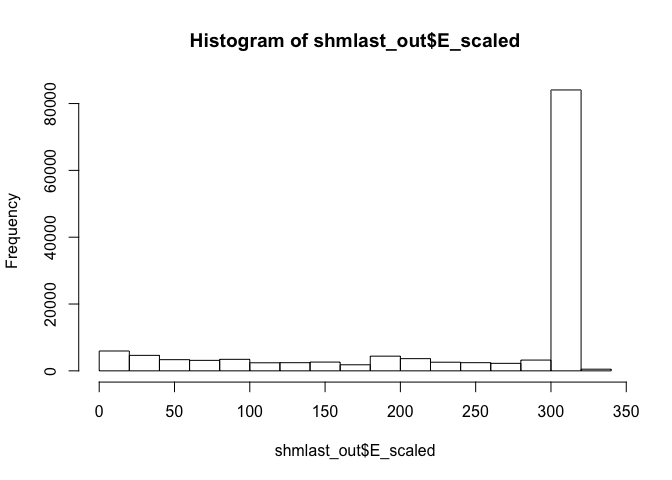

Class 16: Introduction to UNIX
================

``` r
library(bio3d)
```

``` r
tsv <- read.csv("mm-second.x.zebrafish.tsv", sep = "")
head(tsv)
```

    ##   YP_220550.1    NP_059331.1 X69.010 X313 X97 X0  X4 X316 X10 X322
    ## 1 YP_220551.1    NP_059332.1  44.509  346 188  3   1  344   1  344
    ## 2 YP_220551.1    NP_059341.1  24.540  163 112  3 112  263 231  393
    ## 3 YP_220551.1    NP_059340.1  26.804   97  65  2  98  188 200  296
    ## 4 YP_220552.1    NP_059333.1  88.132  514  61  0   1  514   1  514
    ## 5 YP_220552.1 XP_021326074.1  31.818   66  32  2 427  482  16   78
    ## 6 YP_220552.1 XP_005162943.1  31.818   66  32  2 427  482  48  110
    ##   X1.24e.150  X426
    ## 1   8.62e-92 279.0
    ## 2   5.14e-06  49.7
    ## 3   1.00e-01  35.8
    ## 4   0.00e+00 877.0
    ## 5   6.70e+00  29.3
    ## 6   7.50e+00  29.6

Make a histogram of the $bitscore values. You may want to set the optional breaks to be a larger number (e.g. breaks=30).

``` r
colnames(tsv)
```

    ##  [1] "YP_220550.1" "NP_059331.1" "X69.010"     "X313"        "X97"        
    ##  [6] "X0"          "X4"          "X316"        "X10"         "X322"       
    ## [11] "X1.24e.150"  "X426"

``` r
colnames(tsv) <- c("qseqid", "sseqid", "pident", "length", "mismatch", "gapopen", "qstart", "qend", "sstart", "send", "evalue", "bitscore")

hist(tsv$bitscore)
```


``` r
hist(tsv$bitscore, breaks = 30)
```

 The answer is that bitscores are only somewhat related to pident; they take into account not only the percent identity but the length of the alignment. You can get a napkin sketch estimate of this by doing the following:

``` r
plot(tsv$pident  * (tsv$qend - tsv$qstart), tsv$bitscore)
```


Or using ggplot (note you will have to install the ggplot2 package first if you are working on JetStream)

``` r
library("ggplot2")
```

``` r
ggplot(tsv, aes(pident, bitscore)) + geom_point(alpha=0.1) 
```


``` r
ggplot(tsv, aes((tsv$pident * (tsv$qend - tsv$qstart)), bitscore)) + geom_point(alpha=0.1) + geom_smooth(aes((tsv$pident * (tsv$qend - tsv$qstart)), bitscore))
```

    ## `geom_smooth()` using method = 'gam' and formula 'y ~ s(x, bs = "cs")'


Part 3
------

``` r
shmlast_out <- read.csv("mouse.1.rna.fna.gz.x.cow.faa.crbl.csv")
head(shmlast_out)
```

    ##          E      EG2  E_scaled     ID bitscore q_aln_len q_frame q_len
    ## 1  6.6e-24  9.8e-16  23.18046 641897 109.6580        89       1   390
    ## 2 5.4e-194 4.4e-165 193.26761 719314 605.7589       313       0   331
    ## 3 2.8e-188 5.0e-160 187.55284 423289 588.9869       307       0   323
    ## 4 6.6e-183 5.6e-155 182.18046 725159 572.2148       307       0   318
    ## 5 5.4e-194 4.4e-165 193.26761 719315 605.7589       313       0   331
    ## 6 2.8e-188 5.0e-160 187.55284 423290 588.9869       307       0   323
    ##                                                                     q_name
    ## 1 ref|NM_001013372.2| Mus musculus neural regeneration protein (Nrp), mRNA
    ## 2     ref|NM_207235.1| Mus musculus olfactory receptor 358 (Olfr358), mRNA
    ## 3     ref|NM_146368.1| Mus musculus olfactory receptor 361 (Olfr361), mRNA
    ## 4     ref|NM_146622.1| Mus musculus olfactory receptor 360 (Olfr360), mRNA
    ## 5     ref|NM_207235.1| Mus musculus olfactory receptor 358 (Olfr358), mRNA
    ## 6     ref|NM_146368.1| Mus musculus olfactory receptor 361 (Olfr361), mRNA
    ##   q_start q_strand s_aln_len s_len
    ## 1      64        +        89   389
    ## 2       0        +       313   313
    ## 3       0        +       307   313
    ## 4       0        +       307   313
    ## 5       0        +       313   313
    ## 6       0        +       307   313
    ##                                                                                    s_name
    ## 1 ref|XP_005212262.1| PREDICTED: DNA oxidative demethylase ALKBH1 isoform X1 [Bos taurus]
    ## 2                        ref|XP_607965.3| PREDICTED: olfactory receptor 1361 [Bos taurus]
    ## 3                        ref|XP_607965.3| PREDICTED: olfactory receptor 1361 [Bos taurus]
    ## 4                        ref|XP_607965.3| PREDICTED: olfactory receptor 1361 [Bos taurus]
    ## 5                     ref|XP_002691614.1| PREDICTED: olfactory receptor 1361 [Bos taurus]
    ## 6                     ref|XP_002691614.1| PREDICTED: olfactory receptor 1361 [Bos taurus]
    ##   s_start s_strand score
    ## 1       0        +   241
    ## 2       0        +  1365
    ## 3       0        +  1327
    ## 4       0        +  1289
    ## 5       0        +  1365
    ## 6       0        +  1327

``` r
View(shmlast_out)
dim(shmlast_out)
```

    ## [1] 132900     17

Let’s do some data visualization to get a handle on what our blast output looked like: first, let’s look at the E\_scaled column.

``` r
hist(shmlast_out$E_scaled)
```



We can take a look at some more stats – let’s look at the bitscore column:

``` r
hist(shmlast_out$bitscore)
```


We can also look at the length of the queries, which are the mouse sequences in this case.

``` r
hist(shmlast_out$q_len)
```


``` r
plot(shmlast_out$q_len, shmlast_out$bitscore)
```


``` r
shmlast_sub = shmlast_out[sample(nrow(shmlast_out), 10),]
View(shmlast_sub)
```

``` r
tmp <- subset(shmlast_out, q_len >= 8000 & q_len <= 11000 & bitscore <=2000)
functions <- tmp[, c("q_name", "s_name")]
```
