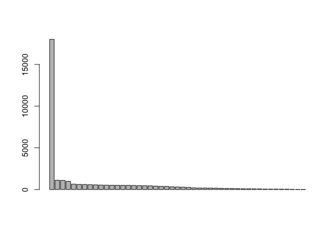
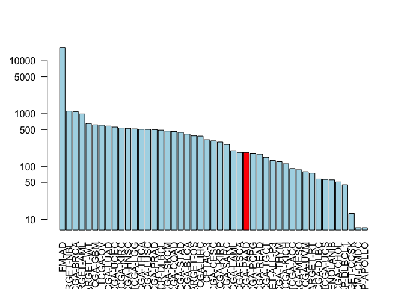

Class 18: Cancer Genomics
================

Accessing the Genomic Data Commons
----------------------------------

We need the bioconductor package **GenomicDataCommons**

eval=FALSE means that the knitting will treat this part as a comment (aka it won't run it)

``` r
BiocManager::install("GenomicDataCommons")
```

Let's use this package to ping the database.

``` r
source("https://bioconductor.org/biocLite.R")
biocLite(c("GenomicDataCommons", "TCGAbiolinks", "maftools"))
```

Once installed, load the packages, as usual.

``` r
library(GenomicDataCommons)
```

    ## Loading required package: magrittr

    ## 
    ## Attaching package: 'GenomicDataCommons'

    ## The following object is masked from 'package:stats':
    ## 
    ##     filter

``` r
library(TCGAbiolinks)
#library(maftools)
```

However, an error pops up when we try to load maftools. "there is no package called 'rngtools'" We need to download an older version of rngtools that's compatible with our version of R (3.5). Copy the link address and then paste it in the spot where it says "URL" down below.

curl -O URL R CMD INSTALL rng(tab)

Now we can try rerunning library to load the packages and it should work now!

``` r
library(maftools)
```

``` r
status()
```

    ## $commit
    ## [1] "e588f035feefee17f562b3a1bc2816c49a2b2b19"
    ## 
    ## $data_release
    ## [1] "Data Release 16.0 - March 26, 2019"
    ## 
    ## $status
    ## [1] "OK"
    ## 
    ## $tag
    ## [1] "1.20.0"
    ## 
    ## $version
    ## [1] 1

Querying the GDC from R
-----------------------

The are four main sets of metadata that we can query, namely projects(), cases(), files(), and annotations(). We will start with projects()

``` r
projects <- getGDCprojects()
head(projects)
```

    ##   dbgap_accession_number
    ## 1                   <NA>
    ## 2              phs000466
    ## 3                   <NA>
    ## 4                   <NA>
    ## 5              phs001444
    ## 6              phs000471
    ##                                                          disease_type
    ## 1 Cystic, Mucinous and Serous Neoplasms, Adenomas and Adenocarcinomas
    ## 2                                    Clear Cell Sarcoma of the Kidney
    ## 3                                               Mesothelial Neoplasms
    ## 4                                        Adenomas and Adenocarcinomas
    ## 5                     Lymphoid Neoplasm Diffuse Large B-cell Lymphoma
    ## 6                                               High-Risk Wilms Tumor
    ##   releasable released state
    ## 1      FALSE     TRUE  open
    ## 2      FALSE     TRUE  open
    ## 3      FALSE     TRUE  open
    ## 4      FALSE     TRUE  open
    ## 5      FALSE     TRUE  open
    ## 6      FALSE     TRUE  open
    ##                                                                                     primary_site
    ## 1 Rectosigmoid junction, Unknown, Rectum, Colon, Connective, subcutaneous and other soft tissues
    ## 2                                                                                         Kidney
    ## 3                                              Heart, mediastinum, and pleura, Bronchus and lung
    ## 4   Other and unspecified parts of biliary tract, Gallbladder, Liver and intrahepatic bile ducts
    ## 5                                                                                    Lymph Nodes
    ## 6                                                                                         Kidney
    ##     project_id           id
    ## 1    TCGA-READ    TCGA-READ
    ## 2  TARGET-CCSK  TARGET-CCSK
    ## 3    TCGA-MESO    TCGA-MESO
    ## 4    TCGA-CHOL    TCGA-CHOL
    ## 5 NCICCR-DLBCL NCICCR-DLBCL
    ## 6    TARGET-WT    TARGET-WT
    ##                                                  name tumor
    ## 1                               Rectum Adenocarcinoma  READ
    ## 2                    Clear Cell Sarcoma of the Kidney  CCSK
    ## 3                                        Mesothelioma  MESO
    ## 4                                  Cholangiocarcinoma  CHOL
    ## 5 Genomic Variation in Diffuse Large B Cell Lymphomas DLBCL
    ## 6                               High-Risk Wilms Tumor    WT

``` r
cases_by_project <- cases() %>%
  facet("project.project_id") %>%
  aggregations()
head(cases_by_project)
```

    ## $project.project_id
    ##               key doc_count
    ## 1           FM-AD     18004
    ## 2      TARGET-NBL      1127
    ## 3       TCGA-BRCA      1098
    ## 4      TARGET-AML       988
    ## 5       TARGET-WT       652
    ## 6        TCGA-GBM       617
    ## 7         TCGA-OV       608
    ## 8       TCGA-LUAD       585
    ## 9       TCGA-UCEC       560
    ## 10      TCGA-KIRC       537
    ## 11      TCGA-HNSC       528
    ## 12       TCGA-LGG       516
    ## 13      TCGA-THCA       507
    ## 14      TCGA-LUSC       504
    ## 15      TCGA-PRAD       500
    ## 16   NCICCR-DLBCL       489
    ## 17      TCGA-SKCM       470
    ## 18      TCGA-COAD       461
    ## 19      TCGA-STAD       443
    ## 20      TCGA-BLCA       412
    ## 21      TARGET-OS       381
    ## 22      TCGA-LIHC       377
    ## 23        CPTAC-3       322
    ## 24      TCGA-CESC       307
    ## 25      TCGA-KIRP       291
    ## 26      TCGA-SARC       261
    ## 27      TCGA-LAML       200
    ## 28      TCGA-ESCA       185
    ## 29      TCGA-PAAD       185
    ## 30      TCGA-PCPG       179
    ## 31      TCGA-READ       172
    ## 32      TCGA-TGCT       150
    ## 33  TARGET-ALL-P3       131
    ## 34      TCGA-THYM       124
    ## 35      TCGA-KICH       113
    ## 36       TCGA-ACC        92
    ## 37      TCGA-MESO        87
    ## 38       TCGA-UVM        80
    ## 39      TARGET-RT        75
    ## 40      TCGA-DLBC        58
    ## 41       TCGA-UCS        57
    ## 42      TCGA-CHOL        51
    ## 43    CTSP-DLBCL1        45
    ## 44    TARGET-CCSK        13
    ## 45 VAREPOP-APOLLO         7

Q9. Write the R code to make a barplot of the cases per project. Lets plot this data with a log scale for the y axis (log="y"), rotated axis labels (las=2) and color the bar coresponding to the TCGA-PAAD project.

``` r
x <- cases_by_project$project.project_id
head(x) 
```

    ##          key doc_count
    ## 1      FM-AD     18004
    ## 2 TARGET-NBL      1127
    ## 3  TCGA-BRCA      1098
    ## 4 TARGET-AML       988
    ## 5  TARGET-WT       652
    ## 6   TCGA-GBM       617

``` r
# barplot requires a height argument, which is a vector of numbers
barplot(x$doc_count)
```



``` r
# Make a custom color vector for our plot
colvec <- rep("lightblue", nrow(x))
colvec[x$key=="TCGA-PAAD"] <- "red"

# Plot with 'log' for y axis and rotate labels with 'las'
#par(___)  
barplot(x$doc_count, names.arg = x$key, las = 2, log="y", col = colvec)
```



Part 2 of the lecture
---------------------

First, install the bio3d package so we can use the read.fasta function.

``` r
library("bio3d")
```

``` r
fasta <- read.fasta("~/Downloads/lecture18_sequences.fa")
```

``` r
seqs <- seqaln(fasta)
```

``` r
vec <- seqs$ali[1,] == seqs$ali[2,]
vec
```

    ##   [1]  TRUE  TRUE  TRUE  TRUE  TRUE  TRUE  TRUE  TRUE  TRUE  TRUE  TRUE
    ##  [12]  TRUE  TRUE  TRUE  TRUE  TRUE  TRUE  TRUE  TRUE  TRUE  TRUE  TRUE
    ##  [23]  TRUE  TRUE  TRUE  TRUE  TRUE  TRUE  TRUE  TRUE  TRUE  TRUE  TRUE
    ##  [34]  TRUE  TRUE  TRUE  TRUE  TRUE  TRUE  TRUE FALSE  TRUE  TRUE  TRUE
    ##  [45]  TRUE  TRUE  TRUE  TRUE  TRUE  TRUE  TRUE  TRUE  TRUE  TRUE  TRUE
    ##  [56]  TRUE  TRUE  TRUE  TRUE  TRUE  TRUE  TRUE  TRUE  TRUE FALSE  TRUE
    ##  [67]  TRUE  TRUE  TRUE  TRUE  TRUE  TRUE  TRUE  TRUE  TRUE  TRUE  TRUE
    ##  [78]  TRUE  TRUE  TRUE  TRUE  TRUE  TRUE  TRUE  TRUE  TRUE  TRUE  TRUE
    ##  [89]  TRUE  TRUE  TRUE  TRUE  TRUE  TRUE  TRUE  TRUE  TRUE  TRUE  TRUE
    ## [100]  TRUE  TRUE  TRUE  TRUE  TRUE  TRUE  TRUE  TRUE  TRUE  TRUE  TRUE
    ## [111]  TRUE  TRUE  TRUE  TRUE  TRUE  TRUE  TRUE  TRUE  TRUE  TRUE  TRUE
    ## [122]  TRUE  TRUE  TRUE  TRUE  TRUE  TRUE  TRUE  TRUE  TRUE  TRUE  TRUE
    ## [133]  TRUE  TRUE  TRUE  TRUE  TRUE  TRUE  TRUE  TRUE  TRUE  TRUE  TRUE
    ## [144]  TRUE  TRUE  TRUE  TRUE  TRUE  TRUE  TRUE  TRUE  TRUE  TRUE  TRUE
    ## [155]  TRUE  TRUE  TRUE  TRUE  TRUE  TRUE  TRUE  TRUE  TRUE  TRUE  TRUE
    ## [166]  TRUE  TRUE  TRUE  TRUE  TRUE  TRUE  TRUE  TRUE  TRUE  TRUE  TRUE
    ## [177]  TRUE  TRUE  TRUE  TRUE  TRUE  TRUE  TRUE  TRUE  TRUE  TRUE  TRUE
    ## [188]  TRUE  TRUE  TRUE  TRUE  TRUE  TRUE  TRUE  TRUE  TRUE  TRUE  TRUE
    ## [199]  TRUE  TRUE  TRUE  TRUE  TRUE  TRUE  TRUE  TRUE  TRUE  TRUE  TRUE
    ## [210]  TRUE  TRUE  TRUE FALSE  TRUE  TRUE  TRUE  TRUE  TRUE  TRUE  TRUE
    ## [221]  TRUE  TRUE  TRUE  TRUE  TRUE  TRUE  TRUE  TRUE  TRUE  TRUE  TRUE
    ## [232]  TRUE  TRUE  TRUE  TRUE  TRUE  TRUE  TRUE  TRUE  TRUE  TRUE  TRUE
    ## [243]  TRUE  TRUE  TRUE  TRUE  TRUE  TRUE  TRUE  TRUE  TRUE  TRUE  TRUE
    ## [254]  TRUE  TRUE  TRUE  TRUE  TRUE FALSE FALSE FALSE FALSE FALSE FALSE
    ## [265] FALSE FALSE FALSE FALSE FALSE FALSE FALSE FALSE FALSE FALSE FALSE
    ## [276] FALSE FALSE FALSE FALSE FALSE FALSE FALSE FALSE FALSE FALSE FALSE
    ## [287] FALSE FALSE FALSE FALSE FALSE FALSE FALSE FALSE FALSE FALSE FALSE
    ## [298] FALSE FALSE FALSE FALSE FALSE FALSE FALSE FALSE FALSE FALSE FALSE
    ## [309] FALSE FALSE FALSE FALSE FALSE FALSE FALSE FALSE FALSE FALSE FALSE
    ## [320] FALSE FALSE FALSE FALSE FALSE FALSE FALSE FALSE FALSE FALSE FALSE
    ## [331] FALSE FALSE FALSE FALSE FALSE FALSE FALSE FALSE FALSE FALSE FALSE
    ## [342] FALSE FALSE FALSE FALSE FALSE FALSE FALSE FALSE FALSE FALSE FALSE
    ## [353] FALSE FALSE FALSE FALSE FALSE FALSE FALSE FALSE FALSE FALSE FALSE
    ## [364] FALSE FALSE FALSE FALSE FALSE FALSE FALSE FALSE FALSE FALSE FALSE
    ## [375] FALSE FALSE FALSE FALSE FALSE FALSE FALSE FALSE FALSE FALSE FALSE
    ## [386] FALSE FALSE FALSE FALSE FALSE FALSE FALSE FALSE

``` r
# find indices where vec = 0
ind <- which(vec==0)


# Let's hard-code it to the 41-specific spot.
start.ind <- 41-8
end.ind <- 41 + 8

seqs$ali[1, start.ind:end.ind]
```

    ##  [1] "S" "P" "L" "P" "S" "Q" "A" "M" "D" "D" "L" "M" "L" "S" "P" "D" "D"

``` r
seqs$ali[2, start.ind:end.ind]
```

    ##  [1] "S" "P" "L" "P" "S" "Q" "A" "M" "L" "D" "L" "M" "L" "S" "P" "D" "D"

``` r
start.ind <- ind[1] - 8
start.ind
```

    ## [1] 33

``` r
end.ind <-  ind[1] + 8
end.ind
```

    ## [1] 49

``` r
df <- data.frame(1:length(ind), 1:length(ind))
df
```

    ##     X1.length.ind. X1.length.ind..1
    ## 1                1                1
    ## 2                2                2
    ## 3                3                3
    ## 4                4                4
    ## 5                5                5
    ## 6                6                6
    ## 7                7                7
    ## 8                8                8
    ## 9                9                9
    ## 10              10               10
    ## 11              11               11
    ## 12              12               12
    ## 13              13               13
    ## 14              14               14
    ## 15              15               15
    ## 16              16               16
    ## 17              17               17
    ## 18              18               18
    ## 19              19               19
    ## 20              20               20
    ## 21              21               21
    ## 22              22               22
    ## 23              23               23
    ## 24              24               24
    ## 25              25               25
    ## 26              26               26
    ## 27              27               27
    ## 28              28               28
    ## 29              29               29
    ## 30              30               30
    ## 31              31               31
    ## 32              32               32
    ## 33              33               33
    ## 34              34               34
    ## 35              35               35
    ## 36              36               36
    ## 37              37               37
    ## 38              38               38
    ## 39              39               39
    ## 40              40               40
    ## 41              41               41
    ## 42              42               42
    ## 43              43               43
    ## 44              44               44
    ## 45              45               45
    ## 46              46               46
    ## 47              47               47
    ## 48              48               48
    ## 49              49               49
    ## 50              50               50
    ## 51              51               51
    ## 52              52               52
    ## 53              53               53
    ## 54              54               54
    ## 55              55               55
    ## 56              56               56
    ## 57              57               57
    ## 58              58               58
    ## 59              59               59
    ## 60              60               60
    ## 61              61               61
    ## 62              62               62
    ## 63              63               63
    ## 64              64               64
    ## 65              65               65
    ## 66              66               66
    ## 67              67               67
    ## 68              68               68
    ## 69              69               69
    ## 70              70               70
    ## 71              71               71
    ## 72              72               72
    ## 73              73               73
    ## 74              74               74
    ## 75              75               75
    ## 76              76               76
    ## 77              77               77
    ## 78              78               78
    ## 79              79               79
    ## 80              80               80
    ## 81              81               81
    ## 82              82               82
    ## 83              83               83
    ## 84              84               84
    ## 85              85               85
    ## 86              86               86
    ## 87              87               87
    ## 88              88               88
    ## 89              89               89
    ## 90              90               90
    ## 91              91               91
    ## 92              92               92
    ## 93              93               93
    ## 94              94               94
    ## 95              95               95
    ## 96              96               96
    ## 97              97               97
    ## 98              98               98
    ## 99              99               99
    ## 100            100              100
    ## 101            101              101
    ## 102            102              102
    ## 103            103              103
    ## 104            104              104
    ## 105            105              105
    ## 106            106              106
    ## 107            107              107
    ## 108            108              108
    ## 109            109              109
    ## 110            110              110
    ## 111            111              111
    ## 112            112              112
    ## 113            113              113
    ## 114            114              114
    ## 115            115              115
    ## 116            116              116
    ## 117            117              117
    ## 118            118              118
    ## 119            119              119
    ## 120            120              120
    ## 121            121              121
    ## 122            122              122
    ## 123            123              123
    ## 124            124              124
    ## 125            125              125
    ## 126            126              126
    ## 127            127              127
    ## 128            128              128
    ## 129            129              129
    ## 130            130              130
    ## 131            131              131
    ## 132            132              132
    ## 133            133              133
    ## 134            134              134
    ## 135            135              135
    ## 136            136              136
    ## 137            137              137
    ## 138            138              138

``` r
df[1, 1] = start.ind
df[1, 2] = end.ind

df
```

    ##     X1.length.ind. X1.length.ind..1
    ## 1               33               49
    ## 2                2                2
    ## 3                3                3
    ## 4                4                4
    ## 5                5                5
    ## 6                6                6
    ## 7                7                7
    ## 8                8                8
    ## 9                9                9
    ## 10              10               10
    ## 11              11               11
    ## 12              12               12
    ## 13              13               13
    ## 14              14               14
    ## 15              15               15
    ## 16              16               16
    ## 17              17               17
    ## 18              18               18
    ## 19              19               19
    ## 20              20               20
    ## 21              21               21
    ## 22              22               22
    ## 23              23               23
    ## 24              24               24
    ## 25              25               25
    ## 26              26               26
    ## 27              27               27
    ## 28              28               28
    ## 29              29               29
    ## 30              30               30
    ## 31              31               31
    ## 32              32               32
    ## 33              33               33
    ## 34              34               34
    ## 35              35               35
    ## 36              36               36
    ## 37              37               37
    ## 38              38               38
    ## 39              39               39
    ## 40              40               40
    ## 41              41               41
    ## 42              42               42
    ## 43              43               43
    ## 44              44               44
    ## 45              45               45
    ## 46              46               46
    ## 47              47               47
    ## 48              48               48
    ## 49              49               49
    ## 50              50               50
    ## 51              51               51
    ## 52              52               52
    ## 53              53               53
    ## 54              54               54
    ## 55              55               55
    ## 56              56               56
    ## 57              57               57
    ## 58              58               58
    ## 59              59               59
    ## 60              60               60
    ## 61              61               61
    ## 62              62               62
    ## 63              63               63
    ## 64              64               64
    ## 65              65               65
    ## 66              66               66
    ## 67              67               67
    ## 68              68               68
    ## 69              69               69
    ## 70              70               70
    ## 71              71               71
    ## 72              72               72
    ## 73              73               73
    ## 74              74               74
    ## 75              75               75
    ## 76              76               76
    ## 77              77               77
    ## 78              78               78
    ## 79              79               79
    ## 80              80               80
    ## 81              81               81
    ## 82              82               82
    ## 83              83               83
    ## 84              84               84
    ## 85              85               85
    ## 86              86               86
    ## 87              87               87
    ## 88              88               88
    ## 89              89               89
    ## 90              90               90
    ## 91              91               91
    ## 92              92               92
    ## 93              93               93
    ## 94              94               94
    ## 95              95               95
    ## 96              96               96
    ## 97              97               97
    ## 98              98               98
    ## 99              99               99
    ## 100            100              100
    ## 101            101              101
    ## 102            102              102
    ## 103            103              103
    ## 104            104              104
    ## 105            105              105
    ## 106            106              106
    ## 107            107              107
    ## 108            108              108
    ## 109            109              109
    ## 110            110              110
    ## 111            111              111
    ## 112            112              112
    ## 113            113              113
    ## 114            114              114
    ## 115            115              115
    ## 116            116              116
    ## 117            117              117
    ## 118            118              118
    ## 119            119              119
    ## 120            120              120
    ## 121            121              121
    ## 122            122              122
    ## 123            123              123
    ## 124            124              124
    ## 125            125              125
    ## 126            126              126
    ## 127            127              127
    ## 128            128              128
    ## 129            129              129
    ## 130            130              130
    ## 131            131              131
    ## 132            132              132
    ## 133            133              133
    ## 134            134              134
    ## 135            135              135
    ## 136            136              136
    ## 137            137              137
    ## 138            138              138

``` r
# for (i in 1) {
#   start.ind <- ind[i] - 8
#   end.ind <- ind[i] + 8
#   
#   df[1, i] <- seqs$ali[1, start.ind:end.ind]
#   df[i, 2] <- seqs$ali[2, start.ind:end.ind]
# }
```

Find the sites (i.e. amino acids that are different)

This looks for mismatch spots using conserv.

``` r
ide <- conserv(seqs, method = "identity")
ide < 1
```

    ##   [1] FALSE FALSE FALSE FALSE FALSE FALSE FALSE FALSE FALSE FALSE FALSE
    ##  [12] FALSE FALSE FALSE FALSE FALSE FALSE FALSE FALSE FALSE FALSE FALSE
    ##  [23] FALSE FALSE FALSE FALSE FALSE FALSE FALSE FALSE FALSE FALSE FALSE
    ##  [34] FALSE FALSE FALSE FALSE FALSE FALSE FALSE  TRUE FALSE FALSE FALSE
    ##  [45] FALSE FALSE FALSE FALSE FALSE FALSE FALSE FALSE FALSE FALSE FALSE
    ##  [56] FALSE FALSE FALSE FALSE FALSE FALSE FALSE FALSE FALSE  TRUE FALSE
    ##  [67] FALSE FALSE FALSE FALSE FALSE FALSE FALSE FALSE FALSE FALSE FALSE
    ##  [78] FALSE FALSE FALSE FALSE FALSE FALSE FALSE FALSE FALSE FALSE FALSE
    ##  [89] FALSE FALSE FALSE FALSE FALSE FALSE FALSE FALSE FALSE FALSE FALSE
    ## [100] FALSE FALSE FALSE FALSE FALSE FALSE FALSE FALSE FALSE FALSE FALSE
    ## [111] FALSE FALSE FALSE FALSE FALSE FALSE FALSE FALSE FALSE FALSE FALSE
    ## [122] FALSE FALSE FALSE FALSE FALSE FALSE FALSE FALSE FALSE FALSE FALSE
    ## [133] FALSE FALSE FALSE FALSE FALSE FALSE FALSE FALSE FALSE FALSE FALSE
    ## [144] FALSE FALSE FALSE FALSE FALSE FALSE FALSE FALSE FALSE FALSE FALSE
    ## [155] FALSE FALSE FALSE FALSE FALSE FALSE FALSE FALSE FALSE FALSE FALSE
    ## [166] FALSE FALSE FALSE FALSE FALSE FALSE FALSE FALSE FALSE FALSE FALSE
    ## [177] FALSE FALSE FALSE FALSE FALSE FALSE FALSE FALSE FALSE FALSE FALSE
    ## [188] FALSE FALSE FALSE FALSE FALSE FALSE FALSE FALSE FALSE FALSE FALSE
    ## [199] FALSE FALSE FALSE FALSE FALSE FALSE FALSE FALSE FALSE FALSE FALSE
    ## [210] FALSE FALSE FALSE  TRUE FALSE FALSE FALSE FALSE FALSE FALSE FALSE
    ## [221] FALSE FALSE FALSE FALSE FALSE FALSE FALSE FALSE FALSE FALSE FALSE
    ## [232] FALSE FALSE FALSE FALSE FALSE FALSE FALSE FALSE FALSE FALSE FALSE
    ## [243] FALSE FALSE FALSE FALSE FALSE FALSE FALSE FALSE FALSE FALSE FALSE
    ## [254] FALSE FALSE FALSE FALSE FALSE  TRUE  TRUE  TRUE  TRUE  TRUE  TRUE
    ## [265]  TRUE  TRUE  TRUE  TRUE  TRUE  TRUE  TRUE  TRUE  TRUE  TRUE  TRUE
    ## [276]  TRUE  TRUE  TRUE  TRUE  TRUE  TRUE  TRUE  TRUE  TRUE  TRUE  TRUE
    ## [287]  TRUE  TRUE  TRUE  TRUE  TRUE  TRUE  TRUE  TRUE  TRUE  TRUE  TRUE
    ## [298]  TRUE  TRUE  TRUE  TRUE  TRUE  TRUE  TRUE  TRUE  TRUE  TRUE  TRUE
    ## [309]  TRUE  TRUE  TRUE  TRUE  TRUE  TRUE  TRUE  TRUE  TRUE  TRUE  TRUE
    ## [320]  TRUE  TRUE  TRUE  TRUE  TRUE  TRUE  TRUE  TRUE  TRUE  TRUE  TRUE
    ## [331]  TRUE  TRUE  TRUE  TRUE  TRUE  TRUE  TRUE  TRUE  TRUE  TRUE  TRUE
    ## [342]  TRUE  TRUE  TRUE  TRUE  TRUE  TRUE  TRUE  TRUE  TRUE  TRUE  TRUE
    ## [353]  TRUE  TRUE  TRUE  TRUE  TRUE  TRUE  TRUE  TRUE  TRUE  TRUE  TRUE
    ## [364]  TRUE  TRUE  TRUE  TRUE  TRUE  TRUE  TRUE  TRUE  TRUE  TRUE  TRUE
    ## [375]  TRUE  TRUE  TRUE  TRUE  TRUE  TRUE  TRUE  TRUE  TRUE  TRUE  TRUE
    ## [386]  TRUE  TRUE  TRUE  TRUE  TRUE  TRUE  TRUE  TRUE

``` r
mismatch.inds <- which(ide<1)
mismatch.inds
```

    ##   [1]  41  65 213 259 260 261 262 263 264 265 266 267 268 269 270 271 272
    ##  [18] 273 274 275 276 277 278 279 280 281 282 283 284 285 286 287 288 289
    ##  [35] 290 291 292 293 294 295 296 297 298 299 300 301 302 303 304 305 306
    ##  [52] 307 308 309 310 311 312 313 314 315 316 317 318 319 320 321 322 323
    ##  [69] 324 325 326 327 328 329 330 331 332 333 334 335 336 337 338 339 340
    ##  [86] 341 342 343 344 345 346 347 348 349 350 351 352 353 354 355 356 357
    ## [103] 358 359 360 361 362 363 364 365 366 367 368 369 370 371 372 373 374
    ## [120] 375 376 377 378 379 380 381 382 383 384 385 386 387 388 389 390 391
    ## [137] 392 393

``` r
attributes(ide)
```

    ## NULL

This looks for positions in which gaps exist (using gap.inspect).

``` r
gaps <- gap.inspect(seqs)
gaps.inds <- gaps$t.inds
gaps.inds
```

    ##   [1] 260 261 262 263 264 265 266 267 268 269 270 271 272 273 274 275 276
    ##  [18] 277 278 279 280 281 282 283 284 285 286 287 288 289 290 291 292 293
    ##  [35] 294 295 296 297 298 299 300 301 302 303 304 305 306 307 308 309 310
    ##  [52] 311 312 313 314 315 316 317 318 319 320 321 322 323 324 325 326 327
    ##  [69] 328 329 330 331 332 333 334 335 336 337 338 339 340 341 342 343 344
    ##  [86] 345 346 347 348 349 350 351 352 353 354 355 356 357 358 359 360 361
    ## [103] 362 363 364 365 366 367 368 369 370 371 372 373 374 375 376 377 378
    ## [120] 379 380 381 382 383 384 385 386 387 388 389 390 391 392 393

``` r
a <- 1:5
b <- 4:7
a[a %in% b]
```

    ## [1] 4 5

``` r
a[!a %in% b]
```

    ## [1] 1 2 3

Find the positions in mismatch.inds that are NOT in gaps.inds

``` r
tumor.sites <- mismatch.inds[!mismatch.inds %in% gaps.inds]
```

``` r
seqs$ali[,tumor.sites]
```

    ##            [,1] [,2] [,3] [,4]
    ## P53_wt     "D"  "R"  "R"  "D" 
    ## P53_mutant "L"  "W"  "V"  "V"

``` r
ids <- paste(seqs$ali[1, tumor.sites], 
      tumor.sites, 
      seqs$ali[2, tumor.sites], sep ="")
ids
```

    ## [1] "D41L"  "R65W"  "R213V" "D259V"

``` r
start.ind <- tumor.sites - 8
end.ind <-  tumor.sites + 8

tumor <-  NULL

for (i in 1:length(start.ind)) {
  tumor <-  seqbind(tumor, 
                    seqs$ali[2, start.ind[i]: end.ind[i]])
}

tumor
```

    ##        1        .      17 
    ## seq1   SPLPSQAMLDLMLSPDD
    ## seq2   DPGPDEAPWMPEAAPPV
    ## seq3   YLDDRNTFVHSVVVPYE
    ## seq4   ILTIITLEV--------
    ##                          
    ##        1        .      17 
    ## 
    ## Call:
    ##   seqbind(tumor, seqs$ali[2, start.ind[i]:end.ind[i]])
    ## 
    ## Class:
    ##   fasta
    ## 
    ## Alignment dimensions:
    ##   4 sequence rows; 17 position columns (9 non-gap, 8 gap) 
    ## 
    ## + attr: id, ali, call

``` r
write.fasta(ids = ids, ali = tumor, file = "subsequences.fa")
```
